# 企业内部 AI 平台 — 系统架构设计文档

> **文档版本**: v1.4.1（修复多渠道并发场景下动态记忆隔离缺口：retrieve_dynamic_memory 两段式检索 + session_id 命名规范 + ADR-20）
> **创建日期**: 2026-07-04
> **编写人**: 高见远（Gao）— 架构师
> **依据**: ai-platform-prd.md v1.4
> **文档状态**: 待评审
>
> **v1.4.1 变更记录**：
> - **多渠道记忆隔离修复**：修复 `retrieve_dynamic_memory` 方法在多渠道并发场景下会话级记忆跨渠道泄漏的缺陷。原方法仅按 `agent_name + user_id` 过滤，未区分用户级记忆与会话级记忆，导致同一用户在 Web 端和企业微信端同时使用时会话上下文互相干扰。改为**两段式检索**：批次1（用户级，`session_id IS NULL`）跨渠道共享 preference/decision/context 记忆；批次2（会话级，`session_id = 当前会话`）严格隔离 summary/context 记忆。新增 **session_id 命名规范**（渠道前缀 + UUID，如 `web-{uuid}` / `wecom-bot-{uuid}` / `wecom-h5-{uuid}`），支持通过前缀识别来源渠道。新增 **ADR-20**（多渠道记忆隔离策略）。更新 17.3.2 Qdrant payload 设计说明、17.4 方法实现、17.5 时序图、17.6 上下文组装说明
>
> **v1.4 变更记录**：
> - **Agent 记忆机制（新增）**：每个 Agent 配置目录新增 `memory/` 子目录（agent-memory.yaml + personality.md + facts/）；新增 MemoryManager 类负责分层记忆注入（静态记忆加载 → 动态记忆 Qdrant 语义检索 Top-K → 上下文组装）；新增 PostgreSQL `agent_memory` 表（存储动态记忆条目）+ Qdrant `agent_memory_index` collection（向量索引，复用 bge-small-zh-v1.5）；新增 MemoryInjector 中间件（在 Agent 运行前注入记忆上下文）；新增记忆写入策略（preference/decision/summary/context 四类）与遗忘策略（TTL/容量上限/重要性衰减）；agent.yaml 新增 memory 配置段；新增 ADR-19
>
> **v1.3 变更记录**：
> - **企业微信智能机器人渠道（新增第三渠道）**：新增 WecomBotAdapter（WebSocket长连接消息适配）、WecomBotClient（WebSocket客户端，心跳/重连）、ChannelCapability 接口（渠道能力声明）、EventTransformer 升级为能力感知降级器（AgentEvent → 渠道格式映射）；Bot 渠道仅支持 6 种 template_card，不支持流式/Generative UI；新增渠道能力矩阵（三渠道 × 11 维度）；新增 Bot 渠道时序图
> - **Agent 后台自动路由（AgentRouter）**：新增 AgentRouter 类 + 4 级路由策略链（SessionAffinityStrategy / KeywordMatchStrategy / SemanticSearchStrategy / DefaultFallbackStrategy）；AgentConfig 新增 routing 配置段；路由日志表设计；语义检索复用 Qdrant + bge-small-zh-v1.5（与 Skills 检索共用向量库，不同 collection）；新增路由时序图；前端不提供 Agent/运行时选择功能
> - **LLM 厂家 API 服务 + 网关层**：LLM 通过购买厂家 API 服务使用（不自建 GPU 集群）；新增 LLMGateway（统一API入口、多厂家路由、故障切换）、APIKeyManager（Key池管理/轮转）、QuotaManager（Token配额/限流/告警）、OutboundProxyManager（内网出站代理池/负载均衡/健康检查/访问白名单）、TokenTracker（Token用量追踪）；更新部署架构图新增出站代理层
> - **配置目录结构设计**：新增 ConfigManager 双模式设计（文件系统 + 数据库）、ConfigWatcher 热更新机制；agent.yaml 完整 schema（含 routing 段、model 段引用 LLM 网关）；configs/agents/{agent_name}/ 目录结构详细设计
> - **内网部署 + 出站代理**：更新部署架构图标注出站代理层；更新 Docker Compose 新增 outbound-proxy 服务；出站代理安全设计（访问白名单、请求审计日志）；Embedding 模型 bge-small-zh-v1.5 内网部署确认
> - **ADR 新增**：ADR-15（企业微信Bot渠道与能力降级）、ADR-16（Agent后台自动路由）、ADR-17（LLM厂家API服务+网关+出站代理）、ADR-18（配置目录结构与热更新）
> - **LLM 适配层重构**：从 v1.2 的"国产模型适配层（ModelProvider 抽象）"升级为"LLM 网关层（LLMGateway + APIKeyManager + QuotaManager + OutboundProxyManager + TokenTracker）"
>
> **v1.2 变更记录**：
> - 微信机器人：从项目范围彻底删除（WechatBotAdapter/WechatBotClient/相关类图/时序图/ADR-09 全部移除）
> - LLM 选型：明确为 deepseek-v4-flash（主力）+ qwen3.6-plus（复杂推理），文心/智谱标注为可选扩展
> - Skills 分类：新增 CRM 系统（~80 Skills）+ 储值卡系统（~70 Skills），分类总数 ~500 → ~670
> - 业务系统适配层：新增 BusinessSystemAdapter 抽象，统一封装各业务系统异构 API 为标准 MCP Server 接口
> - SSO/OAuth 集成：企业微信 OAuth2 直连 + 本地 JWT（不引入独立 IdP），新增业务系统凭证托管设计
> - ADR 新增 ADR-13（业务系统适配层）、ADR-14（企业微信直连 + 本地 JWT）
>
> **v1.1 变更记录**：
> - 企业微信：H5 嵌入工作台 + JS-SDK（非原生 API 卡片），CopilotKit 完整运行在 H5 内
> - LLM：国产供应商适配层（通义千问/文心/智谱/DeepSeek），增加 ModelProvider 抽象
> - 部署：全内网部署，Docker Compose 即可覆盖 100-200 并发，无需 K8s
> - Skills 分类：按业务系统划分（财务/超市管理/百货管理/人事/物业）
> - 容量规划：100-200 用户并发，单实例可覆盖，降低吞吐要求

---

## 目录

1. [实现方案概述与框架选型](#1-实现方案概述与框架选型)
2. [系统架构图](#2-系统架构图)
3. [文件列表及相对路径](#3-文件列表及相对路径)
4. [数据结构和接口（类图）](#4-数据结构和接口类图)
5. [程序调用流程（时序图）](#5-程序调用流程时序图)
6. [任务列表](#6-任务列表)
7. [依赖包列表](#7-依赖包列表)
8. [共享知识（跨文件约定）](#8-共享知识跨文件约定)
9. [670+ Skills 调度架构详细设计](#9-670-skills-调度架构详细设计)
10. [多运行时切换机制详细设计](#10-多运行时切换机制详细设计)
11. [SSO/OAuth 集成方案详细设计](#11-ssooauth-集成方案详细设计)
12. [待明确事项](#12-待明确事项)
13. [渠道适配与能力降级详细设计](#13-渠道适配与能力降级详细设计)
14. [AgentRouter 智能路由详细设计](#14-agentrouter-智能路由详细设计)
15. [LLM 网关层详细设计](#15-llm-网关层详细设计)
16. [配置目录结构详细设计](#16-配置目录结构详细设计)
17. [Agent 记忆机制详细设计](#17-agent-记忆机制详细设计)

---

## 1. 实现方案概述与框架选型

### 1.1 整体架构风格

采用 **模块化微服务架构**，按职责拆分为三个可独立部署的服务单元，通过内部 API 和消息队列协同：

| 服务 | 语言 | 职责 | 扩展性考量 |
|------|------|------|-----------|
| **Message Gateway** | TypeScript (Node.js) | 多渠道消息接入（企业微信 H5 / 企业微信智能机器人 Bot / 独立 H5）、协议适配、WebSocket 推送、AgentEvent 能力感知降级 | IO 密集型，水平扩展 |
| **Agent Core** | Python | Agent 生命周期管理、AgentRouter 智能路由、运行时抽象、Skills 调度、MCP 管理、HITL、LLM 网关（多厂家 API Key / 配额 / 出站代理 / Token 追踪） | CPU 密集型（LLM 调用），水平扩展 |
| **H5 Frontend** | TypeScript (React) | CopilotKit 动态 UI、管理后台、流式渲染 | 静态部署 + CDN |

**选型理由**：
- **Gateway 用 TypeScript**：企业微信 JS-SDK / Bot WebSocket 生态在 Node.js 更成熟，WebSocket/SSE 原生支持好，IO 并发性能优异
- **Agent Core 用 Python**：LLM 生态（LangChain/OpenAI SDK 兼容层/国产模型 SDK）、向量检索、MCP 客户端在 Python 最完善，异步框架 FastAPI 性能足够
- **前端用 React**：CopilotKit 原生 React 支持，Generative UI 依赖 React 组件树；企业微信 H5 和独立 H5 共用同一前端代码
- **全内网部署 + 出站代理**：所有组件（Qdrant/Redis/PostgreSQL/Embedding 模型 bge-small-zh-v1.5）均在内网部署；LLM API 请求通过内网出站代理访问厂家服务端点（deepseek/qwen），不自建 GPU 集群
- **Docker Compose 而非 K8s**：100-200 并发规模下 Docker Compose 足够，降低运维复杂度；如后续需扩容可平滑迁移至 K8s

### 1.2 技术栈最终选型

| 层面 | 选型 | 版本 | 理由 |
|------|------|------|------|
| **H5 动态 UI** | CopilotKit | ^1.x | Generative UI、AG-UI 协议、Headless UI 模式适配卡片场景 |
| **流式传输** | Vercel AI SDK | ^4.x | useChat Hook、Data Stream Protocol，作为 CopilotKit 底层补充 |
| **前端框架** | React | ^18.2 | CopilotKit 原生支持，生态成熟 |
| **前端构建** | Vite | ^5.x | 快速 HMR，ESM 原生支持 |
| **前端样式** | Tailwind CSS | ^3.4 | 原子化 CSS，快速迭代 |
| **前端状态** | Zustand | ^4.5 | 轻量级，无 Provider 嵌套，适合流式数据 |
| **Gateway 框架** | Fastify | ^4.x | 高性能 HTTP 框架，插件生态丰富 |
| **Gateway WebSocket** | ws | ^8.x | 轻量 WebSocket 库 |
| **后端框架** | FastAPI | ^0.111 | 异步原生、自动 OpenAPI 文档、Pydantic 集成 |
| **ORM** | SQLAlchemy | ^2.0 | Async support，成熟稳定 |
| **数据库迁移** | Alembic | ^1.13 | SQLAlchemy 官方迁移工具 |
| **向量数据库** | Qdrant | ^1.9 | 670+ Skills 规模下性能优秀，支持 payload 过滤，部署简单 |
| **关系数据库** | PostgreSQL | ^16 | 配置/会话/用户/审计存储，JSONB 支持灵活 schema |
| **缓存/消息队列** | Redis | ^7.2 | 热点 Skill 缓存 + Redis Streams 消息队列 + 会话状态 |
| **Agent 运行时** | OpenHarness | latest | 港大HKUDS开源Python Agent框架，MIT协议，43+工具，MCP客户端，Skills系统，权限系统，Swarm多Agent协调 |
| **LLM 网关层** | LLMGateway + APIKeyManager + QuotaManager + OutboundProxyManager + TokenTracker | — | 统一多厂家 API 入口（deepseek-v4-flash 主力 / qwen3.6-plus 备选），Key 轮转/故障切换，Token 配额/限流，内网出站代理池，Token 用量追踪；替代 v1.2 的 ModelProvider 抽象 |
| **MCP 客户端** | mcp Python SDK | latest | 官方 SDK，支持 stdio/HTTP/SSE |
| **认证** | PyJWT + cryptography + bcrypt | — | 本地 JWT 签发/验证（HS256）+ 企业微信 OAuth2 直连 + 密码哈希 + AES-256 凭证加密 |
| **日志** | structlog | ^24.x | 结构化 JSON 日志，便于 ELK 采集 |
| **容器化** | Docker + Compose | — | 内网开发/生产环境一键部署（100-200 并发） |
| **编排** | Docker Compose | — | 内网部署无需 K8s，后续扩容可迁移 |
| **反向代理** | Nginx | ^1.25 | 内网负载均衡、静态资源 |

### 1.3 系统部署架构

```
                    ┌──────────────────────────────────────────────┐
                    │           Nginx (内网反向代理)                  │
                    │           负载均衡 + 静态资源                    │
                    └──────┬──────────┬──────────┬────────────────────┘
                           │          │          │
                ┌──────────▼──┐ ┌─────▼─────┐ ┌──▼──────────┐
                │  H5 Frontend │ │  Gateway  │ │  Agent Core │
                │  (静态资源)   │ │ (N 副本)  │ │  (N 副本)   │
                │  CopilotKit  │ │ Fastify   │ │  FastAPI    │
                │              │ │ +Bot WS   │ │ +AgentRouter│
                └──────────────┘ │           │ │ +LLMGateway │
                                 └─────┬─────┘ └──┬──────────┘
                                       │           │
                          ┌────────────┼───────────┤
                          │            │           │
                ┌─────────▼──┐  ┌──────▼────┐ ┌───▼────────────┐
                │   Redis    │  │ PostgreSQL│ │   Qdrant       │
                │  Streams   │  │  (主从)    │ │ (向量索引)      │
                │  + Cache   │  │           │ │ + Embedding    │
                │            │  │           │ │ (bge-small-zh) │
                └────────────┘  └───────────┘ └────────────────┘
                          │
                ┌─────────▼──────────────────────┐
                │  内网出站代理层 (OutboundProxy)    │
                │  • 代理池 + 负载均衡              │
                │  • 健康检查 + 访问白名单           │
                │  • 请求审计日志                   │
                └──────────┬───────────────────────┘
                           │ (经出站代理访问厂家 API)
                ┌──────────▼──────────────────────┐
                │  厂家 LLM API (外网)              │
                │  • DeepSeek API (deepseek-v4-flash)│
                │  • Qwen API (qwen3.6-plus)        │
                └──────────────────────────────────┘
                ┌─────────────────────────────────┐
                │  内网外部依赖                     │
                │  • 企业微信 JS-SDK (内网代理)     │
                │  • 企业微信 Bot WebSocket         │
                │  • 业务系统 MCP Servers          │
                │    (财务/超市/百货/人事/物业      │
                │     /CRM/储值卡)                  │
                └────────────────────────────────┘
```

**部署要点**：
- Gateway 和 Agent Core 均无状态，通过 Redis 共享会话状态，支持水平扩展
- Redis Streams 作为 Gateway → Core 的异步消息通道，解耦消息接收与 Agent 处理
- Qdrant 独立部署，支持向量索引的独立扩缩（Skills 检索 + AgentRouter 语义检索共用，不同 collection）
- 生产环境 PostgreSQL 使用主从复制，确保高可用
- **LLM API 通过出站代理层访问**：内网所有 LLM 请求经由 OutboundProxyManager 管理的代理池转发至厂家 API 端点（deepseek/qwen），代理层执行访问白名单过滤和请求审计
- **Embedding 模型 bge-small-zh-v1.5 内网部署**：使用 sentence-transformers + ONNX Runtime 本地运行，不依赖外部 API

---

## 2. 系统架构图

### 2.1 C4 Container 级架构图

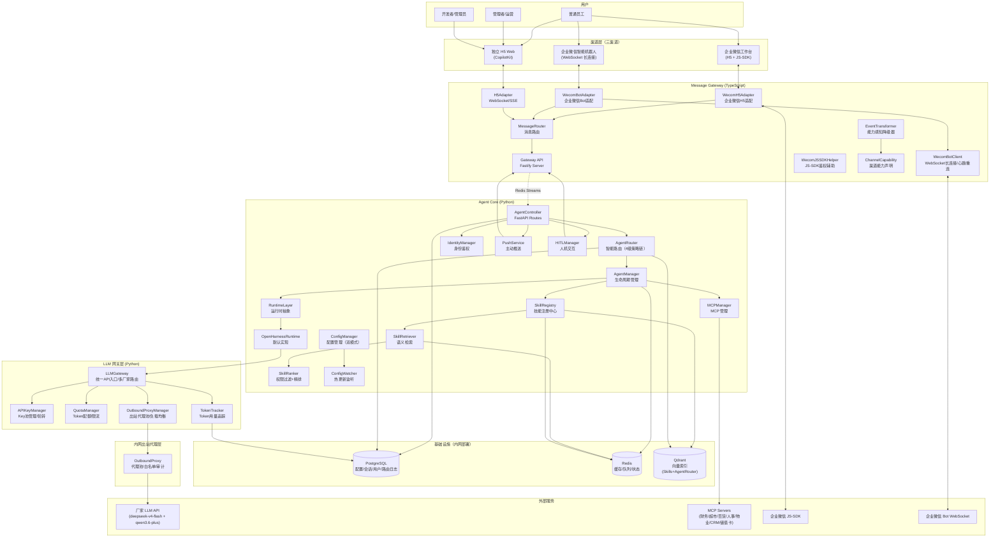
```mermaid
graph TB
    subgraph Users["用户"]
        U1["普通员工"]
        U2["管理者/运营"]
        U3["开发者/管理员"]
    end

    subgraph Channels["渠道层（三渠道）"]
        WC["企业微信工作台<br/>(H5 + JS-SDK)"]
        BOT["企业微信智能机器人<br/>(WebSocket 长连接)"]
        H5["独立 H5 Web<br/>(CopilotKit)"]
    end

    subgraph Gateway["Message Gateway (TypeScript)"]
        GA["Gateway API<br/>Fastify Server"]
        WA["WecomH5Adapter<br/>企业微信H5适配"]
        WBA["WecomBotAdapter<br/>企业微信Bot适配"]
        WBC["WecomBotClient<br/>WebSocket长连接/心跳/重连"]
        HA["H5Adapter<br/>WebSocket/SSE"]
        MR["MessageRouter<br/>消息路由"]
        CB["WecomJSSDKHelper<br/>JS-SDK鉴权辅助"]
        CC["ChannelCapability<br/>渠道能力声明"]
        ET["EventTransformer<br/>能力感知降级器"]
    end

    subgraph Core["Agent Core (Python)"]
        AC["AgentController<br/>FastAPI Routes"]
        AR["AgentRouter<br/>智能路由（4级策略链）"]
        AM["AgentManager<br/>生命周期管理"]
        RT["RuntimeLayer<br/>运行时抽象"]
        OHR["OpenHarnessRuntime<br/>默认实现"]
        SR["SkillRegistry<br/>技能注册中心"]
        SRet["SkillRetriever<br/>语义检索"]
        SRk["SkillRanker<br/>权限过滤+精排"]
        MC["MCPManager<br/>MCP 管理"]
        IDM["IdentityManager<br/>身份鉴权"]
        PS["PushService<br/>主动推送"]
        HM["HITLManager<br/>人机交互"]
        CM["ConfigManager<br/>配置管理（双模式）"]
        CW["ConfigWatcher<br/>热更新监听"]
    end

    subgraph LLMGateway["LLM 网关层 (Python)"]
        LGW["LLMGateway<br/>统一API入口/多厂家路由"]
        AKM["APIKeyManager<br/>Key池管理/轮转"]
        QM["QuotaManager<br/>Token配额/限流"]
        OPM["OutboundProxyManager<br/>出站代理池/负载均衡"]
        TT["TokenTracker<br/>Token用量追踪"]
    end

    subgraph Infra["基础设施（内网部署）"]
        PG[("PostgreSQL<br/>配置/会话/用户/路由日志")]
        RD[("Redis<br/>缓存/队列/状态")]
        QD[("Qdrant<br/>向量索引(Skills+AgentRouter)")]
    end

    subgraph Proxy["内网出站代理层"]
        OP["OutboundProxy<br/>代理池/白名单/审计"]
    end

    subgraph External["外部服务"]
        LLM["厂家 LLM API<br/>(deepseek-v4-flash + qwen3.6-plus)"]
        MCP["MCP Servers<br/>(财务/超市/百货/人事/物业/CRM/储值卡)"]
        WECOM["企业微信 JS-SDK"]
        WECOMBOT["企业微信 Bot WebSocket"]
    end

    U1 --> WC
    U1 --> BOT
    U1 & U2 & U3 --> H5

    WC <--> WA
    BOT <--> WBA
    WBA --> WBC
    WBC <--> WECOMBOT
    H5 <--> HA

    WA & WBA & HA --> MR
    MR --> GA
    GA -.->|"Redis Streams"| AC

    AC --> AR
    AR --> AM
    AM --> RT
    RT --> OHR
    AM --> SR
    SR --> SRet
    SRet --> SRk
    AM --> MC
    AC --> IDM
    AC --> PS
    AC --> HM
    CM --> CW

    OHR --> LGW
    LGW --> AKM
    LGW --> QM
    LGW --> OPM
    LGW --> TT
    OPM --> OP
    OP --> LLM

    MC --> MCP
    PS --> GA
    HM --> GA
    ET --> CC

    WA <--> WECOM

    AC --> PG
    AR --> PG
    SR --> QD
    AR --> QD
    AM --> RD
    SRet --> RD
    SR --> RD
    TT --> PG
```

### 2.2 数据流概览


```mermaid
graph LR
    subgraph Inbound["入站消息流"]
        I1["渠道消息<br/>(H5/Bot/独立H5)"] --> I2["Gateway 适配<br/>+能力感知降级"] --> I3["Redis Streams"] --> I4["Agent Core 消费"]
    end

    subgraph Route["AgentRouter 路由"]
        R0["用户请求"] --> R1["会话亲和性"] --> R2["关键词匹配"] --> R3["语义检索"] --> R4["默认Agent兜底"]
    end

    subgraph Process["Agent 处理流"]
        P1["身份识别"] --> P2["Skills 语义检索"] --> P3["权限过滤+精排"] --> P4["Runtime 执行"] --> P5["AgentEvent 流输出"]
    end

    subgraph LLMFlow["LLM 网关流"]
        L1["Runtime → LLMGateway"] --> L2["APIKeyManager 选 Key"] --> L3["QuotaManager 配额检查"] --> L4["OutboundProxy → 厂家API"] --> L5["TokenTracker 记录用量"]
    end

    subgraph Outbound["出站消息流"]
        O1["AgentEvent 流"] --> O2["EventTransformer 降级"] --> O3["渠道原生格式"] --> O4["用户终端"]
    end

    I4 --> R0
    R4 --> P1
    P4 --> L1
    P5 --> O1
```

---

## 3. 文件列表及相对路径

### 3.1 前端（H5 Web Application）

| 文件路径 | 职责 |
|----------|------|
| `frontend/package.json` | 前端依赖声明与脚本 |
| `frontend/vite.config.ts` | Vite 构建配置（代理、别名） |
| `frontend/tsconfig.json` | TypeScript 编译配置 |
| `frontend/tailwind.config.ts` | Tailwind CSS 配置 |
| `frontend/index.html` | HTML 入口 |
| `frontend/src/main.tsx` | React 应用入口 |
| `frontend/src/App.tsx` | 根组件，路由配置 |
| `frontend/src/routes/index.tsx` | 路由定义 |
| `frontend/src/routes/chat.tsx` | 聊天页路由 |
| `frontend/src/routes/admin.tsx` | 管理后台路由 |
| `frontend/src/components/ChatInterface.tsx` | CopilotKit 聊天界面封装 |
| `frontend/src/components/DynamicUIRenderer.tsx` | Generative UI 动态渲染器 |
| `frontend/src/components/SkillCard.tsx` | Skill 展示卡片 |
| `frontend/src/components/AgentSelector.tsx` | Agent 切换选择器 |
| `frontend/src/components/ApprovalDialog.tsx` | HITL 审批对话框 |
| `frontend/src/components/AdminSidebar.tsx` | 管理后台侧边栏 |
| `frontend/src/pages/ChatPage.tsx` | 聊天页 |
| `frontend/src/pages/AgentConfigPage.tsx` | Agent 配置管理页 |
| `frontend/src/pages/SkillManagePage.tsx` | Skill 管理页 |
| `frontend/src/pages/MonitorPage.tsx` | 运行监控页 |
| `frontend/src/pages/UserPermissionPage.tsx` | 用户权限管理页 |
| `frontend/src/hooks/useAgentChat.ts` | 聊天 Hook（封装 CopilotKit） |
| `frontend/src/hooks/useStreamMessage.ts` | SSE/WebSocket 流式消息 Hook |
| `frontend/src/hooks/useAuth.ts` | 认证 Hook |
| `frontend/src/stores/authStore.ts` | 认证状态 |
| `frontend/src/stores/agentStore.ts` | Agent 状态 |
| `frontend/src/stores/sessionStore.ts` | 会话状态 |
| `frontend/src/lib/api.ts` | API 客户端 |
| `frontend/src/lib/websocket.ts` | WebSocket 客户端 |
| `frontend/src/lib/cardAdapter.ts` | 企业微信卡片格式适配 |
| `frontend/src/types/agent.ts` | Agent 类型定义 |
| `frontend/src/types/skill.ts` | Skill 类型定义 |
| `frontend/src/types/message.ts` | 消息类型定义 |
| `frontend/src/types/event.ts` | AgentEvent 类型定义 |

### 3.2 消息网关（Message Gateway）

| 文件路径 | 职责 |
|----------|------|
| `gateway/package.json` | Gateway 依赖声明 |
| `gateway/tsconfig.json` | TypeScript 配置 |
| `gateway/src/index.ts` | Gateway 入口 |
| `gateway/src/server.ts` | Fastify 服务器启动 |
| `gateway/src/adapters/wecom/WecomH5Adapter.ts` | 企业微信 H5 适配器（JS-SDK 鉴权、上下文传递） |
| `gateway/src/adapters/wecom/WecomJSSDKHelper.ts` | 企业微信 JS-SDK 签名/鉴权辅助 |
| `gateway/src/adapters/wecom/WecomAppMessage.ts` | 企业微信应用消息推送（通知引导 H5） |
| `gateway/src/adapters/wecom/WecomBotAdapter.ts` | 企业微信智能机器人适配器（WebSocket 长连接消息收发、Bot 渠道协议适配） |
| `gateway/src/adapters/wecom/WecomBotClient.ts` | 企业微信 Bot WebSocket 客户端（长连接维持、心跳、自动重连、消息编解码） |
| `gateway/src/adapters/wecom/WecomBotCardBuilder.ts` | 企业微信 Bot template_card 构建器（6 种卡片类型构建：text_notice/news_notice/button_interaction/vote_interaction/multiple_interaction/template_notice） |
| `gateway/src/adapters/h5/H5Adapter.ts` | H5 WebSocket/SSE 适配器 |
| `gateway/src/channels/ChannelCapability.ts` | 渠道能力声明接口（supportsStreaming/supportsCustomUI/supportedCardTypes/supportsFileUpload/maxMessageLength/markdownSupportLevel） |
| `gateway/src/channels/CapabilityRegistry.ts` | 渠道能力注册表（三渠道能力矩阵注册与查询） |
| `gateway/src/router/MessageRouter.ts` | 消息路由（渠道→Agent Core） |
| `gateway/src/router/ChannelResolver.ts` | 渠道解析器 |
| `gateway/src/router/EventTransformer.ts` | EventTransformer 能力感知降级器（AgentEvent → 渠道格式映射，依据 ChannelCapability 降级） |
| `gateway/src/router/BotEventMapper.ts` | Bot 渠道 AgentEvent → template_card 映射器（text.delta→缓冲/text_notice, ui.render→卡片匹配, approval.request→button_interaction, tool.result→text_notice摘要） |
| `gateway/src/middleware/auth.ts` | 认证中间件 |
| `gateway/src/middleware/rateLimit.ts` | 限流中间件 |
| `gateway/src/middleware/logger.ts` | 请求日志 |
| `gateway/src/utils/crypto.ts` | 加解密工具 |
| `gateway/src/utils/retry.ts` | 重试工具 |
| `gateway/src/queue/redisStream.ts` | Redis Streams 生产/消费 |

### 3.3 后端核心（Agent Core）

| 文件路径 | 职责 |
|----------|------|
| `backend/pyproject.toml` | Python 依赖声明 |
| `backend/src/main.py` | FastAPI 应用入口 |
| `backend/src/config.py` | 全局配置（环境变量、密钥） |
| `backend/src/api/deps.py` | 依赖注入 |
| `backend/src/api/routes/agent.py` | Agent CRUD & 生命周期 API |
| `backend/src/api/routes/skill.py` | Skill CRUD API |
| `backend/src/api/routes/session.py` | 会话管理 API |
| `backend/src/api/routes/mcp.py` | MCP Server 管理 API |
| `backend/src/api/routes/push.py` | 推送 API |
| `backend/src/api/routes/admin.py` | 管理操作 API |
| `backend/src/agent/manager.py` | AgentManager — 实例生命周期管理 |
| `backend/src/agent/config.py` | AgentConfig 数据模型（含 routing 配置段） |
| `backend/src/agent/session.py` | 会话管理（创建/恢复/持久化） |
| `backend/src/agent/lifecycle.py` | 生命周期状态机 |
| `backend/src/router/agent_router.py` | AgentRouter — 智能路由入口（4级策略链编排、路由日志记录） |
| `backend/src/router/strategies/base.py` | RoutingStrategy 抽象接口（route 方法、策略元数据） |
| `backend/src/router/strategies/session_affinity.py` | SessionAffinityStrategy — 会话亲和性路由（同一会话ID绑定Agent复用） |
| `backend/src/router/strategies/keyword_match.py` | KeywordMatchStrategy — 关键词匹配路由（AgentConfig.routing.keywords 匹配） |
| `backend/src/router/strategies/semantic_search.py` | SemanticSearchStrategy — 语义检索路由（用户请求embedding → Qdrant检索 → Agent description/metadata相似度Top-K） |
| `backend/src/router/strategies/default_fallback.py` | DefaultFallbackStrategy — 默认Agent兜底路由 |
| `backend/src/router/route_logger.py` | RouteLogger — 路由日志记录（route_logs表：session_id/user_id/input_text/matched_agent/strategy_used/latency_ms/timestamp） |
| `backend/src/router/models.py` | 路由相关数据模型（RouteLog、RouteResult、RoutingConfig） |
| `backend/src/config_manager/manager.py` | ConfigManager — 配置管理（文件系统+数据库双模式、配置加载/校验/同步） |
| `backend/src/config_manager/watcher.py` | ConfigWatcher — 热更新监听（文件变更监听 → 解析 → 通知Agent实例 → 下一会话生效） |
| `backend/src/config_manager/validator.py` | ConfigValidator — 配置校验（Skill引用有效性、MCP连通性、权限合规性） |
| `backend/src/config_manager/loader.py` | ConfigLoader — 配置加载器（YAML解析、agent.yaml schema校验、子配置引用解析） |
| `backend/src/config_manager/sync.py` | ConfigSync — 文件↔数据库双向同步（导入/导出） |
| `backend/src/runtime/base.py` | AgentRuntime 抽象基类 |
| `backend/src/runtime/registry.py` | RuntimeRegistry — 运行时注册 |
| `backend/src/runtime/openharness.py` | OpenHarness 运行时实现 — 封装港大HKUDS OpenHarness Python Agent框架，通过Python包引入engine，用平台LLMGateway替换默认LLM调用，用平台Skills系统替换内置Skills，保留MCP客户端与权限系统 |
| `backend/src/runtime/events.py` | AgentEvent 类型定义 |
| `backend/src/runtime/factory.py` | 运行时工厂 |
| `backend/src/llm/gateway.py` | LLMGateway — 统一API入口、多厂家路由、故障切换（替代v1.2 ModelProvider） |
| `backend/src/llm/key_manager.py` | APIKeyManager — 多厂家Key池管理、轮转策略（round-robin）、用量追踪 |
| `backend/src/llm/quota_manager.py` | QuotaManager — 按部门/用户Token配额、超限限流/告警 |
| `backend/src/llm/outbound_proxy.py` | OutboundProxyManager — 内网出站代理池、负载均衡、健康检查、访问白名单 |
| `backend/src/llm/token_tracker.py` | TokenTracker — Token用量记录、按会话/用户/部门维度统计 |
| `backend/src/llm/failover.py` | FailoverManager — 主力模型故障检测与备选模型自动切换 |
| `backend/src/llm/models.py` | LLM 网关数据模型（LLMRequest/LLMResponse/TokenUsage/APIKey/Quota/ProxyConfig） |
| `backend/src/llm/deepseek_adapter.py` | DeepSeek API 适配（deepseek-v4-flash 主力模型，兼容 OpenAI 格式） |
| `backend/src/llm/qwen_adapter.py` | Qwen API 适配（qwen3.6-plus 备选模型，兼容 OpenAI 格式） |
| `backend/src/skills/registry.py` | SkillRegistry — 注册与发现 |
| `backend/src/skills/retriever.py` | SkillRetriever — 语义检索 Top-50 |
| `backend/src/skills/ranker.py` | SkillRanker — 权限过滤 + 精排 Top-K |
| `backend/src/skills/indexer.py` | VectorIndexer — 向量索引构建 |
| `backend/src/skills/cache.py` | HotSkillCache — 热点 Skill 缓存 |
| `backend/src/skills/models.py` | Skill 数据模型 |
| `backend/src/skills/grouper.py` | SkillGrouper — 分类分组 |
| `backend/src/identity/auth.py` | 认证（企业微信 OAuth2 直连 / 密码登录 / JWT 签发验证） |
| `backend/src/identity/permissions.py` | 权限引擎 |
| `backend/src/identity/token.py` | JWT Token 管理（HS256 签发/验证/刷新） |
| `backend/src/identity/models.py` | User/Role/Department 数据模型 |
| `backend/src/identity/wecom_sync.py` | 企业微信组织架构定时同步（用户/部门，每小时，写入本地数据库） |
| `backend/src/identity/credential_vault.py` | AES-256-GCM 加密凭证存储（业务系统登录凭证托管） |
| `backend/src/identity/credential_mapper.py` | 平台用户 → 各业务系统账号映射 |
| `backend/src/mcp/manager.py` | MCPManager — MCP Server 管理 |
| `backend/src/mcp/client.py` | MCP 客户端（stdio/HTTP/SSE） |
| `backend/src/mcp/discovery.py` | Tool 自动发现 |
| `backend/src/adapters/base.py` | BusinessSystemAdapter 抽象基类（统一 MCP Server 接口） |
| `backend/src/adapters/finance_adapter.py` | 财务系统适配器（封装财务系统 API 为 MCP Server） |
| `backend/src/adapters/retail_adapter.py` | 超市管理适配器 |
| `backend/src/adapters/department_store_adapter.py` | 百货管理适配器 |
| `backend/src/adapters/hr_adapter.py` | 人事系统适配器 |
| `backend/src/adapters/property_adapter.py` | 物业系统适配器 |
| `backend/src/adapters/crm_adapter.py` | CRM 系统适配器（会员/积分/等级/标签/画像/营销活动/客户旅程） |
| `backend/src/adapters/valuecard_adapter.py` | 储值卡系统适配器（发卡/充值/消费/退款/余额/卡券/对账） |
| `backend/src/push/service.py` | PushService — 主动推送 |
| `backend/src/push/scheduler.py` | Cron 定时推送调度 |
| `backend/src/push/channels.py` | 渠道推送适配 |
| `backend/src/hitl/manager.py` | HITLManager — 人机交互管理 |
| `backend/src/hitl/approval.py` | 审批工作流 |
| `backend/src/memory/manager.py` | MemoryManager — 静态记忆加载 + 动态记忆检索/写入 + 遗忘策略（v1.4 新增） |
| `backend/src/memory/models.py` | AgentMemory SQLAlchemy 模型 + MemoryEntry Pydantic Schema（v1.4 新增） |
| `backend/src/memory/injector.py` | MemoryInjector 中间件 — Agent 运行前注入记忆上下文（v1.4 新增） |
| `backend/src/memory/static_loader.py` | StaticMemoryLoader — YAML/MD 加载 + 缓存 + 热更新监听（v1.4 新增） |
| `backend/src/models/base.py` | SQLAlchemy Base |
| `backend/src/models/agent.py` | AgentConfig DB 模型 |
| `backend/src/models/skill.py` | Skill DB 模型 |
| `backend/src/models/session.py` | Session DB 模型 |
| `backend/src/models/user.py` | User DB 模型 |
| `backend/src/db/session.py` | DB 会话工厂 |
| `backend/src/utils/logging.py` | 日志配置 |
| `backend/src/utils/crypto.py` | 加解密工具 |
| `backend/src/utils/exceptions.py` | 自定义异常 |

### 3.4 基础设施

| 文件路径 | 职责 |
|----------|------|
| `infra/docker-compose.yml` | 内网开发/生产环境编排 |
| `infra/docker-compose.prod.yml` | 生产环境覆盖配置 |
| `infra/Dockerfile.gateway` | Gateway 镜像 |
| `infra/Dockerfile.backend` | Backend 镜像 |
| `infra/Dockerfile.frontend` | Frontend 镜像 |
| `infra/Dockerfile.outbound-proxy` | 出站代理镜像（Squid/Tinyproxy + 白名单配置） |
| `infra/nginx/nginx.conf` | Nginx 内网反向代理配置 |
| `infra/outbound-proxy/squid.conf` | 出站代理配置（访问白名单、审计日志、负载均衡） |
| `infra/init-qdrant.sh` | Qdrant 初始化脚本（Skills collection + AgentRouter collection + agent_memory_index collection） |
| `infra/init-embedding.sh` | 本地 Embedding 模型部署脚本（bge-small-zh-v1.5 + sentence-transformers） |
| `configs/agents/` | Agent 配置目录根（每个 Agent 一套子目录） |
| `configs/skills/` | 全局 Skills 注册表 |
| `configs/runtime/` | 全局运行时配置 |
| `configs/identity/` | 全局身份配置 |
| `configs/system/` | 全局系统配置（LLM 网关 / 出站代理等） |

---

## 4. 数据结构和接口（类图）

### 4.1 核心类图

```mermaid
classDiagram
    %% ===== 数据模型 =====
    class AgentConfig {
        +str id
        +str name
        +str description
        +RuntimeConfig runtime
        +ModelConfig model
        +str systemPrompt
        +list~SkillRef~ skills
        +list~MCPServerConfig~ mcpServers
        +AccessControl accessControl
        +PushConfig push
        +MemoryConfig memory
        +str version
        +datetime createdAt
        +datetime updatedAt
    }

    class Skill {
        +str id
        +str name
        +str description
        +str category
        +list~str~ tags
        +dict parameters
        +list~str~ requiredPermissions
        +list~float~ embedding
        +str handler
        +int timeout
        +str version
        +str status
    }

    class Session {
        +str id
        +str agentId
        +str userId
        +str channel
        +list~Message~ messages
        +AgentState state
        +datetime createdAt
        +datetime updatedAt
    }

    class Message {
        +str id
        +str role
        +str content
        +dict metadata
        +datetime timestamp
    }

    class User {
        +str id
        +str name
        +str department
        +list~str~ roles
        +str channel
        +dict profile
    }

    %% ===== Agent 管理 =====
    class AgentManager {
        -dict~str, AgentInstance~ instances
        -RuntimeRegistry runtimeRegistry
        -SkillRegistry skillRegistry
        +createAgent(config: AgentConfig) AgentInstance
        +startAgent(agentId: str) void
        +pauseAgent(agentId: str) void
        +resumeAgent(agentId: str) void
        +stopAgent(agentId: str) void
        +deleteAgent(agentId: str) void
        +getAgent(agentId: str) AgentInstance
        +listAgents() list~AgentInstance~
        +updateConfig(agentId: str, config: AgentConfig) void
        +switchRuntime(agentId: str, runtimeType: str) void
    }

    class AgentInstance {
        +str id
        +AgentConfig config
        +AgentRuntime runtime
        +InstanceState state
        +datetime startedAt
        +int activeSessions
        +initialize() void
        +processMessage(session: Session, message: Message) AsyncIterable~AgentEvent~
        +healthCheck() HealthStatus
        +shutdown() void
    }

    class LifecycleStateMachine {
        -InstanceState currentState
        +transition(event: LifecycleEvent) InstanceState
        +canTransition(from: InstanceState, to: InstanceState) bool
    }

    %% ===== 运行时抽象 =====
    class AgentRuntime {
        <<interface>>
        +str runtimeType
        +str version
        +run(messages: list~Message~, config: AgentConfig) AsyncIterable~AgentEvent~
        +registerTools(skills: list~Skill~) void
        +registerMCP(server: MCPServerConfig) void
        +getState(sessionId: str) AgentState
        +setState(sessionId: str, state: AgentState) void
        +initialize(config: AgentConfig) void
        +healthCheck() HealthStatus
        +shutdown() void
    }

    class OpenHarnessRuntime {
        %% 港大HKUDS开源Python Agent框架封装
        %% 引入OpenHarness engine，替换LLM调用为平台LLMGateway
        %% 替换内置Skills为平台Skills系统，保留MCP客户端与权限系统
        -dict config
        -list~Skill~ registeredTools
        -list~MCPServerConfig~ mcpServers
        +run(messages, config) AsyncIterable~AgentEvent~
        +registerTools(skills) void
        +registerMCP(server) void
        +initialize(config) void
        +healthCheck() HealthStatus
        +shutdown() void
    }

    class RuntimeRegistry {
        -dict~str, RuntimeFactory~ factories
        +register(type: str, factory: RuntimeFactory) void
        +create(type: str, config: AgentConfig) AgentRuntime
        +listRuntimes() list~RuntimeInfo~
        +getDefault() str
    }

    class AgentEvent {
        +str type
        +str content
        +str toolName
        +dict args
        +dict result
        +str component
        +dict props
        +str skillId
        +str errorCode
        +TokenUsage tokenUsage
    }

    %% ===== Skills 系统 =====
    class SkillRegistry {
        -dict~str, Skill~ skills
        -VectorIndexer indexer
        -HotSkillCache cache
        +register(skill: Skill) void
        +unregister(skillId: str) void
        +get(skillId: str) Skill
        +listByCategory(category: str) list~Skill~
        +updateEmbedding(skillId: str) void
        +importFromMCP(server: MCPServerConfig) list~Skill~
    }

    class SkillRetriever {
        -QdrantClient qdrant
        -HotSkillCache cache
        -SkillGrouper grouper
        +retrieve(query: str, topK: int) list~SkillScore~
        +retrieveByCategory(query: str, categories: list) list~SkillScore~
        +getCached(query: str) list~SkillScore~
    }

    class SkillRanker {
        -PermissionEngine permissionEngine
        +rank(candidates: list~SkillScore~, user: User, topK: int) list~Skill~
        +filterByPermission(skills: list, user: User) list
        +rerank(skills: list, context: dict) list
    }

    class VectorIndexer {
        -QdrantClient qdrant
        -EmbeddingModel embedder
        +indexSkill(skill: Skill) void
        +reindexAll(skills: list~Skill~) void
        +deleteIndex(skillId: str) void
        +generateEmbedding(text: str) list~float~
    }

    class HotSkillCache {
        -RedisClient redis
        +get(query: str) list~SkillScore~
        +set(query: str, skills: list, ttl: int) void
        +warmup(skillIds: list~str~) void
        +invalidate(skillId: str) void
    }

    %% ===== 消息网关 =====
    class MessageRouter {
        -RedisStreamProducer producer
        +route(message: InboundMessage) str
        +resolveAgent(channel: str, userId: str) str
    }

    class ChannelAdapter {
        <<interface>>
        +receive(rawMessage: dict) InboundMessage
        +send(event: AgentEvent, target: str) void
        +updateCard(responseCode: str, content: dict) void
        +getCapability() ChannelCapability
    }

    class ChannelCapability {
        <<interface>>
        +bool supportsStreaming
        +bool supportsCustomUI
        +list~str~ supportedCardTypes
        +bool supportsFileUpload
        +int maxMessageLength
        +MarkdownSupportLevel markdownSupportLevel
        +canRender(eventType: AgentEventType) bool
        +getCardType(componentType: str) str
    }

    class WecomH5Capability {
        +bool supportsStreaming = true
        +bool supportsCustomUI = true
        +list~str~ supportedCardTypes = []
        +bool supportsFileUpload = false
        +int maxMessageLength = 4096
        +MarkdownSupportLevel markdownSupportLevel = FULL
    }

    class WecomBotCapability {
        +bool supportsStreaming = false
        +bool supportsCustomUI = false
        +list~str~ supportedCardTypes = ["text_notice","news_notice","button_interaction","vote_interaction","multiple_interaction","template_notice"]
        +bool supportsFileUpload = false
        +int maxMessageLength = 2048
        +MarkdownSupportLevel markdownSupportLevel = LIMITED
    }

    class H5Capability {
        +bool supportsStreaming = true
        +bool supportsCustomUI = true
        +list~str~ supportedCardTypes = []
        +bool supportsFileUpload = true
        +int maxMessageLength = 8192
        +MarkdownSupportLevel markdownSupportLevel = FULL
    }

    class WecomH5Adapter {
        -WecomJSSDKHelper jsSdkHelper
        -WecomH5Capability capability
        +receive(rawMessage) InboundMessage
        +send(event, target) void
        +getJsSdkConfig(url: str) dict
        +pushAppMessage(msg: AppMessage, target: str) void
        +getCapability() ChannelCapability
    }

    class WecomBotAdapter {
        -WecomBotClient wsClient
        -WecomBotCardBuilder cardBuilder
        -WecomBotCapability capability
        +receive(rawMessage) InboundMessage
        +send(event, target) void
        +sendCard(cardType: str, cardData: dict, target: str) void
        +updateCard(responseCode: str, content: dict) void
        +getCapability() ChannelCapability
        +start() void
        +stop() void
    }

    class WecomBotClient {
        -str wsUrl
        -WebSocket connection
        -int heartbeatInterval
        -int maxRetries
        +connect() void
        +disconnect() void
        +send(message: dict) void
        +onMessage(callback: callable) void
        +startHeartbeat() void
        +reconnect() void
        +isConnected() bool
    }

    class WecomBotCardBuilder {
        +buildTextNotice(title: str, content: str) dict
        +buildNewsNotice(title: str, summary: str, imageUrl: str, linkUrl: str) dict
        +buildButtonInteraction(title: str, content: str, buttons: list) dict
        +buildVoteInteraction(title: str, content: str, options: list) dict
        +buildMultipleInteraction(title: str, fields: list) dict
        +buildTemplateNotice(templateId: str, data: dict) dict
    }

    class H5Adapter {
        -WebSocketServer wsServer
        -H5Capability capability
        +receive(rawMessage) InboundMessage
        +send(event, target) void
        +streamEvent(event: AgentEvent, ws: WebSocket) void
        +getCapability() ChannelCapability
    }

    class EventTransformer {
        -CapabilityRegistry capabilityRegistry
        -BotEventMapper botEventMapper
        +transform(event: AgentEvent, channel: ChannelType) ChannelMessage
        +toWecomAppMessage(event: AgentEvent) AppMessage
        +toH5Event(event: AgentEvent) dict
        +toBotCard(event: AgentEvent, cardType: str) dict
        +degradeByCapability(event: AgentEvent, capability: ChannelCapability) ChannelMessage
    }

    class BotEventMapper {
        -WecomBotCardBuilder cardBuilder
        +mapTextDelta(deltas: list~AgentEvent~) dict
        +mapUIRender(component: str, props: dict) dict
        +mapApprovalRequest(detail: dict) dict
        +mapToolResult(result: dict) dict
        +mapError(error: dict) dict
    }

    %% ===== 身份与权限 =====
    class IdentityManager {
        -str jwtSecret
        -TokenValidator tokenValidator
        +verifyWecomUser(userId: str, code: str) JWT
        +verifyPassword(username: str, password: str) JWT
        +signJWT(claims: dict) JWT
        +verifyJWT(token: str) Claims
        +refreshToken(refreshToken: str) TokenSet
        +getPermissions(userId: str) list~Permission~
        +getUser(userId: str) User
    }

    class PermissionEngine {
        +checkPermission(user: User, skill: Skill) bool
        +filterSkills(user: User, skills: list~Skill~) list~Skill~
        +getAllowedSkills(user: User) list~str~
    }

    %% ===== MCP 管理 =====
    class MCPManager {
        -dict~str, MCPClient~ clients
        +connect(config: MCPServerConfig) MCPClient
        +disconnect(name: str) void
        +discoverTools(name: str) list~Tool~
        +callTool(name: str, tool: str, args: dict) dict
        +listServers() list~MCPServerConfig~
    }

    %% ===== 推送与 HITL =====
    class PushService {
        -PushScheduler scheduler
        -MessageRouter router
        +push(target: str, channel: str, content: PushContent) void
        +schedule(cron: str, target: str, template: str) void
        +cancel(scheduleId: str) void
    }

    class HITLManager {
        -dict~str, ApprovalRequest~ pending
        +requestApproval(skillId: str, detail: dict) str
        +approve(requestId: str) void
        +reject(requestId: str, reason: str) void
        +checkTimeout() void
    }

    %% ===== 关系 =====
    AgentManager --> AgentInstance : manages
    AgentManager --> RuntimeRegistry : uses
    AgentManager --> SkillRegistry : uses
    AgentInstance --> AgentConfig : has
    AgentInstance --> AgentRuntime : uses
    AgentInstance --> LifecycleStateMachine : has

    AgentRuntime <|.. OpenHarnessRuntime : implements
    RuntimeRegistry --> AgentRuntime : creates

    SkillRegistry --> VectorIndexer : uses
    SkillRegistry --> HotSkillCache : uses
    SkillRetriever --> HotSkillCache : uses
    SkillRetriever --> SkillGrouper : uses
    SkillRanker --> PermissionEngine : uses

    ChannelAdapter <|.. WecomH5Adapter : implements
    ChannelAdapter <|.. WecomBotAdapter : implements
    ChannelAdapter <|.. H5Adapter : implements
    ChannelCapability <|.. WecomH5Capability : implements
    ChannelCapability <|.. WecomBotCapability : implements
    ChannelCapability <|.. H5Capability : implements
    WecomH5Adapter --> WecomH5Capability : has
    WecomBotAdapter --> WecomBotCapability : has
    H5Adapter --> H5Capability : has
    WecomBotAdapter --> WecomBotClient : uses
    WecomBotAdapter --> WecomBotCardBuilder : uses
    MessageRouter --> ChannelAdapter : routes through
    EventTransformer --> ChannelAdapter : transforms for
    EventTransformer --> ChannelCapability : uses for degradation
    EventTransformer --> BotEventMapper : delegates Bot mapping
    BotEventMapper --> WecomBotCardBuilder : builds cards

    %% ===== 业务系统适配层 =====
    class BusinessSystemAdapter {
        <<interface>>
        +listTools() list~Tool~
        +callTool(name: str, args: dict) dict
        +healthCheck() bool
        +getSystemInfo() SystemInfo
    }

    class FinanceAdapter {
        -str apiUrl
        -httpx.AsyncClient client
        +listTools() list~Tool~
        +callTool(name, args) dict
        +healthCheck() bool
    }

    class CRMAdapter {
        -str apiUrl
        -httpx.AsyncClient client
        +listTools() list~Tool~
        +callTool(name, args) dict
        +healthCheck() bool
    }

    class ValueCardAdapter {
        -str apiUrl
        -httpx.AsyncClient client
        +listTools() list~Tool~
        +callTool(name, args) dict
        +healthCheck() bool
    }

    class WecomOrgSync {
        -str corpId
        -str agentId
        -str secret
        +syncUsers() list~User~
        +syncDepartments() list~Dept~
        +syncAll() SyncResult
    }

    class TokenValidator {
        -str jwtSecret
        +validate(token: str) Claims
        +checkExpiry(claims: Claims) bool
        +checkPermissions(claims: Claims, skill: Skill) bool
    }

    class CredentialVault {
        -str encryptionKey
        +storeCredential(userId: str, systemType: str, credential: dict) void
        +getCredential(userId: str, systemType: str) dict
        +deleteCredential(userId: str, systemType: str) void
        +listCredentials(userId: str) list~SystemCredInfo~
    }

    class CredentialMapper {
        +getMapping(userId: str, systemType: str) AccountMapping
        +setMapping(userId: str, systemType: str, account: str) void
        +listMappings(userId: str) list~AccountMapping~
        +removeMapping(userId: str, systemType: str) void
    }

    %% ===== AgentRouter 智能路由 =====
    class AgentRouter {
        -list~RoutingStrategy~ strategies
        -RouteLogger logger
        -QdrantClient qdrant
        +route(request: UserRequest, sessionCtx: SessionContext) RouteResult
        +registerStrategy(strategy: RoutingStrategy) void
        +getRouteLog(sessionId: str) RouteLog
        +getStats(startTime, endTime) RouteStats
    }

    class RoutingStrategy {
        <<interface>>
        +str name
        +int priority
        +route(request: UserRequest, candidates: list~AgentConfig~) RouteResult
        +isApplicable(request: UserRequest, sessionCtx: SessionContext) bool
    }

    class SessionAffinityStrategy {
        +str name = "session_affinity"
        +int priority = 1
        +route(request, candidates) RouteResult
        +isApplicable(request, sessionCtx) bool
    }

    class KeywordMatchStrategy {
        +str name = "keyword_matching"
        +int priority = 2
        +route(request, candidates) RouteResult
        +isApplicable(request, sessionCtx) bool
        +matchKeywords(text: str, keywords: list~str~) bool
    }

    class SemanticSearchStrategy {
        +str name = "semantic_retrieval"
        +int priority = 3
        -QdrantClient qdrant
        -EmbeddingModel embedder
        +route(request, candidates) RouteResult
        +isApplicable(request, sessionCtx) bool
        +embedAndSearch(text: str, topK: int) list~AgentScore~
    }

    class DefaultFallbackStrategy {
        +str name = "default_fallback"
        +int priority = 4
        +route(request, candidates) RouteResult
    }

    class RouteLogger {
        +log(result: RouteResult) void
        +getLogs(filter: RouteLogFilter) list~RouteLog~
        +getStats(startTime, endTime) RouteStats
    }

    class RouteResult {
        +str agentId
        +str strategyUsed
        +float confidence
        +int latencyMs
        +dict metadata
    }

    class RouteLog {
        +str id
        +str sessionId
        +str userId
        +str inputText
        +str matchedAgentId
        +str strategyUsed
        +int latencyMs
        +datetime timestamp
    }

    %% ===== LLM 网关层 =====
    class LLMGateway {
        -APIKeyManager keyManager
        -QuotaManager quotaManager
        -OutboundProxyManager proxyManager
        -TokenTracker tokenTracker
        -FailoverManager failoverManager
        -dict~str, LLMAdapter~ adapters
        +chat(request: LLMRequest) AsyncIterable~LLMChunk~
        +chatStream(request: LLMRequest) AsyncIterable~LLMChunk~
        +selectProvider(model: str) str
        +healthCheck() dict
    }

    class APIKeyManager {
        -dict~str, list~APIKey~~ keyPool
        -dict~str, int~ rotationIndex
        +getKey(provider: str) APIKey
        +rotateKey(provider: str) void
        +addKey(provider: str, key: APIKey) void
        +removeKey(provider: str, keyId: str) void
        +getKeyStatus(provider: str) KeyPoolStatus
    }

    class QuotaManager {
        -dict~str, int~ userQuotas
        -dict~str, int~ deptQuotas
        +checkQuota(userId: str, dept: str, tokens: int) bool
        +consumeQuota(userId: str, dept: str, tokens: int) void
        +setQuota(scope: str, scopeId: str, limit: int) void
        +getUsage(scope: str, scopeId: str) QuotaUsage
        +alertIfNeeded(userId: str, dept: str) void
    }

    class OutboundProxyManager {
        -list~ProxyNode~ proxyPool
        -int currentIndex
        +getProxy() ProxyNode
        +healthCheck() void
        +addProxy(node: ProxyNode) void
        +removeProxy(nodeId: str) void
        +isAllowed(domain: str) bool
        +logRequest(request: dict, response: dict) void
    }

    class TokenTracker {
        +record(sessionId: str, userId: str, dept: str, model: str, usage: TokenUsage) void
        +getUsageBySession(sessionId: str) TokenUsageSummary
        +getUsageByUser(userId: str, dateRange: DateRange) TokenUsageSummary
        +getUsageByDept(dept: str, dateRange: DateRange) TokenUsageSummary
        +getTotalUsage(dateRange: DateRange) TokenUsageSummary
    }

    class FailoverManager {
        -dict~str, str~ failoverMap
        -dict~str, datetime~ lastFailure
        +checkProvider(provider: str) bool
        +triggerFailover(provider: str) str
        +recordFailure(provider: str, error: str) void
        +resetProvider(provider: str) void
    }

    class ConfigManager {
        -str mode
        -ConfigLoader loader
        -ConfigValidator validator
        -ConfigWatcher watcher
        +loadAgent(agentId: str) AgentConfig
        +saveAgent(agentId: str, config: AgentConfig) void
        +listAgents() list~AgentConfig~
        +reloadAgent(agentId: str) void
        +exportToFile(agentId: str, path: str) void
        +importFromFile(path: str) str
    }

    class ConfigWatcher {
        -FileSystemWatcher fsWatcher
        -DatabasePoller dbPoller
        +watch(path: str, callback: callable) void
        +onConfigChange(agentId: str, change: ConfigChange) void
        +start() void
        +stop() void
    }

    BusinessSystemAdapter <|.. FinanceAdapter : implements
    BusinessSystemAdapter <|.. CRMAdapter : implements
    BusinessSystemAdapter <|.. ValueCardAdapter : implements
    MCPManager --> BusinessSystemAdapter : manages
    IdentityManager --> TokenValidator : uses
    WecomOrgSync --> IdentityManager : feeds
    BusinessSystemAdapter --> CredentialMapper : uses
    BusinessSystemAdapter --> CredentialVault : uses
    CredentialMapper --> CredentialVault : retrieves creds via

    AgentRouter --> RoutingStrategy : orchestrates
    RoutingStrategy <|.. SessionAffinityStrategy : implements
    RoutingStrategy <|.. KeywordMatchStrategy : implements
    RoutingStrategy <|.. SemanticSearchStrategy : implements
    RoutingStrategy <|.. DefaultFallbackStrategy : implements
    AgentRouter --> RouteLogger : logs via
    AgentRouter --> QdrantClient : semantic search
    RouteLogger --> RouteLog : creates
    RouteResult --> RouteLog : persisted as

    LLMGateway --> APIKeyManager : uses
    LLMGateway --> QuotaManager : uses
    LLMGateway --> OutboundProxyManager : routes through
    LLMGateway --> TokenTracker : records via
    LLMGateway --> FailoverManager : uses
    OpenHarnessRuntime --> LLMGateway : calls

    ConfigManager --> ConfigLoader : uses
    ConfigManager --> ConfigValidator : uses
    ConfigManager --> ConfigWatcher : uses
    ConfigWatcher --> AgentManager : notifies changes

    %% ===== 记忆机制（v1.4 新增） =====
    class MemoryManager {
        -AgentConfig config
        -QdrantClient qdrant
        -AsyncSession db
        -EmbeddingModel embedding
        -Optional~str~ _staticMemory
        +load_static_memory() str
        +retrieve_dynamic_memory(query, agent, user, top_k, session_id) list~MemoryEntry~
        +write_dynamic_memory(agent, user, type, content, importance) str
        +forget(agent_name, user_id) void
    }

    class AgentMemory {
        +UUID id
        +str agent_name
        +str session_id
        +str user_id
        +str memory_type
        +str content
        +float importance
        +dict metadata
        +int access_count
        +datetime last_accessed_at
        +datetime expires_at
        +datetime created_at
    }

    class MemoryEntry {
        +str id
        +str memory_type
        +str content
        +float importance
        +datetime created_at
    }

    class StaticMemoryLoader {
        -str basePath
        -dict cache
        +load_yaml(path) dict
        +load_markdown(path) str
        +load_facts_dir(dir) str
        +clear_cache() void
    }

    class MemoryInjector {
        -MemoryManager memoryManager
        +before_agent_run(context: AgentContext) AgentContext
        +after_agent_run(context: AgentContext, result) void
    }

    MemoryManager --> StaticMemoryLoader : delegates static loading
    MemoryManager --> QdrantClient : dynamic search/upsert
    MemoryManager --> AgentMemory : reads/writes
    MemoryInjector --> MemoryManager : uses
    AgentManager --> MemoryInjector : integrates
    ConfigManager --> MemoryManager : provides config
    AgentMemory <|-- MemoryEntry : maps to

    AgentConfig --> Skill : references
    Session --> Message : contains
    Session --> AgentConfig : belongs to
```

### 4.2 枚举定义


```mermaid
classDiagram
    class InstanceState {
        <<enumeration>>
        CREATED
        RUNNING
        PAUSED
        DRAINING
        STOPPED
        DELETED
    }

    class AgentEventType {
        <<enumeration>>
        TEXT_DELTA
        TOOL_CALL
        TOOL_RESULT
        UI_RENDER
        APPROVAL_REQUEST
        ERROR
        DONE
    }

    class ChannelType {
        <<enumeration>>
        WECOM_H5
        WECOM_BOT
        H5
    }

    class TemplateCardType {
        <<enumeration>>
        TEXT_NOTICE
        NEWS_NOTICE
        BUTTON_INTERACTION
        VOTE_INTERACTION
        MULTIPLE_INTERACTION
        TEMPLATE_NOTICE
    }

    class MarkdownSupportLevel {
        <<enumeration>>
        FULL
        LIMITED
        NONE
    }

    class RoutingStrategyType {
        <<enumeration>>
        SESSION_AFFINITY
        KEYWORD_MATCHING
        SEMANTIC_RETRIEVAL
        DEFAULT_FALLBACK
    }

    class RuntimeType {
        <<enumeration>>
        OPENHARNESS
        CUSTOM
        LANGGRAPH
    }

    class SkillStatus {
        <<enumeration>>
        ACTIVE
        DISABLED
        DEPRECATED
    }

    class AppMessageType {
        <<enumeration>>
        TEXT
        IMAGE
        NEWS
        MARKDOWN
    }

    class LLMProvider {
        <<enumeration>>
        DEEPSEEK
        QWEN
        ERNIE
        ZHIPU
    }

    class ConfigMode {
        <<enumeration>>
        FILE_SYSTEM
        DATABASE
        DUAL
    }

    class MCPTransport {
        <<enumeration>>
        STDIO
        HTTP
        SSE
    }
```

---

## 5. 程序调用流程（时序图）

### 5.1 流程 A：企业微信 H5 用户发送消息 → Agent 处理 → 动态 UI 返回

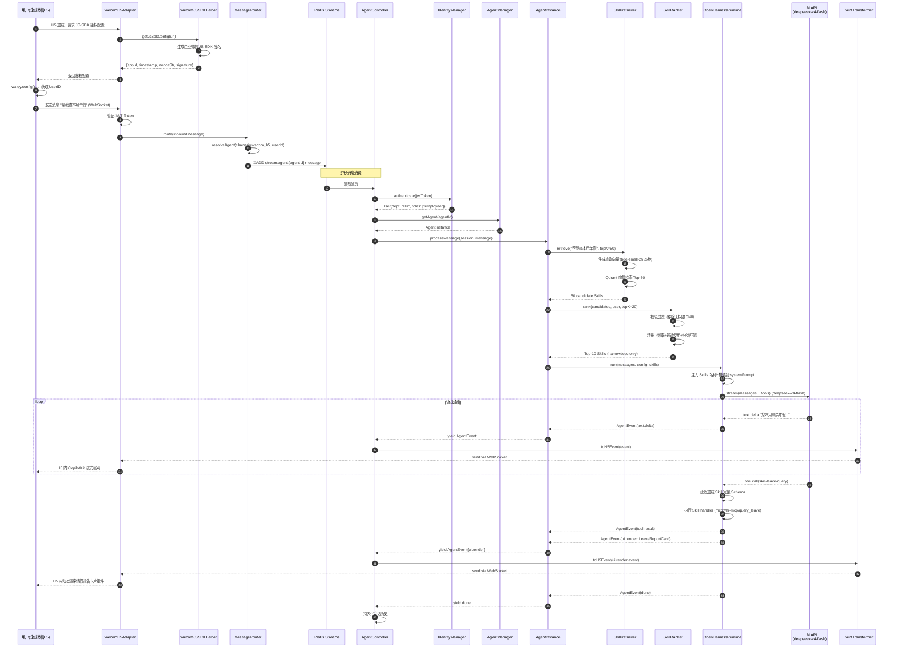
```mermaid
sequenceDiagram
    autonumber
    participant U as 用户(企业微信H5)
    participant WA as WecomH5Adapter
    participant JSSDK as WecomJSSDKHelper
    participant MR as MessageRouter
    participant RQ as Redis Streams
    participant AC as AgentController
    participant IDM as IdentityManager
    participant AM as AgentManager
    participant AI as AgentInstance
    participant SRet as SkillRetriever
    participant SRk as SkillRanker
    participant RT as OpenHarnessRuntime
    participant LLM as LLM API<br/>(deepseek-v4-flash)
    participant ET as EventTransformer

    U->>WA: H5 加载，请求 JS-SDK 鉴权配置
    WA->>JSSDK: getJsSdkConfig(url)
    JSSDK->>JSSDK: 生成企业微信 JS-SDK 签名
    JSSDK-->>WA: {appId, timestamp, nonceStr, signature}
    WA-->>U: 返回鉴权配置
    U->>U: wx.qy.config() → 获取 UserID

    U->>WA: 发送消息 "帮我查本月年假" (WebSocket)
    WA->>WA: 验证 JWT Token
    WA->>MR: route(InboundMessage)
    MR->>MR: resolveAgent(channel=wecom_h5, userId)
    MR->>RQ: XADD stream:agent:{agentId} message

    Note over RQ,AC: 异步消息消费
    RQ->>AC: 消费消息
    AC->>IDM: authenticate(jwtToken)
    IDM-->>AC: User{dept: "HR", roles: ["employee"]}

    AC->>AM: getAgent(agentId)
    AM-->>AC: AgentInstance

    AC->>AI: processMessage(session, message)
    AI->>SRet: retrieve("帮我查本月年假", topK=50)
    SRet->>SRet: 生成查询向量 (bge-small-zh 本地)
    SRet->>SRet: Qdrant 向量检索 Top-50
    SRet-->>AI: 50 candidate Skills

    AI->>SRk: rank(candidates, user, topK=20)
    SRk->>SRk: 权限过滤（移除无权限 Skill）
    SRk->>SRk: 精排（频率+最近使用+分类匹配）
    SRk-->>AI: Top-10 Skills (name+desc only)

    AI->>RT: run(messages, config, skills)
    RT->>RT: 注入 Skills 名称+描述到 systemPrompt
    RT->>LLM: stream(messages + tools) (deepseek-v4-flash)

    loop 流式输出
        LLM-->>RT: text.delta "您本月剩余年假..."
        RT-->>AI: AgentEvent{text.delta}
        AI-->>AC: yield AgentEvent

        AC->>ET: toH5Event(event)
        ET-->>WA: send via WebSocket
        WA-->>U: H5 内 CopilotKit 流式渲染
    end

    LLM-->>RT: tool.call(skill-leave-query)
    RT->>RT: 延迟加载 Skill 完整 Schema
    RT->>RT: 执行 Skill handler (mcp://hr-mcp/query_leave)
    RT-->>AI: AgentEvent{tool.result}
    RT-->>AI: AgentEvent{ui.render: LeaveReportCard}

    AI-->>AC: yield AgentEvent{ui.render}
    AC->>ET: toH5Event(ui.render event)
    ET-->>WA: send via WebSocket
    WA-->>U: H5 内动态渲染请假报告卡片组件

    RT-->>AI: AgentEvent{done}
    AI-->>AC: yield done
    AC->>AC: 持久化会话历史
```

### 5.2 流程 B：670+ Skills 语义检索与调度流程

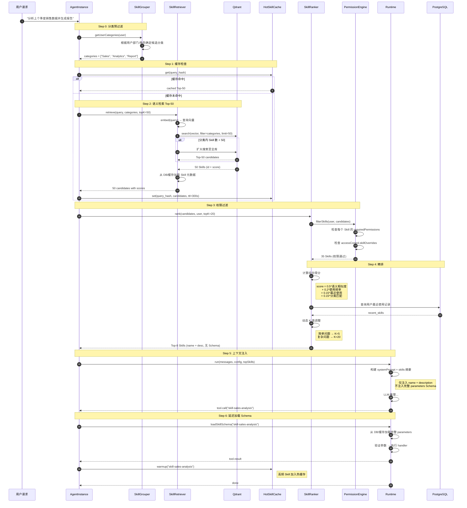
```mermaid
sequenceDiagram
    autonumber
    participant U as 用户请求
    participant AI as AgentInstance
    participant SG as SkillGrouper
    participant SRet as SkillRetriever
    participant QD as Qdrant
    participant Cache as HotSkillCache
    participant SRk as SkillRanker
    participant PE as PermissionEngine
    participant RT as Runtime
    participant DB as PostgreSQL

    U->>AI: "分析上个季度销售数据并生成报告"

    Note over AI,SG: Step 0: 分类预过滤
    AI->>SG: getUserCategories(user)
    SG->>SG: 根据用户部门/角色确定候选分类
    SG-->>AI: categories = ["Sales", "Analytics", "Report"]

    Note over AI,Cache: Step 1: 缓存检查
    AI->>Cache: get(query_hash)
    alt 缓存命中
        Cache-->>AI: cached Top-50
    else 缓存未命中
        Note over AI,QD: Step 2: 语义检索 Top-50
        AI->>SRet: retrieve(query, categories, topK=50)
        SRet->>SRet: embed(query) → 查询向量
        SRet->>QD: search(vector, filter=categories, limit=50)

        alt 分类内 Skill 数 < 50
            SRet->>QD: 扩大搜索至全库
            QD-->>SRet: Top-50 candidates
        end

        QD-->>SRet: 50 Skills (id + score)
        SRet->>SRet: 从 DB/缓存加载 Skill 元数据
        SRet-->>AI: 50 candidates with scores

        AI->>Cache: set(query_hash, candidates, ttl=300s)
    end

    Note over AI,PE: Step 3: 权限过滤
    AI->>SRk: rank(candidates, user, topK=20)
    SRk->>PE: filterSkills(user, candidates)
    PE->>PE: 检查每个 Skill 的 requiredPermissions
    PE->>PE: 检查 accessControl.skillOverrides
    PE-->>SRk: 35 Skills (权限通过)

    Note over SRk,DB: Step 4: 精排
    SRk->>SRk: 计算综合得分
    Note right of SRk: score = 0.5*语义相似度<br/>+ 0.2*使用频率<br/>+ 0.15*最近使用<br/>+ 0.15*分类匹配

    SRk->>DB: 查询用户最近使用记录
    DB-->>SRk: recent_skills
    SRk->>SRk: 动态 K 值调整
    Note right of SRk: 简单问题 → K=5<br/>复杂问题 → K=20

    SRk-->>AI: Top-8 Skills (name + desc, 无 Schema)

    Note over AI,RT: Step 5: 上下文注入
    AI->>RT: run(messages, config, topSkills)
    RT->>RT: 构建 systemPrompt + skills 摘要
    Note right of RT: 仅注入 name + description<br/>不注入完整 parameters Schema

    RT->>RT: LLM 推理...

    RT-->>AI: tool.call("skill-sales-analysis")
    Note over AI,RT: Step 6: 延迟加载 Schema
    AI->>RT: loadSkillSchema("skill-sales-analysis")
    RT->>RT: 从 DB/缓存加载完整 parameters
    RT->>RT: 验证参数 → 执行 handler
    RT-->>AI: tool.result

    AI->>Cache: warmup("skill-sales-analysis")
    Note right of Cache: 高频 Skill 加入热缓存

    RT-->>AI: done
```

### 5.3 流程 C：运行时切换流程

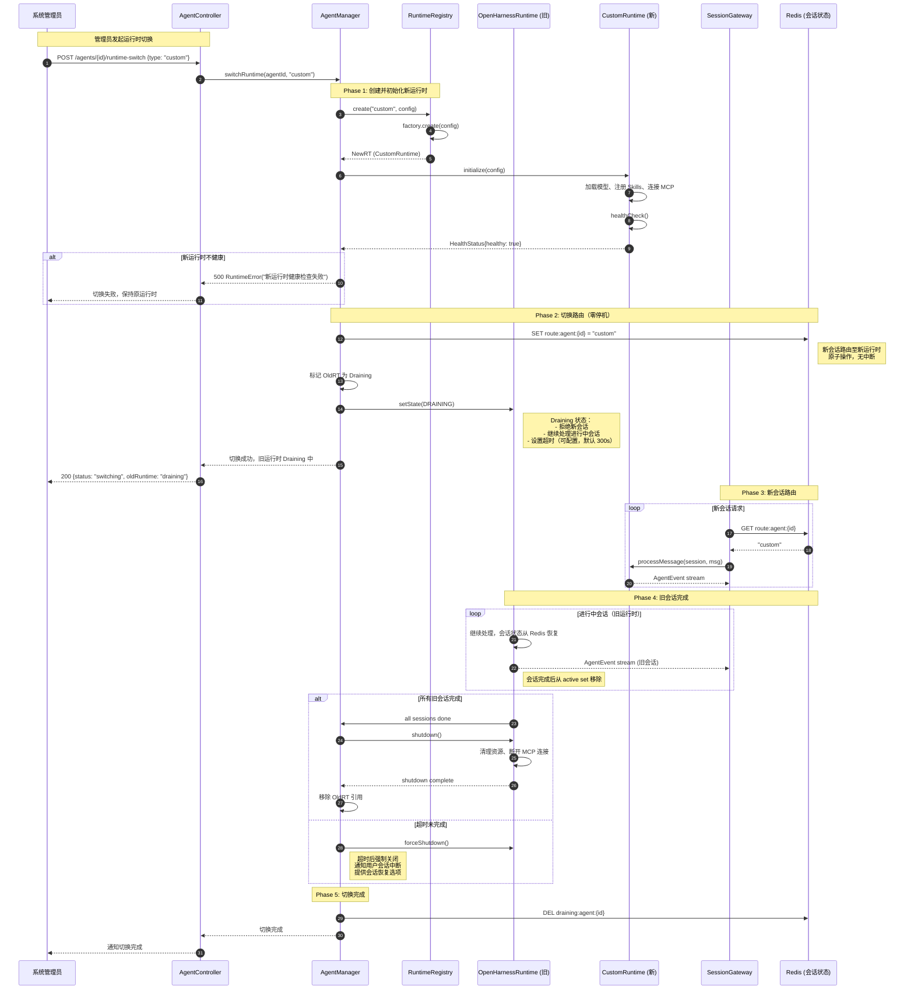
```mermaid
sequenceDiagram
    autonumber
    participant Admin as 系统管理员
    participant AC as AgentController
    participant AM as AgentManager
    participant RR as RuntimeRegistry
    participant OldRT as OpenHarnessRuntime (旧)
    participant NewRT as CustomRuntime (新)
    participant SG as SessionGateway
    participant RD as Redis (会话状态)

    Note over Admin,AC: 管理员发起运行时切换
    Admin->>AC: POST /agents/{id}/runtime-switch {type: "custom"}
    AC->>AM: switchRuntime(agentId, "custom")

    Note over AM,RR: Phase 1: 创建并初始化新运行时
    AM->>RR: create("custom", config)
    RR->>RR: factory.create(config)
    RR-->>AM: NewRT (CustomRuntime)
    AM->>NewRT: initialize(config)
    NewRT->>NewRT: 加载模型、注册 Skills、连接 MCP
    NewRT->>NewRT: healthCheck()
    NewRT-->>AM: HealthStatus{healthy: true}

    alt 新运行时不健康
        AM-->>AC: 500 RuntimeError("新运行时健康检查失败")
        AC-->>Admin: 切换失败，保持原运行时
    end

    Note over AM,RD: Phase 2: 切换路由（零停机）
    AM->>RD: SET route:agent:{id} = "custom"
    Note right of RD: 新会话路由至新运行时<br/>原子操作，无中断

    AM->>AM: 标记 OldRT 为 Draining
    AM->>OldRT: setState(DRAINING)
    Note right of OldRT: Draining 状态：<br/>- 拒绝新会话<br/>- 继续处理进行中会话<br/>- 设置超时（可配置，默认 300s）

    AM-->>AC: 切换成功，旧运行时 Draining 中
    AC-->>Admin: 200 {status: "switching", oldRuntime: "draining"}

    Note over SG,RD: Phase 3: 新会话路由
    loop 新会话请求
        SG->>RD: GET route:agent:{id}
        RD-->>SG: "custom"
        SG->>NewRT: processMessage(session, msg)
        NewRT-->>SG: AgentEvent stream
    end

    Note over OldRT,RD: Phase 4: 旧会话完成
    loop 进行中会话（旧运行时）
        OldRT->>OldRT: 继续处理，会话状态从 Redis 恢复
        OldRT-->>SG: AgentEvent stream (旧会话)
        Note right of OldRT: 会话完成后从 active set 移除
    end

    alt 所有旧会话完成
        OldRT->>AM: all sessions done
        AM->>OldRT: shutdown()
        OldRT->>OldRT: 清理资源、断开 MCP 连接
        OldRT-->>AM: shutdown complete
        AM->>AM: 移除 OldRT 引用
    else 超时未完成
        AM->>OldRT: forceShutdown()
        Note right of AM: 超时后强制关闭<br/>通知用户会话中断<br/>提供会话恢复选项
    end

    Note over AM: Phase 5: 切换完成
    AM->>RD: DEL draining:agent:{id}
    AM-->>AC: 切换完成
    AC-->>Admin: 通知切换完成
```

### 5.4 补充流程：HITL 审批流程

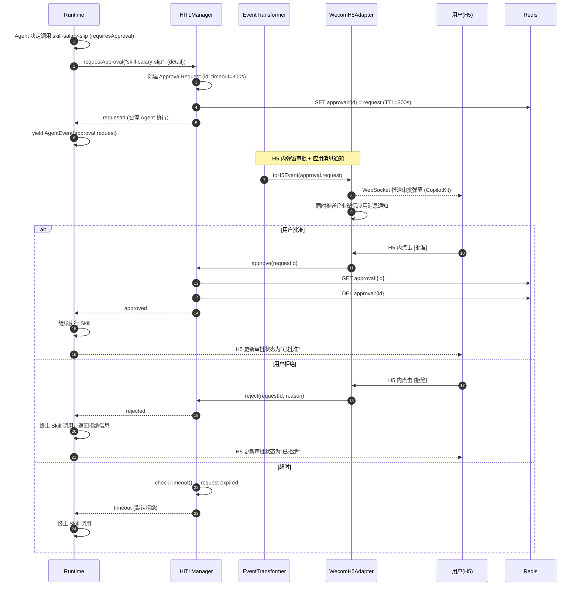
```mermaid
sequenceDiagram
    autonumber
    participant RT as Runtime
    participant HM as HITLManager
    participant ET as EventTransformer
    participant WA as WecomH5Adapter
    participant U as 用户(H5)
    participant RD as Redis

    RT->>RT: Agent 决定调用 skill-salary-slip (requiresApproval)
    RT->>HM: requestApproval("skill-salary-slip", {detail})
    HM->>HM: 创建 ApprovalRequest (id, timeout=300s)
    HM->>RD: SET approval:{id} = request (TTL=300s)

    HM-->>RT: requestId (暂停 Agent 执行)
    RT->>RT: yield AgentEvent{approval.request}

    Note over ET,WA: H5 内弹窗审批 + 应用消息通知
    ET->>WA: toH5Event(approval.request)
    WA-->>U: WebSocket 推送审批弹窗 (CopilotKit)
    WA->>WA: 同时推送企业微信应用消息通知

    alt 用户批准
        U->>WA: H5 内点击 [批准]
        WA->>HM: approve(requestId)
        HM->>RD: GET approval:{id}
        HM->>RD: DEL approval:{id}
        HM-->>RT: approved
        RT->>RT: 继续执行 Skill
        RT-->>U: H5 更新审批状态为"已批准"
    else 用户拒绝
        U->>WA: H5 内点击 [拒绝]
        WA->>HM: reject(requestId, reason)
        HM-->>RT: rejected
        RT->>RT: 终止 Skill 调用，返回拒绝信息
        RT-->>U: H5 更新审批状态为"已拒绝"
    else 超时
        HM->>HM: checkTimeout() → request expired
        HM-->>RT: timeout (默认拒绝)
        RT->>RT: 终止 Skill 调用
    end
```

### 5.5 流程 D：企业微信智能机器人（Bot）渠道消息处理流程

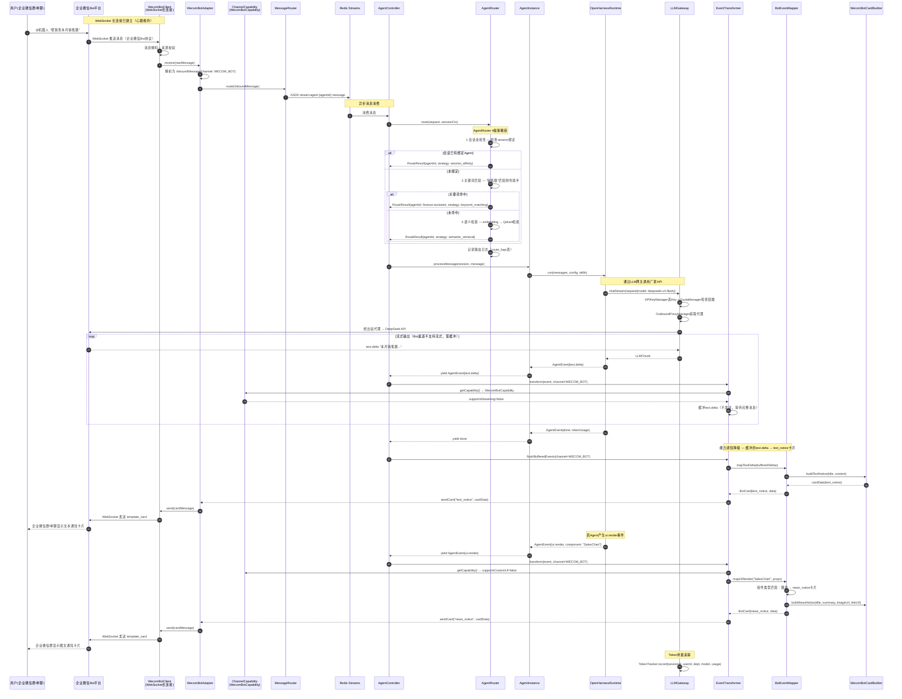
```mermaid
sequenceDiagram
    autonumber
    participant U as 用户(企业微信群/单聊)
    participant BOT as 企业微信Bot平台
    participant WBC as WecomBotClient<br/>(WebSocket长连接)
    participant WBA as WecomBotAdapter
    participant CC as ChannelCapability<br/>(WecomBotCapability)
    participant MR as MessageRouter
    participant RQ as Redis Streams
    participant AC as AgentController
    participant AR as AgentRouter
    participant AI as AgentInstance
    participant RT as OpenHarnessRuntime
    participant LGW as LLMGateway
    participant ET as EventTransformer
    participant BEM as BotEventMapper
    participant CB as WecomBotCardBuilder

    Note over WBC,BOT: WebSocket 长连接已建立（心跳维持）
    U->>BOT: @机器人 "帮我查本月销售额"
    BOT->>WBC: WebSocket 推送消息（企业微信Bot协议）
    WBC->>WBC: 消息解码 + 来源校验
    WBC->>WBA: receive(rawMessage)
    WBA->>WBA: 解析为 InboundMessage{channel: WECOM_BOT}
    WBA->>MR: route(InboundMessage)
    MR->>RQ: XADD stream:agent:{agentId} message

    Note over RQ,AC: 异步消息消费
    RQ->>AC: 消费消息
    AC->>AR: route(request, sessionCtx)

    Note over AR: AgentRouter 4级策略链
    AR->>AR: 1.会话亲和性 — 检查session绑定
    alt 会话已有绑定Agent
        AR-->>AC: RouteResult{agentId, strategy: session_affinity}
    else 未绑定
        AR->>AR: 2.关键词匹配 — "销售额"匹配财务助手
        alt 关键词命中
            AR-->>AC: RouteResult{agentId: finance-assistant, strategy: keyword_matching}
        else 未命中
            AR->>AR: 3.语义检索 — embedding → Qdrant检索
            AR-->>AC: RouteResult{agentId, strategy: semantic_retrieval}
        end
    end
    AR->>AR: 记录路由日志（route_logs表）

    AC->>AI: processMessage(session, message)
    AI->>RT: run(messages, config, skills)

    Note over RT,LGW: 通过LLM网关调用厂家API
    RT->>LGW: chatStream(request{model: deepseek-v4-flash})
    LGW->>LGW: APIKeyManager选Key + QuotaManager检查配额
    LGW->>LGW: OutboundProxyManager获取代理
    LGW->>BOT: 经出站代理 → DeepSeek API

    loop 流式输出（Bot渠道不支持流式，需缓冲）
        BOT-->>LGW: text.delta "本月销售额..."
        LGW-->>RT: LLMChunk
        RT-->>AI: AgentEvent{text.delta}
        AI-->>AC: yield AgentEvent{text.delta}
        AC->>ET: transform(event, channel=WECOM_BOT)
        ET->>CC: getCapability() → WecomBotCapability
        CC-->>ET: supportsStreaming=false
        ET->>ET: 缓冲text.delta（不发送，等待完整消息）
    end

    RT-->>AI: AgentEvent{done, tokenUsage}
    AI-->>AC: yield done

    Note over ET,BEM: 能力感知降级 — 缓冲的text.delta → text_notice卡片
    AC->>ET: flushBufferedEvents(channel=WECOM_BOT)
    ET->>BEM: mapTextDelta(bufferedDeltas)
    BEM->>CB: buildTextNotice(title, content)
    CB-->>BEM: cardData{text_notice}
    BEM-->>ET: BotCard{text_notice, data}
    ET-->>WBA: sendCard("text_notice", cardData)

    WBA->>WBC: send(cardMessage)
    WBC->>BOT: WebSocket 发送 template_card
    BOT-->>U: 企业微信群/单聊显示文本通知卡片

    Note over RT: 若Agent产生ui.render事件
    RT-->>AI: AgentEvent{ui.render, component: "SalesChart"}
    AI-->>AC: yield AgentEvent{ui.render}
    AC->>ET: transform(event, channel=WECOM_BOT)
    ET->>CC: getCapability() → supportsCustomUI=false
    ET->>BEM: mapUIRender("SalesChart", props)
    BEM->>BEM: 组件类型匹配：图表 → news_notice卡片
    BEM->>CB: buildNewsNotice(title, summary, imageUrl, linkUrl)
    BEM-->>ET: BotCard{news_notice, data}
    ET-->>WBA: sendCard("news_notice", cardData)
    WBA->>WBC: send(cardMessage)
    WBC->>BOT: WebSocket 发送 template_card
    BOT-->>U: 企业微信群显示图文通知卡片

    Note over LGW: Token用量追踪
    LGW->>LGW: TokenTracker.record(sessionId, userId, dept, model, usage)
```

### 5.6 流程 E：AgentRouter 智能路由流程

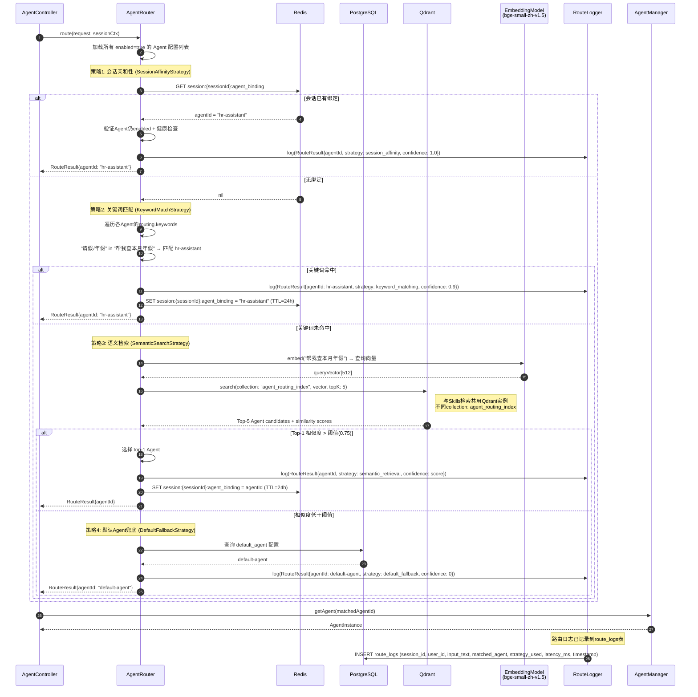
```mermaid
sequenceDiagram
    autonumber
    participant AC as AgentController
    participant AR as AgentRouter
    participant RD as Redis
    participant PG as PostgreSQL
    participant QD as Qdrant
    participant EMB as EmbeddingModel<br/>(bge-small-zh-v1.5)
    participant RL as RouteLogger
    participant AM as AgentManager

    AC->>AR: route(request, sessionCtx)
    AR->>AR: 加载所有 enabled=true 的 Agent 配置列表

    Note over AR: 策略1: 会话亲和性 (SessionAffinityStrategy)
    AR->>RD: GET session:{sessionId}:agent_binding
    alt 会话已有绑定
        RD-->>AR: agentId = "hr-assistant"
        AR->>AR: 验证Agent仍enabled + 健康检查
        AR->>RL: log(RouteResult{agentId, strategy: session_affinity, confidence: 1.0})
        AR-->>AC: RouteResult{agentId: "hr-assistant"}
    else 无绑定
        RD-->>AR: nil

        Note over AR: 策略2: 关键词匹配 (KeywordMatchStrategy)
        AR->>AR: 遍历各Agent的routing.keywords
        AR->>AR: "请假/年假" in "帮我查本月年假" → 匹配 hr-assistant
        alt 关键词命中
            AR->>RL: log(RouteResult{agentId: hr-assistant, strategy: keyword_matching, confidence: 0.9})
            AR->>RD: SET session:{sessionId}:agent_binding = "hr-assistant" (TTL=24h)
            AR-->>AC: RouteResult{agentId: "hr-assistant"}
        else 关键词未命中

            Note over AR: 策略3: 语义检索 (SemanticSearchStrategy)
            AR->>EMB: embed("帮我查本月年假") → 查询向量
            EMB-->>AR: queryVector[512]
            AR->>QD: search(collection: "agent_routing_index", vector, topK: 5)
            Note right of QD: 与Skills检索共用Qdrant实例<br/>不同collection: agent_routing_index
            QD-->>AR: Top-5 Agent candidates + similarity scores

            alt Top-1 相似度 > 阈值(0.75)
                AR->>AR: 选择Top-1 Agent
                AR->>RL: log(RouteResult{agentId, strategy: semantic_retrieval, confidence: score})
                AR->>RD: SET session:{sessionId}:agent_binding = agentId (TTL=24h)
                AR-->>AC: RouteResult{agentId}
            else 相似度低于阈值

                Note over AR: 策略4: 默认Agent兜底 (DefaultFallbackStrategy)
                AR->>PG: 查询 default_agent 配置
                PG-->>AR: default-agent
                AR->>RL: log(RouteResult{agentId: default-agent, strategy: default_fallback, confidence: 0})
                AR-->>AC: RouteResult{agentId: "default-agent"}
            end
        end
    end

    AC->>AM: getAgent(matchedAgentId)
    AM-->>AC: AgentInstance

    Note over RL: 路由日志已记录到route_logs表
    RL->>PG: INSERT route_logs (session_id, user_id, input_text, matched_agent, strategy_used, latency_ms, timestamp)
```

---

## 6. 任务列表

### 6.1 任务概览

| 任务 ID | 任务名称 | 描述 | 依赖 | 优先级 | 预计文件数 |
|---------|----------|------|------|--------|-----------|
| T01 | 项目基础设施 | 全部配置文件、入口文件、Docker 环境（含出站代理）、Nginx、数据库初始化、配置目录骨架 | 无 | P0 | ~20 |
| T02 | 消息网关 + 三渠道适配 | Gateway 服务、企业微信H5/企业微信Bot/独立H5三渠道适配器、ChannelCapability能力声明、EventTransformer能力感知降级、BotEventMapper、消息路由、认证/限流中间件、Redis Streams | T01 | P0 | ~22 |
| T03 | Agent核心 + AgentRouter + LLM网关 | AgentManager、AgentRouter智能路由（4级策略链）、运行时抽象、OpenHarness实现、LLMGateway网关层（APIKeyManager/QuotaManager/OutboundProxyManager/TokenTracker/FailoverManager）、ConfigManager配置管理（双模式+热更新）、Agent/Skill/Session API | T01 | P0 | ~28 |
| T04 | Skills系统 + 身份权限 | SkillRegistry、语义检索器、精排器、向量索引、缓存、身份认证、权限引擎、MCP管理、业务系统适配层 | T01 | P0 | ~17 |
| T05 | 前端应用 + 推送/HITL集成 | CopilotKit聊天界面、动态UI渲染、管理后台（含路由日志/Token用量/配额管理）、推送服务（含Bot渠道template_card推送）、HITL审批（含Bot渠道button_interaction降级）、全链路集成 | T01, T02, T03, T04 | P0 | ~22 |
| T06 | Agent 记忆机制 | MemoryManager（静态记忆加载+动态记忆检索/写入）、StaticMemoryLoader（YAML/MD解析+缓存）、MemoryInjector中间件、agent_memory数据库表+迁移、Qdrant agent_memory_index collection初始化、遗忘策略定时任务、memory/配置目录示例（v1.4 新增） | T03, T04 | P1 | ~9 |

### 6.2 任务详情

#### T01: 项目基础设施

**描述**：搭建整个项目的骨架，包括前端/网关/后端三端的配置文件、入口文件、Docker 容器化环境、Nginx 反向代理、数据库初始化脚本。

**源文件**：
- `frontend/package.json`, `frontend/vite.config.ts`, `frontend/tsconfig.json`, `frontend/tailwind.config.ts`, `frontend/index.html`
- `frontend/src/main.tsx`, `frontend/src/App.tsx`
- `gateway/package.json`, `gateway/tsconfig.json`
- `backend/pyproject.toml`, `backend/src/main.py`, `backend/src/config.py`
- `infra/docker-compose.yml`, `infra/Dockerfile.gateway`, `infra/Dockerfile.backend`, `infra/Dockerfile.frontend`, `infra/Dockerfile.outbound-proxy`, `infra/nginx/nginx.conf`, `infra/outbound-proxy/squid.conf`, `infra/init-qdrant.sh`, `infra/init-embedding.sh`
- `configs/agents/`（配置目录骨架）, `configs/skills/`, `configs/runtime/`, `configs/identity/`, `configs/system/`

**依赖**：无
**优先级**：P0

---

#### T02: 消息网关 + 三渠道适配

**描述**：实现 Message Gateway 服务，包含企业微信 H5 适配器（JS-SDK 鉴权 + 应用消息推送）、**企业微信智能机器人 Bot 适配器（WebSocket 长连接 + 6 种 template_card）**、H5 WebSocket/SSE 适配器、**ChannelCapability 渠道能力声明接口**、**EventTransformer 能力感知降级器（AgentEvent → 渠道格式映射）**、**BotEventMapper Bot渠道事件映射器**、消息路由器、认证/限流中间件、Redis Streams 消息队列。

**源文件**：
- `gateway/src/index.ts`, `gateway/src/server.ts`
- `gateway/src/adapters/wecom/WecomH5Adapter.ts`, `WecomJSSDKHelper.ts`, `WecomAppMessage.ts`
- `gateway/src/adapters/wecom/WecomBotAdapter.ts`, `WecomBotClient.ts`, `WecomBotCardBuilder.ts`
- `gateway/src/adapters/h5/H5Adapter.ts`
- `gateway/src/channels/ChannelCapability.ts`, `CapabilityRegistry.ts`
- `gateway/src/router/MessageRouter.ts`, `ChannelResolver.ts`, `EventTransformer.ts`, `BotEventMapper.ts`
- `gateway/src/middleware/auth.ts`, `rateLimit.ts`, `logger.ts`
- `gateway/src/utils/crypto.ts`, `retry.ts`
- `gateway/src/queue/redisStream.ts`

**依赖**：T01
**优先级**：P0

---

#### T03: Agent核心 + AgentRouter + LLM网关

**描述**：实现 Agent 实例生命周期管理（Created→Running↔Paused→Draining→Stopped→Deleted 状态机）、**AgentRouter 智能路由（4级策略链：会话亲和性 → 关键词匹配 → 语义检索 → 默认兜底）**、运行时抽象层（AgentRuntime 接口 + OpenHarness 默认实现 + RuntimeRegistry 注册机制）、**LLM 网关层（LLMGateway 统一入口 + APIKeyManager Key池管理 + QuotaManager 配额控制 + OutboundProxyManager 出站代理 + TokenTracker 用量追踪 + FailoverManager 故障切换）**、**ConfigManager 配置管理（文件系统+数据库双模式 + ConfigWatcher 热更新）**、会话管理、Agent CRUD API、AgentEvent 流式事件体系。

**源文件**：
- `backend/src/agent/manager.py`, `config.py`, `session.py`, `lifecycle.py`
- `backend/src/router/agent_router.py`, `strategies/base.py`, `session_affinity.py`, `keyword_match.py`, `semantic_search.py`, `default_fallback.py`, `route_logger.py`, `models.py`
- `backend/src/llm/gateway.py`, `key_manager.py`, `quota_manager.py`, `outbound_proxy.py`, `token_tracker.py`, `failover.py`, `models.py`, `deepseek_adapter.py`, `qwen_adapter.py`
- `backend/src/config_manager/manager.py`, `watcher.py`, `validator.py`, `loader.py`, `sync.py`
- `backend/src/runtime/base.py`, `registry.py`, `openharness.py`, `events.py`, `factory.py`
- `backend/src/api/deps.py`, `routes/agent.py`, `routes/session.py`, `routes/admin.py`
- `backend/src/models/base.py`, `agent.py`, `session.py`
- `backend/src/db/session.py`
- `backend/src/utils/logging.py`, `exceptions.py`

**依赖**：T01
**优先级**：P0

---

#### T04: Skills 系统 + 身份权限

**描述**：实现 Skills 注册中心（自定义 Skill + MCP Tool 自动发现 + 内置 Skill）、两阶段检索引擎（语义检索 Top-50 → 权限过滤 + 精排 Top-K）、Qdrant 向量索引构建与更新、热点 Skill 缓存、Skill 分组分类、用户身份认证（企业微信 OAuth2 直连 + 本地 JWT 签发/验证 + 密码登录）、权限引擎（部门/角色/Skill 覆盖）、企业微信组织架构同步（写入本地数据库）、业务系统凭证托管（AES-256 加密 + 用户→系统账号映射）、MCP Server 管理（stdio/HTTP/SSE + Tool 自动发现）、业务系统适配层（BusinessSystemAdapter 抽象 + 各业务系统适配器）。

**源文件**：
- `backend/src/skills/registry.py`, `retriever.py`, `ranker.py`, `indexer.py`, `cache.py`, `models.py`, `grouper.py`
- `backend/src/identity/auth.py`, `permissions.py`, `token.py`, `models.py`, `wecom_sync.py`, `credential_vault.py`, `credential_mapper.py`
- `backend/src/mcp/manager.py`, `client.py`, `discovery.py`
- `backend/src/adapters/base.py`, `finance_adapter.py`, `retail_adapter.py`, `department_store_adapter.py`, `hr_adapter.py`, `property_adapter.py`, `crm_adapter.py`, `valuecard_adapter.py`
- `backend/src/api/routes/skill.py`, `routes/mcp.py`
- `backend/src/models/skill.py`, `user.py`
- `backend/src/utils/crypto.py`

**依赖**：T01
**优先级**：P0

---

#### T05: 前端应用 + 推送/HITL 集成

**描述**：实现 H5 前端应用（CopilotKit 聊天界面 + Generative UI 动态渲染 + 管理后台 Agent/Skill/权限/监控页面）、主动推送服务（企业微信应用消息 + H5 WebSocket 推送 + Cron 定时调度）、HITL 人机交互（审批工作流 + 企业微信卡片审批 + 超时处理）、全链路集成调试。

**源文件**：
- `frontend/src/routes/index.tsx`, `chat.tsx`, `admin.tsx`
- `frontend/src/components/ChatInterface.tsx`, `DynamicUIRenderer.tsx`, `SkillCard.tsx`, `AgentSelector.tsx`, `ApprovalDialog.tsx`, `AdminSidebar.tsx`
- `frontend/src/pages/ChatPage.tsx`, `AgentConfigPage.tsx`, `SkillManagePage.tsx`, `MonitorPage.tsx`, `UserPermissionPage.tsx`
- `frontend/src/hooks/useAgentChat.ts`, `useStreamMessage.ts`, `useAuth.ts`
- `frontend/src/stores/authStore.ts`, `agentStore.ts`, `sessionStore.ts`
- `frontend/src/lib/api.ts`, `websocket.ts`, `cardAdapter.ts`
- `frontend/src/types/agent.ts`, `skill.ts`, `message.ts`, `event.ts`
- `backend/src/push/service.py`, `scheduler.py`, `channels.py`
- `backend/src/hitl/manager.py`, `approval.py`
- `backend/src/api/routes/push.py`

**依赖**：T01, T02, T03, T04
**优先级**：P0

---

#### T06: Agent 记忆机制（v1.4 新增）

**描述**：实现 Agent 两层记忆模型——静态记忆（memory/ 目录 YAML/MD 文件加载 + 缓存 + 热更新监听）和动态记忆（PostgreSQL agent_memory 表 + Qdrant agent_memory_index 向量索引 + 语义检索 Top-K + 自动写入 + 遗忘策略）。MemoryInjector 中间件在 Agent 运行前分层注入上下文（系统提示词 → 静态记忆 → 动态记忆 Top-K → 对话历史）。

**源文件**：
- `backend/src/memory/manager.py`, `models.py`, `injector.py`, `static_loader.py`
- `backend/src/models/agent_memory.py`
- `backend/alembic/versions/xxx_add_agent_memory.py`
- `infra/init-qdrant.sh`（更新：新增 agent_memory_index collection）
- `configs/agents/hr-assistant/memory/agent-memory.yaml`, `personality.md`, `facts/hr-policies.yaml`

**依赖**：T03（AgentManager/ConfigManager）, T04（Qdrant/Embedding 模型）
**优先级**：P1

### 6.3 任务依赖图

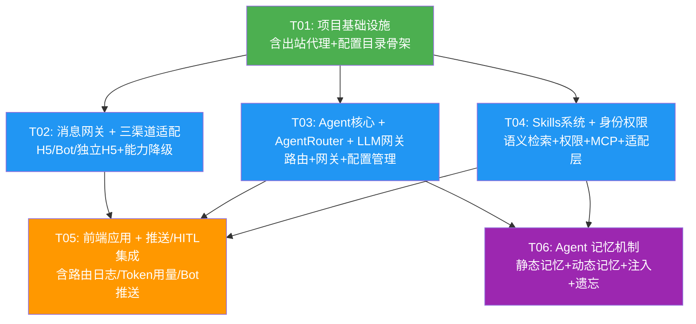
```mermaid
graph TD
    T01["T01: 项目基础设施<br/>含出站代理+配置目录骨架"]
    T02["T02: 消息网关 + 三渠道适配<br/>H5/Bot/独立H5+能力降级"]
    T03["T03: Agent核心 + AgentRouter + LLM网关<br/>路由+网关+配置管理"]
    T04["T04: Skills系统 + 身份权限<br/>语义检索+权限+MCP+适配层"]
    T05["T05: 前端应用 + 推送/HITL集成<br/>含路由日志/Token用量/Bot推送"]
    T06["T06: Agent 记忆机制<br/>静态记忆+动态记忆+注入+遗忘"]

    T01 --> T02
    T01 --> T03
    T01 --> T04
    T02 --> T05
    T03 --> T05
    T04 --> T05
    T03 --> T06
    T04 --> T06

    style T01 fill:#4CAF50,color:#fff
    style T05 fill:#FF9800,color:#fff
    style T02 fill:#2196F3,color:#fff
    style T03 fill:#2196F3,color:#fff
    style T04 fill:#2196F3,color:#fff
    style T06 fill:#9C27B0,color:#fff
```

**并行开发策略**：T01 完成后，T02/T03/T04 可并行开发（三个不同语言栈/模块），最后 T05 集成。T06 在 T03/T04 完成后可并行开发（P1 优先级，不阻塞 T05 集成）。

---

## 7. 依赖包列表

### 7.1 前端依赖（H5 Web Application）

```json
{
  "dependencies": {
    "react": "^18.2.0",
    "react-dom": "^18.2.0",
    "react-router-dom": "^6.22.0",
    "@copilotkit/react-ui": "^1.0.0",
    "@copilotkit/react-core": "^1.0.0",
    "@copilotkit/runtime": "^1.0.0",
    "ai": "^4.0.0",
    "zustand": "^4.5.0",
    "axios": "^1.7.0",
    "recharts": "^2.12.0",
    "@headlessui/react": "^2.0.0",
    "react-markdown": "^9.0.0",
    "react-syntax-highlighter": "^15.5.0",
    "dayjs": "^1.11.0",
    "clsx": "^2.1.0"
  },
  "devDependencies": {
    "@types/react": "^18.2.0",
    "@types/react-dom": "^18.2.0",
    "typescript": "^5.4.0",
    "vite": "^5.2.0",
    "@vitejs/plugin-react": "^4.2.0",
    "tailwindcss": "^3.4.0",
    "postcss": "^8.4.0",
    "autoprefixer": "^10.4.0",
    "eslint": "^8.57.0",
    "@typescript-eslint/eslint-plugin": "^7.0.0"
  }
}
```

### 7.2 网关依赖（Message Gateway）

```json
{
  "dependencies": {
    "fastify": "^4.26.0",
    "@fastify/websocket": "^10.0.0",
    "@fastify/cors": "^9.0.0",
    "@fastify/rate-limit": "^9.1.0",
    "ioredis": "^5.3.0",
    "axios": "^1.7.0",
    "fast-xml-parser": "^4.3.0",
    "crypto-js": "^4.2.0",
    "pino": "^9.0.0",
    "zod": "^3.22.0"
  },
  "devDependencies": {
    "typescript": "^5.4.0",
    "tsx": "^4.7.0",
    "@types/node": "^20.11.0",
    "@types/crypto-js": "^4.2.0"
  }
}
```

### 7.3 后端依赖（Agent Core）

```toml
[project]
dependencies = [
    "fastapi[standard]>=0.111.0",
    "uvicorn[standard]>=0.29.0",
    "sqlalchemy[asyncio]>=2.0.0",
    "asyncpg>=0.29.0",
    "alembic>=1.13.0",
    "pydantic>=2.7.0",
    "pydantic-settings>=2.2.0",
    "redis[hiredis]>=5.0.0",
    "qdrant-client>=1.9.0",
    "httpx>=0.27.0",
    "PyJWT>=2.8.0",
    "structlog>=24.1.0",
    "mcp>=0.1.0",
    "openai>=1.30.0",           # 兼容 OpenAI 格式（DeepSeek v4 Flash 主力 + Qwen3.6 Plus 复杂推理），通过 LLM 网关统一调用
    "dashscope>=1.20.0",        # 通义千问 Qwen3.6 Plus SDK（LLM 网关备选模型适配）
    "watchdog>=4.0.0",          # 文件系统变更监听（ConfigWatcher 热更新）
    "squid-proxy-manager>=0.1.0", # 出站代理管理（可选，或直接使用 httpx 代理配置）
    "cryptography>=42.0.0",     # AES-256-GCM 凭证加密 + JWT 辅助 + API Key 加密
    "bcrypt>=4.1.0",            # 用户密码哈希（独立 H5 登录）
    "tiktoken>=0.7.0",
    "python-multipart>=0.0.9",
    "tenacity>=8.2.0",
    "pyyaml>=6.0",
    " APScheduler>=3.10.0",     # 定时任务（推送调度 + 记忆遗忘策略执行）
]
```

### 7.4 基础设施

| 组件 | 版本 | 用途 |
|------|------|------|
| PostgreSQL | 16 | 关系数据库（配置/会话/用户/审计） |
| Redis | 7.2 | 缓存 + 消息队列 + 会话状态 |
| Qdrant | 1.9 | 向量数据库（Skill 语义索引 + AgentRouter 路由索引 + agent_memory_index 记忆索引） |
| Nginx | 1.25 | 内网反向代理 + 负载均衡 |
| Docker | 24+ | 容器化 |
| Docker Compose | 2.24+ | 内网开发/生产环境编排（100-200 并发） |
| bge-small-zh-v1.5 | — | 本地 Embedding 模型（sentence-transformers + ONNX Runtime，内网部署） |

---

## 8. 共享知识（跨文件约定）

### 8.1 编码规范

**TypeScript（前端 + 网关）**：
- ESLint + Prettier 强制格式化
- 严格模式 `"strict": true`
- 函数/变量命名：camelCase
- 类型/接口/枚举命名：PascalCase
- 常量命名：UPPER_SNAKE_CASE
- 文件命名：PascalCase（组件）/ camelCase（工具函数）
- 所有 API 响应使用 `Result<T>` 泛型包装

**Python（后端）**：
- Black + isort + flake8 格式化
- 类型注解必须（mypy strict 检查）
- 类命名：PascalCase
- 函数/变量命名：snake_case
- 常量命名：UPPER_SNAKE_CASE
- 文件命名：snake_case
- 所有 async 函数必须 `async def`，IO 操作必须 `await`

### 8.2 API 响应格式

所有 API 统一使用以下响应格式：

```typescript
interface ApiResponse<T> {
  code: number;        // 0=成功，非0=错误码
  data: T | null;      // 业务数据
  message: string;     // 描述信息
  traceId: string;     // 链路追踪 ID
}
```

**错误码定义**：

| 范围 | 含义 |
|------|------|
| 0 | 成功 |
| 1000-1999 | 认证/权限错误 |
| 2000-2999 | Agent 相关错误 |
| 3000-3999 | Skill 相关错误 |
| 4000-4999 | MCP 相关错误 |
| 5000-5999 | 渠道/网关错误 |
| 9000-9999 | 系统内部错误 |

### 8.3 AgentEvent 流式协议

所有运行时输出统一为 `AgentEvent` 流（AsyncIterable），事件格式：

```typescript
// 文本增量
{ type: "text.delta", content: "你好" }

// 工具调用
{ type: "tool.call", toolName: "skill-leave-query", args: { employeeId: "123" } }

// 工具结果
{ type: "tool.result", toolName: "skill-leave-query", result: { days: 5 } }

// UI 渲染指令（Generative UI）
{ type: "ui.render", component: "LeaveReportCard", props: { days: 5, used: 3 } }

// 审批请求（HITL）
{ type: "approval.request", skillId: "skill-salary-slip", detail: { ... } }

// 错误
{ type: "error", code: "SKILL_TIMEOUT", message: "Skill 执行超时" }

// 完成
{ type: "done", tokenUsage: { prompt: 500, completion: 200, total: 700 } }
```

### 8.4 日志规范

- **格式**：JSON 结构化日志（structlog / pino）
- **必填字段**：`timestamp`, `level`, `service`, `traceId`, `message`
- **级别**：DEBUG → INFO → WARN → ERROR → FATAL
- **敏感数据**：日志中不输出 Token、密码、API Key，使用 `***` 脱敏
- **链路追踪**：每个请求生成 `traceId`，贯穿 Gateway → Core → Skills 全链路
- **日志采集**：输出到 stdout，由 Docker 日志驱动收集至 ELK/Loki

### 8.5 配置管理约定

- **环境变量**：所有配置通过环境变量注入，不硬编码
- **密钥管理**：API Key、数据库密码等敏感信息使用 `secret://` 引用，运行时从密钥管理服务解析
- **配置层级**：默认配置 → 环境变量覆盖 → 运行时动态配置（Redis）
- **配置校验**：Pydantic Settings / Zod schema 启动时校验
- **配置目录结构**：每个 Agent 一套配置目录（`configs/agents/{agent_name}/`），包含 agent.yaml + skills/ + runtime/ + identity/ + system/，详见第 16 节
- **双模式存储**：支持文件系统模式（YAML 文件，Git 版本管理）和数据库模式（PostgreSQL，多实例部署），两种模式可双向同步
- **热更新**：配置变更后 < 10s 生效，进行中会话使用旧配置完成，新会话使用新配置

### 8.6 认证与鉴权约定

- **身份源**：企业微信作为唯一身份源，后端直接验证企业微信 UserID 并签发本地 JWT，不引入独立 IdP
- **JWT Token**：本地 HS256 对称密钥签名，Access Token 过期时间 2h，Refresh Token 7d
- **Token 签发**：IdentityManager 签发（`signJWT`），密钥存储在环境变量 `JWT_SECRET`
- **Token 验证**：TokenValidator 本地 HS256 验签 + 过期检查（无需外部 JWKS）
- **Token 载荷**：`{ userId, username, department, roles, channel, agentId, iss, exp, iat }`
- **传递方式**：`Authorization: Bearer <token>`（HTTP）/ `auth` 字段（WebSocket 连接时）
- **权限模型**：RBAC + ABAC 混合（角色 + 部门 + Skill 级覆盖），权限信息从本地数据库读取，Redis 缓存（TTL 600s）
- **组织架构同步**：企业微信组织架构 → 本地数据库定时同步（每小时），含用户/部门/角色映射
- **业务系统凭证**：各业务系统登录凭证使用 AES-256-GCM 加密存储（CredentialVault），密钥存储在环境变量 `CREDENTIAL_VAULT_KEY`
- **Bot 渠道安全**：企业微信智能机器人 WebSocket 长连接需鉴权验证，消息来源校验防止伪造

### 8.7 数据存储约定

- **日期格式**：ISO 8601 UTC（如 `2026-07-04T09:46:13Z`）
- **ID 生成**：UUID v4（分布式安全）
- **软删除**：所有业务数据使用 `deleted_at` 字段软删除
- **会话状态**：Redis 为主存储（TTL 24h），PostgreSQL 为持久化备份
- **向量数据**：Qdrant 独立存储，Skill 元数据在 PostgreSQL，通过 `skill_id` 关联；AgentRouter 语义检索使用独立 collection（`agent_routing_index`），与 Skills 检索（`skills_index`）共用 Qdrant 实例
- **路由日志**：`route_logs` 表存储路由决策日志（session_id/user_id/input_text/matched_agent/strategy_used/latency_ms/timestamp），供管理后台可观测

### 8.8 AgentEvent 能力感知降级映射表

AgentEvent 统一事件流在不同渠道的降级映射规则：

| AgentEvent 类型 | H5 渠道（富交互） | Bot 渠道（降级） |
|----------------|------------------|-----------------|
| `text.delta`（流式文本） | CopilotKit 实时流式渲染 | **缓冲累积** → 完整文本后发送 `text_notice` 卡片 |
| `ui.render`（动态 UI 组件） | CopilotKit Generative UI 渲染 React 组件 | **按组件类型映射**：表格/列表 → `text_notice`；图表/图片 → `news_notice`；按钮/操作 → `button_interaction`；表单 → `multiple_interaction`；无法匹配 → 降级为 `text_notice` |
| `tool.call` / `tool.result` | 前端实时显示工具调用状态 | **隐藏或简化**为 `text_notice`（"正在查询..." → "查询完成"） |
| `approval.request`（审批请求） | CopilotKit 弹窗审批 | **降级为** `button_interaction`（"同意"/"拒绝"按钮） |
| `error` | 前端错误提示组件 | `text_notice` 错误信息卡片 |
| `done` | 流式结束标记 | 无需额外处理 |

**降级流程**：EventTransformer 调用 `ChannelCapability.canRender(eventType)` 判断渠道是否支持该事件类型；不支持时调用 `degradeByCapability()` 执行降级映射，Bot 渠道委托 `BotEventMapper` 完成映射。

### 8.9 渠道能力矩阵（三渠道 × 11 维度）

| 能力维度 | 企业微信 H5 | 企业微信智能机器人 | 独立 H5 |
|---------|------------|------------------|---------|
| **流式输出** (supportsStreaming) | ✅ 支持（SSE/WebSocket） | ❌ 不支持（完整生成后发送） | ✅ 支持（SSE/WebSocket） |
| **自定义 UI** (supportsCustomUI) | ✅ 支持（CopilotKit React 组件） | ❌ 不支持 | ✅ 支持（CopilotKit React 组件） |
| **支持卡片类型** (supportedCardTypes) | — | 6种：text_notice/news_notice/button_interaction/vote_interaction/multiple_interaction/template_notice | — |
| **文件上传** (supportsFileUpload) | ❌ 不支持 | ❌ 不支持 | ✅ 支持 |
| **最大消息长度** (maxMessageLength) | 4096 | 2048 | 8192 |
| **Markdown 支持** (markdownSupportLevel) | FULL | LIMITED（text_notice 内有限支持） | FULL |
| **HITL 审批** | ✅ CopilotKit 弹窗 | ⚠️ button_interaction 卡片 | ✅ CopilotKit 弹窗 |
| **主动推送** | ✅ 应用消息通知 | ✅ template_card 推送 | ✅ WebSocket 推送 |
| **用户身份识别** | ✅ JS-SDK 自动登录 | ✅ 企业微信用户身份 | ⚠️ 用户名密码登录 |
| **上下文共享** | ✅ 与其他渠道共享会话 | ✅ 与其他渠道共享会话 | ✅ 与其他渠道共享会话 |
| **代码高亮** | ✅ 支持 | ❌ 不支持 | ✅ 支持 |

### 8.10 AgentRouter 路由配置约定

- **路由配置位置**：各 Agent 的 `agent.yaml` 中的 `routing` 段
- **路由字段**：`keywords`（关键词列表）、`enabled`（是否参与路由）、`priority`（优先级，数值越高越优先）
- **语义检索共用 Qdrant**：AgentRouter 使用 `agent_routing_index` collection，与 Skills 检索的 `skills_index` 共用 Qdrant 实例
- **会话绑定 TTL**：`session:{sessionId}:agent_binding` 存储在 Redis，TTL 24h
- **语义检索阈值**：Top-1 相似度 > 0.75 才认为命中，否则进入兜底策略
- **路由日志**：每次路由决策记录到 `route_logs` 表，含策略、命中Agent、置信度、延迟
- **前端无感知**：前端不提供 Agent/运行时选择功能，所有路由由 AgentRouter 后台自动完成

### 8.11 LLM 网关层约定

- **统一入口**：所有 LLM 调用通过 `LLMGateway.chat()` / `LLMGateway.chatStream()`，不直接调用厂家 API
- **API Key 管理**：Key 存储使用 `secret://` 引用，运行时从密钥管理服务解析；轮转策略 round-robin
- **配额控制**：默认每用户每日 100,000 Token，每部门每日 1,000,000 Token；配额使用 80% 告警
- **出站代理**：所有 LLM API 请求经 `OutboundProxyManager` 管理的代理池转发至厂家端点；代理池支持负载均衡和健康检查
- **访问白名单**：出站代理仅允许已知厂家 API 域名（deepseek.com / dashscope.aliyuncs.com），拒绝其他域名
- **故障切换**：主力模型（deepseek-v4-flash）连续失败 3 次自动切换到备选模型（qwen3.6-plus），恢复后自动切回
- **Token 追踪**：每次 LLM 调用记录 Token 用量到 `token_usage` 表，支持按会话/用户/部门维度统计

---

## 9. 670+ Skills 调度架构详细设计

### 9.1 向量索引构建与更新机制

**索引模型选择**：使用 `bge-small-zh-v1.5`（中文优化、512 维、模型体积小）作为 Embedding 模型，部署在 Agent Core 进程内（ONNX Runtime），避免外部 API 调用延迟。

**索引构建流程**：

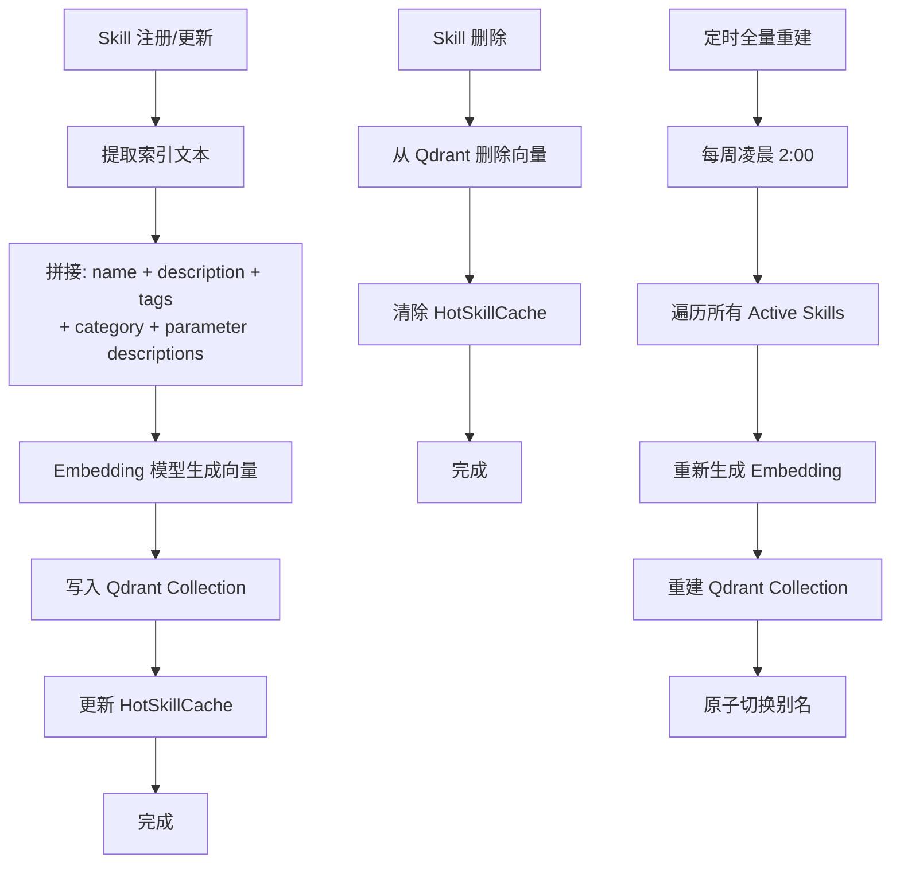
```mermaid
graph TD
    A[Skill 注册/更新] --> B[提取索引文本]
    B --> C["拼接: name + description + tags<br/>+ category + parameter descriptions"]
    C --> D[Embedding 模型生成向量]
    D --> E[写入 Qdrant Collection]
    E --> F[更新 HotSkillCache]
    F --> G[完成]

    H[Skill 删除] --> I[从 Qdrant 删除向量]
    I --> J[清除 HotSkillCache]
    J --> K[完成]

    L[定时全量重建] --> M[每周凌晨 2:00]
    M --> N[遍历所有 Active Skills]
    N --> O[重新生成 Embedding]
    O --> P[重建 Qdrant Collection]
    P --> Q[原子切换别名]
```

**Qdrant Collection 设计**：
- Collection 名称：`skills_index`
- 向量维度：512
- 距离度量：Cosine
- Payload 字段：`skill_id`, `name`, `category`, `status`, `version`
- HNSW 索引参数：`m=16`, `ef_construct=100`（适合 670+ 规模）
- 优化器配置：`indexing_threshold=0`（小规模全量索引）

**增量更新策略**：
- Skill 注册/更新时同步更新 Qdrant（单条 upsert，延迟 < 50ms）
- 使用 Qdrant 的 `set_payload` 更新元数据，无需重新生成向量（当仅修改权限/状态时）
- 写入 Qdrant 后同步更新 Redis 缓存

### 9.2 两阶段检索详细流程

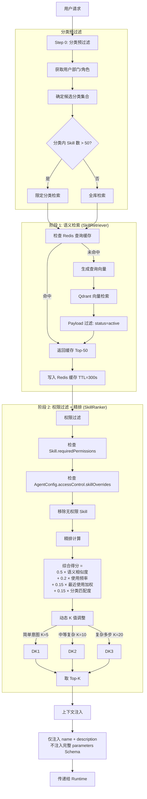
```mermaid
graph TD
    START[用户请求] --> CAT[Step 0: 分类预过滤]

    subgraph 预过滤["分类预过滤"]
        CAT --> CAT1[获取用户部门/角色]
        CAT1 --> CAT2[确定候选分类集合]
        CAT2 --> CAT3{"分类内 Skill 数 > 50?"}
        CAT3 -->|是| CAT4[限定分类检索]
        CAT3 -->|否| CAT5[全库检索]
    end

    CAT4 --> CACHE
    CAT5 --> CACHE

    subgraph 阶段1["阶段 1: 语义检索 (SkillRetriever)"]
        CACHE[检查 Redis 查询缓存]
        CACHE -->|命中| RET_RESULT[返回缓存 Top-50]
        CACHE -->|未命中| EMB[生成查询向量]
        EMB --> QD_SEARCH[Qdrant 向量检索]
        QD_SEARCH --> QD_FILTER[Payload 过滤: status=active]
        QD_FILTER --> RET_RESULT
        RET_RESULT --> CACHE_SET[写入 Redis 缓存 TTL=300s]
    end

    CACHE_SET --> PERM

    subgraph 阶段2["阶段 2: 权限过滤 + 精排 (SkillRanker)"]
        PERM[权限过滤]
        PERM --> PERM1[检查 Skill.requiredPermissions]
        PERM1 --> PERM2[检查 AgentConfig.accessControl.skillOverrides]
        PERM2 --> PERM3[移除无权限 Skill]

        PERM3 --> RERANK[精排计算]
        RERANK --> RERANK1["综合得分 =<br/>0.5 × 语义相似度<br/>+ 0.2 × 使用频率<br/>+ 0.15 × 最近使用加权<br/>+ 0.15 × 分类匹配度"]

        RERANK1 --> DK[动态 K 值调整]
        DK -->|"简单意图 K=5"| DK1
        DK -->|"中等复杂 K=10"| DK2
        DK -->|"复杂多步 K=20"| DK3

        DK1 & DK2 & DK3 --> TOPK[取 Top-K]
    end

    TOPK --> INJECT[上下文注入]
    INJECT --> INJECT1["仅注入 name + description<br/>不注入完整 parameters Schema"]
    INJECT1 --> DONE[传递给 Runtime]
```

**动态 K 值判定逻辑**：

| 意图复杂度 | 判定条件 | K 值 |
|-----------|----------|------|
| 简单 | 查询长度 < 20 字 + 单一意图 | 5 |
| 中等 | 查询长度 20-80 字 或 多条件查询 | 10 |
| 复杂 | 查询长度 > 80 字 或 多步骤任务（含"并且"/"然后"等连接词） | 20 |

意图复杂度由轻量级规则引擎判定（非 LLM 调用，避免增加延迟）。

### 9.3 缓存策略

| 缓存层 | 存储位置 | 缓存内容 | TTL | 淘汰策略 |
|--------|---------|---------|-----|---------|
| **查询结果缓存** | Redis | `query_hash → Top-50 Skills` | 300s | LRU, 最大 10000 条 |
| **热点 Skill 缓存** | Redis + 内存 | 高频 Skill 完整元数据 | 3600s | LFU, 基于 APScheduler 统计 |
| **Schema 延迟缓存** | Redis | `skill_id → JSON Schema` | 1800s | TTL 过期自动清除 |
| **用户权限缓存** | Redis | `user_id → allowed_skill_ids` | 600s | 主动失效（权限变更时） |

**热点 Skill 识别**：
- 使用 Redis Sorted Set 记录 Skill 调用频次（`skill:freq`）
- 每小时统计 Top-50 高频 Skill，预加载完整元数据到内存
- 新 Skill 注册后 24h 内不参与热点判定（冷启动保护）

**缓存失效场景**：
- Skill 更新/删除 → 清除相关缓存 + Qdrant 索引
- 用户权限变更 → 清除该用户的权限缓存
- Agent 配置更新（Skills 列表变化）→ 清除该 Agent 的查询缓存

### 9.4 Skill 分组与分类策略

**分类体系**（按业务系统一级分类 + 二级标签）：

| 一级分类（业务系统） | 二级标签示例 | 预估 Skill 数 |
|---------|------------|-------------|
| 财务系统 | 报销、预算、报表、审批、发票、凭证、对账 | ~100 |
| 超市管理 | 商品、库存、促销、收银、会员、供应链、采购 | ~100 |
| 百货管理 | 柜位、品牌、合同、租金、销售、客流、坪效 | ~90 |
| 人事系统 | 请假、薪资、组织架构、招聘、培训、考勤、绩效 | ~80 |
| 物业系统 | 报修、巡检、能耗、安防、保洁、停车、合同 | ~70 |
| CRM 系统 | 会员、积分、等级、标签、画像、营销活动、客户旅程 | ~80 |
| 储值卡系统 | 发卡、充值、消费、退款、余额查询、卡券、规则引擎、对账 | ~70 |
| 平台通用 | 搜索、计算、文档、通知、日历、数据导出 | ~60 |

> **分类总计**：~670 Skills（8 个一级分类）

**分组检索优化**：
- Qdrant Payload 中存储 `category` 字段，检索时使用 `filter` 预过滤
- 用户身份 → 候选分类映射存储在 Redis（`user:{id}:categories`）
- 当分类内 Skill 数 > 50 时启用分类过滤，否则全库检索避免召回不足

---

## 10. 多运行时切换机制详细设计

### 10.1 运行时注册与发现

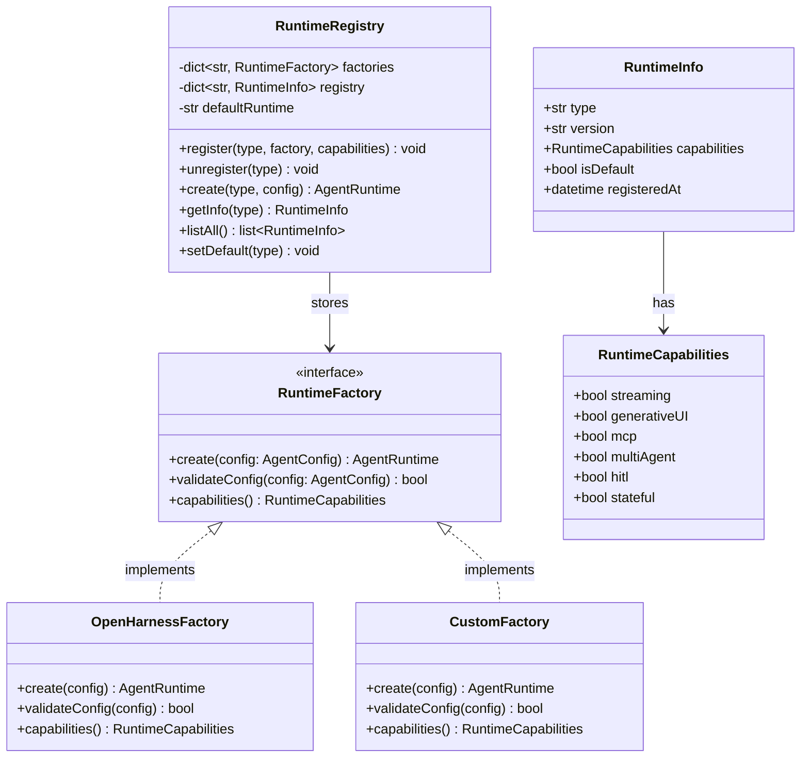
```mermaid
classDiagram
    class RuntimeRegistry {
        -dict~str, RuntimeFactory~ factories
        -dict~str, RuntimeInfo~ registry
        -str defaultRuntime
        +register(type, factory, capabilities) void
        +unregister(type) void
        +create(type, config) AgentRuntime
        +getInfo(type) RuntimeInfo
        +listAll() list~RuntimeInfo~
        +setDefault(type) void
    }

    class RuntimeFactory {
        <<interface>>
        +create(config: AgentConfig) AgentRuntime
        +validateConfig(config: AgentConfig) bool
        +capabilities() RuntimeCapabilities
    }

    class RuntimeInfo {
        +str type
        +str version
        +RuntimeCapabilities capabilities
        +bool isDefault
        +datetime registeredAt
    }

    class RuntimeCapabilities {
        +bool streaming
        +bool generativeUI
        +bool mcp
        +bool multiAgent
        +bool hitl
        +bool stateful
    }

    class OpenHarnessFactory {
        +create(config) AgentRuntime
        +validateConfig(config) bool
        +capabilities() RuntimeCapabilities
    }

    class CustomFactory {
        +create(config) AgentRuntime
        +validateConfig(config) bool
        +capabilities() RuntimeCapabilities
    }

    RuntimeRegistry --> RuntimeFactory : stores
    RuntimeFactory <|.. OpenHarnessFactory : implements
    RuntimeFactory <|.. CustomFactory : implements
    RuntimeInfo --> RuntimeCapabilities : has
```

**注册流程**：
1. 服务启动时，自动注册内置运行时（OpenHarness 为默认）
2. 外部运行时通过 `POST /admin/runtimes/register` API 注册（传入工厂类路径 + 能力声明）
3. 注册时执行 `validateConfig()` 确保工厂可用
4. 运行时信息持久化到 PostgreSQL `runtime_registry` 表

**OpenHarness 框架说明**：
- OpenHarness 是香港大学数据科学研究所（HKUDS）开源的轻量级 Agent 基础设施框架（MIT 协议，3.5k+ Star）
- 核心理念：Agent = LLM（智能）+ Harness（双手+双眼+记忆+安全边界），模型决定做什么，Harness 决定怎么做
- 10 大子系统：engine/ tools/ skills/ plugins/ permissions/ hooks/ commands/ mcp/ memory/ coordinator/
- 内置 43+ 工具、40+ Skills（.md 格式按需加载）、MCP 协议客户端（stdio/HTTP/SSE）、权限系统（默认/自动/计划三种模式）
- 多 Agent Swarm 协调机制（动态生成子 Agent）、持久记忆子系统、生命周期钩子（hooks）、插件系统（兼容 claude-code 格式）
- Python 96.5% + React 3.5%（终端 UI），uv 包管理，Python 3.10+，Anthropic/OpenAI API 格式
- 模型支持：通义千问、DeepSeek、Kimi、Ollama、Groq、SiliconFlow 等

**平台集成方式**：
- 后端通过 Python 包（`pip install openharness` 或 uv 引入）引入 OpenHarness engine 引擎
- 用平台 LLM Gateway 替换 OpenHarness 默认 LLM 调用（统一 API Key 管理、Token 计费、出站代理、故障切换）
- 用平台 Skills 系统（670+ 业务 Skills，语义检索+权限过滤）替换 OpenHarness 内置 Skills 系统
- 保留 OpenHarness 的 MCP 客户端（连接业务系统适配层 BusinessSystemAdapter）
- 保留 OpenHarness 的权限系统（与平台 IdentityManager/PermissionEngine 联动）
- 保留 OpenHarness 的 Agent Loop 引擎（模型决策 → Harness 执行 → 安全边界校验 → 流式输出）

### 10.2 切换流程状态机

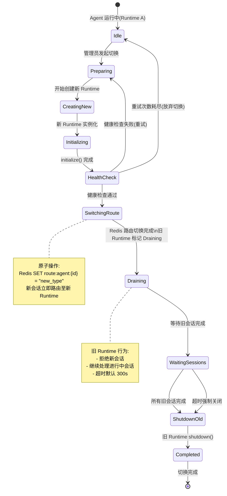
```mermaid
stateDiagram-v2
    [*] --> Idle: Agent 运行中(Runtime A)

    Idle --> Preparing: 管理员发起切换

    Preparing --> CreatingNew: 开始创建新 Runtime
    CreatingNew --> Initializing: 新 Runtime 实例化
    Initializing --> HealthCheck: initialize() 完成
    HealthCheck --> SwitchingRoute: 健康检查通过
    HealthCheck --> Preparing: 健康检查失败(重试)
    HealthCheck --> Idle: 重试次数耗尽(放弃切换)

    SwitchingRoute --> Draining: Redis 路由切换完成\n旧 Runtime 标记 Draining

    Draining --> WaitingSessions: 等待旧会话完成
    WaitingSessions --> ShutdownOld: 所有旧会话完成
    WaitingSessions --> ShutdownOld: 超时强制关闭

    ShutdownOld --> Completed: 旧 Runtime shutdown()
    Completed --> [*]: 切换完成

    note right of SwitchingRoute
        原子操作:
        Redis SET route:agent:{id} = "new_type"
        新会话立即路由至新 Runtime
    end note

    note right of Draining
        旧 Runtime 行为:
        - 拒绝新会话
        - 继续处理进行中会话
        - 超时默认 300s
    end note
```

### 10.3 会话迁移策略

**核心原则**：旧会话在旧运行时上完成，新会话路由至新运行时，不进行会话中途迁移。

| 策略 | 说明 |
|------|------|
| **新会话路由** | Redis 中 `route:agent:{agentId}` 存储当前活跃运行时类型，新会话查询此 Key 路由 |
| **旧会话保持** | 旧运行时进入 Draining 后，已建立的会话继续在旧运行时上处理 |
| **会话状态恢复** | 会话状态存储在 Redis（`session:{sessionId}:state`），新运行时可通过 `getState()` 恢复 |
| **超时处理** | Draining 超时（默认 300s）后强制关闭旧运行时，向未完成会话用户发送通知 |
| **会话恢复** | 强制关闭后，用户可发起新会话，新运行时从 Redis 恢复历史上下文 |
| **灰度切换** | 支持按比例引流：`route:agent:{id}` 可配置为 `{"new": 0.1, "old": 0.9}`，Gateway 按比例路由 |

**会话路由 Redis 结构**：

```
# 当前活跃运行时类型
route:agent:{agentId} = "openharness"

# 灰度配置（可选）
route:agent:{agentId}:weighted = '{"openharness": 0.9, "custom": 0.1}'

# Draining 运行时的活跃会话集合
draining:agent:{agentId} = Set{sessionId1, sessionId2, ...}

# 会话→运行时映射（用于旧会话继续在旧运行时处理）
session:{sessionId}:runtime = "openharness"
```

---

## 11. SSO/OAuth 集成方案详细设计

### 11.1 方案概述

采用 **企业微信 OAuth2 直连 + 本地 JWT** 方案，企业微信作为唯一身份源，后端直接验证企业微信 UserID 并签发本地 JWT，不引入任何额外 IdP 组件。

| 组件 | 角色 | 说明 |
|------|------|------|
| **企业微信** | 唯一身份源 | 已有员工账号、部门、角色信息，JS-SDK OAuth2 获取 UserID |
| **IdentityManager** | 认证 + JWT 签发/验证 | 直接处理认证（验证企业微信 UserID / 验证用户名密码），签发和验证本地 JWT |
| **本地 PostgreSQL** | 用户数据存储 | 企业微信组织架构同步至本地 users/departments 表，RBAC 角色权限存储 |
| **Redis** | 权限缓存 | 缓存用户权限信息（TTL 600s），降低数据库查询压力 |

**不引入独立 IdP 的理由**：
- 企业微信已包含完整组织架构（用户/部门/角色），无需第二个身份系统
- 100-200 用户规模下，自建 JWT 签发/验证逻辑足够简单可靠
- 减少部署组件，降低运维复杂度
- 独立 H5 入口通过用户名密码登录，用户数据从企业微信同步到本地数据库
- 管理后台通过本地 JWT + RBAC 角色控制，仅 `admin` 角色用户可访问

### 11.2 认证流程

#### 11.2.1 企业微信 H5 入口

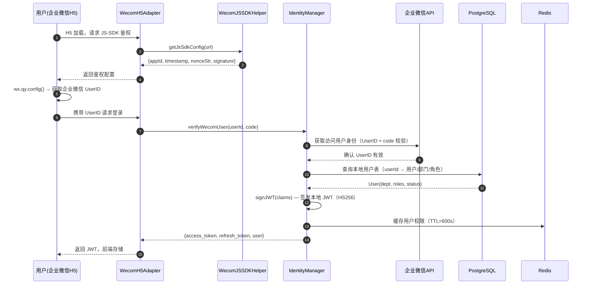
```mermaid
sequenceDiagram
    autonumber
    participant U as 用户(企业微信H5)
    participant WA as WecomH5Adapter
    participant JSSDK as WecomJSSDKHelper
    participant IDM as IdentityManager
    participant WECOM as 企业微信API
    participant PG as PostgreSQL
    participant RD as Redis

    U->>WA: H5 加载，请求 JS-SDK 鉴权
    WA->>JSSDK: getJsSdkConfig(url)
    JSSDK-->>WA: {appId, timestamp, nonceStr, signature}
    WA-->>U: 返回鉴权配置
    U->>U: wx.qy.config() → 获取企业微信 UserID

    U->>WA: 携带 UserID 请求登录
    WA->>IDM: verifyWecomUser(userId, code)
    IDM->>WECOM: 获取访问用户身份（UserID + code 校验）
    WECOM-->>IDM: 确认 UserID 有效

    IDM->>PG: 查询本地用户表（userId → 用户/部门/角色）
    PG-->>IDM: User{dept, roles, status}
    IDM->>IDM: signJWT(claims) — 签发本地 JWT（HS256）
    IDM->>RD: 缓存用户权限（TTL=600s）
    IDM-->>WA: {access_token, refresh_token, user}
    WA-->>U: 返回 JWT，前端存储
```

#### 11.2.2 独立 H5 入口

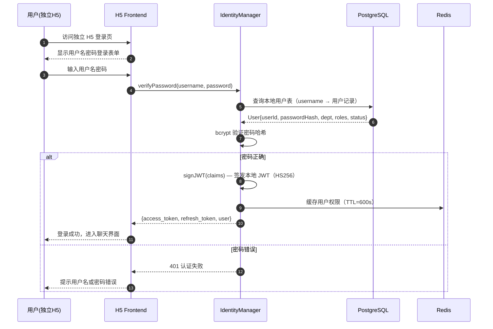
```mermaid
sequenceDiagram
    autonumber
    participant U as 用户(独立H5)
    participant FE as H5 Frontend
    participant IDM as IdentityManager
    participant PG as PostgreSQL
    participant RD as Redis

    U->>FE: 访问独立 H5 登录页
    FE-->>U: 显示用户名密码登录表单

    U->>FE: 输入用户名密码
    FE->>IDM: verifyPassword(username, password)

    IDM->>PG: 查询本地用户表（username → 用户记录）
    PG-->>IDM: User{userId, passwordHash, dept, roles, status}

    IDM->>IDM: bcrypt 验证密码哈希
    alt 密码正确
        IDM->>IDM: signJWT(claims) — 签发本地 JWT（HS256）
        IDM->>RD: 缓存用户权限（TTL=600s）
        IDM-->>FE: {access_token, refresh_token, user}
        FE-->>U: 登录成功，进入聊天界面
    else 密码错误
        IDM-->>FE: 401 认证失败
        FE-->>U: 提示用户名或密码错误
    end
```

> **用户数据来源**：独立 H5 登录的用户数据来自企业微信组织架构同步（见 11.3），用户首次登录前由管理员通过同步或手动创建，密码使用 bcrypt 哈希存储。

#### 11.2.3 Token 刷新流程

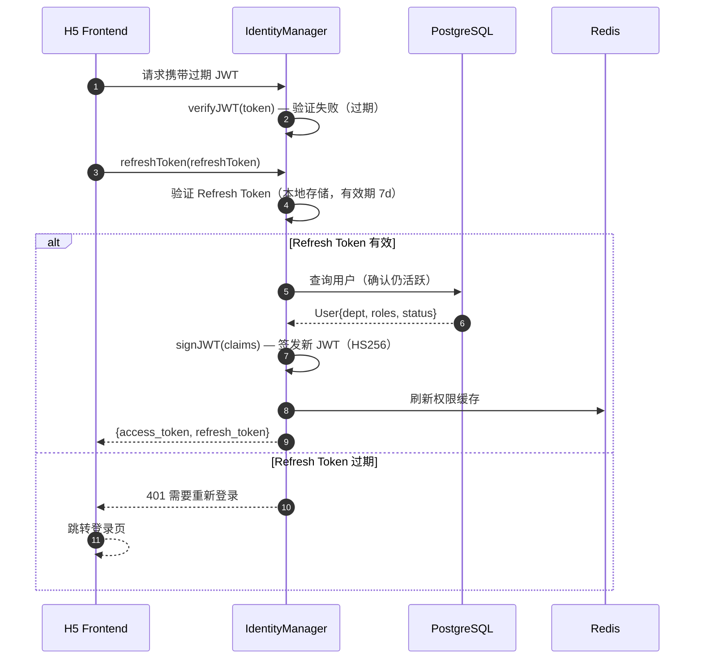
```mermaid
sequenceDiagram
    autonumber
    participant FE as H5 Frontend
    participant IDM as IdentityManager
    participant PG as PostgreSQL
    participant RD as Redis

    FE->>IDM: 请求携带过期 JWT
    IDM->>IDM: verifyJWT(token) — 验证失败（过期）

    FE->>IDM: refreshToken(refreshToken)
    IDM->>IDM: 验证 Refresh Token（本地存储，有效期 7d）

    alt Refresh Token 有效
        IDM->>PG: 查询用户（确认仍活跃）
        PG-->>IDM: User{dept, roles, status}
        IDM->>IDM: signJWT(claims) — 签发新 JWT（HS256）
        IDM->>RD: 刷新权限缓存
        IDM-->>FE: {access_token, refresh_token}
    else Refresh Token 过期
        IDM-->>FE: 401 需要重新登录
        FE-->>FE: 跳转登录页
    end
```

### 11.3 企业微信组织架构同步

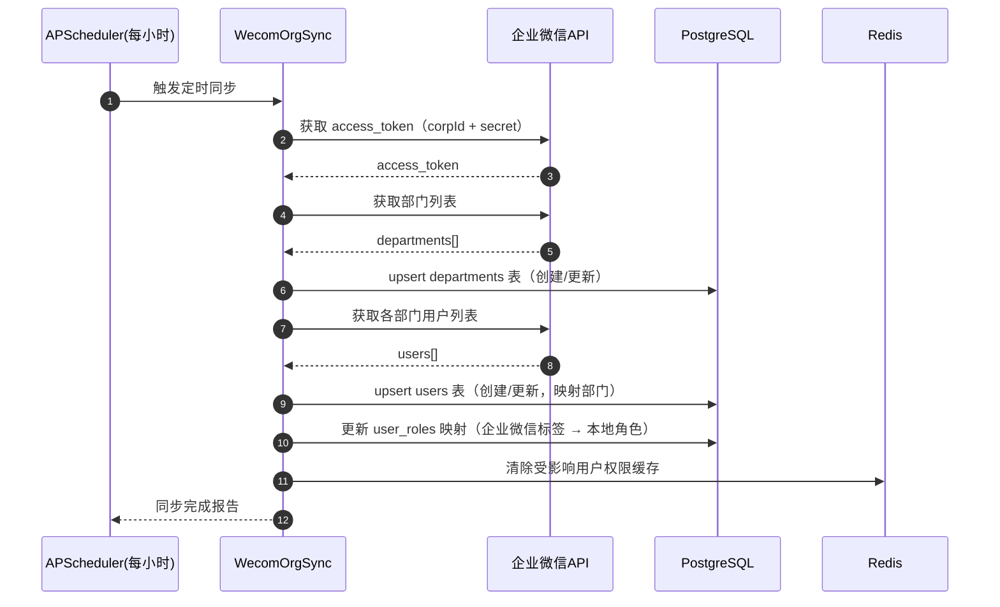
```mermaid
sequenceDiagram
    autonumber
    participant CRON as APScheduler(每小时)
    participant WS as WecomOrgSync
    participant WECOM as 企业微信API
    participant PG as PostgreSQL
    participant RD as Redis

    CRON->>WS: 触发定时同步
    WS->>WECOM: 获取 access_token（corpId + secret）
    WECOM-->>WS: access_token

    WS->>WECOM: 获取部门列表
    WECOM-->>WS: departments[]
    WS->>PG: upsert departments 表（创建/更新）

    WS->>WECOM: 获取各部门用户列表
    WECOM-->>WS: users[]
    WS->>PG: upsert users 表（创建/更新，映射部门）
    WS->>PG: 更新 user_roles 映射（企业微信标签 → 本地角色）

    WS->>RD: 清除受影响用户权限缓存
    WS-->>CRON: 同步完成报告
```

**同步策略**：
- 全量同步频率：每小时一次（APScheduler 定时任务）
- 增量同步：企业微信支持通讯录变更回调，可配置 Webhook 实时同步
- 冲突处理：以企业微信为权威源，本地手动创建的用户标记为"本地用户"，不覆盖
- 角色映射：企业微信标签 → 本地角色表（可配置映射规则，存储在 `role_mappings` 表）
- 密码初始化：新同步用户默认禁用密码登录，需管理员重置初始密码后才能使用独立 H5 入口

### 11.4 IdentityManager 职责

IdentityManager 直接处理认证，签发和验证本地 JWT，不再依赖外部 IdP：

| 职责 | 说明 |
|------|------|
| 验证企业微信用户 | `verifyWecomUser(userId, code)` — 调用企业微信 API 确认 UserID 有效，查询本地用户表获取角色权限 |
| 验证用户名密码 | `verifyPassword(username, password)` — 查询本地用户表，bcrypt 验证密码哈希（独立 H5 入口） |
| 签发本地 JWT | `signJWT(claims)` — HS256 对称密钥签名，Access Token 2h，Refresh Token 7d |
| 验证 JWT | `verifyJWT(token)` — 本地 HS256 验签 + 过期检查 |
| 刷新 Token | `refreshToken(refreshToken)` — 验证 Refresh Token 有效性，签发新 JWT |
| 获取权限 | `getPermissions(userId)` — 从本地数据库读取 RBAC 角色权限，Redis 缓存（TTL 600s） |

**JWT Token 载荷**：`{ userId, username, department, roles, channel, agentId, iss, exp, iat }`

**权限缓存失效**：
- 组织架构同步后，清除所有受影响用户的权限缓存
- 管理员手动修改权限后，主动清除目标用户缓存
- Token 刷新时重新拉取权限

### 11.5 部署架构

```
                    ┌──────────────────────────────────────────────┐
                    │           Nginx (内网反向代理)                  │
                    └──┬──────────┬──────────┐                       │
                       │          │          │
            ┌──────────▼┐ ┌──────▼────┐ ┌───▼──────┐
            │ H5前端     │ │ Gateway   │ │Agent Core│
            │ (静态)     │ │ (N副本)   │ │ (N副本)  │
            └────────────┘ └──────┬───┘ └───┬──────┘
                                   │         │
                          ┌────────┴─────────┘
                          │
                ┌─────────▼──────────────────┐
                │  企业微信 API (内网代理)     │
                │  • 通讯录同步 API            │
                │  • JS-SDK 签名 API           │
                │  • 用户身份验证 API           │
                └────────────────────────────┘
```

不引入额外身份组件。用户/角色/权限数据存储在现有 PostgreSQL 中（`users`、`departments`、`roles`、`user_roles` 表），权限缓存使用现有 Redis。

### 11.6 业务系统凭证托管

7 个业务系统（财务/超市/百货/人事/物业/CRM/储值卡）各自独立账号体系，平台用户需映射到各业务系统账号并安全托管登录凭证。

#### 11.6.1 设计架构

```
┌─────────────────────────────────────────────────────────────────┐
│                    Agent Core                                    │
│                                                                  │
│  ┌──────────────┐    ┌──────────────────┐    ┌───────────────┐  │
│  │ Credential   │    │ CredentialVault  │    │ Credential    │  │
│  │ Mapper       │───▶│ (AES-256 加密)   │    │ Vault         │  │
│  │ 用户→系统映射 │    │                  │◀───│ (解密返回)     │  │
│  └──────┬───────┘    └──────────────────┘    └───────────────┘  │
│         │                                                        │
│         ▼                                                        │
│  ┌──────────────────────────────────────────────────────────┐   │
│  │ BusinessSystemAdapter.callTool(name, args)               │   │
│  │  1. 查映射：getMapping(userId, systemType) → account     │   │
│  │  2. 取凭证：getCredential(userId, systemType) → 解密     │   │
│  │  3. 登录业务系统 → 获取 Session/Token                    │   │
│  │  4. 调用业务系统 API                                     │   │
│  │  5. 返回结果                                             │   │
│  └──────────────────────────────────────────────────────────┘   │
└─────────────────────────────────────────────────────────────────┘
```

#### 11.6.2 核心组件

**CredentialVault（凭证保险库）**：
- 使用 AES-256-GCM 加密存储各业务系统登录凭证（用户名/密码/Token/API Key）
- 加密密钥存储在环境变量（`CREDENTIAL_VAULT_KEY`），不落库
- 每条凭证独立 IV（初始化向量），防止密文碰撞
- 支持凭证过期检测与自动刷新（如业务系统 Token 过期）

**CredentialMapper（账号映射器）**：
- 维护平台用户 → 各业务系统账号的映射关系
- 一个平台用户可映射到多个业务系统（1:N）
- 支持自动映射（企业微信工号 → 业务系统工号）和手动映射（管理员配置）
- 映射存储在 PostgreSQL `credential_mappings` 表

#### 11.6.3 适配层调用流程

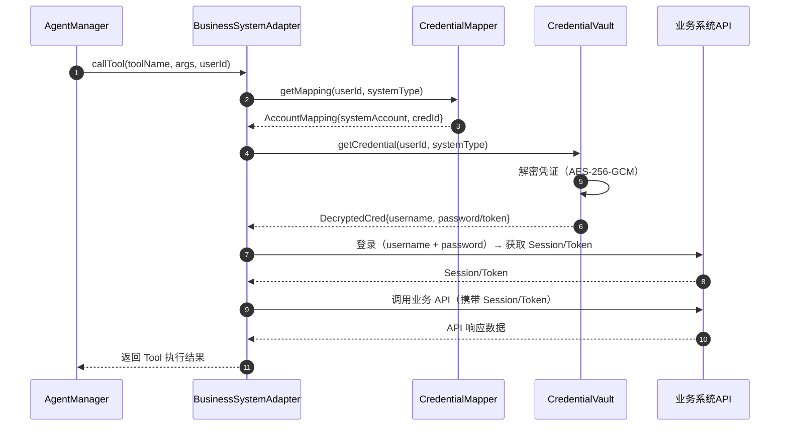
```mermaid
sequenceDiagram
    autonumber
    participant AM as AgentManager
    participant BA as BusinessSystemAdapter
    participant CM as CredentialMapper
    participant CV as CredentialVault
    participant BS as 业务系统API

    AM->>BA: callTool(toolName, args, userId)
    BA->>CM: getMapping(userId, systemType)
    CM-->>BA: AccountMapping{systemAccount, credId}

    BA->>CV: getCredential(userId, systemType)
    CV->>CV: 解密凭证（AES-256-GCM）
    CV-->>BA: DecryptedCred{username, password/token}

    BA->>BS: 登录（username + password）→ 获取 Session/Token
    BS-->>BA: Session/Token

    BA->>BS: 调用业务 API（携带 Session/Token）
    BS-->>BA: API 响应数据

    BA-->>AM: 返回 Tool 执行结果
```

#### 11.6.4 安全约定

- 凭证明文仅在内存中短暂存在，调用完成后立即清除
- 凭证解密日志禁止记录明文（仅记录 userId + systemType）
- 管理员可通过管理后台查看/重置用户凭证映射
- 凭证变更需审计日志（记录谁在何时修改了谁的凭证）
- AES-256 加密密钥定期轮换（建议每 90 天），轮换时批量重加密所有凭证

---

## 12. 待明确事项

| 编号 | 待明确事项 | 影响范围 | 当前状态/假设 | 建议解决方式 |
|------|-----------|---------|---------|-------------|
| A1 | ~~企业微信应用类型~~ | ~~Gateway 适配器~~ | ✅ **已确认**：H5 嵌入工作台 + JS-SDK | 已更新为 WecomH5Adapter |
| A2 | ~~微信端形态~~ | ~~Gateway 微信适配器~~ | ✅ **v1.3 更新**：v1.2 删除的微信机器人已由**企业微信智能机器人**替代（不同形态），新增 WecomBotAdapter + WecomBotClient + ChannelCapability + EventTransformer 能力感知降级 | 见第 13 节渠道适配与能力降级 |
| A3 | ~~统一身份认证体系~~（SSO/OAuth 对接细节） | IdentityManager、权限引擎 | ✅ **已确认**：企业微信 OAuth2 直连 + 本地 JWT，不引入独立 IdP | 见第 11 节 SSO/OAuth 集成方案 |
| A4 | ~~LLM 供应商~~ | ~~OpenHarnessRuntime~~ | ✅ **v1.3 更新**：deepseek-v4-flash（主力）+ qwen3.6-plus（备选），通过购买厂家 API 服务使用，经 LLM 网关层 + 出站代理访问 | 见第 15 节 LLM 网关层 |
| A5 | ~~Skills 来源~~ | ~~SkillRegistry 初始化~~ | ✅ **已确认**：财务/超市/百货/人事/物业/CRM/储值卡系统 | 已更新分类体系（8 类 ~670 Skills） |
| A6 | **自研运行时时间线** | RuntimeRegistry 设计深度 | 假设 OpenHarness 使用 3-6 个月 | 确认自研运行时方案与时间线 |
| A7 | ~~部署环境~~ | ~~Docker vs K8s~~ | ✅ **v1.3 更新**：内网部署，LLM API 经出站代理访问厂家端点，Embedding 模型内网部署 | Docker Compose + outbound-proxy |
| A8 | ~~并发规模~~ | ~~容量规划~~ | ✅ **已确认**：100-200 用户并发 | 单实例可覆盖 |
| A9 | **对话记录留存与合规** | 数据库设计、存储策略 | 假设留存 90 天 | 法务确认留存政策 |
| A10 | ~~国产 LLM 具体选型~~ | ~~ModelProvider 实现~~ | ✅ **v1.3 更新**：deepseek-v4-flash + qwen3.6-plus，经 LLM 网关层统一管理 API Key 与成本控制 | 见第 15 节 |
| A11 | ~~微信机器人框架选型~~ | ~~WechatBotAdapter 实现~~ | ✅ **v1.3 更新**：企业微信智能机器人（非原微信机器人），WebSocket 长连接 + 6 种 template_card | 见第 13 节 |
| A12 | ~~业务系统 API 现状~~ | ~~MCP Server 开发工作量~~ | ✅ **已设计**：新增 BusinessSystemAdapter 统一适配层 | 见 ADR-13，各系统一个适配器 |
| A13 | ~~身份认证组件选型~~ | SSO/OAuth 集成 | ✅ **已确认**：企业微信直连 + 本地 JWT，无需额外 IdP 组件 | 见 ADR-14 |
| A14 | ~~Agent 选择方式~~ | ~~前端交互、路由设计~~ | ✅ **v1.3 已确认**：前端不提供 Agent/运行时选择，AgentRouter 后台自动路由（4级策略链） | 见第 14 节 + ADR-16 |
| A15 | ~~配置目录格式~~ | ~~配置管理、运维~~ | ✅ **v1.3 已确认**：configs/agents/{agent_name}/ 目录结构，文件系统+数据库双模式，热更新 | 见第 16 节 + ADR-18 |
| A16 | ~~LLM 部署方式~~ | ~~架构选型、成本~~ | ✅ **v1.3 已确认**：购买厂家 API 服务，不自建 GPU 集群，LLM 网关层 + 出站代理 | 见第 15 节 + ADR-17 |
| A17 | **出站代理高可用**：内网出站代理是否需要高可用方案？代理故障时 LLM 服务如何降级？ | LLM 网关设计 | 建议：代理池 + 健康检查，代理故障时降级为缓存响应或提示用户稍后重试 | 需确认代理故障降级策略 |
| A18 | **Bot 渠道推送模板对齐**：Bot 渠道主动推送的 template_card 模板需与企业微信模板规范完全对齐，具体推送场景和模板需确认 | 推送机制设计 | 建议：与企业微信管理后台模板库对齐，支持审批待办/数据摘要/任务提醒等场景 | 需确认推送模板清单 |
| A19 | **动态记忆写入触发策略**：Agent 自动写入动态记忆的时机和判断逻辑需细化——是每轮对话都评估还是仅特定场景触发？是否需要 LLM 二次判断记忆重要性？ | 记忆机制设计 | 建议：MemoryInjector 在 after_agent_run 阶段调用 LLM 提取记忆点（轻量提示词），仅 importance > 0.3 的写入 | 需确认记忆提取策略与成本影响 |
| A20 | ~~会话级记忆的自动清理时机~~ | ~~记忆机制设计~~ | ✅ **v1.4.1 已确认**：会话结束后将会话级 summary 记忆保留 7 天（TTL），之后自动过期清理；importance >= 0.8 的会话级记忆自动提升为用户级（清除 session_id 字段） | 见第 17 节 + ADR-20 |

---

## 13. 渠道适配与能力降级详细设计

### 13.1 设计概述

v1.3 新增企业微信智能机器人作为第三渠道。Bot 渠道与企业微信 H5 / 独立 H5 在能力上存在本质差异：Bot 不支持流式输出、不支持 Generative UI（自定义 React 组件）、仅支持 6 种企业微信 template_card。因此需要引入**渠道能力声明（ChannelCapability）**和**能力感知降级器（EventTransformer）**，使 Agent 产生的统一 AgentEvent 流能够按各渠道能力自动降级映射。

### 13.2 ChannelCapability 接口设计

```typescript
interface ChannelCapability {
  // 流式输出能力
  supportsStreaming: boolean;
  // 自定义 UI（Generative UI）能力
  supportsCustomUI: boolean;
  // 支持的卡片类型列表（Bot 渠道为 6 种 template_card，H5 渠道为空）
  supportedCardTypes: string[];
  // 文件上传能力
  supportsFileUpload: boolean;
  // 最大消息长度
  maxMessageLength: number;
  // Markdown 支持级别
  markdownSupportLevel: MarkdownSupportLevel; // FULL | LIMITED | NONE

  // 判断该渠道是否能渲染指定事件类型
  canRender(eventType: AgentEventType): boolean;
  // 根据组件类型获取对应的卡片类型（Bot 渠道使用）
  getCardType(componentType: string): string;
}
```

**三渠道能力实现**：

| 实现类 | supportsStreaming | supportsCustomUI | supportedCardTypes | supportsFileUpload | maxMessageLength | markdownSupportLevel |
|--------|------------------|-----------------|-------------------|-------------------|-----------------|---------------------|
| WecomH5Capability | true | true | [] | false | 4096 | FULL |
| WecomBotCapability | false | false | 6种 | false | 2048 | LIMITED |
| H5Capability | true | true | [] | true | 8192 | FULL |

### 13.3 EventTransformer 能力感知降级器

EventTransformer 是 Gateway 层的核心组件，负责将 Agent 产生的统一 AgentEvent 流转换为各渠道的原生消息格式。其核心逻辑是**能力感知降级**：

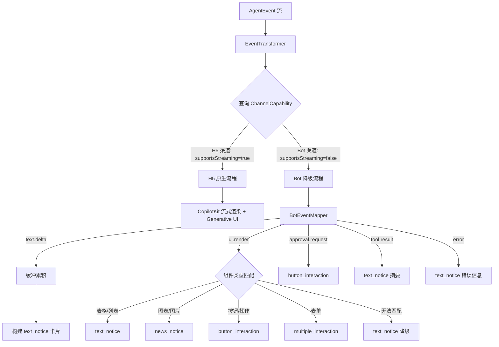
```mermaid
graph TD
    AE[AgentEvent 流] --> ET[EventTransformer]
    ET --> CC{查询 ChannelCapability}

    CC -->|H5 渠道: supportsStreaming=true| H5_FLOW[H5 原生流程]
    H5_FLOW --> H5_OUT[CopilotKit 流式渲染 + Generative UI]

    CC -->|Bot 渠道: supportsStreaming=false| BOT_DEGRADE[Bot 降级流程]
    BOT_DEGRADE --> BEM[BotEventMapper]

    BEM -->|text.delta| BUF[缓冲累积]
    BUF --> TN[构建 text_notice 卡片]

    BEM -->|ui.render| MATCH{组件类型匹配}
    MATCH -->|表格/列表| TN2[text_notice]
    MATCH -->|图表/图片| NN[news_notice]
    MATCH -->|按钮/操作| BI[button_interaction]
    MATCH -->|表单| MI[multiple_interaction]
    MATCH -->|无法匹配| TN3[text_notice 降级]

    BEM -->|approval.request| BI2[button_interaction]
    BEM -->|tool.result| TN4[text_notice 摘要]
    BEM -->|error| TN5[text_notice 错误信息]
```

### 13.4 Bot 渠道 6 种 template_card 映射规则

| AgentEvent 类型 | Bot 卡片类型 | 映射逻辑 | 示例 |
|----------------|-------------|---------|------|
| `text.delta`（缓冲后） | `text_notice` | 累积所有 text.delta → 合并为完整文本 → 构建 text_notice 卡片 | "您本月剩余年假5天" → text_notice |
| `ui.render`（表格/列表组件） | `text_notice` | 提取表格数据 → 格式化为文本摘要 → text_notice | LeaveReportCard → text_notice |
| `ui.render`（图表/图片组件） | `news_notice` | 提取图片URL/链接 → news_notice | SalesChart → news_notice |
| `ui.render`（按钮/操作组件） | `button_interaction` | 提取按钮列表 → button_interaction | ActionButtons → button_interaction |
| `ui.render`（表单组件） | `multiple_interaction` | 提取表单字段 → multiple_interaction | ReportForm → multiple_interaction |
| `ui.render`（无法匹配） | `text_notice` | 降级为文本摘要 + "请打开H5查看完整内容" | 未知组件 → text_notice |
| `approval.request` | `button_interaction` | 审批详情 + "同意"/"拒绝" 按钮 | salary-slip 审批 → button_interaction |
| `tool.call` / `tool.result` | `text_notice` | 简化为"正在查询..."→"查询完成"摘要 | tool call → text_notice |
| `error` | `text_notice` | 错误信息卡片 | error → text_notice |
| `done` | — | 无需额外处理 | — |

### 13.5 WecomBotClient WebSocket 长连接管理

```mermaid
stateDiagram-v2
    [*] --> Disconnected

    Disconnected --> Connecting: start()
    Connecting --> Connected: WebSocket 握手成功
    Connecting --> Disconnected: 连接失败(重试)

    Connected --> Heartbeating: 启动心跳定时器
    Heartbeating --> Heartbeating: 心跳响应正常
    Heartbeating --> Reconnecting: 心跳超时(3次未响应)

    Connected --> Messaging: 收发消息
    Messaging --> Heartbeating: 消息处理完成

    Reconnecting --> Connecting: 自动重连(指数退避)
    Reconnecting --> Disconnected: 重连次数耗尽

    Connected --> Disconnected: stop()
    Disconnected --> [*]: 最终退出
```

**心跳与重连参数**：
- 心跳间隔：30s
- 心跳超时：3 次未响应触发重连
- 重连策略：指数退避（1s → 2s → 4s → 8s → 16s → 30s 上限）
- 最大重连次数：10 次
- 重连成功后自动恢复消息收发

### 13.6 三渠道能力矩阵

详见 **8.9 节** 渠道能力矩阵表（三渠道 × 11 维度）。

---

## 14. AgentRouter 智能路由详细设计

### 14.1 设计概述

前端**不提供**用户选择 Agent/运行时的功能。所有用户请求由后台 AgentRouter 自动路由到最合适的 Agent 实例。AgentRouter 采用 4 级策略链，按优先级从高到低依次尝试，第一个命中的策略决定路由结果。

### 14.2 4 级路由策略链

```mermaid
graph TD
    REQ[用户请求到达] --> S1

    subgraph S1["策略1: 会话亲和性 (优先级: 1)"]
        S1_CHECK[检查 Redis: session:{sessionId}:agent_binding]
        S1_CHECK -->|有绑定| S1_HIT["路由到绑定Agent<br/>confidence: 1.0"]
        S1_CHECK -->|无绑定| S2
    end

    subgraph S2["策略2: 关键词匹配 (优先级: 2)"]
        S2_MATCH["遍历各Agent routing.keywords<br/>与用户请求文本匹配"]
        S2_MATCH -->|命中| S2_HIT["路由到匹配Agent<br/>confidence: 0.9"]
        S2_MATCH -->|未命中| S3
    end

    subgraph S3["策略3: 语义检索 (优先级: 3)"]
        S3_EMBED[用户请求 → bge-small-zh-v1.5 embedding]
        S3_EMBED --> S3_SEARCH[Qdrant agent_routing_index 检索 Top-5]
        S3_SEARCH --> S3_THRESH{Top-1 相似度 > 0.75?}
        S3_THRESH -->|是| S3_HIT["路由到 Top-1 Agent<br/>confidence: score"]
        S3_THRESH -->|否| S4
    end

    subgraph S4["策略4: 默认Agent兜底 (优先级: 4)"]
        S4_FALL["路由到 default-agent<br/>confidence: 0"]
    end

    S1_HIT --> BIND["Redis SET session:{sessionId}:agent_binding<br/>TTL=24h"]
    S2_HIT --> BIND
    S3_HIT --> BIND
    S4_FALL --> RESULT

    BIND --> LOG[RouteLogger 记录路由日志]
    LOG --> RESULT[返回 RouteResult]
    S4_FALL --> LOG
```

### 14.3 路由策略接口设计

```python
class RoutingStrategy(ABC):
    """路由策略抽象接口"""
    name: str           # 策略名称
    priority: int       # 优先级（1最高）

    @abstractmethod
    async def route(
        self,
        request: UserRequest,
        candidates: list[AgentConfig],
        session_ctx: SessionContext
    ) -> RouteResult | None:
        """执行路由，返回 None 表示未命中，交由下一策略"""
        ...

    @abstractmethod
    def is_applicable(
        self,
        request: UserRequest,
        session_ctx: SessionContext
    ) -> bool:
        """判断该策略是否适用于当前请求"""
        ...
```

**4 个策略实现**：

| 策略类 | name | priority | 核心逻辑 |
|--------|------|----------|---------|
| SessionAffinityStrategy | session_affinity | 1 | 查询 Redis `session:{sessionId}:agent_binding`，有绑定且 Agent 仍 enabled 则直接路由 |
| KeywordMatchStrategy | keyword_matching | 2 | 遍历各 Agent 的 `routing.keywords`，与用户请求文本做子串匹配，命中则路由（按 priority 排序） |
| SemanticSearchStrategy | semantic_retrieval | 3 | 用户请求 → bge-small-zh-v1.5 embedding → Qdrant `agent_routing_index` collection 检索 Top-5 → 相似度 > 0.75 则路由 |
| DefaultFallbackStrategy | default_fallback | 4 | 路由到配置的 default-agent，保证用户请求始终得到响应 |

### 14.4 语义检索复用 Qdrant

AgentRouter 的语义检索与 Skills 检索**共用 Qdrant 实例**，使用**不同 collection**：

| Collection | 用途 | 向量来源 | Payload 字段 |
|-----------|------|---------|-------------|
| `skills_index` | Skills 语义检索 | Skill name + description + tags | skill_id, name, category, status, version |
| `agent_routing_index` | AgentRouter 语义检索 | Agent metadata.yaml 的 description + tags | agent_id, name, description, tags, enabled |

**Agent 索引构建**：
- Agent 创建/更新时，从 `metadata.yaml` 读取 description + tags
- 使用 bge-small-zh-v1.5 生成 embedding（512 维）
- 写入 Qdrant `agent_routing_index` collection
- Agent 禁用/删除时从索引中移除

### 14.5 路由配置（agent.yaml routing 段）

```yaml
# agent.yaml 中的路由配置段
routing:
  keywords: ["请假", "年假", "考勤", "薪酬", "招聘", "培训", "HR"]  # 关键词匹配规则
  enabled: true                                                       # 是否参与自动路由
  priority: 10                                                        # 路由优先级（数值越高越优先匹配）

# metadata.yaml 中的语义检索元数据
metadata:
  name: "hr-assistant"
  display_name: "HR 助手"
  description: "人力资源问答与流程处理，支持考勤/薪酬/招聘/培训等场景"
  tags: ["HR", "人事", "考勤", "薪酬", "招聘", "培训"]
  version: "1.0.0"
```

### 14.6 路由日志表设计

```sql
CREATE TABLE route_logs (
    id          UUID PRIMARY KEY DEFAULT gen_random_uuid(),
    session_id  VARCHAR(64) NOT NULL,
    user_id     VARCHAR(64) NOT NULL,
    input_text  TEXT NOT NULL,              -- 用户请求文本（截断前200字）
    matched_agent_id  VARCHAR(64) NOT NULL,  -- 命中的 Agent ID
    strategy_used     VARCHAR(32) NOT NULL,  -- 命中的策略名称
    confidence  FLOAT,                       -- 置信度（0-1）
    latency_ms  INTEGER NOT NULL,            -- 路由延迟（毫秒）
    timestamp   TIMESTAMPTZ NOT NULL DEFAULT NOW(),

    INDEX idx_route_logs_session (session_id),
    INDEX idx_route_logs_user (user_id),
    INDEX idx_route_logs_agent (matched_agent_id),
    INDEX idx_route_logs_strategy (strategy_used),
    INDEX idx_route_logs_timestamp (timestamp)
);
```

**路由可观测性**：
- 管理后台路由日志页面：按会话/用户/Agent/策略维度查询路由决策
- 路由统计仪表盘：各 Agent 流量分布、各策略命中率、路由延迟趋势
- 路由调优：管理后台支持调整关键词规则、语义匹配阈值、默认 Agent

### 14.7 AgentRouter 时序图

详见 **5.6 节** AgentRouter 智能路由流程时序图。

---

## 15. LLM 网关层详细设计

### 15.1 设计概述

LLM 通过购买厂家 API 服务使用（deepseek-v4-flash 主力 + qwen3.6-plus 备选），不自建 GPU 推理集群。LLM 网关层（LLMGateway）作为统一入口，管理多厂家 API Key 轮转、Token 配额控制、出站代理、故障切换和用量追踪。所有 LLM API 请求通过内网出站代理访问厂家服务端点。

### 15.2 LLM 网关架构

```mermaid
graph TB
    subgraph AgentCore["Agent Core"]
        RT["OpenHarnessRuntime"]
    end

    subgraph LLMGW["LLM 网关层"]
        LGW["LLMGateway<br/>统一API入口/多厂家路由"]
        AKM["APIKeyManager<br/>Key池管理/轮转"]
        QM["QuotaManager<br/>Token配额/限流/告警"]
        OPM["OutboundProxyManager<br/>出站代理池/负载均衡/白名单"]
        TT["TokenTracker<br/>Token用量追踪"]
        FM["FailoverManager<br/>主力故障→备选切换"]
        DA["DeepSeekAdapter<br/>deepseek-v4-flash"]
        QA["QwenAdapter<br/>qwen3.6-plus"]
    end

    subgraph Proxy["内网出站代理层"]
        P1["Proxy Node 1"]
        P2["Proxy Node 2"]
        P3["Proxy Node N"]
    end

    subgraph External["厂家 API (外网)"]
        DS["DeepSeek API<br/>api.deepseek.com"]
        QW["Qwen API<br/>dashscope.aliyuncs.com"]
    end

    subgraph Storage["存储"]
        PG[("PostgreSQL<br/>token_usage/quota")]
        RD[("Redis<br/>Key缓存/配额缓存")]
    end

    RT -->|chatStream| LGW
    LGW --> AKM
    LGW --> QM
    LGW --> FM
    LGW --> DA
    LGW --> QA
    LGW --> TT

    AKM --> RD
    QM --> RD
    QM --> PG

    DA --> OPM
    QA --> OPM
    OPM --> P1
    OPM --> P2
    OPM --> P3

    P1 --> DS
    P2 --> QW
    P3 --> DS

    TT --> PG
    FM --> LGW
```

### 15.3 LLMGateway 核心类

```python
class LLMGateway:
    """LLM 网关 — 统一 API 入口"""

    def __init__(
        self,
        key_manager: APIKeyManager,
        quota_manager: QuotaManager,
        proxy_manager: OutboundProxyManager,
        token_tracker: TokenTracker,
        failover_manager: FailoverManager,
    ):
        self.key_manager = key_manager
        self.quota_manager = quota_manager
        self.proxy_manager = proxy_manager
        self.token_tracker = token_tracker
        self.failover_manager = failover_manager
        self.adapters = {
            "deepseek": DeepSeekAdapter(),
            "qwen": QwenAdapter(),
        }

    async def chat(self, request: LLMRequest) -> LLMResponse:
        """同步聊天（非流式）"""
        provider = self._select_provider(request.model)
        self._check_quota(request)
        key = self.key_manager.get_key(provider)
        proxy = self.proxy_manager.get_proxy()
        response = await self._call_with_failover(provider, request, key, proxy)
        self.token_tracker.record(request.session_id, request.user_id,
                                   request.dept, request.model, response.usage)
        return response

    async def chat_stream(self, request: LLMRequest) -> AsyncIterable[LLMChunk]:
        """流式聊天"""
        provider = self._select_provider(request.model)
        self._check_quota(request)
        key = self.key_manager.get_key(provider)
        proxy = self.proxy_manager.get_proxy()
        total_usage = TokenUsage()
        async for chunk in self._call_stream_with_failover(provider, request, key, proxy):
            if chunk.usage:
                total_usage += chunk.usage
            yield chunk
        self.token_tracker.record(request.session_id, request.user_id,
                                   request.dept, request.model, total_usage)

    def _select_provider(self, model: str) -> str:
        """根据模型名选择厂家"""
        if "deepseek" in model:
            return "deepseek"
        elif "qwen" in model:
            return "qwen"
        return "deepseek"  # 默认

    def _check_quota(self, request: LLMRequest):
        """配额检查"""
        if not self.quota_manager.check_quota(request.user_id, request.dept, estimated_tokens=4096):
            raise QuotaExceededError(f"用户 {request.user_id} Token 配额已用尽")
```

### 15.4 APIKeyManager — Key 池管理

- **多厂家 Key 池**：每个厂家（deepseek/qwen）维护一个 Key 列表
- **轮转策略**：round-robin 轮转，每次调用使用下一个 Key
- **Key 状态追踪**：记录每个 Key 的调用量、错误率、最后使用时间
- **Key 失效处理**：Key 返回 401/403 时自动从池中移除，告警通知管理员
- **Key 加密存储**：Key 明文使用 AES-256 加密存储在环境变量/密钥管理服务

### 15.5 QuotaManager — 配额控制

| 配额维度 | 默认值 | 说明 |
|---------|--------|------|
| 每用户每日 | 100,000 Token | 单用户每日 Token 上限 |
| 每部门每日 | 1,000,000 Token | 单部门每日 Token 上限 |
| 告警阈值 | 80% | 配额使用达 80% 时告警 |
| 超限行为 | 限流 | 返回 429 QuotaExceededError |

**配额检查流程**：每次 LLM 调用前 → 查询 Redis 中的当日已用 Token 数 → 预估本次调用 Token 数 → 判断是否超限 → 调用完成后更新实际用量。

### 15.6 OutboundProxyManager — 出站代理

```python
class OutboundProxyManager:
    """内网出站代理池管理"""

    # 访问白名单（仅允许已知厂家 API 域名）
    ALLOWED_DOMAINS = [
        "api.deepseek.com",
        "dashscope.aliyuncs.com",
    ]

    def get_proxy(self) -> ProxyNode:
        """负载均衡选择代理节点（round-robin）"""
        healthy_nodes = [n for n in self.proxy_pool if n.is_healthy]
        if not healthy_nodes:
            raise ProxyUnavailableError("所有出站代理节点不可用")
        node = healthy_nodes[self.currentIndex % len(healthy_nodes)]
        self.currentIndex += 1
        return node

    def is_allowed(self, domain: str) -> bool:
        """检查域名是否在白名单中"""
        return any(domain.endswith(d) for d in self.ALLOWED_DOMAINS)

    def log_request(self, request: dict, response: dict):
        """请求审计日志"""
        audit_log = {
            "timestamp": datetime.utcnow().isoformat(),
            "proxy_node": request.get("proxy_node"),
            "target_domain": request.get("domain"),
            "method": request.get("method"),
            "status_code": response.get("status_code"),
            "latency_ms": response.get("latency_ms"),
            "token_usage": response.get("token_usage"),
        }
        # 写入审计日志表
```

**代理池管理**：
- 代理节点健康检查：每 30s 探测一次，连续 3 次失败标记为不健康
- 负载均衡：round-robin 在健康节点间分配请求
- 代理故障降级：所有代理不可用时返回错误，提示用户稍后重试

### 15.7 FailoverManager — 故障切换

| 场景 | 行为 |
|------|------|
| 主力模型（deepseek-v4-flash）连续失败 3 次 | 自动切换到备选模型（qwen3.6-plus） |
| 备选模型也不可用 | 返回错误，提示用户稍后重试 |
| 主力模型恢复（探测成功） | 自动切回主力模型 |
| 单个 API Key 失效（401/403） | 从 Key 池移除，使用其他 Key |

### 15.8 TokenTracker — 用量追踪

```sql
CREATE TABLE token_usage (
    id          UUID PRIMARY KEY DEFAULT gen_random_uuid(),
    session_id  VARCHAR(64) NOT NULL,
    user_id     VARCHAR(64) NOT NULL,
    department  VARCHAR(64) NOT NULL,
    model       VARCHAR(64) NOT NULL,
    provider    VARCHAR(32) NOT NULL,        -- deepseek / qwen
    prompt_tokens     INTEGER NOT NULL,
    completion_tokens INTEGER NOT NULL,
    total_tokens      INTEGER NOT NULL,
    timestamp   TIMESTAMPTZ NOT NULL DEFAULT NOW(),

    INDEX idx_token_session (session_id),
    INDEX idx_token_user (user_id, timestamp),
    INDEX idx_token_dept (department, timestamp),
    INDEX idx_token_model (model, timestamp)
);
```

**统计维度**：按会话 / 按用户 / 按部门 / 按模型 / 按时间范围，支持管理后台可视化展示。

### 15.9 LLM 网关配置 Schema

```yaml
# configs/system/llm-gateway.yaml
LLMGateway:
  providers:
    deepseek:
      apiKeys:
        - { ref: "secret://deepseek-key-1" }
        - { ref: "secret://deepseek-key-2" }
      endpoint: "https://api.deepseek.com/v1"
      models: ["deepseek-v4-flash"]
      proxy: "http://outbound-proxy:8080"
      keyRotation: "round-robin"

    qwen:
      apiKeys:
        - { ref: "secret://qwen-key-1" }
      endpoint: "https://dashscope.aliyuncs.com/api/v1"
      models: ["qwen3.6-plus"]
      proxy: "http://outbound-proxy:8080"
      keyRotation: "round-robin"

  costControl:
    defaultQuota:
      perUser: 100000          # 每用户每日 Token
      perDepartment: 1000000   # 每部门每日 Token
    alertThreshold: 0.8        # 80% 告警

  failover:
    primary: "deepseek"
    fallback: "qwen"
    autoSwitch: true
    maxRetries: 3

  outboundProxy:
    nodes:
      - { host: "proxy-1", port: 8080 }
      - { host: "proxy-2", port: 8080 }
    healthCheckInterval: 30s
    allowedDomains:
      - "api.deepseek.com"
      - "dashscope.aliyuncs.com"
    auditLog: true
```

---

## 16. 配置目录结构详细设计

### 16.1 设计理念 — 配置即实例

每个 Agent 对应一套独立的配置目录，包含该 Agent 运行所需的全部配置文件。运营人员通过编辑配置目录（非编码）即可创建和管理 Agent，配置变更后热更新生效。

### 16.2 配置目录结构

```
configs/
├── agents/                           # Agent 配置根目录
│   ├── hr-assistant/                 # Agent 目录名 = Agent ID
│   │   ├── agent.yaml                # 主配置（模型/提示词引用/路由/MCP引用）
│   │   ├── metadata.yaml             # 元数据（名称/描述/版本/标签，供 AgentRouter 语义检索）
│   │   ├── skills/                   # Skills 配置目录
│   │   │   ├── enabled-skills.yaml   # 启用的 Skills 列表与参数覆盖
│   │   │   ├── skill-overrides/      # 特定 Skill 的参数覆盖
│   │   │   │   ├── skill-leave-query.yaml
│   │   │   │   └── skill-salary-slip.yaml
│   │   │   └── custom-skills/        # Agent 专属自定义 Skill 定义
│   │   │       └── custom-report.yaml
│   │   ├── runtime/                  # 运行时配置目录
│   │   │   ├── runtime.yaml          # 运行时类型与参数（openharness/custom/langgraph）
│   │   │   ├── prompts/              # 系统提示词
│   │   │   │   ├── system-prompt.md  # 主系统提示词
│   │   │   │   └── few-shot/         # Few-shot 示例
│   │   │   │       └── examples.yaml
│   │   │   └── middleware/           # 中间件配置（上下文压缩、重试等）
│   │   │       └── middleware.yaml
│   │   ├── identity/                 # 身份与权限配置目录
│   │   │   ├── access-control.yaml   # 部门/角色权限配置
│   │   │   ├── skill-permissions.yaml # Skills 级别权限覆盖
│   │   │   └── sensitive-ops.yaml    # 敏感操作审批配置
│   │   ├── system/                   # 系统级配置目录
│   │   │   ├── model.yaml            # LLM 模型配置（主力/备选/策略，引用 LLM 网关）
│   │   │   ├── mcp-servers.yaml       # MCP Server 连接配置
│   │   │   ├── push.yaml             # 推送配置（渠道/定时/模板）
│   │   │   └── llm-gateway.yaml      # LLM 网关路由配置（引用全局网关配置）
│   │   └── memory/                   # 记忆配置目录（v1.4 新增）
│   │       ├── agent-memory.yaml     # 静态长期记忆（角色背景/核心知识/行为准则）
│   │       ├── personality.md        # 人格记忆（语气/风格/交互偏好，自然语言描述）
│   │       └── facts/                # 事实知识库（结构化领域知识）
│   │           ├── hr-policies.yaml  # 示例：HR 政策事实
│   │           └── finance-rules.yaml # 示例：财务规则
│   ├── finance-assistant/            # 财务助手 Agent
│   ├── retail-assistant/             # 超市管理助手 Agent
│   └── default-agent/                # 默认兜底 Agent
├── skills/                           # 全局 Skills 注册表
│   ├── registry.yaml                 # 全局 Skill 注册索引
│   └── categories/                   # 按分类组织的 Skill 定义
├── runtime/                          # 全局运行时配置
│   └── runtime-defaults.yaml         # 运行时默认参数
├── identity/                         # 全局身份配置
│   ├── role-definitions.yaml         # 角色定义
│   └── dept-mappings.yaml            # 部门映射
└── system/                           # 全局系统配置
    ├── llm-gateway.yaml              # LLM 网关全局配置（providers/keys/quota/proxy/failover）
    ├── outbound-proxy.yaml           # 出站代理全局配置
    └── wecom-bot.yaml                # 企业微信 Bot 全局配置（WebSocket 端点/鉴权）
```

### 16.3 agent.yaml 完整 Schema

```yaml
# ===== agent.yaml 完整 Schema =====

# Agent 基本信息
agent:
  name: "hr-assistant"                    # Agent ID（= 目录名）
  display_name: "HR 助手"                  # 显示名称
  description: "人力资源问答与流程处理"       # 简短描述
  version: "1.0.0"                        # 配置版本
  tags: ["HR", "人事", "考勤", "薪酬"]      # 标签

  # 引用各子配置文件
  includes:
    runtime: "runtime/runtime.yaml"
    skills: "skills/enabled-skills.yaml"
    identity: "identity/access-control.yaml"
    system: "system/model.yaml"
    mcp: "system/mcp-servers.yaml"
    push: "system/push.yaml"
    memory: "memory/agent-memory.yaml"      # 静态记忆引用（v1.4 新增）

  # AgentRouter 路由配置
  routing:
    keywords: ["请假", "年假", "考勤", "薪酬", "招聘", "培训", "HR"]
    enabled: true                    # 是否参与自动路由
    priority: 10                     # 路由优先级（数值越高越优先）

  # 记忆配置（v1.4 新增）
  memory:
    static:
      enabled: true                  # 是否加载静态记忆
      personality: "memory/personality.md"  # 人格记忆文件
      facts_dir: "memory/facts/"     # 事实知识库目录
    dynamic:
      enabled: true                  # 是否启用动态记忆
      collection: "agent_memory_index"  # Qdrant collection 名称
      top_k: 5                      # 每次检索返回的动态记忆条数
      write_back: true              # Agent 是否自动写入动态记忆
      ttl_days: 30                  # 动态记忆默认过期天数
      max_per_user: 200             # 每 agent+user 维度最大记忆条数

# ===== runtime/runtime.yaml =====
runtime:
  type: "openharness"                # openharness | custom | langgraph
  version: "1.0.0"
  params:
    maxSteps: 20
    temperature: 0.7
    maxTokens: 4096

# ===== system/model.yaml =====
model:
  primary: "deepseek-v4-flash"       # 主力模型（通用对话/Tool Calling/快速响应）
  fallback: "qwen3.6-plus"           # 备选模型（复杂推理/长上下文）
  strategy: "default-primary"        # 默认使用主力，复杂推理切换备选
  gateway: "llm-gateway"             # 通过 LLM 网关层统一管理 API Key 与出站代理
  # API Key 不在此配置，由 LLM 网关层统一管理

# ===== system/push.yaml =====
push:
  enabled: true
  channels: ["wecom_h5", "wecom_bot"]   # 企业微信 H5 应用消息 + 企业微信 Bot template_card
  schedules:
    - cron: "0 9 * * 1"               # 每周一9点推送周报
      target: "department:HR"
      template: "weekly_report"
      botCardType: "news_notice"      # Bot 渠道使用图文通知卡片
```

### 16.4 metadata.yaml Schema（供 AgentRouter 语义检索）

```yaml
# metadata.yaml — Agent 元数据，供 AgentRouter 语义检索
metadata:
  name: "hr-assistant"
  display_name: "HR 助手"
  description: "人力资源问答与流程处理，支持考勤/薪酬/招聘/培训等场景"
  tags: ["HR", "人事", "考勤", "薪酬", "招聘", "培训"]
  version: "1.0.0"
  # 以下字段用于 Qdrant agent_routing_index payload
  enabled: true
  capabilities: ["leave-query", "salary-slip", "org-chart", "attendance"]
```

### 16.5 ConfigManager 双模式设计

```mermaid
graph TB
    subgraph ConfigManager["ConfigManager"]
        mode{配置模式}

        mode -->|FILE_SYSTEM| FS[文件系统模式]
        mode -->|DATABASE| DB[数据库模式]
        mode -->|DUAL| DUAL[双模式]

        FS --> FSL["ConfigLoader<br/>YAML 解析"]
        FSL --> FSV["ConfigValidator<br/>校验合法性"]
        FSV --> FSW["ConfigWatcher<br/>文件变更监听"]

        DB --> DBL["DB Loader<br/>PostgreSQL 查询"]
        DBL --> DBV["ConfigValidator"]
        DBV --> DBP["DB Poller<br/>定时轮询变更"]

        DUAL --> SYN["ConfigSync<br/>文件↔DB 双向同步"]
        SYN --> FSL
        SYN --> DBL
    end

    subgraph Output["配置输出"]
        AGENT_CONFIG["AgentConfig 对象<br/>注入 AgentManager"]
    end

    FSW --> NOTIFY["通知 AgentManager<br/>触发热更新"]
    DBP --> NOTIFY
    NOTIFY --> AGENT_CONFIG
```

**双模式说明**：

| 模式 | 存储位置 | 适用场景 | 变更检测方式 |
|------|---------|---------|-------------|
| FILE_SYSTEM | configs/agents/ YAML 文件 | 开发调试、Git 版本管理 | watchdog 文件系统监听 |
| DATABASE | PostgreSQL agent_configs 表 | 生产多实例部署、管理后台在线编辑 | 定时轮询（5s）+ 主动通知 |
| DUAL | 文件 + 数据库 | 生产环境 + Git 管理 | 文件变更 → 同步到 DB；DB 变更 → 同步到文件 |

### 16.6 ConfigWatcher 热更新机制

```mermaid
sequenceDiagram
    autonumber
    participant FS as 文件系统/数据库
    participant CW as ConfigWatcher
    participant CV as ConfigValidator
    participant AM as AgentManager
    participant AI as AgentInstance

    FS->>CW: 检测到配置变更（文件监听/DB轮询）
    CW->>CW: 解析变更的配置文件
    CW->>CV: validate(config)
    CV->>CV: 校验 Skill 引用有效性
    CV->>CV: 校验 MCP 连通性
    CV->>CV: 校验权限合规性

    alt 校验通过
        CV-->>CW: valid
        CW->>AM: onConfigChange(agentId, newConfig)
        AM->>AI: 通知配置更新
        AI->>AI: 标记配置为"pending_reload"
        Note over AI: 进行中会话使用旧配置完成<br/>新会话使用新配置
        CW-->>FS: 确认热更新完成
    else 校验失败
        CV-->>CW: invalid(errors)
        CW->>CW: 记录错误日志
        CW-->>FS: 拒绝变更，保持旧配置
        Note over CW: 告警通知管理员
    end
```

**热更新关键参数**：
- 热更新生效时间：< 10s
- 进行中会话：使用旧配置完成，不中断
- 新会话：使用新配置
- 配置校验失败：拒绝变更，保持旧配置，告警通知管理员

### 16.7 Docker Compose 出站代理服务

```yaml
# docker-compose.yml 新增 outbound-proxy 服务
services:
  outbound-proxy:
    build:
      context: .
      dockerfile: infra/Dockerfile.outbound-proxy
    container_name: ai-platform-outbound-proxy
    ports:
      - "8080:8080"
    volumes:
      - ./infra/outbound-proxy/squid.conf:/etc/squid/squid.conf:ro
      - ./logs/proxy:/var/log/squid
    restart: unless-stopped
    healthcheck:
      test: ["CMD", "squid", "-k", "check"]
      interval: 30s
      timeout: 5s
      retries: 3
    networks:
      - ai-platform-net
```

**squid.conf 关键配置**：
- 访问白名单：仅允许 `api.deepseek.com` 和 `dashscope.aliyuncs.com`
- 审计日志：记录所有出站请求（目标域名/方法/状态码/延迟）
- 缓存：禁用（LLM 响应不缓存，避免数据混淆）

---

## 17. Agent 记忆机制详细设计

### 17.1 设计目标与分层模型

Agent 记忆机制解决"Agent 越用越懂用户"的核心诉求。采用**两层记忆模型**：

| 层次 | 存储介质 | 维护方 | 内容性质 | 注入方式 |
|------|---------|--------|---------|---------|
| **静态记忆** | 文件系统（configs/agents/{agent_name}/memory/） | 运营人员 | 确定性知识：角色背景、人格风格、领域知识、行为准则 | ConfigManager 加载，随热更新生效 |
| **动态记忆** | PostgreSQL `agent_memory` 表 + Qdrant `agent_memory_index` collection | Agent 运行时自动写入 | 交互中产生：用户偏好、重要决策、任务摘要、上下文发现 | MemoryManager 语义检索 Top-K，按需注入 |

**为什么不只用 memory.md？**
- 单文件 memory.md 无法区分"确定性的配置知识"和"交互中积累的动态记忆"
- 动态记忆需要向量检索（按语义相关性召回），纯文本文件无法高效检索
- 动态记忆需要按 agent/user/session 维度隔离，文件系统不适合高频写入
- 静态记忆需要版本管理（Git）和热更新，数据库不适合配置类内容

### 17.2 静态记忆设计

#### 17.2.1 目录结构

```
memory/
├── agent-memory.yaml          # 长期记忆主文件
├── personality.md             # 人格记忆（自然语言描述）
└── facts/                     # 事实知识库（结构化 YAML）
    ├── hr-policies.yaml       # 领域事实：HR 政策
    ├── finance-rules.yaml     # 领域事实：财务规则
    └── retail-faq.yaml        # 领域事实：零售 FAQ
```

#### 17.2.2 agent-memory.yaml Schema

```yaml
# ===== agent-memory.yaml — 静态长期记忆 =====

# 角色身份与范围
role:
  identity: "公司人力资源助手"
  scope: "负责考勤、薪酬、招聘、培训等 HR 相关咨询与流程处理"
  limitations:
    - "不提供法律咨询"
    - "不直接修改薪酬数据，需走审批流程"
    - "不透露其他员工的薪资信息"

# 核心知识（公司级事实）
knowledge:
  company: "某某集团，员工约 3000 人，总部设在上海"
  departments:
    - { name: "财务部", system: "用友财务" }
    - { name: "超市事业部", system: "超市 POS" }
    - { name: "百货事业部", system: "百货 CRM" }
    - { name: "人事部", system: "北森 HR" }
    - { name: "物业部", system: "物业工单系统" }
    - { name: "CRM 中心", system: "bfcrm8" }
    - { name: "储值卡中心", system: "储值卡系统" }

# 行为准则（Agent 必须遵守的规则）
behavior:
  - rule: "涉及薪酬数据时，先验证用户身份和权限"
    priority: "critical"
  - rule: "推荐流程时附带审批链接或操作入口"
    priority: "high"
  - rule: "不确定的信息要明确告知用户，不编造"
    priority: "critical"
  - rule: "回答使用中文，公式用中文表示"
    priority: "medium"
```

#### 17.2.3 personality.md 示例

```markdown
# HR 助手人格定义

## 语气风格
- 专业但不生硬，像一个有经验的 HR 顾问
- 回答简洁直接，先给结论再展开细节
- 涉及敏感话题（薪酬、绩效）时语气谨慎

## 交互偏好
- 用户问考勤时，主动附带相关政策的链接
- 用户问薪酬时，先确认是否有查看权限
- 用户用英文提问时，仍用中文回复（除非用户要求英文）
```

#### 17.2.4 facts/ 事实知识库

每个 YAML 文件是一个领域的事实集合，结构灵活：

```yaml
# facts/hr-policies.yaml — HR 政策事实
policies:
  annual_leave:
    description: "年假政策"
    rules:
      - "工龄 1-10 年：年假 5 天"
      - "工龄 10-20 年：年假 10 天"
      - "工龄 20 年以上：年假 15 天"
    source: "《员工手册》第 3.2 节"
    updated: "2025-01-01"

  expense:
    description: "报销政策"
    rules:
      - "差旅报销需附发票，限额按职级"
      - "招待费需部门负责人审批"
    source: "《财务管理制度》第 5 章"
```

### 17.3 动态记忆设计

#### 17.3.1 数据库表设计（PostgreSQL）

```sql
-- 动态记忆表
CREATE TABLE agent_memory (
    id              UUID PRIMARY KEY DEFAULT gen_random_uuid(),
    agent_name      VARCHAR(64) NOT NULL,
    session_id      VARCHAR(128),           -- NULL = 用户级记忆（跨渠道/跨会话共享）；非NULL = 会话级记忆（严格隔离，格式见17.3.4命名规范）
    user_id         VARCHAR(128),           -- NULL = Agent 级记忆（跨用户）
    memory_type     VARCHAR(32) NOT NULL,   -- preference | decision | summary | context
    content         TEXT NOT NULL,          -- 记忆内容（自然语言）
    importance      FLOAT DEFAULT 0.5,      -- 重要性分数 0.0-1.0
    metadata        JSONB,                  -- 附加元数据（如来源消息ID、Skill名等）
    access_count    INT DEFAULT 0,          -- 被检索命中次数
    last_accessed_at TIMESTAMP,             -- 最后被检索时间
    expires_at      TIMESTAMP,              -- 过期时间（NULL = 永不过期）
    created_at      TIMESTAMP DEFAULT NOW()
);

-- 索引
CREATE INDEX idx_agent_memory_agent_user ON agent_memory(agent_name, user_id);
CREATE INDEX idx_agent_memory_session ON agent_memory(session_id);
CREATE INDEX idx_agent_memory_type ON agent_memory(memory_type);
CREATE INDEX idx_agent_memory_expires ON agent_memory(expires_at) WHERE expires_at IS NOT NULL;
```

#### 17.3.2 向量索引设计（Qdrant）

```python
# Qdrant collection 配置
collection_name = "agent_memory_index"
vectors_config = {
    "size": 512,                    # bge-small-zh-v1.5 输出维度
    "distance": "Cosine"
}

# Payload 字段（用于过滤）
payload_schema = {
    "agent_name": "keyword",        # 精确匹配
    "user_id": "keyword",           # 精确匹配
    "session_id": "keyword",        # 精确匹配（可选）
    "memory_type": "keyword",       # 类型过滤
    "importance": "float",          # 范围过滤
    "created_at": "datetime"        # 时间范围过滤
}
```

> **session_id 两层级语义（v1.4.1 新增）**：
> - `session_id` 为 **NULL** 的记忆条目 = **用户级记忆**，跨渠道/跨会话共享。适用于 `preference`（用户偏好）、`decision`（重要决策）、`context`（身份与权限上下文）等应跨渠道生效的记忆类型。
> - `session_id` 为 **非 NULL** 的记忆条目 = **会话级记忆**，严格隔离。适用于 `summary`（会话摘要）、`context`（会话内上下文发现）等不应跨渠道/跨会话泄漏的记忆类型。
> - 检索时必须区分这两个层级（见 17.4 两段式检索）：用户级记忆使用 `must_not: [{"exists": "session_id"}]` 过滤，会话级记忆使用 `must: [{"key": "session_id", "match": {"value": session_id}}]` 过滤。

**与 Skills 向量检索的关系**：
- Skills 检索使用 Qdrant `skills_index` collection
- Agent 路由使用 Qdrant `agent_routing_index` collection
- 记忆检索使用 Qdrant `agent_memory_index` collection
- 三个 collection 共享同一个 Qdrant 实例和 bge-small-zh-v1.5 Embedding 模型，互不干扰

#### 17.3.3 记忆类型定义

| 类型 | 标识 | 写入时机 | 示例 |
|------|------|---------|------|
| **用户偏好** | `preference` | Agent 识别到用户表达偏好 | "用户偏好简洁回复，不需要过多解释" |
| **重要决策** | `decision` | 用户在对话中做出选择 | "用户选择了方案 A：批量导出而非逐条查看" |
| **会话摘要** | `summary` | 会话结束时自动生成 | "本次会话讨论了 Q3 销售数据分析，生成了 3 份报告" |
| **上下文发现** | `context` | Agent 发现重要上下文信息 | "用户是财务部经理，有薪酬数据查看权限" |

#### 17.3.4 session_id 命名规范（v1.4.1 新增）

为确保多渠道并发场景下会话级记忆的严格隔离，同时支持通过 `session_id` 前缀快速识别消息来源渠道，定义以下命名规范：

| 渠道 | session_id 格式 | 示例 |
|------|----------------|------|
| Web/H5 | `web-{uuid}` | `web-a1b2c3d4-e5f6-7890-abcd-ef1234567890` |
| 企业微信 Bot | `wecom-bot-{uuid}` | `wecom-bot-x7y8z9aa-0b1c-2345-def6-7890abcdef12` |
| 企业微信 H5 | `wecom-h5-{uuid}` | `wecom-h5-m3n4o5pp-q6r7-8901-stuv-wxyzabcdef23` |

**命名规范目的**：
- **渠道识别**：通过 `session_id` 前缀（`web-` / `wecom-bot-` / `wecom-h5-`）即可识别消息来源渠道，无需额外查询
- **额外过滤**：支持按渠道维度做额外过滤和可观测性（如统计某渠道的会话级记忆量）
- **日志排查**：日志中 `session_id` 自带渠道信息，便于快速定位问题渠道
- **数据分析**：便于按渠道维度分析记忆使用模式和优化策略

**生成规则**：
- `session_id` 在渠道适配器（ChannelAdapter）创建会话时生成，格式为 `{渠道前缀}-{UUIDv4}`
- 同一用户在同一渠道的多次对话可复用同一 `session_id`（会话亲和性），或按需创建新会话
- `session_id` 前缀与 `ChannelType` 枚举一一对应，由 `ChannelResolver` 统一管理映射关系

### 17.4 MemoryManager 类设计

```python
class MemoryManager:
    """Agent 记忆管理器 — 负责静态记忆加载和动态记忆检索/写入"""

    def __init__(self, config: AgentConfig, qdrant_client: QdrantClient,
                 db_session: AsyncSession, embedding_model: EmbeddingModel):
        self.config = config
        self.qdrant = qdrant_client
        self.db = db_session
        self.embedding = embedding_model
        self._static_memory: Optional[str] = None  # 缓存的静态记忆文本

    async def load_static_memory(self) -> str:
        """加载静态记忆（agent-memory.yaml + personality.md + facts/）

        从 ConfigManager 获取文件路径，读取并拼接为系统提示词的一部分。
        结果缓存，配置热更新时清空缓存。
        """
        if self._static_memory is not None:
            return self._static_memory

        parts = []
        # 1. agent-memory.yaml
        memory_config = self.config.memory
        if memory_config.static.enabled:
            agent_memory = await self._load_yaml(memory_config.static.agent_memory_path)
            parts.append(self._format_agent_memory(agent_memory))

            # 2. personality.md
            if memory_config.static.personality_path:
                personality = await self._load_markdown(memory_config.static.personality_path)
                parts.append(f"## 人格定义\n{personality}")

            # 3. facts/
            if memory_config.static.facts_dir:
                facts = await self._load_facts_dir(memory_config.static.facts_dir)
                if facts:
                    parts.append(f"## 事实知识库\n{facts}")

        self._static_memory = "\n\n".join(parts)
        return self._static_memory

    async def retrieve_dynamic_memory(
        self, query: str, agent_name: str, user_id: str,
        top_k: int = 5, session_id: Optional[str] = None
    ) -> List[MemoryEntry]:
        """语义检索动态记忆 Top-K（两段式检索：用户级 + 当前会话级）

        检索策略（v1.4.1 修复多渠道记忆隔离）：
        - 批次1（用户级）：agent_name + user_id + session_id IS NULL → 跨渠道共享的记忆
        - 批次2（会话级）：agent_name + user_id + session_id = 当前会话 → 仅当前会话的记忆
        - 合并后按 importance × similarity 综合排序，取 Top-K

        Args:
            query: 当前用户消息（用于语义匹配）
            agent_name: Agent 标识
            user_id: 用户标识
            top_k: 返回条数
            session_id: 会话标识（可选，提供时检索当前会话级记忆）
        Returns:
            按相关性排序的记忆条目列表（用户级 + 会话级合并）
        """
        query_vector = await self.embedding.embed(query)

        # --- 批次1：用户级记忆（session_id 为 NULL，跨渠道共享）---
        user_level_filter = {
            "must": [
                {"key": "agent_name", "match": {"value": agent_name}},
                {"key": "user_id", "match": {"value": user_id}}
            ],
            "must_not": [
                {"exists": "session_id"}  # 排除有 session_id 的条目
            ]
        }
        user_level_results = await self.qdrant.search(
            collection_name="agent_memory_index",
            query_vector=query_vector,
            query_filter=user_level_filter,
            limit=top_k,
            with_payload=True
        )

        # --- 批次2：当前会话级记忆（session_id 匹配，严格隔离）---
        session_level_results = []
        if session_id:
            session_level_filter = {
                "must": [
                    {"key": "agent_name", "match": {"value": agent_name}},
                    {"key": "user_id", "match": {"value": user_id}},
                    {"key": "session_id", "match": {"value": session_id}}
                ]
            }
            session_level_results = await self.qdrant.search(
                collection_name="agent_memory_index",
                query_vector=query_vector,
                query_filter=session_level_filter,
                limit=top_k,
                with_payload=True
            )

        # --- 合并 + 综合排序 ---
        all_results = list(user_level_results) + list(session_level_results)
        scored = []
        for hit in all_results:
            score = hit.score * hit.payload.get("importance", 0.5)
            scored.append((hit.id, score, hit.payload))

        scored.sort(key=lambda x: x[1], reverse=True)
        top_entries = scored[:top_k]

        # 异步更新 access_count
        memory_ids = [s[0] for s in top_entries]
        if memory_ids:
            asyncio.create_task(self._update_access_stats(memory_ids))

        return [MemoryEntry.from_payload(p[2]) for p in top_entries]

    async def write_dynamic_memory(
        self, agent_name: str, user_id: str, memory_type: str,
        content: str, importance: float = 0.5, session_id: Optional[str] = None,
        ttl_days: Optional[int] = None, metadata: Optional[dict] = None
    ) -> str:
        """写入动态记忆

        Agent 在对话中调用此方法记录重要信息。
        同时写入 PostgreSQL 和 Qdrant。
        Returns:
            新创建的记忆 ID
        """
        # 1. 计算过期时间
        ttl = ttl_days or self.config.memory.dynamic.ttl_days
        expires_at = datetime.now() + timedelta(days=ttl) if ttl > 0 else None
        if importance >= 0.8:
            expires_at = None  # 高重要性记忆永不过期

        # 2. 写入 PostgreSQL
        entry = AgentMemory(
            agent_name=agent_name, user_id=user_id, session_id=session_id,
            memory_type=memory_type, content=content, importance=importance,
            metadata=metadata or {}, expires_at=expires_at
        )
        self.db.add(entry)
        await self.db.commit()

        # 3. 生成向量并写入 Qdrant
        vector = await self.embedding.embed(content)
        await self.qdrant.upsert(
            collection_name="agent_memory_index",
            points=[{
                "id": str(entry.id),
                "vector": vector,
                "payload": {
                    "agent_name": agent_name,
                    "user_id": user_id,
                    "session_id": session_id,
                    "memory_type": memory_type,
                    "importance": importance,
                    "created_at": entry.created_at.isoformat()
                }
            }]
        )
        return str(entry.id)

    async def forget(self, agent_name: str, user_id: Optional[str] = None):
        """执行遗忘策略

        1. 删除已过期记忆（expires_at < NOW()）
        2. 如果 agent+user 维度超过容量上限，按 importance × recency 淘汰
        """
        # 1. 删除过期记忆
        await self.db.execute(
            delete(AgentMemory)
            .where(AgentMemory.agent_name == agent_name)
            .where(AgentMemory.expires_at < datetime.now())
        )

        # 2. 容量上限淘汰
        if user_id:
            max_count = self.config.memory.dynamic.max_per_user
            count = await self.db.scalar(
                select(func.count()).where(
                    AgentMemory.agent_name == agent_name,
                    AgentMemory.user_id == user_id
                )
            )
            if count > max_count:
                # 按 importance * recency_score 排序，删除最低的
                excess = count - max_count
                await self.db.execute(
                    delete(AgentMemory).where(
                        AgentMemory.id.in_(
                            select(AgentMemory.id)
                            .where(AgentMemory.agent_name == agent_name,
                                   AgentMemory.user_id == user_id)
                            .order_by(AgentMemory.importance.asc(),
                                     AgentMemory.last_accessed_at.asc())
                            .limit(excess)
                        )
                    )
                )
        await self.db.commit()
```

### 17.5 记忆注入流程（时序图）

```mermaid
sequenceDiagram
    participant U as "用户"
    participant GW as "Message Gateway"
    participant AR as "AgentRouter"
    participant AC as "Agent Core"
    participant MM as "MemoryManager"
    participant QD as "Qdrant"
    participant PG as "PostgreSQL"
    participant LLM as "LLM 网关"

    U->>GW: "发送消息"
    GW->>AR: "路由请求"
    AR->>AC: "分发到 Agent"

    AC->>MM: "load_static_memory()"
    MM-->>AC: "静态记忆文本(缓存)"

    AC->>MM: "retrieve_dynamic_memory(query, agent, user, session_id)"
    MM->>QD: "批次1: 用户级检索 (session_id IS NULL)"
    QD-->>MM: "用户级候选记忆"
    MM->>QD: "批次2: 会话级检索 (session_id 匹配)"
    QD-->>MM: "会话级候选记忆"
    MM->>MM: "合并 + importance×similarity 综合排序"
    MM->>PG: "更新 access_count"
    MM-->>AC: "Top-K 动态记忆 (用户级+会话级)"

    AC->>AC: "组装上下文: 系统提示词 + 静态记忆 + 动态记忆 + 对话历史"
    AC->>LLM: "调用 LLM (经出站代理)"
    LLM-->>AC: "流式响应"

    AC->>MM: "write_dynamic_memory(如有新发现)"
    MM->>PG: "INSERT agent_memory"
    MM->>QD: "UPSERT 向量"

    AC-->>GW: "AgentEvent 流"
    GW-->>U: "响应消息"
```

### 17.6 记忆注入上下文组装

MemoryManager 注入的记忆以结构化方式拼接到系统提示词之后、对话历史之前。

> **两段式检索结果合并（v1.4.1 更新）**：`retrieve_dynamic_memory` 返回的记忆是两个批次合并后的结果——批次1（用户级，`session_id IS NULL`）提供跨渠道共享的 preference/decision/context 记忆，批次2（会话级，`session_id = 当前会话`）提供仅当前会话可见的 summary/context 记忆。两批结果合并后按 `importance × similarity` 综合排序取 Top-K，组装时不再区分来源批次，统一按记忆类型标注注入。

```
[System Prompt]
你是一个企业内部 AI 助手...

[Static Memory — 静态记忆]
## 角色身份
你是公司人力资源助手，负责考勤、薪酬、招聘...

## 人格定义
专业但不生硬，像一个有经验的 HR 顾问...

## 事实知识库
### 年假政策
- 工龄 1-10 年：年假 5 天
- 工龄 10-20 年：年假 10 天...

## 行为准则
- 涉及薪酬数据时，先验证用户身份和权限
- 不确定的信息要明确告知用户，不编造

[Dynamic Memory — 动态记忆 Top-K（用户级 + 会话级合并）]
1. [context] 用户是财务部经理，有薪酬数据查看权限 (importance: 0.9, 用户级)
2. [preference] 用户偏好简洁回复，不需要过多解释 (importance: 0.8, 用户级)
3. [summary] 本会话讨论了 Q3 销售数据分析，生成了 3 份报告 (importance: 0.7, 会话级)
4. [decision] 上次会话用户选择了批量导出方案 (importance: 0.6, 用户级)
5. [context] 用户当前正在查询 Web 渠道的年假余额 (importance: 0.5, 会话级)

[Conversation History — 对话历史]
User: 上次说的那个导出方案...
Assistant: ...
```

### 17.7 遗忘策略

| 策略 | 触发条件 | 执行动作 |
|------|---------|---------|
| **TTL 过期** | `expires_at < NOW()` | 删除 PostgreSQL 记录 + Qdrant 向量 |
| **容量上限** | agent + user 维度记忆数 > `max_per_user`（默认 200） | 按 `importance × recency` 综合评分最低的淘汰 |
| **重要性衰减** | 每月定时任务 | `access_count == 0` 的记忆 `importance *= 0.95`，低于 0.1 的自动清理 |
| **高价值保护** | `importance >= 0.8` | `expires_at = NULL`，永不过期，不受容量淘汰 |

**遗忘任务调度**：通过 APScheduler 每日凌晨 02:00 执行 `MemoryManager.forget()`，按 agent 逐个清理。

### 17.8 文件列表新增

| 文件路径 | 语言 | 职责 |
|---------|------|------|
| `agent-core/app/memory/__init__.py` | Python | 记忆模块包 |
| `agent-core/app/memory/manager.py` | Python | MemoryManager：静态记忆加载 + 动态记忆检索/写入 + 遗忘策略 |
| `agent-core/app/memory/models.py` | Python | AgentMemory SQLAlchemy 模型 + MemoryEntry Pydantic Schema |
| `agent-core/app/memory/injector.py` | Python | MemoryInjector 中间件：在 Agent 运行前注入记忆上下文 |
| `agent-core/app/memory/static_loader.py` | Python | 静态记忆文件加载器（YAML/MD 解析 + 缓存 + 热更新监听） |
| `agent-core/alembic/versions/xxx_add_agent_memory.py` | Python | 数据库迁移：创建 agent_memory 表 |
| `configs/agents/hr-assistant/memory/agent-memory.yaml` | YAML | HR 助手静态记忆示例 |
| `configs/agents/hr-assistant/memory/personality.md` | Markdown | HR 助手人格定义示例 |
| `configs/agents/hr-assistant/memory/facts/hr-policies.yaml` | YAML | HR 政策事实知识示例 |

### 17.9 任务列表新增

| 任务 ID | 任务 | 依赖 | 预估 |
|---------|------|------|------|
| T-MEM-01 | 创建 agent_memory 数据库表 + Alembic 迁移 | 无 | 0.5d |
| T-MEM-02 | 实现 StaticMemoryLoader（YAML/MD 加载 + 缓存） | T-MEM-01 | 1d |
| T-MEM-03 | 实现 MemoryManager（动态记忆检索/写入/遗忘） | T-MEM-01, T-MEM-02 | 2d |
| T-MEM-04 | 创建 Qdrant agent_memory_index collection + 索引初始化脚本 | T-MEM-01 | 0.5d |
| T-MEM-05 | 实现 MemoryInjector 中间件（上下文组装 + 注入） | T-MEM-03 | 1d |
| T-MEM-06 | agent.yaml 新增 memory 配置段解析（ConfigManager 更新） | T-MEM-02 | 0.5d |
| T-MEM-07 | 遗忘策略定时任务（APScheduler 集成） | T-MEM-03 | 0.5d |
| T-MEM-08 | 编写记忆机制单元测试 + 集成测试 | T-MEM-05 | 1.5d |

---

## 附录：架构决策记录（ADR 摘要）

| ADR | 决策 | 理由 |
|-----|------|------|
| ADR-01 | Gateway 与 Agent Core 分离部署 | 语言栈不同（TS vs Python），独立扩缩容，IO 密集 vs CPU 密集分离 |
| ADR-02 | Redis Streams 作为 Gateway→Core 消息通道 | 解耦消息接收与处理，支持消费组、消息持久化、失败重试 |
| ADR-03 | Qdrant 作为向量数据库 | 670+ Skills 规模下性能优秀，Payload 过滤支持分类预过滤，内网部署简单 |
| ADR-04 | 会话状态存 Redis + PostgreSQL 双写 | Redis 保障低延迟读写，PostgreSQL 保障持久化，崩溃可恢复 |
| ADR-05 | 延迟加载 Skill Schema | 避免上下文 Token 膨胀，仅 Agent 选中 Skill 时加载完整参数定义 |
| ADR-06 | 本地 Embedding 模型 | 内网部署不依赖外部 API，512 维向量足够 670+ Skills 精度 |
| ADR-07 | 运行时切换不迁移进行中会话 | 会话中途迁移复杂度高且风险大，Draining 策略更安全可靠 |
| ADR-08 | 企业微信 H5 嵌入而非原生 API | CopilotKit 完整运行在 H5 内，Generative UI 无需降级为卡片，JS-SDK 负责身份 |
| ADR-10 | LLM 双模型策略 + 厂家 API 服务 | deepseek-v4-flash 为主力模型（日常对话，响应快、成本低），qwen3.6-plus 用于复杂推理（多步骤分析、报告生成）；通过购买厂家 API 服务使用（不自建 GPU 集群），经 LLM 网关层统一管理 API Key 与出站代理；两者均兼容 OpenAI 格式 |
| ADR-11 | Docker Compose 而非 K8s | 100-200 并发规模 Docker Compose 足够，降低运维复杂度，后续可平滑迁移 |
| ADR-12 | 全内网部署 + 出站代理 | 所有组件（Qdrant/Redis/PostgreSQL/Embedding 模型 bge-small-zh-v1.5）均在内网部署；LLM API 请求通过内网出站代理访问厂家服务端点（deepseek/qwen），代理层执行访问白名单和请求审计 |
| ADR-13 | 业务系统适配层 — 统一 MCP Server 接口 | 各业务系统（财务/超市/百货/人事/物业/CRM/储值卡）现有 API 异构不统一，通过 BusinessSystemAdapter 抽象层封装为标准 MCP Server 接口，每系统一个适配器，解耦业务系统 API 变化对 Agent Core 的影响 |
| ADR-14 | 企业微信 OAuth2 直连 + 本地 JWT — 不引入独立 IdP | 企业微信已包含完整组织架构（用户/部门/角色），无需第二个身份系统；100-200 用户规模下自建 JWT 签发/验证逻辑足够简单可靠；减少部署组件，降低运维复杂度；IdentityManager 直接验证企业微信 UserID 并签发本地 HS256 JWT，独立 H5 入口支持用户名密码登录（用户数据从企业微信同步），7 个业务系统凭证通过 AES-256 加密托管 |
| ADR-15 | 企业微信智能机器人渠道与能力降级 | v1.2 删除的微信机器人与 v1.3 新增的企业微信智能机器人是完全不同的形态。企业微信后台智能机器人通过 WebSocket 长连接接入，仅支持 6 种 template_card，不支持流式输出/Generative UI。引入 ChannelCapability 接口声明渠道能力，EventTransformer 升级为能力感知降级器，AgentEvent 按渠道能力自动降级映射（text.delta→缓冲/text_notice, ui.render→卡片匹配, approval.request→button_interaction）。三渠道能力矩阵明确各渠道能力边界 |
| ADR-16 | Agent 后台自动路由（AgentRouter）— 前端不提供 Agent 选择 | 用户无需感知"当前在跟哪个 Agent 对话"，降低使用门槛。4 级策略链（会话亲和性→关键词匹配→语义检索→默认兜底）兼顾上下文连贯性和路由准确性。语义检索复用 Qdrant + bge-small-zh-v1.5（与 Skills 检索共用向量库实例，不同 collection），避免额外部署向量索引组件。路由日志表支持可观测性和策略调优 |
| ADR-17 | LLM 厂家 API 服务 + 网关层 + 内网出站代理 | 不自建 GPU 推理集群，通过购买 deepseek-v4-flash（主力）+ qwen3.6-plus（备选）厂家 API 服务使用 LLM，降低硬件投入和运维成本。LLMGateway 统一管理多厂家 API Key（轮转/故障切换）、Token 配额（按部门/用户限流告警）、出站代理（代理池/白名单/审计日志），实现成本可控和安全合规。内网出站代理确保 LLM 请求经过安全审查，仅允许已知厂家 API 域名访问 |
| ADR-18 | 配置目录结构与热更新 — 文件系统 + 数据库双模式 | "配置即实例"设计理念，每个 Agent 一套独立配置目录（configs/agents/{agent_name}/），运营人员通过编辑配置（非编码）创建和管理 Agent。文件系统模式适合开发调试和 Git 版本管理，数据库模式适合生产多实例部署和管理后台在线编辑，两种模式可双向同步。ConfigWatcher 支持热更新（文件变更监听→解析→通知Agent实例→下一会话生效），进行中会话使用旧配置完成，新会话使用新配置 |
| ADR-19 | Agent 记忆机制 — 两层记忆模型（静态文件 + 动态数据库/向量检索） | 单一 memory.md 文件无法兼顾"确定性配置知识"和"交互中动态积累的语义记忆"。静态记忆（memory/ 目录 YAML/MD 文件）由运营维护，随热更新生效，适合 Git 版本管理；动态记忆（PostgreSQL agent_memory 表 + Qdrant agent_memory_index 向量索引）由 Agent 自动写入，支持语义检索 Top-K 按需注入。MemoryManager 分层注入（系统提示词 → 静态记忆 → 动态记忆 Top-K → 对话历史），让 Agent 既有确定的角色知识，又能越用越懂用户。动态记忆复用 bge-small-zh-v1.5 Embedding 模型和 Qdrant 实例（与 Skills 检索/Agent 路由共用，不同 collection），不引入额外组件。遗忘策略（TTL/容量/重要性衰减）防止记忆膨胀 |
| ADR-20 | 多渠道记忆隔离策略 — 用户级共享 + 会话级隔离 | 同一用户可能同时在 Web 端和企业微信端使用 AI 平台，需要确保会话级上下文不跨渠道泄漏，同时用户级偏好/决策/身份等记忆应跨渠道共享。Qdrant 检索分两批次——用户级（session_id IS NULL）跨渠道共享，会话级（session_id = 当前会话）严格隔离；session_id 采用渠道前缀命名规范（web-/wecom-bot-/wecom-h5-）。权衡：两段式检索增加 1 次 Qdrant 查询（从 1 次→2 次），但保证了隔离正确性；用户级记忆条数通常较少（<50条/用户），额外查询开销可忽略 |

---

> **文档结束 — v1.4.1 已完成增量更新（多渠道记忆隔离修复：retrieve_dynamic_memory 两段式检索 + session_id 命名规范 + ADR-20 + 上下文组装更新）。v1.4 已完成（Agent 记忆机制：静态记忆 memory/ 目录 + 动态记忆 PostgreSQL + Qdrant 向量检索 + MemoryManager 分层注入 + 遗忘策略）。v1.3 已完成（企业微信Bot渠道 + AgentRouter智能路由 + LLM网关层 + 配置目录结构 + 内网出站代理）。请评审后确认待明确事项（第 12 节），以便进入开发实施阶段。**
