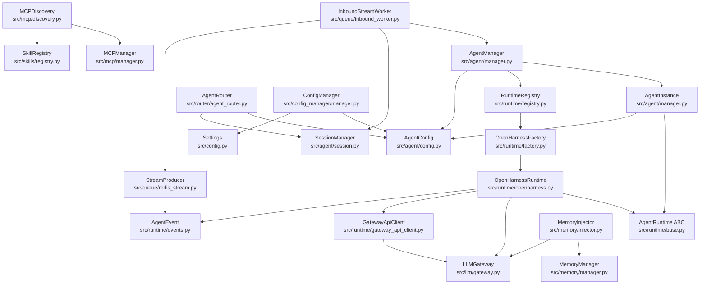
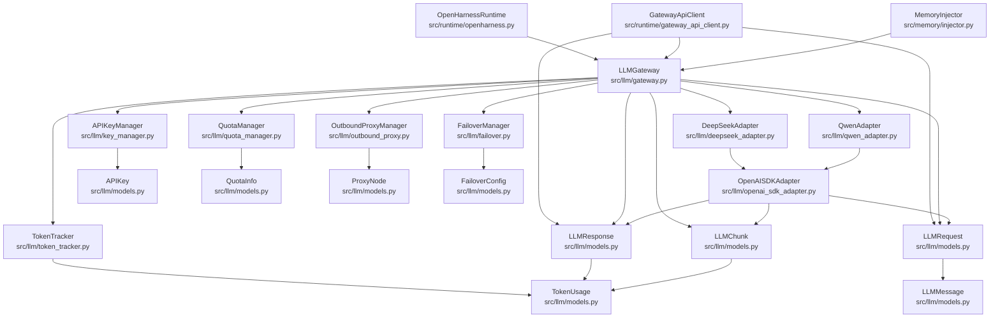
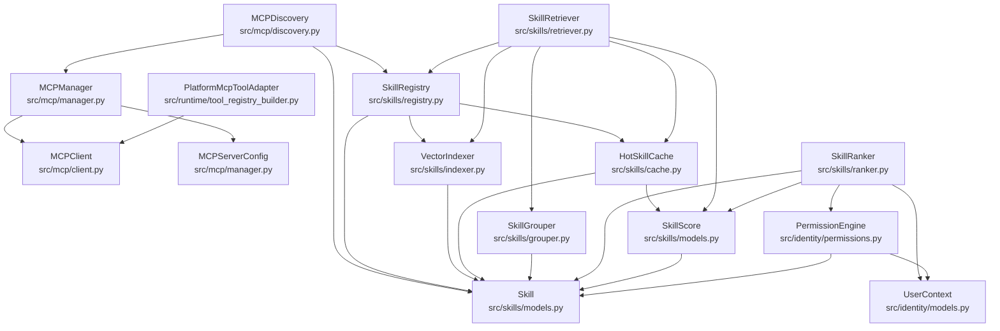
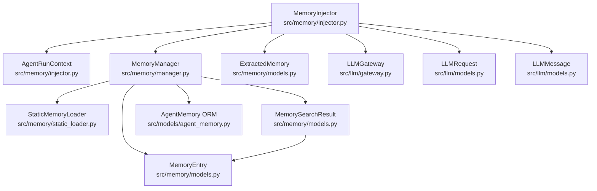

# Backend 类依赖关系图

> 范围：`ai-platform/backend/src`  
> 箭头方向：`A → B` 表示 **A 依赖 B**  
> 路径均相对 `ai-platform/backend/`

---

## 1. 编排主链路

---

## 2. LLMGateway 子系统

| 类 | 路径 | 说明 |
|---|---|---|
| `LLMGateway` | `src/llm/gateway.py` | LLM 统一入口 |
| `APIKeyManager` | `src/llm/key_manager.py` | Key 池轮换 |
| `QuotaManager` | `src/llm/quota_manager.py` | Token 配额 |
| `OutboundProxyManager` | `src/llm/outbound_proxy.py` | 出口代理 |
| `FailoverManager` | `src/llm/failover.py` | 故障转移 |
| `TokenTracker` | `src/llm/token_tracker.py` | 用量追踪 |
| `OpenAISDKAdapter` | `src/llm/openai_sdk_adapter.py` | OpenAI 兼容基类 |
| `DeepSeekAdapter` | `src/llm/deepseek_adapter.py` | 继承 OpenAISDKAdapter |
| `QwenAdapter` | `src/llm/qwen_adapter.py` | 继承 OpenAISDKAdapter |
| `LLMRequest` / `LLMResponse` / `LLMChunk` / `LLMMessage` | `src/llm/models.py` | 请求/响应模型 |
| `APIKey` / `QuotaInfo` / `ProxyNode` / `FailoverConfig` / `TokenUsage` | `src/llm/models.py` | 配置与计量模型 |

> 注意：另有一套 `TokenUsage` 在 `src/runtime/events.py`（流式事件用），与 `src/llm/models.py` 不同。

---

## 3. Skills + MCP 子系统

### Skills

| 类 | 路径 | 依赖 |
|---|---|---|
| `Skill` | `src/skills/models.py` | SkillSource / Status / Category |
| `SkillScore` | `src/skills/models.py` | Skill |
| `SkillRegistry` | `src/skills/registry.py` | Skill, VectorIndexer, HotSkillCache |
| `SkillRetriever` | `src/skills/retriever.py` | Registry, Indexer, Cache, Grouper |
| `SkillRanker` | `src/skills/ranker.py` | PermissionEngine, UserContext, Skill |
| `VectorIndexer` | `src/skills/indexer.py` | Skill, Qdrant |
| `HotSkillCache` | `src/skills/cache.py` | Skill, Redis |
| `SkillGrouper` | `src/skills/grouper.py` | Skill |

### MCP

| 类 | 路径 | 依赖 |
|---|---|---|
| `MCPManager` | `src/mcp/manager.py` | MCPClient, MCPServerConfig |
| `MCPClient` | `src/mcp/client.py` | MCPTransportType |
| `MCPServerConfig` | `src/mcp/manager.py` | MCPTransportType |
| `MCPDiscovery` | `src/mcp/discovery.py` | MCPManager → SkillRegistry |
| `PlatformMcpToolAdapter` | `src/runtime/tool_registry_builder.py` | 运行时工具桥接 |

> 注意：另有一套 `MCPServerConfig` 在 `src/agent/config.py`（Agent YAML 配置），与 `src/mcp/manager.py` 不同。

---

## 4. Memory 子系统

| 类 | 路径 | 说明 |
|---|---|---|
| `MemoryInjector` | `src/memory/injector.py` | before/after_agent_run 钩子 |
| `AgentRunContext` | `src/memory/injector.py` | 运行期上下文 |
| `MemoryManager` | `src/memory/manager.py` | 静/动态记忆编排 |
| `StaticMemoryLoader` | `src/memory/static_loader.py` | personality.md + facts |
| `MemoryEntry` | `src/memory/models.py` | 动态记忆条目 |
| `MemorySearchResult` | `src/memory/models.py` | 检索结果 |
| `ExtractedMemory` | `src/memory/models.py` | LLM 提取结果 |
| `AgentMemory` | `src/models/agent_memory.py` | PostgreSQL ORM |

---

## 5. 完整类清单（主要类）

| 包 | 类 | 路径 |
|---|---|---|
| agent | `AgentManager` / `AgentInstance` | `src/agent/manager.py` |
| agent | `SessionManager` / `Session` / `Message` | `src/agent/session.py` |
| agent | `AgentConfig` 及子配置 | `src/agent/config.py` |
| agent | `LifecycleStateMachine` | `src/agent/lifecycle.py` |
| runtime | `AgentRuntime` | `src/runtime/base.py` |
| runtime | `OpenHarnessRuntime` | `src/runtime/openharness.py` |
| runtime | `RuntimeRegistry` | `src/runtime/registry.py` |
| runtime | `OpenHarnessFactory` | `src/runtime/factory.py` |
| runtime | `GatewayApiClient` | `src/runtime/gateway_api_client.py` |
| runtime | `AgentEvent` / `HealthStatus` | `src/runtime/events.py` |
| runtime | `PlatformMcpToolAdapter` | `src/runtime/tool_registry_builder.py` |
| llm | `LLMGateway` | `src/llm/gateway.py` |
| llm | `APIKeyManager` | `src/llm/key_manager.py` |
| llm | `QuotaManager` | `src/llm/quota_manager.py` |
| llm | `OutboundProxyManager` | `src/llm/outbound_proxy.py` |
| llm | `FailoverManager` | `src/llm/failover.py` |
| llm | `TokenTracker` | `src/llm/token_tracker.py` |
| llm | `OpenAISDKAdapter` | `src/llm/openai_sdk_adapter.py` |
| llm | `DeepSeekAdapter` | `src/llm/deepseek_adapter.py` |
| llm | `QwenAdapter` | `src/llm/qwen_adapter.py` |
| llm | 请求/响应/计量模型 | `src/llm/models.py` |
| skills | `Skill` / `SkillScore` | `src/skills/models.py` |
| skills | `SkillRegistry` | `src/skills/registry.py` |
| skills | `SkillRetriever` | `src/skills/retriever.py` |
| skills | `SkillRanker` | `src/skills/ranker.py` |
| skills | `VectorIndexer` | `src/skills/indexer.py` |
| skills | `HotSkillCache` | `src/skills/cache.py` |
| skills | `SkillGrouper` | `src/skills/grouper.py` |
| mcp | `MCPManager` / `MCPServerConfig` | `src/mcp/manager.py` |
| mcp | `MCPClient` | `src/mcp/client.py` |
| mcp | `MCPDiscovery` | `src/mcp/discovery.py` |
| memory | `MemoryInjector` / `AgentRunContext` | `src/memory/injector.py` |
| memory | `MemoryManager` | `src/memory/manager.py` |
| memory | `StaticMemoryLoader` | `src/memory/static_loader.py` |
| memory | `MemoryEntry` 等模型 | `src/memory/models.py` |
| models | `AgentMemory` | `src/models/agent_memory.py` |
| queue | `InboundStreamWorker` | `src/queue/inbound_worker.py` |
| queue | `StreamProducer` | `src/queue/redis_stream.py` |
| router | `AgentRouter` | `src/router/agent_router.py` |
| config | `ConfigManager` | `src/config_manager/manager.py` |
| config | `Settings` | `src/config.py` |
| identity | `PermissionEngine` | `src/identity/permissions.py` |
| identity | `UserContext` | `src/identity/models.py` |
| identity | `AuthService` | `src/identity/auth.py` |
| hitl | `ApprovalManager` | `src/hitl/approval.py` |
| push | `WecomPusher` | `src/push/wecom_pusher.py` |
| push | `PushScheduler` | `src/push/scheduler.py` |

---

## 6. 阅读建议

1. 先看 **§1 编排主链路**：请求如何进入 Agent 并调用 Runtime / LLM。  
2. 再按需展开 **§2 LLMGateway**、**§3 Skills+MCP**、**§4 Memory**。  
3. 在支持 Mermaid 的编辑器中预览（Cursor / VS Code Markdown Preview、GitHub 等）。
