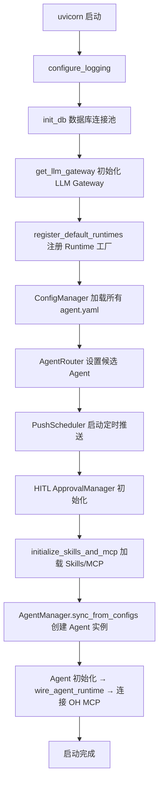
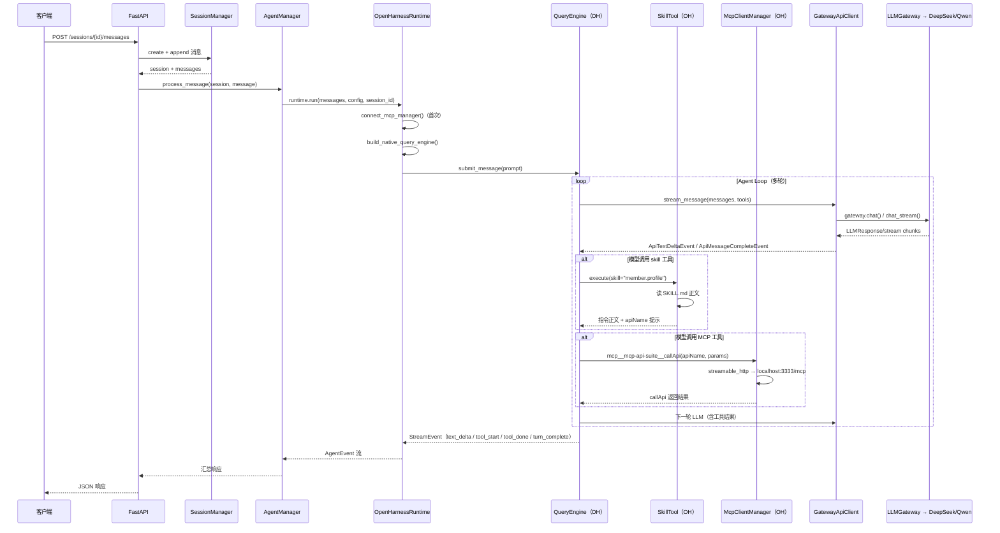

# AI Platform Backend — 编程说明书

## 0. 项目概览

**定位**：企业内部 AI 平台后端服务，管理 Agent 生命周期、LLM 调用、Skills 调度、MCP 协议整合。

**技术栈**：Python 3.12+ / FastAPI / OpenHarness / SQLAlchemy / Redis / Qdrant / PostgreSQL

**对话执行核心**：OpenHarness QueryEngine → skill 工具 → MCP 工具 → LLMGateway

---

## 1. 目录结构与模块职责

```
backend/src/
├── main.py                    # 应用入口：FastAPI 创建、lifespan、健康检查
├── config.py                  # 全局配置（Settings 类，pydantic-settings）
│
├── agent/                     # Agent 实例管理
│   ├── manager.py             # AgentManager：创建/启停/消息处理入口
│   ├── config.py              # AgentConfig 数据模型（含 Runtime/Skills/MCP 子模型）
│   ├── session.py             # SessionManager：会话与消息存储
│   ├── lifecycle.py           # 生命周期状态机（created→running→paused→stopped）
│   └── runtime_setup.py       # 接线器：连接原生 OH MCP + Skill 目录
│
├── runtime/                   # Agent 运行时
│   ├── base.py                # AgentRuntime 抽象基类
│   ├── openharness.py         # OpenHarnessRuntime：调用原生 OH QueryEngine
│   ├── oh_runtime_builder.py  # 构建原生 OH QueryEngine（Skills/MCP/权限）
│   ├── gateway_api_client.py  # GatewayApiClient：OH LLM 接口 → 平台 LLMGateway
│   ├── factory.py             # Runtime 工厂方法
│   ├── registry.py            # RuntimeRegistry：按类型查找 runtime
│   └── events.py              # AgentEvent 事件模型
│
├── llm/                       # LLM 网关
│   ├── gateway.py             # LLMGateway：统一入口，整合 key/quota/proxy/failover
│   ├── models.py              # LLMMessage / LLMRequest / LLMResponse / TokenUsage
│   ├── deepseek_adapter.py    # DeepSeek API 适配器（httpx）
│   ├── qwen_adapter.py        # 通义千问 API 适配器（httpx + 兼容模式）
│   ├── key_manager.py         # APIKeyManager：多 key 池轮转
│   ├── quota_manager.py       # QuotaManager：Redis 限流
│   ├── outbound_proxy.py      # OutboundProxyManager：出站代理路由
│   ├── failover.py            # FailoverManager：provider 自动切换
│   └── token_tracker.py       # TokenTracker：SQLAlchemy 用量记录
│
├── skills/                    # Skills 子系统
│   ├── registry.py            # SkillRegistry：Skill 注册/查询
│   ├── loader.py              # 从 configs/skills/ 文件系统加载
│   ├── spec_parser.py         # 解析 SKILL.md（Front Matter + 正文）
│   ├── models.py              # Skill / SkillScore 等数据模型
│   ├── schema.py              # SkillInputSchema（inputSchema 模型）
│   ├── indexer.py             # VectorIndexer：Qdrant 向量索引
│   ├── cache.py               # HotSkillCache：Redis 查询缓存
│   ├── retriever.py           # SkillRetriever：语义搜索 + 缓存
│   ├── ranker.py              # SkillRanker：结果排序
│   └── grouper.py             # SkillGrouper：结果分组
│
├── mcp/                       # MCP 子系统
│   ├── client.py              # MCP 客户端（mcp SDK：streamable_http/stdio）
│   ├── manager.py             # MCPManager：连接生命周期管理
│   ├── loader.py              # 从 configs/agents/*/system/mcp-servers.yaml 加载
│   └── discovery.py           # MCPDiscovery：工具发现与映射
│
├── api/                       # REST API
│   ├── routes/
│   │   ├── session.py         # 会话管理 + 消息发送
│   │   ├── agent.py           # Agent CRUD + 启停
│   │   ├── skill.py           # Skill 查询 API
│   │   ├── mcp.py             # MCP 连接状态 API
│   │   ├── admin.py           # 管理后台接口
│   │   └── push.py            # 主动推送接口
│   ├── deps.py                # FastAPI 依赖注入
│   └── response.py            # 统一响应格式
│
├── config_manager/            # 配置管理
│   ├── manager.py             # ConfigManager：CRUD + 热重载
│   ├── loader.py              # FileConfigLoader / DBConfigLoader
│   ├── watcher.py             # ConfigWatcher：YAML 文件变更监听
│   ├── validator.py           # ConfigValidator：配置校验
│   └── sync.py                # 文件↔DB 双向同步
│
├── router/                    # Agent 路由器
│   ├── agent_router.py        # AgentRouter：多策略路由
│   ├── models.py              # RouteResult / UserRequest 等路由模型
│   └── strategies/
│       ├── base.py            # RoutingStrategy 基类
│       ├── semantic_search.py # Qdrant 语义相似度路由
│       ├── keyword_match.py   # 关键词匹配路由
│       ├── session_affinity.py# 会话亲和路由
│       └── default_fallback.py# 默认回退路由
│
├── memory/                    # Agent 记忆
│   ├── manager.py             # MemoryManager：记忆 CRUD + 忘记策略
│   ├── injector.py            # MemoryInjector：记忆注入系统提示
│   ├── static_loader.py       # StaticMemoryLoader：personality + facts/*.yaml
│   └── models.py              # 记忆相关数据模型
│
├── push/                      # 主动推送
│   ├── scheduler.py           # PushScheduler：APScheduler 定时推送
│   ├── wecom_pusher.py        # WecomPusher：企业微信消息推送
│   └── models.py              # PushSchedule / PushMessage 等模型
│
├── identity/                  # 身份认证
│   ├── auth.py                # 用户认证（bcrypt 密码、企业微信 OAuth）
│   ├── token.py               # JWT Token 签发/校验
│   ├── permissions.py         # 8 级权限引擎
│   ├── credential_vault.py    # CredentialVault：加密凭证存储
│   ├── credential_mapper.py   # 用户↔凭证映射
│   ├── wecom_sync.py          # 企业微信组织架构同步
│   └── models.py              # TokenPayload / TokenSet 等模型
│
├── hitl/                      # 人机协作
│   ├── approval.py            # ApprovalManager：工具审批超时
│   └── store.py               # HitlStore：审批记录存储
│
├── adapters/                  # 业务适配器
│   ├── base.py                # BaseAdapter 抽象基类
│   ├── crm_adapter.py         # CRM 适配器
│   ├── retail_adapter.py      # 零售适配器
│   ├── finance_adapter.py     # 财务适配器
│   ├── hr_adapter.py          # HR 适配器
│   ├── property_adapter.py    # 物业适配器
│   ├── department_store_adapter.py # 百货适配器
│   └── valuecard_adapter.py   # 储值卡适配器
│
├── models/                    # ORM 数据模型
│   ├── base.py                # Base / TimestampMixin / SoftDeleteMixin
│   ├── agent.py               # AgentModel（agent_configs 表）
│   ├── session.py             # TokenUsageModel（token_usage 表）
│   ├── user.py                # UserModel / DepartmentModel
│   ├── skill.py               # SkillModel
│   └── agent_memory.py        # AgentMemoryModel
│
├── db/                        # 数据库
│   └── session.py             # AsyncEngine + sessionmaker + db_session_context
│
├── bootstrap/                 # 启动引导
│   └── skills_mcp.py          # 初始化 Skills/MCP 子系统（启动时调用）
│
└── utils/                     # 工具
    ├── exceptions.py          # 自定义异常体系（按模块编码）
    ├── logging.py             # 日志工具
    └── crypto.py              # 加密工具
```

---

## 2. 启动流程（lifespan 顺序）



**关键初始化代码位置**：`main.py` 的 `lifespan()` 函数（第 68-191 行）。

---

## 3. 核心数据流：一条用户消息的完整路径



**关键文件**：
- HTTP 入口：`api/routes/session.py` → `POST /sessions/{id}/messages`
- Agent 处理：`agent/manager.py` → `AgentInstance.process_message()`
- 核心执行：`runtime/openharness.py` → `OpenHarnessRuntime.run()`
- 引擎构建：`runtime/oh_runtime_builder.py` → `build_native_query_engine()`
- LLM 桥接：`runtime/gateway_api_client.py` → `GatewayApiClient.stream_message()`

---

## 4. OpenHarness 架构（当前核心）

```
QueryEngine（OH 原生）
├── api_client:    GatewayApiClient → LLMGateway → DeepSeek/Qwen
├── tool_registry: create_default_tool_registry(mcp_manager)
│   ├── SkillTool        → extra_skill_dirs（packages/crm）
│   ├── McpToolAdapter   → mcp__mcp-api-suite__callApi
│   ├── BashTool         → 执行 shell 命令
│   ├── FileReadTool     → 读取文件
│   ├── WebSearchTool    → 网络搜索
│   └── ...（共 30+ 内置工具）
├── system_prompt: 平台 Agent 系统提示 + build_runtime_system_prompt()
├── permission:     PermissionMode.FULL_AUTO
└── tool_metadata:  {extra_skill_dirs, session_id}
```

**与平台自研的对比**：
| 维度 | 原生 OH（当前） | 平台自研（已废弃） |
|------|---------------|------------------|
| Agent 循环 | QueryEngine.submit_message() | 自研 while + GatewayLLMAdapter |
| Skills | 单一 skill 工具 + SKILL.md 正文 | 每 Skill 一个 SkillToolAdapter |
| MCP | McpClientManager + McpToolAdapter | 平台 MCPManager + 自定义 REST |
| 工具注册 | OH create_default_tool_registry | 手动 register_tools() |

---

## 5. 配置体系

### 5.1 全局配置（`.env` + `config.py`）

所有配置项定义在 `src/config.py` 的 `Settings` 类中：

| 分类 | 关键字段 | 说明 |
|------|---------|------|
| 应用 | `APP_NAME` / `ENVIRONMENT` / `DEBUG` / `LOG_LEVEL` | 基础标识与日志 |
| 服务 | `HOST` / `PORT` / `CORS_ORIGINS` | HTTP 服务 |
| PostgreSQL | `POSTGRES_*` | 连接池配置 |
| Redis | `REDIS_*` | 缓存/限流 |
| Qdrant | `QDRANT_*` | 向量数据库 + 集合名 |
| Embedding | `EMBEDDING_SERVICE_URL` | bge-small-zh-v1.5 |
| LLM | `DEEPSEEK_*` / `QWEN_*` / `LLM_*` | 模型 Gateway |
| Agent | `AGENT_TRACE_LOG` | 思考链路日志开关 |
| 路由 | `AGENT_ROUTER_SEMANTIC_TOP_K` | 语义路由 Top-K |
| 配置 | `CONFIG_BASE_PATH` / `CONFIG_MODE` | file_system / database |

### 5.2 Agent 配置文件

在 `configs/agents/{agent_id}/` 下：

```
configs/agents/crm-assistant/
├── agent.yaml              # 主配置（id、name、runtime、system_prompt 等）
├── system/
│   ├── model.yaml          # LLM 模型选择（primary="deepseek-v4-flash"）
│   └── mcp-servers.yaml    # MCP 服务器列表（name/endpoint/transport）
├── skills/
│   └── enabled-skills.yaml # 启用的 Skill 列表
├── metadata.yaml           # 元数据（描述、标签）
└── memory/（可选）
    ├── agent-memory.yaml   # 记忆配置
    ├── personality.md      # 人格定义
    └── facts/*.yaml        # 领域知识
```

### 5.3 Skill 包定义

在 `configs/skills/packages/{category}/{skill-name}/` 下：

```
configs/skills/packages/crm/member-profile/
├── SKILL.md                # 渐进式披露规格（Front Matter + 正文指令）
└── attachments/（可选）    # 附件（图片、文档等）
```

---

## 6. 异常体系

所有异常继承 `AIPlatformError`，按**错误码区间**分类：

| 区间 | 分类 | 示例 |
|------|------|------|
| 1000-1999 | 认证/权限 | `AuthenticationError`(1001)、`TokenExpiredError`(1002) |
| 2000-2999 | Agent | `AgentNotFoundError`(2001)、`AgentNotRunningError`(2004) |
| 3000-3999 | Skill | `SkillNotFoundError`(3001)、`SkillTimeoutError`(3002) |
| 4000-4999 | MCP | `MCPConnectionError`(4001)、`MCPToolNotFoundError`(4002) |
| 5000-5999 | 通道 | `ChannelError`(5001) |
| 6000-6999 | LLM 网关 | `LLMProviderError`(6003)、`QuotaExceededError`(6002) |
| 7000-7999 | 配置 | `ConfigNotFoundError`(7002)、`ConfigValidationError`(7001) |
| 9000-9999 | 系统 | `DatabaseError`(9001)、`RedisError`(9002) |

定义位置：`src/utils/exceptions.py`

---

## 7. API 路由表

| 方法 | 路径 | 说明 |
|------|------|------|
| POST | `/api/v1/sessions` | 创建会话 |
| GET | `/api/v1/sessions/{id}` | 获取会话详情 |
| DELETE | `/api/v1/sessions/{id}` | 关闭会话 |
| POST | `/api/v1/sessions/{id}/messages` | 发送消息（核心入口） |
| GET | `/api/v1/sessions/{id}/messages` | 获取历史消息 |
| POST | `/api/v1/sessions/route` | 路由请求 |
| POST | `/api/v1/agents` | 创建 Agent |
| GET | `/api/v1/agents` | 列出 Agent |
| GET | `/api/v1/agents/{id}` | 获取 Agent 详情 |
| PUT | `/api/v1/agents/{id}` | 更新 Agent |
| DELETE | `/api/v1/agents/{id}` | 删除 Agent |
| POST | `/api/v1/agents/{id}/start` | 启动 Agent |
| POST | `/api/v1/agents/{id}/stop` | 停止 Agent |
| GET | `/api/v1/skills` | 搜索/列出 Skills |
| GET | `/api/v1/skills/{id}` | 获取 Skill 详情 |
| GET | `/api/v1/mcp/servers` | 列出 MCP 服务器 |
| GET | `/api/v1/mcp/servers/{name}` | 获取 MCP 服务器详情 |
| GET | `/api/v1/mcp/tools` | 列出所有 MCP 工具 |
| POST | `/api/v1/push/send` | 发送推送 |
| GET | `/api/v1/admin/configs` | 管理台：配置列表 |
| GET | `/health` | 存活探针 |
| GET | `/ready` | 就绪探针（检查 PG/Redis/Qdrant） |

---

## 8. 基础设施依赖

| 服务 | 用途 | 默认地址 |
|------|------|---------|
| PostgreSQL | Agent 配置、Token 用量、会话/记忆 | `postgres:5432` |
| Redis | Skill 缓存、LLM 配额、会话状态 | `redis:6379` |
| Qdrant | Skill 索引、AgentRouter 索引、记忆向量 | `qdrant:6333` |
| Embedding | 文本向量化（bge-small-zh-v1.5） | `http://embedding:8001` |
| MCP 网关 | 业务系统 API 代理 | `http://localhost:3333/mcp` |
| DeepSeek API | 主 LLM（deepseek-v4-flash） | `https://api.deepseek.com/v1` |
| 通义千问 API | 备用 LLM（qwen3.6-plus） | `https://dashscope.aliyuncs.com/compatible-mode/v1` |

---

## 9. 数据库 ORM 模型

所有模型文件在 `src/models/` 下：

| 模型 | 表名 | 用途 |
|------|------|------|
| `AgentModel` | `agent_configs` | Agent 持久化配置 |
| `TokenUsageModel` | `token_usage` | 每次 LLM 调用的 Token 统计 |
| `UserModel` | `users` | 用户信息 |
| `DepartmentModel` | `departments` | 部门信息 |
| `SkillModel` | `skills` | Skill 定义 |
| `AgentMemoryModel` | `agent_memories` | Agent 长期记忆 |

所有模型继承自 `Base`（`models/base.py`），可选 mixin：
- `TimestampMixin`：`created_at` / `updated_at`
- `SoftDeleteMixin`：`deleted_at`
- `UUIDPrimaryKeyMixin`：UUID 主键

---

## 10. 关键开源依赖模块 & 使用位置

| 模块 | 在哪些环节使用 | 关键文件 |
|------|--------------|---------|
| **openharness-ai** | Agent 循环、skill 工具、MCP 注册 | `runtime/openharness.py`, `oh_runtime_builder.py`, `gateway_api_client.py` |
| **mcp** | MCP 协议通信（streamable_http/stdio） | `mcp/client.py`，OH 的 `McpClientManager` 内部 |
| **FastAPI** + **uvicorn** | HTTP 路由、中间件、依赖注入 | `main.py`, `api/routes/*.py` |
| **SQLAlchemy** + **asyncpg** | ORM + 异步 PostgreSQL | `db/session.py`, `models/*.py` |
| **redis** | 缓存、配额、会话状态 | `skills/cache.py`, `llm/quota_manager.py` |
| **qdrant-client** | 向量索引与语义搜索 | `skills/indexer.py`, `router/strategies/semantic_search.py` |
| **httpx** | LLM API 调用、企业微信推送、embedding 调用 | `llm/*_adapter.py`, `push/wecom_pusher.py` |
| **pydantic** + **pydantic-settings** | 数据模型、配置校验、API 请求/响应 | `config.py`, `agent/config.py`, `api/routes/*.py` |
| **PyYAML** | 读取 agent.yaml、SKILL.md、mcp-servers.yaml | `config_manager/loader.py`, `skills/spec_parser.py` |
| **structlog** | 结构化日志 + traceId 上下文 | `main.py`, `utils/logging.py` |
| **APScheduler** | 定时主动推送（CronTrigger） | `push/scheduler.py` |
| **PyJWT** | JWT Token 签发/校验 | `identity/token.py` |
| **bcrypt** | 密码哈希 | `identity/auth.py` |
| **cryptography** | AES-GCM 凭证加密 | `utils/crypto.py` |
| **alembic** | 数据库迁移 | 独立目录（非 src/） |

---

## 11. 阅读顺序建议

对于新接手开发者，推荐按以下顺序阅读：

### 第一遍：建立全局认知（~30 分钟）
1. `main.py` — 理解启动流程和基础架构
2. `config.py` — 了解所有配置项
3. `runtime/openharness.py` → `oh_runtime_builder.py` → `gateway_api_client.py` — 理解 Agent 执行核心

### 第二遍：核心链路深入（~1 小时）
4. `agent/manager.py` → `agent/session.py` — 理解消息处理入口与会话管理
5. `llm/gateway.py` — 理解 LLM 网关的多层整合
6. `api/routes/session.py` — 理解 API 到 Agent 的接线

### 第三遍：子系统了解（按需）
7. `skills/` — 理解 Skills 注册/索引/缓存机制
8. `mcp/` — 理解 MCP 连接管理
9. `router/` — 理解多策略 Agent 路由
10. `memory/` — 理解记忆注入与忘记策略
11. `config_manager/` — 理解配置热重载
12. `identity/` + `push/` + `hitl/` — 身份认证、推送、人机协作

---

## 12. 开发和调试

### 启动命令

```powershell
cd ai-platform/backend
uv run uvicorn src.main:app --host 127.0.0.1 --port 8002 --reload
```

### 日志

- 思考链路日志（Agent Trace）：`src/runtime/openharness.py` 的 `_log_agent_trace()` 函数
- 可通过 `.env` 中 `LOG_FORMAT=console` 切换为控制台友好输出
- 可通过 `AGENT_TRACE_LOG=true/false` 开关 Agent 决策日志

### 测试 CRM Agent

```powershell
$base = "http://127.0.0.1:8002"
$s = (Invoke-RestMethod -Method Post "$base/api/v1/sessions" `
    -ContentType "application/json" `
    -Body '{"agent_id":"crm-assistant","user_id":"test"}').data
Invoke-RestMethod -Method Post "$base/api/v1/sessions/$($s.session_id)/messages" `
    -ContentType "application/json" `
    -Body '{"content":"查询会员13961588612的档案"}'
```

---

## 13. 架构决策记录

1. **Agent 循环**：使用 OpenHarness 原生 `QueryEngine`，不自研 while 循环
2. **Skills**：使用 OpenHarness 原生 `SkillTool` + `extra_skill_dirs` 渐进式披露
3. **MCP**：使用 OpenHarness 原生 `McpClientManager`，不自研 REST 客户端
4. **LLM**：通过 `GatewayApiClient` 桥接平台 `LLMGateway`，复用 key/quota 管理
5. **平台组件保留**：Skills/MCP 管理 API、记忆管理、路由、推送、身份认证等子系统保留自研
6. **配置**：两侧并行——Agent 配置项同时服务 OH 原生路径和平台管理 API
