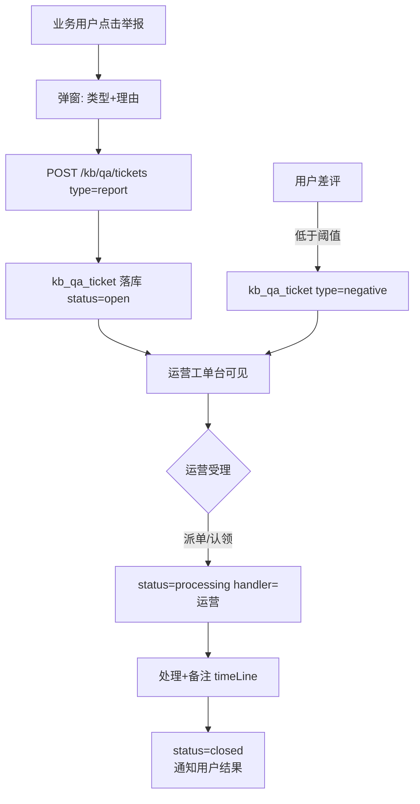

# MIS 知识库（mis-kb）P1/P2 增量 PRD

- **作者**：许清楚（软件产品经理）
- **日期**：2026-08-03
- **类型**：增量 PRD（简单 PRD 格式，聚焦本轮新增/增强）
- **依据**：《MIS 知识库 APP 规划 v3》`docs/backend/knowledge-base-app-plan.md` §4 功能清单 / §5 优先级
- **上游**：`docs/backend/mis-kb-system-design.md`（P0 架构）、`deliverables/software-company/kb-delivery-2026-08-03.md`、`kb-qa-report-2026-08-03.md`
- **状态声明**：本文所列功能**尚未实现**。上一轮交付的是 P0 范围；本轮为 P1/P2 增量。

---

## 1. 项目信息

| 项 | 值 |
|---|---|
| Language | 中文 |
| 前端技术栈 | 沿用仓库既有：React + TypeScript + Vite + shadcn/ui + Tailwind + Zustand（**不引入 MUI**，与 `mis-admin-web` 保持一致） |
| 后端技术栈 | 沿用既有：Spring Boot 3.2.5 / Java 17 / JPA / PostgreSQL；Flyway 集中在 `mis-migrator` |
| Project Name | `mis_kb_incremental_p1_p2` |
| 影响模块 | `backend/mis-kb`、`backend/mis-admin-bff`、`backend/mis-migrator`、`frontend/mis-admin-web/src/features/kb`、`agent/ai-platform`（mis-rag） |

### 1.1 原始需求复述

在已交付的 P0 知识库能力之上，补齐 13 项 P1/P2 功能：门户放开 KB 入口（I-01）、定位原文（F-04）、复制/重新生成（F-08）、举报越权/敏感（F-10）、差评/举报工单（A-02c）、问答详情（A-02a 运营视角）、评价统计看板（A-02b）、记录与评价导出（A-02d）、金标对照（A-02e）、完整流式问答（F-01）、IAM 选人组件复用（I-03）、库详情三 Tab（L-06）、库内 RAG 高级设置（L-08）。

---

## 2. 现状盘点结论（逐项读码核实，非假设）

> 核实范围：`backend/mis-kb`（92 个 Java 文件全量清单 + 关键 service/controller/engine 逐个读取）、`backend/mis-admin-bff`（KbController / AiProxyController / AppController）、`frontend/.../features/kb`（7 页面 + 4 组件 + api/types/store 全量）、`backend/mis-migrator`（V12/V13/V14）、`agent/.../mis_rag`（qa_pipeline.py / kb_client.py）、门户链路（portal-page.tsx / app-layout.tsx / host-apps.ts）。

| # | 功能 | 文档编号 | 状态 | 核实依据（关键证据） |
|---|---|---|---|---|
| 1 | 门户 enterable 放开 kb | I-01 | **部分做** | `sys_app(code=kb)` 已由 `V13__kb_seed.sql:28` 落库；菜单/按钮/角色授权已由 `V14` 补齐；前端 `lib/nav/host-apps.ts:11` 已登记 `kb: '/kb/overview'`。**唯一缺口**：`AppController.java:20` 的 `ENTERABLE_CODES = Set.of("system")` 未含 `kb`，导致门户九宫格与应用切换器把知识库置灰为「即将上线」 |
| 2 | 定位原文 | F-04 | **未做** | `kb-citation-list.tsx` 仅渲染 `line-clamp-3` 片段，无抽屉、无展开、无分类/密级；`ChunkHit`/`RfChunk` 均无 offset/position 字段；文档页无详情抽屉、无预览、BFF 无 download 端点 |
| 3 | 复制 / 重新生成 | F-08 | **未做** | `kb-qa-page.tsx` 回答区仅 `MarkdownView` + `KbCitationList`，无任何操作按钮 |
| 4 | 举报越权/敏感 | F-10 | **未做** | 全仓无举报入口；`kb_qa_ticket` 仅为空表占位 |
| 5 | 差评/举报工单 | A-02c | **未做（表结构已占位）** | `KbQaTicket.java` + `KbQaTicketRepository.java` 存在但**零业务代码**（无 service / 无 controller / 无 BFF / 无前端）；表字段仅 `id/session_id/type/status/content/handler_id/created_at`，缺处理备注、关联动作、时间线 |
| 6 | 问答详情（运营视角） | A-02a | **部分做** | `KbQaService.getSessionDetail(sessionId, userId)` 已实现且支持 `userId=null` 跳过归属校验；但运营链路缺口有三：①`OperationsController` 只有 `listAllSessions/listAllFeedback` 两个列表端点，**无详情端点**；②BFF `/api/v1/kb/operations/**` 同样只有两个列表；③前端运营页无下钻。另：详情 VO **缺「可见范围」与「召回参数」**，`kb_qa_session`/`kb_qa_message` 表无对应列 |
| 7 | 评价统计看板 | A-02b | **未做** | `kb-operations-page.tsx` 仅前端本地 `average()` 算 4 个均分卡片 + 两张裸表；无好评率、无差评维度分布、无高频差评问、无低分库/文档 TopN、无趋势、无下钻；后端无任何聚合端点 |
| 8 | 记录与评价导出 | A-02d | **未做** | 全仓无导出端点、无脱敏工具、无导出审计 |
| 9 | 与金标对照 | A-02e | **未做** | 全仓无金标问题集、无跑批调度、无 `A-03` 评测实现（`grep 金标\|golden` 仅命中规划文档） |
| 10 | 完整流式问答 | F-01 | **部分做（非流式已通）** | 问答链路全程同步：`kb-api.ts:askKbRag` 用 `api.post('/ai/rag')` 一次性拿结果，UI 用 `<Skeleton>` 占位；`AiProxyController.rag` 是 buffered `Result<AiRagResponse>`；`qa_pipeline.py` 的 `run()` 无 `yield`。**可复用基座已存在**：`AiPlatformClient.chatStream()`（Flux/SSE）、`AiProxyController.chatCompletions` 的 SSE 分支、前端 `features/ai/ai-sse-client.ts` |
| 11 | IAM 选人组件复用 | I-03 | **未做** | `kb-permission-page.tsx:245` 让用户**手填数字主体 ID**，提示「可在系统管理→用户/角色管理查看对应 ID」；全仓 `components/common/` 与 `features/system/` **不存在**可复用的选人/选角色组件（仅有 `user-list-page.tsx` / `role-list-page.tsx` 两个整页）——I-03 需**先造再复用**，不是简单接线 |
| 12 | 库详情三 Tab | L-06 | **未做** | `kb-library-page.tsx` 只有列表 + 新增/编辑 Sheet；无详情页、无 Tab、无概览统计、无索引健康、无权限摘要；文档与权限分散在两个独立页面（`/kb/documents`、`/kb/permissions`），无库上下文串联 |
| 13 | 库内 RAG 高级设置 | L-08 | **部分做（仅召回类）** | `RagSettings.java` 仅 5 个字段：`topK/scoreThreshold/rerank/embeddingModel/retrievalMethod`。**缺**：切片方案 `chunkMethod`、`chunkTokenNum`、分隔符、空结果策略、恢复全局默认、改切片提示重解析。且 `RagflowClient.updateDatasetSettings` **不写 `chunk_method`/`parser_config`** |

### 2.2 核查中发现的 3 个既有缺陷（非本次新增，但会阻塞增量）

| 编号 | 缺陷 | 证据 | 影响 |
|---|---|---|---|
| **X-01** | 密级中文名映射颠倒 | 前端 `types.ts:172-177` 把 `confidential` 标为「秘密」、`secret` 标为「机密」；后端 `V13__kb_seed.sql:17-18` 是 `secret=秘密`、`confidential=机密` | 建库时选错密级 → 授权范围错误。L-06/L-08 均要展示密级，必须先修 |
| **X-02** | ACL 动作与主体类型前后端不一致 | 前端 `types.ts:179-189` 提供 `write/admin` 与 `dept`；后端 `AclAction` 只有 `read/manage/acl`、`SubjectType` 只有 `user/role`，且 `V12` 有 `CHECK` 约束 | 选「读写/管理/部门」必被 DB 拒绝。I-03 选人组件落地前必须统一口径 |
| **X-03** | `retrievalMethod` 被错写进引擎 `embedding_model` | `RagflowClient.java:68` `body.put("embedding_model", settings.retrievalMethod())` | 保存库设置会污染引擎侧嵌入模型配置。L-08 改造时必须一并修正 |

---

## 3. 产品目标

**一句话**：把 P0 交付的「能问、能答、能存」的知识库，升级为「进得去、看得清、管得住、改得动」的可运营知识产品。

具体拆成三条正交目标：

1. **打通入口与信任闭环（面向业务用户）**：门户九宫格可直接进入知识 APP；回答具备完整流式体验、可复制/重生成、可追溯到原文片段与其密级归属、可一键举报越权与敏感内容 —— 让用户敢用、愿用。
2. **让运营看得见、管得住（面向运营管理员）**：问答记录可下钻到完整详情（含引用快照/可见范围/召回参数），评价可聚合为看板（好评率、差评维度分布、低分库/文档 TopN、趋势），差评与举报进入标准工单流并可导出与脱敏 —— 把「用户抱怨」变成「可闭环的运营事项」。
3. **让知识管理员调得动（面向知识管理员）**：库详情收敛为「文档/权限/设置」三 Tab 的单一工作台；切片方案与召回参数在 MIS 内配置并同步引擎，改切片后引导重解析；授权改为复用 IAM/Org 的选人组件，告别手填数字 ID —— 降低知识库调优与授权的操作门槛。

---

## 4. 用户故事

> 按三类角色分别刻画。每条故事对应 §5 需求池中的一项编号，便于追溯。

### 4.1 业务用户（进得去、看得清、敢用）

- **US-B1（I-01）**：As a 业务用户，I want 在门户九宫格直接点击进入知识库，so that 不必另记地址、不必等「即将上线」。
- **US-B2（F-01）**：As a 业务用户，I want 回答逐字流式输出，so that 我能立刻判断方向对不对、不用干等。
- **US-B3（F-04）**：As a 业务用户，I want 在引用列表里一键定位到原文片段（含文档、章节、密级），so that 我能核实回答是否真的有据可依。
- **US-B4（F-08）**：As a 业务用户，I want 复制回答、对不满意回答点「重新生成」，so that 能复用答案、能从偶发坏答案里快速恢复。
- **US-B5（F-10）**：As a 业务用户，I want 对越权或敏感回答一键举报并附理由，so that 滥用/泄露能被及时拦截。

### 4.2 运营管理员（看得见、管得住）

- **US-O1（A-02a）**：As a 运营管理员，I want 从评价/会话列表下钻到问答完整详情（含引用快照、可见范围、召回参数），so that 我能还原当时上下文、定位问题根因。
- **US-O2（A-02b）**：As a 运营管理员，I want 一张评价看板（好评率、差评维度分布、高频差评问、低分库/文档 TopN、趋势），so that 我能一眼看出质量短板在哪一库、哪类问题。
- **US-O3（A-02c）**：As a 运营管理员，I want 差评与举报自动生成工单并跟踪处理状态，so that 用户抱怨能闭环、不遗漏。
- **US-O4（A-02d）**：As a 运营管理员，I want 按条件导出会话/评价记录（脱敏后），so that 能做月度汇报与合规留痕。

### 4.3 知识管理员（调得动）

- **US-K1（L-06）**：As a 知识管理员，I want 在库详情页用「文档/权限/设置」三 Tab 统一管理一个库，so that 不必在多个页面间跳来跳去。
- **US-K2（L-08）**：As a 知识管理员，I want 在 MIS 内配置切片方案与召回参数并同步引擎，so that 不必登录 RAGFlow 后台也能调优。
- **US-K3（I-03）**：As a 知识管理员，I want 用弹窗从 IAM/Org 选人/选角色来授权，so that 告别手填数字 ID、避免选错人。
- **US-K4（A-02e）**：As a 知识管理员，I want 用金标问题集对答案做对照评测，so that 我能量化知识库质量、验证调优效果。

---

## 5. 需求池

> 优先级在本轮增量内重排（P0 阻塞/核心体验 → P1 应做 → P2 增强）。状态列说明：`新增`=无任何实现；`增强`=已有基座需扩展；`已有待补`=结构/壳已存在但缺关键字段或端点。前三个 `X-` 为既有缺陷，**必须在对应增量开工前修复**，否则会直接阻断（见 §2.2）。

### P0 — 必须（入口 + 信任闭环基座）

| 编号 | 文档号 | 功能 | 状态 | 需求说明 | 验收标准 |
|---|---|---|---|---|---|
| X-01 | — | 密级中文名映射修正 | 缺陷修复 | 统一前后端 `secret=秘密`/`confidential=机密` | 前端 `types.ts` 与 `V13` 种子一致；建库下拉显示正确 |
| X-02 | — | ACL 动作/主体口径统一 | 缺陷修复 | 前后端收敛为 `read/manage/acl` + `user/role`；移除前端 `write/admin/dept` | 选任意动作/主体均能落库，不被 `V12 CHECK` 拒绝 |
| I-01 | I-01 | 门户放开 KB enterable | 已有待补 | `AppController.ENTERABLE_CODES` 增加 `kb` | 门户九宫格与切换器点亮知识库，点击进入 `/kb/overview` |
| F-01 | F-01 | 完整流式问答 | 增强 | BFF `/ai/rag` 改 SSE 流；`qa_pipeline.py` 加 `yield`；前端 `kb-qa-page` 接 `ai-sse-client` | 回答逐字输出；中断可恢复；结束统一落库 |
| F-04 | F-04 | 定位原文 | 新增 | 引用列表支持展开/抽屉，展示文档、章节、密级；BFF 提供文档片段/预览下载端点 | 点击引用可看到原文上下文与密级归属 |
| F-08 | F-08 | 复制 / 重新生成 | 新增 | 回答区加「复制」「重新生成」按钮；重生成复用会话上下文 | 一键复制全文；重生成产出新回答并保留旧版本 |

### P1 — 应做（运营闭环 + 知识管理台）

| 编号 | 文档号 | 功能 | 状态 | 需求说明 | 验收标准 |
|---|---|---|---|---|---|
| F-10 | F-10 | 举报越权/敏感 | 新增 | 回答区「举报」弹窗，选类型+理由；写入 `kb_qa_ticket`（type=report） | 举报落库并自动转 A-02c 工单 |
| A-02c | A-02c | 差评/举报工单 | 已有待补 | 扩展 `KbQaTicket`（加 handler/timeLine/note/relAction）；补 service/controller/BFF/前端工单台 | 工单可受理、流转、关闭；关联差评/举报 |
| A-02a | A-02a | 问答详情（运营） | 增强 | 新增运营详情端点（BFF+后端）；`session_detail` VO 补充「可见范围」「召回参数」字段；表加列 | 运营可下钻到完整会话+引用快照+召回上下文 |
| A-02b | A-02b | 评价统计看板 | 新增 | 后端聚合端点（好评率/差评维度/高频差评问/低分库文档 TopN/趋势）；前端看板页 | 看板数据真实聚合，非前端本地均值 |
| L-06 | L-06 | 库详情三 Tab | 新增 | 库详情页含「文档/权限/设置」三 Tab；文档与权限收敛到库上下文 | 单库工作台可完成文档管理、授权、设置 |
| L-08 | L-08 | 库内 RAG 高级设置 | 增强 | 补齐 `chunkMethod/chunkTokenNum/分隔符/空结果策略/恢复默认`；修 X-03；`RagflowClient` 同步 `chunk_method/parser_config`；改切片引导重解析 | 设置保存后引擎侧切片与召回参数真实生效 |
| I-03 | I-03 | IAM 选人组件复用 | 新增 | 先造后复用：选人/选角色弹窗（接 IAM/Org 人员/角色/部门源）；知识库授权页替换手填 ID | 授权弹窗选人后回写名称+ID，落库正确 |

### P2 — 增强（度量与合规）

| 编号 | 文档号 | 功能 | 状态 | 需求说明 | 验收标准 |
|---|---|---|---|---|---|
| A-02d | A-02d | 记录与评价导出 | 新增 | 后端导出端点 + 脱敏；前端导出入口与审计 | 按条件导出 xlsx/csv，敏感字段脱敏，留审计 |
| A-02e | A-02e | 与金标对照 | 新增 | 金标问题集管理 + 跑批评测（对照答案命中/质量）；看板展示 | 可定期跑批，输出知识库质量评分与缺口 |

---

## 6. UI 设计稿（关键页面）

> 以下为结构化布局描述，关键闭环附 Mermaid 流程图。前端须遵循仓库约定：React + shadcn/ui + Zustand + TanStack Query；禁止跨 feature 直接依赖（选人组件走 features/system 或 components/common 暴露的接口）。

### 6.1 门户 KB 入口（I-01）

- 门户九宫格：知识库卡片由「即将上线（置灰）」变为「可点击」，图标点亮。
- 应用切换器（App Switcher）出现 `知识库` 项，点击进入 `/kb/overview`。
- 无独立新增页面，仅依赖 §5 的 `ENTERABLE_CODES` 放行。

### 6.2 流式问答 + 操作条（F-01 / F-08）

`/kb/qa`（问答页）布局：
```
┌─────────────────────────────────────────────┐
│ 库选择器（可见库多选）        [检索模式: 普通/精准] │
├─────────────────────────────────────────────┤
│  对话区（流式）                              │
│   user: 如何报销差旅？                        │
│   ai:  根据《差旅管理办法》…（逐字）          │
│        ┌ 引用 [1][2] ── 可点击定位原文(F-04)┐ │
│        │ [复制] [重新生成] [举报]            │ │
│        └───────────────────────────────────┘ │
├─────────────────────────────────────────────┤
│  输入框（Enter 发送，Shift+Enter 换行）        │
└─────────────────────────────────────────────┘
```
- 流式：接 `ai-sse-client`，token 增量渲染；结束统一调用一次落库。
- 操作条：复制（全文本地复制）、重新生成（带 `sessionId/msgId` 请求新回答，旧回答保留为历史版本）、举报（见 6.5）。

### 6.3 库详情三 Tab（L-06）

`/kb/libraries/:id` 单一工作台：
```
┌─────────────────────────────────────────────┐
│ 库名 / 密级徽章 / 状态     [编辑] [进入问答]   │
├──────┬──────────────────────────────────────┤
│ 文档 │ 文档列表（上传/解析状态/索引健康）      │
│ 权限 │ 授权列表（主体=用户/角色，动作=读/管/ACL）│
│ 设置 │ RAG 高级设置（见 6.6）                  │
└──────┴──────────────────────────────────────┘
```
- 文档 Tab：复用既有上传与解析状态，增加「索引健康」指标。
- 权限 Tab：替换手填 ID 为 I-03 选人组件（见 6.7）。
- 设置 Tab：内嵌 L-08 表单。

### 6.4 问答详情（运营，A-02a）

`/kb/operations/sessions/:id` 下钻页：
```
┌─────────────────────────────────────────────┐
│ 会话ID / 提问人 / 时间 / 可见范围 / 召回参数    │
├─────────────────────────────────────────────┤
│ 提问 → 回答（Markdown）                       │
│ 引用快照：文档/片段/密级（只读）               │
│ 用户评价：星级 + 标签 + 文字                   │
│ 关联工单：状态/处理人（如有，跳 6.5 工单台）   │
└─────────────────────────────────────────────┘
```
- 可见范围、召回参数从新增 VO 字段读取（§5 A-02a）。

### 6.5 举报 → 工单闭环（F-10 / A-02c）

报告弹窗（F-10）提交后，经后端写入 `kb_qa_ticket(type=report)`，自动汇入工单台（A-02c）。



- 工单台字段：`id/session_id/type/status/handler_id/note/timeLine/relAction/created_at/updated_at`（扩展自 §2 占位表）。

### 6.6 评价统计看板（A-02b）

`/kb/operations/dashboard`：
```
┌─────────────────────────────────────────────┐
│ 卡片: 总评价数 / 好评率 / 平均星 / 待处理工单   │
├─────────────────────────────────────────────┤
│ 图1 差评维度分布（权限不足/答非所问/过时/敏感） │
│ 图2 高频差评问 Top10                          │
│ 图3 低分库 TopN / 低分文档 TopN               │
│ 图4 评价趋势（按日/周）                         │
└─────────────────────────────────────────────┘
```
- 所有指标由后端聚合端点计算，前端仅渲染。

### 6.7 RAG 高级设置（L-08，含 X-03 修正）

`库详情 → 设置 Tab` 表单：
```
切片方案: [通用/论文/表格/问答/...]     分隔符: [___]
chunk_token_num: [512]                  top_k: [8]
score_threshold: [0.2]                  重排: [开/关]
embedding_model: [___]                  retrieval_method: [___]
空结果策略: [兜底提示语 / 转人工 / 返回建议]
[恢复全局默认]  [保存]
```
- 保存时同步 `RagflowClient` 的 `chunk_method/parser_config`（修正 X-03 错写 `embedding_model`）。
- 若修改切片方案：`提示「需重新解析文档」→ 触发异步重解析任务 → 进度可见`。

### 6.8 IAM 选人组件（I-03）

授权弹窗（库详情 → 权限 Tab / 新增授权）：
```
┌─ 添加授权 ───────────────────────┐
│ 主体类型: (●用户 ○角色)            │
│ 选择: [打开选人弹窗] 已选: 张三, 李四 │
│ 动作: (●读 ○管理 ○ACL)             │
│ [取消] [确定]                      │
└──────────────────────────────────┘
```
- 选人弹窗数据源：IAM/Org 的人员、角色（及部门，若 Org 提供）；回写 `名称+ID`。
- 替换 `kb-permission-page.tsx:245` 的手填数字 ID。

---

## 7. 待确认问题（Open Questions）

1. **流式落库时机**：F-01 流式回答是「结束后一次性落库」还是「边流边落增量」？需与架构决策 #3（落库责任方 mis-kb）对齐，影响 `kb_qa_message` 写入与并发。
2. **A-02c 工单与既有工单中心的关系**：mis 平台是否已存在统一工单中心？知识库是自建轻量工单，还是接入平台工单？决定数据模型与前端入口。
3. **A-02e 金标评测口径**：评测指标（命中率/回答质量/人工评分）？金标由谁标注、多久跑批一次、是否需接入 `A-03` 自动化评测？
4. **I-03 选人数据源**：IAM/Org 是否已提供可复用的人员/角色/部门树接口？若无，选人组件需先对接 Org 服务，工作量上探。
5. **A-02d 导出脱敏与格式**：敏感字段范围（提问/回答/用户身份）、导出格式（xlsx/csv）、是否走平台统一导出中心与审计。
6. **L-08 空结果策略默认行为**：兜底提示语模板、是否转人工、是否返回「相关建议」，需要产品文案确认。
7. **L-08 改切片重解析**：重解析是否异步任务、是否锁定库写入、进度如何在前端呈现。
8. **F-04 定位原文字段来源**：RAGFlow 召回结果是否返回 chunk 在文档内的 offset/页码？若不含，定位原文需额外解析层，影响 BFF 端点设计。

---

> **交付状态重申**：以上 13 项功能（I-01/F-04/F-08/F-10/A-02a~e/L-06/L-08/I-03/F-01）**均未实现**，属本轮 P1/P2 增量范围；§2 现状盘点已逐项读码核实。3 个既有缺陷（X-01/X-02/X-03）非本次新增，但为增量开工前置条件。
