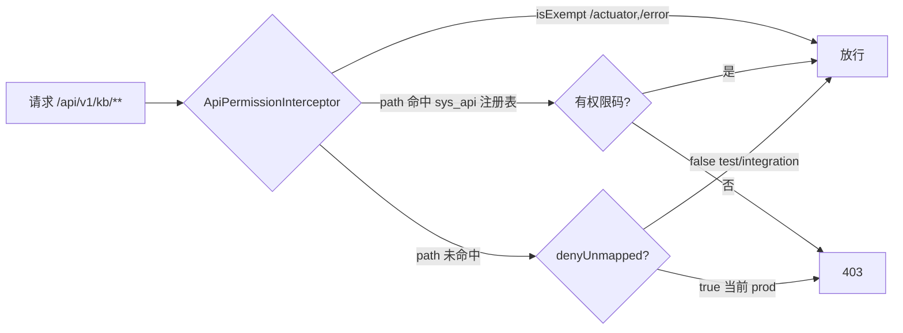

# MIS 平台知识库（mis-kb）技术债安全专项 —— 销账 PRD

- **作者**：许清楚（软件产品经理）
- **日期**：2026-08-12
- **类型**：**销账 PRD**（标准 SOP 第一步；技术债 11.2 收尾 + 11.3 专项）
- **状态**：待架构师（高见远）技术设计 → 工程师（寇豆码）实现 → QA（严过关）验收
- **上游**：
  - `docs/backend/knowledge-base-phase2-plan.md` §11（技术债原文：11.2 sys_api 登记缺口 / 11.3 denyUnmapped fail-open / 11.5 审计脱敏——**11.5 已由块①销账**）
  - `docs/backend/mis-kb-enterprise-phase1-design-2026-08-11.md`（块①设计：V30 登记 17 写端点，裁决「读端点留二期」）
  - `deliverables/software-company/mis-kb-enterprise-phase1-qa-2026-08-11.md`（块①QA：审计 17 端点零遗漏 + 11.5 已销）
  - `deliverables/software-company/mis-kb-wave-b-qa-2026-08-12.md`（块②QA：V31 登记 2 端点 graph/build + graph/build-status）
- **本次范围**：三块轮流执行的第三块（块① 企业级增强一期、块② Wave B GraphRAG 均已交付提交）

---

## 1. 项目信息

| 项 | 值 |
|---|---|
| Language | 中文 |
| 影响模块 | `backend/mis-admin-bff`（ApiPermissionInterceptor 注册域 / Nacos 配置）、`backend/mis-migrator`（V32 起）、`backend/mis-common/mis-common-security`（若改代码默认值）、`docs/backend/api-permission-mapping.md`（文档修订） |
| Project Name | `kb_security_sprint` |
| 前置版本 | 当前最大迁移 **V31**（块②已用）→ 新迁移 **V32** 起 |

### 1.1 原始需求复述

将技术债 11.3「`denyUnmapped` 平台级安全默认值」从 fail-open 收紧为 fail-closed，并以技术债 11.2「KB 全量 API 未登记 `sys_api`」收尾为前置：**未登记 sys_api 的端点一律拒绝（403/401），已登记端点行为不变**。登记范围覆盖 KB 模块剩余全部未登记端点（读端点为主 + 盘点中发现的遗漏写端点）。

---

## 2. 现状盘点结论（读码核验，非臆测）

### 2.1 `denyUnmapped` 位置 / 默认值 / 影响面

| 项 | 结论 | 证据 |
|---|---|---|
| 代码默认值 | **fail-open**：`ApiPermissionProperties.java:12` → `private boolean denyUnmapped = false;` | 读码确认 |
| 拦截器 | `ApiPermissionInterceptor.preHandle`：未映射路径在 `denyUnmapped=true` 时抛 `FORBIDDEN 403 "接口未授权映射"`；`false` 时 `return true` 放行 | `ApiPermissionInterceptor.java:52-58` |
| 注册范围 | mis-admin-bff `addPathPatterns("/api/v1/**")` → **全平台 BFF 端点**，不限于 KB | `ApiPermissionConfiguration.java:44` |
| **环境覆盖（关键现状，与 11.3 原文 2026-08-04 状态不同）** | **prod 已 `deny-unmapped: true`（fail-closed）**；test / integration / 本地 application.yml 仍为 `false` | `deploy/nacos-config/prod/mis-admin-bff.yaml:30`（2026-08-11 15:57 commit `6db58b0` 改动，git blame 证实）；test:30 / integration:31 / application.yml:48 均 false |
| 未映射路径登录校验 | `denyUnmapped=false` 时提前 `return true` 发生在 `LoginUser` 判空（L66-70）**之前** → 未映射路径连登录态都不由拦截器校验（登录态实际由网关承担） | `ApiPermissionInterceptor.java:53-58` vs 66-70 |
| 豁免路径 | `/actuator`、`/error` 豁免；其余一律受控 | `ApiPermissionInterceptor.java:90-93` |

**⚠️ 最重要发现（本 PRD 与 11.3 原文的差异）**：技术债 11.3 于 2026-08-04 写「无任何环境覆盖默认值」，但 **2026-08-11 15:57 commit `6db58b0` 已将 prod Nacos 的 `deny-unmapped` 置为 `true`**。这意味着：

- **prod 已处于 fail-closed**。若该配置已在 prod 生效（或将在下次部署生效），KB 未登记端点（含删除知识库/反馈/工单等写操作）在 prod **已经/即将 403**。
- 因此本期不再是「要不要打开 fail-closed」的论证题，而是 **「prod 已 fail-closed，必须立刻把 KB 未登记端点补齐，否则 KB 功能在 prod 不可用」** 的修复题。
- P0 的产品口径随之变为：**承认 prod fail-closed 为既成事实并顺势全面收紧**，先补登记、再确认/推广到 test/integration 与代码默认值。

### 2.2 KB 已登记 sys_api 端点（现状全量）

> 数据来源：全仓迁移 grep 逐条核对（V17/V18/V24/V25/V26/V27/V30/V31），id/段位与块①QA §V30、块②QA §V31 一致。

| 来源 | 端点 | sys_api id / code |
|---|---|---|
| V17 | `POST /api/v1/kb/hit-test` | 91061 / 00900001 |
| V18 | synonyms 11 端点（CRUD/config/export/import） | 91062-91072 / 00900002-00900012 |
| V24/V25 | categories admins/move/manageable-ids 5 端点 | 91073-91077 / 0094-0098 |
| V26 | `GET /libraries/{id}/engine-ref`、`GET/POST /engine/reconcile` | 91079 / 91089-91090 |
| V27 | engine orphans/rename 6 端点 | 91094-91099 / 00900016-00900021 |
| V30 | **17 写端点**（categories/libraries/documents/acls 全量写） | 91106-91122 / 00900022-00900038 |
| V31 | `POST /libraries/{id}/graph/build`、`GET /libraries/{id}/graph/build-status` | 91123-91124 / 00900039-00900040 |

### 2.3 KB 未登记 sys_api 端点全量清单（本期登记范围）

#### 2.3.1 读端点（GET，24 个 —— 块①裁决「留二期」的主体）

| 编号 | 方法/路径 | 功能 | 建议权限码（复用既有） | 对应菜单节点 |
|---|---|---|---|---|
| READ-01 | `GET /api/v1/kb/categories` | 分类列表 | `kb:category:list` | 91032 |
| READ-02 | `GET /api/v1/kb/libraries` | 库列表 | `kb:library:list` | 91033 |
| READ-03 | `GET /api/v1/kb/libraries/{id}` | 库详情 | `kb:library:list` | 91033 |
| READ-04 | `GET /api/v1/kb/libraries/{id}/detail` | 详情聚合（三 Tab 首屏） | `kb:library:list` | 91033 |
| READ-05 | `GET /api/v1/kb/libraries/{id}/engine/settings` | RAG 设置读取 | `kb:library:edit` | 91044 |
| READ-06 | `GET /api/v1/kb/libraries/{libraryId}/documents` | 文档列表 | `kb:document:list` | 91034 |
| READ-07 | `GET /api/v1/kb/libraries/{libraryId}/documents/{id}` | 文档详情 | `kb:document:list` | 91034 |
| READ-08 | `GET /api/v1/kb/libraries/{libraryId}/acls` | ACL 列表 | `kb:acl:list` | 91035 |
| READ-09 | `GET /api/v1/kb/qa/sessions/mine` | 我的会话 | `kb:qa:ask` | 91036 |
| READ-10 | `GET /api/v1/kb/qa/sessions/{sessionId}` | 会话详情 | `kb:qa:ask` | 91036 |
| READ-11 | `GET /api/v1/kb/qa/sessions/{sessionId}/feedback` | 反馈详情 | `kb:qa:ask` | 91036 |
| READ-12 | `GET /api/v1/kb/operations/qa/sessions` | 运营会话列表（分页） | `kb:operation:list` | 91037 |
| READ-13 | `GET /api/v1/kb/operations/qa/sessions/{sessionId}` | 运营会话详情 | `kb:operation:list` | 91037 |
| READ-14 | `GET /api/v1/kb/operations/qa/sessions-all` | 全量会话（兼容保留） | `kb:operation:list` | 91037 |
| READ-15 | `GET /api/v1/kb/operations/qa/feedback` | 反馈列表 | `kb:operation:list` | 91037 |
| READ-16 | `GET /api/v1/kb/operations/stats` | 评价看板 | `kb:operation:list` | 91037 |
| READ-17 | `GET /api/v1/kb/operations/qa/export` | 运营 CSV 导出 | `kb:operation:list` | 91037 |
| READ-18 | `GET /api/v1/kb/operations/qa/tickets` | 工单列表 | `kb:operation:list` | 91037 |
| READ-19 | `GET /api/v1/kb/operations/qa/tickets/{ticketId}` | 工单详情 | `kb:operation:list` | 91037 |
| READ-20 | `GET /api/v1/kb/operations/qa/tickets/by-session/{sessionId}` | 会话侧栏工单 | `kb:operation:list` | 91037 |
| READ-21 | `GET /api/v1/kb/subjects/search` | 授权主体检索 | `kb:acl:list` | 91035 |
| READ-22 | `GET /api/v1/kb/engine/health` | 引擎健康 | `kb:engine:view` | 91038 |
| READ-23 | `GET /api/v1/kb/engine/capabilities` | 引擎能力 | `kb:engine:view` | 91038 |
| READ-24 | `GET /api/v1/kb/engine/models` | 引擎模型池 | `kb:engine:view` | 91038 |

> ⚠️ 文档纠偏：`docs/backend/api-permission-mapping.md:115` 写 `GET /api/v1/kb/engine/capabilities`「已有」——**读码证实实际未登记**（grep 全仓迁移无此行）。登记时一并修正该文档，避免后续误读。

#### 2.3.2 遗漏写端点（4 个 —— 块① 只登记了「补挂审计的 17 个写端点」，以下 4 个早就有 @OperLog 但从未登记 sys_api）

> **关键发现**：块①审计覆盖 26 个写端点（QA §R1），但 sys_api 登记只覆盖了 17 个「本期补挂审计」的端点 + 早期 V17/V18/V24/V25/V26/V27 已登记的；**deleteLibrary / qa/feedback / tickets×2 这 4 个「早就挂 @OperLog」的写端点从未写入 sys_api**。fail-closed 下这 4 个端点会 403 —— 其中「删除知识库」是管理员核心操作，属直接功能故障，必须本期补登。

| 编号 | 方法/路径 | 功能 | 建议权限码（复用既有） | 对应菜单节点 | 审计现状 |
|---|---|---|---|---|---|
| WRITE-01 | `DELETE /api/v1/kb/libraries/{id}` | 删除/归档知识库 | `kb:library:delete` | 91045 | 已挂 @OperLog |
| WRITE-02 | `POST /api/v1/kb/qa/feedback` | 提交问答反馈 | `kb:qa:feedback` | 91051 | 已挂 @OperLog |
| WRITE-03 | `POST /api/v1/kb/operations/qa/tickets` | 创建问答工单 | `kb:qa:ask` | 91036 | 已挂 @OperLog |
| WRITE-04 | `PATCH /api/v1/kb/operations/qa/tickets/{ticketId}` | 处理问答工单 | `kb:operation:list` | 91037 | 已挂 @OperLog |

> 合计本期登记 **28 个端点（24 读 + 4 写）**，加上已登记 45 行，KB 模块 `/api/v1/kb/**` 全量覆盖。

### 2.4 未登记端点在 fail-open 下的现状行为

- `denyUnmapped=false`（test/integration/本地）：未登记路径被拦截器 **直接放行**，不判登录、不判权限码 → 「登录即可调用」。KB 实际防线只剩 mis-kb 内部 ACL（`KbVisibilityService`）+ 少部分 Controller 内 `requireXxxPermission()` 兜底（hit-test / category-manage / graph-build 有，其余读端点无）。
- `denyUnmapped=true`（prod 现状）：未登记路径 **一律 403「接口未授权映射」** → KB 读端点与 4 个遗漏写端点在 prod 功能不可用（若配置已生效）。

---

## 3. 需求池

> 优先级：**P0 = 必须（本期交付边界）**；**P1 = 应当（本期交付边界）**；P2 = 候选（明确不做）。

### P0

| 编号 | 需求 | 产品口径 | 验收判据（可度量） |
|---|---|---|---|
| **SEC-01** | **`denyUnmapped` fail-open → fail-closed（11.3 销账）**：以 prod 已 fail-closed 为既成事实，将平台安全默认值收敛为 fail-closed。 | 分两步：**① 先补齐登记（SEC-02/03 为前置）**，差集清零后再**② 收紧**：prod 已 true（保持）；test/integration 环境对齐为 true（灰度观察）；代码默认值 `ApiPermissionProperties` 改 `true`（随版本发布，发布前需全平台未登记端点盘点结论支撑）。 | ① fail-closed 后，**未登记 sys_api 的端点返回 HTTP 403**（业务码 FORBIDDEN「接口未授权映射」）；② **已登记端点行为不变**：有权限用户 200、无权限用户 403、未登录 401（回归零差异）；③ test/integration/prod 三套配置均为 `deny-unmapped: true`；④ 代码默认值改 true 后，不带配置启动的本地环境行为与配置 true 一致。 |
| **SEC-02** | **全平台未登记端点风险面盘点（11.3 前置，产品口径要求）**：`denyUnmapped` 是全平台开关，收紧前必须知道哪些非 KB 端点会受影响。 | 架构师用 `RequestMappingHandlerMapping` 导出 mis-admin-bff 全量端点清单，与 sys_api 注册表做差集；**本轮至少产出差集清单 + 影响评估**（哪些是「登录可用」应豁免/补登、哪些是真正的失控暴露）。**若差集面大，全平台收紧列为待评估/二期**；本期只保证 KB 域收紧无回归。 | ① 交付《全平台 BFF 端点 vs sys_api 差集清单》（含方法/路径/Controller 来源/影响评估/建议动作）；② 差集中非 KB 域每一项有明确处置结论（补登/豁免/二期）；③ 该清单随 PRD 评审归档。 |

### P1

| 编号 | 需求 | 产品口径 | 验收判据（可度量） |
|---|---|---|---|
| **SEC-03** | **KB 剩余读端点 sys_api 登记（11.2 收尾）**：READ-01~24 全量登记 `sys_api` + `sys_menu_api`，复用既有 `kb:*` 权限码挂既有页面菜单（零新增权限码、零新增菜单行）。 | 登记是 fail-closed 的前提；建议按「库/文档/分类/QA/运营/引擎」分组登记，一次性完成（参照 V30/V31 幂等写法）。迁移版本 **V32 起**；段位顺延：`sys_api` id **91125 起**、code **00900041 起**、`sys_menu_api` id **91225 起**。 | ① READ-01~24 全部在 `sys_api` 注册表中，method+path 与 BFF Controller 映射逐字一致；② 每个端点权限码正确（对照 §2.3.1 表）；③ `uk_menu_app_permission` 零冲突（每个 permission 只挂一行 status=1 菜单）；④ 幂等可重放（重复执行迁移不产生重复行）。 |
| **SEC-04** | **KB 遗漏写端点 sys_api 登记（11.2 收尾补充）**：WRITE-01~04 全量登记。 | 块① 遗漏项，与 SEC-03 同一迁移完成；与既有 @OperLog 审计正交（登记只管权限门控，审计已存在不动）。 | ① WRITE-01~04 全部在注册表中；② 权限码正确（对照 §2.3.2 表）；③ fail-closed 下：有 `kb:library:delete` 的管理员可删除知识库（200），无权限用户 403；④ 删除知识库/反馈/工单操作仍产生审计（既有行为不回归）。 |

### P2（候选，明确不做进本期）

| 编号 | 候选 | 说明 |
|---|---|---|
| SEC-P2-01 | 非 KB 域端点补登记与 fail-closed 改造 | 若 SEC-02 盘点发现影响面大，全平台收紧整体列二期；KB 已收敛即本期交付边界 |
| SEC-P2-02 | `authOnly` 豁免清单机制 | 对「登录即可用」端点（如部分运营读接口）的显式豁免配置化，二期评估 |

---

## 4. 风险与影响面分析

| # | 风险 | 等级 | 影响 | 应对/回滚 |
|---|---|---|---|---|
| R1 | **prod 已 fail-closed，KB 未登记端点当前可能已 403（线上功能不可用）** | **高** | KB 读端点 + 删除知识库/反馈/工单在 prod 不可用；前端库列表/文档列表/运营页白屏或报错 | ① 立即由主理人/运维确认 prod 是否已加载 `deny-unmapped: true` 并生效（Q1）；② 若已生效：**紧急补登优先**（SEC-03/04 前置于其他工作）；③ 临时止血：prod 配置临时回 false 或等注册表 300s 刷新（登记后无需重启，拦截器定时重载） |
| R2 | **收紧后误杀**：差集未清干净就推广 fail-closed → 大面积 403 | 高 | 影响面远超 KB（IAM/ORG/SYSTEM/AI/agent-ops 等全部 BFF 端点） | SEC-02 差集清单是 P0 前置硬门槛；test 环境灰度观察期 ≥1 个发布周期；prod 保持已生效状态（无需新开）；代码默认值改动需全平台盘点结论支撑 |
| R3 | **AI 反向信任端点**：`POST /api/v1/ai/skill/execute` / `apply` 未登记 sys_api（V21 刻意不做，靠 body skill_id 判权），fail-closed 下会 403 | 中 | 反向信任链路（表单填写等技能）可能失效 | 列为 SEC-02 差集重点关注项；由架构师评估「豁免 / 登记 / 保持反向信任拦截器优先」方案（Q3）；本期不做决断也可，但要记录在差集清单 |
| R4 | **权限码挂错菜单**：复用既有 kb:* 码时违反 `uk_menu_app_permission`（一码两菜单）或挂到不存在菜单 | 中 | 迁移执行失败 | 参照 V30/V31 写法：一码一菜单、`WHERE NOT EXISTS` + `ON CONFLICT DO NOTHING` 幂等；登记前 grep 全仓已占用 id/段位 |
| R5 | **文档与现状不符**：api-permission-mapping.md 声称 engine/capabilities「已有」实际未登记 | 低 | 后续人误判登记状态 | 本期随 SEC-03 修订文档（§2.3.1 已标注） |
| R6 | **审计 vs 权限门控顺序**：拦截器 403 的越权调用不产生审计记录（块①QA 遗留口径），fail-closed 后大量未登记端点 403 会无痕 | 低 | 合规追溯盲区扩大 | 维持既有口径并在 PRD 记录（非本期引入）；如需改为「403 也留痕」列二期 |

### 回滚预案

| 场景 | 动作 | 时效 |
|---|---|---|
| 收紧后大面积 403（误杀） | test/integration 配置 `deny-unmapped` 回 false（Nacos 一处改动）；prod 维持 true 但若紧急可回 false | 配置级秒级生效（注册表 300s 重载） |
| 登记迁移出错 | Flyway 只追加不回滚；出错时在 V32+ 追加修复迁移（参照 V25 修 V24 先例），不修改已发布版本 | 新版本修复 |
| prod KB 已不可用且等不及补登 | 临时回 prod `deny-unmapped: false` + 走紧急补登窗口 | 配置级 |

---

## 5. 待确认问题（Q 起，含产品倾向）

| # | 问题 | 产品倾向 | 需裁决方 |
|---|---|---|---|
| Q1 | **prod 是否已实际加载 `deny-unmapped: true`？KB 未登记端点当前在 prod 是否已 403？** | 产品默认按「已生效、KB 读功能当前不可用」处理，**SEC-03/04 应紧急前置**；若未生效则按正常节奏 | 主理人/运维 |
| Q2 | 代码默认值 `ApiPermissionProperties.denyUnmapped` 是否本期改为 `true`？ | **改**（安全默认值应为 fail-closed），但须以 SEC-02 差集盘点结论支撑；若盘点面大可拆两步：本期先改 test/integration 配置 + 留代码默认值，二期改代码 | 主理人/架构师 |
| Q3 | AI 反向信任端点 `skill/execute`/`skill/apply` 在 fail-closed 下如何处理（豁免/登记/保持现状）？ | 倾向「豁免或登记」二选一并记录到差集清单；**不阻塞 KB 域收紧** | 架构师 |
| Q4 | 非 KB 域未登记端点（IAM/ORG/SYSTEM 等）本期是否全量收紧？ | 倾向**本期只盘点不改造**（列二期），KB 域先收敛；若盘点发现某域差集为零可顺带收紧 | 主理人 |
| Q5 | `subjects/search` 的权限码用 `kb:acl:list`（授权主体检索属于权限页前置）还是单独码？ | 倾向 `kb:acl:list`（不新增权限码，符合本期「复用既有」原则） | 架构师 |
| Q6 | `engine/settings` 读取权限码用 `kb:library:edit` 还是 `kb:library:list`？ | 倾向 `kb:library:edit`（RAG 设置属敏感配置，能改才能看，语义与块①「修改 RAG 设置」对齐） | 架构师 |
| Q7 | 迁移段位确认：V32 起、sys_api 91125+/code 00900041+/menu_api 91225+ 是否空闲？ | 实施时以「当时仓库内最大版本号 + 1」与 grep 实测为准（沿用 11.2 结论） | 架构师 |
| Q8 | 运营导出 `GET /operations/qa/export` 返回文件流，登记后是否维持 `kb:operation:list`（与列表同权）？ | 倾向同权（导出内容即列表可见内容，不额外收紧） | 架构师 |

---

## 6. 明确不做（本期）

1. **11.5 审计脱敏分隔符盲区** —— 块①已销账（`OperLogAspect.isSensitiveKey` 归一化 + 61 用例锁定），不重复立项。
2. **权限码体系重构 / 新增业务权限码** —— 全部复用既有 `kb:*` 体系（§2.3 建议码均为存量码）。
3. **其他域（IAM/ORG/SYSTEM/AI/agent-ops 等）端点登记与 fail-closed 改造** —— 仅产出 SEC-02 差集盘点与影响评估；实际登记/收紧列二期（若盘点发现影响面大）。
4. **11.4 `KbVisibilityService` public 库跳过 ACL** —— 需产品另行拍板（维持现状 vs 收紧），不在本专项范围。
5. **`authOnly` 豁免清单配置化机制** —— 二期候选（SEC-P2-02）。
6. **越权 403 审计留痕改造** —— 非本期引入问题，保持既有口径（R6）。

---

## 7. 交付物与下游衔接

| 顺序 | 交付物 | 责任方 |
|---|---|---|
| 1 | 本 PRD（销账口径 + 盘点清单 + 需求池） | 许清楚（产品） |
| 2 | 技术设计：V32 迁移 + Nacos 配置变更 + （可选）代码默认值 + 全平台差集清单 | 高见远（架构） |
| 3 | 实现：V32 SQL + 配置 + 文档修订 + 测试 | 寇豆码（工程） |
| 4 | 验收：fail-closed 行为断言 + 已登记端点零回归 + 全量回归 | 严过关（QA） |
| 5 | 销账登记：11.2 / 11.3 状态更新 | 主理人 |

---

## 8. 关联文档

- 技术债原文：`docs/backend/knowledge-base-phase2-plan.md` §11（11.2 / 11.3）
- 块①：`docs/backend/mis-kb-enterprise-phase1-design-2026-08-11.md`、`deliverables/software-company/mis-kb-enterprise-phase1-qa-2026-08-11.md`
- 块②：`deliverables/software-company/mis-kb-wave-b-qa-2026-08-12.md`
- 权限模型：`docs/backend/api-permission-mapping.md`、ADR-011
- 迁移先例：V24/V25（ID 冲突修复）、V30（17 写端点）、V31（2 端点）
