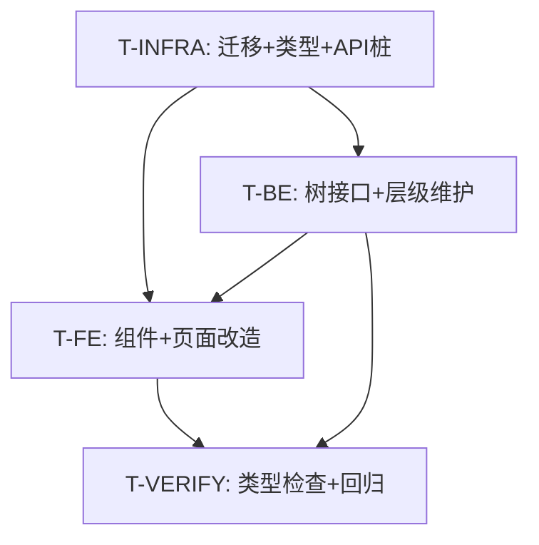
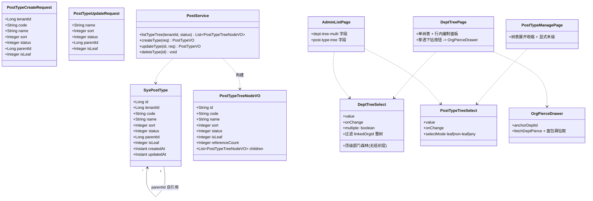
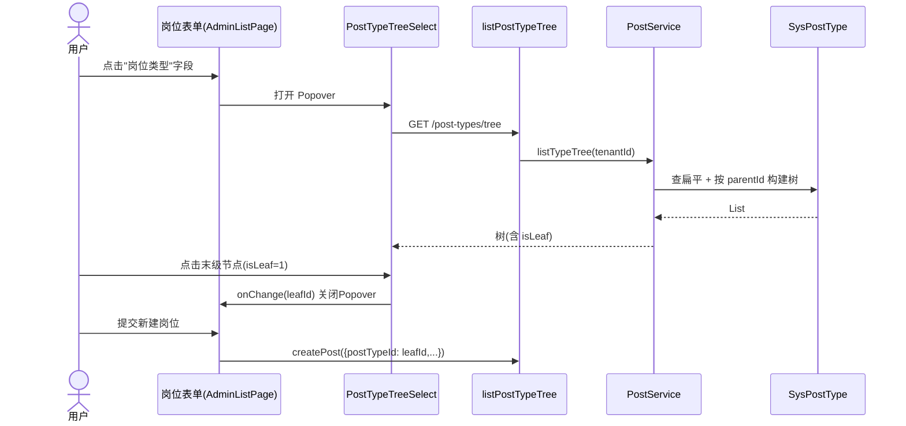
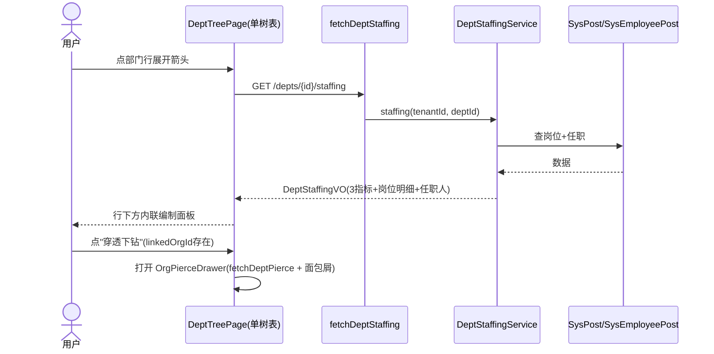
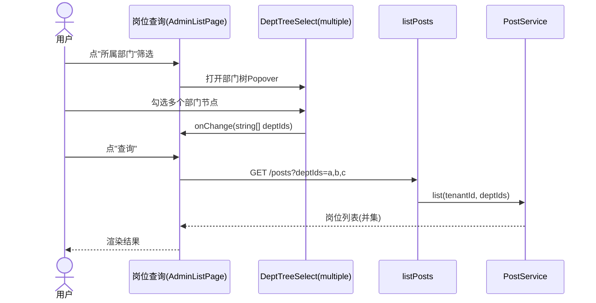

# MIS 平台 · 组织人事域增量改造设计文档

> 版本：v1.0（设计评审稿，设计通过后才进入实现）
> 作者：software-architect（Bob）
> 日期：2026-08-16
> 关联前序资产：
> - `deliverables/software-company/org-position-architecture-2026-08-16.md`
> - `deliverables/software-company/org-position-prd-2026-08-16.md`
> - `deliverables/software-company/org-user-employee-architecture-2026-08-16.md`

---

## 0. 代码核查结论（先读代码，不凭记忆）

本设计基于真实代码 grep/Read 核实，关键资产真实形态如下（与"需求叙述"有出入处已标注）：

| 资产 | 真实路径 | 真实形态 |
|------|----------|----------|
| 部门管理页（3 Tab） | `frontend/mis-admin-web/src/features/system/dept/dept-tree-page.tsx` | 单页 `DeptTreePage` + 顶部 `segmented`（组织架构/岗位编制/组织穿透）；组织架构= `TreeTable`+CRUD；岗位编制= 扁平部门列表 + `fetchDeptStaffing(id)` 懒加载 `DeptStaffingVO`；穿透= `fetchDeptPierce(orgId)` 钻取栈（只读） |
| 通用列表引擎 | `frontend/mis-admin-web/src/features/system/admin-list-page.tsx` | `AdminListPage`：支持 `deptOptionsLoader`/`postOptionsLoader`/`postTypeOptionsLoader`/`orgOptionsLoader`；`optionsFrom: 'dept'｜'post'｜'post-type'｜'org'`；字段类型含 `dept-tree`、`select`、`multiselect`、`assignments` |
| 页面定义 | `frontend/mis-admin-web/src/features/system/page-defs.ts` | `/system/post` 已定义：`filters` 含 `name`(text)、`deptIds`(**multiselect + optionsFrom:'dept' 扁平下拉**)、`orgIds`(**multiselect + optionsFrom:'org' 扁平下拉**)、`status`；`form` 含 `deptId`(dept-tree 单值)、`postTypeId`(select + optionsFrom:'post-type' 扁平下拉) |
| 树形单选组件 | `frontend/mis-admin-web/src/components/common/dept-tree-select.tsx` | `DeptTreeSelect`：跨组织聚合为**顶级部门森林**（无组织分组层）；过滤 `linkedOrgId` 整树；支持单选/多选 |
| 树表组件 | `frontend/mis-admin-web/src/components/common/tree-table.tsx` | `TreeTable`（部门树/穿透树复用） |
| 岗位类型管理页 | `frontend/mis-admin-web/src/features/system/post/post-type-manage-page.tsx` | 已存在独立页 `PostTypeManagePage`：列=编码/名称/排序/状态/引用岗位数；CRUD；变更后 `bumpPostTypeVersion()` 驱动岗位引擎刷新下拉 |
| 岗位类型版本 store | `frontend/mis-admin-web/src/features/system/post/post-type-version-store.ts` | zustand store，bump 后重挂载下拉 |
| 后端 实体 | `backend/mis-org/.../domain/entity/SysPostType.java` | **扁平**：仅 `id/tenantId/code/name/sort/status/时间戳`，**无 `parentId`、无 `isLeaf`** |
| 后端 VO | `backend/mis-org/.../dto/PostTypeVO.java` | 扁平：`id/tenantId/code/name/sort/status/referenceCount` |
| 后端 Service | `backend/mis-org/.../service/PostService.java` | `listTypes(tenantId,status)` 扁平；`createType`/`updateType`/`deleteType` 不含层级；`referenceCount` 实时统计 |
| 后端 Controller | `backend/mis-org/.../controller/PostController.java` | 内部端点 `GET /internal/v1/post-types`（扁平，无 tree）；`POST/PUT/DELETE /post-types/*` |
| BFF | `backend/mis-admin-bff/.../controller/PostController.java`、`service/OrgFacadeService.java`、`client/OrgWebClient.java` | `GET /api/v1/post-types`（扁平）；`orgWebClient.listPostTypes` 透传；`getDeptStaffing` 已透传 `DeptStaffingVO` |
| 前端 API | `frontend/.../lib/api/posts.ts`、`depts.ts` | `listPostTypes(status?)`、`fetchDeptStaffing(id)`、`fetchDeptPierce(orgId)`；无 post-type tree 接口 |
| 种子数据 | `backend/mis-migrator/.../db/migration/V39__system_management_real_data.sql` | `sys_post_type` 已有 5 条扁平记录（id 1-5：management/tech/admin/operation 等），`parent_id` 字段**不存在** |
| UI 组件库 | `frontend/.../components/ui/` | 仅有 `popover.tsx`，**无 Radix `Select`**（关键：修复弹窗 bug 不能简单换成 Radix Select） |

**与需求叙述的主要出入（须向用户澄清/确认）：**
1. 需求 3.1"所属组织使用下拉列表（而非当前形态）"——**当前 `orgIds` 已是多选下拉列表**，诉求已满足；本次几乎无需改动（见 C.1）。
2. 需求 3.2"部门下拉树（部门多时当前内联树显示不下）"——当前 `deptIds` 是**扁平多选下拉列表**，并非"内联树"；改造方向=改为"下拉树 Popover"，与叙述意图一致。
3. 岗位类型**当前即扁平无层级**，需求 #2 是真正的"新增多层化"，需加 `parent_id`+`is_leaf` 与树接口（见 B）。

---

## A. 部门管理「三 Tab 合一」详细设计

### A.1 可行性结论
**可行。** 三 Tab 的数据已分别具备：组织架构（部门树）、岗位编制（`DeptStaffingVO` 按部门懒加载）、组织穿透（`fetchDeptPierce` 跨组织钻取）。三者共用同一棵部门树为骨架，编制是部门的"展开明细"，穿透是部门的"跨组织下钻动作"。**纯前端改造即可**，后端零改动（无新增 API、无迁移）。代价集中在 `dept-tree-page.tsx` 的视图重构。

### A.2 统一数据模型（一张树表融合三 Tab）

```ts
// 每行 = 一个部门节点（组织架构骨架）
interface MergedDeptRow {
  id: string;            // deptId
  name: string;
  code: string | null;
  linkedOrgId: string | null;   // 穿透锚点
  linkedOrgName: string | null;
  sort: number;
  status: number;
  depth: number;         // 树层级（TreeTable 渲染缩进）
  hasChildren: boolean;  // 是否有子部门（组织架构展开）
  // —— 岗位编制（懒加载，行展开时 fetchDeptStaffing 填充）——
  staffing?: DeptStaffingVO | null;
  staffingLoaded: boolean;
}
```

- **组织架构** → 树表行 + 子部门展开（沿用现有 `flatten(tree)` + `TreeTable`）。
- **岗位编制** → 行内"展开"触发 `fetchDeptStaffing(id)`，在行下方渲染内联子面板（复用现有 `DeptStaffingVO` 展示：3 指标 + 岗位任职明细 + 部门任职人员），**关闭即收起、不切换 Tab**。
- **组织穿透** → 在"有 `linkedOrgId`"的行上提供「穿透下钻」按钮，打开只读 `OrgPierceDrawer`（抽屉），内部复用现有 `fetchDeptPierce` + 面包屑钻取栈逻辑（从 dept-tree-page 抽出为独立组件）。

### A.3 推荐表格列定义（合并后单表）

| 列 | 来源 | 说明 |
|----|------|------|
| 部门名称（树列，可展开子部门） | DeptNode | 展开=组织架构子级 |
| 编码 | DeptNode.code | |
| 对应组织 | linkedOrgName | 穿透锚点提示 |
| 岗位数 | DeptStaffingVO.postCount（懒加载） | 展开编制后显示 |
| 已任职 | DeptStaffingVO.filledCount | |
| 空缺 | DeptStaffingVO.vacantCount | |
| 排序 | DeptNode.sort | |
| 状态 | DeptNode.status | 启用/禁用徽标 |
| 操作 | — | 子部门 / 编辑 / 删除 / **穿透下钻**（仅 `linkedOrgId` 存在时可用） |

> 列宽、排序、列拖拽、本地存储（`storageKey`）沿用现有 `useColumnWidths` 与 `TreeTable` 能力。

### A.4 交互流程
1. 顶部组织 `<select>` 选择组织 → 加载该组织部门树（不变）。
2. 点击某部门行前的展开箭头 → 调 `fetchDeptStaffing(id)`，行下方内联展示该部门岗位编制（3 指标 + 岗位明细 + 任职人）。再次点击收起。
3. 有 `linkedOrgId` 的部门，操作列出现「穿透下钻」→ 打开 `OrgPierceDrawer`，以该部门为锚点跨组织钻取（只读，防循环面包屑，沿用现有 `pierceLevels` 逻辑）。
4. 新增子部门/编辑/删除：沿用现有 `Sheet` 表单，逻辑不变。

### A.5 技术代价与风险
- **FE 中**：`dept-tree-page.tsx` 从"3-view 分支"重构为"单 TreeTable + 展开编制面板 + 穿透 Drawer 组件"。提取 `OrgPierceDrawer` 组件（约 80-120 行）。工作量 ≈ 中。
- **BE**：无。
- **风险**：编制懒加载在大数据量部门树下的请求数（现有 `Promise.all` 在"岗位编制"Tab 已用，本次改为"按需行展开"反而更省，仅展开可见行时请求）。
- **回归面**：部门 CRUD、穿透钻取、编制统计均已有测试/QA 路径，改造后需回归。

### A.6 推荐方案 vs 备选
- ✅ **推荐方案 A（采用）**：单树表 + 行内可展开编制面板 + 行内"穿透下钻"抽屉。最贴合"合并到一张表"，且穿透能力以更顺手的方式保留。
- 🅱️ **备选方案 B**：保留单树表，但在顶部加一个轻量"穿透视图"开关，点击后整表数据源切换为 `fetchDeptPierce` forest（仍是"一张表"，只是数据来源切换）。代价：重新引入"切换"心智，与"合一"目标略悖；仅在用户强烈反对抽屉式穿透时采用。

---

## B. 岗位类型多层化设计

### B.1 现状
`SysPostType` 扁平，无层级字段，无树接口。种子 5 条扁平类型。需求要求：支持多层 + 末级标记 + 选类型时只能选末级。

### B.2 数据模型变更

**新增字段（`sys_post_type`）：**
| 字段 | 类型 | 默认 | 说明 |
|------|------|------|------|
| `parent_id` | BIGINT | 0 | 0=根级 |
| `is_leaf` | SMALLINT/INTEGER | 1 | **显式可写**：1=末级(可被岗位选用)，0=非末级(分类，可挂子类型) |

> **决策更正（2026-08-17）：** `is_leaf` 为表字段，由创建/更新请求显式写入，**不再**根据是否有子节点推导，**不再**存在 `refreshLeaf` 回写。  
> 约束：仅非末级下可挂子；有子时不可改为末级；已被岗位引用时不可改为分类；岗位只能选用末级；删除为**物理删除**，被引用硬拦截。

### B.3 Flyway 迁移

实际落地版本：**`V52__post_type_hierarchy.sql`**（库中 V47 已占用为其他脚本，不可复用版本号）。
```sql
ALTER TABLE sys_post_type ADD COLUMN IF NOT EXISTS parent_id BIGINT NOT NULL DEFAULT 0;
ALTER TABLE sys_post_type ADD COLUMN IF NOT EXISTS is_leaf SMALLINT NOT NULL DEFAULT 1;
UPDATE sys_post_type SET parent_id = 0 WHERE parent_id IS NULL;
UPDATE sys_post_type SET is_leaf = 1 WHERE is_leaf IS NULL;
```
**历史数据：** 存量扁平类型默认根级末级（`parent_id=0, is_leaf=1`）。建树时需先将父节点显式改为非末级，再挂子类型。

### B.4 后端 API 变更（树接口 + create/update 扩展）

**树形查询**
- mis-org：`GET /internal/v1/post-types/tree?tenantId=&status=`
- BFF：`GET /api/v1/post-types/tree?status=`
- Service：`PostService.listTypeTree` —— 按 `parent_id` 组装树；节点含 `isLeaf`（读库字段）。

**扩展：新建/编辑支持 `parentId` + `isLeaf`**
- `PostTypeCreateRequest` / `PostTypeUpdateRequest`：`parentId`、`isLeaf`（创建默认 1；更新 null=不改）。
- `createType`：写入显式 `isLeaf`；`parentId≠0` 时父必须已是非末级；**不**回写父 `is_leaf`。
- `updateType`：可改 `parentId`（防环 + 新父须非末级）、可改 `isLeaf`（有子不可改末级；有岗位引用不可改分类）。
- `deleteType`：**物理删除**；仅末级可删；有子或 `countByPostTypeId>0` 硬拦截；**不**回写父 `is_leaf`。
- `requirePostType`（岗位 CRUD）：目标类型必须 `isLeaf=1`。

### B.5 前端

- `PostTypeTreeSelect`：`selectMode`=`leaf`（岗位表单）/ `non-leaf`（上级类型）/ `any`。
- 管理页树表：默认仅顶级 + 展开/收缩；列含「末级」；去掉「上级类型」「引用岗位数」；行内「子类型」仅非末级可见；Sheet 可编辑「是否末级」。

### B.6 评估
- BE：实体+迁移+树接口+create/update 显式 `isLeaf`；删除物理删 + 引用拦截。
- FE：树选择器 `selectMode` + 管理页树表折叠与末级可编辑。
- 风险：编辑时重挂父级需防"挂到自己的子孙"（防环校验），已列。

---

## C. 岗位管理（查询 + 新建表单）改造设计

### C.1 查询条件「所属组织」→ 下拉列表（3.1）
**核查结论：当前 `orgIds` 过滤已是"多选下拉列表"（`optionsFrom:'org'` → `loadOrgOptions()` 扁平多选），诉求已满足。**

- 本次**默认不改动**。仅在用户偏好切换时调整：
  - 选项 A（推荐，零改动）：保持多选下拉列表（与后端 `orgIds` 数组契约一致）。
  - 选项 B：若用户希望"单组织"，改为单选下拉列表（`type:'select', optionsFrom:'org'`）。
- 见 E.3 待确认。

### C.2 查询条件「部门」→ 下拉树（3.2）

**已落地（2026-08-17）：** `DeptTreeSelect`（`multiple`）用于筛选 `deptIds`。

- 跨组织并行 `fetchDeptTree`，合并为**顶级部门**森林（**不以组织作第一层**）。
- **过滤** `linkedOrgId` 非空的穿透锚点部门及其**整棵子树**（子部门不上提、不可选）。
- 多选：复选 + 全选/清空；触发器 chip 单行截断。

### C.3 新建/编辑 Sheet 内嵌套 Popover 误关 —— 根因 + 修复

**现象（2026-08-17）：** 新建岗位侧栏中点击「所属部门」「岗位类型」，下拉一打开即消失，无法点选。

**根因：** 表单在 Radix **Sheet（Dialog）** 内，树选择器为 portaled **Popover**。点击 Popover 内容被 Dialog 判定为 `pointer/interact-outside` → Sheet 关闭/打断，表现为下拉立刻消失。

**修复（已落地）：**
1. `components/ui/sheet.tsx`：`onPointerDownOutside` / `onFocusOutside` / `onInteractOutside` 若目标落在 `[data-radix-popper-content-wrapper]` 等浮层上则 `preventDefault`。
2. `DeptTreeSelect` / `PostTypeTreeSelect`：`Popover modal`；触发器文案 `truncate`。
3. `popover.tsx`：浮层 `z-[60]`，高于 Sheet 内容层便于点击。
4. 管理列表新建/编辑 Sheet 加宽至约 `40rem`（`admin-list-page`）。

> 历史方案「组织 select 移出 Popover」已过时：当前不再在部门树内展示组织层。

### C.4 新建岗位「岗位类型」→ 下拉树、单选、仅末级可选
- `page-defs.ts` 的 `form.postTypeId`：`type:'post-type-tree'` → `PostTypeTreeSelect`（`selectMode='leaf'`）。
- 嵌套 Sheet 选择交互同 C.3 修复。
- 提交仍只传叶子 `postTypeId`。

---

## D. 任务分解（T-INFRA / T-BE / T-FE / T-VERIFY）

> 依赖顺序：T-INFRA → T-BE → T-FE → T-VERIFY。FE 的类型定义可先 mock，待 BE 接口就绪后联调。
> **新增 Flyway 迁移：是（V47）** ｜ **新增后端 API：是（GET /post-types/tree ×2 + 扩展 create/update 的 parentId）** ｜ **新增依赖包：无**（复用现有 Radix Popover，无需引入 Select 库）

### T-INFRA（P0，基础设施 / 数据 / 公共组件骨架）
- **文件**：
  - `backend/mis-migrator/.../db/migration/V47__post_type_hierarchy.sql`（新增迁移）
  - `frontend/mis-admin-web/src/types/api.ts`（新增 `PostTypeTreeNode`、`PostTypeTreeVO`、`MergedDeptRow` 等类型）
  - `frontend/mis-admin-web/src/lib/api/posts.ts`（新增 `listPostTypeTree()`；`PostTypeItem` 增加 `parentId`/`isLeaf`）
- **依赖**：无
- **产出**：数据库字段就位；前端类型与 API 客户端就绪（接口桩）。

### T-BE（P0，后端 mis-org + BFF）
- **文件**：
  - `backend/mis-org/.../domain/entity/SysPostType.java`（增 `parentId`、`isLeaf` + getter/setter）
  - `backend/mis-org/.../domain/repository/SysPostTypeRepository.java`（增 `findByParentId`、`existsByParentId`）
  - `backend/mis-org/.../dto/PostTypeVO.java`（不变）
  - `backend/mis-org/.../dto/PostTypeTreeNodeVO.java`（新增树节点 record）
  - `backend/mis-org/.../dto/PostTypeCreateRequest.java` / `PostTypeUpdateRequest.java`（增 `parentId`）
  - `backend/mis-org/.../service/PostService.java`（增 `listTypeTree`；`createType`/`updateType`/`deleteType` 维护 `is_leaf`；防自环校验）
  - `backend/mis-org/.../controller/PostController.java`（增 `GET /post-types/tree`）
  - `backend/mis-admin-bff/.../controller/PostController.java`（增 `GET /api/v1/post-types/tree`）
  - `backend/mis-admin-bff/.../service/OrgFacadeService.java`（增 `listPostTypeTree`）
  - `backend/mis-admin-bff/.../client/OrgWebClient.java`（增 `listPostTypeTree` 透传）
  - `backend/mis-admin-bff/.../client/model/PostTypeTreeNodeVO.java`（新增）
- **依赖**：T-INFRA
- **产出**：树接口与层级维护就位。

### T-FE（P0，前端）
- **文件**：
  - `frontend/.../components/common/dept-tree-select.tsx`（**修复 C.3 弹窗 bug**：组织选择器移出 Popover + 增加 `multiple` 模式）
  - `frontend/.../components/common/post-type-tree-select.tsx`（**新增**：单选树、仅末级可选）
  - `frontend/.../components/common/org-pierce-drawer.tsx`（**新增**：从 dept-tree-page 抽出的穿透抽屉，支撑 A.6 推荐方案）
  - `frontend/.../features/system/admin-list-page.tsx`（引擎增加 `dept-tree-multi` 与 `post-type-tree` 字段类型分支）
  - `frontend/.../features/system/page-defs.ts`（post 页：`deptIds`→`dept-tree-multi`；`postTypeId`→`post-type-tree`；3.1 orgIds 保持）
  - `frontend/.../features/system/dept/dept-tree-page.tsx`（重构为单树表 + 行内编制面板 + 调用 `OrgPierceDrawer`，落实 A.6 推荐方案）
  - `frontend/.../features/system/post/post-type-manage-page.tsx`（树表展示 + 新建/编辑增加"上级类型"）
- **依赖**：T-INFRA、T-BE
- **产出**：三 Tab 合一、岗位类型树、查询/表单改造全可用。

### T-VERIFY（P1，验证）
- **文件**：QA 用例（沿用 `deliverables/software-company/qa/` 既有回归路径）
- **活动**：
  - `npm run typecheck` / `mvn -q compile` 全绿；
  - 手动回归：部门 CRUD、编制展开、穿透下钻、岗位 CRUD、岗位类型新建父/子/末级、岗位表单选父类型与末级类型、查询条件 orgIds/deptIds 树过滤；
  - 专项验证 C.3 弹窗 bug 已修复（选组织后弹窗不消失，可正常选部门）。
- **依赖**：T-BE、T-FE

### 任务依赖图


---

## E. 待用户确认项（open questions，附推荐默认值）

| # | 问题 | 推荐默认 | 影响范围 |
|---|------|----------|----------|
| E.1 | 三 Tab 合一采用哪种布局？ | **推荐方案 A**：单树表 + 行内可展开编制面板 + 行内"穿透下钻"抽屉（见 A.6） | A 整节 |
| E.2 | 历史 5 条扁平岗位类型是否需重分类到新建父级？ | **否**：保持为根级末级（`parent_id=0,is_leaf=1`），后续运营按需建父级并重新挂接 | B.3 |
| E.3 | 「所属组织」过滤单选还是多选？ | **多选下拉列表**（当前已是，与后端 `orgIds` 数组契约一致）；如需单选请告知 | C.1 |
| E.4 | 合并后组织穿透能力如何保留？ | **行内"下钻"按钮 → 只读穿透抽屉**（推荐 A）；备选：保留独立穿透 Tab | A.6 |
| E.5 | 岗位类型树下拉是否允许选非末级？ | **岗位表单仅末级**；**上级类型选择仅非末级**（`selectMode`） | B.5/C.4 |
| E.6 | 新建岗位部门/岗位类型下拉误关？ | **Sheet 忽略 Popover 外部交互**（C.3，2026-08-17） | C.3 |
| E.7 | 部门查询下拉树单选还是多选？ | **多选**（与现有 `deptIds` 并集过滤契约一致）；单组织场景如需单选可后加 | C.2 |
| E.8 | 管理页是否展示"层级/上级"列？ | 树表展示层级与**末级**；默认折叠顶级；去掉「上级类型」「引用岗位数」；Sheet 可编辑 isLeaf | B.5 |
| E.9 | `is_leaf` 推导还是显式？ | **显式可写**（2026-08-17）；取消 `refreshLeaf` | B.2/B.4 |
| E.10 | 岗位类型删除语义 | **物理删除**；被岗位引用禁止删除 | B.4 |

---

## 附：类图（Mermaid classDiagram）



## 附：时序图（Mermaid sequenceDiagram）

### (1) 新建岗位：岗位类型下拉树（仅末级可选）


### (2) 部门管理：行内展开岗位编制（三 Tab 合一）


### (3) 岗位查询：部门下拉树过滤（多选并集）

