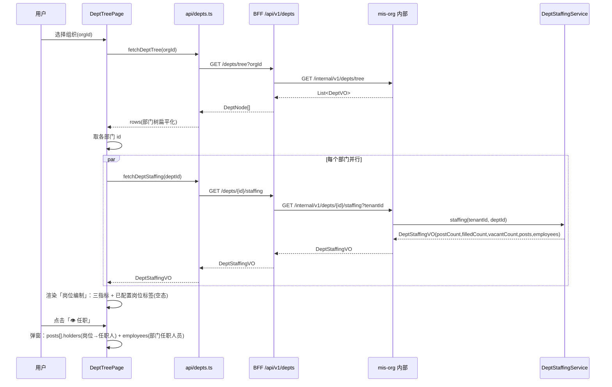
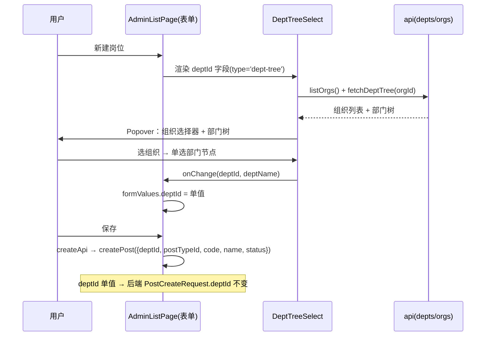
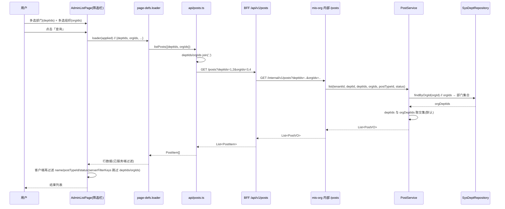
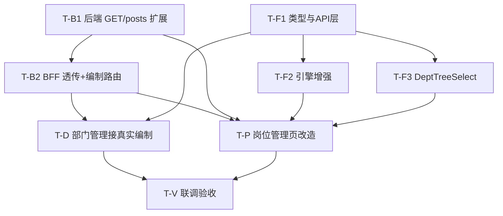

# 部门管理 & 岗位管理 增量架构设计与任务分解

> 文档类型：增量架构设计（仅设计，不出实现代码）｜架构师：高见远（Gao）
> 日期：2026-08-16｜基于 PRD：`org-position-prd-2026-08-16.md`
> 系统：`D:\code\mis-platform` 单体仓库增量改造
> 微服务链路：`mis-org`(8103) → `mis-admin-bff`(8081) → `mis-gateway`(8080) `/api/v1/**`
> 前端：`frontend/mis-admin-web`（Vite + React + TS + shadcn + Tailwind + Zustand，`@/` 别名，`features/` 按域）

---

## 0. 代码核实结论（以代码为准，校准 PRD 缺口）

设计前已逐一打开前后端源码二次核实，结论如下（**与 PRD 不一致处已标红，须重点评审**）：

| # | PRD 表述 | 代码实际 | 设计影响 |
|---|---|---|---|
| V1 | N1「后端编制接口已就绪，前端只需替换 mock，后端无需改」 | `DeptStaffingService.staffing()` + 内部 `DeptController.GET /internal/v1/depts/{id}/staffing` **确实存在**（`DeptStaffingVO` 含 `postCount/filledCount/vacantCount/posts/employees`）。**但 BFF/gateway 层没有 `/api/v1/depts/{id}/staffing` 路由**（BFF `DeptController` 仅有 `/tree`、`/pierce`、`/{id}`、CRUD）。 | ⚠️ **N1 结论需修正**：前端要调到编制接口，必须在 BFF 新增 `GET /api/v1/depts/{id}/staffing` + client + facade（内部 `mis-org` 不改动）。tenantId 由 BFF 经 `RequestContext` 注入，前端不传。 |
| V2 | 前端部门编制视图用 mock `EMPLOYEE_ASSIGNMENTS` 未接真实后端 | `dept-tree-page.tsx` 确有 `EMPLOYEE_ASSIGNMENTS`/`deriveStaffing()`，且**以部门「名称」为 key**（非 deptId）。 | 改造须改为**以部门 ID 为 key** 调真实接口，移除全部 mock。 |
| V3 | 部门管理页有「组织架构 / 岗位编制」两个 Tab | 实际有**三个 Tab**：组织架构 / 岗位编制 / **组织穿透**（V40 已实现完整下钻）。 | ⚠️ PRD §4.1 写「移除组织穿透 Tab」与 N6「不改动/保留」**自相矛盾**。建议**保留**组织穿透 Tab（既已实现且 N6 明令不改动），仅做本次需求范围外置。见 §8 风险 R1。 |
| V4 | `sys_post.dept_id` 为单值，新增时部门树形单选 | `PostCreateRequest/PostUpdateRequest.deptId` 单值；`SysDept.orgId` NOT NULL；`SysDeptRepository.findByOrgId(orgId)` 存在（可反查组织→部门）。 | 支持。POST-01 仅前端交互改造，后端 `deptId` 不变。 |
| V5 | `GET /posts` 仅支持单 `deptId` | `mis-org` 内部 + BFF 两层 `GET /posts` 均仅 `deptId`（单值）。 | 须两层均扩展 `deptIds`/`orgIds`。 |
| V6 | `PostManagePage` 用通用引擎 + `SYSTEM_PAGE_DEFS['/system/post']` | 确认。筛选项 `deptId`=`type:'select', optionsFrom:'dept'`；表单 `deptId`=`type:'select'`；`deptOptionsLoader=loadDeptOptions`（**仅加载首个组织**的部门）。 | 表单改 `dept-tree` 单选；筛选改 `multiselect`；需新增 `'org'` optionsFrom + `orgOptionsLoader`；`loadDeptOptions` 须聚合全组织。 |
| V7 | 通用引擎支持 multiselect 筛选 | `FieldType` 含 `'multiselect'`，但**仅在表单 `FieldControl` 实现**；**筛选栏只渲染 `select`/`text`**，multiselect 在筛选栏会退化成文本框。`filtered` 客户端过滤对 `select` 做精确匹配、对数组无处理。 | ⚠️ POST-02/03 多选筛选**必须改引擎**：① 筛选栏渲染 multiselect；② 服务端过滤的 key 须跳过客户端二次过滤（否则数组匹配全空）。 |
| V8 | 「组织多选」下拉有数据源 | `listOrgs()`(orgs.ts) 存在；但 `AdminPageDef` 无 `orgOptionsLoader`、`optionsFrom` 无 `'org'`。 | 须给 `AdminPageDef` 加 `orgOptionsLoader` 与 `optionsFrom:'org'`。 |
| V9 | 无 DB 变更诉求 | 本次仅扩展查询参数（`@RequestParam`），**无 schema 变更**；Flyway 仅追加，无需新迁移脚本。 | 无迁移。 |
| V10 | 前端门禁 | 仅 `npm run typecheck`（tsc --noEmit），**无 vitest**。 | 不写单测；靠 typecheck + 手动验收（§9）。 |

---

## 1. 实现方案 + 框架选型

**沿用现有栈，不做技术选型变更**。增量改造切入点与前后端策略：

### 1.1 前端策略
- **部门管理（DEPT）**：`dept-tree-page.tsx` 的「岗位编制」Tab 由 mock 改为真实数据。对每个可见部门并行调用 `GET /api/v1/depts/{id}/staffing`，以 `DeptStaffingVO` 渲染「三指标 + 已配置岗位标签 + 任职明细」。组织穿透 Tab 保留不动。
- **岗位管理（POST）**：
  - POST-01（部门树形单选）：新增可复用组件 `DeptTreeSelect`（shadcn `Popover` + 递归部门树 + 内置组织选择器），引擎 `FieldControl` 新增 `type:'dept-tree'` 分支，表单 `deptId` 字段由 `select` 改为 `dept-tree`；提交仍为单值 `deptId`，后端零改动。
  - POST-02/03（部门多选 × 组织多选）：通用引擎 `AdminListPage` 增强——筛选栏支持 `multiselect` 渲染、`optionsFrom:'org'` 注入、`loader` 接收已应用筛选条件、`serverFilterKeys` 跳过服务端已过滤 key。页面 def 的 `loader` 把 `deptIds`/`orgIds` 透传给 `listPosts`，**服务端过滤**；`name`/`postTypeId`/`status` 仍客户端过滤（后端 `/posts` 不支持 name，保持现状）。
- **去 mock 数据源**：统一经现有 `fetchDeptTree` / `listOrgs` / 新增 `fetchDeptStaffing` / 改造后 `listPosts`。

### 1.2 后端策略
- **内部 `mis-org`**：`DeptStaffingService`/`DeptController.staffing` **不改动**（V1）；仅 `PostController.GET /posts` + `PostService.list` 扩展 `deptIds`/`orgIds`（内存流过滤复用现有风格，`orgIds`→经 `SysDeptRepository.findByOrgId` 反查部门集合，与 `deptIds` 取**交集**=POST-04 默认语义）。
- **BFF `mis-admin-bff`**（V1 关键缺口）：新增 `GET /api/v1/depts/{id}/staffing`（facade+client+模型类 3 个），并把 `deptIds`/`orgIds` 透传到现有 `/posts` 链路（BFF `PostController`/`OrgFacadeService`/`OrgWebClient` 三层各加参数）。tenantId 由 BFF 经 `RequestContext.requireTenantId()` 注入，前端不感知。
- **Gateway**：`/api/v1/**` 路径透传，新增路由无需配置。
- **DB**：无迁移（V9）。

### 1.3 难点与决策
- **多选参数序列化**：前端 `deptIds`/`orgIds` 数组 `join(',')` → 后端 `@RequestParam List<Long>`（Spring 逗号绑定）；BFF `OrgWebClient` 同样逗号串经 `queryUri`（自动跳过 null/空白，见 `AbstractDownstreamClient.queryUri`）。
- **服务端 vs 客户端过滤**：PRD 明确要求后端支持（POST-02/03 验收），故采用服务端过滤 + `serverFilterKeys` 防客户端二次过滤击穿；非过度设计，是满足验收的必要改造。
- **N+1 风险**：DEPT 编制视图对每个部门发起一次 `/staffing` 调用。本期用 `Promise.all` 并行（组织部门量可控）；如后续部门规模大，再议批量端点 `GET /depts/staffing?ids=`（P2，不阻塞本次）。

---

## 2. 文件列表及相对路径

> 仓库根：`D:\code\mis-platform`。标注【改】=修改，【新】=新增，【不变】=复用不改动。

### 2.1 前端（`frontend/mis-admin-web`）
| 文件（相对路径） | 类型 | 职责 |
|---|---|---|
| `src/lib/api/depts.ts` | 【改】 | 新增 `fetchDeptStaffing(id)` → `GET /depts/{id}/staffing`；导出 `DeptStaffingVO`/`PostStaffingVO`/`EmployeeLiteVO` 前端类型。保留 `fetchDeptTree` 等。 |
| `src/lib/api/posts.ts` | 【改】 | `PostQuery` 扩展 `deptIds?`/`orgIds?`；`listPosts` 将数组 `join(',')` 序列化后传参。 |
| `src/features/system/types.ts` | 【改】 | `FieldType` 增加 `'dept-tree'`；`optionsFrom` 联合类型增加 `'org'`；`AdminPageDef` 增加 `orgOptionsLoader?` 与 `serverFilterKeys?`。 |
| `src/features/system/admin-list-page.tsx` | 【改】 | ① 增加 `orgOptions` 状态与加载 effect；② `effectiveFilters`/`effectiveForm` 注入 `optionsFrom:'org'`；③ 筛选栏渲染 `multiselect`（复用 chip UI）；④ `filtered` 跳过 `serverFilterKeys`；⑤ `loader` 调用时传入 `applied`（兼容无参 loader）。 |
| `src/features/system/page-defs.ts` | 【改】 | `/system/post` def：筛选 `deptId`→`deptIds`(multiselect, optionsFrom dept)、新增 `orgIds`(multiselect, optionsFrom org)；表单 `deptId`→`type:'dept-tree'`；新增 `orgOptionsLoader`、`serverFilterKeys:['deptIds','orgIds']`；`loader` 接收 filters 并透传 `deptIds`/`orgIds`。另：`loadDeptOptions` 改为**聚合全组织**部门（支持跨组织多选），新增 `loadOrgOptions` 辅助函数。 |
| `src/features/system/dept/dept-tree-page.tsx` | 【改】 | 移除 `EMPLOYEE_ASSIGNMENTS`/`deriveStaffing`/`STAFFING`；岗位编制视图改为按部门 ID 并行取真实 `DeptStaffingVO` 渲染三指标 + 已配置岗位标签；任职弹窗改用 `vo.posts[].holders` + `vo.employees`。组织穿透 Tab 保留。 |
| `src/components/common/dept-tree-select.tsx` | 【新】 | `DeptTreeSelect` 组件：`Popover` 触发器 + 内部组织选择器（默认首个/可切）+ 递归展开部门树；单选回填 `deptId`（及名称）。供 POST-01 表单复用。 |

### 2.2 后端 `mis-org`（内部服务 8103）
| 文件（相对路径） | 类型 | 职责 |
|---|---|---|
| `backend/mis-org/src/main/java/com/mis/org/controller/PostController.java` | 【改】 | `GET /internal/v1/posts` 增加 `@RequestParam(required=false) List<Long> deptIds`、`List<Long> orgIds`，透传 `PostService.list`。 |
| `backend/mis-org/src/main/java/com/mis/org/service/PostService.java` | 【改】 | `list(tenantId, deptId, deptIds, orgIds, postTypeId, status)`：`orgIds`→`deptRepository.findByOrgId(orgId)` 反查部门集合；`deptIds` 与 `orgDeptIds` 取交集（POST-04 默认）；其余沿用现有流过滤。 |
| `backend/mis-org/.../controller/DeptController.java`、`service/DeptStaffingService.java`、`dto/DeptStaffingVO.java` 等 | 【不变】 | 编制接口已就绪，复用。 |

### 2.3 后端 `mis-admin-bff`（聚合层 8081）
| 文件（相对路径） | 类型 | 职责 |
|---|---|---|
| `backend/mis-admin-bff/src/main/java/com/mis/adminbff/controller/PostController.java` | 【改】 | `GET /api/v1/posts` 增加 `deptIds`、`orgIds` 透传 `orgFacadeService.listPosts(...)`。 |
| `backend/mis-admin-bff/src/main/java/com/mis/adminbff/controller/DeptController.java` | 【改】 | 新增 `GET /api/v1/depts/{id}/staffing` → `orgFacadeService.getDeptStaffing(id)`。 |
| `backend/mis-admin-bff/src/main/java/com/mis/adminbff/service/OrgFacadeService.java` | 【改】 | `listPosts(...)` 增加 `deptIds`/`orgIds`；新增 `getDeptStaffing(id)`（注入 `RequestContext.requireTenantId()`）。 |
| `backend/mis-admin-bff/src/main/java/com/mis/adminbff/client/OrgWebClient.java` | 【改】 | `listPosts(...)` 增加 `deptIds`/`orgIds`（逗号串经 `queryUri`）；新增 `getDeptStaffing(id, tenantId)` → `GET /internal/v1/depts/{id}/staffing`。 |
| `backend/mis-admin-bff/src/main/java/com/mis/adminbff/client/model/DeptStaffingVO.java` | 【新】 | 对齐内部 `DeptStaffingVO`（postCount/filledCount/vacantCount/posts/employees）。 |
| `backend/mis-admin-bff/src/main/java/com/mis/adminbff/client/model/PostStaffingVO.java` | 【新】 | 对齐内部 `PostStaffingVO`（postId/postName/postType/holders/vacant）。 |
| `backend/mis-admin-bff/src/main/java/com/mis/adminbff/client/model/EmployeeLiteVO.java` | 【新】 | 对齐内部 `EmployeeLiteVO`（id/name/isPrimary）。 |

### 2.4 不变项
- Gateway：路径透传，无变更。
- Flyway：无新迁移（无 schema 变更）。
- 员工管理（`/system/employee`）、组织管理（`/system/org`）、岗位类型子 Tab：仅 `loadDeptOptions` 被复用改造，其余不受影响（除员工页部门选项变为全组织，属正向增强）。

---

## 3. 数据结构与接口（类图 / Mermaid）

```mermaid
classDiagram
    %% ===== 前端类型/组件 =====
    class PostQuery {
      +deptId? : number
      +deptIds? : number[]
      +orgIds? : number[]
      +postTypeId? : number
      +status? : number
    }
    class DeptStaffingVO_F {
      +deptId: string
      +deptName: string
      +postCount: number
      +filledCount: number
      +vacantCount: number
      +posts: PostStaffingVO_F[]
      +employees: EmployeeLiteVO_F[]
    }
    class PostStaffingVO_F {
      +postId: string
      +postName: string
      +postType: string
      +holders: EmployeeLiteVO_F[]
      +vacant: boolean
    }
    class EmployeeLiteVO_F {
      +id: string
      +name: string
      +isPrimary: Integer|null
    }
    class DeptTreeSelect {
      +value? : string|number
      +onChange(id, name) : void
      +orgId? : string|number
    }
    class AdminPageDef {
      +filters: AdminField[]
      +form: AdminField[]
      +loader(filters) : Promise~Row[]~
      +orgOptionsLoader() : Promise~FieldOption[]~
      +serverFilterKeys: string[]
    }
    %% ===== 后端（mis-org 内部） =====
    class PostController_Int {
      +GET /internal/v1/posts
      +GET /internal/v1/depts/{id}/staffing
    }
    class PostService {
      +list(tenantId, deptId, deptIds, orgIds, postTypeId, status) : List~PostVO~
    }
    class DeptStaffingService {
      +staffing(tenantId, deptId) : DeptStaffingVO_B
    }
    class SysPost {
      +deptId: Long
      +postTypeId: Long
    }
    class SysDept {
      +orgId: Long
    }
    class DeptStaffingVO_B {
      +postCount / filledCount / vacantCount
      +posts: PostStaffingVO_B[]
      +employees: EmployeeLiteVO_B[]
    }
    %% ===== 后端（BFF） =====
    class PostController_BFF {
      +GET /api/v1/posts
    }
    class DeptController_BFF {
      +GET /api/v1/depts/{id}/staffing
    }
    class OrgFacadeService {
      +listPosts(deptId, deptIds, orgIds, postTypeId, status)
      +getDeptStaffing(id)
    }
    class OrgWebClient {
      +listPosts(tenantId, deptId, deptIds, postTypeId, status, orgIds)
      +getDeptStaffing(id, tenantId)
    }

    PostController_BFF --> OrgFacadeService
    DeptController_BFF --> OrgFacadeService
    OrgFacadeService --> OrgWebClient
    OrgWebClient --> PostController_Int : GET /internal/v1/posts
    OrgWebClient --> PostController_Int : GET /internal/v1/depts/{id}/staffing
    PostController_Int --> PostService
    PostController_Int --> DeptStaffingService
    PostService ..> SysPost
    PostService ..> SysDept : findByOrgId(orgId)
    DeptStaffingService ..> SysPost
    DeptStaffingService ..> SysDept
    DeptStaffingService ..> SysEmployeePost
    DeptStaffingService ..> SysEmployeeDept
    DeptStaffingService ..> SysEmployee
    DeptStaffingVO_B <.. DeptStaffingService
```

### 3.1 关键契约

**后端 `GET /posts`（改造后请求/响应）**
```
GET /api/v1/posts?deptIds=1,2&orgIds=3,4&postTypeId=5&status=1
  → BFF 注入 tenantId 后经 /internal/v1/posts 透传（deptIds/orgIds 逗号串）
响应：Result<List<PostVO>>  // PostVO: id, tenantId, deptId, deptName, postTypeId, postTypeName, code, name, sort, status
语义：deptId(单值, 兼容) ∪ deptIds(并集) 与 orgIds→部门集合 取【交集】(POST-04 默认)
```

**后端 `GET /depts/{id}/staffing`（新增 BFF 路由，内部已存在）**
```
GET /api/v1/depts/{id}/staffing        // tenantId 由 BFF RequestContext 注入
响应：Result<DeptStaffingVO>
  DeptStaffingVO { deptId, deptName,
    postCount, filledCount, vacantCount,
    posts: [ PostStaffingVO { postId, postName, postType, holders:[EmployeeLiteVO], vacant } ],
    employees: [ EmployeeLiteVO { id, name, isPrimary } ] }
  口径（后端口径，见 Q1）：filledCount = 有任职人的岗位数；vacantCount = postCount - filledCount
```

**前端查询参数形态**
```ts
interface PostQuery {
  deptId?: string | number;          // 兼容保留
  deptIds?: (string | number)[];     // POST-02 多选 → 逗号串
  orgIds?: (string | number)[];      // POST-03 多选 → 逗号串
  postTypeId?: string | number;
  status?: number;
}
```

---

## 4. 程序调用流程（时序图 / Mermaid）

### 4.1 部门管理加载编制（DEPT-01/02/03/04）


### 4.2 岗位新增：部门树形单选回填（POST-01）


### 4.3 岗位查询：部门多选 × 组织多选（POST-02/03/04）


---

## 5. 任务列表（有序、含依赖关系、按实现顺序排列）

> 面向工程师的可执行任务（基于 PRD N1–N6 + §8 验收）。依赖指「须先完成」。⚠️ 标注「契约待确认」的任务需先与用户拍板 §8 的 Q1–Q8。

| 任务ID | 任务名 | 涉及文件 | 依赖 | 优先级 |
|---|---|---|---|---|
| **T-B1** | **后端·`GET /posts` 扩展 `deptIds`/`orgIds`**（mis-org 内部） | `mis-org/.../PostController.java`、`PostService.java` | 无（契约见 Q4/Q7，默认口径即可开工） | P0 |
| **T-B2** | **BFF·岗位查询透传 + 新增编制路由** | `mis-admin-bff/.../PostController.java`、`OrgFacadeService.java`、`OrgWebClient.java`、`client/model/{DeptStaffingVO,PostStaffingVO,EmployeeLiteVO}.java` | T-B1（同契约） | P0 |
| **T-F1** | **前端·类型与 API 层** | `types.ts`（加 `dept-tree`/`org`/`orgOptionsLoader`/`serverFilterKeys`）、`depts.ts`（加 `fetchDeptStaffing`+VO 类型）、`posts.ts`（加 `deptIds`/`orgIds`+逗号序列化） | 无；T-B1/T-B2 契约确认后联调 | P0 |
| **T-F2** | **前端·通用引擎增强** | `admin-list-page.tsx`（orgOptions 加载与注入、筛选栏 multiselect 渲染、`filtered` 跳过 `serverFilterKeys`、`loader` 传 `applied`） | T-F1 | P0 |
| **T-F3** | **前端·新增 `DeptTreeSelect` 树形单选组件** | `components/common/dept-tree-select.tsx`（Popover+递归树+组织上下文） | T-F1（复用 `fetchDeptTree`/`listOrgs`） | P0 |
| **T-D** | **前端·部门管理接真实编制** | `dept/dept-tree-page.tsx`（移除 mock，并行取 `fetchDeptStaffing`，三指标/已配置岗位/任职明细；保留组织穿透 Tab） | T-F1、T-B2（BFF 路由） | P0 |
| **T-P** | **前端·岗位管理页改造** | `page-defs.ts`（`deptId`→`deptIds` 多选、`orgIds` 多选、`deptId` 表单→`dept-tree`、`orgOptionsLoader`、`serverFilterKeys`、`loader` 透传；`loadDeptOptions` 聚合全组织 + 新增 `loadOrgOptions`） | T-F1、T-F2、T-F3、T-B1、T-B2 | P0 |
| **T-V** | **联调与验收** | 全链路 + `npm run typecheck` 门禁 + §9 八项 P0 验收走查 | T-D、T-P | P0 |

**依赖关系图**



> 说明：`T-B1/T-B2` 与 `T-F1` 可并行启动（后端按默认口径、前端按契约先行开发，联调前对齐 Q1–Q8 推荐值即可）。

---

## 6. 依赖包列表

本次增量**不引入任何新第三方依赖**（沿用现有栈与 shadcn 组件）：

| 用途 | 复用资产 | 位置 | 说明 |
|---|---|---|---|
| 多选筛选/表单 chip | 已有 `multiselect` 渲染（表单内） | `admin-list-page.tsx` `FieldControl` | 筛选栏复用同一 chip UI，无新包 |
| 树形单选 Popover | shadcn `Popover` + `Button` | `components/ui/popover.tsx`（已存在） | 递归树用原生 JSX 展开，无需 tree 库 |
| HTTP 客户端 | 既有 `api`（`@/lib/api/client`，axios 封装） | `lib/api/client.ts` | 多选逗号序列化在调用处处理 |
| 后端 WebClient | 既有 `OrgWebClient`/`AbstractDownstreamClient` | BFF client 包 | `queryUri` 已支持逗号串透传 |

> 结论：**新增依赖 = 0**。仅新增 1 个前端组件文件 + 3 个 BFF 模型类（纯 POJO）。

---

## 7. 共享知识（跨文件约定）

1. **deptId 单值约定**：`sys_post.dept_id` NOT NULL，岗位严格归属单部门（见 Q4 推荐值）。`createPost`/`updatePost` 的 `deptId` 始终为单值；多选仅用于**查询**（不写入）。
2. **tenantId 隔离**：所有内部接口经 BFF，`tenantId` 由 `RequestContext.requireTenantId()` 注入，前端**不传**。`GET /depts/{id}/staffing` 的 tenantId 由 BFF 注入；`GET /posts` 同理。
3. **postType 来源**：`postTypeOptionsLoader`/`loadPostTypeOptions` → `sys_post_type`（`status=1` 仅启用）。岗位类型子 Tab 沿用，本期不改。
4. **多选参数序列化**：前端数组 `join(',')` → `List<Long>`（Spring 逗号绑定）；空数组等同「不约束」。BFF `OrgWebClient` 同样逗号串 + `queryUri`（自动跳过 null/空白）。
5. **服务端/客户端过滤分工**：`deptIds`/`orgIds` 走**服务端**（`serverFilterKeys:['deptIds','orgIds']` 跳过客户端二次过滤）；`name`/`postTypeId`/`status` 保留**客户端**过滤（后端 `/posts` 不支持 `name`，维持现状）。
6. **统一响应**：`Result{code,data,message}`，`code=0` 成功；前端 `unwrap()` 已统一处理。错误经 `BusinessException`→BFF 透传。
7. **状态约定**：`status` `1=启用`/`0=禁用`（沿用 `StatusBadge` 色调）；`postCount/filledCount/vacantCount` 三者由后端计算，前端只展示（`vacantCount = postCount − filledCount`）。
8. **组织→部门反查**：`orgIds` 在 `PostService` 内经 `deptRepository.findByOrgId(orgId)` 得到部门集合，再与 `deptIds` 取**交集**（POST-04 默认语义）；如需「各自独立过滤」以 Q7 结论为准。
9. **门禁**：前端唯一门禁 `npm run typecheck`（tsc --noEmit），**无 vitest**；本期不要求单测，验证靠 typecheck + §9 手动验收。
10. **部门选项聚合**：`loadDeptOptions` 改为聚合**全组织**部门（支持跨组织多选组合）；`loadOrgOptions` 供组织多选。员工页复用 `loadDeptOptions`，部门选项变为全组织属正向增强。

---

## 8. 待明确事项（Q1–Q8 + PRD 矛盾点）

> 每条给**架构师推荐默认值 + 风险**，均「需用户拍板」。推荐值可直接用于开工，争议项评审时决策。

| 项 | 推荐默认值 | 理由 | 风险 |
|---|---|---|---|
| **Q1 编制口径** | **采用后端口径**：岗位数=已配置岗位数；任职数=有任职人的岗位数；缺编=岗位数−任职数。 | 后端已实现（`filledCount`=有任职人的岗位数），DEPT-03 验收直接对齐，零额外开发。 | 若用户要「任职数=任职员工人数」，则需改 `DeptStaffingService` 计算口径（小改动）。**需拍板**。 |
| **Q2 编制数(headcount)** | **本期不增独立 headcount 表**，纯推导。 | 降低改动面；现有 `vacantCount` 完全推导。 | 若后续要「预算编制」再单独立项（P2）。 |
| **Q3 部门侧直接配置岗位** | **只读展示**（默认，与 PRD 一致）；不提供部门侧增删岗位入口。 | 避免与岗位管理双向维护冲突；数据同源（`sys_post`）。 | 若用户要双向维护，需新增部门侧 CRUD + 防不一致逻辑（中改动）。**需拍板**。 |
| **Q4 岗位单部门** | **维持单值 `dept_id`**（与现有一致，POST-01 树形单选=单选）。 | 不改数据模型；后端 `PostCreateRequest.deptId` 不变。 | 若允许多对多，需中间表 + 改造写入/查询（大改动）。**需拍板**。 |
| **Q5 任职↔员工/用户表** | **本期不涉及**；后端已通过 `sys_employee` 取 `realName`，沿用。 | 跨模块约定（手机号豁免）已锁定，本期不展开。 | 仅展示姓名即可；关联明细留待员工管理迭代。 |
| **Q6 新增表单组织上下文** | **树内先选组织再出部门树**（默认首个组织），`DeptTreeSelect` 内置组织选择器，与部门管理顶部组织选择器无强耦合。 | 简单、可预期；满足「按组织树精确落位」。 | 若要求与部门管理共享组织状态，需跨页状态提升（小改动）。**需拍板**。 |
| **Q7 组织多选含下级** | **默认仅精确匹配所选组织**（简单、可预期）；后续可加 `includeChildren` 开关。 | `sys_org.parent_id` 已支持树，但默认精确匹配实现成本最低、语义清晰。 | 若用户要含下级，需 `PostService` 递归 `parent_id` 展开（中改动）。**需拍板**。 |
| **Q8 缺编手工覆盖** | **实时计算，不允许手工覆盖**。 | 与 Q2 纯推导一致；避免脏数据。 | 若需覆盖，需新增维护字段 + 写接口（中改动）。**需拍板**。 |
| **R1 PRD 自矛盾：移除 vs 保留组织穿透 Tab** | **保留**组织穿透 Tab（V40 已实现；N6 明令「不改动」）。DEPT/POST 需求不触碰它。 | PRD §4.1「移除」与 N6「保留」冲突；移除将造成功能回退。 | 若坚持移除，属非需求范围内的删功能，需用户明确授权。**需拍板**。 |
| **R2 N1 结论修正** | BFF 须新增 `/api/v1/depts/{id}/staffing` 路由（V1）。 | 现有 BFF 无此路由，前端无法经 gateway 调到编制接口。 | 不补则 DEPT-03/04 无法实现。已纳入 T-B2。 |

---

## 9. 验收映射（覆盖 PRD §8 P0）

| 验收项 | 设计覆盖点 | 对应任务 |
|---|---|---|
| **DEPT-01** 选组织→部门列表随组织变化 | `dept-tree-page` 沿用 `fetchDeptTree(orgId)`，`onOrgChange` 重载树 | T-D（基础已具备，接真实树） |
| **DEPT-02** 部门展示已配置岗位（名称+类型），空态正确 | 编制视图 `vo.posts.map(p => p.postName + '·' + p.postType)` 标签；`posts` 空→「未配置岗位」 | T-D |
| **DEPT-03** 三指标=`GET /depts/{id}/staffing`，缺编=岗位数−任职数 | 直接展示 `postCount/filledCount/vacantCount`；口径默认后端口径（Q1） | T-D + T-B2 |
| **DEPT-04** 任职明细=各岗位任职人 + 部门任职人员 | 弹窗用 `vo.posts[].holders` 与 `vo.employees` | T-D |
| **DEPT-05** 部门管理不再用 mock，与岗位管理实时同源 | 移除 `EMPLOYEE_ASSIGNMENTS`；全部取自 `/staffing` 与 `/tree`；岗位新增后切回即体现 | T-D |
| **POST-01** 新增/编辑部门=树形单选，提交单值 deptId | `DeptTreeSelect`（`type:'dept-tree'`）+ `createPost({deptId:单值})` | T-F3 + T-P |
| **POST-02** 部门查询=多选，后端支持 deptIds | 筛选 `deptIds`(multiselect) → `GET /posts?deptIds=` → `PostService` 集合过滤 | T-F2 + T-P + T-B1 |
| **POST-03** 组织查询=多选，后端支持 orgIds（经 dept.org_id 反查） | 筛选 `orgIds`(multiselect, optionsFrom org) → `GET /posts?orgIds=` → `findByOrgId` 反查 | T-F1 + T-F2 + T-P + T-B1 |
| **POST-04**（P1）组织×部门组合语义 | 后端 `deptIds` 与 `orgDeptIds` 默认**交集**（Q7 开关未开时） | T-B1 |
| **DEPT/POST 门禁** | `npm run typecheck` 全量通过（无新增类型错误） | T-V |

> P2 增强（DEPT-06 搜索过滤、POST-05 组织列、批量 `/staffing` 端点、组织含下级 `includeChildren`、部门选项按组织级联）均不阻塞本期 P0，列入后续迭代。
