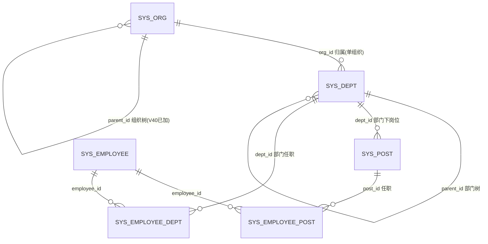
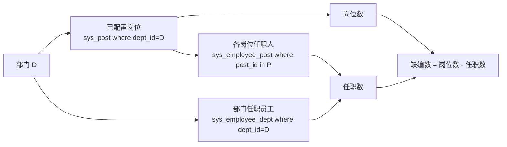

# 部门管理 & 岗位管理 增量需求文档（PRD）

> 文档类型：简单 PRD（默认档，无竞品分析）｜工作语言：简体中文
> 产出角色：产品经理（许清楚 / Xu）｜日期：2026-08-16
> 系统：现有 MIS 平台单体仓库（`D:\code\mis-platform`），增量改造，不另起炉灶
> 微服务链路：`mis-org`(8103) → `mis-admin-bff`(8081) → `mis-gateway`(8080) `/api/v1/**`
> 前端：`frontend/mis-admin-web`（Vite + React + TS + shadcn + Tailwind + Zustand，按 `features/` 分域）

---

## 0. 范围边界与排除项（最高优先级：只写用户真实要求，严禁虚构）

### 0.1 本期模块（用户已明确）
- **模块 A — 部门管理**：选择组织后，针对该组织下的每个部门，设置和显示「已配置过的岗位」，以及「岗位编制（岗位数、任职数、缺编数）」；并支持查看该部门的任职情况（哪些员工任职于该部门的哪些岗位）。
- **模块 B — 岗位管理**：新增岗位 = 设置各个部门分别有哪些岗位；添加岗位时「部门」呈现**树形结构、单选**；查询条件「部门」为下拉**多选**；查询条件支持**多选组织**。

### 0.2 本迭代明确不做（非用户要求，不纳入需求池）
| 排除项 | 说明 |
|---|---|
| 组织穿透（只读下钻） | 现有 `dept-tree-page.tsx` 已有「组织穿透」Tab 及后端 `GET /depts/pierce`、`sys_dept.linked_org_id`。**用户从未要求**，本 PRD 不将其列为需求，仅作为既有代码事实记录于「现状核实」。 |
| 岗位类型管理界面改造 | 现有 `/system/post` 已含「岗位类型」子 Tab 与 `postTypeOptionsLoader`，沿用即可；本期不新增/改造类型管理需求。 |
| 用户管理（组织/部门多选修正） | 不在本次范围。 |
| 员工管理（手机号必填且唯一） | 不在本次范围。已锁定跨模块约定：**系统内置账号（如 admin）豁免手机号校验**，员工管理后续实现时遵循，本期不涉及。 |

> ⚠️ 凡本文档未出现的功能（如组织穿透、岗位类型 CRUD 改造、用户/员工字段校验）均为非需求，实施时不得自行追加。

---

## 1. 产品目标

| 模块 | 本迭代解决的核心问题 | 价值 |
|---|---|---|
| **A. 部门管理** | 选组织后，部门维度缺乏「已配置岗位 / 编制 / 任职」的统一视图；现有前端用 mock 数据，**未接真实后端**。 | 让管理者在一个部门上即可看到：配了哪些岗位、编制缺口在哪、谁在任职，支撑人力盘点。 |
| **B. 岗位管理** | 新增岗位时部门只能平铺单选，无法按组织树选择；查询仅支持单部门、无组织维度，跨组织盘点困难。 | 新增按组织树精确落位岗位；查询支持「部门多选 + 组织多选」，支撑全租户岗位检索。 |

**两条线关系（重要，避免重复造需求）**：
- 「部门有哪些岗位」这一映射由 **岗位管理（模块 B）** 维护（新增岗位 → 选部门 → 写入 `sys_post.dept_id`）。
- **部门管理（模块 A）** 只**展示**由模块 B 已配置的岗位与派生出的编制/任职，**不另起一套岗位配置 CRUD**（是否需在部门侧提供配置入口见「待确认问题 Q3」）。

---

## 2. 用户故事

### 模块 A — 部门管理
| # | 角色 | 场景 | 价值 |
|---|---|---|---|
| A1 | 组织HR/管理者 | 选择某组织后，查看该组织下每个部门的「已配置岗位」列表 | 一目了然部门岗位构成 |
| A2 | 组织HR/管理者 | 在部门行看到「岗位数 / 任职数 / 缺编数」三指标 | 快速识别编制缺口 |
| A3 | 部门负责人 | 点击某部门查看「任职情况」：每个岗位由谁任职、部门共有哪些任职人员 | 掌握实际在岗与空缺 |

### 模块 B — 岗位管理
| # | 角色 | 场景 | 价值 |
|---|---|---|---|
| B1 | 岗位管理员 | 新增岗位时，在**树形、单选**的部门选择器中点选目标部门 | 按组织层级精准落位，避免平铺长列表误选 |
| B2 | 岗位管理员 | 查询岗位时，按**多个部门**下拉多选过滤 | 跨部门批量检索岗位 |
| B3 | HR/管理者 | 查询岗位时，按**多个组织**下拉多选过滤 | 跨组织盘点岗位分布 |

---

## 3. 需求池（P0 / P1 / P2）

> 优先级：P0=必须；P1=应当；P2=可选增强。每条含「编号 / 描述 / 验收标准」。
> 注：涉及「口径 / 计算方式 / 是否双向维护」等未定项，见第 7 节「待确认问题」，本文档不预设结论。

### P0（必须）

#### DEPT-01 选择组织后展示该组织下的部门
- **描述**：部门管理页以「组织」为顶层过滤；选定组织后，页面仅展示该组织（`sys_dept.org_id`）下的部门（树/列表）。
- **验收标准**：
  1. 页面顶部有「组织」下拉/选择器，默认载入首个组织；
  2. 切换组织后，部门列表内容随之变化；
  3. 数据经现有 `fetchDeptTree(orgId)`（后端 `GET /depts/tree`）获取。

#### DEPT-02 部门行/详情展示「已配置过的岗位」
- **描述**：对部门管理中的每个部门，展示其「已配置过的岗位」（岗位名称 + 岗位类型）。
- **验收标准**：
  1. 数据来源 = 岗位管理已写入的 `sys_post where dept_id = 该部门`（`status=1`）；
  2. 部门行以标签/摘要形式展示岗位名（如「研发工程师·技术」「项目经理·管理」）；
  3. 无任何岗位时展示「未配置岗位」空态。

#### DEPT-03 部门行展示「岗位编制」三指标（岗位数 / 任职数 / 缺编数）
- **描述**：每个部门展示编制三指标。
- **验收标准**：
  1. 三指标数值与后端 `GET /depts/{id}/staffing` 返回的 `postCount / filledCount / vacantCount` 一致；
  2. 缺编数 = 岗位数 − 任职数（前端展示口径与后端一致）；
  3. 三指标具体**定义与计算口径**以第 7 节 Q1/Q2/Q8 结论为准（当前后端口径见「现状核实 3.2」）。

#### DEPT-04 查看部门「任职情况」
- **描述**：支持查看该部门「哪些员工任职于哪些岗位」。
- **验收标准**：
  1. 提供入口（如点击部门行/指标 → 弹窗）查看任职明细；
  2. 明细含：① 各岗位 → 任职员工（姓名）；② 部门任职人员总列表；
  3. 数据与 `GET /depts/{id}/staffing` 的 `posts[].holders` 与 `employees` 一致。

#### POST-01 新增/编辑岗位：部门为「树形结构、单选」
- **描述**：岗位新增/编辑表单的「部门」字段，呈现**树形结构且只能单选**一个部门。
- **验收标准**：
  1. 点击部门字段弹出部门树，可展开组织层级；
  2. 仅允许选中**一个**节点（单选），选中后回填部门名；
  3. 提交时 `deptId` 为单值，与现有 `sys_post.dept_id`（单部门归属）一致；
  4. 树数据复用 `fetchDeptTree`；组织上下文来源见 Q6。

#### POST-02 岗位查询：部门「下拉多选」
- **描述**：岗位列表查询条件中的「部门」由单选改为**下拉多选**。
- **验收标准**：
  1. 可勾选多个部门；
  2. 查询向后端传部门集合（`deptIds`）；
  3. 列表返回所选部门的岗位并集；
  4. 后端 `GET /posts` 需新增对多 `deptId` 的支持（现状仅单 `deptId`，见「现状核实 3.3」）。

#### POST-03 岗位查询：组织「下拉多选」
- **描述**：岗位列表查询条件新增「组织」**下拉多选**。
- **验收标准**：
  1. 可勾选多个组织（选项来自 `listOrgs()`）；
  2. 查询向后端传组织集合（`orgIds`）；
  3. 列表返回「部门归属组织 ∈ 所选组织」的岗位（经 `sys_dept.org_id` 反查）；
  4. 后端 `GET /posts` 需新增对 `orgIds` 的解析。

### P1（应当）

#### DEPT-05 两模块数据同源、实时一致
- **描述**：部门管理展示的「已配置岗位 / 编制 / 任职」须与岗位管理配置结果同源（`sys_post` + 任职表）并保持一致。
- **验收标准**：
  1. 在岗位管理为某部门新增岗位后，切回部门管理该部门即显示该岗位且编制指标更新；
  2. 部门管理不再使用前端 mock 数据，全部取自 `GET /depts/{id}/staffing` 与 `GET /depts/tree`。

#### POST-04 组织多选 × 部门多选 的组合查询语义
- **描述**：明确两种多选筛选的组合关系。
- **验收标准**：
  1. 默认实现为**交集**（岗位所属部门 ∈ 所选部门 且 部门归属组织 ∈ 所选组织）；
  2. 若产品希望「组织、部门各自独立过滤」，以第 7 节 Q7 结论为准。

### P2（可选增强，可延后）
| 编号 | 描述 | 验收要点 |
|---|---|---|
| DEPT-06 | 部门树形单选 / 部门多选支持按名称搜索过滤 | 大树场景下可快速定位部门 |
| POST-05 | 启用组织筛选时，岗位列表增加「组织」列 | 跨组织结果可直观看到归属组织 |

---

## 4. UI 设计稿（文字 + 结构示意，非真实设计稿）

### 4.1 部门管理页（`features/system/dept/dept-tree-page.tsx`，增量改造）
```
┌──────────────────────────────────────────────────────────────┐
│ 页头：部门管理                                                 │
│ [组织架构] [岗位编制]   （移除「组织穿透」Tab，非本次需求）      │
│ 组织：[ 选择组织 ▾ ]                                          │
├──────────────────────────────────────────────────────────────┤
│ 岗位编制视图（改造现有 Tab，替换 mock 数据源）                  │
│ ┌──────────────────────────────────────────────────────────┐ │
│ │ 部门（树形缩进） │ 已配置岗位            │ 岗位数│任职数│缺编数│操作│ │
│ ├──────────────────────────────────────────────────────────┤ │
│ │ ▸ 研发中心       │ 研发工程师·技术 架构师·技术 │ 2  │ 2  │ 0  │ 👁 任职│ │
│ │   ▸ 后端组      │ 后端工程师·技术          │ 1  │ 0  │ 1  │ 👁 任职│ │
│ │ ▸ 市场部        │ 大区总·管理 技术委员会·技术│ 2 │ 1  │ 1  │ 👁 任职│ │
│ └──────────────────────────────────────────────────────────┘ │
│ 说明：                                                        │
│  - 「已配置岗位」= 该部门 sys_post（名称+类型）标签；           │
│  - 三指标取 GET /depts/{id}/staffing；缺编=岗位数−任职数。      │
└──────────────────────────────────────────────────────────────┘

点击某部门「👁 任职」→ 弹窗：
┌─ 岗位编制 · 研发中心 ───────────────────────────────┐
│ [ 岗位数 2 ] [ 已任职 2 ] [ 空缺 0 ]                 │
│ 岗位任职情况：                                       │
│  · 研发工程师  — 王磊                                 │
│  · 架构师      — 王磊                                 │
│ 部门任职人员（2）：王磊、李文博                        │
└─────────────────────────────────────────────────────┘
```

### 4.2 岗位管理页（`features/system/post/post-manage-page.tsx` + `SYSTEM_PAGE_DEFS['/system/post']`，增量改造）
```
┌──────────────────────────────────────────────────────────────┐
│ 页头：岗位管理  [ 岗位列表 | 岗位类型 ]                        │
├──────────────────────────────────────────────────────────────┤
│ 查询条件（改造）：                                              │
│   岗位名称：[________]                                          │
│   所属部门：[ 部门多选 ▾ ]   ← 由单选 select 改为 multiselect   │
│   所属组织：[ 组织多选 ▾ ]   ← 新增 multiselect                 │
│   [ 查询 ] [ 重置 ]                                            │
├──────────────────────────────────────────────────────────────┤
│ 列表：岗位编码 | 岗位名称 | 所属部门 | 岗位类型 | 状态  （POST-05 可加「组织」列）│
└──────────────────────────────────────────────────────────────┘

新增/编辑 岗位 表单（改造「所属部门」字段）：
┌─ 新增岗位 ──────────────────────────────────────┐
│ 所属部门：[ 选择部门（树形·单选）▾ ]   ← 弹出部门树 │
│   └ 组织A                                         │
│       ├ 研发中心                                   │
│       │   └ 后端组  ← 单选一个                    │
│ 岗位类型：[ 管理/技术/财务/行政/运营 ▾ ]（沿用）   │
│ 岗位编码：[________]  岗位名称：[________]         │
│ 状态：[ 启用 ]                                     │
└─────────────────────────────────────────────────┘
```
> 注：表单「岗位类型」下拉、`createPost`/`updatePost` 等沿用现有实现；仅「部门」字段交互与查询条件变更。

---

## 5. 数据模型草图（产品视角，不写实现代码）

### 5.1 实体关系（以代码为准；与任务背景描述不符处以代码为准）


| 实体 | 关键字段（产品口径） | 与本次需求关系 |
|---|---|---|
| `sys_org` | id, parent_id(V40新增，已支持上下级), name, code | 模块 B 查询「组织多选」的数据源；组织树是否存在见 Q7 |
| `sys_dept` | id, org_id(单组织, NOT NULL), parent_id(部门树), code, name, category_id, linked_org_id(V40穿透锚点，**非本次需求**) | 部门管理按 org_id 过滤；岗位新增树形单选的数据源 |
| `sys_post` | id, dept_id(单部门, NOT NULL), post_type_id, code, name, status | 「部门有哪些岗位」的载体；dept_id 为单值（见 Q4） |
| `sys_post_type` | id, name, code | 岗位类型下拉（沿用，不新增需求） |
| `sys_employee_post` | employee_id, post_id, is_primary, start/end_date, status | 员工↔岗位任职；经 post 关联到部门 |
| `sys_employee_dept` | employee_id, dept_id, is_primary, start/end_date, status | 员工↔部门直连任职（主部门/兼任） |
| `sys_employee` | id, real_name, … | 任职人姓名来源；与用户/账号表关联见 Q5 |

### 5.2 岗位编制（三指标）推导草图

- **岗位数**：`count(sys_post where dept_id = D and status=1)`（即「已配置过的岗位」数量）。
- **任职数**：候选口径① = 其中有任职人的岗位数（现有后端 `filledCount`）；候选口径② = 任职员工人数。**采用哪种以 Q1 为准**。
- **缺编数** = 岗位数 − 任职数（实时计算，是否允许手工覆盖见 Q8）。
- **是否需独立「编制数/headcount」表手工维护**：当前无，见 Q2。

### 5.3 任职关系（员工 ↔ 部门 ↔ 岗位）
- 路径一（经岗位）：员工 → `sys_employee_post.post_id` → `sys_post.dept_id` → 部门。用于「某岗位由谁任职」。
- 路径二（直连部门）：员工 → `sys_employee_dept.dept_id` → 部门。用于「部门任职人员总列表」。
- 与「用户/账号表」的关联为**待核实**（Q5），本迭代不展开。

---

## 6. 现状核实（基于代码二次核查；以代码为准）

### 6.1 与任务背景描述不符之处（以代码为准）
| 背景描述 | 代码实际情况 | 影响 |
|---|---|---|
| `sys_org`「当前无 parent_id，平级」 | `SysOrg.java` 已含 `parent_id`（V40 新增，组织支持上下级） | 模块 B「组织多选」查询时是否含下级组织需确认（Q7） |
| 未提及 `linked_org_id` | `SysDept.java` 已含 `linked_org_id`（穿透锚点） | 属「组织穿透」既有功能，**非本次需求**，不纳入 |
| 部门管理未提及既有实现 | `dept-tree-page.tsx` 已有「岗位编制」Tab，但**用前端 mock**（`EMPLOYEE_ASSIGNMENTS`） | 后端 `/staffing` 已就绪，前端需替换数据源 |

### 6.2 复用点（Reuse）
| # | 资产 | 位置 | 本次复用方式 |
|---|---|---|---|
| R1 | 部门编制+任职后端 | `DeptStaffingService.staffing()` + `DeptController.GET /depts/{id}/staffing` → `DeptStaffingVO`(postCount/filledCount/vacantCount/posts/employees) | 部门管理「编制三指标 + 任职情况」**直接复用**，前端替换 mock |
| R2 | 部门树数据源 | `fetchDeptTree()`(depts.ts) + `GET /depts/tree` | 部门管理列表、岗位新增树形单选、部门多选均可复用 |
| R3 | 岗位管理页引擎 | `PostManagePage` + `SYSTEM_PAGE_DEFS['/system/post']`(AdminListPage) | 列表/新增/编辑/删除与岗位类型下拉(postTypeOptionsLoader)沿用 |
| R4 | 选项加载器 | `loadDeptOptions` / `loadPostTypeOptions` / `loadPostOptions`(page-defs.ts) | 部门、岗位类型、岗位下拉复用 |
| R5 | 组织数据源 | `listOrgs()`(orgs.ts) | 组织多选下拉复用 |

### 6.3 需新增 / 改造点（New / Change）
| # | 改动点 | 前端 | 后端（mis-org） |
|---|---|---|---|
| N1 | 部门编制接真实数据 | `depts.ts` 新增 `fetchDeptStaffing(id, tenantId)` 调 `GET /depts/{id}/staffing`；`dept-tree-page` 移除 mock，改用真实 VO | 已有，无需改（仅确认租户隔离沿用 tenantId） |
| N2 | 部门行展示「已配置岗位」 | 部门树/列表行增加岗位标签（取自 staffing VO 的 `posts[].postName+postType`） | 已有（`posts` 已含） |
| N3 | 岗位新增/编辑「部门树形单选」 | 新增部门树形单选控件（复用 R2 数据；组织上下文见 Q6），替换现有 `type:'select', optionsFrom:'dept'` | `PostCreateRequest/UpdateRequest.deptId` 仍为单值，无需改 |
| N4 | 岗位查询「部门多选」 | `SYSTEM_PAGE_DEFS['/system/post'].filters` 中 `deptId` 由 `select` 改 `multiselect` | `GET /posts` 新增对 `deptIds` 集合支持（现状仅单 `deptId`） |
| N5 | 岗位查询「组织多选」 | 新增「组织」多选筛选字段 + 组织选项数据源（`AdminPageDef` 无 `orgOptionsLoader`，需补） | `GET /posts` 新增 `orgIds` 参数，经 `sys_dept.org_id` 反查岗位 |
| N6 | （排除）组织穿透 | 不改动；既有 Tab/后端保留但不作为需求 | 不改动 |

---

## 7. 待确认问题（以下均为真实需拍板项，本文档不预设结论）

> 每条均标注「**需用户拍板**」。实施前须由用户逐条确认，未确认不得动工。

- **Q1 编制三指标定义与计算口径 — 需用户拍板**
  现有后端口径：岗位数 = 该部门已配置岗位数；任职数 = 其中有任职人的岗位数；缺编数 = 岗位数 − 任职数。
  是否采用？还是「任职数」应等于「任职员工人数」？

- **Q2 是否需要独立「编制数（headcount）」字段 — 需用户拍板**
  现有无独立编制表，编制完全由岗位/任职推导。是否要增加可手工维护的「编制数」（如某岗位预算 N 人）？

- **Q3 部门管理是否提供「直接配置岗位」入口 — 需用户拍板**
  本 PRD 默认：部门管理**只读展示**由岗位管理已配置的岗位。是否需要部门侧也能直接增删岗位（双向维护）？

- **Q4 岗位是否严格归属单个部门 — 需用户拍板**
  现有 `sys_post.dept_id` 为单值，与「新增时部门树形单选」一致。是否允许一个岗位跨多部门（需改数据模型为多对多）？

- **Q5 任职与员工/用户表的关联 — 需用户拍板（待核实）**
  `sys_employee_post` / `sys_employee_dept` 已存在并与 `sys_employee` 关联；与「用户/账号表」的关联需核实。本期是否涉及？注意：内置账号豁免手机号校验为已锁定跨模块约定，本期不涉及员工管理。

- **Q6 岗位新增时部门树形单选的「组织上下文」来源 — 需用户拍板**
  部门树按组织返回（`fetchDeptTree(orgId)`）。新增表单如何确定展示哪个组织的部门树？是否先选组织再出树，还是默认当前/首个组织？

- **Q7 组织多选查询是否含下级组织 — 需用户拍板**
  `sys_org` 已支持 `parent_id` 树。岗位查询选组织时，是否自动包含其下级组织，还是仅精确匹配所选组织？

- **Q8 缺编数是否实时计算、是否允许手工覆盖 — 需用户拍板**
  默认 = 岗位数 − 任职数（随任职变动实时更新）。是否允许手工覆盖缺编/编制值？

---

## 8. 验收总览（P0 必过）
| 需求 | 关键验收 |
|---|---|
| DEPT-01 | 选组织 → 部门列表随组织变化 |
| DEPT-02 | 部门展示其 `sys_post` 已配置岗位（名称+类型），空态正确 |
| DEPT-03 | 三指标 = `GET /depts/{id}/staffing` 返回，缺编=岗位数−任职数 |
| DEPT-04 | 任职明细 = 各岗位任职人 + 部门任职人员，与接口一致 |
| DEPT-05 | 部门管理不再用 mock，与岗位管理配置实时同源 |
| POST-01 | 新增/编辑部门 = 树形单选，提交单值 deptId |
| POST-02 | 部门查询 = 多选，后端支持 deptIds |
| POST-03 | 组织查询 = 多选，后端支持 orgIds（经 dept.org_id 反查） |
