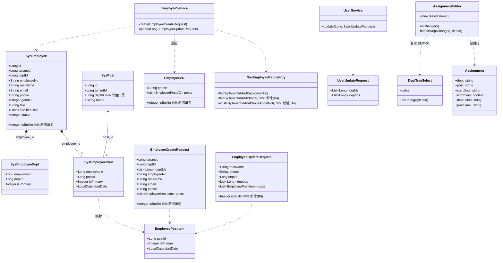
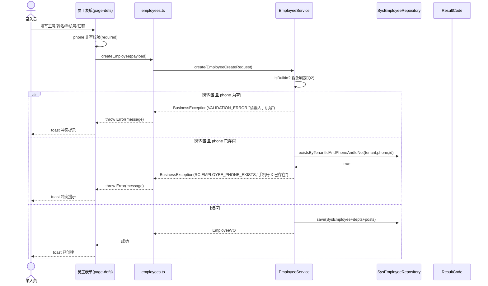
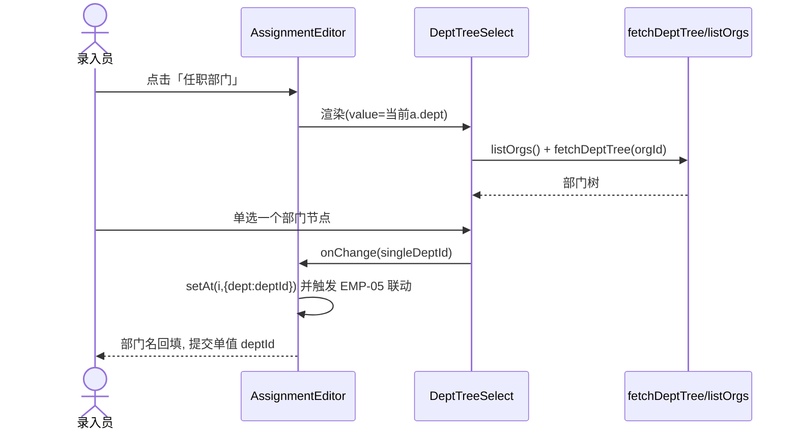
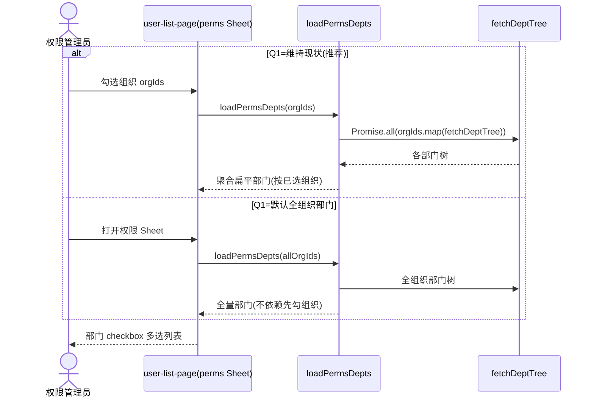

# 用户管理 & 员工管理 增量架构设计与任务分解

> 文档类型：增量架构设计（仅设计，不写实现代码）｜架构师：高见远（Gao）
> 日期：2026-08-16｜关联 PRD：`org-user-employee-prd-2026-08-16.md`
> 工作语言：简体中文
> 代码核实结论：已逐一打开前端/后端源码二次核实，凡与 PRD §6 描述一致处标注「已核实」，差异处标注「发现项」。

---

## 1. 实现方案 + 框架选型

### 1.1 技术栈（沿用现有，零新增框架）

| 层 | 技术 | 说明 |
|---|---|---|
| 前端 | Vite + React 18 + TypeScript + shadcn/ui + Tailwind + Zustand | `features/` 按域拆分，`@/` 别名；唯一门禁 `npm run typecheck`（无单测框架） |
| 后端 | Spring Boot + JPA + Flyway + Jakarta Validation | `Controller→Service→JpaRepository`；`Result` 统一响应；表名 `sys_*`；API `/api/v1`；分页 `code=0` |
| 聚合层 | `mis-admin-bff`(8081) | 透传 `mis-org` 内部 `/internal/v1/*`；`tenantId` 由网关注入，前端无需传 |
| 微服务 | `mis-iam`(8102) 用户/权限域；`mis-org`(8103) 组织/部门/岗位/员工域 | — |

**结论：本期不引入任何新依赖**（见 §6）。

### 1.2 两模块改动切入点

#### 模块一 · 用户管理（USR）—— 工作量小，以「确认 + 微调」为主
- **USR-01（组织多选）**：已核实，`user-list-page.tsx` 的 `mode==='perms'` Sheet 中「组织（可多选）」用 `<input type=checkbox>` 多选写入 `form.orgIds`；提交 `updateUser({orgIds})` → `UserUpdateRequest.orgIds` → `UserService.replaceUserOrgs` 落 `sys_user_org`。**后端已具备，本期仅确认。**
- **USR-02（部门多选 + 完整列出）**：已核实，部门同样 checkbox 多选，数据来自 `loadPermsDepts`（聚合「已选组织」的 `fetchDeptTree`）。「完整列出」口径 = Q1 待拍板。
- **USR-03（组织/部门/角色并存）**：已核实，Sheet 内三组 checkbox 并存保存。**本期仅确认。**
- **发现项（N7，P1）**：`openPerms(row)` 仅用 `row.orgId`/`row.deptId`（单值）回填，而 `UserView` 类型**无** `orgIds`/`deptIds` 列表字段 → 多组织/多部门用户打开权限 Sheet 只会回填首个，违反 USR-01/03「已勾选组织/部门正确回填」验收。需修复回填逻辑（见 §5 T-FE-USR）。

#### 模块二 · 员工管理（EMP）—— 净新增校验 + 编辑器改造
- **EMP-01/02/03（手机号必填+唯一+内置豁免）**：已核实，`SysEmployee.phone` 当前 `@Column`（nullable，无唯一约束）；`EmployeeCreateRequest.phone` 无校验；`EmployeeService.create/update` 仅校验 `employeeNo` 唯一。**净新增**：需后端校验 + 前端 `phone` 标 `required`。
- **EMP-04（任职部门树形单选）**：复用既有 `DeptTreeSelect`（`components/common/dept-tree-select.tsx`，已 `import` 于 `admin-list-page.tsx`），将 `AssignmentEditor` 部门列由平铺 `<select>` 改为树形单选；提交形态不变（`employeeAssignmentPayload` 取单值 `a.dept`）。
- **EMP-05（部门→岗位联动）**：选中部门后，该行岗位下拉仅显示该部门岗位；复用 `listPosts({deptIds:[deptId], status:1})`（BFF 已透传 `deptIds`，`tenantId` 网关注入）。
- **Q2 内置识别**：推荐在 `sys_employee` 新增 `is_builtin` 字段（Flyway V47 + 实体 + DTO + 表单勾选），最干净可扩展（详见 §8）。

---

## 2. 文件列表及相对路径

> 改动类型：🔴 新增 / 🟡 修改 / 🟢 复用（不改）
> 路径相对仓库根 `D:\code\mis-platform`

### 2.1 后端（mis-org / mis-iam / mis-common / mis-migrator）

| # | 文件相对路径 | 类型 | 职责 |
|---|---|---|---|
| B1 | `backend/mis-migrator/src/main/resources/db/migration/V47__employee_builtin_flag.sql` | 🔴 新增 | `ALTER TABLE sys_employee ADD COLUMN is_builtin SMALLINT NOT NULL DEFAULT 0;`（PostgreSQL；Flyway 仅追加） |
| B2 | `backend/mis-common/mis-common-core/src/main/java/com/mis/common/core/exception/ResultCode.java` | 🟡 修改 | 新增 `EMPLOYEE_PHONE_EXISTS(40917, "手机号已存在")` |
| B3 | `backend/mis-org/.../domain/entity/SysEmployee.java` | 🟡 修改 | 增加 `isBuiltin` 字段 + getter/setter |
| B4 | `backend/mis-org/.../domain/repository/SysEmployeeRepository.java` | 🟡 修改 | 新增 `findByTenantIdAndPhone(Long,String)`、`existsByTenantIdAndPhoneAndIdNot(Long,String,Long)`（Q3 选全局时改为去 tenant 版本） |
| B5 | `backend/mis-org/.../dto/EmployeeCreateRequest.java` | 🟡 修改 | 增加 `Integer isBuiltin`（默认 0）；`phone` 保持无注解（条件校验放 Service） |
| B6 | `backend/mis-org/.../dto/EmployeeUpdateRequest.java` | 🟡 修改 | 增加 `Integer isBuiltin`（可选） |
| B7 | `backend/mis-org/.../dto/EmployeeVO.java` | 🟡 修改 | 增加 `isBuiltin` 输出（供前端展示/回填） |
| B8 | `backend/mis-org/.../service/EmployeeService.java` | 🟡 修改 | `create`/`update` 增加手机号**必填+唯一+内置豁免**校验（EMP-01/02/03/06） |
| B9 | `backend/mis-iam/.../service/UserService.java` | 🟢 复用 | USR-02 后端 `replaceUserOrgs`/`replaceUserDepts` 已支持，无需改 |
| B10 | `backend/mis-iam/.../dto/UserUpdateRequest.java` | 🟢 复用 | `orgIds`/`deptIds` 列表已具备，无需改 |
| B11 | `backend/mis-admin-bff/.../controller/PostController.java` + `OrgFacadeService` | 🟢 复用 | `GET /api/v1/posts?deptIds=` 已透传，EMP-05 无需改 BFF |

### 2.2 前端（mis-admin-web）

| # | 文件相对路径 | 类型 | 职责 |
|---|---|---|---|
| F1 | `frontend/mis-admin-web/src/features/system/page-defs.ts` | 🟡 修改 | `/system/employee` 表单 `phone` 标 `required:true`；`employeeAssignmentPayload` 不变（单值 dept 已支持） |
| F2 | `frontend/mis-admin-web/src/features/system/admin-list-page.tsx` | 🟡 修改 | `AssignmentEditor`：部门列改 `DeptTreeSelect`（EMP-04）；部门 onChange 调 `listPosts({deptIds})` 联动岗位（EMP-05）；按行维护岗位选项 |
| F3 | `frontend/mis-admin-web/src/components/common/dept-tree-select.tsx` | 🟢 复用 | `DeptTreeSelect` 树形单选，提交单值 `deptId` |
| F4 | `frontend/mis-admin-web/src/lib/api/posts.ts` | 🟢 复用 | `listPosts({deptIds, status})` 已支持部门过滤 |
| F5 | `frontend/mis-admin-web/src/lib/api/employees.ts` | 🟢 复用 | `createEmployee`/`updateEmployee` 已就绪；`phone` 可选语义与后端一致即可 |
| F6 | `frontend/mis-admin-web/src/features/system/user/user-list-page.tsx` | 🟡 修改（P1） | 修复 `openPerms` 多组织/部门回填（N7）；若 Q1=默认全组织部门则改 `loadPermsDepts` 为全量聚合 |

### 2.3 设计要点小结
- **后端无需新表**，仅 `sys_employee` 加一列（Q2 推荐方案）。
- **前端无需新页面**，员工页走通用引擎；仅需改 `AssignmentEditor` 与 `page-defs.ts` 一处字段。
- **BFF / mis-iam / 错误响应链路全部复用**，工作量集中在 `EmployeeService` 校验与 `AssignmentEditor` 改造。

---

## 3. 数据结构与接口（类图 / Mermaid）



**关键约束（来自代码核实）**
- `EmployeePostItem.postId` 为**单值**（Q4 推荐保持单行单选）。
- `SysPost.deptId` 单值 → 部门→岗位联动 = `WHERE dept_id = 所选部门`。
- `employeeAssignmentPayload`（`page-defs.ts`）取 `a.dept` 单值生成 `deptIds`，EMP-04 改造后形态不变。

---

## 4. 程序调用流程（时序图 / Mermaid）

> 完整 4 条链路见 `org-user-employee-architecture-2026-08-16.sequence.mermaid`。

### ④-1 新增员工：手机号必填+唯一+内置豁免（EMP-01/02/03）


### ④-2 任职部门树形单选回填（EMP-04，复用 DeptTreeSelect）


### ④-3 部门→岗位联动（EMP-05）
```mermaid
sequenceDiagram
    actor HR as 录入员
    participant AE as AssignmentEditor
    participant API as listPosts(/api/v1/posts)
    participant BFF as mis-admin-bff
    participant ORG as PostService(mis-org)
    HR->>AE: 在任职行选中部门(deptId)
    AE->>API: listPosts({deptIds:[deptId], status:1})
    API->>BFF: GET /api/v1/posts?deptIds=&status=1
    BFF->>ORG: GET /internal/v1/posts?deptIds=&tenantId=(网关注入)
    ORG-->>BFF: List<PostVO>(该部门岗位)
    BFF-->>API: PostItem[]
    API-->>AE: 该部门岗位选项
    AE->>AE: 该行 postOptions=过滤结果; 若 a.post 不在其中则清空
    AE-->>HR: 岗位下拉仅显示该部门岗位
```

### ④-4 用户权限设置：部门列表加载（USR-02 / Q1）


---

## 5. 任务列表（有序、含依赖、按实现顺序）

> 粒度到单文件可实现；依赖以 PRD 的 N1–N6 / USR / EMP 为锚点。
> 决策依赖项（Q1–Q3、Q4）以「需用户拍板」标注，已在 §8 给推荐默认值。

| 任务ID | 任务名称 | 涉及文件（改动类型） | 依赖 | 优先级 |
|---|---|---|---|---|
| **T-INFRA** | 基础层：迁移 + 错误码 | B1🔴 `V47__employee_builtin_flag.sql`；B2🟡 `ResultCode.java` | 依赖 **Q2 决策**（加字段方案） | P0 |
| **T-BE-MODEL** | 后端模型扩展 | B3🟡 `SysEmployee`；B4🟡 `SysEmployeeRepository`；B5🟡 `EmployeeCreateRequest`；B6🟡 `EmployeeUpdateRequest`；B7🟡 `EmployeeVO` | T-INFRA | P0 |
| **T-BE-VALIDATE** | 后端手机号校验服务 | B8🟡 `EmployeeService.create/update` | T-BE-MODEL；依赖 **Q2 识别规则**、**Q3 唯一范围** | P0 |
| **T-FE-EMP** | 前端员工：必填+树形单选+岗位联动 | F1🟡 `page-defs.ts`；F2🟡 `admin-list-page.tsx`（复用 F3 `DeptTreeSelect`、F4 `listPosts`） | 契约依赖 T-BE-MODEL（isBuiltin 字段名）；联动依赖 B11 已就绪；**Q4 岗位单选/多选** | P0 |
| **T-FE-USR** | 前端用户：权限 Sheet 确认/微调 + 回填修复 | F6🟡 `user-list-page.tsx`（复用 B9/B10 后端） | 依赖 **Q1 决策**；N7 回填修复可独立 | P1 |
| **T-VERIFY** | 联调与验收对齐 | 全量回归 + 类型对齐（`EmployeeItem` 是否透传 `isBuiltin`） | 全部前置任务；依赖 **Q5/Q6/Q7 确认** | P2 |

**实现顺序建议**：T-INFRA → T-BE-MODEL → T-BE-VALIDATE →（并行）T-FE-EMP / T-FE-USR → T-VERIFY。
**并行说明**：T-FE-EMP 与后端可并行推进（API 契约稳定：单值 `deptId` 不变、`phone` 由后端校验、新增可选 `isBuiltin` 字段）；联调在 T-BE-VALIDATE 完成后进行。

**任务↔需求映射**
- T-BE-VALIDATE + T-FE-EMP(phone) → EMP-01/02/03/06
- T-FE-EMP(AssignmentEditor) → EMP-04/05
- T-FE-USR → USR-01/02/03（确认 + N7 回填修复）
- T-INFRA/T-BE-MODEL → 支撑 Q2 内置识别落地

---

## 6. 依赖包列表

| 包 | 用途 | 本期是否新增 |
|---|---|---|
| `react` / `react-dom` | 前端框架 | 否（复用） |
| `shadcn/ui` + `tailwindcss` | UI 组件/样式 | 否（复用） |
| `@/components/common/dept-tree-select.tsx` | 部门树形单选 | 否（**复用**，已存在） |
| `jakarta.validation` | DTO 校验注解 | 否（后端已具备；但手机号走 Service 条件校验，非注解） |
| `Spring Data JPA` / `Flyway` | 持久化/迁移 | 否（复用） |

**结论：本期引入新依赖 = 0。** 所有能力均来自现有栈与已交付可复用资产（R1–R6）。

---

## 7. 共享知识（跨文件约定）

1. **tenantId 隔离**：所有员工查询/校验必须带 `tenantId`（多租户）。唯一性校验 SQL 条件 `tenant_id = ? AND phone = ?`（Q3=租户内为默认）。
2. **手机号唯一性范围**：默认**租户内唯一**（Q3 推荐）；跨租户重复合法。全局方案代价见 §8-Q3。
3. **内置账号识别（Q2 推荐）**：`sys_employee.is_builtin = 1` 视为内置；`EmployeeCreateRequest.isBuiltin` 入参（默认 0）。豁免判定：`if (isBuiltin == 1) 跳过手机号必填+唯一`。降级方案：username 白名单（`admin`/`root`）。
4. **deptId 单值约定**：`DeptTreeSelect` 提交**单值** `deptId`；`Assignment.dept` 为单值字符串；多部门经 `deptIds` 列表承载（首项主部门，`saveEmployeeDepts` 已处理 `isPrimary`）。
5. **树形单选提交形态**：`DeptTreeSelect.onChange(singleId)` → 写入 `assignment.dept` → `employeeAssignmentPayload` 提取 `deptIds`（前端无需改）。
6. **部门→岗位联动 API**：`GET /api/v1/posts?deptIds={id}&status=1`（BFF 透传，`tenantId` 由网关注入，前端**不传** tenantId）。返回即该部门岗位。
7. **错误码/冲突提示规范**：
   - 唯一冲突：`BusinessException(ResultCode.EMPLOYEE_PHONE_EXISTS, "手机号 " + phone + " 已存在")`。
   - 必填报错（非内置且空）：`BusinessException(ResultCode.VALIDATION_ERROR, "请输入手机号")`。
   - 前端 `createEmployee`/`updateEmployee` 的 `try/catch` 已将 `err.message` 以 `toast` 展示（**复用现有链路，无需改**）。
8. **Flyway 迁移命名**：`V{n}__{snake_case}.sql`，**只追加不修改**；本期 `V47__employee_builtin_flag.sql`。
9. **Assignment 行模型**：`{ dept, post, startDate, isPrimary, deptLabel?, postLabel? }`，`dept`/`post` 为单值字符串 id；编辑回填时 `deptLabel/postLabel` 仅展示用。
10. **已知限制（非阻塞）**：`DeptTreeSelect` 默认只加载「首个组织」部门树；来自其他组织的部门在回填时可能暂时显示 id 而非名称，用户切换组织即可定位（与岗位管理页行为一致）。

---

## 8. 待明确事项（Q1–Q7，含架构师推荐默认值 + 风险，均需用户拍板）

> 凡标「**需用户拍板**」者，实施前须确认；下文「推荐默认值」为架构师基于代码现状的提议。

### Q1 权限设置「部门完整列出」语义 —— **需用户拍板**
- **推荐默认值**：**维持现状（按已选组织聚合）**。
- **理由**：代码已实现多选（checkbox），用户原话「完整列出」大概率为「能列全、可多选」，聚合已满足；且 `loadPermsDepts` 已就绪。
- **风险/代价**：
  - 若用户坚持「默认一次性展示全组织部门」→ 改 `loadPermsDepts` 为 `listOrgs()` 全量 `fetchDeptTree` 聚合（代价：首次加载全组织部门树，部门量大时略有性能开销，但通常可控；实现约 0.5d）。
  - 两种实现代价均小，差异仅在「是否先勾组织」。**建议评审时先澄清用户「完整列出」真实意图。**

### Q2 如何识别「内置账号」以落地豁免 —— **需用户拍板**
- **推荐默认值**：在 `sys_employee` 新增 `is_builtin`（`SMALLINT NOT NULL DEFAULT 0`）+ Flyway V47 迁移 + `SysEmployee` 字段 + DTO `isBuiltin` + 表单「内置账号」勾选（或系统种子写入）。
- **理由**：最干净、可扩展；与「员工维度标识」语义一致，避免与角色维度 `SysRole.type=TYPE_BUILTIN` 混淆。
- **降级方案**：不改表，用 `username` 白名单（`admin`/`root`）判定豁免。
- **风险**：若不落字段、仅靠白名单，则后期新增内置账号需改代码，且无法表达「非 admin 名的内置账号」；扩展性差。**强烈推荐加字段方案。**

### Q3 手机号唯一性判定范围（租户内 / 全局） —— **需用户拍板**
- **推荐默认值**：**租户内唯一**（`tenant_id = ? AND phone = ?`）。
- **理由**：符合平台多租户设计；不同租户同手机号属合法场景。
- **风险/代价**：全局方案需去掉 `tenantId` 条件（`findByPhone`/`existsByPhoneAndIdNot`），代价是跨租户误伤合法重复，且违背多租户隔离原则。**不推荐全局。**

### Q4 任职记录岗位选择：单选 / 多选 —— **需用户拍板**
- **推荐默认值**：**单行任职岗位单选**（`EmployeePostItem.postId` 单值，`isPrimary` 已存在）。
- **理由**：与现有 `EmployeePostItem` 结构一致，改动最小；多选需将 `postId` 改为 `postIds` 集合 + `SysEmployeePost` 多行 + 前端多选 UI。
- **风险/代价**：多选代价约 +1d（DTO/实体/前端均改）；若业务确需「一岗多职」再升级。

### Q5 用户能否同时属多组织多部门 —— **需用户拍板（确认即可）**
- **推荐默认值**：**允许**（现状 `sys_user_org`/`sys_user_dept` 多对多，Sheet 已多选）。
- **风险**：无；仅确认。

### Q6 员工与用户（账号）是否同一概念 / 是否联动创建 —— **需用户拍板**
- **推荐默认值**：**本期不纳入员工↔账号建链改造**，沿用现状。
- **理由**：PRD 明确本迭代只解决手机号校验与部门树形选择。
- **风险**：员工手机号与登录账号手机号可能不一致，但本迭代不解决（后续迭代处理）。

### Q7 部门树形单选是否需支持多选 —— **需用户拍板（确认即可）**
- **推荐默认值**：**保持单选**（需求原文「单选树形」）。
- **风险**：无；仅确认。

---

## 9. 验收映射（覆盖 PRD §8）

| 验收项 | 设计覆盖点 | 对应任务 |
|---|---|---|
| **USR-01** 组织多选 + 正确回填 | `user-list-page.tsx` perms Sheet checkbox 多选（已具备）；回填修复见 N7 | T-FE-USR |
| **USR-02** 部门多选 + 「完整列出」 | 部门 checkbox 多选（已具备）；「完整列出」口径按 Q1；`loadPermsDepts` 条件改造 | T-FE-USR（依赖 Q1） |
| **EMP-01** 手机号必填 + 内置豁免 | 前端 `phone` `required:true`（F1）；后端非内置时空则 `VALIDATION_ERROR`（B8） | T-FE-EMP + T-BE-VALIDATE |
| **EMP-02** 手机号唯一 + 冲突提示 | 后端 `existsByTenantIdAndPhoneAndIdNot`（B4/B8）；`EMPLOYEE_PHONE_EXISTS`(40917)；前端 `toast(err.message)` 复用 | T-BE-VALIDATE |
| **EMP-03** 内置账号豁免必填+唯一 | `is_builtin` 字段 + Service 豁免判定（B3/B5/B8）；Q2 推荐方案 | T-INFRA + T-BE-MODEL + T-BE-VALIDATE |
| **EMP-04** 任职部门树形单选（单值 deptId） | `AssignmentEditor` 部门列改 `DeptTreeSelect`（F2 复用 F3）；提交单值 `deptId` | T-FE-EMP |
| **EMP-05** 部门→岗位联动 | 部门 onChange 调 `listPosts({deptIds})`（F2/F4）；按行过滤岗位 | T-FE-EMP |
| **EMP-06** 编辑时唯一性一致（不与自身冲突） | `existsByTenantIdAndPhoneAndIdNot(tenant,phone,id)` 排除自身（B4/B8） | T-BE-VALIDATE |

**完整列出 / 多选语义澄清（Q1）** 与 **内置识别（Q2）** 两条为本期唯一阻塞性待拍板项；其余验收项技术方案已闭环，可立即排期。

---

### 附：复用资产核对（来自 PRD R1–R6，均已核实存在）
- R1 `components/common/dept-tree-select.tsx` ✅ 已 `import` 于 `admin-list-page.tsx`
- R2 通用引擎 `multiselect` + `optionsFrom:'org'` + `serverFilterKeys` ✅（`/system/post` 已用）
- R3 `page-defs.ts` 的 `loadDeptOptions`/`loadOrgOptions`/`loadPostOptions` ✅ 存在
- R4 `SYSTEM_PAGE_DEFS['/system/employee']` 已存在 ✅
- R5 `EmployeeLiteVO`/`PostStaffingVO` 等 ✅（非本需求核心改造）
- R6 `lib/api/employees.ts` `createEmployee`/`updateEmployee` ✅
- 后端 `GET /posts?deptIds=` 已支持（PostController + BFF 透传）✅ → EMP-05 直接复用
