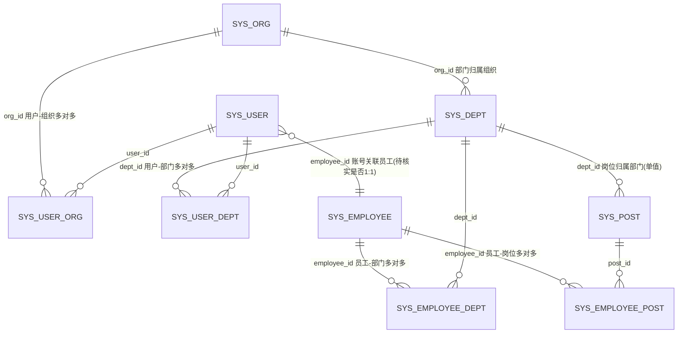
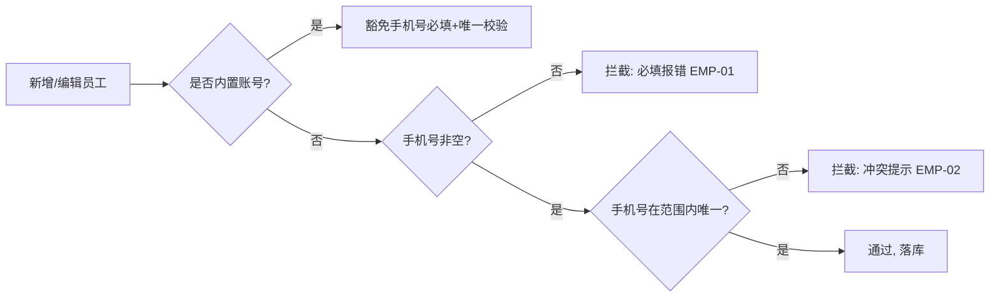

# 用户管理 & 员工管理 增量需求文档（PRD）

> 文档类型：简单 PRD（默认档，无竞品分析）｜工作语言：简体中文
> 产出角色：产品经理（许清楚 / Xu）｜日期：2026-08-16
> 系统：现有 MIS 平台单体仓库（`D:\code\mis-platform`），增量改造，不另起炉灶
> 微服务链路：`mis-iam`(8102) 用户/权限域；`mis-org`(8103) 组织/部门/岗位/员工域
> 前端：`frontend/mis-admin-web`（Vite + React + TS + shadcn + Tailwind + Zustand，按 `features/` 分域）
> 关联上轮：`org-position-prd-2026-08-16.md`（部门管理 & 岗位管理）已交付，并锁定「系统内置账号（如 admin）豁免手机号校验」跨模块约定，本迭代遵循。

---

## 0. 范围边界与排除项（最高优先级：只写用户真实要求，严禁虚构）

### 0.1 本期模块（用户已明确）
- **模块一 — 用户管理**：权限设置界面中，组织应**支持多选**，部门应**完整列出并支持多选**。
- **模块二 — 员工管理**：新增员工时，① 手机号码**必须输入且唯一**；② 内置账号豁免手机号校验（上轮已锁定约定）；③ 选择部门的岗位时，部门应**下拉树形（单选树形）**；④ 部门选中后岗位应**联动**。

### 0.2 本迭代明确不做（非用户要求，不纳入需求池）
| 排除项 | 说明 |
|---|---|
| 部门管理 / 岗位管理 改造 | 上轮（`org-position-prd-2026-08-16.md`）已交付 DeptTreeSelect 树形单选、引擎 `multiselect` 能力，本迭代不重复。 |
| 组织穿透（只读下钻） | 既有 `dept-tree-page.tsx`「组织穿透」Tab 及 `sys_dept.linked_org_id`，非本次需求。 |
| 用户/员工其他字段校验 | 如用户名、邮箱格式校验等，用户未要求，不纳入。 |
| 员工与账号的自动建链流程改造 | 用户未要求重新设计「建员工即建账号」流程，仅就手机号校验与部门树形选择提需求。 |

> ⚠️ 凡本文档未出现的功能均为非需求，实施时不得自行追加。

---

## 1. 产品目标

| 模块 | 本迭代解决的核心问题 | 价值 |
|---|---|---|
| **一、用户管理** | 权限设置界面中组织/部门无法多选（或部门未完整列出），难以把用户的数据范围一次性授权到「多组织 + 多部门」。 | 授权人可勾选多个组织与多个部门，精确表达用户的数据权限边界。 |
| **二、员工管理** | 新增员工时手机号可为空、可重复；部门选择为平铺下拉而非树形；岗位未随部门联动。 | 员工主数据质量可控（手机号必填且唯一）；部门按组织树精准落位；岗位随部门联动，减少误选。 |

**两条线关系**：用户管理解决「账号 → 组织/部门数据范围」；员工管理解决「自然人主数据 + 任职（部门/岗位）」。两者通过 `sys_user.employee_id` 关联（是否强绑定见第 7 节 Q6），本迭代不改动该关联本身。

---

## 2. 用户故事

### 模块一 — 用户管理
| # | 角色 | 场景 | 价值 |
|---|---|---|---|
| U1 | 权限管理员 | 给用户授权时，在权限设置界面勾选**多个组织** | 一次授权覆盖跨组织数据范围，无需逐个组织重复操作 |
| U2 | 权限管理员 | 在权限设置界面看到**完整部门列表**并勾选**多个部门** | 精确圈定可访问的部门集合 |
| U3 | 权限管理员 | 保存后再次打开，组织/部门勾选状态正确回填 | 授权结果可复核、可修改 |

### 模块二 — 员工管理
| # | 角色 | 场景 | 价值 |
|---|---|---|---|
| E1 | HR/录入员 | 新增员工时填写手机号，系统提示**必填**；若与已有员工重复则**冲突提示** | 保证手机号不为空、不重复，支撑联系与登录 |
| E2 | 系统管理员 | 录入**内置账号（如 admin）**员工时，可不填手机号（豁免校验） | 内置账号无需真实手机号也能建档 |
| E3 | HR/录入员 | 在任职记录中点开部门树，**单选**目标部门 | 按组织层级精准落位，避免平铺长列表误选 |
| E4 | HR/录入员 | 选中部门后，岗位下拉**仅出现该部门的岗位** | 部门→岗位联动，避免选到无关部门的岗位 |

---

## 3. 需求池（P0 / P1 / P2）

> 优先级：P0=必须；P1=应当；P2=可选增强。每条含「编号 / 描述 / 验收标准」。
> 注：涉及口径/计算/是否双向维护等未定项，见第 7 节「待确认问题」，本文档不预设结论。

### P0（必须）

#### USR-01 权限设置界面：组织支持多选
- **描述**：用户权限设置界面（「用户权限」Sheet）中，「组织」以多选形式呈现，可勾选多个组织；提交时以组织集合保存。
- **验收标准**：
  1. 权限设置界面「组织」为勾选（多选）形态，可同时勾选 0~N 个组织；
  2. 保存调用 `updateUser({ orgIds: [...] })`，后端 `UserUpdateRequest.orgIds`（List，首项为主组织）正确接收；
  3. 再次打开该用户权限界面，已勾选组织正确回填。
- **现状说明**：经代码核实，`features/system/user/user-list-page.tsx` 的 `mode==='perms'` Sheet 中「组织（可多选）」**已以 checkbox 多选**实现，后端 `UserUpdateRequest.orgIds` 已支持多对多（`sys_user_org` 表）。本需求现状已具备，本期主要为**确认与边界澄清**（见 USR-02 与 Q1）。

#### USR-02 权限设置界面：部门完整列出并支持多选
- **描述**：权限设置界面中，「部门」应**完整列出**并支持**多选**。
- **验收标准**：
  1. 部门以勾选（多选）形态呈现，可勾选多个部门；
  2. 当前实现：部门列表 = 已选组织下部门树的**聚合**（勾选组织后其部门出现）；保存调用 `updateUser({ deptIds: [...] })`；
  3. 「完整列出」的口径（是否默认一次性展示全组织部门、还是按已选组织聚合）以第 7 节 **Q1** 结论为准；
  4. 再次打开，已勾选部门正确回填。
- **现状说明**：经核实，「部门（可多选）」**已以 checkbox 多选**实现，数据来自 `loadPermsDepts`（聚合已选组织的 `fetchDeptTree`）。与用户表述「部门也没有都列出来」的差异在于：当前部门列表受「已选组织」约束（仅展示已勾选组织的部门）。是否改为「默认展示全部部门」属待确认项 Q1。

#### EMP-01 新增员工：手机号必填校验
- **描述**：员工新增表单中，手机号字段为**必填**；为空时不允许提交。
- **验收标准**：
  1. 前端表单 `phone` 标记为必填（`required: true`），为空时阻止提交并提示「请输入手机号」；
  2. 后端 `EmployeeCreateRequest.phone` 增加必填校验（DTO 层 `@NotBlank` 或 Service 层校验），为空返回明确错误；
  3. **内置账号（豁免标识，见 EMP-03 / Q2）** 可不填手机号，不触发必填报错。
- **现状说明**：经核实，当前 `page-defs.ts` `/system/employee` 表单 `phone` 为 `type:'text'` 且**无 `required`**；`EmployeeCreateRequest.phone` 无校验注解；`EmployeeService.create` 直接 `setPhone(request.phone())`，**未做必填校验**。本需求为**净新增校验**。

#### EMP-02 新增员工：手机号唯一性校验（含冲突提示）
- **描述**：员工新增（及编辑）时，手机号在判定范围内**唯一**；若与已有员工重复，给出**冲突提示**。
- **验收标准**：
  1. 后端在创建/更新员工时校验手机号唯一性（按第 7 节 **Q3** 确定的范围：租户内 or 全局）；
  2. 冲突时返回明确错误信息（如「手机号 XXX 已存在」），前端以 toast/行内提示展示具体冲突内容；
  3. **内置账号**豁免唯一性校验（见 EMP-03 / Q2）；
  4. 唯一性判定的「所属范围」以 Q3 结论为准。
- **现状说明**：经核实，`EmployeeService.create` 仅校验 `employeeNo` 唯一（`EMPLOYEE_NO_EXISTS`），**对 `phone` 无任何唯一性校验**；`sys_employee.phone` 字段无数据库唯一约束。本需求为**净新增校验**。前端现有 `createApi` 已通过 `try/catch` 将后端错误 `err.message` 以 toast 展示，冲突提示可复用该链路。

#### EMP-03 内置账号豁免手机号校验（已锁定跨模块约定）
- **描述**：系统内置账号（如 admin）在新增/编辑员工时**豁免**手机号必填与唯一性校验。
- **验收标准**：
  1. 被识别为「内置账号」的员工，手机号可留空且不触发 EMP-01 必填报错；
  2. 被识别为「内置账号」的员工，手机号可与其他员工重复且不触发 EMP-02 冲突；
  3. 非内置账号仍严格走 EMP-01 / EMP-02。
- **约定来源**：上轮评审已锁定（见 `org-position-prd-2026-08-16.md` §0.2 / Q5）——「系统内置账号（如 admin）豁免手机号校验」，员工管理遵循。
- **待确认**：**如何识别「内置账号」属未决项**（见 Q2）——经代码核实，`SysEmployee` 实体**无 `isBuiltin` / `type` / `source` 等标识字段**；上轮仅在 `SysRole.type=TYPE_BUILTIN` 见到「内置」概念（作用于角色，非员工）。本需求仅锁定「豁免规则」，实现所需的「内置账号识别字段/规则」需用户拍板。

#### EMP-04 新增/编辑员工：任职部门为树形单选
- **描述**：员工任职记录（每行 = 部门 + 岗位 + 开始时间 + 主职）中，「任职部门」呈现**树形结构且只能单选**一个部门。
- **验收标准**：
  1. 点击「任职部门」弹出部门树，可展开组织层级；
  2. 仅允许选中**一个**节点（单选），选中后回填部门名；
  3. 复用既有 `DeptTreeSelect`（`components/common/dept-tree-select.tsx`），提交单值 `deptId`；
  4. 现有 `AssignmentEditor` 中任职部门为平铺 `<select>`（来自 `loadDeptOptions` 全组织扁平化），本期改为树形单选。
- **现状说明**：经核实，通用引擎 `admin-list-page.tsx` 的 `assignments` 类型编辑器 `AssignmentEditor` 中，任职部门当前是**平铺 `<select>` 下拉**（非树）；岗位管理页「部门」已用 `dept-tree` 字段复用 `DeptTreeSelect`。本需求为**引擎/编辑器改造 + 复用 DeptTreeSelect**。

#### EMP-05 任职记录：部门 → 岗位 联动
- **描述**：任职记录中，选中部门后，「岗位」下拉仅展示该部门下的岗位（部门→岗位联动）。
- **验收标准**：
  1. 在任职记录行选中某部门（树形单选）后，该行的「岗位」下拉选项限定为该部门所属岗位；
  2. 岗位数据来自 `sys_post where dept_id = 所选部门`（可复用 `GET /posts?deptIds=`）；
  3. 岗位选择为**单选还是多选**以第 7 节 **Q4** 结论为准；
  4. 切换部门后，原岗位若不属于新部门则清空，避免脏选中。
- **现状说明**：经核实，当前任职记录「岗位」下拉来自 `loadPostOptions`（**全量岗位**，未按部门过滤）。本需求为**净新增联动**。

### P1（应当）

#### EMP-06 编辑员工时手机号唯一性保持一致
- **描述**：编辑员工修改手机号时，同样执行 EMP-02 唯一性校验（且不与自身冲突）。
- **验收标准**：
  1. 编辑保存时校验新手机号在判定范围内唯一；
  2. 与自身当前手机号相同的情况不报错；
  3. 内置账号仍豁免（EMP-03）。

#### USR-03 权限设置：组织/部门多选与角色分配并存
- **描述**：权限设置界面在支持组织/部门多选的同时，角色仍以多选形式分配，三者一并保存。
- **验收标准**：
  1. 组织多选、部门多选、角色多选可同时操作；
  2. 保存后组织/部门/角色均正确落库并可正确回填。

### P2（可选增强，可延后）
| 编号 | 描述 | 验收要点 |
|---|---|---|
| EMP-07 | 部门树 / 岗位下拉支持按名称搜索过滤 | 大树/多岗位场景下快速定位 |
| USR-04 | 权限设置中组织/部门多选支持「全选/反选」快捷操作 | 批量授权效率 |

---

## 4. UI 设计稿（文字 + 结构示意，非真实设计稿）

### 4.1 用户管理 — 权限设置 Sheet（`features/system/user/user-list-page.tsx`，增量确认/微调）
```
┌─ 用户权限（权限设置）────────────────────────────────────┐
│ 组织（可多选）                                            │
│  ☑ 组织A   ☑ 组织B   ☐ 组织C   …（全部组织 checkbox 多选）│
│ 部门（可多选）                                            │
│  ☑ 研发中心   ☑ 后端组   ☐ 市场部  …（依已选组织聚合，树形缩进）│
│ 角色（可多选）                                            │
│  ☑ 管理员   ☐ 普通用户  …                                │
│ [ 取消 ] [ 保存 ]                                        │
└─────────────────────────────────────────────────────────┘
> 说明：组织/部门/角色均为 checkbox 多选，已落库于 sys_user_org / sys_user_dept / sys_user_role。
> 「部门完整列出」语义见 Q1：当前=已选组织下的部门聚合；若改为默认全组织部门，则需调整 loadPermsDepts。
```

### 4.2 员工管理 — 新增/编辑表单（`features/system/page-defs.ts` `/system/employee` + 通用引擎，增量改造）
```
┌─ 新增员工 ──────────────────────────────────────────────┐
│ 工号：[________]（必填）   姓名：[________]（必填）        │
│ 性别：[ 男/女 ▾ ]                                        │
│ 任职记录（可多部门多岗位，每行可标记主职）：               │
│  ┌────────────────────────────────────────────────────┐ │
│  │ 任职部门（树形·单选）│ 岗位（随部门联动）│ 开始时间│主│✕│ │
│  │ [ 选择部门（树形·单选）▾ ] │ [ 该部门岗位 ▾ ] │ [date]│●│  │ │
│  │   └ 组织A                                        │ │
│  │       ├ 研发中心                                  │ │
│  │       │   └ 后端组  ← 单选一个                    │ │
│  └────────────────────────────────────────────────────┘ │
│  [ + 添加任职 ]                                          │
│ 邮箱：[________]                                         │
│ 手机号：[________]（必填；重复时提示「手机号已存在」）     │
│ 入职日期：[________]   状态：[ 启用 ]                     │
└─────────────────────────────────────────────────────────┘
> 说明：
>  - 手机号：必填（EMP-01）+ 唯一（EMP-02）；内置账号豁免（EMP-03）。
>  - 任职部门：由平铺 select 改为 DeptTreeSelect 树形单选（EMP-04）。
>  - 岗位：随所选部门联动过滤（EMP-05）。
```

---

## 5. 数据模型草图（产品视角，不写实现代码）

### 5.1 实体关系（以代码为准；与任务背景描述不符处以代码为准）


| 实体 | 关键字段（产品口径） | 与本次需求关系 |
|---|---|---|
| `sys_user`（mis-iam） | id, employee_id(关联员工), username, status, is_tenant_admin | 用户管理权限设置主体；组织/部门经 `sys_user_org`/`sys_user_dept` 多对多 |
| `sys_user_org` | user_id, org_id, is_primary | 用户↔组织多对多（已支持组织多选） |
| `sys_user_dept` | user_id, dept_id, is_primary | 用户↔部门多对多（已支持部门多选） |
| `sys_org` | id, parent_id(组织树), name | 权限设置「组织多选」选项源 |
| `sys_dept` | id, org_id, parent_id(部门树), name | 权限设置「部门多选」选项源；员工任职部门树源 |
| `sys_employee`（mis-org） | id, dept_id(主部门, NOT NULL), employee_no, real_name, **phone(当前 nullable, 无唯一约束)**, **内置标识(当前无字段, 见 Q2)** | 员工管理主体；手机号必填+唯一（EMP-01/02）；内置豁免（EMP-03） |
| `sys_employee_dept` | employee_id, dept_id, is_primary | 员工↔部门多对多（主部门/兼任） |
| `sys_employee_post` | employee_id, post_id, is_primary | 员工↔岗位多对多（部门→岗位联动的数据基础） |
| `sys_post` | id, dept_id(单部门, NOT NULL), name | 岗位下拉数据源；按 dept_id 过滤实现部门→岗位联动 |

### 5.2 手机号校验范围草图

- **范围**：唯一性判定的「租户内 / 全局」以第 7 节 Q3 为准。
- **内置识别**：「是否内置账号」的判定字段/规则以 Q2 为准（当前 `SysEmployee` 无相关字段）。

### 5.3 任职记录（员工 ↔ 部门 ↔ 岗位）交互草图
- 每行任职 = 部门（树形单选，复用 `DeptTreeSelect`）→ 岗位（按所选部门过滤的下拉）。
- 部门→岗位联动依赖 `sys_post.dept_id`：岗位下拉选项 = `sys_post where dept_id = 该行所选部门`。
- 与「用户/账号表」的关联（`sys_user.employee_id`）为既有事实，是否在本迭代调整见 Q6。

---

## 6. 现状核实（基于代码二次核查；以代码为准）

### 6.1 与任务背景描述不符 / 需澄清之处（以代码为准）
| 背景/需求表述 | 代码实际情况 | 影响 |
|---|---|---|
| ①「当前组织无法多选，部门也没有都列出来进行多选」 | `user-list-page.tsx` 权限 Sheet 中「组织（可多选）」「部门（可多选）」**已以 checkbox 多选**实现；后端 `UserUpdateRequest.orgIds/deptIds` 已支持多对多（`sys_user_org`/`sys_user_dept`）。部门列表受「已选组织」约束（聚合已选组织部门树），非「默认全组织部门」。 | 用户管理模块现状已具备多选能力；本期重点为**确认 + 澄清『完整列出』语义**（Q1），而非从零搭建 |
| ②「员工管理：部门下拉树形」 | 员工页（`SYSTEM_PAGE_DEFS['/system/employee']`）**已存在**；其任职记录「部门」为**平铺 `<select>`**（来自 `loadDeptOptions` 全组织扁平化），非树形 | 树形单选为**改造点**（EMP-04），复用 `DeptTreeSelect` |
| 「手机必填且唯一」 | `SysEmployee.phone` **nullable 且无唯一约束**；`EmployeeCreateRequest.phone` 无校验；`EmployeeService.create` 仅校验 `employeeNo` 唯一，**未校验 phone** | 必填+唯一为**净新增校验**（EMP-01/02） |
| 「内置账号豁免校验」 | `SysEmployee` 实体**无 `isBuiltin`/`type`/`source` 字段**；仅 `mis-iam` 的 `SysRole.type=TYPE_BUILTIN` 存在「内置」概念（作用于角色） | 豁免**规则**已锁定；**识别机制**待确认（Q2） |
| 「部门→岗位联动」 | 任职记录「岗位」下拉来自 `loadPostOptions`（**全量岗位，未过滤部门**） | 联动为**净新增**（EMP-05） |

### 6.2 复用点（Reuse）
| # | 资产 | 位置 | 本次复用方式 |
|---|---|---|---|
| R1 | 部门树形单选组件 | `components/common/dept-tree-select.tsx`（`DeptTreeSelect`） | 员工任职部门「树形单选」直接复用（EMP-04）；岗位管理页已用 `dept-tree` 字段印证可用 |
| R2 | 通用引擎多选能力 | `features/system/admin-list-page.tsx`（`multiselect` 字段类型 + `optionsFrom:'org'` + `serverFilterKeys`） | 用户管理「组织多选」机制可参考；员工任职岗位下拉可注入部门选项 |
| R3 | 选项加载器 | `page-defs.ts` 的 `loadDeptOptions` / `loadOrgOptions` / `loadPostOptions` | 部门/组织/岗位下拉选项复用（EMP-04/05 的数据源） |
| R4 | 员工管理页（已存在） | `SYSTEM_PAGE_DEFS['/system/employee']` + 通用引擎 `AdminListPage` | 无需新建页面，仅改造表单字段与 `AssignmentEditor` |
| R5 | 后端员工/编制 VO | `mis-org` 的 `EmployeeLiteVO`(id/name/isPrimary)、`PostStaffingVO` 等 | 已就绪，按需复用（非本需求核心改造） |
| R6 | 员工 API 客户端 | `lib/api/employees.ts`（`createEmployee`/`updateEmployee` 等） | 已存在；仅需确保 `phone` 必填语义与后端一致 |

### 6.3 需新增 / 改造点（New / Change）
| # | 改动点 | 前端 | 后端（mis-org / mis-iam） |
|---|---|---|---|
| N1 | 员工手机号必填 | `page-defs.ts` `/system/employee` 表单 `phone` 标记 `required:true`；保存前校验非空 | `EmployeeCreateRequest.phone` 加必填校验（兼容内置豁免，见 Q2）；`EmployeeService.create` 增加非空校验 |
| N2 | 员工手机号唯一 | 复用现有 `createApi` 的 `try/catch` 将后端冲突错误以 toast 展示 | `EmployeeService.create/update` 增加手机号唯一性校验（范围见 Q3），冲突抛明确错误（如「手机号已存在」） |
| N3 | 任职部门树形单选 | 改造 `AssignmentEditor`（或引擎 `assignments` 类型）：任职部门由平铺 `<select>` 改为 `DeptTreeSelect`（R1） | `EmployeeCreateRequest.deptId` 仍为单值，无需改；提交形态不变 |
| N4 | 部门→岗位联动 | 任职记录「岗位」下拉按该行所选部门过滤（调 `GET /posts?deptIds=` 或复用 `loadPostOptions` 按部门筛） | `GET /posts` 已支持 `deptIds`（上轮 POST-02 已加），可直接复用 |
| N5 | 内置账号识别（豁免落地） | 依 Q2 结论在表单/保存逻辑中跳过手机号校验 | 需确定识别字段/规则（当前 `SysEmployee` 无字段），可能涉及加字段或约定规则 |
| N6 | 用户权限设置「部门完整列出」语义 | 依 Q1 结论：维持「按已选组织聚合」或改为「默认全组织部门」 | `UserUpdateRequest` 已支持 `deptIds` 集合，无需改 |

---

## 7. 待确认问题（以下均为真实需拍板项，本文档不预设结论）

> 每条均标注「**需用户拍板**」。实施前须由用户逐条确认，未确认不得动工。

- **Q1 权限设置中「部门完整列出」的语义 — 需用户拍板**
  现状：部门列表 = 已勾选组织下部门树的聚合（先勾组织，再出其部门）。
  用户表述「部门应完整列出」是否指：**默认一次性展示全组织所有部门**（不依赖先勾组织）？还是维持现状的「按已选组织聚合」即可？二者实现不同（后者现状已满足）。

- **Q2 如何识别「内置账号」以落地豁免 — 需用户拍板**
  上轮已锁定「内置账号（如 admin）豁免手机号校验」规则，但 `SysEmployee` 实体**无 `isBuiltin`/`type`/`source` 字段**，无法在员工维度识别内置账号。
  需明确：是在 `sys_employee` 新增标识字段（如 `is_builtin`），还是依其他规则（如特定 username/工号、或关联 `sys_user.is_tenant_admin`/内置角色）判定？此字段/规则直接决定 EMP-03 如何落地。

- **Q3 手机号唯一性的判定范围（租户内 or 全局）— 需用户拍板**
  唯一性是「同一租户内不重复」还是「全平台（跨租户）不重复」？影响后端校验 SQL 的范围条件。

- **Q4 任职记录中岗位选择：单选还是多选 — 需用户拍板**
  部门→岗位联动后，每行任职记录「岗位」是只允许选**一个**岗位（单选），还是可多选多个岗位？影响 `AssignmentEditor` 与 `EmployeePostItem` 形态。

- **Q5 用户能否同时属多组织多部门 — 需用户拍板（现状已支持，确认即可）**
  代码层面 `sys_user_org`/`sys_user_dept` 均为多对多，权限设置界面已支持多选。请确认产品上**允许**一个用户关联多个组织与多个部门（现状即如此），无需改为单组织/单部门。

- **Q6 员工与用户（账号）是否同一概念 / 是否联动创建 — 需用户拍板（待核实）**
  `sys_user.employee_id` 将账号关联到员工。本迭代仅就「员工手机号校验 + 部门树形选择」提需求，不改动建链流程。需确认：新增员工时是否同步创建账号、两者字段如何映射，是否在本迭代范围内？（建议本期不纳入，沿用现状。）

- **Q7 部门树形单选是否需支持多选 — 需用户拍板（需求已明确单选，确认即可）**
  需求原文为「部门应该下拉树形（单选树形）」，即**单选**。请确认员工任职部门树形选择**保持单选**（每行一个部门），不改为树形多选。

---

## 8. 验收总览（P0 必过）
| 需求 | 关键验收 |
|---|---|
| USR-01 | 权限设置「组织」可多选，保存 `orgIds` 集合并正确回填（现状已实现，确认） |
| USR-02 | 权限设置「部门」可多选；「完整列出」语义以 Q1 为准 |
| EMP-01 | 新增员工手机号必填；为空阻止提交；内置账号豁免 |
| EMP-02 | 新增员工手机号唯一；冲突给出明确提示；内置账号豁免 |
| EMP-03 | 内置账号豁免手机号必填+唯一校验（识别机制见 Q2） |
| EMP-04 | 任职部门为树形单选（复用 DeptTreeSelect），提交单值 deptId |
| EMP-05 | 选中部门后岗位按该部门联动过滤 |
| EMP-06 | 编辑员工时手机号唯一性保持一致（P1） |
