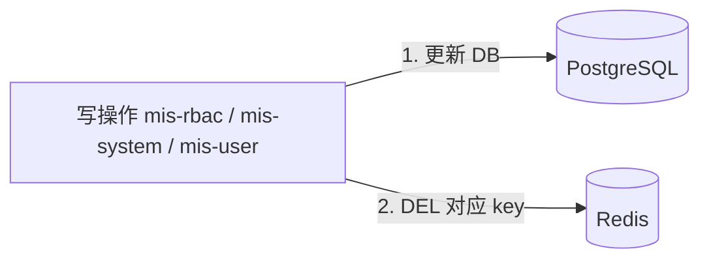

# ADR-006: 缓存策略 — 全阶段 Redis 单级，不引入 Caffeine

## 状态
已接受（2026-06-23 修订：取消 Phase 2 Caffeine L1）

## 日期
2026-06-23

## 背景

规划文档中曾考虑「Redis + Caffeine 二级缓存」及 Phase 2 用 Redis Pub/Sub 做 L1 失效广播。

在企业 MIS 场景下（Phase 1 目标并发 5000 用户、字典/权限读多写少），需评估是否值得为节省 ~1ms Redis 网络延迟而引入：

- Caffeine 本地缓存
- 多 Pod L1 一致性（Pub/Sub 广播）
- 额外依赖与排错成本

## 决策

**全阶段（Phase 1 ~ Phase 2+）仅使用 Redis 单级缓存，不引入 Caffeine，不为缓存失效使用 Redis Pub/Sub。**

Redis 已是项目必选中间件（会话、验证码、权限、字典），不增加新的软件种类。

### 缓存清单

| 数据 | 存储 | TTL | 失效策略 |
|------|------|-----|----------|
| 验证码 | Redis | 300s | 用完即删 |
| 登录失败计数 / 锁定 | Redis | 30min | 成功登录清除 |
| JWT 黑名单（jti） | Redis | = token 剩余有效期 | 登出写入 |
| Refresh Token | Redis + DB | 7d | 轮换 / 吊销 |
| 用户权限集合 | Redis | **15min**（兜底） | 角色/菜单/用户角色变更时 **主动 DEL** |
| 字典（按 typeCode） | Redis | 1h（兜底） | 字典 CRUD 时 **主动 DEL** |
| 系统参数 | Redis | 1h（兜底） | 参数变更时 **主动 DEL** |

**不缓存：**

- 用户列表 / 组织树（变更频繁、数据权限 key 复杂）
- 菜单路由树（按用户不同，变更需即时生效）

### 失效机制（统一、无广播）

| 缓存 | 变更来源 | 失效方式 | 是否通知其他 Pod |
|------|----------|----------|------------------|
| 权限 `mis:rbac:permissions:{userId}` | mis-rbac、mis-user | 写后 DEL（按 userId / roleId 关联批量） | **否** — Redis 集中式，删一次全局生效 |
| 字典 `mis:dict:{typeCode}` | mis-system | 写后 DEL | **否** |
| 参数 `mis:config:{key}` | mis-system | 写后 DEL | **否** |

**不需要 Redis Pub/Sub：** 没有本地 L1 副本，不存在「各 Pod 内存不一致」问题。

### 何时再考虑 Caffeine（当前不做的触发条件）

仅当压测证明 **Redis 读 QPS 或延迟** 成为瓶颈时再评估，例如：

- 字典接口 P99 > 10ms 且 Redis CPU > 70%
- 单集群 Redis 读 QPS 持续 > 5 万

届时可单独出 ADR 修订，而非预先引入。

## 备选方案

| 方案 | 优点 | 缺点 |
|------|------|------|
| A. **Redis 单级（选定）** | 一种缓存、一致性简单、无广播 | 每次读走网络 ~0.5–1ms |
| B. Redis + Caffeine 二级 | 字典读更快 | 多依赖、Pub/Sub、多 Pod 一致性 |
| C. 不缓存 | 最简单 | 权限/字典 DB 压力大 |

## 后果

### 正面
- 技术栈更简：缓存 = Redis，无 Caffeine、无缓存 Pub/Sub
- 失效逻辑统一：写后 DEL，易理解、易排错
- 多实例部署无本地脏读风险

### 负面
- 字典/权限每次多读一次 Redis（对企业 MIS 完全可接受）
- 极高 QPS 场景下不如本地 L1（非当前目标）

## 实现要点

- `mis-common-redis` 封装 `CacheService`：`get / put / evict / evictByPattern`
- 统一 `CacheConstants` key 前缀
- **主动 evict 优先，TTL 仅兜底**
- **不引入** `spring-boot-starter-cache` / Caffeine（除非未来 ADR 修订）
- Phase 2 RocketMQ 仅用于**业务域事件**（RoleChanged 等），不用于缓存失效广播

## 已确认项

- [x] 权限缓存 TTL：**15min**，与主动 evict 并用
- [x] **不引入 Caffeine**，全阶段 Redis 单级
- [x] **不使用 Redis Pub/Sub** 做缓存失效
