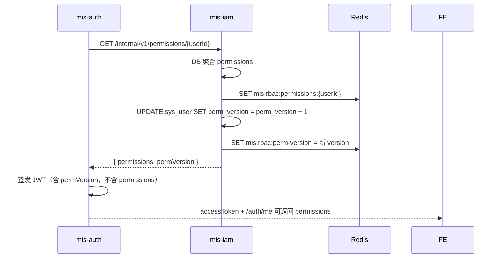
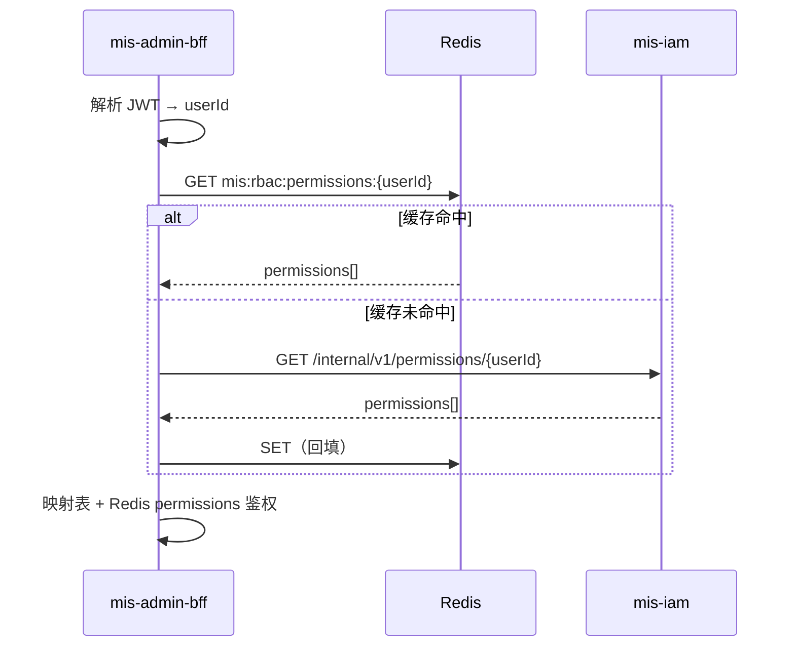

# ADR-009: 权限存储 — JWT 只带身份，Redis 为运行时权限源

## 状态
已接受（Redis key 格式见 [ADR-011](ADR-011-sys-api-code-multi-app-auth.md)：`{tenantId}:{appId}:{userId}`；2026-07-21：PDP 服务为 **mis-iam**）

## 日期
2026-06-23（初版） / 2026-07-21（服务边界）

## 背景

原设计在登录时将 `permissions` 写入 JWT，BFF 从 Token 读取做 `@PreAuthorize`。

在 **权限变更频繁** 的场景下，JWT 存在根本矛盾：

- JWT 在过期前**不可变**，改角色后用户仍携带旧 permissions（最长 2h）
- permissions 列表可能很大，JWT 体积膨胀
- 仅靠 Redis evict 无法更新已签发的 JWT payload

需明确：登录时加载的 permissions **存哪里**、BFF **每次从哪里读**、变更后 **如何秒级生效**。

## 决策

### 权限存哪里（三层）

| 层级 | 存储 | 角色 | 变更频率 |
|------|------|------|----------|
| **权威源** | PostgreSQL（`sys_role_permission` 等） | 真相 | 随管理操作 |
| **运行时缓存** | **Redis** `mis:rbac:permissions:{tenantId}:{appId}:{userId}` | BFF 鉴权、/auth/me | **变更后立即 evict** |
| **JWT** | **不存 permissions** | 只证明身份 | 2h 不变 |

### JWT 载荷（修订）

| 声明 | 是否保留 | 说明 |
|------|----------|------|
| sub, tenantId, appId, employeeId, username | ✅ | 身份上下文（**不含** deptId/orgId；主部门走 `/auth/me`） |
| roles | ✅ 可选 | 角色编码，用于展示/粗粒度判断，**不作 API 鉴权依据** |
| **permissions** | ❌ **移除** | 改由 Redis 提供 |
| permVersion | ✅ 可选 | 用户权限版本号，供前端感知需刷新（见下） |
| iat, exp, jti | ✅ | 标准 |

### 登录 / 刷新时做什么



- permissions **写入 Redis**，不写入 JWT
- 登录响应 / `GET /auth/me` 的 `permissions` 来自 **Redis（或回源 DB）**，供前端菜单/按钮

### 每个业务请求时 BFF 做什么



- **每请求读 Redis**（~1ms），不 RPC mis-iam（命中时）
- **不读 JWT 中的 permissions**（因为不再存在）
- 比「每请求 RPC authz-service」轻，比「JWT 内嵌」**变更生效快**

### 权限变更时做什么（频繁变更的关键）

| 触发操作 | 负责服务 | 动作 |
|----------|----------|------|
| 角色-菜单变更 | **mis-iam** | 查 `sys_user_role` 得 userId 列表 → **DEL** `permissions` + **`sys_user.perm_version` INCR** + 写 Redis version |
| 用户-角色变更 | **mis-iam** | 同上，针对该 userId |
| 菜单 permission 变更 | mis-system | 通知 **mis-iam** 批量 evict 关联角色下的用户（或 evict 全量权限缓存，Phase 1 可接受） |

**生效时间：** 下一次 BFF 请求从 Redis miss → 回源 DB → 得到新 permissions，**无需用户重新登录**。

可选：WebSocket 推送 `permVersion` 变化，前端主动调 `/auth/me` 刷新菜单（Phase 2）。

### permVersion 权威源与陈旧判定（2026-06-25 修订）

| 层级 | 存储 | 说明 |
|------|------|------|
| **权威源** | PostgreSQL `sys_user.perm_version` | 权限变更时 **INCR** |
| **缓存** | Redis `mis:rbac:perm-version:{tenantId}:{appId}:{userId}` | 与 DB 同步；miss 时从 DB 回填 |
| **JWT** | `permVersion` claim | 登录/刷新时快照（来自 DB + 写回 Redis） |

| 位置 | 用途 |
|------|------|
| BFF | 读当前 version（Redis → miss 回源 `sys_user.perm_version`） |
| 陈旧判定 | **`JWT.permVersion != currentVersion`** → 响应头 `X-Perm-Stale: true` |
| 前端 | 收到 stale 后拉 `/auth/me` 刷新菜单，**不强制登出** |

**不以 version 相等作为 API 鉴权条件**；鉴权仍以 **permissions 集合**（Redis / 回源 DB）为准。`permVersion` 仅服务前端菜单同步与 Redis 断电后的可恢复性。

实现：`com.mis.common.redis.rbac.PermVersionService`（`syncCacheFromAuthority` / `getCurrentVersion` / `isStale`）。

### Redis Key 结构

```
mis:rbac:permissions:{tenantId}:{appId}:{userId}  → JSON ["system:user:list", ...]  TTL 15min
mis:rbac:perm-version:{tenantId}:{appId}:{userId}  → long（与 sys_user.perm_version 一致，无 TTL）
```

TTL 15min 仅为 permissions 兜底；**正常依赖变更时主动 DEL**。perm-version **不设 TTL**，断电后由 DB 回填修复。

### 失效范围策略

| 变更类型 | evict 策略 |
|----------|------------|
| 单用户角色变更 | DEL 该 userId |
| 角色菜单变更 | DEL 该角色下所有 userId |
| 全局菜单结构变更 | `evictByPattern mis:rbac:permissions:*`（运维操作，频率低） |

## 备选方案

| 方案 | 频繁变更下表现 |
|------|----------------|
| A. permissions 全塞 JWT | ❌ 最长 2h 陈旧 |
| B. JWT + 变更只靠 re-login | ❌ 体验差 |
| C. **JWT 身份 + Redis permissions（选定）** | ✅ 变更后下次请求生效 |
| D. 每请求 RPC rbac check | ✅ 最新，但延迟与负载高 |

## 后果

### 正面
- 权限变更**秒级生效**，无需踢下线或等 Token 过期
- JWT 体积小、不含敏感权限列表副本
- BFF 热路径仅 Redis GET，无 rbac RPC（命中时）

### 负面
- 每请求多一次 Redis 读（企业 MIS 可接受）
- 变更时需正确 evict 受影响 userId（需维护 role→users 查询）
- 前端需从 `/auth/me` 取 permissions，不能仅从 JWT decode

## 已确认

- [x] JWT **不内嵌** permissions
- [x] 运行时权限存 **Redis**，权威源 **PostgreSQL**
- [x] BFF 每请求从 Redis 加载 permissions，经 **映射表** 鉴权（ADR-009/010）
- [x] `permVersion` 权威源 **sys_user.perm_version**；陈旧判定 **!=**（非 `<`）；不以 version 挡 API
