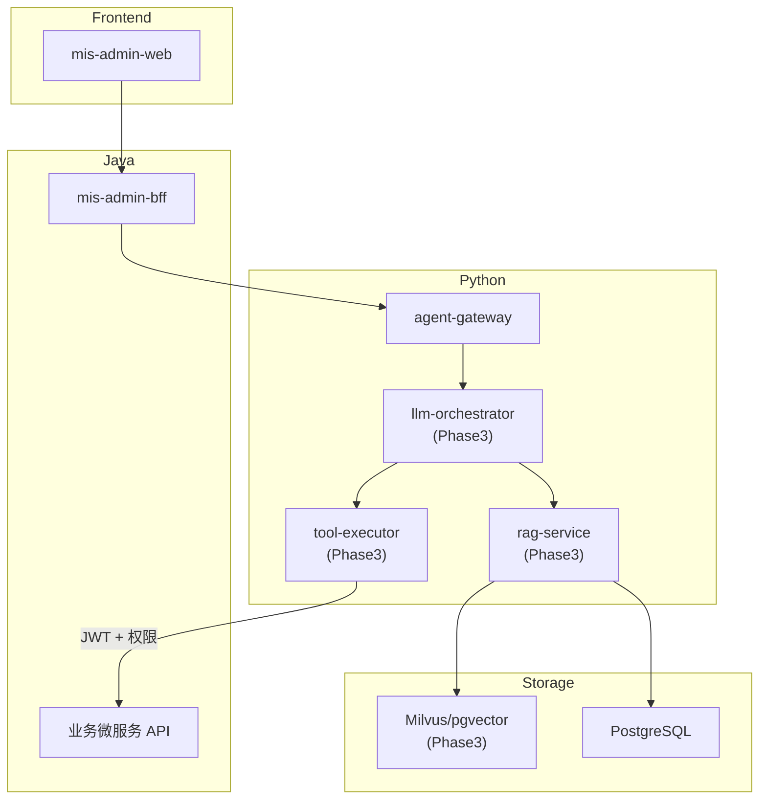

# AI 智能体层设计

> 状态：📝 草稿 | 版本：v1.0-draft  
> 路径：`agent/` | 语言：Python 3.11

## 1. 定位与边界

| 做 | 不做 |
|----|------|
| LLM 编排与对话 | 核心业务写操作（用户创建等） |
| RAG 知识检索 | 直接访问业务库无权限校验 |
| 工具调用（受控） | 替代 Java 微服务 |
| 流式 SSE 输出 | Phase 1 真实模型推理 |

**原则：** AI 层通过 OAuth/JWT 以**当前用户身份**调用 Java API；写操作需 Human-in-the-loop 确认。

## 2. 架构图



## 3. 分阶段交付

### Phase 1 — 骨架（不阻塞 MIS 主系统）

| 交付物 | 说明 |
|--------|------|
| agent-gateway | FastAPI 健康检查 |
| Mock 对话 | Echo 或固定回复，SSE 流式 |
| JWT 校验 | 校验 Java 签发的 Access Token |
| Docker | 可容器化启动 |

### Phase 3 — 完整能力

| 能力 | 说明 |
|------|------|
| RAG 问答 | 制度/手册检索 + 引用来源 |
| 审批摘要 | 读取流程实例，生成摘要与风险提示 |
| NL2SQL | 自然语言查数，只读沙箱 |
| Copilot | 嵌入式侧边栏，上下文感知 |
| 多模型 | 通义/DeepSeek/OpenAI 可插拔 |

## 4. Phase 1 目录结构

```
agent/
├── pyproject.toml
├── agent-gateway/
│   ├── app/
│   │   ├── main.py
│   │   ├── api/
│   │   │   └── v1/
│   │   │       ├── chat.py
│   │   │       └── health.py
│   │   ├── core/
│   │   │   ├── config.py
│   │   │   └── security.py
│   │   └── services/
│   │       └── mock_llm.py
│   ├── tests/
│   │   └── test_health.py
│   └── Dockerfile
└── shared/
    ├── models/
    └── clients/
        └── java_api_client.py
```

## 5. Phase 1 API 契约

### 5.1 健康检查

```
GET /health
```

```json
{ "status": "ok", "version": "0.1.0" }
```

### 5.2 Mock 对话（SSE）

```
POST /api/v1/chat/completions
Authorization: Bearer {accessToken}
```

**请求：**
```json
{
  "messages": [
    { "role": "user", "content": "你好" }
  ],
  "stream": true
}
```

**SSE 响应：**
```
data: {"delta": {"content": "你好"}, "finish": false}
data: {"delta": {"content": "，我是 MIS 助手。"}, "finish": false}
data: {"finish": true}
```

### 5.3 知识库列表（空实现）

```
GET /api/v1/knowledge/bases
```

```json
{ "list": [] }
```

## 6. 鉴权

1. 从 `Authorization` 提取 JWT
2. 使用 Java 侧 RSA 公钥验签（与 mis-auth 共享）
3. 解析 `sub`, `permissions` 写入请求上下文
4. 无效 Token → 401

## 7. Phase 3 能力详细规格

### 7.1 RAG 问答

| 项 | 规格 |
|----|------|
| 文档格式 | PDF, DOCX, MD, TXT |
| 分块 | 512 tokens, overlap 64 |
| Embedding | BGE-large-zh / 可配置 |
| 向量库 | Milvus 或 pgvector |
| 检索 | Top-K=5, 相似度阈值 0.7 |
| 响应 | answer + citations[{doc, page, snippet}] |

### 7.2 审批摘要 Agent

```
输入: workflowInstanceId
输出: { summary, risks[], suggestedAction }
工具: GET /internal/v1/workflow/instances/{id}
```

### 7.3 NL2SQL

| 约束 | 说明 |
|------|------|
| 只读 | 仅允许 SELECT |
| 沙箱 | 独立只读 DB 用户 |
| 权限 | 注入 DataScope 条件 |
| 限制 | 最大返回 1000 行，超时 10s |
| 审计 | 记录 question + sql + userId |

### 7.4 工具调用（MCP）

| 工具 | 说明 |
|------|------|
| query_users | 查询用户（受权限约束） |
| query_orgs | 查询组织树 |
| start_workflow | 发起流程（需用户确认） |
| search_knowledge | RAG 检索 |

## 8. 配置项（agent-gateway）

| 环境变量 | 说明 | 默认 |
|----------|------|------|
| JWT_PUBLIC_KEY | RSA 公钥 PEM | — |
| JAVA_API_BASE_URL | Java BFF 地址 | http://localhost:8081 |
| LLM_PROVIDER | 模型提供商 | mock |
| LLM_API_KEY | API Key | — |
| REDIS_URL | Redis 连接 | redis://localhost:6379 |

## 9. 前端集成

### Phase 1（占位）

- 布局右侧 `CopilotPanel` 抽屉（**无 LLM 调用**）
- 展示「AI 助手即将上线」+ 禁用输入或本地 echo mock
- Header 按钮唤起；与多 Tab 布局并存

### Phase 3（完整）

- 流式渲染 Markdown
- 上下文：当前路由、选中行数据（脱敏后）
- 调用：`POST /api/v1/chat/completions` 经 BFF 代理到 agent-gateway

## 10. 待确认项

- [ ] LLM 优先对接：通义 / DeepSeek / OpenAI / 本地 Ollama
- [ ] 向量库选型：Milvus vs pgvector（运维复杂度）
- [ ] Agent 是否独立域名还是经 BFF 代理
- [x] Phase 1 管理后台 **Copilot 占位 UI**（无真实对话）
- [ ] 知识库文档存储：MinIO 还是本地文件系统
- [ ] 是否需要对话历史持久化

## 11. 关联文档

- [系统架构](../architecture/02-system-architecture.md)
- [接口规范](../api/api-specification.md)
- [Sprint 计划](../project/sprint-plan.md)
