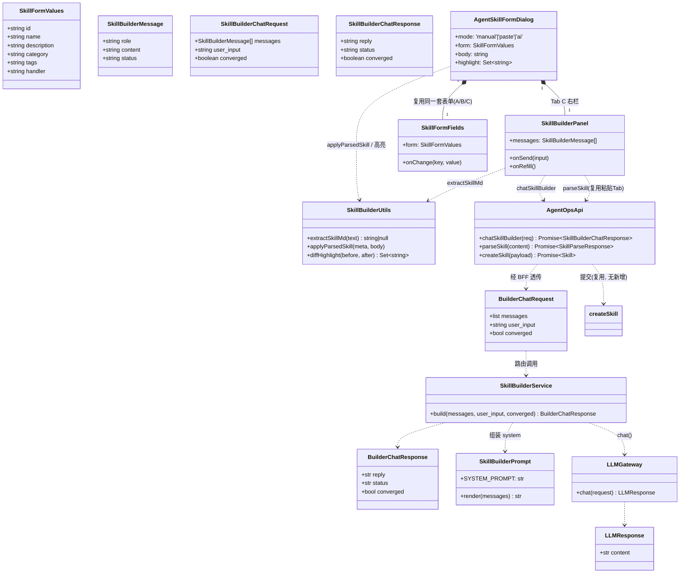
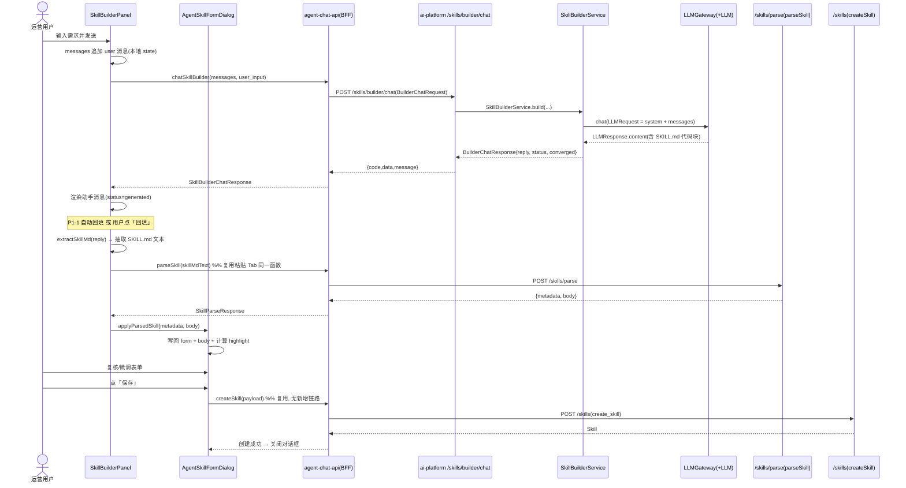
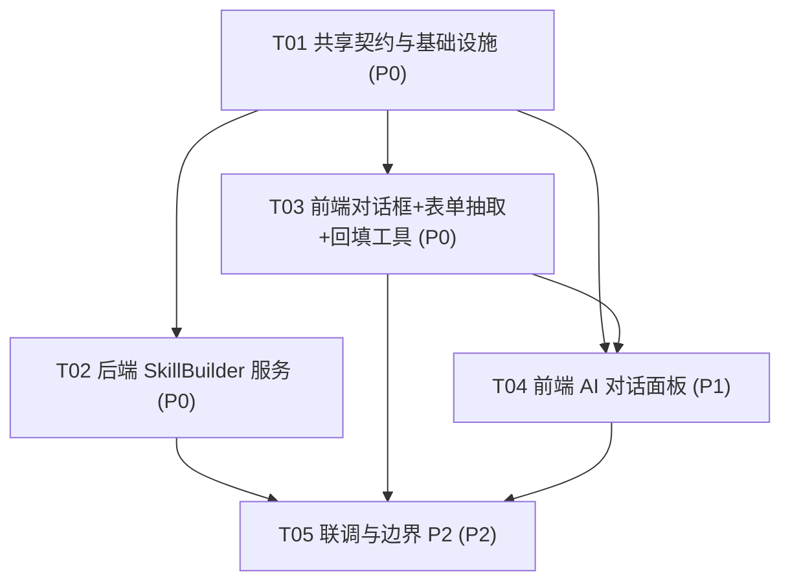

# 技能创建对话框「AI 对话创建」Tab(C) — 系统架构设计 + 任务分解

> 文档角色：标准 SOP 架构阶段产出（增量设计，聚焦 C 功能，不重写 Tab A/B 与 create_skill）。
> 作者：架构师 高见远（software-architect）。
> 输入：增量 PRD（许清楚）+ 现有系统事实（已逐文件核实）。
> 语言：简体中文。

---

## 1. 实现方案

### 1.1 实现难点与选型

| 难点 | 决策 |
|------|------|
| C 是一个「单用途、临时性、不落库」的 AI 助手，而复用的 mis-copilot 是「通用、持久会话、多 Agent 委派」的协调者 | **不复用 mis-copilot 持久会话**，改为复用 ai-platform 既有 **LLM 网关**(`get_llm_gateway().chat()`) 直驱一个无状态 `SkillBuilderService` + 固定「技能创建」系统提示词。 |
| 回填必须复用粘贴 Tab 的 `parse_skill_md`，不能另写解析 | 把现有内联回填逻辑抽成共享工具 `skillBuilderUtils.applyParsedSkill`，A/B/C 三 Tab 共用同一入口。 |
| 前端要在 A/B/C 三 Tab 间复用同一套表单组件 | 把现有 dialog 里内联的元数据字段抽成独立组件 `SkillFormFields`，三 Tab 复用。 |
| 对话流状态、生成中/已生成、收敛 | 后端返回 `status`/`converged`；前端状态机驱动。 |

**框架选型（沿用既有，零新增）**：
- 前端：Vite + React + MUI + Tailwind + zod + axios（仓库已具备）。
- 后端：Python / FastAPI（ai-platform 既有）；LLM 调用复用既有 `LLMGateway`。
- BFF：Spring Boot `mis-admin-bff`（既有 `AgentOpsClient`/`AgentOpsFacadeService`/`AgentOpsController` 透传模式）。
- 架构模式：前端组件化（受控表单 + 对话面板）；后端「无状态服务 + 路由」；BFF 纯透传门面。

### 1.2 架构决策（A/B/C/D/E）

#### A. 后端驱动源（Q1）
**结论：不复用 mis-copilot coordinator + TaskBrief，改为复用 ai-platform LLM 网关直驱。**

可行性评估：在 `coordinator/brief.py` 里确实存在 `TaskBrief`/`TaskBriefBuilder`，`mis-copilot` 也确实按 Coordinator 模式配置（见 `docs/ai-fusion/coordinator-worker/adr.md`）。但挂载 TaskBrief 驱动 C 会**强制走持久会话**（`AgentInstance.process_message` 必绑 `Session`，且 `session.py#send_message` 会把消息落 Redis+PG），与 Q3「不持久化」直接冲突；同时 coordinator 会带入 RAG/CRM 等工具委派能力，对一个「只产出 SKILL.md」的窄场景属于过度设计且有误触发工具的风险。

**替代方案（选定）**：新增无状态端点 `POST /skills/builder/chat`，内部用 `get_llm_gateway().chat(LLMRequest(...))` 配合固定系统提示词（遵循 Anthropic skill-creator 规范）产出 SKILL.md。**仍然「复用」了平台既有 LLM 集成，不新增 LLM 接入、不引入外部 WorkBuddy 技能**，符合 PRD「降低门槛 / 复用既有资产」的总目标。

#### B. 持久化冲突（Q3）
**结论：走 ephemeral（临时）端点，完全不碰会话存储。**

`POST /skills/builder/chat` **不创建、不读取、不写入任何 `agent_session` / `agent_session_message`**（不碰 Redis，不碰 PG）。它是纯函数式 LLM 调用：前端把完整多轮上下文作为请求体上送，后端无状态。前端在 `SkillBuilderPanel` 的组件 state 里维护 `messages`，**对话框关闭即随组件卸载清空**（P2-3）。这从根上满足 Q3 的「不持久化，C 仅创建期辅助」。

#### C. 回填链路（核心复用点）
1. 后端只回 AI 文本 `reply`（内含 ```SKILL.md 代码块）。
2. 前端用**唯一权威**正则 `extractSkillMd(reply)` 抽取代码块文本（无块则整段兜底）。
3. 把抽取文本喂给**现有的 `parseSkill(content)`**（粘贴 Tab 调用的同一函数）→ 回 `{metadata, body}`。
4. 调共享工具 **`applyParsedSkill(metadata, body)`** 写回左侧表单 `form` 与 `body`（空值不覆盖已有字段，沿用现有 `onParse` 语义）。
5. P1-3 高亮：回填前后对 `SkillFormValues` 六字段浅比较，差异键进 `highlight: Set<string>`，由 `SkillFormFields` 渲染高亮样式。

> ⚠️ **硬约束**：禁止为 C 另写任何 SKILL.md 解析逻辑；解析的唯一入口是 `parseSkill` / `POST /skills/parse`。

#### D. 前后端契约
| 层 | Method + Path | 入参 | 出参 | 权限 |
|----|--------------|------|------|------|
| ai-platform（新增） | `POST /api/v1/skills/builder/chat` | `BuilderChatRequest{messages:[{role,content}], user_input:str, converged:bool=false}` | `BuilderChatResponse{reply:str, status:'generating'\|'generated', converged:bool}`（包 `{code,data,message}`） | （内部接口，复用下游鉴权） |
| BFF（新增透传） | `POST /api/v1/agent-ops/skills/builder/chat` | 原样透传 `BuilderChatRequest` | 原样透传 `BuilderChatResponse` | **`agent:skill:manage`**（与 create_skill 同族，需在 `sys_api` 注册表补一行） |
| 前端（新增） | `chatSkillBuilder(req)`（`agent-chat-api.ts`，走 180s 客户端） | `SkillBuilderChatRequest` | `Promise<SkillBuilderChatResponse>` | — |
| 复用（不改） | `POST /api/v1/skills/parse`（`parseSkill`） | `{content}` | `{metadata, body}` | `agent:skill:manage` |
| 复用（不改） | `POST /api/v1/skills`（`createSkill`） | `SkillPayload` | `Skill` | `agent:skill:manage` |

> 注：`chatSkillBuilder` 必须放在 `agent-chat-api.ts`（既有 180s 超时客户端），因为它本质是 LLM 推理，与 `sendChatMessage` 同族；不要放进默认 15s 的 `agent-ops-api.ts`。

#### E. 提交链路
**复用 `createSkill`（`POST /agent-ops/skills` → ai-platform `create_skill`）。不新增任何提交链路、不新增落盘逻辑。** 自定义技能 body 落盘 `data/skills/{id}/SKILL.md` 已由现有 `create_skill` 完成（见 `skill.py#create_skill` + `save_custom_skill`）。

---

## 2. 文件列表（相对路径）

### 前端（增量）
- `frontend/mis-admin-web/src/features/agent/types.ts` — **改**：新增 `SkillBuilderMessage` / `SkillBuilderChatRequest` / `SkillBuilderChatResponse`。
- `frontend/mis-admin-web/src/features/agent/api/agent-chat-api.ts` — **改**：新增 `chatSkillBuilder()`（180s 客户端，与 `sendChatMessage` 同文件）。
- `frontend/mis-admin-web/src/features/agent/skills/agent-skill-form-dialog.tsx` — **改**：`mode` 三态 + 第 3 个 Tab「AI 对话创建」+ 分栏布局 + 集成回填/高亮；复用 `SkillFormFields` 与 `SkillBuilderPanel`。
- `frontend/mis-admin-web/src/features/agent/skills/skill-form-fields.tsx` — **新**：从 dialog 抽出的左栏元数据表单字段组件，A/B/C 三 Tab 共用。
- `frontend/mis-admin-web/src/features/agent/skills/skill-builder-utils.ts` — **新**：`extractSkillMd()` 抽取正则、`applyParsedSkill()` 回填、`diffHighlight()` 高亮差异。
- `frontend/mis-admin-web/src/features/agent/skills/skill-builder-panel.tsx` — **新**：C 的右栏 AI 对话面板容器（消息流 + 输入 + 发送 + 状态 + 回填按钮 + 暂存预览）。
- `frontend/mis-admin-web/src/features/agent/skills/skill-builder-message-list.tsx` — **新**：消息列表子组件（用户/助手气泡、生成中/已生成状态）。
- `frontend/mis-admin-web/src/features/agent/skills/skill-builder-input.tsx` — **新**：输入区子组件（输入框 + 发送 + P2-3 本地草稿）。
- `frontend/mis-admin-web/src/features/agent/skills/skill-builder-guide.ts` — **新**：P2-1 示例技能描述引导语/模板文本。

### 后端 ai-platform（增量）
- `agent/ai-platform/backend/src/api/routes/skill.py` — **改**：新增 `BuilderChatRequest` / `BuilderChatResponse` 模型 + `POST /builder/chat` 路由（**声明顺序必须在 `/{skill_id}` 之前**，同 `batch-delete` 教训）。
- `agent/ai-platform/backend/src/skills/skill_builder_prompt.py` — **新**：系统提示词（遵循 Anthropic skill-creator 规范，约束 frontmatter 字段 name/description/category/tags/handler + 正文）。
- `agent/ai-platform/backend/src/skills/skill_builder_service.py` — **新**：`SkillBuilderService.build(messages, user_input, converged)` → 组装 `LLMRequest` 调 `get_llm_gateway().chat()` → 返回 `BuilderChatResponse`。

### BFF（增量透传）
- `backend/mis-admin-bff/src/main/java/com/mis/adminbff/client/AgentOpsClient.java` — **改**：新增 `builderChat(body)` → `POST /api/v1/skills/builder/chat`。
- `backend/mis-admin-bff/src/main/java/com/mis/adminbff/service/agentops/AgentOpsFacadeService.java` — **改**：新增 `builderChat(body)` 透传。
- `backend/mis-admin-bff/src/main/java/com/mis/adminbff/controller/AgentOpsController.java` — **改**：新增 `POST /skills/builder/chat`。
- `V**__agent_ops_api_perms.sql`（权限注册表）— **改**：补一行 `POST /api/v1/agent-ops/skills/builder/chat` → `agent:skill:manage`。

---

## 3. 数据结构与接口（类图 / Mermaid）

> 完整 Mermaid 见同目录 `class-diagram.mermaid`。



---

## 4. 程序调用流程（时序图 / Mermaid）

> 完整 Mermaid 见同目录 `sequence-diagram.mermaid`。



---

## 5. 依赖包列表

**前端**：无新增。`zod`(校验)、`axios`(HTTP)、`sonner`(toast)、MUI/Tailwind(UI) 均已在仓库依赖中。
**后端 ai-platform**：无新增。`fastapi`/`pydantic`(既有)、`LLMGateway`(既有 `src/llm/gateway.py`)、`get_llm_gateway()`(既有)。
**BFF**：无新增。`Spring WebClient`(既有 `AgentOpsClient` 已封装)。

---

## 6. 任务列表（有序、含依赖、按实现顺序排列）

> 硬约束：≤5 个任务；每任务 ≥3 个相关文件；首任务为基础设施/契约；尽量仅依赖 T01。

### T01 — 共享契约与基础设施【P0】
- **依赖**：无（根任务）
- **文件**：
  - `frontend/.../types.ts`（改：+ `SkillBuilderMessage`/`SkillBuilderChatRequest`/`SkillBuilderChatResponse`）
  - `frontend/.../api/agent-chat-api.ts`（改：+ `chatSkillBuilder()`，180s 客户端）
  - `agent/.../api/routes/skill.py`（改：+ `BuilderChatRequest`/`BuilderChatResponse` 模型）
  - `backend/.../client/AgentOpsClient.java`（改：+ `builderChat()`）
  - `backend/.../service/agentops/AgentOpsFacadeService.java`（改：+ `builderChat()` 透传）
  - `backend/.../controller/AgentOpsController.java`（改：+ `POST /skills/builder/chat`）
- **说明**：全栈契约与透传骨架，后续所有任务依赖此契约；BFF 端点权限码登记在 `sys_api` 注册表（与 create_skill 同族 `agent:skill:manage`）。

### T02 — 后端 SkillBuilder 服务（LLM 驱动）【P0】
- **依赖**：T01
- **文件**：
  - `agent/.../skills/skill_builder_prompt.py`（新：系统提示词，遵循 Anthropic skill-creator 规范）
  - `agent/.../skills/skill_builder_service.py`（新：`SkillBuilderService.build()`）
  - `agent/.../api/routes/skill.py`（改：`POST /builder/chat` 路由体，调用 Service；**声明在 `/{skill_id}` 之前**）
- **说明**：实现无状态 AI 产出 SKILL.md；`status='generated'/'generating'`、`converged` 由 Service 判断（如检测到完整 frontmatter+正文即视为 converged）。

### T03 — 前端对话框 + 表单抽取 + 回填/高亮工具【P0】
- **依赖**：T01
- **文件**：
  - `frontend/.../skills/agent-skill-form-dialog.tsx`（改：`mode` 三态 + 第3 Tab + 分栏 + 集成）
  - `frontend/.../skills/skill-form-fields.tsx`（新：抽出左栏表单，A/B/C 共用）
  - `frontend/.../skills/skill-builder-utils.ts`（新：`extractSkillMd`/`applyParsedSkill`/`diffHighlight`）
- **说明**：抽表单组件保证 P0-2「复用 A/B 同一套表单」；`applyParsedSkill` 同时被粘贴 Tab 的 `onParse` 复用，回填逻辑单点；P1-3 高亮在此落地；解析失败兜底（内联报错、可重试/可手动改后重解析）沿用既有模式。

### T04 — 前端 AI 对话面板组件【P1】
- **依赖**：T01、T03（面板使用 T03 的 `skill-builder-utils`）
- **文件**：
  - `frontend/.../skills/skill-builder-panel.tsx`（新：容器，管理 messages state、发送、状态、回填按钮、暂存预览）
  - `frontend/.../skills/skill-builder-message-list.tsx`（新：消息流 + 生成中/已生成状态）
  - `frontend/.../skills/skill-builder-input.tsx`（新：输入区 + P2-3 本地草稿）
- **说明**：P0-3 消息收发展示、P1-2 状态展示、P2-2 暂存预览、P2-3 草稿；P1-4 收敛由后端 `converged` 驱动前端提示「已可回填」。

### T05 — 联调与边界（P2 引导/暂存/草稿/兜底）【P2】
- **依赖**：T02、T03、T04
- **文件**：
  - `frontend/.../skills/skill-builder-guide.ts`（新：P2-1 示例技能描述引导语/模板）
  - `frontend/.../skills/skill-builder-panel.tsx`（改：P2-2 解析成功未回填时暂存 AI 文本预览；P2-3 草稿随关闭清空）
  - `frontend/.../skills/agent-skill-form-dialog.tsx`（改：解析失败兜底联调、空响应处理、整体集成）
- **说明**：补齐 P2 项 + 边界（空响应、AI 未产出 SKILL.md 时的友好提示、解析失败重试）、前后端联调与回归。

---

## 7. 共享知识（跨文件约定）

1. **SKILL.md 抽取正则（前端唯一权威）**：`/```(?:markdown|md|skill|text)?\s*\n([\s\S]*?)```/i`；无代码块时整段作为 SKILL.md 兜底尝试 `parseSkill`。该正则只存在于 `skill-builder-utils.ts#extractSkillMd`，面板与对话框均引用它，不得重复定义。
2. **parse 函数签名（复用粘贴 Tab）**：`parseSkill(content: string): Promise<SkillParseResponse>`，`SkillParseResponse = { metadata: Record<string,unknown>, body: string }`；无 Front Matter 时 `metadata={}, body=原文`；YAML 错误时后端回 `code=400`（前端 toast 展示）。
3. **表单 state 形状**：`SkillFormValues { id, name, description, category, tags, handler }`，外加独立 `body: string`。回填规则：**空值不覆盖已有字段**（`metaStr(meta,k) || f.k`，沿用现有 `onParse` 语义），避免清空用户手填内容。
4. **高亮**：回填前后对 `SkillFormValues` 六字段浅比较，差异键收集进 `highlight: Set<string>`，`SkillFormFields` 对命中的字段渲染高亮样式（ring/背景）。
5. **BFF 权限码**：新增 `POST /api/v1/agent-ops/skills/builder/chat` 归属 `agent:skill:manage`（与 create_skill 同族），需在 `sys_api` 注册表补登记；BFF 当前 `deny-unmapped:false`，但按既有纪律应显式登记。
6. **路由顺序**：ai-platform `skill.py` 中 `POST /builder/chat` 必须在 `POST /{skill_id}` 之前声明（FastAPI 字面量优先；否则 `builder` 被当路径参数吞掉）。
7. **超时**：builder chat 走 180s 客户端（与 `sendChatMessage` 同），因为本质是 LLM 推理。
8. **多轮上下文**：前端全量维护 `messages: SkillBuilderMessage[]` 并随每次请求上送；后端无状态、不落库（满足 Q3）。

---

## 8. 待明确事项（决策结论 + 未决）

### 已拍板决策（A/B/C/D/E）
- **A（Q1）**：不复用 mis-copilot coordinator/TaskBrief，改复用 ai-platform `LLMGateway` 直驱无状态 `SkillBuilderService` + 固定系统提示词。理由：避免强制持久会话（冲突 Q3）、避免误触发 coordinator 工具委派、复用既有 LLM 集成（不新增接入/不引入外部技能）。
- **B（Q3）**：ephemeral 端点，不碰 `agent_session`/`agent_session_message`（Redis+PG 均不动）；前端 state 维护上下文，关闭即清。
- **C（回填）**：后端只回文本 → 前端 `extractSkillMd` → 复用 `parseSkill` → `applyParsedSkill` 回填；禁止另写解析。
- **D（契约）**：新增 `POST /skills/builder/chat`（ai-platform）+ `POST /agent-ops/skills/builder/chat`（BFF 透传）+ `chatSkillBuilder()`（前端）；权限 `agent:skill:manage`。
- **E（提交）**：复用 `createSkill` → `create_skill`，无新增链路。

### 仍建议主理人/产品确认的未决项
1. **P1-1 默认自动回填还是手动点按**：设计上两者都支持（自动开关 + 手动「回填」按钮），默认建议**手动点按**（避免多轮澄清中频繁覆盖表单）；最终默认行为请产品确认。
2. **`converged` 收敛判据**：当前定为「检测到完整 frontmatter(name+description)+非空正文」。若需更严格（如必须含 `handler` 或特定章节），请在 T02 前明确。
3. **系统提示词是否要注入现有 skill 示例/业务域知识**：默认仅给 skill-creator 规范模板；若要基于平台已有 skill 做 few-shot，需确认是否读取 `SkillRegistry` 抽样（可能影响出网耗时）。
4. **BFF 权限登记 SQL 版本号**：需落在当前最新 `V**__agent_ops_api_perms.sql` 之后，由实施时按序补。
5. **P2-3 草稿粒度**：当前设计为「随对话框关闭清空」的内存草稿；若希望在同一创建会话内跨 Tab 切换保留输入，需确认（当前切换 Tab 不清空已填表单，但 AI 输入区草稿关闭即清，符合 Q3）。

---

## 9. 任务依赖图（Mermaid）


