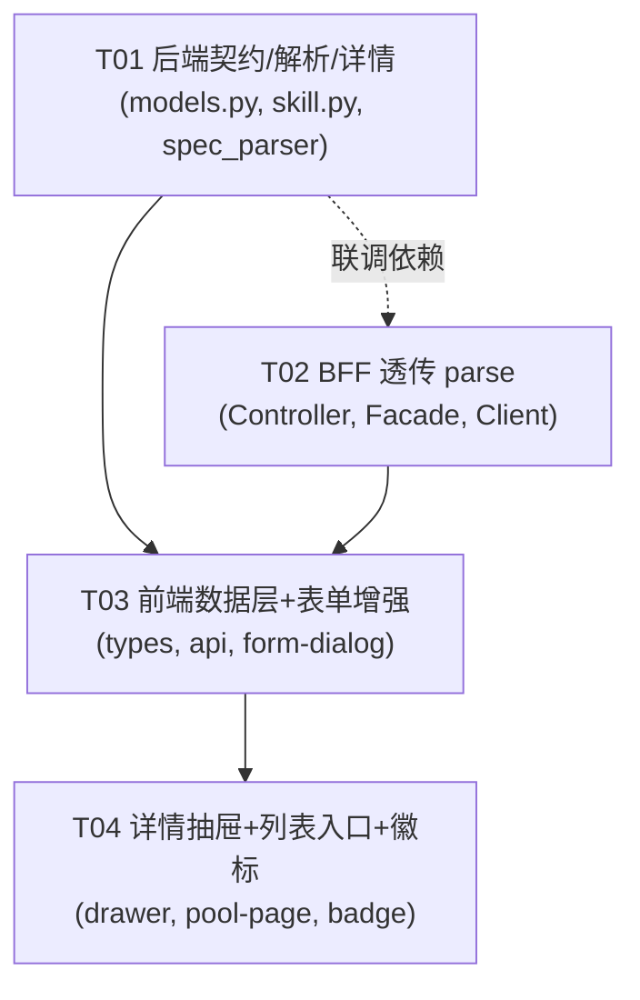

# 系统架构设计 + 任务分解：Agent 控制台 — 技能定义增强

> 范围：技能池「手写新建 / 粘贴 SKILL.md 导入」+ 技能详情查看。
> 锁定决策（来自 PRD）：
> - **D1 自建执行模型 = 两者都要**：`handler` 可选；空 = 文档型/检索型（仅检索与注入上下文），填了 = 可执行。
> - **D2 解析位置 = 后端**：新增 `POST /api/v1/skills/parse`，BFF 透传 `/agent-ops/skills/parse`，复用后端 `spec_parser.py`，**不在前端解析**。
>
> 所有事实均已在 `agent/ai-platform/backend/src/**`、`backend/mis-admin-bff/**`、`frontend/mis-admin-web/src/features/agent/**` 中核对（路径见第二节）。

---

## 一、实现方案概述

| 维度 | 决策 | 理由 |
|------|------|------|
| 前端框架 | **沿用现状**：React + TypeScript，现有 `components/ui` 原语（无 table/select，沿用 `native <table>` + `useClientSort`） | 零新框架，与 `agent-skill-pool-page.tsx` 现有手感一致 |
| 后端框架 | **沿用现状**：FastAPI + Pydantic（`skills/models.py`、`api/routes/skill.py`） | `spec_parser.parse_front_matter` 已存在且可用，直接复用 |
| BFF 框架 | **沿用现状**：Spring Boot 透明端点（`AgentOpsController` → `AgentOpsFacadeService` → `AgentOpsClient`，返回 `Result<JsonNode>`） | 与 #1–#9 同款透传模式，新增 `/skills/parse` 仅加一跳 |
| 新依赖 | **无**（前端、后端、BFF 均零新增依赖） | 解析复用 `spec_parser`；校验复用已有 `zod`/`JsonNode` |
| 架构模式 | 三层：**前端 → BFF 透传 → ai-platform**；自建模型 D1，解析后置后端 D2 | 解析下放后端，前端只做回填与展示 |
| 解析边界 | `POST /api/v1/skills/parse` 纯函数式：入参 `{content}`，复用 `parse_front_matter` 返回 `{metadata, body}` | 不落库、不改 `Skill` 模型；R11 明确 P0 不持久化 body |
| 详情加载 | `GET /skills/{id}` 返回前对含 `package_dir` 的 skill 触发 `load_body()` | custom 自建无 `package_dir` → `body=null`（不报错，R8） |

**核心难点与解法**
1. *handler 两类语义*：用「可选输入 + 两段提示文案」区分文档型/可执行型（R3），前端内联格式校验（R12），后端不校验（见 Open Q3）。
2. *粘贴导入回填*：新建表单新增「粘贴模式」，解析成功后把 `metadata` 映射回表单字段，允许用户编辑后再提交（R6）。
3. *详情附件与正文*：`Skill` 模型已有 `load_body`/`is_package_skill`，只需在 `get_skill` 路由内对 package skill 调用它；前端新增 `SkillDetail` 消费。

---

## 二、文件列表（新增 / 修改）

| 层 | 相对路径 | 现状 | 改动点 | 关联需求 |
|----|----------|------|--------|----------|
| 后端 | `agent/ai-platform/backend/src/skills/models.py` | 修改 | `SkillCreateRequest.handler`：`handler: str` → `handler: str = ""`（R1，不改 `Skill` 模型） | R1 |
| 后端 | `agent/ai-platform/backend/src/api/routes/skill.py` | 修改 | ① 新增 `POST /skills/parse`（`SkillParseRequest`→`SkillParseResponse`，复用 `parse_front_matter`）；② `get_skill` 返回前对含 `package_dir` 的 skill 调 `load_body()` | R4, R8 |
| 后端 | `agent/ai-platform/backend/src/skills/spec_parser.py` | 复用（不改） | `parse_front_matter` / `list_package_attachments` 直接复用 | R4, R8 |
| BFF | `backend/mis-admin-bff/.../controller/AgentOpsController.java` | 修改 | 新增 `@PostMapping("/skills/parse")` → `facade.parseSkill(body)` | R5 |
| BFF | `backend/mis-admin-bff/.../service/agentops/AgentOpsFacadeService.java` | 修改 | 新增 `parseSkill(JsonNode)` → `client.parseSkill(body)`（透明透传） | R5 |
| BFF | `backend/mis-admin-bff/.../client/AgentOpsClient.java` | 修改 | 新增 `parseSkill(Object body)` → `POST {SKILLS}/parse` | R5 |
| 前端 | `frontend/mis-admin-web/src/features/agent/types.ts` | 修改 | `Skill` 补 `handler?` / `source?`；新增 `SkillDetail`（含 `body?/scripts?/references?/assets?`）；新增 `SkillParseResponseFE` | R9 |
| 前端 | `frontend/mis-admin-web/src/features/agent/api/agent-ops-api.ts` | 修改 | `SkillPayload` 加 `handler?`（R2）；新增 `parseSkill(content)`（R6） | R2, R6 |
| 前端 | `frontend/mis-admin-web/src/features/agent/skills/agent-skill-form-dialog.tsx` | 修改 | 加「handler（可选）」输入 + 双语义提示（R3）；新增「粘贴 SKILL.md」模式（R6）；handler 内联格式校验（R12）；解析失败反馈+重贴入口（R13） | R3,R6,R12,R13 |
| 前端 | `frontend/mis-admin-web/src/features/agent/skills/agent-skill-detail-drawer.tsx` | **新增** | 技能详情抽屉：展示 `body` + 附件清单（scripts/references/assets）；空 body 文案（R11）；可执行/文档型徽标（R10） | R7, R10, R11 |
| 前端 | `frontend/mis-admin-web/src/features/agent/skills/agent-skill-pool-page.tsx` | 修改 | 列表新增「详情」操作列，打开详情抽屉 | R7 |
| 前端 | `frontend/mis-admin-web/src/features/agent/components/agent-status-badge.tsx` | 修改 | 新增 `skillKind` 徽标类别（executable / document）供抽屉区分（R10） | R10 |

> 注：后端 `spec_parser.py` 仅复用不改；`Skill` 模型本身不动（R8 在路由层调用既有 `load_body`）。

---

## 三、数据结构与接口（契约）

### 3.1 后端 Pydantic 模型

```python
# ---- models.py（R1：仅改这一行默认值为 ""，其余不动）----
class SkillCreateRequest(BaseModel):
    skill_id: str
    name: str
    description: str = ""
    category: str = SkillCategory.BUILT_IN
    tags: list[str] = Field(default_factory=list)
    parameters: dict[str, Any] = Field(default_factory=dict)
    required_permissions: list[str] = Field(default_factory=list)
    handler: str = ""          # ← R1 改可选（原必填无默认）
    timeout: int = 30
    version: str = "1.0.0"
    priority: float = 1.0
    requires_approval: bool = False

# ---- skill.py 新增（R4）----
class SkillParseRequest(BaseModel):
    content: str               # 粘贴的 SKILL.md 全文

class SkillParseResponse(BaseModel):
    metadata: dict[str, Any]   # 来自 parse_front_matter 的 Front Matter
    body: str                  # Markdown 正文
```

> `get_skill`（R8）伪代码：
> ```python
> skill = _registry.get(skill_id)
> if not skill: raise 404
> if skill.is_package_skill():                       # package_dir 非空
>     md = Path(skill.package_dir) / "SKILL.md"
>     if md.is_file():
>         text = md.read_text(encoding="utf-8")
>         _, body = parse_front_matter(text)         # 复用
>         attach = list_package_attachments(Path(skill.package_dir))
>         skill.load_body(body, attach)              # 填 body/scripts/references/assets
> return _api_response(0, skill.model_dump(mode="json"), "OK")
> # custom 自建 → package_dir=="" → 跳过，body 维持 None（不报错）
> ```

### 3.2 前端类型（TS）

```typescript
// types.ts —— Skill 补字段（R9）
export interface Skill {
  skill_id: string;
  name: string;
  description: string;
  status: SkillStatus;
  category?: string;
  version?: string;
  tags?: string[];
  updated_at: string;
  handler?: string;   // R9 新增：列表/详情/编辑复用
  source?: 'custom' | 'mcp' | 'builtin' | 'package';  // R9
}

// types.ts —— 详情（R9，扩展 Skill）
export interface SkillDetail extends Skill {
  body?: string | null;        // 正文；null = 无 SKILL.md
  scripts?: string[];          // 附件清单
  references?: string[];
  assets?: string[];
}

// types.ts —— 解析响应（R6 回填来源）
export interface SkillParseResponse {
  metadata: Record<string, unknown>;  // {name, description, category, tags[], handler? ...}
  body: string;
}

// agent-ops-api.ts —— SkillPayload 加 handler（R2）
export interface SkillPayload {
  skill_id?: string;
  name: string;
  description: string;
  category?: string;
  tags?: string[];
  handler?: string;   // R2 新增
}

// agent-ops-api.ts —— 新增（R6）
export async function parseSkill(content: string): Promise<SkillParseResponse> {
  const res = await api.post<ApiResult<SkillParseResponse>>('/agent-ops/skills/parse', { content });
  return unwrap(res, '解析 SKILL.md 失败');
}
```

### 3.3 handler 三类格式约定（共享知识）

| 格式 | 示例 | 语义 |
|------|------|------|
| `mcp:{server}:{tool}` | `mcp:notion:page-create` | 由 MCP Server 提供的可执行工具 |
| `builtin:{name}` | `builtin:send-email` | 平台内置可执行技能 |
| `custom:{module}.{func}` | `custom:order.export_csv` | 自定义代码入口的可执行技能 |
| `""`（空） | — | 文档型/检索型：仅检索与上下文注入，**不执行** |

- 表单两段提示（R3）：
  - 空时：「留空 = 文档型/检索型技能，仅用于检索与上下文注入，不执行。」
  - 非空时：「可执行技能格式：`mcp:{server}:{tool}` / `builtin:{name}` / `custom:{module}.{func}`。」

### 3.4 表单双模式状态结构（R6）

```typescript
type FormMode = 'manual' | 'paste';

interface AgentSkillFormDialogState {
  mode: FormMode;            // manual=手写；paste=粘贴导入
  rawContent: string;        // 粘贴的 SKILL.md 全文
  parsing: boolean;         // 解析中（禁用按钮）
  parseError: string | null; // 解析失败文案（R13）
  form: SkillFormValues & { handler: string };  // 扩展原表单，含 handler
  // 既有：errors / saving / isEdit
}

// 解析成功后的回填映射（metadata → 表单）
// name<-metadata.name, description<-metadata.description,
// category<-metadata.category, tags<- (metadata.tags||[]).join(', '),
// handler<-metadata.handler || ''
```

---

## 四、程序调用流程（时序图）

见同目录 `sequence-diagram.mermaid`，含三条主链路：
- **① 粘贴解析流程**：前端粘贴 → BFF `/agent-ops/skills/parse` → ai-platform `POST /api/v1/skills/parse` → `parse_front_matter` → 回填表单（含失败/无 FM 分支）。
- **② 自建提交流程**：表单 → BFF `POST /agent-ops/skills` → ai-platform create（`handler` 缺省 `""`）→ 懒注册执行码 → 刷新列表。
- **③ 详情查看流程**：列表「详情」→ BFF `GET /agent-ops/skills/{id}` → ai-platform `get_skill` → 含 `package_dir` 则 `load_body()` → 抽屉渲染（含空 body 文案与附件清单）。

---

## 五、待明确事项 & Open Q 默认决策

| 编号 | 问题 | 默认决策（需用户确认项已标 ★） | 说明 |
|------|------|-------------------------------|------|
| Q1 | P0 是否持久化 body？ | **否**：`parse` 返回的 `body` 仅做预览，create 不持久化 body；custom 自建无正文（R11）。 | ★ 强烈建议，但需用户拍板是否本期连 P2 持久化一起做 |
| Q2 | Front Matter 无 `handler` 如何处理？ | **留空 = 文档型**：`metadata` 中无 `handler` → 回填 `handler=""`，视为文档型。 | 解析函数本身不抛错 |
| Q3 | 后端是否校验 handler 格式？ | **仅前端校验**（R12），后端**不校验**，保持 `handler: str = ""`。 | 后端零改动、零新依赖；格式错误不阻断创建 |
| Q4 | 无 Front Matter 全文如何处理？ | 返回 `{metadata:{}, body: 原样}`；前端软提示「未检测到 Front Matter，已作正文预览，请手动填写或补全 `---` 包裹的 Front Matter」，**不报错**。 | 见时序图① else 分支 |
| Q8 | 详情 `load_body` 每次读盘？ | **可接受**（技能量小）；后续可加缓存（按 `package_dir` + mtime）。 | 首期不引入缓存层 |
| —— | 范围边界（已知债，本期不修，仅标注） | `status` 枚举不一致（后端 `inactive`/前端 `disabled`）、`stats` 不一致、`/grants` 缺失、`updated_at` 不一致 | 按 PRD 边界，仅标注不处理 |

---

## 六、任务分解（有序 + 依赖）

### 6.1 依赖包列表
```
# 前端 / 后端 / BFF 均无需新增依赖
# 复用：前端 zod（已有）；后端 spec_parser（已有）；BFF JsonNode 透传（已有）
```
**结论：新增依赖 = 0。**

### 6.2 任务列表（按实现顺序，依赖优先）

> 规则遵循：≤5 个任务、每个任务 ≥3 个相关文件、按功能层分组。
> **关于「首个任务=项目基础设施」规则的偏离说明**：本系统横跨三个独立子工程（ai-platform / mis-admin-bff / mis-admin-web），**零新增依赖、各工程配置文件与入口均不改动**，故不存在「配置+入口+依赖声明」类基础设施任务。按规则精神，把**无依赖、被全员依赖的「后端契约」作为首个任务**（T01）。

| 任务 | 名称 | 源文件（新建/修改） | 依赖 | 优先级 | 覆盖需求 |
|------|------|---------------------|------|--------|----------|
| **T01** | 后端契约与解析/详情端点 | `skills/models.py`(改)、`api/routes/skill.py`(改)、`skills/spec_parser.py`(复用，列出以明契约) | 无 | P0 | R1, R4, R8 |
| **T02** | BFF 透传 parse 端点 | `AgentOpsController.java`(改)、`AgentOpsFacadeService.java`(改)、`AgentOpsClient.java`(改) | 无（与 T01 同契约，可并行；联调依赖 T01 落地） | P0 | R5 |
| **T03** | 前端数据契约层 + 新建/编辑表单增强 | `types.ts`(改)、`agent-ops-api.ts`(改)、`skills/agent-skill-form-dialog.tsx`(改) | T01, T02 | P0/P1 | R2,R3,R6,R12,R13 |
| **T04** | 前端技能详情抽屉 + 列表入口 + 徽标 | `skills/agent-skill-detail-drawer.tsx`(**新**)、`skills/agent-skill-pool-page.tsx`(改)、`components/agent-status-badge.tsx`(改) | T03 | P0/P1 | R7,R9,R10,R11 |

> 注：T03 内的 R12/R13 为 P1，可在 T03 内一并实现或后置；T04 内的 R10/R11 为 P1/P0，建议一并实现。

### 6.3 共享知识（跨文件约定）
1. **统一响应信封**：所有后端/BFF 响应均为 `{code, data, message}`；`code!=0` 时 `data=null`，前端 `agentErrorMessage` 透传 `message`（已有处理，无需新增）。
2. **handler 三格式**：`mcp:{server}:{tool}` / `builtin:{name}` / `custom:{module}.{func}`，空=`""` 表示文档型（见 3.3）。
3. **解析失败统一错误**：`/skills/parse` 仅在后端异常/超长（R17）时返回 `code!=0`；无 Front Matter 属正常（返回空 metadata，前端软提示，不报错）。
4. **详情抽屉消费契约**：`SkillDetail` 字段 `body?/scripts?/references?/assets?/source?/handler?`；`body===null||""` 时显示「该技能为自建/文档型，无 SKILL.md 正文」（R11）；附件数组为空显示「无附件」。
5. **可执行/文档型判定**：`handler` 非空 → 可执行徽标；空 → 文档型徽标（R10，抽屉内由 `agent-status-badge` 的 `skillKind` 渲染）。
6. **路径与透传同形**：BFF 新增 `/skills/parse` 与后端 `/api/v1/skills/parse` 同形（`SKILLS + "/parse"`），沿用现有 `Result<JsonNode>` 透传，不建新 DTO。

### 6.4 任务依赖图



**实现顺序建议**：T01 与 T02 可并行启动（同一份接口契约已在此文档定稿）；T03 在契约落地后开始；T04 依赖 T03 的类型与 API。

---

## 七、风险与边界标注
- **`status` 枚举不一致**：后端 `SkillStatus` = active/inactive/deprecated；前端 `SkillStatus` = 'active'|'disabled'。本期**不修**，详情抽屉沿用既有 `agent-status-badge` 的 `skillStatus` 映射（仅 active/disabled），deprecated 走 fallback 显示原值。
- **`@PostMapping("/skills/parse")` 路由冲突**：现有 `@GetMapping("/{skill_id}")` 为 GET、`@PostMapping("/skills/reindex")` 为 POST，新增 `POST /skills/parse` 与二者均不冲突；Spring 按 method+path 精确匹配。
- **`load_body` 读盘开销（Q8）**：技能量小可忽略；若后续技能包增多，按 `package_dir`+mtime 加内存缓存。
