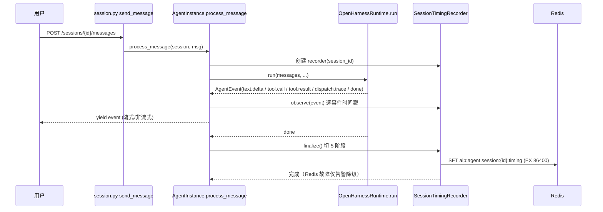
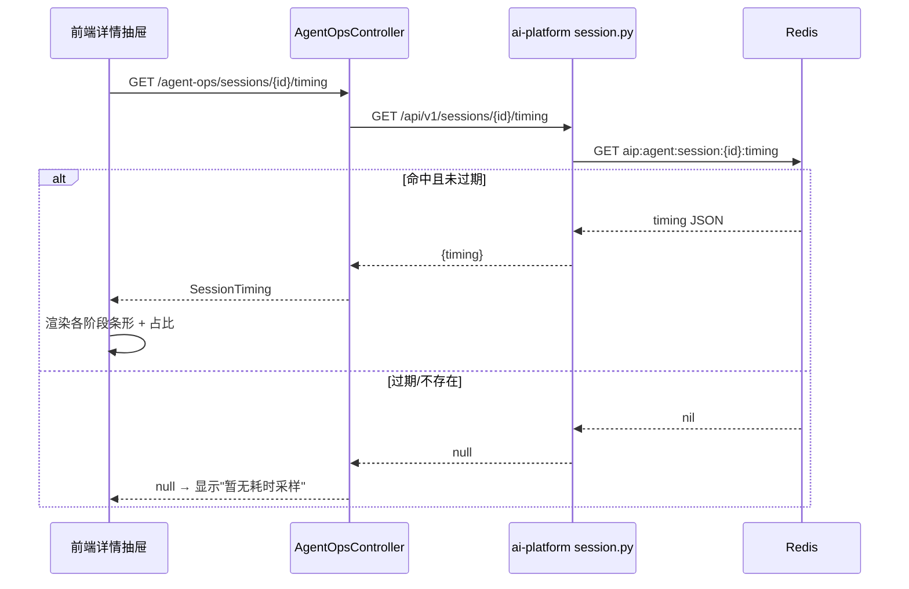
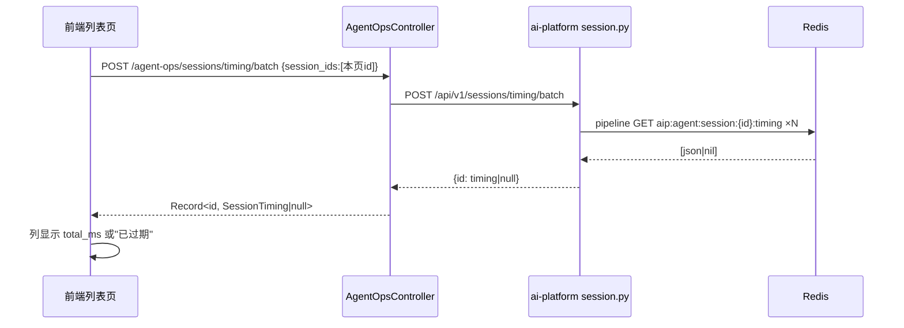
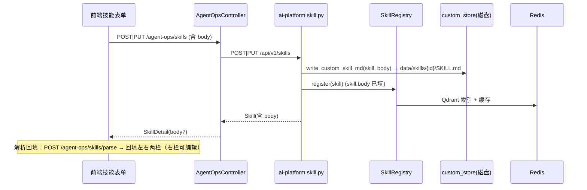
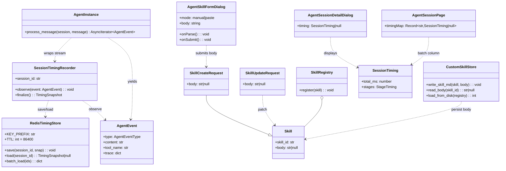

# 系统设计文档：Agent 控制台 — 会话各阶段耗时埋点 + 技能 body 持久化

> 版本：v1.0 ｜ 作者：架构师 高见远 ｜ 语言：简体中文
> 范围：后端埋点（FastAPI）+ BFF 透传（Java）+ 前端（React/TS）三端协同改造
> 输入：增量 PRD（A 会话耗时 / B 技能对话框放大+双模式）、已核查代码事实、主理人默认决策

---

## 1. 实现方案概述 + 框架选型

### 1.1 已 Read 核查的关键事实（直接采信，路径已确认）

| 主题 | 文件 | 核查结论 |
|------|------|----------|
| Redis 客户端范式 | `agent/ai-platform/backend/src/agent/session.py`、`src/skills/cache.py` | **无中央单例**：各模块各自 `aioredis.from_url(redis_url, max_connections=REDIS_MAX_CONNECTIONS, decode_responses=True)`；键前缀 `REDIS_KEY_PREFIX="aip:"`；`set/get/delete/pipeline` 可用。新增 timing 模块沿用此范式。 |
| 会话双写 | `src/agent/session.py` `SessionManager` | Redis 热（TTL 86400）+ PG 冷投影，**本期不改**（A-1 基线）。 |
| AgentEvent 流 | `src/runtime/events.py`、`src/runtime/openharness.py` | `run()` **只 yield**：`text.delta` / `tool.call` / `tool.result` / `ui.render` / `dispatch.trace` / `done` / `error`。**`run_start` 与 `llm_response` 仅 `_log_agent_trace` 日志、不进事件流**——这是设计计时器的关键约束。 |
| 运行时漏斗 | `src/agent/manager.py` `AgentInstance.process_message()` | **唯一漏斗**：`async for event in self.runtime.run(...)` 后 `yield event`。计时器在此包裹事件流即可覆盖流式+非流式全部链路。 |
| dispatch_trace | `src/coordinator/trace.py` | `DispatchTraceEntry{intent, latency_ms, ...}`，落 `session.state["dispatch_trace"]` 与 `dispatch.trace` 事件（通道 C 默认开）。retrieval 计时直接消费事件流中的 `trace.entries`。 |
| Skill 模型 | `src/skills/models.py` | `Skill.body: str | None = None` **已存在**；`SkillCreateRequest`/`SkillUpdateRequest` **无 body**；`registry.register()` **不落盘**。 |
| skill 路由 | `src/api/routes/skill.py` | `create_skill`/`update_skill` 调 `_registry.register()`；`get_skill` 仅对 package skill 读 `SKILL.md`。 |
| 技能加载 | `src/skills/loader.py` | 仅扫 `CONFIG_BASE_PATH/skills/packages/*/SKILL.md`；custom 技能不在此列 → 需独立磁盘目录 + 启动重载。 |
| 会话路由 | `src/api/routes/session.py` | 列表/详情走 PG；无 timing 端点 → 需新增。 |
| BFF | `backend/mis-admin-bff/.../AgentOpsController.java` | `/sessions/*`、`/skills/*` 已透传；**无 timing 端点** → 需新增 2 个透传。 |
| 前端 API | `frontend/.../agent-ops-api.ts` | `SkillPayload` 无 `body`；`SkillDetail` 已有 `body?`；会话列表/详情接口已就绪。 |

### 1.2 框架选型

- **前端**：React + TypeScript 沿用（MUI + Tailwind + zod）；**零新增依赖**（zod 已依赖）。
- **后端（ai-platform）**：FastAPI 沿用；**零新增依赖**；计时器复用 `aioredis`（已在用）。
- **BFF（mis-admin-bff）**：Spring Boot 沿用；仅新增 2 个透传端点，无新依赖。
- **body 持久化**：**文件系统**（不新增 DB 表/迁移），custom 技能写完整 `SKILL.md`，与现有"技能从 SKILL.md 加载"范式一致。

### 1.3 架构模式

- 计时：在 `AgentInstance.process_message` 出口处**包裹** AgentEvent 流（订阅式），按事件时间戳切 5 阶段 wall-clock，run_complete 时**覆盖写** Redis timing key（TTL 86400，仅调试窗口）。
- body：在 skill 路由 create/update 时落盘 `data/skills/{skill_id}/SKILL.md`，并在 BFF/前端 `SkillPayload` 透传；启动从磁盘重载 custom 技能，保证"重启可重载"。

---

## 2. 文件列表（新增 / 修改）

### 2.1 后端 ai-platform（FastAPI）

| 文件 | 动作 | 说明 |
|------|------|------|
| `src/agent/session_timing.py` | **新增** | `SessionTimingRecorder` + `RedisTimingStore`：订阅事件流、切 5 阶段、写/读 Redis timing key。 |
| `src/agent/manager.py` | 修改 | `AgentInstance.process_message` 包裹 `SessionTimingRecorder`（非阻塞、Redis 故障降级）。 |
| `src/api/routes/session.py` | 修改 | 新增 `GET /{session_id}/timing`（单条）、`POST /timing/batch`（批量 pipeline）。 |
| `src/skills/custom_store.py` | **新增** | `write_custom_skill_md(skill, body)` / `read_custom_skill_body(skill_id)` / `load_custom_skills_from_disk(registry)`：custom 技能 SKILL.md 落盘与启动重载。 |
| `src/skills/models.py` | 修改 | `SkillCreateRequest`、`SkillUpdateRequest` 增加 `body?: str`。 |
| `src/api/routes/skill.py` | 修改 | create/update 收 `body` 并落盘 + 回填 `skill.body`；`get_skill` 对 custom 技能缺失 body 时读盘。 |
| `src/config.py` | 修改 | 新增设置 `SKILL_CUSTOM_STORE_DIR = "data/skills"`。 |
| `src/main.py` | 修改 | lifespan 启动后调用 `load_custom_skills_from_disk()`（在 `load_skills_from_files` 之后）。 |

### 2.2 BFF（mis-admin-bff / Java）

| 文件 | 动作 | 说明 |
|------|------|------|
| `controller/AgentOpsController.java` | 修改 | 新增 `GET /agent-ops/sessions/{id}/timing`、`POST /agent-ops/sessions/timing/batch` 透传到 ai-platform。 |
| `client/AgentOpsClient.java`（或等效 Feign/RestTemplate 封装） | 修改 | 新增对应下游调用：`GET /api/v1/sessions/{id}/timing`、`POST /api/v1/sessions/timing/batch`。 |

### 2.3 前端（React/TS）

| 文件 | 动作 | 说明 |
|------|------|------|
| `features/agent/types.ts` | 修改 | 新增 `SessionTiming` / `StageTiming` 类型；`SkillPayload` 增加 `body?`。 |
| `features/agent/api/agent-ops-api.ts` | 修改 | 新增 `getSessionTiming(id)`、`batchGetSessionTiming(ids)`；`SkillPayload` 透传 `body`。 |
| `features/agent/skills/agent-skill-form-dialog.tsx` | 修改 | B-1~B-6/B-8/B-9：放大对话框（max-w-4xl / max-h-[88vh]）、左右双栏、右栏正文可编辑提交、解析回填右栏、编辑态=新建态、解析失败/空正文友好提示。 |
| `features/agent/sessions/agent-session-detail-dialog.tsx` | 修改 | A-5：新增"耗时"区块（各阶段条形+占比），抽屉打开时拉取 timing。 |
| `features/agent/sessions/agent-session-page.tsx` | 修改 | A-6（P1）：新增"耗时(总)"列，列表加载后用 batch 接口批量读 Redis，过期显示"已过期"。 |

---

## 3. 数据结构与接口契约（JSON Schema）

### 3.1 Redis timing key（A-2 / A-4）

- **Key**：`{REDIS_KEY_PREFIX}agent:session:{session_id}` → 实际 `aip:agent:session:{session_id}:timing`
- **TTL**：`86400`（24h 调试窗口，过期不影响会话本身可读）
- **Value（JSON）**：

```json
{
  "total_ms": 4210,
  "stages": {
    "planning": 320,
    "retrieval": 880,
    "tool_call": 1500,
    "generation": 1100,
    "post_process": 410
  },
  "sampled_at": "2025-08-14T13:20:05.123Z",
  "schema_version": 1
}
```

- 任一阶段不可得 → 该字段为 `null`（如 `retrieval: null` 表示 unknown）。
- 5 阶段之和**不要求等于** `total_ms`（阶段之间存在间隙，属正常）。
- 每次 `run_complete` **覆盖写**该会话最近一轮耗时（多轮对话取最近一轮）。

### 3.2 阶段名枚举（共享约定）

```
planning | retrieval | tool_call | generation | post_process
```

### 3.3 计时器输入：AgentEvent 流（A-3 切片规则）

| 阶段 | 计算方式（基于事件流 wall-clock） |
|------|----------------------------------|
| `total` | `run_start → run_complete`（`run_start` = 包裹器进入时刻/首个事件到达；`run_complete` = 收到 `done`/`error`） |
| `tool_call` | `Σ(ToolExecutionCompleted − ToolExecutionStarted)` = `Σ(tool.result 时刻 − tool.call 时刻)` |
| `generation` | `Σ(每段文本生成的首个 text.delta → 末个 text.delta)`（按 text.delta 突发段聚合，近似"各 llm_response 段时长"） |
| `planning` | `run_start → 首个外部动作`（首个 `tool.call` 时刻 与 首个 `text.delta` 时刻取早者） |
| `post_process` | `末个动作时刻 → run_complete`（末个 `tool.result` 或 末个 `text.delta` 取晚者） |
| `retrieval` | `Σ dispatch.trace 事件中 intent=="rag" 的 latency_ms`；无则 `null`（降级为 unknown） |

> ⚠️ 设计说明：因 `run_start`/`llm_response` 未作为 AgentEvent 下发，本方案以"包裹器进入时刻"近似 `run_start`、以"text.delta 突发段"近似 `generation`。这是在不修改运行时事件协议前提下的**最优解**，与 PRD A-3 目的一致；generation 为 wall-clock 近似（含 token 间等待），足以支撑调试。

### 3.4 后端接口契约

**3.4.1 `GET /api/v1/sessions/{session_id}/timing`（A-5 详情用）**
```jsonc
// 200，命中 Redis
{ "code": 0, "data": { /* 见 3.1 结构 */ }, "message": "OK" }
// 命中过期/不存在
{ "code": 0, "data": null, "message": "OK" }
```

**3.4.2 `POST /api/v1/sessions/timing/batch`（A-6 列表用）**
```jsonc
// 请求体
{ "session_ids": ["web-xxx", "web-yyy"] }
// 响应体：只返回命中的；未命中（含过期）的 key 不出现或为 null
{ "code": 0, "data": { "web-xxx": { /* 见 3.1 */ }, "web-yyy": null }, "message": "OK" }
```
> 实现用 Redis `pipeline` 批量 `get`，避免 N 次 RTT。

**3.4.3 `SkillCreateRequest` / `SkillUpdateRequest`（B-7，新增 `body`）**
```jsonc
// SkillCreateRequest 增加（其余字段不变）
{ "body": "可选，Markdown 正文；custom 技能落盘为 data/skills/{skill_id}/SKILL.md" }
// SkillUpdateRequest 增加（可选，显式传 null 表示清空正文）
{ "body": "string | null" }
```
- `Skill.body` 模型已存在；`GET /skills/{id}` 正常返回 `body`（custom 缺失时读盘回填）。

### 3.5 前端类型契约

```ts
// types.ts 新增
export interface StageTiming {
  planning: number | null;
  retrieval: number | null;
  tool_call: number | null;
  generation: number | null;
  post_process: number | null;
}
export interface SessionTiming {
  total_ms: number;
  stages: StageTiming;
  sampled_at: string;
  schema_version: number;
}

// SkillPayload 增加
export interface SkillPayload {
  skill_id?: string;
  name: string;
  description: string;
  category?: string;
  tags?: string[];
  handler?: string;
  body?: string;   // 新增：右栏正文，随创建/编辑提交
}
```

### 3.6 前端 API 契约（agent-ops-api.ts 新增）

```ts
getSessionTiming(id: string): Promise<SessionTiming | null>            // → GET /agent-ops/sessions/{id}/timing
batchGetSessionTiming(ids: string[]): Promise<Record<string, SessionTiming | null>>  // → POST /agent-ops/sessions/timing/batch
```

### 3.7 BFF 透传契约（新增）

| BFF 路径 | 方法 | 下游 ai-platform |
|----------|------|-----------------|
| `/agent-ops/sessions/{id}/timing` | GET | `GET /api/v1/sessions/{id}/timing` |
| `/agent-ops/sessions/timing/batch` | POST | `POST /api/v1/sessions/timing/batch` |

> `/skills/parse`（已存在）、`POST|PUT /skills` 保持不变，仅前端增加 `body` 字段透传。

---

## 4. 程序调用流程（时序图）

### 4.1 对话计时（AgentEvent 流 → recorder → Redis timing key）



### 4.2 会话详情看耗时（前端 → BFF → ai-platform → Redis → 抽屉条形）



### 4.3 列表耗时列（前端 → BFF → 批量 Redis pipeline）



### 4.4 技能创建/编辑双栏提交（表单 → BFF skills → ai-platform → registry 落盘 SKILL.md）



---

## 5. 类图（Mermaid classDiagram）



---

## 6. 任务列表（有序、含依赖、按实现顺序）

> 约束：拆 5 个任务组（每组 ≥3 个相关文件），严格 ≤5 个；前端任务依赖后端契约先定。

| Task | 名称 | 涉及文件 | 依赖 | 优先级 |
|------|------|----------|------|--------|
| **T01** | 后端会话耗时埋点（A-2/A-3/A-4 + 接口） | `src/agent/session_timing.py`(新)、`src/agent/manager.py`(改)、`src/api/routes/session.py`(改)、`src/config.py`(改: 无新增设置，复用 REDIS_KEY_PREFIX/TTL) | 无 | P0 |
| **T02** | 后端技能 body 持久化（B-7 + Q3） | `src/skills/custom_store.py`(新)、`src/skills/models.py`(改)、`src/api/routes/skill.py`(改)、`src/config.py`(改: SKILL_CUSTOM_STORE_DIR)、`src/main.py`(改: 启动重载) | 无 | P0 |
| **T03** | BFF 会话 timing 透传 | `AgentOpsController.java`(改)、`AgentOpsClient.java`(改) | T01 | P0 |
| **T04** | 前端技能对话框改造（B-1~B-6/B-8/B-9） | `agent-skill-form-dialog.tsx`(改)、`agent-ops-api.ts`(改: SkillPayload.body)、`types.ts`(改: SkillPayload.body) | T02（body 契约） | P0（B-9 为 P1） |
| **T05** | 前端会话耗时展示（A-5/A-6） | `agent-session-detail-dialog.tsx`(改)、`agent-session-page.tsx`(改)、`agent-ops-api.ts`(改: getSessionTiming/batchGetSessionTiming)、`types.ts`(改: SessionTiming/StageTiming) | T01 + T03 | A-5 P0，A-6 P1 |

**依赖关系图**：T01、T02 独立并行 → T03 依赖 T01 → T05 依赖 T01+T03；T04 依赖 T02。

---

## 7. 依赖包列表

- **后端**：无新增（`aioredis` 已在用，`pydantic`/`fastapi` 已在用）。
- **BFF（Java）**：无新增（复用现有 RestTemplate/Feign + Jackson）。
- **前端**：无新增（`zod` 已依赖）。
- **结论**：本期 **零新增第三方依赖**，符合主理人"零新增依赖"约束。

---

## 8. 共享知识（跨文件约定）

1. **timing Redis key 命名**：`aip:agent:session:{session_id}:timing`（`REDIS_KEY_PREFIX` 已为 `aip:`）。**TTL = 86400**。
2. **timing JSON `schema_version`**：本期固定 `1`；前端/后端解析需兼容未来升版（缺省按 v1 处理）。
3. **阶段名枚举**（时序图与 JSON 一致）：`planning / retrieval / tool_call / generation / post_process`；任一为 `null` 表示 unknown，前端显"—"。
4. **body 落盘路径约定**（Q3）：custom 技能完整 `SKILL.md` 落 `SKILL_CUSTOM_STORE_DIR/skills/{skill_id}/SKILL.md`（默认 `data/skills/...`，相对后端 cwd，与 `UPLOAD_DIR=data/uploads` 同级）。启动时 `load_custom_skills_from_disk()` 重载，保证"loader 重启可重载"。
5. **handler 三类格式**（沿用既有）：`mcp:{server}:{tool}` / `builtin:{name}` / `custom:{module}.{func}`；空串 = 文档型/检索型（不单独执行）。前端 `HANDLER_RE` 校验照旧。
6. **统一响应信封**：`{code, data, message}`；`code!=0` 或 `data===null` 视为未命中/失败，前端按"暂无/已过期"处理，不白屏。
7. **计时降级原则**：Redis 不可达 / 阶段不可得 → 静默降级（记 warning），**绝不阻断主对话链路**（与 `SessionManager` 双写降级、`dispatch_trace` 可观测性降级一致）。
8. **时间格式**：所有时间字段 ISO 8601 UTC（`sampled_at` 用 `datetime.now(timezone.utc).isoformat()`）。

---

## 9. 待明确事项（仍需拍板）

1. **custom 技能启动重载的范围**：T02 设计为"写完整 SKILL.md + 启动 `load_custom_skills_from_disk`"。若团队认为"重启后 custom 技能可重新由运营手动创建即可、不强求自动恢复"，可砍掉 `main.py` 启动重载项（仅保留落盘），但届时磁盘文件为孤儿、body 重启即丢——与 Q3"重启可重载"表述冲突，需主理人确认取舍。
2. **generation 计时精度**：当前用 text.delta 突发段近似（含 token 间等待）。若要求更精确（仅 LLM 推理耗时），需在 `OpenHarnessRuntime.run` 中显式 yield `llm_response` 起止事件——属运行时协议改动，本期按"不改协议"基线实现，已在 §3.3 标注。
3. **列表"耗时(总)"列默认值**：超过 24h 调试窗口 → 显示"已过期"（A-6 已定）；若为正在进行、尚未产生任何 run 的会话 → 同样显示"已过期"（无采样）。是否需要区分"从未采样"与"已过期"文案，待产品确认（建议统一"已过期/暂无"即可）。
4. **A-8 总耗时落 PG**：主理人已裁定本期 **不实现**（P2），已在设计中排除。

---

## 10. 已采用的默认决策（主理人 Open Questions → 直接采用）

| 决策 | 内容 | 本文落点 |
|------|------|----------|
| Q1 | retrieval 计时 = `dispatch_trace(intent=rag)` 的 `latency_ms` 聚合；不可得标 `unknown`（前端"—"） | §3.3 retrieval 计算、§3.1 `retrieval: null`、§8.3 |
| Q2 | timing key = `agent:session:{id}:timing`（带 `aip:` 前缀）；每次 `run_complete` **覆盖写**最近一轮 | §3.1、§8.1 |
| Q3 | body **文件系统持久化**为 `data/skills/{skill_id}/SKILL.md`，不新增 DB 表/迁移；loader 重启可重载 | §2.1 `custom_store.py`、§8.4、T02 |
| Q4 | 列表耗时列保留为 P1，实现用 pipeline 批量读当前页 Redis timing | §3.4.2、§4.3、T05(A-6 P1) |
| Q5 | 右栏正文可编辑 + 提交（US-2），B-7/B-8 落实 | §3.4.3、§3.5、T04(B-8) |
| Q6 | A-8 总耗时落 PG 本期**不实现**（P2，默认不做） | §9.4 排除 |

---

## 11. 关键风险与缓解

- **R1（计时准度）**：generation 用 text.delta 近似 → 已在 §3.3 标注；若后续要精确值需运行时协议改动，单独排期。
- **R2（Redis 故障）**：所有 timing 写/读均 `try/except` 降级，记 warning，不抛到主链路（§8.7）。
- **R3（custom 技能重启丢失）**：通过 `load_custom_skills_from_disk` 启动重载闭环（§2.1、§9.1）。
- **R4（前端不白屏）**：timing 命中 null/过期/失败均按"暂无/已过期"渲染，绝不 `undefined.map`（§8.6）。
- **R5（对话框放大布局）**：`max-w-4xl / max-h-[88vh]` + 内部左右双栏 + 整窗滚动；编辑态与新建态共用同一组件实例（B-6）。
