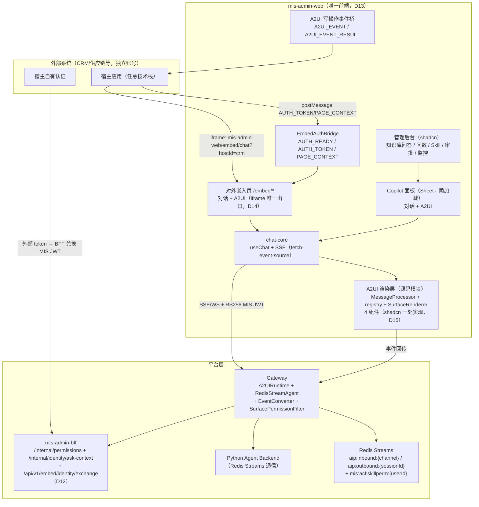
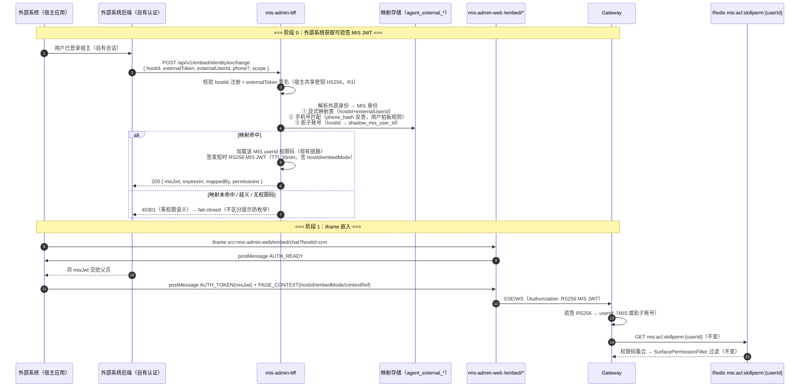

# A2UI 最终架构设计 — 单前端统一 + Gateway 完整中间件 + BFF 身份兑换 + /embed 出口

| 项目信息 | 内容 |
| --- | --- |
| 文档版本 | v2.0-final（最终收敛版，替代全部历史架构文档） |
| 作者 | 高见远（Gao，架构师） |
| 日期 | 2026-08-21 |
| 状态 | Ready for Engineering（最终权威） |
| 上游输入 | 三期迭代收敛：一期完整中间件 + 双前端 → 二期双形态出口 + 资产化 → 三期合并单前端统一；用户最终决策（单前端统一 / iframe 唯一出口 / 外部身份映射三级回退 + 手机号匹配规则 / 懒加载性能保障） |
| 口径基准 | 组件名 `approval-card / data-table / form-sheet / entity-select`、错误码 40301/40303/40304/40305/4004/40101、Redis key `mis:acl:skillperm:{userId}`（TTL 60s）、BFF `/internal/permissions`、catalogId `mis-a2ui-catalog-v1` —— 全部为最终口径，不随版本漂移 |
| 关联文档 | `02-task-breakdown.md`（任务分解）、`03-permission-design.md`（权限设计）、`04-open-source-reuse.md`（开源复用）、`README.md`（入口索引） |

> **本文件为自包含最终方案**：所有关键内容完整写入，不引用任何已删除的历史文档。历史演进（一期双前端、二期双形态/资产化）不再保留，仅在本文件 §8 决策摘要中记录"最终有效"状态。

---

## 1. 方案一句话 + 目标架构

### 1.1 方案一句话

**A2UI = 在 Gateway（TypeScript）中集成 `@ag-ui/a2ui-middleware` 完整中间件模式，让 AI Agent 通过结构化 UI 描述协议（A2UI v0.9）动态生成、增量更新、事件闭环的可交互界面**。最终形态：**mis-admin-web 为唯一前端（D13 单前端统一）**——自身业务（管理后台 + Copilot 面板）原生"对话 → 生成界面 → 交互"，对外嵌入收敛为 **iframe 唯一出口（D14，mis-admin-web `/embed/*` 路由）**；外部独立账号经 **BFF 身份兑换端点（D12）** 映射为 MIS userId 并签发短时 RS256 MIS JWT；权限完全对接 MIS 现有角色体系（RBAC 权限码 + KB ACL 双层模型，fail-closed）；视觉统一 shadcn（D15）；废弃 agent/frontend 独立前端（T11 退役清理）。

### 1.2 目标架构图



### 1.3 核心数据流概述

| 阶段 | 数据流 | 关键组件 |
| --- | --- | --- |
| 用户发消息 | 前端 → Gateway（WS/SSE）→ RedisStreamAgent → Redis Streams → Python | H5Adapter, MessageRouter, RedisStreamAgent |
| Agent 执行 | Python LLM 推理 → 调用 `render_a2ui` 工具 → 产出 AgentEvent 流 → Redis Streams | Python Backend |
| 事件拦截 | Gateway 订阅 Redis Streams → RedisStreamAgent 转为 `Observable<BaseEvent>` → A2UIMiddleware 拦截 | RedisStreamAgent, A2UIMiddleware |
| A2UI 生成 | 中间件检测 render_a2ui 工具调用 → 渐进提取组件 → 生成 ACTIVITY_SNAPSHOT（A2UI operations）→ 权限过滤 | A2UIMiddleware, SurfacePermissionFilter |
| 前端渲染 | Gateway → SSE/WS 推送 → 前端 MessageProcessor.processMessages → SurfaceModel 更新 → React 渲染 | H5Adapter, MessageProcessor |
| 用户操作回传 | 前端 A2uiClientAction → Gateway → forwardedProps.a2uiAction → 中间件 processUserAction → Python | SurfaceModel.dispatchAction, A2UIMiddleware |
| 写操作权限 | 前端写操作 → BFF API → ApiPermissionInterceptor 校验 → 403 内联展示 | BFF, bff-actions.ts |

---

## 2. 核心组件设计

### 2.1 RedisStreamAgent（D2：Redis Streams → AbstractAgent + Observable）

`@ag-ui/a2ui-middleware` 的 `A2UIMiddleware.run(input, next)` 要求 `next` 是 `AbstractAgent`。Gateway 将私有 Redis Streams 事件流适配为 AG-UI 协议：

- **扩展点依据**：AG-UI 官方 TS SDK 提供 `HttpAgent`（HTTP/SSE）与 `AbstractAgent`（自定义 transport 基类），**没有 Redis Streams transport**。本项目 Agent 在 Python 侧、经私有 Redis Streams 通信（`aip:inbound:{channel}` / `aip:outbound:{sessionId}`），Redis 队列是 MIS 存量基础设施，不能改为 HTTP 服务形态。因此按官方 Middleware Pattern 标准扩展点自研 RedisStreamAgent —— 这是"官方预留扩展点上的薄适配"，非造轮子。
- **rxjs 内生依赖**：`@ag-ui/client` 的 `AgentSubscriber` 本身是 RxJS-compatible observer，中间件 `run()` 签名即 `Observable<BaseEvent>`——rxjs 是 AG-UI 协议实现的内生依赖，显式声明 `rxjs@^7.8.1`。

```typescript
import type { AbstractAgent } from '@ag-ui/client';
import type { Observable } from 'rxjs';
import type { AgentEvent } from '../channels/ChannelCapability.js';
import type { Redis } from 'ioredis';
import type { RunAgentInput, BaseEvent } from '@ag-ui/client';

/**
 * AbstractAgent 适配器：将 Redis Streams 事件流包装为 AG-UI Observable<BaseEvent>。
 * 职责：
 * 1. 接收 RunAgentInput（已被中间件修改，含 render_a2ui 工具 + Schema）
 * 2. 序列化为 InboundMessage 写入 Redis Streams（发给 Python）
 * 3. 订阅 aip:outbound:{sessionId} 事件流
 * 4. 将每个 AgentEvent 转换为 BaseEvent，推入 Observable
 * 5. 收到 done 事件后 complete Observable
 */
export class RedisStreamAgent implements AbstractAgent {
  private readonly redis: Redis;
  private readonly sessionId: string;
  private readonly userId: string;

  constructor(params: { redis: Redis; sessionId: string; userId: string }) {
    this.redis = params.redis;
    this.sessionId = params.sessionId;
    this.userId = params.userId;
  }

  run(input: RunAgentInput): Observable<BaseEvent> {
    return new Observable<BaseEvent>((subscriber) => {
      const inboundMessage = this.serializeInput(input);
      this.sendToPython(inboundMessage).then(() => {
        this.subscribeToOutputStream(
          (baseEvent: BaseEvent) => subscriber.next(baseEvent),
          () => subscriber.complete(),
          (err: Error) => subscriber.error(err),
        );
      });
    });
  }

  private serializeInput(input: RunAgentInput): Record<string, unknown> { /* ... */ }
  private async sendToPython(message: Record<string, unknown>): Promise<void> { /* ... */ }
  private subscribeToOutputStream(
    onNext: (event: BaseEvent) => void,
    onComplete: () => void,
    onError: (err: Error) => void,
  ): void { /* ... */ }
}
```

### 2.2 EventConverter（AgentEvent ↔ BaseEvent 双向转换）

MIS 私有事件类型（`dispatch.trace`、`approval.request` 兼容、`ui.render` 迁移期映射）与字段命名（snake_case → camelCase）是存量协议；开源无此转换器，自研并保持 8 种事件映射的显式维护。

#### 事件映射表

| AgentEvent (Python/Gateway) | BaseEvent (AG-UI) | 方向 | 说明 |
| --- | --- | --- | --- |
| `text.delta` | `TEXT_MESSAGE_CHUNK` | Python → 前端 | `content` → `deltaText` |
| `tool.call` | `TOOL_CALL_START` + `TOOL_CALL_CHUNK` | Python → 中间件 | 中间件拦截 `render_a2ui` 工具调用 |
| `tool.result` | `TOOL_CALL_RESULT` | Python → 中间件 | 中间件补全 `render_a2ui` 结果 |
| `ui.render` | `ACTIVITY_SNAPSHOT`（兼容） | Python → 前端 | 迁移期兼容：旧 ui.render 转为 A2UI operations（@deprecated） |
| `approval.request` | `ACTIVITY_SNAPSHOT` | Python → 前端 | 审批卡片作为 A2UI Surface 渲染 |
| `dispatch.trace` | `CUSTOM`（type=dispatch.trace） | Python → 前端 | 自定义事件透传 |
| `error` | `RUN_ERROR` | Python → 前端 | 错误终止当前 run |
| `done` | `RUN_FINISHED` | Python → 中间件 | 触发中间件 flush pending A2UI |
| — | `RUN_STARTED` | 中间件生成 | run 开始时自动发出 |
| — | `ACTIVITY_SNAPSHOT` | 中间件生成 | A2UI Surface 操作（核心输出） |

#### EventConverter 核心接口

```typescript
export class EventConverter {
  /** AgentEvent → BaseEvent（方向 A，用于 RedisStreamAgent） */
  agentEventToBaseEvent(event: AgentEvent, runId: string): BaseEvent { /* switch 8 种类型 */ }

  /** BaseEvent → 前端 SSE/WS 消息格式（方向 B） */
  baseEventToFrontendMessage(event: BaseEvent): Record<string, unknown> {
    // ACTIVITY_SNAPSHOT → { type: 'a2ui_surface', operations: [...] }
    // TEXT_MESSAGE_CHUNK → { type: 'stream', content: '...' }
    // RUN_FINISHED → { type: 'done' }；RUN_ERROR → { type: 'error', message: '...' }
  }

  /** BaseEvent → AgentEvent（用于 H5Adapter.send 兼容） */
  toAgentEvent(event: BaseEvent): AgentEvent { /* ... */ }
}
```

### 2.3 A2UIRuntime 编排器

```typescript
export class A2UIRuntime {
  private readonly middleware: A2UIMiddleware;
  private readonly eventConverter: EventConverter;
  private readonly permissionFilter: SurfacePermissionFilter;
  private readonly redis: Redis;

  constructor(params: {
    redis: Redis;
    schema: A2UIMiddlewareConfig['schema'];
    permissionFilter: SurfacePermissionFilter;
  }) {
    this.redis = params.redis;
    this.permissionFilter = params.permissionFilter;
    this.eventConverter = new EventConverter();
    this.middleware = new A2UIMiddleware({
      schema: params.schema,                    // 组件 catalog（JSON Schema）
      injectA2UITool: true,                     // 自动注入 render_a2ui 工具
      a2uiToolNames: ['render_a2ui'],           // 拦截的工具名
      defaultCatalogId: 'mis-a2ui-catalog-v1',  // 默认 catalog ID（协议版本锚点）
      recovery: {
        maxAttempts: 3,                         // 最多 3 次重试（生成恢复循环）
        debugExposure: 'collapsed',
        showProgressTokens: true,
      },
    });
  }

  async runAgent(input: RunAgentInput, user: JwtClaims, h5Adapter: H5Adapter, sessionId: string): Promise<void> {
    const agent = new RedisStreamAgent({ redis: this.redis, sessionId, userId: user.userId });
    const eventStream: Observable<BaseEvent> = this.middleware.run(input, agent);

    eventStream.subscribe({
      next: (baseEvent: BaseEvent) => {
        const frontendMessage = this.eventConverter.baseEventToFrontendMessage(baseEvent);
        const filtered = this.permissionFilter.filter(frontendMessage, user.userId, sessionId);
        if (filtered != null) {
          void h5Adapter.send(this.eventConverter.toAgentEvent(baseEvent), sessionId);
        }
      },
      error: (err: Error) => {
        void h5Adapter.send({ type: 'error', errorCode: 'A2UI_RUNTIME', errorMessage: err.message }, sessionId);
      },
      complete: () => { /* RUN_FINISHED 已在流中 */ },
    });
  }
}
```

### 2.4 SurfacePermissionFilter（渲染权限过滤）

在 A2UI operations 下发前端前，遍历组件树检查 `requiredPermission`，无权限组件降级为占位 Text。详细设计见 `03-permission-design.md` §2。

```typescript
export class SurfacePermissionFilter {
  private readonly redis: Redis;
  private readonly bffInternalUrl: string;

  async filter(operations, userId, sessionId): Promise<Array<Record<string, unknown>>> {
    const permissions = await this.getUserPermissions(userId);
    // 遍历 updateComponents.components：有 requiredPermission 且不在集合 → makePermissionPlaceholder
    // 未声明 requiredPermission → 默认可见
  }
}
```

### 2.5 事件流协议（共享口径）

| 事件 | 用途 | 承载 |
| --- | --- | --- |
| AG-UI `BaseEvent` | 对话事件统一模型（text/tool/run 生命周期） | RedisStreamAgent → Observable → 中间件 |
| `ACTIVITY_SNAPSHOT` | A2UI 渲染指令（A2UI operations：createSurface/updateComponents/updateDataModel） | 中间件生成 → SSE/WS 推送前端 |
| `dispatch.trace` 自定义事件 | 技能分发/调试追踪（CUSTOM type=dispatch.trace 透传） | Python → 前端 |

---

## 3. 双 JWT 与身份链路（D6）

### 3.1 双 JWT 收敛为 RS256 唯一生产通道

| 通道 | 处置 | 说明 |
| --- | --- | --- |
| **RS256 MIS JWT** | ✅ **唯一生产通道** | mis-admin-web 自身登录 + 外部系统经 BFF 兑换端点签发，都走 RS256；Gateway 验签逻辑零新增 |
| **HS256 agent JWT** | ⏸ **仅过渡期保留**（agent/frontend 退役后无签发方） | 过渡期兼容存量 agent token；随 T11 清理任务移除 HS256 签发/消费（Gateway 验签函数可保留但不再有新签发） |

### 3.2 身份链路（不变）

```
token → Gateway 验签 → userId → Redis mis:acl:skillperm:{userId}（TTL 60s）
                              → 未命中 → BFF /internal/permissions 反查 → 回填缓存
```

- **D6 链路完全不变**：变化的只是"token 的来源"（mis-admin-web 自身登录 vs 外部兑换端点）。
- **P4 身份不受信**：A2UI 工具/请求中的 userId 一律不可信，身份只来自 JWT 验签结果；Gateway/BFF 一律忽略消息体内的 userId。

---

## 4. D12 外部身份兑换端点（完整设计）

### 4.1 问题定义与方案选择

外部系统（CRM/供应链等）用户有**独立账号体系**（不一定是 MIS 用户），只是借用 AI 能力。而权限码体系以 **MIS userId** 为维度。因此必须解决"外部 user → MIS userId"的映射，且映射结果必须 fail-closed。

| # | 方案 | 结论 |
| --- | --- | --- |
| ① | **BFF 外部身份兑换端点**（`POST /api/v1/embed/identity/exchange`）：外部系统用自己密钥签外部 token → BFF 校验 + 映射到 MIS userId → 签发短时 RS256 MIS JWT → Gateway 按既有 RS256 路径走 D6 | ✅ **推荐（D12）**：Gateway 零改造；映射逻辑集中在 BFF（权限事实源侧）；P4 身份不受信最易落地 |
| ② | 保留 agent JWT（HS256）通道由嵌入页消费 | ❌ 不推荐：外部 CRM 用户根本没有 MIS 账号，username+channel 反查必然失败；HS256 通道随 agent/frontend 退役无签发方 |
| ③ | 独立身份解析服务 | ❌ 不推荐（P2 再评估）：重资产，本期仅一个入口，收益不成比例 |

### 4.2 兑换流程时序图



### 4.3 兑换端点契约

```jsonc
// POST /api/v1/embed/identity/exchange
// 请求（外部系统后端 → BFF，内网/HTTPS + 宿主共享密钥签名）
{
  "hostId": "crm-web",
  "externalToken": "<HS256 JWT，由宿主用 client_secret 签发>",
  // 解码后 payload：
  // { "iss": "crm-web", "appId": "crm-web", "externalUserId": "crm-00123",
  //   "phone": "13800138000", "iat": 1724230000, "exp": 1724231800 }
  "externalUserId": "crm-00123",   // 冗余字段，以 token 内为准（P4）
  "phone": "13800138000",          // 冗余字段，以 token 内为准（P4）
  "scope": ["agent:chat:use", "ai:skill:mis-rag:run"]   // 可选：申请的最小权限范围
}

// 成功响应（v1.1 增加 mappedBy，脱敏展示）
{
  "code": 0,
  "data": {
    "misJwt": "<RS256 MIS JWT，TTL 1800s>",
    "expiresIn": 1800,
    "mappedUserId": "u_10086",           // 脱敏展示
    "mappedBy": "phone",                 // explicit | phone | shadow
    "permissions": ["agent:chat:use", "ai:skill:mis-rag:run"]
  }
}

// 失败响应（复用错误码口径）
{ "code": 40101, "message": "外部身份令牌无效" }                      // 新增 40101 EMBED_TOKEN_INVALID
{ "code": 40301, "message": "外部身份未映射，零权限", "missingPermissions": [] }  // 表未命中/手机号未命中/多账号/影子未配 → fail-closed
{ "code": 40303, "message": "权限源不可用" }                          // fail-closed（复用）
```

### 4.4 三级映射回退

| 优先级 | 策略 | 说明 | 权限码 |
| --- | --- | --- | --- |
| ① | **显式映射表**（细粒度） | `agent_external_identity` 命中（hostId + externalUserId → misUserId）→ 该 MIS 用户权限码 | 按映射用户现有 RBAC |
| ② | **手机号匹配**（无表可查时） | token 内 `phone_hash` 反查 MIS `sys_user`（正常状态账号计数，规则见 4.6） | 按反查用户现有 RBAC |
| ③ | **影子账号**（粗粒度默认） | 未映射且宿主配置了 `shadow_mis_user_id` → 影子服务账号 | 影子账号在 `sys_user_role` 配置最小权限（默认仅 `agent:chat:use` + 指定技能码） |
| 兜底 | 任一级未命中 / 歧义 | **40301 零权限**（fail-closed，不区分提示） | 无 |

> **回退前提**：三级映射都以"外部系统自签 token 验签通过（R1）"为前提；BFF 先验外部系统身份（hostId 注册 + client_secret 验签），之后手机号才被用作匹配键。

### 4.5 安全红线（R1-R6，写死，工程强制）

| # | 红线 | 说明 |
| --- | --- | --- |
| R1 | **绝不单独凭"手机号 + app"签发 token** | 手机号是弱标识（可猜测/可撞库）。请求必须携带外部系统**自己密钥签名**的 `externalToken`（含 appId/hostId + externalUserId + phone），BFF 先验签证明"这是合法 CRM/供应链系统"，之后手机号才被用作匹配键 |
| R2 | **手机号只做匹配键，不做身份声明** | 兑换出的 MIS JWT 的 userId 只来自映射结果（MIS 用户/影子账号），不包含手机号；后续权限走 D6 反查，fail-closed 不变 |
| R3 | **手机号不落明文日志** | 日志只记脱敏号（`138****1234`）或 `phone_hash`；错误响应不返回手机号 |
| R4 | **歧义一律 fail-closed** | 手机号查无此人 / 多账号命中 / 手机号未绑定 → **全部返回 40301 且不区分提示**（防外部枚举账号）；多账号命中视为映射歧义，宁可拒绝不猜 |
| R5 | **脱敏存储 + 隐私合规** | 数据库只存 `phone_hash`（sha256(phone + salt)）+ 可选 AES-GCM 密文（用于未来变更，P1）；遵守《个人信息保护法》（PIPL）：外部系统上报手机号需确保已获用户授权/告知，BFF 不对外暴露手机号明文 |
| R6 | **兑换仍限流 + 审计** | 手机号匹配路径同样按 hostId + client_id 限流（防撞库）；审计记录 `hostId + externalUserId + mappedBy + 脱敏号` |

### 4.6 手机号匹配规则（用户已拍板，最终版）

- MIS 侧 `sys_user` **允许**存在"一手机号多账号"历史数据，**不要求业务侧清理**。
- 反查 MIS 用户，按"**正常状态**账号"计数（正常状态 = 非停用/非删除状态）：
  - **= 1** 个正常状态账号 → 映射该用户；
  - **> 1** 个正常状态账号 → **一律 40301**（歧义兜底，不区分提示防枚举）；
  - **= 0** 个正常状态账号（查无此人 / 全部停用或删除 / 手机号未绑定）→ **同样 40301**。
- **由歧义兜底而非数据清理保证安全**；fail-closed 且不区分提示（防枚举）。
- **不进入影子账号回退**：手机号匹配失败（歧义/查无）不降级到影子账号，直接 40301。
- 实现约定：`sys_user` 状态字段按现有语义判定；BFF 手机号反查 SQL 必须带状态过滤，计数 > 1 即拒绝。
- 影子账号与手机号匹配优先级：**手机号命中优先级高于影子账号**（命中即映射该真实用户）；若业务更希望外部系统统一用影子账号，可配置 host 级开关 `phone_match_enabled`（默认 true）。

### 4.7 映射存储设计（最小新增）

```sql
-- 宿主注册表（每外部系统一条）
CREATE TABLE agent_external_host (
  host_id            VARCHAR(64) PRIMARY KEY,      -- 'crm-web'
  host_name          VARCHAR(128),
  client_id          VARCHAR(64)  NOT NULL,
  client_secret_hash VARCHAR(128) NOT NULL,        -- 仅存哈希（泄露面最小）
  allowed_origins    JSON         NOT NULL,        -- iframe 白名单（继承 VITE_PARENT_ORIGINS 语义）
  shadow_mis_user_id VARCHAR(64),                  -- 影子账号（粗粒度默认）
  status             VARCHAR(16)  DEFAULT 'active',
  created_at         TIMESTAMP
);

-- 外部用户 → MIS 用户 显式映射（细粒度可选；含手机号匹配键）
CREATE TABLE agent_external_identity (
  host_id           VARCHAR(64)  NOT NULL,
  external_user_id  VARCHAR(128) NOT NULL,
  external_username VARCHAR(128),
  mis_user_id       VARCHAR(64)  NOT NULL,
  phone_hash        VARCHAR(64),                  -- sha256(phone + salt)，匹配键（非唯一）
  phone_enc         VARCHAR(512),                 -- AES-GCM 密文（P1 可选，用于手机号变更时回显/重算）
  status            VARCHAR(16)  DEFAULT 'active',
  created_at        TIMESTAMP,
  PRIMARY KEY (host_id, external_user_id)
);

-- 普通索引（非唯一）：按 phone_hash 快速反查，允许一手机号多行（用户拍板：不清理历史数据）
CREATE INDEX idx_external_identity_phone ON agent_external_identity(phone_hash)
  WHERE phone_hash IS NOT NULL;
```

### 4.8 与双 JWT 验签的衔接

| 通道 | 处置 | 说明 |
| --- | --- | --- |
| **RS256 MIS JWT** | ✅ 保留，成为唯一生产通道 | mis-admin-web 自身 + 外部系统兑换后的身份都走 RS256；Gateway 验签逻辑零新增 |
| **HS256 agent JWT** | ⏸ 过渡期保留验签能力，agent/frontend 退役后无签发方 | 随 T11 清理任务移除 HS256 签发/消费 |

**衔接结论**：D6 的 `token → userId → BFF /internal/permissions 反查` 链路**完全不变**——变化的只是"token 的来源"。

---

## 5. /embed/* 嵌入出口设计（D14，iframe 唯一出口）

### 5.1 路由与入口

| 路由 | 说明 |
| --- | --- |
| `/embed/chat?hostId={hostId}` | 完整对话 + A2UI 嵌入页（主入口） |
| `/embed/chat/:sessionId?hostId={hostId}` | 续接指定会话（配合多宿主会话隔离） |
| （可选）`/embed/approval/:id?hostId={hostId}` | 单审批卡片嵌入（P1，若业务需要） |

- **独立构建入口**：Vite 多页构建，`embed.html` 为嵌入页入口（不加载管理后台导航/侧边栏/全局布局），控制嵌入页体积并隔离管理 UI 暴露面。
- **嵌入页只暴露"对话 + A2UI 渲染"**，不暴露管理后台导航、系统管理 API、用户列表等（外部用户只能获得其映射身份权限内的能力，fail-closed）。

### 5.2 postMessage 协议（EmbedAuthBridge）

```
【继承】AUTH_READY / AUTH_TOKEN / PAGE_CONTEXT（白名单校验不变）
【扩展】PAGE_CONTEXT 增加 hostId / embedMode / contextRef / sessionHint
【写操作事件桥】A2UI_EVENT（iframe → 父页）/ A2UI_EVENT_RESULT（父页 → iframe）
```

**协议消息格式**：

```jsonc
// iframe → 父页：写操作事件透出
{
  "type": "A2UI_EVENT",
  "eventId": "evt_8f3a...",                    // 关联 ID，父页回包必带
  "event": {
    "name": "approve",                          // 操作名（与 actionApiMap key 一致）
    "componentName": "approval-card",
    "payload": { "approvalId": "WO-1234", "decision": "approved" }
  },
  "meta": { "sessionId": "sess-abc123", "hostId": "crm-web" }
}

// 父页 → iframe：执行结果回传
{
  "type": "A2UI_EVENT_RESULT",
  "eventId": "evt_8f3a...",
  "ok": true,
  "data": { "result": "approved" },
  "error": { "code": 40301, "message": "权限不足", "missingPermissions": ["approval:decide"] }
}
```

**桥接原则**：
- 只有**写操作类** A2UI 事件需要桥接到父页（由父页用自己会话调自己的 BFF，权限边界最清晰）；**回传 Agent 类**事件（`entity-select.confirm`、表单"下一步"）直接在 iframe 内走 Gateway `dispatchAction`，无需父页参与；**Surface 增量同步**不经过 iframe 边界（走 Gateway 广播）。
- 桥接实现：iframe 侧 `src/embed/embed-bridge.ts`（`postA2uiEvent()` / `onA2uiEventResult()`），资产内 `bffAdapter` 的 iframe 默认实现 = 事件桥。
- **为何默认事件桥而非 iframe 直调 BFF**：① 不要求宿主 BFF 对 agent 前端域开放 CORS；② 写操作 100% 由宿主用自己的会话执行（P4 最易落地）；③ 与组件化 `onEvent` 回调对称。直调 BFF 作为备选，P1 提供开关。

### 5.3 白名单与安全

- `VITE_PARENT_ORIGINS` 环境变量声明父域白名单；`EmbedAuthBridge` 对非白名单 origin 的 postMessage 拒绝并 `console.warn`。
- `allowed_origins`（`agent_external_host` 表）继承 `VITE_PARENT_ORIGINS` 语义，iframe 白名单双保险。
- token 不可验签 → 明确拒绝 + 告警日志（补充"不可验签"拒绝，非白名单拒绝已有）。
- iframe sandbox（`allow-scripts allow-same-origin` 按需）+ CSP 收紧；所有 API 仍走 BFF 拦截器 fail-closed。

### 5.4 外部系统接入最小示例

```html
<!-- CRM 系统页面（父页） -->
<iframe
  id="ai-embed"
  src="https://mis.example.com/embed/chat?hostId=crm-web"
  style="width:420px;height:640px;border:0"
></iframe>

<script>
  const frame = document.getElementById('ai-embed');
  window.addEventListener('message', async (e) => {
    if (e.origin !== 'https://mis.example.com') return;   // 校验 agent 侧 origin
    const { type } = e.data || {};

    if (type === 'AUTH_READY') {
      // 宿主后端用自己的会话调 BFF 兑换 MIS JWT（见 §4.3）
      const { misJwt } = await fetch('/bff-proxy/embed/exchange', {
        method: 'POST',
        body: JSON.stringify({ externalUserId: currentUser.id }),
      }).then(r => r.json());

      frame.contentWindow.postMessage({ type: 'AUTH_TOKEN', token: misJwt }, 'https://mis.example.com');
      frame.contentWindow.postMessage({
        type: 'PAGE_CONTEXT',
        context: {
          route: '/crm/opportunity/123',
          module: 'crm',
          title: '商机详情',
          hostId: 'crm-web',
          embedMode: 'iframe',
          contextRef: { orgId: '1001', storeId: '88' },
        },
      }, 'https://mis.example.com');
    }

    // 写操作事件桥（可选监听；宿主用自己的会话调自己的 BFF）
    if (type === 'A2UI_EVENT') {
      const result = await callOwnBff(e.data.event);          // 宿主实现
      frame.contentWindow.postMessage(
        { type: 'A2UI_EVENT_RESULT', eventId: e.data.eventId, ...result },
        'https://mis.example.com',
      );
    }
  });
</script>
```

### 5.5 多宿主会话隔离（R47）

| 概念 | 设计 |
| --- | --- |
| **sessionId** | 会话唯一标识（iframe 由 mis-admin-web 生成或父页 `sessionHint` 传入） |
| **hostId** | 宿主标识（如 `crm-web` / `supply-chain-web` / `mis-admin-web`），标识"端"不标识"会话" |
| **连接注册表** | Gateway H5Adapter：`sessionConnections: Map<sessionId, Set<{ hostId, clientId, mode }>>` |
| **Surface 同步** | 同 sessionId 的多端连接：一端 A2UI 操作 → Agent 增量更新 → Gateway 向该 sessionId **所有连接**广播 operations → 各端独立 `MessageProcessor.processMessages`（前端持有 SurfaceModel，天然自愈） |
| **离线恢复** | Gateway 缓存最近 N 条 A2UI operations（Redis List），重连时重放 |
| **Redis key** | 权限缓存 `mis:acl:skillperm:{userId}` 与 hostId 无关（权限只认 userId），**不变** |

---

## 6. 渲染层设计（@a2ui/web_core + shadcn 4 组件）

### 6.1 技术栈

| 包 | 版本 | 职责 |
| --- | --- | --- |
| `@a2ui/web_core` | ^0.9.0 | SurfaceModel + DataModel + MessageProcessor + Zod schema + 路径双向绑定 |
| `@preact/signals-core` | ^1.5.0 | 响应式信号（web_core 依赖） |
| shadcn 全家桶（@radix-ui/* 原子 + cva/clsx/tailwind-merge + tailwind + lucide-react） | 现有 | D15 视觉基线统一；4 组件原子件来源 |
| `@tanstack/react-table` | P1 引入 | data-table 免自研分页/排序（shadcn 官方 data-table 模式） |
| `@a2ui/react` | 0.9.1（P1 验证） | 评估替换自研 SurfaceRenderer 骨架（A2uiSurface + Generic Binder） |
| `@microsoft/fetch-event-source` | 现有 | chat-core SSE 底层（POST + Last-Event-ID + 自动重连） |
| zustand | 现有 | chat-store / embed-store 状态 |

### 6.2 4 个组件（shadcn 一处实现，双场景复用）

| 组件名 | 渲染权限码 | 操作权限码 | shadcn 原子件 |
| --- | --- | --- | --- |
| `approval-card` | `approval:view` | `approval:decide`（通过/驳回） | Card + Button + Badge |
| `data-table` | —（默认可见） | —（只读） | Table + TanStack Table（P1） |
| `form-sheet` | —（默认可见） | `form:submit`（提交） | Form + Sheet + Input/Select |
| `entity-select` | —（默认可见） | —（回传 Agent，非 BFF 写操作） | Select + Dialog + Command |

- **单实现双端复用**：4 组件在 mis-admin-web **以 shadcn 实现一份**，两个消费场景：① 自身业务（审批中心页 approval-card、问数页 data-table、Copilot 面板 form-sheet 等）直接 import `src/components/a2ui/components/*`；② 嵌入场景（`/embed/*` 嵌入页）同一份组件（嵌入页与 Copilot 面板共用 `chat-core` + `a2ui` 模块）。
- **合并红利**：不再需要"双端视觉各异但协议同构"的协调成本——协议与视觉同属一个代码库，天然一致。

### 6.3 registry 单前端一份（D10 修订版）

- **registry 单前端一份**：mis-admin-web 源码模块（`src/components/a2ui/registry.ts`），**不发布 npm 包**；随 mis-admin-web 版本发布。
- **与 Gateway `SHARED_CATALOG`（catalog.ts）对齐**：组件名 / requiredPermission / actionApiMap 严格一致（R43 对齐协议不变），不一致时 Gateway 权威优先。
- **D5 双层声明**：前端 registry 声明 `requiredPermission`（UX 层，可篡改仅影响显示），Gateway catalog 为**权威源**（防伪造，下发以 Gateway 为准）——完整机制见 `03-permission-design.md` §4。

### 6.4 catalogId 协议版本锚点

- **catalogId: `mis-a2ui-catalog-v1`** 为协议版本锚点：前端 registry 与 Gateway catalog 的版本对齐承诺（对外 iframe 协议版本）。
- **资产 major ↔ Gateway catalog major 必须匹配**（semver：minor 兼容 / major 破坏）；消费方锁定版本。
- Gateway `A2UIMiddlewareConfig.defaultCatalogId = 'mis-a2ui-catalog-v1'`。

### 6.5 P1 验证项

- `@a2ui/react@0.9.1` 官方 React 渲染器（A2uiSurface + Generic Binder + basicCatalog）评估替换自研 SurfaceRenderer 骨架；**4 组件 catalog + 权限门控不变**（业务 catalog 与渲染骨架解耦，换不换不影响组件与权限）。
- T06' 实施前做 1 页技术验证（React 18 兼容性、与 `@a2ui/web_core@^0.9.0` peer 匹配）。

---

## 7. 懒加载性能设计

### 7.1 现状事实

mis-admin-web **当前零懒加载**：无 `React.lazy`，全部静态 import，30+ agent 相关文件已进入主 bundle。合并 chat-core + A2UI 渲染层 + 5 存量页后，若不干预，主 bundle 会显著膨胀、首屏变慢——**必须干预**。

### 7.2 懒加载策略

| # | 策略 | 实现 | 对应任务 |
| --- | --- | --- | --- |
| 1 | **Copilot 面板按需加载** | chat-core + A2UI 渲染层整体包入 `CopilotPanel` 动态 import：`lazy(() => import('@/components/chat/CopilotPanel'))`；**Sheet 打开才拉包**（关闭不加载） | T06' |
| 2 | **存量页路由级懒加载** | 知识库问答 / 问数 / Skill / 审批 / 监控 5 页 `React.lazy + Suspense`（每路由独立 chunk） | T09 / T10 |
| 3 | **Vite 多页 admin/embed 双入口** | `index.html`（管理后台，不静态 import 对话包）+ `embed.html`（嵌入页，只含对话 + A2UI 独立 bundle）；外部系统 iframe 只拉 embed 包 | T07' |
| 4 | **modulepreload 预热（P1）** | 管理后台空闲时 `prefetch` Copilot 面板 chunk（`<link rel="modulepreload">` 或动态 `import()` 预热），打开 Sheet 秒开 | T06'（P1） |
| 5 | **CI 体积断言** | 构建产物大小断言：超阈值**构建失败** | T06' |

### 7.3 验收阈值表（gzip）

| 指标 | 验收阈值（gzip） | 说明 |
| --- | --- | --- |
| **首屏主 bundle gzip 增量**（合并后 vs 合并前基线） | **≤ 80KB** | 对话 + A2UI 全部移出主 bundle 后，首屏几乎不增长（仅路由壳 + 少量共享 util） |
| **Copilot 面板分包 gzip**（Sheet 打开才加载） | **≤ 120KB** | chat-core + A2UI 渲染层 + 4 组件 + kb-sources 全部在此 chunk |
| **存量页单路由分包 gzip** | **≤ 80KB/页** | 知识库 / 问数 / Skill / 审批 / 监控各自独立 chunk |
| **embed 入口 bundle gzip** | **≤ 150KB** | 只含对话 + A2UI + 事件桥，不含管理后台布局/菜单/系统管理代码 |
| **Sheet 打开到可交互** | **≤ 500ms**（本地/内网缓存命中） | 懒加载 + modulepreload 预热 |

> **口径**：阈值以 gzip 后体积为准（与现有 CI 口径对齐）；若某页超阈值，允许拆子 chunk（如 kb-sources 独立 chunk）但总包不得超限；embed 入口需在 T07' 联调时用真实构建产物复核。

---

## 8. 决策摘要表（只列最终有效决策）

> 历史决策（D3/D4/D7 旧表述、D8 双形态、D9 组件化、D10 npm 资产包、二期双前端）已收敛/搁置，不再作为有效决策列出；被取代的旧表述（如 D4 mis-admin-web 混合连接路径中的 iframe、D7 双前端 SurfaceModel 持有）以最终方案为准。

| # | 决策 | 内容 | 状态 |
| --- | --- | --- | --- |
| **D1** | 中间件运行位置 = Gateway（TypeScript） | `agent/ai-platform/gateway` 集成 `@ag-ui/a2ui-middleware@0.0.10`——自动注入 render_a2ui 工具 + 组件 schema + LLM 指南 + 流式拦截 + 生成恢复循环 + 用户操作回传 | 最终有效 |
| **D2** | Agent 适配 = RedisStreamAgent | Redis Streams 事件流 → AG-UI `AbstractAgent` + `Observable<BaseEvent>`（官方 Middleware Pattern 标准扩展点；AG-UI 无 Redis transport，HttpAgent 仅有 HTTP/SSE） | 最终有效 |
| **D5** | 权限码声明 = 前端 registry + Gateway 权威过滤 | 单前端 registry 声明 requiredPermission（UX 层），Gateway `SHARED_CATALOG`（catalog.ts）为权威源（防伪造，下发以 Gateway 为准）；`catalogId: mis-a2ui-catalog-v1` 协议版本锚点（资产 major ↔ Gateway catalog major 匹配） | 最终有效 |
| **D6** | 身份链路 = token → userId → BFF 反查 | `token → Gateway 验签 → userId → Redis mis:acl:skillperm:{userId}`（TTL 60s）→ 未命中 → BFF `/internal/permissions` 反查 → 回填缓存；P4 身份不受信（A2UI 工具/请求中 userId 不可信） | 最终有效 |
| **D8 修订** | 共享内核归属 mis-admin-web 源码模块 | chat-core + A2UI 渲染层仍为共享内核，但归属 mis-admin-web 源码模块（不再随 agent/frontend 资产发布）；"双形态"收敛为"单前端双场景"（自身业务页 + `/embed/*` 嵌入页共用同一内核） | 最终有效 |
| **D10 修订** | 渲染层 = mis-admin-web 源码模块 | **npm 资产包（`@mis/a2ui-renderer`）不再发布**；registry 单前端一份；catalogId 锚点保留（前端 registry ↔ Gateway catalog 版本对齐） | 最终有效 |
| **D11** | 存量页原生化优先级 | 知识库问答 → 问数 → 审批 → Skill → 监控；分批交付（T09/T10）；**逻辑迁移而非新写**（agent/frontend 现有页面 + agentRole.ts 技能分发迁入，shadcn 统一） | 最终有效 |
| **D12** | 外部身份映射 = BFF 兑换端点 | 外部独立账号经 `POST /api/v1/embed/identity/exchange` 兑换短时 RS256 MIS JWT（TTL 30min）；映射链**三级回退**：① 显式映射表 → ② 手机号匹配（phone_hash 反查）→ ③ 影子账号；未命中/歧义一律 40301 fail-closed；安全红线 R1-R6；`mappedBy` 审计 | 最终有效 |
| **D13** | 单前端统一 | agent/frontend 退役，mis-admin-web 为唯一前端 + 唯一对外出口（`/embed/*`）；双 JWT 收敛为 RS256 唯一生产通道（HS256 过渡后下线） | 最终有效 |
| **D14** | iframe 为唯一外部嵌入形态 | 组件化封装（`<A2uiChatWidget>` / `<mis-a2ui-chat>`）**搁置 P2**；嵌入协议（AUTH_READY/AUTH_TOKEN/PAGE_CONTEXT + A2UI_EVENT/A2UI_EVENT_RESULT）承载于 mis-admin-web `/embed/*`；`VITE_PARENT_ORIGINS` 父域白名单；多宿主会话隔离（sessionId + hostId 广播） | 最终有效 |
| **D15** | 视觉基线统一 shadcn | 所有迁入组件（chat/kb-sources/4 A2UI 组件/存量页）统一 shadcn 视觉，废弃 agent/frontend Tailwind + surface-muted 自有设计 | 最终有效 |
| **手机号匹配规则** | 用户已拍板 | MIS sys_user 允许"一手机号多账号"历史数据不清理；反查按**正常状态账号**计数：=1 映射该用户；>1 一律 40301；=0（查无此人/全停用/未绑定）同样 40301；fail-closed 且不区分提示（防枚举）；**不进入影子账号回退** | 最终有效（用户决策） |

---

## 9. Anything UNCLEAR

| # | 不确定点 | 假设 / 待确认 |
| --- | --- | --- |
| 1 | Python 后端是否能识别 AG-UI 工具定义格式 | 假设 Gateway 的 RedisStreamAgent 在序列化 InboundMessage 时，将 AG-UI Tool 定义转换为 Python 后端可识别的格式（JSON Schema function calling）。若 Python 后端不支持动态工具注入，需在 Python 侧增加 render_a2ui 工具注册 |
| 2 | Redis Streams 中 AgentEvent 的序列化格式 | 假设使用 JSON 序列化（与现有 `StreamProducer.produce` 一致）。需确认 Python 后端产出的 AgentEvent 是否包含 AG-UI 所需的 `messageId` / `toolCallId` 等字段，如不包含需在 EventConverter 中补充生成 |
| 3 | 外部系统是否接受"先调 BFF 兑换、再 postMessage 推 MIS JWT"的接入方式？ | 假设外部系统后端可调用 BFF 兑换端点（内网/HTTPS）；若宿主前端直连受限，可提供 mis-admin-web embed 页内代理兑换（P1） |
| 4 | 影子账号的权限码基线由谁配置？外部系统申请的 scope 与影子账号权限如何取交集？ | 假设 scope ⊆ 影子账号权限码（服务端强制），由 BFF 兑换时校验并裁剪；待与业务确认各外部系统的权限需求 |
| 5 | 迁移期间 agent/frontend 与 mis-admin-web `/embed/*` 是否要求协议级完全等价？ | 假设协议（AUTH_READY/AUTH_TOKEN/PAGE_CONTEXT/A2UI_EVENT）完全等价，外部系统零改动切换 |
| 6 | `40101 EMBED_TOKEN_INVALID` 错误码是否需在 Java `AgentOpsErrorCodes` 登记并纳入全局异常处理？ | 假设是（与 40304/40305/4004 同批登记，见 `03-permission-design.md` §3.3） |
| 7 | 懒加载阈值是否纳入工程验收（CI 硬性）：体积超限是否构建失败？ | 假设纳入 T06'/T07' 验收标准并在 CI 断言；若团队认为太严，可先"告警不阻断"一期 |
| 8 | 组件 Catalog 的版本管理 | 假设使用固定 catalogId（`mis-a2ui-catalog-v1`），组件变更通过 catalog 内容更新（非 ID 变更）。需确认 LLM 缓存策略是否影响 catalog 更新的及时性 |
