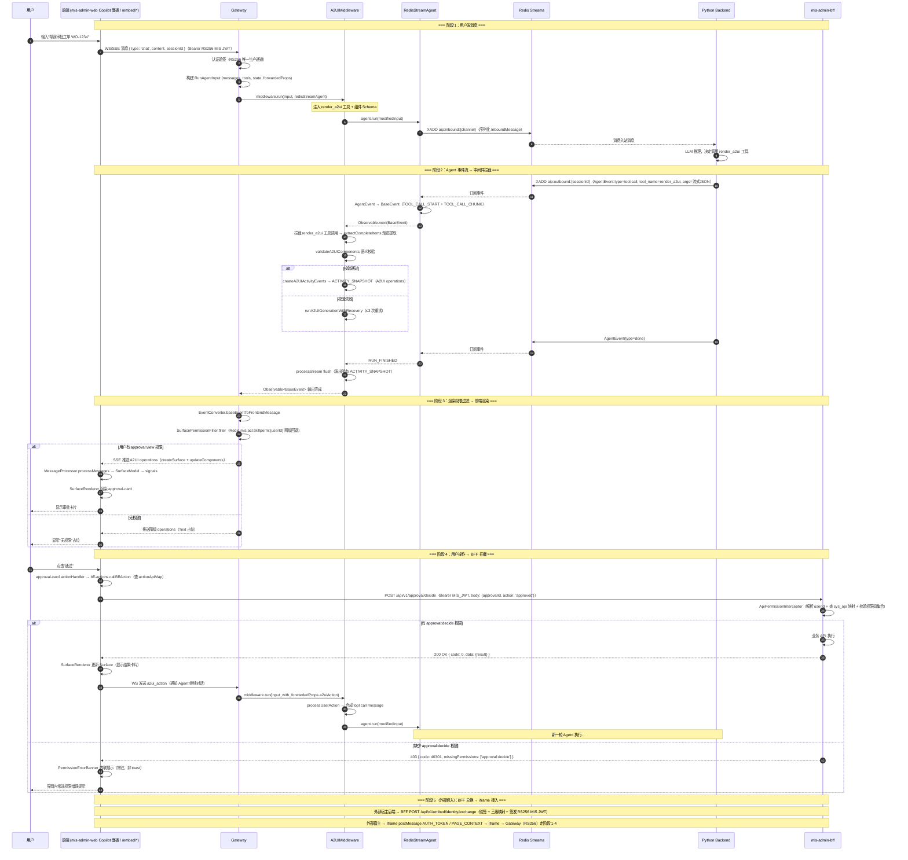
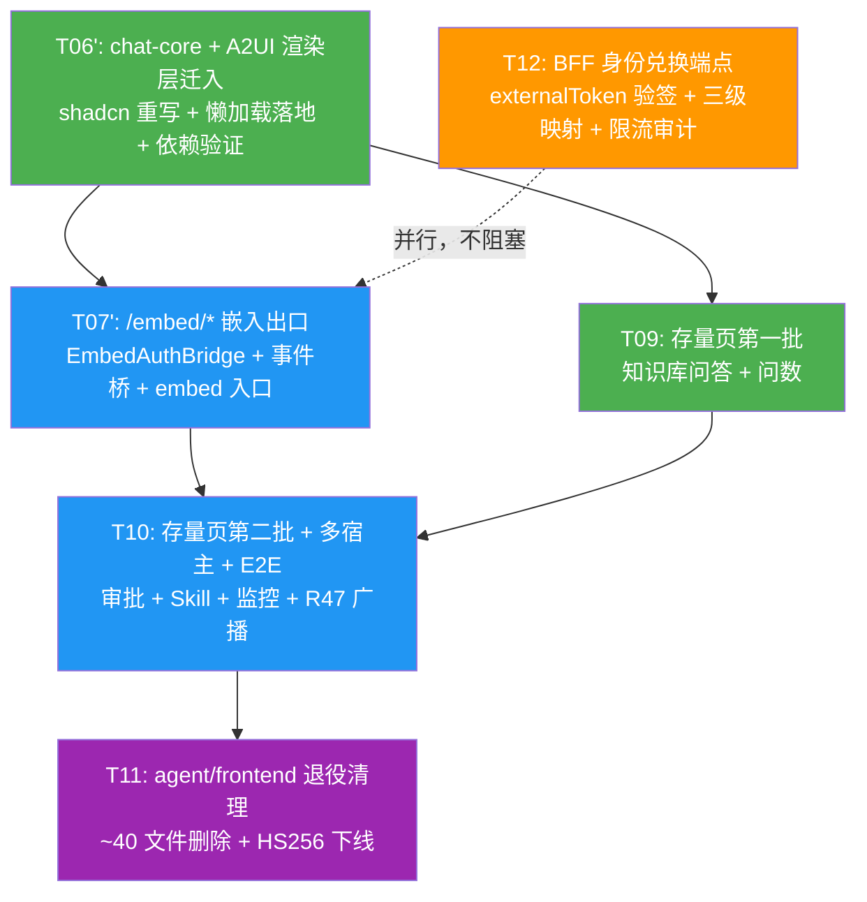

# A2UI 最终任务分解 — T06'/T07'/T12/T09/T10/T11 + 模块×功能×文件矩阵

| 项目信息 | 内容 |
| --- | --- |
| 文档版本 | v2.0-final（最终收敛版，替代全部历史任务文档） |
| 作者 | 高见远（Gao，架构师） |
| 日期 | 2026-08-21 |
| 状态 | Ready for Engineering（最终权威） |
| 上游输入 | `01-architecture.md`（最终架构设计）、`03-permission-design.md`（最终权限设计）、`04-open-source-reuse.md`（开源复用） |
| 口径基准 | 任务编号 **T06'/T07'/T12/T09/T10/T11 为最终编号**（历史 T01-T05 / T06-T10 中间形态一律不使用）；懒加载阈值、错误码、Redis key、catalogId、BFF 端点全部引用最终口径 |

> **任务链（最终，以此为准）**：
> ```
> T06'（chat-core + A2UI 渲染层迁入 mis-admin-web）
>   ↓
> T07'（/embed/* 嵌入出口） ∥ T12（BFF 身份兑换端点）
>   ↓
> T09（存量页第一批：知识库问答 + 问数）→ T10（第二批：审批 + Skill + 监控 + 多宿主同步 + E2E）
>   ↓
> T11（agent/frontend 退役清理）
> ```

---

## 1. 任务列表

### T06': chat-core + A2UI 渲染层迁入 mis-admin-web（shadcn 重写 + 懒加载落地）

| 属性 | 值 |
| --- | --- |
| **Task ID** | T06' |
| **Task Name** | chat-core + A2UI 渲染层迁入 mis-admin-web（shadcn 重写 + 懒加载落地 + tanstack/jose/@a2ui/react 验证） |
| **Source Files** | 见 §2 矩阵"mis-admin-web 迁入文件"中的 chat / a2ui / 懒加载 / 依赖组 |
| **Dependencies** | 一期基础设施已就绪（Gateway @ag-ui/a2ui-middleware + RedisStreamAgent 等为前置平台能力，不在本任务范围） |
| **Priority** | P0 |

**工作内容**：

1. **对话内核迁移**：agent/frontend `src/chat-core/`（useChat.ts / sse-client.ts / types.ts）迁入 mis-admin-web `src/lib/chat/`，认证改为 RS256 MIS JWT；SSE 底层复用 `@microsoft/fetch-event-source`，状态复用 zustand。
2. **A2UI 渲染层迁移 + shadcn 重写**：`src/lib/a2ui/`（MessageProcessor / SurfaceRenderer / registry / types）+ `src/components/a2ui/`（A2uiProvider / SurfaceRenderer / registry / A2uiPermissionGate / PermissionErrorBanner / components/4 组件）+ `bff-actions.ts`；4 组件（approval-card / data-table / form-sheet / entity-select）以 shadcn 实现一份。
3. **Copilot 面板重写 + 懒加载**：`copilot-panel.tsx` 废弃 iframe，原生 Sheet + ChatShell + SSE 直连 Gateway；chat-core + A2UI 渲染层整体包入 `CopilotPanel` 动态 import（Sheet 打开才拉包）；modulepreload 预热（P1）。
4. **P1 依赖引入与验证**：引入 `@tanstack/react-table`（data-table 分页/排序，避免返工）；Gateway JWT 统一 `jose`（收敛 crypto-js——crypto-js 不支持 RSA，RS256/HS256 一套 API）；T06' 实施前做 1 页技术验证评估 `@a2ui/react@0.9.1` 替换自研 SurfaceRenderer 骨架（4 组件 catalog + 权限门控不变）。
5. **CI 体积断言**：构建产物大小断言，超阈值构建失败。

**验收标准（懒加载阈值，gzip）**：
- 首屏主 bundle gzip 增量 ≤ 80KB；
- Copilot 面板分包（Sheet 打开才拉）≤ 120KB；
- Sheet 打开到可交互 ≤ 500ms（缓存命中，modulepreload 预热）。

### T07': /embed/* 嵌入出口

| 属性 | 值 |
| --- | --- |
| **Task ID** | T07' |
| **Task Name** | /embed/* 嵌入出口（EmbedAuthBridge 迁移 + A2UI_EVENT 事件桥 + embed 独立入口） |
| **Source Files** | `src/embed/EmbedAuthBridge.tsx`、`src/embed/embedStore.ts`、`src/embed/embed-bridge.ts`、`embed.html`、`vite.config.ts`（多页构建）、`src/embed/` 路由 |
| **Dependencies** | T06' |
| **Priority** | P0 |

**工作内容**：

1. **EmbedAuthBridge 迁移**：`src/embed/EmbedAuthBridge.tsx` + `embedStore.ts`，协议不变（AUTH_READY / AUTH_TOKEN / PAGE_CONTEXT）+ PAGE_CONTEXT 扩展 hostId / embedMode / contextRef / sessionHint。
2. **事件桥**：`src/embed/embed-bridge.ts`（A2UI_EVENT / A2UI_EVENT_RESULT postMessage 协议，`postA2uiEvent()` / `onA2uiEventResult()`）。
3. **独立构建入口**：`embed.html` + Vite 多页 admin/embed 双入口；嵌入页只暴露"对话 + A2UI 渲染"，不加载管理后台布局。
4. **白名单**：`VITE_PARENT_ORIGINS` 父域白名单迁移；token 不可验签拒绝 + 告警日志；iframe sandbox + CSP 收紧。
5. **多宿主会话隔离**：sessionId + hostId 广播（Gateway H5Adapter `sessionConnections` 扩展，配合 R47）。

**验收标准（懒加载阈值，gzip）**：
- embed 入口 bundle ≤ 150KB（只含对话 + A2UI + 事件桥，不含管理后台代码）；
- 外部 iframe 全链路（兑换 → AUTH_READY → AUTH_TOKEN → 对话 → A2UI 渲染）E2E 通过。

### T12: BFF 身份兑换端点（可与 T07' 并行）

| 属性 | 值 |
| --- | --- |
| **Task ID** | T12 |
| **Task Name** | BFF 身份兑换端点（externalToken 验签 + 三级映射 + phone_hash + 限流审计 + 影子账号） |
| **Source Files** | BFF 新建/修改：兑换端点 Controller、映射存储 Mapper、`agent_external_host` / `agent_external_identity` 迁移 SQL、错误码登记、审计日志 |
| **Dependencies** | 无（独立，与 T07' 并行） |
| **Priority** | P0 |

**工作内容**：

1. **兑换端点**：`POST /api/v1/embed/identity/exchange`——校验 hostId 注册 + externalToken 签名（宿主共享密钥 HS256，R1）→ 三级映射 → 签发短时 RS256 MIS JWT（TTL 30min，含 hostId/embedMode）→ 响应含 `mappedBy`。
2. **三级映射**：① 显式映射表（hostId + externalUserId → misUserId）→ ② 手机号匹配（phone_hash 反查 MIS sys_user，用户拍板规则：正常状态账号 =1 映射 / >1 40301 / =0 40301，不进入影子账号回退）→ ③ 影子账号。
3. **脱敏存储**：只存 `phone_hash`（sha256(phone + salt)）+ 可选 AES-GCM 密文（P1）；日志脱敏（138****1234）。
4. **限流 + 审计**：按 hostId + client_id 限流（防撞库）；审计记录 hostId + externalUserId + mappedBy + 脱敏号。
5. **错误码**：40101（验签失败）/ 40301（未映射/歧义）/ 40303（源不可用）；同批登记 Java `AgentOpsErrorCodes`。

**验收标准**：三级映射各路径单测（显式命中 / 手机号 =1 / >1 / =0 / 影子账号 / 全未命中）、限流生效、审计落库、PIPL 合规检查（R1-R6 全项）。

### T09: 存量页第一批（知识库问答 + 问数）

| 属性 | 值 |
| --- | --- |
| **Task ID** | T09 |
| **Task Name** | 存量页第一批：知识库问答 + 问数原生化（逻辑迁移 + shadcn 统一） |
| **Source Files** | `src/pages/kb-qa/`（index / KbQaChat）、`src/components/kb-sources/`（KbSourceDisclosure / KbSourceFigures / index）、`src/pages/data-query/`（index）、`src/services/skill-dispatch.ts`、`src/components/data-query/DataQueryResult.tsx`、`src/router/`（路由级懒加载 + 灰度开关） |
| **Dependencies** | T06' |
| **Priority** | P0 |

**工作内容**：

1. **知识库问答页**：从 agent/frontend `/chat` 的 ChatPanel + kb-sources 引用折叠展示迁移（**逻辑迁移而非新写**），`useChat` 对话 + kb-sources 折叠引用 + 消息反馈；shadcn 重写视觉。
2. **问数页**：从 `/chat` data-query 技能分发迁移，`agentRole.ts`（mis-rag / mis-summary / mis-extract / crm-assistant 技能分发）迁入 `src/services/skill-dispatch.ts`；A2UI 结果渲染（data-table 等）。
3. **路由级懒加载**：React.lazy + Suspense（每路由独立 chunk，≤ 80KB/页）。

**验收标准**：kb-qa + 问数两页单路由分包 gzip ≤ 80KB/页；功能等价（与 agent/frontend 现页面对比）；技能分发逐技能核对（mis-rag/mis-summary/mis-extract/crm-assistant）。

### T10: 存量页第二批 + 多宿主同步 + E2E

| 属性 | 值 |
| --- | --- |
| **Task ID** | T10 |
| **Task Name** | 存量页第二批（审批 + Skill + 监控）+ 多宿主同步（R47）+ E2E |
| **Source Files** | `src/pages/approvals/`（index / detail）、`src/services/approval.ts`；`src/pages/skills/`（index / detail）、`src/services/skill-admin.ts`；`src/pages/monitor/`（index）、`src/services/monitor.ts`；`gateway/src/adapters/h5/H5Adapter.ts`（广播）；E2E `gateway/test/e2e/embed-iframe.e2e.ts` |
| **Dependencies** | T09 |
| **Priority** | P0 + P1（R47/R48） |

**工作内容**：

1. **审批中心**：从 `/admin/approvals`（ApprovalCenterPage）迁移，列表/详情 + 消费 A2UI approval-card（写操作经 `bff-actions.ts`，403 内联 PermissionErrorBanner）。
2. **Skill 管理**：从 `/admin/skills`（SkillManagePage）迁移，列表/详情/启停/权限配置（`agent:skill:manage`）。
3. **监控**：从 `/admin/monitor`（MonitorPage）迁移，看板（数据口径对齐）。
4. **多宿主同步（R47）**：Gateway H5Adapter 多宿主广播（同 sessionId 多端同步，sessionId + hostId 双维度；离线重连重放 A2UI operations）。
5. **E2E**：iframe 嵌入 + 后台自身两条闭环用例。

**验收标准**：三页单路由分包 gzip ≤ 80KB/页；多宿主同步（两端同时打开同一会话，一端操作另一端可见）；E2E 两条闭环通过。

### T11: agent/frontend 退役清理

> 状态：✅ **已执行**（2026-08-22，A2UI 收尾三连第 2 波）——`agent/ai-platform/frontend/` 物理删除、HS256 新签发下线、引用清理、僵尸依赖下线均已落地；下文为任务定义原文（历史记录，`agent/ai-platform/frontend/` 路径仅存于此任务规范，不再有实际引用）。

| 属性 | 值 |
| --- | --- |
| **Task ID** | T11 |
| **Task Name** | agent/frontend 退役清理（~40 文件删除 + HS256 签发下线 + 引用清理） |
| **Source Files** | `agent/ai-platform/frontend/`（整个前端应用目录，src/public/配置文件等约 40 文件）、HS256 签发/消费逻辑、文档/README/CI 引用 |
| **Dependencies** | T10 |
| **Priority** | P0 |

**工作内容**：

1. **删除整个前端应用目录**：`agent/ai-platform/frontend/`（迁移完成后退役删除）。
2. **HS256 签发下线**：相关签发方、ai-platform token 消费逻辑清理（Gateway 验签函数可保留但不再有新签发）。
3. **引用清理**：文档 / README / CI 引用清理；外部系统引用切换验证（已切 `/embed/*`）。
4. **僵尸依赖下线**：`@copilotkit/*`（agent/frontend 中全量 grep 零 API 调用，从未接入）与 Vercel AI SDK 不迁移、随退役下线。

**验收标准**：`agent/ai-platform/frontend/` 物理删除；全仓 grep 无 agent/frontend 引用；外部系统 iframe 引用全部指向 mis-admin-web `/embed/*`；双轨切换完成观察一个发布周期后执行。

---

## 2. 模块 × 功能 × 文件矩阵

### 2.1 mis-admin-web 迁入文件（T06'/T09/T10）

| 模块 | 功能 | 文件路径 | 说明 | 对应任务 |
| --- | --- | --- | --- | --- |
| 对话内核 | useChat | `src/lib/chat/useChat.ts` | 从 agent/frontend `src/chat-core/useChat.ts` 迁移 + 适配（RS256 MIS JWT） | T06' |
| 对话内核 | SSE 客户端 | `src/lib/chat/sse-client.ts` | 复用 `@microsoft/fetch-event-source` | T06' |
| 对话内核 | 类型 | `src/lib/chat/types.ts` | 迁移 | T06' |
| 对话内核 | 状态 | `src/stores/chat-store.ts` | 复用 zustand | T06' |
| A2UI 渲染层 | MessageProcessor | `src/lib/a2ui/MessageProcessor.ts` | @a2ui/web_core 封装 | T06' |
| A2UI 渲染层 | SurfaceRenderer | `src/lib/a2ui/SurfaceRenderer.tsx` | P1 评估 @a2ui/react@0.9.1 替换骨架 | T06' |
| A2UI 渲染层 | 组件注册表 | `src/components/a2ui/registry.ts` | **单前端一份**（含 requiredPermission + actionApiMap） | T06' |
| A2UI 渲染层 | Provider | `src/components/a2ui/A2uiProvider.tsx` | MessageProcessor + Catalog 初始化 | T06' |
| A2UI 渲染层 | 权限门控 | `src/components/a2ui/A2uiPermissionGate.tsx` | 渲染权限 UX 层 | T06' |
| A2UI 渲染层 | 权限错误条 | `src/components/a2ui/PermissionErrorBanner.tsx` | 内联权限错误提示（非 toast） | T06' |
| A2UI 渲染层 | 4 组件 | `src/components/a2ui/components/{ApprovalCard,DataTable,FormSheet,EntitySelect}.tsx` | shadcn 一处实现（data-table 叠加 TanStack Table P1） | T06' |
| A2UI 渲染层 | BFF 回调层 | `src/components/a2ui/bff-actions.ts` | 写操作 → BFF API + 403 结构化错误 | T06' |
| Copilot 面板 | 面板重写 | `src/components/layout/copilot-panel.tsx` | 废弃 iframe，原生 Sheet + 懒加载 | T06' |
| 嵌入出口 | 认证桥 | `src/embed/EmbedAuthBridge.tsx` | 从 agent/frontend 迁移（协议不变 + 扩展） | T07' |
| 嵌入出口 | 状态 | `src/embed/embedStore.ts` | 迁移 | T07' |
| 嵌入出口 | 事件桥 | `src/embed/embed-bridge.ts` | A2UI_EVENT / A2UI_EVENT_RESULT | T07' |
| 嵌入出口 | 独立入口 | `embed.html` + `vite.config.ts` | Vite 多页 admin/embed 双入口 | T07' |
| 存量页 | kb-qa | `src/pages/kb-qa/index.tsx`、`KbQaChat.tsx` | 逻辑迁移 + shadcn | T09 |
| 存量页 | kb-sources | `src/components/kb-sources/{KbSourceDisclosure,KbSourceFigures,index}.tsx` | 迁移 + shadcn 重写 | T09 |
| 存量页 | 问数 | `src/pages/data-query/index.tsx`、`src/components/data-query/DataQueryResult.tsx` | 迁移 + A2UI 结果渲染 | T09 |
| 存量页 | 技能分发 | `src/services/skill-dispatch.ts` | 从 `agentRole.ts` 迁移（mis-rag/mis-summary/mis-extract/crm-assistant） | T09 |
| 存量页 | 审批 | `src/pages/approvals/index.tsx`、`detail.tsx`、`src/services/approval.ts` | 迁移 + 消费 approval-card | T10 |
| 存量页 | Skill | `src/pages/skills/index.tsx`、`detail.tsx`、`src/services/skill-admin.ts` | 迁移 + shadcn | T10 |
| 存量页 | 监控 | `src/pages/monitor/index.tsx`、`src/services/monitor.ts` | 迁移 + shadcn | T10 |
| 依赖 | package.json | `frontend/mis-admin-web/package.json` | 新增 `@a2ui/web_core@^0.9.0`、`@preact/signals-core@^1.5.0`；P1 引入 `@tanstack/react-table`、`@a2ui/react@0.9.1`（验证） | T06' |

### 2.2 Gateway 文件（最终平台能力，前置已就绪 + T10 扩展）

| 模块 | 功能 | 文件路径 | 说明 | 对应任务 |
| --- | --- | --- | --- | --- |
| Gateway | 依赖声明 | `agent/ai-platform/gateway/package.json` | `@ag-ui/client@^0.0.57`、`@ag-ui/a2ui-middleware@^0.0.10`、`rxjs@^7.8.1`；P1 引入 jose（收敛 crypto-js）；现有 fastify@4 / ioredis / zod@3 保留 | 前置（一期已定） |
| Gateway | AbstractAgent 适配器 | `gateway/src/a2ui/RedisStreamAgent.ts` | Redis Streams → Observable\<BaseEvent\> | 前置 |
| Gateway | 事件转换器 | `gateway/src/a2ui/EventConverter.ts` | AgentEvent ↔ BaseEvent 双向转换 | 前置 |
| Gateway | A2UI Runtime | `gateway/src/a2ui/A2UIRuntime.ts` | 中间件创建 + runAgent 编排 | 前置 |
| Gateway | 渲染权限过滤 | `gateway/src/a2ui/SurfacePermissionFilter.ts` | 见 `03-permission-design.md` §2 | 前置 |
| Gateway | 组件 Catalog | `gateway/src/a2ui/catalog.ts` | SHARED_CATALOG（权威源，catalogId: mis-a2ui-catalog-v1） | 前置 |
| Gateway | 多宿主广播 | `gateway/src/adapters/h5/H5Adapter.ts` | sessionConnections 扩展（sessionId + hostId 广播 + 离线重放） | T10 |

### 2.3 BFF 新建文件（T12）

| 模块 | 功能 | 文件路径 | 说明 | 对应任务 |
| --- | --- | --- | --- | --- |
| BFF | 兑换端点 | `mis-admin-bff` 新增 Controller | `POST /api/v1/embed/identity/exchange` | T12 |
| BFF | 映射存储 | 新增 Mapper + 迁移 SQL | `agent_external_host` / `agent_external_identity`（含 phone_hash / phone_enc） | T12 |
| BFF | 权限反查 | `InternalPermissionController`（已有） | `/internal/permissions`（userId 直查为主；过渡期 username/channel 反查为扩展点） | T12 |
| BFF | 错误码登记 | `AgentOpsErrorCodes.java`（已有） | 40101 EMBED_TOKEN_INVALID + 40304/40305/4004 同批登记 | T12 |
| BFF | 拦截器 | `ApiPermissionInterceptor`（已有） | 确认 deny-unmapped=true 覆盖 A2UI 写操作端点；新端点登记 sys_api | T12 |
| BFF | 审计 | 审计日志 | hostId + externalUserId + mappedBy + 脱敏号 | T12 |

### 2.4 退役删除文件（T11）

| 删除项 | 位置 | 说明 |
| --- | --- | --- |
| 整个前端应用目录 | `agent/ai-platform/frontend/`（src、public、配置文件等约 40 文件） | 迁移完成后退役删除 |
| 旧页面 | `frontend/src/pages/*`（LoginPage 等无落点的） | 删除 |
| HS256 签发/消费 | 相关签发方、ai-platform token 消费逻辑 | 过渡期后清理（Gateway 验签函数可保留） |
| 僵尸依赖 | `@copilotkit/*`、Vercel AI SDK | 零 API 调用，随退役下线 |
| iframe 配套旧文件（mis-admin-web 侧） | `src/features/ai/ai-sse-client.ts`、`src/lib/ai-h5.ts` | 物理删除（一期已计划，最终方案沿用） |

---

## 3. 依赖包列表（最终）

### Gateway（agent/ai-platform/gateway）

| 包名 | 版本 | 用途 |
| --- | --- | --- |
| `@ag-ui/client` | ^0.0.57 | AG-UI 核心类型（Tool, Middleware, RunAgentInput, AbstractAgent, BaseEvent） |
| `@ag-ui/a2ui-middleware` | ^0.0.10 | A2UI 中间件（工具注入、流式拦截、用户操作回传） |
| `rxjs` | ^7.8.1 | Observable（中间件核心依赖） |
| `jose` | P1 引入 | JWT 统一（RS256/HS256 一套 API，收敛 crypto-js——crypto-js 不支持 RSA） |
| fastify@4 / ioredis / zod@3 | 现有 | 服务器 / Redis / 校验（保留） |

> **说明**：`@ag-ui/a2ui-toolkit@^0.0.4`（validateA2UIComponents + runA2UIGenerationWithRecovery）为中间件内部能力，如需显式使用一并声明（见 `04-open-source-reuse.md` §5）。

### mis-admin-web（frontend/mis-admin-web）

| 包名 | 版本 | 用途 |
| --- | --- | --- |
| `@a2ui/web_core` | ^0.9.0 | v0.9 协议核心（SurfaceModel, DataModel, MessageProcessor） |
| `@preact/signals-core` | ^1.5.0 | @a2ui/web_core 响应式依赖 |
| `@tanstack/react-table` | P1 引入 | data-table 分页/排序/列模型（shadcn 官方 data-table 模式） |
| `@a2ui/react` | 0.9.1（P1 验证） | 评估替换自研 SurfaceRenderer 骨架 |
| `@microsoft/fetch-event-source` | 现有 | chat-core SSE 底层 |
| zustand | 现有 | chat-store / embed-store 状态 |
| shadcn 全家桶（@radix-ui/* + cva/clsx/tailwind-merge + tailwind + lucide-react） | 现有 | D15 视觉基线 |
| react-markdown + remark-gfm | 现有 | 对话消息 markdown 渲染 |
| @tanstack/react-query | 现有 | 存量页数据请求 |
| next-themes / zod / dayjs | 现有 | 主题/校验/日期 |

### BFF（mis-admin-bff，Java，存量为主）

| 包名 | 用途 |
| --- | --- |
| 存量 JWT 库（JJWT 或 spring-security-oauth2-jose，以实测为准） | D12 RS256 MIS JWT 签发 + 外部 HS256 验签（优先复用存量，缺失才引 JJWT 0.12.x） |
| Java 标准库 MessageDigest | phone_hash 脱敏存储（sha256+salt，零新增依赖） |

---

## 4. 共享知识（工程强制口径）

| 类别 | 约定 |
| --- | --- |
| **错误码** | 40301 FORBIDDEN（缺权限码，附 missingPermissions）/ 40303 ACL_UNAVAILABLE（权限源不可用，fail-closed）/ 40304 A2UI_RENDER_FORBIDDEN / 40305 A2UI_EVENT_FORBIDDEN / 4004 A2UI_POLICY_UNMAPPED（deny-unmapped）/ 40101 EMBED_TOKEN_INVALID（外部身份令牌无效） |
| **Redis key** | `mis:acl:skillperm:{userId}`（TTL 60s，三端共享：Java SkillPermissionChecker / Python MisPermissionResolver / Gateway SurfacePermissionFilter） |
| **catalogId** | `mis-a2ui-catalog-v1`（协议版本锚点；资产 major ↔ Gateway catalog major 必须匹配） |
| **组件名** | `approval-card`（approval:view / approval:decide）、`data-table`（默认可见）、`form-sheet`（form:submit）、`entity-select`（默认可见） |
| **BFF 端点** | `POST /api/v1/embed/identity/exchange`（D12 兑换）；`GET /internal/permissions`（D6 反查，X-Platform-Token 反向信任） |
| **事件协议** | AG-UI `BaseEvent` + `ACTIVITY_SNAPSHOT`（A2UI 渲染指令）+ `dispatch.trace` 自定义事件；A2UI operations 封装在 ACTIVITY_SNAPSHOT 的 `a2ui_operations` 中（`{ version: 'v0.9', <one operation> }`） |
| **用户操作回传** | 前端通过 WS 消息 `{ type: 'a2ui_action', action: A2uiClientAction }` 回传；Gateway 转为 `RunAgentInput.forwardedProps.a2uiAction` |
| **响应格式** | 所有 API 响应 `{ code: number, data: T, message: string, traceId: string }` |
| **日期格式** | ISO 8601 UTC |
| **身份不受信（P4）** | A2UI 工具/请求中的 userId 一律不可信，身份只来自 JWT 验签结果 |
| **写操作不绕过 BFF** | 所有写操作最终转化为对 BFF REST API 的调用，由 ApiPermissionInterceptor 校验；Gateway 不做写操作授权 |
| **命名** | 后端 snake_case → 前端 camelCase（camelizeKeys 转换）；TypeScript 严格模式，禁止 any |

---

## 5. 数据结构

### 5.1 兑换端点请求/响应 schema

```jsonc
// POST /api/v1/embed/identity/exchange
// 请求：
{
  "hostId": "crm-web",                          // 宿主注册标识
  "externalToken": "<HS256 JWT，宿主用 client_secret 签发>",  // 含 externalUserId/phone/iat/exp（P4：以 token 内为准）
  "externalUserId": "crm-00123",                // 冗余字段，以 token 内为准
  "phone": "13800138000",                       // 冗余字段，以 token 内为准
  "scope": ["agent:chat:use", "ai:skill:mis-rag:run"]  // 可选：申请的最小权限范围
}
// 成功响应：
{ "code": 0, "data": { "misJwt": "<RS256 MIS JWT TTL 1800s>", "expiresIn": 1800,
  "mappedUserId": "u_10086", "mappedBy": "explicit|phone|shadow",
  "permissions": ["agent:chat:use", "ai:skill:mis-rag:run"] } }
// 失败响应：
{ "code": 40101, "message": "外部身份令牌无效" }
{ "code": 40301, "message": "外部身份未映射，零权限", "missingPermissions": [] }
{ "code": 40303, "message": "权限源不可用" }
```

### 5.2 agent_external_identity 表结构

```sql
CREATE TABLE agent_external_host (
  host_id            VARCHAR(64) PRIMARY KEY,
  host_name          VARCHAR(128),
  client_id          VARCHAR(64)  NOT NULL,
  client_secret_hash VARCHAR(128) NOT NULL,
  allowed_origins    JSON         NOT NULL,
  shadow_mis_user_id VARCHAR(64),
  status             VARCHAR(16)  DEFAULT 'active',
  created_at         TIMESTAMP
);

CREATE TABLE agent_external_identity (
  host_id           VARCHAR(64)  NOT NULL,
  external_user_id  VARCHAR(128) NOT NULL,
  external_username VARCHAR(128),
  mis_user_id       VARCHAR(64)  NOT NULL,
  phone_hash        VARCHAR(64),      -- sha256(phone + salt)，匹配键（非唯一）
  phone_enc         VARCHAR(512),     -- AES-GCM 密文（P1 可选）
  status            VARCHAR(16)  DEFAULT 'active',
  created_at        TIMESTAMP,
  PRIMARY KEY (host_id, external_user_id)
);
CREATE INDEX idx_external_identity_phone ON agent_external_identity(phone_hash)
  WHERE phone_hash IS NOT NULL;
```

### 5.3 SurfacePermissionFilter 判定流程

```
1. 获取用户权限码集合（两级缓存回退）：
   Redis GET mis:acl:skillperm:{userId}
   ├─ 命中（含空集）→ 使用缓存集合
   └─ 未命中 → BFF GET /internal/permissions?userId= （X-Platform-Token 反向信任）
       ├─ 成功（含空集）→ 回填缓存 60s（空集也写，防穿透）
       └─ 失败（40303/超时/非 2xx）→ fail-closed，受控组件降级"权限服务暂时不可用"，不写缓存
2. 遍历每个 updateComponents operation 的 components 数组：
   ├─ 组件声明 requiredPermission：
   │   ├─ 有权限 → 原样保留
   │   └─ 无权限 → 组件级降级：替换为 Text 占位（保留原 id，文案含缺失权限码）
   └─ 未声明 requiredPermission → 默认可见，原样保留
3. 整卡降级：关键组件（容器根组件声明 requiredPermission）无权限 → 整卡占位（聚合缺失权限码列表）
4. 输出 filtered operations → 推送前端
```

---

## 6. 时序图：对话 → A2UI 渲染 → 用户操作 → BFF 拦截全链路



---

## 7. 任务依赖图



| 任务 | 依赖 | 可并行 | 说明 |
| --- | --- | --- | --- |
| T06' | 前置平台能力（Gateway A2UI Runtime 已就绪） | — | 渲染层迁入起点 |
| T07' | T06' | **T12 可并行** | 嵌入出口（依赖渲染层已迁入） |
| T12 | 无 | **T07' 可并行** | BFF 兑换端点，独立 |
| T09 | T06' | — | 存量页第一批 |
| T10 | T09 | — | 第二批 + 多宿主 + E2E（需 T07' 嵌入出口联调） |
| T11 | T10 | — | 退役清理（需全部迁移完成） |

**推荐实施顺序**：T06' → (T07' ∥ T12) → T09 → T10 → T11

---

## 8. Anything UNCLEAR

| # | 不确定点 | 假设 / 待确认 |
| --- | --- | --- |
| 1 | Gateway A2UI Runtime（RedisStreamAgent / EventConverter / A2UIRuntime / SurfacePermissionFilter / catalog.ts）是否已按一期任务落地 | 假设平台能力已就绪；若未完全落地，T06' 需先补齐 Gateway 侧依赖声明（@ag-ui/client / @ag-ui/a2ui-middleware / rxjs / jose P1） |
| 2 | BFF（Java）现有 JWT 库实现未实测 | 假设存量已有 RS256 签发/验签能力，D12 直接复用；缺失才引 JJWT 0.12.x |
| 3 | `@a2ui/react@0.9.1` 与 `@a2ui/web_core@^0.9.0` / React 18 的 peer 兼容未实测 | 假设兼容（官方稳定线）；T06' 实施前需 1 页验证，不兼容则维持自研 SurfaceRenderer（方案不变） |
| 4 | mis-admin-web 测试栈是否已有 msw 未实测 | 假设缺失；若已有则 msw 项降为"确认即可" |
| 5 | 懒加载阈值是否纳入工程验收（CI 硬性） | 假设纳入 T06'/T07' 验收标准并在 CI 断言；若团队认为太严，可先"告警不阻断"一期 |
| 6 | 影子账号与手机号匹配优先级 | 假设手机号命中优先级高于影子账号（命中即映射该真实用户）；若业务更希望统一用影子账号，可配置 host 级开关 `phone_match_enabled`（默认 true） |
