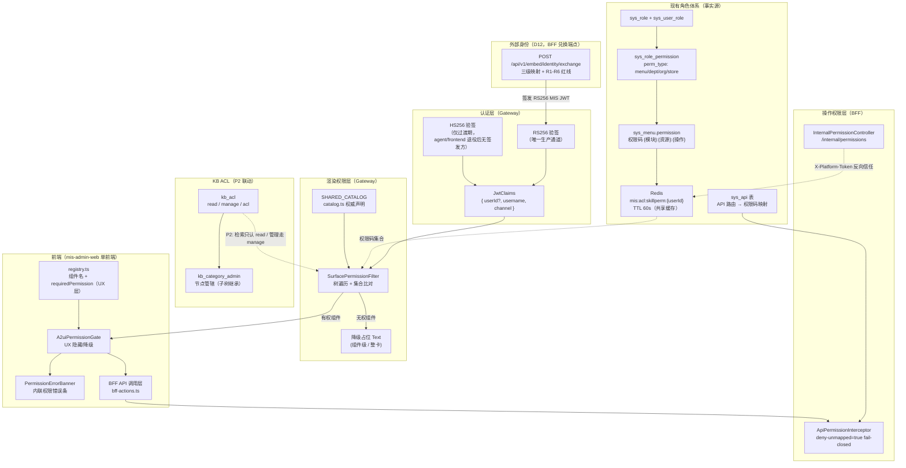
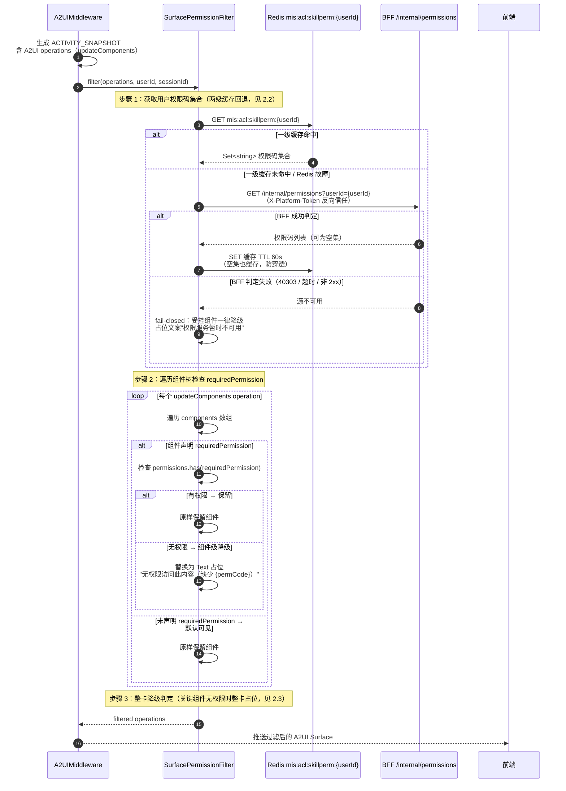
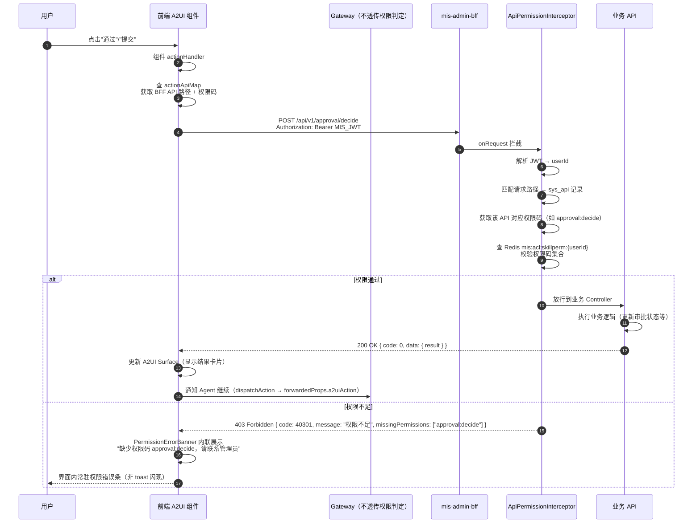

# A2UI 最终权限设计 — 双层模型（渲染 + 操作）+ D5 声明机制 + D12 兑换权限视角

| 项目信息 | 内容 |
| --- | --- |
| 文档版本 | v2.0-final（最终收敛版，替代全部历史权限文档） |
| 作者 | 高见远（Gao，架构师） |
| 日期 | 2026-08-21 |
| 状态 | Ready for Engineering（最终权威） |
| 上游输入 | `01-architecture.md`（D5/D6/D12）、`02-task-breakdown.md`（任务分解）、现有 RBAC / KB ACL 体系、Gateway auth.ts 双 JWT 实现、`MisPermissionResolver`（Python）/ `SkillPermissionChecker`（Java）/ `AgentOpsErrorCodes`（Java） |
| 口径基准 | 组件名、错误码（40301/40303/40304/40305/4004/40101）、Redis key `mis:acl:skillperm:{userId}`（TTL 60s）、BFF `/internal/permissions`、catalogId `mis-a2ui-catalog-v1` 均为最终口径 |

> **最终形态说明**：三期合并后 agent/frontend 退役（D13），**生产通道收敛为 RS256 唯一**；HS256 反查路径仅过渡期保留（无签发方）；外部独立账号经 **BFF 身份兑换端点**（D12）兑换 RS256 MIS JWT 后走既有 D6 链路。本文档所有"外部身份/兑换/手机号匹配"内容均为最终权威口径。

---

## 1. 权限架构概览

### 1.1 设计原则

| # | 原则 | 说明 |
| --- | --- | --- |
| P1 | **复用不新建** | A2UI 权限码纳入现有 `sys_role_permission` / `sys_api` 体系，不另建 A2UI 专属权限表 |
| P2 | **权限码为唯一事实源** | A2UI 权限 = 权限码集合（`mis:acl:skillperm:{userId}` 缓存集合）的命名子集，不引入第二套权限判定 |
| P3 | **fail-closed** | 未映射到权限码且策略要求映射的组件/操作，默认拒绝（与 BFF `deny-unmapped=true` 语义一致）；权限源不可用时拒绝而非放行 |
| P4 | **身份不受信** | A2UI 工具/请求中的 userId 一律不可信，身份只来自受信通道（JWT 验签 / BFF 反查注入） |
| P5 | **双层判定** | 渲染权限（Gateway 过滤，防"看得到"）+ 操作权限（BFF 拦截，防"做得了"），两层独立、协作闭环 |
| P6 | **权限源共享** | 渲染权限与操作权限共享同一份权限码集合缓存 `mis:acl:skillperm:{userId}`（TTL 60s），与 Java `SkillPermissionChecker`、Python `MisPermissionResolver` 逐字节对齐 |

### 1.2 双层权限模型图（Mermaid）



### 1.3 双层模型对比与协作

| 维度 | 渲染权限 | 操作权限 |
| --- | --- | --- |
| **目标** | 控制用户能否"看到"某类 A2UI 组件 | 控制用户能否"执行"某项写操作 |
| **校验位置** | Gateway `SurfacePermissionFilter` | mis-admin-bff `ApiPermissionInterceptor` |
| **校验时机** | Surface 下发前端前（ACTIVITY_SNAPSHOT 生成后） | BFF REST API 入口（onRequest 拦截） |
| **权限码来源** | Redis `mis:acl:skillperm:{userId}`（BFF `/internal/permissions` 反查回填） | BFF `sys_api` → 权限码映射（同享 Redis 权限码集合） |
| **失败行为** | 组件降级为占位 Text（或整卡占位） | 403 + `missingPermissions` 清单 |
| **前端体验** | 无权组件不渲染内容（占位） | A2UI 组件内常驻 `PermissionErrorBanner` |
| **可不同** | 能看到审批卡片（`approval:view`）但不一定能审批（`approval:decide`） | — |

**双层协作方式**：

1. **渲染层先拦截"看"**：Gateway 在 A2UI operations 下发前，按组件 `requiredPermission` 过滤。无 `view` 类权限的组件根本到不了前端。
2. **操作层再拦截"做"**：即使渲染层放行（例如组件默认可见、或 `view` 有而 `decide` 无），写操作（submit/approve/reject）仍必须走到 BFF，由 `ApiPermissionInterceptor` 校验操作权限码。
3. **共享同一权限码集合**：两层校验的是同一份 `mis:acl:skillperm:{userId}` 集合，只是"判定时刻"与"判定粒度"不同。
4. **Gateway 不做写操作授权**：Gateway 对 `a2ui_action` 回传事件只做协议透传（→ 中间件 `processUserAction` → Python），**不判定**写操作权限；写操作权限 100% 由 BFF 兜底。

---

## 2. 渲染权限设计

### 2.1 SurfacePermissionFilter 过滤流程



### 2.2 权限码来源：两级缓存回退策略

**核心链路**：`Redis mis:acl:skillperm:{userId}`（一级，TTL 60s）→ 未命中 → `BFF /internal/permissions`（二级，X-Platform-Token 反向信任）→ 成功回填缓存。

| 层级 | 说明 | 关键点 |
| --- | --- | --- |
| **一级：Redis 缓存** | `GET mis:acl:skillperm:{userId}` | key/TTL 与 Java `SkillPermissionChecker`、Python `MisPermissionResolver` **逐字节/逐秒对齐**，三端共享同一份缓存（谁先解析谁写入） |
| **二级：BFF 反查** | `GET /internal/permissions?userId={userId}&appId={appId}` | 仅内网服务间调用，携带 `X-Platform-Token` 共享密钥；生产主通道为 RS256 直带 userId（过渡期兼容 username/channel 反查，见 §2.2 注） |
| **回填** | 仅成功路径写缓存 | 成功（含空集）→ `SETEX 60s`；**失败路径不写缓存**（避免把一次抖动钉死成 60s 的拒绝或放行） |

**回退语义表**：

| 场景 | 判定结果 | 缓存行为 | 前端表现 |
| --- | --- | --- | --- |
| Redis 命中（含空集） | 直接使用缓存集合 | 不写 | 按集合过滤 |
| Redis 未命中 → BFF 返回 200 + code=0 + codes（含空集） | 使用反查集合 | 写缓存 60s（空集也写，防穿透） | 按集合过滤 |
| Redis 未命中 → BFF 返回 40301（`SKILL_FORBIDDEN`，用户零权限/不存在） | **合法结论 = 零权限码** | 写空集缓存 60s | 所有受控组件降级占位（不是"系统坏了"） |
| Redis 未命中 → BFF 返回 40303（`ACL_UNAVAILABLE`） | **源不可用 → fail-closed** | 不写缓存 | 受控组件降级为"权限服务暂时不可用" |
| Redis 未命中 → 超时 / 连接失败 / 非 2xx / 响应不可解析 | **源不可用 → fail-closed** | 不写缓存 | 同上 |
| Redis 故障（连接失败 / 数据损坏） | 视为未命中，回源 BFF | 不写 | 按 BFF 结果处理 |

> **fail-closed 语义**：权限源不可用时**绝不回退到放行**，也绝不把"源挂了"误报成"用户没权限"。空集是合法结果（该用户确实没有任何码），源不可用是另一种结果（系统抖动），两者在前端呈现不同文案，便于排障。

> **过渡期说明**：HS256 agent token（agent/frontend 退役前）经 username/channel 反查 MIS 用户为 `InternalPermissionController` 扩展点（P0，不改端点路径）；agent/frontend 退役后无签发方，此路径不再有新消费，生产主通道为 RS256 直带 userId + 外部兑换后的 userId。

### 2.3 降级策略：组件级 vs 整卡 vs 缺省语义

| 策略 | 触发条件 | 行为 | 示例 |
| --- | --- | --- | --- |
| **组件级降级** | 单个组件无 `requiredPermission` 权限 | 将该组件替换为 Text 占位，**保留原组件 id**（避免破坏 SurfaceModel 组件树结构） | `data-table` 内嵌的敏感列、`approval-card` 的附件列表 |
| **整卡降级** | 卡片/Surface 的**关键组件**（声明了 requiredPermission 且为容器根组件）无权限 | 整卡替换为统一占位卡：Text + 缺失权限码列表 | `approval-card` 本身无 `approval:view` → 整卡占位，不渲染审批详情 |
| **缺省语义** | 组件**未声明** `requiredPermission` | **默认可见**（降低接入成本） | `data-table`、`entity-select` 默认对所有已认证用户可见 |

**占位组件规格**：

```typescript
// 组件级占位（保留原 id，替换 component 类型）
{
  id: 'approval-card-001',
  component: 'Text',
  text: '无权限访问此内容（缺少权限码：approval:view）',
}

// 整卡占位（同 id，聚合缺失权限码列表）
{
  id: 'approval-card-001',
  component: 'Text',
  text: '无权限访问此卡片（缺少权限码：approval:view）',
  props: { missingPermissions: ['approval:view'], componentIds: ['approval-card-001'] },
}
```

**设计要点**：

1. **占位而非移除**：保留组件 id 保证 `updateComponents` 的 path/组件树结构稳定，避免前端 SurfaceModel 因缺 id 抛异常。
2. **缺省可见是刻意的**：默认可见降低接入成本；**敏感组件必须显式声明** `requiredPermission`（Gateway Catalog 评审时强制）。
3. **文案可抄录**：占位文案含缺失权限码，用户可截图/抄录提工单（与 `PermissionErrorBanner` 的体验约束一致）。

### 2.4 组件 requiredPermission 映射规则

| 组件名 | 渲染权限码 | 操作权限码 | 说明 |
| --- | --- | --- | --- |
| `approval-card` | `approval:view` | `approval:decide`（通过/驳回） | 渲染需 `view`，操作需 `decide`；缺 `view` 整卡占位 |
| `data-table` | —（默认可见） | — | 只读展示；若行数据引用 KB 资源，P2 联动 `kb_acl.read`（见 §6） |
| `form-sheet` | —（默认可见） | `form:submit`（提交） | 渲染无限制，提交走 BFF 校验 |
| `entity-select` | —（默认可见） | —（由具体场景决定） | 实体选择回传 Agent（dispatchAction），非 BFF 写操作 |

### 2.5 权限码命名规范

遵循现有 `{模块}:{资源}:{操作}` 命名（与 `sys_menu.permission` 一致）：

```
# A2UI 渲染权限码（组件级）
approval:view                # 查看审批卡片
a2ui:component:org-picker    # 渲染自定义组织选择器（P1 扩展）

# A2UI 操作权限码（事件级）
approval:decide              # 审批决定（通过/驳回）
form:submit                  # 表单提交
a2ui:event:cloud:create       # 云服务器创建向导提交（示例）

# A2UI 协议原语权限码（P1 可选）
a2ui:patch:upsert            # patch upsert 操作
a2ui:patch:remove            # patch remove 操作
```

**权限码登记方式**（复用现有通道，不新建）：

| 权限码类别 | 登记方式 | 理由 |
| --- | --- | --- |
| 预置组件权限码（`approval:view` 等） | `sys_menu` 种子数据（随发布 SQL 一次性登记） | 管理界面可见、可分配、可审计 |
| 预置操作权限码（`approval:decide` 等） | `sys_api` 表映射（API 路由 → 权限码） | BFF 拦截器按此映射校验 |
| 动态自定义组件权限码 | 内存映射表自动生成（默认 `a2ui:component:{type}`） | 自定义组件动态注册不强制改库 |
| 运行时新增事件权限码 | 组件注册表内联声明（`actions` 字段） | 跟随组件生命周期 |

---

## 3. 操作权限设计

### 3.1 BFF 拦截流程（Gateway 不做写操作授权）



> **关键声明**：**Gateway 不做写操作授权**。Gateway 对 `a2ui_action`（用户操作回传）只做协议透传（交给中间件 `processUserAction` 合成 tool call 消息发回 Python）；**一切写操作（submit/approve/reject）最终都必须转化为对 BFF REST API 的调用**，由 `ApiPermissionInterceptor` 校验。

### 3.2 ApiPermissionInterceptor + sys_api 映射（deny-unmapped=true）

A2UI 组件的写操作在前端被绑定为对 BFF API 的调用，映射关系在组件注册表 `actionApiMap` 中声明，**BFF 侧以 `sys_api` 表为唯一权威映射**（前端声明仅供调用方使用，BFF 不信任前端声明的权限码）。

| 组件 | 操作名 | BFF API 路径 | HTTP Method | 权限码（sys_api 映射） |
| --- | --- | --- | --- | --- |
| approval-card | approve | `/api/v1/approval/decide` | POST | `approval:decide` |
| approval-card | reject | `/api/v1/approval/decide` | POST | `approval:decide` |
| form-sheet | submit | `/api/v1/{resource}/create` | POST | `{resource}:create`（或 `form:submit`） |
| entity-select | confirm | 经 Gateway dispatchAction 回传 Agent | — | 无 BFF 写操作，不需校验 |

**fail-closed 语义**：

- `ApiPermissionInterceptor` 保持现有 **`deny-unmapped=true`**：请求路径在 `sys_api` 表中**没有映射记录**时，默认拒绝（而非放行）。
- 因此**新增 A2UI 写操作端点时，必须同步登记 `sys_api` 映射**（迁移 SQL 随发布执行），否则新端点默认 403。
- 未映射且策略要求映射的协议要素（组件/操作）返回 `4004 A2UI_POLICY_UNMAPPED`（见 §3.3）。

**拦截器判定顺序**：

```
1. 解析 JWT → userId（失败 → 401）
2. 匹配请求路径 + method → sys_api 记录（无记录 → deny-unmapped=true → 4004）
3. 取映射权限码（sys_api.permission_code）
4. 查 Redis mis:acl:skillperm:{userId} 集合
5. 权限码 ∈ 集合 → 放行；否则 → 40301 + missingPermissions
6. 权限源不可用（40303/超时）→ fail-closed 拒绝（ACL_UNAVAILABLE）
```

### 3.3 错误码定义（以 Java 侧 AgentOpsErrorCodes 为基准）

| 错误码 | 名称 | 状态 | 场景 | 响应附加字段 |
| --- | --- | --- | --- | --- |
| 40301 | FORBIDDEN（复用，Java `SKILL_FORBIDDEN`） | 现有 | 缺权限码（渲染/操作）；D12 映射未命中/歧义（零权限语义） | `missingPermissions: string[]` |
| 40303 | ACL_UNAVAILABLE（复用，Java 同名） | 现有 | 权限源不可用（Redis/BFF 拉取失败，fail-closed）；D12 源不可用 | — |
| **40304** | **A2UI_RENDER_FORBIDDEN**（新增） | 新增 | 渲染被策略拒绝（组件权限不足的聚合形态） | `missingPermissions`、`componentIds` |
| **40305** | **A2UI_EVENT_FORBIDDEN**（新增） | 新增 | 事件回传被策略拒绝（事件级 fail-closed） | `event`、`missingPermissions` |
| **4004** | **A2UI_POLICY_UNMAPPED**（新增） | 新增 | 协议要素未映射到权限码且 deny-unmapped=true | `unmapped: string[]` |
| **40101** | **EMBED_TOKEN_INVALID**（新增，D12） | 新增 | 外部身份令牌无效/过期/签名不符（兑换端点验签失败） | — |

> **说明**：40301/40303 为现有错误码（Java 侧已实现，Python `MisPermissionResolver` 亦按此语义消费）；40304/40305/4004/40101 为本次新增，需在 Java `AgentOpsErrorCodes` 中登记并纳入全局异常处理。**命名统一为 Java 侧名称**（40303 用 `ACL_UNAVAILABLE` 而非其他别名），避免跨语言歧义。

**错误响应示例**：

```json
// 渲染权限不足（Gateway 聚合返回，P1 可选；P0 走组件降级不返回错误码）
{
  "code": 40304,
  "message": "A2UI 渲染被策略拒绝",
  "missingPermissions": ["approval:view"],
  "componentIds": ["approval-card-001"],
  "sessionId": "sess-abc123"
}

// 操作权限不足（BFF 拦截器返回）
{
  "code": 40301,
  "message": "权限不足",
  "missingPermissions": ["approval:decide"],
  "traceId": "trace-xyz789"
}

// 事件回传被拒绝（Gateway 事件级 fail-closed，P1 可选）
{
  "code": 40305,
  "message": "A2UI 事件回传被策略拒绝",
  "event": "submit",
  "missingPermissions": ["form:submit"],
  "sessionId": "sess-abc123"
}

// 未映射到权限码（BFF deny-unmapped=true）
{
  "code": 4004,
  "message": "A2UI 协议要素未映射到权限码",
  "unmapped": ["/api/v1/approval/decide"],
  "traceId": "trace-xyz789"
}

// 外部身份令牌无效（D12 兑换端点验签失败）
{
  "code": 40101,
  "message": "外部身份令牌无效",
  "traceId": "trace-xyz789"
}
```

### 3.4 前端 PermissionErrorBanner 内联展示

| 场景 | 体验 | 实现 |
| --- | --- | --- |
| 渲染权限不足 | 无权组件不渲染内容（占位 Text） | Gateway SurfacePermissionFilter 降级（§2.3） |
| 操作权限不足 | A2UI 组件内常驻权限错误条，显示缺失权限码 | `PermissionErrorBanner` 组件（shadcn Alert 实现） |
| 权限源不可用 | fail-closed 降级为"权限服务暂时不可用"占位 | SurfacePermissionFilter 异常处理（§2.2） |

**体验约束**：

- 权限错误**不弹 toast 闪现**（用户来不及看清权限码就消失）。
- 权限错误条**常驻在 A2UI 组件内**，展示缺失权限码列表，用户可抄录提工单。
- `bff-actions.ts` 的 `callBffAction` 捕获 403 后返回结构化错误 `{ code, message, missingPermissions[] }`，由 `PermissionErrorBanner` 消费渲染。

---

## 4. 权限码声明机制（D5）

### 4.1 双层声明架构（单前端）

```mermaid
graph LR
    subgraph 前端（可篡改，仅 UX）
        FE_REG["registry.ts<br/>ComponentSpec.requiredPermission"]
        FE_GATE["A2uiPermissionGate<br/>UX 隐藏/降级"]
    end

    subgraph Gateway（权威源）
        GW_CATALOG["catalog.ts<br/>SHARED_CATALOG（权威声明）"]
        GW_SCHEMA["A2UIMiddlewareConfig.schema<br/>LLM 可见的组件定义"]
        GW_FILTER["SurfacePermissionFilter<br/>安全兜底强制过滤"]
    end

    subgraph BFF（写操作权威）
        BFF_API["sys_api 表<br/>API 路由 → 权限码映射"]
        BFF_INTERCEPTOR["ApiPermissionInterceptor<br/>fail-closed"]
    end

    FE_REG --> FE_GATE
    GW_CATALOG --> GW_SCHEMA
    GW_CATALOG --> GW_FILTER
    BFF_API --> BFF_INTERCEPTOR

    FE_REG -.->|组件名对齐| GW_CATALOG
    GW_FILTER -.->|安全兜底| FE_GATE
```

### 4.2 前端 registry（单前端一份，mis-admin-web 源码模块）

```typescript
// mis-admin-web: src/components/a2ui/registry.ts

interface RegistryEntry {
  name: string;                           // 组件名（与 Gateway Catalog 对齐）
  component: React.ComponentType<any>;    // shadcn 组件
  requiredPermission?: string;            // 渲染权限码（UX 层提示，非安全边界）
  actionApiMap?: Record<string, {          // 操作 → BFF API 映射
    method: string;
    path: string;
    permissionCode: string;
  }>;
}

const REGISTRY: RegistryEntry[] = [
  {
    name: 'approval-card',
    component: ApprovalCard,
    requiredPermission: 'approval:view',
    actionApiMap: {
      approve: { method: 'POST', path: '/api/v1/approval/decide', permissionCode: 'approval:decide' },
      reject:  { method: 'POST', path: '/api/v1/approval/decide', permissionCode: 'approval:decide' },
    },
  },
  { name: 'data-table', component: DataTable },          // 无 requiredPermission，默认可见
  {
    name: 'form-sheet',
    component: FormSheet,
    actionApiMap: {
      submit: { method: 'POST', path: '/api/v1/dynamic/submit', permissionCode: 'form:submit' },
    },
  },
  { name: 'entity-select', component: EntitySelect },    // 操作经 Gateway dispatchAction 回传，不走 BFF
];
```

### 4.3 Gateway SHARED_CATALOG 权威源

```typescript
// gateway: src/a2ui/catalog.ts

const SHARED_CATALOG: A2UIComponentSpec[] = [
  {
    name: 'approval-card',
    description: '审批卡片：展示审批详情，提供通过/驳回按钮',
    propsSchema: { /* JSON Schema */ },
    requiredPermission: 'approval:view',          // 渲染权限（权威）
    actions: { approve: 'approval:decide', reject: 'approval:decide' },  // 操作权限（权威）
  },
  // data-table / form-sheet / entity-select（同 02-task-breakdown.md §5.1）
];

// 转换为 A2UIMiddlewareConfig.schema 格式（LLM 可见）
function toMiddlewareSchema(catalog: A2UIComponentSpec[]): A2UIInlineCatalogSchema {
  return {
    catalogId: 'mis-a2ui-catalog-v1',
    components: Object.fromEntries(catalog.map(c => [c.name, c.propsSchema])),
  };
}
```

**Gateway 权威源的三重角色**：

1. **LLM 提示约束**：`toMiddlewareSchema` 生成的 schema 注入中间件 → LLM 只会生成 catalog 内的组件（含 requiredPermission 元数据）。
2. **下发过滤依据**：`SurfacePermissionFilter` 以 SHARED_CATALOG 的 `requiredPermission` / `actions` 为准过滤（**不读前端注册表**）。
3. **写操作映射参考**：`actions` 声明供前端生成 `actionApiMap` 参考，但 BFF 校验以 `sys_api` 表为准（§3.2）。

### 4.4 声明不一致处理：Gateway 权威优先（防伪造）

前端注册表与 Gateway SHARED_CATALOG 出现不一致时，**一律以 Gateway 为准**（前端可被篡改，仅 UX 层）：

| 不一致场景 | 处理规则 |
| --- | --- |
| 前端声明的 `requiredPermission` 与 Gateway 不同 | **以 Gateway 为准**：过滤用 Gateway 的权限码；前端声明仅影响本地 UX 隐藏 |
| 前端注册了 Gateway Catalog 之外的组件名 | Gateway 不认该组件：不会注入 LLM schema、不会下发（LLM 无法生成）；若前端硬渲染 → 本地降级 |
| 前端遗漏声明（Gateway 有、前端没有） | 以 Gateway 为准过滤，前端 UX 层不隐藏（可能出现"渲染后操作 403"场景，由 PermissionErrorBanner 兜底提示） |
| 前端声明的 `actionApiMap` 权限码与 `sys_api` 表不一致 | **以 BFF sys_api 为准**：拦截器按 sys_api 校验，前端声明仅决定调用哪个 API 路径 |
| Gateway 声明与 `sys_api` 表不一致 | 渲染按 Gateway，写操作按 sys_api；两者不一致时以 **sys_api（BFF 拦截）为最终安全边界** |

> **安全结论**：前端注册表任何篡改都无法扩大用户权限——渲染由 Gateway 过滤兜底，写操作由 BFF `sys_api` fail-closed 兜底。

### 4.5 声明安全分析

| 层 | 可篡改性 | 安全保证 | 角色 |
| --- | --- | --- | --- |
| 前端 registry | **可篡改**（前端代码可被修改） | 无（UX 层，仅影响显示） | 提供良好体验（无权组件不渲染/禁用，避免"先看到再被拒绝"的闪烁） |
| Gateway Catalog | 不可篡改（服务端配置） | LLM 不会生成无权组件的声明 | 中间层（LLM 提示约束） |
| Gateway 过滤器 | 不可篡改（服务端强制执行） | **安全兜底**（即使 LLM 生成无权组件也会被过滤） | 安全边界 |
| BFF 拦截器 | 不可篡改（服务端 fail-closed） | **最高安全级别**（写操作 100% 校验） | 安全执行点 |

---

## 5. D12 兑换端点权限视角

### 5.1 兑换流程（权限视角）

外部系统用户有**独立账号体系**（不一定是 MIS 用户），只是借用 AI 能力。而权限码体系以 **MIS userId** 为维度。D12 兑换端点解决"外部 user → MIS userId"的映射，映射结果必须 fail-closed。

```
外部系统自签 externalToken（appId + externalUserId + phone，宿主密钥 HS256）
        │ BFF 先验外部系统身份（hostId 注册 + client_secret 验签，R1）
        ▼
映射优先级（三级回退）：
  ① 显式映射表（agent_external_identity：hostId + externalUserId → misUserId）
  ② 手机号匹配（无表可查时：token 内 phone_hash 反查 MIS 用户）
  ③ 影子账号（hostId → shadow_mis_user_id，粗粒度默认）
        │ 任一级命中 → 签发短时 RS256 MIS JWT（TTL 30min 不变）
        ▼
任一级未命中 / 歧义 → 40301 fail-closed（零权限语义，不区分提示）
```

### 5.2 手机号匹配规则（用户已拍板，最终版）

- MIS 侧 `sys_user` **允许**存在"一手机号多账号"历史数据，**不要求业务侧清理**。
- 反查 MIS 用户，按"**正常状态**账号"计数（正常状态 = 非停用/非删除状态）：
  - **= 1** 个正常状态账号 → 映射该用户；
  - **> 1** 个正常状态账号 → **一律 40301**（歧义兜底，不区分提示防枚举）；
  - **= 0** 个正常状态账号（查无此人 / 全部停用或删除 / 手机号未绑定）→ **同样 40301**。
- **由歧义兜底而非数据清理保证安全**；fail-closed 且不区分提示（防枚举）。
- **不进入影子账号回退**：手机号匹配失败（歧义/查无）不降级到影子账号，直接 40301。
- 实现约定：`sys_user` 状态字段按现有语义判定；BFF 手机号反查 SQL 必须带状态过滤，计数 > 1 即拒绝。
- 影子账号与手机号匹配优先级：**手机号命中优先级高于影子账号**；host 级开关 `phone_match_enabled`（默认 true）可配置。

### 5.3 安全红线（R1-R6，完整）

| # | 红线 | 说明 |
| --- | --- | --- |
| R1 | **绝不单独凭"手机号 + app"签发 token** | 手机号是弱标识（可猜测/可撞库）。请求必须携带外部系统**自己密钥签名**的 `externalToken`（含 appId/hostId + externalUserId + phone），BFF 先验签证明"这是合法 CRM/供应链系统"，之后手机号才被用作匹配键 |
| R2 | **手机号只做匹配键，不做身份声明** | 兑换出的 MIS JWT 的 userId 只来自映射结果（MIS 用户/影子账号），不包含手机号；后续权限走 D6 反查，fail-closed 不变 |
| R3 | **手机号不落明文日志** | 日志只记脱敏号（`138****1234`）或 `phone_hash`；错误响应不返回手机号 |
| R4 | **歧义一律 fail-closed** | 手机号查无此人 / 多账号命中 / 手机号未绑定 → **全部返回 40301 且不区分提示**（防外部枚举账号）；多账号命中视为映射歧义，宁可拒绝不猜 |
| R5 | **脱敏存储 + 隐私合规** | 数据库只存 `phone_hash`（sha256(phone + salt)）+ 可选 AES-GCM 密文（用于未来变更，P1）；遵守《个人信息保护法》（PIPL）：外部系统上报手机号需确保已获用户授权/告知，BFF 不对外暴露手机号明文 |
| R6 | **兑换仍限流 + 审计** | 手机号匹配路径同样按 hostId + client_id 限流（防撞库）；审计记录 `hostId + externalUserId + mappedBy + 脱敏号` |

### 5.4 兑换端点错误码语义

| 错误码 | 场景 | 语义 |
| --- | --- | --- |
| 40101 EMBED_TOKEN_INVALID | externalToken 验签失败（签名不符 / 过期 / hostId 未注册） | 外部令牌无效，R1 前置失败 |
| 40301 FORBIDDEN | 三级映射全未命中 / 手机号歧义（>1）/ 查无（=0）/ 影子账号未配置 | **零权限语义**，fail-closed，**不区分提示防枚举** |
| 40303 ACL_UNAVAILABLE | 映射依赖的权限源（Redis/BFF 反查）不可用 | fail-closed，不写缓存 |

> **语义**：兑换失败一律不返回"系统坏了"以外的信息；映射未命中（40301）与验签失败（40101）严格区分（前者代表身份合法但无映射，后者代表身份不可信）。

### 5.5 影子账号最小权限

- 影子 MIS 账号只配外部系统真正需要的权限码（默认仅 `agent:chat:use`），敏感组件（approval-card 等）无码即整卡占位（§2.3）。
- 外部系统申请的 `scope` ⊆ 影子账号权限码（服务端强制），BFF 兑换时校验并裁剪。
- 影子账号在 `sys_user_role` 配置最小权限（如仅 `agent:chat:use` + 指定技能码）。

### 5.6 与双 JWT 验签的衔接

| 通道 | 处置 | 说明 |
| --- | --- | --- |
| **RS256 MIS JWT** | ✅ 唯一生产通道 | mis-admin-web 自身 + 外部系统兑换后的身份都走 RS256；Gateway 验签逻辑零新增 |
| **HS256 agent JWT** | ⏸ 仅过渡期保留 | agent/frontend 退役后无签发方；随 T11 清理任务移除 HS256 签发/消费 |

---

## 6. KB ACL 联动（P2）

### 6.1 联动模型：检索类只认 read，管理类走 manage

当 A2UI 组件引用知识库（KB）资源时（如 `data-table` 展示 KB 文档列表、`form-sheet` 提交 KB 文档变更），需按 **KB ACL 语义** 与 **A2UI 权限码** 双重判定：

| A2UI 场景 | 判定动作 | 使用的 KB ACL 权限 | 说明 |
| --- | --- | --- | --- |
| **检索类**（展示/查询 KB 内容） | 渲染层校验 | `kb_acl.read` | 只有 `read` 权限才能看到 KB 内容（渲染前过滤，防泄露） |
| **管理类**（增删改文档、设置） | 写操作经 BFF 后由业务服务校验 | `hasLibraryManage`（节点管辖 ∨ `kb_acl.manage`） | 复用现有 `KbAclService` 双闸门，不新增 A2UI 专属逻辑 |
| **ACL 管理类**（授权变更） | 极少在 A2UI 出现 | `kb_acl.acl` | 若出现，走现有授权管理 API |

### 6.2 与 hasLibraryManage 语义对齐

现有 Java 侧 `KbAclService` 双闸门（实证代码）：

```
hasLibraryManage(userId, libraryId) = 节点管辖(kb_category_admin 子树) ∨ kb_acl.manage(userId, libraryId)
```

- `AclAction` 枚举：`READ("read")` / `MANAGE("manage")` / `ACL("acl")`（存于 `kb_acl.action`）。
- A2UI **不新建** KB 权限判定：管理类写操作照旧由业务服务（`KbAclService` / `KbDocumentService`）在校验 `hasLibraryManage` 后执行；渲染类（P2）由 Gateway 联动校验 `kb_acl.read`。

### 6.3 映射建议表

| A2UI 组件 | KB 交互 | A2UI 层判定 | KB 层判定 | 建议 |
| --- | --- | --- | --- | --- |
| `data-table`（KB 文档列表） | 只读展示 | 渲染权限：默认可见 + `kbRef` 校验 | `kb_acl.read` | P2：组件 props 含 `kbRef` → Gateway 查 `kb_acl.read`，无则占位 |
| `form-sheet`（KB 文档编辑） | 提交变更 | 操作权限：`{resource}:edit`（A2UI 码） | `hasLibraryManage` | 提交经 BFF → 业务服务双闸门，A2UI 码与 KB 码**双码都过** |
| `entity-select`（KB 库选择） | 选择回传 | 渲染权限：默认可见 | `kb_acl.read`（可选库） | P2：候选库列表已由 BFF 过滤，前端无需重复判定 |

> **原则**：**A2UI 权限码管"能不能进入 A2UI 交互"**，**KB ACL 管"能不能动这份 KB 数据"**。两者正交：A2UI 码通过（如 `form:submit`）不代表 KB 码通过（`hasLibraryManage=false`），BFF 业务服务仍会拒绝（40311，现有语义）。渲染层（P2）额外用 `kb_acl.read` 防"看到无权内容"。

### 6.4 实现要点

| 要点 | 说明 |
| --- | --- |
| **触发条件** | 组件 props 包含 `kbRef` 字段（`{ kbId?: string, categoryId?: string }`） |
| **校验链路** | Gateway SurfacePermissionFilter → KB ACL 服务（HTTP 或直接查库） |
| **降级策略** | 无权 KB 组件降级为"无权限访问此知识库内容"占位 Text |
| **优先级** | P2（P0 不实现，架构预留 `kbRef` 字位） |

---

## 7. 权限测试要点

### 7.1 渲染过滤测试用例（SurfacePermissionFilter）

| # | 用例 | 输入 | 预期 |
| --- | --- | --- | --- |
| R-01 | 有权限组件原样下发 | `approval-card` + 用户有 `approval:view` | 组件原样保留，前端渲染审批卡片 |
| R-02 | 无权限组件降级 | `approval-card` + 用户无 `approval:view` | 组件替换为 Text 占位，文案含 `approval:view`，原 id 保留 |
| R-03 | 未声明 requiredPermission 默认可见 | `data-table`（无声明） | 组件原样下发，不校验 |
| R-04 | Redis 命中不回源 | Redis 有 `mis:acl:skillperm:{userId}` | 仅 1 次 Redis GET，0 次 BFF 调用 |
| R-05 | Redis 未命中回源并回填 | Redis 无 key，BFF 返回 codes | 1 次 BFF 调用，Redis SETEX 60s，TTL=60 |
| R-06 | BFF 返回空集（40301 语义） | BFF 返回 code=0 + codes=[] | 空集缓存 60s（防穿透），所有受控组件降级 |
| R-07 | BFF 源不可用（40303/超时） | BFF 返回 40303 或超时 | fail-closed：受控组件降级"权限服务暂时不可用"，**不写缓存** |
| R-08 | 整卡降级 | `approval-card` 为容器根组件且无权限 | 整卡占位（含 missingPermissions 聚合列表） |
| R-09 | 部分组件降级 | 卡片内一个组件无权限、其余有 | 仅无权组件降级，有权组件正常渲染 |
| R-10 | Redis 故障回源 | Redis 连接失败 | 视为未命中 → 回源 BFF，按 BFF 结果处理 |
| R-11 | 组件名不一致（前端 vs Gateway） | 前端注册 Gateway 没有的组件 | Gateway 不认：不注入 schema、不下发 |

### 7.2 操作拦截测试用例（ApiPermissionInterceptor + 前端 403 展示）

| # | 用例 | 输入 | 预期 |
| --- | --- | --- | --- |
| A-01 | 有权限码放行 | `POST /api/v1/approval/decide` + 用户有 `approval:decide` | 200 OK，业务执行 |
| A-02 | 无权限码拒绝 | 用户无 `approval:decide` | 403 `{ code: 40301, missingPermissions: ["approval:decide"] }` |
| A-03 | 未映射 API（deny-unmapped） | `sys_api` 无该路径记录 | 拒绝（4004 A2UI_POLICY_UNMAPPED，unmapped 含路径） |
| A-04 | 前端 403 内联展示 | 组件收到 403 | `PermissionErrorBanner` 常驻展示缺失权限码，**非 toast 闪现** |
| A-05 | 权限源不可用 | Redis/BFF 权限源失败 | fail-closed 拒绝（40303 ACL_UNAVAILABLE），不放行 |
| A-06 | Gateway 不判定写操作 | 恶意伪造 a2ui_action 写操作 | Gateway 只透传，权限由 BFF 兜底拒绝 |
| A-07 | 伪造 userId 提升权限 | 请求体带他人 userId | BFF 以 JWT userId 为准，伪造被忽略（P4） |

### 7.3 兑换映射测试用例（D12）

| # | 用例 | 输入 | 预期 |
| --- | --- | --- | --- |
| E-01 | 显式映射命中 | hostId+externalUserId 命中 `agent_external_identity` | 签发 RS256 MIS JWT，`mappedBy: "explicit"` |
| E-02 | 手机号匹配 =1 | 无显式映射，phone_hash 反查 1 个正常状态账号 | 映射该用户，`mappedBy: "phone"` |
| E-03 | 手机号匹配 >1（歧义） | phone_hash 反查 2+ 个正常状态账号 | **40301**（不区分提示，防枚举），不进入影子账号回退 |
| E-04 | 手机号匹配 =0（查无/全停用/未绑定） | phone_hash 反查 0 个正常状态账号 | **40301**（同 40301 语义），不进入影子账号回退 |
| E-05 | 影子账号兜底 | 无显式映射 + 手机号未匹配 + host 配置 shadow_mis_user_id | 影子账号最小权限，`mappedBy: "shadow"` |
| E-06 | 全未命中 | 无映射 + 无手机号 + 无影子账号配置 | 40301 零权限 |
| E-07 | 验签失败 | externalToken 签名不符 / 过期 / hostId 未注册 | 40101 EMBED_TOKEN_INVALID |
| E-08 | 权限源不可用 | 映射依赖 Redis/BFF 源失败 | 40303 fail-closed，不写缓存 |
| E-09 | 限流生效 | 同一 hostId+client_id 高频兑换 | 拒绝，审计记录 |
| E-10 | 审计记录 | 任意兑换（成功/失败） | 记录 hostId + externalUserId + mappedBy + 脱敏号 |
| E-11 | 手机号脱敏 | 日志/响应含手机号 | 只出现 `138****1234` 或 `phone_hash`，无明文（R3） |
| E-12 | P4 身份不受信 | 消息体伪造 userId / phone 与 token 内不一致 | 以 token 内为准，伪造被忽略 |

### 7.4 错误码回归测试

| # | 用例 | 预期 |
| --- | --- | --- |
| C-01 | 40301 语义回归 | 现有 `SKILL_FORBIDDEN` 语义不破坏（Java/Python 双侧） |
| C-02 | 40303 命名回归 | Java `AgentOpsErrorCodes.ACL_UNAVAILABLE` 与 Python 消费侧一致 |
| C-03 | 40304/40305/4004/40101 新增登记 | Java `AgentOpsErrorCodes` 新增常量 + 全局异常处理器覆盖 |
| C-04 | 响应格式 | 所有错误响应含 `{ code, message, traceId }`，A2UI 扩展字段（missingPermissions 等）可选 |

---

## 8. 集成改造点清单

| # | 模块 | 文件/位置 | 改造内容 | 量级 | 优先级 |
| --- | --- | --- | --- | --- | --- |
| 1 | Gateway | `src/a2ui/SurfacePermissionFilter.ts` | 渲染权限过滤（树遍历 + 集合比对 + BFF 反查 + 两级缓存回退） | 中 | P0 |
| 2 | Gateway | `src/a2ui/catalog.ts` | SHARED_CATALOG（组件 schema + requiredPermission + actions，权威源） | 小 | P0 |
| 3 | Gateway | `src/middleware/auth.ts`（已有） | 确认 RS256 验签支持 mis-admin-web 直连（已实现）；HS256 过渡期保留验签 | 无 | P0 |
| 4 | mis-admin-bff | `ApiPermissionInterceptor`（已有） | 确认 deny-unmapped=true 覆盖 A2UI 写操作端点；新端点登记 sys_api | 小 | P0 |
| 5 | mis-admin-bff | `InternalPermissionController`（已有） | 确认 userId 直查为主；username/channel 反查为过渡期扩展点（P0，不改端点路径） | 小 | P0 |
| 6 | mis-admin-bff | `AgentOpsErrorCodes.java`（已有） | 登记 40304 / 40305 / 4004 / 40101 | 小 | P0 |
| 7 | mis-admin-bff | D12 兑换端点（新建） | 三级映射 + R1-R6 + 限流审计（见 `02-task-breakdown.md` §2.3） | 中 | P0 |
| 8 | 数据库种子 | 迁移 SQL（sys_menu / sys_api / agent_external_*） | 登记权限码 + A2UI 写操作端点 sys_api 映射 + 外部身份映射存储 | 小 | P0 |
| 9 | mis-admin-web | `components/a2ui/registry.ts` | 组件注册表含 requiredPermission + actionApiMap（单前端一份） | 小 | P0 |
| 10 | mis-admin-web | `components/a2ui/A2uiPermissionGate.tsx` | 前端 PermissionGate UX 层过滤 | 小 | P0 |
| 11 | mis-admin-web | `components/a2ui/PermissionErrorBanner.tsx` | 权限错误内联提示条 | 小 | P0 |
| 12 | mis-admin-web | `components/a2ui/bff-actions.ts` | 写操作 → BFF API + 403 错误处理 | 中 | P0 |
| 13 | Gateway | Redis 缓存 key | `mis:acl:skillperm:{userId}`（复用现有 key，三端共享） | 无 | P0 |
| 14 | Gateway | `src/a2ui/SurfacePermissionFilter.ts` | KB ACL 联动（kbRef 检查） | 小 | P2 |
| 15 | Gateway | 权限审计日志 | 渲染/操作判定记录 | 小 | P2 |

**改造量级汇总**：无 ×2、小 ×9、中 ×3、无大改造。主路径全部复用现有链路，新增代码集中在 Gateway SurfacePermissionFilter、BFF D12 兑换端点、mis-admin-web 权限组件三处。

---

## 9. 结论

**结论：✅ 权限设计 Ready（最终收敛版），可供工程阶段使用。**

依据：

1. **完全基于现有角色体系**：权限码 = 现有 RBAC 权限码子集，判定复用 `mis:acl:skillperm:{userId}` 共享缓存 + BFF `/internal/permissions` 反查链路，无平行体系、无新存储、无新角色分配通道。
2. **两层权限闭环**：渲染权限（Gateway SurfacePermissionFilter，树级批量过滤）+ 操作权限（BFF ApiPermissionInterceptor，deny-unmapped=true fail-closed）均不绕过；Gateway 不做写操作授权。
3. **单前端统一**：mis-admin-web 使用 MIS JWT（RS256）直连 Gateway + 写操作经 BFF；外部独立账号经 D12 兑换端点映射为 MIS userId 后走同一链路（生产通道 RS256 唯一，HS256 仅过渡期）。
4. **权限码声明式**：前端 registry 声明 requiredPermission + actionApiMap，Gateway SHARED_CATALOG 权威过滤安全兜底，BFF sys_api fail-closed 最高保障；声明不一致一律 Gateway 权威优先（防伪造）。
5. **错误码口径与 Java 侧对齐**：40301/40303 复用现有，40304/40305/4004/40101 新增登记。
6. **D12 外部身份安全**：三级回退 + 手机号匹配用户拍板规则（=1 映射 / >1 和 =0 一律 40301，不进入影子账号回退）+ R1-R6 红线完整落地，fail-closed 且不区分提示防枚举。
7. **扩展路径清晰**：KB ACL 联动（P2 预留 kbRef 字位，检索只认 read / 管理走 hasLibraryManage）、自定义组件权限码（内存映射表自动生成）、权限审计日志（P2）。
