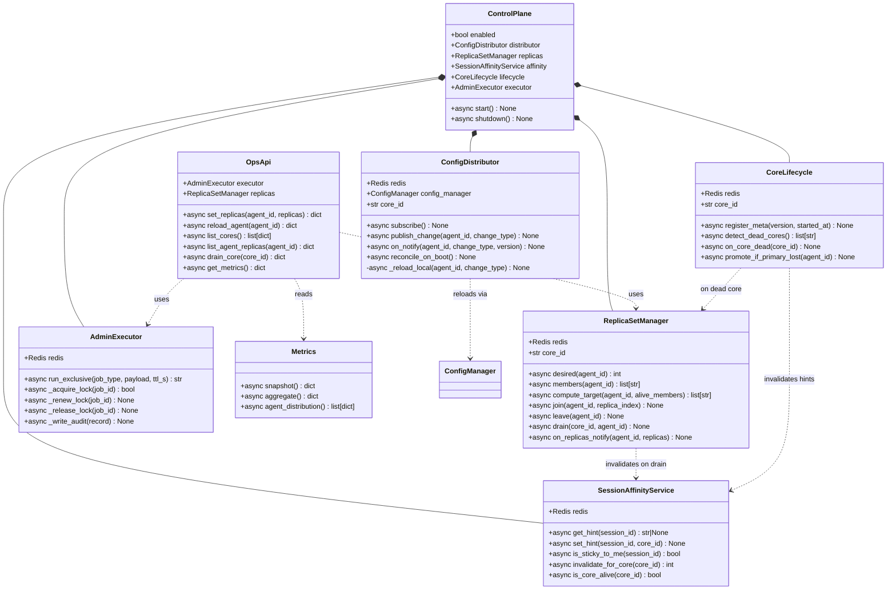
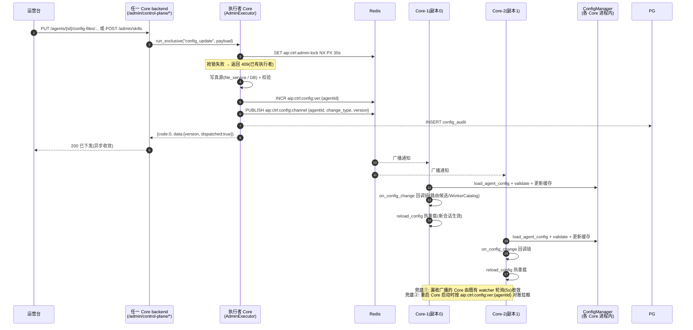
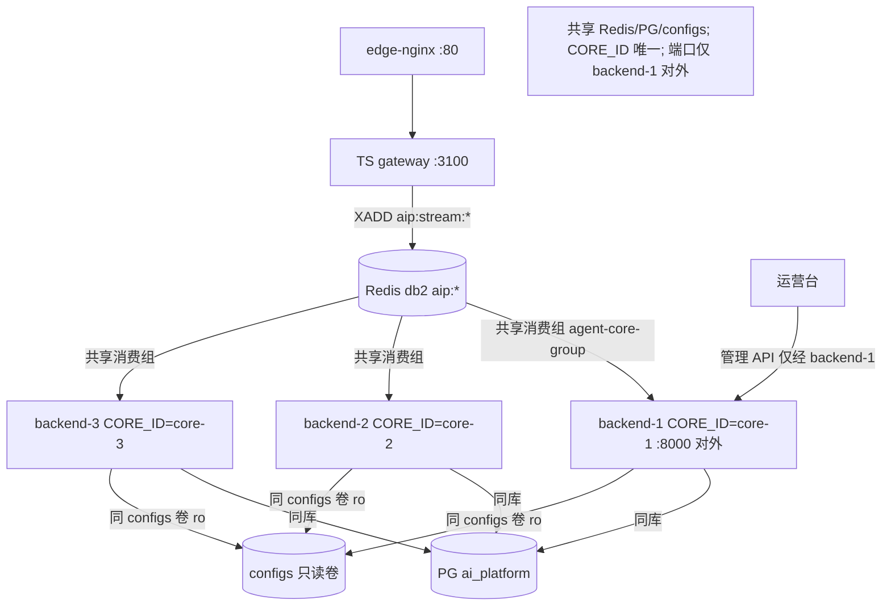
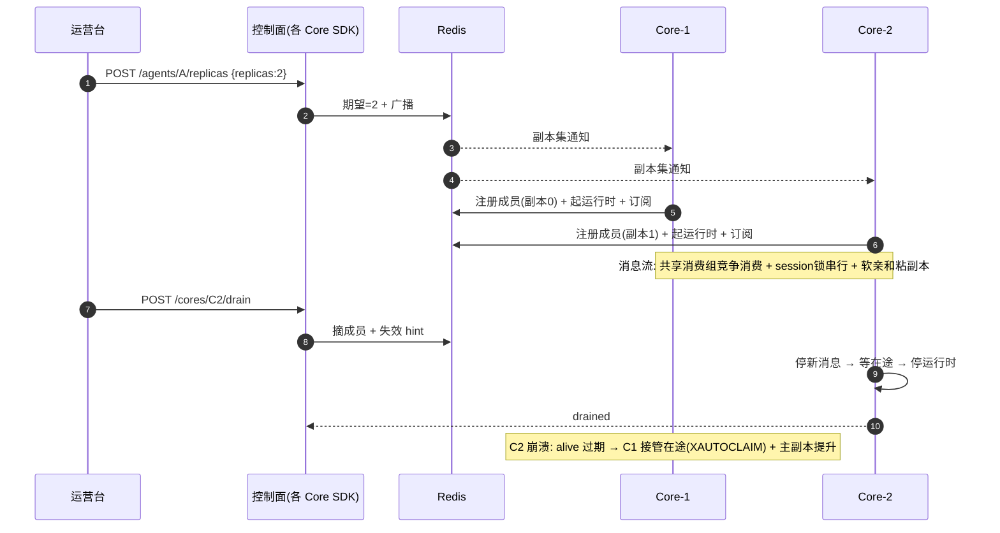
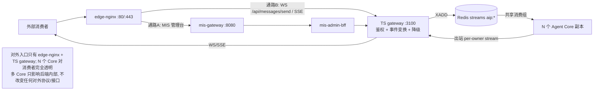
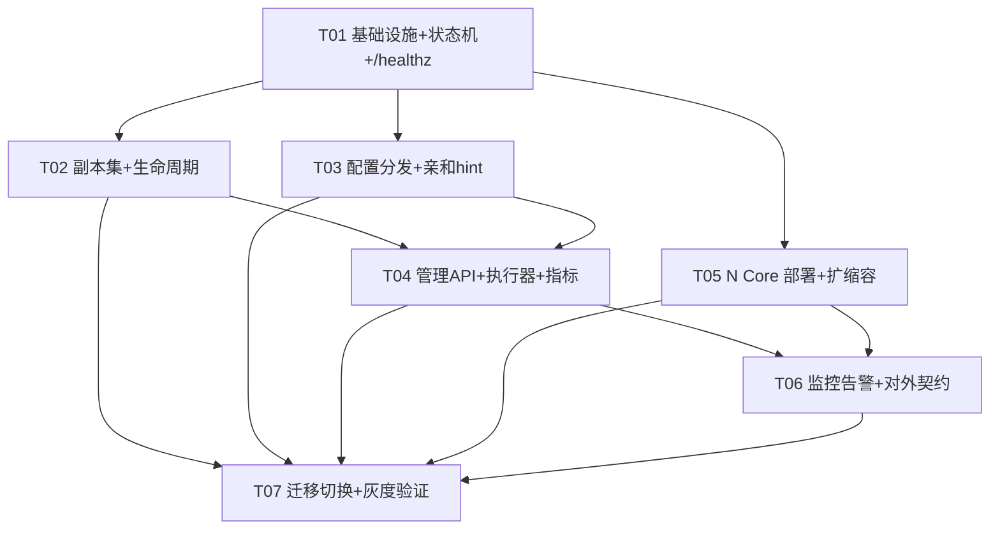

# Agent Core 协同管理模块（Control Plane）设计

> **文档定位**：架构设计文档（仅设计，不含实现代码）。为「同一 agentId 多副本并发负载」（已锁定方案 C + 软亲和 + HITL 外置，见 `agent-multi-replica-scaling.md`）补齐**统一管理面（Control Plane）**：一个专门模块集中管理 N 个 Agent Core 的副本集、配置/技能分发、会话亲和 hint、健康/接管与运营入口，并覆盖**多 Agent Core 全生命周期运营**（部署 / 负载模型 / 负载协同 / 运维 / 监控告警 / 对外 AI 服务）。
> **作者**：架构师 高见远（software-architect）
> **主理人**：齐活林（team-lead）
> **日期**：2026-08（承接 `agent-multi-replica-scaling.md` 之后；v2 增补六维运营章节）
> **输入**：已锁定的 Phase1 决策（方案 C + 软亲和 + HITL 外置）+ 已核实的现状事实（工程师寇豆码核实报告 §8）+ 用户已确认（形态=逻辑模块+SDK、`REPLICA_CAP=4`）。

> **v2 更新说明**：在 v1（§1–§8 控制面核心设计）基础上新增 §9 部署、§10 负载模型与容量、§13 监控与告警、§14 对外 AI 服务，重组 §11 负载协同、§12 运维（含迁移/回滚 runbook 收口），任务分解修订为 7 个（§15）。

> **v2.1 增补（本地对话 HTTP 直连多核执行路线）**：在 §10 新增 §10.5（本地对话同步/SSE 直连的多核执行路线：请求级软重投、SSE 亲和 hint 续刷、fail-open 降级），并同步修订 §15 任务归属（T01 增 `members/replicas` 读取原语、T02 的 `is_replica` 供 HTTP 路径复用、T03 新增 `src/api/routes/mis_capability.py` 改造）。仅设计增补，不改变既有 v2 结论。

---

## 0. TL;DR（结论先行）

| 决策点 | 结论 |
|---|---|
| **模块形态** | **不新起独立微服务**。控制面 = 「Redis 状态机 + 每 Core 内嵌 ControlPlane SDK（进程内库）+ 复用现有 backend 挂载管理 API」。它是**逻辑控制面**，不是新部署单元。 |
| **模块自身 HA** | **不需要独立多副本**。它天然寄生在 N 个 Core 上（每个 Core 都跑同一份 SDK = 天然多副本）；管理面写入用 `aip:ctrl:admin-lock`（Redis 租约）选举单执行者，执行者崩溃则 TTL 过期自动转移——与现有 CoreOwnership 同构。 |
| **挂了的影响** | **fail-open（放行）**。控制面只做「通知/编排」，不参与消息流的正确性锚点（session 锁、XAUTOCLAIM、出站解析链均不依赖它）。控制面挂掉 → 消息流照常；配置收敛降级为既有 5s 轮询、副本集变化降级为既有 resync 循环。 |
| **与 ConfigManager 关系** | **叠加而非替代**。ConfigManager 仍是配置的真源与加载/校验/热重载执行者；控制面只在其上增加「一次变更 → 广播 → 各 Core 收敛」的通知通道，轮询保留为兜底。 |
| **部署** | docker-compose 显式 N 个 backend 副本（各配 `CORE_ID`）+ 共享 Redis db2/PG/configs；扩容=加容器，缩容=drain 后停容器。 |
| **负载模型** | 入口 = edge-nginx → TS gateway → Redis 共享消费组 → N Core；并发单位是 **session**；副本数 = 需求吞吐 / 单 Core 容量（含安全系数），热点 agent 用 `replicas` 单独扩。 |
| **负载协同** | 粒度 = session；正确性由 session 锁 + XAUTOCLAIM + 出站解析链保证（零改动）；控制面只做「期望状态 + 通知 + 视图」。 |
| **对外服务** | 外部消费者经 edge-nginx → TS gateway → Redis streams → N Core；多 Core 对消费侧透明（fail-open、会话串行、HITL 续跑、出站送达），SLA 承诺有明确边界。 |
| **迁移路径** | M0 旁路监听（不生效）→ M1 单 agent 试点 `replicas:2` → M2 全量切换配置广播 → M3 全量副本管理 + drain + 动态扩缩。回滚 = 关闭开关 + `replicas` 回 1 + 恢复轮询，全程保留单 owner 租约作为兼容锚点。 |

**一句话**：把「每个 Core 各自为政」收敛为「一个逻辑控制面统一编排」，但**控制面只做编排、不碰正确性**，正确性仍由现有 session 锁 / XAUTOCLAIM / 租约保证；对外服务与运营围绕 N 个 Core 形成**全生命周期管理闭环**。

---

## 1. 背景与现状基线（已核实）

### 1.1 用户诉求
1. 用户在做「同一 agentId 多副本并发负载」后提出：**应该一个专门的模块来做这个事情，如何设计这个模块。先设计好，然后现有环境切换使用这个模块来协同各个 Agent Core。**
2. 即：需要一个专门模块**统一管理**多个 Agent Core（而不是每个 core 各自为政），并且要在**现有环境**里切换到用这个模块协同。
3. 后续确认：覆盖「多 Agent Core 全生命周期运营」——部署、负载模型、负载协同、运维、监控告警、对外 AI 服务六维。

### 1.2 现状关键事实（全部来自读码核实）

| # | 领域 | 现状事实 | 源码位置 |
|---|---|---|---|
| F1 | 配置管理 | 三模式 FILE_SYSTEM / DATABASE / DUAL；**每个 Core 进程内有自己的 ConfigManager 内存缓存 + watcher 轮询**（间隔 `CONFIG_RELOAD_INTERVAL=5s`），各自独立、最终一致 | `config_manager/manager.py`、`config_manager/watcher.py` |
| F2 | 配置热更新 | `reload_agent` 是**单进程**的——只刷新调用它的那个 Core 的缓存与运行时 | `config_manager/manager.py:226-283` |
| F3 | 运行时门控 | 多 Core 下每 Core 对每个 agent `claim` `aip:agent:{agentId}:owner`（Redis Lua SET NX PX，**单 owner 独占**）；claim 失败即 `continue` 不起运行时 | `cluster/core_ownership.py`（Lua L116-144）、`agent/manager.py:372-427` |
| F4 | 注册表 | `aip:agent:registry` 全局注册表 hash（value=JSON{state, config_version, core_id, last_seen}），**无副本维度** | `agent/manager.py:445-468` |
| F5 | 入站 | 消费组 `agent-core-group`；`_resolve_stream_keys` 仅订阅 `current_owner == self` 的 agent 流；`_check_owned/_reroute_to_owner` 重投到 owning core；`_reclaim_loop` XAUTOCLAIM 重投；`RedisSessionLock`（`aip:session:{sid}:lock`）同会话跨 Core 串行 | `queue/inbound_worker.py:185-216,424-551`、`cluster/session_lock.py` |
| F6 | HITL | 已外置 Redis：`ApprovalStore`/`FormFillPendingStore`（键 `aip:hitl:approval|formfill:{id}`），跨副本接管可续跑 | `hitl/store.py`、`hitl/formfill_pending.py` |
| F7 | A2UI | `runtime/events.py` `A2UI_COMPONENTS` 白名单 + `AgentEvent.ui_render`；`runtime/a2ui_pending.py` 回合内渲染缓冲（进程内存但**可重放重建**，不需外置）；前端 `registry.ts` 1:1 | `runtime/events.py`、`runtime/a2ui_pending.py`、`frontend/src/components/a2ui/registry.ts` |
| F8 | 心跳/成员 | 心跳写 `aip:cores:members`（set）+ `aip:core:{coreId}:alive`（TTL=lease TTL 30s）；`get_core_id()` 稳定 ID（env `CORE_ID` > hostname） | `cluster/core_ownership.py:283-352,81-108` |
| F9 | 再对齐 | `AGENT_RESYNC_S=15` 周期重跑 `sync_from_configs` + `refresh_streams`（< 租约 TTL 30s） | `main.py:244-277` |
| F10 | 管理 API | 已有 `/api/v1/admin/*`（health/route-logs/configs/worker-catalog/dispatch-traces）+ `PUT /agents/{id}/config-files/{path}`（写文件 + 热更新**仅本 Core**） | `api/routes/admin.py`、`api/routes/agent_config_files.py` |
| F11 | 部署拓扑 | **docker-compose**（非 K8s）：主 MIS 栈（postgres/redis/nacos/mis-gateway...）+ ai 叠加层（edge-nginx/gateway:3100/backend:8000/qdrant/embedding/outbound-proxy/H5）；**当前 backend 仅 1 个容器实例**；Nacos 仅服务 Java 微服务，**agent 层刻意不与 Nacos 打通**；Redis 共享 db 2 + `aip:` 前缀 | `deploy/docker-compose.{dev,ai}.yml`、`docs/ai-fusion/decisions/deploy.md` |
| F12 | 健康探针 | backend 已有 `/health`（存活）+ `/ready`（依赖就绪 PG/Redis/Qdrant） | `main.py:414-476` |
| F13 | 计时/配额 | `SessionTimingRecorder`（P95 打点基础）；`LLMGateway`/`QuotaManager`（per-user 配额）；`INBOUND_MAX_CONCURRENCY=8` 每 Core 并发上限 | `agent/session_timing.py`、`llm/quota_manager.py`、`config.py` |

### 1.3 管理面缺口清单（本模块要补齐的）

| # | 缺口 | 现状表现 | 本模块的补法 |
|---|---|---|---|
| G1 | **Config 轮询窗口** | 各 Core 对同一 agent 的配置短暂不一致（最长 5s，DUAL 模式下还可能因文件→DB 同步链更长） | 中心改一次 → Redis pub/sub 广播 → 各 Core 立即收敛（轮询降为兜底） |
| G2 | **reload_agent 单进程** | 运营台在某 Core 上调 reload，只有该 Core 生效 | 广播通道 + 版本号，全部副本收敛 |
| G3 | **副本集成员无集中管理** | 谁在跑哪个 agent 的哪个副本，只能逐个 Core 看注册表/心跳，无"期望 vs 实际"视图 | ReplicaSetManager：期望 `replicas:N` + 实际 `aip:agent:{id}:members`，统一视图 + drain |
| G4 | **无统一运营入口** | 加技能/调副本数/热重载/看分布都要"逐个 Core"或绕道 | 控制面管理 API（§8）挂现有 backend，读写走单执行者租约 |
| G5 | **无部署/容量/监控/对外承诺** | 从 1 Core 扩到 N Core 没有操作规范；没有容量公式与监控告警；对外消费者不知道多 Core 下的可用性承诺 | §9–§14 补齐（部署、容量、协同、运维、监控、对外服务） |

### 1.4 已锁定决策（输入，不再重开）

- Phase1 = **方案 C（共享消费组 + 副本池）+ 软亲和（session→replica 粘性 hint）+ 每 agent 声明 `replicas:N`（默认 1）+ HITL 外置（已完成）**；
- 出站 `aip:stream:gw:{gwId}:events` / session 锁 / XAUTOCLAIM **零改动**（正确性锚点不动）；
- Phase2 = 会话粘性/分片、**Config 副本一致性（Redis pub/sub 广播）**、Coordinator cancel 跨进程；
- Phase3 = 指标驱动动态扩缩；
- **用户已拍板**：形态 = 逻辑模块 + SDK（§2 推荐 D）；`REPLICA_CAP=4`（单 agent 副本上限）。

> 本模块即「Phase2 的 Config 一致性 + Phase1 的副本集/亲和/运营入口 + 全生命周期运营」的**统一承载**。

---

## 2. 模块形态决策

### 2.1 候选方案对比

| 维度 | A. 独立微服务 | B. 内嵌于某个 Core（选主） | C. 网关侧（TS gateway） | **D. 仅库表 + Redis 状态机 + 每 Core 内嵌 SDK（推荐）** |
|---|---|---|---|---|
| 部署单元 | 新增 1 个服务 + 需配 Nacos/K8s 服务发现 | 无新增，但"某个 Core"需要 Redis 选举 | 无新增，寄生 TS gateway | **无新增部署单元**，寄生所有 Core |
| 与现有拓扑契合 | ❌ agent 层已定「不与 Nacos 打通」（F11）；docker-compose 无 K8s，独立服务自身成 SPOF | ⚠️ 管理面单点化到某个 Core，需选举；数据面仍全 Core | ❌ TS gateway 是"通路 B 入口"，职责是协议归一化/鉴权，塞控制面破坏其定位（deploy.md 决策二） | ✅ Redis 就是"服务发现"（`aip:cores:members` + `aip:core:{id}:meta`），零新中间件 |
| 模块自身 HA | 需 2+ 副本 + 选举，复杂 | 需 Redis 选举，且故障转移窗口 = 租约 TTL | 同 A | **天然多副本**：N 个 Core 都跑同一 SDK；管理面写入用 `aip:ctrl:admin-lock` 选举单执行者 |
| 对消息流的影响 | 若数据面依赖它则 fail-closed（危险） | 同上 | 同上 | **fail-open 天然成立**：控制面不参与锁/重投/出站 |
| 改动面 | 大（新服务 + 双端调用） | 中 | 大（跨 TS/Python 语言） | **小**（纯 Python 内库 + Redis） |
| 运营 API 可达性 | 需新增路由/网关 | 只有选主 Core 可达，需反代 | 需 gateway 加路由 | ✅ 现有 backend 已挂 `/api/v1/admin/*`，直接加路由 |

### 2.2 推荐方案与理由

**推荐 D：控制面 = 每 Core 内嵌 `ControlPlane` SDK（进程内库）+ Redis 状态机 + 复用现有 backend 挂载管理 API。**

理由（结合 F11 部署拓扑）：
1. **零新部署单元、零新中间件**：现状是 docker-compose + 1 个 backend 容器，未来横向扩到 N 个 backend 容器（各配 `CORE_ID`）。控制面作为进程内库随 backend 一起起，天然获得 N 副本；不需要引入独立服务、不需要 K8s/Nacos 服务发现（agent 层已刻意与 Nacos 解耦）。
2. **HA 问题被"冗余"化解**：控制面不依赖任何单点进程；管理面写入通过 Redis 租约（`aip:ctrl:admin-lock`）选出一个"执行者 Core"，执行者崩溃 → 租约 TTL 过期 → 其他 Core 接管。与现有 `CoreOwnership` 完全同构，团队已有成熟心智。
3. **fail-open 是架构天然属性**：消息流的正确性锚点是 `aip:session:{sid}:lock`（串行）、XAUTOCLAIM（不丢不重）、`aip:stream:gw:*` 出站解析链（送达）——**全部不经过控制面**。控制面只负责"通知/期望状态/视图"，任何一环挂了都只造成"收敛变慢"，不造成"消息丢失/重复/错乱"。
4. **管理面 API 复用现有挂载点**：`main.py` 已把 `admin_router` 挂到 `/api/v1`；新增 `control_plane_router` 同样挂载即可，鉴权/响应格式（`{code,data,message,traceId}`）全部复用。
5. **演进无损**：未来若上 K8s，仅把 `CORE_ID` 注入方式从 env 换为 StatefulSet Pod 名，控制面逻辑不变（`get_core_id()` 已支持）。

### 2.3 模块自身 HA 与 fail-open/fail-closed（必须回答）

**Q1：这个模块自己要不要高可用（多副本）？**
- **管理面（运营 API / 执行者）**：要。实现方式不是"独立多副本"，而是**寄生在 N 个 Core 上天然多副本** + 管理面写入用 `aip:ctrl:admin-lock`（SET NX PX 30s）选单执行者；执行者崩溃 → 租约过期 → 其他 Core 接管（与 CoreOwnership 同构）。读操作（GET 视图/指标）任意 Core 可答。
- **数据面（通知/状态机）**：不单独谈 HA——Redis 本身是共享基础设施（主栈已有 HA 策略），控制面只是 Redis 的读写方。

**Q2：它挂了会不会影响现有消息流？**
- **不会，设计为 fail-open**。具体：
  - pub/sub 订阅断 → 配置变更不广播 → 各 Core 回到既有 5s 轮询（F1），收敛变慢但正确；
  - 副本集期望值读不到 → 各 Core 用本地配置 `replicas` + 既有 claim 语义（`replicas=1` 时完全等于现状）；
  - 亲和 hint 读不到/失效 → 会话退化为消费组轮询投递，**session 锁仍保证串行**（正确性不受损，仅进程内插件态保真度下降）；
  - 管理 API 不可达 → 运营操作不可用，但线上消息流不受影响。
- **唯一需要显式 fail-closed 的点**：`replicas>1` 的 agent 在「控制面不可达且本地也无该 agent 的期望副本信息」时，**按保守策略不起多余副本**（宁少勿乱），由 `aip:agent:{agentId}:members` 的实际成员集合兜底。

### 2.4 目标拓扑（Phase1 落地后）

```mermaid
graph TD
  OPS[运营台 / 主理人] -->|POST /admin/agents/{id}/replicas 等| API[任一 Core 的 backend<br/>/api/v1/admin/control-plane/*]
  API -->|aip:ctrl:admin-lock 选执行者| EXEC[执行者 Core<br/>ControlPlane SDK]
  EXEC -->|写期望状态 + PUBLISH| R[(Redis<br/>db2 aip:*)]
  R -->|aip:ctrl:config:channel| C1[Core-1<br/>副本0]
  R -->|aip:ctrl:config:channel| C2[Core-2<br/>副本1]
  R -->|aip:ctrl:config:channel| C3[Core-3<br/>副本2]
  C1 -->|aip:session:{sid}:replica-hint 软亲和| R
  C2 -->|aip:session:{sid}:replica-hint| R
  C3 -->|aip:session:{sid}:replica-hint| R
  C1 -->|aip:agent:{id}:members 成员注册| R
  C2 -->|aip:agent:{id}:members| R
  C3 -->|aip:agent:{id}:members| R
  R -->|aip:stream:agent:{agentId} 共享消费组| C1
  R -->|aip:stream:agent:{agentId} 共享消费组| C2
  R -->|aip:stream:agent:{agentId} 共享消费组| C3
  C1 -->|session锁/出站| S[(Session/出站<br/>零改动)]
  note1[控制面 = 虚线框内: Redis 状态机 + 每 Core SDK + 管理 API;<br/>消息流正确性锚点(锁/XAUTOCLAIM/出站)不经过控制面 → fail-open]
```

---

## 3. 模块边界与组成（子模块）

ControlPlane 拆为 7 个子模块（全部在 `src/control_plane/` 内，进程内库）：

| 子模块 | 职责 | 关键对外能力 | 依赖 |
|---|---|---|---|
| **ConfigDistributor（配置/技能分发）** | 订阅 `aip:ctrl:config:channel`；变更通知 → 从真源（文件/DB）重载 → 校验 → 更新缓存 → 触发既有 `on_config_change` 回调链（路由候选 + WorkerCatalog + 热重载）；启动时按 `aip:ctrl:config:ver:{agentId}` 对账拉取；写配置侧在保存后 PUBLISH + 版本号 + 审计 | `subscribe()/publish_change(agent_id, change_type)/reconcile_on_boot()` | ConfigManager（不改其真源职责） |
| **ReplicaSetManager（副本集管理）** | 维护 `aip:agent:{id}:replicas`（期望）+ `aip:agent:{id}:members`（实际，`coreId:replicaIndex`）；计算目标副本集（存活成员排序取前 N）；扩缩容编排（含 drain 优雅退场）；`replicas` 变更广播 | `compute_target()/scale()/drain(core_id, agent_id)` | 现有 `aip:cores:members` + `aip:core:{id}:alive` |
| **SessionAffinityService（会话亲和 hint）** | 读写 `aip:session:{sid}:replica-hint`（软亲和，非强制）；检查 hint 指向是否存活；drain/接管时失效 | `get_hint()/set_hint()/is_sticky_to_me()/invalidate_for_core()` | 现有 `aip:core:{id}:alive` 判活 |
| **CoreLifecycle（健康/存活/接管）** | 心跳扩展：写 `aip:core:{id}:meta`（版本/启动时间/持有副本）；死亡检测（alive TTL 过期）；非主副本接管（hint 失效 + members 重算）；与既有 `on_lost` 钩子衔接 | `register_meta()/on_core_dead()/promote_if_primary_lost()` | 既有 `CoreOwnership` 心跳 |
| **AdminExecutor（运营执行器）** | 管理面写入的单执行者：抢 `aip:ctrl:admin-lock` → 执行（写配置/改副本/drain/热重载）→ 写 PG 审计 → 释放；执行者崩溃自动转移 | `run_exclusive(job_type, payload)` | `aip:ctrl:admin-lock` |
| **OpsApi（管理 API）** | REST 端点（§8），挂现有 backend `/api/v1/admin/control-plane/*`；读操作任意 Core 应答，写操作转 AdminExecutor | 见 §8 | AdminExecutor + ReplicaSetManager |
| **Metrics（指标）** | 聚合每 Core 每 agent 的 active_sessions、队列深度、P95、副本分布（复用 `AgentInstance.active_sessions`/`health_check` 与注册表）；为 Phase3 动态扩缩供数 | `snapshot()/aggregate()` | 现有注册表 + 心跳 |

**模块间关系（边界原则）**：
- 控制面**不持有**配置真源、**不持有**会话状态、**不持有**消息流——只持有"期望状态 + 通知 + 视图"；
- 与 ConfigManager 是**叠加**：ConfigManager 仍是加载/校验/热重载执行者，控制面只是它的"跨 Core 通知扩音器"；
- 与 CoreOwnership 是**扩展**：租约语义从"独占"扩展为"主副本 = index 0 / 其余副本 = 参与服务"，`on_lost` 保留。

---

## 4. 数据模型

### 4.1 Redis Keys（全部 `aip:` 前缀，db 2）

| Key | 类型 | 语义 | TTL | 读写方 |
|---|---|---|---|---|
| `aip:cores:members` | Set | 存活 CoreId 集合（**既有，保留**） | 无（成员靠 alive 键判活） | CoreOwnership 心跳（既有） |
| `aip:core:{coreId}:alive` | String | 单 Core 存活心跳（**既有，保留**） | 30s（=lease TTL） | CoreOwnership 心跳（既有） |
| `aip:core:{coreId}:meta` | Hash | **新增**：`{version, started_at, replicas_held(JSON), capabilities}` | 30s（随心跳刷新） | CoreLifecycle 写；OpsApi/Metrics 读 |
| `aip:agent:{agentId}:owner` | String | 租约（**既有**）；`replicas>1` 时语义 = "主副本（index 0）"，用于注册表与 drain 协调 | 30s 续租 | CoreOwnership（改造） |
| `aip:agent:{agentId}:prev_owner` | String | 上一任主副本（**既有**，drain 用） | 300s | CoreOwnership（既有） |
| `aip:agent:{agentId}:replicas` | String(Int) | **新增**：期望副本数（由配置 `replicas:N` 解析后的权威值） | 无（随变更覆盖） | AdminExecutor 写；各 Core 读 |
| `aip:agent:{agentId}:members` | Set | **新增**：实际副本成员 `coreId:replicaIndex`（replicaIndex=0 为主副本） | 无（成员靠 alive 键判活） | ReplicaSetManager 写；inbound/manager 读 |
| `aip:agent:registry` | Hash | 全局注册表（**既有**）；value 扩展 `replica_index` 字段 | 无（心跳刷新） | AgentManager（改造） |
| `aip:session:{sid}:replica-hint` | String | **新增**：会话软亲和 hint（value=coreId） | **10min 空闲刷新**（随消息处理刷新；上限对齐 session TTL 24h） | SessionAffinityService 写；inbound 读 |
| `aip:ctrl:config:ver:{agentId}` | String | **新增**：当前配置版本号（单调递增） | 无 | ConfigDistributor 写；各 Core 对账读 |
| `aip:ctrl:config:channel` | Pub/Sub | **新增**：配置/技能变更广播 channel（payload=`{agentId, change_type, version}`） | — | AdminExecutor PUBLISH；ConfigDistributor SUBSCRIBE |
| `aip:ctrl:replicas:channel` | Pub/Sub | **新增**：副本集变更广播 channel（payload=`{agentId, replicas, generation}`） | — | AdminExecutor PUBLISH；ReplicaSetManager SUBSCRIBE |
| `aip:ctrl:admin-lock` | String | **新增**：管理面单执行者租约（value=`coreId:jobId`） | 30s（执行长任务续租） | AdminExecutor 抢/续/放 |
| `aip:ctrl:ops:{jobId}` | Hash | **新增**：运营任务状态 `{type, agent_id, status, progress, started_at, finished_at, result}` | 24h（任务留存） | AdminExecutor 写；OpsApi 读 |
| `aip:hitl:approval:{id}` / `aip:hitl:formfill:{id}` | String | HITL 挂起态（**既有，已完成外置**，不新增） | 30min / 5min | 既有 |

> **键族设计原则**：一切"成员/期望/版本"都放 Redis（低延迟、天然跨进程），一切"审计/历史"放 PG（可回溯、可查询）。

### 4.2 PG 表（`ai_platform` 库，Alembic 管理）

**`agent_core_registry`（Core 成员注册审计）**：`id` bigserial PK｜`core_id` varchar(128)｜`host`/`pid`｜`app_version` varchar(32)｜`status` varchar(16)（starting/alive/draining/stopped/lost）｜`replicas_held` jsonb（`{agentId: replicaIndex}`）｜`last_heartbeat_at` timestamptz｜`first_seen_at`/`last_seen_at`｜UNIQUE(core_id)

**`config_audit`（配置变更审计）**：`id` bigserial PK｜`agent_id` varchar(128)｜`config_version` varchar(64)｜`change_type` varchar(16)（created/updated/deleted/replicas_changed/skill_changed）｜`operator` varchar(128)｜`diff` jsonb｜`applied_at` timestamptz

**`replica_ops_job`（扩缩容/接管任务日志）**：`id` uuid PK（= Redis `aip:ctrl:ops:{id}`）｜`job_type` varchar(32)（scale_up/scale_down/drain/reload/takeover）｜`agent_id`｜`target_replicas` int｜`status` varchar(16)（pending/running/success/failed/timed_out）｜`detail` jsonb｜`started_at`/`finished_at`

### 4.3 注册表 value 扩展（`aip:agent:registry`）

现有 value：`{state, config_version, core_id, last_seen}` → 扩展为：

```json
{ "state": "RUNNING", "config_version": "20260820.1", "core_id": "core-2",
  "replica_index": 1, "replicas_total": 2, "primary_core_id": "core-1",
  "last_seen": "2026-08-20T10:00:00Z" }
```

> 兼容：`replicas=1` 时 `replica_index=0`、`replicas_total=1`、`primary_core_id == core_id`，与现状读法完全一致（旧消费者忽略新字段即可）。

---

## 5. 类设计与接口（classDiagram）



> 说明：以上为**接口契约**（方法签名级设计），非实现代码；`AgentManager`/`CoreOwnership`/`InboundStreamWorker`/`ConfigManager` 等既有类的改造点见 §7。

---

## 6. 关键流程时序图（sequenceDiagram）

### 6.1 流程①：配置/技能下发广播（中心改一次 → 各 Core 收敛，取代逐 Core）



### 6.2 流程②：副本数变更（扩缩容 + drain 优雅退场）

```mermaid
sequenceDiagram
    autonumber
    participant OPS as 运营台
    participant EXEC as 执行者 Core<br/>(AdminExecutor)
    participant R as Redis
    participant C1 as Core-1(副本0, 在职)
    participant C2 as Core-2(副本1, 在职)
    participant C3 as Core-3(候选, 未在副本集)
    participant C4 as Core-4(待下线)
    OPS->>EXEC: POST /admin/agents/{id}/replicas {replicas:2}
    EXEC->>EXEC: 校验 2 <= REPLICA_CAP(全局上限=4)
    EXEC->>R: SET aip:agent:{id}:replicas 2
    EXEC->>R: PUBLISH aip:ctrl:replicas:channel {agentId, replicas:2, generation:G+1}
    EXEC-->>PG: INSERT config_audit(change_type=replicas_changed)
    Note over C1,C2,C3,C4: 各 Core 的 ReplicaSetManager 收到广播后计算目标副本集<br/>目标 = 存活成员(按 core_id 排序)取前 2 = [C1, C2]
    alt 扩容(目标>现状): 现 2 → 期望 3
        C3->>R: SADD aip:agent:{id}:members core-3:2
        C3->>C3: sync_from_configs 起运行时(副本 index=2)
        C3->>R: 写注册表 {replica_index:2, replicas_total:3}
    end
    alt 缩容(目标<现状): 现 4 → 期望 2
        EXEC->>R: 标记 C4 为 DRAINING(从 members 摘除 + 不再订阅)
        C4->>R: DEL aip:session:{sid}:replica-hint (指向 C4 的全部 hint 失效)
        Note over C4: 停止消费新消息(从消费组摘除该 agent 流订阅)
        Note over C4: 等在途会话结束(上限=DRAIN_TIMEOUT_S, 默认 30s)
        C4->>C4: stop_agent 停运行时
        C4->>R: SREM aip:agent:{id}:members core-4
        C4->>R: 若为主副本则移交 owner 租约(他副本 promote)
        C4-->>EXEC: 完成
        EXEC-->>OPS: 200 {drained:[core-4], replicas:2, generation:G+1}
    end
```

### 6.3 流程③：Core 上线 / 下线 / 接管

```mermaid
sequenceDiagram
    autonumber
    participant NEW as 新 Core-5(上线)
    participant R as Redis
    participant C1 as Core-1(主副本)
    participant C2 as Core-2(副本1)
    participant M as AgentManager
    Note over NEW: ① 上线
    NEW->>R: SADD aip:cores:members core-5 + SET aip:core:core-5:alive PX 30s
    NEW->>R: HSET aip:core:core-5:meta {version, started_at}
    NEW->>M: sync_from_configs(全量)
    M->>R: 对每个 replicas>1 的 agent: 计算目标副本集
    alt 本 Core 在目标集内
        M->>M: create/start 运行时(副本 index 由 ReplicaSetManager 分配)
        M->>R: SADD aip:agent:{id}:members core-5:idx + 写注册表
        M->>R: 订阅 aip:stream:agent:{id}(共享消费组, 消费者名含 coreId)
    else 不在目标集内
        M->>M: 确保本进程无该运行时(现状行为)
    end
    Note over C2: ② 下线(崩溃)
    C2-xR: (无续租, 心跳停)
    R->>R: aip:core:core-2:alive 30s 后过期
    C1->>R: 周期 resync 发现 core-2 死亡
    C1->>C1: on_core_dead(core-2)
    C1->>R: 失效指向 core-2 的全部 aip:session:*:replica-hint
    Note over C1,R: 副本仍存活(1 份), 消息流无中断; 仅容量减 1
    Note over C1: ③ 主副本接管
    alt core-1(主副本) 崩溃
        R->>R: aip:agent:{id}:owner 租约 30s 过期
        C2->>R: promote: 抢 owner 租约(CLAIM_SCRIPT) + 写 primary_core_id=core-2
        C2->>R: 注册表更新 primary_core_id
        Note over C2: drain 旧 stream(prev_owner 机制既有) + 接管 registry 职责
    end
```

### 6.4 流程④：会话亲和 hint 的写入与失效（配合 XAUTOCLAIM）

```mermaid
sequenceDiagram
    autonumber
    participant GW as Gateway
    participant R as Redis
    participant R1 as Core-1(副本0)
    participant R2 as Core-2(副本1)
    Note over GW,R: 会话 S 的第 n 条消息进入共享流 aip:stream:agent:{agentId}
    alt 情形 A: hint 指向本副本 或 无 hint(冷启动)
        R-->>R1: 消费组投递消息(S, M_n)
        R1->>R1: 读 hint = core-1 或无 → 软亲和命中
        R1->>R1: 取 session 锁(正确性锚点) → 处理
        R1->>R: SET aip:session:S:replica-hint core-1 PX 10min (刷新)
        R1->>R: XACK 消息
    end
    alt 情形 B: hint 指向其他存活副本(软重投)
        R-->>R1: 消费组投递消息(S, M_n)
        R1->>R1: 读 hint = core-2 且 core-2 存活, 且 hintRetry==0
        R1->>R1: 不取锁, 立即软重投
        R1->>R: XADD aip:stream:agent:{agentId} (原字段 + metadata.hintRetry=1)
        R1->>R: XACK 原消息(恰好一次, 不丢不重)
        R-->>R2: 新副本被消费组投递到 core-2(命中 hint)
        R2->>R2: 取 session 锁 → 处理(保留进程内插件态)
        R2->>R: SET aip:session:S:replica-hint core-2 PX 10min
    end
    alt 情形 C: hint 指向已死副本(配合 XAUTOCLAIM)
        R-->>R1: 消费组投递消息(S, M_n) (hint 仍=core-3, 已死)
        R1->>R1: 读 hint = core-3, 但 aip:core:core-3:alive 不存在 → 忽略 hint
        R1->>R1: 取 session 锁 → 本地处理(正确性优先)
        R1->>R: SET aip:session:S:replica-hint core-1 (刷新为活副本)
    end
    alt 情形 D: 处理中副本崩溃 → XAUTOCLAIM 接管
        R-->>R2: 投递消息(S, M_k) 给 core-2
        R2-xR: 处理中崩溃(未 XACK, 消息滞留 PEL)
        R1->>R: _reclaim_loop XAUTOCLAIM(≥30s idle) 认领 M_k
        R1->>R1: 读 hint(可能=core-2, 已死) → 忽略 → 取锁处理
        R1->>R: 刷新 hint=core-1 + XACK
    end
    Note over R1,R2: hint 失效时机: ①空闲 TTL 10min ②drain 时显式 DEL ③崩溃后 TTL/判活失效<br/>④缩容时 AdminExecutor 批量失效; 正确性始终由 session 锁保证, hint 仅为软偏好
```

---

## 7. 对现有代码的改造点（只描述位置与职责，不写代码）

| 文件 | 改造点 | 职责说明 |
|---|---|---|
| `src/config_manager/manager.py` | ① `initialize()` 挂接 `ConfigDistributor.subscribe()`；② `save_config/delete_config/reload_agent` 保存成功后调用 `ConfigDistributor.publish_change()`（**先本地生效，再广播**，与现状行为兼容） | 让"保存/热重载"从单进程变为"中心一次 + 全副本收敛"；真源/校验/缓存逻辑**不动** |
| `src/config_manager/watcher.py` | 轮询逻辑保留为**兜底**，仅增加"收到广播后跳过本轮等待"的节流（可选，避免双触发） | 广播为主、轮询兜底；无广播时行为与现状完全一致 |
| `src/cluster/core_ownership.py` | ① 新增 `replica_set(agent_id)` / `is_replica(agent_id, core_id)`（基于 `aip:agent:{id}:members`）；② `claim` 对 `replicas>1` 放宽语义：主副本（index 0）走原独占租约，副本走成员注册；③ `on_lost` 仅在主副本失去租约且本 Core 不在副本集时停运行时 | 把"单 owner 独占"扩展为"主副本 + 副本集"，`replicas=1` 时行为与现状**逐字节一致** |
| `src/agent/manager.py` | ① `sync_from_configs` 门控放宽：对 `replicas>1` 的 agent，本 Core 在 `members` 集内则起运行时并写注册表（含 `replica_index`），不在则确保无本地运行时；② `_write_registry` 增加副本维度字段；③ 新增 `drain_agent_locally(agent_id)`（停订阅→等在途→停运行时→摘成员） | 运行时生命周期管理不变，仅"谁该起"的判定从租约扩展为副本集 |
| `src/queue/inbound_worker.py` | ① `_resolve_stream_keys`：对 `replicas>1` 的 agent，订阅当且仅当本 Core 在 `members` 集（替代 `current_owner == self`）；② `_handle_message` 增加软亲和检查（§6.4 情形 B：hint 指向存活他副本且 `hintRetry==0` → 软重投 + ACK）；③ 会话锁路径、XAUTOCLAIM **不动** | 入站路由从"单 owner"扩展为"副本集 + 软亲和"，正确性锚点零改动 |
| `src/main.py` | ① lifespan 中初始化 `ControlPlane`（enabled 时）；② 启动顺序：`ConfigManager → ControlPlane.subscribe → sync_from_configs → inbound worker`；③ shutdown 顺序：先停 inbound → 停 ControlPlane → 停 ConfigManager；④ 既有 resync 循环保留（作为副本集变化的兜底收敛）；⑤ 新增 `/healthz` 存活探针（进程级） | 装配控制面生命周期；开关 `CONTROL_PLANE_ENABLED`（默认 true，但 `replicas>1` 才真正启用副本语义） |
| `src/api/routes/admin.py`（或新增 `control_plane.py`） | 挂 `control_plane_router`（§8 端点），前缀 `/admin/control-plane` | 运营入口统一挂现有鉴权与响应格式 |
| `src/control_plane/metrics.py` | 从"进程内快照"扩展为"跨 Core 聚合视图"（§13 面板数据源） | 为监控面板 / 告警 / Phase3 动态扩缩供数 |
| `deploy/docker-compose.ai.yml` + 新增 `deploy/docker-compose.ai.cores.yml` | backend 从 1 个服务扩展为 N 个显式副本服务（各配 `CORE_ID`），共享 Redis/PG/configs 卷 | N Core 部署（§9） |

> **兼容红线**：`replicas=1`（默认）时，本模块所有开关路径都必须与现状行为等价——即"没开启副本管理的环境，一切照旧"。这条是迁移安全的前提（§12.3）。

---

## 8. 运营 API 清单（REST 端点草案）

统一前缀 `/api/v1/admin/control-plane`，鉴权沿用 `get_current_user`（运营权限），响应格式 `{code, data, message, traceId}`。

| 方法 | 路径 | 入参要点 | 出参要点 | 执行者 |
|---|---|---|---|---|
| GET | `/cores` | — | `[{core_id, status, version, started_at, alive, replicas_held[], last_seen}]` | 任意 Core |
| GET | `/cores/{core_id}` | — | 单 Core 详情（含持有副本、指标） | 任意 Core |
| POST | `/cores/{core_id}/drain` | `{force?: bool, timeout_s?: int}` | `{job_id, core_id, status, drained_agents[], in_flight_sessions}` | AdminExecutor |
| GET | `/agents/{agent_id}/replicas` | — | `{agent_id, desired, actual, members:[{core_id, replica_index, state}], primary_core_id}` | 任意 Core |
| POST | `/agents/{agent_id}/replicas` | `{replicas: int}`（≤ `REPLICA_CAP`=4） | `{job_id, agent_id, replicas, generation, scale_up:[], scale_down:[]}` | AdminExecutor |
| POST | `/agents/{agent_id}/reload` | — | `{job_id, agent_id, version, expected_cores, acked_cores}` | AdminExecutor |
| GET | `/agents` | `?replicas_gt=1` | 副本分布总览（哪些 agent 开了副本、各自成员） | 任意 Core |
| POST | `/skills` | 复用 skills 模型（body=SKILL.md 或 spec） | 同 `POST /api/v1/skills` + `{broadcast:{version, expected_cores}}` | AdminExecutor |
| POST | `/config/sync` | `{agent_id?}` | 强制全量对账（触发各 Core 按版本号拉取） | AdminExecutor |
| GET | `/metrics` | `?agent_id=` | `{cores:[{core_id, active_sessions, queue_depth, p95_ms}], agents:[{agent_id, replicas, distribution}], config:[{agent_id, ver, aligned_cores}]}` | 任意 Core |
| GET | `/jobs/{job_id}` | — | 运营任务状态（Redis `aip:ctrl:ops:{id}` + PG 落库） | 任意 Core |

**写操作语义**：全部经 `AdminExecutor.run_exclusive`（抢 `aip:ctrl:admin-lock`）→ 幂等执行 → 写审计 → 异步广播；API 返回"已受理 + job_id"，最终一致性由 §6 流程保证。**读操作**任意 Core 应答，读 Redis 聚合视图。

> curl 级使用示例见 §12.2；面板/告警数据源见 §13。

---

## 9. 多 Agent Core 部署（NEW）

### 9.1 从 1 到 N：docker-compose 扩展

现状（F11）：`deploy/docker-compose.ai.yml` 只有 **1 个 `ai-platform-backend`** 容器（`container_name: ai-platform-backend`，端口 8000）。扩到 N 个 Core 的推荐做法：

**推荐：显式 N 个 backend 副本服务（新增 `deploy/docker-compose.ai.cores.yml` 叠加层）**，而不是 `--scale`。

| 方案 | 说明 | 结论 |
|---|---|---|
| `docker compose up --scale ai-platform-backend=N` | 一条命令加副本，但所有副本 env 相同 → `CORE_ID` 无法唯一（hostname 在 compose scale 下不稳定）；且 `container_name` 固定会冲突 | ⚠️ 不推荐作为主方案（仅临时压测可用） |
| **显式服务列表 `backend-1..N`（推荐）** | 每个副本一个 service 条目，`CORE_ID=core-N` 显式注入；共享同一镜像与 env 基线；`container_name` 各自唯一 | ✅ 确定性强、`get_core_id()` 直接命中 env（F8）、drain 可定向到具体容器 |

**核心约束**：
- **CORE_ID 必须全局唯一且稳定**（重启不变）——它是租约、成员集、drain、hint 的标识。启动时校验：若 `CORE_ID` 重复（`aip:cores:members` 已存在同 ID 且 alive 键未过期）→ 拒绝启动并告警。
- **共享基础设施**：N 个 backend 连同一个 Redis（db2 + `aip:` 前缀）、同一个 PG（`ai_platform`）、同一个 configs 只读卷（`../agent/ai-platform/configs:/app/configs:ro`）——现状 compose 已满足，无需改动。
- **端口**：只保留 `backend-1` 对外映射 `8000`（管理 API 走它即可）；其余副本不映射端口（内部经 compose 网络互通）。管理 API 经 edge-nginx / BFF 只打到 `backend-1`（写操作内部经 admin-lock，与端口无关）。



### 9.2 扩容 / 缩容操作步骤

**扩容（加 Core = 加副本容器）**：
1. 编辑 `docker-compose.ai.cores.yml` 追加 `backend-N`（复制 `backend-1` 服务，改 `CORE_ID=core-N`、`container_name`）；
2. `docker compose -f deploy/docker-compose.dev.yml -f deploy/docker-compose.ai.yml -f deploy/docker-compose.ai.cores.yml up -d backend-N`；
3. 新 Core 启动 → 心跳写 `aip:cores:members` + `aip:core:{id}:alive` + meta（§6.3 ①）→ 下一个 resync 周期加入各 agent 的目标副本集（若 `replicas` 允许）→ 开始分摊消费；
4. 验证：`GET /api/v1/admin/control-plane/cores` 出现 `core-N` 且 `alive=true`；`GET /metrics` 中该 Core `active_sessions` 上升。

**缩容（先 drain 后停容器）**：
1. `POST /api/v1/admin/control-plane/cores/{core_id}/drain`（§6.2 缩容分支）→ 优雅退场（停新消息 → 等在途 → 停运行时 → 摘成员 → 移交主副本）；
2. 确认 job 完成（`GET /jobs/{job_id}` status=success）后，`docker compose ... stop backend-N`；
3. 若未来要移除定义，从 `docker-compose.ai.cores.yml` 删除该服务条目。

> 崩溃式缩容（直接 kill -9 / docker stop）也可行，但走的是 §6.3 ②接管路径（~30s 窗口），运营上优先用 drain。

### 9.3 env/开关清单

| 开关 | 默认 | 说明 |
|---|---|---|
| `CORE_ID` | `""`（→ hostname → 随机告警） | Core 稳定 ID；N Core 部署必须显式唯一注入 |
| `CONTROL_PLANE_ENABLED` | `true` | 控制面 SDK 是否启动（false = 完全回到现状行为） |
| `REPLICA_MODE` | `sidecar` | `sidecar`（旁路监听，M0）/ `active`（启用副本语义，M1+） |
| `REPLICA_CAP` | `4`（用户已拍板） | 单 agent 副本数上限（AdminExecutor 强制校验） |
| `HINT_TTL_S` | `600` | 会话软亲和 hint 空闲 TTL（10min） |
| `DRAIN_TIMEOUT_S` | `30` | drain 等在途会话上限 |
| `ADMIN_LOCK_TTL_S` | `30` | 管理面单执行者租约 TTL |
| `INBOUND_MAX_CONCURRENCY` | `8` | 每 Core 进程内并发处理上限（既有，容量输入） |
| `AGENT_LEASE_TTL_S` / `AGENT_HEARTBEAT_S` | `30` / `10` | 租约 TTL / 心跳间隔（既有，alive 键寿命来源） |
| `AGENT_RESYNC_S` | `15` | 副本集/订阅再对齐周期（既有，兜底收敛） |
| `REDIS_KEY_PREFIX` | `aip:` | 键前缀（既有，控制面键族沿用） |

### 9.4 健康探针：`/healthz` 与 `aip:core:{id}:alive` 的关系

| 探针 | 层级 | 语义 | 消费方 |
|---|---|---|---|
| `/healthz`（进程存活） | 单进程 | 进程活着就 200（等价现有 `/health`，新增独立端点供编排层使用） | docker-compose healthcheck / 未来 K8s livenessProbe |
| `/ready`（依赖就绪） | 单进程 | PG/Redis/Qdrant 可达才 200（**既有**） | compose depends_on / K8s readinessProbe |
| `aip:core:{id}:alive`（分布式存活） | 集群 | 心跳每 10s 写、TTL 30s；过期 = 控制面视角的"Core 死亡" | ReplicaSetManager / CoreLifecycle / 接管逻辑 |

**关系与判活口径**：
- `/healthz` 是**编排层**的进程级探针（决定"要不要重启容器"）；`alive` 键是**控制面**的成员级探针（决定"副本集怎么重算、要不要接管"）。
- 两者可能不一致：进程活着但 Redis 分区（心跳写不进去）→ `/healthz` 200 但 `alive` 过期 → 控制面按死亡处理 → 其他副本接管 → **fail-open**（消息不中断）；原 Core 恢复心跳后重新加入成员集（或发现 `owner` 已易主走 `on_lost` 停本地运行时，避免双活）。
- 单 Core 部署时（N=1）：`alive` 过期不触发接管（无副本），仅产生告警（§13.3）；`/healthz` 正常。

---

## 10. 负载模型与容量（NEW）

### 10.1 入口负载路径：会话如何摊到 N 个 Core

```mermaid
graph LR
  C[客户端] --> E[edge-nginx :80<br/>H5静态 + /api,/ws 反代]
  E --> G[TS gateway :3100<br/>WS/REST/SSE + 鉴权]
  G -->|路径1: 已路由会话| S1[aip:stream:agent:{agentId}<br/>共享消费组 agent-core-group]
  G -->|路径2: 首条未绑定| S2[aip:stream:inbound:{channel}<br/>所有 Core 共享订阅]
  S1 -->|同组多消费者 竞争| N1[Core-1 副本0]
  S1 -->|同组多消费者 竞争| N2[Core-2 副本1]
  S1 -->|同组多消费者 竞争| N3[Core-3 ...]
  S2 -->|首条消息路由/重投| S1
  N1 -->|路径3: 出站| S3[aip:stream:gw:{gwId}:events<br/>per-owner, 不受副本影响]
  S3 --> G
```

- **路径 1（主路径）**：Gateway 按会话已绑定的 `agentId` XADD 到 `aip:stream:agent:{agentId}`；N 个副本作为**同一消费组** `agent-core-group` 的消费者**竞争消费**——新消息按组内轮询分摊到各副本（跨会话并行）。
- **路径 2（首条绑定）**：渠道入站流 `aip:stream:inbound:{channel}` 所有 Core 共享订阅，`_check_owned`/`_reroute_to_owner` 把首条消息路由到 owning core（单 owner 语义）或副本集（`replicas>1` 时）；软亲和 hint 在此基础上把**同一会话的后续消息粘到同一副本**。
- **路径 3（出站回程）**：`sessionId → bot → gateway owner → aip:stream:gw:{gwId}:events`，per-owner，与 agent 副本数**完全无关**（零改动）。

**负载均衡要点**：并发单位是 **session**（跨会话并行、同会话串行）；消费组轮询保证"新消息近似均匀"分摊，软亲和保证"同一会话稳定在副本"（避免进程内插件态抖动），session 锁兜底串行。edge-nginx 与 TS gateway 均可多实例（无状态），但本期 gateway 保持单实例即可（对外 HA 见 §14.5）。

> **两条执行路线（务必区分）**：本节与 §11 描述的是**对外流式路径**（gateway → Redis streams → N Core，消息级分发）；另有第二条路线——**本地对话 HTTP 直连**（`POST /api/v1/agents/{id}/chat`、`/chat/stream`，`src/api/routes/mis_capability.py`，MIS RS256 鉴权），进程内直跑 `process_message`，**不走 Redis stream、不走 TS gateway**。两条路线共用同一执行体，但多核下"请求如何到达 core"的机制不同：流式走消费组 + XAUTOCLAIM，本地对话走请求级 LB + 副本集判定 + 软重投，详见 §10.5。

### 10.2 每 Core 并发上限与副本数 N 的关系

每 Core 的吞吐受三重上限约束，副本数 N 受其中最小者决定：

| 上限 | 默认/来源 | 说明 |
|---|---|---|
| 入站并发 `INBOUND_MAX_CONCURRENCY` | 8（F13） | 进程内同时处理的消息数上限（semaphore），**单 Core 硬顶** |
| LLM 并发配额 | `LLMGateway`/`QuotaManager`（F13） | 每 Core 对模型提供方的并发调用上限（按 key/配额）；同会话串行 → 每会话同时最多 1 个 LLM 调用在途 |
| CPU/内存 | 容器规格 | 运行时（OpenHarness 等）的进程内资源 |

**副本数 N 的关系**：
- 总吞吐 ≈ N × 单 Core 吞吐，但受两个修正：① 同会话被 session 锁 + 软亲和钉在单副本 → **单会话速率不随 N 提升**（吞吐来自跨会话并行度）；② 跨副本锁竞争与软重投带来少量开销（毫秒级，可忽略）。
- N 的下界由"热点 agent 的并发会话数 ÷ 单 Core 并发会话能力"决定；N 的上界 = `REPLICA_CAP`（=4，用户拍板）且 N ≤ 存活 Core 数。

### 10.3 容量规划公式

**符号**：`A`=活跃会话峰值（并发在线会话数）；`r`=每会话平均消息率（msg/s，如 30s 一条 → 0.033）；`d`=平均单消息处理时延（s，取自 `GET /metrics` 的 P50/P95）；`k`=安全系数（1.3~1.5，含抖动、接管、热点 skew）；`C`=单 Core 消息吞吐 = `INBOUND_MAX_CONCURRENCY / d`（msg/s）。

**需求公式**：
- 需求消息吞吐 `R = A × r`（msg/s）；
- 需求副本数 `N_msg = ceil(R × k / C) = ceil(A × r × d × k / INBOUND_MAX_CONCURRENCY)`；
- LLM 维度 `N_llm = ceil(A × u / L_core)`（`u`=同时处于 LLM 调用的会话占比，`L_core`=每 Core LLM 并发配额）；
- **最终 `N = max(N_msg, N_llm, 1)`，且 `N ≤ min(REPLICA_CAP, 存活 Core 数)`**。

**示例**：`A=600` 并发会话、`r=0.033`（30s 一条）、`d=3s`、`INBOUND_MAX_CONCURRENCY=8`、`k=1.3` → `R=20 msg/s`，`C=2.67 msg/s`，`N_msg=ceil(20×1.3/2.67)=10`。若某热点 agent 占其中 60% 会话（`A_hot=360`）→ 该 agent 需求 `R_hot=12 msg/s` → **该 agent `replicas=ceil(12×1.3/2.67)≈6`（受 `REPLICA_CAP=4` 截断为 4）**；全局 Core 数按全部 agent 需求之和计算。

### 10.4 热点 agent 副本 vs 全局负载

| 维度 | 全局 Core 数（部署维度） | 热点 agent 副本数（agent 维度） |
|---|---|---|
| 决策对象 | 起几个 backend 容器 | 某 agent 声明 `replicas:N` |
| 覆盖负载 | 全部 agent 的总需求 | 该 agent 的专属需求（分片 + 副本） |
| 机制 | 心跳成员 + 租约分片（每 agent 主副本落在不同 Core） | 副本集判定：成员排序取前 N，N 份运行时同时服务 |
| 关系 | 全局 Core 数 ≥ max(所有 agent 的 `replicas`) | 某 agent 的 `replicas` 不能超过存活 Core 数 |
| 扩容动作 | 加容器（§9.2） | `POST /agents/{id}/replicas`（§8） |
| 典型场景 | 整体业务量上涨 | 某 agent 会话量远超均值（如大促客服） |

> 结论：**全局扩 Core 解决"总量"，`replicas` 解决"热点"**，两者正交；监控（§13）同时盯两个维度。

### 10.5 本地对话（HTTP 直连）多核执行路线（NEW）

**现状事实（已核实）**：本地对话入口为 `POST /api/v1/agents/{agent_id}/chat`（同步）与 `/chat/stream`（SSE），位于 `src/api/routes/mis_capability.py`（MIS RS256 鉴权）。执行链：`create_session → agent_manager.ensure_agent_ready(agent_id) → instance.process_message(...)`（**进程内直跑**，同步返回或 SSE 流式）→ `add_message` 落库。**不走 Redis stream、不走 TS gateway**——与企微/H5 流式路径是两套执行路线，但共用同一 `process_message` 执行体。

**多核（控制面落地后）新问题**：单核环境无冲突；多核下若请求命中**非副本成员 core**，该 core 没有目标 agent 的运行时（副本集语义：只有 `aip:agent:{id}:members` 内的 core 起运行时，见 §7），直接处理会因缺运行时而失败或误起多余副本。

#### 10.5.1 多核执行路线（推荐）

推荐路线：`LB（会话粘性）→ 命中 Core-K → 副本集判定（Core-K ∈ aip:agent:{id}:members）→ 是：ensure_agent_ready + 进程内 process_message（同步/SSE）→ 否：请求级软重投/302 到副本集中某 core（或 LB 感知 members 直接路由对）`。

- **第 0 跳（LB 会话粘性）**：edge-nginx/BFF 按 `session_id` 一致性哈希路由到某 Core（**尽力而为，非正确性依赖**）；SSE 长连接期间的粘性由 §10.5.2 机制②兜底。
- **第 1 跳（命中 Core-K）**：Core-K 读 `aip:agent:{id}:members` 判定自己是否副本成员：
  - **是** → 走现状执行链：`ensure_agent_ready(agent_id)` + 进程内 `process_message`（同步返回 / SSE 流式）→ `add_message` 落库，**与现状逐字节一致**；
  - **否（非成员）** → **请求级软重投**：从 members 中选目标副本——`aip:session:{sid}:replica-hint` 指向的存活成员优先，否则按 `core_id` 排序取第一个存活成员（确定性，防乒乓）——返回 HTTP **302/307**（Location 指向目标 Core）或应用层重定向 JSON，客户端/BFF 重试；**重投上限 1 次**（对齐流式软重投 `hintRetry` 语义）。
- **可选优化（M3+）：LB 感知 members 直接路由**——edge-nginx/BFF 侧缓存 `aip:agent:{id}:members`，路由只在副本集内选，命中率趋近 100%、消除重跳；代价是 LB 侧新增 Redis 感知与缓存失效窗口（members 变化最多 15s 收敛）。

**推荐结论：以「请求级软重投」为主方案，「LB 感知 members 直接路由」为 M3+ 可选优化。** 理由：
1. **零新增耦合**：副本集判定天然在 Core 内（控制面 SDK 已内嵌：读 members + `is_replica`），LB 无需感知 Redis；
2. **代价可忽略**：本地对话是人机对话频率（秒级间隔），一跳 302 的重试开销远小于消息级路由复杂度；
3. **与流式软重投同构**（§6.4 情形 B）：hint 优先 + 重投上限 1 次 + 失败兜底，团队心智一致；
4. **不引入新正确性依赖**：粘性/软重投全部是尽力而为，正确性始终由 `aip:session:{sid}:lock` 兜底（§10.5.2 机制①）。

```mermaid
sequenceDiagram
    autonumber
    participant CLI as 客户端/BFF
    participant LB as edge-nginx/BFF<br/>(session_id 一致性哈希)
    participant K as Core-K<br/>(命中, 非副本成员)
    participant M as Core-M<br/>(副本成员)
    participant R as Redis<br/>db2 aip:*
    CLI->>LB: POST /api/v1/agents/A/chat (session S)
    LB->>K: 粘性路由 → 命中 Core-K
    K->>R: GET aip:agent:A:members → {core-M:0}
    alt Core-K ∈ members（命中副本，主路径）
        K->>K: ensure_agent_ready(A) + 进程内 process_message
        K-->>CLI: 200 同步 / SSE 流式
    else Core-K ∉ members（非成员，软重投 ≤1 次）
        K->>R: 读 hint 或取存活成员 → 目标 core-M
        K-->>CLI: 302/307 Location → core-M
        CLI->>LB: 重试 → 路由到 core-M
        M->>R: GET members → 命中
        M->>M: ensure_agent_ready(A) + process_message
        M-->>CLI: 200 / SSE
    end
    Note over K,R: members 读不到 → fail-open 命中即处理（不重投）;<br/>同会话正确性始终由 aip:session:{sid}:lock 兜底
```

#### 10.5.2 三条关键机制

**机制① 会话串行（正确性锚点，零改动）**：`aip:session:{sid}:lock`（RedisSessionLock）跨副本严格串行——即使 LB 粘性失效、同会话请求落到不同副本，仍不双活、不乱序。本地对话直接复用：`process_message` 处理前取锁（与流式路径**同一把锁**），**跨副本续跑**（副本 A 处理一半、请求重试到副本 B）时 B 在锁释放后继续，无竞态。这是整条 HTTP 直连路线唯一依赖的正确性锚点，**零改动**（§11.2 三件套之一）。

**机制② SSE/长连接粘性**：`/chat/stream` 是长连接（数十秒~分钟级），期间必须钉在**同一副本**，否则前端收到两个副本的流（乱序/重复事件）。实现：**连接建立时写 `aip:session:{sid}:replica-hint`，SSE 场景用短 TTL 高频续刷（如 TTL 30s、每 15s 续刷一次，与心跳节奏一致；连接关闭即停刷、自然过期，不依赖 10min 空闲 TTL）**——把连接钉在发起副本上，进程内上下文工程插件态保真。与流式路径共用同一 hint 键，只是写入口从 inbound 消息处理扩展到 HTTP/SSE 处理。崩溃兜底：SSE 所在副本崩溃 → TCP 断开 → 前端重连 → 新请求落到其他副本 → hint 判活失效 → 本地处理（机制③续跑）。

**机制③ 故障续跑**：命中的副本挂了 → 下一次 HTTP 请求（同步 chat 或 SSE 重连）**自然落到其他副本**（LB 重试 / 软重投 / 客户端重连）→ 目标副本若是成员则正常处理；处理时从 **Redis 会话历史重放**——`add_message` 已落库的 session messages 是权威历史（现状保证），新副本据此重建上下文工程（**最坏那一跳重跑上下文工程**，代价 = 一次上下文重建，秒级）；session 锁保证无竞态（旧副本已死、锁已释放，新副本取锁即续跑）。与流式路径的差异：本地对话**没有 XAUTOCLAIM/PEL**，故障接管是**请求级自然重试**——同步请求立刻感知失败（HTTP 错误码）、SSE 立刻感知断开（TCP 重置），无需等待 ~30s 消息重投窗口。

#### 10.5.3 与流式路径的差异表

| 维度 | 流式路径（企微/H5） | 本地对话（HTTP 直连） |
|---|---|---|
| 入口 | edge-nginx → TS gateway(:3100) → Redis streams | edge-nginx/BFF → 任一 Core backend（`mis_capability.py`，MIS RS256 直连） |
| 分发粒度 | **消息级**：共享消费组 `agent-core-group` 竞争消费（§10.1 路径 1） | **请求级**：LB 会话粘性 + 副本集判定 + 请求级软重投（≤1 次） |
| 故障接管 | XAUTOCLAIM ~30s（PEL 恰好一次重投） | HTTP 自然重试（同步失败 / SSE 重连），无固定窗口、感知更快 |
| SSE 粘性要求 | 入站 hint 软粘（尽力而为），出站经 per-owner stream 天然钉 owner | **硬性要求**：`/chat/stream` 期间必须钉同一副本（hint 短 TTL 持续续刷），否则双流乱序 |
| 多核收益 | 跨会话吞吐线性扩展（§10.3 公式） | 多会话并发（不同同步/SSE 会话分摊到多副本）+ 故障容错；**单会话速率不提升**（锁 + 粘性） |
| 执行体 | `process_message`（进程内） | **同一 `process_message`**——多核只影响"请求如何到达 core"，不影响"core 内怎么跑" |
| 正确性锚点 | session 锁 + XAUTOCLAIM + 出站解析链 | session 锁（同一把）+ HTTP 语义（同步/SSE 契约） |

#### 10.5.4 明确边界

- **本地对话保持 HTTP 同步契约，不改成异步消息流**。若改异步（XADD → 消费组 → 回调推送），BFF/前端契约要重做（同步返回改轮询/回调）、鉴权链要重排（MIS RS256 直连 backend、不经过 TS gateway），而本地对话场景（管理台/内部工具直连）吞吐需求远低于对外流式，**收益不划算**。多核只做"请求级路由"的加法，不动 HTTP 契约本身。
- **执行体与流式共用 `process_message`**：多核只影响"请求如何到达 core"（LB 粘性 + 副本集判定 + 软重投 + SSE hint），**不影响"core 内怎么跑"**（`ensure_agent_ready → process_message → add_message` 原样，零改动）。
- **`replicas=1`（默认）时与现状逐字节一致**：唯一 owner core 命中即处理，无副本集判定/软重投路径（members 读一次的开销可忽略）。

#### 10.5.5 降级/fail-open 语义

- **members 可读** → 严格副本集判定：是成员 → 处理；非成员 → 软重投（≤1 次），**不本地起运行时**（避免非成员 core 起多余副本）。
- **members 读不到**（Redis 抖动 / 键未初始化 / 控制面不可达）→ **fail-open：命中即处理**——Core-K 不做"非成员拒绝"判定，直接走 `ensure_agent_ready` + `process_message`（与现状单核行为等价）。`replicas=1` 时完全等于现状；`replicas>1` 时可能出现**瞬时多副本**（多个 core 各自命中即处理），但：① 正确性不受损——session 锁仍保证同会话串行（不双活处理）；② 是瞬时态——members 恢复后 15s resync 收敛，多余运行时按 §6.3 退场；③ 与 §2.3 保守策略一致——**宁少勿乱**：常态不主动起多余副本，降级期不因判定失败拒绝用户、不引入重投循环（重投仅在 members 可读时进行）。
- **软重投失败兜底**：目标副本不可达（重投后仍 5xx）→ 返回 502/504，由客户端/BFF 按 HTTP 语义自然重试；不引入无限重试（服务端重投上限 1 次）。

---

## 11. 负载协同（重组：副本集 / 软亲和 / 接管 / drain）

> 本章把 §6 的时序语义**组织为协同模型**；详细时序见 §6.2/§6.3/§6.4。

### 11.1 协同粒度 = session

> 核心张力（scaling.md §1.2）：**同一会话的消息必须串行处理（否则会话状态竞争），但不同会话可以并行。** 因此并发/协同的单位是 **session**，不是 agent 进程。

- **跨会话并行**：消费组把不同 session 的消息摊到 N 个副本同时处理（每副本受 `INBOUND_MAX_CONCURRENCY` 有界并发）。
- **同会话串行**：`aip:session:{sid}:lock`（fencing token + 看门狗）跨 Core 严格串行；争锁失败不 ACK 交 XAUTOCLAIM。
- **软亲和**：让同会话"尽量"钉在同一副本（保留进程内上下文工程插件态），但**不是正确性依赖**。

### 11.2 正确性锚点（三件套，零改动）

| 锚点 | 保证 | 现状位置 |
|---|---|---|
| `aip:session:{sid}:lock`（RedisSessionLock） | 同会话跨 Core 串行 + fencing（不双活处理、不双 ACK） | `cluster/session_lock.py` |
| XAUTOCLAIM `_reclaim_loop` | 崩溃后孤儿消息恰好一次重投（不丢不重） | `queue/inbound_worker.py:372-422` |
| 出站解析链 `sessionId→bot→gw→stream` | 事件送达 owner Gateway（+ pending 兜底流） | `queue/redis_stream.py:224-336` |

> 控制面**不改变**这三者；它只影响"谁消费、粘哪、期望几个副本"——因此 fail-open（§2.3）。

### 11.3 控制面只做期望状态

控制面在负载协同中只维护三类东西：
1. **期望状态**：`aip:agent:{id}:replicas`（期望副本数）、`aip:agent:{id}:members`（实际成员）；
2. **通知**：`aip:ctrl:replicas:channel` / `aip:ctrl:config:channel`（广播变化）；
3. **视图**：`GET /cores`、`GET /agents/{id}/replicas`、`GET /metrics`（观测）。

它**不持有**会话状态、**不持有**消息流、**不参与**锁与重投——协同的正确性由 §11.2 三件套兜底。

### 11.4 四类协同语义

| 协同类型 | 问题 | 期望状态键 | 执行者 | 正确性依赖 | fail-open 降级 | 时序图 |
|---|---|---|---|---|---|---|
| **副本集** | 谁该跑这个 agent | `aip:agent:{id}:replicas` + `aip:agent:{id}:members` | ReplicaSetManager + `sync_from_configs` | 租约/成员判定（避免双活） | 控制面不可达 → 用本地配置 `replicas` + 既有 claim 语义 | §6.2/§6.3 |
| **软亲和** | 会话粘哪个副本 | `aip:session:{sid}:replica-hint` | SessionAffinityService + inbound | session 锁（正确性） | hint 失效 → 消费组轮询，锁仍保串行 | §6.4 |
| **接管** | 副本/主副本挂了怎么办 | `aip:core:{id}:alive` + `aip:agent:{id}:owner` | CoreLifecycle + 既有 `on_lost` | session 锁 + XAUTOCLAIM | 单副本时走既有单 owner 故障转移 | §6.3 |
| **drain** | 退场怎么走 | `members` 摘除 + hint 失效 + `aip:ctrl:ops:{id}` | AdminExecutor + `drain_agent_locally` | 新消息不分配、在途排空 | 强制超时兜底（`DRAIN_TIMEOUT_S`） | §6.2 |

### 11.5 协同时序总览



---

## 12. 运维（NEW，含迁移/回滚 runbook 收口）

### 12.1 日常操作清单

| 操作 | 入口 | 步骤要点 |
|---|---|---|
| 加技能 / 改 Agent 配置 | `POST /admin/control-plane/skills` 或 `PUT /agents/{id}/config-files/{path}` | 走 AdminExecutor → 广播 → 各副本 <1s 收敛（轮询兜底 5s）；验证 `GET /metrics.config` 对齐 |
| 调副本数（扩/缩热点 agent） | `POST /admin/control-plane/agents/{id}/replicas` | 扩：填 `replicas`（≤4）→ job 完成后 `GET /agents/{id}/replicas` 确认 actual=desired；缩：自动 drain 被摘副本 |
| 热重载（不动文件） | `POST /admin/control-plane/agents/{id}/reload` | 触发全副本 reload（新会话生效） |
| 发版升级 Core 版本 | 滚动替换容器 | 逐个 `drain → 停 → 起新版本容器 → 验证 alive`；同版本不同 Core 可并行；保留至少 1 个副本在线 |
| Core 级扩缩容 | 见 §9.2 | 加容器=加副本；缩容先 drain |
| 排查"副本不足/分布不均" | `GET /agents` + `GET /cores` + `GET /metrics` | 判定：存活 Core 数 < replicas？队列积压？→ 扩容或调 replicas（§13.3 告警联动） |

### 12.2 运营台 API 使用示例（curl 级）

```bash
# 前置：JWT（运营权限）；端点经 backend-1 的 8000 或 edge-nginx 反代

# 1. 查看所有 Core（存活/版本/持有副本）
curl -s -H "Authorization: Bearer <JWT>" \
  http://localhost:8000/api/v1/admin/control-plane/cores | jq

# 2. 查看某 agent 副本分布（期望 vs 实际）
curl -s -H "Authorization: Bearer <JWT>" \
  http://localhost:8000/api/v1/admin/control-plane/agents/crm-assistant/replicas | jq

# 3. 热点 agent 扩到 2 副本（REPLICA_CAP=4 内）
curl -s -X POST -H "Authorization: Bearer <JWT>" -H "Content-Type: application/json" \
  -d '{"replicas": 2}' \
  http://localhost:8000/api/v1/admin/control-plane/agents/crm-assistant/replicas | jq
# → {code:0, data:{job_id, agent_id, replicas:2, generation, scale_up:[...], scale_down:[]}}

# 4. 热重载（全副本收敛，替代逐 Core reload）
curl -s -X POST -H "Authorization: Bearer <JWT>" \
  http://localhost:8000/api/v1/admin/control-plane/agents/crm-assistant/reload | jq

# 5. drain 一个 Core（优雅退场，缩容/发版前必做）
curl -s -X POST -H "Authorization: Bearer <JWT>" -H "Content-Type: application/json" \
  -d '{"force": false, "timeout_s": 30}' \
  http://localhost:8000/api/v1/admin/control-plane/cores/core-4/drain | jq

# 6. 指标总览（面板数据源）
curl -s -H "Authorization: Bearer <JWT>" \
  http://localhost:8000/api/v1/admin/control-plane/metrics | jq

# 7. 查运营任务状态（轮询直到 success）
curl -s -H "Authorization: Bearer <JWT>" \
  http://localhost:8000/api/v1/admin/control-plane/jobs/<job_id> | jq
```

### 12.3 Runbook 要点（迁移/切换/回滚收口）

**切换（现状 → 控制面协同）四阶段**：

| 阶段 | 动作 | 验收 | 回滚 |
|---|---|---|---|
| M0 旁路监听 | `CONTROL_PLANE_ENABLED=true` + `REPLICA_MODE=sidecar`（只订阅/写 meta/出视图，不改门控） | pub/sub 可旁路监听；注册表扩展向后兼容；视图可观测 | 关开关即回现状 |
| M1 单 agent 试点 | 选低风险 agent 配 `replicas:2`，`REPLICA_MODE=active` | 双副本分摊；同会话串行；杀副本 → 新消息 0 等待、在途 ~30s 接管、HITL 续跑；其余 agent 逐字节一致 | 该 agent `replicas` 回 1 |
| M2 配置广播全量切换 | 运营写入全部走 AdminExecutor；轮询降兜底 | 改一次配置 <1s 全副本对齐；reload 全副本生效 | `CONTROL_PLANE_ENABLED=false` |
| M3 副本管理+运营入口 | 开放 replicas/drain API；指标 → Phase3 动态扩缩 | 副本数<期望告警、Core 死亡告警生效 | 四层回滚（下表） |

**回滚四层**：

| 层级 | 回滚动作 | 恢复时间 | 影响 |
|---|---|---|---|
| 单 agent 回滚 | `replicas` 改回 1 → 副本退场（drain）→ 单 owner 恢复 | 分钟级 | 仅该 agent 短暂降级单副本 |
| 控制面整体回滚 | `CONTROL_PLANE_ENABLED=false` → SDK 不启动；轮询照旧 | 秒级（重启/热开关） | 行为完全等于现状 |
| 数据回滚 | 删 PG 审计表 / `aip:ctrl:*` 键；注册表新字段被忽略 | 分钟级 | 无残留逻辑依赖 |
| 代码回滚 | git revert 到 Phase1 基线（HITL 外置已合入） | 重建发布 | 回到多副本前状态 |

**灰度与回滚步骤（M1 详版）**：
1. 确认 `REPLICA_CAP=4`、`DRAIN_TIMEOUT_S=30`；
2. 给试点 agent 设 `replicas:2`（经控制面 API 或直接改配置 + 广播）；
3. 观察 30min：`GET /agents/{id}/replicas` actual=2；`GET /metrics` 两副本 active_sessions 均有值；无告警；
4. 故障演练：杀一个副本容器 → 验证新消息分摊到另一副本、在途 ~30s 接管、HITL 续跑；
5. 通过 → 进入 M2；不通过 → `replicas:1` 回滚 + 查日志/告警。

> **回滚安全前提**：所有新逻辑由 `CONTROL_PLANE_ENABLED` + `replicas>1` 双开关门控；`replicas=1` 路径不触碰任何正确性锚点。

### 12.4 常见故障排查流程

| 现象 | 第一步 | 第二步 | 第三步 |
|---|---|---|---|
| 某 agent 响应变慢 | `GET /agents/{id}/replicas` 看 actual < desired？ | `GET /metrics` 看该 agent 队列深度/P95 分布 | 副本不足 → 调 `replicas` 或扩 Core；分布不均 → 查软重投/锁竞争 |
| 副本持续不足 | `GET /cores` 看存活 Core 数 < replicas？ | 看 `aip:core:{id}:alive` 过期情况（Core 崩溃？） | 重启/扩容容器；确认无重复 CORE_ID |
| 配置不一致 | `GET /metrics.config` 看 aligned_cores < 全部 | 查广播是否发出（`config_audit`）、各 Core 日志 `control_plane.distributor` | `POST /config/sync` 强制对账 |
| 运营任务卡死 | `GET /jobs/{id}` 看 status=pending/running 超时 | 查 `aip:ctrl:admin-lock` 是否被占（执行者崩溃？） | 等租约 TTL 过期自动转移，或强杀 job |

---

## 13. 监控与告警（NEW）

### 13.1 指标清单（数据源 = `GET /metrics` + Redis 键 + 日志）

| 指标 | 粒度 | 来源 | 用途 |
|---|---|---|---|
| `active_sessions` | 每 Core × 每 agent | `AgentInstance.active_sessions` + 心跳 meta | 负载/热点判定 |
| 入站队列深度 | 每 agent / 每 Core | `XLEN aip:stream:agent:{id}` + PEL 长度（`XPENDING`） | 积压告警 |
| P95 处理时延 | 每 Core × 每 agent | `SessionTimingRecorder`（既有计时链路） | SLA 观测 |
| 副本分布 | 每 agent | `aip:agent:{id}:replicas` vs `members` | 期望 vs 实际 |
| 配置版本对齐 | 每 agent | 各 Core `config_version` vs `aip:ctrl:config:ver:{id}` | 一致性告警 |
| 广播健康/对账落后 | 每 agent | 各 Core 对账时"落后版本数"（pub/sub 无积压概念，用版本差代替） | 广播丢消息告警 |
| Core 存活 | 每 Core | `aip:core:{id}:alive` | 死亡告警 |
| admin-lock 占用时长 | 全局 | `aip:ctrl:admin-lock` TTL 续租 | 任务卡死告警 |
| 软重投率（可选） | 每 agent | inbound 软重投计数 | 亲和有效性 |

### 13.2 监控面板布局（复用 `GET /metrics` 返回）

| 面板 | 内容 | 数据字段 |
|---|---|---|
| P1 Core 总览 | 存活 Core 数、各 Core status/version/started_at、alive 状态 | `cores[]` |
| P2 Agent 副本分布 | 各 agent 期望 vs 实际副本、primary_core_id、成员列表 | `agents[]` |
| P3 负载与时延 | 各 Core × agent `active_sessions`、队列深度、P95 | `cores[].active_sessions/queue_depth/p95_ms` |
| P4 配置一致性 | 各 agent 权威版本、aligned_cores、落后 Core 列表 | `config[]` |
| P5 运营任务 | 最近 job 列表与状态（成功/失败/超时） | `jobs`（`GET /jobs`） |

### 13.3 告警规则

| 规则 | 指标/条件 | 持续时长 | 严重度 | 动作 |
|---|---|---|---|---|
| 副本数 < 期望 | `actual < desired`（`aip:agent:{id}:members` 数 < `replicas`） | >2min（去抖，避免抖动误报） | P1 | 告警 → 查 Core 存活 → 扩容/调 replicas |
| Core 死亡 | `aip:core:{id}:alive` 过期且 `replicas>1` | 立即（30s 判活后） | P1 | 告警 → 接管已自动发生 → 确认无容量缺口 |
| Core 死亡（无副本） | `alive` 过期且 `replicas=1` | 立即 | P0 | 该 agent 停服风险 → 立即拉起容器 |
| 队列积压 | 入站 PEL 长度 / stream 长度 > 阈值（如 > 1000） | >2min | P1 | 扩容或调 replicas；查消费是否卡住 |
| 配置版本不一致 | `aligned_cores < 全部 Core` | >2min | P2 | `POST /config/sync` 强制对账；查广播 |
| 广播丢消息 | 对账发现落后版本数 > 0 且轮询未收敛 | >5min | P2 | 检查 pub/sub 订阅、Redis 连接 |
| admin-lock 卡死 | 同一 job 占用 > 5min 未完成 | 立即 | P2 | 查执行者 Core；等租约转移 |
| LLM 配额耗尽 | `QuotaManager` 拒绝计数上升 | >2min | P1 | 扩容副本或提配额 |

> 去抖原则：所有"持续性"告警（副本不足/积压/版本不一致）加 >2min 时长，避免 Core 心跳抖动、缩容进行中等瞬时状态误报。

### 13.4 日志规范

- 沿用 structlog（JSON 结构化，F13）；控制面新增 logger 命名空间：`control_plane.{distributor|replicas|affinity|lifecycle|executor|api|metrics}`。
- 关键事件必须携带：`core_id`、`agent_id`、`job_id`、`generation`、`config_version`、`replica_index`——供按 Core/agent/job 检索。
- 级别约定：`info` = 状态变化（成员加入/退出、广播发出、job 完成）；`warning` = 降级/兜底路径（软重投、hint 失效、广播漏收、drain 超时）；`error` = 需人工介入（admin-lock 丢失、副本数长期不足、Core 死亡告警）。
- 审计：管理面写操作**必须**落 `config_audit` / `replica_ops_job`（PG），日志只记引用（`job_id`），查询走 PG。

---

## 14. 对外提供 AI 服务（NEW，重点）

### 14.1 对外 API 入口

外部消费者（企微 Bot / H5 / MIS 管理台 / 未来第三方）到 N 个 Core 的调用链：



- **通路 B（Agent 主通路）**：`edge-nginx` → `TS gateway(:3100)`（WS `/ws/chat`、REST `/api/messages/send`、SSE `/api/events/stream`）→ Redis streams → N Core。对外协议与单 Core 时**完全一致**（多 Core 对消费者透明）。
- **通路 A（MIS 融合）**：`mis-gateway(:8080)` → `mis-admin-bff` → TS gateway → Redis streams（`sse-enabled` 后同样落到 N Core）。
- **管理面**：`/api/v1/admin/control-plane/*` 经 `backend-1:8000`（§9.1），供内部运营，不对外部开放。

### 14.2 鉴权 / 租户 / 配额限流

| 维度 | 现状 | 多 Core 下的要求 |
|---|---|---|
| 鉴权 | TS gateway 自有 HS256 JWT（+可选信任 MIS RS256，D1-1 待定） | **不变**：鉴权在 gateway 完成，N Core 不感知 token |
| 租户隔离 | `tenant_id` 存于 `session.state`；MIS 权限经 BFF 回源（fail-closed） | **不变**：租户边界在会话/权限层，与副本数无关 |
| 配额限流 | `QuotaManager` per-user 日配额（F13）；入站 `aip:rate:{ip}` 限流 | **注意点**：配额是全局 Redis 计数（天然跨 Core 共享）；副本扩容不绕过配额。对外建议在 gateway 层加按 token 的速率限制（可选，M3+） |
| 管理面权限 | `get_current_user` + 运营权限 | 新增 `control-plane:admin` 权限码（§16 O4） |

### 14.3 可用性与一致性承诺（对外 SLA 边界）

**承诺（多 Core 相对单 Core 的增强）**：
- **fail-open**：控制面故障不影响消息流（§2.3）；任一副本故障，其余副本继续服务（`replicas>1`）。
- **会话串行**：同一会话的消息严格串行处理（session 锁 + fencing），对外表现为"先到先答、不并发乱序"。
- **HITL 续跑**：审批/表单挂起态 Redis 化，接管副本可续跑（`resume_formfill` 成功）。
- **出站送达**：per-owner stream 保证事件到达持有会话的 Gateway；解析失败落 pending 兜底流并告警。
- **消息不丢不重**：PEL + XAUTOCLAIM 恰好一次重投（崩溃场景 ~30s 窗口，见下）。
- **配置最终一致**：广播 + 轮询兜底，正常 <1s、降级 ≤5s（对外表现为"新配置对新会话生效"不变）。

**明确不做承诺（避免过度承诺）**：
- 跨副本的**进程内插件态**不保真（软亲和尽力而为；HITL 外置了、A2UI 缓冲可重放，但任意进程内存态不承诺）；
- **Redis 层脑裂**不在本方案范围（由 Redis HA 兜底）；
- 在途消息的接管窗口**不是 0**：新消息 0 等待，但在途 ~30s（`XCLAIM_MIN_IDLE_MS=30000`）。

### 14.4 SLA 建议（数字需用户拍板，§16 O9）

| 指标 | 建议目标 | 依赖条件 | 说明 |
|---|---|---|---|
| 可用性 | ≥99.9%（月度） | 每 agent ≥2 副本 + Redis/PG 主栈 HA | 单副本故障不中断；全站性依赖主栈 |
| 控制面故障时数据面可用性 | 100%（无额外中断） | fail-open 设计 | 只影响运营/收敛速度 |
| 端到端时延 | P95 ≤ 现状基线 + 软重投开销（毫秒级） | 软亲和命中为主 | 用 `GET /metrics` P95 持续观测 |
| 接管窗口 | 新消息 0 等待；在途 ≤30s | XAUTOCLAIM（既有） | 承诺边界（§14.3） |
| 配置收敛 | 正常 <1s；降级 ≤5s | 广播 + 轮询兜底 | 对新会话生效 |

### 14.5 负载均衡与故障隔离（对外视角）

- **负载均衡**：① 入口层 `edge-nginx` 可多实例（无状态，前端可配 upstream 轮询）；② `TS gateway` 无状态可多实例（本期可保持单实例，`/api`、`/ws` 反代到同一 gateway 即可）；③ Core 层共享消费组把**会话**摊到 N 副本（跨会话并行、同会话串行 + 软亲和）——对外表现为"并发能力随副本数线性扩展（受 §10 公式约束）"。
- **故障隔离**：
  - **per-agent 副本隔离**：热点 agent 的副本独立声明（`replicas`），不挤占其他 agent 的主副本分布（租约分片 + 副本集）。
  - **每 Core 有界并发**：`INBOUND_MAX_CONCURRENCY` semaphore，单 Core 卡死不拖垮整站。
  - **单会话超时**：`AGENT_MESSAGE_TIMEOUT` 兜底，避免单会话无限占用。
  - **drain 隔离**：退场副本先停新消息、等在途，不影响在役副本。
  - **对外视角**：任一 Core 挂 → 该 Core 上 `replicas>1` 的 agent 仍有副本在服务；`replicas=1` 的 agent 走既有单 owner 故障转移（~30s）。消费者无感知或至多感知一条消息延迟。
- **对外入口 HA**（可选，M3+）：TS gateway 多实例 + edge-nginx upstream；本期单实例 gateway 的故障由主栈既有策略兜底。

---

## 15. 任务分解（修订，≤7）

### 15.1 新增/改造文件清单

**新增（`agent/ai-platform/backend/src/control_plane/`）**：`__init__.py`、`keys.py`（Redis 键/通道名）、`models.py`（Pydantic + SQLAlchemy）、`state.py`（Redis 状态机）、`distributor.py`（ConfigDistributor）、`affinity.py`（SessionAffinityService）、`replicas.py`（ReplicaSetManager）、`lifecycle.py`（CoreLifecycle）、`ops.py`（AdminExecutor）、`api.py`（管理 API 路由）、`metrics.py`（指标，含 §13 面板数据）
**新增（部署/文档/测试）**：`deploy/docker-compose.ai.cores.yml`（N Core 部署）、`scripts/scale-cores.ps1`/`scale-cores.sh`（扩容/缩容脚本）、`alembic/versions/xxxx_add_control_plane_tables.py`（PG 三表）、`tests/test_control_plane_*.py`、`docs/ai-fusion/agent-core-coordinator-runbook.md`（运维手册：§12 详版）、`docs/ai-fusion/agent-core-coordinator-external-api.md`（对外服务契约/SLA：§14 详版）
**改造（既有）**：`src/config.py`（新设置项 + `/healthz` 探针）、`src/main.py`（装配）、`src/config_manager/manager.py`、`src/config_manager/watcher.py`、`src/cluster/core_ownership.py`、`src/agent/manager.py`、`src/queue/inbound_worker.py`、`src/api/routes/mis_capability.py`（本地对话 HTTP/SSE 入口：副本集判定 + 请求级软重投 + SSE 亲和 hint 续刷 + fail-open 降级，§10.5）、`src/api/routes/admin.py`（或新 `control_plane.py` 路由）、`deploy/docker-compose.ai.yml`、`deploy/nginx/edge.conf`（如需对外入口调整）

### 15.2 任务列表（7 个，按依赖排序）

| 任务 ID | 任务名 | 涉及文件 | 依赖 | 优先级 |
|---|---|---|---|---|
| **T01** | **项目基础设施：control_plane 骨架 + 键/设置/数据模型 + 状态机底座** | 新增 `src/control_plane/__init__.py`、`keys.py`、`models.py`、`state.py`（**含 `members(agent_id)`/`replicas(agent_id)` 读取原语，供 T02 编排与 T03 本地对话路径消费**）；改造 `src/config.py`（`CONTROL_PLANE_ENABLED`/`REPLICA_MODE`/`REPLICA_CAP`/`HINT_TTL_S`/`DRAIN_TIMEOUT_S`/`ADMIN_LOCK_TTL_S`）；`alembic/versions/xxx_add_control_plane_tables.py`；`src/main.py`（enabled 时初始化/关闭骨架，M0 旁路模式 + `/healthz` 探针） | — | P0 |
| **T02** | **副本集管理 + Core 生命周期（改造门控与注册表）** | 新增 `src/control_plane/replicas.py`、`lifecycle.py`；改造 `src/cluster/core_ownership.py`（`replica_set/is_replica`、claim 放宽、meta 注册）——**`is_replica` 判定同时供入站订阅门控与本地对话 HTTP 判定（§10.5）复用**、`src/agent/manager.py`（sync_from_configs 门控放宽、注册表 `replica_index`、`drain_agent_locally`） | T01 | P0 |
| **T03** | **配置/技能分发 + 会话亲和 hint（改造分发、入站与本地对话 HTTP/SSE）** | 新增 `src/control_plane/distributor.py`、`affinity.py`；改造 `src/config_manager/manager.py`（subscribe/publish 挂接）、`src/config_manager/watcher.py`（兜底节流）、`src/queue/inbound_worker.py`（副本集订阅 + 软亲和软重投）、**`src/api/routes/mis_capability.py`（本地对话副本集判定 + 请求级软重投 302 + SSE 亲和 hint 短 TTL 续刷 + fail-open 降级，见 §10.5）** | T01 | P0 |
| **T04** | **管理面 API + 运营执行器 + 指标** | 新增 `src/control_plane/ops.py`、`api.py`、`metrics.py`（§13 数据源）；改造 `src/api/routes/admin.py`（挂 control_plane_router + `control-plane:admin` 权限码） | T02, T03 | P1 |
| **T05** | **多 Core 部署与健康探针（N 副本 compose + 扩缩容脚本）** | 新增 `deploy/docker-compose.ai.cores.yml`、`scripts/scale-cores.ps1`/`.sh`；改造 `deploy/docker-compose.ai.yml`（backend 服务化、去固定 container_name 兼容）、`src/main.py`（/healthz + CORE_ID 重复启动校验）、`src/config.py`（部署开关） | T01 | P0 |
| **T06** | **监控告警 + 对外服务契约（面板/告警规则/对外 API/SLA 文档）** | 扩展 `src/control_plane/metrics.py`（面板聚合 + 版本对齐/落后指标）、`src/control_plane/api.py`（`GET /metrics` 扩展 + `GET /jobs`）；新增 `docs/ai-fusion/agent-core-coordinator-runbook.md`、`docs/ai-fusion/agent-core-coordinator-external-api.md`；改造 `deploy/nginx/edge.conf`（如需对外入口） | T04, T05 | P1 |
| **T07** | **迁移切换与灰度验证（M0→M3 + 回滚演练）** | 新增 `src/control_plane/bootstrap.py`（模式切换装配）、`tests/test_control_plane_*.py`；改造 `src/config.py`（灰度开关）、`src/main.py`（模式装配）；按 runbook 执行 M0→M1 试点→M2→M3 验收 + 故障演练（杀副本/HITL 续跑） | T02, T03, T04, T05, T06 | P0 |

> T02 / T03 / T05 均只依赖 T01，可并行；T04 依赖 T02+T03；T06 依赖 T04+T05；T07 收口。总任务数 7，满足上限。T03 的本地对话路径消费 T01 的 `members` 读取原语（`state.py`）与 T02 的 `is_replica` 契约（接口在 T01 定义、T02 实现，T03 按契约调用，联调收口在 T04/T07）。

### 15.3 任务依赖图



---

## 16. 风险与待明确事项

### 16.1 风险清单

| # | 风险 | 严重度 | 缓解 |
|---|---|---|---|
| R1 | **模块自身 HA 误判**：若有人把控制面做成独立单点服务，则其故障会拖垮管理面（数据面仍 fail-open，但运营不可用） | 中 | 本设计明确「不新起服务、寄生 N Core + admin-lock 选举」；评审时禁止引入独立控制面进程 |
| R2 | **广播失败兜底不足**：pub/sub 丢失（网络抖动/Redis 重启）导致配置不一致 | 中 | 轮询兜底（既有 watcher 5s）+ 启动对账（版本号）+ `POST /config/sync` 手动对账；广播只做"加速"，不做"唯一" |
| R3 | **软亲和乒乓**：两副本因 hint 互相软重投，形成循环 | 中 | `hintRetry` 计数：≥1 即本地处理（§6.4 情形 B）；软重投上限 1 次 |
| R4 | **接管期间亲和 hint 收敛慢**：崩溃副本的 hint 残留导致新消息被软重投一次 | 低 | hint TTL 10min + 判活（`aip:core:{id}:alive`）+ 接管时批量失效（§6.4 情形 C/D） |
| R5 | **副本集抖动**：Core 心跳抖动导致 members 频繁重算、运行时反复起停 | 中 | members 变更需"连续 N 个心跳周期死亡"才触发（复用 alive TTL 30s 判定）；drain 有确认机制 |
| R6 | **双开双写冲突**：广播与轮询同时触发 reload，配置被重复热重载 | 低 | watcher 节流（收到广播后跳过本轮）；reload 幂等（`equivalent_for_runtime` 已有） |
| R7 | **副本数失控**：`replicas` 设太大压垮 LLM 网关/显存 | 高 | `REPLICA_CAP=4`（已拍板）+ 单 agent 配额校验（AdminExecutor 强制） |
| R8 | **与 Nacos/K8s 服务发现衔接**：现状 agent 层不与 Nacos 打通；未来上 K8s 后 CORE_ID 注入方式变化 | 低 | 控制面统一走 Redis（`aip:cores:members` + meta）作为服务发现；K8s 只改 `CORE_ID` 注入（StatefulSet Pod 名），控制面逻辑不变 |
| R9 | **部署扩容误操作**：`--scale` 或复制服务导致 `CORE_ID` 重复，租约/成员错乱 | 高 | 显式服务列表 + 启动时重复 CORE_ID 校验（§9.1）；扩缩容走脚本 |
| R10 | **容量规划偏差**：公式假设会话均匀分布，热点 skew 导致部分 Core 过载 | 中 | 热点 agent 副本（§10.4）+ 监控 P2/P3 面板持续修正；安全系数 k |
| R11 | **对外 SLA 过度承诺**：把"在途 ~30s 接管窗口"误当"零中断"，或把进程内插件态承诺为跨副本持久 | 中 | §14.3 明确"承诺 vs 不承诺"边界；SLA 数字用户拍板（O9） |
| R12 | **告警风暴**：副本抖动/缩容进行中触发大量误报 | 中 | 持续性告警加 >2min 去抖（§13.3） |

### 16.2 待主理人/用户拍板事项

| # | 事项 | 影响 | 推荐默认 |
|---|---|---|---|
| O1 | 控制面是否接受「**逻辑模块、非独立服务**」的形态？ | 决定部署单元与 HA 方案 | **已拍板**（逻辑模块 + SDK） |
| O2 | `REPLICA_CAP` 全局副本上限？ | 资源预算 | **已拍板** = 4 |
| O3 | 软亲和 hint TTL 用 10min 空闲刷新还是对齐 session TTL 24h？ | 进程内插件态保真度 vs 收敛速度 | 10min 空闲刷新 |
| O4 | 管理面 API 是否需要独立运营权限码？ | 安全边界 | 复用现有 + 新增 `control-plane:admin` |
| O5 | `replicas>1` 的 agent 是否允许 **0 副本**（临时下线）？ | drain 语义 | 允许（drain 全部副本 = 停服） |
| O6 | 配置广播是否需要**审计回执**（各 Core ACK + 未收敛告警）？ | 可观测性 vs 复杂度 | M2 先"尽力广播 + 轮询兜底"，ACK 回执放 M3 |
| O7 | 现有「人工改文件 + 逐 Core reload」的运营习惯是否允许在 M2 后废弃？ | 迁移后运维方式 | 保留文件直改（轮询兜底仍生效），但推荐走控制面 API |
| O8 | 对外服务是否需要独立 API 网关入口（vs 复用 edge-nginx → TS gateway）？ | 对外架构 | 复用现有入口（§14.1），M3+ 再看 |
| O9 | **SLA 数字是否由用户拍板**（可用性 ≥99.9%、P95 目标、接管窗口 ~30s）？ | 对外承诺 | §14.4 数值为建议，需确认 |
| O10 | TS gateway 是否也要多实例（对外入口 HA）？ | 对外可用性 | 本期单实例，M3+ 可选多实例 |

---

## 附录：术语对齐

- **Control Plane（控制面）**：本设计中的统一管理模块 = Redis 状态机 + 每 Core 内嵌 SDK + 管理 API；只做编排/通知/视图，不碰消息流正确性。
- **Data Plane（数据面）**：消息流本身（入站 stream / session 锁 / XAUTOCLAIM / 出站解析链），零改动。
- **副本（replica）**：同一 `agentId` 的 N 份运行时，`replica_index` 0..N-1，index 0 = 主副本（primary）。
- **软亲和（soft affinity）**：`aip:session:{sid}:replica-hint` 把会话粘到某副本的**偏好**，非强制；正确性由 session 锁保证。
- **drain（优雅退场）**：先停新消息分配 → 等在途结束 → 停运行时 → 摘成员 → 移交主副本。
- **admin-lock**：管理面单执行者租约（Redis SET NX PX），执行者崩溃自动转移。
- **REPLICA_CAP**：单 agent 副本数上限（已拍板 = 4）。
- **本地对话（HTTP 直连）**：`POST /api/v1/agents/{id}/chat` 与 `/chat/stream`（`mis_capability.py`，MIS RS256）的进程内直连执行路线——不走 Redis stream/TS gateway，与对外流式路径共用 `process_message` 执行体；多核下经"请求级 LB 粘性 + 副本集判定 + 软重投（≤1 次）+ SSE 亲和 hint 续刷"路由（§10.5）。

---

> 文档结束（v2）。本文为 Agent Core 协同管理模块的**架构设计**（控制面核心 + 部署 / 负载模型 / 负载协同 / 运维 / 监控告警 / 对外 AI 服务六维运营），不含实现代码；与 `agent-multi-replica-scaling.md`、`decisions/deploy.md` 及已核实源码事实一致。任务分解供工程师按 T01→T07 执行。
