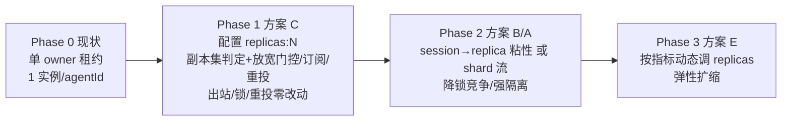

# 同一 agentId 多并发副本（横向扩展负载能力）方案对比与建议

> **文档定位**：研究 / 评审文档（无实现代码），面向「如何让同一个 `agentId` 拥有多个并发服务实例以提高负载能力」。
> **结论先行**：现有 Redis 租约机制只解决了「跨 `agentId` 分片（均衡）」与「单 `agentId` 故障转移（高可用）」，**没有**解决「同一 `agentId` 的并发副本（横向扩展）」。经工程师核实（见 §8 核实报告要点），运行时**并非完全无状态**——上下文工程插件层（HITL 挂起态、自动压缩 bookkeeping、各副本独立 config 缓存）未外置，因此推荐**方案 C（共享消费组 + 副本池）+ 软亲和（session→replica 粘性 hint）+ 最小补强（HITL 两 store 迁 Redis）** 作为首步：横向扩展照拿、正常路径同会话粘同副本保留进程内态、仅副本故障时才跨副本重放（此时 HITL 已外置可接管），出站/锁/重投零改动。二期按方案 E 做动态扩缩。

---

## 0. TL;DR 与变更影响一览

| 维度 | 现状 | 推荐首步（方案 C）的影响 |
|------|------|------------------------|
| 同一 `agentId` 并发实例 | 1（单 owner） | N（配置 `replicas`） |
| 会话串行保证 | `aip:session:{sid}:lock` 跨 core 分布式锁 | **完全复用，零改动** |
| 出站 `aip:stream:gw:{gwId}:events` | per-owner，与 agent owner 无关 | **完全不受影响** |
| 崩溃重投 XAUTOCLAIM | 已实现 | **完全复用** |
| 新中间件 | 无 | **无** |
| 主要改动文件 | — | `core_ownership.py` / `manager.py` / `inbound_worker.py`（仅放宽门控与订阅/重投逻辑）；`redis_stream.py` 出站**不改** |
| 关键前置决策 | — | **运行时持未持久化易失态（已核实）** → 采用 **C + 软亲和 + HITL 外置补强**：正常路径粘同副本保进程内态，故障接管时 HITL 已 Redis 化可续跑 |

---

## 1. 问题精确定义

### 1.1 两种「扩展」的本质区别

| 扩展类型 | 含义 | 现有机制是否覆盖 | 说明 |
|----------|------|------------------|------|
| **(a) 跨 `agentId` 均衡（分片 Sharding）** | 把不同 `agentId` 摊到不同 core | ✅ 已覆盖 | `CoreOwnership.claim(agent_id)` 用 `SET aip:agent:{agentId}:owner NX PX` 把不同 agent 均衡到不同 core（决策 1）。这是「分片」，不是「副本」。 |
| **(b) 同一 `agentId` 并发副本（Replication）** | 同一个 `agentId` 起 N 份运行时同时服务 | ❌ 未覆盖 | 现有 `claim` 的 `RENEW_SCRIPT` / `CLAIM_SCRIPT` 强制「他主拒绝」（`cur != ARGV[1]` → 返回 0），全局**最多一个** owner（见 `core_ownership.py` L116‑144）。热点 agent 的流量只能压在单一 core 上。 |
| 故障转移（HA） | 一个 core 挂了另一个接管 | ✅ 已覆盖 | owner 租约 TTL 过期 → 他 core 抢注 → `on_lost` 停本地运行时避免双活（`core_ownership.py` L283‑352，`manager.py` L523‑532）。这是「一个顶上另一个」，不是「多个一起扛」。 |

**结论**：用户说的「提高负载能力、多个实例同时提供服务」是类型 **(b)**。现有机制只做 (a) 与 HA，**(b) 的横向扩展为零**。

### 1.2 核心张力（本分析的总纲）

> **同一会话的消息必须串行处理（否则会话状态竞争），但不同会话可以并行。**
> 因此「并发」的真正单位是 **session**，不是 agent 进程。

现有代码已经把这个张力处理了一半：
- **跨会话并行**：`InboundStreamWorker` 用 `asyncio.Semaphore(self._max_concurrency)` + 每消息 `create_task` 实现有界并发（`inbound_worker.py` L111, L295‑329, L331‑371）——同一 core 内能并行处理不同 session。
- **同会话串行**：`RedisSessionLock`（`aip:session:{sid}:lock`，fencing token + 看门狗续期）把同会话的并发处理跨 core 严格串行化（`session_lock.py`，`inbound_worker.py` L516）。会话状态已**外置 Redis**（`SessionManager`，TTL 24h），多 core 故障转移从 Redis 恢复（`session.py`，设计文档 §2.2）。

**瓶颈只剩一点**：类型 (b) 缺失 → 一个 `agentId` 的所有 session 都被**单 owner core** 独占消费（`inbound_worker._resolve_stream_keys` 只订阅 `current_owner == self` 的 agent 流，L199‑216）。当某 agent 的并发 session 数超过单 core 的 `INBOUND_MAX_CONCURRENCY` / CPU / LLM 并发上限时，只能堆在一条 core 上排队。**方案的目标 = 把同一 `agentId` 的 session 摊到 N 个 core 上的 N 份运行时，同时用现有 session 锁守住同会话串行。**

---

## 2. 现有拓扑回顾（已核实，作为改造基线）

```mermaid
graph TD
  U[企微/H5 客户端] --> OG[Owner Gateway<br/>aip:bot:{botId}:owner]
  OG -->|XADD| R[(Redis)]
  R -->|aip:stream:agent:{agentId}| IC[Owning Core<br/>aip:agent:{agentId}:owner]
  R -->|aip:stream:inbound:{channel}| ALL[所有 Core 共享消费组 agent-core-group]
  IC -->|取锁 aip:session:{sid}:lock| IC
  IC -->|get_session 状态来自 Redis| S[(SessionManager Redis)]
  IC -->|出站: session→bot→gw owner| R2[aip:stream:gw:{gwId}:events]
  R2 --> OG2[Owner Gateway 独占消费]
  note1[现状约束: 单 agentId 仅 1 个 owner core 消费其 stream:agent 流;<br/>跨会话并行限于单 core 内; 同会话靠 session 锁串行]
```

**关键事实（用于下文判断改动面）**：
- 入站两类流：`aip:stream:agent:{agentId}`（**仅 owning core 消费**）+ `aip:stream:inbound:{channel}`（所有 core 共享，首条未绑定消息再重投到 owning core）。—— `inbound_worker.py` L185‑216, L424‑447。
- 出站解析链：`sessionId → GET aip:session:{sid}:bot → botId → GET aip:bot:{botId}:owner → gatewayId → XADD aip:stream:gw:{gatewayId}:events`（`redis_stream.py` L286‑336）。**与 `aip:agent:{agentId}:owner` 完全无关** → 任何 agent 侧副本化都不触碰出站。
- 消费组 `CONSUMER_GROUP = "agent-core-group"` 已是多消费者组（`redis_stream.py` L30）。Redis Stream 的 consumer group **原生支持同组多消费者各取一部分消息**——这是方案 C 能近乎零成本落地的基础。

---

## 3. 候选方案（A–E）

> 每个方案均标注：思路 / 对现有 4 个文件 + Redis 键的影响 / 利 / 弊 / 最适合场景。

### 方案 A：按 session 分区（一致性哈希 / 取模）—— 分片流

**思路**：把单一 `aip:stream:agent:{agentId}` 切成 K 个 shard 流 `aip:stream:agent:{agentId}:shard:{k}`；生产侧（Gateway `MessageRouter.route` 或 `inbound_worker`）按 `hash(sessionId) % K` 路由；每个 shard 由 1 个 core 独占消费。单 `agentId` 并发度 = K。

**对现有拓扑影响**：
- `redis_stream.StreamKeys`：新增 `agent_inbound_shard(agent_id, k)`。
- Gateway `MessageRouter.route`：**需跨端改生产侧**写 shard 流（设计文档 §1.2 已将此列为「备选、侵入更大」）。
- `core_ownership.py`：需为 `(agentId, shard)` 维护 K 个租约 / 或 `aip:agent:{agentId}:owner:{k}`。
- `inbound_worker`：订阅本 core 负责的 shard 流；session 锁仍作兜底。
- 出站：`aip:stream:gw:{gwId}:events` **不受影响**。

**利**：会话预分区，同 session 必落同 shard，shard 内锁竞争极低；隔离清晰；单 shard 故障只影响 1/K 会话。
**弊**：改生产侧路由（跨 Gateway/Backend 两端）；**K 变化（扩缩）需 rehash drain**——正在处理的 session 要从旧 shard 迁到新 shard，涉及「停旧流、迁会话、起新流」的再平衡，复杂度高；设计文档 §1.2 第 4 条已明确本期不采用哈希分区正是出于此顾虑。
**最适合**：单 agent 会话量极大、强隔离诉求、能接受 rehash 成本的场景。

### 方案 B：会话亲和 + 无状态副本池 —— 去独占租约

**思路**：去掉「agent 级独占租约」，改为每个 core 都起该 agent 的运行时（副本）；前置按 `hash(sessionId)` 把会话粘到某个副本。`aip:agent:{agentId}:owner` 降级为「存活心跳 / 注册」而非「独占」。因会话状态已在 Redis，副本可随时接管。

**对现有拓扑影响**：
- `core_ownership.py`：租约语义从「独占」改为「副本注册 / 存活」；维护 `aip:agent:{agentId}:replicas`（set）或按稳定 `core_id` 在 `aip:cores:members` 中排序取前 N。
- `manager.sync_from_configs`：从「claim 失败就 continue」改为「本 core 在副本集则起运行时」。
- 生产侧：按 `hash(sessionId) % N` 选副本（写对应副本流或经路由键）。
- 出站：不受影响。

**利**：真正 active-active；故障转移窗口近 0（副本常活，死一个仅丢其容量）；会话状态 Redis 外置使接管无内存依赖。
**弊**：需管理副本成员集与再平衡；跨副本仍需 session 锁兜底（除非运行时每轮无状态重放，否则须粘性）；运维比单 owner 复杂。
**最适合**：希望真正多副本同时扛、低故障窗口、且运行时可跨副本无状态重放。

### 方案 C：Worker 池 / 任务队列 —— 共享消费组（★推荐首步）

**思路**：同一 `agentId` 的 `aip:stream:agent:{agentId}` 保持**单流单消费组 `agent-core-group`**，让 N 个副本 core 各自作为一个 consumer **竞争消费**；N 个 worker（均持该 agent 运行时）分摊消息。靠**现有 `aip:session:{sid}:lock`** 保证同会话串行、跨会话并行。

**对现有拓扑影响（最小）**：
- **不改生产侧路由**（Gateway 照旧写 `aip:stream:agent:{agentId}`）。
- **出站 `redis_stream.py` 零改动**（解析链与 agent owner 无关）。
- `core_ownership.py`：仅新增「副本集判定」（本 core 是否在该 agent 的副本集），`claim` 对 replicated agent 不再「他主拒绝」。
- `manager.sync_from_configs`：放宽门控——副本集内 core 均 `create/start` 运行时并写 `aip:agent:registry`（标注 `replica_index`）。
- `inbound_worker`：`_resolve_stream_keys` 对 replicated agent 订阅其流当且仅当本 core 在副本集；`_check_owned/_reroute_to_owner` 对 replicated agent 不再重投到单一 owner，而是「本 core 是副本则本地处理，否则投回共享流让任意副本消费」。session 锁路径**不动**。

**利**：**近乎零侵入**——复用 consumer group 原生多消费者、`RedisSessionLock`、XAUTOCLAIM 全部既有能力；出站完全不受影响；新消息即时分摊到存活副本，故障转移窗口从「全量接管 ~10–30s」降为「在途 ~30s、新消息 0 等待」；无新中间件。
**弊**：同一 session 的不同消息可能被不同副本处理（consumer group 轮询投递），**要求运行时对单 session 跨轮可无状态重放（从 `SessionManager` 历史重放）**；若运行时持有未持久化易失中间态，则需叠加方案 B 的会话粘性。session 锁仍有跨副本争用（但已是低开销 Redis `SET NX`）。
**最适合**：**最小侵入优先、想快速拿到横向扩展、运行时可每轮无状态重放（或接受锁保串行）** 的场景——即当前最务实的演进起点。

### 方案 D：租约副本数配额 —— 多 owner / hash slot

**思路**：允许同一 `agentId` 最多 N 个 owner。实现为 N 个独立租约键（如 `aip:agent:{agentId}:owner:{slot}`，slot = `hash(sessionId) % N`），每 slot 由 1 个 core 持运行时；再按 session 亲和把会话分流到对应 slot。是方案 A（分片）与独占租约的折中。

**对现有拓扑影响**：
- `core_ownership.py`：`claim` 改为针对 `(agentId, slot)` 的多 key 租约；新增 slot 分配 / 平衡逻辑。
- `manager`：按 slot 起运行时。
- 路由：按 slot 预分区（同 A 的生产侧改动，但规模在 N 内）。
- 出站：不受影响。

**利**：每 slot 独立租约 → 故障边界清晰（仅该 slot 需接管）；兼得并行与「每分片独占」的可观测性。
**弊**：多 key 租约 + slot 平衡，实现与运维复杂度高于 C；仍面临 rehash drain（N 变化时）。
**最适合**：既想并行、又想保留「每分片独占租约」清晰故障边界的团队。

### 方案 E：热点 agent 动态扩缩（弹性，叠加项）

**思路**：在 A/B/C/D 任一底座之上，按**活跃会话数 / 入站队列深度 / P95 时延**自动增减某 `agentId` 的副本数（N）。需要指标采集（复用 `AgentInstance.active_sessions`、`AgentManager.health_check`、registry 心跳）与一个轻量控制器。

**对现有拓扑影响**：依赖前序方案落地；控制器调 `replicas` 配置并触发 `sync_from_configs` 重新均衡；扩缩触发 rehash drain（若用 A/D）或副本加入/退出（若用 B/C）。
**利**：应对波峰波谷，成本最优。
**弊**：需先有指标与再平衡机制，改动面最大，建议作为三期。
**最适合**：负载波峰波谷明显、追求弹性的生产环境。

---

## 4. 方案对比矩阵

| 方案 | 并发模型 | 会话一致性保证 | 故障转移窗口 | 改动面大小 | 破坏现有 per-owner 出站 | 引入新中间件 | 运维复杂度 | 最适合场景 |
|------|----------|----------------|--------------|------------|------------------------|--------------|------------|------------|
| **A 分片流** | 单 agent 拆 K 个 shard 流，每流 1 core，并发度=K，session 预分区 | 同 session 必落同 shard；shard 内锁兜底 | shard 级 ~10–30s（仅该 shard 接管） | 中‑大（改 Gateway 生产侧 + `StreamKeys` + `inbound_worker` + 租约） | 否 | 否 | 中（K 规划 + rehash drain） | 单 agent 会话量极大、强隔离、可容忍 rehash |
| **B 副本池+亲和** | N core 各持运行时，按 `hash(sessionId)%N` 粘副本，并发度=N | 同 session 粘同副本；状态 Redis 外置可接管；锁兜底 | 近 0（副本常活，死一个仅丢容量；在途 ~30s） | 中（去独占租约 + 副本成员集 + 生产侧路由） | 否 | 否 | 中（成员管理 + rehash） | 真 active-active、低故障窗口、运行时可无状态重放 |
| **C 共享消费组 ★** | 单流 + 同组 N 消费者竞争，并发度=N（跨会话并行，同会话靠锁串行） | **现有 `aip:session:{sid}:lock` 已跨 core 串行同会话** | 新消息 0 等待；在途 ~30s（XAUTOCLAIM） | **小（仅放宽门控/订阅/重投；不改生产侧、不改出站）** | 否 | 否 | **低（沿用现有拓扑）** | 最小侵入优先、快速横向扩展、运行时可每轮无状态重放 |
| **D 租约副本配额** | 同 agent 允 N owner（多 key slot），每 slot 1 core，并发度=N | 每 slot 独立租约 + 锁；同 session 落固定 slot | slot 级 ~10–30s（仅该 slot 接管） | 中（多 key 租约 + slot 平衡 + 路由） | 否 | 否 | 中‑高 | 既要并行又想保留每分片独占故障边界 |
| **E 动态扩缩** | 在 A/B/C/D 之上按指标自动调 N | 取决于底座；扩缩触发 rehash drain | 同底座 | 大（需控制器 + 指标先行） | 否 | 可能需指标组件（非必须） | 高 | 负载波峰波谷明显、需弹性 |

> 共同结论：**五种方案都不破坏现有 `aip:stream:gw:{gwId}:events` per-owner 出站**（出站解析链与 `aip:agent:{agentId}:owner` 无关），也**都不引入新中间件**（纯 Redis Streams + 现有 session 锁）。差异集中在「改动面」与「故障窗口」与「对运行时无状态性的要求」。

---

## 5. 推荐方案 + 演进路径

### 5.1 推荐组合

**首步 = 方案 C（共享消费组 + 副本池）+ 软亲和（session→replica 粘性 hint）+ 最小补强（HITL 两 store 迁 Redis）**，以现有 `aip:session:{sid}:lock` 作为同会话串行的正确性锚点；正常路径同会话粘同副本（保留进程内上下文工程插件态），仅副本故障时才跨副本重放（此时 HITL 已外置可续跑）；二期按方案 E 做动态扩缩。纯方案 C（无粘性）经核实**不可直接落地**（见 §8）。

**为什么是 C 而不是 A/B/D**：
1. **最小侵入**：不改 Gateway 生产侧路由、不改出站、不新增 Redis 键族（除一个副本集标记）；直接复用 consumer group 原生多消费者、`RedisSessionLock`、XAUTOCLAIM 三大既有能力。
2. **出站零风险**：per-owner 出站解析链完全不涉及 agent owner，副本化对其透明——这是对比矩阵里所有方案的共性安全垫，但 C 把「不动」做到了极致。
3. **故障窗口最优**：副本常活，新消息即时分摊；在途消息由既有 `_reclaim_loop` 的 XAUTOCLAIM 重投到存活副本。
4. **演进无损**：C 的副本集机制（本 core 是否在副本集）可直接作为二期 A/B 分片路由的输入，不返工。

**C + 软亲和的前置条件（已核实，需补强）**：经工程师核查（§8），运行时**不可完全无状态重放**——`ApprovalStore`/`FormFillPendingStore`（HITL 审批/表单挂起态）为进程内 dict、自动压缩 `compact_checkpoints`/`compact_last` 寄生于每轮临时 `tool_metadata`、`AgentConfig` 各副本独立缓存。因此必须：① 软亲和（正常路径粘同副本，避免跨副本重放）；② **最小补强——把 HITL 两 store 迁 Redis**（最高优先，否则接管副本 `resume_formfill` 必失败）；③ 可选把压缩态提升为 `session.state` 键。补强后故障接管可容忍。

### 5.2 最小侵入改造点（只描述，不写代码）

**`cluster/core_ownership.py`**
- 新增「副本集判定」：`replica_set(agent_id)` / `is_replica(agent_id, core_id)`——基于配置 `replicas: N`（默认 1）与稳定 `aip:cores:members` 集合按 `core_id` 排序取前 N，或维护 `aip:agent:{agentId}:replicas`（set）。
- 保留 `aip:agent:{agentId}:owner` 单 key 作为「协调者/主」用于注册表与 drain（`on_lost` 仅在失去主身份且本 core 不在副本集时停运行时）。
- `claim` 对 `replicas>1` 的 agent 语义从「他主拒绝」改为「加入副本集即启动运行时」。

**`agent/manager.py`**
- `sync_from_configs`：对 `replicas>1` 放宽门控——本 core 在副本集则 `create/start` 运行时并写 `aip:agent:registry`（value 增加 `replica_index`）；不在副本集则确保本进程无该运行时（替代现有 `claim` 失败即 `continue`）。
- 复用既有 `reload_config` 保证副本间配置一致性（新配置对新会话生效，旧会话沿用至完成，逻辑已存在）。
- `ensure_agent_ready` 懒加载逻辑不变。

**`queue/inbound_worker.py`**
- `_resolve_stream_keys`：对 replicated agent，订阅 `aip:stream:agent:{agentId}` 当且仅当本 core 在副本集（替代现有 `current_owner == self`）。
- `_check_owned` / `_reroute_to_owner`：对 replicated agent，不再重投到单一 owner；改为「本 core 是副本 → 本地处理；非副本 → 投回共享 `aip:stream:agent:{agentId}`（任意副本消费）」。
- `_handle_message` 的 session 锁路径**保持不变**（正确性锚点）。
- 二期可选：按 `hash(sessionId)%N` 预路由到 shard 流以降低锁竞争（方案 A/B）。

**`queue/redis_stream.py`**
- **出站 `publish_agent_event` 无需改动**（`sessionId → bot → gw owner` 解析链与 agent owner 无关）。
- 二期若做分片：`StreamKeys` 增加 `agent_inbound_shard(agent_id, k)`，且需 Gateway `MessageRouter.route` 生产侧配合（跨端改动，非必要不首期做）。

### 5.3 演进阶段（从单 owner 到多副本）



- **Phase 1（推荐首步，方案 C + 软亲和 + HITL 外置）验收**：起 2–3 core + `replicas=2` 的 agent，该 agent 入站被多 core 分摊；同会话仍严格串行（session 锁）；正常路径同会话粘同副本、保留进程内上下文工程态；杀掉一个副本 core，其余副本经 XAUTOCLAIM 接管在途消息，且 HITL 挂起会话因 store 已 Redis 化可在接管副本续跑。
- **Phase 2（强化）**：若锁竞争或运行时易失态成为问题，加会话粘性/分片。
- **Phase 3（弹性）**：指标驱动动态 `replicas`。

### 5.4 推荐拓扑（Phase 1 落地后）

```mermaid
graph TD
  U[客户端] --> OG[Gateway<br/>XADD aip:stream:agent:{agentId}]
  OG --> R[(Redis: 单流 单组 agent-core-group)]
  R -->|同组多消费者 竞争消费| C1[Core-1 副本0<br/>持运行时]
  R -->|同组多消费者 竞争消费| C2[Core-2 副本1<br/>持运行时]
  R -->|同组多消费者 竞争消费| C3[Core-3 ...]
  C1 -->|取锁 aip:session:{sid}:lock 同会话串行| S[(SessionManager Redis)]
  C2 -->|取锁| S
  C3 -->|取锁| S
  C1 -->|出站 session→bot→gw| GW[aip:stream:gw:{gwId}:events 不受影响]
  C2 --> GW
  note[并发度=N 副本; 同会话由 session 锁跨 core 串行;<br/>core 死 → XAUTOCLAIM 重投存活副本]
```

---

## 6. 关键风险与待明确事项

### 6.1 关键风险

1. **运行时易失中间态（已核实，最高优先）**：经工程师核查（§8）确认——`ApprovalStore`/`FormFillPendingStore`（HITL 审批/表单挂起态，`hitl/store.py:96`、`hitl/formfill_pending.py:68`）为**进程内 dict**；自动压缩 `compact_checkpoints`/`compact_last` 寄生于每轮临时 `tool_metadata`（`oh_runtime_builder.py:363`、`compact/__init__.py:207`）；`AgentConfig` 各副本独立内存缓存+轮询（`config_manager/manager.py:49`）。这些是方案 C 纯版不可直接落地的根因。缓解：**软亲和（正常路径粘同副本）+ HITL 两 store 迁 Redis（必补）+ 可选压缩态外置**。另：`MemoryInjector` 当前未接线（记忆注入不生效），与扩缩无关但属上下文工程缺口。
2. **副本间配置一致性**：`replicas>1` 时所有副本须跑同一 `config.version`。现有 `reload_config` 已支持热重载（新会话生效），但需确保副本集内「配置版本对齐」的可观测与对齐机制。
3. **扩缩容 rehash drain**：`replicas` 从 N 变 N' 时，正在处理的 session 需从离场副本迁出。方案 C 因 consumer group 自动再均衡较平滑；方案 A/D 的预分区则需显式 drain。需设计「优雅退场」（先停新消息分配、排空在途、再退出）。
4. **脑裂双写会话状态**：若 Redis 本身未分裂，session 锁的 fencing token（`{coreId}:{uuid}`）保证同会话不会双活处理、不会双 ACK。但若出现 Redis 层脑裂（超出本方案范围，由 Redis HA 兜底），需明确不在此期处理。
5. **监控 / 容量规划缺口**：需新增每 agent 的 `active_sessions`、入站队列深度、副本分布、各副本 P95 时延指标（复用 `AgentInstance.active_sessions` 与 `health_check`，registry 增加副本维度）。否则无法判断何时该扩、扩多少。
6. **副本数上限与资源**：N 个副本 = N 份运行时内存 + N×LLM 并发配额。需对单 agent 设 `replicas` 上限，避免「为扩而扩」压垮 LLM 网关 / 显存。

### 6.2 需用户/主理人拍板的问题

| # | 问题 | 影响 |
|---|------|------|
| Q1 | 副本数如何定？是否按 agent 配置显式声明 `replicas: N`（默认 1 = 现状）？是否有全局上限？ | 决定副本集判定与资源预算 |
| Q2 | ~~运行时单 session 跨轮是否可无状态重放？~~ **已核实：不可完全无状态重放** → 已锁定采用 **C + 软亲和 + HITL 外置**，不再走纯 C | 已拍板 |
| Q3 | 是否接受「用故障转移窗口换吞吐」？方案 C 把新消息窗口降到 ~0，但在途消息仍 ~30s（XAUTOCLAIM） | 影响验收标准与 SLA 承诺 |
| Q4 | 副本成员如何确定？稳定 `core_id` 排序取前 N，还是显式 `aip:agent:{agentId}:replicas` 集合？ | 决定 `core_ownership.py` 改造形态 |
| Q5 | 是否首期就做分片流（方案 A）/ 粘性（方案 B），还是先落地方案 C 最小步？ | 决定首期改动面与上线节奏 |
| Q6 | 扩缩容的再平衡责任（谁触发 drain、优雅退场策略）是否本期必须？ | 决定是否需要 Phase 3 控制器 |
| Q7 | 是否引入指标采集组件（Prometheus 等）支撑后续动态扩缩？ | 决定方案 E 的前置依赖 |

---

## 7. 下一步建议（交给谁做什么）

- **架构（本角色）**：已基于核实结论把推荐从「纯 C」修正为「C + 软亲和 + HITL 外置」；`core_ownership.py` / `manager.py` / `inbound_worker.py` 的 Phase 1 改造点见 §5.2。
- **工程师（进行中）**：落地 **HITL 两 store 迁 Redis**（`hitl/store.py:96`、`hitl/formfill_pending.py:68`，TTL 对齐 30min/5min），使故障接管可续跑；并补单测。
- **QA（后续）**：对 HITL Redis 化做回归 + 故障接管（杀副本）验证。
- **二期（按需）**：压缩态外置为 `session.state` 键、Config 副本一致性、Coordinator cancel 跨进程；视锁竞争/易失态决定。

---

## 8. 上下文工程插件层持久化核实报告要点（2026-08-20，工程师寇豆码）

> 调研范围 `agent/ai-platform/backend/src` + `docs/ai-fusion/`；全库 grep（`MemorySaver|checkpointer|RedisSaver|LangGraph|save_state|load_state|snapshot`）＋ 逐文件精读 runtime / session / hitl / config_manager / coordinator / skills / memory 模块。结论档位 **③ 部分可行**。

- **已外置**：对话消息历史（Redis 24h TTL + PG 冷备双写）、`session.state` 中的 `pending_formfill`/`worker_sessions`/`worker_failures`/`dispatch_trace`/`pending_kb_sources_fence`/`mis_upstream_jwt`/`tenant_id`/`delegated_from`/`parent_hint`。
- **全库无 checkpoint/saver**（无 `MemorySaver`/`LangGraph` 实际依赖）；跨进程恢复只能靠 `session.messages` 重放。
- **跨副本必丢（未外置）**：
  1. HITL 审批/表单挂起态 `ApprovalStore`/`FormFillPendingStore` 纯进程内 dict（`hitl/store.py:96`、`hitl/formfill_pending.py:68`）——**最高风险**，接管副本 `resume_formfill` 必失败。
  2. 自动压缩 bookkeeping `compact_checkpoints`/`compact_last` 寄生于每轮临时 `tool_metadata`（`oh_runtime_builder.py:363`、`compact/__init__.py:207`）——高风险。
  3. `AgentConfig` 各副本独立内存缓存 + 轮询（`config_manager/manager.py:49` + `watcher.py`）——中风险（插件集错配）。
  4. Coordinator `_running_tasks`/`Semaphore`/`Lock` 进程内（`coordinator/sessions.py:335`）——中风险（cancel 信号丢失）。
  5. `MemoryInjector` 未接线（`memory/injector.py`）——中风险，记忆注入当前不生效，与扩缩无关。
- **三方案启示**：纯 C ❌ 当前不可行（接管丢 HITL→续跑失败）；**C + 软亲和 ⚠️ 可行但需最小补强（HITL→Redis）**；硬 B ✅ 当前代码最接近可行（单会话钉同副本则内存态天然可用）。
- **待补工作（仅列位置）**：HITL 两 store 改 Redis；压缩态提升为 `session.state` 键；Config 副本一致性；Coordinator cancel 跨进程；MemoryInjector 接线决策。

## 附录：核实依据（源码）

- `agent/ai-platform/backend/src/cluster/core_ownership.py` — `agent_owner_key`=`aip:agent:{agentId}:owner`；`CLAIM_SCRIPT`/`RENEW_SCRIPT`/`RELEASE_SCRIPT` 强制「他主拒绝」(L116‑144)；`start_heartbeat` + `on_lost` 失主停运行时 (L283‑352)；`get_core_id` 稳定 ID。
- `agent/ai-platform/backend/src/agent/manager.py` — `sync_from_configs` 多 core 门控：`claim` 失败即 `continue`（单 owner，L372‑427）；`bind_core` 注入 core 身份（L199‑211）；`reload_config` 配置热重载（L298‑337）；`stop_agent_if_owned` 失主停运行时（L523‑532）；`aip:agent:registry` 写全局注册表（L445‑468）。
- `agent/ai-platform/backend/src/queue/inbound_worker.py` — `_resolve_stream_keys` 仅订阅 `current_owner == self` 的 agent 流 (L185‑216)；`_check_owned`/`_reroute_to_owner` 非本 core 拥有的 agent 首条消息重投 owning core (L424‑447, L449‑504)；`_handle_message` 用 `Semaphore` + `RedisSessionLock` 同会话串行 (L506‑551)；`_reclaim_loop` XAUTOCLAIM 重投 (L372‑422)。
- `agent/ai-platform/backend/src/cluster/session_lock.py` — `aip:session:{sid}:lock`，`SET NX PX` + fencing token + 看门狗续期；争锁失败不 ACK 交 XAUTOCLAIM (L74‑185)。
- `agent/ai-platform/backend/src/queue/redis_stream.py` — `CONSUMER_GROUP="agent-core-group"` (L30)；出站 `publish_agent_event` 解析链 `sessionId → aip:session:{sid}:bot → aip:bot:{botId}:owner → aip:stream:gw:{gwId}:events` (L224‑336)；`StreamKeys.agent_inbound`=`aip:stream:agent:{agentId}` (L94‑107)；出站与 agent owner 无关（关键安全垫）。
- `docs/ai-fusion/ai-platform-gateway-detailed-design.md` — §1.2/§2.2/§3.2/§7/§8 确认：单 owner 租约、session 锁保串行、会话状态 Redis 外置（TTL 24h）、出站 per-owner、以及「本期不引入 `aip:session:{sid}:core` 强制路由」「哈希分区本期不采用（rehash drain 侵入大）」等既有决策。
