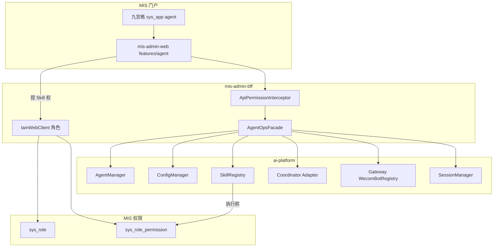

# 智能体运营控制台架构说明

> 版本：v1.4｜日期：2026-08-05  
> **界面：MIS host App 优先**；**运行时：ai-platform**  
> 决策：[adr.md](adr.md)｜界面：[ui.md](ui.md)｜规范：[spec.md](spec.md)

---

## 1. 架构定位

| 层 | 归属 | 职责 |
|----|------|------|
| 产品 UI | `mis-admin-web` `features/agent` + `sys_app=agent` | 运营控制台全部页面（UI#1–#10） |
| 聚合鉴权 | `mis-admin-bff` | JWT、菜单/API 权限、WebClient 调 ai-platform |
| 平台权限 | mis-system / IAM / migrator | `sys_app`、菜单、`sys_role`、Skill 执行码 |
| 运行时引擎 | `agent/ai-platform` | Agent/Skill 执行、C–W、MCP、会话、Gateway 企微、YAML 热更新 |

对标：知识库 App（壳在前端+BFF，引擎/领域在独立服务）；本方案领域执行在 Python，而非新建 `mis-agent` 运行时。

---

## 2. 逻辑架构



---

## 3. 模块职责

| UI# | 前端（host App） | BFF | 运行时 |
|-----|------------------|-----|--------|
| #1 #7 | SkillsPage | 代理 `/skills` | SkillRegistry |
| #2 | SkillPermissionsPage | 写 grants → `sys_role_permission`；列角色 | 执行前验权限码 |
| #3 | WecomBotsPage | 代理 channels API | Gateway Registry |
| #4 | SessionsPage | 代理 sessions 列表/删 | SessionManager |
| #5 | AgentSkillsPage | 代理 agent skills | enabled-skills + 热更新 |
| #6 | ChatPage | 代理 chat/session | Agent 对话 |
| #8 | McpPage | 代理 `/mcp` | MCPManager |
| #9 | AgentConfigPage | 代理 config-files | ConfigManager |
| #10 | Coordination + Catalog | 代理 coordination / worker-catalog | role + Catalog |
| — | Monitor / Approvals / Dispatch | 代理 admin | 既有能力 |

---

## 4. 关键数据流

### 4.1 技能权限（mis-system）

```text
host App 授权页 → BFF → 写 sys_role_permission(ai:skill:{id}:run)
用户对话触发 Skill（任意路径）
  → ai-platform 取用户 MIS 权限码（JWT/IAM/Redis）
  → 无执行码 → 拒绝（fail-closed）
  → 再检查 Agent.enabled_skills
```

### 4.2 配置保存（#9 / #10）

```text
host App → BFF → ai-platform PUT coordination|config-files
  → ConfigManager 校验写盘 → Watcher → AgentManager / WorkerCatalog.rebuild
```

### 4.3 企微多 Bot

```text
host App 维护 Bot 配置 → BFF → Gateway/Backend
企微回调 → Gateway /wecom/bot/callback/{botId} → 入站会话
```

---

## 5. 与业务对话双路径

| 路径 | UI | 是否经 Coordinator |
|------|-----|-------------------|
| 业务 Copilot | mis-admin-web 能力位 / H5 embed | 是（C–W） |
| 专用能力页 | `/ai/*` 或 kb QA 等 | 可直连 Worker |
| **运营本地对话** | **`/agent/chat`（host App）** | 可选直连任意 Agent（调试） |

---

## 6. 分期（架构增量）

| 阶段 | 增量 |
|------|------|
| O0 | 文档（host App 优先） |
| O1-portal | `sys_app`+菜单+ENTERABLE+`features/agent` 壳与导航 |
| O1a–g | 各业务页 + BFF Facade；对齐原 O1a–g 能力（含 #10） |
| O2–O3 | Dispatch / Catalog schema 同步（C1–C3） |

---

## 7. 关联

- [adr.md](adr.md) · [ui.md](ui.md) · [prd.md](prd.md) · [spec.md](spec.md)  
- KB：[../../backend/knowledge-base-app-plan.md](../../backend/knowledge-base-app-plan.md)
