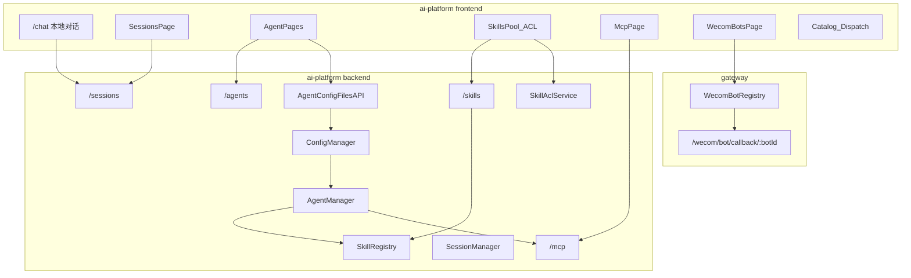

# 智能体运营控制台架构说明

> 文档角色：本需求的**架构视图**。  
> 版本：v1.1｜日期：2026-08-04（v1.2 增补 UI#10 C–W 配置流）
> 界面硬约束：[ui.md](ui.md)  
> 决策：[adr.md](adr.md)｜规范：[spec.md](spec.md)｜需求：[prd.md](prd.md)

---

## 1. 架构定位

运营控制台 = **ai-platform 运维面**，覆盖：

- Agent 生命周期与**人设/配置文件**
- **技能池**、**技能 ACL**、**Agent↔Skill 绑定**
- **MCP** Server 与工具
- **会话**审计与删除
- **企微多机器人**（Gateway 通道）
- 本地调试对话
- （分期）Worker Catalog / 调度观测

业务对话仍走 mis-admin-web Copilot + C–W；本控制台不替代业务入口。

---

## 2. 逻辑架构



---

## 3. 模块职责（对齐 UI#）

| UI# | 模块 | 职责 |
|-----|------|------|
| #1 #7 | SkillRegistry + Skill API + SkillsPage | 技能池与 CRUD/启停 |
| #2 | SkillAclService + PermissionsPage | 主体×Skill 授权；运行时拦截 |
| #3 | WecomBotRegistry + Gateway + WecomPage | 多机器人配置、回调路由、健康 |
| #4 | SessionManager 扩展 list + SessionsPage | 全量会话、消息、删除 |
| #5 | enabled-skills 配置 + AgentSkillsPage | Agent 可用技能集 |
| #6 | ChatPage | 本地选 Agent 对话 |
| #8 | MCPManager + McpPage | Server 生命周期与工具 |
| #9 | AgentConfigFilesAPI + ConfigEditor | 人设/Prompt/facts/model/runtime |
| #10 | CoordinationAPI + WorkerCatalog + CoordinationPage/CatalogPage | role、委派白名单、Catalog 元数据、TaskBrief/超时/depth |
| — | TraceStore / DispatchPage | C–W 可观测（分期） |

---

## 4. 关键数据流

### 4.1 技能权限（#2）

```text
用户触发 skill 工具
  → SkillAclService.check(user/roles, skill_id)
  → allow / deny
  → deny 则工具返回明确错误（不静默跳过）
```

与 **#5 Agent 绑技能** 的关系：Skill 必须在 Agent 可用集内 **且** ACL 允许，方可执行。

### 4.2 企微多机器人（#3）

```text
企微回调 → Gateway /wecom/bot/callback/{botId}
  → WecomBotRegistry.resolve(botId)
  → 验签/解密（该 Bot 凭证）
  → 入站会话 channel=wecom_bot, bot_id=…
  → 绑定默认 Agent 或 AgentRouter
```

现网多为单 `WecomBotAdapter` 配置；目标态为 **Registry 多实例**，管理台 CRUD 写配置源，Gateway 加载。

### 4.4 Coordinator–Worker 配置（UI#10）

```text
UI CoordinationPage
  → PUT /agents/{id}/coordination
  → 写 agent.yaml role + catalog / coordinator.worker_ids
  → ConfigManager 校验
  → WorkerCatalog.rebuild
  → 刷新 Coordinator 委派工具 schema（C3）
```

| role | 平台行为（摘自 C–W Spec §14.3） |
|------|--------------------------------|
| coordinator | 注入委派工具；强制 TaskBrief（C1+）；禁止进入可委派白名单 |
| worker | 剥离 spawn；仅专长工具/MCP/skill；Catalog 元数据供调度 |

全局 `/admin/catalog` 为各 Worker `catalog` 段聚合视图；编辑深链回 CoordinationPage。

---

## 5. 与双路径对话

| 路径 | 说明 |
|------|------|
| 业务 Copilot | BFF → mis-copilot；不受本控制台 Agent 选择器影响 |
| 专用能力页 | 直连 Worker；非「选智能体」 |
| 运营 `/chat` | 本地调试任意 Agent（UI#6） |
| 企微 Bot | 多机器人各自默认 Agent / 路由 |

---

## 6. 分期（架构增量）

| 阶段 | 增量 |
|------|------|
| O0 | 文档（含 ui.md） |
| O1a–c | Skills UI、Sessions list API、MCP UI、Chat 文案、Agent 总览 |
| O1d | 绑技能 + 配置文件 API/编辑器 |
| **O1g** | **Coordination API/页 + Catalog 页（#10）** |
| O1e | SkillAcl 存储与运行时 |
| O1f | WecomBotRegistry 多实例 |
| O2–O3 | Dispatch；Catalog↔schema 深度同步（C1–C3） |

---

## 7. 关联

- 界面：[ui.md](ui.md)  
- 需求：[prd.md](prd.md)  
- 规范：[spec.md](spec.md)  
- C–W：[../coordinator-worker/architecture.md](../coordinator-worker/architecture.md)
