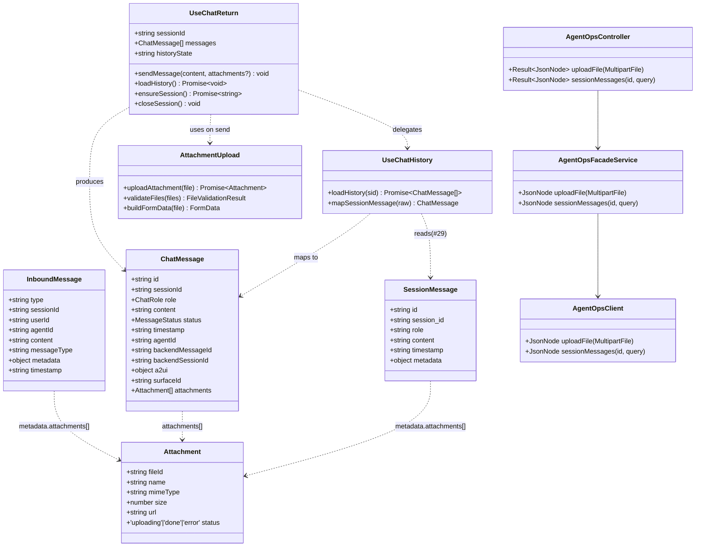
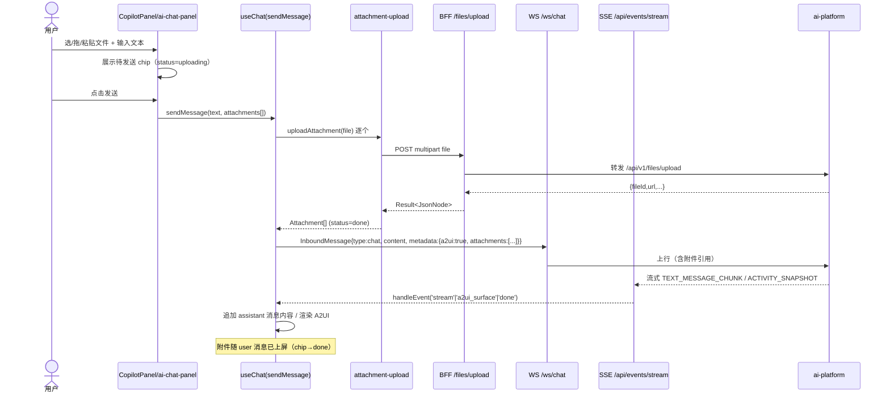
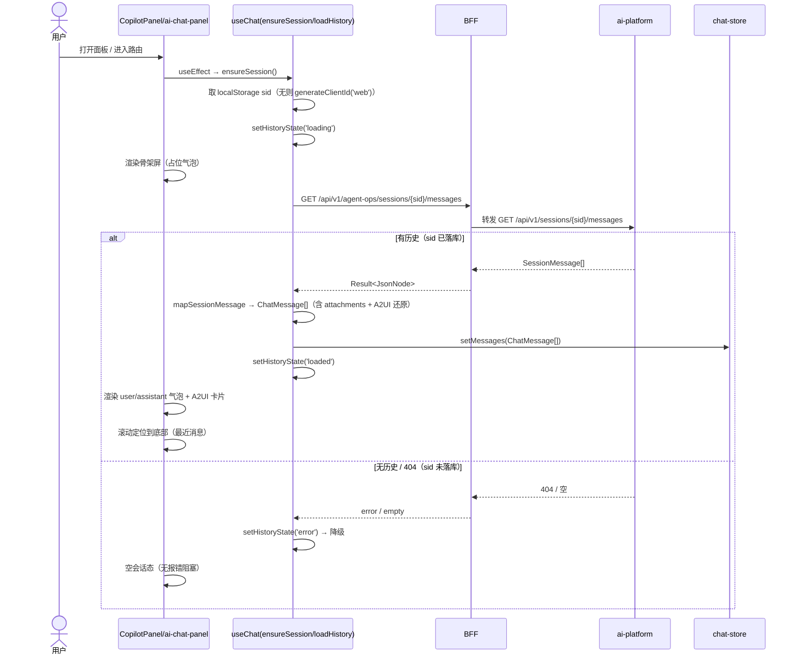

# MIS 平台 AI Copilot「P0 缺口补齐」系统设计 + 任务分解

> 文档类型：系统设计 + 任务分解（架构师交付）
> 版本：v1.0
> 作者：高见远（架构师）
> 关联文档：`docs/ai-fusion/agent-ops-console/copilot-p0-gaps-prd.md`（许清楚，PRD）
> 后端事实来源：Explore 核实结论（已采用，未再探索）

---

## 0. 设计总览（一句话）

以**单 session 模型**落地 P0：附件走「先传后引」两段式（BFF 薄转发 ai-platform 上传 → 拿 `fileId` 随 `metadata.attachments` 经 WS 上行 → 关联 SSE 流式回复）；历史走 BFF 已暴露的 `#29` 端点（`GET /api/v1/agent-ops/sessions/{id}/messages`，**无 `chat` 段**），进入会话即拉取并渲染（含 A2UI）+ 降级空会话。所有新增字段均为可选（optional），向后兼容存量 text 通道灰度回退。

---

## 1. 实现方案 + 框架选型

### 1.1 前端技术栈（沿用，无新增框架）

| 维度 | 选型 | 说明 |
|---|---|---|
| 框架 | React 18 + TypeScript | 沿用 `mis-admin-web` |
| UI | MUI + Tailwind + shadcn 风格组件 | 沿用（`Button`/`Textarea`/`Badge`/`Alert`） |
| 拖拽/粘贴 | 原生 `dragover`/`onPaste` + 可选 `react-dropzone` | 轻量，仅用原生事件即可满足 P0-1.2/1.3 |
| 状态 | zustand（`chat-store`） | 已承载全局会话/消息 |
| 连接 | SSE（`@microsoft/fetch-event-source`）+ WS（`ChatWsClient`） | 沿用 chat-core |

**决策**：P0 不引入 `react-dropzone`。理由：① 需求仅为「文件选择/拖拽/粘贴」三类原生事件，自写 ≤40 行工具函数即可；② 减少依赖体积与版本风险；③ 粘贴截图（`ClipboardItem`）react-dropzone 也不直接覆盖，仍需原生处理。若后续 P1 多会话需要更复杂的拖拽交互，再评估引入。

### 1.2 后端技术栈

| 维度 | 选型 | 说明 |
|---|---|---|
| BFF | Spring Boot（`mis-admin-bff`） | 沿用 `AgentOpsController` + `AgentOpsFacadeService` + `AgentOpsClient` 透明转发三件套 |
| 存储 | ai-platform 已有 `POST /api/v1/files/upload` | 本地磁盘 `{UPLOAD_DIR}/{file_id[:2]}/...`，白名单 + `UPLOAD_MAX_BYTES` 校验由下游完成 |
| 历史 | ai-platform `GET /api/v1/sessions/{session_id}/messages` | BFF `#29` 已透传，Copilot 直接复用 |

**决策**：BFF 不落地任何附件存储逻辑，仅做**薄转发**（multipart → 下游 + 登录上下文头透传）。历史**不新增端点**，直接复用 `#29`。

### 1.3 架构模式

沿用 chat-core 既有分层：`UI 壳（CopilotPanel / ai-chat-panel）→ useChat hook → chat-store（zustand）→ transport（SSE/WS）`。P0 新增：`useChatHistory` 历史加载逻辑（并入 `useChat`，避免跨 hook 状态竞态）+ `attachment-upload.ts` 工具模块。

---

## 2. 后端现状核实结论（逐条决策）

| # | Explore 事实 | 架构决策 |
|---|---|---|
| ① 附件存储 | BFF 无对话附件上传端点；ai-platform 已有 `POST /api/v1/files/upload`（白名单类型 + `UPLOAD_MAX_BYTES`，返回 `{fileId,name,mimeType,size,url:"/api/v1/files/{file_id}"}`，下载需 JWT） | **BFF 新增薄转发端点 `POST /api/v1/agent-ops/files/upload`** 透传 ai-platform，复用既有权限/登录上下文透传（`AgentOpsTransport`）。前端拿 `fileId`/`url` 放入消息 `metadata.attachments`。下载 URL 为内网相对路径，前端走 BFF 同源代理（`/api/v1/agent-ops/files/{file_id}`）。类型/大小校验下沉下游，BFF 只做透传 + 基础 content-type 校验。 |
| ② 历史 API | `GET /sessions/{id}/messages` BFF `#29` 已透传 → ai-platform，返回扁平 `SessionMessage[]`（`id/session_id/role/content/timestamp/metadata`），支持 `page`+`page_size`（默认 200，上限 1000） | **Copilot 直接复用 `#29`**，路径严格对齐 `GET /api/v1/agent-ops/sessions/{id}/messages`（**无 `chat` 段**）。sid 直接复用前端 `generateClientId('web')` 产物（已在 localStorage），无需 BFF 为 Copilot 单独建 session。 |
| ③ 附件与 SSE 关联 | WS 协议只传文本 + `metadata`；附件必须「先传后引」 | 前端先上传拿 `fileId`，再以 `metadata.attachments` 随文本消息经 WS 上行（`InboundMessage.metadata.attachments`）。SSE 流式回复按 sid 自然关联（与纯文本通道一致）。`ChatMessage.attachments?` 仅用于本地渲染与历史恢复展示。 |
| ④ sid 语义 | ai-platform `ensure_session` 接受任意 sid（含前端 `generateClientId('web')`），不存在则落地为 `agent_session` 主键 | **前端 sid 不变**（仍 `generateClientId('web')` + localStorage 持久化）。关键约束：**历史读取需「先发过消息让 sid 落库」，否则 404 降级为空会话**。P0 不做「先建 session 再读」的预建逻辑，按 PRD P0-2.4 降级。 |
| ⑤ 类型契约扩展点 | `ChatMessage`/`InboundMessage` 均无 attachments 字段 | 在 `src/lib/chat/types.ts` 新增 `Attachment` 接口；`ChatMessage.attachments?`、`InboundMessage.metadata.attachments?` 均为 optional。历史恢复时从 `SessionMessage.metadata.attachments` 映射到 `ChatMessage.attachments`。**全部向后兼容**（存量 text 通道不携附件，字段为空/缺省，不影响渲染）。 |

---

## 3. 文件列表及相对路径（标注 新建 / 修改）

### 后端 BFF（`backend/mis-admin-bff`）

| 文件 | 状态 | 说明 |
|---|---|---|
| `src/main/java/com/mis/adminbff/client/AgentOpsClient.java` | 修改 | 新增 `uploadFile(MultipartFile)` 方法 → 透传 ai-platform `/api/v1/files/upload`（multipart）；新增 `downloadFileUrl` 仅拼接代理路径（前端侧处理，BFF 无需改下载逻辑，沿用现有 `/api/v1/files/{id}` 透传，如有则复用，无则补一个 GET 透传） |
| `src/main/java/com/mis/adminbff/service/agentops/AgentOpsFacadeService.java` | 修改 | 新增 `uploadFile(MultipartFile)` 委托 client；（历史 `sessionMessages` 已存在，无需改） |
| `src/main/java/com/mis/adminbff/controller/AgentOpsController.java` | 修改 | 新增 `POST /files/upload`（`@PostMapping("/files/upload")`）；**`#29` 历史端点已存在，确认无需补** |
| `src/test/java/com/mis/adminbff/audit/BffApiRegistryDiffSurveyTest.java` | 修改 | 若 `sys_api` 注册表需登记新端点 `/files/upload`，同步更新审计用例（参考现有 `#29` 登记方式） |

> 注：上传端点是否需要 `sys_api` 注册视 `api-permission.deny-unmapped` 实际配置；若 deny-unmapped=true 则必须登记，否则上线 403。架构建议**登记**（`PERM_AGENT_OPS_FILE_UPLOAD` 类权限码），与 `#29` 同域。

### 前端（`frontend/mis-admin-web/src`）

| 文件 | 状态 | 说明 |
|---|---|---|
| `lib/chat/types.ts` | 修改 | 新增 `Attachment` 接口；`ChatMessage.attachments?`；`InboundMessage.metadata.attachments?`；新增 `SessionMessage`（历史恢复 DTO，含 `metadata.attachments?`）；`UseChatReturn` 扩展 `sendMessage(content, attachments?)` 与 `loadHistory()` / `historyState` |
| `lib/chat/attachment-upload.ts` | **新建** | 附件上传工具：`uploadAttachment(file): Promise<Attachment>`（调 BFF `/files/upload`）、`validateFiles(files): {valid, rejected}`（前端预校验类型/大小/数量，友好提示）、`fileToAttachment(file, resp)` 映射、MIME→图标映射 |
| `lib/chat/useChat.ts` | 修改 | `sendMessage(content, attachments?)` 接受附件 → 先确保上传完成 → 拼 `metadata.attachments` 随 WS 上行；新增 `ensureSession` 历史加载分支（发过消息后调 `loadHistory`）；新增 `loadHistory()` 调 `#29` 并 `chat-store.setMessages`；`historyState` 暴露 loading/empty/error |
| `stores/chat-store.ts` | 修改 | 新增 `historyState: 'idle'|'loading'|'loaded'|'error'` 与 `setHistoryState`；`setMessages` 已存在（直接复用历史填充） |
| `components/chat/CopilotPanel.tsx` | 修改 | 接入附件 UI（「+」按钮 + 拖拽覆盖层 + 粘贴监听 + 待发送 chip 区 + 发送态/失败态）+ 进入会话历史骨架屏 |
| `features/agent/ai/ai-chat-panel.tsx` | 修改 | 同上（两套业务壳复用同一 chat-core，UI 改造对称） |
| `components/chat/AttachmentChips.tsx` | **新建** | 待发送附件 chip 列表组件（文件名 + 缩略图/图标 + 大小 + 删除按钮），两壳共用 |
| `components/chat/AttachmentDropZone.tsx` | **新建**（可选，若不想污染主壳） | 拖拽高亮覆盖层 + 粘贴拦截 wrapper，两壳共用；或直接在两壳内联实现（推荐内联，减少抽象） |

> 设计取舍：附件 UI 组件**不额外抽 DropZone 独立文件**，直接在 `CopilotPanel`/`ai-chat-panel` 内联实现拖拽/粘贴（两壳代码已高度对称），仅抽 `AttachmentChips.tsx` 共用展示组件。`attachment-upload.ts` 抽工具函数供两壳调用，避免逻辑重复。

---

## 4. 数据结构与接口

### 4.1 类图 / 类型关系（Mermaid classDiagram）



### 4.2 关键数据结构定义（TypeScript）

```ts
/** 附件（前端形态，含上传态）。 */
export interface Attachment {
  fileId: string;        // ai-platform 返回的文件 UUID
  name: string;          // 原始文件名
  mimeType: string;      // image/png / application/pdf ...
  size: number;          // 字节
  url: string;           // 经 BFF 同源代理的下载路径（见 §8）
  status: 'uploading' | 'done' | 'error';
}

/** ChatMessage 扩展（types.ts）。 */
export interface ChatMessage {
  // ... 既有字段不变 ...
  attachments?: Attachment[];   // 新增：可选，向后兼容
}

/** InboundMessage.metadata 约定（WS 上行）。 */
// metadata: { a2ui?: boolean, attachments?: Array<{fileId,name,mimeType,size,url}> }

/** 历史恢复 DTO（对齐 #29 返回的 SessionMessage 扁平结构）。 */
export interface SessionMessage {
  id: string;
  session_id: string;
  role: 'user' | 'assistant' | 'system' | 'tool';
  content: string;
  timestamp: string;
  metadata?: {
    attachments?: Array<{ fileId: string; name: string; mimeType: string; size: number; url: string }>;
    // 其他历史 metadata 原样透传
    [key: string]: unknown;
  };
}
```

### 4.3 BFF 上传端点（薄转发 ai-platform）

**请求**：`POST /api/v1/agent-ops/files/upload`（`multipart/form-data`，字段名 `file`）
**转发**：ai-platform `POST /api/v1/files/upload`
**响应**（透传 JsonNode，前端取 `fileId/name/mimeType/size/url`）：

```json
{
  "code": 0,
  "data": {
    "fileId": "f-xxxx",
    "name": "screenshot.png",
    "mimeType": "image/png",
    "size": 123456,
    "url": "/api/v1/files/f-xxxx"
  },
  "message": "ok"
}
```

前端下载时应将 `url` 重写为 BFF 同源代理：`/api/v1/agent-ops/files/f-xxxx`（见 §8 共享知识）。

### 4.4 历史接口（复用 #29）

**请求**：`GET /api/v1/agent-ops/sessions/{id}/messages?page=1&page_size=200`
**响应**（透传）：`SessionMessage[]`（扁平，metadata 内含 attachments）

前端 `SessionMessage` 现有类型（若 `agent-chat-api.ts` 已有对应 DTO）**够用**，但需确认其 `metadata` 为 `Record<string, unknown>` 或含 `attachments?`；本次在 `types.ts` 显式定义 `SessionMessage` 以保证 chat-core 不依赖 `agent-chat-api.ts`（避免运营调试台与 Copilot 耦合）。

---

## 5. 程序调用流程（时序图）

### 5.1 发送带附件消息（上传 → 拿 fileId → WS 发 metadata.attachments → SSE 收流）



### 5.2 进入会话自动加载历史（ensureSession → GET #29 → 渲染+A2UI → 滚到底）



---

## 6. 任务列表（有序、含依赖、按实现顺序）

> 归属：**后端 BFF** / **前端 FE**。建议实现顺序：BFF 转发端点 → 前端类型扩展 → 前端上传工具+UI → 前端历史加载 → 联调。

| Task ID | 任务名 | 归属 | 源文件 | 依赖 | 优先级 |
|---|---|---|---|---|---|
| T01 | BFF 附件上传薄转发端点 | 后端 | `AgentOpsClient.java`、`AgentOpsFacadeService.java`、`AgentOpsController.java`、`BffApiRegistryDiffSurveyTest.java`（如需登记 sys_api） | — | P0 |
| T02 | 前端类型扩展（Attachment / ChatMessage.attachments / InboundMessage.metadata.attachments / SessionMessage） | FE | `lib/chat/types.ts`、`stores/chat-store.ts`（historyState） | — | P0 |
| T03 | 前端附件上传工具 + 发送集成 | FE | `lib/chat/attachment-upload.ts`（新建）、`lib/chat/useChat.ts`（sendMessage 扩展） | T02 | P0 |
| T04 | 前端附件 UI（两壳：chip / 拖拽 / 粘贴 / 发送态） | FE | `components/chat/AttachmentChips.tsx`（新建）、`CopilotPanel.tsx`、`ai-chat-panel.tsx` | T03 | P0 |
| T05 | 前端历史自动加载（ensureSession 分支 + 骨架屏 + 降级） | FE | `lib/chat/useChat.ts`（loadHistory/ensureSession 扩展）、`CopilotPanel.tsx`、`ai-chat-panel.tsx`（骨架） | T02 | P0 |
| T06 | 联调与回归（含向后兼容 text 通道灰度回退验证） | FE+BFF | 全量 | T01–T05 | P0 |

> 说明：T02 与 T01 无依赖（后端转发不依赖前端类型，前端类型也不依赖后端）；T03/T04/T05 均依赖 T02，但彼此独立（可并行开发）；T06 依赖全部。实际排期建议 T01 与 T02 并行启动。

---

## 7. 依赖包

```
# 前端（若采用原生实现，下列均为可选；P0 默认不引入）
# react-dropzone@^14.2.3 — 仅当拖拽交互复杂化时引入，P0 不引入（原生 dragover/onPaste 足够）
```

P0 不新增任何第三方依赖。所有附件交互用原生 DOM 事件 + `fetch`/`axios` 上传。

---

## 8. 共享知识（跨切面对工程师的要求）

- **sid 统一**：前端 `generateClientId('web')` 生成，持久化 localStorage（`mis.copilot.lastSession`）。后端不重建 session；历史读取按此 sid 对齐 `#29`。
- **附件字段命名**：一律 `metadata.attachments`（WS 上行 `InboundMessage.metadata.attachments` 与历史 `SessionMessage.metadata.attachments` 同形）。`ChatMessage.attachments` 仅本地渲染/历史展示用。
- **下载 URL 代理**：ai-platform 返回的 `url` 为内网相对路径（`/api/v1/files/{id}`）。前端统一重写为 BFF 同源代理：`/api/v1/agent-ops/files/{id}`，经 vite proxy（同源，复用 SSE `/api/events/stream` 的代理配置）。**禁止**前端直连 ai-platform 内网地址。
- **错误码 / 降级**：
  - 上传失败（`attachment.status='error'`）：消息发送中止，提示重试；不阻塞会话。
  - 历史失败 / 404（sid 未落库）：`historyState='error'` → 降级空会话，无报错弹窗。
  - WS 未就绪：沿用既有 `setError('连接未就绪，无法发送消息')`。
- **向后兼容**：`attachments` 全 optional；存量 `a2uiEnabled:false` text 通道不携附件，`metadata` 仅 `{a2ui:false}` 或无，渲染不受影响。
- **单条消息 ≤ 5 附件、单文件 ≤ 10MB**：前端预校验（`validateFiles`），超限即拦截并提示，不下发 BFF；下游另有 `UPLOAD_MAX_BYTES` 兜底。
- **扩展点预留**：所有附件/历史逻辑均按 `sessionId` 参数化（不写死全局单 session），P1 多会话接入时只需切换 `sessionId` 即可，无需返工。

---

## 9. 待明确事项（遗留决策点）

1. **BFF 上传端点 `sys_api` 登记**：`api-permission.deny-unmapped` 若为真，需在 `sys_api` 注册表补 `/api/v1/agent-ops/files/upload` 权限码（建议 `PERM_AGENT_OPS_FILE_UPLOAD`，与 `#29` 同域）。需工程师确认当前 `application.yml` 实际值；如为 true 则 T01 必须包含登记。
2. **下载代理端点是否存在**：ai-platform `/api/v1/files/{id}` 是否在 BFF 已有 GET 透传？若 `#29` 同文件未暴露，需 BFF 补 `GET /files/{id}` 透传（T01 一并处理）。前端暂按「存在」设计，联调时核实。
3. **历史 A2UI 还原**：`SessionMessage.metadata` 是否含 A2UI 渲染指令（operations/surfaceId）？Explore 结论称「无 A2UI 字段」。若历史 assistant 消息的 A2UI 卡片无法从 metadata 还原，P0-2.2 的「含 A2UI 卡片」仅能还原**纯文本/旧协议 ui.render** 部分，A2UI surface 卡片历史恢复需 P1 评估（不影响 P0 骨架与 text 恢复）。建议工程师联调时抽样验证。
4. **sid 落库时序**：PRD P0-2.4 降级依赖「先发过消息才落库」。首次打开全新会话（无任何消息）时历史必为空——此为空会话正常态，非 bug；需在 UI 文案上区分「加载中 / 空会话 / 失败」三态，避免用户误解。
5. **附件类型白名单前端值**：PRD 列 `png/jpg/jpeg/gif/webp/pdf/doc/docx/xlsx/csv/txt/md`，但下游白名单为 `image/*, pdf, txt, csv, json, office`。`md`/`gif`/`webp` 是否下游支持需联调核实；前端预校验可按 PRD 清单，下游兜底拒绝时前端展示错误态。

---

> 落盘路径：`docs/ai-fusion/agent-ops-console/copilot-p0-architecture.md`
> 配套图：`docs/ai-fusion/agent-ops-console/copilot-p0-class-diagram.mmd`、`docs/ai-fusion/agent-ops-console/copilot-p0-sequence.mmd`（见下）
