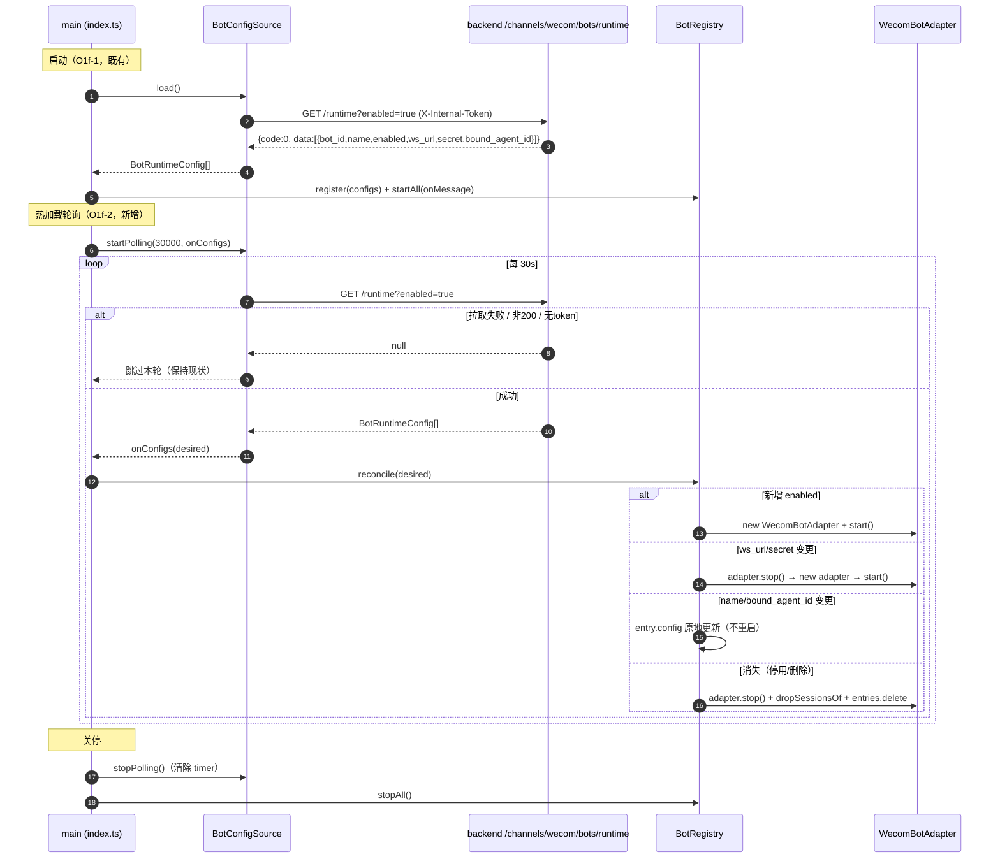
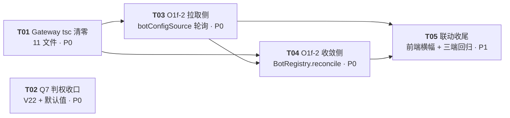

# Gateway 收口增量设计（tsc 清零 · Q7 判权核实 · O1f-2 热加载）

- 作者：高见远（架构）
- 日期：2026-08-08
- 范围：只做调研、核实与设计，不写业务代码
- 上游输入：impl-plan.md（§9.4 Gateway 依赖 / §11 Q7 / T04 O1f-1、O1f-2）、`agent/ai-platform/gateway/src/**` 现状、`agent/ai-platform/backend/src/**` 现状、`backend/mis-migrator` V19–V21、`frontend/mis-admin-web/src/features/agent/channels/agent-wecom-page.tsx`
- 门禁基线：`cd agent/ai-platform/gateway && npx tsc --noEmit` 当前 **20 错**（已实测复现，逐条核对）

---

## 0. 结论速览

| # | 事项 | 结论 |
|---|---|---|
| ① | Gateway 20 个 tsc 错误 | 全部可在 Gateway 内修复，**零新增依赖**；根因三类：`RetryResult` 信封未解包（4 处）、ioredis 默认导入类型坏（1 处牵出 5 个错）、杂项未使用变量/缺 `ws` 声明（11 处） |
| ② | Q7 MCP 判权链路 | `agent:mcp:call` **存在**于 V20（菜单 92060，App=agent，已授 role_id=1）。当前兜底是「运营台手动调 MCP 的码」被复用为「运行时执行兜底码」——语义混淆但功能 fail-closed。**推荐方案 B+**：新增独立执行码 `ai:mcp:call`（App=system，V22）替代兜底，与运营台码解耦；**不推荐**按 impl-plan 原样做 server 级 `ai:mcp:{server}:call`（MCP server 是运行时动态清单，静态 DB 码必然漂移，与 V21 技能教训同构且更严重） |
| ③ | O1f-2 热加载 | **轮询（默认 30s）**，不依赖 backend push；**零 backend 改动**即可正确实现（轮询 `enabled=true`，停用/删除 = 从启用列表消失 → stop+drop，动作相同无需区分）；`reconcile` 差量规则、健康/事件安全见 §4；前端横幅改为「约 30 秒内热生效」 |

---

## Part A · 系统设计

### 1. 实施方案（Implementation Approach）

**技术难点与对策：**

1. **RetryResult 信封类型**：`utils/retry.ts` 的 `withRetry<T>()` 返回 `RetryResult<T> = { value, totalAttempts, totalDurationMs }`，调用方误把返回值当裸 `AxiosResponse` 访问 `.data`。修法：4 处调用点改为 `response.value.data`（信封字段是 `value`，不是 `data`）。
2. **ioredis@5.11.1 默认导入类型缺陷**：`import Redis from 'ioredis'` 在 `esModuleInterop` + NodeNext 下被解析为**模块命名空间**（实测报 `typeof import(.../built/index)` 无构造签名、不可当类型）。修法：改命名导入 `import { Redis } from 'ioredis'`（实测可构造 + 可当类型；仓库其余文件已用 `import type { Redis }` 命名导入，证明该写法安全）。此一改连带消除 `index.ts` 的 5 个错（TS2709×2、TS2351、TS7006×2）。
3. **`ws` 缺类型声明**：`ws@8.21.1` 无内置 `.d.ts`，仓库无 `@types/ws`。**红线判断**：impl-plan §9.4「Gateway 新增依赖 0 个」应理解为含 devDependency；本地 `src/types/ws.d.ts` 手写最小声明即可覆盖 `WecomBotClient.ts` 唯一使用点（`new WebSocket` / `.on` / `.send` / `.close` / `.readyState` / `WebSocket.OPEN` / `WebSocket.RawData`），**不装包**。
4. **Q7 权限码语义**：详见 §3。
5. **O1f-2 差量重载**：新增 `BotRegistry.reconcile(desired)` 纯函数式差量（可单测），连接参数变更才重启，元数据变更原地更新，`sessionOwner` 映射在重启路径保留。

**架构模式**：沿用既有分层（`config/` 配置源 → `channels/BotRegistry` 注册表 → `adapters/wecom/` 适配器），不引入新范式；O1f-2 是**在既有类上加能力**（`BotConfigSource.startPolling` + `BotRegistry.reconcile`），不重构。

**框架选型**：零新框架、零新依赖。Fastify / axios / ioredis / ws 均既有。

### 2. 文件清单（File List）

#### ① Gateway tsc 修复（全部 `agent/ai-platform/gateway/src/`，另加 1 个新文件）

| 文件 | 动作 | 归属任务 |
|---|---|---|
| `src/adapters/wecom/WecomAppMessage.ts` | 改（L142/L276 解包 `.value.data`） | T01 |
| `src/adapters/wecom/WecomJSSDKHelper.ts` | 改（L142/L194 解包 `.value.data`） | T01 |
| `src/adapters/wecom/WecomBotCardBuilder.ts` | 改（L415 删 `idx`） | T01 |
| `src/adapters/wecom/WecomBotClient.ts` | 改（不动代码，配 `ws.d.ts` 后消除 TS7016） | T01 |
| `src/adapters/wecom/WecomH5Adapter.ts` | 改（L243 迭代 values） | T01 |
| `src/index.ts` | 改（删 EventTransformer import、ioredis 命名导入） | T01 |
| `src/middleware/auth.ts` | 改（删 `base64UrlEncode`） | T01 |
| `src/queue/redisStream.ts` | 改（L326 类型断言） | T01 |
| `src/router/MessageRouter.ts` | 改（L151/L152 `_channel`/`_userId`） | T01 |
| `src/server.ts` | 改（L176/L177 `_` 前缀、L489 删 `user`） | T01 |
| `src/types/ws.d.ts` | **新**（本地 `declare module 'ws'` 最小类型声明） | T01 |

#### ② Q7（`agent/ai-platform/backend/` + `backend/mis-migrator/`）

| 文件 | 动作 | 归属任务 |
|---|---|---|
| `backend/mis-migrator/src/main/resources/db/migration/V22__agent_mcp_exec_perms.sql` | **新**（`ai:mcp:call` 执行码，App=system，授 role_id=1） | T02 |
| `agent/ai-platform/backend/src/config.py` | 改（`MIS_ACL_MCP_FALLBACK_PERMISSION` 默认值 `"agent:mcp:call"` → `"ai:mcp:call"`） | T02 |
| `agent/ai-platform/backend/src/runtime/acl_tool_wrapper.py` | 改（拒绝文案/注释随码更新；逻辑不动，兜底码从 settings 读） | T02 |
| `agent/ai-platform/backend/tests/test_t03_acl_tool_wrapper.py` | 改（TC-04 断言码 `agent:mcp:call` → `ai:mcp:call`） | T02 |
| `docs/api/permissions.md` | 改（追加 `ai:mcp:call` 章节） | T02 |

#### ③ O1f-2（Gateway 为主；后端不动；前端 1 文件）

| 文件 | 动作 | 归属任务 |
|---|---|---|
| `agent/ai-platform/gateway/src/config/botConfigSource.ts` | 改（`fetchRuntime()` 区分失败/空、`startPolling`） | T03 |
| `agent/ai-platform/gateway/src/index.ts` | 改（启动后启动轮询、关停时停止；与 T01 同文件先后改） | T03 |
| `agent/ai-platform/gateway/.env.example` | 改（新增 `BOT_CONFIG_POLL_INTERVAL_MS` 文档） | T03 |
| `agent/ai-platform/gateway/tests/botConfigSource.poll.smoke.ts` | **新**（轮询/失败跳过/空清单语义） | T03 |
| `agent/ai-platform/gateway/src/channels/BotRegistry.ts` | 改（`reconcile`/`restartEntry`/`ReconcileReport`；`/admin/bots` 用 `list()` 已具备） | T04 |
| `agent/ai-platform/gateway/src/server.ts` | 改（补 `GET /admin/bots` + `GET /admin/bots/health`，impl-plan §3.4 原定项，backend #54 依赖它） | T04 |
| `agent/ai-platform/gateway/tests/botRegistry.reconcile.smoke.ts` | **新**（新增/停用/删除/ws_secret 重启/元数据免重启/幂等） | T04 |
| `frontend/mis-admin-web/src/features/agent/channels/agent-wecom-page.tsx` | 改（横幅/提示文案「热生效」化，单文件） | T05 |

> 后端 `channels.py` / `wecom_bot_store.py` **不动**（§4.4 论证零 backend 改动即可正确实现）。

### 3. ② Q7 核实结论与方案

#### 3.1 核实结果（源码/迁移实测，非推测）

| 核实项 | 结果 |
|---|---|
| `agent:mcp:call` 是否存在 | **存在**：`V20__agent_ops_api_perms.sql:80` 建菜单按钮 92060（App=agent，父 92039 MCP 页，type=3），`:307` 注释确认已随 V20 授 `role_id=1` |
| 当前 E2 兜底语义 | `acl_tool_wrapper.py:_mcp_requirement()` 三档：① `registry.get("mcp-{server}-{tool}")` 命中 → `ai:skill:{id}:run`；② 未命中 → 兜底 `get_settings().MIS_ACL_MCP_FALLBACK_PERMISSION`（默认 `"agent:mcp:call"`）；③ 取不到 `_tool_info` → 拒。`config.py:274` 默认值 `"agent:mcp:call"` |
| 兜底是否「永不匹配」 | **否**。`agent:mcp:call` 是真实存在且默认授予管理员（role_id=1）的码；`MisPermissionResolver` 按 **MIS userId** 拉全量码集合（不按 appId 过滤），故持 `agent:mcp:call` 的用户（含管理员）可在**运行时**触发任意 MCP 工具 |
| 语义定性 | 🔴 **混淆**：`agent:mcp:call` 在 V20 是「运营台手动调 MCP（#44 `POST /agent-ops/mcp/servers/{name}/call`）」的**操作码**；被 E2 运行时链路当**执行码**复用。若将来把该码授给非管理员运营人员，等于同时放开「运行时任意 MCP 工具执行」，属隐式提权面 |
| MCP server 清单形态 | **per-Agent 运行时 YAML**（实测仅 `agent/ai-platform/configs/agents/crm-assistant/system/mcp-servers.yaml`，当前 1 个 server `mcp-api-suite`）+ 后端内存 `McpManager` 可 `POST /mcp` 运行时注册 ⇒ server 名是**动态**的，与 DB 静态码必然漂移 |

#### 3.2 方案对比

| 方案 | 内容 | 优点 | 代价 | 判定 |
|---|---|---|---|---|
| **A（impl-plan 原样）** | V22 建 `ai:mcp:{server}:call` server 级码 + wrapper 先查 server 级码 | 粒度最细，与 `ai:skill:{id}:run` 并列 | MCP server 是运行时动态清单（per-Agent YAML + 内存注册），静态 DB 码**必然漂移**，每加一个 server 补一版迁移；无 `ensureCode` 懒注册机制（技能有 Q1-b 方案，MCP 没有） | ❌ 不推荐本期做 |
| **B（保留兜底、语义明确化）** | 保留单码兜底，但把码从 `agent:mcp:call` 换成独立执行码 `ai:mcp:call`（App=system，V22 建，授 role_id=1） | 零漂移；语义干净：运行时执行 ≠ 运营台手动调用；非管理员默认 fail-closed；改动极小（迁移 + 默认值 + 测试 3 行） | 仍是全局粗粒度（不能按 server 隔离） | ✅ **推荐** |
| **C（其他）** | 未来按 Q1-b 同构做 `ai:mcp:{server}:call` 懒注册（BFF 在 MCP server 注册/发现时 `ensureCode`） | 既解决漂移又有粒度 | 需 BFF 新服务 + MCP server 生命周期挂点，工作量大 | 📌 记为后续演进，本期不做 |

**推荐：方案 B+（B 的落地版）** —— 理由：
1. 修掉真正的缺陷（运营台码被运行时复用导致的隐式提权），不引入新缺陷（静态码漂移）；
2. 改动面最小且全部在「新建迁移 + 配置默认值 + 测试断言」，不碰判权逻辑；
3. 对现有行为零破坏：管理员仍默认有码（V22 授 role_id=1），非管理员仍 fail-closed；
4. 与 V21 技能码同挂 `system` App（`92200+` 段顺延或新目录 `92300`），`uk_menu_app_permission` 作用域天然隔离。

**影响面**：V22 新建 1 迁移；`config.py` 1 行默认值；`acl_tool_wrapper.py` 仅文案/注释（逻辑读 settings 不变）；`test_t03_acl_tool_wrapper.py` TC-04 断言 2 处；`docs/api/permissions.md` 补章节。**不改 `acl_tool_wrapper` 判权逻辑、不改 `MisPermissionResolver`、不改任何 E1–E5 路径行为**。若主理人不认可「新码 + 迁移」，退而求其次可在不改代码前提下仅设 env `MIS_ACL_MCP_FALLBACK_PERMISSION=ai:mcp:call`（但码仍须 V22 建，否则 fail-closed 对所有人含管理员）。

### 4. ③ O1f-2 热加载设计

#### 4.1 轮询 vs watch 决策：**轮询（推荐）**

| 维度 | 轮询（enabled=true，默认 30s） | backend watch/push |
|---|---|---|
| 后端改动 | **零**（§4.4） | 需新增推送通道（SSE/Redis pub/sub），`WecomBotStore.on_change` 有回调但**无 HTTP/Redis 出口** |
| 健壮性 | 自愈：Gateway 重启、丢通知都能在下个周期收敛 | 纯 push 会漏事件；需轮询兜底 ⇒ 最终还是「事件触发 + 轮询兜底」的混合 |
| 复杂度 | 1 个 setInterval + 重入保护 | backend 发布 + Gateway 订阅 + 断线重连 + 兜底轮询 |
| 延迟 | ≤30s（env 可调） | ~秒级 |

结论：**纯轮询**作为交付；Redis pub/sub 触发（`_notify` 发布 + Gateway 订阅触发立即轮询）记为可选增强，需主理人拍板 backend 配合时才做（预计 +5 行 backend、+1 订阅端）。

**拉取语义（关键）**：新增 `fetchRuntime(): Promise<BotRuntimeConfig[] | null>`，**三态**区分——
- `null`：backend 不可达 / 非 200 / 无 token ⇒ **跳过本轮**（保持现状，绝不把「拉取失败」当成「空清单」）；
- `[]`：backend 健康但零启用 Bot ⇒ 收敛到零（停掉全部，含 env 兜底 Bot）；
- 数组：正常差量。

`startPolling(intervalMs, onConfigs): () => void`：内部 `setInterval` + **重入保护**（上一轮未完成则跳过），返回 stop 函数供优雅关停。**仅当 `GATEWAY_INTERNAL_TOKEN` 非空时启动轮询**（无 token 时 backend 拉取本就禁用，轮询无意义）。

#### 4.2 `BotRegistry.reconcile(desired)` 差量规则

**期望集 = 轮询到的 enabled Bot 清单（含明文 secret）**；注册表只保留「需要运行的 Bot」，语义与 O1f-1 一致并简化。

| 场景 | 动作 | 说明 |
|---|---|---|
| 新增 botId（enabled） | `entries.set` + `startBot` | 新建 adapter，`startEntry` 失败只记 `lastError` 不阻塞 |
| 已存在、enabled 仍 true、`wsUrl`/`secret` 任一变化 | **重启**：`adapter.stop()` → 新 `WecomBotAdapter(newConfig)` → `startEntry` | **secret 变更必须重启，不能原地复用**；`sessionOwner` **保留**（不调 `dropSessionsOf`） |
| 已存在、enabled 仍 true、仅 `name`/`boundAgentId` 变化 | `entry.config` 原地更新，**不重启** | name 仅展示；boundAgentId 当前仅 `BotStatusView` 展示（路由绑定在 backend Redis 侧），adapter 不消费 ⇒ 免重启安全 |
| 已存在、enabled true→false（从清单消失） | `stopBot` + `entries.delete` | 停用与删除动作相同（都从 enabled 清单消失），**无需区分**；`stopBot` 已含 `dropSessionsOf` |
| 已存在、enabled true→true、配置全等 | no-op | 幂等 |
| 轮询失败（null） | 跳过整个 reconcile | 见 §4.1 |

**差异比对**：`configsEqual(a,b)` 比较 `name/enabled/wsUrl/secret/boundAgentId`；`wsUrl`/`secret` 变化 → 重启，否则元数据更新。

**边界与安全**：
- **进行中会话**：连接参数变更的重启会 `adapter.stop()` → `pendingBySession.clear()`，进行中的流式回复至多断一条（用户看到已 flush 的文本，收不到 final）。这是连接重置的固有代价，设计上**最小化触发面**（仅 ws_url/secret 变更才重启）；元数据变更零中断。可选增强：重启前对 pending 做一次 drain（flush buffer + finish），列入待确认。
- **`sessionOwner` 保留**：重启路径不 drop，回程事件仍精确投递到该 botId 的新 adapter（新 adapter 无 pending ⇒ no-op，不丢归属、不误广播）。
- **`health()`/`lastError`**：reconcile 后 `startEntry` 成功清 `lastError`、失败写 `lastError`；`health()` 语义不变（未启动 = disconnected）。注册表只含 enabled Bot，`/admin/bots` 列表即「应运行集」，语义更清晰。
- **并发**：`reconcile` 串行执行（单 tick），不与 `dispatch*` 抢锁；`sessionOwner` 的 Map 操作均为同步。

#### 4.3 runtime 端点返回口径核实结论

`GET /channels/wecom/bots/runtime`（`channels.py:118`）：
- `enabled: bool = Query(default=True)` —— 支持 `enabled=true`（仅启用）/ `enabled=false`（仅停用），**不支持一次拿全量**；
- 回包**始终含 `enabled` 字段**（`channels.py:169`）；
- 鉴权：`X-Internal-Token`，未配置 503 / 比对失败 403，`hmac.compare_digest`，**fail-closed**（安全设计良好）。

**结论：无需改后端**。`enabled=true` 轮询即可正确实现热加载：停用/删除 = 从启用清单消失 → `stopBot`+drop；重新启用 = 重新出现 → 按最新配置 `startBot`。被停用期间改的配置（含 secret）在重新启用时一并生效。全量返回（`enabled` 可省略）仅是「注册表能看到停用 Bot」的增强，非必需 —— 记为可选，需主理人拍板才做（`channels.py` 签名 1 行 + `wecom_bot_store.list_records` 1 行，向后兼容）。

#### 4.4 前端横幅改动（最小改动，单文件）

`frontend/mis-admin-web/src/features/agent/channels/agent-wecom-page.tsx`（534 行单文件，无跨文件依赖）：

| 位置 | 现状 | 改为 |
|---|---|---|
| L252–263 常驻横幅 | 「保存后需重启 Gateway 生效……不会立即作用……需要运维重启」 | 「配置已热生效：新增 / 编辑 / 启停保存后约 30 秒内自动应用，无需重启 Gateway」（保留 Info 图标与 warning 样式，语义反转） |
| L166 / L169 toast | 「已启用，重启 Gateway 后生效」「已停用，重启 Gateway 后生效」 | 「已启用，约 30 秒内自动生效」「已停用，约 30 秒内自动断开」 |
| L316 emptyHint | 「保存后需重启 Gateway 才会建立连接」 | 「保存后约 30 秒内自动建立连接」 |
| L522 停用说明 | 「已建立的连接会在 Gateway 重启后断开」 | 「已建立的连接会在约 30 秒内自动断开」 |
| L526 警告 | 「该变更需重启 Gateway 后才在线上生效」 | 「该变更约 30 秒内自动生效」 |

> 前端门禁：`cd frontend/mis-admin-web && npm run typecheck`。横幅文案改动不触碰类型/API，风险极低。

#### 4.5 配置项（env）清单（全部 Gateway 侧）

| env | 默认 | 说明 |
|---|---|---|
| `BOT_CONFIG_POLL_INTERVAL_MS` | `30000` | 轮询周期；`0` 或缺失 = 不轮询（退回 O1f-1 行为） |
| `GATEWAY_INTERNAL_TOKEN` | 空 | 非空才启动轮询（既有，O1f-1 已用） |
| `BOT_CONFIG_PULL_TIMEOUT_MS` | `5000` | 单次拉取超时（既有） |
| `MIS_ACL_MCP_FALLBACK_PERMISSION` | `ai:mcp:call`（改后） | Q7 兜底码（backend 侧） |

### 5. 数据结构与接口（Class Diagram）

```mermaid
classDiagram
    class BotRuntimeConfig {
        +botId: string
        +name: string
        +enabled: boolean
        +secret: string
        +wsUrl: string
        +boundAgentId?: string
        +heartbeatIntervalSec: number
        +heartbeatTimeoutCount: number
        +maxReconnectAttempts: number
        +sourceName: string
        +sourceIconUrl?: string
    }
    class BotConfigSource {
        -options: BotConfigSourceOptions
        -http: AxiosInstance
        +load() Promise~BotRuntimeConfig[]~
        +fetchRuntime() Promise~BotRuntimeConfig[] | null~
        +startPolling(intervalMs, onConfigs) (() => void)
        -loadFromBackend() Promise~BotRuntimeConfig[]~
        -toRuntimeConfig(wire) BotRuntimeConfig | null
        -loadFromEnv() BotRuntimeConfig[]
    }
    class BotRegistry {
        -entries: Map~string, BotEntry~
        -sessionOwner: Map~string, string~
        +register(configs) void
        +startAll(onMessage) Promise~number~
        +startBot(botId) Promise~boolean~
        +stopBot(botId) boolean
        +stopAll() void
        +reconcile(desired) Promise~ReconcileReport~
        +dispatchTextDelta(sessionId, delta) Promise~void~
        +dispatchError(sessionId, message) Promise~void~
        +dispatchDone(sessionId) Promise~void~
        +health() Record~string, BotHealth~
        +list() BotStatusView[]
        +connectedCount() number
        -startEntry(botId, entry) Promise~boolean~
        -restartEntry(botId, entry, config) Promise~boolean~
        -rememberSessionOwner(sessionId, botId) void
        -dropSessionsOf(botId) void
    }
    class WecomBotAdapter {
        +start(onMessage) Promise~void~
        +stop() void
        +isConnected() boolean
        -pendingBySession: Map~string, PendingStream~
    }
    class ReconcileReport {
        +started: string[]
        +stopped: string[]
        +restarted: string[]
        +metadataUpdated: string[]
        +removed: string[]
        +errors: Array~{botId, reason}~
    }
    BotRegistry o-- WecomBotAdapter
    BotRegistry --> ReconcileReport
    BotConfigSource --> BotRuntimeConfig
    BotRegistry ..> BotRuntimeConfig : reconcile(desired)
```

> Q7 不引入新类（沿用 `SkillAclGuard` + settings 兜底码）；tsc 修复不引入新数据结构（`ws.d.ts` 仅类型声明、`redisStream.ts` 加 `XReadGroupStream` 类型别名）。

### 6. 程序调用流（Sequence Diagram）

**启动流（O1f-1 保持）+ 热加载轮询流（O1f-2 新增）：**



### 7. Anything UNCLEAR（假设与待确认）

1. **Q7 方案 B+ 是否采纳**（含是否建 V22）——需主理人拍板；备选：仅设 env 不改默认值（但码仍要建）。
2. **O1f-2 是否允许 backend 最小配合**：默认**零 backend 改动**（§4.4 已论证充分）；「runtime 端点支持全量返回」与「Redis pub/sub 立即触发」均是可选项，不做也能正确热加载。
3. **发现（既有缺口，建议顺带修）**：backend `#54` 健康查询调用 `GET {GATEWAY_API_URL}/admin/bots/health`，但 Gateway `server.ts` **未注册该路由**（impl-plan §3.4 原定 `server.ts +50` 未落地）⇒ 当前运营台「连接健康」恒 `unknown`。方案：T04 在 Gateway 补 `/admin/bots` + `/admin/bots/health`（Gateway 侧，不动 backend），顺带让 #54 生效。
4. **重启 drain**：连接参数变更重启时，对 pending 流先 flush 再断（约 +20 行）是否为必做？默认不做（接受至多断一条流式回复），如需可加。
5. 前端横幅「30 秒」口径是否接受（轮询默认 30s + 单次 5s 超时，最坏约 35s）。

---

## Part B · 任务分解

### 8. 所需依赖（Required Packages）

```
零新增依赖（Gateway / backend / 前端均不新增）：
- ws 类型：本地 src/types/ws.d.ts 手写声明（不装 @types/ws）
- ioredis / axios / fastify：既有
- backend：无新包（V22 纯 SQL + settings 默认值）
- 前端：无新包（仅文案改动）
```

### 9. 任务列表（Task List，有序，≤5）

| 任务 | 名称 | 源文件 | 依赖 | 优先级 |
|---|---|---|---|---|
| **T01** | Gateway tsc 清零（批量小修 + ws.d.ts + ioredis 导入） | `WecomAppMessage.ts`、`WecomJSSDKHelper.ts`、`WecomBotCardBuilder.ts`、`WecomBotClient.ts`、`WecomH5Adapter.ts`、`index.ts`、`auth.ts`、`redisStream.ts`、`MessageRouter.ts`、`server.ts`、`src/types/ws.d.ts`（新） | — | P0 |
| **T02** | Q7 判权链路收口（方案 B+：V22 `ai:mcp:call` + 默认值 + 测试） | `V22__agent_mcp_exec_perms.sql`（新）、`backend/src/config.py`、`backend/src/runtime/acl_tool_wrapper.py`、`backend/tests/test_t03_acl_tool_wrapper.py`、`docs/api/permissions.md` | —（独立；若采纳方案 B+） | P0 |
| **T03** | O1f-2 拉取侧：`fetchRuntime` 三态 + `startPolling` 轮询 + env | `config/botConfigSource.ts`、`index.ts`、`.env.example`、`tests/botConfigSource.poll.smoke.ts`（新） | T01 | P0 |
| **T04** | O1f-2 收敛侧：`BotRegistry.reconcile` + 重启路径 + `/admin/bots` 健康端点 | `channels/BotRegistry.ts`、`server.ts`、`tests/botRegistry.reconcile.smoke.ts`（新） | T01、T03 | P0 |
| **T05** | O1f-2 联动收尾：前端横幅热生效化 + 三端门禁回归（若主理人批准 backend 最小配合则一并做 runtime 全量返回） | `frontend/.../channels/agent-wecom-page.tsx`、（可选）`backend/src/api/routes/channels.py`、（可选）`backend/src/channels/wecom_bot_store.py` | T03、T04 | P1 |

> 门禁：T01 合入后 `cd agent/ai-platform/gateway && npx tsc --noEmit` 0 错；T02 合入后 backend 相关 pytest 绿（`.venv/Scripts/python -m pytest tests/test_t03_acl_*.py`）；T05 合入后前端 `npm run typecheck` 绿。每个任务合入前其涉及文件无 TS 错误。

### 10. 共享知识（Shared Knowledge）

- Gateway `BotRuntimeConfig` 的 `secret` 为明文（runtime 端点专供 Gateway），**严禁写日志**；backend runtime 端点只记条数不记内容（既有）。
- `BotConfigSource.fetchRuntime()` 三态语义：`null`=跳过本轮、`[]`=收敛到零、数组=差量；**严禁把失败当空清单**（否则 backend 抖动会误停全部 Bot）。
- `reconcile` 幂等：同 botId 反复 reconcile 无副作用；`ws_url`/`secret` 变更才重启，`name`/`bound_agent_id` 变更原地更新。
- 重启路径**保留** `sessionOwner`（不调 `dropSessionsOf`）；停用/删除路径**必须** drop。
- Q7：运行时执行码与运营台操作码分离（`ai:mcp:call` vs `agent:mcp:call`）；判权链唯一入口仍是 `SkillAclGuard`（impl-plan §10.3 约定 10）。
- 迁移铁律：append-only、幂等模板沿用 V17/V21、只授 `role_id=1`、规避 `uk_menu_app_permission`（`ai:mcp:call` 落 App=system，与 V21 同域不冲突）。
- 三端门禁：Gateway `npx tsc --noEmit` 0 错；backend `.venv/Scripts/python -m pytest` 相关测试绿；前端 `npm run typecheck` 0 错。

### 11. 任务依赖图（Task Dependency Graph）



> T02 与 T01/T03/T04 无依赖（不同层），可与 T01 并行；T05 依赖 T03/T04（前端文案要等热加载真实存在）。

### 12. 待确认事项（给主理人拍板）

1. **Q7 是否采纳方案 B+**（V22 建 `ai:mcp:call` + 默认值改 + TC-04 断言更新）？
2. **O1f-2 维持零 backend 改动**（推荐）还是批准「runtime 端点全量返回」增强（`channels.py` + `wecom_bot_store.py` 各 1 行签名，向后兼容）？
3. **是否顺带修既有缺口**：Gateway 补 `/admin/bots` + `/admin/bots/health`（使 backend #54 健康列不再恒 unknown）——归入 T04，Gateway 侧，不动 backend。
4. **重启 drain**：连接参数变更前对 pending 流 flush+finish 是否本期必做（默认不做）？
5. 前端「约 30 秒内生效」文案口径确认。

---

*附：本设计对应的 mermaid 图另存于 `gw-closeout-class-diagram.mermaid` 与 `gw-closeout-sequence-diagram.mermaid`。*
