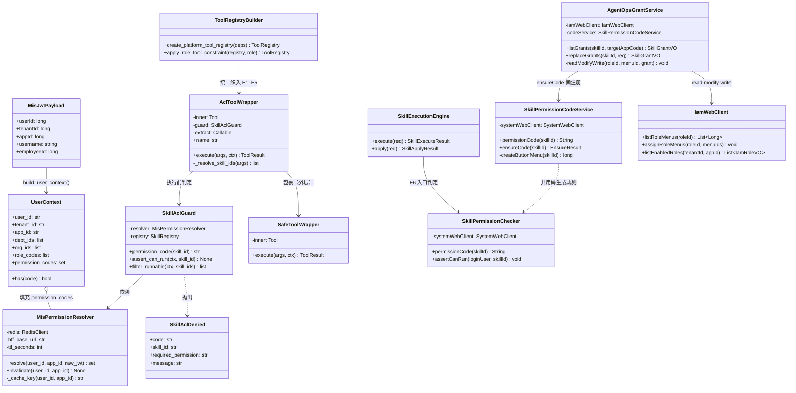
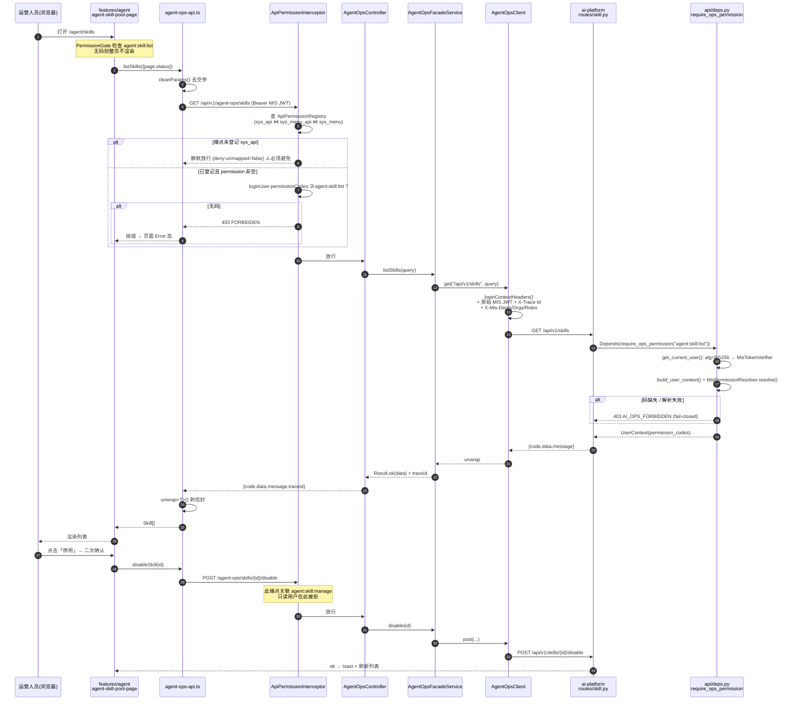
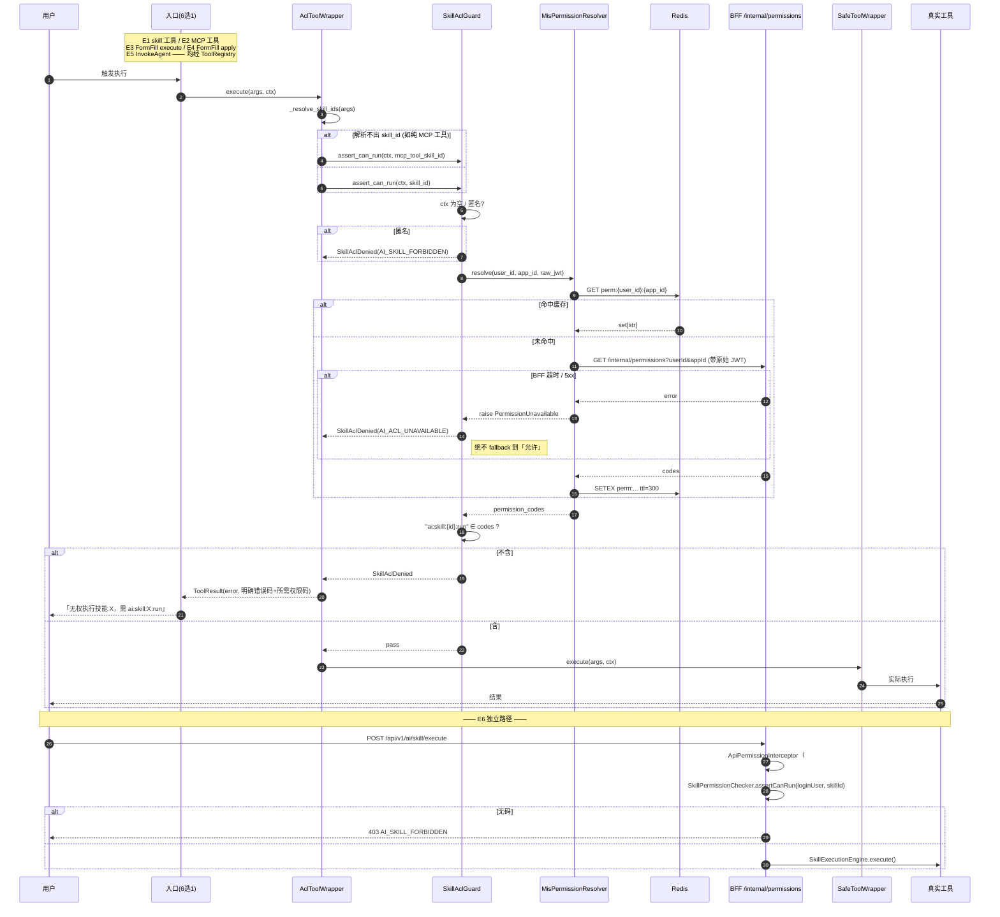
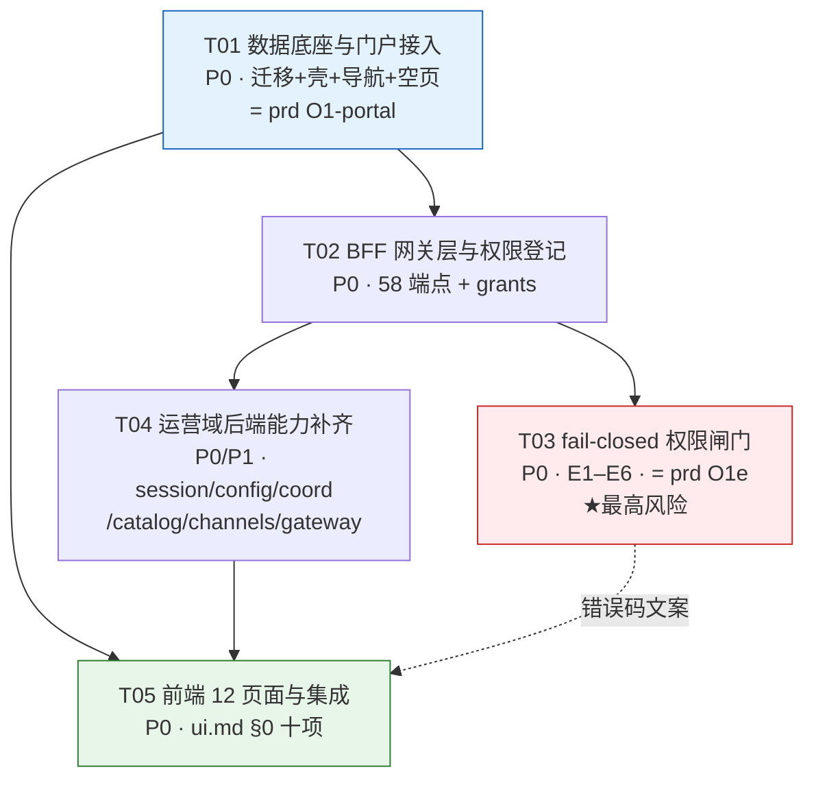

# 智能体运营控制台 — 落地架构设计与任务分解

> 文档角色：**实施计划（Implementation Plan）**。把已锁定的 v1.4 需求翻译成"照着能写"的任务。
> 版本：v1.1｜日期：2026-08-05｜作者：架构师（Gao）
> v1.1（2026-08-05）：T01 实施期证伪回写 —— D6 约束勘误（`uk_menu_api_api` 已在 V8 移除）、`matchDynamicPage` 需扩展 `maxSegments`、`AgentOpsGrantService` 无 JPA 通路须 read-modify-write、`ensureCode` 懒注册；并裁定 Q1-b / Q8。
> 上游（**已锁定，本文件不修改**）：[prd.md](prd.md) · [spec.md](spec.md) · [ui.md](ui.md) · [adr.md](adr.md) · [architecture.md](architecture.md)
> 适用范围：`frontend/mis-admin-web` · `backend/mis-admin-bff` · `backend/mis-migrator` · `agent/ai-platform`（backend + gateway）

---

## 0. 阅读指引

本文件回答的是"**怎么落**"，不回答"**做什么**"（那是 prd/spec/ui 的职责）。

| 你是 | 从哪节读起 |
|---|---|
| 工程师接单 | §7 任务清单 → §8 批量实施建议 → §10 共享约定 |
| 复核架构 | §1 现状勘察 → §3 文件清单 → §5 权限码表 |
| 排风险 | §1.3 文档与代码差异 → §11 待明确事项 |

**本文件的最高价值在 §1**：spec.md §3 有多处标注"既有"的 API 在代码里**并不存在**，若照 spec 直接排期会全线返工。

---

## 1. 现状勘察结论

勘察时间：2026-08-05；方式：逐文件阅读源码，非推测。

### 1.1 前端 `frontend/mis-admin-web`

| # | 勘察项 | 结论 | 对本期的影响 |
|---|---|---|---|
| F1 | 对标 `features/kb` 结构 | 按业务子域分目录（`category/` `library/` `qa/` …），页面组件平铺为 `kb-xxx-page.tsx`；`api/kb-api.ts` 单文件承载全部请求；`stores/use-kb-store.ts` 用 Zustand；`types.ts` 单文件 | `features/agent` 完全照搬这一形状，不引入新范式 |
| F2 | API 层范式 | `@/lib/api/client` 的 axios 实例，`baseURL='/api/v1'`，Bearer 拦截器 + 刷新逻辑已就绪；`kb-api.ts` 自带 `unwrap<T>()`（剥 `{code,data,message}`）与 `cleanParams()`（去空查询参数） | `agent-ops-api.ts` 复制 `unwrap`/`cleanParams` 到本 feature 内（**不能跨 feature import**，见 F5） |
| F3 | 路由与页面挂载 | `app/router.tsx` 里 KB 只有一行 `<Route path="/kb/*" element={null} />`；真正渲染在 `components/layout/keep-alive-outlet.tsx` 的 `PAGE_MAP`（精确路径）+ `DYNAMIC_PAGES`（前缀匹配，供 `/kb/libraries/12` 这类明细页） | `/agent/*` 需**四处**登记：`router.tsx`、`PAGE_MAP`、`DYNAMIC_PAGES`（`/agent/agents/:id/**`）、`agent-nav.ts` |
| F4 | 导航注册（三处同步） | `lib/nav/kb-nav.ts` 是**静态权威叶子清单**（文件注释明写"nav / PAGE_MAP / SQL 种子三处同步"）；`menus-to-nav.ts` 的 `mergeNavWithFallback` 只让动态菜单**增强**静态兜底；`app-layout.tsx` 按 `location.pathname` 前缀优先、再回退 `app.code` 选 fallback；`lib/nav/host-apps.ts` 的 `HOST_APP_LANDING` 决定九宫格落地路由 | 新增 `agent-nav.ts`；`app-layout.tsx` 的 `inKb` 判定处加 `inAgent` 分支；`host-apps.ts` 加 `agent: '/agent/overview'` |
| F5 | `arch/no-cross-feature` | `eslint.config.js` 中为 **error** 级；正则匹配 `@/features/([^/]+)`，禁止 feature 内 import 其它 feature | `features/agent` **不得** import `features/ai`（既有 Copilot）与 `features/kb`；公共逻辑只能走 `features/common` 或 `lib/` |
| F6 | 既有 `features/ai` | 目录含 `ai-context` / `ai-copilot` / `skill-api` / `types`，服务的是**业务侧 Copilot**（右侧抽屉、页面上下文注入），与运营台是两个产品面 | 两者**零共享代码**，各自独立；`/agent/chat` 是"运营调试"入口，不复用 `ai-copilot` 组件（会触发 F5），需在 `features/agent/chat/` 内自建轻量对话壳 |
| F7 | 构建门禁 | `package.json` 只有 `typecheck: tsc --noEmit`，无 vitest/jest | 前端唯一门禁 = `npm run typecheck`；不要求工程师写前端单测 |
| F8 | 依赖现状 | react 18.3.1 / react-router-dom 6 / @tanstack/react-query ^5.51.1 / zustand ^4.5.2 / axios ^1.6.8 / sonner / zod / lucide-react / shadcn 组件 | **本期零新增前端依赖**（YAML/Markdown 编辑器见 §11 Q3） |

### 1.2 BFF `backend/mis-admin-bff`

| # | 勘察项 | 结论 | 对本期的影响 |
|---|---|---|---|
| B1 | 下游客户端范式 | `AbstractDownstreamClient` 提供 `loginContextHeaders()`（注入 `X-User-Id`/`X-Tenant-Id`/`X-App-Id`/`X-Employee-Id`/`X-Username`）与 `get/post/put/delete/block` 助手；`KbWebClient` 是最干净的样板 | 新建 `AgentOpsClient extends AbstractDownstreamClient` 直接照抄 `KbWebClient` |
| B2 | MIS JWT → ai-platform 信任链 | **已存在，勿重复造**：`AiPlatformClient` 透传原始 MIS JWT（RS256）+ `X-Trace-Id` + `X-Mis-Depts/Orgs/Roles`（由 `IamWebClient` 富化）；ai-platform 侧 `api/deps.py:get_current_user` 按 JWT header `alg==RS256` 分流到 `MisTokenVerifier`，公钥 `configs/mis_jwt_public.pem` | `AgentOpsClient` 复用同一套 header 组装逻辑（抽 `AiPlatformTrustConfig` 现有能力），**不新建认证机制** |
| B3 | API 权限拦截 | `ApiPermissionConfiguration` 把 `ApiPermissionInterceptor` 挂在 `/api/v1/**`；规则来自 `SystemWebClient.apiPermissionRegistry()`（`sys_api ⋈ sys_menu_api ⋈ sys_menu ⋈ sys_module`）；**`permission` 为空 ⇒ `authOnly=true` ⇒ 拦截器直接 `return true` 静默放行**；`mis.api-permission.deny-unmapped: false`（未映射即放行） | `/api/v1/agent-ops/**` 每个端点**必须**在 `sys_api` + `sys_menu_api` 登记且关联的 `sys_menu.permission` 非空，否则"任意登录用户可调"。这是 V17 已踩过的坑 |
| B4 | 角色列表来源 | `IamWebClient.listEnabledRoles(tenantId, appId)` / `pageRoles`，模型 `IamRoleVO`；`RoleFacadeService` 已封装 | UI#2 的"按目标 App 选角色"直接用 `listEnabledRoles`，`appId` 由 `appCode`(`system`/`agent`) 解析（`IamWebClient.listApps`） |
| B5 | 分层组织 | `controller/` 薄转发 → `service/XxxFacadeService` → `client/XxxWebClient`；DTO 在 `dto/<domain>/`；`Result<T>` 来自 `mis-common`（`com.mis.common.api.Result`），下游解包用 `RequestContext.unwrap` | 新增 `service/agentops/` + `dto/agentops/` 子包，与 `kb`/`ai` 平级 |
| B6 | **既有 Java 侧 Skill 执行入口（重大发现）** | `AiProxyController` 已有 `POST /api/v1/ai/skill/execute` 与 `/skill/apply`，背后 `service/skill/SkillExecutionEngine`（FormFill 引擎）**完全没有任何权限校验**（grep `permission`/`hasPermission` 零命中）；身份来自 `ReverseTrustInterceptor` 的委托身份或网关登录用户 | 这是 spec §3.2 "所有执行路径"里**未被文档点名的第 5 条路径**，O1e 必须一并 fail-closed（详见 §4.2） |
| B7 | 门户可进入清单 | `AppController.ENTERABLE_CODES = Set.of("system", "kb")`（硬编码常量） | 加 `"agent"`。**注意**：这是 Java 常量不是数据库配置，光跑迁移不生效 |
| B8 | 配置项 | `AiPlatformProperties`（`mis.ai-platform.base-url`，默认 `http://ai-platform-backend:8000`）；`BffProperties` 持 `mis.bff.*-base-url` | 新增 `mis.agent-ops.gateway-base-url`（企微 Bot 管理 API）；ai-platform 地址复用 `AiPlatformProperties` |

### 1.3 ai-platform `agent/ai-platform` —— **spec.md §3 与代码的差异表（本节最重要）**

`main.py` 路由前缀实测：`/api/v1/agents`、`/api/v1/sessions`、`/api/v1/skills`、`/api/v1/mcp`、`/api/v1/admin`、`/api/v1/auth`、`/api/v1/files`、`/api/v1/push`、`/api/v1/mis`（`mis_capability`）。

| spec 章节 | spec 声称 | 代码实测 | 判定 |
|---|---|---|---|
| §3.1 技能池 8 个端点 | "既有为主" | `skill.py` 全部 8 个端点**确实存在**，签名一致（`GET ""`/`GET /stats`/`GET /{id}`/`POST ""`/`PUT /{id}`/`DELETE /{id}`/`POST /{id}/enable`/`POST /{id}/disable`/`POST /reindex`） | ✅ **属实** |
| §3.1 | — | **`skill.py` 全部端点无 `Depends(get_current_user)`，零鉴权** | 🔴 **重大缺口**：任何人可裸调创建/删除 Skill |
| §3.6 MCP 9 个端点 | "既有" | `mcp.py` 端点齐全（`GET/POST ""`、`GET /health`、`GET /{name}`、`POST /{name}/connect|disconnect`、`GET /{name}/tools`、`POST /{name}/call`、`POST /{name}/discover`） | ✅ **属实** |
| §3.6 | — | **`mcp.py` 同样零鉴权**；其中 `POST /{name}/call` 是**可直接执行任意 MCP 工具**的裸口 | 🔴 **重大缺口** |
| §3.5 会话 | "既有：`GET/DELETE /sessions/{id}`、`GET …/messages`" | 存在：`POST ""`、`GET /{id}`、`DELETE /{id}`、`GET /{id}/messages`、`POST /{id}/messages`、`POST /route` | ✅ 属实 |
| §3.5 扩展 | `GET /sessions` 运营列表 | **不存在**。`SessionManager` 基于 Redis（`_session_key`），**无 list/scan 能力，无 DB 落库** | 🟠 **需新建 + 需要存储方案**（见 §11 Q1） |
| §3.5 扩展 | `POST /sessions/batch-delete` | **不存在** | 🟠 新建（依赖 Q1） |
| §3.3 | `GET/PUT /agents/{id}/skills` | **不存在**。`agent.py` 只有 CRUD + start/pause/resume/stop/health/runtime | 🟠 **全新** |
| §3.4 | `GET/PUT /agents/{id}/config-files` | **不存在** | 🟠 **全新** |
| §3.4 白名单 | 8 条相对路径 | `configs/agents/crm-assistant/` 实测布局：`agent.yaml` `metadata.yaml` `identity/{access-control,sensitive-ops,skill-permissions}.yaml` `memory/{agent-memory.yaml,personality.md,facts/*.yaml}` `runtime/{runtime.yaml,prompts/system.md}` `skills/enabled-skills.yaml` `system/{model.yaml,mcp-servers.yaml}` | ⚠️ **白名单与实际有偏差**：spec 写 `memory/facts/**（仅 .md）`，实测 facts 下是 **`.yaml`**（`crm-policies.yaml`）；spec 未含 `identity/*.yaml` 与 `system/mcp-servers.yaml`。见 §11 Q2 |
| §3.4 | — | `mis-copilot` 目录**没有** `identity/` 与 `memory/`（只有 `agent.yaml` `metadata.yaml` `runtime/` `skills/` `system/`） | ⚠️ 文件树接口必须"按实际存在返回"，不能按固定 8 条硬编码 |
| §3.8 | `GET/PUT /agents/{id}/coordination` | **不存在**。但底层数据齐：`agent.yaml:agent.role`（`worker`/`coordinator`）、`metadata.yaml` 的 `when_to_use`/`input_contract`/`output_contract`/`safety_level` 已在用 | 🟠 新建（读写映射到既有 YAML 字段，不新造 schema） |
| §3.8 | `GET/PUT /admin/worker-catalog` | **不存在**。`coordinator/catalog.py` 有完整 `WorkerCatalog`/`WorkerSpec`/`build_worker_catalog()`/`refresh_worker_catalog()`，但**只被 `tool_registry_builder` 内部消费，无 HTTP 出口** | 🟠 新建 API 薄封装既有能力 |
| §3.9 | `GET /admin/dispatch-traces` | **不存在**。`admin.py` 只有 `/route-logs` `/route-stats` `/llm/*` `/proxy/status` `/failover/reset` `/configs`；`coordinator/trace.py`（220 行）已有 trace 结构 | 🟠 新建 |
| §3.7 企微多机器人 6 个端点 | "新建/扩展" | **完全不存在**；且 Gateway **架构上就是单 Bot**：`gateway/src/index.ts` 从环境变量读 `WECOM_BOT_ID` / `WECOM_BOT_SECRET` / `WECOM_BOT_WS_URL` 构造**一个** `botConfig`，`WecomBotAdapter` 单实例、WS 长连（`WecomBotClient`），**不是** HTTP 回调路由模型 | 🔴 **spec §3.7 "回调改为 `/wecom/bot/callback/{bot_id}`" 与现实不符**——现网走的是 WS 主动订阅，没有回调 URL 概念。见 §11 Q4 |
| §3.2 fail-closed | "所有执行路径" | 见 §1.4 专项 | 🔴 见下 |

### 1.4 Skill 执行入口全枚举（fail-closed 的作用面）

这是 B3 验收（"任意路径触发该 Skill 一律拒绝"）能不能过的关键。实测共 **6 条**执行路径，**当前 0 条有 MIS 权限码校验**：

| # | 入口 | 代码位置 | 现状 |
|---|---|---|---|
| E1 | LLM 显式调用 `skill` 工具 | `runtime/tool_registry_builder.py:332` `registry.register(SkillTool())`（`SkillTool` 来自外部包 `openharness.tools.skill_tool`） | 无校验 |
| E2 | LLM 调用 MCP 工具 | `PlatformMcpToolAdapter.execute()`（同文件 190 行）；工具名 `mcp__{server}__{tool}` | 无校验（仅注入身份 header/arg，不判权） |
| E3 | FormFill 工具（平台侧） | `skills/tools/formfill_execute.py` `FormFillExecuteTool.execute()` → `skills/formfill_client.py:execute_skill()` → **反调 BFF `/api/v1/ai/skill/execute`** | 无校验 |
| E4 | FormFill 回填 | `skills/tools/formfill_apply.py` `FormFillApplyTool.execute()` | 无校验 |
| E5 | Agent 委派 | `skills/tools/invoke_agent.py` `InvokeAgentTool.execute()`（受 `role=worker` 剔除保护，但那是防越权委派，非 Skill ACL） | 无 Skill 码校验 |
| E6 | **BFF 直接执行**（文档未提） | `AiProxyController.skillExecute()` → `service/skill/SkillExecutionEngine.execute()` | **无任何权限校验**，且 `/api/v1/ai/skill/execute` 当前挂 `ai:chat:use`？—— 实测 V6 只登记了 `/summary` `/extract` `/rag` `/chat/completions` `/health` `/features` 六个端点，**`/skill/execute` 与 `/skill/apply` 根本没进 `sys_api`** ⇒ `deny-unmapped=false` ⇒ 任意登录用户可调 |

**既有的 `PermissionEngine`（`identity/permissions.py`）不能直接用作 fail-closed 闸门**：
- 它判的是"分类/allow-deny 列表"，数据源是**进程内内存目录**（`set_role_data`/`set_dept_data`），**不是** MIS 的 `sys_role_permission`；
- 唯一调用点是 `skills/ranker.py`（检索**排序时过滤候选**），执行阶段完全不经过它；
- 第 116–124 行有"**无任何限制配置 ⇒ 允许**"的开发模式兜底 —— 这与 fail-closed **语义相反**。

⇒ 结论：必须新建一条**基于 MIS 权限码集合**的判定链（§4.2），不改造 `PermissionEngine`（保留其检索排序职责）。

### 1.5 配置热更新机制（可用，勿重造）

| 组件 | 位置 | 能力 |
|---|---|---|
| `ConfigManager` | `config_manager/manager.py` | `initialize()` / `reload_all()` / `get_config()` / `list_configs()` / **`save_config()`（已支持写文件 `_save_to_file` + 写库 `_save_to_db`）** / `delete_config()` / `on_config_change(cb)` |
| `ConfigWatcher` | `config_manager/watcher.py` | 轮询快照比对（文件 mtime + DB），变更时 `_notify_change(agent_id, change_type)` |
| `ConfigValidator` | `config_manager/validator.py` | `validate()` / `validate_or_raise()` / `validate_yaml_dict()` |
| 变更回调链 | `main.py:101-116` | `on_config_change` → `AgentRouter.add/remove_candidate` → **`coordinator.catalog.refresh_worker_catalog()`** |
| `AgentManager` | `agent/manager.py` | `sync_from_configs()` / `update_config()` / `ensure_agent_ready()` / 生命周期 start/pause/resume/stop |
| `WorkerCatalog` | `coordinator/catalog.py` | `build_worker_catalog()` / `get_worker_catalog()` / `refresh_worker_catalog()` / `render_tool_description()` / `build_input_model()` |

⇒ UI#9（配置编辑）与 UI#10（调度配置）保存后的热更新，**只需调用既有 `ConfigManager.save_config()` 或直接写文件后触发 `reload`**，`WorkerCatalog` 会由既有回调链自动重建。这是本期最省力的一块。

### 1.6 数据库 / 迁移 / 权限

| # | 结论 |
|---|---|
| D1 | 最新迁移 **V18**；新文件从 **V19** 起。迁移**只增不改**（V17 文件头有血泪注释） |
| D2 | ID 段：`system`=1xxx、`ai`=6xx/6xxx、`kb`=91xxx。**本期取 `92xxx` 段**（全仓 grep 无占用） |
| D3 | 🔴 **`uk_menu_app_permission`**：`sys_menu (app_id, permission) WHERE status=1 AND permission IS NOT NULL` 部分唯一索引 ⇒ **同一 App 下"页面菜单 + 按钮节点"不能共用同一 permission**。V17 的 r1 就是因此整个迁移事务回滚 |
| D4 | 🔴 **API 级登记是强制项**：`ApiPermissionRegistry` 来源 `sys_api ⋈ sys_menu_api ⋈ sys_menu ⋈ sys_module`；只建菜单不建 `sys_api`+`sys_menu_api` ⇒ 权限码只管菜单显隐，端点仍是"登录即可调" |
| D5 | **V8 后 `sys_api` 已 DROP `tenant_id` / `app_id`**，唯一约束改为 `uk_api_module_code(module_id, code)`，新增 FK `fk_api_module → sys_module(id)`。照抄 V2/V6 的 INSERT 列清单会直接报错 |
| D6 | ⚠️ **勘误（T01 实施期证伪）**：`uk_menu_api_api`（api_id 唯一）在 `V1__init_schema.sql:301` 定义过，但 **`V8__module_api_refactor.sql:37` 已 `DROP CONSTRAINT IF EXISTS uk_menu_api_api`**，现存唯一约束**只剩 `uk_menu_api_pair(menu_id, api_id)`**（V17:161-162 / V18:279 均已记录，本文件 v1.0 漏采）。<br>⇒ 「一个 API 只挂一个菜单」**不再是数据库强制约束，但仍是必须遵守的工程纪律**：`ApiPermissionRegistry.match()`（`mis-common-security`，第 45/72/81-82 行）把命中的多条规则的 permission 做**并集**且语义为「持有任一即可」。一个 API 挂 N 个菜单 = 判权退化为 N 选一，权限被稀释且**不会有任何报错**。本期 `sys_menu_api` 一律 1:1 |
| D7 | `sys_perm_type` 枚举 = `('menu','dept','org','store')`；授权行 `sys_role_permission(role_id, perm_type, target_id)`，`target_id` = `sys_menu.id` |
| D8 | `MenuService.permissionCodes()` 与 `SysApiRepository.findRegistryRows()` **均不过滤 `sys_menu.type`** ⇒ 权限码挂在 type=2 页面节点或 type=3 按钮节点都能生效 |
| D9 | `sys_role.app_id` **NOT NULL** ⇒ 角色天然按 App 隔离，`IamWebClient.listEnabledRoles(tenantId, appId)` 即可按 App 过滤 |
| D10 | `docs/api/permissions.md`（v1.0-draft，183 行）规定命名规范 `{模块}:{资源}:{操作}`，并有 §2 "权限与 API 的关系（ADR-011）"图。本期新增码需在该文件追加章节 |
| D11 | 无 `kb`/`agent` 相关的 `sys_role` 种子（V2 只有内置租户管理员 `role_id=1`）⇒ 与 V17 同样，本期种子**只授 role_id=1**，其余角色待角色体系落定后补授（§11 Q6） |
| D12 | 🔴 `sys_api` 是**树**：`type` 为枚举 `sys_api_node_type('catalog','api')`，`parent_id` 指向 catalog 节点；`code` 是**数字串**约定（V17 实测：catalog=`'0090'`，api=`'00900001'` = 父码 + 4 位序号），**不是** `kb:xxx` 这种语义码 |
| D13 | 🔴 `sys_api` 另有 **`uk_api_method_path`**：`(http_method, path_pattern) WHERE type='api' AND status=1` 部分唯一索引 ⇒ 同一「方法+路径」全局只能登记一次；种子必须同时用 `NOT EXISTS(method,path)` 去重（V17 已示范） |
| D14 | 种子统一采用 V17 的幂等模板：`INSERT … SELECT v.* FROM (VALUES …) AS v(…) WHERE NOT EXISTS(id) AND EXISTS(父行)`，并显式 `::sys_api_node_type` / `::VARCHAR` 类型标注（PostgreSQL VALUES 列类型推断需要） |

---

## 2. 技术选型与落地策略

### 2.1 选型原则：零新框架

本期**不引入任何新框架**。所有能力都能用仓库现有栈实现：

| 层 | 选型 | 依据 |
|---|---|---|
| 前端 | React 18 + react-router-dom 6 + Zustand + TanStack Query + shadcn/ui + Tailwind | 与 `features/kb` 完全一致（F1/F8） |
| 前端数据流 | 以 `useState` + `useEffect` + 直调 api 为主，TanStack Query 仅用于需缓存/轮询的列表 | `features/kb` 的实际用法就是"最小化使用 Query"，保持一致，避免两套心智 |
| 前端跨页状态 | Zustand（`use-agent-store.ts`）：当前 agent、筛选条件、轮询开关 | 对标 `use-kb-store.ts` |
| BFF | Spring Boot + WebClient（`AbstractDownstreamClient`） | B1；不引 Feign |
| BFF 鉴权 | 复用 `ApiPermissionInterceptor` + `sys_api` 登记 | B3/D4；**不写自定义 `@PreAuthorize`** |
| ai-platform | FastAPI + Pydantic v2 + structlog | 与既有一致 |
| ai-platform 配置读写 | 复用 `ConfigManager` / `ConfigValidator` / `ConfigWatcher` | §1.5 |
| Gateway | Fastify + TypeScript | 与既有一致 |
| 迁移 | Flyway SQL（append-only） | D1 |

### 2.2 三个关键落地策略

**策略 A — BFF 做「哑转发 + 一处本地写」**

`/api/v1/agent-ops/**` 绝大多数是**透传**到 ai-platform（保留 `{code,data,message}` 信封原样回传，仅补 `traceId`）。唯一例外是 `skills/{id}/grants`：这是**写 MIS 权限表**的操作，必须落在 BFF 本地（经 `SystemWebClient`/`IamWebClient`），不能转发给 Python（spec §2.1 已锁）。

好处：Java 侧 DTO 可以做得很薄（大量用 `JsonNode`/`Map` 透传），把类型强约束放在前端 `types.ts` 一处维护，减少三处 DTO 漂移。

> 但注意：**透传不等于不判权**。每个透传端点都要在 `sys_api` 单独登记（D4）。

**策略 B — fail-closed 用「一个守卫 + 一处织入」**

不在 6 个执行入口各写一遍判定，而是：

1. 建**单一判定器** `SkillAclGuard`（Python）/ `SkillPermissionChecker`（Java）；
2. 在**工具注册层** `tool_registry_builder.create_platform_tool_registry()` 用 `AclToolWrapper` 统一包住 E1–E5 —— 这一层是所有 LLM 工具调用的**唯一必经之路**（现有 `SafeToolWrapper` 已经证明了这个织入点可用且有效）；
3. E6（BFF `SkillExecutionEngine`）单独在入口加一次校验。

好处：以后新增 Skill / MCP 工具时自动受保护，不会漏。

**策略 C — 企微多机器人分两步走**

Gateway 现状是**单 Bot WS 长连**（不是 HTTP 回调），spec §3.7 的 `/wecom/bot/callback/{bot_id}` 与现实不符。落地方式：

- **O1f-1（本期必做）**：Bot 配置从 env 搬到可管理的数据源，backend 出 CRUD API，Gateway 启动时拉取配置并**为每条 enabled 记录创建一个 `WecomBotAdapter` 实例**（`BotRegistry` 管理多实例生命周期）。B4 验收（≥2 个 Bot 并存、可独立停用）由此满足。
- **O1f-2（可延后）**：热加载（轮询或 Redis pub/sub 通知 Gateway reload）。若不做，UI 需提示「保存后需重启 Gateway 生效」（prd Q2 已允许这个降级）。

---

## 3. 完整文件清单

图例：`[新]` 新建 · `[改]` 修改既有 · 行数为**预估**。

### 3.1 前端 `frontend/mis-admin-web/`

| 文件 | 状态 | 预估 | 说明 |
|---|---|---|---|
| `src/app/router.tsx` | 改 | +1 | `<Route path="/agent/*" element={null} />` |
| `src/lib/nav/agent-nav.ts` | 新 | 90 | `AGENT_NAV` 静态权威叶子清单（对标 `kb-nav.ts`，含三处同步注释） |
| `src/lib/nav/host-apps.ts` | 改 | +1 | `agent: '/agent/overview'` |
| `src/components/layout/keep-alive-outlet.tsx` | 改 | +35 | `PAGE_MAP` +12 项；`DYNAMIC_PAGES` +1 规则（`/agent/agents/`）；**且必须先给 `DynamicPageRule` 加 `maxSegments`**（见下方 ⚠️） |
| `src/components/layout/app-layout.tsx` | 改 | +6 | `inKb` 旁加 `inAgent` 分支，fallback 选 `AGENT_NAV` |
| `src/features/agent/types.ts` | 新 | 260 | 全部 DTO（Skill/Agent/Session/Mcp/WecomBot/Coordination/Catalog/Grant） |
| `src/features/agent/api/agent-ops-api.ts` | 新 | 320 | 本地 `unwrap`/`cleanParams` + 全部请求函数 |
| `src/features/agent/stores/use-agent-store.ts` | 新 | 90 | Zustand：选中 agent / 筛选 / 轮询开关 |
| `src/features/agent/components/agent-page-shell.tsx` | 新 | 70 | 统一 Loading / Empty / Error 壳 |
| `src/features/agent/components/agent-status-badge.tsx` | 新 | 50 | state / role / skill-status 徽章 |
| `src/features/agent/components/agent-detail-shell.tsx` | 新 | 120 | `/agent/agents/:id` 头部 + Tabs（概览｜技能｜配置｜调度｜健康） |
| `src/features/agent/components/agent-role-picker.tsx` | 新 | 130 | 按 `appCode`(system\|agent) 拉 `sys_role` 的多选器（UI#2 核心） |
| `src/features/agent/components/agent-confirm-dialog.tsx` | 新 | 60 | 危险操作二次确认 |
| `src/features/agent/overview/agent-overview-page.tsx` | 新 | 140 | 概览卡片 |
| `src/features/agent/chat/agent-chat-page.tsx` | 新 | 220 | 运营调试对话（角标「运营调试」） |
| `src/features/agent/sessions/agent-session-page.tsx` | 新 | 230 | UI#4 列表 + 筛选 + 批量删除 |
| `src/features/agent/sessions/agent-session-detail-dialog.tsx` | 新 | 130 | 只读消息流 |
| `src/features/agent/agents/agent-list-page.tsx` | 新 | 200 | Agent 总览 + 启停 |
| `src/features/agent/agents/agent-skills-page.tsx` | 新 | 210 | UI#5 绑定（仅可选 status=active 的池内 Skill） |
| `src/features/agent/agents/agent-config-page.tsx` | 新 | 180 | UI#9 文件树 + 编辑器容器 |
| `src/features/agent/agents/agent-config-file-editor.tsx` | 新 | 170 | 文本编辑 + 保存校验 + 脱敏提示 |
| `src/features/agent/agents/agent-coordination-page.tsx` | 新 | 300 | UI#10 C/W 互斥表单 + role 切换二次确认 |
| `src/features/agent/catalog/agent-catalog-page.tsx` | 新 | 190 | UI#10 全局 Catalog，深链到 coordination |
| `src/features/agent/dispatch/agent-dispatch-page.tsx` | 新 | 160 | O2 调度观测 |
| `src/features/agent/skills/agent-skill-pool-page.tsx` | 新 | 260 | UI#1 #7 列表/创建/停用/删除/reindex |
| `src/features/agent/skills/agent-skill-form-dialog.tsx` | 新 | 200 | 创建/编辑 Skill 表单（zod 校验） |
| `src/features/agent/skills/agent-skill-permission-page.tsx` | 新 | 280 | UI#2 左 Skill / 右按目标 App 选角色授权 |
| `src/features/agent/mcp/agent-mcp-page.tsx` | 新 | 230 | UI#8 Server 列表 + 连接/断开 + 健康 |
| `src/features/agent/mcp/agent-mcp-tools-dialog.tsx` | 新 | 120 | 工具表（含「断开后生效时机」提示） |
| `src/features/agent/channels/agent-wecom-page.tsx` | 新 | 220 | UI#3 多 Bot 列表 + 独立启停 |
| `src/features/agent/channels/agent-wecom-bot-dialog.tsx` | 新 | 200 | Bot 表单（secret 不回显明文） |
| `src/features/agent/monitor/agent-monitor-page.tsx` | 新 | 160 | 系统监控（复用 `/admin/health`、`/admin/llm/*`） |
| `src/features/agent/approvals/agent-approval-page.tsx` | 新 | 150 | 审批中心（HITL） |

**前端合计：28 新建 + 5 修改。**

> ⚠️ **`matchDynamicPage` 必须扩展 `maxSegments`（T01 实施期证伪，已落地）**
>
> 既有 `matchDynamicPage()` 硬编码「前缀之后必须恰好剩一段」（原实现 `if (rest === '' || rest.includes('/')) continue;`）。而 spec §2 的 16 条路由里，`/agent/agents/:id/skills`、`/agent/agents/:id/config`、`/agent/agents/:id/coordination` 前缀后剩**两段**，会被直接踢掉 ⇒ **3 条路由白屏**，T01 验收不达成。
>
> 已落地方案（`keep-alive-outlet.tsx:139-180`）：
> 1. `DynamicPageRule` 增可选字段 `maxSegments?: number`，**缺省 1**；
> 2. `/agent/agents/` 规则设 `maxSegments: 2`（覆盖 `/agent/agents/:id` 与三个二级 Tab，更深路径仍不误吞）；
> 3. 匹配逻辑改为按段数判断：`segments.some(s => s === '')` 拒尾部空段（避免 `/agent/agents/7/` 多开一个重复 Tab），再 `segments.length > (rule.maxSegments ?? 1)` 拒超深；
> 4. `/kb/libraries/` 规则**不传**该字段 ⇒ kb 行为零变化。

### 3.2 BFF `backend/mis-admin-bff/src/main/java/com/mis/adminbff/`

| 文件 | 状态 | 预估 | 说明 |
|---|---|---|---|
| `controller/AgentOpsController.java` | 新 | 280 | `/api/v1/agent-ops/**` 透传型 |
| `controller/AgentOpsGrantController.java` | 新 | 120 | `/api/v1/agent-ops/skills/{id}/grants`（**经 mis-iam 改权限**，非本地写库） |
| `controller/AgentOpsChannelController.java` | 新 | 130 | `/api/v1/agent-ops/channels/wecom/**` |
| `controller/AiProxyController.java` | 改 | +8 | `skillExecute`/`applySkillFill` 前置 `SkillPermissionChecker`（E6，属 **T03**） |
| `controller/AppController.java` | 改 | +1 | `ENTERABLE_CODES` 加 `"agent"` |
| `service/agentops/AgentOpsFacadeService.java` | 新 | 240 | 透传编排 + traceId + 错误码归一 |
| `service/agentops/AgentOpsGrantService.java` | 新 | 240 | **read-modify-write** 授权：`IamWebClient.listRoleMenus` → 增删目标 menuId → `assignRoleMenus`；按 `target_app_code` 解析 appId |
| `service/agentops/SkillPermissionCodeService.java` | 新 | 170 | `skill_id` ⇄ `ai:skill:{id}:run` 映射 + **`ensureCode(skillId)` 懒注册**（§5.4） |
| `service/agentops/WecomBotFacadeService.java` | 新 | 150 | Bot 管理转发 + secret 脱敏 |
| `security/SkillPermissionChecker.java` | 新 | 90 | Java 侧 fail-closed 唯一判定器 |
| `client/AgentOpsClient.java` | 新 | 200 | `extends AbstractDownstreamClient` → ai-platform（对标 `KbWebClient`） |
| `config/AgentOpsProperties.java` | 新 | 50 | `mis.agent-ops.*` |
| `dto/agentops/*.java` | 新 | ~400 | 约 18 个 record/POJO（见下） |
| `src/main/resources/application.yml` | 改 | +6 | `mis.agent-ops.gateway-base-url` 等 |

`dto/agentops/` 清单：`SkillVO` `SkillUpsertRequest` `SkillGrantVO` `SkillGrantUpdateRequest` `AgentVO` `AgentSkillsVO` `AgentSkillsUpdateRequest` `AgentConfigFileNodeVO` `AgentConfigFileContentVO` `AgentConfigFileWriteRequest` `SessionVO` `SessionMessageVO` `SessionQuery` `SessionBatchDeleteRequest` `McpServerVO` `McpToolVO` `CoordinationVO` `CoordinationUpdateRequest` `WorkerCatalogItemVO` `WecomBotVO` `WecomBotUpsertRequest`。

**BFF 合计：12 新建（+21 DTO）+ 3 修改。**

### 3.3 ai-platform backend `agent/ai-platform/backend/src/`

| 文件 | 状态 | 预估 | 说明 |
|---|---|---|---|
| `api/deps.py` | 改 | +70 | 新增 `require_ops_permission()` / `require_skill_run()` 依赖工厂 |
| `api/routes/skill.py` | 改 | +20 | 全端点加运营权限依赖 |
| `api/routes/mcp.py` | 改 | +25 | 同上；`/{name}/call` 额外走 `SkillAclGuard` |
| `api/routes/session.py` | 改 | +110 | 新增 `GET ""`（运营列表）、`POST /batch-delete`；既有端点补鉴权 |
| `api/routes/agent.py` | 改 | +130 | 新增 `GET/PUT /{id}/skills`、`GET/PUT /{id}/coordination` |
| `api/routes/agent_config_files.py` | 新 | 200 | 文件树 / 读 / 写（白名单 + 脱敏 + 热更新） |
| `api/routes/admin.py` | 改 | +90 | 新增 `GET/PUT /worker-catalog`、`GET /dispatch-traces` |
| `api/routes/channels.py` | 新 | 230 | `/channels/wecom/bots` CRUD + enable/disable + health |
| `identity/mis_permissions.py` | 新 | 150 | 解析 MIS 权限码集合（带 Redis 缓存） |
| `identity/models.py` | 改 | +15 | `UserContext.permission_codes: set[str]` |
| `skills/acl.py` | 新 | 170 | `SkillAclGuard`：fail-closed 唯一判定器 + 明确错误码 |
| `skills/registry.py` | 改 | +20 | 暴露 `permission_code(skill_id)` 与批量码表 |
| `runtime/acl_tool_wrapper.py` | 新 | 160 | `AclToolWrapper`：执行前判权（覆盖 E1–E5） |
| `runtime/tool_registry_builder.py` | 改 | +30 | `SafeToolWrapper` 外再包 `AclToolWrapper` |
| `config_manager/file_service.py` | 新 | 280 | 白名单文件树/读/写 + YAML/MD 校验 + 触发 reload |
| `config_manager/manager.py` | 改 | +40 | 暴露 `reload_agent(agent_id)` |
| `coordinator/coordination_service.py` | 新 | 300 | coordination 读写 + spec §3.8 四条校验 + 级联清理 |
| `coordinator/catalog.py` | 改 | +50 | 支持按 agent 写回 catalog 段 |
| `channels/__init__.py` | 新 | 10 | — |
| `channels/models.py` | 新 | 90 | `WecomBotConfig`（secret 脱敏序列化） |
| `channels/wecom_bot_store.py` | 新 | 230 | 多 Bot 配置持久化 |
| `main.py` | 改 | +4 | 注册 `channels` / `agent_config_files` 路由 |

**ai-platform backend 合计：9 新建 + 10 修改。**

### 3.4 ai-platform gateway `agent/ai-platform/gateway/src/`

| 文件 | 状态 | 预估 | 说明 |
|---|---|---|---|
| `index.ts` | 改 | +60 | 单 Bot env → 多 Bot 配置源；启动时批量拉起 |
| `server.ts` | 改 | +50 | `/admin/bots` 内部管理 API（reload / health） |
| `adapters/wecom/WecomBotAdapter.ts` | 改 | +20 | 构造参数化（botId 隔离日志与 Redis key 前缀） |
| `channels/BotRegistry.ts` | 新 | 200 | 多 Bot 实例注册表：start / stop / reload / health |
| `config/botConfigSource.ts` | 新 | 150 | 从 backend 拉配置 + 刷新 |

**Gateway 合计：2 新建 + 3 修改。**

### 3.5 迁移 `backend/mis-migrator/src/main/resources/db/migration/`

| 文件 | 状态 | 预估 | 说明 |
|---|---|---|---|
| `V19__agent_ops_seed.sql` | 新 | 150 | `sys_app(92010,'agent')` + `sys_module(92020)` + 目录 `92030` + 菜单 `92031–92045` + 授权 `role_id=1` |
| `V20__agent_ops_api_perms.sql` | 新 | 420 | 按钮节点 `92050–92063` + `sys_api` catalog `92090` + api `92100–92199` + `sys_menu_api` + 授权 |
| `V21__agent_skill_exec_perms.sql` | 新 | 130 | `system` App 下「AI 技能执行权」目录 `92200` + 每 Skill 一个 `ai:skill:{id}:run` 按钮节点 |

> ID 段完整分配见 **§5.1**。三个迁移都必须用 V17 的幂等模板（D14）并规避 D3/D13 两个唯一索引，且遵守 D6 的 1:1 工程纪律（`uk_menu_api_api` 已在 V8 移除，非 DB 强制）。

### 3.6 文档

| 文件 | 状态 | 说明 |
|---|---|---|
| `docs/api/permissions.md` | 改 | 追加「智能体运营控制台」权限码章节 |

**全仓合计：新建 ~52 文件，修改 ~21 文件。**

---

## 4. 核心数据结构与接口定义

### 4.1 类图 —— fail-closed 权限链（三端）



**读图要点**

1. `AclToolWrapper` 在 `SafeToolWrapper` **外层**（先判权、再执行安全包裹），保证被拒时不进入任何副作用逻辑。
2. `MisPermissionResolver` 是 Python 侧**唯一**权限码来源，走 BFF 而非直连数据库（Python 无 MIS 库连接，且 ADR-009 的 JWT→IAM→Redis 链已在 BFF 侧）。
3. Java 与 Python **共用同一个码生成规则** `ai:skill:{skill_id}:run`，规则各自实现但必须字符串一致（§10 约定 3）。
4. ⚠️ **`AgentOpsGrantService` 不碰数据库**（T01 实施期证伪）：`mis-admin-bff` 全模块**零 `@Entity`、零 `JpaRepository`**，唯一通路是 `IamWebClient`。且下游 `RolePermissionService.assignMenus`（`mis-iam`，第 56-71 行）是 `deleteByRoleIdAndPermType` 后逐条重插的**全量覆盖** ⇒ 直接 PUT 单个 menuId 会**清空该角色的全部菜单权限**。因此必须 read-modify-write。详见 §10.2 约定 9b。

### 4.2 fail-closed 判定器契约

**Python `skills/acl.py`**

| 成员 | 签名 | 语义 |
|---|---|---|
| `permission_code` | `(skill_id: str) -> str` | 返回 `f"ai:skill:{skill_id}:run"`；`skill_id` 需先经 `_normalize`（小写、非法字符转 `-`） |
| `assert_can_run` | `(ctx: UserContext, skill_id: str) -> None` | **无码即抛**。抛 `SkillAclDenied(code="AI_SKILL_FORBIDDEN")` |
| `filter_runnable` | `(ctx, skill_ids) -> list[str]` | 供检索/排序阶段预过滤（不替代执行期判定） |

**必须遵守的四条 fail-closed 语义**（对齐 spec §3.2）：

| 规则 | 实现要求 |
|---|---|
| 无 `UserContext` / 匿名 | **拒绝**（不是放行）。系统内部任务需显式传 `system_actor` 白名单上下文 |
| 权限解析失败（BFF 超时 / Redis 挂） | **拒绝**，返回 `AI_ACL_UNAVAILABLE`。**禁止 fallback 到"允许"** |
| 码集合为空 | **拒绝** |
| 超管豁免 | 默认**关闭**；仅当 `settings.acl.superadmin_bypass_role_codes` 显式配置时才生效（spec §3.2 第 4 条要求"须显式配置"） |

**错误返回统一格式**（前端据此提示"缺少权限码 X，请联系管理员"）：

```
{ "code": "AI_SKILL_FORBIDDEN",
  "message": "无权执行技能 crm-lookup",
  "data": { "skill_id": "crm-lookup", "required_permission": "ai:skill:crm-lookup:run" } }
```

**Java `security/SkillPermissionChecker.java`**：`assertCanRun(LoginUser, String skillId)`，码不存在时抛 `BusinessException(AI_SKILL_FORBIDDEN)`；数据源是既有的登录态权限码集合（与 `ApiPermissionInterceptor` 同一份）。

### 4.3 BFF 端点 ⇄ 下游 ⇄ 权限码 全映射

> 这张表是 **`V20__agent_ops_api_perms.sql` 的直接输入**。第 1–58 行每一行都必须落 `sys_api` + `sys_menu_api`，否则该端点等同"登录即可调"（B3/D4）。
> 每个 `sys_api` 行**只挂一个** `sys_menu_api`：`uk_menu_api_api` 虽已在 V8 移除（D6 勘误），但挂多个会让 `ApiPermissionRegistry.match()` 对 permission 取并集、判权退化为"持有任一码即可"。

| # | BFF 端点 | 下游 | 关联菜单 permission |
|---|---|---|---|
| 1 | `GET /api/v1/agent-ops/skills` | ai-platform `GET /api/v1/skills` | `agent:skill:list` |
| 2 | `GET /api/v1/agent-ops/skills/stats` | `GET /api/v1/skills/stats` | `agent:skill:list` |
| 3 | `GET /api/v1/agent-ops/skills/{id}` | `GET /api/v1/skills/{id}` | `agent:skill:list` |
| 4 | `POST /api/v1/agent-ops/skills` | `POST /api/v1/skills` | `agent:skill:manage` |
| 5 | `PUT /api/v1/agent-ops/skills/{id}` | `PUT /api/v1/skills/{id}` | `agent:skill:manage` |
| 6 | `DELETE /api/v1/agent-ops/skills/{id}` | `DELETE /api/v1/skills/{id}` | `agent:skill:manage` |
| 7 | `POST /api/v1/agent-ops/skills/{id}/enable` | 同名 | `agent:skill:manage` |
| 8 | `POST /api/v1/agent-ops/skills/{id}/disable` | 同名 | `agent:skill:manage` |
| 9 | `POST /api/v1/agent-ops/skills/reindex` | 同名 | `agent:skill:reindex` |
| 10 | `GET /api/v1/agent-ops/skills/{id}/grants` | **mis-iam** `IamWebClient.listRoleMenus` | `agent:skill:grant` |
| 11 | `PUT /api/v1/agent-ops/skills/{id}/grants` | **mis-iam** `listRoleMenus` → RMW → `assignRoleMenus` | `agent:skill:grant` |
| 12 | `GET /api/v1/agent-ops/roles` | `IamWebClient.listEnabledRoles` | `agent:skill:grant` |
| 13 | `GET /api/v1/agent-ops/agents` | `GET /api/v1/agents` | `agent:agent:list` |
| 14 | `GET /api/v1/agent-ops/agents/{id}` | 同名 | `agent:agent:list` |
| 15 | `POST /api/v1/agent-ops/agents/{id}/start` | 同名 | `agent:agent:manage` |
| 16 | `POST /api/v1/agent-ops/agents/{id}/pause` | 同名 | `agent:agent:manage` |
| 17 | `POST /api/v1/agent-ops/agents/{id}/resume` | 同名 | `agent:agent:manage` |
| 18 | `POST /api/v1/agent-ops/agents/{id}/stop` | 同名 | `agent:agent:manage` |
| 19 | `GET /api/v1/agent-ops/agents/{id}/health` | 同名 | `agent:agent:list` |
| 20 | `GET /api/v1/agent-ops/agents/{id}/skills` | **ai-platform 新建** | `agent:agent:skills` |
| 21 | `PUT /api/v1/agent-ops/agents/{id}/skills` | **ai-platform 新建** | `agent:agent:skills:save` |
| 22 | `GET /api/v1/agent-ops/agents/{id}/config-files` | **ai-platform 新建** | `agent:agent:config` |
| 23 | `GET /api/v1/agent-ops/agents/{id}/config-files/content` | **ai-platform 新建** | `agent:agent:config` |
| 24 | `PUT /api/v1/agent-ops/agents/{id}/config-files/content` | **ai-platform 新建** | `agent:agent:config:write` |
| 25 | `GET /api/v1/agent-ops/agents/{id}/coordination` | **ai-platform 新建** | `agent:agent:coordination` |
| 26 | `PUT /api/v1/agent-ops/agents/{id}/coordination` | **ai-platform 新建** | `agent:agent:coordination:save` |
| 27 | `GET /api/v1/agent-ops/sessions` | **ai-platform 新建** | `agent:session:list` |
| 28 | `GET /api/v1/agent-ops/sessions/{id}` | `GET /api/v1/sessions/{id}` | `agent:session:list` |
| 29 | `GET /api/v1/agent-ops/sessions/{id}/messages` | 同名 | `agent:session:list` |
| 30 | `DELETE /api/v1/agent-ops/sessions/{id}` | 同名 | `agent:session:delete` |
| 31 | `POST /api/v1/agent-ops/sessions/batch-delete` | **ai-platform 新建** | `agent:session:delete` |
| 32 | `POST /api/v1/agent-ops/chat/sessions` | `POST /api/v1/sessions` | `agent:chat:use` |
| 33 | `POST /api/v1/agent-ops/chat/sessions/{id}/messages` | `POST /api/v1/sessions/{id}/messages` | `agent:chat:use` |
| 34 | `GET /api/v1/agent-ops/mcp/servers` | `GET /api/v1/mcp` | `agent:mcp:list` |
| 35 | `GET /api/v1/agent-ops/mcp/servers/health` | `GET /api/v1/mcp/health` | `agent:mcp:list` |
| 36 | `GET /api/v1/agent-ops/mcp/servers/{name}` | 同名 | `agent:mcp:list` |
| 37 | `GET /api/v1/agent-ops/mcp/servers/{name}/tools` | 同名 | `agent:mcp:list` |
| 38 | `POST /api/v1/agent-ops/mcp/servers` | `POST /api/v1/mcp` | `agent:mcp:manage` |
| 39 | `POST /api/v1/agent-ops/mcp/servers/{name}/connect` | 同名 | `agent:mcp:manage` |
| 40 | `POST /api/v1/agent-ops/mcp/servers/{name}/disconnect` | 同名 | `agent:mcp:manage` |
| 41 | `POST /api/v1/agent-ops/mcp/servers/{name}/discover` | 同名 | `agent:mcp:manage` |
| 42 | `POST /api/v1/agent-ops/mcp/servers/{name}/call` | 同名 | `agent:mcp:call` ⚠️ 高危 |
| 43 | `GET /api/v1/agent-ops/catalog` | `GET /api/v1/admin/worker-catalog`（新建） | `agent:catalog:list` |
| 44 | `PUT /api/v1/agent-ops/catalog` | `PUT /api/v1/admin/worker-catalog`（新建） | `agent:catalog:manage` |
| 45 | `GET /api/v1/agent-ops/dispatch/traces` | `GET /api/v1/admin/dispatch-traces`（新建） | `agent:dispatch:list` |
| 46 | `GET /api/v1/agent-ops/dispatch/route-logs` | `GET /api/v1/admin/route-logs` | `agent:dispatch:list` |
| 47 | `GET /api/v1/agent-ops/dispatch/route-stats` | `GET /api/v1/admin/route-stats` | `agent:dispatch:list` |
| 48 | `GET /api/v1/agent-ops/channels/wecom/bots` | **backend channels 新建** | `agent:wecom:list` |
| 49 | `POST /api/v1/agent-ops/channels/wecom/bots` | 同上 | `agent:wecom:manage` |
| 50 | `PUT /api/v1/agent-ops/channels/wecom/bots/{botId}` | 同上 | `agent:wecom:manage` |
| 51 | `DELETE /api/v1/agent-ops/channels/wecom/bots/{botId}` | 同上 | `agent:wecom:manage` |
| 52 | `POST /api/v1/agent-ops/channels/wecom/bots/{botId}/enable` | 同上 | `agent:wecom:manage` |
| 53 | `POST /api/v1/agent-ops/channels/wecom/bots/{botId}/disable` | 同上 | `agent:wecom:manage` |
| 54 | `GET /api/v1/agent-ops/channels/wecom/bots/health` | Gateway `/admin/bots/health` | `agent:wecom:list` |
| 55 | `GET /api/v1/agent-ops/monitor/overview` | `GET /api/v1/admin/proxy/status` + `llm/*` 聚合 | `agent:monitor:view` |
| 56 | `POST /api/v1/agent-ops/monitor/failover/reset` | `POST /api/v1/admin/failover/reset` | `agent:monitor:operate` |
| 57 | `GET /api/v1/agent-ops/approvals` | ai-platform HITL（O3） | `agent:approval:list` |
| 58 | `POST /api/v1/agent-ops/approvals/{id}/decision` | ai-platform HITL（O3） | `agent:approval:handle` |

**外加两条既有端点（B6 缺口，O1e 必做）**：`#59/#60` 按 §11.3 Q8 裁定**维持不登记 `sys_api`**，鉴权完全依赖 T03 的 `SkillPermissionChecker`（fail-closed）：

| # | 端点 | 说明 |
|---|---|---|
| 59 | `POST /api/v1/ai/skill/execute` | 现**未登记**于 `sys_api`（API 层仍任意登录可调）；鉴权**完全依赖 T03 的 `SkillPermissionChecker`**（fail-closed，裁定见 §11.3 Q8）。**T03 必须为该端点补一条 fail-closed 测试用例** |
| 60 | `POST /api/v1/ai/skill/apply` | 同上（**亦须补一条 fail-closed 测试用例**） |

> ⚠️ 第 59/60 行适用 **1:1 工程纪律**：一个 API 只挂一个菜单。理由（D6 勘误）：`uk_menu_api_api` 这个 DB 约束**已在 V8 移除**，现存唯一约束只剩 `uk_menu_api_pair(menu_id, api_id)`；但一个 API 挂多个菜单会让 `ApiPermissionRegistry.match()` 对 permission 取并集、判权退化为「持有任一码即可」且**不会有任何报错**。本期 `sys_menu_api` 一律 1:1。另：第 59/60 行**是否登记 `sys_api` 由 §11.3 Q8 裁定为「维持不登记」**（鉴权交 T03 的 `SkillPermissionChecker`），故本表不挂其菜单。

### 4.4 配置文件白名单契约（UI#9）

**接口**

| 方法 | 路径 | 返回 |
|---|---|---|
| GET | `/agents/{id}/config-files` | `ConfigFileNode[]`（树，**按磁盘实际存在返回**） |
| GET | `/agents/{id}/config-files/content?path=` | `{ path, content, format, editable, masked, sha256 }` |
| PUT | `/agents/{id}/config-files/content` | body `{ path, content, base_sha256 }` |

**`ConfigFileNode`**：`{ path, name, type: 'dir'|'file', format: 'yaml'|'markdown', editable: boolean, size: number, updated_at: string }`

**白名单实现要求**（对齐 spec §3.4，但修正 §1.3 的两处偏差）：

| 要求 | 实现 |
|---|---|
| 只暴露白名单 | 白名单以**通配模式**表达（`identity/*.yaml`、`memory/facts/**`、`runtime/prompts/*.md` …），不硬编码 8 条固定路径 —— 因为 `mis-copilot` 没有 `identity/` 与 `memory/`（§1.3） |
| 目录穿越防护 | `Path(base / rel).resolve()` 必须 `is_relative_to(base.resolve())`；拒绝符号链接 |
| facts 扩展名 | 实测是 **`.yaml`**（`crm-policies.yaml`），spec 写的"仅 `.md`"须放宽为 `.md` + `.yaml`（§11 Q2） |
| 脱敏 | 读取时对 `api_key` / `secret` / `token` / `password` 键值做 `***` 替换，并置 `masked=true`；`masked=true` 的文件**禁止整体保存**（否则会把 `***` 写回覆盖真密钥）—— 这是必须实现的护栏 |
| 并发保护 | `base_sha256` 与磁盘当前 hash 不符 ⇒ `409 CONFIG_CONFLICT` |
| 保存校验 | `.yaml` 走 `ConfigValidator.validate_yaml_dict()`；失败返回逐条错误，**不落盘** |
| 热更新 | 落盘成功后调用 `ConfigManager.reload_agent(agent_id)`，既有回调链自动 `refresh_worker_catalog()`（§1.5） |

### 4.5 coordination 数据契约（UI#10）

读写映射到**既有 YAML 字段**，不新造 schema：

| 契约字段 | 落点 | 适用 role |
|---|---|---|
| `role` | `agent.yaml: agent.role` (`coordinator`\|`worker`) | both |
| `when_to_use` | `metadata.yaml` | worker |
| `input_contract` / `output_contract` | `metadata.yaml` | worker |
| `safety_level` | `metadata.yaml` | worker |
| `allowed_workers` | `agent.yaml: coordination.allowed_workers` | coordinator |
| `max_depth` / `max_fanout` | `agent.yaml: coordination.*` | coordinator |
| `task_brief_template` | `runtime/prompts/` 引用 | coordinator |

**四条服务端校验**（`coordinator/coordination_service.py`，spec §3.8）：

1. **互斥**：`role=worker` 时禁止提交 coordinator 字段，反之亦然 —— 返回 `COORD_FIELD_NOT_APPLICABLE`；
2. **引用存在**：`allowed_workers` 中每个 id 必须存在且 `role=worker`；
3. **无自环 / 无环**：coordinator 不得把自己列入 `allowed_workers`；跨 coordinator 引用需做环检测；
4. **级联清理**：某 agent 由 `worker` 改为 `coordinator` 时，必须从所有其它 coordinator 的 `allowed_workers` 中移除，并在响应里回传 `affected_agents[]` 供前端二次确认提示。

### 4.6 前端核心类型（`features/agent/types.ts` 骨架）

```ts
export interface Skill { id: string; name: string; description: string;
  status: 'active' | 'disabled'; category?: string; version?: string;
  tags?: string[]; updated_at: string; }

export interface SkillGrant { skill_id: string; permission_code: string;
  target_app_code: 'system' | 'agent'; role_ids: number[]; }

export interface AgentSummary { id: string; display_name: string;
  role: 'coordinator' | 'worker'; state: 'running'|'paused'|'stopped'|'error';
  enabled_skill_count: number; }

export interface ConfigFileNode { path: string; name: string;
  type: 'dir' | 'file'; format: 'yaml' | 'markdown';
  editable: boolean; size: number; updated_at: string;
  children?: ConfigFileNode[]; }

export interface Coordination { role: 'coordinator' | 'worker';
  when_to_use?: string; input_contract?: string; output_contract?: string;
  safety_level?: 'low' | 'medium' | 'high';
  allowed_workers?: string[]; max_depth?: number; max_fanout?: number; }

export interface WecomBot { bot_id: string; name: string; enabled: boolean;
  ws_url: string; secret_masked: string; bound_agent_id?: string;
  health: 'connected' | 'disconnected' | 'unknown'; }
```

> `secret` **只写不读**：后端返回 `secret_masked`；表单留空 = 不修改。

---

## 5. 权限码表

### 5.1 ID 段总分配（`92xxx`）

| 段 | 用途 | 迁移 |
|---|---|---|
| `92010` | `sys_app` (`code='agent'`) | V19 |
| `92020` | `sys_module` (`code='agent'`) | V19 |
| `92030` | `sys_menu` 目录「智能体运营」(type=1, permission=NULL) | V19 |
| `92031–92045` | `sys_menu` 页面 / 子路由节点（15 条） | V19 |
| `92050–92069` | `sys_menu` 按钮节点（操作码） | V20 |
| `92090` | `sys_api` catalog 根（code=`'0092'`） | V20 |
| `92100–92199` | `sys_api` api 节点（code=`'00920001'` 起） | V20 |
| `92200–92299` | `system` App 下「AI 技能执行权」目录 + 每 Skill 一个按钮节点 | V21 |

### 5.2 菜单码（App=`agent`）—— **与 ui.md §2 逐条对齐，ui.md 为准**

| menu id | type | 路径 | permission | 来源 |
|---|---|---|---|---|
| 92030 | 1 目录 | — | *(NULL)* | — |
| 92031 | 2 页面 | `/agent/overview` | `agent:overview:view` | ui §2.1 |
| 92032 | 2 页面 | `/agent/chat` | `agent:chat:use` | ui §2.1 |
| 92033 | 2 页面 | `/agent/sessions` | `agent:session:list` | ui §2.1 |
| 92034 | 2 页面 | `/agent/agents` | `agent:agent:list` | ui §2.2 |
| 92035 | 2 页面 | `/agent/catalog` | `agent:catalog:list` | ui §2.2 |
| 92036 | 2 页面 | `/agent/dispatch` | `agent:dispatch:list` | ui §2.2 |
| 92037 | 2 页面 | `/agent/skills` | `agent:skill:list` | ui §2.3 |
| 92038 | 2 页面 | `/agent/skills/permissions` | `agent:skill:grant` | ui §2.3 |
| 92039 | 2 页面 | `/agent/mcp` | `agent:mcp:list` | ui §2.3 |
| 92040 | 2 页面 | `/agent/channels/wecom` | `agent:wecom:list` | ui §2.4 |
| 92041 | 2 页面 | `/agent/monitor` | `agent:monitor:view` | ui §2.4 |
| 92042 | 2 页面 | `/agent/approvals` | `agent:approval:list` | ui §2.4 |
| 92043 | 隐藏 | `/agent/agents/:id/skills` | `agent:agent:skills` | ui §2.2 |
| 92044 | 隐藏 | `/agent/agents/:id/config` | `agent:agent:config` | ui §2.2 |
| 92045 | 隐藏 | `/agent/agents/:id/coordination` | `agent:agent:coordination` | ui §2.2 |

> **92043–92045 的 type 待定（§11 Q5）**：ui.md 标注"可无独立菜单"。若 `sys_menu` 有 `visible/hidden` 列 ⇒ 用 `type=2` + 隐藏；否则用 `type=3` 按钮节点挂在 92034 下。两者对 `MenuService.permissionCodes()` **等价**（D8），但对侧栏渲染不等价。**实施第一步先 `\d sys_menu` 确认列**。

### 5.3 操作码（按钮节点，App=`agent`）

| menu id | parent | permission | 覆盖操作 |
|---|---|---|---|
| 92051 | 92037 | `agent:skill:manage` | Skill 创建 / 更新 / 删除 / 启停（UI#1 #7） |
| 92052 | 92037 | `agent:skill:reindex` | 重建索引 |
| 92053 | 92034 | `agent:agent:manage` | Agent start / pause / resume / stop |
| 92054 | 92034 | `agent:agent:skills:save` | 保存 Agent↔Skill 绑定（UI#5 写） |
| 92055 | 92034 | `agent:agent:config:write` | 配置文件保存（UI#9 写） |
| 92056 | 92034 | `agent:agent:coordination:save` | 调度配置保存（UI#10 写） |
| 92057 | 92035 | `agent:catalog:manage` | Catalog 写回 |
| 92058 | 92033 | `agent:session:delete` | 单删 / 批量删（UI#4） |
| 92059 | 92039 | `agent:mcp:manage` | Server 新增 / 连接 / 断开 / discover（UI#8） |
| 92060 | 92039 | `agent:mcp:call` | ⚠️ 手动调用 MCP 工具（高危，默认不授） |
| 92061 | 92040 | `agent:wecom:manage` | Bot CRUD / 启停（UI#3） |
| 92062 | 92041 | `agent:monitor:operate` | failover reset 等运维动作 |
| 92063 | 92042 | `agent:approval:handle` | 审批通过 / 驳回（O3） |

> **D3 自检**：本表 13 个码 + §5.2 的 15 个码，共 28 个，两两不重复 ⇒ 不触发 `uk_menu_app_permission`。

### 5.4 执行码（App=`system`，V21）

| 项 | 值 |
|---|---|
| 码格式 | `ai:skill:{skill_id}:run` |
| 挂载 App | **`system`**（业务入口），可选同时挂 `agent`（本 App 调试对话） |
| 承载节点 | `system` App 下新建目录 `92200`「AI 技能执行权」；每个 Skill 一个 `type=3` 按钮节点（`92201`+） |
| 种子范围 | 仅为**当前 `skills/` 目录下已存在的 Skill** 建码；数量以实际为准 |
| 授权 | 仅 `role_id=1`（D11） |
| 新建 Skill 的码从哪来 | **§11.3 Q1-b 已裁定（方案 A）**：BFF 创建 Skill 成功后经 `SkillPermissionCodeService.ensureCode(skillId)` 懒注册 `ai:skill:{id}:run`（单方法两调用点：a) 创建成功；b) 进 grants 页若码缺失则补建）；注册失败不回滚主流程，响应体返回 `permissionCodeRegistered: false` |

**跨 App 的关键语义**（spec §3.2 第 5 条）：判定时取的是**当前 JWT `appId` 下**的角色所聚合的码集合。所以同一个人在 `system` App 里能跑某 Skill、在 `agent` App 的调试对话里跑不了，**是符合设计的**，不是 bug。这一点必须在 UI#2 页面用文案说明，否则会被当作缺陷提报。

---

## 6. 关键流程时序图

### 6.1 运营台读写流（BFF 透传 + API 级判权）

以「技能池列表 → 停用某 Skill」为例，覆盖 §4.3 中所有透传型端点的通用形状。



**这张图要传达的三件事**

1. **判权发生两次**（BFF 拦截器 + Python 依赖），不是冗余：BFF 挡住浏览器直调，Python 挡住绕过 BFF 的内部调用。
2. 图中标 ⚠️ 的分支就是 **B3 golden case 的失败模式** —— 忘记登记 `sys_api` 时不会报错，会静默放行。所以 §7 的 T02 把「登记核对」列为验收项。
3. 前端只在 `agent-ops-api.ts` 一处 `unwrap`，页面组件永远拿到裸数据。

### 6.2 fail-closed Skill 执行流（六路径统一闸门）



**B3 验收（"任意路径触发该 Skill 一律拒绝"）的测试矩阵**：E1–E6 各一条用例，全部断言"拒绝 + 错误码 `AI_SKILL_FORBIDDEN` + 返回所需权限码"，且断言**没有产生副作用**（无写库、无外呼）。

---

## 7. 分阶段任务清单

### 7.0 分批原则

- **共 5 批（T01–T05），硬上限**。批内按文件分组，不做单文件任务。
- T01 是**基础设施批**（配置 + 入口 + 依赖 + 迁移），其余批尽量只依赖 T01/T02。
- 每批结束都有**可验证的产出**，不是"半成品交接"。

### 7.1 与 prd.md §9 阶段的映射

> 逐字对齐 prd.md §9 的阶段命名（注意 prd 的顺序是 O1a→O1b→O1c→O1d→**O1g**→O1e→O1f）。

| prd 阶段 | prd 原文交付 | 验收 UI# | 落到批次 |
|---|---|---|---|
| **O0** | 文档齐套（host App 优先） | — | 已完成 |
| **O1-portal** | `sys_app`+菜单+ENTERABLE+`features/agent` 壳 | 九宫格可进 `/agent/**` | **T01（独立完成）** |
| **O1a** | 技能池 + 本地对话 + Agent 总览 | #1 #6 #7 | T02（端点）+ T05（页面） |
| **O1b** | 会话 | #4 | T04（`GET /sessions` 新建）+ T05 |
| **O1c** | MCP | #8 | T02（透传，端点既有）+ T05 |
| **O1d** | 绑技能 + 人设配置 | #5 #9 | T04（两组端点均**全新**）+ T05 |
| **O1g** | C–W 调度 + Catalog | #10 | T04（coordination + worker-catalog 均**全新**）+ T05 |
| **O1e** | 技能权限对接 `sys_role` | #2 | **T03**（闸门）+ T02（grants 经 mis-iam 改权限）+ T05（授权页） |
| **O1f** | 企微多机器人 | #3 | T04（backend channels + Gateway `BotRegistry`）+ T05 |
| **O2** | Dispatch | C1 | T04（`dispatch-traces`）+ T05 |
| **O3** | Catalog↔schema | C3 | T04（catalog 写回）+ T05（P2） |

**黄金用例 → 批次归属**

| 用例 | 归属批次 | 备注 |
|---|---|---|
| B1 侧栏十项 | T01 + T05 | T01 出菜单，T05 出内容 |
| B2 Skill 创建→停用→删除 | T02 + T05 | 端点既有，只需透传 |
| **B3 未授权全路径拒绝** | **T03** | 本期最高风险，见 §6.2 测试矩阵 |
| B3b 角色列表来自 `sys_role` | T02 | `IamWebClient.listEnabledRoles` |
| B4 ≥2 企微 Bot 并存可独立停用 | T04 | Gateway 需从单 Bot 改多实例 |
| B5 会话查看+删除 | T04 + T05 | 依赖 §11 Q1 存储方案 |
| B6 绑技能后本地对话验证工具面 | T04 + T05 | 端到端 |
| B7 改 personality/prompt 新会话生效 | T04 | 复用既有热更新链（§1.5） |
| B8 MCP 连接查看 tools | T02 + T05 | 端点既有 |
| B9 coordinator 勾选 Worker 白名单 | T04 | §4.5 四条校验 |
| B10 改 when_to_use → Catalog 同步 | T04 | 依赖 `refresh_worker_catalog()` |
| B11 业务 Copilot 仍仅 Coordinator | T05（回归） | 验证 `features/ai` **未被改动** |

---

### T01 — 数据底座与门户接入 【P0】

**目标**：跑完 T01，用户能从门户九宫格进入「智能体」App，看到完整侧栏，点开每个页面是占位空态（不报错、不 404）。这就是 prd 的 **O1-portal 阶段验收**。

| 类别 | 文件 |
|---|---|
| 迁移 | `V19__agent_ops_seed.sql`（app 92010 / module 92020 / 目录 92030 / 菜单 92031–92045 / 授权 role_id=1） |
| 迁移 | `V20__agent_ops_api_perms.sql`（按钮 92050–92063 / `sys_api` catalog 92090 + api 92100–92199 / `sys_menu_api` / 授权） |
| 迁移 | `V21__agent_skill_exec_perms.sql`（system App 目录 92200 + 每 Skill `ai:skill:{id}:run` 按钮节点） |
| BFF | `controller/AppController.java`（`ENTERABLE_CODES` += `"agent"`） |
| 前端 | `src/app/router.tsx`、`src/lib/nav/agent-nav.ts`、`src/lib/nav/host-apps.ts`、`src/components/layout/keep-alive-outlet.tsx`、`src/components/layout/app-layout.tsx` |
| 前端 | `src/features/agent/types.ts`、`api/agent-ops-api.ts`（含本地 `unwrap`/`cleanParams`）、`stores/use-agent-store.ts`、`components/agent-page-shell.tsx`、`components/agent-status-badge.tsx` |
| 前端 | 12 个页面文件的**空壳版本**（只渲染 `AgentPageShell` + 标题），保证路由可达 |

**依赖**：无
**验收**：① 迁移可重复执行（幂等）；② 门户九宫格出现「智能体」且可进入；③ 侧栏 15 项按 `PermissionGate` 显隐；④ 16 条路由全部可达且 keep-alive 生效；⑤ `npm run typecheck` 通过。

**⚠️ 实施前必做三项确认**（否则 V19/V20 会整体回滚）：
1. `\d sys_menu` 确认是否有 `visible/hidden` 列（决定 92043–92045 的 type，§11 Q5）；
2. `\d sys_api` 确认 V8 之后的列清单（**没有** `tenant_id`/`app_id`，D5）与 `sys_api_node_type` 枚举值（D12）；
3. 全量核对 §5.2/§5.3 的 28 个 permission 在 `agent` App 内两两不重（D3）。

---

### T02 — BFF 网关层与权限登记 【P0】

**目标**：`/api/v1/agent-ops/**` 全通道打通（透传 + grants 经 mis-iam 改权限），且**每个端点都受 API 级权限管控**。

| 类别 | 文件 |
|---|---|
| Controller | `controller/AgentOpsController.java`、`AgentOpsGrantController.java`、`AgentOpsChannelController.java` |
| Service | `service/agentops/AgentOpsFacadeService.java`、`AgentOpsGrantService.java`、`SkillPermissionCodeService.java`、`WecomBotFacadeService.java` |
| Client / 配置 | `client/AgentOpsClient.java`、`config/AgentOpsProperties.java`、`resources/application.yml` |
| DTO | `dto/agentops/`（21 个，清单见 §3.2） |

**依赖**：T01（需要 `sys_api` 行已存在才能验证判权）
**验收**：
① §4.3 表中 1–58 行**逐条**可调通（下游未实现的返回 501，不返回 500）；
② **判权核对脚本**：对每个端点用「有码用户」和「无码用户」各调一次，后者必须 403 —— 这是防 B3 静默放行的唯一可靠手段；
③ `PUT /skills/{id}/grants` 经 `IamWebClient.assignRoleMenus` 写入 `sys_role_permission` 后，`MenuService.permissionCodes()` 立即反映；
④ `target_app_code=system|agent` 分别落到正确 `app_id` 下的角色。

**关键实现约束**：
- `AgentOpsClient` **照抄** `KbWebClient` 形状，复用 `AbstractDownstreamClient.loginContextHeaders()`，**不新建认证机制**（B2 已有信任链）；
- 透传端点的 DTO 用 `JsonNode`/`Map` 即可，强类型放前端（策略 A）；
- grants 写入前先调 `SkillPermissionCodeService` 确认 `ai:skill:{id}:run` 节点存在，不存在则按 §5.4 策略创建或报错。

---

### T03 — fail-closed 权限闸门（O1e，**本期最高风险**）【P0】

**目标**：E1–E6 六条路径全部 fail-closed。这是 B3 golden case 的唯一交付物。

| 端 | 文件 |
|---|---|
| Python 权限源 | `identity/mis_permissions.py`（新）、`identity/models.py`（`UserContext.permission_codes`）、`api/deps.py`（`require_ops_permission` / `require_skill_run`） |
| Python 闸门 | `skills/acl.py`（新，`SkillAclGuard`）、`runtime/acl_tool_wrapper.py`（新）、`runtime/tool_registry_builder.py`（织入）、`skills/registry.py`（码表） |
| Python 补鉴权 | `api/routes/skill.py`、`api/routes/mcp.py`（当前**零鉴权**，8+9 个端点全补） |
| Java | `security/SkillPermissionChecker.java`（新）、`controller/AiProxyController.java`（E6 织入） |
| BFF 内部接口 | `AgentOpsController` 增 `GET /internal/permissions`（供 Python 解析码集合；需限内网/服务间鉴权） |

**依赖**：T01、T02
**验收**（对应 spec §3.2 五条硬约束）：
① E1–E6 各一条"无码执行"用例，全部拒绝且**无副作用**；
② 权限源不可用时**拒绝**（注入 BFF 超时验证），不允许 fallback；
③ 匿名/无 `UserContext` 拒绝；
④ 超管豁免默认关闭，需配置项显式开启；
⑤ `PermissionEngine` 的检索排序行为**不受影响**（回归既有用例）。

**关键实现约束**：
- **不改造 `identity/permissions.py` 的 `PermissionEngine`** —— 它的"无限制即允许"语义与 fail-closed 相反，保留其检索排序职责，另起 `SkillAclGuard`（§1.4 结论）；
- `AclToolWrapper` 必须包在 `SafeToolWrapper` **外层**；
- MCP 工具（E2）的 skill_id 映射规则要单独定义：`mcp__{server}__{tool}` 无对应 Skill 时，退化为检查 server 级码 —— **这条待 §11 Q7 确认后实现**。

---

### T04 — 运营域后端能力补齐 【P0 / 部分 P1】

**目标**：把 §1.3 差异表里所有"🟠 不存在"的端点补齐，前端才有数据可接。

| 模块 | 文件 |
|---|---|
| 会话（O1b） | `api/routes/session.py`（+`GET ""` 列表、+`POST /batch-delete`） |
| Agent 技能（O1c） | `api/routes/agent.py`（+`GET/PUT /{id}/skills`） |
| 配置文件（O1d） | `api/routes/agent_config_files.py`（新）、`config_manager/file_service.py`（新）、`config_manager/manager.py`（`reload_agent`） |
| 调度配置（O1d） | `api/routes/agent.py`（+coordination）、`coordinator/coordination_service.py`（新）、`coordinator/catalog.py`（写回） |
| Catalog / 观测（O2） | `api/routes/admin.py`（+`GET/PUT /worker-catalog`、+`GET /dispatch-traces`） |
| 企微多 Bot（O1f） | `api/routes/channels.py`（新）、`channels/models.py`、`channels/wecom_bot_store.py`、`main.py` 注册 |
| Gateway（O1f） | `gateway/src/channels/BotRegistry.ts`（新）、`config/botConfigSource.ts`（新）、`index.ts`、`server.ts`、`adapters/wecom/WecomBotAdapter.ts` |

**依赖**：T02（BFF 已能转发）；与 T03 可并行（各自加依赖注入，最后合并）
**验收**：
① `GET /sessions` 支持按 agent / channel / 时间范围筛选与分页（**存储方案见 §11 Q1，未定则本项阻塞**）；
② 配置文件树按**磁盘实际存在**返回（`mis-copilot` 无 `identity/`/`memory/` 时不报错）；
③ 保存 `.yaml` 走 `ConfigValidator`，非法内容不落盘；`masked=true` 文件拒绝整体保存；
④ 保存后 `WorkerCatalog` 自动重建（验证既有回调链）；
⑤ coordination 四条校验全部生效，角色切换返回 `affected_agents[]`；
⑥ **B4 验收**：≥2 个 Bot 并存、可独立停用（`BotRegistry` 多实例）。

**关键实现约束**：
- 配置读写**必须**复用 `ConfigManager.save_config()` / `ConfigValidator`，不自己写 YAML 落盘逻辑（§1.5）；
- coordination 读写映射到**既有 YAML 字段**，不新造 schema（§4.5）；
- Gateway 本期只做 **O1f-1**（启动时拉配置 + 多实例），热加载 O1f-2 可延后，UI 需提示"保存后需重启 Gateway 生效"（策略 C）。

---

### T05 — 前端 12 页面与端到端集成 【P0 / O3 部分 P2】

**目标**：把 T01 的空壳页面替换为真实功能，覆盖 ui.md §0 十项强制清单。

| 分组 | 文件 |
|---|---|
| 公共组件 | `components/agent-detail-shell.tsx`、`agent-role-picker.tsx`、`agent-confirm-dialog.tsx` |
| 技能（UI#1 #7 #2） | `skills/agent-skill-pool-page.tsx`、`agent-skill-form-dialog.tsx`、`agent-skill-permission-page.tsx` |
| 会话与对话（UI#4 #6） | `sessions/agent-session-page.tsx`、`agent-session-detail-dialog.tsx`、`chat/agent-chat-page.tsx` |
| Agent（UI#5 #9 #10） | `agents/agent-list-page.tsx`、`agent-skills-page.tsx`、`agent-config-page.tsx`、`agent-config-file-editor.tsx`、`agent-coordination-page.tsx` |
| 工具与渠道（UI#8 #3） | `mcp/agent-mcp-page.tsx`、`agent-mcp-tools-dialog.tsx`、`channels/agent-wecom-page.tsx`、`agent-wecom-bot-dialog.tsx` |
| 观测与其它 | `overview/agent-overview-page.tsx`、`catalog/agent-catalog-page.tsx`、`dispatch/agent-dispatch-page.tsx`、`monitor/agent-monitor-page.tsx`、`approvals/agent-approval-page.tsx`（O3，P2） |

**依赖**：T01、T02、T04（T03 只影响错误提示文案，可并行）
**验收**：
① ui.md §0 十项**逐项**在 host App 内可达可用；
② ui.md §1 要求的 Loading / Empty / Error 三态 + 危险操作二次确认全部具备；
③ UI#2 页面能按目标 App（`system`/`agent`）切换角色列表，并正确提示"跨 App 语义"（§5.4）；
④ UI#5 只能选 `status=active` 的池内 Skill；
⑤ UI#3 secret 不回显明文，留空 = 不修改；
⑥ `npm run typecheck` 通过（**唯一前端门禁**，不要求写前端单测）。

---

### 7.2 任务依赖图



---

## 8. 批量实施建议

### 8.1 推荐推进顺序与并行度

```
第 1 波：T01                （串行，必须先完成——它决定 ID 段、码表、目录形状）
第 2 波：T02                （串行，其它批都要靠它验证判权）
第 3 波：T03 ‖ T04          （可并行：T03 动 identity/skills/runtime，T04 动 routes/config/coordinator/channels，
                             唯一交叉点是 api/deps.py 与 routes/skill.py|mcp.py —— 约定 T03 先合入这两个文件）
第 4 波：T05                （前端集中攻坚；O3 审批中心可切为 P2 尾随）
```

**关键并行冲突点与规避**

| 冲突文件 | 涉及批次 | 规避约定 |
|---|---|---|
| `api/deps.py` | T03（加依赖工厂）、T04（新路由要用） | **T03 先合**；T04 直接 import，不重复实现 |
| `api/routes/skill.py` / `mcp.py` | T03（补鉴权）、T02（透传验证） | T02 不改 Python，只调；T03 独占修改权 |
| `api/routes/agent.py` | T04 内部（skills + coordination 两组） | 同批内顺序完成，先 skills 后 coordination |
| `coordinator/catalog.py` | T04 内部（coordination 写回 + admin 出口） | 同批 |
| `features/agent/types.ts` / `agent-ops-api.ts` | T01 建骨架、T05 补全 | T01 只放已确定的类型；T05 增量追加，**不重构** |

### 8.2 每批的"先做这一件事"

| 批次 | 第一件事 | 理由 |
|---|---|---|
| T01 | 在本地库跑 `\d sys_menu` / `\d sys_api` / `\d sys_role_permission` | D5/D12/D13 三个 schema 陷阱都在这里暴露，晚发现 = 整个迁移重写 |
| T02 | 先写 `AgentOpsClient`，用 1 个只读端点（`GET /skills`）打通全链路 | 信任链（B2）一旦跑通，剩下 57 条是复制粘贴 |
| T03 | 先写 `SkillAclGuard` 的**单元测试**（4 条 fail-closed 语义） | 这是唯一必须先有断言再写实现的地方；语义写反了后面全白做 |
| T04 | 先确认 §11 Q1（会话存储） | 这是 T04 内唯一的**阻塞性未决项** |
| T05 | 先做 `agent-detail-shell.tsx` + `agent-role-picker.tsx` | 前者被 3 个页面复用，后者是 UI#2 的核心且最容易做错（跨 App 语义） |

### 8.3 风险与缓冲

| 风险 | 等级 | 影响 | 缓解 |
|---|---|---|---|
| **spec §3 的"既有"标注失真**（§1.3）：8+ 组端点实际不存在 | 🔴 高 | 若按 spec 排期，T04 的工作量被严重低估 | 已在 §1.3 逐条纠正；排期以本文件 §3 文件清单为准，**不以 spec §3 的"既有/新建"标注为准** |
| **Gateway 单 Bot → 多 Bot 是架构改动**，不是配置改动 | 🔴 高 | B4 验收可能延期 | 策略 C 拆 O1f-1/O1f-2；先保"并存 + 独立停用"，热加载可降级为重启提示（prd Q2 已允许） |
| **B3 六路径覆盖不全** | 🔴 高 | 安全验收失败 | §1.4 已枚举 6 条；§6.2 给出测试矩阵；织入点选在 ToolRegistry 而非各入口，天然防漏 |
| 会话存储方案未定（Redis 无 list 能力） | 🟠 中 | B5 阻塞 | §11 Q1 三选一，建议方案 B |
| `uk_menu_app_permission` / `uk_api_method_path` 冲突 | 🟠 中 | 迁移整体回滚 | §5.3 已做去重自检；种子用 V17 幂等模板（D14） |
| Python 反查 BFF 取权限码引入循环依赖 | 🟠 中 | 请求放大、级联超时 | Redis 缓存 TTL 300s + 熔断后 **fail-closed**（不是 fail-open）；内部接口独立限流 |
| `features/agent` 误 import `features/ai`/`features/kb` | 🟡 低 | ESLint error 卡 CI | §10 约定 1；`unwrap`/`cleanParams` 在本 feature 内复制一份 |
| O3 审批中心上游 HITL 能力不明 | 🟡 低 | — | 已标 P2，可整批切除不影响 O1/O2 验收 |

---

## 9. 依赖清单

### 9.1 前端 `mis-admin-web`

**本期新增依赖：0 个。** 现有栈已足够：

| 已有依赖 | 版本 | 本期用途 |
|---|---|---|
| `react` / `react-dom` | 18.3.1 | — |
| `react-router-dom` | ^6 | `/agent/**` 路由 |
| `zustand` | ^4.5.2 | `use-agent-store` |
| `@tanstack/react-query` | ^5.51.1 | 需轮询的列表（会话 / Bot 健康） |
| `axios` | ^1.6.8 | `@/lib/api/client` |
| `zod` | 既有 | Skill 表单 / Bot 表单校验 |
| `sonner` | 既有 | toast |
| `lucide-react` + shadcn/ui | 既有 | 图标与组件 |

⚠️ **UI#9 配置文件编辑器**：默认用原生 `<textarea>` + 等宽字体 + 保存时服务端校验，**不引入** Monaco/CodeMirror（体积大、与既有栈无先例）。若产品坚持要语法高亮，见 §11 Q3。

### 9.2 BFF `mis-admin-bff`

**新增依赖：0 个。** 全部复用 `spring-boot-starter-webflux`（`AbstractDownstreamClient`）、`mis-common`（`Result` / `BusinessException`）。JDK 17。

新增**配置项**（`application.yml`）：

```yaml
mis:
  agent-ops:
    gateway-base-url: http://ai-platform-gateway:3000   # 企微 Bot 管理 API
    internal-permission-token: ${AGENT_OPS_INTERNAL_TOKEN}  # 供 Python 反查权限码
  # ai-platform 地址复用既有 mis.ai-platform.base-url，不新增
```

### 9.3 ai-platform backend

**新增第三方包：0 个。** `fastapi` / `pydantic` v2 / `structlog` / `redis` / `httpx` / `pyyaml` 均已在用。

新增**配置项**：

```yaml
acl:
  enabled: true
  permission_cache_ttl_seconds: 300
  superadmin_bypass_role_codes: []      # 默认空 = 不豁免（spec §3.2 第 4 条）
  mis_permission_endpoint: ${BFF_BASE_URL}/api/v1/agent-ops/internal/permissions
config_files:
  whitelist_patterns:                    # 通配模式，非固定 8 条（§4.4）
    - "agent.yaml"
    - "metadata.yaml"
    - "identity/*.yaml"
    - "memory/*.yaml"
    - "memory/personality.md"
    - "memory/facts/**/*.{yaml,md}"
    - "runtime/runtime.yaml"
    - "runtime/prompts/*.md"
    - "skills/enabled-skills.yaml"
    - "system/*.yaml"
  max_file_size_kb: 512
channels:
  wecom:
    store: file            # file | db（见 §11 Q4）
```

### 9.4 ai-platform gateway

**新增依赖：0 个。** 复用既有 Fastify + TypeScript + WS 客户端。

配置来源从 `WECOM_BOT_*` 环境变量改为「启动时从 backend 拉 `GET /api/v1/channels/wecom/bots?enabled=true`」，环境变量保留为**降级兜底**（backend 不可达时仍能起单 Bot）。

### 9.5 数据库

无新表。仅新增 `sys_app` / `sys_module` / `sys_menu` / `sys_api` / `sys_menu_api` / `sys_role_permission` 种子行。

> 例外：若 §11 Q1 选方案 B（会话落 PG），则需要**一张新表** `agent_session` + `agent_session_message`，迁移文件顺延为 `V22__agent_session.sql`（属 ai-platform 库还是 MIS 库见 Q1）。

---

## 10. 共享知识与全局约定

工程师无论接哪一批，以下 12 条都必须遵守。

### 10.1 前端

| # | 约定 |
|---|---|
| 1 | **禁止跨 feature import**。`features/agent` 不得 import `features/ai` / `features/kb`（ESLint `arch/no-cross-feature` 为 **error**）。`unwrap` / `cleanParams` 在 `features/agent/api/agent-ops-api.ts` 内**自带一份**，这是刻意的重复 |
| 2 | **导航四处同步**：新增/删除一条 `/agent/**` 路由，必须同时改 ① `lib/nav/agent-nav.ts` ② `keep-alive-outlet.tsx` 的 `PAGE_MAP`（或 `DYNAMIC_PAGES`）③ `app/router.tsx` ④ `V19` 种子 SQL。漏一处的表现是"菜单点了没反应"或"页面存在但侧栏不显示" |
| 3 | 明细页（`/agent/agents/:id/**`）走 `DYNAMIC_PAGES` 前缀匹配，**不要**往 `PAGE_MAP` 塞精确路径 |
| 4 | 所有请求经 `agent-ops-api.ts`，页面组件**不直接 import axios**；`unwrap` 只在 api 层调用一次 |
| 5 | 三态（Loading / Empty / Error）统一走 `AgentPageShell`；危险操作统一走 `AgentConfirmDialog`（ui.md §1 强制） |
| 6 | 唯一门禁是 `npm run typecheck`（`tsc --noEmit`）。仓库无前端测试框架，**不要新引入** |

### 10.2 BFF

| # | 约定 |
|---|---|
| 7 | **新增端点必须三件套齐全**：Controller 方法 + `sys_api` 行 + `sys_menu_api` 关联行（关联菜单的 `permission` 非空）。缺任一件 ⇒ `authOnly` 静默放行（B3/D4）。这是本仓库最容易犯且**不会报错**的错误 |
| 8 | 下游调用一律 `extends AbstractDownstreamClient` + `loginContextHeaders()`；**不新建认证机制**，MIS JWT → ai-platform 的信任链已存在（B2） |
| 9 | 响应信封统一 `{code, data, message, traceId}`（`com.mis.common.api.Result`）；透传下游时保留原 `code`/`message`，只补 `traceId` |

### 10.3 ai-platform

| # | 约定 |
|---|---|
| 10 | 权限判定**只有一条链**：`UserContext.permission_codes` → `SkillAclGuard`。**不要**用 `identity/permissions.py` 的 `PermissionEngine` 做执行判权（它是"无限制即允许"的开发模式语义，与 fail-closed 相反；它的职责是检索排序） |
| 11 | 配置读写**必须**走 `ConfigManager` / `ConfigValidator`，落盘后触发 reload，让既有 `on_config_change → refresh_worker_catalog()` 回调链生效（§1.5）。不要自己 `yaml.safe_dump` 写文件 |
| 12 | coordination / catalog 的数据**映射到既有 YAML 字段**（`agent.yaml: agent.role`、`metadata.yaml: when_to_use/...`），**不新造 schema**，否则与 C–W Spec 脱节 |

### 10.4 迁移

| # | 约定 |
|---|---|
| 13 | **只增不改**：已合入的 `V1`–`V18` 一个字符都不能动。本期只写 `V19`/`V20`/`V21` |
| 14 | 幂等模板固定为 V17 那套 `INSERT … SELECT v.* FROM (VALUES …) AS v(…) WHERE NOT EXISTS(id) AND EXISTS(父行)`，并显式类型标注（`::sys_api_node_type` / `::VARCHAR`）（D14） |
| 15 | **两个唯一索引**必须提前自检：`uk_menu_app_permission`（同 App 内 permission 唯一，D3）、`uk_api_method_path`（方法+路径全局唯一，D13）。另加**一条工程纪律**：「一个 API 只挂一个菜单」（`uk_menu_api_api` 这个 DB 约束**已在 V8 移除**，见 D6 勘误），**非 DB 强制，靠 SQL 静态核对保证**——一个 API 挂多个菜单会让 `ApiPermissionRegistry.match()` 对 permission 取并集、判权退化为「持有任一码即可」且不会有任何报错 |
| 16 | `sys_api` **无** `tenant_id`/`app_id` 列（V8 已 DROP，D5）；照抄 V2/V6 的列清单会直接报错 |
| 17 | 授权只给 `role_id=1`（内置租户管理员），与 V13/V17 保持一致（D11、§11 Q6） |

### 10.5 命名与错误码

| 项 | 约定 |
|---|---|
| 菜单权限码 | `agent:{资源}:{操作}`，以 **ui.md §2 为准**（已锁定） |
| 执行权限码 | `ai:skill:{skill_id}:run`，**Java 与 Python 必须生成完全一致的字符串** |
| BFF 前缀 | `/api/v1/agent-ops/**`（浏览器只调这个，spec §2.1 已锁） |
| 错误码 | `AI_SKILL_FORBIDDEN`（无执行码）、`AI_ACL_UNAVAILABLE`（权限源不可用）、`AI_OPS_FORBIDDEN`（无运营码）、`CONFIG_CONFLICT`（配置并发冲突）、`COORD_FIELD_NOT_APPLICABLE`（C/W 字段互斥） |
| 时间 | 一律 ISO 8601 UTC 字符串传输，前端本地化显示 |
| 敏感字段 | `secret`/`token`/`api_key`/`password` 一律**只写不读**，读接口返回 `*_masked`；表单留空 = 不修改 |

---

## 11. 待明确事项

### 11.1 prd.md §10 待确认项的落地口径

| prd# | 项 | prd 建议默认 | 架构侧落地口径 |
|---|---|---|---|
| Q1 | Skill 未授权策略 | **已锁定**：全路径不可执行 | ✅ 已按此设计（§4.2 / §6.2），无需再确认 |
| Q2 | 多企微 Bot 热更新 | 优先热加载，否则重启+UI 提示 | ⚠️ **现实更严重**：Gateway 是单 Bot WS 架构，不是"改配置"而是"改架构"。建议拆 O1f-1/O1f-2（策略 C），本期先交付并存+独立停用 |
| Q3 | 会话列表数据源 | SessionManager/DB 扩展 list | 🔴 **阻塞 T04**，见下 Q1 |
| Q4 | 配置文件白名单 | 仅 `configs/agents/<id>/` 相对路径 | ⚠️ spec §3.4 的 8 条固定路径与磁盘实际不符，需改为通配模式，见下 Q2 |
| Q5 | traces 存储 | 环形缓冲 → Redis/PG | 建议本期用**内存环形缓冲**（`coordinator/trace.py` 已有结构），O2 只做只读展示，不做持久化 |
| Q6 | 是否建 mis-agent | **本期不做** | ✅ 已按此设计 |

### 11.2 本次代码勘察新发现的待明确项

| # | 事项 | 背景 | 建议方案 | 阻塞谁 |
|---|---|---|---|---|
| **Q1** | **会话列表的存储方案** | `SessionManager` 纯 Redis（`_session_key`），**无 list/scan 能力，无 DB 落库**。`GET /sessions` 运营列表（UI#4/B5）无处取数 | **方案 A** Redis 加一个 `ZSET` 索引（改动小，但重启/过期会丢历史，不满足"全量记录"）<br>**方案 B（推荐）** 新增 PG 表 `agent_session` + `agent_session_message`，SessionManager 双写（Redis 热 + PG 冷）<br>**方案 C** 只列"当前活跃会话"，降级 UI#4 语义（需产品点头） | **T04 / B5** |
| **Q2** | **配置白名单的准确口径** | spec §3.4 列 8 条固定路径，与磁盘实测有三处偏差：① `memory/facts/` 下是 `.yaml`（`crm-policies.yaml`）不是 `.md`；② spec 未含 `identity/*.yaml`（access-control / sensitive-ops / skill-permissions）；③ spec 未含 `system/mcp-servers.yaml`。且 `mis-copilot` 根本没有 `identity/` 与 `memory/` | 改为**通配模式**（§9.3 已给），并明确：`identity/*.yaml` 是否允许运营台编辑？（它含访问控制策略，改错影响安全面）建议 **identity/ 只读**，`system/mcp-servers.yaml` 只读 | T04 |
| **Q3** | 前端是否引入代码编辑器 | UI#9 要编辑 YAML/Markdown。默认用 `<textarea>` + 服务端校验，无语法高亮 | 若产品接受无高亮 ⇒ 零新增依赖（推荐）；若必须要 ⇒ 引 `@uiw/react-codemirror`（约 +200KB gz），需 §9.1 破例 | T05 |
| **Q4** | 企微 Bot 配置的持久化位置 | 现在在 Gateway 的环境变量里。改多 Bot 后配置要存哪儿 | **方案 A（推荐）** 存 ai-platform backend（`configs/channels/wecom-bots.yaml`，复用 ConfigManager 的读写+watch）<br>**方案 B** 存 MIS PG，BFF 直管（Gateway 反查 BFF）<br>同时确认：spec §3.7 写的 `/wecom/bot/callback/{bot_id}` 回调模型**与现网 WS 模型不符**，是否要一并改造？建议**本期不改传输模型**，只做多实例 | T04 / B4 |
| **Q5** | `sys_menu` 是否有 `visible`/`hidden` 列 | 决定 92043–92045（三个详情子路由码）用 `type=2` 隐藏页面还是 `type=3` 按钮节点。两者对权限码等价（D8），对侧栏渲染不等价 | 实施 T01 第一步 `\d sys_menu` 即可确定，**不需要产品决策**，但需在动手前确认 | T01 |
| **Q6** | 除 `role_id=1` 外还要授给谁 | V13/V17 的先例都是只授内置管理员。运营台上线后运维/客服等角色需要什么码组合？ | 建议本期沿用"只授 role_id=1"，上线后由管理员在 UI 里自助授权；若需预置角色，请产品给出**角色×权限矩阵** | T01（种子范围） |
| **Q7** | MCP 工具（E2）无对应 Skill 时如何判权 | `mcp__{server}__{tool}` 不一定映射到某个 Skill。fail-closed 要求"不能默认允许" | **建议**：引入 server 级执行码 `ai:mcp:{server}:call`，与 `ai:skill:{id}:run` 并列；无码则拒。需要在 V21 里一并建节点 | T03 |

> **优先级**：Q1、Q4 需要产品/运维在 **T04 开工前**给出结论；Q5 由工程师自查即可；Q2、Q3、Q6、Q7 可在对应批次开工时确认。Q1-b、Q8 已由主理人裁定（见 §11.3），不再阻塞。

### 11.3 已裁定事项（主理人拍板）

> 以下两条由「待明确」转为「已裁定」，后续 T02/T03 批次直接照此施工，不再阻塞。

| # | 事项 | 裁定结论 | 落地要点 |
|---|---|---|---|
| **Q1-b** | 新建 Skill 时执行码从哪来 | **取方案 A**：创建 Skill 成功后由 BFF 同步注册执行码 | BFF 创建 Skill 成功后同步 `createMenu` 注册 `ai:skill:{id}:run` 执行码；**注册失败不回滚主流程**，响应体返回 `permissionCodeRegistered: false` 让前端提示。<br>**不做启动期全量 upsert**（BFF 启动与 flyway 有时序耦合，BFF 可能先于迁移完成启动）。改为 `SkillPermissionCodeService.ensureCode(skillId)` **单方法两调用点**：(a) 创建 Skill 成功后；(b) 进 grants 授权页时若码不存在则补建。菜单节点 ID 走 `IdGenerator`，92200–92299 段留给迁移种子 |
| **Q8** | `/api/v1/ai/skill/execute`（E6）的菜单挂靠 | **裁定：维持不登记 `sys_api`，归属 T03** | `#59/#60`（`/api/v1/ai/skill/execute` 与 `/apply`）的真实鉴权粒度是 body 里的 `skill_id` 而非 URL，挂任何单一 URL 级 permission 都表达不了「能不能跑这个技能」；且 form-fill 是全员功能，挂码 = 给所有角色发码，判权强度≈0 却拉满运维负担。唯一的门是 T03 的 `SkillPermissionChecker`（fail-closed），且 **T03 必须为这两个端点各补一条 fail-closed 测试用例**。这是既有状态、非本期引入的回归 |

---

## 12. 关联文档

| 文档 | 关系 |
|---|---|
| [prd.md](prd.md) | 产品需求（**已锁定**，本文件 §7.1 映射其 §9 阶段与黄金用例） |
| [ui.md](ui.md) | 界面设计（**已锁定**，本文件 §5.2 权限码逐条对齐其 §2） |
| [spec.md](spec.md) | 技术规范（**已锁定**；⚠️ 其 §3 的"既有"标注见本文件 §1.3 勘误） |
| [adr.md](adr.md) | 架构决策（host App 优先、`sys_role` 挂靠） |
| [architecture.md](architecture.md) | 架构说明 |
| [../../api/permissions.md](../../api/permissions.md) | 权限码规范（本期需追加「智能体运营控制台」章节） |
| [../coordinator-worker/spec.md](../coordinator-worker/spec.md) | C–W 协同规范（§4.5 字段对齐来源） |
