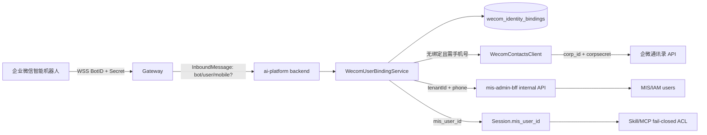
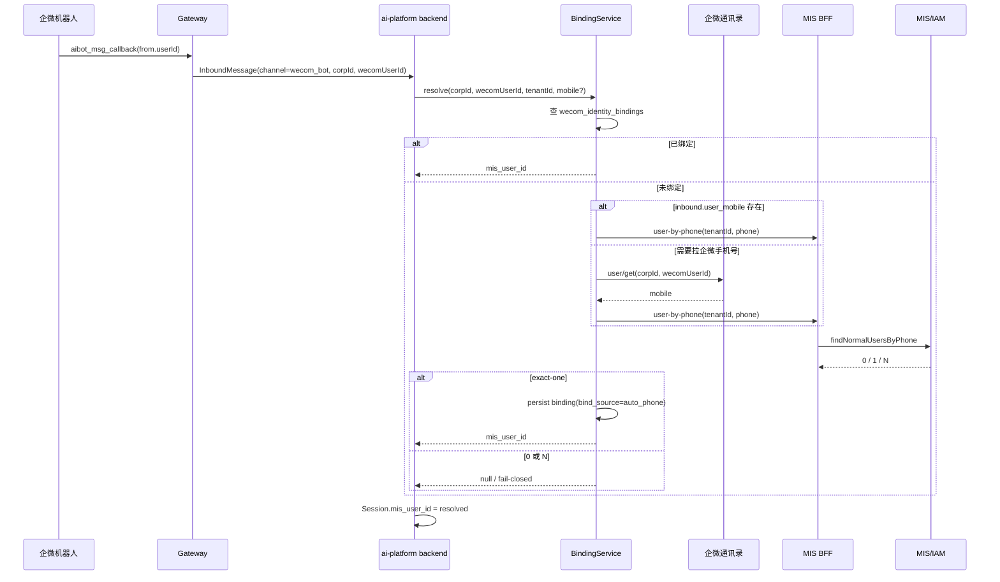

# 企微 Bot 用户身份绑定设计（BotID / 通讯录应用 / MIS userId）

> 版本：v1.0｜日期：2026-10-01｜状态：设计稿  
> 范围：只落设计，不写业务代码  
> 关联：`t03-failclosed-spec.md` #15、`t04-closeout-design.md` 企微 Bot 管理、`spec.md` 权限模型  
> 目标读者：Architect / Backend / Frontend / OPS

---

## 1. 背景与结论

### 1.1 现象

当前企微机器人长连接接入使用：

```text
WSS endpoint = wss://openws.work.weixin.qq.com
鉴权参数     = BotID + Secret
订阅命令     = aibot_subscribe
```

代码事实：

- `agent/ai-platform/gateway/src/adapters/wecom/WecomBotClient.ts`：
  - `connect()` 要求 `botId` 与 `secret`；
  - 连接后发送 `aibot_subscribe`；
  - 默认 WSS endpoint 固定为 `wss://openws.work.weixin.qq.com`。
- `agent/ai-platform/backend/src/channels/models.py`：
  - 落盘态 `WecomBotRecord` 字段为 `bot_id`、`bot_secret_id`、`secret`；
  - 其中 `bot_secret_id` 是“企微官方 BotID（长连接鉴权）”，`secret` 是“长连接专用 Secret”。
- `agent/ai-platform/configs/system/system.yaml`：
  - `wecom.bot.websocket.endpoint` 是系统默认 endpoint，不是每个 Bot 的业务配置项。

### 1.2 结论

`BotID + Secret` 用于长连接鉴权，方向是对的。  
WSS endpoint 是固定平台地址，不应作为机器人身份配置和 BotID/Secret 混在一起。若管理界面把“WSS”作为用户输入项，应修正为“BotID / Secret / 绑定 Agent”，或仅只读展示 endpoint。

但是，机器人长连接凭证 **不等于** 企微通讯录应用凭证。  
只靠 `BotID + Secret` 无法稳定获取成员手机号、部门、userid 详情等通讯录信息。要完成：

```text
企微 userid
→ MIS userId
→ 工具权限判断
```

必须补一层“企微应用 / 通讯录凭证”，用于按需调用企微通讯录接口。

---

## 2. 目标与非目标

### 2.1 目标

1. 建立企微用户身份绑定主链路：`corp_id + wecom_user_id → tenant_id + mis_user_id`。
2. 首次无绑定时支持手机号兜底匹配，但只在首次或人工触发时查企微通讯录，不做每条消息实时查询。
3. 保持 MIS 权限主体为 `mis_user_id`，不把企微 userid、平台 `user_id`、employeeId 当权限主体。
4. 解析失败时 fail-closed，不影响入站消息接收，但不得放行受控 Skill / MCP 工具。
5. 管理端后续可通过人工绑定、自动手机号绑定、同步绑定三种来源维护映射。

### 2.2 非目标

1. 不把企微通讯录同步做成权限系统；权限仍在 MIS/IAM。
2. 不要求每个机器人都配置一个独立企微应用；同一企业主体可共享一个通讯录应用凭证。
3. 不把手机号作为长期主键；手机号只作为首次自动匹配兜底。
4. 不在本设计阶段提交代码改动。

---

## 3. 术语对齐

| 术语 | 含义 | 用途 | 是否可当权限主体 |
|---|---|---|---|
| `bot_secret_id` / BotID | 企微智能机器人 BotID | 长连接 `aibot_subscribe` | 否 |
| Bot Secret | 企微智能机器人长连接 Secret | 长连接 `aibot_subscribe` | 否 |
| WSS endpoint | 企微开放平台长连接地址 | WebSocket 连接入口 | 否 |
| `corp_id` | 企业微信企业 ID | 区分企业主体、通讯录应用凭证 | 否 |
| `corpsecret` / app secret | 企微应用或通讯录同步凭证 | 获取 `access_token` 调通讯录 API | 否 |
| `wecom_user_id` | 企微成员 userid | 入站消息发送者标识 | 否 |
| `mis_user_id` | MIS/IAM userId | Skill / MCP 权限判断 | 是 |
| `tenant_id` | MIS 租户 ID | 手机号匹配、数据隔离 | 否 |
| `user_mobile` | 入站消息或通讯录返回的手机号 | 首次绑定兜底 | 否 |

---

## 4. 当前实现与缺口

### 4.1 已有解析消费端

现有企微身份解析路径：

```text
Gateway WecomBotAdapter
→ inbound.channel_user_id / inbound.user_id = 企微 userid
→ backend inbound_worker._resolve_inbound_mis_user_id()
→ identity.mis_user_id._strip_wecom_prefix()
→ 查 users.wecom_user_id
→ 读 users.mis_user_id
→ session.mis_user_id
→ ACL fail-closed
```

关键文件：

- `agent/ai-platform/gateway/src/adapters/wecom/WecomBotAdapter.ts`
- `agent/ai-platform/backend/src/queue/inbound_worker.py`
- `agent/ai-platform/backend/src/identity/mis_user_id.py`
- `agent/ai-platform/backend/src/models/user.py`

当前查询：

```python
select(UserModel.mis_user_id).where(UserModel.wecom_user_id == wecom_user_id)
```

### 4.2 缺失的数据生产端

当前 `users.wecom_user_id` 和 `users.mis_user_id` 有字段，但没有可靠来源：

1. `agent/ai-platform/backend/src/identity/wecom_sync.py` 有 `WeComOrgSync`，可写 `wecom_user_id`，但当前没有运行时调用点。
2. `WeComOrgSync` 只同步企微用户基础信息，不会自动知道 MIS `mis_user_id`，除非按手机号或人工映射补齐。
3. `users.mis_user_id` 是新增承载列，但没有绑定入口和回填流程。
4. 当前查询只按 `wecom_user_id` 查，未带 `corp_id`，多企业/多 corp 时存在碰撞风险。
5. `WeComClient` 使用全局 `WECOM_CORP_ID + WECOM_SECRET`，只适合单企业、单租户兜底，不适合多机器人多 corp 场景。

### 4.3 可复用的 MIS 手机号匹配能力

MIS BFF 已有嵌入式身份手机号匹配模式：

- `backend/mis-admin-bff/src/main/java/com/mis/adminbff/service/EmbedIdentityService.java`
  - 显式映射优先；
  - 手机号匹配兜底；
  - 找不到或歧义则拒绝。
- `backend/mis-admin-bff/src/main/java/com/mis/adminbff/client/IamWebClient.java`
  - `findNormalUsersByPhone(tenantId, phone)`。

本设计复用“同租户 + 手机号 + exact-one”的匹配规则，但不复用 `/embed` 的 externalToken 交换流程。

---

## 5. 总体方案

采用两层策略：

```text
第一层：本地绑定表命中（主链路）
corp_id + wecom_user_id → tenant_id + mis_user_id

第二层：首次自动手机号匹配（兜底）
无绑定 → 取 inbound.user_mobile
        → 无手机号则调企微通讯录 user/get
        → MIS BFF 按 tenantId + phone 查用户
        → exact-one 才落绑定
        → 后续消息只查本地绑定
```

核心原则：

1. 手机号只在没有绑定时使用。
2. 自动绑定必须 exact-one。
3. 人工绑定优先级高于自动绑定。
4. 已禁用绑定不自动重生。
5. 每个 Bot 必须能推导出 `corp_id + tenant_id`。

---

## 6. 架构与时序

### 6.1 逻辑架构



### 6.2 首次入站解析时序



### 6.3 后续消息时序

```text
InboundMessage
→ 查 wecom_identity_bindings(corp_id, wecom_user_id)
→ hit: 直接返回 mis_user_id
→ miss: 走首次兜底，或 fail-closed
```

禁止每条消息都调企微通讯录手机号接口。

---

## 7. 数据模型

### 7.1 新表：`wecom_identity_bindings`

```sql
CREATE TABLE wecom_identity_bindings (
    id               VARCHAR(36) PRIMARY KEY,
    corp_id          VARCHAR(64) NOT NULL,
    wecom_user_id    VARCHAR(64) NOT NULL,
    tenant_id        BIGINT NOT NULL,
    mis_user_id      BIGINT NOT NULL,
    bind_source      VARCHAR(16) NOT NULL,
    status           VARCHAR(16) NOT NULL DEFAULT 'active',
    phone_hash       VARCHAR(64),
    phone_masked     VARCHAR(32),
    created_at       TIMESTAMPTZ NOT NULL DEFAULT NOW(),
    updated_at       TIMESTAMPTZ NOT NULL DEFAULT NOW(),
    last_verified_at TIMESTAMPTZ,
    UNIQUE (corp_id, wecom_user_id),
    UNIQUE (corp_id, mis_user_id)
);

CREATE INDEX idx_wecom_binding_mis_user
ON wecom_identity_bindings (tenant_id, mis_user_id);

CREATE INDEX idx_wecom_binding_status
ON wecom_identity_bindings (status);
```

字段规则：

| 字段 | 规则 |
|---|---|
| `corp_id + wecom_user_id` | 企微侧自然唯一键，不能只用 `wecom_user_id` |
| `tenant_id + mis_user_id` | MIS 权限主体与租户隔离 |
| `bind_source` | `manual` / `auto_phone` / `sync` |
| `status` | `active` / `disabled` |
| `phone_hash` | 仅存哈希，禁止存明文手机号 |
| `phone_masked` | 只用于运营端展示 |
| `last_verified_at` | 最近一次人工或接口校验成功时间 |

### 7.2 与 `users` 表的关系

`users.wecom_user_id` / `users.mis_user_id` 可以作为兼容路径保留，但新设计不应把 `users` 当作多 corp 绑定表。多企业场景下，绑定事实应在 `wecom_identity_bindings`：

```text
users              = 平台用户扩展/缓存
wecom_identity_bindings = 企微身份绑定事实
```

短期可兼容：

```text
resolve miss
→ 若 users 表已有 wecom_user_id + mis_user_id
→ 可回填到 wecom_identity_bindings
```

长期主查询应切到绑定表。

---

## 8. 配置模型

### 8.1 Bot 配置扩展

当前 `configs/channels/wecom-bots.yaml`：

```yaml
version: 1
bots:
  - bot_id: wb-3f2a1c9d
    bot_secret_id: wxbot-xxxx
    name: 运维助手
    enabled: true
    secret: <long-connection-secret>
    bound_agent_id: ops-agent
```

建议扩展：

```yaml
version: 1
bots:
  - bot_id: wb-3f2a1c9d
    bot_secret_id: wxbot-xxxx
    name: 运维助手
    enabled: true
    secret: <long-connection-secret>
    bound_agent_id: ops-agent
    corp_id: ww-xxxx
    tenant_id: 1
```

说明：

- `bot_secret_id` + `secret`：机器人长连接。
- `corp_id` + `tenant_id`：把入站发送者映射到企业主体和 MIS 租户。
- `corp_id` 是后续通讯录查询和绑定表主键的一部分。

### 8.2 新通讯录应用配置

建议新增 `configs/channels/wecom-corps.yaml`：

```yaml
version: 1
corps:
  - corp_id: ww-xxxx
    tenant_id: 1
    name: 集团总部
    secret_ref: secret://wecom/corp/ww-xxxx
    user_bind_mode: auto_phone
```

字段：

| 字段 | 含义 |
|---|---|
| `corp_id` | 企微企业 ID |
| `tenant_id` | 对应 MIS 租户 |
| `secret_ref` | 企微应用或通讯录同步 secret 的引用 |
| `user_bind_mode` | `auto_phone` / `manual_only` / `disabled` |

### 8.3 MVP 环境变量兜底

单企业阶段可继续使用：

```text
WECOM_CORP_ID
WECOM_SECRET
```

但必须限制：

- 只适合单 corp / 单 tenant。
- 多 Bot 若分布在多个 corp，必须用 `wecom-corps.yaml` 按 corp 解析。
- 不应把全局 `WECOM_SECRET` 当成机器人长连接 Secret。

### 8.4 “每个机器人是否要配对应企微应用？”

结论：

1. **机器人长连接**：每个 Bot 维度需要 `BotID + Secret`。
2. **通讯录读取**：按企业主体 `corp_id` 维度需要应用或通讯录凭证，不要求每个 Bot 一个。
3. 同一个 corp 下多个机器人，可共享一个具备通讯录读取权限的应用凭证。
4. 不同 corp 必须使用各自 corp 的凭证。
5. 如果手机号字段不可见，先检查通讯录权限与应用可见范围，而不是改机器人 Secret。

---

## 9. 运行时解析算法

### 9.1 输入

```ts
interface WecomIdentityInput {
  corpId: string;
  tenantId: number;
  wecomUserId: string;
  userMobile?: string;
  bindMode?: 'auto_phone' | 'manual_only' | 'disabled';
}
```

### 9.2 算法

```text
resolve(input):
  1. 校验 corpId / tenantId / wecomUserId 非空
  2. 若 inbound.metadata.misUserId 可信且已由服务端注入，直接返回
  3. 查 wecom_identity_bindings(corpId, wecomUserId)
     - status=active → 返回 mis_user_id
     - status=disabled → 返回 null
  4. 若 bindMode != auto_phone → 返回 null
  5. phone = input.userMobile
  6. 若 phone 为空：
       phone = WecomContactsClient.get_user_info(corpId, wecomUserId).mobile
  7. 若 phone 为空 → 返回 null
  8. 调 MIS BFF internal API: user-by-phone(tenantId, phone)
       - matched=true 且唯一 → 继续
       - not_found / ambiguous → 返回 null
  9. 写入 wecom_identity_bindings：
       corp_id, wecom_user_id, tenant_id, mis_user_id
       bind_source=auto_phone, status=active
       phone_hash=hash(phone), phone_masked=mask(phone)
  10. 返回 mis_user_id
```

### 9.3 绑定冲突规则

| 场景 | 处理 |
|---|---|
| 已存在 `manual` active | 不允许被 `auto_phone` 覆盖 |
| 已存在 `disabled` | 不自动重生，需管理员重新启用 |
| 同一 `corp_id + mis_user_id` 已绑另一个 wecom_user_id | 拒绝自动绑定，进入人工处理 |
| BFF 返回 0 个用户 | fail-closed |
| BFF 返回多个用户 | fail-closed，记录 pending/告警 |
| 手机号为空 | fail-closed |

---

## 10. BFF 内部 API

### 10.1 接口

```http
GET /internal/wecom/user-by-phone?tenantId=1&phone=138xxxx
```

安全：

- 仅 `/internal/**`。
- 必须带 `X-Platform-Token` 或项目现有内部服务令牌。
- 走 `InternalServiceTrustInterceptor` 同类机制。
- 不允许浏览器直连。

### 10.2 返回

```json
{
  "code": 0,
  "data": {
    "matched": true,
    "user_id": 1001,
    "username": "zhangsan"
  }
}
```

未匹配：

```json
{
  "code": 0,
  "data": {
    "matched": false,
    "reason": "not_found"
  }
}
```

歧义：

```json
{
  "code": 0,
  "data": {
    "matched": false,
    "reason": "ambiguous"
  }
}
```

### 10.3 查询规则

底层复用：

```java
iamWebClient.findNormalUsersByPhone(tenantId, phone)
```

只接受：

- 同 `tenantId`
- 状态正常用户
- 查询结果 exact-one

---

## 11. 管理端能力

### 11.1 页面

建议新增“企微用户绑定”子页或企微 Bot 页面内 Tab：

| 列 | 说明 |
|---|---|
| corp | 企业 |
| wecom_user_id | 企微成员 userid |
| 姓名 | 人工或同步展示 |
| MIS 用户 | 绑定用户 |
| 来源 | manual / auto_phone / sync |
| 状态 | active / disabled |
| 最近校验 | last_verified_at |
| 操作 | 绑定 / 解绑 / 校验 |

### 11.2 API

```http
GET    /api/v1/agent-ops/channels/wecom/users
POST   /api/v1/agent-ops/channels/wecom/users/{corpId}/{wecomUserId}/bind
POST   /api/v1/agent-ops/channels/wecom/users/{corpId}/{wecomUserId}/unbind
POST   /api/v1/agent-ops/channels/wecom/users/{corpId}/{wecomUserId}/verify
```

### 11.3 权限码

```text
agent:wecom:user:list
agent:wecom:user:manage
```

---

## 12. 安全与隐私

1. 不记录明文手机号、Bot Secret、corpsecret、access_token。
2. 手机号仅存 `phone_hash` 与 `phone_masked`。
3. 日志中用户手机号如需排查，使用 masked 值。
4. internal API 必须服务间鉴权，禁止公网暴露。
5. 自动绑定只用于首绑；绑定后不重复查手机号。
6. 所有无法唯一解析的身份均 fail-closed。
7. 不允许把 `wecom_user_id` 直接作为 `mis_user_id`。
8. 不允许把 `users.user_id`、employeeId、channelUserId 当 MIS 权限主体。

---

## 13. 测试设计

### 13.1 单元测试

| 用例 | 预期 |
|---|---|
| binding hit active | 返回 mis_user_id |
| binding hit disabled | 返回 null |
| manual active + auto_phone | 不覆盖 |
| phone exact-one | 写 auto_phone binding |
| phone not_found | 不写绑定，返回 null |
| phone ambiguous | 不写绑定，返回 null |
| 通讯录 mobile 为空 | 返回 null |
| corp_id 缺失 | 返回 null |
| tenant_id 缺失 | 返回 null |
| `corp_id + mis_user_id` 冲突 | 拒绝自动绑定 |

### 13.2 集成测试

1. 两条入站消息：第一条自动手机号绑定，第二条只查本地表。
2. bot A / bot B 同 corp，共享 corp 配置，绑定互不干扰。
3. bot A / bot B 不同 corp，用户 ID 相同但不串绑。
4. 企微通讯录 API 失败时 fail-closed，不阻断消息接收。
5. BFF 内部 API 未带内部 token 返回 403/401。
6. Gateway 长连接只使用 BotID + Secret，不依赖 corpsecret。

### 13.3 验收信号

- 不配置通讯录应用时，机器人仍能收消息，但受控工具 fail-closed。
- 配置通讯录应用且手机号唯一时，首次消息自动绑定，后续消息不再查企微 API。
- 管理端可看到绑定来源和状态。
- 多 corp 同 userid 不串绑。

---

## 14. 分阶段实施计划

| 阶段 | 内容 | 产出 |
|---|---|---|
| P0 | 设计落地 | 本文档 + 目录索引 |
| P1 | 数据与配置 | `wecom_identity_bindings` 迁移、Bot `corp_id/tenant_id` 字段、corp 配置 |
| P2 | 运行时绑定服务 | `WecomUserBindingService`、`WecomContactsClient`、绑定表读写 |
| P3 | BFF internal API | `user-by-phone` 内部接口与测试 |
| P4 | 运营台 | 用户绑定列表、人工绑定、解绑、校验 |
| P5 | 同步与回填 | 可选择性激活 `WeComOrgSync`，批量发现未绑定用户，不自动越权绑定 |

---

## 15. 待确认问题

1. 企微智能机器人回调是否会稳定携带 `corp_id`？若不携带，以 Bot 配置 `corp_id` 为准即可。
2. `corp_id → tenant_id` 是否严格一对一？当前设计允许一租户多 corp。
3. corp secret 使用环境变量、Vault、还是现有 `secret_ref` 机制？
4. 通讯录可见范围是否覆盖所有机器人使用者？
5. 手机号字段在客户企微中是否强制可信？若不可信，管理端人工绑定必须作为一等能力。
6. 自动绑定是否默认开启，还是按 corp 配置为 `manual_only` 试点后再开？

---

## 16. 与既有文档的关系

- `t03-failclosed-spec.md` #15-c 提到“企微↔MIS 绑定运维”作为 T06 增强；本设计把它展开为可实施设计。
- `t04-closeout-design.md` 已完成企微多 Bot 管理页 wire 对齐；本设计不改变 Bot 管理主流程，只扩展 Bot 配置中的 corp/tenant 字段。
- `spec.md` 的权限模型不变：最终权限主体仍是 `mis_user_id`。