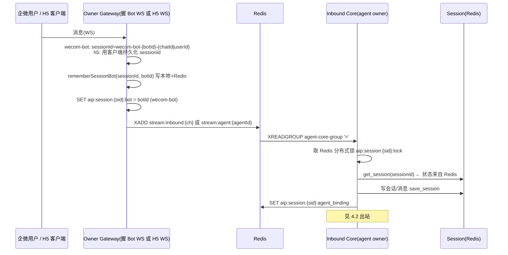
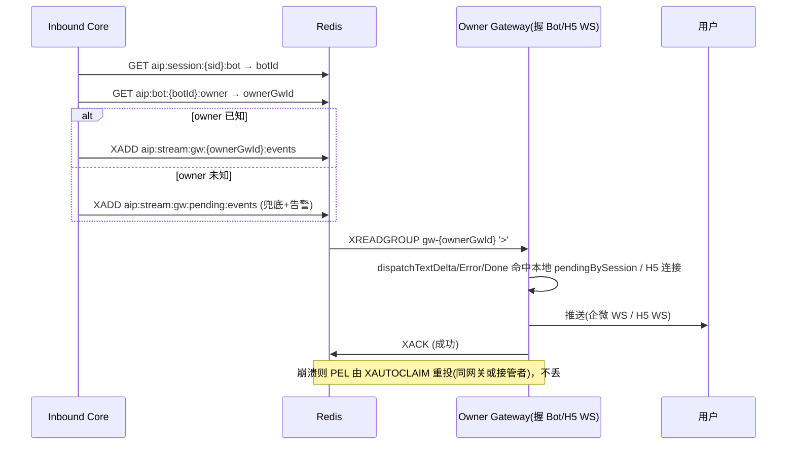
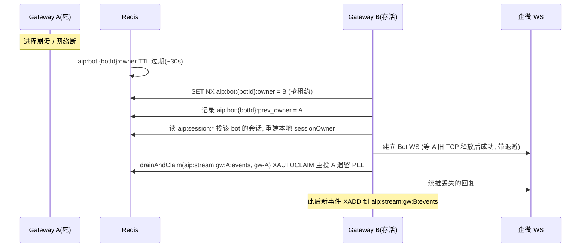

# ai-platform 多 Gateway + 多 Agent Core 横向扩展 —— 详细设计与任务分解

> **TL;DR**：在已冻结的 7 个决策点（Gateway 多实例 + Agent Core 多实例、per-owner 持久 stream 出站、Redis 租约选主、稳定 GatewayId/CoreId、崩溃重投、sessionId 含 botId 且 H5 持久化）之上，给出可逐条落地的设计：用「Redis 租约 + 每实例独立出站流 + 入站 Redis 分布式 session 锁 + Agent 注册表 Redis 化」把全局唯一性显式提升为分布式契约，并把会话状态（已外置在 Redis）作为故障转移的真相源。

本文档是 `multi-agent-gateway-deployment-review.md` 的**实现前详细设计**，所有结论均经源码核实（见末尾「核实依据」）。Agent Core 多实例的三类同构问题（入站分片 / 注册表视图 / 出站发布）在本期一并设计。

---

## 1. 修订后的总体架构

### 1.1 组件图

```mermaid
graph TD
  U[企微用户 / H5 客户端] --> LB[接入层 LB<br/>H5 sticky: cookie / ip-hash]
  LB --> G1[Gateway A<br/>gatewayId=gw-a]
  LB --> G2[Gateway B<br/>gatewayId=gw-b]
  LB --> GN[Gateway N ...]

  subgraph GW[Gateway 层 · N 实例]
    G1
    G2
    GN
  end

  G1 -->|抢/续租约 SET NX TTL+心跳| R[(Redis)]
  G2 -->|抢/续租约| R
  GN -->|抢/续租约| R

  R -.->|aip:bot:{botId}:owner = gatewayId| G1
  R -.->|aip:stream:gw:{gwId}:events 每网关独立流| G1
  R -.->|aip:session:{sid}:bot / aip:session:{sid}:gateway| G1

  C1[Agent Core 1<br/>coreId=core-1]
  C2[Agent Core 2<br/>coreId=core-2]
  CM[Agent Core M ...]

  subgraph CORE[Agent Core 层 · M 实例]
    C1
    C2
    CM
  end

  C1 -->|抢/续租约 agent owner| R
  C2 -->|抢/续租约 agent owner| R
  CM -->|抢/续租约 agent owner| R

  R -.->|aip:agent:{agentId}:owner = coreId| C1
  R -.->|aip:agent:registry hash| C1
  R -.->|aip:session:{sid}:lock 分布式锁| C1

  G1 -->|1. 入站 XADD stream:agent / stream:inbound| R
  R -->|2. agent-core-group 仅 owning core 消费| C1
  C1 -->|3. 处理会话(Redis 取状态)| R
  C1 -->|4. 出站 查 bot->gw owner| R
  R -->|5. aip:stream:gw:{ownerGw}:events 仅 owner 消费| G1

  Store[wecom-bots.yaml] -. bot 配置清单.-> G1
  G1 -. 健康检查 /admin/bots/health.-> Store
```

### 1.2 关键映射与分区方式说明

| 维度 | 方案 | 真相源（Redis key） | 谁写 / 谁读 |
|------|------|--------------------|----|
| **Bot → owner gateway** | Redis 租约（决策 3） | `aip:bot:{botId}:owner` | Gateway 抢/续；Core 出站读 |
| **Session → bot** | 入站写、出站读 | `aip:session:{sid}:bot` | Gateway(BotRegistry) 写；Core 出站读 |
| **Session → gateway**（H5） | WS 建立/重连写 | `aip:session:{sid}:gateway` | Gateway(WS) 写；Gateway 出站(H5)读 |
| **Session → agent** | 已有亲和绑定 | `aip:session:{sid}:agent_binding` | Core 写；Gateway/Core 读 |
| **出站事件 → owner gateway** | per-owner stream（决策 2） | `aip:stream:gw:{gwId}:events` | Core XADD；owner Gateway XREADGROUP |
| **Agent → owner core** | Redis 租约（同构决策 1） | `aip:agent:{agentId}:owner` | Core 抢/续；Core 入站路由读 |
| **Agent 注册表** | Redis Hash（同构问题②） | `aip:agent:registry` | 各 Core 写自己拥有的；各 Core 读全局 |
| **Core 入站分区** | **Redis 分布式 session 锁**（同构问题①推荐） | `aip:session:{sid}:lock` | 处理前争用；天然随 Core 崩溃 TTL 释放 |

**关于 Core 入站分区的推荐（同构问题①）**：在「一致性哈希分区到固定 Core 实例」与「Redis 分布式 session 锁」之间，**推荐 Redis 分布式 session 锁**，理由：
1. 会话状态（`SessionManager`）**已外置在 Redis**（TTL 24h，见 `session.py`），多 Core 只需对同会话的并发处理做全局串行化；真正要消除的竞争正是 `inbound_worker._session_locks`（进程内 `asyncio.Lock`）。
2. 锁方案**不动生产/消费拓扑**：Gateway `MessageRouter.route` 仍 XADD 到 `stream:agent:{agentId}` / `stream:inbound:{channel}`，`agent-core-group` 维持不变；仅把进程内锁换成 Redis 锁。改动面最小、与已采纳的 Gateway 租约模式一致。
3. 崩溃重投天然契合：Core 死 → 其持有的锁 TTL 过期 → 接管 Core 经 XAUTOCLAIM 拿到遗留消息后重新争锁处理；无死锁。
4. 一致性哈希分区（备选）需把入站流改为 `stream:agent:{agentId}:core:{hash}`、生产侧按 `hash(sessionId)` 改写路由、且 M 变化时需 rehash drain，侵入更大、收益（省一次锁往返）本期不迫切。

> 因此本期**不引入 `aip:session:{sid}:core` 的强制路由归属**（仅作为可选观测 hint，记录 last-core），权威串行化由锁保证。

---

## 2. 关键数据结构（Redis key 全量表）

> 前缀 `aip:` = `REDIS_KEY_PREFIX`（与评审一致，全局统一）。TTL 单位秒。

### 2.1 Gateway 侧（含评审已定义 + 本期补全）

| Key | 类型 | 内容 / 语义 | TTL | 责任方 |
|-----|------|------------|-----|--------|
| `aip:bot:{botId}:owner` | string | `gatewayId`；租约（SET NX + TTL），owner 心跳续租，崩溃过期释放 | 30 | Gateway（抢/续）；Core 出站读 |
| `aip:bot:{botId}:prev_owner` | string | 上一次 owner（接管时定位旧 stream 用于 drain） | 300 | Gateway（接管写） |
| `aip:gateways:members` | set | 存活 gatewayId 心跳集合（故障转移 drain 定位） | 30（成员带心跳重加） | 各 Gateway |
| `aip:stream:gw:{gatewayId}:events` | stream | 该 gateway 的出站事件流；消费组 `gw-{gatewayId}`；崩溃 PEL 由 XAUTOCLAIM 重投 | MAXLEN 10000 | Core(XADD) / owner Gateway(XREADGROUP) |
| `aip:stream:gw:pending:events` | stream | owner 解析失败时的暂存兜底；owner 认领后转写其 stream + 告警 | MAXLEN 10000 | Core / Gateway |
| `aip:session:{sessionId}:bot` | string | botId（替代进程内 `sessionOwner`，跨 gateway 可见；修 N3 兜底） | 86400 | Gateway 入站写 / Core 读 |
| `aip:session:{sessionId}:gateway` | string | 持有该会话 WS 的 gatewayId（H5/wecom-h5 连接建立写，重连更新；修 N5） | 3600 | Gateway WS 建立/重连写 |
| `aip:session:{sessionId}:agent_binding`（已有） | string | agentId 绑定（session affinity） | 86400 | Core / Gateway |

### 2.2 Agent Core 侧（本期新增，同构三问题）

| Key | 类型 | 内容 / 语义 | TTL | 责任方 |
|-----|------|------------|-----|--------|
| `aip:agent:{agentId}:owner` | string | `coreId`；Agent 运行时实例租约（与 bot 同构，决策 1） | 30 | Core（抢/续）；Core 入站路由读 |
| `aip:agent:{agentId}:prev_owner` | string | 上一次 owner core（接管 drain 用） | 300 | Core（接管写） |
| `aip:agent:registry` | hash | 全局 Agent 注册表：`field=agentId`，`value=JSON{state, config_version, core_id, last_seen}`（同构问题②） | 字段值 30 | 各 Core（写自己拥有的；读全局） |
| `aip:cores:members` | set | 存活 coreId 心跳集合 | 30 | 各 Core |
| `aip:session:{sessionId}:lock` | string | 分布式 session 锁；value=`{coreId}:{fencingToken}`（同构问题①） | 30~60（处理窗口，带看门狗续期） | 各 Core（处理前争用） |
| `aip:session:{sessionId}:core`（可选） | string | 最近处理该会话的 coreId（**仅观测 hint，不用于强制路由**） | 3600 | Core（写 last-core） |
| `aip:stream:agent:{agentId}`（已有） | stream | Agent 入站流；**本期仅 owning core 消费**（决策 1） | MAXLEN 10000 | Gateway 写 / owning Core 读 |
| `aip:stream:inbound:{channel}`（已有） | stream | 未绑定 agent 的入站流；所有 Core 共享消费组做首轮路由 | MAXLEN 10000 | Gateway 写 / 所有 Core 读 |

> **会话状态存储**：`aip:session:{sessionId}`（`SessionManager`，TTL 24h）+ PostgreSQL 冷备投影。多 Core 故障转移时，接管 Core 经 `get_session` 从 Redis 完整恢复，无需进程内存（已核实 `session.py`）。

---

## 3. 接口 / 类变更清单

### 3.1 Gateway 侧（TypeScript）

**新增 `gateway/src/cluster/ownership.ts`** — Bot 租约选主
```ts
export interface OwnershipConfig {
  leaseTtlMs: number;        // 默认 30000
  heartbeatMs: number;       // 默认 10000
  prefix: string;            // 'aip:'
}
export class BotOwnership {
  constructor(redis: Redis, gatewayId: string, cfg?: OwnershipConfig);
  /** SET NX 抢租约；成功返回 true（成为 owner） */
  async claim(botId: string): Promise<boolean>;
  /** 续租（仅 owner 调用，失败表示已易主） */
  async renew(botId: string): Promise<boolean>;
  /** 主动释放（优雅关闭） */
  async release(botId: string): Promise<void>;
  /** 读当前 owner；用于出站/接管 */
  async currentOwner(botId: string): Promise<string | null>;
  /** 读上一任 owner（drain 旧 stream 用） */
  async prevOwner(botId: string): Promise<string | null>;
  /** 启动心跳续租循环 + 注册「失主」回调（续租失败=被接管） */
  startHeartbeat(onLost?: (botId: string) => void): void;
  stopHeartbeat(): void;
}
/** 稳定 GatewayId：GATEWAY_ID 环境变量 → os.hostname() → 告警随机 */
export function getGatewayId(): string;
```

**新增 `gateway/src/cluster/outboundRouting.ts`**（或并入 `redisStream.ts`）
```ts
/** per-owner 出站流 key：aip:stream:gw:{gwId}:events */
export function getOutboundStreamKey(gatewayId: string): string;
/** 兜底流 key */
export function getPendingOutboundStreamKey(): string;
```

**`gateway/src/queue/redisStream.ts` — `StreamConsumer` 增强（崩溃重投 N1）**
```ts
export class StreamConsumer {
  // 现有：start / stop / ensureConsumerGroup / consumeLoop / processMessage
  /** 新增：动态追加订阅流（接管 drain 时追加旧 owner 的 stream） */
  async attachStream(streamKey: string): Promise<void>;
  /** 新增：周期性 XAUTOCLAIM 重投本消费者 PEL 中长时间未 ACK 的消息到自己 */
  private async reclaimLoop(intervalMs: number): Promise<void>;
  /** 新增：对指定旧消费组做 XAUTOCLAIM 接管（gateway 故障转移） */
  async drainAndClaim(oldStreamKey: string, oldGroup: string): Promise<void>;
}
```

**`gateway/src/channels/BotRegistry.ts` — 只启 owner bot（修 K1/N2）**
```ts
export class BotRegistry {
  // 变更 startAll 签名：只启动「本网关 claim 成功」的 bot
  async startOwnedBots(
    onMessage: BotInboundHandler,
    isOwner: (botId: string) => Promise<boolean>,
  ): Promise<number>;
  // reconcile 尊重租约：失主停 bot；得主起 bot
  async reconcile(desired: BotRuntimeConfig[], isOwner: (botId: string) => Promise<boolean>): Promise<ReconcileReport>;
  // 入站写 Redis 归属（修 N3 跨 gateway 可见）
  async rememberSessionBot(sessionId: string, botId: string): Promise<void>;
  // resolveTargets / dispatch* 不变（后仍回退广播）
}
```

**`gateway/src/channels/WecomBotAdapter.ts` — sessionId 加 botId（修 N3）**
```ts
// receive 改为携带本 adapter 的 botId（this.config.botId，来自 WecomBotClientConfig.botId）
receive(botMessage: BotWsMessage, t0 = Date.now()): InboundMessage {
  const sessionId = `wecom-bot-${this.config.botId}-${sessionKey}`; // sessionKey=chatId|channelUserId
  ...
}
// receiveEventCallback 同步改造 sessionId 拼 botId
```

**`gateway/src/adapters/h5/H5Adapter.ts` & `WecomH5Adapter.ts` — sessionId 持久化（修 N5）**
```ts
// 接受客户端回传的 sessionId（不再每次随机）；连接建立写 aip:session:{sid}:gateway
registerWsConnection(sessionId: string, ws: WebSocket, gatewayId: string): Promise<void>;
unregisterWsConnection(sessionId: string): Promise<void>; // 连接关闭删映射
```

**`gateway/src/server.ts` — sticky + 写 gateway 归属（修 N5）**
```ts
// /ws/chat 与 /ws/wecom-h5/chat：sessionId 优先取客户端 ?sessionId=（localStorage 持久化），
// 缺失才随机生成；连接建立后 await h5Adapter.registerWsConnection(sid, ws, gatewayId)
//   并 redis.set(aip:session:{sid}:gateway, gatewayId, 'EX', 3600)
```

**`gateway/src/index.ts` — 编排（阶段 A）**
```ts
const gatewayId = getGatewayId();
const ownership = new BotOwnership(redis, gatewayId);
ownership.startHeartbeat();
// 入站：只起 owner bot
const started = await botRegistry.startOwnedBots(
  (m) => messageRouter.route(m),
  (botId) => ownership.claim(botId),
);
// 出站：消费「自己的」stream
const eventConsumer = new StreamConsumer(redisConsumer, `gw-${gatewayId}`, `gw-${gatewayId}`);
await eventConsumer.start(getOutboundStreamKey(gatewayId), onAgentEvent);
// H5 出站按 aip:session:{sid}:gateway 选目标 stream（见 §3.1 出站分支）
```

### 3.2 Backend（Agent Core）侧（Python）

**新增 `backend/src/cluster/core_ownership.py`** — Agent 运行时租约（同构决策 1）
```python
class CoreOwnership:
    def __init__(self, redis, core_id: str, *, lease_ttl_s=30, heartbeat_s=10): ...
    async def claim(self, agent_id: str) -> bool: ...        # SET NX
    async def renew(self, agent_id: str) -> bool: ...
    async def release(self, agent_id: str) -> None: ...
    async def current_owner(self, agent_id: str) -> str | None: ...
    async def prev_owner(self, agent_id: str) -> str | None: ...
    def start_heartbeat(self, on_lost=None): ...
def get_core_id() -> str: ...   # CORE_ID 环境变量 / hostname
```

**新增 `backend/src/cluster/session_lock.py`** — Redis 分布式 session 锁（同构问题①）
```python
class RedisSessionLock:
    def __init__(self, redis, *, lock_ttl_s=30, extend_s=10, retry=5, retry_wait_s=0.2): ...
    @asynccontextmanager
    async def acquire(self, session_id: str):
        # SET aip:session:{sid}:lock NX PX(ttl) value={core_id}:{uuid}
        # 失败则 sleep 重试；仍失败则放弃(消息保持未 ACK，交由 XAUTOCLAIM 重投)
        # 持锁期间看门狗续期；退出时仅当 value 仍为自己才 DEL
        ...
```

**`backend/src/queue/redis_stream.py` — 出站按 owner 分流（决策 2）**
```python
class StreamProducer:
    async def publish_agent_event(
        self, *, session_id, user_id, channel, agent_id, trace_id, event,
        target_gw: str | None = None,          # 新增：显式指定则直接用
    ) -> str:
        # 1. 若未指定 target_gw：bot_id = GET aip:session:{sid}:bot
        #                       target_gw = GET aip:bot:{bot_id}:owner
        # 2. stream = aip:stream:gw:{target_gw}:events 或兜底 aip:stream:gw:pending:events
        # 3. XADD + 返回 message_id
    @staticmethod
    def get_outbound_stream_key(gateway_id: str) -> str: ...
```

**`backend/src/queue/inbound_worker.py` — 分布式锁 + XAUTOCLAIM + agent 路由（N1 / 同构①②③）**
```python
class InboundStreamWorker:
    # 删除 self._session_locks（asyncio.Lock）；改用 RedisSessionLock
    async def _handle_message(self, stream_key, message_id, inbound):
        async with self._semaphore:
            # 同构问题①：Redis 分布式锁替代进程内锁
            async with self._session_lock.acquire(inbound.session_id):
                await self._process_inbound(inbound, stream_key)
                await redis.xack(...)
    # 同构问题②+①路由：处理前先判定 agent owner
    async def _ensure_agent_local_or_reroute(self, agent_id, stream_key, message_id, inbound):
        owner = await self._core_ownership.current_owner(agent_id)
        if owner is not None and owner != self._core_id:
            # 重投到 owning core 的 stream:agent:{agentId}（仅首条 unbound 场景）
            await self._producer._redis.xadd(StreamKeys.agent_inbound(agent_id), fields)
            await redis.xack(stream_key, CONSUMER_GROUP, message_id)
            return False  # 本 core 不处理
        return True
    # 崩溃重投 N1：新增 XPENDING/XAUTOCLAIM 循环
    async def _reclaim_loop(self, interval_ms: int): ...
    # start/refresh_streams 只订阅「本 core 拥有的 agent」的 stream + stream:inbound:{channel}
```

**`backend/src/agent/manager.py` — Agent 注册表 Redis 化（同构问题②）**
```python
class AgentManager:
    # list_agents() 改为：本地拥有的实例 ∪ 读 aip:agent:registry hash 的全部 agent（含 state/core_id）
    def list_agents(self) -> list[AgentInstance]: ...   # 本地实例；远程仅元数据
    async def sync_from_configs(self, configs) -> int:
        # 仅对已 claim 的 agent 创建/启动运行时；写入 aip:agent:registry
    async def register_in_registry(self, agent_id, core_id): ...
    async def heartbeat_registry(self): ...
```

**`backend/src/config`（`Settings`）— 新增配置项**
```python
GATEWAY_ID: str = ""            # 稳定注入（k8s StatefulSet pod 名）
CORE_ID: str = ""               # 稳定注入
BOT_LEASE_TTL_S: int = 30
BOT_HEARTBEAT_S: int = 10
AGENT_LEASE_TTL_S: int = 30
AGENT_HEARTBEAT_S: int = 10
SESSION_LOCK_TTL_S: int = 30
SESSION_LOCK_EXTEND_S: int = 10
XCLAIM_INTERVAL_MS: int = 5000
XCLAIM_MIN_IDLE_MS: int = 30000
```

---

## 4. 时序图

> 5 张：入站 / 出站 / Gateway 故障转移 / Core 故障转移（新增）/ 崩溃重投（XAUTOCLAIM，N1）。

### 4.1 入站（企微/H5 → 正确 gateway → inbound stream → 正确 Core 分区）



### 4.2 出站（Core 按 owner 查 bot→gw → XADD per-owner stream → 仅 owner gateway 消费）



### 4.3 故障转移 Gateway（租约过期 → 他 gateway 接管 bot + drain 旧 stream + XAUTOCLAIM）



### 4.4 故障转移 Agent Core（某 Core 死 → 入站分区 rehash / 分布式锁释放 → 他 Core 接管）

```mermaid
sequenceDiagram
  participant C1 as Core-1(死)
  participant R as Redis
  participant C2 as Core-2(存活)
  participant S as Session(Redis)
  participant OG as Owner Gateway

  Note over C1: 进程崩溃
  R->>R: aip:agent:{agentId}:owner TTL 过期(~30s)
  R->>R: aip:session:{sid}:lock TTL 过期(自动释放, 无死锁)
  C2->>R: SET NX aip:agent:{agentId}:owner = C2 (抢租约)
  C2->>C2: ensure_agent_ready(agentId) 在本进程起运行时
  C2->>R: 订阅 stream:agent:{agentId}; drainAndClaim 旧 PEL
  R->>C2: XAUTOCLAIM 重投 C1 遗留消息
  C2->>S: get_session(sessionId)  ← 会话状态从 Redis 恢复(非进程内存)
  C2->>S: 续跑并 save_session
  C2->>OG: 发布事件 → aip:stream:gw:{ownerGw}:events (走 4.2)
  Note over C2: 故障转移窗口 ~10-30s 内该 agent 会话短暂不可服务(接受, 决策5)
```

### 4.5 崩溃重投（N1：gateway 与 core 两侧 XAUTOCLAIM）

```mermaid
sequenceDiagram
  participant P as Producer(Core/Gateway)
  participant R as Redis(stream + PEL)
  participant C as Consumer(崩溃前)
  participant C2 as Consumer(接管/重启)

  P->>R: XADD 事件
  R->>C: XREADGROUP '>' 投递, 进入 PEL(未 ACK)
  Note over C: kill -9 (在途事件滞留 PEL)
  C2->>R: XPENDING stream group  → 发现 idle>min_idle 的消息
  C2->>R: XAUTOCLAIM stream group C2 min_idle_ms
  R->>C2: 重投孤儿消息(恰好一次语义, 仍带 PEL)
  C2->>C2: 处理 + XACK
  Note over R: 不在 PEL 重复累加; 重投窗口由 XCLAIM_MIN_IDLE_MS 控制
```

---

## 5. 任务列表（核心交付，分阶段 A–E，统一编号）

> 编号规则：T1…T11 顺序即推荐实现顺序；「前置依赖」列被满足后才可开工。验收标准以「可观测行为」描述。

### 阶段 A — Gateway 租约选主 + BotRegistry 只启 owner + per-owner stream 出站 + 稳定 GatewayId + sessionId 改造（K1/K2/K3/N2/N3/N7）

**T1 稳定 GatewayId 注入 + 租约基础设施**
- 目标：提供 `getGatewayId()` 与 `BotOwnership`（claim/renew/release/currentOwner/prevOwner/heartbeat），为其余任务打地基。
- 涉及文件：`gateway/src/cluster/ownership.ts`（新）、`gateway/src/index.ts`（getGatewayId 注入）、`gateway/src/config`（Settings 加 `GATEWAY_ID/BOT_LEASE_TTL_S/BOT_HEARTBEAT_S`）、`gateway/src/queue/redisStream.ts`（可选 `getOutboundStreamKey`）。
- 前置依赖：无。
- 验收标准：多实例启动各自拿到稳定 `gatewayId`（Pod 名）；`claim` 在并发下全局仅 1 个成功；owner 心跳续租；进程退出 `release` 立即可被他者抢注。

**T2 BotRegistry 只启 owner bot（修 K1/N2）**
- 目标：`startAll` 改为 `startOwnedBots`，仅启动本网关 `claim` 成功的 bot；`reconcile` 尊重租约（失主停、得主起）。
- 涉及文件：`gateway/src/channels/BotRegistry.ts`、`gateway/src/index.ts`（调用 `startOwnedBots` + `ownership` 传参）、`gateway/src/config/botConfigSource.ts`（无改）。
- 前置依赖：T1。
- 验收标准：起 2 gateway + 1 bot，仅 1 个 gateway 握 WS；杀掉握 WS 者，另一者在租约过期后接管并建连。

**T3 per-owner 出站 stream（修 K3/N7，决策 2）**
- 目标：Core 出站按 owner 分流到 `aip:stream:gw:{ownerGwId}:events`；owner Gateway 仅消费自己的 stream；兜底 `pending`。
- 涉及文件：`backend/src/queue/redis_stream.py`（`publish_agent_event(target_gw)` + `get_outbound_stream_key` + 读 `aip:session:{sid}:bot`/`aip:bot:{botId}:owner`）、`gateway/src/index.ts`（消费 `gw-{selfId}`）、`gateway/src/queue/redisStream.ts`（`getOutboundStreamKey`）。
- 前置依赖：T1（owner 真相源）、T2。
- 验收标准：3 gateway 发同一会话多轮，客户端收到完整不重复；事件只到 owner gateway；owner 未知时落 `pending` 并告警。

**T4 WecomBotAdapter sessionId 加 botId + 写 `aip:session:{sid}:bot`（修 N3）**
- 目标：`receive`/`receiveEventCallback` 的 sessionId 改为 `wecom-bot-{botId}-{chatId|userId}`；`BotRegistry.rememberSessionBot` 异步写 Redis。
- 涉及文件：`gateway/src/channels/WecomBotAdapter.ts`（会话 id 拼 botId）、`gateway/src/channels/BotRegistry.ts`（`rememberSessionBot` 写 Redis）、`gateway/src/router/ChannelResolver.ts`（注释同步，不改生成规则）。
- 前置依赖：T2。
- 验收标准：同一用户连 2 个 bot，sessionId 互不串台；`aip:session:{sid}:bot` 可被 Core 读出用于出站定向。

### 阶段 B — 崩溃重投（补 N1）

**T5 Gateway StreamConsumer XAUTOCLAIM 重投 + drain 接管（N1）**
- 目标：`StreamConsumer` 增加 `reclaimLoop`（周期 XPENDING/XAUTOCLAIM 重投本/接管 stream 的 PEL）+ `attachStream`/`drainAndClaim`（故障转移 drain 旧 owner stream）。
- 涉及文件：`gateway/src/queue/redisStream.ts`、`gateway/src/index.ts`（接管时 `drainAndClaim`）、`gateway/src/config`（加 `XCLAIM_INTERVAL_MS/XCLAIM_MIN_IDLE_MS`）。
- 前置依赖：T3。
- 验收标准：消费到事件后 `kill -9`，重启/接管后该事件被恰好一次重投并成功续推。

**T6 Core inbound_worker XAUTOCLAIM 重投闭环（N1）**
- 目标：`InboundStreamWorker` 增加 `_reclaim_loop`（XPENDING/XAUTOCLAIM 重投遗留 PEL），闭环评审附录「Phase 3」。
- 涉及文件：`backend/src/queue/inbound_worker.py`、`backend/src/config`（同 XCLAIM 配置）。
- 前置依赖：无（独立于 Gateway，但与 T5 同步验收）。
- 验收标准：Core 消费到入站后 `kill -9`，重启后该消息被恰好一次重投并处理成功。

### 阶段 C — H5 / wecom-h5 粘滞（修 N5）

**T7 H5 sessionId 持久化 + sticky LB + 出站按 session→gateway（N5）**
- 目标：H5/wecom-h5 WS 客户端持久化 sessionId 并回传；连接建立写 `aip:session:{sid}:gateway`；LB sticky；出站对 H5 按 `aip:session:{sid}:gateway` 选目标 stream（回退 owner 兜底）。
- 涉及文件：`gateway/src/server.ts`（`/ws/chat`、`/ws/wecom-h5/chat` 接受客户端 sessionId + 写 gateway 映射）、`gateway/src/adapters/h5/H5Adapter.ts`、`gateway/src/adapters/wecom/WecomH5Adapter.ts`（`registerConnection`/`unregisterConnection` 写删 Redis）、`gateway/src/index.ts`（出站 H5 分支按 session→gateway 选 stream）、`backend/src/queue/redis_stream.py`（H5 出站 target 解析可经 `aip:session:{sid}:gateway`）。
- 前置依赖：T3（出站分流框架）、T4。
- 验收标准：H5 长对话中杀掉其 gateway，客户端重连到新 gateway 后回复继续且完整；LB 层 sticky 生效（附 ingress/nginx 配置说明）。

### 阶段 D — Agent Core 多实例（同构三问题）

**T8 Agent 注册表 Redis 化 + Agent 租约（同构问题② + 决策 1）**
- 目标：`AgentManager.list_agents()` 读 `aip:agent:registry` hash；新增 `CoreOwnership`（agent 运行时租约，与 bot 同构）；`sync_from_configs` 仅起本 core 拥有的 agent 并写注册表 + 心跳。
- 涉及文件：`backend/src/agent/manager.py`、`backend/src/cluster/core_ownership.py`（新）、`backend/src/config`（加 `CORE_ID/AGENT_LEASE_TTL_S/AGENT_HEARTBEAT_S`）、`backend/src/main.py`（启动 `CoreOwnership` 心跳 + 注册表心跳）。
- 前置依赖：T6（崩溃重投就绪）。
- 验收标准：起 2 Core + 多 agent，agent 在 Core 间按租约均衡且全局唯一 owner；Core 死后 agent 被他 Core 接管并重启运行时。

**T9 Core 入站分区（Redis 分布式锁）+ agent owner 路由（同构问题① + 决策 1 路由）**
- 目标：`inbound_worker` 用 `RedisSessionLock` 替代进程内 `asyncio.Lock`；处理前判定 agent owner，非本 core 拥有的 agent 首条消息重投到 `stream:agent:{agentId}`（交给 owning core）；`start`/`refresh_streams` 只订阅本 core 拥有的 agent stream + `stream:inbound:{channel}`。
- 涉及文件：`backend/src/cluster/session_lock.py`（新）、`backend/src/queue/inbound_worker.py`、`backend/src/queue/redis_stream.py`（`get_outbound_stream_key` 复用）、`backend/src/config`（加 `SESSION_LOCK_TTL_S/SESSION_LOCK_EXTEND_S`）。
- 前置依赖：T8。
- 验收标准：同会话并发消息在跨 Core 下严格串行（无会话状态竞争）；Core 崩溃后锁 TTL 释放、接管 Core 经 XAUTOCLAIM + 重新争锁续跑，会话状态从 Redis 恢复。

**T10 Core 会话状态外置校验 + 故障转移 Core 端到端（同构收口）**
- 目标：验证 `SessionManager`（已 Redis 外置）在多 Core 下无进程内存依赖；跑 §4.4 故障转移 Core 全链路，确认进行中会话可从 Redis 恢复、事件经 per-owner gateway stream 精准送达。
- 涉及文件：无新增代码（验证 + 必要时修 `session.py` 读路径的小缺陷）；关注 `SessionManager` 是否已无进程内缓存（已核实为纯 Redis 权威）。
- 前置依赖：T8、T9、T5、T3。
- 验收标准：注入 Core 崩溃，进行中多轮对话在接管 Core 上继续，客户端收到完整且不重复的回复；无进程内存泄漏导致的状态丢失。

### 阶段 E — 联调与端到端验证

**T11 端到端验证脚本 + 多 bot×多 gateway×多 core 压测 + 故障注入**
- 目标：编写自动化验证脚本覆盖：① 多 gateway bot 唯一 owner；② 出站不重不丢；③ 崩溃重投恰好一次；④ H5 粘滞；⑤ Core 多实例 agent 唯一 owner + 入站串行 + 故障转移；⑥ 故障注入（kill gateway/core）下端到端不丢不重。
- 涉及文件：`agent/ai-platform/tests/e2e/` 新增；`docker-compose`/k8s manifest 调整（StatefulSet `gw-a/gw-b`、`core-1/core-2` + `GATEWAY_ID/CORE_ID` 注入）。
- 前置依赖：T1–T10 全部。
- 验收标准：脚本全绿；模拟脑裂（旧 gateway 假死但 TCP 残留）下无双连/无重复；多 bot × 多 gateway × 多 core 下无会话串台、无丢失。

---

## 6. 依赖包 / 中间件

| 项 | 现状 | 本期动作 |
|----|------|---------|
| Redis 客户端（TS `ioredis` / Py `redis.asyncio`） | 已有 | 不新增客户端；锁用 `SET key value NX PX ttl`（无需额外库） |
| Redis 分布式锁库 | 无 | **不引入**外部锁库（redlock/redis-semaphore），手写 `SET NX PX` + fencing token + 看门狗续期，减少依赖；如团队偏好可用 `redlock-py` / `ioredis-redlock` 作备选 |
| 稳定实例 ID | 无 | k8s `StatefulSet` Pod 名注入 `GATEWAY_ID`/`CORE_ID` 环境变量（重启不变） |
| 接入层 sticky LB | 无 | Nginx/ingress `cookie` 或 `ip_hash` 粘性（H5 用）；gateway 内 `aip:session:{sid}:gateway` 作兜底（T7） |
| 配置项 | 见 §3.2 Settings | 新增租约 TTL/心跳、锁 TTL/续期、XAUTOCLAIM 间隔与最小 idle |
| 流容量 | `MAXLEN 10000` | 维持；`pending` 兜底流同容量 |

> 中间件层面**不引入 Pub/Sub**（决策 2：本期只做持久 stream）；如后续要低延迟热路径，再叠加 Pub/Sub 作 stream 兜底。

---

## 7. 共享知识（跨文件约定）

1. **GatewayId / CoreId 注入**：`GATEWAY_ID` / `CORE_ID` 环境变量优先，缺失回退 `os.hostname()`，仍缺失则随机并告警。**稳定、重启不变**（StatefulSet Pod 名 `gw-a`/`core-1`）。
2. **Stream key 命名函数（两端一致）**：
   - 出站（per-owner）：TS `getOutboundStreamKey(gwId)` = `aip:stream:gw:{gwId}:events`；Py `StreamProducer.get_outbound_stream_key(gwId)`；兜底 `aip:stream:gw:pending:events`。
   - 入站：`aip:stream:agent:{agentId}`、`aip:stream:inbound:{channel}`（不变）。
3. **owner 解析链（出站精准送达核心）**：`sessionId → GET aip:session:{sid}:bot → botId → GET aip:bot:{botId}:owner → gatewayId → XADD aip:stream:gw:{gatewayId}:events`。H5 出站另可经 `GET aip:session:{sid}:gateway`。
4. **botId / sessionId 拼接规则**：
   - 企微 Bot：`wecom-bot-{botId}-{chatId|userId}`（群聊用 `chatId`，单聊用渠道 `userId`）；adapter 已知自身 `botId`（`WecomBotClientConfig.botId`），在 `receive` 内拼入。
   - H5 / wecom-h5：客户端持久化 `sessionId` 并回传；server 不再每次随机（客户端提供时直接用）。
5. **租约续租职责**：
   - Bot 租约：`BotOwnership` 每 `~10s` 续 `aip:bot:{botId}:owner`（TTL 30s）；心跳写 `aip:gateways:members`。
   - Agent 租约：`CoreOwnership` 每 `~10s` 续 `aip:agent:{agentId}:owner`（TTL 30s）；心跳写 `aip:cores:members`。
   - 续租失败 = 已易主 → 触发本地停 bot / 停 agent 运行时（避免双活）。
6. **Core 入站分区算法常量**：本期采用**分布式锁**方案，不强制 `hash(sessionId)%M` 静态分区；`aip:session:{sid}:core` 仅作 last-core 观测 hint。**Agent owner = 租约**（非哈希），与 bot 同构。
7. **Redis key 前缀**：全局统一 `aip:`（`REDIS_KEY_PREFIX`），Gateway 与 Core 共用同一 Redis 实例、同名前缀。
8. **崩溃重投窗口**：`XCLAIM_MIN_IDLE_MS`（默认 30000）控制孤儿消息进入重投的阈值；两侧（gateway/core）一致。

---

## 8. 待明确事项（需主理人/用户拍板）

1. **Agent 运行时进程内状态可恢复性**：`AgentManager` 的 runtime（OpenHarness/LangGraph）是否持有未持久化的进行中图状态？若崩溃，接管 Core 重启运行时后能否仅从 `session` 消息历史重放恢复？**推荐**：依赖 `SessionManager`（已 Redis 外置）消息重放 + 确认 runtime checkpoint 已有持久化；若 runtime 有易失中间态，需在 T8/T9 评估 checkpoint 外置。
2. **Agent 分片策略确认**：本期推荐「Agent 租约（动态均衡，与 bot 同构）」；备选「一致性哈希（静态）」。**请确认是否接受 agent 故障转移窗口（~10–30s，同决策 5）**。
3. **H5 sticky LB 责任方**：st

icky 由哪层提供（Nginx / ingress / k8s Service）？本期已在 gateway 内做 `session→gateway` 兜底，但 LB 层 sticky 需基础设施配合；**请明确配置责任方与是否本期必须**。
4. **锁方案 vs 哈希分区最终拍板**：我已推荐**分布式锁**（改动最小、与租约同构）。若偏好零锁开销的哈希分区（需改 `MessageRouter` 生产侧写 `stream:agent:{agentId}:core:{hash}`），请拍板——本期建议锁方案。
5. **`aip:stream:gw:pending:events` 兜底处理**：owner 解析失败时的归档/告警/重试策略（建议：写 pending + 告警 + 周期重试解析 owner 后转写；T3 落地）。
6. **首条 unbound 消息跨 Core 重投一跳**：未绑定 agent 的首条消息可能落到非 owning core，需重投到 `stream:agent:{agentId}`（~一跳，<100ms）。**请确认该一跳延迟可接受**（绑定后消息均直达 owning core）。

---

## 附录：核实依据（源码）

- `gateway/src/index.ts` — 出站消费组 `gateway-event-group`、全局 `aip:stream:agent:events`、`botRegistry.startAll` 全启。
- `gateway/src/queue/redisStream.ts` — `StreamConsumer.consumeLoop` 只读 `'>'`、无 XAUTOCLAIM；`StreamProducer` 字段对齐。
- `gateway/src/channels/BotRegistry.ts` — `entries`/`sessionOwner` 进程内存、`startAll` 全启、`rememberSessionOwner` 无 Redis 写。
- `gateway/src/channels/WecomBotAdapter.ts` — `receive` 中 `sessionId = wecom-bot-${chatId|userId}`（不含 botId）；`chatType==='group' → chatId`。
- `gateway/src/adapters/h5/H5Adapter.ts`、`WecomH5Adapter.ts` — WS 连接 Map 进程内存；`send` 按 sessionId 本进程查连接。
- `gateway/src/server.ts` — `/ws/chat`、`/ws/wecom-h5/chat` 随机生成 sessionId（wecom-h5）；无 `aip:session:{sid}:gateway` 写。
- `gateway/src/router/MessageRouter.ts` — `route` 写 `stream:agent:{agentId}`/`stream:inbound:{channel}`；`resolveAgent` 读 `session:{sid}:agent_binding`。
- `backend/src/queue/redis_stream.py` — `publish_agent_event` 写全局 `stream:agent:events`；`AGENT_EVENTS_STREAM`、`CONSUMER_GROUP='agent-core-group'`。
- `backend/src/queue/inbound_worker.py` — `agent-core-group`、`_session_locks` 进程内 `asyncio.Lock`、`_handle_message` 暂不 ACK（无 Phase 3）、`list_agents()` 读进程内。
- `backend/src/agent/manager.py` — `AgentManager._instances` 进程内存、`list_agents()` 返回本地。
- `backend/src/agent/session.py` — `SessionManager` **已 Redis 外置**（TTL 24h + PG 冷备），`get_session/save_session` 走 Redis → 多 Core 会话状态可恢复。
- `backend/src/router/strategies/session_affinity.py` — 读 `session:{sid}:agent_binding`。
- `backend/src/channels/wecom_bot_store.py` — bot 配置落 YAML（`wecom-bots.yaml`），健康来自 Gateway `/admin/bots/health`。
- `backend/src/runtime/gateway_api_client.py` — LLM Gateway 适配器（与本次无直接改动）。

> 结论可被主理人直接转交工程师逐条实现。
