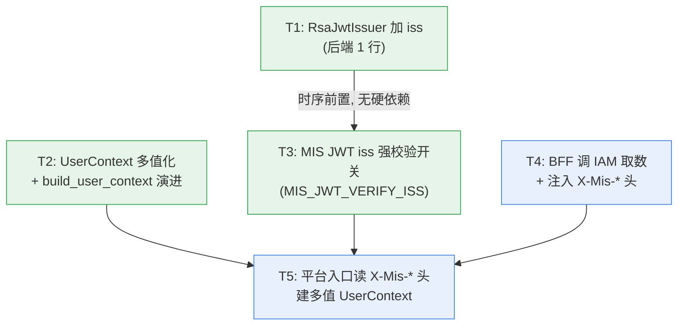

# MIS × ai-platform 身份 Enrichment 增量任务列表

> 文档定位：实现阶段"增量任务分解"（架构交付物），供工程师编码。
> 作者：架构师 高见远（software-architect）
> 依据：`../decisions/identity-jwt.md`（§5 落地指引、§7 已确认决策）、已落地代码核实。
> 原则：**最小变更、零回归**；路线 B；4 项决策已锁定（见澄清文档 §7）。

---

## 0. 关键修正（先读）

任务指派中 T4 描述为"新增 IAM 客户端 + 调用取数 + 头注入"。**经代码排查，该前提需修正**：

- `mis-admin-bff` **已存在** `IamWebClient`（继承 `AbstractDownstreamClient`，封装对 `mis-iam` 的 WebClient 调用）与 `OrgWebClient`（封装对 `mis-org` 的调用）。
- `IamWebClient.getUser(id)` 已返回 `IamUserVO`，其中**已含 `List<IamRoleVO> roles` 与 `String deptId`**（单值）。即"按 userId 取角色+部门"能力**已经具备**，无需新建 Feign/WebClient 客户端。
- 因此 **T4 = 复用/扩展 `IamWebClient`（不新建客户端）**，在 `AiPlatformClient` 注入它并把 `getUser(userId)` 的结果组装成 `X-Mis-*` 头。

> 详见 §7「mis-iam 排查结论」。

---

## 1. 任务总表（有序 + 依赖 + 落点 + 改动点 + 优先级）

> 落点路径均为**相对仓库根**（`/d/code/mis-platform`）。
> 优先级：P0 = 本阶段必须；P1 = 建议同批；P2 = 可选/后续增强。

### T1 — `RsaJwtIssuer` 补 `iss`（MIS 签发侧，1 行）

| 项 | 内容 |
|----|------|
| 落点文件 | `backend/mis-common/mis-common-security/src/main/java/com/mis/common/security/jwt/RsaJwtIssuer.java` |
| 改动点 | 在 `JWTClaimsSet.Builder` 链式调用中增加 `.issuer("mis-platform")`（位于 `issue()` 方法、`subject(...)` 之后、`claim("tenantId", ...)` 之前）。向后兼容：旧 token 无 `iss` 仍可被平台软比对接受。 |
| 依赖 | 无 |
| 优先级 | P0 |

```java
// RsaJwtIssuer.issue() 中
JWTClaimsSet.Builder builder = new JWTClaimsSet.Builder()
        .subject(String.valueOf(claims.userId()))
        .issuer("mis-platform")   // ← 新增（T1）
        .jti(jti)
        ...
```

---

### T2 — 平台 `UserContext` 多值化 + `build_user_context` 演进（Python）

| 项 | 内容 |
|----|------|
| 落点文件 | `agent/ai-platform/backend/src/identity/models.py`（`UserContext`、`DepartmentInfo`、`RoleInfo` 已存在；新增 `OrgInfo`）<br>`agent/ai-platform/backend/src/identity/permissions.py`（新增 `CategoryResolver` 协议与 `get_category_resolver()`） |
| 改动点 | 见 §3 精确字段定义。要点：<br>1. 新增 `OrgInfo` schema；<br>2. `UserContext` 新增 `departments / primary_department_id / organizations / primary_org_id / role_infos`（全部带默认值，兼容旧字段 `department`/`dept_id` 标 `@deprecated` 保留）；<br>3. `build_user_context_from_mis(p)` 演进为 `build_user_context(p, mis_headers=None, resolver=None)`；原 `build_user_context_from_mis` 保留为**薄包装** `return build_user_context(p, None, None)`；<br>4. 头缺失 / resolver=None 时退化为当前行为（`departments=[]`、`allowed_categories=[]`），保证 148 测试不破。 |
| 依赖 | 无（纯增量字段 + 函数签名演进） |
| 优先级 | P0 |

> 注意 `models.py` 不得 `import permissions`（避免循环依赖：`permissions.py` 已 `import` 自 `models.py`）。`CategoryResolver` 协议与 `ResolvedIdentity` 数据类定义在 `models.py`；具体实现 `PermissionEngineCategoryResolver` 放在 `permissions.py`。

---

### T3 — 平台 MIS JWT `iss` 强校验开关（Python）

| 项 | 内容 |
|----|------|
| 落点文件 | `agent/ai-platform/backend/src/config.py`（`Settings`）<br>`agent/ai-platform/backend/src/identity/mis_token.py`（`MisTokenPayload` + `MisTokenVerifier.verify`） |
| 改动点 | 见 §3.3。**1 个新配置项** `MIS_JWT_VERIFY_ISS: bool = False`；`MisTokenPayload` 增加 `iss: str | None = None`；`verify()` 改为：<br>- 解析 `claims.get("iss")` 写入 payload；<br>- 若 `settings.MIS_JWT_VERIFY_ISS is True`（强校验）：要求 `iss` 存在且等于 `MIS_JWT_ISSUER`，否则抛 `MisTokenError`；<br>- 若为 `False`（默认，向后兼容）：保持现有"软比对"（仅当 token 携带 iss 且与期望值不符才拒）。 |
| 依赖 | 无（逻辑独立于 T1，但**生产启用强校验前必须先发 T1** 使 token 带 iss） |
| 优先级 | P0 |

---

### T4 — BFF 调 MIS IAM 取数 + 注入 `X-Mis-*` 头（Java）

| 项 | 内容 |
|----|------|
| 落点文件 | `backend/mis-admin-bff/src/main/java/com/mis/adminbff/client/AiPlatformClient.java`（主改动）<br>复用：`backend/mis-admin-bff/src/main/java/com/mis/adminbff/client/IamWebClient.java`（已有 `getUser(id)` 返回 `IamUserVO{roles, deptId}`）<br>可选：`backend/mis-admin-bff/src/main/java/com/mis/adminbff/client/model/IamUserVO.java` / `IamRoleVO.java`（仅确认字段） |
| 改动点 | 见 §4。子任务：<br>**T4.1** `AiPlatformClient` 构造函数注入 `IamWebClient`（Spring 单例，无循环依赖）；<br>**T4.2** 新增私有方法 `buildMisEnrichmentHeaders()`：从 `SecurityContextHolder.getOptional()` 取 `LoginUser`（userId / tenantId / employeeId），调用 `iamWebClient.getUser(userId)` 拿到 `IamUserVO`，组装 `X-Mis-Depts / X-Mis-Orgs / X-Mis-Roles`（JSON 数组，见 §4）；<br>**T4.3** 在 `chat()` 的 `buildHeaders(...)` 中附加上述头；IAM 调用异常/空结果时**降级**（不加头，保持现有行为）；<br>**T4.4（P1，推荐）** 对取数结果按 `userId` 做短 TTL 缓存（如 `Caffeine`，TTL≈60s），降低 IAM 压力与请求延迟。 |
| 依赖 | 逻辑上在 T1 之后（token 带 iss 后才进入 enrichment 链路；但代码无硬依赖）。建议与 T1 同批或紧随。 |
| 优先级 | P0（T4.1–T4.3）；T4.4 = P1 |

> **无需新建 IAM 客户端 / Feign Client**——`IamWebClient` 已存在且 `getUser(id)` 直接返回所需 `roles + deptId`。

---

### T5 — 平台入口读 `X-Mis-*` 头并建 `UserContext`（Python）

| 项 | 内容 |
|----|------|
| 落点文件 | `agent/ai-platform/backend/src/api/deps.py`（`get_current_user` RS256 分支）<br>复用：`src/identity/models.py::build_user_context`、`src/identity/permissions.py::get_category_resolver` |
| 改动点 | 见 §4 / §3。要点：<br>1. `get_current_user` 增加 3 个 `Header(...)` 参数 `x_mis_depts / x_mis_orgs / x_mis_roles`（默认空）；<br>2. RS256 分支把非空头收集为 `mis_headers` dict，调用 `build_user_context(mis_payload, mis_headers or None, resolver=get_category_resolver())`；<br>3. `mis_capability.py` 端点**无需改动**（已 `Depends(get_current_user)`）。 |
| 依赖 | T2（模型/函数）、T3（verify 强校验，链路经由 verify）、T4（头由 BFF 注入） |
| 优先级 | P0 |

---

### 任务依赖总览

| 任务 | 依赖 | 灰度批次 |
|------|------|---------|
| T1 | — | 批次 A（先发，纯增量） |
| T2 | — | 批次 A |
| T3 | —（启用前需 T1） | 批次 A（`MIS_JWT_VERIFY_ISS` 默认 False，先发） |
| T4 | T1（建议时序） | 批次 B |
| T5 | T2, T3, T4 | 批次 B |

---

## 2. 依赖图（Mermaid）



> 灰度：**先发批次 A（T1/T2/T3，纯增量、零行为变化）→ 再发批次 B（T4/T5，开启 enrichment）**。T3 的 `MIS_JWT_VERIFY_ISS` 在 T1 上线、token 均带 `iss` 后再于生产翻为 `True`。

---

## 3. 平台侧 `UserContext` 演进的精确字段定义

### 3.1 新增 `OrgInfo` schema（`models.py`）

```python
class OrgInfo(BaseModel):
    """组织 / 租户信息（对应 MIS tenantId）。"""
    org_id: str                 # = str(tenantId)
    name: str = ""
    tenant_code: str = ""
```

### 3.2 `UserContext` 演进（新增字段 + 旧字段标 deprecated 保留）

```python
class UserContext(BaseModel):
    user_id: str
    username: str
    display_name: str = ""

    # —— 旧字段（@deprecated，保留兼容，勿在新逻辑读取）——
    department: str = ""            # deprecated → 用 departments
    dept_id: str | None = None      # deprecated → 用 departments / primary_department_id

    # —— 新：多部门 / 多组织 / 多角色（全部带默认值）——
    departments: list[DepartmentInfo] = Field(default_factory=list)
    primary_department_id: str | None = None
    organizations: list[OrgInfo] = Field(default_factory=list)
    primary_org_id: str | None = None
    role_infos: list[RoleInfo] = Field(default_factory=list)   # 可选明细

    # —— 既有字段（不变）——
    roles: list[str] = Field(default_factory=list)             # role codes
    channel: str = "wecom_h5"
    allowed_categories: list[str] = Field(default_factory=list)
    skill_allow_list: list[str] = Field(default_factory=list)
    skill_deny_list: list[str] = Field(default_factory=list)
    can_approve: bool = False
    profile: dict[str, Any] = Field(default_factory=dict)
```

> 旧字段 `department`/`dept_id` 保留默认（`""` / `None`），确保 `test_mis_integration.py::TestBuildUserContextFromMis` 中 `ctx.department == ""`、`ctx.dept_id is None` 断言继续成立。

### 3.3 计算规则（在 `build_user_context` 内）

- `allowed_categories` = ∪(各 `DepartmentInfo.allowed_categories`) ∪(各 `RoleInfo.allowed_categories`)，**去重**。
- `can_approve` = `any(ri.can_approve for ri in role_infos) or any(di.dept_id in APPROVAL_DEPT_IDS for di in departments)`（`APPROVAL_DEPT_IDS` 来自平台目录，默认空集 → `False`）。
- `primary_department_id` = `departments[0].dept_id`（若存在）。
- `primary_org_id` = `organizations[0].org_id`（若存在）。
- 兼容性：仍写 `dept_id = primary_department_id`、`roles = role codes 列表`，供现有 `PermissionEngine`（`check_permission` 走 `user.dept_id` 单值与 `user.roles`）在过渡期继续工作。

### 3.4 `build_user_context` 函数签名演进

```python
# models.py —— 新增协议（不 import permissions，避免环依赖）
class CategoryResolver(Protocol):
    def resolve(self, dept_ids, role_ids, org_ids) -> "ResolvedIdentity": ...

@dataclass
class ResolvedIdentity:
    departments: list[DepartmentInfo]
    role_infos: list[RoleInfo]
    organizations: list[OrgInfo]
    allowed_categories: list[str]
    can_approve: bool

def build_user_context(
    p: "MisTokenPayload",
    mis_headers: dict[str, str] | None = None,
    resolver: "CategoryResolver | None" = None,
) -> "UserContext":
    """MIS JWT + X-Mis-* 头 → 多值 UserContext。
    mis_headers=None 或 resolver=None 时退化为当前行为（departments=[]、allowed_categories=[]）。
    """
    ...

# 旧名保留为薄包装（保证既有调用与 148 测试不破）
def build_user_context_from_mis(p: "MisTokenPayload") -> "UserContext":
    return build_user_context(p, None, None)
```

### 3.5 `T3` 配置项与 `verify()` 改动（`config.py` / `mis_token.py`）

```python
# config.py —— Settings 新增
MIS_JWT_VERIFY_ISS: bool = Field(
    default=False,
    description="True=强校验 MIS JWT iss 必须存在且等于 MIS_JWT_ISSUER；"
                "False=软比对（仅当 token 携带 iss 且不符时拒）。启用前需 T1 已上线。",
)
# 既有 MIS_JWT_ISSUER: str = "mis-platform" 保持不变
```

```python
# mis_token.py —— MisTokenPayload 增加
iss: str | None = None

# MisTokenVerifier.verify() 末尾：
expected_iss = self._settings.MIS_JWT_ISSUER
token_iss = claims.get("iss")
payload_iss = token_iss if token_iss is not None else None
if self._settings.MIS_JWT_VERIFY_ISS:
    if payload_iss is None or payload_iss != expected_iss:   # 强校验
        raise MisTokenError(f"Invalid MIS token iss: expected {expected_iss}, got {payload_iss}")
elif expected_iss and payload_iss is not None and payload_iss != expected_iss:  # 软比对（现有）
    raise MisTokenError(...)
# 构造 MisTokenPayload(..., iss=payload_iss)
```

---

## 4. 头协议约定（`X-Mis-*`）

### 4.1 取值与结构

| 头名 | 值结构（JSON 数组） | 元素字段 | 数据来源（BFF 侧） |
|------|--------------------|---------|-------------------|
| `X-Mis-Depts` | `[{"id":"<deptId>","name":"<可选>"}]` | `id` 必填，`name` 可选 | `IamUserVO.deptId`（**本阶段单值**；多部门待 IAM 增强，见 R1） |
| `X-Mis-Orgs` | `[{"id":"<tenantId>"}]` | `id` 必填 | `LoginUser.getTenantId()`（= `X-Tenant-Id`） |
| `X-Mis-Roles` | `[{"id":"<roleId>","code":"<roleCode>"}]` | `code` 必填（与 JWT `roles` 命名空间一致），`id` 可选 | `IamUserVO.roles`（`List<IamRoleVO>`，取 `code`） |

- **`X-Mis-Roles` 以 `code` 为主键**：与 MIS JWT `roles` claim（携带 code，如 `"hr"`/`"finance"`）及平台 `PermissionEngine` 目录键（test 中以 `"manager"`/`"role-1"` 为键）命名空间一致。平台 `user.roles` 优先取 `X-Mis-Roles` 的 `code`，缺省回落到 JWT `roles`。
- **与 `X-Tenant-Id` 的关系（不冲突）**：`X-Tenant-Id` 保留为"主租户"单值向后兼容；`X-Mis-Orgs` 表达完整组织列表，且 `X-Tenant-Id == X-Mis-Orgs[0].id`。两者"主值 + 完整列表"共存。
- **平台只信任来自 BFF 网络 / 信任域的 `X-Mis-*` 头**（网络安全假设见 R5）。

示例（单 tenant + 单 dept + 双 role）：
```
X-Tenant-Id: 1
X-Mis-Depts: [{"id":"1001","name":"人力资源部"}]
X-Mis-Orgs:  [{"id":"1"}]
X-Mis-Roles: [{"id":"55","code":"hr"},{"id":"56","code":"finance"}]
```

### 4.2 平台读取（`deps.py` 草拟，仅签名级）

```python
async def get_current_user(
    authorization: str = Header(default=""),
    x_mis_depts: str = Header(default="", alias="X-Mis-Depts"),
    x_mis_orgs: str = Header(default="", alias="X-Mis-Orgs"),
    x_mis_roles: str = Header(default="", alias="X-Mis-Roles"),
) -> dict[str, Any]:
    ...
    if alg == "RS256":
        mis_payload = verifier.verify(token)
        mis_headers = {
            "X-Mis-Depts": x_mis_depts,
            "X-Mis-Orgs": x_mis_orgs,
            "X-Mis-Roles": x_mis_roles,
        }
        ctx = build_user_context(
            mis_payload,
            mis_headers if any(mis_headers.values()) else None,
            resolver=get_category_resolver(),
        )
        return {"mis": True, **ctx.model_dump()}
```

### 4.3 BFF 注入（`AiPlatformClient.java` 草拟，仅签名/意图级）

```java
// 构造函数增加依赖
public AiPlatformClient(WebClient.Builder plainBuilder, AiPlatformProperties properties,
                        IamWebClient iamWebClient) {  // ← T4.1 注入
    super(plainBuilder.baseUrl(properties.getBaseUrl()).build(), properties.getChatTimeoutMs());
    this.iamWebClient = iamWebClient;
}

// chat() 内 buildHeaders 附加 enrichment 头（T4.2/T4.3）
private Consumer<HttpHeaders> buildHeaders(String authorization, String traceId) {
    return headers -> {
        loginContextHeaders().accept(headers);
        if (authorization != null && !authorization.isBlank())
            headers.set(SecurityConstants.AUTHORIZATION_HEADER, authorization);
        if (traceId != null && !traceId.isBlank())
            headers.set(SecurityConstants.HEADER_TRACE_ID, traceId);
        buildMisEnrichmentHeaders().accept(headers);   // ← 新增
    };
}

// 取数 + 组装；异常时降级（不加头）
private Consumer<HttpHeaders> buildMisEnrichmentHeaders() {
    return headers -> {
        try {
            var user = SecurityContextHolder.getOptional().orElse(null);
            if (user == null || user.getUserId() == null) return;
            IamUserVO u = iamWebClient.getUser(user.getUserId());   // 已有方法，返回 roles+deptId
            // X-Mis-Depts = [{"id": u.deptId}]
            // X-Mis-Orgs  = [{"id": String.valueOf(user.getTenantId())}]
            // X-Mis-Roles = u.roles().stream().map(r -> {"id":r.id(),"code":r.code()})
            // 以 JSON 序列化后 set 到对应头
        } catch (Exception ignored) { /* 降级：不加 X-Mis-* 头 */ }
    };
}
```

---

## 5. 测试计划

### 5.1 Python（pytest，要求 148 测试实跑且全绿）

| 覆盖点 | 测试位置 / 新增 | 验证内容 |
|--------|----------------|---------|
| `UserContext` 多值化默认值兼容 | 既有 `tests/test_mis_integration.py::TestBuildUserContextFromMis` | `build_user_context_from_mis(payload)` 仍返回 `department==""`、`dept_id is None`、`allowed_categories==[]`、`roles==["hr","finance"]`、`channel=="mis_bff"`（**零改动即通过**，证明兼容） |
| 头缺失 → 退化 | 新增于 `test_mis_integration.py` | `build_user_context(payload, None, None)` ⇒ `departments==[]`、`organizations==[]`、`role_infos==[]`、`allowed_categories==[]` |
| 带 `X-Mis-*` 头 → 多值 | 新增 | 传入 `X-Mis-Depts/Roles/Orgs` JSON ⇒ `departments` 长度、`primary_department_id`、`role_infos`、`allowed_categories` = 各 info 并集去重、`can_approve` 规则 |
| `iss` 强校验 开/关 | 新增于 `tests/test_mis_token.py` 或 `test_mis_integration.py` | `MIS_JWT_VERIFY_ISS=False`：无 iss 的 token 通过；`=True`：无 iss 或 iss 不符 ⇒ `MisTokenError`；`MisTokenPayload.iss` 正确解析 |
| `get_current_user` 端点鉴权 | 既有 `test_mis_integration.py::TestGetCurrentUserBranching` | RS256 分支携带 `X-Mis-*` 头时返回多值字段；不带头时行为不变（仍 `mis=True`） |
| `PermissionEngine` 兼容 | 既有 `tests/test_permissions.py` | 单 `dept_id` + `roles` 路径不变；新增用例验证多 `departments`/`role_infos` 经 `allowed_categories` 并集生效 |

> **回归硬指标**：全量 `pytest` 必须全绿（当前基线 148 通过）。新增用例不得修改既有 148 用例断言；T2 的字段全部带默认值即保证既有断言成立。

### 5.2 Java（单元 / 集成）

| 覆盖点 | 测试位置 | 验证内容 |
|--------|---------|---------|
| `AiPlatformClient` 头注入 | 新增 `backend/mis-admin-bff/src/test/.../client/AiPlatformClientTest.java` | 对 `IamWebClient` mock，`chat()` 发出的请求头包含正确的 `X-Mis-Depts/Orgs/Roles`；`getUser` 抛异常时头被省略（降级） |
| IAM 取数 | 新增对 `IamWebClient.getUser` 的契约测试（或复用既有 IAM 测试） | `IamUserVO` 解析 `roles` + `deptId` 正确 |

> ⚠️ **Java 编译/测试限制（重要）**：沙箱环境曾被 JDK8 vs 要求 JDK17 + 离线缺 `mis-common` 依赖阻塞，**无法实跑 Java 编译与测试**。本任务所有 Java 改动须产出**编译正确**的代码（类型、包路径、`@Component` 注入点核对无误），并在交付说明中标注"未实跑编译/测试"。Python 侧 148 测试必须可实跑且全绿。

---

## 6. 回归保证与灰度建议

- **批次 A（先发，零行为变化）**：T1（1 行 `.issuer`）、T2（纯字段增量 + 薄包装）、T3（开关默认 `False`）。
  - T1：旧 token 无 `iss` 仍被软比对接受 → 无消费者破坏。
  - T2：新字段全默认 → 148 测试不破。
  - T3：`MIS_JWT_VERIFY_ISS=False` 时逻辑等同现状 → 无变化。
- **批次 B（再发，开启 enrichment）**：T4（BFF 注入头）、T5（平台读头建多值 `UserContext`）。
  - T4 降级：IAM 不可达 ⇒ 不加 `X-Mis-*` 头 ⇒ 平台退化为旧行为（保 148 测试语义）。
  - T5 头缺失 ⇒ `build_user_context(p, None, None)` ⇒ 与现状一致。
- **强校验上线时机**：T1 全量后，将生产 `MIS_JWT_VERIFY_ISS` 翻为 `True`，杜绝令牌混淆。
- **回滚**：批次 B 若异常，回退 T4/T5 即可（批次 A 可保留）；`MIS_JWT_VERIFY_ISS` 可单独回退为 `False`。

---

## 7. 待明确 / 风险清单（含 mis-iam 排查结论）

### 7.1 mis-iam 排查结论（T4 可行性，已核实代码）

**A. 现有可用接口（按 userId / employeeId 查角色与部门）**

| 接口 | 路径 / 方法 | 入参 | 返回 | 备注 |
|------|------------|------|------|------|
| 用户详情（含角色+部门） | `GET /internal/v1/users/{id}`（`UserController.get` → `UserService.getById` → `toVo`） | path `id`（IAM `sys_user.id`） | `UserVO{ id, tenantId, appId, employeeId, username, ..., deptId(单值), List<RoleVO> roles, ... }` | **直接用**：返回 `roles` + 单 `deptId` |
| 用户认证态 | `GET /internal/v1/users/{id}/auth`（`UserController.authById`） | path `id` | `AuthUserVO{ ..., roleCodes:List<String>, deptId(单值), employeeId, ... }` | 含 `roleCodes`（code 列表）与单 `deptId` |
| 按用户名查 | `GET /internal/v1/users/by-username?tenantId&appId&username` | query | `AuthUserVO` | 当 BFF 仅有 username 时备用 |
| 角色详情 | `GET /internal/v1/roles/{id}`（`RoleController.get`） | path `id` | `RoleVO{ id, tenantId, appId, code, name, type, dataScope, status, remark }` | ⚠️ **无 `allowed_categories` / `can_approve`** |
| 角色数据范围 | `GET /internal/v1/roles/{id}/data-scope` | path `id` | `RoleDataScopeVO{ dataScope, orgIds, deptIds }` | 角色可访问的 org/dept 范围（非"任职部门"） |
| 用户权限 | `GET /internal/v1/permissions/{userId}`（`PermissionController.loadAndCache`） | path `userId` | `UserPermissionsVO{ permissions:List<String>, permVersion }` | 菜单/操作权限码，非分类 |

**B. 现有客户端（mis-admin-bff / mis-common）**

- `mis-admin-bff` **已有** `IamWebClient`（封装 `mis-iam` WebClient 调用），其 `getUser(id)` 即返回 `IamUserVO`（含 `roles` + `deptId`）。
- `mis-admin-bff` **已有** `OrgWebClient`（封装 `mis-org`，可查 `DeptVO{id, orgId, parentId, name, categoryId, ...}`）。
- 全仓**无 `@FeignClient`**（grep 结果为空）；下游统一用 `WebClient`（`AbstractDownstreamClient`）。
- **结论：T4 不需要新建 Feign/WebClient 客户端**，复用 `IamWebClient.getUser(userId)` 即可；最小依赖 = 仅向 `AiPlatformClient` 注入既有 `IamWebClient` 单例。

**C. 数据结构映射对照（IAM/Org → 平台 schema）**

| 平台 schema 字段 | IAM/Org 来源 | 是否直接可得 | 缺口 |
|-----------------|-------------|-------------|------|
| `DepartmentInfo.dept_id` | `IamUserVO.deptId` / `OrgEmployeeView.deptId` | ✅（单值） | 多部门见 R1 |
| `DepartmentInfo.name/parent_id` | `OrgWebClient.getDept(id)` → `DeptVO.name/parentId` | ✅（需额外查 Org，可选） | — |
| `DepartmentInfo.allowed_categories` | **IAM 无此字段** | ❌ | 由平台自身目录解析（见 R2） |
| `RoleInfo.role_id` | `IamRoleVO.id` | ✅ | — |
| `RoleInfo.name` | `IamRoleVO.name` / `code` | ✅ | — |
| `RoleInfo.allowed_categories` | **IAM `SysRole` 无此字段** | ❌ | 由平台目录解析（R2） |
| `RoleInfo.can_approve` | **IAM 无此字段** | ❌ | 由平台目录解析（R2） |
| `OrgInfo.org_id` | `LoginUser.getTenantId()` | ✅ | — |

### 7.2 风险清单

| # | 风险 / 待明确 | 影响 | 建议处置 |
|---|--------------|------|---------|
| **R1** | **IAM 仅单 `deptId`，无多部门模型**（`SysUser.deptId` 单值；`OrgEmployeeView.deptId` 单值）。用户"多部门任职"在 IAM 数据层未表达。 | `X-Mis-Depts` 本阶段仅含 1 个 deptId；多部门 enrichment 无法从 IAM 取得。 | 本阶段接受单 dept（与决策#3"单 tenant + 多 dept"的"多 dept"数据结构预留一致）；**后续 IAM 增强**：新增 `sys_user_dept` 关联表 + `GET /internal/v1/users/{id}/depts` 返回 `List<DeptVO>`，届时 BFF 直接注入多 dept。任务列表不阻塞。 |
| **R2** | **IAM `SysRole` 无 `allowed_categories` / `can_approve`**；平台 `allowed_categories`/`can_approve` 需由平台自身目录解析。 | 若平台 `PermissionEngine` 角色/部门缓存未装载分类映射，`allowed_categories` 恒为空 → 鉴权退化为"开放/封闭"默认态。 | 平台侧须确保 `PermissionEngine` 的 `set_role_data`/`set_dept_data` 按 `role code`/`dept id` 装载 `allowed_categories`/`can_approve`（现有机制已支持，需确认启动装载）。BFF 只传 `id/code`，分类解析全在平台。 |
| **R3** | **`LoginUser.getUserId()` 是否等于 IAM `sys_user.id`？** | 若不等，`iamWebClient.getUser(userId)` 会 404，降级为不加头。 | 假定网关 `X-User-Id` = IAM 用户 id（与 JWT `sub` 一致）。若不符，T4 改走 `IamWebClient` 现有 `by-username` 路径（`tenantId+appId+username`）。建议排期核对网关头语义。 |
| **R4** | BFF 每次 chat 请求同步调 IAM 取数 → 增加延迟与 IAM 负载。 | 高并发下 IAM 压力、平台 P99 上升。 | T4.4（P1）按 `userId` 短 TTL 缓存（≈60s）。IAM `AuthUserVO` 含 `permVersion`，可作为缓存失效键（如后续在 `IamUserVO` 暴露）。 |
| **R5** | **信任边界假设**：平台仅接受来自 BFF 网络 / 信任域的 `X-Mis-*` 头。 | 若平台可被公网直达，攻击者可伪造 `X-Mis-*` 提权。 | 确认部署拓扑：平台仅 BFF 可达（内网隔离 / mTLS）。否则需平台侧来源校验（来源 IP / mTLS）。待用户确认（澄清文档 §6 第 5 项）。 |
| **R6** | **dept/org id 命名空间对齐**：平台 `PermissionEngine` 目录以何键装载（code？数值 id？）。集成测试用 `dept-1`/`manager` 等字符串键，而 IAM `deptId`/`role code` 为 `hr`/`finance` 与数值 id。 | 键不一致 ⇒ `allowed_categories` 解析不出。 | 约定：`X-Mis-Roles` 用 `code`（与 JWT `roles` 一致）；`X-Mis-Depts` 用 IAM `deptId`（数值字符串）；平台目录装载使用相同键。需排期对齐平台目录数据源。 |
| **R7** | Java 沙箱无法实跑编译/测试（JDK8 vs JDK17 + 离线缺 `mis-common`）。 | T1/T4 Java 改动无法在沙箱自验。 | 产出编译正确代码 + 标注"未实跑"；由具备 JDK17 + 内网的 CI 环境验证。 |

---

## 8. 交付物清单（本架构文档给出，不含实现代码）

1. 本文档：增量任务列表 T1–T5（含子任务、落点、改动点、依赖、优先级）。
2. §3 精确字段定义（`OrgInfo`、`UserContext` 演进、`build_user_context` 签名、`CategoryResolver` 协议）。
3. §4 头协议约定（`X-Mis-Depts/Orgs/Roles` 取值结构 + 与 `X-Tenant-Id` 关系）。
4. §5 测试计划（Python 148 全绿硬指标 + Java 编译限制说明）。
5. §7 mis-iam 排查结论 + 风险清单（R1–R7，含"无需新建 IAM 客户端"关键修正）。
