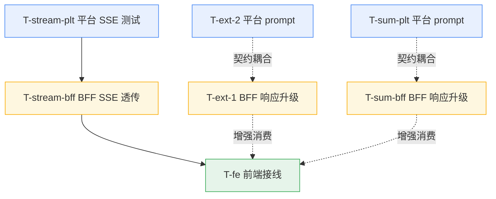

# 阶段5 后端扩展增量架构设计（T-ext / T-sum / T-stream）

> 文档角色：架构师（高见远）基于《阶段5 后端扩展增量 PRD》（`backend-ext-prd.md`）、阶段5 集成设计（`frontend-ai-integration-design.md`）、契约审计（`backend-integration-audit.md`）与**真实读码**产出的**增量架构设计 + 任务分解**。
> 范围：仅 T-ext（逐字段 confidence + unmapped）、T-sum（结构化 summary）、T-stream（SSE 流式透传）三个后端扩展点；前端仅做最小接线增强。
> 语言：中文。约定：路径相对 `backend/`、`agent/ai-platform/`、`frontend/mis-admin-web/`。

---

## 0. 实际读码结论（设计前提，已逐文件核实）

| 层 | 文件（真实路径） | 核实结论 |
|---|---|---|
| BFF | `mis-admin-bff/.../dto/ai/AiExtractResponse.java` | `confidence` 为**标量 `Double`**；无 `unmapped`；`fields: Map<String,Object>`（已 form-keyed） |
| BFF | `mis-admin-bff/.../service/AiCapabilityTranslator.java:125-156` | `parseExtract` 仅取标量 `confidence.asDouble()`；`parseSummary:130-131` 仅取 `points/citations` 为 `List<String>` |
| BFF | `mis-admin-bff/.../dto/ai/AiSummaryResponse.java` | `points:List<String>`、`citations:List<String>`；无 `summary` 字段 |
| BFF | `mis-admin-bff/.../dto/ai/AiChatRequest.java` | 仅 `messages` + `context`；**无 `stream` 字段** |
| BFF | `mis-admin-bff/.../controller/AiProxyController.java:106-118` | `chatCompletions` 返回缓冲式 `Result<AiChatResponse>`；**无 SSE 分支** |
| BFF | `mis-admin-bff/.../client/AiPlatformClient.java:83-96` | 仅 `chat()`（`.retrieve()` 非流式）+ `healthProbe()`；**无 `chatStream()`** |
| BFF | `mis-admin-bff/.../config/AiPlatformProperties.java:25` | `sseEnabled` 死配置（默认 `false`），**未被任何路由引用** |
| BFF | `mis-admin-bff/.../client/AbstractDownstreamClient.java:73-85` | `block()` 把 `WebClientResponseException` 折叠为 `INTERNAL_ERROR`（审计 §6.2，401 语义丢失 → P2 预留） |
| 平台 | `ai-platform/backend/src/api/routes/mis_capability.py:145-218` | SSE 端点 `agent_chat_stream` **已存在**；事件 `delta{delta,traceId}` / `done{finishReason,sessionId,traceId}` / `error{message,traceId}`（:`153-212`） |
| 平台 | `ai-platform/configs/agents/mis-extract/runtime/prompts/system.md` | 系统提示在此文件（**非 `system/model.yaml`**）；当前要求 `{fields, confidence:number}`（标量） |
| 平台 | `ai-platform/configs/agents/mis-summary/runtime/prompts/system.md` | 系统提示在此文件；当前要求 `{points:[str], citations:[str]}` |
| 平台 | `ai-platform/configs/agents/<agent>/system/model.yaml` | **仅模型选择**（primary/fallback/gateway），**不是 prompt 文本**——PRD §4/§8 误指，本设计更正 |
| 前端 | `mis-admin-web/src/features/ai/types.ts:88-115` | `ExtractResponse.confidence: number \| Record<string,number>` + `unmapped?:{raw,hint?}[]`；`SummaryResponse` 已含 `summary?` / `points?:SummaryPoint[]\|string[]` / `citations?:SummaryCitation[]\|string[]`——**前端类型已够用，无需新增** |
| 前端 | `mis-admin-web/src/features/ai/ai-sse-client.ts` | 已解析 `delta/done/error`；但用 `fetch-event-source@1.0.0-alpha.2` **默认导出（类）+ 强转**（`use-ai.ts` 已支持 `stream` 分支但 `buildBody` 未带 `stream:true`） |
| 前端 | `mis-admin-web/src/features/ai/components/ai-copilot.tsx:32` | `useAI({capability:'chat', stream:false})`——待翻 `true` |

---

## 1. 实现方案 + 框架选型

### 1.1 平台侧（Python · FastAPI）
- **改动手法**：纯**提示词 + 契约验证**，无新框架。
  - T-ext-2：编辑 `configs/agents/mis-extract/runtime/prompts/system.md`，要求 agent 输出 `{fields, confidence:{<AdminField.key>:<0~1>}, unmapped:[{raw,hint}]}`（对齐设计 §4.3）。**不改 `system/model.yaml`**。
  - T-sum：编辑 `configs/agents/mis-summary/runtime/prompts/system.md`，要求输出 `{summary, points:[{label,value,risk}], citations:[{field,value,source}]}`，`risk∈{low,medium,high}` 由 prompt 直出。
  - T-stream：端点 `agent_chat_stream` 已存在且产出 `delta|done|error`（PR 已闭环）。本轮平台侧工作 = **新增 pytest 流式契约测试**，固定事件名与 payload 结构，防止回归。
- **可实跑**：平台 `.venv` 已建，T-ext-2/T-sum 的 prompt 改动、T-stream 端点均可 **pytest 实跑验证**（审计已闭环）。

### 1.2 BFF 侧（Java · Spring MVC + WebClient）—— 沙箱 JDK8 不可编译，须满足「内网 JDK17 CI 编译 + 代码评审可过」
- **改动手法**（三个扩展点都是**增量/透传**，非重写）：
  - **T-ext-1**：`AiExtractResponse.confidence` 由 `Double` 改为 `Map<String,Double>`；新增 `unmapped: List<Map<String,Object>>`；`parseExtract` 升级解析对象式 confidence 与 unmapped 数组。
  - **T-sum**：`AiSummaryResponse` 新增 `summary:String`；`points` 改为 `List<SummaryPoint>`、`citations` 改为 `List<SummaryCitation>`（保留 `text` 兼容旧 `List<String>`）；`parseSummary` 升级，对字符串数组做 `text` 兜底映射。
  - **T-stream**：`AiChatRequest` 加 `Boolean stream`；`AiPlatformClient` 新增 `chatStream(...)` 返回 `Flux<ServerSentEvent<String>>`（WebClient SSE）；`AiProxyController.chatCompletions` 按 `stream` 分支：非流式走原缓冲，流式返回 `ResponseEntity<Flux<ServerSentEvent<String>>>` 走 SSE；**把死配置 `sseEnabled` 接活**作为流式总开关。
  - **Q1 落地点**：确认/补 `AiFeaturesResponse` 携带 `config.form-fill.confThreshold`（默认 `0.85`，可配），前端 `getConfThreshold()` 已消费。
- **沙箱 JDK8 编码注意点（关键，供工程师与评审对齐）**：
  1. **JDK 基线**：代码库已用 `record`（`AiPlatformClient.IamCacheEntry`），说明 CI 目标为 **Java 17**；新代码可用 Java 17 语法，但**禁用 preview 特性**，确保评审/CI 可过。
  2. **Jackson**：Spring Boot 默认 `FAIL_ON_UNKNOWN_PROPERTIES=false`（审计 §4 已验证）→ 新增/缺省字段不影响解析；平台多返的字段（如 `warnings/tool_errors`）BFF 忽略。
  3. **`confidence` 类型破坏性变更**：仅 `parseExtract` 与 `AiExtractResponse` 自引用；无其他调用方读取 `getConfidence():Double`，类型改为 `Map` 安全。前端已兼容 `number | Record`，旧标量窗口见 §7。
  4. **WebClient SSE 写法**：
     ```java
     public Flux<ServerSentEvent<String>> chatStream(String agentId, Map<String,Object> body,
             String authorization, String traceId) {
         return client().post()
             .uri("/api/v1/agents/{agentId}/chat/stream", agentId)
             .headers(buildHeaders(authorization, traceId))
             .contentType(MediaType.APPLICATION_JSON)
             .accept(MediaType.TEXT_EVENT_STREAM)
             .bodyValue(body)
             .retrieve()
             .bodyToFlux(new ParameterizedTypeReference<ServerSentEvent<String>>() {});
     }
     ```
     平台返回标准 `event:/data:` 帧，WebClient `ServerSentEvent` 解码器可直接解析。
  5. **流式返回类型**：BFF 为 Spring MVC（servlet）栈，但已依赖 `spring-webflux`（WebClient 隐含）→ 控制器返回 `Flux<ServerSentEvent<String>>` 经 `ReactiveAdapterRegistry` 以 `text/event-stream` **流式推送**，无需引入新依赖。
  6. **1:1 透传、不重写语义**：控制器对每条 `ServerSentEvent<String>` 原样重建 `ServerSentEvent.builder().event(e.event()).data(e.data()).build()` 转发；仅追加 `Cache-Control:no-cache` / `X-Accel-Buffering:no`（平台已设，BFF 透传保留）。
  7. **错误兜底**：`chatStream` 的 `Flux` 用 `.onErrorResume` 捕获异常（含平台 401/5xx）→ 发射一帧 `error{message}` 后结束；非 2xx 由 WebClient `.retrieve()` 抛 `WebClientResponseException` 进入该分支。

### 1.3 前端侧（TS · React）—— 仅最小接线
- **类型已就绪**：`types.ts` 的 `ExtractResponse` / `SummaryResponse` 已含 T-ext/T-sum 目标结构，**无需新增类型**。
- **接线增强**：
  - `package.json`：`fetch-event-source` 由 `1.0.0-alpha.2` 升 `^3.0.0`，改为具名导入 `import { fetchEventSource } from 'fetch-event-source'`（去掉 `ai-sse-client.ts:1,8` 的默认导入 + 强转）。
  - `use-ai.ts`：`buildBody` 在 `o.stream===true` 时向 body 注入 `stream:true`（BFF 据此分支）。
  - `ai-copilot.tsx`：`useAI({capability:'chat', stream:true})`（UC-5 真流式）。
  - `ai-rag.tsx`（可选 US-STREAM-2）：`stream:true`，复用同一 BFF SSE 分支（capability=`rag`→`mis-rag`，平台通用 SSE 端点已支持）。
- **可 `npm run build` 验证** + 内网联调。

---

## 2. 文件列表（新增 / 修改，逐层）

### 2.1 平台侧（Python）
| 动作 | 路径 | 改动 |
|---|---|---|
| **修改** | `agent/ai-platform/configs/agents/mis-extract/runtime/prompts/system.md` | T-ext-2：输出契约加 `confidence:{key:0~1}` + `unmapped:[{raw,hint}]` |
| **修改** | `agent/ai-platform/configs/agents/mis-summary/runtime/prompts/system.md` | T-sum：输出契约加 `summary` + `points:[{label,value,risk}]` + `citations:[{field,value,source}]` |
| **修改** | `agent/ai-platform/backend/tests/test_mis_integration.py`（或新增 `test_mis_stream.py`） | T-stream-plt：新增 SSE 流式契约 pytest（断言 `delta→done`、`event` 名精确） |
| **不变** | `agent/ai-platform/backend/src/api/routes/mis_capability.py`（`:145-218`） | SSE 端点已存在，仅测试覆盖 |
| **不变** | `agent/ai-platform/configs/agents/<agent>/system/model.yaml` | 仅模型选择，本轮不改 |

### 2.2 BFF 侧（Java）
| 动作 | 路径 | 改动 |
|---|---|---|
| **修改** | `backend/mis-admin-bff/.../dto/ai/AiExtractResponse.java` | `confidence: Map<String,Double>`；新增 `unmapped: List<Map<String,Object>>` |
| **修改** | `backend/mis-admin-bff/.../dto/ai/AiSummaryResponse.java` | 新增 `summary:String`；`points:List<SummaryPoint>`；`citations:List<SummaryCitation>` |
| **新增** | `backend/mis-admin-bff/.../dto/ai/SummaryPoint.java` | `{label,value,risk,text}`（text 兼容旧 List<String>） |
| **新增** | `backend/mis-admin-bff/.../dto/ai/SummaryCitation.java` | `{field,value,source}` |
| **修改** | `backend/mis-admin-bff/.../dto/ai/AiChatRequest.java` | 新增 `Boolean stream` |
| **修改** | `backend/mis-admin-bff/.../service/AiCapabilityTranslator.java` | `parseExtract` 升级（confidence Map + unmapped）；`parseSummary` 升级（结构化 + 字符串兜底） |
| **修改** | `backend/mis-admin-bff/.../client/AiPlatformClient.java` | 新增 `chatStream(...)` 返回 `Flux<ServerSentEvent<String>>` |
| **修改** | `backend/mis-admin-bff/.../controller/AiProxyController.java` | `chatCompletions` 按 `stream` 分支（SSE vs 缓冲）；接活 `sseEnabled` |
| **可能修改** | `backend/mis-admin-bff/.../dto/ai/AiFeaturesResponse.java` + `service/AiFeatureConfigService.java` | 确认/补 `config.form-fill.confThreshold`（默认 `0.85`，Q1 下发） |

### 2.3 前端侧（TS）
| 动作 | 路径 | 改动 |
|---|---|---|
| **修改** | `frontend/mis-admin-web/package.json` | `fetch-event-source` → `^3.0.0` |
| **修改** | `frontend/mis-admin-web/src/features/ai/ai-sse-client.ts` | 改为 `import { fetchEventSource }` 具名导入，去掉默认导入强转 |
| **修改** | `frontend/mis-admin-web/src/features/ai/use-ai.ts` | `buildBody` 注入 `stream:true`（当 `o.stream`） |
| **修改** | `frontend/mis-admin-web/src/features/ai/components/ai-copilot.tsx` | `useAI stream:false → true` |
| **修改（可选）** | `frontend/mis-admin-web/src/features/ai/components/ai-rag.tsx` | `stream:true`（US-STREAM-2） |

---

## 3. 数据结构和接口（类图 / 类型）

```mermaid
classDiagram
    %% ===== 平台侧（Agent 输出契约，Python 概念模型）=====
    class ExtractAgentOutput {
        +Map~string,object~ fields
        +Map~string,float~ confidence
        +List~Map~ unmapped
    }
    class SummaryAgentOutput {
        +string summary
        +List~SummaryPoint~ points
        +List~SummaryCitation~ citations
    }
    class SummaryPoint {
        +string label
        +string value
        +string risk
    }
    class SummaryCitation {
        +string field
        +string value
        +string source
    }
    class AiStreamFrame {
        +string traceId
        +string delta
        +string finishReason
        +string sessionId
        +string message
    }
    SummaryAgentOutput "1" *-- "0..*" SummaryPoint
    SummaryAgentOutput "1" *-- "0..*" SummaryCitation

    %% ===== BFF 侧（Java DTO）=====
    class AiExtractResponse {
        +Map~string,object~ fields
        +Map~string,Double~ confidence
        +List~Map~ unmapped
        +string sessionId
    }
    class AiSummaryResponse {
        +string summary
        +List~BffSummaryPoint~ points
        +List~BffSummaryCitation~ citations
        +string model
        +string sessionId
    }
    class BffSummaryPoint {
        +string label
        +string value
        +string risk
        +string text
    }
    class BffSummaryCitation {
        +string field
        +string value
        +string source
    }
    class AiChatRequest {
        +List~AiChatMessage~ messages
        +Map~string,object~ context
        +Boolean stream
    }
    class AiPlatformClient {
        +chat(...) AiPlatformChatData
        +chatStream(...) Flux~ServerSentEvent~string~~
        +healthProbe() Map
    }
    class AiProxyController {
        +summary(...) ResponseEntity
        +extract(...) ResponseEntity
        +chatCompletions(...) ResponseEntity
    }
    class AiCapabilityTranslator {
        +parseExtract(...) AiExtractResponse
        +parseSummary(...) AiSummaryResponse
        +buildBody(...) Map
    }
    AiSummaryResponse "1" *-- "0..*" BffSummaryPoint
    AiSummaryResponse "1" *-- "0..*" BffSummaryCitation
    AiProxyController ..> AiPlatformClient : 调用
    AiProxyController ..> AiCapabilityTranslator : 解析
    AiPlatformClient ..> AiStreamFrame : 透传(SSE 1:1)

    note for AiExtractResponse "confidence 由 Double 改为 Map；与平台 1:1 透传"
    note for AiSummaryResponse "points/citations 由 List~String~ 改为结构化"
    note for AiChatRequest "新增 stream 开关驱动 SSE 分支"
```

**关键契约要点**
- **平台 extract 输出**：`{fields:{key:val}, confidence:{key:0~1}, unmapped:[{raw,hint}]}`，key=前端 `AdminField.key`。
- **BFF extract 透传**：`AiExtractResponse.confidence: Map<String,Double>`、`unmapped: List<Map<String,Object>>`。
- **平台 summary 输出**：`{summary, points:[{label,value,risk}], citations:[{field,value,source}]}`，`risk∈{low,medium,high}`。
- **BFF summary 透传**：`AiSummaryResponse` 新增 `summary` + 结构化 `points`/`citations`；`text` 字段兼容旧 `List<String>`。
- **SSE 事件**（平台↔BFF↔前端 1:1）：`delta{delta}` / `done{finishReason,sessionId}` / `error{message}`（均带 `traceId`，前端忽略）。

---

## 4. 程序调用流程（时序图）

### 4.1 T-ext（逐字段 confidence + unmapped）
```mermaid
sequenceDiagram
    autonumber
    participant FE as 前端 useAI(extract)
    participant BFF as AiProxyController.extract
    participant TR as AiCapabilityTranslator
    participant PF as 平台 /agents/mis-extract/chat
    participant AG as mis-extract Agent
    FE->>BFF: POST /api/v1/ai/extract {text, schema.fields[]}
    BFF->>BFF: proxyCapability 门禁(platformAvailable + enabled)
    BFF->>TR: buildExtractContent + buildBody(capability=extract)
    TR->>PF: POST /api/v1/agents/mis-extract/chat {content, metadata}
    PF->>AG: process_message
    AG-->>PF: JSON {fields, confidence:{key:0~1}, unmapped:[{raw,hint}]}
    PF-->>BFF: Result{data.response=JSON}
    BFF->>TR: parseExtract(data)
    TR->>TR: fields→Map; confidence→Map~String,Double~; unmapped→List~Map~
    TR-->>BFF: AiExtractResponse
    BFF-->>FE: Result{AiExtractResponse} (confidence 为 Map + unmapped)
    FE->>FE: confidence[key]<阈值 标红 + unmapped 卡片(HITL)
```

### 4.2 T-sum（结构化 summary）
```mermaid
sequenceDiagram
    autonumber
    participant FE as 前端 useAI(summary)
    participant BFF as AiProxyController.summary
    participant TR as AiCapabilityTranslator
    participant PF as 平台 /agents/mis-summary/chat
    participant AG as mis-summary Agent
    FE->>BFF: POST /api/v1/ai/summary {records, context}
    BFF->>BFF: proxyCapability 门禁
    BFF->>TR: buildSummaryContent + buildBody(capability=summary)
    TR->>PF: POST /api/v1/agents/mis-summary/chat
    PF->>AG: process_message
    AG-->>PF: JSON {summary, points:[{label,value,risk}], citations:[{field,value,source}]}
    PF-->>BFF: Result{data.response=JSON}
    BFF->>TR: parseSummary(data)
    TR->>TR: summary→String; points→List~SummaryPoint~; citations→List~SummaryCitation~(字符串兜底 text)
    TR-->>BFF: AiSummaryResponse
    BFF-->>FE: Result{AiSummaryResponse}
    FE->>FE: 结构化要点 + 引用溯源卡片
```

### 4.3 T-stream（SSE 流式透传）
```mermaid
sequenceDiagram
    autonumber
    participant FE as 前端 ai-sse-client(stream:true)
    participant BFF as AiProxyController.chatCompletions(stream=true)
    participant CL as AiPlatformClient.chatStream
    participant PF as 平台 /agents/mis-copilot/chat/stream
    participant AG as mis-copilot Agent
    FE->>BFF: POST /api/v1/ai/chat/completions {messages, context, stream:true}
    BFF->>BFF: 门禁 + sseEnabled 开关判断
    BFF->>CL: chatStream(mis-copilot, body, JWT, traceId)
    CL->>PF: POST .../chat/stream (Accept: text/event-stream)
    PF->>AG: process_message(stream)
    loop 逐字生成
        AG-->>PF: TEXT_DELTA
        PF-->>CL: SSE event:delta {traceId, delta}
        CL-->>BFF: ServerSentEvent(delta)
        BFF-->>FE: SSE event:delta (1:1 透传)
        FE->>FE: onDelta 累积渲染 Markdown
    end
    AG-->>PF: 完成
    PF-->>CL: SSE event:done {traceId, finishReason, sessionId}
    CL-->>BFF: ServerSentEvent(done)
    BFF-->>FE: SSE event:done (透传)
    FE->>FE: onDone 收尾; 保留已输出
    Note over PF,FE: 任一环节异常 → event:error {message} 透传 → 前端 toast + 保留已输出
```

---

## 5. 任务列表（有序 · 含依赖 / 顺序 / 验收 / 优先级）

> 实现顺序（团队-lead 建议）：**先平台（T-ext-2 / T-sum / T-stream-plt）→ 再 BFF（T-ext-1 / T-sum / T-stream-bff）→ 最后前端（T-fe）**。
> 平台三项可并行（互不依赖）；BFF 三项编译上各自独立，但契约与对应平台任务耦合，建议同窗口发布；前端接线依赖 BFF 流式与结构化契约就绪。

| 任务 ID | 任务 | 层 | 依赖 | 验收方式 | 优先级 |
|---|---|---|---|---|---|
| **T-ext-2** | mis-extract 系统提示对齐：输出 `confidence:{key:0~1}` + `unmapped:[{raw,hint}]`（改 `runtime/prompts/system.md`，非 `model.yaml`） | 平台 | 无 | `pytest` 实跑：断言 agent 输出含逐字段 confidence + unmapped 且 key=form-key | **P0** |
| **T-sum-plt** | mis-summary 系统提示对齐：输出 `summary` + `points:[{label,value,risk}]` + `citations:[{field,value,source}]` | 平台 | 无 | `pytest` 实跑：断言结构化输出（risk 枚举） | **P1** |
| **T-stream-plt** | 平台 SSE 端点流式契约测试：调 `/agents/mis-copilot/chat/stream`，断言 `delta→done`、`event` 名精确 | 平台 | 无 | `pytest` 实跑（端点已存在） | **P0** |
| **T-ext-1** | BFF extract 响应升级：`AiExtractResponse.confidence→Map` + `unmapped`；`parseExtract` 升级；确认/补 `/features` 下发 `config.form-fill.confThreshold`(0.85) | BFF | 无（编译独立）；契约耦合 T-ext-2，建议同窗口发布 | 内网 JDK17 CI 编译闸门 + 代码评审 | **P0** |
| **T-sum-bff** | BFF summary 响应升级：`AiSummaryResponse` 增 `summary` + 结构化 `points`/`citations`；新增 `SummaryPoint`/`SummaryCitation` DTO；`parseSummary` 升级（字符串兜底 `text`） | BFF | 无（编译独立）；契约耦合 T-sum-plt | 内网 JDK17 CI 编译闸门 + 代码评审 | **P1** |
| **T-stream-bff** | BFF SSE 透传：`AiChatRequest.stream` + `AiPlatformClient.chatStream` + `AiProxyController.chatCompletions` SSE 分支 + 接活 `sseEnabled` | BFF | T-stream-plt（端点需存在） | 内网 JDK17 CI 编译闸门 + 评审 + 内网端到端联调 | **P0** |
| **T-fe** | 前端接线：`fetch-event-source@^3` 具名导入 + `use-ai` 注入 `stream:true` + `ai-copilot` 切 `stream:true`（可选 `ai-rag` 切 `stream`） | 前端 | T-stream-bff（流式）；T-ext-1/T-sum-bff（结构化消费可选增强） | `npm run build` 绿 + 内网联调 | 附（接线增强） |

### 5.1 任务依赖图（Mermaid）


> 说明：实线 = 编译/运行硬依赖；虚线 = 契约耦合（建议同窗口发布，非强制先后）。T-ext-1 / T-sum-bff 编译上不依赖平台任务，但契约须与对应平台 prompt 对齐；T-fe 的流式硬依赖 T-stream-bff，结构化消费为增强（旧类型已兼容）。

---

## 6. 依赖包列表

| 层 | 包 / 依赖 | 版本变更 | 说明 |
|---|---|---|---|
| 平台 | 无新增 | — | `StreamingResponse` / FastAPI SSE 已具备；无新 pip |
| BFF | `spring-boot-starter-webflux` | 已存在（WebClient 隐含） | 提供 `ServerSentEvent` 与 servlet 栈 `Flux` 流式返回；**无新 Maven 依赖** |
| 前端 | `fetch-event-source` | `1.0.0-alpha.2` → **`^3.0.0`** | 改具名导入 `import { fetchEventSource } from 'fetch-event-source'`（去默认导入强转） |
| 前端 | `react-markdown` / `remark-gfm` / `zod` | 已在阶段5 F0 落地 | 本增量不新增 |

---

## 7. 共享知识（跨文件约定）

1. **field key 真源** = 前端 `AdminField.key`（form-keyed）；BFF 透传 schema 的 `name` 即该 key；平台须原样返回（T-ext-2 / T-sum prompt 明令）。
2. **低置信阈值**：常量名 `confThreshold`，**默认值 `0.85`**；由 `GET /api/v1/ai/features` 的 `config.form-fill.confThreshold` **下发前端**（Q1 拍板）；BFF 不判定阈值，阈值仅前端用于标红/HITL。
3. **`risk` 枚举**：`low | medium | high`，由平台 prompt 直出（Q5 拍板），BFF 仅透传、不归一。
4. **SSE 事件名固定** `delta | done | error`；BFF 与平台事件 **1:1 透传，不重写语义**；BFF 用 `ServerSentEvent<String>` 原样转发（event 名 + data JSON 不变）。
5. **`citations.source`** 约定字符串 `<表单/表名>.<field>`（Q5）。
6. **`unmapped` 结构**：`List<Map<raw,hint>>`（Q2 拍板），与前端 `FieldSuggestion` / `ExtractResponse.unmapped`（`{raw,hint?}[]`）对齐。
7. **`confidence` 破坏性变更窗口**：`AiExtractResponse.confidence` 由 `Double` 改为 `Map<String,Double>`；**T-ext-1 与 T-ext-2 建议同窗口发布**。若 BFF 先上、平台仍返标量，BFF `parseExtract` 对标量场景置 `confidence=null`；前端 `ExtractResponse.confidence` 兼容 `number | Record`，需对 `null` 防御（全部字段共用默认阈值 `0.85`）。
8. **Jackson** `FAIL_ON_UNKNOWN_PROPERTIES=false` 已开 → 新增字段不影响 BFF↔平台解析；平台多返字段（warnings/tool_errors）BFF 忽略。
9. **SSE 超时/并发**：单连接 SSE 超时复用 WebClient `chatTimeoutMs`（默认 60s，见 `AiPlatformProperties`）；并发上限暂不强卡（Q3 拍板），后续经 `sseEnabled` 配置治理。

---

## 8. 待明确事项（P2 / 预留）

1. **Q4 · 401 透传（P2，本轮不做）**：平台 401 在 BFF 被 `AbstractDownstreamClient.block()` 折为 `INTERNAL_ERROR`（审计 §6.2），前端无法区分「JWT 失效 vs 平台故障」。`RequestContext.unwrap` 的 `!isSuccess()` 透传分支因平台 `error_response` 始终非 2xx 实为死路径。**预留点**：BFF 改用 `exchange()` 读取平台 body 的 `code`，对 401 映射回 401/透传 `code`；待内网联调遇 401 混淆时补。
2. **T-stream 断线重连**：`ai-sse-client`（fetch-event-source）默认不自动重连；当前策略 = 异常 `error` 帧 → `toast` + 保留已输出，由用户重试。是否自动重连待定。
3. **并发上限**：`sseEnabled` 接活后可作为流式总开关；细粒度并发上限暂不强卡（Q3）。
4. **`rag` 流式（US-STREAM-2）**：平台 `/agents/mis-rag/chat/stream` 通用端点已支持；`ai-rag.tsx` 翻 `stream:true` 即复用 BFF 同分支，属可选增强，非阻断。
5. **BFF 流式返回可行性**：`Flux<ServerSentEvent<String>>` 从 Spring MVC（servlet）控制器流式返回依赖 `spring-webflux` 已在 classpath（WebClient 隐含）。**需在 CI 验证** servlet 栈下 SSE 推送正常（设计假设，非风险阻塞）。
6. **`/features` confThreshold**：需确认 `AiFeaturesResponse` / `AiFeatureConfigService` 当前是否已下发 `config.form-fill.confThreshold`；若未下发，T-ext-1 一并补（属 Q1 决议落地点）。

---

## 9. 与既有文档一致性

- 本设计是 `backend-ext-prd.md` 的工程化落地；任务 ID 沿用设计 §7.1（T-ext-1/2、T-sum、T-stream）。
- 与 `frontend-ai-integration-design.md` 一致：前端类型已就绪、仅最小接线；BFF 透传语义、字段 key 真源、阈值默认 0.85 均对齐。
- 与 `backend-integration-audit.md` 一致：核心契约无阻断坑；SSE 缺口（§7）由 T-stream 补；401 透传（§6）列为 P2 预留。
- **重要更正**：PRD §4/§8 指向的 `configs/agents/<agent>/system/model.yaml` 实为**模型选择配置**，系统提示文本位于 `runtime/prompts/system.md`；T-ext-2 / T-sum 的 prompt 改动以 `runtime/prompts/system.md` 为准。

> 文档结束。本增量架构设计仅覆盖 T-ext / T-sum / T-stream，供工程师实现与排期；与既有 PRD、集成设计、契约审计一致，不含实现代码。
