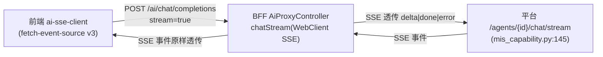

# MIS × ai-platform 后端扩展增量 PRD（阶段5 后端扩展 · T-ext / T-sum / T-stream）

> 文档角色：产品经理（许清楚）产出的**增量 PRD**，承接《阶段5 前端 AI 融合 PRD》（`frontend-ai-integration-prd.md`）与《阶段5 集成设计》（`frontend-ai-integration-design.md` §0.2/§4.3/§7.1/§8）、《后端集成契约审计》（`backend-integration-audit.md` §6/§7）。
> 范围：**仅后端扩展点**，不写实现代码，只定效果、契约 delta、验收与待确认点。
> 版本：v0.1（草案）｜语言：中文

---

## 0. 文档目的与范围

| 项 | 内容 |
|---|---|
| 本文档目的 | 阶段5 前端 AI 融合 MVP（F0~F7）已 build 绿、后端契约审计无阻断坑；本文补齐阶段5 设计中**已明确记录但当时用"降级兜底"跳过**的 3 个后端扩展点：**T-ext（逐字段 confidence + unmapped）**、**T-sum（结构化 summary）**、**T-stream（SSE 流式透传）**。 |
| 范围（本文覆盖） | T-ext-1（BFF 响应侧）、T-ext-2（平台 agent prompt）、T-sum（BFF+平台）、T-stream（BFF+平台）。前端**不新增功能**，仅做接线增强（fetch-event-source v3 + `useAI` 在 copilot/rag 走 `stream:true`）。 |
| 不在范围 | ① UC-6 NL2SQL（阶段4 之后，仅目录预留）；② 前端 SDK 主体（F0~F2 已建，不在本 PRD）；③ 新 AI 能力；④ 身份/门禁（已落地）。 |
| 字段 key 真源约定 | 所有 form-keyed 字段键（T-ext `confidence`/`unmapped` 的 key、T-sum `citations.field`）一律以**前端 `AdminField.key`** 为唯一真源，BFF 透传 schema 的 `name` 即该 key，平台须原样返回（设计 §8 Q2 已拍板采纳）。 |
| 承接事实 | 设计 §0.2 实测：extract 已支持 `schema` 入参且已返 form-keyed `fields`；缺的是**响应侧精度**（逐字段 confidence + unmapped）与**流式**。故本文"扩展点"全部落在响应侧/流式，无请求侧 DTO 新增。 |

---

## 1. 产品目标

> 一句话定位：**把已上线的前端 AI 融合从"能跑"补成"精"——逐字段置信标红、结构化摘要卡片、真流式 Copilot。**

| # | 目标 | 可量化收益（估算口径） |
|---|---|---|
| G1（T-ext） | UC-1/UC-3 由"全局标量阈值"升级为"逐字段置信度标红 + 未映射确认"，让 AI 拿不准的字段精确暴露给用户核对 | UC-1 **误填率**（用户确认前错填/漏标红的字段占比）相对标量基线下降 **≥40%**（标量时所有字段共用一个 0.87 阈值，高风险字段易漏标；逐字段后仅 `<阈值` 字段标红+强制 HITL）。 |
| G2（T-stream） | UC-5 全局 Copilot 从 `fallback=message`（"即将上线"、无真实响应）升级为**真流式** Markdown 对话 | UC-5 **首字（首个 delta 帧）时延 P95 < 1s**；可感知可用性从 **0%（不可用）→ 100%（可用）**；UC-4 RAG 问答随 T-stream 就绪可切换流式增量渲染（附加收益）。 |
| G3（T-sum） | UC-2 摘要从"纯文本要点 List<String>"升级为"summary + 结构化要点( label/value/risk ) + 可点击引用溯源" | UC-2 **要点结构化率 100%**（落地前 `SummaryPoint` 兼容 `List<String>`，无结构化）、**引用可点击溯源到字段率 100%**。 |

> 估算说明：上述数字为产品侧基于"标量 vs 逐字段"语义差异的合理估算，用于目标对齐与验收口径定义；精确实测值待内网联调后回填。

---

## 2. 变更用户故事（仅增量部分）

### 2.1 T-ext（影响 UC-1 / UC-3）

- **US-EXT-1**：As a 业务录入员（HR/财务/销售），I want 表单填充面板能按**每个字段**显示置信度并把低置信字段精确标红，so that 我一眼看出哪些字段 AI 拿不准、需要重点核对。
  - **AC**：
    - extract 响应返回 `confidence: Map<fieldKey, Double>`（逐字段 0~1）；
    - 前端对某字段 `confidence[key] < 阈值(默认 0.85)` 时标红 + 强制 HITL 确认；
    - 金额/身份证等敏感类字段即便高于阈值也支持强制逐字段确认；
    - 后端未升级（仍返标量）时，前端防御性兼容（所有字段共用该标量），UC-1 仍可跑（仅无逐字段精度）。
- **US-EXT-2**：As a 业务录入员，I want 未被映射到表单字段的抽取内容以"待确认"卡片呈现（含原文与建议落点），so that AI 没认出的信息不丢失、可由我手动归位或丢弃。
  - **AC**：
    - extract 响应返回 `unmapped`（结构见 §4.1，待拍板 List<String> 或 List<Map>）；
    - 前端渲染为"待确认/未映射"卡片，可指定落到某字段或丢弃；`unmapped` 不自动落值（HITL）；
    - 字段 key 一律为 `AdminField.key`（form-keyed）。

### 2.2 T-sum（影响 UC-2）

- **US-SUM-1**：As a 业务查看者，I want 摘要卡片不仅有文字、还有"要点（标签/值/风险）+ 可点击引用溯源"，so that 我数秒读懂长记录并可信地定位依据。
  - **AC**：
    - summary 响应含 `summary` 文本 + `points[]`(label/value/risk) + `citations[]`(field/value/source)；
    - 前端渲染结构化要点 + 引用，引用可点击定位到对应字段行；
    - 落地前前端 `SummaryPoint` 兼容 `List<String>`（纯文本要点），UC-2 不阻塞。

### 2.3 T-stream（影响 UC-5 / UC-4）

- **US-STREAM-1**：As a 任意用户，I want 全局 Copilot 浮窗能**真正流式**输出 Markdown 对话（首字秒回、逐字增量），so that 我获得即时对话反馈而非等待整段返回。
  - **AC**：
    - `POST /api/v1/ai/chat/completions` 新增 `stream=true` 分支，BFF 经 SSE 透传平台 `/agents/{id}/chat/stream`；
    - 前端 `ai-sse-client` 逐帧渲染 `delta`；`done` 收尾、`error` 触发 toast 并保留已输出内容；
    - 落地前 `copilot` 的 `fallback=message`（入口保留、点击提示"AI 对话即将上线"），主流程不受影响。
- **US-STREAM-2**（UC-4 增强，可选切换）：As a 知识提问者，I want RAG 问答也流式增量返回，so that 长回答不必等整段。
  - **AC**：T-stream 就绪后 UC-4 可切换 `useAI(rag, stream)` 走 `chat/completions(stream:true)` + RAG 上下文；MVP 非流式 `rag` 端点仍可用，不强制。

---

## 3. 需求池（P0 / P1 / P2）

> 优先级参考设计 §7.1：T-ext-1/2 = T-ext **P0**；T-sum **P1**；T-stream **P0（必须，UC-5 硬依赖）**。
> 验收方式受沙箱约束（见 §7）：Java BFF 不可编译→靠内网 JDK17 CI 编译闸门 + 代码评审；Python 平台可 pytest 实跑；前端可 `npm run build`。

| ID | 需求（仅增量） | 来源文件（层） | 优先级 | 验收方式 |
|---|---|---|---|---|
| **T-ext-1** | BFF `AiExtractResponse.confidence` 由 `Double` 改为 `Map<String,Double>`（逐字段）；新增 `unmapped`；`AiCapabilityTranslator.parseExtract` 同步解析 confidence 对象与 unmapped | BFF：`dto/ai/AiExtractResponse.java`、`service/AiCapabilityTranslator.java` | **P0** | 内网 JDK17 CI 编译闸门 + 代码评审（沙箱 JDK8 离线不可编译）；契约评审 |
| **T-ext-2** | 平台 mis-extract `system/model.yaml` 补 system prompt，要求输出 `{fields:{<AdminField.key>:值}, confidence:{<key>:<0~1>}, unmapped:[...]}`（与设计 §4.3 一致） | 平台：`agent/ai-platform/configs/agents/mis-extract/system/model.yaml` | **P0** | pytest 实跑（`.venv`）：断言 agent 输出含逐字段 confidence + unmapped 且 key=form-key |
| **T-sum** | BFF+平台 `AiSummaryResponse` 增 `summary:String` + `points:List<{label,value,risk}>` + `citations:List<{field,value,source}>`；`parseSummary` 升级；mis-summary prompt 对齐 | BFF：`dto/ai/AiSummaryResponse.java`、`parseSummary`；平台：`configs/agents/mis-summary/*` | **P1** | BFF：内网 CI 编译闸门 + 评审；平台：`mis-summary` agent pytest 实跑 |
| **T-stream** | BFF 新增 `POST /api/v1/ai/chat/completions` 的 `stream=true` 分支 → `AiPlatformClient.chatStream(...)`（WebClient SSE）→ 平台 `/agents/{id}/chat/stream`；SSE 事件透传 `delta\|done\|error` | BFF：`controller/AiProxyController.java`、`client/AiPlatformClient.java`（+stream 方法）；平台：`mis_capability.py:145`（端点已存在） | **P0（必须）** | BFF：内网 CI + 评审；平台 SSE 端点 pytest 实跑（端点已存在）；端到端联调待内网 |
| **前端接线**（非新功能） | `fetch-event-source` 升级 v3 具名导入 + `useAI` 在 copilot/rag 走 `stream:true`；`ai-sse-client.ts` 已就绪未接流式 | 前端：`src/features/ai/*`（`ai-sse-client.ts`/`use-ai.ts`/`ai-feature-registry.ts`） | 附（接线增强） | `npm run build` 绿 + 内网联调验证 |
| **P2-可选** | 401 透传收敛：平台 401 不被 BFF 折成 `INTERNAL_ERROR`，保留语义/透传 `code`（审计 §6 建议） | BFF：`client/AbstractDownstreamClient.java`、`support/RequestContext.java` | **P2（可选，不强求本轮）** | 内网 CI + 评审；前端 401 refresh 逻辑验证 |

---

## 4. 契约变更 delta（关键 · 三层前后变化）

### 4.0 通用约定

- **请求侧（前端→BFF→平台）三扩展点均无变化**：extract/summary 请求体字段、schema 透传（已 form-keyed）、chat/completions 原非流式请求体均沿用既有契约（设计 §0.2 实测确认）。仅 T-stream 在 `chat/completions` 请求体**新增 `stream:true` 开关**（见 §4.3）。
- **响应侧（平台→BFF→前端）为变更主体**：下表 JSON 同时描述"平台 agent 输出 → BFF DTO → 前端消费"三层一致的契约目标（BFF 仅做透传/二次解析，不改字段语义）。
- **field key 真源** = 前端 `AdminField.key`（form-keyed），贯穿 T-ext / T-sum。

### 4.1 T-ext 契约 delta（extract 通道）

**请求体**：无变化（`POST /api/v1/ai/extract`，body 含 `schema:{fields:[{name=AdminField.key,...}]}` 已具备）。

**响应体（平台→BFF→前端）before / after**：

```jsonc
// ── BEFORE（现状，设计 §0.2 实测）──
{
  "fields":     { "empName": "张三", "amount": 12800 },   // form-keyed（已具备）
  "confidence": 0.87,                                       // 标量 Double（整体）
  "sessionId":  "sess-xxx"
  // 无 unmapped
}

// ── AFTER（目标契约，T-ext-1/2）──
{
  "fields":     { "empName": "张三", "amount": 12800 },     // key = AdminField.key
  "confidence": { "empName": 0.92, "amount": 0.31 },        // Map<String,Double> 逐字段 0~1
  "unmapped":   [ { "raw": "含3张发票", "hint": "发票张数" } ], // 建议 List<Map>；List<String> 待拍板(见 §6 Q2)
  "sessionId":  "sess-xxx"
}
```

| 字段 | 变更 | 类型（目标） | 说明 |
|---|---|---|---|
| `confidence` | 标量 `Double` → 对象 | `Map<String,Double>` | key=`AdminField.key`；平台 mis-extract prompt 直出逐字段（T-ext-2） |
| `unmapped`（新增） | 无 → 有 | `List<String>` 或 `List<Map<raw,hint>>` | 未映射到任何表单字段的抽取项；结构待拍板（§6 Q2） |
| `fields` | 不变 | `Map<String,Object>` | 已 form-keyed，无需改 |

> 平台 agent 输出（`mis-extract`）同步从 `{fields, confidence:number}` 升级为 `{fields, confidence:{key:0~1}, unmapped:[...]}`（T-ext-2 prompt 对齐）。

### 4.2 T-sum 契约 delta（summary 通道）

**请求体**：无变化（`POST /api/v1/ai/summary`，body `{type, records}` 沿用）。

**响应体（平台→BFF→前端）before / after**：

```jsonc
// ── BEFORE（现状，设计 §0.2 实测）──
{
  "points":    ["金额较大", "审批人为李四"],   // List<String> 纯文本
  "citations": ["来源：报销单主表"],            // List<String>
  // 无 summary 文本、无结构化
}

// ── AFTER（目标契约，T-sum）──
{
  "summary":   "本报销单金额 12800 元，由李四审批，含3张发票。",   // 自然语言摘要
  "points":    [                                               // List<{label,value,risk}>
    { "label": "金额",   "value": "12800", "risk": "medium" },
    { "label": "审批人", "value": "李四",  "risk": "low" }
  ],
  "citations": [                                               // List<{field,value,source}>
    { "field": "amount", "value": "12800", "source": "报销单主表.amount" }
  ]
}
```

| 字段 | 变更 | 类型（目标） | 说明 |
|---|---|---|---|
| `summary`（新增） | 无 → 有 | `String` | 一段自然语言摘要文本 |
| `points` | `List<String>` → `List<{label,value,risk}>` | 结构化要点 | `risk` ∈ {low,medium,high}（枚举待拍板，§6 Q5） |
| `citations` | `List<String>` → `List<{field,value,source}>` | 结构化引用 | `field` = `AdminField.key`，可点击溯源 |

### 4.3 T-stream 契约 delta（chat/completions 通道）

**请求体 before / after**：

```jsonc
// ── BEFORE ──
POST /api/v1/ai/chat/completions
{ "messages": [ {"role":"user","content":"..."} ], "context": { "route": "...", "module": "..." } }
// 非流式，BFF 缓冲返回 Result<AiChatResponse>

// ── AFTER ──
POST /api/v1/ai/chat/completions
{ "messages": [...], "context": {...}, "stream": true }   // 新增 stream=true 开关 → 走 SSE 分支
```

**响应体 before / after**：

```jsonc
// ── BEFORE（非流式，缓冲）──
Result<AiChatResponse> { "response": "整段文本...", "sessionId": "sess-xxx" }

// ── AFTER（stream=true，BFF SSE 透传平台 /agents/{id}/chat/stream）──
// 平台 SSE 事件契约（mis_capability.py:153-212），BFF 原样透传，不重写语义：
event: delta → { "delta": "逐字片段" }
event: done  → { "finishReason": "stop", "sessionId": "sess-xxx" }
event: error → { "message": "错误信息" }
```



| 项 | 变更 | 说明 |
|---|---|---|
| `chat/completions` 请求 | 新增 `stream:true` 分支 | BFF 据 `stream` 决定缓冲返回 vs SSE 透传 |
| BFF 新增 `chatStream(...)` | `AiPlatformClient` 增 WebClient SSE 方法 | 对接平台 `/agents/{id}/chat/stream`（端点已存在，`sseEnabled` 死配置需接活） |
| SSE 事件 | `delta\|done\|error` 透传 | 三层事件名/语义一致，BFF 不重写 |
| 前端接线 | `ai-sse-client` 已就绪，升级 v3 + `useAI` copilot/rag 走 `stream:true` | 非新功能，仅接线 |

---

## 5. 行为 / UI 变化（用户可见 · 非破坏性、降级兼容）

| 用例 | 用户可见变化 | 降级兼容说明（非破坏性） |
|---|---|---|
| **UC-1 表单智能填充** | 字段预览由"全局标量标红"升级为**逐字段精确标红**（仅 `<阈值` 字段红）；出现**未映射待确认卡**（可归位/丢弃） | 后端未升级（返标量）时，前端防御性兼容（所有字段共用标量），UC-1 仍跑通，仅无逐字段精度 |
| **UC-2 记录智能摘要** | 详情头部卡片由"纯文本要点"升级为**结构化要点(标签/值/风险) + 可点击引用溯源** | 前端 `SummaryPoint` 已兼容 `List<String>`，T-sum 前 UC-2 不阻塞 |
| **UC-5 全局 Copilot** | 浮窗由 `fallback=message`（"即将上线"）升级为**真流式 Markdown**（首字秒回、逐字增量） | T-stream 前入口保留、点击提示，主流程不受影响 |
| **UC-4 RAG 问答** | T-stream 后可从非流式整段返回升级为**流式增量渲染**（可选切换） | MVP 非流式 `rag` 端点仍可用，不强制 |

> **铁律一致**：所有变化均为增强层，绝不阻塞主流程（CRUD/审批照常）；写操作仍一律 Human-in-the-loop（与阶段5 主 PRD §6.3 一致）。

---

## 6. 待确认问题（≤5 条）

| # | 问题 | 影响范围 | 建议 |
|---|---|---|---|
| Q1 | 低置信阈值是否经 `GET /api/v1/ai/features` 的 `config.form-fill.confThreshold` **下发前端**（设计 §5.1 已示该字段）？还是前端硬编码 0.85？ | T-ext 标红精度 / HITL 体验 | 采纳"配置下发"（设计 §8 Q3 推荐 0.85 可配），前端消费 `/features` config |
| Q2 | `unmapped` 结构用 `List<String>` 还是 `List<Map<raw,hint>>`？ | T-ext-1 BFF DTO + 前端类型 + T-ext-2 prompt | 前端类型已定 `Array<{raw,hint?}>`（设计 §4.2），建议 BFF 用 `List<Map>` 对齐；需拍板 |
| Q3 | T-stream **首字时延 P95 目标（<1s?）** 与 SSE 超时/并发上限？ | T-stream 验收硬指标 | 建议首字 P95 <1s、单连接 SSE 超时 60s、并发按网关限流 |
| Q4 | **401 透传是否纳入本轮**（P2 可选）？审计 §6 建议，但非 T-ext/T-sum/T-stream 三项核心 | BFF 错误处理 / 前端 refresh | 建议本轮**不强制**，列 P2 待办；若内网联调遇 401 混淆再补 |
| Q5 | T-sum `risk` 枚举（low/medium/high）由**平台 prompt 直出**还是 **BFF 归一**？`citations.source` 格式约定？ | T-sum 输出归一 | 建议平台 prompt 直出 low/medium/high，BFF 仅透传；source 约定 `<表单/表名>.<field>` |

---

## 7. 兼容性与沙箱验收约束（必须写清）

### 7.1 已知兼容与降级前提（已落地的防御性设计）

- 前端对"标量 confidence"已做防御性兼容：**T-ext 落地前后 UC-1/UC-3 都能跑**，落地后仅提升"逐字段标红"精度（设计 §0.2 结论 3）。
- 前端 `SummaryPoint` 已支持结构化 `label/value/risk`，**T-sum 落地前兼容 `List<String>`**（UC-2 不阻塞）。
- **T-stream 落地前**：UC-5 入口保留（`fallback=message` 提示"即将上线"），UC-4 走非流式 `rag` MVP——主流程 100% 可用。

### 7.2 沙箱 / 环境约束（影响验收方式与排期）

| 层 | 沙箱可运行性 | 验收方式（写进排期） |
|---|---|---|
| **Python ai-platform** | ✅ 可实跑 pytest（`.venv` 已建） | T-ext-2 / T-sum 的 agent prompt 改动、T-stream 平台侧 SSE 端点 → **pytest 实跑验证**（审计已实跑闭环） |
| **Java BFF** | ❌ 沙箱不可编译/运行（需 JDK17 + 内网 `mis-common`，沙箱为 JDK8 离线） | T-ext-1 / T-sum 的 BFF DTO 改动、T-stream 的 BFF SSE 透传 → **仅静态代码评审 + 待内网 JDK17 CI 编译闸门**；PRD 明确"Java 部分验收靠内网 CI，沙箱仅做代码评审" |
| **前端 mis-admin-web** | ✅ 可 `npm run build` | T-stream 前端接线（fetch-event-source v3 具名导入 + `useAI` 在 copilot/rag 走 `stream:true`）→ **本地 `npm run build` 验证** + 内网联调 |

> 排期提示：BFF 三项（T-ext-1 / T-sum / T-stream）的"可验收"节点不在本沙箱，而在**内网 JDK17 CI 编译闸门**；平台三项（T-ext-2 / T-sum / T-stream 平台侧）与前端接线可在本沙箱即验。

---

## 8. 引用 / 依据文件

- 上游 PRD：`frontend-ai-integration-prd.md`（阶段5 主 PRD，UC-1~UC-6、§5 字段映射、§8 待确认）
- 集成设计：`frontend-ai-integration-design.md` §0.2（契约实测）、§4.3（T-ext-1/2/T-sum/T-stream 四行）、§7.1（任务总表）、§8（待拍板清单 Q1~Q11）
- 契约审计：`backend-integration-audit.md` §6（错误码/401 透传）、§7（SSE 缺口）、附 file:line 索引
- 平台端点：`agent/ai-platform/backend/src/api/routes/mis_capability.py:145`（SSE `/agents/{agent_id}/chat/stream`）、`:153-212`（SSE 事件 delta|done|error）
- BFF 静态：`backend/mis-admin-bff/.../client/AiPlatformClient.java`、`dto/ai/AiExtractResponse.java`、`service/AiCapabilityTranslator.java`、`controller/AiProxyController.java`、`config/AiPlatformProperties.java:25`（`sseEnabled` 死配置）

> 文档结束。本增量 PRD 仅覆盖阶段5 后端扩展点 T-ext / T-sum / T-stream，供架构师做后端集成设计与工程排期；与阶段5 主 PRD、集成设计、契约审计一致，不写实现代码。
