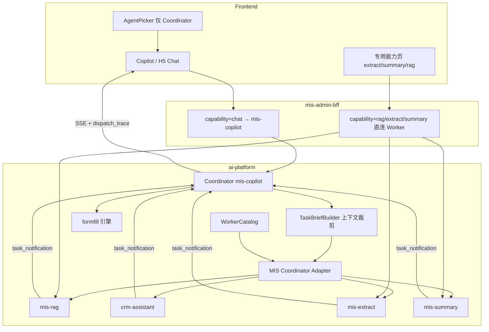

# Coordinator–Worker 架构说明

> 文档角色：本需求的**架构视图**（与 [prd.md](prd.md)、[adr.md](adr.md)、[spec.md](spec.md) 同目录）。  
> 版本：v1.0｜日期：2026-08-04  
> 决策详见 [adr.md](adr.md)；接口与约束详见 [spec.md](spec.md)。

---

## 1. 架构定位

管理台 AI 对话采用 **Coordinator–Worker** 调度架构：

- **Coordinator（协调者）**：运行模式；平台默认由 Agent **`mis-copilot` 按 Coordinator 模式配置并作为唯一用户可选对话入口**。
- **Worker（工作者）**：运行模式；专业子智能体（RAG / CRM / 抽取 / 摘要等），用户不可选。
- **下层执行循环**：各 Agent 内部仍是 QueryEngine 的 ReAct 式 tool-use（与调度架构正交）。

与 OpenHarness 关系：

| 维度 | 策略 |
|------|------|
| 语义（角色、上下文隔离、自包含委派、结果信封） | **对齐官方** Coordinator / Worker / Swarm |
| 实现（subprocess `AgentTool`、coding teammate） | **不对齐照搬**；用 MIS in-process Adapter |

---

## 2. 逻辑架构



---

## 3. 角色与职责

| 组件 | ID / 形态 | 职责 |
|------|-----------|------|
| Coordinator 模式 Agent | 默认：`mis-copilot`（`role=coordinator`） | 持有全局会话；意图识别；组装 TaskBrief；委派；汇总；再规划；降级 |
| Worker 模式 Agent | `mis-rag` 等（`role=worker`） | 独立运行时循环与工具集；只消费 TaskBrief；不可再委派 |
| FormFill | `formfill__*` | 填单工具引擎（非对话 Worker）；HITL |
| WorkerCatalog | 配置派生 | 可委派列表、when_to_use、输入契约 |
| AgentRouter | 入站渠道 | **不**替代管理台对话调度；与 Coordinator 职责分离 |

---

## 4. 上下文与安全边界

```text
Coordinator 会话（完整历史 + page_context）
        │  裁剪 / 综合
        ▼
   TaskBrief（goal / purpose / 相关切片 / 约束 / 期望输出）
        │  spawn
        ▼
Worker 会话（仅 Brief + 自身 memory/tools）—— 不可见主会话全文
```

硬约束：

1. 不传全量 transcript 给 Worker。  
2. `page_context` 仅脱敏相关切片。  
3. `max_depth=1`；禁止委托 Coordinator 自身。  
4. 写操作 Human-in-the-loop；JWT 身份透传。

---

## 5. 与运行时抽象的关系

- 每个 Agent 可配置 `runtime.type`（默认 `openharness`）。
- Coordinator–Worker **契约**与具体 runtime 解耦。
- 现网委派工具挂在 OH 工具链；换 Coordinator 运行时须具备等价 `multi_agent` 委派面，或上提为平台 Middleware。

详见 [spec.md §14.1](spec.md)。

---

## 6. 动态再规划

Coordinator 在对话轮次与 QueryEngine `maxSteps` 内，可根据上一 Worker 的 `task_notification` **再派**下一 Worker（串行）。  
这是反应式再规划，不是首版静态 DAG 引擎。并行 / 续聊见 Spec 分期 C5。

---

## 7. 扩展模型（基座）

```text
新业务域 ──► 注册 Worker（YAML + Catalog + 黄金问句）
              │
              ▼
         对话仍只选 Coordinator（前端选择器不变）
```

Skill / MCP 可复用则优先；需独立人设与长循环再升为 Worker。

---

## 8. 双路径说明

| 路径 | 用途 |
|------|------|
| 对话 → Coordinator → Worker | 默认产品路径；自动调度 |
| 专用页 → BFF 直连 Worker | 结构化 UI，避免双重 LLM；**不是**「选智能体」 |

---

## 9. 分期落地（架构视角）

| 阶段 | 架构增量 |
|------|----------|
| C0 | 本目录文档齐套 |
| C1 | TaskBrief + 结果信封 + dispatch_trace |
| C2–C3 | Catalog / `role` 配置化 |
| C4 | 前端仅 Coordinator |
| C5 | 并行 / 续聊 / stop（可选） |

---

## 10. 关联

- 需求：[prd.md](prd.md)  
- 决策：[adr.md](adr.md)  
- 规范：[spec.md](spec.md)  
- 目录首页：[README.md](README.md)
