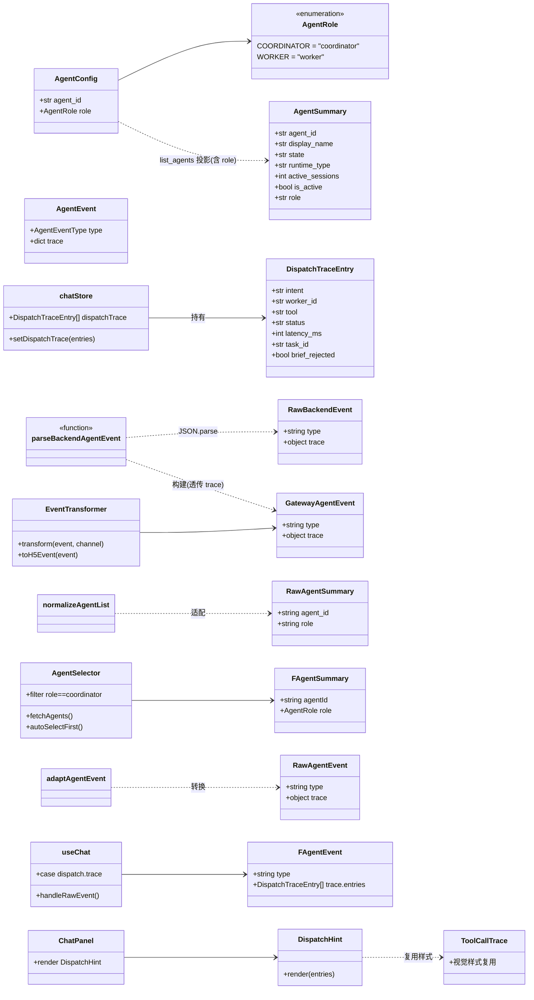
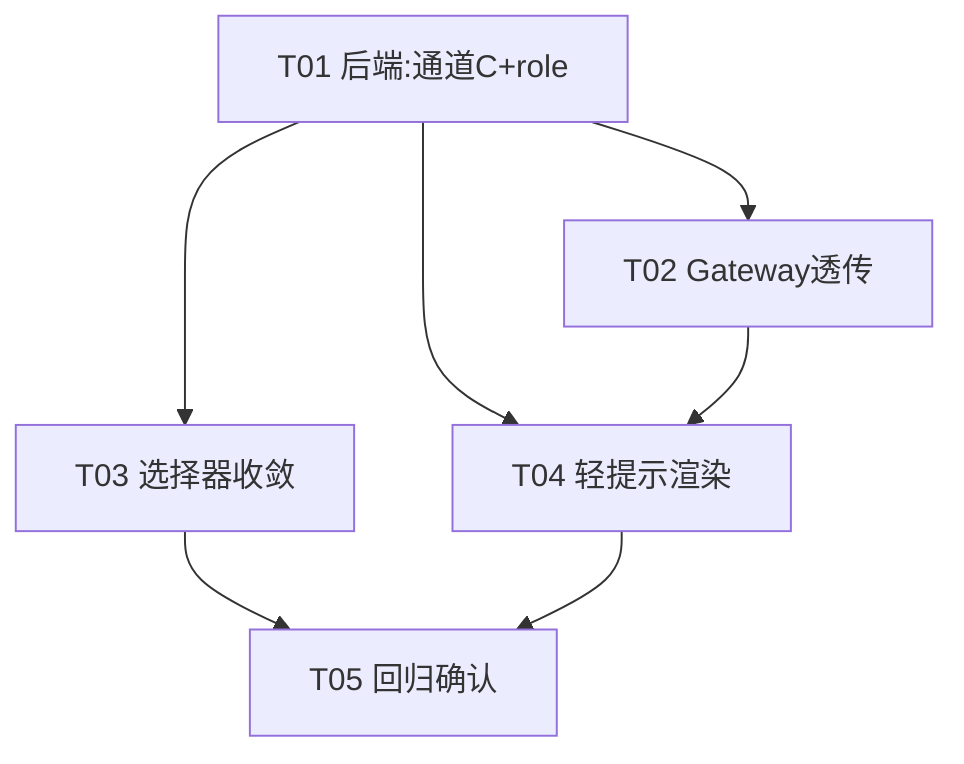

# C4 阶段增量架构设计 + 任务分解（前端收敛）

> 阶段定位：**Coordinator–Worker 调度基座 C4（唯一未完成的分期）**，主题为「前端收敛」。
> 本设计为**纯增量设计**：只描述 C4 需要新增/修改的文件与接线，不触碰既有稳定链路。
> 基座模型（`AgentConfig.role`、`DispatchTraceEntry`、`AgentEvent.trace`、`DispatchTraceBuffer`、三通道累加器）已在 C1/C2/C3/C5 就绪，详见 `class-diagram.mermaid` 与 `sequence-diagram.mermaid`，本文在其上做 C4 delta。
>
> **约束**：本文档仅做设计 + 任务分解，**不修改任何生产代码与测试**。所有代码改动由后续 Engineer 按任务列表落地。

---

## ① 实现方案 + 框架选型

### 难点分析

1. **调度轨迹在 WS 路径下「透传断点」**：后端的 `dispatch.trace` 事件（通道 C）经 Redis Stream 写出后，Gateway `agentEventParser.ts` **未透传 `trace` 字段**，前端 `useChat`/`cardAdapter`/`types/event.ts` **也未消费**，导致调度轨迹到达不了 Agent H5。
2. **选择器未区分 Coordinator/Worker**：`AgentSelector` 拉取 `/agents` 后**自动选中第一个可用 agent（含 Worker）**，违反 FR-FE-1/FR-FE-2；且 `/agents` 响应**不携带 `role`**，前端无法区分。
3. **轻提示缺落点**：`ToolCallTrace.tsx` 已能渲染工具调用轨迹，但调度轨迹（`dispatch.trace`）尚无 UI 承载（FR-FE-3）。

### 框架与选型（全部沿用既有栈，无新增依赖）

| 层 | 技术 | 选型理由 |
|----|------|---------|
| 前端 H5 | React 18 + TypeScript + Zustand + Tailwind | 既有栈，事件型 UI 单向数据流成熟 |
| 网关 Gateway | Node/TS（既有） | 仅扩展 `parseBackendAgentEvent` 透传 `trace`，不改信道模型 |
| 后端 | FastAPI + Pydantic（既有） | 仅翻开关 + `AgentSummary` 加字段，不改事件模型 |
| 轻提示组件 | 复用 `ToolCallTrace` 视觉 | 折叠 + 状态点样式一致，避免重复造轮子 |

### 架构模式

- **全链路 AgentEvent 信封透传**：后端 → Redis Stream → Gateway 解析 → H5 原样接收 `{type, event, timestamp}`，前端按 `type` 分流。
- **前端单向数据流**：`useChat` 消费事件 → 写入 `chatStore` → `ChatPanel` 渲染。
- **最小改动原则**：`/agents` 暴露 `role` 复用既有 `AgentConfig.role`；通道 C 复用既有 `AgentEvent.dispatch_trace()`。

---

## ② 文件列表（新增 / 修改）

> 路径前缀：`agent/ai-platform/`（后端=backend，网关=gateway，前端 H5=frontend）

### 新增文件
| 文件 | 说明 |
|------|------|
| `frontend/src/utils/agentRole.ts` | `COORDINATOR_ROLE` 常量 + `isCoordinator()` 助手 |
| `frontend/src/components/DispatchHint.tsx` | 调度轻提示组件（复用 `ToolCallTrace` 视觉，折叠展示 entries） |
| `backend/tests/api/test_agent_summary_role.py` | 断言 `AgentSummary.role` 存在且 coordinator 正确 |

### 修改文件
| 文件 | 改动点 |
|------|--------|
| `backend/src/config.py` | `DISPATCH_TRACE_EVENT_ENABLED` 由 `False` → `True`（开通道 C） |
| `backend/src/api/routes/agent.py` | `AgentSummary` 增加 `role: str`；`list_agents` 填充 `inst.config.role.value` |
| `gateway/src/channels/ChannelCapability.ts` | `AgentEvent` 接口增加 `trace?: Record<string, unknown>` |
| `gateway/src/router/agentEventParser.ts` | `parseBackendAgentEvent` 透传 `trace` 字段 |
| `gateway/src/router/EventTransformer.ts` | `toH5Event` 增加 `case 'dispatch.trace'` 显式原样透传（消除 default 误标风险） |
| `frontend/src/types/agent.ts` | `AgentSummary` 增加 `role: AgentRole` |
| `frontend/src/utils/agentAdapter.ts` | `RawAgentSummary` 增加 `role` 映射 |
| `frontend/src/components/AgentSelector.tsx` | 仅列 `role==coordinator`；自动选中首个；单 coordinator 时隐藏下拉 |
| `frontend/src/types/event.ts` | `AgentEvent`/`RawAgentEvent` 增加 `trace`；`AgentEventType` 增加 `"dispatch.trace"`；新增 `DispatchTraceEntry` |
| `frontend/src/utils/cardAdapter.ts` | `adaptAgentEvent` 映射 `trace` |
| `frontend/src/hooks/useChat.ts` | `handleRawEvent` 增加 `case "dispatch.trace"` → 写入 store |
| `frontend/src/store/chatStore.ts` | 增加 `dispatchTrace` 状态 + `setDispatchTrace`；`reset/clearMessages/setMessages` 清理 |
| `frontend/src/components/ChatPanel.tsx` | 在消息列表上方渲染 `<DispatchHint entries={dispatchTrace}/>` |
| `frontend/mis-admin-web/src/features/ai/*`（4 个文件） | **仅回归确认，零改动**（见 §5 / 任务 T05） |

> **不改**：Java BFF SSE 链路（已 @deprecated）、admin-web 业务 CRUD 页、WeCom Bot 通道 `dispatch.trace` 降级（留后续）。

---

## ③ 数据结构与接口（类图）

见 `design-c4-class-diagram.mermaid`（下方内联同款，供离线阅读）。



---

## ④ 程序调用流程（时序图）

见 `design-c4-sequence-diagram.mermaid`（下方内联同款）。

```mermaid
%% ① Agent 选择器仅列 Coordinator + 默认选中（FR-FE-1 / FR-FE-2）
sequenceDiagram
    autonumber
    participant CP as ChatPanel (H5)
    participant AS as AgentSelector (H5)
    participant API as backend /agents (list_agents)
    participant Cfg as AgentConfig

    CP->>AS: 挂载
    AS->>API: GET /agents
    API->>Cfg: 读取 inst.config.role
    API-->>AS: AgentSummary[]{agent_id, role="coordinator":mis-copilot, ...}
    AS->>AS: normalizeAgentList + filter role==coordinator
    AS->>AS: 若 !value 且列表>0 → onChange(首个 coordinator)
    AS-->>CP: onChange("mis-copilot") 自动选中
    Note over CP: 单 coordinator 时隐藏下拉，仅显示 MIS Copilot 徽标
    CP->>CP: createSession(agentId="mis-copilot")

%% ② 对话 + 调度轨迹透传（FR-FE-3 / FR-BF-2，通道 C）
sequenceDiagram
    autonumber
    participant U as 用户
    participant CP as ChatPanel (H5)
    participant WS as useChat (H5)
    participant GW as Gateway
    participant RS as Redis Stream
    participant RT as OpenHarnessRuntime

    U->>CP: 发送消息
    CP->>GW: WS /ws/chat (chat → mis-copilot)
    GW->>RT: 转发至 coordinator
    RT->>RT: 引擎执行，drain dispatch_items
    alt DISPATCH_TRACE_EVENT_ENABLED=True（通道 C）
        RT-->>RS: yield dispatch.trace {trace:{entries:[...]}}
    end
    RT-->>RS: yield done(total_usage)
    RS-->>GW: XREAD dispatch.trace / done
    GW->>GW: parseBackendAgentEvent（透传 trace）
    GW->>GW: EventTransformer.toH5Event（原样透传）
    GW-->>WS: agent_event 信封 {type, event:{type:"dispatch.trace", trace}}
    WS->>WS: handleRawEvent → adaptAgentEvent
    WS->>WS: case "dispatch.trace" → setDispatchTrace(entries)
    WS-->>CP: store 更新
    CP->>CP: 渲染 <DispatchHint entries/>
```

---

## ⑤ 任务列表（有序、依赖、P0/P1）

> 共 5 个任务，每个 ≥3 个文件；T01 为基础设施/配置。P0=C4 行验收门槛 G1 相关，P1=能力保留/回归。

### T01 — 后端：开启通道 C + 暴露 Agent role  【P0】
- **源文件**：
  - `backend/src/config.py`（翻 `DISPATCH_TRACE_EVENT_ENABLED = True`；确认 `DISPATCH_TRACE_ENABLED`（A，默认开）保持）
  - `backend/src/api/routes/agent.py`（`AgentSummary` 增 `role: str`；`list_agents` 填充 `inst.config.role.value`）
  - `backend/tests/api/test_agent_summary_role.py`（新增，断言 role 字段存在且 `mis-copilot` 为 `coordinator`）
- **依赖**：无
- **优先级**：P0

### T02 — Gateway：dispatch.trace 透传接线  【P0】
- **源文件**：
  - `gateway/src/channels/ChannelCapability.ts`（`AgentEvent` 增 `trace?: Record<string, unknown>`）
  - `gateway/src/router/agentEventParser.ts`（`parseBackendAgentEvent` 透传 `raw.trace`）
  - `gateway/src/router/EventTransformer.ts`（`toH5Event` 增 `case 'dispatch.trace'` 显式原样透传）
- **依赖**：T01（后端已 yield 带 trace 的事件）
- **优先级**：P0

### T03 — 前端：AgentSelector 仅列 Coordinator 且默认选中  【P0】
- **源文件**：
  - `frontend/src/types/agent.ts`（`AgentSummary` 增 `role: AgentRole`）
  - `frontend/src/utils/agentAdapter.ts`（`RawAgentSummary` 增 `role` 映射）
  - `frontend/src/components/AgentSelector.tsx`（filter `role==coordinator`；自动选中首个；单 coordinator 隐藏下拉）
  - `frontend/src/utils/agentRole.ts`（新增 `COORDINATOR_ROLE` + `isCoordinator()`）
- **依赖**：T01（`/agents` 已返回 role）
- **优先级**：P0

### T04 — 前端：dispatch.trace 消费与调度轻提示渲染  【P0】
- **源文件**：
  - `frontend/src/types/event.ts`（`AgentEvent`/`RawAgentEvent` 增 `trace`；`AgentEventType` 增 `"dispatch.trace"`；新增 `DispatchTraceEntry`）
  - `frontend/src/utils/cardAdapter.ts`（`adaptAgentEvent` 映射 `trace`）
  - `frontend/src/hooks/useChat.ts`（`handleRawEvent` 增 `case "dispatch.trace"` → `setDispatchTrace`）
  - `frontend/src/store/chatStore.ts`（增 `dispatchTrace` 状态 + `setDispatchTrace`；`reset/clearMessages/setMessages` 清理）
  - `frontend/src/components/DispatchHint.tsx`（新增，复用 `ToolCallTrace` 视觉）
  - `frontend/src/components/ChatPanel.tsx`（消息列表上方渲染 `<DispatchHint/>`）
- **依赖**：T01、T02（链路已透传 trace）
- **优先级**：P0

### T05 — 回归红线确认 + 联调验证（admin-web 零改动）  【P1】
- **源文件**（仅审查，不改）：
  - `frontend/mis-admin-web/src/features/ai/ai-feature-registry.ts`（确认 `copilot→H5 iframe`、能力页 `capability: extract|summary|rag` 直连保留）
  - `frontend/mis-admin-web/src/features/ai/ai-context.tsx`（确认 `AIProvider` fail-closed，`/ai/features` 失败→`enabledFeatures=[]`）
  - `frontend/mis-admin-web/src/features/ai/use-ai.ts`（确认 `unavailable` 标志）
  - `frontend/mis-admin-web/src/features/ai/components/ai-feature.tsx`（确认 `fallback:'hide'` 返回 null，不阻断 CRUD）
- **依赖**：T03、T04
- **优先级**：P1

### 任务依赖图



---

## ⑥ 依赖包列表

**本次 C4 不引入任何新依赖**，全部复用既有栈：

```
# 后端（FastAPI + Pydantic，既有）
pydantic>=2.0          # AgentSummary/AgentEvent 模型（已具备）
fastapi>=0.110         # 路由（已具备）

# 网关 Gateway（Node/TS，既有）
typescript>=5.0        # AgentEvent 类型扩展（已具备）
# 无新增 npm 包

# 前端 H5（React + Zustand + Tailwind，既有）
react@^18.2.0
zustand@^4.5.0         # chatStore（已具备）
clsx@^2.0.0           # DispatchHint/样式（已具备）
tailwindcss@^3.4.0    # 样式（已具备）

# admin-web：无改动、无新增
```

---

## ⑦ 共享知识 / 跨文件约定

1. **全链路 AgentEvent 信封透传**：后端→Redis Stream→Gateway→H5，前端按 `type` 分流；新增事件字段一律**可选**（默认 `None`/`undefined`），保证既有序列化与前端兼容。
2. **字段命名**：后端/网关用 snake_case，前端用 camelCase，由 `agentAdapter`/`cardAdapter` 桥接；`trace` 为单字，snake/camel 同形。
3. **`trace` 形状固定**：`{ entries: DispatchTraceEntry[] }`，条目字段 `intent / worker_id / tool / status / latency_ms / task_id / brief_rejected`（与 `class-diagram.mermaid` 中 `DispatchTraceEntry` 一致）。
4. **`role` 取值**：来自 `AgentConfig.role`（`coordinator`/`worker`）；前端过滤用 `coordinator`，**不硬编码 `mis-copilot`**（即便当前唯一 coordinator 即 mis-copilot，也按 role 泛化）。
5. **轻提示口径（spec §7.2）**：调度提示只展示「已调用知识库/工具」类轻量文案，**不得暴露 Worker 选择器**；`DispatchHint` 折叠展示，默认收起。
6. **开关默认值改动**：`DISPATCH_TRACE_EVENT_ENABLED` 翻 `True` 后，部署侧需同步在 `config.yaml`/环境变量注入（见 §8 待明确）。
7. **回归红线**（继承自 design-impl.md §7）：C4 不得改动 Java BFF SSE 链路、admin-web CRUD 页、WeCom Bot 的既有降级；专用能力页（extract/summary/rag）保持 BFF 直连。

---

## ⑧ 待明确事项 + Q1~Q4 裁定

### Q1 — Active 链路（WS）下 dispatch_trace 的真实载体是什么？
**裁定：载体是独立的 `dispatch.trace` AgentEvent（通道 C）。**
实证：
- `backend/src/runtime/events.py`：`AgentEventType.DISPATCH_TRACE = "dispatch.trace"`；`AgentEvent.trace: dict|None`（默认 None）；`AgentEvent.dispatch_trace(entries)` 产出 `{type:"dispatch.trace", trace:{"entries":[...]}}`。
- `backend/src/runtime/openharness.py`（L544-572）：每轮引擎结束后 `drain_dispatch_traces`；若 `dispatch_trace_event_enabled()`（通道 C）为真，`yield AgentEvent.dispatch_trace(dispatch_items)`（位于 `done` 之前）。
- `backend/src/queue/redis_stream.py`：`publish_agent_event` 以 `model_dump(mode="json", exclude_none=True)` 写入 `stream:agent:events`；因 `trace` 非 None 必写出。
- 通道 A（默认开）只写 `session.state["dispatch_trace"]` + 结构化日志，**前端经 WS 拿不到**；通道 B（SSE done 帧附 `dispatchTrace`）走的是 **已 @deprecated 的 admin-web SSE 链路**（`ai-copilot.tsx` 已废弃，改走 H5 iframe），对 Agent H5 无效。
- **结论**：要让 Agent H5 经 WS 拿到调度轨迹，必须启用通道 C，并补齐 Gateway/前端对 `trace` 字段的消费（见 T01/T02/T04）。

### Q2 — `/agents` 是否含 role 字段？
**裁定：当前不含；但后端已具备 `role` 模型，最小改动是后端在 `AgentSummary` 暴露 `role`。**
实证：
- `frontend/src/utils/agentAdapter.ts` 的 `RawAgentSummary` 字段为 `agent_id/display_name/state/runtime_type/active_sessions/is_active`，**无 role**。
- `backend/src/api/routes/agent.py` 的 `AgentSummary`（L79-88）同样**无 role**，`list_agents` 未返回。
- 但 `backend/src/agent/config.py` 已定义 `AgentRole(coordinator|worker)`，`AgentConfig.role` 默认 worker；且 `configs/agents/mis-copilot/agent.yaml:21` 已声明 `role: coordinator`。
- **方案**：`AgentSummary` 增 `role: str`，`list_agents` 填充 `inst.config.role.value`；前端据此过滤。**不改动 `AgentConfig` 模型，无破坏性**。

### Q3 — 翻哪个 Python 开关？
**裁定：启用 `DISPATCH_TRACE_EVENT_ENABLED`（通道 C）= True。**
实证：
- `backend/src/config.py`：`DISPATCH_TRACE_EVENT_ENABLED`（默认 False，注释「C4 前端就绪后再开」）；`DISPATCH_TRACE_SSE_ENABLED`（默认 False，注释「需 Java BFF 侧确认后再开」= B 通道死链路）；`DISPATCH_TRACE_ENABLED`（A，默认 True）。
- `openharness.py` 中 `done` 事件 `AgentEvent.done(total_usage)` **不携带 trace**；通道 A 只写 session.state，二者均无法经 WS 触达前端。
- 故**唯一能让 Agent H5（WS 路径）拿到调度轨迹的开关是 C**；B 通道（SSE）因 admin-web 已弃用 SSE copilot 而无效；A 通道不可见。
- 注：`events.py` 注释明确「默认关闭，避免 Gateway `toH5Event` 无 default 分支导致语义误标」——本设计在 T02 同时补齐 Gateway `trace` 透传与显式 `case`，消除该风险。

### Q4 — FR-FE-4（专用页保留为能力页）/ FR-FE-5（AI 不可用/无权限 CRUD 不受阻）现状？
**裁定：两项均已满足，C4 无需改动 admin-web，仅需回归确认（T05）。**
实证：
- **FR-FE-4（专用 capability 页保留直连）**：`ai-feature-registry.ts` 中 `form-fill/text-extract/detail-summary/rag-qa/skill-fill` 均为 `capability: extract|summary|rag`，经 `use-ai.ts` 直连 `/ai/extract`、`/ai/summary`、`/ai/rag`（BFF 直连，不经 mis-copilot 调度）；`copilot` 为 `capability: chat-stream` 走 H5 iframe。C4 只收敛「对话默认走 Coordinator」，不触动这些专用能力页直连 → 满足「保留为能力页」。
- **FR-FE-5（AI 不可用/无权限不阻断 CRUD）**：`ai-context.tsx` 的 `AIProvider` 拉 `/ai/features`、`/ai/health`，失败/未登录 → `reset()` + fail-closed（`enabledFeatures=[]`）；`ai-feature.tsx` 的 `<AiFeature>` 在 `!enabled` 时按 `fallback:'hide'` 返回 null；`use-ai.ts` 暴露 `unavailable` 标志。`AiFeature` 与业务 CRUD 页解耦（仅渲染入口/触发按钮），AI 缺失时入口消失、主流程照常 → CRUD 不被阻断。
- **结论**：admin-web 在 C4 为零改动；本设计将其列入回归红线（T05）。

### 其他待明确事项
1. **选择器形态**：仅一个 coordinator 时是否隐藏下拉、只显示「MIS Copilot」徽标？本设计默认「隐藏下拉」，但需产品确认是否保留可切换形态（未来多 Coordinator）。
2. **轻提示文案模板**：`DispatchHint` 默认展示「已为你调度：知识库检索 · 工单查询」（由 `intent/tool` 推导），具体文案需产品确认（spec §7.2 要求不暴露 Worker 选择器）。
3. **WeCom Bot 通道**：通道 C 开启后，`dispatch.trace` 在 `EventTransformer.toBotCard` 的 `default` 分支会被降级为 error 卡片（「无法处理的事件类型」）。C4 范围仅 H5；若 WeCom 也要展示，需后续补 `case 'dispatch.trace'` 降级（不在本期）。
4. **配置注入方式**：`DISPATCH_TRACE_EVENT_ENABLED` 翻 True 后，是否通过 `config.yaml`/环境变量注入，而非仅改代码默认值？需部署侧确认。
5. **admin-web H5 入口**：`ai-copilot.tsx` 已 @deprecated 但需确认无残留引用，`CopilotPanel` + `lib/ai-h5.ts` 已是默认入口（T05 回归确认）。

---

## 附录：与基座文档的关系
- `class-diagram.mermaid` / `sequence-diagram.mermaid`：C1~C5 基座模型与委派时序（已就绪）。
- `design-impl.md`：C1+C2+C3+C5 实现细节与回归红线（§3/§5/§7 风格参照）。
- 本文件 `design-c4.md`：在基座之上做 C4 delta（前端收敛 + 通道 C 透传 + role 暴露）。
