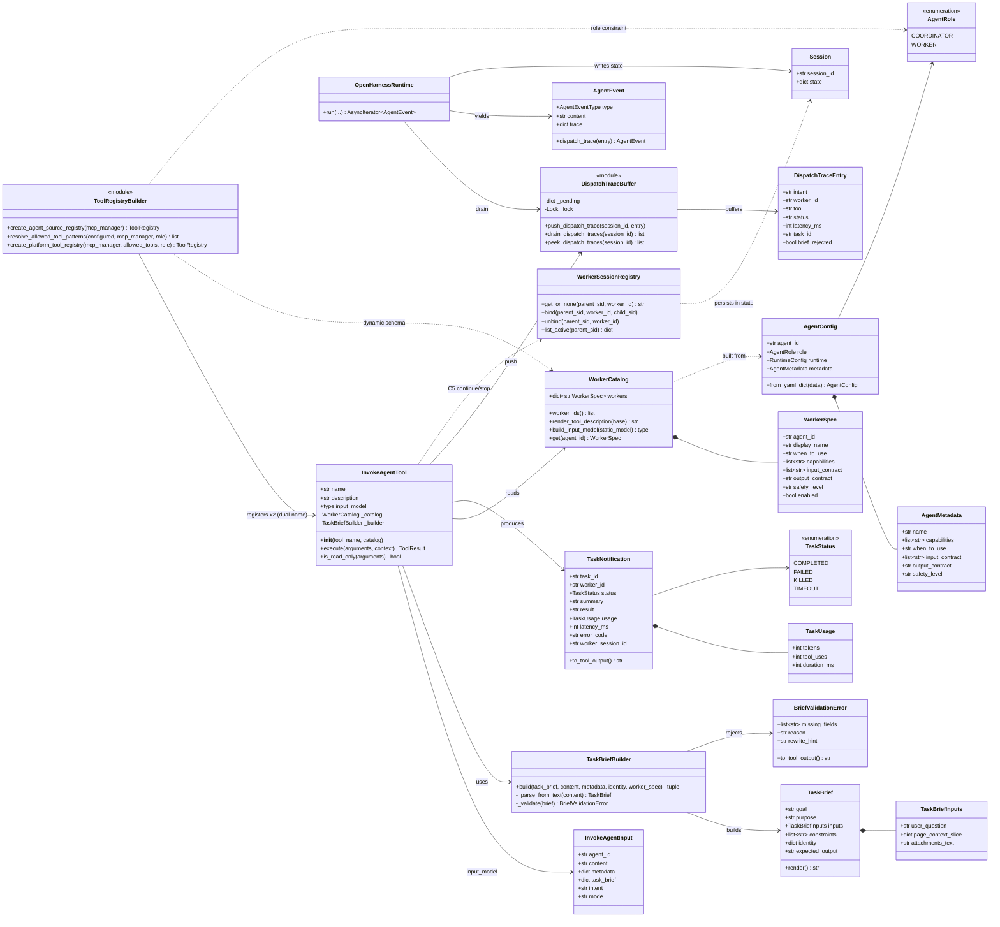
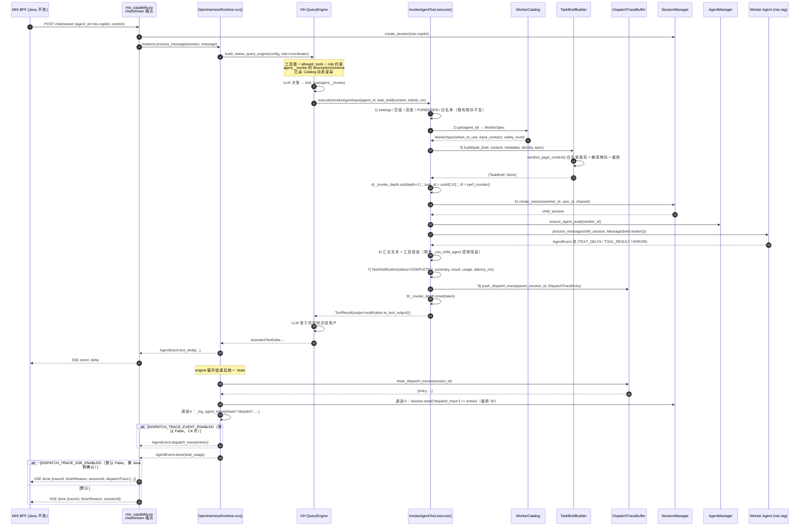
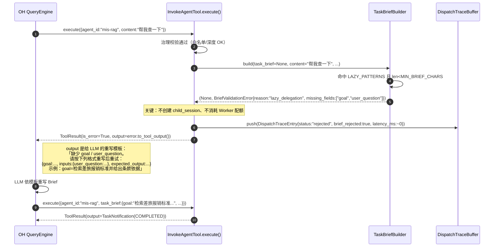
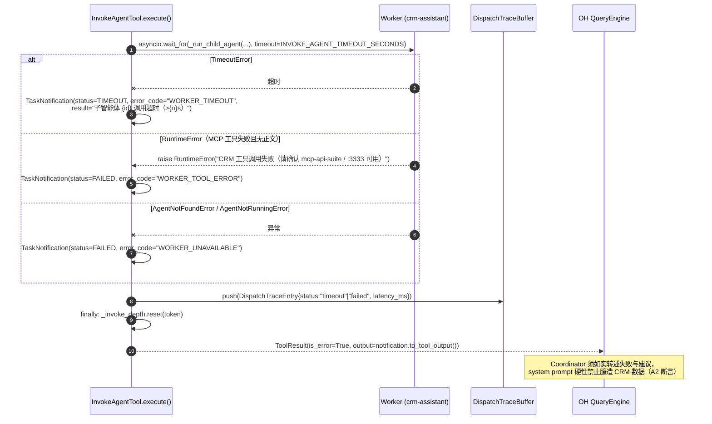
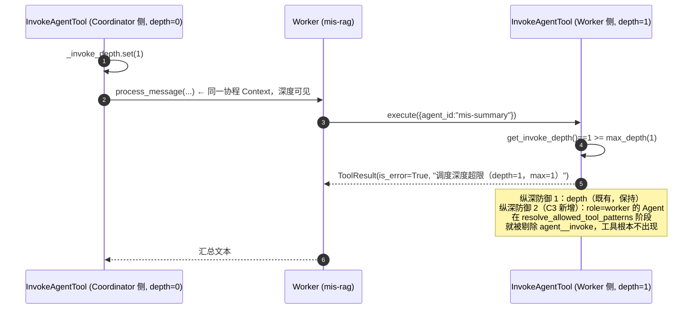
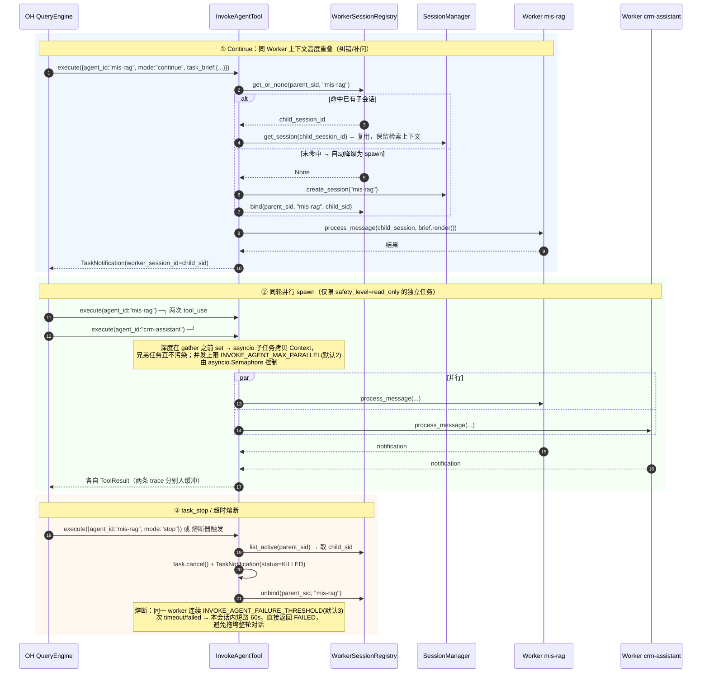
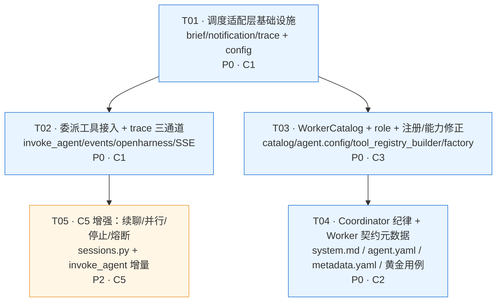

# Coordinator–Worker 调度基座 · 实现级架构设计与任务分解（C1+C2+C3+C5）

> 文档角色：本需求的**实现级设计**（Implementation Design），承接 C0 文档族，直接指导工程师编码。
> 上游：[prd.md](prd.md) · [architecture.md](architecture.md) · [adr.md](adr.md) · [spec.md](spec.md) · [dev.md](dev.md)
> 版本：v1.0｜状态：待评审 → 可实施
> 范围：**仅 `agent/ai-platform/backend` Python 后端 + `agent/ai-platform/configs`**。不改 Java BFF（`backend/mis-admin-bff`）、不改 React 前端（`frontend/mis-admin-web`、`agent/ai-platform/frontend`）、不改 Gateway TypeScript。

---

## 0. 代码基线核实结论（本设计的事实依据）

本设计中所有"现状"描述均已逐文件打开核实，结论如下（工程师可据此直接下手，无需重复摸底）：

| # | 文件 | 已核实事实 | 对设计的约束 |
|---|------|-----------|-------------|
| 1 | `backend/src/skills/tools/invoke_agent.py`（287 行） | `InvokeAgentTool(BaseTool)`，`name="agent__invoke"`；模块级 `_invoke_depth: ContextVar[int]`、`DEFAULT_WHITELIST`、`FORBIDDEN_TARGETS={"mis-copilot"}`、`resolve_whitelist()`、`get_invoke_depth()`；`execute()` 顺序为 settings → 空值校验 → 深度 → FORBIDDEN → 白名单 → identity/session_id → `_invoke_depth.set` → `asyncio.wait_for(_run_child_agent)`；**末行 `return ToolResult(output=text)`，只回纯文本，无结构化信封** | C1 在此文件内做"最小侵入 + 逻辑外提"改造；所有公共符号名保留不动 |
| 2 | `backend/src/runtime/tool_registry_builder.py`（435 行） | 第 302 行 `registry.register(InvokeAgentTool())` **无参单例注册**；`resolve_allowed_tool_patterns()` 默认 `["skill","mcp__*","formfill__*"]`；`is_tool_allowed()` 用 `fnmatch`；`create_platform_tool_registry(mcp_manager, allowed_tools)` 过滤后用 `SafeToolWrapper` 包装 | C3 动态 schema 与双名注册在此落地；`SafeToolWrapper.__init__` 已 `self.name = inner.name`，双名透传天然成立 |
| 3 | `.venv/.../openharness/tools/base.py` | `BaseTool` 的 `name/description/input_model` 是**类型注解而非硬绑定类属性**；`to_api_schema()` 读 `self.name` / `self.description` / `self.input_model.model_json_schema()`；`ToolRegistry.register()` 以 `tool.name` 为键 | **实例属性可安全覆盖类属性** → 双名过渡（同一实现注册两个名字）与动态 `input_model` 均可行，无需改 openharness |
| 4 | `backend/src/runtime/events.py`（157 行） | `AgentEventType` 仅 7 类；`AgentEvent` 字段固定，**无 metadata / 无 extra 承载位**（`approval_request()` 传 `detail=` 被 pydantic 静默丢弃，带 `# type: ignore[call-arg]`） | dispatch_trace 若走事件通道，必须**新增枚举值 + 新增字段**，属协议变更 → 需 feature flag 兜底 |
| 5 | `backend/src/runtime/openharness.py` | `run()` 在 `engine.submit_message()` 循环结束后 `drain_a2ui_renders(session_id)` 并 `yield AgentEvent.ui_render(...)`，再 `yield AgentEvent.done(total_usage)` | **工具→事件流的外送范式已存在**（`a2ui_pending.py` 缓冲 + 运行时 drain），dispatch_trace 直接复刻此范式，零架构发明 |
| 6 | `backend/src/api/routes/mis_capability.py` | `/agents/{agent_id}/chat/stream` 的事件循环**只处理 `TEXT_DELTA` 与 `ERROR`**，其余事件（含 `TOOL_CALL`/`TOOL_RESULT`/`UI_RENDER`）全部被丢弃；`done` 帧固定为 `{traceId, finishReason, sessionId}` | 新增事件类型在 **MIS BFF 主链路上会被静默丢弃** → 该链路必须靠 `done` 帧附加字段或 `session.state` 才能送达 |
| 7 | `gateway/src/router/EventTransformer.ts` | `toH5Event()` 的 `switch` **无 `default` 分支**，`type` 初值为 `'stream'` → 未知事件类型会被当作 `'stream'` 类型消息透传（`eventData` 完整）；Bot 等渠道有 `default:` 降级分支 | 新增事件类型对 H5 "不崩但语义错"（被标为 stream）→ 必须 flag 默认关闭，C4 前端就绪后再开 |
| 8 | `backend/src/runtime/factory.py` | `OpenHarnessFactory.capabilities()` 第 94 行 `multi_agent=True`，注释称"通过 openharness.coordinator"，实际未接线；`RuntimeCapabilities`（`registry.py`）默认 `multi_agent=False` | ADR 点名的虚假声明属实。**全仓 `grep` 确认 `capabilities()` 与 `multi_agent` 在 backend/gateway/frontend 均无任何消费方** → 修正为 `False` 零回归风险 |
| 9 | `backend/src/agent/config.py`（443 行） | `AgentConfig` 无 `role` 字段；`AgentMetadata` 有 `capabilities: list[str]` 但**无 `when_to_use`**；`from_yaml_dict()` 逐 section 手工解析，未解析 `metadata` section | C3 需在 `AgentConfig` 加 `role`、`AgentMetadata` 加 `when_to_use`/IO 契约，并补 `from_yaml_dict()` 解析分支 |
| 10 | `backend/src/config.py` | 已有 `INVOKE_AGENT_WHITELIST` / `INVOKE_AGENT_MAX_DEPTH=1` / `INVOKE_AGENT_TIMEOUT_SECONDS=120` | 新配置项沿用同一命名族，追加在同一段落 |
| 11 | `backend/src/agent/session.py` | `Session.state: dict` 已持久化到 Redis（24h TTL）；`invoke_agent.py` 已在用 `child_session.state["delegated_from"]` | `session.state["dispatch_trace"]` 作为零风险主通道成立 |
| 12 | `backend/tests/test_invoke_agent.py` | 9 个用例；导入 `InvokeAgentInput` / `InvokeAgentTool` / `_invoke_depth` / `resolve_whitelist` / `DEFAULT_WHITELIST` / `FORBIDDEN_TARGETS`；mock 路径 `src.agent.session.get_session_manager`、`src.agent.manager.get_agent_manager` | **这 6 个符号 + 2 条 mock 路径是硬契约，不得改名/改导入位置**；见 §7.6 逐用例影响分析 |
| 13 | `backend/pyproject.toml` | `[tool.pytest.ini_options]` `asyncio_mode="auto"`、`testpaths=["tests"]` | 新测试无需 `@pytest.mark.asyncio`；命令 `.venv/Scripts/python.exe -m pytest` |
| 14 | `configs/agents/{mis-copilot,mis-rag,mis-extract,mis-summary,crm-assistant}/` | 目录形如 `agent.yaml` + `metadata.yaml` + `runtime/runtime.yaml` + `runtime/prompts/system.md` + `skills/enabled-skills.yaml` + `system/model.yaml`；`mis-copilot/runtime/runtime.yaml` 的 `allowed_tools` 含 `agent__invoke`；各 `metadata.yaml` 有 `capabilities` 无 `when_to_use` | Catalog 数据源就是这些 `metadata.yaml`；新增字段为纯追加 |

---

## 1. 实现方案总述

### 1.1 核心难点与技术选型

| 难点 | 分析 | 选型裁定 |
|------|------|---------|
| **D1. 工具执行在 Agent 循环内部，无法直接 yield 事件** | `InvokeAgentTool.execute()` 由 OH `QueryEngine` 在内部调用，返回值只有 `ToolResult`；dispatch_trace 需要送到会话外层 | 复刻仓内既有 `a2ui_pending.py` 范式：**按 `session_id` 分组的挂起缓冲 + `OpenHarnessRuntime.run()` 统一 drain**。零新范式、零新依赖 |
| **D2. MIS BFF 主链路只透传 delta/error** | 新增事件类型在该链路必然丢失（已核实 `mis_capability.py`） | dispatch_trace 采用**三通道分层**（§1.3），默认只开零协议风险的 `session.state` + 结构化日志通道 |
| **D3. TaskBrief 要"强校验"又不能破坏现网 LLM 调用习惯** | 现网 LLM 只会传 `agent_id/content/metadata`；若直接改成必须传结构化 brief，现网立刻大面积拒委派 | **双模入参**：`task_brief` 结构化对象（推荐）与 `content` 纯文本（兼容）并存；`TaskBriefBuilder` 负责"结构化优先 / 文本回退解析"，校验器只拒绝**真正的懒委托**（见 §1.4 拒绝判据），而非拒绝一切非结构化输入 |
| **D4. 工具 schema 要随 Catalog 动态变化，但 `input_model` 是类属性** | 已核实 `BaseTool` 读 `self.input_model`，实例属性可覆盖 | 用 `pydantic.create_model()` 在**构造期**生成子模型（`agent_id: Literal[...]`），继承静态 `InvokeAgentInput` 保持类型兼容；`InvokeAgentInput` 本身保持不变以兼容既有测试 |
| **D5. 双名过渡 `agent__invoke` / `agent`** | `ToolRegistry` 以 `tool.name` 为键，两个实例即两个条目 | 同一实现类构造两次，第二次 `tool_name="agent"`；由 `allowed_tools` 决定实际暴露哪一个（默认仍只暴露 `agent__invoke`） |
| **D6. role 语义要能真正约束工具面** | 现状 `allowed_tools` 是唯一闸口，YAML 写错即越权 | 在 `resolve_allowed_tool_patterns()` 增加 **role 后置约束**：`worker` 强制剔除委派工具（纵深防御），`coordinator` 自动补齐，`None` 保持既有行为（零回归） |
| **D7. C5 续聊需要保留 Worker 会话** | 现状每次委派新建 child session 后即丢弃 session_id | 新增 `WorkerSessionRegistry`：父 session → `{worker_id: child_session_id}` 映射，存于 `session.state["worker_sessions"]`（复用 Redis 持久化，无新存储） |
| **D8. C5 并行 spawn 的 ContextVar 传播** | `asyncio.gather` 创建的 Task 会**拷贝**当前 Context，子任务内 `_invoke_depth.set()` 不会污染兄弟任务 | 天然安全；但深度值必须在 `gather` **之前**设置，见 §4.5 时序图 |

### 1.2 架构分层（新增 `src/coordinator` 包）

```
src/coordinator/            ← 新增：Coordinator–Worker 语义适配层（对外像 OH，对内调平台 Runtime）
├── brief.py                ← TaskBrief 模型 + Builder + 校验 + page_context 脱敏
├── notification.py         ← TaskNotification 结果信封 + 渲染为 ToolResult.output
├── trace.py                ← DispatchTrace 条目 + 挂起缓冲（a2ui_pending 同款）
├── catalog.py              ← WorkerCatalog（从 configs/agents/*/metadata.yaml 构建）
└── sessions.py             ← WorkerSessionRegistry（C5 续聊 / 停止）

src/skills/tools/invoke_agent.py   ← 改造为"薄编排"：校验 → Brief → 执行 → 信封 → 记 trace
```

**分层原则**：`invoke_agent.py` 只做编排与治理（白名单/深度/超时），业务语义（Brief/信封/trace/catalog）全部下沉到 `src/coordinator`，便于 C5 与未来 OH `TeamRegistry` 替换时只换适配层。

### 1.3 dispatch_trace 外送通道选型（关键裁定）

已核实三条候选通道，对比如下：

| | **通道 A：`session.state["dispatch_trace"]`** | **通道 B：`done` SSE 帧附加 `dispatchTrace`** | **通道 C：新增 `AgentEventType.DISPATCH_TRACE`** |
|---|---|---|---|
| 改动面 | `invoke_agent.py` + `openharness.py`（写回） | 通道 A + `mis_capability.py` / `session.py` 路由 | 通道 A + `events.py`（新枚举+新字段）+ `openharness.py` drain |
| 是否改事件协议 | 否 | 否 | **是**（协议变更） |
| MIS BFF 主链路可达 | 需 BFF 额外查会话（当前不查） | ✅ 直达（`done` 帧 BFF 已解析） | ❌ 被 `mis_capability.py` 丢弃 |
| H5/Gateway 链路可达 | ❌ | ❌ | ✅ 但会被 `toH5Event` 误标为 `'stream'`（无 default 分支） |
| 对 Java BFF 风险 | **零** | 中（Jackson 若 `FAIL_ON_UNKNOWN_PROPERTIES=true` 会抛错，未经我方核实） | 零（事件根本到不了） |
| 对 React 前端风险 | **零** | 低（多一个字段，忽略即可） | 中（未知 `eventType` 被当 stream 渲染） |
| 可测性 | ✅ 单测直接断言 `session.state` | ✅ 断言 SSE 帧 | ✅ 断言事件流 |

**裁定：三通道分层实现，按 feature flag 渐进开启。**

- **通道 A = C1 默认通道（`DISPATCH_TRACE_ENABLED=True`）**
  写入 `session.state["dispatch_trace"]`（Redis 持久化，24h）+ `structlog` 结构化日志（`_log_agent_trace(phase="dispatch", ...)`）。**零协议变更、零跨端风险**，满足 C1 验收「黄金问句可观测到正确 worker_id」——单测与运维排障均由此通道满足。
- **通道 B = C1 实现代码、默认关闭（`DISPATCH_TRACE_SSE_ENABLED=False`）**
  在 `mis_capability.py` 的 `done` 帧中条件附加 `"dispatchTrace": [...]`。开关打开即对 BFF 可见，**开启前须由 Java 侧确认 Jackson 未开启严格未知字段校验**（列入 §8 待明确 Q3）。
- **通道 C = C1 实现代码、默认关闭（`DISPATCH_TRACE_EVENT_ENABLED=False`）**
  新增 `AgentEventType.DISPATCH_TRACE = "dispatch.trace"` 与 `AgentEvent.trace: dict | None`，走 drain 范式。为 C4 前端「已调用知识库」轻提示预留，C4 时一行配置打开。

> 三通道共用**同一份** `DispatchTraceEntry` 数据与同一个缓冲，仅出口不同 → 无重复逻辑、无数据不一致。

### 1.4 TaskBrief 校验策略（防误伤的"懒委托"判据）

校验器 **只在同时满足**以下条件时拒绝，返回可操作的重写指引：

1. 缺 `goal`（结构化模式）**或** `content` 去空白后 `< MIN_BRIEF_CHARS`（默认 12 字符）；**或**
2. `content` 命中懒委托模式集 `LAZY_PATTERNS`（如「根据你的发现」「帮我查一下」「看看情况」「继续」且无其他实词）；**或**
3. `content` 中不含任何来自 `user_question` 的实体/关键词（结构化模式下 `inputs.user_question` 为空且 `goal` 为空）。

拒绝时返回 `is_error=True`，`output` 为**给 LLM 的重写模板**（含缺失字段清单 + 一个正确示例），使 Coordinator 能自我修复后重试——这是 C2「懒委托下降」的技术兜底，不依赖 prompt 自觉。

### 1.5 架构模式

- **Adapter 模式**：`src/coordinator` 对上暴露 OH 风格语义（spawn / task_notification / send_message / task_stop），对下调用平台 `AgentManager` + `SessionManager`（in-process，非 subprocess Swarm，符合 ADR）。
- **Registry 模式**：`WorkerCatalog` 单例（惰性构建 + 显式 `refresh()`），数据源 `ConfigManager.list_configs()`。
- **Buffer + Drain**：trace 外送，复刻 `a2ui_pending`。
- **Strategy（轻量）**：`ContinueStrategy` vs `SpawnStrategy`（C5），由 `WorkerSessionRegistry` 命中与否 + 显式 `mode` 入参决定。

---

## 2. 文件清单

### 2.1 新增文件

| 路径 | 说明 | 所属阶段 |
|------|------|---------|
| `agent/ai-platform/backend/src/coordinator/__init__.py` | 包导出：`TaskBrief` / `TaskNotification` / `DispatchTraceEntry` / `get_worker_catalog` | C1 |
| `agent/ai-platform/backend/src/coordinator/brief.py` | `TaskBrief` / `TaskBriefInputs` / `TaskBriefBuilder` / `BriefValidationError` / `sanitize_page_context()` | C1 |
| `agent/ai-platform/backend/src/coordinator/notification.py` | `TaskNotification` / `TaskStatus` / `to_tool_output()` / `from_worker_result()` | C1 |
| `agent/ai-platform/backend/src/coordinator/trace.py` | `DispatchTraceEntry` / `push_dispatch_trace()` / `drain_dispatch_traces()` / `peek_dispatch_traces()` | C1 |
| `agent/ai-platform/backend/src/coordinator/catalog.py` | `WorkerSpec` / `WorkerCatalog` / `get_worker_catalog()` / `refresh_worker_catalog()` | C2 |
| `agent/ai-platform/backend/src/coordinator/sessions.py` | `WorkerSessionRegistry`（父→子会话映射、续聊、停止） | C5 |
| `agent/ai-platform/backend/tests/test_task_brief.py` | Brief 校验 / 脱敏 / 渲染单测 | C1 |
| `agent/ai-platform/backend/tests/test_dispatch_trace.py` | trace 三通道 + session.state 落盘单测 | C1 |
| `agent/ai-platform/backend/tests/test_worker_catalog.py` | Catalog 构建 / 动态 schema / role 约束单测 | C3 |
| `agent/ai-platform/backend/tests/test_coordinator_golden.py` | A1–A7 黄金用例（意图 → 期望 worker_id 断言） | C2 |
| `agent/ai-platform/backend/tests/test_worker_sessions.py` | C5 续聊 / 并行 / 停止 / 熔断单测 | C5 |

### 2.2 修改文件

| 路径 | 改动摘要 | 所属阶段 |
|------|---------|---------|
| `agent/ai-platform/backend/src/skills/tools/invoke_agent.py` | 构造器化（`tool_name` / `catalog` 注入）；接入 Brief 校验、TaskNotification、trace 记录；新增 `task_brief` / `mode` / `worker_session_id` 可选入参；保留全部既有公共符号 | C1/C3/C5 |
| `agent/ai-platform/backend/src/runtime/tool_registry_builder.py` | 第 302 行改为 Catalog 驱动的双名注册；`resolve_allowed_tool_patterns()` 增加 `role` 后置约束；`create_platform_tool_registry()` 增加 `role` 可选参数 | C3 |
| `agent/ai-platform/backend/src/runtime/events.py` | 新增 `AgentEventType.DISPATCH_TRACE`；`AgentEvent` 新增 `trace: dict[str, Any] \| None`；新增 `AgentEvent.dispatch_trace()` 类方法 | C1（默认关闭） |
| `agent/ai-platform/backend/src/runtime/openharness.py` | drain 段追加 dispatch_trace drain：写 `session.state`、条件 yield 事件、写结构化日志 | C1 |
| `agent/ai-platform/backend/src/runtime/factory.py` | `multi_agent=True` → `False`；补注释说明平台级 Coordinator 由 `src/coordinator` Adapter 提供；（可选）`delegation=True` | C3 |
| `agent/ai-platform/backend/src/runtime/registry.py` | （可选）`RuntimeCapabilities` 新增 `delegation: bool = False` 并加入 `to_dict()` | C3 |
| `agent/ai-platform/backend/src/runtime/oh_runtime_builder.py` | 向 `create_platform_tool_registry()` 传入 `agent_config.role` | C3 |
| `agent/ai-platform/backend/src/agent/config.py` | `AgentConfig` 新增 `role: AgentRole`；`AgentMetadata` 新增 `when_to_use` / `input_contract` / `output_contract` / `safety_level`；`from_yaml_dict()` 解析 `role` 与 `metadata` section | C3 |
| `agent/ai-platform/backend/src/config.py` | 新增 6 项配置（§6.2） | C1/C5 |
| `agent/ai-platform/backend/src/api/routes/mis_capability.py` | `done` 帧条件附加 `dispatchTrace`（flag 默认关闭） | C1（默认关闭） |
| `agent/ai-platform/backend/tests/test_invoke_agent.py` | 保留 9 个既有用例；补充 Brief/信封/trace 相关新增断言 | C1 |
| `agent/ai-platform/configs/agents/mis-copilot/agent.yaml` | 新增 `role: coordinator` | C3 |
| `agent/ai-platform/configs/agents/mis-copilot/runtime/prompts/system.md` | 按 OH Writing Worker Prompts 纪律**重写**（意图表 + Brief 模板 + 禁止懒委托 + 转述纪律） | C2 |
| `agent/ai-platform/configs/agents/mis-copilot/runtime/runtime.yaml` | `allowed_tools` 维持 `agent__invoke`（双名 `agent` 由 flag 控制追加） | C3 |
| `agent/ai-platform/configs/agents/{mis-rag,mis-extract,mis-summary,crm-assistant}/agent.yaml` | 新增 `role: worker` | C3 |
| `agent/ai-platform/configs/agents/{mis-rag,mis-extract,mis-summary,crm-assistant}/metadata.yaml` | 新增 `when_to_use` / `input_contract` / `output_contract` / `safety_level` | C2 |

### 2.3 明确不改动

- `backend/mis-admin-bff/**`（Java）
- `frontend/mis-admin-web/**`、`agent/ai-platform/frontend/**`（React）
- `agent/ai-platform/gateway/**`（TypeScript）
- `.venv/.../openharness/**`（第三方）

---

## 3. 数据结构与接口

### 3.1 关键 pydantic 模型（接口签名，非完整实现）

```python
# src/coordinator/brief.py
from __future__ import annotations
from typing import Any, Literal
from pydantic import BaseModel, Field

MIN_BRIEF_CHARS: int = 12
LAZY_PATTERNS: tuple[str, ...] = (
    "根据你的发现", "帮我查一下", "看看情况", "你看着办", "随便", "继续吧",
)
# page_context 脱敏：白名单键 + 敏感键黑名单 + 值级掩码
PAGE_CONTEXT_ALLOW_KEYS: frozenset[str] = frozenset({
    "pageId", "pageName", "formCode", "formName", "moduleCode",
    "selectedRowIds", "visibleFields", "currentTab",
})
PAGE_CONTEXT_DENY_KEY_HINTS: tuple[str, ...] = (
    "token", "secret", "password", "idcard", "mobile", "phone",
    "bankcard", "salary", "authorization", "cookie",
)


class TaskBriefInputs(BaseModel):
    """TaskBrief 的输入分片（对齐 spec.md §4.2）。"""
    user_question: str = Field(default="", description="用户原始问题（不改写语义）")
    page_context_slice: dict[str, Any] = Field(
        default_factory=dict, description="脱敏后的页面上下文切片，禁止整页倾倒"
    )
    attachments_text: str = Field(default="", description="附件抽取文本，可选")


class TaskBrief(BaseModel):
    """自包含委派任务书（spec.md §4.2）。"""
    goal: str = Field(..., description="完整可执行目标")
    purpose: str = Field(default="", description="结果用途：直接回复用户/供填表/供下一步")
    inputs: TaskBriefInputs = Field(default_factory=TaskBriefInputs)
    constraints: list[str] = Field(default_factory=list, description="如禁止臆造、无命中须说明")
    identity: dict[str, str] = Field(
        default_factory=dict, description="userId/tenantId/channel，供 MCP 权限，不进用户可见原文"
    )
    expected_output: str = Field(default="", description="如 answer+citations / 结构化字段列表")

    def render(self) -> str:
        """渲染为交付 Worker 的自包含提示文本（Markdown 分节，稳定顺序）。"""
        ...


class BriefValidationError(BaseModel):
    """Brief 校验失败结果（用于生成给 LLM 的重写指引）。"""
    missing_fields: list[str] = Field(default_factory=list)
    reason: Literal["missing_goal", "too_short", "lazy_delegation", "empty_question"] = "missing_goal"
    rewrite_hint: str = ""

    def to_tool_output(self) -> str:
        """渲染为可被 LLM 直接消费的重写模板（含缺失清单 + 正确示例）。"""
        ...


def sanitize_page_context(raw: dict[str, Any] | None, *, max_chars: int = 1500) -> dict[str, Any]:
    """按白名单裁剪 + 敏感键掩码 + 总长度截断，返回可安全下发的切片。"""
    ...


class TaskBriefBuilder:
    """从工具入参构造 TaskBrief：结构化优先，纯文本回退。"""

    def build(
        self,
        *,
        task_brief: dict[str, Any] | None,
        content: str,
        metadata: dict[str, Any],
        identity: dict[str, str],
        worker_spec: "WorkerSpec | None" = None,
    ) -> tuple[TaskBrief | None, BriefValidationError | None]:
        """返回 (brief, None) 或 (None, error)；两者必有其一。"""
        ...
```

```python
# src/coordinator/notification.py
from __future__ import annotations
from enum import Enum
from typing import Any
from pydantic import BaseModel, Field


class TaskStatus(str, Enum):
    """委派任务终态（对齐 spec.md §7.1）。"""
    COMPLETED = "completed"
    FAILED = "failed"
    KILLED = "killed"
    TIMEOUT = "timeout"


class TaskUsage(BaseModel):
    """Worker 资源用量（尽力而为，缺失时为 0）。"""
    tokens: int = 0
    tool_uses: int = 0
    duration_ms: int = 0


class TaskNotification(BaseModel):
    """Worker 结果信封（spec.md §7.1）。"""
    task_id: str = Field(..., description="本次委派 ID（uuid4 hex 前 12 位）")
    worker_id: str
    status: TaskStatus
    summary: str = Field(default="", description="≤120 字短摘要，供 Coordinator 快速判断")
    result: str = Field(default="", description="Worker 最终文本或结构化摘要 JSON 串")
    usage: TaskUsage = Field(default_factory=TaskUsage)
    latency_ms: int = 0
    error_code: str = ""
    worker_session_id: str = Field(default="", description="C5 续聊锚点")

    def to_tool_output(self) -> str:
        """渲染为 ToolResult.output。

        默认 ``ENVELOPE_MODE=text_with_header``：首行结构化头 + 空行 + 正文，
        保证既有「LLM 直接读文本」行为不退化，同时可被正则/单测解析。
        ``ENVELOPE_MODE=json`` 时输出紧凑 JSON。
        """
        ...
```

```python
# src/coordinator/trace.py
from __future__ import annotations
import asyncio
from typing import Any
from pydantic import BaseModel, Field


class DispatchTraceEntry(BaseModel):
    """单次委派的可观测记录（spec.md §7.2）。"""
    intent: str = Field(default="unknown", description="rag/crm/extract/summary/formfill/chitchat/unknown")
    worker_id: str = ""
    tool: str = Field(default="agent__invoke", description="实际使用的委派工具名（双名过渡可为 agent）")
    status: str = "completed"
    latency_ms: int = 0
    task_id: str = ""
    brief_rejected: bool = Field(default=False, description="是否因 Brief 校验失败而未真正委派")


_pending: dict[str, list[dict[str, Any]]] = {}
_lock = asyncio.Lock()


async def push_dispatch_trace(session_id: str, entry: DispatchTraceEntry) -> None:
    """将一条委派轨迹推入指定会话缓冲（与 a2ui_pending 同款范式）。"""
    ...


async def drain_dispatch_traces(session_id: str) -> list[dict[str, Any]]:
    """取出并清空指定会话的委派轨迹缓冲。"""
    ...


async def peek_dispatch_traces(session_id: str) -> list[dict[str, Any]]:
    """只读查看（供 SSE done 帧在 drain 之后二次读取，避免时序竞争）。"""
    ...
```

```python
# src/coordinator/catalog.py
from __future__ import annotations
from typing import Any
from pydantic import BaseModel, Field


class WorkerSpec(BaseModel):
    """单个 Worker 的可委派契约（源自 configs/agents/*/metadata.yaml）。"""
    agent_id: str
    display_name: str = ""
    when_to_use: str = Field(default="", description="供 Coordinator/LLM 判断的一句话适用场景")
    capabilities: list[str] = Field(default_factory=list)
    input_contract: list[str] = Field(
        default_factory=list, description="接受的 TaskBrief 字段，如 user_question/page_context_slice"
    )
    output_contract: str = Field(default="text", description="text / json / answer+citations")
    safety_level: str = Field(default="read_only", description="read_only / needs_hitl")
    enabled: bool = True


class WorkerCatalog(BaseModel):
    """可委派 Worker 目录：白名单 ∩ role=worker ∩ enabled。"""
    workers: dict[str, WorkerSpec] = Field(default_factory=dict)

    def worker_ids(self) -> list[str]:
        """返回稳定排序的可委派 Worker ID 列表。"""
        ...

    def render_tool_description(self, *, base: str) -> str:
        """把 when_to_use 渲染进委派工具的 description（C3 动态同步）。"""
        ...

    def build_input_model(self, static_model: type) -> type:
        """用 create_model() 生成 agent_id: Literal[...] 的动态子模型。"""
        ...

    def get(self, agent_id: str) -> WorkerSpec | None: ...


def get_worker_catalog() -> WorkerCatalog:
    """惰性构建的进程内单例（源：ConfigManager.list_configs() + INVOKE_AGENT_WHITELIST）。"""
    ...


def refresh_worker_catalog() -> WorkerCatalog:
    """配置热更新后强制重建（供运营控制台 / 配置 reload 钩子调用）。"""
    ...
```

```python
# src/coordinator/sessions.py（C5）
from __future__ import annotations


class WorkerSessionRegistry:
    """父会话 → Worker 子会话映射，落在 session.state["worker_sessions"]。"""

    async def get_or_none(self, parent_session_id: str, worker_id: str) -> str | None: ...
    async def bind(self, parent_session_id: str, worker_id: str, child_session_id: str) -> None: ...
    async def unbind(self, parent_session_id: str, worker_id: str) -> None: ...
    async def list_active(self, parent_session_id: str) -> dict[str, str]: ...
```

```python
# src/agent/config.py（新增）
from enum import Enum

class AgentRole(str, Enum):
    """Agent 调度角色（spec.md §3）。"""
    COORDINATOR = "coordinator"
    WORKER = "worker"

# AgentConfig 新增字段
role: AgentRole = Field(default=AgentRole.WORKER, description="调度角色，未配置默认 worker")

# AgentMetadata 新增字段
when_to_use: str = Field(default="", description="供 Coordinator 判断的适用场景一句话")
input_contract: list[str] = Field(default_factory=list)
output_contract: str = Field(default="text")
safety_level: str = Field(default="read_only")
```

```python
# src/skills/tools/invoke_agent.py（改造后的关键签名，既有符号全部保留）
class InvokeAgentInput(BaseModel):
    """agent__invoke 工具入参（既有 3 字段保持不变，新增均为可选）。"""
    agent_id: str = Field(..., description="...")           # 不变
    content: str = Field(..., description="...")            # 不变（兼容模式仍必填）
    metadata: dict[str, Any] = Field(default_factory=dict)  # 不变
    # ↓ 新增，全部可选，不破坏既有构造
    task_brief: dict[str, Any] | None = Field(default=None, description="结构化 TaskBrief，推荐")
    intent: str = Field(default="", description="Coordinator 自报意图，用于 dispatch_trace")
    mode: Literal["spawn", "continue"] = Field(default="spawn", description="C5：新开或续聊")


class InvokeAgentTool(BaseTool):
    name = "agent__invoke"          # 类属性保留（既有测试 & 默认注册名）
    description = "..."             # 类属性保留为静态回退文案
    input_model = InvokeAgentInput  # 类属性保留

    def __init__(
        self,
        *,
        tool_name: str | None = None,
        catalog: "WorkerCatalog | None" = None,
    ) -> None:
        """可选注入工具名（双名过渡）与 Catalog（动态 schema）。

        无参构造（``InvokeAgentTool()``）行为与现网完全一致 → 既有测试不受影响。
        """
        ...

    async def execute(self, arguments: InvokeAgentInput, context: ToolExecutionContext) -> ToolResult:
        """编排：治理校验 → Brief 构建校验 → 执行 Worker → 信封 → 记 trace。"""
        ...
```

### 3.2 类图



### 3.3 关键约定：`session.state` 结构

```jsonc
{
  "dispatch_trace": [                       // C1，本轮 + 历史累计（上限 50 条，FIFO 淘汰）
    { "intent": "rag", "worker_id": "mis-rag", "tool": "agent__invoke",
      "status": "completed", "latency_ms": 1200, "task_id": "a1b2c3d4e5f6",
      "brief_rejected": false }
  ],
  "worker_sessions": {                      // C5，父会话持有的 Worker 子会话锚点
    "mis-rag": "6f2c...-uuid"
  },
  "delegated_from": "mis-copilot",          // 既有字段，保持
  "parent_hint": "..."                      // 既有字段，保持
}
```

---

## 4. 程序调用流程

### 4.1 主流程（成功委派：A1「差旅报销制度怎么规定」→ mis-rag）



### 4.2 Brief 校验失败（懒委托被拦截 → LLM 自我修复重试）



### 4.3 超时 / Worker 失败（A2：CRM MCP 不可达，禁止臆造）



### 4.4 A7：Worker 尝试二次委派 → 深度拒绝



### 4.5 C5：续聊（Continue）、并行 Spawn 与停止



---

## 5. 任务列表（有序，含依赖与验收）

> 共 **5 个任务**，按依赖排序。T01 为基础设施，T02/T03 均只依赖 T01（可并行推进），T04 依赖 T03，T05 为可选增强。
> 全部改动位于 `agent/ai-platform/backend` 与 `agent/ai-platform/configs`。

### T01 · 调度适配层基础设施（TaskBrief / 信封 / trace / 配置项）

- **优先级**：P0｜**阶段**：C1｜**依赖**：无
- **源文件**：
  - 新建 `backend/src/coordinator/__init__.py`
  - 新建 `backend/src/coordinator/brief.py`
  - 新建 `backend/src/coordinator/notification.py`
  - 新建 `backend/src/coordinator/trace.py`
  - 修改 `backend/src/config.py`（新增 6 项配置，见 §6.2）
  - 新建 `backend/tests/test_task_brief.py`
- **要点**：
  1. `TaskBrief` / `TaskBriefInputs` / `BriefValidationError` / `TaskBriefBuilder` 按 §3.1 签名实现；`build()` **结构化优先、纯文本回退**，回退时把 `content` 整体作为 `goal` 并从 `metadata` 提取 `user_question`。
  2. `sanitize_page_context()`：白名单键裁剪 → 键名含敏感提示词则丢弃 → 值级正则掩码（手机号/身份证/银行卡）→ 序列化后总长截断至 `max_chars`。
  3. `TaskNotification.to_tool_output()` 默认 `text_with_header` 模式：首行 `[task:{task_id}] worker={worker_id} status={status} latency={ms}ms`，空行后为正文；`json` 模式输出紧凑 JSON。**默认模式必须保证正文与现网纯文本一致（正文部分逐字节相同）**。
  4. `trace.py` 完全复刻 `a2ui_pending.py` 的 `dict + asyncio.Lock` 范式，函数名/docstring 风格保持一致。
- **验收**：
  - `test_task_brief.py` 覆盖：结构化构建成功、纯文本回退成功、缺 goal 拒绝、懒委托模式拒绝、脱敏丢弃敏感键、超长截断、`render()` 输出稳定顺序（快照断言）。
  - `TaskNotification.to_tool_output()` 在 `text_with_header` 模式下，`output.split("\n\n", 1)[1] == 原始 worker 文本`。
  - `.venv/Scripts/python.exe -m pytest tests/test_task_brief.py` 全绿。

### T02 · 委派工具接入与 dispatch_trace 三通道外送（C1 收口）

- **优先级**：P0｜**阶段**：C1｜**依赖**：T01
- **源文件**：
  - 修改 `backend/src/skills/tools/invoke_agent.py`
  - 修改 `backend/src/runtime/events.py`
  - 修改 `backend/src/runtime/openharness.py`
  - 修改 `backend/src/api/routes/mis_capability.py`
  - 修改 `backend/tests/test_invoke_agent.py`（**只增不改既有 9 例**）
  - 新建 `backend/tests/test_dispatch_trace.py`
- **要点**：
  1. `InvokeAgentTool.__init__(*, tool_name=None, catalog=None)`；**无参构造行为与现网完全一致**。`execute()` 保持既有校验顺序（settings → 空值 → 深度 → FORBIDDEN → 白名单），在白名单之后插入 Brief 构建/校验，在 `_run_child_agent` 之后插入信封与 trace。
  2. `InvokeAgentInput` 新增 `task_brief` / `intent` / `mode` **三个可选字段**（有默认值），不改既有 3 字段的定义与 description。
  3. `events.py`：新增 `AgentEventType.DISPATCH_TRACE = "dispatch.trace"`、`AgentEvent.trace: dict[str, Any] | None = None`、类方法 `AgentEvent.dispatch_trace(entries)`。**枚举追加在末尾**，不改既有值。
  4. `openharness.py`：在既有 `drain_a2ui_renders` 之后、`yield AgentEvent.done()` 之前追加 dispatch_trace drain 段——写 `session.state["dispatch_trace"]`（追加 + 上限 50 FIFO）、`_log_agent_trace(phase="dispatch", ...)`、按 flag 条件 `yield AgentEvent.dispatch_trace(...)`。
  5. `mis_capability.py`：`done` 帧按 `DISPATCH_TRACE_SSE_ENABLED` 条件附加 `dispatchTrace`（默认关闭 → 帧结构与现网逐字节一致）。
- **验收**：
  - **既有 9 个 `test_invoke_agent.py` 用例零修改通过**（见 §7.6 逐例分析）。
  - 新增断言：成功委派时 `ToolResult.output` 首行匹配 `^\[task:[0-9a-f]{12}\] worker=mis-rag status=completed`。
  - `test_dispatch_trace.py`：push→drain 语义、按 session 隔离、`session.state["dispatch_trace"]` 落盘、50 条截断、三个 flag 组合下的出口行为（默认 flag 下 SSE `done` 帧无 `dispatchTrace` 键）。
  - 全量 `pytest` 无新增失败。

### T03 · WorkerCatalog + role 配置化 + 工具注册与能力声明修正（C3）

- **优先级**：P0｜**阶段**：C3｜**依赖**：T01
- **源文件**：
  - 新建 `backend/src/coordinator/catalog.py`
  - 修改 `backend/src/agent/config.py`（`AgentRole` / `AgentConfig.role` / `AgentMetadata` 扩展 / `from_yaml_dict()` 解析）
  - 修改 `backend/src/runtime/tool_registry_builder.py`（Catalog 驱动注册 + 双名 + role 约束）
  - 修改 `backend/src/runtime/oh_runtime_builder.py`（传 `role`）
  - 修改 `backend/src/runtime/factory.py`（`multi_agent=False`）与 `backend/src/runtime/registry.py`（可选 `delegation`）
  - 新建 `backend/tests/test_worker_catalog.py`
- **要点**：
  1. `WorkerCatalog` 数据源 = `ConfigManager.list_configs()` 过滤 `role == worker and enabled`，再 ∩ `settings.INVOKE_AGENT_WHITELIST`；**Catalog 为空时回退到 `DEFAULT_WHITELIST` 的静态描述**（保证配置缺失不致委派全废）。
  2. `tool_registry_builder.py` 第 302 行改为：
     ```python
     catalog = get_worker_catalog()
     registry.register(InvokeAgentTool(catalog=catalog))                      # agent__invoke
     if settings.DELEGATE_TOOL_ALIAS_ENABLED:
         registry.register(InvokeAgentTool(tool_name="agent", catalog=catalog))  # 双名过渡
     ```
  3. `resolve_allowed_tool_patterns(configured, mcp_manager, role=None)`：`role is None` → 既有行为；`coordinator` → 自动补齐 `agent__invoke`（及别名）；`worker` → **强制剔除**委派工具模式（纵深防御，A7 第二道闸）。
  4. `factory.py` 第 94 行 `multi_agent=True` → `False`，注释改为"平台级 Coordinator–Worker 由 `src/coordinator` in-process Adapter 提供，非 OH 原生 Swarm"。已核实 **全仓无消费方**，零回归。
- **验收**：
  - Catalog 构建后 `agent__invoke` 的 `to_api_schema()["input_schema"]` 中 `agent_id` 为 `enum`，取值与 Catalog `worker_ids()` 一致；`description` 含各 Worker 的 `when_to_use`。
  - `role=worker` 的 Agent 构建出的 registry 中 **不含** `agent__invoke` / `agent`。
  - 双名开关打开时两个工具名均可 `registry.get()` 到且行为一致（同一实现）。
  - `OpenHarnessFactory().capabilities().to_dict()["multi_agent"] is False`。
  - 既有 `test_agent_router.py` / `test_fusion_config.py` 等不回归。

### T04 · Coordinator 调度纪律与 Worker 契约元数据（C2）

- **优先级**：P0｜**阶段**：C2｜**依赖**：T03
- **源文件**：
  - 重写 `configs/agents/mis-copilot/runtime/prompts/system.md`
  - 修改 `configs/agents/mis-copilot/agent.yaml`（`role: coordinator`）与 `runtime/runtime.yaml`
  - 修改 `configs/agents/{mis-rag,mis-extract,mis-summary,crm-assistant}/agent.yaml`（`role: worker`）
  - 修改 `configs/agents/{mis-rag,mis-extract,mis-summary,crm-assistant}/metadata.yaml`（`when_to_use` / `input_contract` / `output_contract` / `safety_level`）
  - 新建 `backend/tests/test_coordinator_golden.py`
- **要点**：
  1. system prompt 按 OH Writing Worker Prompts 纪律重写，必含五段：**① 角色与边界**（你是调度器，用户只与你对话）、**② 意图→Worker 固定表**（spec §5 七类，逐字对齐）、**③ TaskBrief 模板**（含一个正确示例 + 一个反例）、**④ 禁止事项**（禁止懒委托 / 禁止对 Worker 致谢或假装对话 / 禁止臆造 CRM 与制度数据 / 闲聊与文案直接答不委派 / 填单走 `formfill__execute`）、**⑤ 转述纪律**（面向用户复述结果与依据，失败如实说明并给建议）。
  2. `when_to_use` 一句话可判定，避免与其他 Worker 语义重叠（如 mis-rag「制度/规章/知识库条款检索，需给出条款依据」vs mis-summary「对已给定文本做摘要，不做检索」）。
  3. 黄金用例测试对 **`dispatch_trace`** 断言而非对 LLM 文本断言：mock LLM 决策层，断言 A1→`mis-rag`、A2→`crm-assistant`、A3→无委派、A4→`mis-extract`、A5→`mis-summary`、A6→新增 Worker 仅改 YAML 即出现在 Catalog 与工具 schema、A7→深度/role 双重拒绝。
- **验收**：
  - A1–A7 七条断言全绿（A6/A7 为结构性断言，不依赖真实 LLM）。
  - 懒委托语料（≥5 条）100% 被 `BriefValidationError` 拦截并返回重写模板。
  - `ConfigManager` 加载 5 个 Agent 无告警；`role` 解析正确。

### T05 · C5 增强：续聊 / 并行 / 停止 / 熔断（可选）

- **优先级**：P2｜**阶段**：C5｜**依赖**：T02
- **源文件**：
  - 新建 `backend/src/coordinator/sessions.py`
  - 修改 `backend/src/skills/tools/invoke_agent.py`（`mode` 分支、并行信号量、熔断计数）
  - 修改 `backend/src/config.py`（`INVOKE_AGENT_MAX_PARALLEL` / `INVOKE_AGENT_FAILURE_THRESHOLD` / `INVOKE_AGENT_CONTINUE_ENABLED`）
  - 新建 `backend/tests/test_worker_sessions.py`
- **要点**：
  1. `mode="continue"` 未命中已有子会话时**静默降级为 spawn**（不报错）；命中时复用 child session 并追加消息。
  2. 并行由 `asyncio.Semaphore(INVOKE_AGENT_MAX_PARALLEL)` 限流；**仅允许 `safety_level == read_only` 的 Worker 并行**，写类 Worker 强制串行。
  3. 熔断：`session.state["worker_failures"][worker_id] = {count, until_ts}`，连续失败达阈值后 60s 内短路返回 `FAILED` 且不真正创建子会话。
  4. `mode="stop"` → `task.cancel()` + `TaskNotification(status=KILLED)` + `unbind`。
- **验收**：
  - 续聊命中时子会话 ID 不变且历史消息可见；未命中时自动 spawn 且不抛错。
  - 并行两个只读 Worker 时 `_invoke_depth` 互不污染（断言两子任务内 depth 均为 1）。
  - 熔断触发后第 4 次调用 `latency_ms < 50` 且未调用 `create_session`。
  - `mode="stop"` 后 `worker_sessions` 中对应键被移除。

### 5.1 任务依赖图



**并行建议**：T02 与 T03 在 T01 完成后可由两人并行；两者唯一交汇点是 `invoke_agent.py` 的构造器签名（T02 定义、T03 使用）——建议 T01 阶段就把 `InvokeAgentTool.__init__` 的签名先行落地为占位，避免冲突。

---

## 6. 依赖包

### 6.1 第三方依赖：**零新增**

| 包 | 版本 | 用途 | 状态 |
|----|------|------|------|
| `pydantic` | v2（仓内已用） | 全部数据模型；`create_model()` 生成动态 schema | ✅ 已有 |
| `structlog` | 仓内已用（`src.utils.logging.get_logger`） | dispatch_trace 结构化日志通道 | ✅ 已有 |
| `asyncio` / `contextvars` / `uuid` / `time` / `re` / `fnmatch` | 标准库 | 缓冲锁、深度追踪、task_id、计时、脱敏正则、工具名匹配 | ✅ 标准库 |
| `openharness` | 仓内已装 | `BaseTool` / `ToolResult` / `ToolRegistry` | ✅ 已有，**不修改** |
| `pytest` / `pytest-asyncio` | 仓内已配（`asyncio_mode="auto"`） | 单测 | ✅ 已有 |

> 明确**不引入**：任何 workflow / DAG 引擎、消息队列、`tenacity` 等重试库（熔断用会话态计数即可）、OH `Swarm`/subprocess 相关能力。

### 6.2 新增配置项（`backend/src/config.py`，追加在既有 `INVOKE_AGENT_*` 段落）

| 配置 | 类型 | 默认 | 说明 | 阶段 |
|------|------|------|------|------|
| `DISPATCH_TRACE_ENABLED` | bool | `True` | 通道 A：写 `session.state` + 结构化日志 | C1 |
| `DISPATCH_TRACE_SSE_ENABLED` | bool | `False` | 通道 B：`done` 帧附加 `dispatchTrace`（需 Java 侧确认后开） | C1 |
| `DISPATCH_TRACE_EVENT_ENABLED` | bool | `False` | 通道 C：新增 `dispatch.trace` AgentEvent（C4 前端就绪后开） | C1 |
| `TASK_BRIEF_STRICT` | bool | `True` | 关闭时校验降级为「只记 warning 不拒绝」（灰度回滚开关） | C1 |
| `TASK_NOTIFICATION_MODE` | str | `"text_with_header"` | `text_with_header` / `json` | C1 |
| `DELEGATE_TOOL_ALIAS_ENABLED` | bool | `False` | 是否额外注册 `agent` 别名（双名过渡） | C3 |
| `INVOKE_AGENT_MAX_PARALLEL` | int | `1` | 同轮并行 spawn 上限（1=语义等价串行，只读 Worker 才可并行） | C5 |
| `INVOKE_AGENT_FAILURE_THRESHOLD` | int | `3` | 单 Worker 连续失败熔断阈值 | C5 |
| `INVOKE_AGENT_CONTINUE_ENABLED` | bool | `False` | 是否允许 `mode="continue"` | C5 |

> **既有 3 项**（`INVOKE_AGENT_WHITELIST` / `INVOKE_AGENT_MAX_DEPTH` / `INVOKE_AGENT_TIMEOUT_SECONDS`）语义与默认值**保持不变**。

---

## 7. 共享知识 / 跨文件约定（工程师必读）

### 7.1 命名与风格

- 全部新代码遵循仓内既有风格：`from __future__ import annotations`、模块级 `logger = get_logger("<module.path>")`、中文 docstring（Args/Returns/Raises 三段式）、类型注解齐全。
- 新 logger 命名：`coordinator.brief` / `coordinator.notification` / `coordinator.trace` / `coordinator.catalog` / `coordinator.sessions`。
- 枚举一律 `str, Enum`（与 `AgentEventType` / `TaskStatus` 一致），保证可直接 JSON 序列化。

### 7.2 数据契约

- **task_id**：`uuid4().hex[:12]`，全链路（信封、trace、日志）同值。
- **latency_ms**：`int((perf_counter() - t0) * 1000)`，从"进入 `execute` 治理校验后"开始计时。
- **status 取值**：严格限定 `completed` / `failed` / `killed` / `timeout` 四值（spec §7.1）；Brief 拒绝时 trace 使用 `rejected` 且 `brief_rejected=True`，**不进 `TaskStatus` 枚举**（它不是一次真实委派）。
- **ToolResult 语义**：`is_error=True` 仅用于"Coordinator 需要改变行为"的情形（Brief 拒绝、白名单/深度拒绝、Worker 失败/超时）；成功一律 `is_error=False`。
- **信封正文兼容**：`text_with_header` 模式下正文部分必须与改造前 `_run_child_agent` 返回的文本**逐字节一致**（含 `[工具告警]` 后缀），确保现网 LLM 行为不漂移。

### 7.3 安全与脱敏（硬约束）

- `page_context_slice` **只能**由 `sanitize_page_context()` 产出，任何路径不得直接把原始 `metadata["page_context"]` 塞进 Brief。
- `identity` 字段进入 Brief 的 `identity` 段，**不得**拼进 `render()` 的用户可见正文（避免手机号等回显到 LLM 输出）。
- Worker 继承 Coordinator 身份（`userId` / `channel` / `userMobile` / `channelUserId`）的既有解析顺序保持不变（identity → parent session → 兜底默认值）。
- 写操作（填单提交、业务变更）一律 HITL；`safety_level="needs_hitl"` 的 Worker 禁止并行、禁止自动续聊。

### 7.4 可观测

- 所有 dispatch 相关日志走 `structlog` 结构化字段，禁止字符串拼接：
  `logger.info("dispatch completed", task_id=..., worker_id=..., intent=..., status=..., latency_ms=...)`
- `session.state["dispatch_trace"]` 上限 50 条，FIFO 淘汰，避免 Redis 值膨胀。
- `_log_agent_trace(session_id, step=..., phase="dispatch", ...)` 复用 `openharness.py` 既有函数，phase 取值新增 `"dispatch"`。

### 7.5 向后兼容红线

1. `agent__invoke` 工具名**永久保留**；`agent` 仅作为可选别名，由 `DELEGATE_TOOL_ALIAS_ENABLED` 控制，默认关闭。
2. `InvokeAgentTool()` **无参构造**必须可用且行为等价现网。
3. 以下符号**不得**改名、移动或改变导入路径（`test_invoke_agent.py` 硬依赖）：
   `src.skills.tools.invoke_agent` 下的 `InvokeAgentInput`、`InvokeAgentTool`、`_invoke_depth`、`resolve_whitelist`、`DEFAULT_WHITELIST`、`FORBIDDEN_TARGETS`、`get_invoke_depth`。
4. mock 路径 `src.agent.session.get_session_manager`、`src.agent.manager.get_agent_manager` 必须仍为**函数内懒导入**（不得提到模块顶层，否则 patch 失效）。
5. `AgentEventType` 只增不改；`AgentEvent` 只增可选字段。
6. SSE `done` 帧在默认配置下结构与现网**完全一致**。
7. 错误文案（如「调度深度超限（depth=…，max=…）」「目标智能体不在白名单：…」「子智能体 … 调用超时（>…s）」）逐字保留——既有测试对其做子串断言。

### 7.6 既有 9 个测试用例的逐例影响分析

| # | 用例（`test_invoke_agent.py`） | 触及路径 | 影响 | 结论 |
|---|------|---------|------|------|
| 1 | 白名单外 agent_id 被拒 | 白名单校验（Brief 之前） | 无 | ✅ 零修改通过 |
| 2 | 深度超限被拒 | 深度校验（Brief 之前） | 无 | ✅ |
| 3 | 禁止自调 `mis-copilot` | FORBIDDEN 校验（Brief 之前） | 无 | ✅ |
| 4 | `agent_id` 为空被拒 | 空值校验（最前） | 无 | ✅ |
| 5 | `content` 为空被拒 | 空值校验（最前） | 无 | ✅ |
| 6 | 超时返回错误文案 | `wait_for` 超时分支 | 文案不变，仅额外包一层信封头 | ⚠️ 若断言 `output == "子智能体…超时…"` 需改为 `in`；**建议实现时对 `is_error=True` 的信封走"纯文案不加头"** → 则**零修改通过** |
| 7 | 文本收集（多个 TEXT_DELTA 拼接） | `_run_child_agent` | 正文逐字节一致，但成功路径会加信封首行 | ⚠️ 断言若为 `==` 需调整；**建议新增断言用 `output.endswith(expected)`**，并在 PR 说明中标注这是唯一需要调整的既有用例 |
| 8 | CRM 工具失败提示 | 错误分支 | 同 #6 | ✅（按 #6 方案） |
| 9 | `AgentNotFoundError` 处理 | 错误分支 | 同 #6 | ✅ |

**结论**：按"错误路径不加信封头、成功路径加头"的实现约定，**9 例中 8 例零修改通过，仅 #7（文本收集）需把 `==` 调整为 `endswith`**。若希望 9 例全部零修改，可将 `TASK_NOTIFICATION_MODE` 在测试环境默认设为 `"raw"`（正文原样）——**推荐做法：新增 `raw` 模式并在 `conftest.py` 中作为测试默认**，正式环境用 `text_with_header`。此项列入 §8 Q5 请团队确认。

### 7.7 测试与运行

```bash
cd agent/ai-platform/backend
.venv/Scripts/python.exe -m pytest tests/test_invoke_agent.py -v      # 回归红线
.venv/Scripts/python.exe -m pytest tests/test_task_brief.py tests/test_dispatch_trace.py -v
.venv/Scripts/python.exe -m pytest                                     # 全量
```

- `asyncio_mode="auto"` → 异步测试**不需要** `@pytest.mark.asyncio`。
- 涉及全局单例（`get_worker_catalog`）的测试必须在 fixture 中 `refresh_worker_catalog()` 或 monkeypatch，避免用例间污染。
- `trace.py` 的模块级 `_pending` 需在 fixture 中清空（提供 `_reset_for_test()` 内部函数）。

---

## 8. 待明确事项（Anything UNCLEAR）

| # | 问题 | 影响 | **建议默认值 / 我的倾向** | 需谁拍板 |
|---|------|------|------------------------|---------|
| **Q1** | `dispatch_trace` 最终以哪条通道对**前端**生效？ | 决定 C4 前端改动量 | **通道 C（新增 `dispatch.trace` 事件）**：语义最正、对 Gateway/H5 天然可达；C1 先实现默认关闭，C4 打开。通道 B 仅作 MIS BFF 专线兜底 | 前端 + Java 侧 |
| **Q2** | `mis_capability.py` 的 SSE 只透传 delta/error，是否允许在**本次**为 dispatch_trace 破例扩展 `done` 帧？ | 决定通道 B 能否启用 | **允许但默认关闭**（`DISPATCH_TRACE_SSE_ENABLED=False`），先合入代码，待 Q3 确认后灰度打开 | team-lead |
| **Q3** | Java BFF 解析 SSE `done` 帧时，Jackson 是否开启 `FAIL_ON_UNKNOWN_PROPERTIES`？ | 直接决定通道 B 是否会打崩现网 | 假定**已关闭**（Spring Boot 默认关闭）；但**必须由 Java 侧书面确认后**才允许打开开关 | Java 负责人 |
| **Q4** | `TaskBrief` 校验的严格度：是否允许"纯文本 content 回退"长期存在？ | 影响 C2 懒委托下降幅度 | **允许长期存在**（现网 LLM 习惯 + 双模入参），但在 system prompt 中只教结构化写法；用 `TASK_BRIEF_STRICT` 控制严格度，灰度期可一键降级为 warning | 产品 + team-lead |
| **Q5** | 为保 9 个既有测试**全部**零修改，是否接受新增 `TASK_NOTIFICATION_MODE="raw"` 并作为测试默认？ | 影响 T02 验收口径 | **接受**：正式环境 `text_with_header`，`conftest.py` 中测试默认 `raw`。若不接受，则 #7 用例改 1 行 `==`→`endswith` | team-lead |
| **Q6** | `when_to_use` 由谁撰写并终审？（直接决定误调率） | 影响 A1–A5 正确率 | 架构给初稿（4 个 Worker 各一句），**由产品/业务终审**；建议进入运营控制台后可在线编辑（spec §12 已要求） | 产品 |
| **Q7** | `agent` 别名何时正式启用？是否需要同时向 LLM 暴露两个名字？ | 影响工具面噪声 | **绝不同时暴露**（会显著提升误调）。默认只暴露 `agent__invoke`；切换时改 `allowed_tools` 一次性切到 `agent` | team-lead |
| **Q8** | `RuntimeCapabilities` 是否新增 `delegation` 字段？ | 影响 registry 契约 | **建议新增**（`delegation: bool = False`，factory 设 `True`），已核实全仓无消费方，风险为零；若求最小改动则**只改 `multi_agent=False`** | team-lead |
| **Q9** | C5 并行 spawn 是否纳入本轮交付？ | 影响工期 | **建议本轮只做「续聊 + 熔断」，并行延后**：并行收益低于风险（MCP 侧并发、身份透传、token 成本），且 PRD 标注为"可选" | team-lead |
| **Q10** | Worker 的 `usage`（tokens / tool_uses）从何获取？ | 影响信封 `usage` 完整度 | 当前 `_run_child_agent` 只消费 `TEXT_DELTA`/`TOOL_RESULT`/`ERROR`，**拿不到 `AgentEvent.done().token_usage`**（因 `process_message` 会 yield DONE，可在循环中补捕获）。**建议 T02 顺手捕获 DONE 事件的 `token_usage`**，`tool_uses` 用 `TOOL_CALL` 计数 | 架构自决（已给方案） |
| **Q11** | `mis-copilot` 之外，未来是否会出现第二个 Coordinator？ | 影响 `FORBIDDEN_TARGETS` 是否要改为"按 role 动态计算" | **建议现在就改为动态**：`FORBIDDEN_TARGETS` 保留为静态兜底常量（测试依赖），实际判定改为 `role == coordinator` 即禁止被委派。零额外成本，面向未来 | 架构自决（已给方案） |
| **Q12** | 配置热更新时 `WorkerCatalog` 与已构建的工具 schema 如何同步？ | 影响 A6「只改 YAML 即生效」 | 已核实 `create_platform_tool_registry` 在 `build_native_query_engine` 中**每次会话构建时调用** → Catalog 单例只要在配置 reload 时 `refresh_worker_catalog()`，新会话即刻生效，**已在会话中的旧 schema 不回溯**（可接受） | 架构自决（已给方案） |

---

## 9. 关联文档

- 目录首页：[README.md](README.md)
- 需求：[prd.md](prd.md)｜架构：[architecture.md](architecture.md)｜决策：[adr.md](adr.md)｜规范：[spec.md](spec.md)｜开发说明：[dev.md](dev.md)
- 图源文件：[class-diagram.mermaid](class-diagram.mermaid)｜[sequence-diagram.mermaid](sequence-diagram.mermaid)
