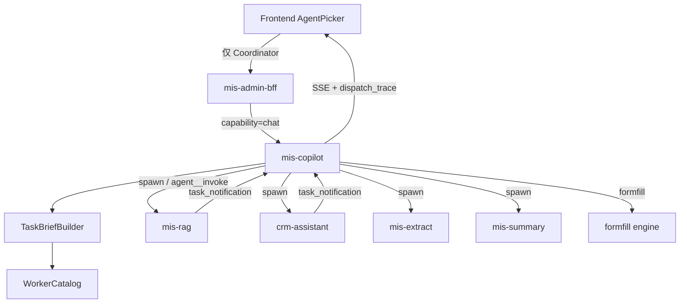

# Coordinator–Worker 协同规范

> 状态：✅ 规范已发布（C0）｜版本：v1.0｜日期：2026-08-01  
> 决策依据：[adr.md](adr.md)  
> 产品需求：[prd.md](prd.md)  
> 架构说明：[architecture.md](architecture.md)  
> 本目录：[README.md](README.md)  
> 实现基线：`mis-copilot` + `agent__invoke`（将按本规范分期升级为 OH 语义适配层）

## 1. 目标与非目标

### 1.1 目标

- 前端对话只选择 **一个 Coordinator**；复杂任务由其自动调度 Worker 完成。
- 对齐 OpenHarness Coordinator / Worker（Swarm）语义：独立上下文、任务委派、结果汇总。
- 作为后续 AI 业务扩展基座：新域以注册 Worker 接入，不改用户侧「选智能体」模型。

### 1.2 非目标（本规范明确不做）

- 用 OH 默认 subprocess coding teammate 跑 MIS 业务 Worker
- Worker 互相无限调度（默认 `max_depth=1`）
- 用平台 `AgentRouter` 替换管理台对话内调度
- Coordinator 绕过 Java API / 权限写业务库
- 首版上线完整 DAG 工作流引擎

## 2. 角色与分层

### 2.1 角色

| 角色 | Agent 配置 | 用户可选 | 职责 |
|------|------------|----------|------|
| Coordinator 模式 | 默认将 **`mis-copilot` 配置为 `role: coordinator`**（`agent_id` 不变） | 是 | 持有全局会话；意图识别；组装 TaskBrief；spawn Worker；汇总回复；失败降级 |
| Worker 模式 | `mis-rag` / `crm-assistant` / `mis-extract` / `mis-summary` 等（`role: worker`） | 否 | 单一专长执行；独立 QueryEngine / 工具 / 模型；不可再 spawn 其他 Agent |
| Engine | `formfill__*` | 否 | 填单引擎（工具，非对话 Worker） |

> 说明：Coordinator / Worker 是**运行模式**，不是固定等于某个名字。平台默认对话入口使用已配置为 Coordinator 模式的 `mis-copilot`；其他 Agent 也可按同样方式配置为 Coordinator（产品默认仍只向用户暴露一个）。

### 2.2 与执行范式的关系

```text
Coordinator–Worker     ← 上层调度架构（本规范）
        │
        ▼
QueryEngine 循环       ← 下层执行（ReAct 式 tool-use loop，可嵌在 Coordinator 与 Worker 内）
```

## 3. 架构与数据流



### 3.1 入口边界

| 入口 | 行为 |
|------|------|
| 管理台对话 / Copilot | 固定走已配置为 Coordinator 模式的 Agent（`capability=chat` → `mis-copilot`） |
| 专用工作台页（`/ai/extract` `/ai/summary` `/ai/rag` 等） | 允许 BFF **直连**对应 Worker（避免双重 LLM）；**不**称为「选择智能体」 |
| 企微等入站渠道 | 可用 `AgentRouter` 选入口 Agent；一旦进入对话调度语义，委派协议仍遵守本规范 |

## 4. 上下文分发与隔离

### 4.1 持有边界

| 层级 | 持有 | 不得持有 |
|------|------|----------|
| Coordinator 会话 | 多轮对话、完整 page_context、dispatch_trace、用户身份 | Worker 内部逐步工具轨迹（除非摘要回传） |
| Worker 会话 | 本次 TaskBrief + 自身 memory/skills/MCP | Coordinator 全局历史；其他 Worker 上下文 |

**硬规则（对齐 OpenHarness Writing Worker Prompts）：**

1. Workers **不能**看见 Coordinator 与用户的完整对话。
2. 每次委派的 `prompt` / `content` 必须是 **自包含、经综合的 TaskBrief**。
3. 禁止懒委托：「根据你的发现…」「帮我查一下」且无具体目标/输入。
4. 必须包含 **purpose**（结果用途），便于 Worker 校准深度。
5. Coordinator 面向用户转述结果；不对 Worker「致谢」或假装对话。

### 4.2 TaskBrief 结构

```yaml
task_brief:
  goal: string                 # 完整可执行目标
  purpose: string              # 结果用途（直接回复用户 / 供填表 / 供下一步）
  inputs:
    user_question: string
    page_context_slice: object # 脱敏切片，禁止整页倾倒未脱敏数据
    attachments_text: string   # 可选
  constraints: string[]        # 如禁止臆造、无命中须说明
  identity:                    # 供 MCP/权限，不进入用户可见原文堆砌
    userId: string
    tenantId: string
    channel: string
  expected_output: string      # 如 answer+citations / 结构化字段列表
```

工具层（C1+）应对缺失 `goal` / `user_question`（或等价 content）的委派返回错误，要求 Coordinator 重写 Brief。

### 4.3 Continue vs Spawn（规范要求，C5 落地）

| 情况 | 机制 | 原因 |
|------|------|------|
| 同一 Worker 上下文高度重叠（纠错、补问） | Continue（`send_message`） | 保留错误与文件/检索上下文 |
| 任务变窄、验尸、换思路、无关新任务 | Spawn fresh | 避免噪声与错误锚定 |
| 首版（C0–C4） | 仅 Spawn（每次新 child session） | 与现网 `agent__invoke` 一致 |

## 5. 意图与委派表

| 意图 | Worker / 工具 | 示例 |
|------|---------------|------|
| `rag` | `mis-rag` | 「制度里差旅报销怎么规定」 |
| `crm` | `crm-assistant` | 「查会员积分 / 画像」 |
| `extract` | `mis-extract` | 「从这段话抽出表单字段」 |
| `summary` | `mis-summary` | 「总结这份审批意见」 |
| `formfill` | `formfill__execute` 等 | 「帮我填采购单」 |
| `chitchat` | 无（Coordinator 直接答） | 概念解释、写通知草稿 |
| `unknown` | Coordinator 澄清或保守直答 | 意图不清时不瞎调 Worker |

多目标（如「先查制度再总结」）：Coordinator **串行**综合后再派下一 Worker（首版）；并行 spawn 见 §10 C5。

## 6. 工具与适配层

### 6.1 过渡期（现网）

- 工具名：`agent__invoke`
- 入参：`agent_id`、`content`（应渲染自 TaskBrief）、`metadata`
- 治理：`INVOKE_AGENT_WHITELIST`、`INVOKE_AGENT_MAX_DEPTH=1`、`INVOKE_AGENT_TIMEOUT_SECONDS`
- 禁止目标：`mis-copilot`（不可委托调度器自身）

### 6.2 目标态（OH 语义适配）

| 能力 | 工具 / 组件 | 说明 |
|------|-------------|------|
| Spawn | `agent`（可与 `agent__invoke` 双名过渡） | `subagent_type` / `agent_id` → WorkerCatalog |
| 结果信封 | task-notification（JSON 等价亦可） | 见 §7 |
| 团队注册 | WorkerCatalog +（可选）OH `TeamRegistry` | 由 `configs/agents/*/agent.yaml` 生成 |
| 续聊 / 停止 | `send_message` / `task_stop` | C5 |
| FormFill | `formfill__*` | 保持独立工具面 |

**Adapter 原则：** 对外像 OpenHarness Coordinator；对内 in-process 调用平台 Worker Runtime，透传 MIS 身份。

## 7. 结果信封与可观测

### 7.1 task_notification（逻辑字段）

| 字段 | 说明 |
|------|------|
| `task_id` | 本次委派 ID |
| `worker_id` | 如 `mis-rag` |
| `status` | `completed` / `failed` / `killed` / `timeout` |
| `summary` | 短摘要 |
| `result` | Worker 最终文本或结构化摘要 |
| `usage` | tokens / tool_uses / duration_ms（可选） |
| `latency_ms` | 端到端耗时 |

OH XML 形可与 JSON 互转；平台事件流优先 JSON。

### 7.2 dispatch_trace（对前端）

对话响应 metadata 或事件中附带：

```json
{
  "dispatch_trace": [
    {
      "intent": "rag",
      "worker_id": "mis-rag",
      "tool": "agent__invoke",
      "status": "completed",
      "latency_ms": 1200
    }
  ]
}
```

前端可展示「已调用知识库」类轻提示，**不**暴露 Worker 选择器。

## 8. 安全与 HITL

- 身份：Worker 继承 Coordinator 侧 MIS JWT / 透传身份；MCP 调用不得伪造用户。
- 权限：Worker 仅使用自身 `allowed_tools`；白名单外 agent_id 拒绝。
- 数据：`page_context_slice` 必须脱敏；禁止臆造 CRM/业务数据；MCP 不可达时返回友好错误。
- 写操作：填单提交、业务变更必须 Human-in-the-loop；Worker 默认只读或返回待确认草案。
- 深度：Worker 不得再 `agent__invoke` / spawn 其他 Agent。

## 9. 扩展基座：Worker 接入清单

后续业务（HR / 财务 / 审批等）默认路径：**注册 Worker，不新增用户可选主智能体。**

### 9.1 接入最少交付

1. **元数据**：`agent_id`、display_name、`capabilities[]`、`when_to_use`（供 Coordinator / IntentGate）
2. **配置目录**：`configs/agents/<agent_id>/`（runtime / prompts / model）
3. **输入契约**：接受的 TaskBrief 字段；是否需要 page_context
4. **输出契约**：纯文本 / JSON / citations；错误语义
5. **权限**：permission、MCP、数据范围；禁止事项
6. **安全级别**：只读 / 需 HITL 的写
7. **SLO**：超时、降级文案
8. **评测**：≥5 条黄金问句（期望 `worker_id` + 关键断言）
9. **白名单**：加入 `INVOKE_AGENT_WHITELIST`（或 Catalog 等价配置）

### 9.2 Skill / MCP / Worker 边界

| 形态 | 何时用 |
|------|--------|
| Skill | 可复用的知识包 / 短指令，不需要独立会话人设 |
| MCP 工具 | 对接外部/业务 API 的标准工具面 |
| Worker | 需要独立系统提示、模型、多步循环或域隔离时 |

### 9.3 扩展边界

- **默认仅向用户暴露一个平台 Coordinator**：将 `mis-copilot` 配置为 Coordinator 模式。第二套对外 Coordinator 须另开 ADR（合规/品牌强制时）。
- 专用 UI 页可直连新 Worker，但不替代对话入口基座。
- 渠道可复用同一 WorkerCatalog；委派协议不得分叉。

## 10. 分期实现（附录）

| 阶段 | 内容 | 验收 |
|------|------|------|
| **C0** | 本 ADR + Spec | 文档评审通过 |
| **C1** | TaskBrief 渲染校验；task_notification；`dispatch_trace` | 黄金问句可观测正确 Worker |
| **C2** | 按 OH 纪律重写 `mis-copilot` system prompt；WorkerCatalog 初版 | 懒委托下降 |
| **C3** | Catalog ↔ 工具 schema 动态同步；修正虚假 `multi_agent` 能力描述 | 与 YAML 一致 |
| **C4** | 前端选择器仅 Coordinator；展示调度状态 | 用户不可选 Worker |
| **C5** | `send_message` / 并行 spawn / `task_stop` / 超时熔断 | 多步任务稳定 |

## 11. 验收用例（C0 文档级 / C1+ 自动化）

| # | 场景 | 期望 |
|---|------|------|
| A1 | 「差旅报销制度怎么规定」 | 调度 `mis-rag`；回复含依据或明确无命中 |
| A2 | 「查一下会员积分」 | 调度 `crm-assistant`；MCP 不可达时不臆造数据 |
| A3 | 「帮我写一则放假通知」 | **不**调度 Worker；Coordinator 直接答 |
| A4 | 「从这段话抽出姓名和部门」 | 调度 `mis-extract` |
| A5 | 「总结下面审批意见」 | 调度 `mis-summary` |
| A6 | 新增 Worker 只改 Catalog/白名单/YAML | **不**改前端 Agent 选择器即可被对话调度（C3/C4） |
| A7 | Worker 尝试再次委托 | 被深度/白名单拒绝 |

## 12. 配置项

| 配置 | 含义 | 默认 |
|------|------|------|
| `INVOKE_AGENT_WHITELIST` | 可委派 Worker 列表 | mis-extract, mis-summary, mis-rag, crm-assistant |
| `INVOKE_AGENT_MAX_DEPTH` | 最大委派深度 | 1 |
| `INVOKE_AGENT_TIMEOUT_SECONDS` | 单 Worker 超时 | 120 |

后续可用 Catalog 配置替代部分环境变量，但语义不变。

**运营控制台配置面：** 上述项及 `agent.role` / Worker Catalog 元数据（`when_to_use`、capabilities、输入输出契约等）须可在智能体运营控制台编辑，见 [`../agent-ops-console/ui.md`](../agent-ops-console/ui.md) **#10 调度配置** 与 [`../agent-ops-console/spec.md`](../agent-ops-console/spec.md) §3.8。

## 13. 参考

- OpenHarness Subagents（官方）：委派使用自包含 prompt；默认无共享会话；`maxSubagentDepth` 默认 1
- 本机包：`openharness.coordinator.coordinator_mode`（Writing Worker Prompts / task-notification）
- 现网：`docs/ai-fusion/README.md` Copilot 调度边界
- 运行时抽象：`agent/ai-platform/backend/src/runtime/base.py`、`factory.py`、`registry.py`

## 14. FAQ（架构澄清）

### 14.1 Coordinator–Worker 能否切换运行时？

**分层结论：模式可与运行时解耦；现网实现仍绑在 OpenHarness 工具面。**

| 层级 | 是否绑死 openharness | 说明 |
|------|----------------------|------|
| 角色与契约（Coordinator / Worker、TaskBrief、WorkerCatalog、task_notification） | 否 | 平台级协议，应对任意实现 `AgentRuntime` 的运行时开放 |
| 单 Agent 执行循环 | 按 Agent 配置 | `runtime.type`：`openharness`（默认）\| `custom` \| `langgraph`（校验已支持；后两者工厂尚未落地） |
| 委派实现（现网 `agent__invoke`） | **是（现状）** | 注册在 OH `ToolRegistry`，经 QueryEngine tool-use 触发 |

因此：

1. **可以为不同 Agent 配不同 runtime.type**（Worker 用 openharness、未来某 Worker 用 langgraph），只要该运行时实现 `AgentRuntime` 并注册工厂。
2. **Coordinator 要换运行时**，新运行时必须满足 `RuntimeCapabilities.multi_agent=true`，并实现与本规范等价的委派面（spawn / 结果信封），或由**平台级 Coordinator Middleware**在 runtime 之外统一提供委派（推荐长期形态，真正做到「换运行时不丢调度」）。
3. **禁止假设**：仅改 `runtime.type` 且无 multi_agent 实现，就会自动获得 Coordinator–Worker。

### 14.2 Coordinator 是否是动态规划？

**是动态、多轮再规划；不是一次性静态 DAG 引擎。**

```text
用户轮次 N
  → Coordinator QueryEngine 循环（ReAct 式，受 maxSteps 约束）
       → 可多次 spawn Worker / 直接回答
  → 收到 task_notification
  → 同一轮或下一轮：综合结果后决定是否再派（第二轮规划）
```

| 能力 | 首版（C0–C4） | 目标态（C5+） |
|------|---------------|---------------|
| 根据上轮 Worker 结果再派下一 Worker | ✅（串行综合后 spawn） | ✅ |
| 同轮并行多个 Worker | ❌ | ✅ |
| Continue 同一 Worker（send_message） | ❌（每次新 session） | ✅ |
| 事先写出完整 Plan 再逐步 Execute 的独立 Plan 模式 | ❌（非默认） | 可选（与 Coordinator 正交，可用 OH EnterPlanMode 类能力，另开 ADR） |

要点：Coordinator 的「规划」嵌在 **对话轮次 + 工具循环** 里，属于**反应式再规划**；与下层 Worker 内部的 ReAct 循环是两层，不要混为一谈。

### 14.3 如何在现有框架内指定某 Agent 按 Coordinator 模式运作？

**现网（配置约定，无独立 role 字段）：** 同时满足以下条件即视为 Coordinator：

1. `runtime.allowed_tools` 包含委派工具（现网为 `agent__invoke`；目标态为 `agent` / 等价 spawn）
2. system prompt 含调度纪律与意图→Worker 表（见 `mis-copilot`）
3. 委派目标仅限 WorkerCatalog / `INVOKE_AGENT_WHITELIST`
4. 自身 **不在** 被委派白名单中（禁止自调 / 被其他 Worker 调）
5. 建议 `routing.enabled: false`（管理台由 BFF 显式 `agent_id` 调用，不进通用 AgentRouter 候选）

参考实现：`configs/agents/mis-copilot/`。

**规范目标态（C2/C3，配置显式化）：** 在 `agent.yaml` 增加：

```yaml
agent:
  name: my-domain-coordinator
  role: coordinator   # coordinator | worker（默认 worker）
  # …
```

平台行为：

| `role` | 平台注入 |
|--------|----------|
| `coordinator` | Coordinator system 纪律；注册 WorkerCatalog 委派工具；强制 TaskBrief 校验；禁止被列入可委派白名单 |
| `worker` | 剥离 spawn 工具；`max_depth` 检查；仅专长工具 / MCP / skill |

同一套运行时抽象下：**任意 Agent 只要 `role: coordinator` + 满足 multi_agent 委派面，即可按 Coordinator 模式运作**；不强制只有 `mis-copilot` 一个（但产品默认仍只向用户暴露一个平台 Coordinator，见 §9.3）。


### 14.4 派发 Worker 时是否有上下文裁剪？

**规范要求：有（且必须）。现网实现：尚未强制，主要靠 Coordinator LLM「综合进 content」。**

| 层级 | 现状 | 目标（C1+） |
|------|------|-------------|
| Coordinator → Worker 对话历史 | **不传递**全量多轮 transcript（每次新建 child session） | 保持隔离 |
| 任务正文 | LLM 写入 `agent__invoke.content`；prompt 要求自包含，但**无结构化校验** | `TaskBriefBuilder` 渲染 + 缺字段拒委派 |
| `page_context` | 可在 metadata 透传；**不会自动进入**子 Agent LLM 上下文（运行时目前主要认 `attachments`） | 仅注入 `page_context_slice`（相关字段脱敏切片），禁止整页倾倒 |
| 裁剪策略 | 无独立裁剪/重排模块 | 按 Worker 输入契约选字段；超长截断 + 摘要；敏感字段剔除 |

**裁剪原则（规范硬约束）：**

1. **只传任务分片，不传全局会话** — Worker 拿不到 Coordinator 与用户的完整聊天记录。
2. **只传与本次目标相关的上下文** — `user_question` + 必要 `page_context_slice` + 约束 + 期望输出。
3. **禁止懒委托与整包转发** — 不得把整段历史或未脱敏 page_context 原样塞给 Worker。
4. **由 Coordinator「综合」后再派** — 对齐 OpenHarness Writing Worker Prompts：先理解，再写出短而完整的 TaskBrief。

因此：若问「现在跑起来时有没有自动裁剪模块」→ **还没有（C1 落地）**；若问「架构上是否应该裁剪」→ **必须，且已写入 §4。**
