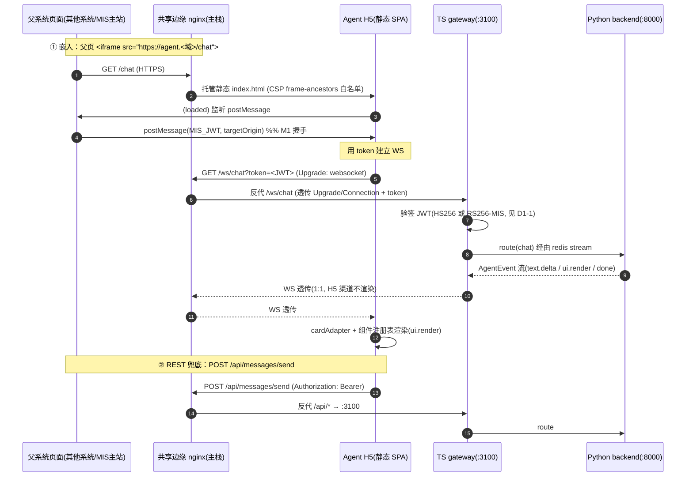
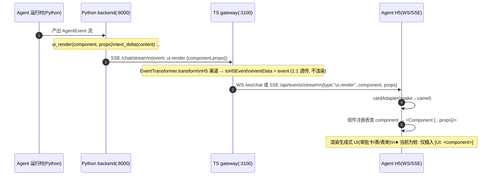
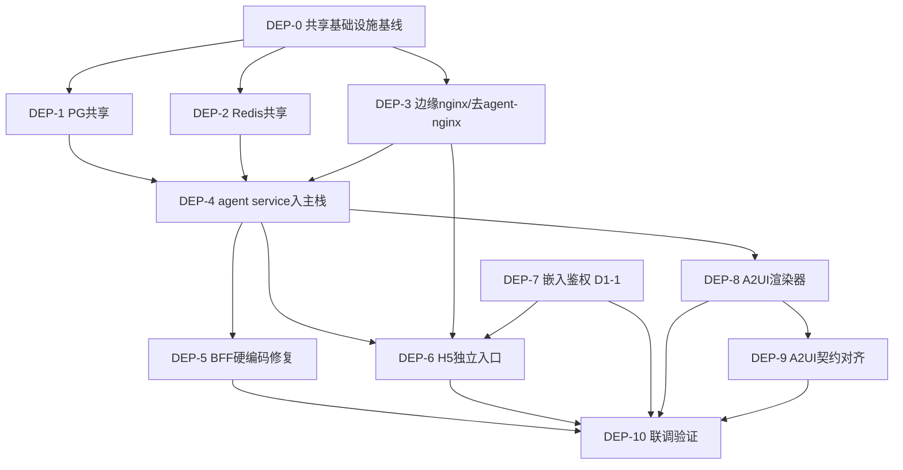

# MIS × ai-platform 融合部署 — 架构决策评审文档

> **文档定位**：架构决策评审（Decision Review），仅设计与分析，**不含实现代码**。
> **作者**：架构师 高见远（software-architect）
> **主理人**：齐活林（team-lead）
> **日期**：2026-07（融合收口阶段）
> **范围**：容器/部署层面的 MIS 主项目 与 `agent/ai-platform` 融合。承接已交付的「阶段5 后端扩展 T-ext/T-sum/T-stream」与既有 `docs/ai-fusion/` 14 份文档。
> **输入决策点**（用户拍板/疑问）：① Agent H5 纳入主部署 + 独立入口 + iframe 嵌入；② A2UI 运作机制 与 TS gateway 关系；③ Postgres 共享、Redis 共享、agent 不再要 nginx。

---

## 0. 背景与已核实事实（先读，所有结论基于此）

### 0.1 两条既存的 AI 集成通路（关键澄清，避免混淆）

融合前项目里有**两条互不相同的 AI 链路**，目标都最终打到 ai-platform 的 Python 后端（`:8000`），但入口、协议、鉴权完全不同：

| 通路 | 调用链 | 入口/协议 | 鉴权 | 落地状态 |
|---|---|---|---|---|
| **通路 A（MIS 融合）** | `mis-admin-web` → `mis-gateway(8080)` → `mis-admin-bff` → **Python backend(:8000)** | REST + SSE（BFF `AiProxyController`，`sse-enabled` 开关） | MIS JWT（RS256）→ BFF 头注入 | 阶段5 已交付（QA=NoOne） |
| **通路 B（Agent H5/Bot）** | **Agent H5** → **TS gateway(:3100)** → Python backend(:8000) | **WebSocket(`/ws/chat`)** + REST(`/api/messages/send`) + SSE(`/api/events/stream`)；channel 事件流 | **网关自有 HS256 JWT**（自有 issuer，与 MIS JWT 解耦） | H5 MVP + A2UI 契约已定义，H5 渲染侧为桩 |

> **结论性认知**：`mis-gateway`（Java, 8080）是「通路 A」的入口；**TS gateway（Fastify, 3100）是「通路 B」的入口**，承载 H5/Bot 的 WebSocket、channel 事件变换（`EventTransformer`）、自有鉴权。**两者不是同一个东西**。下文「独立入口」「/api /ws 指向谁」均指通路 B 的 H5。

### 0.2 已核实代码/配置事实（决定可行性边界）

| # | 事实 | 来源 | 对决策的影响 |
|---|---|---|---|
| F1 | ai-platform 独立栈自带 `postgres(aiplatform/ai_platform)`、`redis`（**未设 db index → 默认 db 0**）、`qdrant`、`embedding`、`outbound-proxy(Squid,3128)`、`gateway(3100)`、`backend(8000)`、`frontend(H5,3000)`、`nginx(80)` | `agent/ai-platform/infra/docker-compose.yml` | 融合须消掉独立 PG/Redis/nginx |
| F2 | H5 约定 `VITE_API_BASE_URL=/api`、`VITE_WS_BASE_URL=/ws`（**相对路径，构建期 bake 进静态包**） | 同上 | 融合后 H5 无需改代码，仅改其前置反代即可 |
| F3 | 主 MIS 栈：`postgres(postgres/postgres)`、`redis:7.2`、`nacos`、`minio`；`mis-gateway(8080)`/`mis-audit`/`mis-auth`；`DB_HOST=postgres`、`REDIS_HOST=redis`（服务名） | `deploy/docker-compose.dev.yml`、`deploy/docker-compose.stack.yml` | 共享 PG/Redis 用「同一实例 + 不同库/db index」 |
| F4 | **BFF 硬编码坑**：`backend/mis-admin-bff/.../application.yml` 中 `ai-platform.base-url: http://localhost:8000` + `sse-enabled: false`，**未进 Nacos** | 读码确认 | 容器环境 `localhost:8000` 必崩；须改为服务名 `http://ai-platform-backend:8000` 并迁入 Nacos + 生产置 `sse-enabled=true`（**风险 R1**） |
| F5 | 后端统一事件协议 `AgentEventType` 含 `UI_RENDER="ui.render"`，携带 `component:str` + `props:dict`（`AgentEvent.ui_render(component, props)`） | `agent/ai-platform/backend/src/runtime/events.py` | A2UI 契约真源已定义 |
| F6 | TS gateway `EventTransformer`：H5 渠道 `ui.render` **原样透传**（`toH5Event` 返回 `eventData: event`，不渲染）；Bot 渠道 `ui.render` 降级为 `template_card` | `agent/ai-platform/gateway/src/router/EventTransformer.ts` | gateway 对 A2UI = 透明承载，不渲染 |
| F7 | gateway 路由：`/ws/chat`(WS, **需鉴权**, token 取自 `?token=` 查询或 `Authorization` 头)、`/api/messages/send`(REST 兜底)、`/api/events/stream`(SSE)、`/health*`、`/auth/wecom/*`；CORS `credentials:true` + 允许 `Authorization/X-Trace-Id/X-Channel` 头 | `agent/ai-platform/gateway/src/server.ts` | 决定嵌入鉴权与跨域策略 |
| F8 | gateway 鉴权：本地 **HS256** 验签（`jwtSecret`+`jwtIssuer`），`JwtClaims.iss` 强校验；`extractToken` 支持 `Bearer` 头与 `?token=` 查询；`PUBLIC_PATHS` 含 `/auth/login`、`/auth/refresh`、`/auth/wecom/*` | `agent/ai-platform/gateway/src/middleware/auth.ts` | **gateway 当前不接受 MIS JWT（RS256）**——嵌入鉴权模型的核心待决项 |
| F9 | H5 `useChat` 对 `ui.render` **仅插入占位文本 `[UI: <component>]`**（渲染为桩）；`cardAdapter` 负责 snake→camel 转换；`useAuth` 走 H5 自有 `/auth/login` 或企微 OAuth | `agent/ai-platform/frontend/src/hooks/useChat.ts`、`utils/cardAdapter.ts`、`hooks/useAuth.ts` | **A2UI 消费侧渲染器（component registry）尚未实现**——决策二落地缺口 |
| F10 | 迁移工具分工：MIS 用 **Flyway**（Java，管 `mis_platform` 等）；ai-platform 用 **Alembic**（Python，管其 schema） | 既有文档 + 读码 | PG 共享须「同实例 + 异库 + 异迁移工具」隔离 |

---

## 1. 决策一：Agent H5 纳入主部署 + 独立入口 + iframe 嵌入

### 【结论】

**可行，且推荐采用「主栈新增共享边缘 nginx + H5 作为主栈内独立 service + 独立子域/路径入口」的方案。**
- H5 作为主部署中的一个 service 构建/运行，但其**静态资源与前置于一个共享边缘 nginx**（而非 mis-gateway，也非 ai-platform 原 nginx）；
- H5 拥有**独立、稳定的入口 URL**（建议子域 `agent.<主域>` 或主域路径 `/agent/`），既能由 MIS 主站以 iframe 内嵌，也能被其他系统页面以 iframe 嵌入；
- 融合后 H5 的 `/api`、`/ws` **指向独立的 TS gateway（:3100），不指向 mis-gateway（:8080）**——因为 H5 走的是「通路 B」（WebSocket + channel 事件 + 网关自有鉴权），mis-gateway 只服务「通路 A」；
- 嵌入鉴权**推荐 postMessage 握手为主、token 查询参数为兜底**，前提是先解决「TS gateway 不认 MIS JWT」这一阻塞（见待确认项 D1-1）。

### 【推荐方案】

**1.1 H5 在主部署中的形态**
- H5 进入主 `deploy/docker-compose.ai.yml`（叠加层，见决策三 §3.4），与主栈共享同一 Docker 网络，因此可直接以服务名 `ai-platform-backend`、`ai-platform-gateway`、`postgres`、`redis` 互通。
- 生产形态：H5 构建为静态 SPA（`vite build`），由共享边缘 nginx 直接托管静态文件（不再需要 H5 容器常驻反代）。dev 形态可保留 H5 容器（`vite`），但生产建议「构建产出 → 挂载进边缘 nginx」。

**1.2 独立入口（可被 iframe 嵌入）**
- 边缘 nginx 为 H5 提供专属入口，二选一（推荐子域）：
  - **方案 1（推荐）子域**：`agent.<主域>`（如 `agent.mis.local`）→ 边缘 nginx `server_name agent.*` → H5 静态 + `/api`、`/ws` 反代到 TS gateway。父系统嵌入 `<iframe src="https://agent.mis.local/chat?token=...">`。
  - **方案 2 路径**：`https://<主域>/agent/` → 边缘 nginx `location /agent/` → H5 静态（`try_files` 指向 `index.html`），`/agent/api`、`/agent/ws` 反代到 TS gateway。
- **iframe 可嵌入性配置（必须）**：边缘 nginx 对该入口**不要**下发 `X-Frame-Options: DENY`，改为 `Content-Security-Policy: frame-ancestors <可信父域白名单>`（或按需 `*`）；同时为该入口配置 CORS（与 TS gateway 的 `credentials` 配合，`Access-Control-Allow-Origin` 取具体父域、`Allow-Credentials: true`）。
- 同一入口**双重角色**：① 外部系统 iframe `src`；② MIS 主站菜单项/路由内以 iframe 嵌入同一 URL（主站内嵌时 H5 通过父页 postMessage 拿 MIS 登录态，而非重新登录）。

**1.3 /api、/ws 融合后指向谁（核心问题）**
- **指向独立的 TS gateway（:3100），不指向 mis-gateway（:8080）。** 理由：
  - H5 的 `/api` 实际调用 `POST /api/messages/send`、SSE `/api/events/stream`；`/ws` 调用 `GET /ws/chat`（WebSocket）。这些路由**只存在于 TS gateway**（见 F7），mis-gateway 没有、也不应有这些 channel/WS 路由。
  - mis-gateway 是「通路 A」入口（MIS 管理台 → BFF → Python 后端），与 H5 的协议/鉴权完全不同。
- H5 构建期 env 保持 `VITE_API_BASE_URL=/api`、`VITE_WS_BASE_URL=/ws` **不变**（相对路径，避免改代码）；由边缘 nginx 把这两个相对路径反代到 TS gateway（含 WebSocket 的 `Upgrade`/`Connection` 头透传）。
- `通路 A` 与 `通路 B` 在 Python 后端（:8000）汇合，互不干扰。

**1.4 嵌入场景的鉴权模型（重点，待 D1-1 拍板）**
- **现状约束（F8）**：TS gateway 只认**自有 HS256 JWT**（自有 issuer），不认 MIS 的 RS256 JWT（`iss=mis-platform`）。H5 当前通过自有 `/auth/login` 拿网关 JWT。
- 跨系统 iframe 嵌入时，父系统无法共享 MIS cookie（第三方 cookie 受限），需把「可被 TS gateway 接受的令牌」交给 H5。三种模式：

| 模式 | 机制 | 安全性 | 工程成本 | 推荐度 |
|---|---|---|---|---|
| **M1 postMessage 握手（推荐）** | 父页加载 H5 后，经 `postMessage(token, targetOrigin)` 推令牌；H5 监听后在内部用该 token 建 WS（`?token=`） | 高（不在 URL，可校验 `event.origin`） | 中（H5 需加 postMessage 监听 + 同源 origin 白名单） | ⭐⭐⭐ |
| **M2 token 查询参数（兜底）** | `<iframe src=".../chat?token=<JWT>">`；复用 gateway 已有的 `?token=` 提取（F8） | 中（token 在 URL，怕日志/referer 泄露；需短时/一次性） | 低（零改动，gateway 已支持） | ⭐⭐（仅作兜底） |
| **M3 共享 cookie** | 同 SSO 域下 cookie 共享 | 依赖同域；跨域不可行 | 低（但跨系统基本不可用） | ⭐（不推荐跨系统） |

- **前置阻塞（D1-1）**：上述三种模式都要求「TS gateway 接受的令牌」可由父系统签发。若父系统是 MIS，则最干净的做法是 **TS gateway 增加对 MIS JWT（RS256, `iss=mis-platform`）的信任**（加载 MIS 公钥，映射 `userId` 等到 `JwtClaims`），与 `identity-jwt.md` 的方向一致。否则需建「网关侧 SSO 桥」由父系统跳转到网关 SSO 换发网关 JWT——成本更高。**该决策直接决定嵌入鉴权是否可行**，必须优先拍板。

### 【备选方案】

- **备选 1（H5 挂到 mis-gateway 下做静态+反代）**：扩展 `mis-gateway`（Java API 网关）兼做 H5 静态托管 + `/api`、`/ws` 反代。**不推荐**——Java 网关非为静态文件/WebSocket 反代设计，且会把「通路 B」的 channel 事件语义耦合进 MIS 网关，违反"AI 层与 MIS 解耦"原则（见架构 §0 复用约束）。
- **备选 2（H5 自带轻量静态服务，/api /ws 经 mis-gateway→TS gateway）**：H5 自起轻量静态服务（如 vite preview/nginx-alpine 仅静态），`/api`、`/ws` 先到 mis-gateway 再由 mis-gateway 反代到 TS gateway。**不推荐**——mis-gateway 需新增 agent 路由与 WS 透传，耦合 MIS 网关与 agent 网关；且 mis-gateway 不持有 agent 鉴权上下文。仅在"坚决不要任何新边缘 nginx"时考虑。
- **备选 3（保留 ai-platform 原 nginx 但改端口）**：把原 nginx 从 80 改到其它端口避免冲突。**不推荐**——违反用户"agent 不再要 nginx"决策，且多一个独立反代组件增加运维面。

### 【数据流图：iframe 嵌入 + 独立入口 + 鉴权】



### 【待确认项（决策一）】

- **D1-1（阻塞）**：TS gateway 鉴权是否升级为「信任 MIS JWT（RS256, `iss=mis-platform`，加载 MIS 公钥）」？还是保留自有 HS256 + 建 SSO 桥？——**决定嵌入鉴权是否可行**。
- **D1-2**：独立入口用**子域**（`agent.<域>`）还是**路径**（`/agent/`）？涉及 DNS/证书与 MIS 主站路由约定。
- **D1-3**：iframe 可嵌入的**可信父域白名单**（`frame-ancestors` / postMessage `targetOrigin`）由谁维护、是否随租户变化？
- **D1-4**：H5 生产形态——静态产出挂载进边缘 nginx（推荐，无 H5 常驻容器），还是保留 H5 容器由边缘 nginx 反代？
- **D1-5**：跨系统嵌入时，若需 MIS 登录态，是否允许 H5 在「无 token」时回退到自有登录页（`/auth/login`）？

---

## 2. 决策二：A2UI 运作机制 与 TS gateway 关系

### 【结论】

- **A2UI（Agent-to-UI / 生成式 UI）机制已端到端定义且可行**：agent 后端在统一事件流中产出 `ui.render` 事件（`{component, props}` 结构化 UI 描述 JSON），H5 侧按 `component` 映射到 React 组件并以 `props` 渲染。
- **TS gateway 与 A2UI 的关系 = 透明承载（协议归一化 + 能力感知降级），不渲染**：对 H5 渠道，`EventTransformer.toH5Event` 把 `ui.render` 事件 **原样透传**（`eventData: event`，不解析、不渲染）；仅对 Bot 渠道才把 `ui.render` 降级为 `template_card`。A2UI 契约经由 gateway 与 SSE/WS **1:1 透明承载**，与既有文本/工具事件同一管道。
- **关键落地缺口**：H5 消费侧的**真实渲染器（component registry）尚未实现**（当前 `useChat` 仅插入 `[UI: <component>]` 占位文本，见 F9）。A2UI 要"真渲染"必须先补这一层。

### 【推荐方案】

**2.1 A2UI 运作机制（后端产出 → 前端渲染）**

1. **后端产出结构化 UI 描述**：agent 在生成过程中，调用 `AgentEvent.ui_render(component: str, props: dict)`（F5）发出 `ui.render` 事件。`component` 是约定好的组件名（如 `approval-card`、`data-table`、`form-sheet`），`props` 是传给该组件的纯数据 JSON（字段值、选项、来源引用等）。这与「文本」是两种不同的产物。
2. **与普通文本/工具调用的区别**：

| 事件类型 | 含义 | H5 处理 | 是否"生成式 UI" |
|---|---|---|---|
| `text.delta` | 文本增量（流式） | 累积渲染为 Markdown | 否（文本） |
| `tool.call` / `tool.result` | 工具调用/结果（内部） | 通常展示为状态/调试信息，或折叠 | 否（过程） |
| **`ui.render`** | **结构化组件描述** | **按 `component`→React 组件映射，用 `props` 渲染** | **是（A2UI）** |
| `approval.request` | 人机审批请求 | 渲染审批卡片 + 操作 | 半（结构化动作） |

3. **H5 渲染（目标形态，当前为桩）**：H5 维护一个 **组件注册表** `Map<componentName, React.ComponentType>`；收到 `ui.render` → `cardAdapter` 做 snake→camel 转换 → 查注册表得到组件 → `<Component {...props} />`。组件本身仍是 H5 自有受控组件（受 shadcn/Tailwind 约束），保证样式与安全可控。**后端只给"描述"，前端决定"怎么画"**——这是 A2UI 与"后端拼 HTML"的本质区别（安全、可控、可降级）。

**2.2 A2UI 与 TS gateway 的关系（透明承载，不渲染）**

- **gateway 是「协议归一化 + 能力感知降级」层，不是渲染层**：
  - 对 H5 渠道：`EventTransformer.transform` → `canRender(event.type)` 为真 → `toH5Event(event)` → 返回 `eventData: event`，**整个 `AgentEvent`（含 `component`/`props`）原样下发**，gateway 不解析 `props`、不渲染（F6）。
  - 对 Bot 渠道（企微）：同一 `ui.render` 事件无法在企微原生消息里"渲染组件"，`EventTransformer` 调 `BotEventMapper.mapUIRender` 降级为 `template_card`（能力感知降级）——这正是 gateway 存在价值的体现：**同一份 A2UI 契约，按渠道能力差异化落地**。
- **gateway 如何"透明承载" A2UI 契约（参考既有 SSE 1:1 透传设计）**：gateway 把后端 SSE 事件 → 经 `MessageRouter`/`redisStream` → 通过 WS（`/ws/chat`）或 SSE（`/api/events/stream`）下发给 H5。**`ui.render` 事件与 `text.delta` 走完全相同的序列化/透传管道**，不需要 gateway 做"事件识别/路由分流"——"区分 text-delta 与 ui-descriptor"的责任在**H5 渲染层（组件注册表）**，不在 gateway。gateway 仅在**跨渠道降级**时才需要"识别"事件类型（Bot 侧）。
- **结论**：TS gateway 独立部署（用户决策）与 A2UI 透明承载**完全兼容**——gateway 独立与否都不影响 A2UI 契约透传，因为它的职责就是"透传事件流 + 按渠道降级"，与是否渲染无关。

**2.3 A2UI 契约建议（供工程师实现组件注册表时对齐）**
- `component` 命名约定：语义化、版本无关（如 `approval-card@1`、`data-table`、`form-sheet`）；后端与 H5 注册表**双向登记**。
- `props` 约定：纯 JSON、可被 `zod` 校验；含 `data`、`meta`（如 `source` 引用）、`actions`（可选回调声明，如 `onApprove` 由 H5 绑定到 `approval.request` 响应）。
- 安全：H5 渲染前对 `props` 做**白名单字段校验 + 防注入**（尤其 `props` 含用户数据/HTML 时禁用 `dangerouslySetInnerHTML`）。

### 【备选方案】

- **备选 1（后端直出 HTML/组件树）**：backend 直接返回 HTML 片段，前端 `innerHTML`。**不推荐**——XSS 风险高、样式不可控、破坏"前端决定渲染"的解耦。
- **备选 2（gateway 做 A2UI 事件识别 + 渲染沉降）**：gateway 解析 `ui.render` 并做部分渲染/布局。****不推荐**——gateway 应是瘦透传层（F6 已证明 H5 透传即可），渲染沉降会破坏"协议归一化"定位、增加 gateway 与前端耦合。

### 【数据流图：A2UI（backend → TS gateway → H5）】



### 【待确认项（决策二）】

- **D2-1（落地缺口）**：H5 的 **A2UI 组件注册表（真实渲染器）尚未实现**（F9 为桩）。是否在本融合阶段一并补？建议列为融合部署的必交付项（否则 A2UI "有了契约却看不到"）。
- **D2-2**：`component` 组件目录与版本策略（首期支持哪些组件：审批卡/数据表/表单？），需与后端 agent 的 `ui_render` 产出对齐双向登记。
- **D2-3**：`ui.render` 与 `approval.request` 的关系——审批类 UI 是 `ui.render` 的一种（`approval-card`）还是独立事件？建议**统一为 `ui.render` 承载可视组件，`approval.request` 仅驱动"需要审批"的业务状态**，由 H5 把两者关联渲染。
- **D2-4**：A2UI 事件在 SSE 端点（`/api/events/stream`）与 WS 端点（`/ws/chat`）是否同构？需保证两条下发通道的 `ui.render` payload 一致（建议在 gateway 层统一序列化）。

---

## 3. 决策三：Postgres 共享 / Redis 共享 / 去除 agent nginx

> 用户已拍板：Postgres 共享、Redis 共享、agent 不再要 nginx。本节给出**具体融合编排方案**。

### 【结论】

- **Postgres**：不新增 PG 实例；在主 MIS PG 实例（用户 `postgres`）中**新增独立库 `ai_platform`**，由专属角色 `aiplatform` 拥有；**Flyway 管 `mis_platform` 等、Alembic 管 `ai_platform`**，两工具操作不同库 → 零冲突。
- **Redis**：共用主 MIS Redis 实例，但 agent 改用**独立 db index（建议 db 2）**；键加命名空间前缀 `aip:`（MIS 侧维持 `mis:`），双层防护杜绝 key 冲突。
- **去除 agent nginx**：删除 ai-platform 独立 nginx（:80）；其"H5 静态 + `/api` + `/ws` 反代"职责**移交给主栈新增的「共享边缘 nginx」**（候选 (b)）——该边缘 nginx 不是 agent 的，而是整个主栈的公共入口，既服务 H5 独立入口（决策一），也统一对外。
- **融合后服务清单**：`qdrant`/`embedding`/`outbound-proxy`/`gateway`/`backend`/`frontend`（H5）以 service 形态进入主 `deploy/docker-compose.ai.yml`，与主栈共享网络；`postgres`/`redis` 复用主栈实例；ai-platform 原 `nginx`/`postgres`/`redis` 三个 service **删除**。

### 3.1 Postgres 共享（库/用户/schema 归属 + 迁移工具分工）

| 维度 | 归属/约定 |
|---|---|
| 实例 | 复用主 MIS PG（`postgres` 用户，主栈服务名 `postgres`，端口 5432） |
| 新增库 | `ai_platform`（与 `mis_platform`、`nacos` 并列，同实例异库） |
| 角色 | 新增 `aiplatform`（仅拥 `ai_platform` 库 + 其 schema），沿用最小权限；**不复用 `postgres` 超级用户** |
| Schema 迁移 | **Alembic**（`agent/ai-platform/backend`）管 `ai_platform`，`alembic.ini/env.py` 指向 `ai_platform` + `aiplatform` 角色 |
| 隔离 | **Flyway**（`deploy` 侧）只管 MIS 库（配置 `flyway.schemas` 限定 `mis_platform` 等），**不触达 `ai_platform`**；二者库级隔离 → 工具互不踩踏 |
| 初始化 | 首次建库：`postgres/init/` 下加幂等脚本 `CREATE ROLE IF NOT EXISTS aiplatform ...; CREATE DATABASE ai_platform OWNER aiplatform;`；存量环境跑一次性 SQL。Alembic 自身 `upgrade head` 建表 |
| 连接串 | agent 服务 `POSTGRES_HOST=postgres`（主栈服务名）、`POSTGRES_DB=ai_platform`、`POSTGRES_USER=aiplatform`；**不再有独立 PG 容器** |

> **为什么库级隔离足够**：Flyway 与 Alembic 在**不同 database** 上运行，即使都用默认 schema（`public`），也因库不同而物理隔离；无需共享同一个 `public` schema 抢表。若要更清晰，可让 Alembic 使用 `ai_platform` 库下的独立 schema（如 `agent`），与 Flyway 的 MIS schema 进一步区分。

### 3.2 Redis 共享（db index + 键命名空间）

| 维度 | 约定 |
|---|---|
| 实例 | 复用主 MIS Redis（主栈服务名 `redis`，端口 6379） |
| db index | MIS 用 **db 0**（BFF `database:0`，F3）；agent 改用 **db 2**（新增 `REDIS_DB=2` 环境变量，Python/ioredis 均支持 URL `redis://redis:6379/2` 或 `REDIS_DB`） |
| 键命名空间 | agent 侧统一前缀 **`aip:`**（如 `aip:stream:{sessionId}`、`aip:session:{id}`、`aip:rate:{ip}`）；MIS 侧维持 `mis:` |
| 职责 | TS gateway 的 stream/queue（redisStream）、agent backend 的 session/cache 均走 `aip:` + db 2 |
| 冲突防护 | db index 已物理隔离；命名空间前缀为"可读性与误操作兜底"双层保险 |
| 注意 | ai-platform 原 `redis` 未设 db index（默认 0）→ 融合后**必须显式改 db 2**，否则与 MIS db 0 撞库（风险 R2） |

### 3.3 去除 agent nginx + 职责移交（推荐候选 b）

- **删除** `agent/ai-platform/infra/docker-compose.yml` 中的 `nginx`（:80）service。
- **推荐（候选 b）主栈引入「共享边缘 nginx」**：该 nginx 是主栈公共入口（非 agent 私有），承担：
  - H5 静态托管（挂载 H5 构建产物卷）；
  - H5 独立入口（`agent.<域>` 或 `/agent/`）→ 含 `frame-ancestors` CSP（决策一 §1.2）；
  - `/api`、`/ws`（H5 相对路径）→ 反代到 TS gateway（:3100），`/ws` 透传 WebSocket `Upgrade`/`Connection`；
  - （可选）MIS 主站流量 → `mis-gateway`（:8080），统一对外 80/443。
- **为何不选手选 a/c**：a（扩展 mis-gateway 做静态+反代）违背"AI 层与 MIS 解耦"且 Java 网关不适合静态/WS；c（H5 自带静态 + /api /ws 经 mis-gateway）会把 agent 协议耦合进 MIS 网关（见决策一备选）。**b 是把"去 agent nginx"与"H5 独立入口"一次性解决的最干净方案**。
- 端口冲突根治：全栈仅 1 个 nginx 监听 80/443，原 ai-platform nginx 的 80 冲突消失。

### 3.4 融合后服务清单（进入主 `deploy/docker-compose.ai.yml`）

| ai-platform 原 service | 融合形态 | 说明 |
|---|---|---|
| `postgres` | ❌ 删除 | 复用主栈 PG（`ai_platform` 库，§3.1） |
| `redis` | ❌ 删除 | 复用主栈 Redis（db 2，§3.2） |
| `qdrant`(1.9) | ✅ 保留为 service | 向量库，唯一；主栈网络可达 |
| `embedding`(bge-small-zh) | ✅ 保留为 service | 本地模型，唯一 |
| `outbound-proxy`(Squid,3128) | ✅ 保留为 service | LLM API 白名单代理，唯一 |
| `gateway`(TS,3100) | ✅ 保留为 service | 独立部署（决策二）；前置=共享边缘 nginx |
| `backend`(Py,8000) | ✅ 保留为 service | 连主栈 PG(`ai_platform`)/Redis(db2)/qdrant/embedding |
| `frontend`(H5,3000) | ✅ 保留为 service（或仅构建产出） | 静态产出挂边缘 nginx；容器可仅 dev 用 |
| `nginx`(80) | ❌ 删除 | 职责移交共享边缘 nginx（§3.3） |

- **网络**：新文件与主栈 `docker-compose.dev.yml`/`.stack.yml` 叠加（`-f deploy/docker-compose.ai.yml`），所有 agent service 放主栈网络（默认 compose 网络），从而以服务名 `postgres`/`redis`/`nacos`（如需）/`mis-gateway` 互通。
- **配置来源**：agent service 原 yaml/env 挂载配置改为与主栈一致的 env/secret 管理；**不与 Nacos 打通**（保持 agent 配置自洽，符合"AI 层与 MIS 解耦"）。

### 【备选方案】

- **备选（PG 同实例同库不同 schema）**：让 `ai_platform` 与 `mis_platform` 都在默认库、靠 schema 区分。不如"异库"干净（Flyway/Alembic 同库需各自 `search_path` 严格隔离，易误伤），**不推荐**。
- **备选（Redis 用独立实例）**：仍起一个 agent Redis。违背"Redis 共享"拍板，**不采用**。
- **备选（边缘 nginx 改为 Traefik/Caddy）**：功能等价，若主栈已用某种 Ingress 控制器可替换，但引入新组件；**维持 nginx 以最小新增**。

### 【拓扑图：融合后服务与网络】

```mermaid
graph TD
    subgraph 外部
      EXT[其他系统 / MIS主站 iframe]
    end
    subgraph 主栈[主 MIS 部署 + 共享边缘 nginx]
      EDGE[共享边缘 nginx :80/:443<br/>H5静态 + /api,/ws→GW + 可选→MIS-GW]
      PG[(Postgres 主实例<br/>mis_platform(Flyway)<br/>ai_platform(Alembic,角色aiplatform))]
      RD[(Redis 主实例<br/>db0=MIS / db2=agent aip:*)]
      NACOS[nacos]
      MISGW[mis-gateway :8080<br/>通路A入口]
      subgraph ai[deploy/docker-compose.ai.yml]
        GW[TS gateway :3100<br/>通路B入口/独立]
        BE[Python backend :8000]
        QD[qdrant :6333]
        EMB[embedding :8001]
        OBX[outbound-proxy :3128]
        H5[Agent H5 静态]
      end
    end

    EXT -->|iframe| EDGE
    EDGE -->|静态| H5
    EDGE -->|/api,/ws WS| GW
    EDGE -.->|可选 MIS流量| MISGW
    GW --> BE
    BE --> PG
    BE --> RD
    BE --> QD
    BE --> EMB
    BE --> OBX
    MISGW --> PG
    MISGW --> RD
    MISGW --> NACOS
    note1[通路A: mis-admin-web→mis-gateway→mis-admin-bff→BE]<br/>通路B: H5→EDGE→GW→BE
```

### 【待确认项（决策三）】

- **D3-1**：`ai_platform` 库初始化采用「PG `init` 脚本幂等建库建角色」还是「运维一次性 SQL + Alembic bootstrap」？影响首次部署与存量环境迁移脚本。
- **D3-2**：Redis agent 侧 `REDIS_DB=2` 的注入方式（Python `redis` / ioredis 各自的 env 名）需逐服务核对，避免仍落 db 0（R2）。
- **D3-3**：共享边缘 nginx 是否同时接管 MIS 主站 80/443 流量（统一入口），还是仅服务 H5（MIS 仍走 mis-gateway:8080）？前者拓扑更统一但改动面更大。
- **D3-4**：agent 配置（yaml/env）如何纳入主栈的配置/secret 管理，是否仍走 agent 自有 `configs/` 挂载（保持解耦推荐）。

---

## 4. 融合部署任务清单草案（有序 · 依赖 · 实现顺序）

> 原则：先"去冲突/共享基础设施"（PG/Redis/网络/边缘 nginx）→ 再"agent service 入主栈"→ 最后"入口/鉴权/A2UI 渲染收敛"。每条标注依赖与优先级（P0 阻断上线，P1 增强）。

| 任务 ID | 任务 | 来源/落点文件 | 依赖 | 优先级 |
|---|---|---|---|---|
| **DEP-0** | 共享基础设施基线：主栈新增 `docker-compose.ai.yml` 骨架 + 共享网络；确认主 PG/Redis 服务名可达 | `deploy/docker-compose.ai.yml` | — | P0 |
| **DEP-1** | Postgres 共享：幂等建 `aiplatform` 角色 + `ai_platform` 库；Alembic 指向该库；Flyway 限定 MIS 库（`flyway.schemas`） | PG `init/*.sql`、`alembic.ini`、`deploy` Flyway 配置 | DEP-0 | P0 |
| **DEP-2** | Redis 共享：agent 各服务 `REDIS_DB=2` + `aip:` 键前缀；核对 Python/ioredis env 名 | `agent/ai-platform/{gateway,backend}/...` env | DEP-0 | P0 |
| **DEP-3** | 去除 agent nginx：删除 ai-platform `nginx` service；新增共享边缘 nginx（静态 H5 + `/api,/ws`→GW + `frame-ancestors` CSP） | `deploy/.../nginx/*.conf`、`docker-compose.ai.yml` | DEP-0 | P0 |
| **DEP-4** | agent service 入主栈：qdrant/embedding/outbound-proxy/gateway/backend/frontend 移入 `docker-compose.ai.yml`，连主 PG/Redis/网络 | `docker-compose.ai.yml` + 各 Dockerfile/镜像 | DEP-1,DEP-2,DEP-3 | P0 |
| **DEP-5** | **BFF 硬编码修复（阻塞）**：`ai-platform.base-url` 改 `http://ai-platform-backend:8000` 并迁入 Nacos；生产 `sse-enabled=true` | `backend/mis-admin-bff/.../application.yml` + Nacos 配置 | DEP-4 | P0 |
| **DEP-6** | H5 独立入口：边缘 nginx 配 `agent.<域>`（或 `/agent/`）；H5 静态构建产出挂载；`/api,/ws`→GW（WS Upgrade 透传） | 边缘 nginx 配置、H5 构建流水线 | DEP-3,DEP-4 | P0 |
| **DEP-7** | 嵌入鉴权（前置 D1-1）：TS gateway 增加信任 MIS JWT（RS256, `iss=mis-platform`，加载 MIS 公钥）**或** SSO 桥；H5 增加 postMessage 监听 + origin 白名单 | `gateway/src/middleware/auth.ts`、`frontend/src/hooks/useAuth.ts` | D1-1 拍板后 | P0 |
| **DEP-8** | **A2UI 渲染器落地（缺口 D2-1）**：H5 组件注册表 `Map<component, Component>` + `ui.render` 真实渲染 + `props` 安全校验 | `frontend/src/components/a2ui/*`、`useChat.ts` | DEP-4 | P1 |
| **DEP-9** | A2UI 契约对齐：后端 `ui_render` 组件目录 + 前端注册表双向登记；SSE/WS 两通道 payload 一致 | `backend/src/runtime/events.py`、`frontend` 注册表 | DEP-8 | P1 |
| **DEP-10** | 联调与降级验证：通路 A/B 双链路、PG/Redis 共享、H5 独立入口 + iframe 嵌入、A2UI 渲染端到端 | 集成测试/联调脚本 | DEP-5~DEP-9 | P0 |

### 4.1 任务依赖图



---

## 5. 风险与开放问题

### 5.1 风险清单

| 风险 | 严重度 | 缓解 |
|---|---|---|
| **R1 BFF 硬编码崩（F4）**：`ai-platform.base-url: http://localhost:8000` 未进 Nacos，容器环境 `localhost` 解析不到 backend，通路 A 全断 | 高（阻塞） | DEP-5：改服务名 `http://ai-platform-backend:8000` + 迁入 Nacos + 生产 `sse-enabled=true` |
| **R2 Redis 撞库**：agent 原 redis 未设 db index（默认 0），共享主 Redis 后若漏改会与 MIS db 0 冲突 | 高 | DEP-2：强制 `REDIS_DB=2` + `aip:` 前缀；联调校验 |
| **R3 嵌入鉴权不通（F8）**：TS gateway 只认自有 HS256，不认 MIS JWT；iframe 跨系统无法拿到可用 token | 高（阻塞嵌入） | DEP-7 + D1-1：gateway 增 RS256 信任或建 SSO 桥 |
| **R4 A2UI 看不到（F9）**：H5 `ui.render` 为桩，合约有但无渲染 | 中 | DEP-8：补组件注册表 |
| **R5 PG 迁移工具互踩**：Flyway/Alembic 若同库同 schema 会互相迁移/误改 | 中 | DEP-1：库级隔离 + Flyway `schemas` 限定 |
| **R6 H5 构建 env 误改**：`VITE_API_BASE_URL/WS_BASE_URL` 若被改成绝对地址，融合后反代失效 | 低 | 保持相对路径 `/api`、`/ws`；仅改边缘 nginx |
| **R7 WebSocket 透传**：边缘 nginx 未正确透传 `Upgrade`/`Connection`，H5 WS 断连 | 中 | DEP-3/DEP-6：nginx 配 `proxy_set_header Upgrade $http_upgrade; Connection "upgrade"` |
| **R8 第三方 cookie/iframe 策略**：父系统浏览器禁用第三方 cookie/iframe，影响共享登录态 | 中 | 采用 postMessage/token 参数（M1/M2）而非共享 cookie；`frame-ancestors` 白名单 |

### 5.2 待主理人/用户拍板的开放问题（汇总）

| # | 开放问题 | 关联 | 推荐默认 |
|---|---|---|---|
| **O1** | TS gateway 鉴权升级为信任 MIS JWT（RS256）还是保留自有 + SSO 桥？ | D1-1 / R3 | 信任 MIS JWT（与 `identity-jwt` 一致） |
| **O2** | H5 独立入口用子域还是路径？ | D1-2 | 子域 `agent.<主域>` |
| **O3** | iframe 可信父域白名单如何维护（静态/动态/按租户）？ | D1-3 | 静态白名单 + 配置中心 |
| **O4** | H5 生产形态：静态挂边缘 nginx vs 保留 H5 容器？ | D1-4 | 静态挂边缘 nginx（无 H5 常驻容器） |
| **O5** | A2UI 渲染器是否纳入本融合阶段必交付？ | D2-1 / R4 | 纳入（否则 A2UI 不可见） |
| **O6** | 共享边缘 nginx 是否同时接管 MIS 主站 80/443？ | D3-3 | 先仅服务 H5，MIS 仍走 mis-gateway:8080（最小改动） |
| **O7** | `ai_platform` 初始化方式（init 脚本 vs 一次性 SQL）？ | D3-1 | init 幂等脚本 + Alembic bootstrap |
| **O8** | 边缘 nginx 是否引入 Traefik/Caddy 替代？ | 备选 | 维持 nginx，最小新增 |

### 5.3 技术债：前端 H5 容器构建门禁放宽（open item #1，已闭环）

为打通 DEP-6 的 H5 通路，`ai-platform-frontend` 构建容器（`deploy/docker-compose.ai.yml`）
与 `agent/ai-platform/infra/Dockerfile.frontend` 的 production 构建步骤已由
`npm run build`（`tsc -b && vite build`）改为 `npx vite build`，**跳过 tsc 类型检查**，
使 `edge-nginx` 能正常拉起 H5（不再被 `service_completed_successfully` 依赖卡死）。

- 本地 `package.json` 的 `build` 脚本**保持 `tsc -b && vite build` 不变**（IDE / CI 仍暴露类型错误，不被静默掩盖）；
- 既有的 13 处类型错误（全部位于融合代码之外，与本次改动无关）已完整登记于
  **`../techdebt.md`**，建议前端单独排期修复，修复后回滚门禁；
- 用户已拍板「放宽构建门禁」，本项关闭。

---

## 附录 A：术语对齐（避免评审歧义）

- **mis-gateway**：主 MIS Java API 网关（:8080），「通路 A」入口；**不是** agent gateway。
- **TS gateway / agent gateway**：`agent/ai-platform/gateway`（Fastify, :3100），「通路 B」入口，承载 H5/Bot 的 WS/REST/SSE + 事件变换 + 自有鉴权。
- **Python backend / agent core**：`agent/ai-platform/backend`（FastAPI, :8000），两条通路最终汇合点；用 Alembic。
- **A2UI**：Agent-to-UI / 生成式 UI；本项目中即 `ui.render{component,props}` 事件 → H5 组件注册表渲染。
- **通路 A / 通路 B**：见 §0.1。
- **Flyway / Alembic**：MIS / ai-platform 各自的数据库迁移工具，分工见 §3.1。

> 文档结束。本文为融合部署的**架构决策评审**（结论/推荐/备选/数据流图/待确认项/任务清单草案/风险），不含实现代码；与 `docs/ai-fusion/` 既有文档（尤其 `identity-jwt.md`、`../specs/phase5-frontend-design.md`、`../specs/phase5-backend-ext-design.md`，详见 `../README.md`）及已核实代码事实一致。
