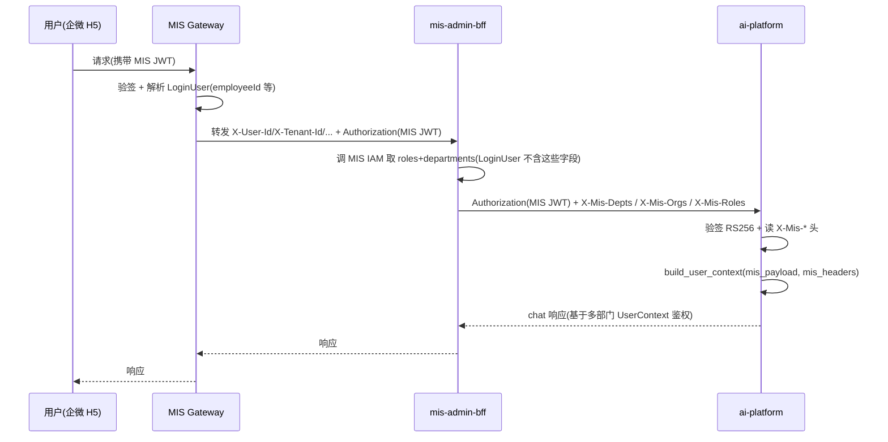
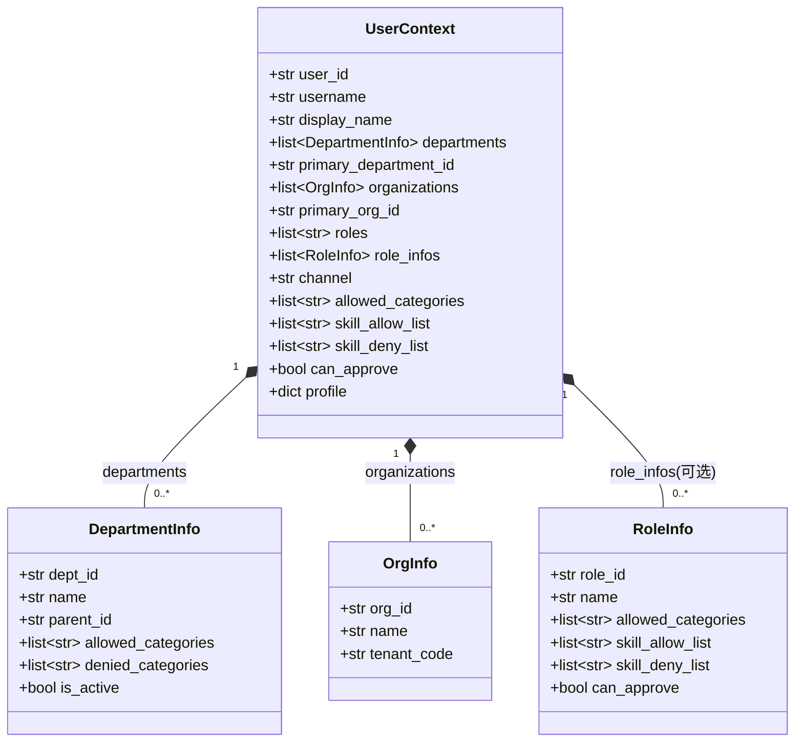
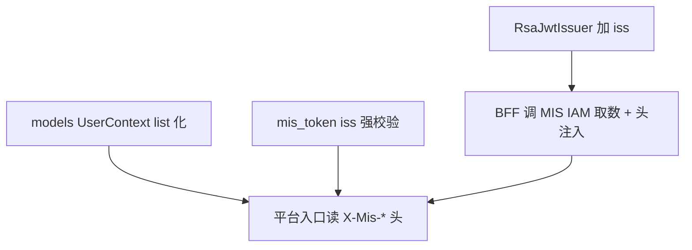

# MIS × ai-platform 身份建模澄清与决策建议

> 文档定位：架构澄清文档，**不进入标准 SOP 实现流**。
> 作者：架构师 高见远（software-architect）
> 输入：用户原始问题「3 是什么意思，是不是要把部门权限放到 JWT 令牌里，一个人可能有多个部门任职和权限，还有组织也可能有多个」+ 已核实代码事实（设计 §0 F-6/F-7、§6 B-4/B-5、阶段1/2 落地代码）。

---

## 1. 澄清：用户问的"3"到底是什么

- **字面含义**：设计 §6 待确认第 3 条 = *"MIS JWT 是否补 `iss`；department 补齐方式"*。它原本是两件事：
  1. 要不要给 MIS JWT 增加 `iss`（签发者）声明；
  2. `department` 字段用哪种方式补齐。
- **为什么它从"补字段"变成了"身份建模"问题**：用户指出一个员工可能**多部门任职、拥有多角色/多权限、且组织（租户）也可能有多个**。原设计设想的"补一个 `department` 单值字段"在结构上根本不成立 —— 单值字段无法表达一对多的任职/权限关系。这已经不是"加哪个字段"的问题，而是**"JWT 到底该承载多少身份信息、多部门/多组织如何在 MIS 与平台之间正确传递"的架构决策**。

---

## 2. 正面回答：是不是要把部门权限放到 JWT 里？

**立场：不建议把完整的部门 / 权限明细塞进 MIS JWT。JWT 应只承载"身份 + 粗粒度声明"；部门 / 角色 / 组织的明细，应由可信的 BFF（mis-admin-bff）在代理时解析并注入，或由平台按需回调 MIS IAM。**

### 为什么（业界通行做法 + 本项目已核实事实）

1. **Token 膨胀与重签成本**：权限树 / 多部门明细是易变数据。塞进 JWT 意味着权限一变就要重新签发 token，用户需重新登录或走刷新流程。这是公认的 JWT 反模式。
2. **MIS 网关现状（事实 F-6）**：`JwtAuthenticationGlobalFilter` 当前只透传**单 `tenantId`** 与基本身份头（`X-User-Id / X-Tenant-Id / X-App-Id / X-Employee-Id / X-Username / X-Trace-Id`），**没有 `X-Department / X-Roles / X-Org`**。说明 MIS 自身当前也只是单租户、扁平身份模型 —— 把多组织塞进 JWT，但网关层仍以单 tenant 透传，下游拿不到完整多组织上下文。
3. **BFF 是做 MIS IAM 补全的最佳位置（修正前提）**：经核实，`LoginUser` **并不"已持有完整信息"**——`LoginUserHeaderResolver` 仅从网关头读 `userId/tenantId/appId/employeeId/username`；`setRoles` 全仓从未调用 → `LoginUser.roles` 永远为空集合；`departments` 字段在 `LoginUser` 中根本不存在；`setPermissions` 仅由 `ApiPermissionInterceptor.java:68` 在**非 authOnly** 端点调用（authOnly 端点如 `/ai/health`、`/features` 提前 return，此时 permissions 为空）。因此 BFF 注入 `X-Mis-*` 头前**必须额外调一次 MIS IAM 取 roles + departments**。该调用发生在 MIS 信任域内、与 IAM 同网（低延迟），而**平台仍与 MIS IAM 解耦**（平台不再需要跨服务回调 IAM，可用性↑、延迟↓）。
4. **跨服务边界**：平台与 MIS 是跨服务边界，平台不应假设能直接读 MIS IAM；通过 BFF 受信封转发是清晰的边界。

### 两条路线对比

| 维度 | 路线 A：富 JWT（claims 里 list 化） | 路线 B：瘦 JWT + 运行时解析（**推荐**） |
|------|--------------------------------------|------------------------------------------|
| MIS JWT 内容 | `userId, tenantId, ..., depts:[...], orgs:[...], roles:[...]` | `userId, tenantId, employeeId, username, jti, 可选 roles:[], iss` |
| 部门 / 权限来源 | 签发时由 `RsaJwtIssuer` 查 IAM 写入 token | BFF 代理时**调 MIS IAM 取 roles+departments 后**注入 `X-Mis-*` 头 |
| Token 大小 | 大，随任职数增长 | 小，恒定 |
| 权限变更生效 | 必须重签 token | 下次请求自动生效（BFF 实时解析） |
| 平台 ↔ MIS IAM | 无 | 无（BFF 在 MIS 域内查） |
| 网关约束 | 多组织仍受单 `tenantId` 透传限制 | 同左，但多组织可经 BFF 头表达 |
| 回归风险 | 改 `RsaJwtIssuer` 写入逻辑（Java 闸门） | 主要改 BFF + 平台读头（增量、默认值兼容） |

**推荐：路线 B**，其变体 **B1（BFF 头注入）为本阶段首选**；B2（平台用 `employeeId` 回调 MIS IAM）作为高安全场景的兜底，不在本阶段默认启用。

> **折中建议**：JWT 可保留粗粒度 `roles:[]`（`RsaJwtIssuer` 已支持可选写入），作为"非 BFF 直连"时的降级身份；但**部门明细、组织列表、细粒度权限一律走 BFF 头，不进 JWT**。

### 路线 B 的请求时序（用户 → 平台）



---

## 3. 多部门 / 多角色 / 多组织的正确数据模型

### 3.1 MIS JWT 最小 claims（路线 B）

```json
{
  "userId": 123,
  "tenantId": 1,             // 主租户（单值，gateway 现状）
  "appId": 10,
  "employeeId": 456,
  "username": "zhangsan",
  "jti": "uuid",
  "roles": ["agent_user"],   // 可选粗粒度角色 list（RsaJwtIssuer 已支持可选写入）
  "permVersion": "20240101",
  "iss": "mis-platform"      // B-4 建议补充
}
```

> **不放入**：`depts` / `orgs` / `permissions` 明细。

### 3.2 BFF → 平台 头设计（路线 B / B1）

| 头名 | 值结构 | 说明 |
|------|--------|------|
| `X-Mis-Depts` | JSON 数组，元素 `{id, name?}` 或仅 `[id,...]` | 用户全部任职部门 id 列表 |
| `X-Mis-Orgs`  | JSON 数组 `[tenantId,...]` | 用户所属组织 / 租户（多组织；当前阶段可仅含主 tenant） |
| `X-Mis-Roles` | JSON 数组 `[roleId,...]` | 角色并集（补充 / 覆盖 JWT 中 `roles`） |

- **与现有 `X-Tenant-Id` 单值的关系（不冲突）**：保留 `X-Tenant-Id` 作为"主租户"向后兼容（单值），新增 `X-Mis-Orgs` 表达完整多租户列表；`X-Tenant-Id` = `X-Mis-Orgs[0]`。两者是"主值 + 完整列表"的共存，不破坏现有消费方。
- **格式**：推荐 **JSON 结构**（而非逗号分隔），便于携带 `name` 等冗余字段且平台解析稳定；若担心头长度，可仅传 id 列表，名称由平台缓存或忽略。平台侧用**自身分类目录**将 `dept_id / role_id / tenant_id` 解析为 `allowed_categories`（见 §3.3）。
- **信任边界（关键）**：这些头**仅当请求携带合法 MIS JWT 且来自 BFF 网络 / 信任域（内网隔离或 mTLS）时**被平台采信。平台不应接受来自公网的裸 `X-Mis-*` 头。

### 3.3 平台 `UserContext` 演进（多值化，复用现有 schema）

现有 `UserContext.department: str` / `dept_id: str | None` 单值 → 改为 list 化。`models.py` 中 **`DepartmentInfo`、`RoleInfo` 已经存在**，可直接复用，降低改动量。



**演进要点（类型示意，非实现）：**

- `department: str` / `dept_id: str | None` → 标记 `@deprecated`，新增 `departments: list[DepartmentInfo] = []` 与 `primary_department_id: str | None = None`。
- 新增 `organizations: list[OrgInfo] = []` 与 `primary_org_id: str | None = None`（对应原单值 `tenantId`）。
- `roles: list[str]` 已为 list，保留；可选新增 `role_infos: list[RoleInfo]` 承载解析后的角色明细。
- `allowed_categories` = ∪(各 `DepartmentInfo.allowed_categories`) ∪(各 `RoleInfo.allowed_categories`)，平台用自身目录把头里的 id 展开后去重合并。
- `can_approve`：`any(r.can_approve for r in role_infos) or any(d 在审批部门集合)` —— 多部门下"任一可审批即为 True"。
- `build_user_context_from_mis(p)` 演进为 `build_user_context(mis_payload, mis_headers)`：先由 JWT 建身份，再用 `X-Mis-*` 头填充 `departments / organizations / role_infos`；**头缺失时退化为当前行为**（departments=[], allowed_categories=[]），保证 148 测试不破。

### 3.4 上游约束：多组织在 gateway 层暂不支持；LoginUser 不含 roles/departments

- **事实（已核实）**：
  - MIS 网关只透传**单 `tenantId`**，无多组织透传；
  - `LoginUserHeaderResolver` 仅从网关头读 `userId/tenantId/appId/employeeId/username`，**不读 roles、不读 departments**；
  - `setRoles` 全仓从未调用 → `LoginUser.roles` 永远为空集合；`departments` 字段在 `LoginUser` 中**不存在**；
  - `setPermissions` 仅由 `ApiPermissionInterceptor.java:68` 在**非 authOnly** 端点调用（authOnly 端点提前 return，permissions 为空）。
- **推论**：BFF 注入 `X-Mis-Roles` / `X-Mis-Depts` 前，**必须额外调 MIS IAM 取 roles + departments**（用户已选此方案，见文末「已确认决策记录」第 4 项）。这**不是免费 enrichment**。
- **建议（本阶段）**：约定 **"单 tenant + 用户在该 tenant 内可多 dept"**。多组织（多 tenant 同时生效）需网关层升级（透传多 tenant 列表），列为**后续阶段**，不在本阶段强推。
- 即 `X-Mis-Orgs` 当前可只含主 tenant，`organizations` 列表长度 = 1，但**数据结构已为多值预留**，升级时无破坏性变更。

---

## 4. 对 B-4 / B-5 的正式拍板建议

**B-4（iss 取值）：**
- **推荐**：在 `RsaJwtIssuer` 补 `.issuer("mis-platform")`（1 行，向后兼容）；平台设 `MIS_JWT_ISSUER=mis-platform` 启用强校验（当前 `verify_iss=False`，软比对逻辑已就位）。
- **理由**：极低改动成本，杜绝"令牌混淆攻击"（其他 issuer 的 RS256 token 被误接受），且平台已具备软比对逻辑，零新增复杂度。

**B-5（department / allowed_categories 补齐方式）：**
- **推荐**：走**路线 B1（BFF 受信封注入）**，不采用原设计 §6 的 (a) 单值 `department` claim；JWT 仅保留可选粗粒度 `roles:[]`。
- **理由**：(a) 单值 `department` 在用户多部门事实下根本不成立；(a') 富 JWT 又会带来膨胀 / 重签问题；B1 让 BFF 在 MIS 域内调 IAM 取数后注入头，平台与 MIS IAM 解耦，且是最小改动（注意：`LoginUser` 本身不含 roles/departments，需 BFF 主动调 IAM，见 §3.4）。

---

## 5. 工程师落地指引（最小变更原则，零回归）

### 5.1 需改动的文件（按层）

| 层 | 文件 | 改动 |
|----|------|------|
| MIS 签发 | `backend/mis-common/.../jwt/RsaJwtIssuer.java` | 加 `.issuer("mis-platform")`（B-4）。**不**加 `depts`/`orgs` claim（保持瘦 JWT） |
| MIS 网关 | `backend/mis-gateway/.../filter/JwtAuthenticationGlobalFilter.java` + `SecurityConstants` | 本阶段基本不动；如 JWT 含 `roles` 可透传 `X-Mis-Roles`（可选）。多组织透传推迟 |
| BFF | `mis-admin-bff` `AiPlatformClient`（继承 `AbstractDownstreamClient`） | 代理平台**前调 MIS IAM 取 roles + departments**（`LoginUser` 不含这些字段），再注入 `X-Mis-Depts` / `X-Mis-Orgs` / `X-Mis-Roles` |
| BFF 控制器 | 取 `LoginUser` 处 | 仅作身份路由（employeeId 等）；roles / departments 由 `AiPlatformClient` 经 MIS IAM 补全，不依赖 `LoginUser` |
| 平台验签 | `agent/ai-platform/backend/src/identity/mis_token.py` | `MisTokenPayload` 解析可选 `iss` 字段；`verify()` 已支持 `MIS_JWT_ISSUER` 软比对，默认 `verify_iss=False`，强校验靠配置开启。JWT claims 结构不变 |
| 平台模型 | `agent/ai-platform/backend/src/identity/models.py` | `UserContext` 演进为 `departments` / `organizations` / `primary_*` list 化（复用 `DepartmentInfo`/`RoleInfo`，新增 `OrgInfo`）；`build_user_context` 合并头 |
| 平台入口 | chat 接口的鉴权中间件 | 从请求读取 `X-Mis-*` 头，调用 `build_user_context(mis_payload, mis_headers)` |

### 5.2 改动顺序与依赖



- **T1** `RsaJwtIssuer` 加 iss（独立，向后兼容）—— 可先发，无消费者破坏。
- **T2** `models.py` `UserContext` list 化（全默认值）—— 依赖无，兼容 148 测试。
- **T3** `mis_token.py` 支持 iss 强校验（默认关）—— 依赖无。
- **T4** BFF `AiPlatformClient` **调 MIS IAM 取 roles+departments 后**注入 `X-Mis-*` 头（`LoginUser` 不含这些字段，"丰富"实为 IAM 取数）—— 依赖 T2 的头结构约定。
- **T5** 平台入口读 `X-Mis-*` 头并 `build_user_context` —— 依赖 T2 / T3 / T4。
- **（T6 后续）** MIS 网关多组织透传升级 —— 依赖上游 gateway 改造排期。

**回归保证：**
- **Java 编译闸门**：T1 仅 1 行 `.issuer(...)`，编译安全。
- **Python 148 测试**：T2 所有新字段带默认值，`build_user_context` 在头缺失时退化为旧行为，测试不破。
- **灰度建议**：先发 T1 / T2 / T3（纯增量、零行为变化），再发 T4 / T5（开启 enrichment）。

---

## 6. 待用户确认清单

> **状态**：第 1–4 项已由用户锁定（均采纳推荐项），详见文末「已确认决策记录」；以下仅保留仍待定项并标注已确认项。

1. ~~路线选择~~ ✅ 已确认：**路线 B（瘦 JWT + BFF 头注入）**。
2. ~~iss 取值~~ ✅ 已确认：`iss=mis-platform` + 平台 `MIS_JWT_ISSUER=mis-platform` 强校验（`verify_iss` 打开）。
3. ~~多组织范围~~ ✅ 已确认：本阶段**单 tenant + 多 dept**；多组织（多 tenant）推迟到网关升级。
4. ~~LoginUser 现况~~ ✅ 已确认：BFF **调 MIS IAM 补充 roles/departments 后再注入** `X-Mis-*` 头（LoginUser 不含这些字段）。
5. **头格式与信任**：enrichment 头用 JSON 结构还是逗号分隔？平台"仅信任来自 BFF 网络 / 信任域的 `X-Mis-*` 头"这一网络安全假设是否成立（平台是否仅 BFF 可达）？
6. **降级策略**：若 BFF 未注入头（如非 BFF 直连），平台是否允许以 JWT 中粗粒度 `roles:[]` 降级运行，还是直接拒绝请求？

---

## 7. 已确认决策记录

> 下列 4 项由用户于本轮锁定，均采纳架构师推荐项。架构结论不变：仍推荐**路线 B**。

| # | 决策项 | 用户选择 | 对落地的影响 |
|---|--------|----------|--------------|
| 1 | 身份传递路线 | **路线 B：瘦 JWT + BFF 头注入**（不采用富 JWT） | MIS JWT 保持瘦（身份 + 可选 `roles:[]` + `iss`）；部门 / 组织明细走 BFF `X-Mis-*` 头 |
| 2 | `iss` 取值与校验 | `iss=mis-platform`；平台 `MIS_JWT_ISSUER=mis-platform` **强校验**（`verify_iss` 打开） | `RsaJwtIssuer` 补 `.issuer("mis-platform")`；平台 `verify()` 由 `verify_iss=False` 改为开启，且 `MIS_JWT_ISSUER` 必须配置为 `mis-platform` |
| 3 | 多组织范围 | 本阶段**单 tenant + 多 dept**；多组织（多 tenant）推迟到网关升级 | `X-Mis-Orgs` 当前仅含主 tenant，`organizations` 长度 = 1；多值结构预留，网关升级时无需破坏性变更 |
| 4 | BFF 取数方式 | BFF **调 MIS IAM 补充 roles/departments 后再注入** `X-Mis-*` 头 | **T4 = BFF `AiPlatformClient` 先调 MIS IAM 取 roles+departments，再注入头**（`LoginUser` 本身不含 roles/departments，详见 §3.4）；非免费 enrichment |

**备注（与 §3.4 一致）**：`LoginUser` 经 `LoginUserHeaderResolver` 仅含 `userId/tenantId/appId/employeeId/username`；`roles` 永远为空、`departments` 字段不存在、`permissions` 仅非 authOnly 端点有。因此 BFF 注入 `X-Mis-Roles` / `X-Mis-Depts` 前必须额外调一次 MIS IAM——这是路线 B 在本项目下的真实成本，已计入 T4。
