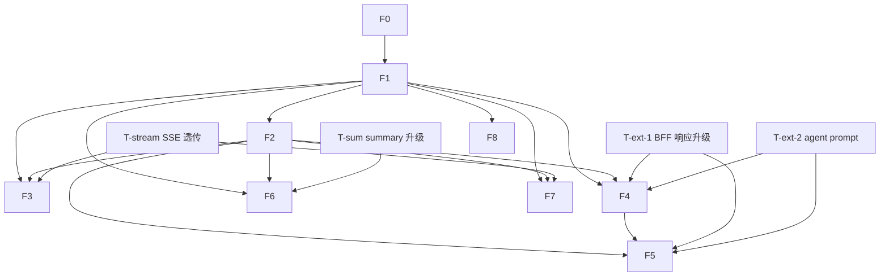

# MIS × ai-platform 前端 AI 融合集成设计（阶段5）

> 文档角色：架构师（高见远）给出的**前端集成设计 + 任务分解**，承接 PRD `frontend-ai-integration-prd.md`、原集成架构 `mis_ai_integration_architecture.md`、身份文档 `jwt-identity-clarification.md` / `identity-enrichment-task-list.md`。
> 范围：仅设计 + 任务分解 + 文件级指引（函数/组件签名、类型、配置、路径）。**不写实现代码**。
> 语言：中文。
> 约定：所有路径相对 `frontend/mis-admin-web/`；后端路径相对仓库根。

---

## 0. 前置：基于真实代码的核查结论（关键，先读）

设计前已探索 `frontend/` 真实约定与已落地 BFF/平台代码。下列结论直接回答 PRD §5 的 Q1（extract 是否支持 schema）与团队要求的"后端扩展点"，**以实测代码为准，不凭空假设**。

### 0.1 前端 mis-admin-web 真实约定（已核实）

| 维度 | 实测结论 | 设计影响 |
|---|---|---|
| 技术栈 | React 18 + shadcn/ui + Tailwind + Zustand + TanStack Query + axios + sonner + lucide-react + react-router-dom | 沿用，不另起炉灶 |
| API 客户端 | `src/lib/api/client.ts`：`axios.create({ baseURL:'/api/v1', timeout:15000 })`，请求拦截自动注入 `Authorization: Bearer {token}`，401 自动 refresh | 非流式 AI 调用（extract/summary/rag）**直接复用此 `api`**，无需新建客户端 |
| 状态管理 | `src/stores/`：`auth-store.ts`（persist，含 `permissions`/`hasPermission`）、`tab-store.ts` | AI 可用性/Copilot 开合新增 `src/stores/ai-store.ts`（同目录、同 Zustand 风格） |
| 页面机制 | `src/components/layout/keep-alive-outlet.tsx` 的 `PAGE_MAP`（path→Component）驱动渲染；路由在 `app/router.tsx` 仅作空壳 | 新增"智能录入"独立页需登记 `PAGE_MAP` + router 路径 |
| 业务页形态 | **全部是数据驱动的列表页**：`features/system/admin-list-page.tsx` + `features/system/page-defs.ts` 的 `SYSTEM_PAGE_DEFS`。每个页由 `AdminPageDef` 描述，其中 `form: AdminField[]`（`{key,label,type,options,required,col}`）即**表单 schema 真源**；新建/编辑/详情共用一个 `Sheet`（`@/components/ui/sheet`） | **UC-1/UC-3 的"当前表单 schema"天然来自 `def.form`**；UC-2/UC-4 的"当前记录"来自详情 Sheet 的 `formValues`/row |
| 现有 AI 代码 | 仅 `src/components/layout/copilot-panel.tsx`（**Phase1 占位**：静态欢迎文案，发送按钮 disabled）；`AppLayout` 头部 `Sparkles` 按钮已绑定 `setCopilotOpen` | UC-5 直接升级该占位；全局入口已就位 |
| 快捷键 | `Cmd/Ctrl+K` 已被 `CommandPalette`（导航/页面跳转）占用（`command-palette.tsx` 的 `useCommandPaletteHotkey`） | **Copilot 不能再用 Cmd+K**；见 §8 待拍板 Q9 |
| shadcn 组件现状 | `components/ui/` 仅有：`alert, button, card, input, label, sheet` | 需新增：`badge, tabs, textarea, popover, collapsible, skeleton`（见 §2.3） |
| 缺失依赖 | `package.json` 无 `fetch-event-source` / `react-markdown` / `remark-gfm` / `zod`（cmdk 也未用，命令面板是手写 radix Dialog） | 新增 2~3 个 npm 包（见 §2.3） |
| 其他 | `sonner` 的 `<Toaster>` 已在 `providers.tsx` 挂载；`lucide-react` 的 `Sparkles` 已用 | 错误提示用 `toast()`；AI 入口统一 `Sparkles` |

### 0.2 已落地 BFF / 平台契约实测（回答 PRD §5 Q1 + 团队 §4）

| 核查点 | 实测代码 | 结论 |
|---|---|---|
| BFF extract 是否支持 `schema` 入参 | `dto/ai/AiExtractRequest.java` 已有 `private Map<String,Object> schema`；`AiCapabilityTranslator.buildExtractContent` 已把 `req.getSchema()` 注入 prompt（"抽取 schema：…"） | ✅ **已支持**。"前端发 schema 给 extract"无需改 BFF DTO |
| extract 返回是否 form-keyed | `AiExtractResponse.fields: Map<String,Object>`，`parseExtract` 解析 agent 返回的 `fields` 对象（键= schema 字段名） | ✅ **已 form-keyed**（方案 C 的"AI 直出 form-keyed 值"已具备） |
| extract 返回是否含**逐字段 confidence** | `AiExtractResponse.confidence` 是**单个 `Double`**（整体置信度），`parseExtract` 只取标量 | ❌ **缺逐字段 confidence**——前端无法据此标红/强制确认 |
| extract 是否返回 `unmapped` | `AiExtractResponse` 无 `unmapped` 字段 | ❌ **缺 `unmapped`**——未映射字段无处承载 |
| mis-extract agent 输出约定 | `configs/agents/mis-extract/agent.yaml` 注释要求 `{ fields:{name:value}, confidence: number }`；`system/model.yaml` 实际为空桩 | ⚠️ 仅要求标量 `confidence`，未要求逐字段 confidence / unmapped；需补 system prompt |
| **BFF 是否支持 SSE 流式** | `AiPlatformClient` 仅有 `chat()`（非流式，调 `/api/v1/agents/{agentId}/chat`）；`AiProxyController.chatCompletions` 返回 `Result<AiChatResponse>`（非流式）。平台虽有 `/agents/{id}/chat/stream`(SSE)，但 **BFF 未暴露任何 SSE 端点** | ❌ **缺 SSE 透传**——UC-5（P0 流式 Copilot）与 UC-4（流式 RAG）需后端先补流式端点 |
| summary 响应结构 | `AiSummaryResponse` + `parseSummary` 仅解析 `points`/`citations` 为 `List<String>`，**无 `summary` 文本、无 `points[].label/value/risk`、无 `citations[].field/source`** | ⚠️ 需升级响应契约（T-sum）才能支撑 PRD UC-2 的结构化卡片 |

**设计层关键结论（直接回应团队 §4）：**
1. **§4 字段映射的"发 schema"已具备**，无需 BFF DTO 扩展；真正需要后端扩展的是**响应侧**：逐字段 `confidence`（`Map`）+ `unmapped`（`List`）+ agent prompt 对齐（**T-ext**，小改）。
2. **流式是更大的后端依赖**：UC-5（P0）/UC-4 的流式体验依赖 BFF 新增 SSE 透传端点（**T-stream**）。在 T-stream 落地前，UC-4 可先用非流式 `rag` 端点 MVP，UC-5 需等流式。
3. 前端对"标量 confidence"做**防御性兼容**：若后端尚未升级（仍返回标量），前端把所有字段 confidence 视为该标量并套用默认阈值——这样 UC-1 在 T-ext 之前也能跑通，T-ext 仅提升"逐字段标红"精度。

---

## 1. 前端 AI SDK 设计

目标：业务页只写 `<AiFeature feature="form-fill" ... />`，不感知流式/JWT/脱敏/门禁/降级。SDK 分层如下。

### 1.1 `AIProvider`（持有门禁/健康/降级/页上下文）

- **位置**：`src/features/ai/ai-context.tsx`，在 `src/app/providers.tsx` 的 `AppProviders` 内、`QueryClientProvider` 之下包裹 `children`（与 `ThemeProvider` 同级）。
- **启动行为**：挂载时若 `useAuthStore.getState().isAuthenticated()` 为真，并行拉 `GET /api/v1/ai/features` 与 `GET /api/v1/ai/health`，结果写入 `ai-store`；未登录则跳过（入口默认隐藏，符合降级）。
- **持有状态**（经 `ai-store`）：
  - `enabledFeatures: Set<string>` —— 当前用户+当前路由下可用 feature key（来自 `/features`）。
  - `allowedCategories: string[]` —— 平台算出的可访问 AI 类目（来自 `/features`）。
  - `canApprove: boolean | null` —— 审批写确认权（来自 `/features`，本阶段仅预留，U1~U5 不依赖）。
  - `health: 'up' | 'down' | 'unknown'`。
  - `copilotOpen: boolean`（全局浮窗开合）、`pageContext` 缓存（route/module/当前记录）。
- **降级策略字段**：`defaultFallback: 'hide' | 'disable' | 'message'`（全局默认 `hide`），可被注册表按 feature 覆盖（见 §1.4）。
- **门禁 API**：`useAiContext()` 暴露 `isFeatureEnabled(key, route?)`、`getFallback(key)`、`canApprove()`，供 `<AiFeature>` 与业务页消费。
- **刷新时机**：登录态变化（`useAuthStore` 订阅）与路由变化（`useLocation`）时重拉 `/features`（route 维度门禁）；`/health` 走轻量轮询或仅在失败重试时探测。

### 1.2 `useAI` Hook（统一封装流式/JWT/脱敏/错误/降级）

- **位置**：`src/features/ai/use-ai.ts`。
- **签名**（与架构 §3.1 对齐，按真实约定落地）：
  ```ts
  type AiCapability = 'chat' | 'summary' | 'extract' | 'rag';
  interface UseAIOptions<TReq, TResp> {
    capability: AiCapability;
    feature?: string;            // 用于审计/门禁
    request: TReq;
    stream?: boolean;            // 默认 false；chat 用 true（需 T-stream 后端就绪）
    context?: AiPageContext;     // route/module/selectedRows/record
    onToken?: (delta: string) => void;   // 流式增量
    onDone?: (result: TResp) => void;
    onError?: (err: AiError) => void;
    fallback?: 'hide' | 'disable' | 'message';
  }
  interface UseAIResult<TResp> {
    data: TResp | null;
    streaming: string;
    loading: boolean;
    error: AiError | null;
    unavailable: boolean;        // 门禁/健康判定入口不可见
  }
  function useAI<TReq, TResp>(opts: UseAIOptions<TReq, TResp>): UseAIResult<TResp>;
  ```
- **行为**：
  - 非流式（extract/summary/rag）：复用 `src/lib/api/client.ts` 的 `api.post('/ai/<cap>', body)`，统一解包 `ApiResult<T>`（`code===0` 取 `data`；否则 `onError`）。
  - 流式（chat，需 T-stream）：调用 `src/features/ai/ai-sse-client.ts` 的 `aiFetchEventSource('/ai/chat/completions', {stream:true, body})`，逐帧 `onToken` 累积到 `streaming`，`done` 帧触发 `onDone`。
  - **脱敏**：入参 `context.selectedRows` 经 `src/features/ai/lib/desensitize.ts` 预脱敏（`desensitizeOwner` 默认 `'agent'`，前端仅做手机号/身份证/金额兜底）。
  - **错误/超时**：axios `timeout:15000` 触发 `onError`；`ai-sse-client` 监听 `error` 帧/网络错误 → `onError` + `toast()`（不阻塞主流程）。

### 1.3 `ai-sse-client.ts`（SSE 封装，新增依赖 `fetch-event-source`）

- 薄封装 `fetch-event-source`，**手工注入 `Authorization`**（从 `useAuthStore.getState().accessToken` 读取，因 `fetch-event-source` 不走 axios 拦截器）与 `X-Trace-Id`（可选，由 BFF 生成则省略）。
- 解析 SSE 帧：`event: delta → {delta}`、`event: done → {finishReason, sessionId}`、`event: error → {message}`，回调给 `useAI`。
- 暴露 `AbortController` 以便 Copilot 关闭时中断流式（流式降级的重要依据，见 §6）。

### 1.4 能力注册表 `ai-feature-registry.ts`

- **位置**：`src/features/ai/ai-feature-registry.ts`。声明式登记本阶段 feature（双向对齐后端 `CapabilityMeta`）。
  ```ts
  interface AiFeatureDeclaration {
    key: string;                 // 'form-fill' | 'detail-summary' | 'text-extract' | 'rag-qa' | 'copilot'
    capability: AiCapability | 'chat-stream';
    mountPoint: 'form-top' | 'form-field' | 'detail-header' | 'global-copilot';
    title: string;
    fallback: 'hide' | 'disable' | 'message';   // 默认 hide
    canApproveOnly?: boolean;    // 是否需 can_approve（本阶段全 false）
    requiresStream?: boolean;    // 是否依赖 T-stream（copilot/rag-qa 流式=true）
  }
  ```
- 本阶段登记：`form-fill`(extract, form-top/form-field, hide)、`text-extract`(extract, form-top, hide)、`detail-summary`(summary, detail-header, hide)、`rag-qa`(rag/chat-stream, detail-header/global-copilot, hide)、`copilot`(chat-stream, global-copilot, **message**——全局基础入口，缺能力时保留入口点击提示而非完全隐藏)。

### 1.5 `<AiFeature>` 通用壳 `components/ai-feature.tsx`

- **职责**：声明式挂载点 + 门禁 + 降级 + loading/错误态；业务页零感知。
- **Props**：
  ```ts
  interface AiFeatureProps {
    feature: string;             // 注册表 key
    mountPoint: AiFeatureDeclaration['mountPoint'];
    context?: AiPageContext;
    render: (state: UseAIResult<unknown>) => React.ReactNode;  // 业务自定义内容（面板/卡片/气泡）
    trigger?: React.ReactNode;   // 可选自定义触发按钮
  }
  ```
- **渲染逻辑**：
  1. `const { isFeatureEnabled } = useAiContext()`；若 `!isFeatureEnabled(feature, route)` 且 `fallback==='hide'` → 返回 `null`（不渲染入口）。
  2. `fallback==='disable'` → 渲染置灰触发按钮 + tooltip "AI 暂不可用"。
  3. `fallback==='message'` → 渲染入口，点击 `toast('AI 暂不可用')`。
  4. 正常 → 渲染 `trigger`（默认 `Sparkles` + 标题按钮）与 `render(state)` 内容。

### 1.6 挂载到 Provider/路由树

- `providers.tsx`：`<AIProvider>` 包住 `{children}`（在 `QueryClientProvider` 内）。
- 全局 `CopilotPanel`（`AppLayout` 内）：内部改为渲染 `<AiCopilot/>`（消费 `ai-store.copilotOpen`）。
- 页面内嵌特征：在 `AdminListPage` 的创建/编辑 Sheet 注入 `form-fill`，在详情 Sheet 注入 `detail-summary` + `rag-qa`（见 §3）。

---

## 2. 目录与文件结构

### 2.1 新增文件（`features/ai/` 分域，符合 `features/` 约定）

| 路径 | 类型 | 职责 |
|---|---|---|
| `src/features/ai/index.ts` | 新建 | 统一导出 SDK（`AIProvider`/`useAI`/`<AiFeature>`/类型/注册表） |
| `src/features/ai/types.ts` | 新建 | `AiCapability`/`AiFeatureKey`/`AiPageContext`/`UseAIOptions`/`UseAIResult`/`AiError`/`ExtractResponse`/`SummaryResponse`/`RagResponse` 等契约类型；`FormFieldSchema`/`FieldSuggestion`（见 §4） |
| `src/features/ai/ai-context.tsx` | 新建 | `AIProvider` + `useAiContext()`（门禁/健康/降级/页上下文） |
| `src/features/ai/use-ai.ts` | 新建 | `useAI` Hook（统一流式/非流式/JWT/脱敏/错误） |
| `src/features/ai/ai-sse-client.ts` | 新建 | SSE 封装（基于 `fetch-event-source`，注入 JWT） |
| `src/features/ai/ai-feature-registry.ts` | 新建 | 声明式特征注册表（feature 清单 + 挂载点 + fallback + requiresStream） |
| `src/features/ai/lib/desensitize.ts` | 新建 | 前端脱敏工具（手机号/身份证/金额），供 `context.selectedRows` 预处理 |
| `src/features/ai/context/form-fill-bridge.tsx` | 新建 | `FormFillBridgeContext`：`getSchema()`/`getValues()`/`applyFields()`，桥接 AI 回填与 `AdminListPage` 表单态 |
| `src/features/ai/components/ai-feature.tsx` | 新建 | `<AiFeature>` 通用壳（挂载点/门禁/降级/loading） |
| `src/features/ai/components/ai-form-fill.tsx` | 新建 | UC-1 表单 AI 填充面板（Sheet + 对话/上传 + 字段预览 + HITL 确认） |
| `src/features/ai/components/ai-text-extract.tsx` | 新建 | UC-3 文本/文档抽取面板（复用 extract 通道；独立"智能录入"页亦用此） |
| `src/features/ai/components/ai-summary.tsx` | 新建 | UC-2 详情 AI 摘要卡片（自动触发 + 引用溯源） |
| `src/features/ai/components/ai-rag.tsx` | 新建 | UC-4 RAG 问答面板（问题输入 + 流式/非流式回答 + 引用） |
| `src/features/ai/components/ai-copilot.tsx` | 新建 | UC-5 全局 Copilot 对话内容（流式 Markdown + 页上下文注入） |

### 2.2 改造文件

| 路径 | 改动 |
|---|---|
| `src/stores/ai-store.ts` | 新建（Zustand）：`enabledFeatures`/`allowedCategories`/`canApprove`/`health`/`copilotOpen`/`pageContext` + actions |
| `src/app/providers.tsx` | 用 `<AIProvider>` 包裹 `children` |
| `src/components/layout/copilot-panel.tsx` | 占位升级：内部渲染 `<AiCopilot/>`（保留 `open`/`onOpenChange` 由 `ai-store.copilotOpen` 驱动） |
| `src/components/layout/app-layout.tsx` | 头部 `Sparkles` 按钮改为驱动 `ai-store.setCopilotOpen(true)`（取代本地 `setCopilotOpen`）；可选新增 Copilot 热键（§8 Q9） |
| `src/features/system/admin-list-page.tsx` | 注入 `FormFillBridgeProvider`（提供 schema/values/applyFields）；在创建/编辑 Sheet 工具栏加 `<AiFeature feature="form-fill">`；在详情 Sheet 头部加 `<AiFeature feature="detail-summary">` + `<AiFeature feature="rag-qa">`；列表工具区加"智能录入"入口（UC-3） |
| `src/features/system/page-defs.ts` | 无需改结构；AI 读取 `def.form` 作为 schema 真源（仅消费，不改写） |
| `src/components/layout/keep-alive-outlet.tsx` | 若做"智能录入"独立页：登记 `PAGE_MAP['/system/ai-import']` + `router.tsx` 补路由（可选，UC-3 也可仅在表单内嵌） |

### 2.3 需新增的依赖 / shadcn 组件

**npm 包（新增）**：
- `fetch-event-source` —— SSE 流式接收（axios 不适配 SSE；支持 POST + 自定义头）。
- `react-markdown` + `remark-gfm` —— 渲染 AI 流式 Markdown（与 shadcn `prose` 对齐）。
- `zod`（可选但推荐）—— 校验 AI 响应（extract/summary 的结构化 JSON），降级更稳。

**shadcn 组件（`components/ui/`，从 cli 生成，非新运行时）**：
- `badge.tsx`（置信度徽标）、`tabs.tsx`（UC-3 子 tab / UC-5 多模态）、`textarea.tsx`（替换裸 `<textarea>`，统一样式）、`skeleton.tsx`（loading 占位）、`popover.tsx`（单字段 Sparkles 浮层，需加 `@radix-ui/react-popover`）、`collapsible.tsx`（摘要卡片折叠，需 `@radix-ui/react-collapsible`）。

---

## 3. 各用例组件设计（UC-1 ~ UC-5；UC-6 仅预留）

> 统一：所有 AI 入口用 `lucide-react` 的 `Sparkles`；AI 输出默认带"AI 生成"角标；决策类附引用来源；失败 `toast` + 重试，绝不阻塞主流程。

### UC-1 表单智能填充（P0 · 重点）

- **入口形态**：① 创建/编辑 Sheet 工具栏「AI 填充」主按钮（`Button` + `Sparkles`）→ 打开填充面板（右侧 `Sheet`，宽 `max-w-xl`）；② 单字段右侧 `Sparkles` 图标（`Popover`，预聚焦该字段）。两者均 `<AiFeature feature="form-fill">`。
- **挂载点**：`AdminListPage` 的创建/编辑 Sheet 内；通过 `FormFillBridgeContext` 拿到 `getSchema()`/`getValues()`/`applyFields()`。
- **数据流**：`useAI(extract)` → `POST /api/v1/ai/extract`，body：
  ```ts
  { capability:'form-fill', text, schema:{ fields: FormFieldSchema[], targetForm: def.id }, context:{ route, module } }
  ```
  （文件上传走 `multipart` 或先 base64 内联——见 §8 Q4；文档先摘要再抽为可选）。
- **回填**：响应 `fields` 按 key 合并进 `formValues`（仅"已确认"项，见 §4）；`Popover` 用于单字段定向填充。
- **融合**：填充面板内左=对话/上传区（`Textarea` + 文件按钮 + 发送），右=字段预览（`Badge` 置信度 + 确认勾选 + 未映射"待确认"卡）。符合 shadcn 规范。

### UC-2 记录智能摘要（P1）

- **入口形态**：详情 Sheet 头部可折叠 `Card`（`Collapsible` + `Badge` "AI 生成"），进入详情默认自动触发。
- **挂载点**：`detail-header`；`<AiFeature feature="detail-summary">`。
- **数据流**：`useAI(summary)` → `POST /api/v1/ai/summary`，body `{ capability:'detail-summary', records:[脱敏后当前记录], context:{route,module} }`。当前记录来自详情 Sheet 的 `formValues`（经 `decorate` 后注入）。
- **输出**：`summary` 文本 + `points[]`（label/value/risk）+ `citations[]`（字段溯源）；引用可点击定位到对应字段行。需 T-sum 升级响应契约后才完整（见 §0.2）。
- **融合**：头部卡片，标注"AI 生成"。

### UC-3 文本/文档抽取（P1）

- **入口形态**：① UC-1 面板的"粘贴/上传"子 tab（`Tabs`）；② 列表工具区「智能录入」入口（打开填充面板，目标=当前 `def.id` 表单）或独立 `/system/ai-import` 页（可选）。
- **挂载点**：`form-top`（表单内嵌）/ 独立页。
- **数据流**：复用 `extract` 通道，body `{ text/doc, schema:{targetForm:def.id}, capability:'text-extract' }`。
- **输出**：结构化字段 → 填当前表单（同 UC-1 回填）或生成新记录草稿（草稿态，保存需用户确认——HITL）。
- **与 UC-1 关系**：共享 `ai-form-fill.tsx`/`ai-text-extract.tsx` 与 extract 通道；UC-3 强调"纯文本/批量"，UC-1 强调"对话+场景回填"。

### UC-4 上下文 RAG 问答（P1）

- **入口形态**：① 详情 Sheet 头部「AI 问答」按钮 → `Sheet`/`Popover` 面板；② 全局 Copilot 的"上下文模式"（自动注入当前路由 + 脱敏记录）。
- **挂载点**：`detail-header` / `global-copilot`；`<AiFeature feature="rag-qa">`。
- **数据流**：MVP 走非流式 `POST /api/v1/ai/rag`（`{ question, context:{route,module,record}, kb? }`）；T-stream 就绪后改用 `chat/completions(stream:true)` 带 RAG context 作兜底。
- **输出**：`answer` + `citations[]`（doc/page/snippet/score），引用可点击。
- **上下文注入**：`AiPageContext` = `{ route, module, record: 当前详情行（脱敏） }`；`selectedRows` 多选上下文本阶段暂不启用（列表页无选择列，见 §8 Q9），以"当前记录"为准。

### UC-5 全局 Copilot 浮窗（P0）

- **入口形态**：右下角 `Sparkles` FAB（= `AppLayout` 头部按钮，驱动 `ai-store.copilotOpen`）+ 热键（推荐 `Cmd/Ctrl+J`，见 §8 Q9）→ 右侧 `Drawer`（`Sheet` side=right，复用 `CopilotPanel` 占位升级为 `<AiCopilot/>`）。
- **挂载点**：`global-copilot`。
- **数据流**：`useAI(chat, stream:true)` → `POST /api/v1/ai/chat/completions (stream=true)`，body `{ messages:[...], context:{route,module,record} }`；**依赖 T-stream 后端 SSE 端点**。
- **输出**：SSE 流式 Markdown（`react-markdown` + `remark-gfm` 渲染，累计 `Skeleton` 占位）。
- **上下文**：自动注入当前路由 + 脱敏记录；对话不触发任何写操作（铁律）。
- **降级**：T-stream 未就绪时，`copilot` 的 `fallback` 设为 `message`——入口保留，点击提示"AI 对话即将上线"，主流程不受影响。

### UC-6 NL2SQL（P2 · 阶段4 之后，仅预留）

- **不在本阶段实现**。注册表预留 `nl2sql` 条目（`requiresStream:false`，`fallback:'hide'`），不写组件。
- 数据权限沙箱（行级 DataScope + 列级白名单）由阶段4 落地，前端本期不碰。

---

## 4. 表单智能填充字段映射 / 回填机制（重点，呼应 PRD §5 推荐 C）

### 4.1 前端如何收集"当前表单 schema"

- **真源**：`AdminListPage` 的 `def.form: AdminField[]`（已在 `page-defs.ts` 声明）。每个 `AdminField` 含 `{ key, label, type, options?, required?, col? }`。
- **桥接**：`AdminListPage` 用 `FormFillBridgeProvider` 包裹 Sheet 内容，暴露：
  ```ts
  interface FormFillBridge {
    getSchema(): FormFieldSchema[];                       // 由 def.form 映射
    getValues(): Record<string, unknown>;                // 当前 formValues
    applyFields(partial: Record<string, FieldSuggestion>): void;  // 仅回填已确认项
  }
  export interface FormFieldSchema {
    name: string;            // = AdminField.key（唯一真源）
    label: string;           // = AdminField.label
    type: 'string'|'number'|'select'|'switch'|'textarea';
    options?: { value:unknown; label:string }[];   // select 选项（助模型对齐）
    required?: boolean;
  }
  export interface FieldSuggestion {
    value: unknown;
    confidence: number;      // 0~1
  }
  ```
- **发往 extract**：`<AiFeature feature="form-fill">` 调 `bridge.getSchema()` + `bridge.getValues()`，组装 `schema:{ fields: FormFieldSchema[], targetForm: def.id }` 随请求发出（BFF 已支持透传 `schema`，见 §0.2）。

### 4.2 平台/extract 返回后的前端处理（推荐方案 C）

- 响应（目标契约，见 §4.4 T-ext）：
  ```ts
  interface ExtractResponse {
    fields: Record<string, unknown>;          // key = 表单字段 key（form-keyed）
    confidence: Record<string, number>;        // 逐字段置信度 0~1
    unmapped: Array<{ raw:string; hint?:string }>;  // 未映射到任何字段的抽取项
    sessionId?: string;
  }
  ```
- **回填流程**：
  1. 遍历 `fields`，按 key 找到表单字段；用 `confidence[key]`（若后端未升级为标量，则退化为全局 `confidence`）判定：
     - `confidence >= CONF_THRESHOLD`（默认 **0.85**，见 §8 Q3）→ 标绿，可直接进"待确认预览"。
     - `confidence < 阈值` → **标红**（`Badge` 红色 + 字段高亮），强制用户逐字段确认。
  2. `unmapped` 项 → 渲染为"待确认/未映射"卡片，用户可手动指定落到某字段或丢弃。
  3. 用户确认（逐字段勾选或"整表确认"）→ 调用 `bridge.applyFields(confirmedPartial)` 写回 `formValues`。**未确认项绝不落值**（HITL）。
  4. select/选项类字段：前端用 `options` 做值归一（模型可能返回 label，需映射回 value）。

### 4.3 明确标出：BFF / 平台侧是否需要扩展（设计层关键待拍板项）

**结论：PRD §5 推荐 C 的"发 schema"前提已满足（BFF 已透传 `schema`，agent 已按 schema 返 form-keyed `fields`）。需要后端扩展的是"响应侧精度"与"流式"，具体如下：**

| 扩展任务 | 层 | 改动 | 必要性 | 影响用例 |
|---|---|---|---|---|
| **T-ext-1** | BFF | `AiExtractResponse.confidence` 由 `Double` 改为 `Map<String,Double>`（逐字段）；新增 `unmapped: List<String>`（或 `List<Map>`）；`AiCapabilityTranslator.parseExtract` 同步解析 `confidence` 对象与 `unmapped` | **推荐（小改，纯增量）** | UC-1/UC-3 的低置信标红 + 未映射确认 |
| **T-ext-2** | 平台 agent | 补 `configs/agents/mis-extract/system/model.yaml` 的 system prompt，要求输出 `{ fields:{<schema字段名>:值}, confidence:{<字段名>:<0~1>}, unmapped:[...] }`；与 `agent.yaml` 注释一致化 | **推荐（仅 prompt）** | 同上 |
| **T-sum** | BFF + 平台 | `AiSummaryResponse` 增加 `summary:String` + `points:List<{label,value,risk}>` + `citations:List<{field,value,source}>`；`parseSummary` 升级；mis-summary agent prompt 对齐 | **推荐（小改）** | UC-2 结构化卡片 |
| **T-stream** | BFF + 平台 | BFF 新增 `POST /api/v1/ai/chat/completions` 的 `stream=true` 分支 → `AiPlatformClient.chatStream(...)`（WebClient SSE）→ 平台 `/agents/{id}/chat/stream`；SSE 事件透传 `delta|done|error` | **必须（UC-5 P0 硬依赖；UC-4 流式增强）** | UC-5 / UC-4 |

- **前后端兼容约定**：在 T-ext-1 落地前，后端返回标量 `confidence`；前端对"非对象 confidence"做防御——将所有字段 confidence 视为该标量。这样 **UC-1/UC-3 在 T-ext 之前即可 MVP 跑通**（只是暂不能逐字段标红，全部按全局阈值处理）。
- **字段 key 命名约定（§8 Q2）**：以**前端表单 `AdminField.key` 为唯一真源**；BFF 透传 schema 的 `name` 即该 key；agent 必须返回以此 key 为键的 `fields`。推荐项，建议在 T-ext-2 prompt 中明确。

---

## 5. 权限门禁

### 5.1 启动时拉 `/features` 决定显隐

- `AIProvider` 挂载后调 `GET /api/v1/ai/features?module=&route=`，返回（实测 `AiFeaturesResponse` 已有 `enabled` 列表结构，需确认含 `allowedCategories`）：
  ```json
  { "code":0, "data": { "enabled": ["form-fill","detail-summary",...],
    "disabled": ["report-insight"],
    "allowedCategories": ["expense","hr"],
    "canApprove": false,
    "config": { "form-fill": { "confThreshold": 0.85 } } } }
  ```
- `<AiFeature>` 挂载即消费 `useAiContext().isFeatureEnabled(key, route)`：命中 `enabled` → 渲染入口；未命中 → 按 `fallback`（默认 `hide`）降级。业务页**不手写权限判断**。

### 5.2 `allowed_categories` → feature 绑定

- 绑定规则由**注册表 `canApproveOnly` + 后端 `/features` 的门禁（租户>角色>模块>路由）** 共同决定；具体"每个 feature 绑哪些 category"由配置中心（架构 B6）或注册表约定，见 §8 Q5。
- 前端仅消费 `/features` 结果，不本地计算 category 匹配。

### 5.3 `can_approve` 驱动审批写确认

- `/features` 返回 `canApprove` 存入 `ai-store`；`useAiContext().canApprove()` 暴露。
- **本阶段 U1~U5 均不依赖 `canApprove`**（HITL 为表单/草稿确认，对所有用户开放）。`canApprove` 仅为"审批 AI 风险摘要"类写特征（阶段4/蓝图 P1-3，不在本范围）预留门禁——届时 `<AiFeature canApproveOnly>` 在 `canApprove=false` 时隐藏/置灰写确认按钮。

---

## 6. 降级策略

- **持有方**：`AIProvider` + `ai-store` 持有 `health` + `enabledFeatures` 门禁；`<AiFeature>` 统一消费。
- **默认 fallback = `hide`**（最安全，最小暴露面）；`copilot` 用 `message`（全局基础入口保留）。`disable`/`message` 由注册表/配置中心按 feature 指定。
- **触发降级**：`/health=down` / `/features` 未启用该 feature / 请求超时或报错 / 非流式 `code!==0` → 按 `fallback`：
  - `hide`：入口不渲染；
  - `disable`：入口置灰 + tooltip "AI 暂不可用"；
  - `message`：保留入口 + 点击 `toast`。
- **硬约束**：降级**绝不影响主流程**——列表/详情/表单/审批照常可用，AI 仅为增强层（与 PRD §4.3 一致）。
- **流式降级**（UC-5/UC-4）：SSE 中断/网络错误 → `ai-sse-client` 触发 `onError` + `toast('AI 响应中断')`；已流式输出的内容保留展示，用户可重试；`AbortController` 在面板关闭时中断请求，避免悬挂连接。
- **门禁失败兜底**：`/features` 请求本身失败（如 BFF 异常）→ 视为"全部隐藏"（fail-closed），主流程不受影响。

---

## 7. 任务分解（供工程师实现，有序 + 依赖 + 后端依赖点）

> 实现顺序：先 SDK 地基（A）→ 再 UC（B）→ 后端扩展与 UC 并行（T-ext/T-sum/T-stream）→ 预留 UC-6。标注与后端（BFF/平台）的依赖点；标注阶段4 依赖项。

### 7.1 任务总表

| ID | 任务 | 来源文件（前端） | 依赖 | 后端依赖 | 优先级 |
|---|---|---|---|---|---|
| **F0** | 依赖与脚手架：装 `fetch-event-source`/`react-markdown`/`remark-gfm`/`zod`；生成 shadcn `badge/tabs/textarea/skeleton/popover/collapsible` | `package.json`, `components/ui/*` | — | — | P0 |
| **F1** | AI SDK 地基：`types.ts` + `ai-store.ts` + `ai-context.tsx`(`AIProvider`/`useAiContext`) + `use-ai.ts` + `ai-sse-client.ts` + `ai-feature-registry.ts` + `index.ts` | `src/features/ai/*`, `src/stores/ai-store.ts`, `src/app/providers.tsx` | F0 | — | P0 |
| **F2** | `<AiFeature>` 通用壳 + `lib/desensitize.ts` | `components/ai-feature.tsx`, `lib/desensitize.ts` | F1 | — | P0 |
| **F3** | 全局 Copilot 升级：`ai-copilot.tsx` + 改造 `copilot-panel.tsx`/`app-layout.tsx`（驱动 `ai-store.copilotOpen`） | `components/ai-copilot.tsx`, `copilot-panel.tsx`, `app-layout.tsx` | F1,F2 | **T-stream（流式）**；未就绪时 `fallback=message` MVP | P0 |
| **F4** | UC-1 表单填充：`ai-form-fill.tsx` + `form-fill-bridge.tsx` + `AdminListPage` 注入（创建/编辑 Sheet 工具栏 + 字段 Sparkles Popover） | `ai-form-fill.tsx`, `context/form-fill-bridge.tsx`, `admin-list-page.tsx` | F1,F2 | T-ext-1/2（逐字段置信度，可防御降级） | P0 |
| **F5** | UC-3 文本/文档抽取：`ai-text-extract.tsx` + 列表「智能录入」入口（复用 extract） | `ai-text-extract.tsx`, `admin-list-page.tsx` | F4 | 同 F4 | P1 |
| **F6** | UC-2 记录摘要：`ai-summary.tsx` + 详情 Sheet 头部注入（自动触发 + 引用） | `ai-summary.tsx`, `admin-list-page.tsx` | F1,F2 | **T-sum** | P1 |
| **F7** | UC-4 RAG 问答：`ai-rag.tsx` + 详情「AI 问答」入口（MVP 非流式 rag，T-stream 后升级流式） | `ai-rag.tsx`, `admin-list-page.tsx` | F1,F2 | T-stream（流式增强）；非流式可先上 | P1 |
| **T-ext-1** | BFF extract 响应升级：逐字段 `confidence`(Map) + `unmapped`；`parseExtract` 同步 | `backend/.../dto/ai/AiExtractResponse.java`, `AiCapabilityTranslator.java` | — | — | P0（后端） |
| **T-ext-2** | 平台 mis-extract agent prompt 对齐（form-keyed + 逐字段 confidence + unmapped） | `agent/ai-platform/configs/agents/mis-extract/system/model.yaml` | — | — | P0（后端） |
| **T-sum** | BFF+平台 summary 响应升级（summary/points[]/citations[]） | `AiSummaryResponse.java`, `parseSummary`, mis-summary agent | — | — | P1（后端） |
| **T-stream** | BFF SSE 透传：`chat/completions(stream:true)` → 平台 `/chat/stream` | `AiProxyController.java`, `AiPlatformClient.java`（+ stream 方法） | — | — | P0（后端，UC-5 硬依赖） |
| **F8** | UC-6 预留：注册表登记 `nl2sql`（不实现组件） | `ai-feature-registry.ts` | F1 | 阶段4 NL2SQL | P2（预留） |

### 7.2 依赖图（Mermaid）



### 7.3 本期可做 / 依赖后端 / 依赖阶段4

- **本期可做（前端 + 最小后端扩展 T-ext/T-sum/T-stream）**：F0~F7 全部；其中 F3/F7 的"流式"需等 T-stream，但可用非流式/占位先行。
- **依赖后端先扩展**：F3/F7 流式体验依赖 **T-stream**；F4/F5 逐字段标红依赖 **T-ext-1/2**（可防御降级）；F6 结构化卡片依赖 **T-sum**。
- **依赖阶段4（NL2SQL）**：仅 F8（UC-6 预留），本阶段不实现。

---

## 8. 待拍板确认清单（提炼 PRD §8 的 11 项 → 设计层待拍板项 + 推荐）

| # | PRD §8 原题 | 设计层待拍板项 | **架构师推荐** |
|---|---|---|---|
| Q1 | 字段映射机制选型 / extract 是否扩 schema | 实测：BFF **已透传 schema**，agent **已返 form-keyed fields**；缺逐字段 confidence + unmapped（见 §4.3） | **采纳方案 C**；后端仅补 T-ext-1/2（响应侧），无需改"发 schema" |
| Q2 | 字段 key 命名约定 | 以**前端 `AdminField.key` 为唯一真源**；BFF 透传 schema.name=该 key；agent 须原样返回 | 推荐：前端 key 即真源，T-ext-2 prompt 明令 |
| Q3 | 低置信阈值/确认粒度 | `CONF_THRESHOLD` 默认 **0.85**；粒度支持"逐字段 + 整表确认"，金额/身份证类强制逐字段 | 推荐 0.85 可配置（放 `/features` 的 `config`）；默认逐字段+整表 |
| Q4 | 文档上传通道 | base64 内联（最简，随 extract 请求）vs 前端直传对象存储后传 URL | **推荐 base64 内联 MVP**（≤几 MB，PDF/图/Word/Excel）；大文件/页数限制由 BFF 限流；直传通道列为后续增强 |
| Q5 | `allowed_categories` → feature 绑定 | 绑定规则放**配置中心（架构 B6）或注册表**；前端只消费 `/features` | 推荐：注册表声明 `key→capability→mountPoint`，门禁维度由后端 `/features` 算；category 清单由产品+架构定 |
| Q6 | 降级默认策略 | 全局默认 `hide`；`copilot` 用 `message` | 推荐 `hide` 为默认（最小暴露面），`copilot` 保留入口提示 |
| Q7 | NL2SQL 是否阶段4 之后 | 确认落档：本阶段仅预留 | 采纳：F8 仅登记，不实现 |
| Q8 | AI 内容审计留痕 | 是否入 `sys_ai_audit_log`、阶段5 是否先埋点 | 推荐：阶段5 **先埋点**（前端发请求时带 `capability`+`traceId` 计数，不存原文）；正式审计表并入平台 B6/P1-7 |
| Q9 | Copilot 与表单填充会话共享 / 热键冲突 | `Cmd+K` 已被导航命令面板占用；Copilot 建议改用 `Cmd/Ctrl+J`；"在 Copilot 说帮我填这张报销单→跳填充"本期**不做**（跨特征跳转复杂） | 推荐 `Cmd/Ctrl+J` 唤起 Copilot；跨特征联动留待增强 |
| Q10 | 移动端（企微 H5）适配 | Sheet 在小屏全屏化；Sparkles/FAB 适配触屏 | 推荐：`Sheet` 默认 `w-full max-w-full sm:max-w-xl`；本期以桌面为主，H5 全屏 Sheet 即够 |
| Q11 | 对话/摘要是否持久化 | 阶段5 无状态（架构 Q3 已定 P0 无状态） | 采纳：本期不持久化；C3（P2）再上 PG 存储 |

---

## 附录 A：与既有契约一致性

- **只消费既有 BFF `/api/v1/ai/*`**：`extract`/`summary`/`rag`/`chat/completions`/`health`/`features`（实测存在）。
- **仅 §4 可能需后端扩展**：已实测标明为 T-ext（响应侧，小改）、T-sum、T-stream（流式，必须）；"发 schema"已具备，无需改。
- **身份/权限一致**：`AIProvider` 消费 `/features` 的 `allowedCategories`/`canApprove`，与 `jwt-identity-clarification.md` / `identity-enrichment-task-list.md` 的 `UserContext` 演进一致；前端不本地算 category。
- **写操作铁律**：AI 仅生成建议/抽取/摘要；回填为"建议值"，用户 HITL 确认后经原领域 API（本期领域为 `AdminListPage` 本地 state）落值，AI 层不承载交易写。

## 附录 B：引用文件（已读）

- `frontend-ai-integration-prd.md`（主输入）
- `mis_ai_integration_architecture.md`（原集成架构 §2/§3）
- `jwt-identity-clarification.md`、`identity-enrichment-task-list.md`
- 前端：`src/lib/api/client.ts`、`src/stores/auth-store.ts`、`src/app/providers.tsx`、`src/app/router.tsx`、`src/components/layout/{app-layout,copilot-panel,command-palette,keep-alive-outlet}.tsx`、`src/features/system/{admin-list-page,page-defs}.tsx`、`src/components/ui/*`
- 后端（实测）：`backend/mis-admin-bff/.../controller/AiProxyController.java`、`dto/ai/AiExtractRequest.java`、`dto/ai/AiExtractResponse.java`、`service/AiCapabilityTranslator.java`、`client/AiPlatformClient.java`
- 平台（实测）：`agent/ai-platform/backend/src/api/routes/mis_capability.py`、`configs/agents/mis-extract/{agent.yaml,metadata.yaml,system/model.yaml}`

> 文档结束。本设计为阶段5 前端融合的**集成设计 + 任务分解**（不含实现代码）；与 PRD v0.1、集成架构、身份文档、已落地 BFF/平台代码一致。
