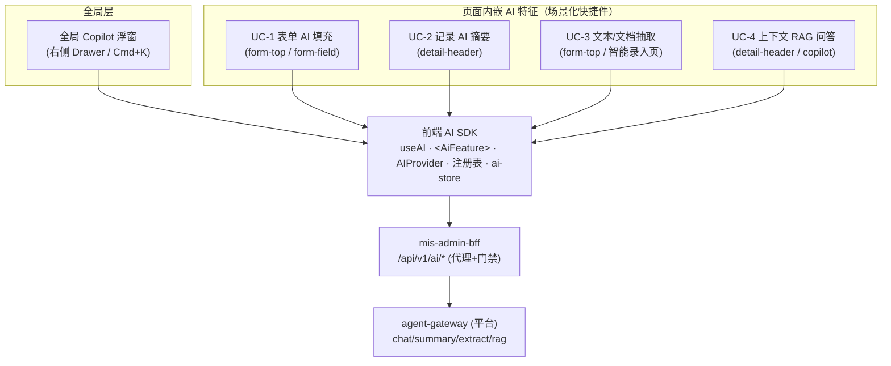
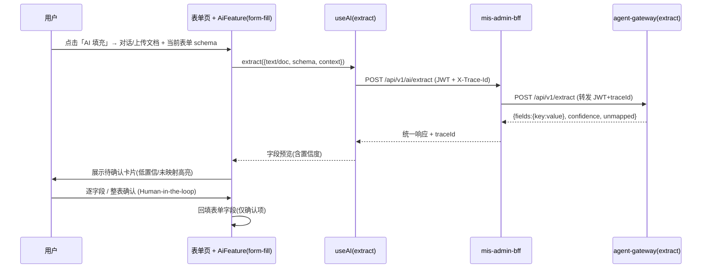
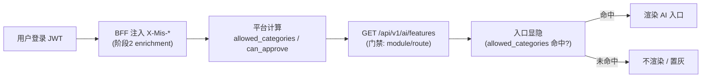

# MIS × ai-platform 前端 AI 融合增量 PRD（阶段5 · 简单 PRD）

> 文档角色：前端融合阶段的**产品级需求锁定**，承接《能力蓝图 PRD v0.1》《集成架构》《身份 clarification / enrichment》三份上游，专门解决"**阶段1+2 已落地 BFF `/api/v1/ai/*` + 平台 agents + 身份 enrichment，但 mis-admin-web 尚未接通任何 AI 入口**"这一缺口。
> 用途：锁定"前端融合（阶段5）"的**最终效果**，供架构师做集成设计、工程师实现。
> 范围约定：**简单 PRD，不做竞品分析**；不写实现代码，仅定效果、边界、验收与待确认点。
> 版本：v0.1（草案）｜语言：中文

---

## 0. 项目信息

| 项 | 内容 |
|---|---|
| Language | 中文 |
| 技术栈（复用既有，不另起炉灶） | 前端：mis-admin-web（React 18 + shadcn/ui + Tailwind + Zustand + TanStack Query）；AI SDK 规划于 `src/features/ai/`（useAI / `<AiFeature>` / `AIProvider` / 注册表 / `ai-store`）<br>接入：mis-gateway（JWT 验签 + traceId）<br>BFF：mis-admin-bff（已落地 `/api/v1/ai/*` 代理）<br>AI 层：agent-gateway（阶段1+2 已落地 chat/summary/extract/rag agents + 健康/门禁端点） |
| Project Name | `frontend_ai_integration` |
| 原始需求复述 | 让 MIS 业务前端**深度**融合 AI：AI 入口长在业务页面/组件里（表单、详情、列表），而非外挂独立聊天站；AI 根据对话或文档**自动抽字段回填表单**是用户最关心的效果；AI 不可用/无权限时主流程照常，写操作一律人工确认。 |
| 现状（关键事实） | ① 阶段1+2：BFF 已代理 `/api/v1/ai/*`（summary/extract/rag/chat/completions/health/features）；平台已具备 chat/summary/extract/rag agents。<br>② 身份 enrichment：平台按用户部门/角色已算出 `allowed_categories`（决定可访问哪些 AI 能力）与 `can_approve`（决定审批/HITL）。<br>③ **前端（mis-admin-web）尚未接通任何 AI 入口**——这是本 PRD 要解决的部分。 |

---

## 1. 产品目标

> 一句话定位：**AI 不是挂在页面角落的聊天框，而是长进业务流里的"能力件"——用户在填表时它帮抽字段，看单据时它给摘要，问制度时它引来源。**

| # | 目标 | 关键结果（可衡量） |
|---|---|---|
| G1 嵌入业务流（非外挂） | AI 入口出现在业务页面/组件的原生位置（表单字段旁、详情头部、列表右上、全局抽屉），而非独立聊天站 | ≥ 5 类业务页（表单/详情/列表/全局/知识）具备原生 AI 入口；AI 入口平均触达路径 ≤ 2 次点击 |
| G2 声明式、低成本挂载 | 业务模块挂一个 AI 特征像加一个 `<AiFeature>` 组件，复用 `useAI` + 注册表，不重复处理流式/JWT/脱敏/门禁 | 新业务页挂载一个标准 AI 特征 ≤ 0.5 人日；新增特征不改 SDK 核心 |
| G3 安全可控、降级无感 | AI 入口按 `allowed_categories` 显隐；写操作一律 Human-in-the-loop；AI 不可用/无权限时主流程照常 | 任意 AI 端点故障下，主流程（CRUD/审批）可用率 100%；无 `can_approve` 用户无法触达审批写确认 |

---

## 2. 用户故事（视角）

1. As a 业务录入员（HR/财务/销售），I want 在表单里直接对话或上传文档，AI 自动把关键信息抽出来回填表单，so that 我不必在多个系统间来回抄写、手工录入。
2. As a 业务查看者，I want 打开单据/档案详情就有 AI 摘要（要点+来源），so that 我数秒读懂长记录，不必通读全部字段。
3. As a 知识提问者（员工/新人或审计），I want 针对当前页数据或组织制度提问并得到带引用的回答，so that 我快速获得可信结论而非全网乱搜。
4. As a 任意用户，I want 一个常驻的全局 AI 助手（跨页面），自动知道我在看哪页、选中了哪些行，so that 我随时就当前上下文追问。
5. As a 审批人（can_approve），I want AI 给出风险摘要但**由我点同意/驳回**才生效，so that AI 只辅助决策、不替我签字。
6. As a 无相关权限的用户，I want 看不到本不属于我的 AI 能力入口，so that 界面清爽且不会触发越权。

---

## 3. 用例目录（核心交付）

### 3.1 用例总览表

| 用例 | 优先级 | 触发点（页面/组件） | 输入 | 输出 | 对应 BFF `/api/v1/ai/*` | 复用 SDK |
|---|---|---|---|---|---|---|
| UC-1 AI 表单智能填充 | **P0（重点）** | 业务录入表单页：①工具栏「AI 填充」主按钮 ②单字段右侧 Sparkles 图标 | 对话自然语言 / 上传文档(PDF/图/Word/Excel) / 粘贴文本 + 当前表单 schema + 已填字段 | 抽取字段 `{fieldKey:value, confidence}` → 经映射回填表单；低置信/未映射字段"待确认"（HITL） | `POST /extract`（主）；`POST /chat/completions`（澄清/多轮）；`POST /summary`（长文档先摘要再抽，可选） | `<AiFeature feature="form-fill" mountPoint="form-top|form-field">` + `useAI(extract)` |
| UC-2 记录智能摘要 | P1 | 详情页头部卡片（mountPoint=detail-header） | 当前记录脱敏后字段（主数据返回后注入） | 结构化 summary + points[](label/value/risk) + citations[](字段溯源) | `POST /summary` `{type:detail-summary, records}` | `<AiFeature feature="detail-summary" mountPoint="detail-header">` + `useAI(summary)` |
| UC-3 文本/文档抽取 | P1 | ①UC-1 面板的"粘贴/上传"子入口 ②独立「智能录入」页（大段文本→生成新记录草稿） | 非结构化文本 / 文档 | 结构化字段 → 填当前表单 或 生成新记录草稿（仍为草稿，保存需用户确认） | `POST /extract` `{text/doc, schema:{targetForm}}` | 同 UC-1 的 extract 通道 |
| UC-4 上下文 RAG 问答 | P1 | ①详情页「AI 问答」气泡(Popover/Drawer) ②全局 Copilot 上下文模式 ③知识库专属入口 | 自然语言问题 + 页上下文(route/selectedRows/记录字段) | answer + citations[](doc/page/snippet/score) | `POST /rag/query` `{question, knowledgeBaseId?, topK, threshold}`；兜底复用 `/chat/completions`(带 context) | `<AiFeature feature="rag-qa" mountPoint="detail-header|global-copilot">` + `useAI(rag)` |
| UC-5 全局 Copilot 浮窗 | **P0** | 全局常驻：右下角浮动按钮 + `Cmd+K`；跨页面；自动注入页面上下文 | 用户自由提问/指令 | SSE 流式 Markdown 对话 | `POST /chat/completions` `(stream=true)` | `copilot-panel.tsx`（升级为 SDK 驱动）+ `useAI(chat, stream)` |
| UC-6 NL2SQL 自然语言查数据 | **P2（阶段4 之后，目录预留）** | 列表页右上角「AI 查数」 | 自然语言（如"上月未审批的报销单"）+ domain | conditions（叠加为筛选）+ 只读结果集（DataScope 注入，前端不可控） | `POST /nl2sql` | `<AiFeature feature="nl2sql" mountPoint="list-top-right">`（不在本阶段实现） |

> 优先级说明：UC-1 与 UC-5 均为 P0——UC-5 是全局基础入口兼 SDK 验证件，UC-1 是用户最关心的业务效果（"重点 P0"）。UC-2/3/4 为 P1 核心场景；UC-6 用户明确"阶段4 之后"，本阶段仅作目录项预留。

### 3.2 各用例详述

#### UC-1 AI 表单智能填充（P0 · 重点）
- **触发点**：业务录入表单页（报销单/客户档案/合同等）。两种入口并存：
  - 表单工具栏主按钮「AI 填充」→ 打开填充面板；
  - 单字段右侧 Sparkles 图标 → 针对该字段发起填充（面板预聚焦该字段）。
- **输入**：
  - 对话：用户在面板内自然语言描述（"这是张三的差旅报销，金额12800，含3张发票"）；
  - 文档：上传 PDF/图片/Word/Excel，或粘贴文本；
  - 上下文：当前表单已填字段 + 表单 schema（字段 key/类型/label/必填）——用于字段映射（见 §5）。
- **输出**：抽取字段集合 `{fieldKey: value, confidence}`，经字段映射回填表单；未映射/低置信字段以"待确认"卡片呈现，用户确认后落值（HITL）。
- **对应端点**：`POST /api/v1/ai/extract`（主，带 schema+text/doc）；`POST /api/v1/ai/chat/completions`（对话澄清/多轮追问）；`POST /api/v1/ai/summary`（长文档先摘要再抽，可选）。
- **与现有 shadcn 融合**：右侧 `Sheet`，左=对话/上传区（`Textarea` + `FileUpload` + 发送按钮），右=字段预览（`Badge` 显示置信度 + 确认勾选）。

#### UC-2 记录智能摘要（P1）
- **触发点**：详情页头部卡片（mountPoint=detail-header），如报销单/客户/档案详情。
- **输入**：当前记录脱敏后字段（主数据接口返回后注入），可带 `withCitations`。
- **输出**：summary 文本 + points[]（label/value/risk）+ citations[]（字段溯源）。
- **对应端点**：`POST /api/v1/ai/summary` `{type:detail-summary, records}`。
- **融合**：详情头部可折叠卡片，进入详情默认自动触发；标注"AI 生成"。

#### UC-3 文本/文档抽取（P1）
- **触发点**：① UC-1 面板的"粘贴/上传"子入口；② 独立「智能录入」页（粘贴大段文本 → 抽字段 → 生成新记录草稿 → 保存）。
- **输入**：非结构化文本 / 文档。
- **输出**：结构化字段 → 填当前表单 或 生成新记录草稿（仍为草稿，保存需用户确认）。
- **对应端点**：`POST /api/v1/ai/extract` `{text/doc, schema:{targetForm}}`。
- **关系**：与 UC-1 共享 extract 通道；UC-3 强调"纯文本/批量抽取"，UC-1 强调"对话+场景回填"。

#### UC-4 上下文 RAG 问答（P1）
- **触发点**：① 详情页「AI 问答」气泡（Popover/Drawer）；② 全局 Copilot 上下文模式（自动注入当前路由+脱敏选中行）；③ 知识库专属入口（制度/手册）。
- **输入**：自然语言问题 + 页上下文（route/selectedRows/记录字段）。
- **输出**：answer + citations（doc/page/snippet/score）。
- **对应端点**：`POST /api/v1/ai/rag/query` `{question, knowledgeBaseId?, topK, threshold}`；或复用 `/chat/completions`(带 context) 作兜底。
- **融合**：详情页 Popover/Drawer；复用 Copilot 流式渲染。

#### UC-5 全局 Copilot 浮窗（P0）
- **触发点**：全局常驻；右下角浮动按钮 + `Cmd+K`；跨页面。自动注入页面上下文。
- **输入**：用户自由提问/指令。
- **输出**：SSE 流式 Markdown 对话。
- **对应端点**：`POST /api/v1/ai/chat/completions` `(stream=true)`。
- **融合**：右侧 `Drawer`（复用已有 CopilotPanel 占位，升级为 SDK 驱动），流式渲染；可引用页上下文发起追问。

#### UC-6 NL2SQL 自然语言查数据（P2 · 阶段4 之后，目录预留）
- **触发点**：列表页右上角「AI 查数」。
- **输入**：自然语言 + domain。
- **输出**：conditions（叠加为筛选）+ 只读结果集（DataScope 注入，前端不可控）。
- **对应端点**：`POST /api/v1/ai/nl2sql`。
- **说明**：用户明确"阶段4 之后"，本阶段仅作目录项预留，**不进入阶段5 实现范围**；其数据权限沙箱（行级 DataScope + 列级白名单）由架构阶段4 落地。

---

## 4. UI 交互草稿

### 4.1 入口形态总览

| 用例 | 入口形态 | shadcn 组件 | 挂载点(mountPoint) |
|---|---|---|---|
| UC-1 表单智能填充 | 工具栏主按钮 + 字段右侧图标 → 右侧 `Sheet` 面板 | `Button` + `Sheet` + `Textarea` + `FileUpload` + `Badge`(置信度) | `form-top` / `form-field` |
| UC-2 记录智能摘要 | 详情头部可折叠卡片 | `Card` + `Collapsible` + `Badge` | `detail-header` |
| UC-3 文本/文档抽取 | UC-1 面板内 tab / 独立「智能录入」页 | `Tabs` / `Page` + `Textarea` | `form-top` |
| UC-4 RAG 问答 | 详情页气泡(Popover) / Copilot 上下文模式 | `Popover` / `Drawer` | `detail-header` / `global-copilot` |
| UC-5 全局 Copilot | 右下角浮动 FAB + `Cmd+K` → 右侧 `Drawer` | `FloatingButton`(自定义) + `Command`(cmdk) + `Drawer` | `global-copilot` |

### 4.2 与现有 mis-admin-web（shadcn 规范）的融合方式
- **统一图标与触发热键**：所有 AI 入口用 `lucide-react` 的 `Sparkles` 图标；Copilot 统一 `Cmd+K` 唤起。
- **声明式挂载**：业务页只需写 `<AiFeature feature="form-fill" mountPoint="form-top" context={...} />`，挂载点/降级/loading 由 `<AiFeature>` 通用壳处理，业务页不感知流式/JWT/脱敏。
- **统一流式渲染**：AI 输出用 `react-markdown` + `remark-gfm` 渲染，与 shadcn `prose` 样式对齐；流式累积用 `Skeleton` 占位。
- **标注"AI 生成"**：所有 AI 输出默认带"AI 生成"角标；决策类输出（摘要/风险）附引用来源。

### 4.3 加载 / 失败 / 降级态（统一，不影响主流程）
> 由 `AIProvider` + `ai-store` 持有全局 AI 可用性（health + features 门禁），`<AiFeature>` 统一消费。

```mermaid
flowchart LR
  Init["<AiFeature> 挂载"] --> Gate["GET /api/v1/ai/features<br/>+ GET /api/v1/ai/health"]
  Gate -->|enabled 且 health=up| Show["渲染 AI 入口(正常)"]
  Gate -->|disabled / health=down / 超时报错| Fallback["按 fallback 策略降级"]
  Fallback -->|hide(默认)| Hide["入口不渲染"]
  Fallback -->|disable| Disable["入口置灰 + tooltip 'AI 暂不可用'"]
  Fallback -->|message| Msg["保留入口 + 点击提示"]
  Show --> Loading["请求中: Skeleton / 流式 loading"]
  Loading --> Ok["成功: 渲染结果"]
  Loading --> Err["失败: toast + 重试按钮"]
  Hide --> Main["主流程照常(CRUD/审批可用)"]
  Disable --> Main
  Msg --> Main
  Ok --> Main
```

- **硬约束**：降级**绝不影响主流程**——列表/详情/表单/审批照常可用，AI 仅为增强层。
- **默认 fallback = `hide`**（最安全，最小暴露面）；`disable`/`message` 由配置中心或注册表按 feature 指定。
- **流式加载**：chat/rag 用 SSE，累积渲染；非流式（extract/summary）用 Skeleton。
- **失败**：toast 提示 + 「重试」；不阻塞表单提交/详情展示。

### 4.4 前端 AI 入口分层（全局 + 页面内嵌 共享 SDK/BFF）



### 4.5 关键时序：UC-1 表单智能填充（对话/文档 → 抽字段 → 映射 → 确认 → 回填）



---

## 5. 字段映射机制（Open Question · 待确认）

### 5.1 问题陈述
UC-1/UC-3 的核心难题：**AI 抽出的字段**如何映射到**当前表单字段**？即 extract 端点返回的 `fields` 键，与表单组件里的字段 key 如何对应。

### 5.2 可行方案

| 方案 | 机制 | 优点 | 缺点 |
|---|---|---|---|
| **A. 每页显式配置映射表** | 每个表单页在 `ai-feature-registry` 或表单定义里声明 `{AI输出字段名} ↔ {表单字段key}` 映射；AI 返回规范字段名，前端按表映射 | 结果可预测、易调试、不依赖 LLM 精度 | 每个表单需维护映射，接入成本随表单数线性增长 |
| **B. AI 按表单 schema 自适应** | 前端把当前表单 schema（字段 key/类型/label/必填）随请求发给 extract；AI 直接返回**以表单字段 key 为键**的值 | 零每页映射配置，表单改字段 AI 自动适配 | 依赖 LLM 对 schema 的理解与稳定性；需 extract 端点支持 schema 透传并直出 form-keyed 值；长 schema 增加 token |
| **C. 混合（推荐）** | 默认走 B（发 schema，AI 直出 form-keyed 值）；对歧义/非显而易见字段提供 A 的 override 映射层；低置信度字段一律"待确认" | 兼顾零配置与可控；新增表单默认即能用，特殊字段可精修 | 需 extract 端点支持 schema 入参（阶段1+2 已有 extract 需扩展） |

### 5.3 推荐与待确认
- **推荐：方案 C（混合）**。默认 B（schema 自适应）让新表单"声明即有 AI 填充"，A 作为覆盖层处理少数语义歧义字段；所有低置信（`confidence < 阈值`）或未映射字段进入"待确认"人工确认（HITL）。
- **待确认（交给架构师/用户拍板）**：
  1. extract 端点是否扩展支持 `schema`（字段 key/类型/label）入参并直出 form-keyed 值？（B/C 的前提，需阶段1+2 已有 `/extract` 增量）
  2. 字段 key 命名约定谁定（前端表单 key ↔ AI 输出键）？建议以**前端表单字段 key 为唯一真源**。
  3. 低置信强制确认的阈值（建议 0.85）由谁配置？

---

## 6. 权限边界

### 6.1 AI 入口按 `allowed_categories` 显隐
- **机制**：用户登录后，BFF 注入 `X-Mis-*`（阶段2 identity enrichment）→ 平台按部门/角色算出 `allowed_categories`；`GET /api/v1/ai/features?module=&route=` 返回当前用户在该页可用 feature 列表（门禁维度：租户>角色>模块>路由）。
- **显隐规则**：每个 AI feature 绑定一个或多个 category（如 `form-fill`→`["expense","hr"]`）；若用户 `allowed_categories` 不含该 feature 所需 category → `<AiFeature>` 入口不渲染（或按 fallback 置灰）。
- **入口**：`<AiFeature>` 挂载时先调用 `/features` + `/health` 决定是否显示，业务页无需手写权限判断。



### 6.2 审批/HITL：`can_approve` 决定写确认权
- `can_approve` = 用户任一角色/部门可审批即为 True（多部门并集，见 identity 文档）。
- 无 `can_approve` 的用户：审批类 AI 摘要可见（只读），但**无执行写确认权**（按钮隐藏/置灰），写动作不对其开放。

### 6.3 写操作 Human-in-the-loop 矩阵

| 用例 | 是否写操作 | HITL 确认点 | 确认粒度 |
|---|---|---|---|
| UC-1 表单智能填充 | 否（仅回填建议） | 抽字段回填前需用户确认（尤其金额/身份类） | 逐字段或整表确认；低置信强制确认 |
| UC-2 记录智能摘要 | 否（只读） | 无 | — |
| UC-3 文本/文档抽取 | 否（生成草稿） | 草稿保存为正式记录前需用户确认 | 整表确认 |
| UC-4 RAG 问答 | 否（只读） | 无 | — |
| UC-5 全局 Copilot | 否（对话） | 无（对话不触发写） | — |
| UC-6 NL2SQL | 否（只读沙箱） | 无（仅查，不写） | — |
| 审批 AI 风险摘要（蓝图 P1-3，本阶段目录参照） | 是（同意/驳回） | **必须**用户点同意/驳回才执行 | 整单确认；需 `can_approve` |

> **铁律**：AI 只生成建议/抽取/摘要；**任何写动作一律 Human-in-the-loop**，由用户在 UI 确认后经原领域 API 执行，AI 层不承载核心交易写逻辑。

---

## 7. 验收标准（每用例可验收点）

- **UC-1 表单智能填充（P0）**
  - [ ] 在表单页点击「AI 填充」可打开面板；对话/上传文档后，AI 返回的字段能回填到对应表单字段。
  - [ ] 字段映射正确（采用 §5 选定方案）；低置信/未映射字段以"待确认"呈现，未确认不落值。
  - [ ] 回填为建议值，用户确认（HITL）后才写入表单 state；金额/身份证类必确认。
  - [ ] 文档上传（PDF/图/Word/Excel 至少 1 类）可触发抽取。
- **UC-2 记录智能摘要（P1）**
  - [ ] 详情页头部出现「AI 摘要」卡片，进入详情自动触发；展示 summary + 要点 + 引用来源。
  - [ ] 输出标注"AI 生成"；引用可点击溯源到字段。
- **UC-3 文本/文档抽取（P1）**
  - [ ] 粘贴文本/上传文档后能抽字段；可一键填入当前表单或生成新记录草稿。
  - [ ] 草稿保存为正式记录前需用户确认。
- **UC-4 上下文 RAG 问答（P1）**
  - [ ] 详情页「AI 问答」或 Copilot 上下文模式能就当前页/制度提问；返回带引用溯源的回答。
  - [ ] 自动注入当前路由/脱敏选中行作为上下文。
- **UC-5 全局 Copilot 浮窗（P0）**
  - [ ] 右下角 FAB + `Cmd+K` 可唤起；跨页面常驻；流式 Markdown 渲染正常。
  - [ ] 自动注入页面上下文；对话不触发任何写操作。
- **UC-6 NL2SQL（P2，仅目录）**
  - [ ] 本阶段不实现；目录项与端点映射已预留，待阶段4 之后接入。
- **通用（G3）**
  - [ ] `GET /api/v1/ai/features` 返回 disabled 时，对应入口按 fallback 隐藏/置灰；主流程（CRUD/审批）不受影响。
  - [ ] 无 `allowed_categories` 命中时，AI 入口不渲染；无 `can_approve` 时审批写确认不开放。
  - [ ] AI 端点故障/超时时，主流程可用率 100%。

---

## 8. 待确认问题清单（交给架构师 / 用户拍板）

| # | 问题 | 影响范围 | 建议决策方 |
|---|---|---|---|
| Q1 | 字段映射机制选型（§5 推荐 C 混合）：是否采纳？extract 端点是否扩展 `schema` 入参直出 form-keyed 值？ | UC-1/UC-3 核心可行性 | 产品+架构 |
| Q2 | 表单字段 key 命名约定：以前端表单 key 为唯一真源？AI 输出键如何对齐？ | 映射稳定性 | 产品+前端 |
| Q3 | 低置信强制确认阈值（建议 0.85）与确认粒度（逐字段/整表）由谁配置？ | UC-1 HITL 体验 | 产品 |
| Q4 | 文档上传通道：前端直传 BFF→agent，还是 base64 内联？文件大小/类型/页数限制？ | UC-1/UC-3 输入能力 | 架构 |
| Q5 | `allowed_categories` → feature 的绑定规则（每个 feature 绑哪些 category）由谁配置（配置中心 P1-6 / 注册表）？ | 权限边界 | 产品+架构 |
| Q6 | 降级默认策略全局 `hide` 还是允许 `disable`？AI 入口 disabled 时置灰 vs 隐藏（暴露面 vs 可发现性）？ | UX + 合规暴露面 | 产品 |
| Q7 | NL2SQL 是否确认坚持"阶段4 之后"不纳入阶段5？（用户已表述，确认落档） | 范围 | 产品 |
| Q8 | AI 生成内容是否需入 mis-audit 留痕（架构 Q7）？阶段5 是否先做埋点（P2-4 成本看板前置）？ | 审计合规 | 产品+合规 |
| Q9 | Copilot 浮窗与表单填充面板是否共享会话/上下文（用户在 Copilot 说"帮我填这张报销单"能否跳转到填充动作）？ | 体验连贯性 | 产品+前端 |
| Q10 | 移动端（企微 H5）适配：表单填充面板/摘要卡片在小屏如何布局（Sheet 全屏化？） | 多端 | 前端 |
| Q11 | 对话/摘要是否需要持久化（架构 Q3，P2-3）？阶段5 是否先无状态？ | 存储设计 | 产品 |

---

## 9. 给架构师的衔接提示（非 PRD 必填，便于落地）

- **复用不重写**：阶段1+2 已落地 BFF `/api/v1/ai/*`（summary/extract/rag/chat/completions/health/features）+ 平台 agents；本阶段前端只消费既有契约，无需新增端点（除 §5 Q1 可能扩展 extract 的 `schema` 入参）。
- **SDK 即契约**：前端 `useAI` / `<AiFeature>` / `AIProvider` / 注册表 / `ai-store` 已在集成架构 §2.1、§3.1 规划，本 PRD 的用例即这些组件的"消费方清单"。
- **门禁就绪**：`GET /api/v1/ai/features` 已能按 module/route 返回可用 feature；前端 `<AiFeature>` 消费它做显隐，与 `allowed_categories` 联动（见 §6）。
- **写操作铁律**：所有写动作 Human-in-the-loop，AI 仅生成建议；与 ADR-005、集成架构 §0 完全一致。
- **降级兜底**：`<AiFeature>` 统一处理 health/features/超时/报错降级，业务页零感知（见 §4.3）。

---

> 文档结束。本 PRD 为阶段5 前端融合的**效果锁定**（简单 PRD，无竞品分析、无实现代码）。落地细节（SDK 实现、extract schema 扩展、配置中心）交由架构师集成设计与工程阶段展开；与《能力蓝图 PRD v0.1》《集成架构》《身份 clarification / enrichment》保持一致。
