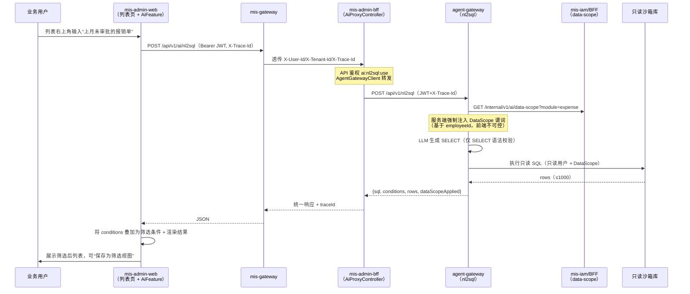
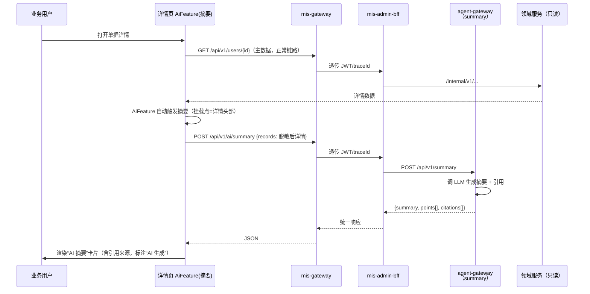
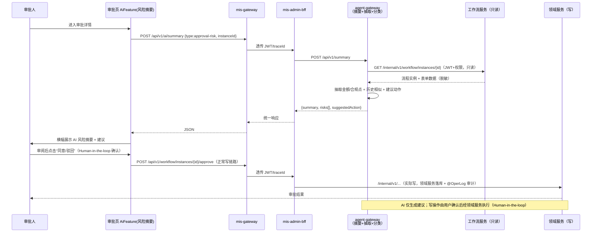
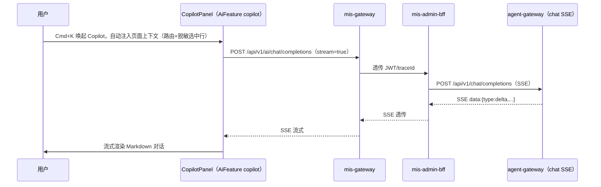
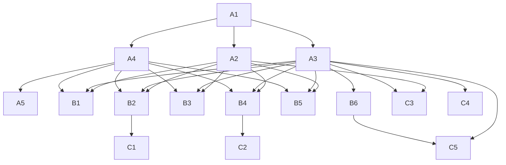

# MIS Platform AI 深度融合集成架构

> 本文档是产品《MIS Platform AI 深度融合能力蓝图 PRD（v0.1）》的**架构配套设计**，承接其产品目标、分层 AI 能力目录与 P0/P1/P2 需求池，给出"平台级 AI 能力底座 + 声明式接入范式"的落地架构、契约与分阶段路线。范围限定为**架构设计与规划**（含接口/类型/约定示意），**不产出可运行业务代码**；实现细节交由后续工程阶段（Phase A/B/C）展开。

---

## 0. 设计总览与核心决策

| 维度 | 决策 | 理由 |
|---|---|---|
| 定位 | AI 从"外挂 Copilot"升级为**平台级可复用能力底座 + 声明式接入范式** | PRD G1/G2/G3；让 P1 特征可批量长出而非逐个定制 |
| 复用 | 不另起炉灶，全部复用既有栈：mis-admin-web / mis-gateway / mis-admin-bff / agent-gateway | ADR-005、02-system-architecture、frontend 规范 |
| 调用链 | 前端 → mis-gateway（JWT 验签+traceId）→ mis-admin-bff（`/api/v1/ai/*` 代理）→ agent-gateway（:8200） | 落实"业务前端只调 BFF、不直接连 AI 层" |
| 写操作 | AI 只**生成建议/抽取/摘要**，写动作一律 Human-in-the-loop，由用户在 UI 确认后经领域服务执行 | ADR-005 约束 + 安全合规 |
| 数据权限 | NL2SQL 仅只读沙箱 + 服务端强制注入 DataScope（基于 JWT employeeId）；列级走 domain 白名单 | PRD Q6 + 03-security §6.2 |
| 降级 | AI 不可用时入口隐藏/置灰，**不影响主流程**（列表/详情/表单照常可用） | PRD §4.3 一致性约定 |

**一句话架构原则：** 业务模块"声明即拥有"——通过前端 AI SDK + BFF 代理 + agent-gateway 稳定契约三层收敛，业务只依赖契约与声明式元数据，不感知模型、流式、JWT 透传与脱敏细节。

---

## 1. 实现方案 + 框架选型

### 1.1 技术挑战与应对

| 难点 | 应对（复用既有） |
|---|---|
| 多业务模块重复对接 agent-gateway、各自处理 SSE/JWT/脱敏 | 前端 `useAI` Hook + `<AiFeature>` 组件族统一封装；BFF `AiProxyController` 统一代理 |
| 模型/供应商频繁切换影响业务 | agent-gateway `llm_router` 多模型可插拔（OpenAI 兼容协议，按 base_url 路由） |
| 写操作安全边界 | Human-in-the-loop：AI 返回 `suggestedAction` 载荷，前端确认后走原领域 API |
| 数据越权（NL2SQL） | 只读沙箱 DB 用户 + 服务端注入 DataScope + domain 表/列白名单 + 仅 SELECT 语法校验 |
| 脱敏责任分散 | 声明式元数据显式标注 `desensitizeOwner`（frontend/bff/agent），默认后端/agent 兜底 |
| 灰度与开关 | BFF `AiFeatureConfigService` + `GET /api/v1/ai/features` 门禁端点，维度 租户>角色>模块>路由 |

### 1.2 框架/库选型（不新增运行时栈）

- **前端**：沿用 React 18 + shadcn/ui + Tailwind + Zustand + TanStack Query；新增 `fetch-event-source`（SSE 流式）、`react-markdown`（AI 输出渲染）。
- **BFF（Java）**：沿用 Spring Cloud（WebFlux 或 MVC + `StreamingResponse`）做 SSE 透传；沿用 `ApiPermissionInterceptor` + 权限映射表做 AI 接口鉴权；新增 `AgentGatewayClient`（WebClient）。
- **agent-gateway（Python/FastAPI）**：沿用 FastAPI；新增 `sse-starlette`（SSE）、`langchain`/`langgraph`（编排，Phase B 起）、`pydantic`（契约）、`openai`（兼容客户端做多模型路由）、向量库 client（`psycopg`+pgvector 或 `pymilvus`）。
- **存储**：沿用 PostgreSQL（pgvector 扩展优先复用，避免新中间件）、Redis（缓存/会话/对话 P2-3）。

### 1.3 架构模式

- 前端：声明式组件 + Provider/Context（AI 上下文、可用性、页上下文）。
- BFF：反向代理 + 鉴权 + 契约透传（thin proxy），无 AI 业务逻辑。
- agent-gateway：能力目录（Capability Registry）+ 编排器 + 工具执行器（受控、JWT 身份）。
- 整体：分层契约驱动（Contract-First），业务与实现解耦。

---

## 2. 文件列表及相对路径（规划，标注 新建/改造）

### 2.1 前端 `frontend/mis-admin-web/`（新增 `features/ai/`）

| 路径 | 类型 | 说明 |
|---|---|---|
| `src/features/ai/index.ts` | 新建 | 统一导出 SDK |
| `src/features/ai/types.ts` | 新建 | `AiCapability` / `AiFeatureKey` / 契约类型（示意） |
| `src/features/ai/ai-context.tsx` | 新建 | `AIProvider` + `useAiContext()`（可用性、页上下文、抽屉态） |
| `src/features/ai/use-ai.ts` | 新建 | 通用 `useAI` Hook（封装流式/JWT/脱敏/错误态/降级） |
| `src/features/ai/ai-sse-client.ts` | 新建 | SSE 客户端封装（基于 fetch-event-source） |
| `src/features/ai/ai-feature-registry.ts` | 新建 | 声明式特征注册表（feature 清单 + 挂载点 + 元数据） |
| `src/features/ai/lib/desensitize.ts` | 新建 | 前端脱敏工具（手机号/身份证/金额等） |
| `src/features/ai/components/ai-feature.tsx` | 新建 | `<AiFeature>` 通用壳（挂载点/降级/loading） |
| `src/features/ai/components/ai-nl2sql.tsx` | 新建 | 列表自然语言查数组件 |
| `src/features/ai/components/ai-summary.tsx` | 新建 | 详情/审批 AI 摘要卡片 |
| `src/features/ai/components/ai-form-fill.tsx` | 新建 | 表单 AI 填充/校验 |
| `src/features/ai/components/ai-report-insight.tsx` | 新建 | 报表 AI 解读气泡 |
| `src/features/ai/components/ai-copilot.tsx` | 新建 | 全局 Copilot 对话内容（接入 SDK） |
| `src/stores/ai-store.ts` | 新建 | Zustand：AI 可用性、Copilot 开合、页上下文缓存 |
| `src/components/layout/copilot-panel.tsx` | 改造 | 接入 SDK + 页面上下文感知（原占位升级） |
| `src/features/system/user/user-list-page.tsx` | 改造 | 示例：挂载 `nl2sql` + `summary` 特征 |
| `src/features/system/user/user-detail-page.tsx` | 改造 | 示例：挂载 `summary` 特征 |

### 2.2 BFF `backend/mis-admin-bff/`（新增 `ai` 包）

| 路径 | 类型 | 说明 |
|---|---|---|
| `.../ai/controller/AiProxyController.java` | 新建 | `/api/v1/ai/**` 代理（chat/summary/extract/nl2sql/rag），SSE 透传 |
| `.../ai/controller/AiFeatureController.java` | 新建 | `/api/v1/ai/health`、`/api/v1/ai/features`（门禁/灰度） |
| `.../ai/client/AgentGatewayClient.java` | 新建 | WebClient 调 agent-gateway（转发 JWT + X-Trace-Id） |
| `.../ai/service/AiFeatureConfigService.java` | 新建 | 开关/灰度配置（维度 租户>角色>模块>路由） |
| `.../ai/dto/AiProxyRequest.java` / `AiProxyResponse.java` | 新建 | 代理请求/响应封装 |
| `.../ai/config/AiPermissionConfig.java` | 新建 | 声明 `ai:*` 权限到映射表 |
| `src/main/resources/api-permissions.yml` | 改造 | 新增 `ai:chat:use` 等权限项 |
| `src/main/resources/application.yml` | 改造 | 新增 `agent-gateway` 路由地址配置 |

### 2.3 agent-gateway `agent/agent-gateway/`（能力目录 + 稳定契约）

| 路径 | 类型 | 说明 |
|---|---|---|
| `app/api/v1/ai/chat.py` | 改造 | 统一对话/流式（SSE），接入 llm_router + 上下文 |
| `app/api/v1/ai/summary.py` | 新建 | 内容摘要（detail/approval-risk/report） |
| `app/api/v1/ai/extract.py` | 新建 | 信息抽取 |
| `app/api/v1/ai/nl2sql.py` | 新建 | NL2SQL 只读沙箱（DataScope 注入） |
| `app/api/v1/ai/rag.py` | 新建 | RAG 检索（引用溯源） |
| `app/core/models.py` | 新建/扩展 | Pydantic 契约（Capability/Request/Response/Usage） |
| `app/core/security.py` | 改造 | JWT RS256 验签（骨架已有，补 traceId 上下文） |
| `app/core/trace.py` | 新建 | traceId 透传/生成/跨服务传递 |
| `app/services/capability_registry.py` | 新建 | 能力元数据注册表（名称/版本/契约/权限/只读标记） |
| `app/services/data_scope.py` | 新建 | DataScope 解析与 SQL 注入（调 BFF `/internal/v1/ai/data-scope`） |
| `app/services/llm_router.py` | 新建 | 多模型路由（通义/DeepSeek/OpenAI 兼容） |
| `app/services/rag_service.py` | 新建 | RAG 编排（embedding+检索+重排） |
| `app/clients/java_api_client.py` | 改造 | 调 mis-admin-bff `/internal/v1/*`（JWT 身份，只读为主） |
| `app/clients/vector_store.py` | 新建 | 向量库 client（pgvector / Milvus 适配） |
| `pyproject.toml` | 改造 | 新增依赖（sse-starlette/langchain/openai/psycopg 等） |

### 2.4 文档（新建）

| 路径 | 类型 | 说明 |
|---|---|---|
| `docs/ai-integration/ai-access-spec.md` | 新建 | 《AI 能力接入规范》（P0-1） |
| `docs/ai-integration/ai-feature-registry.md` | 新建 | 声明式注册表与挂载点约定（P0-5） |
| `docs/adr/ADR-006-ai-integration-layer.md` | 新建 | 记录本设计决策（衔接 ADR-005） |

---

## 3. 数据结构和接口（契约）

> 约定：所有非流式响应遵循平台统一包络 `{code, message, data, traceId}`；流式走 SSE（`data: {...}` 事件）。前端契约用 TypeScript 类型示意，agent-gateway 用 Pydantic 示意，BFF 为"透传 + 门禁"。

### 3.1 前端 AI SDK 接口（示意）

```typescript
// src/features/ai/types.ts（示意）
export type AiCapability = 'chat' | 'summary' | 'extract' | 'nl2sql' | 'rag';
export type AiFeatureKey =
  | 'nl2sql' | 'detail-summary' | 'approval-risk'
  | 'form-fill' | 'form-validate' | 'report-insight' | 'copilot';

export interface AiPageContext {
  route: string;                 // 当前路由，如 /system/user
  module: string;               // 业务模块，如 user
  selectedRows?: Record<string, unknown>[]; // 脱敏后的选中行
}

export interface UseAIOptions<TReq, TResp> {
  capability: AiCapability;
  feature?: AiFeatureKey;        // 用于配置门禁与审计
  request: TReq;
  stream?: boolean;             // 默认 false；chat 用 true
  context?: AiPageContext;
  onToken?: (delta: string) => void;     // 流式增量
  onDone?: (result: TResp) => void;
  onError?: (err: AiError) => void;
  fallback?: 'hide' | 'disable' | 'message'; // 降级策略，默认 hide
}

export interface UseAIResult<TResp> {
  data: TResp | null;
  streaming: string;            // 流式累积文本
  loading: boolean;
  error: AiError | null;
  unavailable: boolean;         // AI 不可用（隐藏入口）
}

// useAI 签名
export function useAI<TReq, TResp>(opts: UseAIOptions<TReq, TResp>): UseAIResult<TResp>;

// <AiFeature> 通用壳 props
export interface AiFeatureProps {
  feature: AiFeatureKey;
  mountPoint: 'list-top-right' | 'detail-header' | 'form-field'
            | 'approval-banner' | 'report-bubble' | 'global-copilot';
  title: string;
  icon?: string;
  context?: AiPageContext;
  request: Record<string, unknown>;   // 传给对应 capability 的入参
  render?: (state: UseAIResult<unknown>) => React.ReactNode;
}
```

### 3.2 BFF `/api/v1/ai/*` 契约（前端↔BFF）

> 注：PRD 中写 `/internal/v1/ai/*` 指 BFF 内部代理分组；对**前端统一收敛为 `/api/v1/ai/*`**（经 mis-gateway 暴露），BFF 内部再以 `AgentGatewayClient` 转发到 agent-gateway 的 `/api/v1/*`。

| 方法 | 路径 | 说明 | 权限（示例） |
|---|---|---|---|
| POST | `/api/v1/ai/chat/completions` | 统一对话/流式（SSE） | `ai:chat:use` |
| POST | `/api/v1/ai/summary` | 内容摘要 | `ai:summary:use` |
| POST | `/api/v1/ai/extract` | 信息抽取 | `ai:extract:use` |
| POST | `/api/v1/ai/nl2sql` | 自然语言查数 | `ai:nl2sql:use` |
| POST | `/api/v1/ai/rag/query` | RAG 检索 | `ai:rag:use` |
| GET | `/api/v1/ai/health` | AI 层健康（驱动降级） | 登录即可 |
| GET | `/api/v1/ai/features?module=&route=` | 当前用户可用特征门禁 | 登录即可 |

BFF 透传约定（落到 agent-gateway 请求头）：
- `Authorization: Bearer {accessToken}`（Gateway 已验签，BFF 信任透传头，ADR-003）
- `X-Trace-Id`：复用 Gateway 透传的 traceId；BFF 生成则下发
- `X-User-Id` / `X-Tenant-Id` / `X-Employee-Id`：已由 Gateway 透传
- 响应统一带 `traceId`；SSE 每个事件带 `traceId`（done/error 事件必带）

`GET /api/v1/ai/features` 响应（驱动声明式门禁）：
```json
{
  "code": 0, "message": "ok", "traceId": "t-001",
  "data": {
    "enabled": ["nl2sql", "detail-summary"],
    "disabled": ["report-insight"],
    "config": {
      "nl2sql": { "maxRows": 1000, "canSaveView": true },
      "detail-summary": { "withCitations": true }
    }
  }
}
```

### 3.3 agent-gateway 对外稳定契约（FastAPI `/api/v1/*`）

**统一包络（非流式）：** `{code, message, data, traceId}`，错误 `code` 沿用平台区间（40100 认证 / 40300 权限 / 42900 限流 / 50000 系统）。

**① 对话/流式 `POST /api/v1/chat/completions`（SSE）**
```jsonc
// 请求
{ "messages": [{"role":"user","content":"上月未审批的报销单有哪些？"}],
  "context": {"route":"/system/expense","module":"expense","selectedRows":[]},
  "stream": true, "model": "auto" }
// SSE 事件
data: {"type":"delta","delta":{"content":"你好"},"traceId":"t-001"}
data: {"type":"done","finish_reason":"stop","usage":{"prompt_tokens":12,"completion_tokens":30},"traceId":"t-001"}
data: {"type":"error","code":50000,"message":"模型超时","traceId":"t-001"}
```

**② 摘要 `POST /api/v1/summary`**
```jsonc
// 请求
{ "type":"approval-risk", "records":[ {...脱敏后...} ], "withCitations":true, "maxLength":300 }
// 响应 data
{ "summary":"该报销单金额 ¥12,800，超部门月度额度...",
  "points":[{"label":"金额","value":"¥12,800","risk":"high","source":"报销单#2026-001"}],
  "citations":[{"field":"amount","value":"12800","source":"报销单#2026-001"}],
  "model":"qwen-max","usage":{"prompt_tokens":200,"completion_tokens":80} }
```

**③ 抽取 `POST /api/v1/extract`**
```jsonc
// 请求
{ "text":"张三，报销差旅费12800元，发票号INV-123",
  "schema":{"fields":[{"name":"name","type":"string"},{"name":"amount","type":"number"}]},
  "targetForm":"expense", "desensitize":true }
// 响应 data
{ "fields":{"name":"张三","amount":12800},
  "confidence":{"name":0.98,"amount":0.95}, "unmapped":[] }
```

**④ NL2SQL `POST /api/v1/nl2sql`**
```jsonc
// 请求
{ "question":"上月未审批的报销单", "domain":"expense",
  "returnConditions":true, "maxRows":1000 }
// 响应 data（dataScope 由服务端注入，前端不可控）
{ "sql":"SELECT * FROM expense WHERE status='PENDING' AND created_at >= '2026-06-01' AND <DataScope谓词>",
  "conditions":[{"field":"status","op":"eq","value":"PENDING"},
                {"field":"createdAt","op":"gte","value":"2026-06-01"}],
  "columns":["id","title","amount","status"],
  "rows":[["...","...",12800,"PENDING"]],
  "rowCount":42, "dataScopeApplied":true, "citations":null }
```

**⑤ RAG `POST /api/v1/rag/query`**
```jsonc
// 请求
{ "question":"差旅报销标准是多少？", "knowledgeBaseId":"kb-expense-policy", "topK":5, "threshold":0.7 }
// 响应 data
{ "answer":"差旅报销标准为...",
  "citations":[{"doc":"报销制度.pdf","page":3,"snippet":"...","score":0.82}],
  "model":"qwen-max","usage":{...} }
```

### 3.4 契约关系（classDiagram 示意）

```mermaid
classDiagram
class AiCapability { <<enum>> chat summary extract nl2sql rag }
class AiFeatureKey { <<enum>> nl2sql detail-summary approval-risk form-fill form-validate report-insight copilot }
class AiPageContext { route: string module: string selectedRows: array }
class UseAIOptions { capability: AiCapability request: object stream: boolean context: AiPageContext fallback: string }
class UseAIResult { data: object streaming: string loading: boolean error: object unavailable: boolean }
class AiFeatureProps { feature: AiFeatureKey mountPoint: string title: string request: object }
class AiFeatureDeclaration { key: AiFeatureKey capability: AiCapability mountPoint: string module: string desensitizeOwner: string fallback: string permission: string }

UseAIOptions ..> AiCapability
UseAIOptions ..> AiPageContext
UseAIResult ..> AiFeatureKey
AiFeatureProps ..> AiFeatureKey
AiFeatureDeclaration ..> AiCapability
AiFeatureDeclaration ..> AiFeatureKey

class AiProxyRequest { capability: string body: object traceId: string }
class AiProxyResponse { code: int message: string data: object traceId: string }
class AiFeatureGating { enabled: array config: object }

class ChatRequest { messages: array context: AiPageContext stream: boolean model: string }
class SummaryRequest { type: string records: array withCitations: boolean }
class SummaryResponse { summary: string points: array citations: array usage: object }
class ExtractRequest { text: string schema: object targetForm: string desensitize: boolean }
class ExtractResponse { fields: object confidence: object unmapped: array }
class Nl2SqlRequest { question: string domain: string returnConditions: boolean }
class Nl2SqlResponse { sql: string conditions: array rows: array dataScopeApplied: boolean }
class RagQueryRequest { question: string knowledgeBaseId: string topK: int threshold: float }
class RagQueryResponse { answer: string citations: array usage: object }
class CapabilityMeta { name: string version: string readOnly: boolean needDataScope: boolean permission: string }

AiProxyRequest ..> AiCapability
SummaryRequest ..> SummaryResponse
ExtractRequest ..> ExtractResponse
Nl2SqlRequest ..> Nl2SqlResponse
RagQueryRequest ..> RagQueryResponse
CapabilityMeta ..> AiCapability
```



---

## 4. 程序调用流程（时序图）

### 4.1 场景①：列表自然语言查数（NL2SQL 只读沙箱 + 数据权限）



### 4.2 场景②：详情页 AI 摘要



### 4.3 场景③：审批 AI 风险摘要（含 Human-in-the-loop 写确认）



### 4.4 场景④：全局 Copilot 上下文感知对话（标准入口）



---

## 5. 任务列表（有序、含依赖、按实现顺序）

> 规划原则：**Phase A（P0）必须先于 Phase B/C**；业务模块接入成本下降的关键是 A 层契约/SDK 先稳定。Phase A 内部 A1（规范）先行，A2/A3/A4 可并行，A5 依赖 A4。Phase B 各特征依赖 Phase A 三件套（A2 契约 / A3 代理 / A4 SDK）；B6（配置中心）建议尽早就绪以支撑门禁，但不阻塞特征开发。

### Phase A — 接入范式 / SDK / 契约地基（P0）

| 任务 ID | 任务名 | 来源文件 | 依赖 | 优先级 |
|---|---|---|---|---|
| A1 | 发布《AI 能力接入规范》+ 声明式元数据格式 | `docs/ai-integration/*` | — | P0 |
| A2 | agent-gateway 稳定对外契约（chat/summary/extract/nl2sql/rag，JWT+traceId+SSE） | `agent/agent-gateway/app/api/v1/ai/*`, `core/models.py`, `core/trace.py`, `services/capability_registry.py` | A1 | P0 |
| A3 | BFF AI 代理（/api/v1/ai/* + AgentGatewayClient + 门禁端点） | `backend/mis-admin-bff/.../ai/*`, `api-permissions.yml` | A1 | P0 |
| A4 | 前端 AI SDK（useAI + AiFeature + AIProvider + SSE 封装 + 注册表） | `frontend/mis-admin-web/src/features/ai/*`, `stores/ai-store.ts` | A1 | P0 |
| A5 | 全局 Copilot 侧边栏升级（接入 SDK + 页上下文 + 门禁） | `src/components/layout/copilot-panel.tsx`, `features/ai/components/ai-copilot.tsx` | A4 | P0 |

### Phase B — 核心场景标准特征（P1）

| 任务 ID | 任务名 | 来源文件 | 依赖 | 优先级 |
|---|---|---|---|---|
| B1 | 列表自然语言查数 + 智能筛选（NL2SQL 沙箱 + 数据权限 + 存视图） | `ai-nl2sql.tsx`, `agent/.../nl2sql.py`, `services/data_scope.py` | A2,A3,A4 | P1 |
| B2 | 详情页 AI 摘要（复用摘要服务 + 引用） | `ai-summary.tsx`, `agent/.../summary.py` | A2,A3,A4 | P1 |
| B3 | 审批 AI 风险摘要（Human-in-the-loop 写确认） | `ai-summary.tsx`（approval-risk）, `summary.py` | A2,A3,A4 | P1 |
| B4 | 表单 AI 自动填充 / 智能校验（抽取 + 校验） | `ai-form-fill.tsx`, `agent/.../extract.py` | A2,A3,A4 | P1 |
| B5 | RAG 制度/手册问答（引用溯源） | `agent/.../rag.py`, `services/rag_service.py`, `clients/vector_store.py` | A2,A3,A4 | P1 |
| B6 | AI 能力统一开关/灰度配置中心（租户>角色>模块>路由） | `AiFeatureConfigService.java`, `AiFeatureController.java` | A3 | P1 |

### Phase C — 增强与运营（P2）

| 任务 ID | 任务名 | 来源文件 | 依赖 | 优先级 |
|---|---|---|---|---|
| C1 | 报表 AI 解读（图表旁自然语言解读） | `ai-report-insight.tsx`, 复用 summary | B2 | P2 |
| C2 | 批量数据 AI 清洗（导入/治理） | 复用 extract + validate | B4 | P2 |
| C3 | 对话持久化与历史（多轮/跨端） | agent `conversation_store`, BFF 跨端拉取 | A2,A3 | P2 |
| C4 | AI 使用埋点 + 成本看板（按模块/模型 token 与费用） | agent `usage` 上报 + BFF 统计 | A3 | P2 |
| C5 | 业务自定义 AI 指令/提示词模板管理 | BFF 配置 + agent prompt 模板 | A3,B6 | P2 |

### 5.1 任务依赖图



---

## 6. 依赖包列表

### 6.1 前端 `frontend/mis-admin-web`（新增）

| 包 | 用途 | 备注 |
|---|---|---|
| `fetch-event-source` | SSE 流式接收（axios 不适配 SSE） | 替代原生 EventSource，支持 POST + 自定义头 |
| `react-markdown` + `remark-gfm` | 渲染 AI 流式 Markdown 输出 | 与 shadcn 样式对齐 |
| `zustand`（已有） | AI 可用性/Copilot 开合/页上下文 | 复用现有状态方案 |
| `zod`（已有） | 声明式元数据/AI 响应校验 | 复用 |
| `cmdk`（已有） | Copilot 命令面板（Cmd+K） | 复用 |
| `lucide-react`（已有） | AI 入口统一图标 | 复用 |

### 6.2 agent-gateway `agent/agent-gateway`（新增/升级）

| 包 | 用途 | 备注 |
|---|---|---|
| `sse-starlette` | FastAPI SSE 流式响应 | 替代裸 StreamingResponse，断线/心跳更稳 |
| `langchain` / `langgraph` | 编排与 Agent/工具（Phase B 起：摘要/抽取/NL2SQL/RAG） | 轻量使用，避免过重抽象 |
| `openai` | 多模型路由客户端（通义/DeepSeek/OpenAI 均 OpenAI 兼容） | 按 base_url 路由，统一接口 |
| `pydantic` / `pydantic-settings`（已有） | 契约与配置 | 复用 |
| `psycopg[binary]` + pgvector（SQL） | 向量检索（**首选 pgvector 复用 PG**） | 零新中间件；Milvus 为扩展选项 |
| `pymilvus`（可选） | 向量库（规模/性能场景） | 仅在选 Milvus 时引入 |
| `sentence-transformers` 或 DashScope SDK | Embedding（BGE-zh 本地 / 通义云端） | 推荐云端 SDK 免 GPU |
| `redis`（已有） | 缓存/会话/对话（P2-3） | 复用 |

### 6.3 BFF（Java，新增）

| 依赖 | 用途 |
|---|---|
| Spring WebFlux / `WebClient`（已有） | 调 agent-gateway 并透传 SSE |
| 既有 `ApiPermissionInterceptor` + 权限映射表 | AI 接口鉴权（扩展 `ai:*`） |

---

## 7. 共享知识（跨文件约定）

### 7.1 声明式接入元数据格式（业务模块如何"声明"一个 AI 特征）

前端声明（`ai-feature-registry.ts`）：
```typescript
// 声明式注册：业务模块只需登记一条，无需感知实现
export const aiFeatureRegistry: AiFeatureDeclaration[] = [
  {
    key: 'nl2sql',
    capability: 'nl2sql',                 // 复用底层服务
    mountPoint: 'list-top-right',         // 列表右上角
    module: 'expense',
    title: 'AI 查数',
    desensitizeOwner: 'bff',              // 脱敏责任方：BFF/agent 兜底
    fallback: 'hide',                     // AI 不可用则隐藏入口
    permission: 'ai:nl2sql:use'
  },
  // detail-summary / approval-risk / form-fill / report-insight / copilot ...
];
```
后端能力元数据（`capability_registry.py`）对应登记：名称、版本、input/output schema、所需权限、`readOnly`、`needDataScope`。**双向注册保证契约一致。**

### 7.2 脱敏责任方与边界

- 默认原则：**服务端兜底**。敏感字段（手机/身份证/金额/Token）在 agent-gateway 与 BFF 侧脱敏，前端传入 `context.selectedRows` 时**必须经过前端 `desensitize.ts` 预脱敏**。
- `desensitizeOwner` 显式声明：谁负责该特征的脱敏（frontend/bff/agent），缺省=agent。
- NL2SQL 的 SQL 与结果集：只读沙箱返回即脱敏；含敏感列时由 `data_scope` 列白名单控制可见性。
- 审计日志中的 AI 输入：仅存脱敏哈希与引用，不存原文（见 03-security §9.3）。

### 7.3 traceId / JWT 透传约定

- Gateway 验签 JWT 并透传 `X-User-Id/X-Tenant-Id/X-Employee-Id/X-Trace-Id`（03-security §5.2）。
- BFF 信任 Gateway 头（ADR-003），并原样转发 `Authorization` + `X-Trace-Id` 到 agent-gateway。
- agent-gateway 解析 JWT（共享 RSA 公钥）得 `sub/tenantId/employeeId/permissions`，**仅用于身份与 DataScope**，不缓存权限。
- 每个响应（含 SSE 事件）携带 `traceId`，贯穿 前端→GW→BFF→AG→Java 工具调用，便于跨服务排障与审计。

### 7.4 AI 不可用统一降级约定

- 入口：`<AiFeature>` 先行调用 `GET /api/v1/ai/features` 与 `GET /api/v1/ai/health`。
- 触发降级：AI 层健康为 down / 特征被门禁关闭 / 请求超时或报错 → 按 `fallback` 策略：
  - `hide`：入口不渲染（默认，最安全）
  - `disable`：入口置灰 + tooltip"AI 暂不可用"
  - `message`：保留入口但点击提示
- **硬约束：降级绝不影响主流程**（列表/详情/表单/审批照常可用），AI 仅为增强层。

### 7.5 与既有 Phase 1 骨架 / Phase 3 能力路线的衔接

- **复用不冲突**：Phase 1 已交付 agent-gateway 骨架（健康检查 + Mock SSE + JWT 验签 + CopilotPanel 占位）。本设计在骨架上**扩展**真实能力端点（chat/summary/extract/nl2sql/rag），不重写骨架；CopilotPanel 占位直接升级为 SDK 驱动。
- **契约稳定**：Phase 3 规划的 RAG/审批摘要/NL2SQL/Copilot/多模型，其**对外契约**在本设计 P0-4 一次性定稿，后续仅扩能力、不改契约形状。
- **Human-in-the-loop 一致**：与 ADR-005、ai-agent-design §1 边界完全一致（AI 不承载核心交易写；写需用户确认；NL2SQL 仅只读沙箱）。
- **BFF 代理即 Phase 1 既定路线**：ai-agent-design §9 已明确"经 BFF 代理到 agent-gateway"，本设计把该约定固化为 `/api/v1/ai/*` 统一代理层。

---

## 8. 待明确事项（呼应 PRD §5 Open Questions — 架构侧建议与推荐）

| # | 问题 | 架构侧建议选项 | **推荐** |
|---|---|---|---|
| Q1 | LLM 厂商首选/备份 | ①通义千问(DashScope) ②DeepSeek ③OpenAI | **通义为主（中文/合规/OpenAI 兼容），DeepSeek 为成本备选，OpenAI 仅特定场景兜底**；`llm_router` 用 OpenAI 兼容客户端按 base_url 路由，`model:"auto"` 由配置决定 |
| Q2 | 向量库选型 | ①pgvector ②Milvus ③阿里云 DashVector | **首选 pgvector（复用现有 PG，零新中间件，运维最简）**；当语料规模/并发超阈值再切 Milvus。`vector_store.py` 做适配层隔离 |
| Q3 | 对话是否持久化 | ①不持久化(无状态) ②PG 新表 ③Redis | **P0 保持无状态**；持久化放入 P2（C3），存 PG（租户+用户+feature 维度），跨端经 BFF 拉取 |
| Q4 | 灰度/开关策略 | 默认开/关、维度组合 | **默认关（最小暴露面）**；配置中心维度 租户>角色>模块>路由；`GET /api/v1/ai/features` 实时门禁；配置存 DB + Redis 缓存 |
| Q5 | 声明式约定细节 | 本文 §7.1 元数据格式 | **采用本文 `AiFeatureDeclaration` + 后端 `CapabilityMeta` 双向注册**；脱敏责任方显式声明，默认 agent 兜底 |
| Q6 | NL2SQL 数据权限粒度 | 行级/列级/跨租户 | **行级 DataScope（复用 @DataScope 语义）服务端强制注入 + 列级 domain 白名单 + 只读沙箱用户 + 仅 SELECT 语法校验 + 租户隔离谓词必带**；越权防护不依赖前端 |
| Q7 | AI 审计留痕 | 入 mis-audit / 独立表 | **新增 `sys_ai_audit_log`（经 mis-audit）**：记 userId/tenantId/feature/capability/model/tokens/输入脱敏哈希/输出引用/traceId/时间；Human-in-the-loop 写动作复用现有 `@OperLog`；建议作为 Phase B 标配（可并入 B6 或单列 P1-7） |

---

## 9. 风险与缓解

| 风险 | 缓解 |
|---|---|
| AI 层故障拖垮主流程 | 严格降级（§7.4）+ 超时熔断（BFF 侧 10s）+ 独立资源池 |
| NL2SQL 越权/注入 | 只读沙箱 + DataScope 注入 + SELECT 语法白名单 + 表/列白名单 |
| 模型供应商单点 | `llm_router` 多模型 + 自动降级 + 配置热更 |
| 脱敏遗漏致数据泄露 | 服务端兜底脱敏 + 前端预脱敏 + 审计仅存哈希 |
| 契约漂移（前后端/AI 层） | P0 一次性定稿契约 + `capability_registry` 双向注册 + 契约测试 |

---

> 文档结束。本设计为规划性交付，所有代码/类型/契约均为**示意**，落地细节在 Phase A/B/C 工程阶段展开；与 ADR-005、02-system-architecture、03-security、frontend 规范及 PRD v0.1 保持一致。
