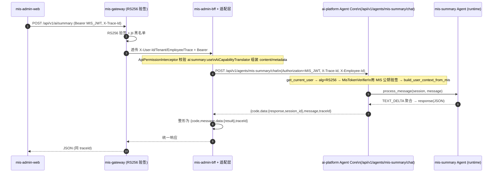
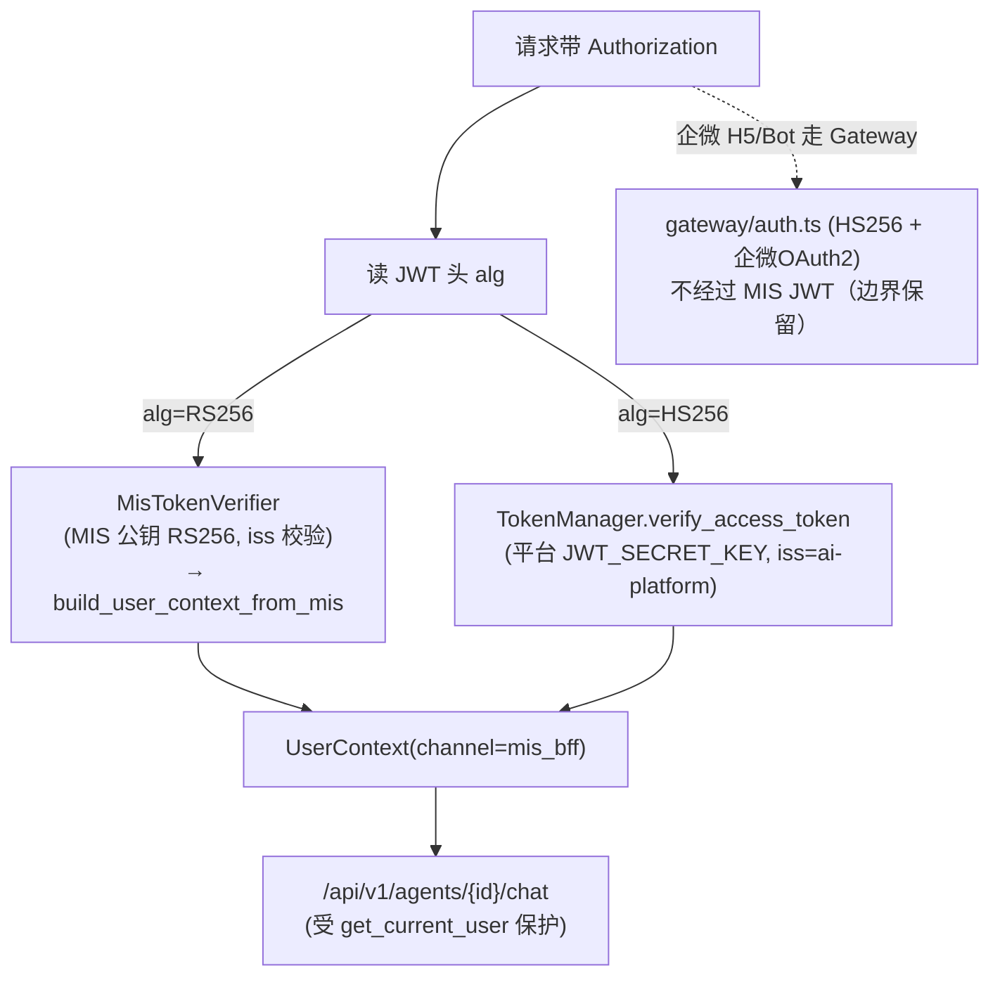

# MIS × ai-platform 融合 — 阶段1（认证对齐）+ 阶段2（BFF 业务 AI 能力适配层）实现级设计

> 本文是《MIS 与新增 ai-platform 子项目的 AI 融合可行性评估与架构对齐》（`mis_ai_platform_integration_assessment.md`）§4「阶段1 + 阶段2」的**实现级细化**，基于 `d:\code\mis-platform` 真实代码库核对后产出，作为工程师编码输入。评估文档中的 8 个决策（D1–D8）已全部采纳，本文不再讨论取舍，只落地「认证对齐 + 适配层骨架（先通 chat / summary / extract / rag）」。

---

## 0. 代码核实结论（基于真实代码，含两处对评估的修正）

| # | 核实项 | 真实代码位置 | 对设计的影响 |
|---|---|---|---|
| F-1 | 平台 Agent Core token 校验为 **HS256 本地 JWT** | `agent/ai-platform/backend/src/identity/token.py`（`TokenManager._decode`，`algorithms=["HS256"]`，`issuer="ai-platform"`） | 阶段1 需在此之上叠加 RS256 分支，原 HS256 不动 |
| F-2 | 平台身份注入点是 FastAPI `Depends(get_current_user)` | `agent/ai-platform/backend/src/api/deps.py:55` | RS256 分支在此函数内扩展 |
| F-3 | 平台 `UserContext` 是权限引擎运行时模型 | `agent/ai-platform/backend/src/identity/models.py:15` | MIS 身份须映射进 `UserContext` |
| F-4 | 平台**真正的 chat 端点**是 `POST /api/v1/sessions/{id}/messages`（非流式），且**当前无 `get_current_user`** | `agent/ai-platform/backend/src/api/routes/session.py:182` | 需新增一个「带鉴权」的 capability 端点供 BFF 调用，避免改坏已测的 `/sessions`（129/129 测试） |
| F-5 | MIS RS256 公钥当前位于 `backend/keys/public.pem`，由 `mis.security.jwt.public-key-path` 加载 | `backend/mis-gateway/src/main/resources/application.yml`、`backend/mis-common/.../jwt/JwtProperties.java`、`PemPublicKeyLoader.java` | 平台侧用同一思路加载该公钥（文件或内联 PEM） |
| F-6 | mis-gateway 向 BFF 透传头：`X-User-Id / X-Tenant-Id / X-App-Id / X-Employee-Id / X-Username / X-Trace-Id` | `backend/mis-gateway/.../filter/JwtAuthenticationGlobalFilter.java:115`、`mis-common-core/.../constant/SecurityConstants` | 适配层据此拿到 MIS 身份；并原样转发 `Authorization`（MIS JWT）给平台 |
| F-7 | **修正①**：MIS JWT（`JwtClaims`）只含 `userId, tenantId, appId, employeeId, username, jti`，**不含 `permissions` / `department`**（`roles` 由 `RsaJwtIssuer` 选择性写入，`permVersion` 有） | `backend/mis-common/.../jwt/JwtClaims.java`、`RsaJwtIssuer.java` | 评估 §3.1 假设的「JWT 携带 permissions/department」不准确；平台 `UserContext` 仅能由 `employeeId/tenantId/username/roles` 构造，`department`/`allowed_categories` 需后续补齐（见 §1.3） |
| F-8 | **修正②**：BFF 权限拦截器 `ApiPermissionInterceptor` 对所有 `/api/v1/**` 生效，**`deny-unmapped=true` 时会拒绝未注册端点**；规则来自 **mis-system DB**（`GET /internal/v1/api-permissions/registry`），非本地 yml | `backend/mis-common/.../permission/ApiPermissionInterceptor.java`、`mis-admin-bff/.../security/ApiPermissionRegistryLoader.java` | 每个新 `/api/v1/ai/*` 端点都必须在 mis-system 权限表登记（数据任务），否则生产态被拒 |
| F-9 | BFF 下游调用统一走 `AbstractDownstreamClient`（WebClient reactive），注入身份头来自 `SecurityContextHolder` | `mis-admin-bff/.../client/AbstractDownstreamClient.java` | 新建 `AiPlatformClient` 沿用该基类与 ` LoginUserHeaderResolver` 同款头注入 |

> **结论**：阶段1 是纯平台（Python）改造——让 `get_current_user` 在 `alg=RS256` 时改用 MIS 公钥验签；阶段2 是纯 `mis-admin-bff`（Java）改造——新增适配层把 `/api/v1/ai/*` 翻成平台 Agent 调用。两侧通过「MIS JWT（RS256）经 `Authorization` 透传 + `X-*` 身份头」桥接，平台对外契约不变。

---

## 1. 阶段1 认证对齐详细设计

### 1.1 平台侧需修改 / 新建的真实文件与函数

| 文件 | 类型 | 关键改动 |
|---|---|---|
| `agent/ai-platform/backend/src/config.py` | 改造 | `Settings` 新增 4 个字段：`MIS_JWT_PUBLIC_KEY_PATH`、`MIS_JWT_PUBLIC_KEY_PEM`、`MIS_JWT_ISSUER`、`MIS_JWT_ALGORITHM="RS256"`（见 §1.4） |
| `agent/ai-platform/backend/src/identity/mis_token.py` | **新建** | `MisTokenVerifier`：用 MIS RSA 公钥验签 RS256 JWT，返回 `MisTokenPayload`；加载公钥复用 `MIS_JWT_PUBLIC_KEY_PEM`/`_PATH` |
| `agent/ai-platform/backend/src/identity/models.py` | 改造 | 新增 `MisTokenPayload` 与 `build_user_context_from_mis(payload) -> UserContext`（见 §1.3） |
| `agent/ai-platform/backend/src/api/deps.py` | 改造 | `get_current_user` 增加 RS256 分支（见 §1.2） |
| `agent/ai-platform/backend/src/api/routes/mis_capability.py` | **新建** | 适配层调用目标端点 `POST /api/v1/agents/{agent_id}/chat`、`POST /api/v1/agents/{agent_id}/chat/stream`（SSE），均 `Depends(get_current_user)` |
| `agent/ai-platform/backend/src/main.py` | 改造 | `app.include_router(mis_capability_router, prefix="/api/v1")` |
| `agent/ai-platform/configs/mis_jwt_public.pem` | **新建（占位）** | 运营/部署替换为真实 MIS 公钥（源：`backend/keys/public.pem`） |

> 企微 H5 / Bot 链路（`gateway/src/middleware/auth.ts`、`Wecom*Adapter`）**完全不动**——见 §1.5。

### 1.2 RS256 校验分支如何与 HS256 / 企微共存

**判别策略：以 JWT 头 `alg` 为主、可选 `iss` 为辅**（MIS 只发 RS256，平台自身只发 HS256，二者算法天然不重叠，互不误判）。

`src/api/deps.py` 改造后的 `get_current_user` 逻辑：

```python
# agent/ai-platform/backend/src/api/deps.py （改造示意，非完整代码）
import jwt
from src.config import get_settings
from src.identity.token import TokenManager, TokenError
from src.identity.mis_token import MisTokenVerifier, MisTokenError
from src.identity.models import TokenPayload, build_user_context_from_mis

async def get_current_user(authorization: str = Header(default="")) -> dict:
    if not authorization.startswith("Bearer "):
        raise HTTPException(401, "Missing or invalid Authorization header")
    token = authorization[7:]
    header = jwt.get_unverified_header(token)          # 仅读头，不验签
    alg = header.get("alg", "")
    settings = get_settings()

    if alg == "RS256":                                  # —— MIS 下发的身份（阶段1 新分支）
        try:
            mis = MisTokenVerifier(settings)            # 懒加载 MIS 公钥
            payload = mis.verify(token)                 # RS256 + iss 校验
            ctx = build_user_context_from_mis(payload)  # 映射为平台 UserContext
            return {"mis": True, **ctx.model_dump()}
        except MisTokenError as exc:
            raise HTTPException(401, f"Invalid MIS token: {exc}")
    else:                                               # —— 平台自有 HS256（原逻辑不变）
        try:
            tm = TokenManager()
            p: TokenPayload = tm.verify_access_token(token)
            return p.model_dump()
        except TokenError as exc:
            raise HTTPException(401, f"Invalid or expired token: {exc}")
```

要点：
- **不动** `TokenManager`（HS256 + `issuer="ai-platform"`）与 `gateway/src/middleware/auth.ts`（HS256）的原路径；二者服务平台自有 H5/Bot。
- RS256 分支仅在 `alg == "RS256"` 时进入；若 MIS 后续给 JWT 补 `iss`（建议值 `mis-platform`，见 §6），可在 `MisTokenVerifier` 内强制 `issuer` 校验，进一步收紧。
- 返回字典同时携带 `mis=True` 标志，便于 Agent 运行时区分身份来源（仅用于日志/审计，不影响能力）。

### 1.3 MIS JWT claims → 平台 `UserContext` 映射

MIS JWT 真实载荷（`RsaJwtIssuer` 写入）：`sub=userId, tenantId, appId, employeeId, username, permVersion, [roles], jti`。平台 `UserContext`（`models.py:15`）字段：

| MIS JWT claim | 平台 `UserContext` 字段 | 说明 / 修正处理 |
|---|---|---|
| `employeeId` (Long) | `user_id: str` | `str(employeeId)`；平台 user_id 为字符串 |
| `username` | `username` / `display_name` | 同源 |
| `tenantId` | `profile["tenant_id"]` | 平台无原生租户概念，存入 `profile` 供 Skills 回调 MIS 时携带 |
| `appId` | `profile["app_id"]` | 同上 |
| `userId` (MIS `sys_user.id`) | `profile["mis_user_id"]` | 审计追溯用 |
| `roles` (可选 List[str]) | `roles` + 后续映射 `allowed_categories` | 阶段2 仅透传，**不**做强映射（见下） |
| `department` | — | **MIS JWT 不含**；暂置 `department=""`、`dept_id=None`（修正②，见 §0 F-7） |
| `permissions` | — | **MIS JWT 不含**；平台 Skills 权限引擎改用「角色→分类」映射或放行全部（阶段2 最小集） |

映射函数（新建 `identity/models.py` 片段）：

```python
def build_user_context_from_mis(p: "MisTokenPayload") -> UserContext:
    return UserContext(
        user_id=str(p.employee_id),
        username=p.username,
        display_name=p.username,
        department="",            # MIS JWT 暂无 department，阶段3 再补
        dept_id=None,
        roles=list(p.roles or []),
        channel="mis_bff",        # 标识来源为 MIS 业务前端
        allowed_categories=[],    # 阶段2：由 roles 映射留待后续；先空
        profile={
            "tenant_id": p.tenant_id,
            "app_id": p.app_id,
            "mis_user_id": p.user_id,
            "employee_id": p.employee_id,
            "perm_version": p.perm_version,
        },
    )
```

> **修正与待决**：`department` / `allowed_categories`（Skills 权限闸门）在阶段1/2 暂不能从 JWT 直接获得。两种后续补齐方式（列为 §6 待决策）：(a) MIS 在 `RsaJwtIssuer` 增补 `department` / `deptId` claim（1 行改动，推荐）；(b) 平台用 `employeeId` 回调 MIS IAM 拉取部门/角色分类。阶段2 先以「透传 employeeId + 放行 Skills」跑通，不阻塞主线。

### 1.4 公钥获取机制（平台侧配置 + 加载 + 占位）

**配置项**（加入 `src/config.py` 的 `Settings`）：

```python
# agent/ai-platform/backend/src/config.py 新增片段
# ===== MIS 身份信任（阶段1）=====
MIS_JWT_PUBLIC_KEY_PEM: str = ""          # 内联 PEM 公钥（优先级高于 PATH）
MIS_JWT_PUBLIC_KEY_PATH: str = ""         # 文件路径（挂载 Secret / configs）
MIS_JWT_ISSUER: str = "mis-platform"      # 期望 iss（如 MIS 未设 iss 则置空以跳过校验）
MIS_JWT_ALGORITHM: str = "RS256"
```

**加载逻辑**（新建 `src/identity/mis_token.py`）：

```python
# agent/ai-platform/backend/src/identity/mis_token.py （占位实现）
import jwt
from dataclasses import dataclass
from src.config import Settings

@dataclass
class MisTokenPayload:
    user_id: int
    tenant_id: int | None
    app_id: int | None
    employee_id: int | None
    username: str
    roles: list[str]
    perm_version: str | None

class MisTokenVerifier:
    def __init__(self, settings: Settings):
        self._settings = settings
        self._public_key = self._load_key(settings)   # 缓存，避免每次读盘

    @staticmethod
    def _load_key(s: Settings) -> str:
        if s.MIS_JWT_PUBLIC_KEY_PEM:
            return s.MIS_JWT_PUBLIC_KEY_PEM
        if s.MIS_JWT_PUBLIC_KEY_PATH:
            return open(s.MIS_JWT_PUBLIC_KEY_PATH, "r", encoding="utf-8").read()
        raise MisTokenError("MIS_JWT 公钥未配置（MIS_JWT_PUBLIC_KEY_PEM / _PATH 二选一）")

    def verify(self, token: str) -> MisTokenPayload:
        opts = {}
        if self._settings.MIS_JWT_ISSUER:
            opts["issuer"] = self._settings.MIS_JWT_ISSUER
        claims = jwt.decode(
            token, self._public_key,
            algorithms=["RS256"],
            options={"verify_iss": bool(self._settings.MIS_JWT_ISSUER)},
            **opts,
        )
        return MisTokenPayload(
            user_id=int(claims.get("sub", 0)),
            tenant_id=claims.get("tenantId"),
            app_id=claims.get("appId"),
            employee_id=claims.get("employeeId"),
            username=claims.get("username", ""),
            roles=list(claims.get("roles", []) or []),
            perm_version=claims.get("permVersion"),
        )
```

**占位公钥文件** `agent/ai-platform/configs/mis_jwt_public.pem`（部署时替换；**不要提交真实生产公钥**）：
```
-----BEGIN PUBLIC KEY-----
（占位：替换为 d:\code\mis-platform\backend\keys\public.pem 的真实内容，
 或由 K8s Secret / 挂载卷在部署期注入 MIS_JWT_PUBLIC_KEY_PATH）
-----END PUBLIC KEY-----
```

**提供给平台的明确提示（阻塞项）**：阶段1 启动前，平台部署必须获得 MIS RS256 公钥。源即 `backend/keys/public.pem`。开发期直接复制该文件到 `agent/ai-platform/configs/mis_jwt_public.pem` 并设 `MIS_JWT_PUBLIC_KEY_PATH`；生产期走 Secret 挂载，不入库。详见 §6。

### 1.5 保留企微 H5 / Bot 链路的边界

- 平台自有 H5 / 企微 Bot 仍由 `gateway/src/middleware/auth.ts`（HS256 + 企微 OAuth2 直连）认证，经 Redis Stream → Agent Core，**完全不经过 MIS JWT**。
- 阶段1 仅新增「BFF → Agent Core `/api/v1/agents/{id}/chat`」这条受 MIS RS256 保护的调用面；既有的 `/sessions`、`/ws/chat`、`/api/messages/send`、`/wecom/**` 行为零改动（不引入回归风险，129/129 测试保持通过）。
- 同一用户在两套身份下 `user_id` 不同（平台用企微 `userid`，MIS 用 `employeeId`）——本阶段不强制账号联邦；BFF 适配层以 MIS `employeeId` 作为平台侧 `user_id`（见 §1.3），与平台自有用户并存即可。账号联邦列为后续增强。

---

## 2. 阶段2 BFF 业务 AI 能力适配层详细设计

### 2.1 真实包路径与新增文件（均在 `mis-admin-bff`）

包根：`com.mis.adminbff`。沿用既有分层（`controller / client / service / dto / config`）。

| 文件 | 类型 | 职责 |
|---|---|---|
| `config/AiPlatformProperties.java` | 新建 | `@ConfigurationProperties("mis.ai-platform")`：`base-url`、`chat-timeout-ms`、`enabled`、`sse-enabled` 等 |
| `client/AiPlatformClient.java` | 新建 | 继承 `AbstractDownstreamClient`；封装对平台 Agent Core `/api/v1/agents/{id}/chat` 的调用；转发 `Authorization`(MIS JWT) + `X-Trace-Id` + 身份头 |
| `controller/AiProxyController.java` | 新建 | 暴露 `/api/v1/ai/*` REST 契约面（summary/extract/rag/chat/completions/health/features） |
| `service/AiFeatureConfigService.java` | 新建 | 特性门禁（哪些 capability 开启）、平台健康探测缓存、降级开关 |
| `service/AiCapabilityTranslator.java` | 新建 | `capability` + BFF 请求体 → 平台 `agent_id` + system prompt + `content` 的翻译（§2.3） |
| `dto/ai/AiSummaryRequest.java`、`AiSummaryResponse.java`、`AiExtractRequest.java`、`AiExtractResponse.java`、`AiRagRequest.java`、`AiRagResponse.java`、`AiChatRequest.java`、`AiChatResponse.java` | 新建 | 契约 DTO（§4） |
| `config/BffProperties.java` | 改造 | 增加 `aiPlatform` 段（或直接用 `AiPlatformProperties`） |
| `src/main/resources/application.yml` | 改造 | 新增 `mis.ai-platform.*` 配置（平台地址、超时、开关） |

> `AiPlatformClient` 复用既有 `@Qualifier("plainWebClientBuilder")` / `loadBalancedWebClientBuilder` 注入方式（与 `SystemWebClient` 完全一致），**无需新增 WebClient Bean**。

### 2.2 `/api/v1/ai/*` 路由表与权限项

所有端点位于 `/api/v1/**` 之下，被 `ApiPermissionInterceptor` 拦截（§0 F-8）。因此**每个端点必须在 mis-system 权限注册表登记**。建议在 mis-system 的 `api_permissions` 表插入以下行（经管理后台或 SQL 初始化）：

| HTTP | 路径 | 权限 code | authOnly | 说明 |
|---|---|---|---|---|
| POST | `/api/v1/ai/chat/completions` | `ai:chat:use` | false | CopilotPanel 全局对话 |
| POST | `/api/v1/ai/summary` | `ai:summary:use` | false | 详情/审批风险摘要 |
| POST | `/api/v1/ai/extract` | `ai:extract:use` | false | 表单抽取填充 |
| POST | `/api/v1/ai/rag` | `ai:rag:use` | false | 知识库问答 |
| GET | `/api/v1/ai/health` | `ai:health:view` | **true** | 平台存活/降级探测（仅登录即可，无数据权限） |
| GET | `/api/v1/ai/features` | `ai:features:view` | **true** | 当前开通 capability 清单（前端按需显隐） |

> `authOnly=true` 端点只需登录（`ApiPermissionInterceptor` 命中 `m.authOnly()` 即放行），适合健康/特性探查类。若生产 `deny-unmapped=true`，**未登记即 403**，故上表为硬性登记项。

### 2.3 capability → 平台真实端点映射 + 翻译 + 整形 + SSE

**映射总表**（对应评估 §2.5，端点改为已核实的平台真实路径）：

| BFF capability | 平台 `agent_id`（约定） | 平台端点 | 适配层动作 |
|---|---|---|---|
| `POST /api/v1/ai/chat/completions` | `mis-copilot` | `POST /api/v1/agents/mis-copilot/chat` | 透传 `messages`；注入 `route`/`selectedRows`（脱敏）到 `metadata` |
| `POST /api/v1/ai/summary` | `mis-summary` | `POST /api/v1/agents/mis-summary/chat` | 组装 system prompt + `records` → `content`；要求结构化 JSON |
| `POST /api/v1/ai/extract` | `mis-extract` | `POST /api/v1/agents/mis-extract/chat` | 组装 `text` + `schema` → `content`；要求结构化 JSON |
| `POST /api/v1/ai/rag` | `mis-rag` | `POST /api/v1/agents/mis-rag/chat` | 组装 `question` + `kb` → `content`；返回 `answer`+`citations` |

> 平台 `agent_id`（`mis-copilot/mis-summary/mis-extract/mis-rag`）为约定值，由平台侧在 configs 中预置（或阶段2 由平台初始化脚本建好）；BFF 仅按此名调用。

**请求体翻译（`AiCapabilityTranslator`）示例（summary）**：

```java
// BFF 入参 AiSummaryRequest { capability, records:List<Map>, context:Map }
// → 平台出站（POST /api/v1/agents/mis-summary/chat）
Map<String,Object> platformBody = Map.of(
    "content", buildSummaryPrompt(req.records(), req.context()), // 拼 system+records
    "role", "user",
    "metadata", Map.of(
        "source", "mis-bff",
        "capability", "summary",
        "page_context", req.context(),          // 业务页上下文（脱敏后）
        "employee_id", loginUser.getEmployeeId()
    )
);
```

**身份头 + traceId 注入（`AiPlatformClient`，沿用 `AbstractDownstreamClient.loginContextHeaders()` 同款）**：
- 转发 `Authorization`：取 BFF 收到的原始 `Bearer <MIS_JWT>`（控制器用 `@RequestHeader(HttpHeaders.AUTHORIZATION)` 接收并透传）——平台据此走 RS256 分支（§1.2）。
- 转发 `X-Trace-Id`：BFF 从 `SecurityConstants.HEADER_TRACE_ID` 读取（由 mis-gateway 注入），原样放入平台请求头；平台新端点回写同一 `traceId`（§2.4）。
- 转发 `X-User-Id/X-Tenant-Id/X-Employee-Id/X-Username`：从 `SecurityContextHolder` 的 `LoginUser` 取（与现有 `loginContextHeaders()` 一致）。

**响应整形**：平台返回 `{code, data:{response, session_id, ...}, message, traceId}`（`src/api/response.py`）。BFF 适配层将其整形为 MIS 统一包络 `{code, message, data, traceId}`：
- 成功（`platform.code==0`）：`data` 内放 `{result: <LLM 文本或解析后的结构化对象>, sessionId, citations?}`，并**解析** summary/extract 的结构化 JSON 为对应 `Ai*Response`。
- 失败：映射平台 `code`/`message` 到 MIS `Result.fail`，保留 `traceId`。

**SSE 透传方案（chat/completions）**：
- 目标：平台新增 `POST /api/v1/agents/{id}/chat/stream`（SSE，`TEXT_DELTA` 逐块输出）。
- BFF `AiProxyController.chatCompletions` 以 `produces=text/event-stream` 返回 `Flux<ServerSentEvent>`：用 `WebClient` 对流式平台响应做 `bodyToFlux`，逐块转发为 `data: {...}`；每个 SSE event 携带 `traceId`。
- 阶段2 骨架允许**先用非流式缓冲**（调 `/chat` 拿全文，BFF 合成单个 `data` + `done` 事件）跑通链路；SSE 直连作为同迭代内的增强（见任务 B-5）。无论哪种，前端契约 `{event:"delta"|"done"|"error", data, traceId}` 不变。

### 2.4 traceId 透传

- mis-gateway 已在入口生成/补全 `X-Trace-Id` 并透传到 BFF（§0 F-6）。
- BFF 适配层调用平台时**必须**带上该 `X-Trace-Id`（见 §2.3）。
- 平台新端点 `mis_capability.py` 读取 `X-Trace-Id`（复用 `deps.get_trace_id`），作为响应 `traceId` 字段回写；若缺失则平台生成 UUID 并回写。
- 全链路：`mis-admin-web` ↔ `mis-gateway`(生成) ↔ `mis-admin-bff`(透传) ↔ `ai-platform Agent Core`(透传+回写) ↔ 审计（MIS 侧 `sys_ai_audit_log` 以 `traceId` 关联平台侧 Skill 日志）。

### 2.5 降级：平台不可用时 `/api/v1/ai/health` + `/features` 门禁

- `AiFeatureConfigService` 持有：
  - `Map<Capability, Boolean> enabled`：从 `mis.ai-platform.features.*` 或配置中心读取；`/features` 端点返回当前开通清单供前端显隐。
  - `healthCache`：定时（如 15s）探测平台 `/api/v1/agents/mis-copilot/health`（或平台 Gateway `/health`）并缓存存活状态；探测失败则把 `enabled` 临时置 false（熔断），前端自动隐藏对应 AI 特征。
  - `platformAvailable()`：供 `AiProxyController` 在真正转发前短路——不可用时直接返回 `Result.fail(AI_PLATFORM_UNAVAILABLE, "AI 平台暂不可用")`，避免请求堆积。
- `/api/v1/ai/health`（GET）：返回 `{code:0, data:{platformUp:bool, latencyMs:int, enabledCapabilities:[...]}, traceId}`，仅登录即可（`authOnly=true`）。
- 写操作/敏感能力在 `enabled=false` 时一律拒绝，符合「平台不可用时业务特征优雅降级」的既有约定（评估 §6.1）。

---

## 3. 真实文件清单（新建 / 改造）

### 3.1 ai-platform 侧（Python / TS）

| 路径 | 状态 | 说明 |
|---|---|---|
| `agent/ai-platform/backend/src/config.py` | 改造 | 新增 `MIS_JWT_*` 4 项配置 |
| `agent/ai-platform/backend/src/identity/mis_token.py` | **新建** | `MisTokenVerifier` + `MisTokenPayload` |
| `agent/ai-platform/backend/src/identity/models.py` | 改造 | 新增 `MisTokenPayload`、`build_user_context_from_mis()` |
| `agent/ai-platform/backend/src/api/deps.py` | 改造 | `get_current_user` 增加 RS256/MIS 分支 |
| `agent/ai-platform/backend/src/api/routes/mis_capability.py` | **新建** | `/api/v1/agents/{id}/chat`、`/chat/stream` |
| `agent/ai-platform/backend/src/main.py` | 改造 | `include_router(mis_capability_router, prefix="/api/v1")` |
| `agent/ai-platform/configs/mis_jwt_public.pem` | **新建（占位）** | 部署期替换为 `backend/keys/public.pem` |
| `agent/ai-platform/configs/agents/mis-copilot.yaml` 等 4 个 Agent 配置 | **新建（阶段2 配合）** | 预置 `mis-copilot/summary/extract/rag` Agent（平台侧约定 agent_id） |

### 3.2 mis-admin-bff 侧（Java）

| 路径 | 状态 | 说明 |
|---|---|---|
| `mis-admin-bff/.../config/AiPlatformProperties.java` | **新建** | `mis.ai-platform.*` 配置绑定 |
| `mis-admin-bff/.../client/AiPlatformClient.java` | **新建** | 继承 `AbstractDownstreamClient`，封装平台调用 |
| `mis-admin-bff/.../controller/AiProxyController.java` | **新建** | `/api/v1/ai/*` 契约面 |
| `mis-admin-bff/.../service/AiFeatureConfigService.java` | **新建** | 门禁 + 健康缓存 + 降级 |
| `mis-admin-bff/.../service/AiCapabilityTranslator.java` | **新建** | capability→平台请求翻译 |
| `mis-admin-bff/.../dto/ai/*.java` | **新建** | 6+ 个请求/响应 DTO |
| `mis-admin-bff/.../config/BffProperties.java` | 改造 | 增加 AI 平台地址段（或直接用 `AiPlatformProperties`） |
| `mis-admin-bff/src/main/resources/application.yml` | 改造 | 新增 `mis.ai-platform.*` 配置 |
| mis-system `api_permissions` 表（权限注册） | 数据任务 | 登记 6 条 `ai:*:use`/`ai:*:view` 规则（见 §2.2） |

---

## 4. 接口契约（细化）

> 统一包络：`{ "code": 0, "message": "ok", "data": { ... }, "traceId": "..." }`；`code≠0` 为错误。

### 4.1 `POST /api/v1/ai/summary`

**BFF 请求**
```json
{
  "capability": "detail-summary",
  "records": [ { "field": "amount", "value": 12800 }, { "field": "status", "value": "pending" } ],
  "context": { "bizType": "expense", "pageId": "expense-detail", "locale": "zh-CN" },
  "options": { "maxPoints": 5, "tone": "neutral" }
}
```
**BFF 响应**
```json
{ "code": 0, "message": "ok", "traceId": "t-123",
  "data": { "result": {
      "points": [ "金额 12,800 元，状态待审批", "归属部门：财务部" ],
      "citations": [], "model": "deepseek-v4-flash", "sessionId": "s-9" } } }
```
**翻译后的平台请求** `POST /api/v1/agents/mis-summary/chat`
```json
{ "content": "<system>输出 JSON:{points:[str],citations:[str]}</system>\n记录: {...}",
  "role": "user",
  "metadata": { "source":"mis-bff","capability":"summary","page_context":{...},"employee_id":2001 } }
```
**平台响应（整形前）** `{ "code":0, "data":{ "response":"{...}","session_id":"s-9" }, "message":"ok", "traceId":"t-123" }`

### 4.2 `POST /api/v1/ai/extract`

**BFF 请求**
```json
{ "capability":"form-fill", "text":"张三 市场部 2024-01-15 报销差旅费 3200",
  "schema": { "fields": [ {"name":"name","type":"string"},{"name":"dept","type":"string"},
                          {"name":"date","type":"date"},{"name":"amount","type":"number"} ] },
  "context": { "bizType":"expense" } }
```
**BFF 响应**
```json
{ "code":0, "message":"ok", "traceId":"t-124",
  "data": { "result": { "fields": { "name":"张三","dept":"市场部","date":"2024-01-15","amount":3200 },
                         "confidence": 0.92, "sessionId":"s-10" } } }
```
**平台请求** `POST /api/v1/agents/mis-extract/chat`，`content` 含抽取 schema 与文本；平台返回 `response` 由 BFF 解析为 `fields/confidence`。

### 4.3 `POST /api/v1/ai/rag`

**BFF 请求**
```json
{ "capability":"kb-qa", "question":"年假政策如何计算？", "kb":"hr-policy",
  "context": { "bizType":"hr" }, "topK": 5 }
```
**BFF 响应**
```json
{ "code":0, "message":"ok", "traceId":"t-125",
  "data": { "result": { "answer":"入职满1年享5天年假……",
                        "citations":[ {"source":"hr-handbook.pdf","chunk":"§3.2","score":0.87} ],
                        "sessionId":"s-11" } } }
```
**平台请求** `POST /api/v1/agents/mis-rag/chat`，`content` 含 `question`+`kb`+`topK`；平台经 Qdrant 检索后返回 `answer`+`citations`。

### 4.4 `POST /api/v1/ai/chat/completions`

**BFF 请求**
```json
{ "messages":[ {"role":"user","content":"帮我写一条给供应商的催款通知"} ],
  "context": { "pageId":"vendor-list", "selectedRows":[ {"id":7,"name":"A供应商"} ] } }
```
**BFF 响应（非流式）**
```json
{ "code":0, "message":"ok", "traceId":"t-126",
  "data": { "result": { "content":"尊敬的A供应商……", "finishReason":"stop", "sessionId":"s-12" } } }
```
**SSE 流式（目标）** `Content-Type: text/event-stream`
```
event: delta
data: {"traceId":"t-126","delta":"尊敬的"}

event: delta
data: {"traceId":"t-126","delta":"A供应商"}

event: done
data: {"traceId":"t-126","finishReason":"stop","sessionId":"s-12"}
```
**平台请求** `POST /api/v1/agents/mis-copilot/chat`（`content`=末条 user 消息，`metadata.selectedRows` 脱敏注入）；流式走 `/chat/stream`（SSE）。

### 4.5 `GET /api/v1/ai/health` 与 `GET /api/v1/ai/features`

```json
// /health
{ "code":0, "message":"ok", "traceId":"t-127",
  "data": { "platformUp": true, "latencyMs": 42, "enabledCapabilities": ["chat","summary","extract","rag"] } }
// /features
{ "code":0, "message":"ok", "traceId":"t-128",
  "data": { "features": { "chat":true, "summary":true, "extract":true, "rag":true, "nl2sql":false } } }
```

---

## 5. 有序任务分解（按实现顺序，含依赖）

> 规则：阶段1（A 类）是阶段2（B 类）的前置——平台必须先能验 MIS 身份，BFF 适配层才安全转发。

| 任务 | 类型 | 名称 | 落点文件 | 依赖 | 优先级 |
|---|---|---|---|---|---|
| **A-1** | 阶段1 | 平台配置 + RS256 公钥加载 | `config.py`、`identity/mis_token.py`、`configs/mis_jwt_public.pem`（占位） | 阻塞项§6（公钥） | P0 |
| **A-2** | 阶段1 | `get_current_user` 增加 RS256/MIS 分支 + `UserContext` 映射 | `api/deps.py`、`identity/models.py` | A-1 | P0 |
| **A-3** | 阶段1 | 新增受鉴权的 capability 端点（chat / chat/stream） | `api/routes/mis_capability.py`、`main.py` | A-2 | P0 |
| **A-4** | 阶段1 | 平台预置 4 个 Agent 配置（mis-copilot/summary/extract/rag） | `configs/agents/*.yaml` | A-3 | P1 |
| **B-1** | 阶段2 | BFF 配置 + AiPlatformClient（身份头/traceId 透传） | `AiPlatformProperties.java`、`AiPlatformClient.java`、`application.yml` | A-3（平台端点就绪） | P0 |
| **B-2** | 阶段2 | 契约 DTO + AiProxyController（summary/extract/rag/chat/completions） | `dto/ai/*`、`AiProxyController.java` | B-1 | P0 |
| **B-3** | 阶段2 | AiCapabilityTranslator（capability→平台请求翻译 + 响应整形） | `AiCapabilityTranslator.java` | B-2 | P0 |
| **B-4** | 阶段2 | 权限注册（mis-system 6 条规则）+ 网关无需改动验证 | mis-system `api_permissions`（数据）、`ApiPermissionInterceptor` 验证 | B-2 | P0 |
| **B-5** | 阶段2 | 降级/门禁：AiFeatureConfigService + /health + /features + SSE 直连增强 | `AiFeatureConfigService.java`、`AiProxyController`（health/features） | B-2、B-3 | P1 |

**依赖图**：`A-1 → A-2 → A-3 → A-4`（阶段1 链）；`A-3 → B-1 → B-2 → {B-3, B-4, B-5}`（阶段2 链，B-3/B-4/B-5 可在 B-2 后并行）。A-4 与 B 系列可并行。

---

## 6. 待用户提供 / 决策事项（阻塞与非阻塞）

| # | 事项 | 性质 | 说明 |
|---|---|---|---|
| **B-1** | **MIS RS256 公钥** | **阻塞（阶段1 启动前必须）** | 源：`backend/keys/public.pem`。需提供给平台部署：开发期复制到 `agent/ai-platform/configs/mis_jwt_public.pem` 并设 `MIS_JWT_PUBLIC_KEY_PATH`；生产期走 Secret 挂载。本文公钥文件为占位，切勿提交真实生产公钥 |
| B-2 | 平台 Agent Core 可达地址 / 端口 | 非阻塞（配置） | `mis.ai-platform.base-url`（如 `http://ai-platform-agent-core:8000`）；阶段6 部署对齐时定稿 |
| B-3 | 平台 LLM 模型名 | 非阻塞 | 默认 `deepseek-v4-flash` / `qwen3.6-plus`（平台 config.py 已有），BFF 不指定模型，由平台 Agent 配置决定 |
| B-4 | MIS JWT `iss` 取值 | 建议决策 | 评估 §3.1 假设 JWT 带 `iss`；实测 `RsaJwtIssuer` **未设 iss**。建议：在 `RsaJwtIssuer` 补 `issuer("mis-platform")`（1 行，向后兼容），平台设 `MIS_JWT_ISSUER=mis-platform` 强校验；或由平台置空跳过 iss 校验（阶段1 仅靠 `alg=RS256` 判别） |
| B-5 | `department` / `allowed_categories` 补齐方式 | 决策（非阻塞） | 阶段1/2 平台 Skills 权限用 `employeeId` 透传 + 放行；后续由 (a) MIS 补 `department`/`deptId` claim 或 (b) 平台回调 MIS IAM 拉取。建议 (a) |
| B-6 | 4 个 Agent 的 system prompt / 结构化输出 schema | 非阻塞（平台侧内容） | `mis-summary/extract/rag` 需约定输出 JSON schema；阶段2 由平台侧配置落地（A-4） |

---

## 7. 范围声明（本次不含）

- **不含 NL2SQL（阶段4）**：`/api/v1/ai/nl2sql` 不在本次范围；需 MIS 提供 NL2SQL MCP Server + 专用 Agent，列为后续阶段。
- **不含前端融合接通（阶段5 仅预留）**：`mis-admin-web` 的 `<AiFeature>` / `useAI` 本次不动；BFF 契约面先行就位，前端在阶段5 接通。本文 `/features` 端点即为前端显隐预留。
- **不含向量库迁移（阶段3）**：Qdrant 已由平台就位，本次不触碰；RAG 知识采集为阶段3 任务。
- **本次交付**：认证对齐（阶段1，A-1~A-4）+ 适配层骨架（阶段2，B-1~B-5），先通 `chat / summary / extract / rag` 四条能力，统一包络 `{code,message,data,traceId}` + 降级/门禁。

---

## 附录 A：集成时序图（BFF → 平台，以 summary 为例）



## 附录 B：平台阶段1 认证分支判别（组件图）


