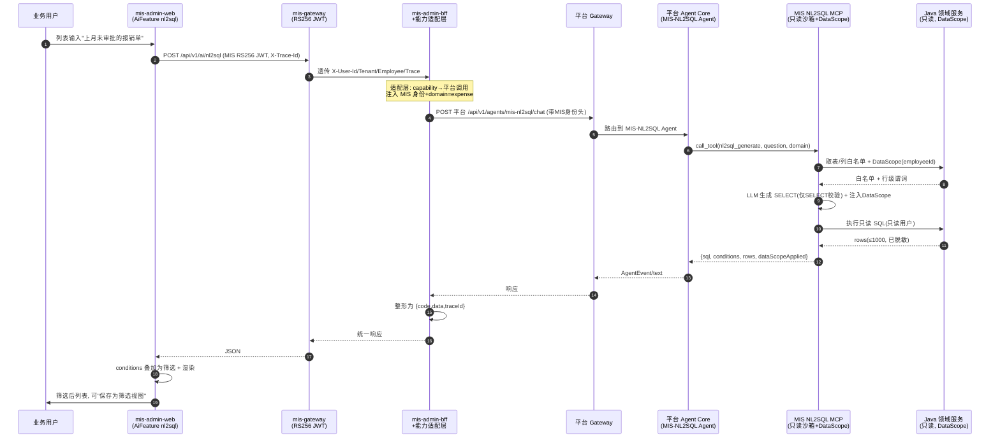
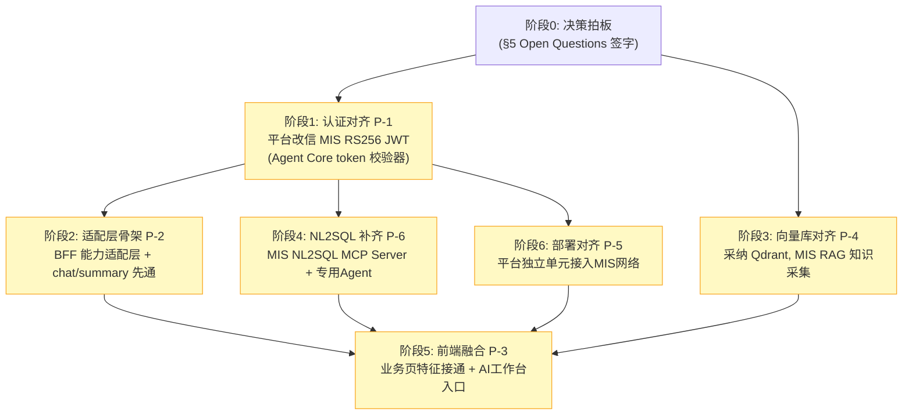

# MIS 与新增 ai-platform 子项目的 AI 融合可行性评估与架构对齐

> 本文档是对既有《MIS Platform AI 深度融合集成架构》（`mis_ai_integration_architecture.md`）的**修订与补充**：基于"用户已在 `agent/ai-platform/` 下提供一套**全量建成且 129/129 测试通过**的独立 AI 平台"这一新事实，重新评估该平台能否作为 MIS 的 AI 能力底座，并给出架构对齐映射、冲突清单与推荐决策。范围限定为**评估 / 规划 / 决策**，不产出可运行代码。

---

## 0. 文档信息与评估范围

| 项 | 内容 |
|---|---|
| 评估对象 | `d:\code\mis-platform\agent\ai-platform\`（独立 AI 平台，282 文件、129/129 测试通过） |
| 依据文档 | 既有：`mis_ai_deep_integration_blueprint_prd.md`、`mis_ai_integration_architecture.md`；新增：`agent\overview.md`、`agent\ai-platform-prd.md`、`agent\ai-platform-architecture.md`（v1.4.1） |
| 评估人 | 高见远（Gao，架构师） |
| 评估性质 | 可行性结论 + 架构对齐 + 冲突决策 + 融合方案建议（规划/评审，非实现） |
| 一句话结论 | **能力上完全胜任且已建成测试通过，可在 5 处对齐改造后作为 MIS 的 AI 能力底座** |

### 0.1 关键事实核对表（基于三份文档）

| # | 事实 | 来源 | 对融合的含义 |
|---|---|---|---|
| F1 | 平台是**独立企业 AI 平台**，定位"统一 AI 能力接入与调度中枢"，三渠道（企微 H5 / 企微智能机器人 WebSocket / 独立 H5），用 CopilotKit 做 Generative UI | PRD §1.1、架构 §1.1 | 定位高于我们规划的"业务页内嵌 AI 特征"，是更完整的 Agent 平台 |
| F2 | 技术栈三件套：Gateway(TS/Fastify) + Agent Core(Python/FastAPI) + 独立前端(React+CopilotKit+Vite) | 架构 §1.1-1.2 | 与 MIS 既有栈（Java BFF + React 业务前端）不同栈，需边界适配 |
| F3 | 自带 LLM 网关层（多 Key/配额/出站代理/Token 追踪/Failover，deepseek-v4-flash + qwen3.6-plus）、670+ Skills、Qdrant、bge-small-zh-v1.5 内网 Embedding、PG+Redis、Nginx、Squid | PRD 附录A、架构 §1.2 | 能力远超我们规划的"瘦身 agent-gateway"，可整体替代 |
| F4 | 认证模型：**企微 OAuth2 直连 + 本地 JWT(HS256 自签) + 用户名密码**；组织架构从企微定时同步到本地库；**未复用** mis-gateway/mis-iam/mis-org | PRD §7.2、Q3 | **与 MIS 身份体系冲突**（见 §3.1） |
| F5 | 自带独立前端（CopilotKit H5），与我们"AI 特征嵌入 mis-admin-web 业务页"是两套前端 | PRD §5.3 | **前端融合路线冲突**（见 §3.2） |
| F6 | 能力是 **Agent/Chat/Skills/RAG 导向**，**无**独立 `/summary`、`/extract`、`/nl2sql`、`/rag` 端点；无 NL2SQL、无"列表自然语言查数"；其"能力"封装为 Skill(MCP 工具)由 Agent 在对话中调用 | PRD §6、架构 §4 | **契约形态冲突**（见 §3.3） |
| F7 | 向量库用 **Qdrant**（独立组件），我们此前推荐 **pgvector 复用现有 PG** | 架构 §1.2 vs 集成架构 §6.2 | **向量库选型冲突**（见 §3.4） |
| F8 | 自带 docker-compose（PG+Redis+Qdrant+Squid+Backend+Gateway+Frontend），部署形态需与 MIS(k8s/Deploy)协调 | 架构 §1.3、overview | **基础设施/部署冲突**（见 §3.5） |
| F9 | 已有 HITL + Skills 权限引擎（8 级优先级） | PRD P1-08、架构 §4 | 与 MIS DataScope/Human-in-the-loop 互补（见 §3.7） |

---

## 1. 可用性结论（Verdict）

### 1.1 结论

> **✅ 推荐采纳为 MIS 的 AI 能力底座（有条件）**。
> ai-platform 在**能力成熟度、工程完成度、测试通过率**上均显著优于我们此前规划的"瘦身 agent-gateway"，且在 670+ Skills、LLM 网关、RAG、HITL、身份权限、记忆等维度已全量建成。但它与我们既有三层架构在**认证、集成入口契约、前端、向量库、部署**五处存在结构性错位。在落实 §3 的 5 项对齐改造后，可完全胜任 MIS 的 AI 能力底座角色，且能省去我们自建 agent-gateway 端点的工程量。

### 1.2 能力胜任度评估

| 我们蓝图的能力需求（PRD §2） | ai-platform 覆盖情况 | 胜任度 |
|---|---|---|
| 统一对话/流式（Copilot） | ✅ Agent Core 流式 AgentEvent + AG-UI + CopilotKit | 完全胜任 |
| RAG 检索（引用溯源） | ✅ Skills + Qdrant 向量索引 + bge-small-zh（平台"记忆/语义检索"同源能力） | 完全胜任（需补"业务知识库"采集） |
| NL2SQL（只读沙箱+DataScope） | ❌ 平台无此能力 | **缺口**（见 §3.6） |
| 内容摘要（详情/审批风险/报表） | ⚠️ 无独立端点，但可由"提示词+Skill"在对话中产出 | 可胜任（需适配层封装，见 §3.3） |
| 信息抽取（表单填充） | ⚠️ 同上，可由 Extract Skill/提示词产出 | 可胜任（需适配层封装） |
| 分类打标 / 智能校验 | ⚠️ 可由 Skill 实现 | 可胜任（需适配层封装） |
| 文本生成（通知/报告） | ✅ LLM 网关 + Agent | 完全胜任 |
| 基础设施级底座（统一契约/复用） | ⚠️ 有 Agent/Skill 契约，但非我们规划的 fine-grained capability 契约 | 需加"业务 AI 能力适配层" |

### 1.3 5 项前置对齐改造（采纳的前提条件）

| # | 改造项 | 性质 | 必要性 | 工作量（估） |
|---|---|---|---|---|
| P-1 | **认证对齐**：平台后端改为信任 MIS 签发的 RS256 JWT（或 BFF 签名的身份头），去除对企微身份源的强依赖（仅保留其自有 H5/Bot 渠道的企微认证） | 必须 | 高 | 中 |
| P-2 | **集成入口/契约适配**：在 BFF 内新增"业务 AI 能力适配层"，将 `/api/v1/ai/{summary,extract,nl2sql,rag,chat}` 映射为平台 Agent/Skill 调用 | 必须 | 高 | 中-大 |
| P-3 | **前端融合路线**：明确 mis-admin-web 业务页 AI 特征走 BFF→平台（路线 A），平台 CopilotKit H5 作为并列"AI 工作台"入口（路线 B） | 必须 | 中 | 小-中 |
| P-4 | **向量库选型对齐**：采纳 Qdrant 为共享向量库，撤回 pgvector 推荐；MIS RAG 落到平台 Qdrant | 建议（强烈） | 中 | 小（撤回+配置） |
| P-5 | **部署/基础设施对齐**：平台作为独立部署单元接入 MIS 网络，共享身份信任与领域服务回调，中间件按需共享 | 必须 | 中 | 中 |

> 风险定级：**中**。能力风险低（平台已建成），集成风险中（5 处改造需协调身份与契约），可通过分阶段落地控制。

---

## 2. 架构对齐映射

### 2.1 三层规划 ↔ 三件套 映射表

| MIS 既有三层规划 | 对应 ai-platform 组件 | 处置 | 说明 |
|---|---|---|---|
| `mis-admin-web` 的 `useAI` Hook + `<AiFeature>` 组件族 + 声明式注册表 + CopilotPanel | 平台的 CopilotKit H5（**不替代**业务页内嵌） | **保留** | 业务页 AI 特征继续在 mis-admin-web 内；平台 H5 作为并列入口 |
| `mis-admin-bff` 的 `/api/v1/ai/*` 代理 + 门禁端点 | 新增「业务 AI 能力适配层」（落在 BFF 内，或独立 adapter 服务） | **保留+扩展** | BFF 仍为唯一契约面；内部转发到平台 Agent Core |
| 瘦身 `agent-gateway`（Python/FastAPI：chat/summary/extract/nl2sql/rag） | ai-platform **Gateway + Agent Core** | **替代（撤销新建）** | 平台即真实实现，省去自建端点 |
| `mis-gateway` RS256 JWT 验签 + traceId 透传 | 平台 `IdentityManager`（HS256 本地 JWT） | **需对齐（P-1）** | 平台改信 MIS RS256 JWT / BFF 签名头 |
| pgvector（复用现有 PG） | 平台 Qdrant | **冲突→采纳 Qdrant（P-4）** | 撤回 pgvector 推荐 |
| 领域服务回调（mis-iam/mis-org 的 DataScope） | 平台 Skills/MCP 回调 MIS 领域服务 | **保留回调路径** | 平台以 MIS 员工身份经 mis-gateway 调 Java API |

### 2.2 谁替代谁、谁需新增适配层

```
替代关系：
  我们规划的「瘦身 agent-gateway」  ──被──▶  ai-platform(Gateway + Agent Core) 取代
  （不再新建 chat/summary/extract/nl2sql/rag 端点，平台已提供更强的 Agent/Skill 引擎）

保留关系：
  mis-admin-web 的 AI SDK/组件/注册表  ──保留──▶  业务页内嵌 AI 特征层
  mis-admin-bff 的 /api/v1/ai/* 契约面   ──保留──▶  对业务前端的稳定契约

新增关系：
  「业务 AI 能力适配层」  ──新增──▶  把 fine-grained capability 契约 翻译成 平台 Agent/Skill 调用
  （这是本融合的"胶水"，也是 P-2 的核心交付物）

对齐关系（改造）：
  平台 IdentityManager  ──改造──▶  信任 MIS RS256 JWT（P-1）
  平台部署形态          ──改造──▶  接入 MIS 网络/身份/领域服务（P-5）
```

### 2.3 核心问题回答：mis-admin-web 业务页 AI 特征最终如何连到本平台？

**推荐答案（路线 A 为主）**：

1. `mis-admin-web` 的业务页 `<AiFeature>`（nl2sql / detail-summary / approval-risk / form-fill / report-insight / copilot）**代码不变**，仍调用 `mis-admin-bff` 的 `/api/v1/ai/{capability}`。
2. `mis-admin-bff` 新增**业务 AI 能力适配层**：接收 capability 请求 → 按 §2.5 映射表 → 构造平台 Agent Core 的对话/调用请求（指定目标 Agent 或 Skill、注入 MIS 用户身份与页上下文）→ 调用平台 Agent Core API → 将 AgentEvent/文本响应**整形回** `{code, data, traceId}` 包络 → 返回前端。
3. 平台 Agent Core 以 **MIS 员工身份**（来自 BFF 转发的 RS256 JWT / 签名头）运行 Agent；当 Agent/Skill 需要读 MIS 业务数据时，**回调 mis-gateway → mis-admin-bff → Java 领域服务**（沿用既有"AI 以当前用户身份调 Java"约束 + DataScope）。
4. 写操作一律 **Human-in-the-loop**：MIS 业务页的写确认走原领域 API（用户在 mis-admin-web 确认），不经由平台 HITL。
5. 平台 CopilotKit H5 作为**并列"AI 工作台"入口**（路线 B）：从 mis-admin-web 菜单/新标签打开，承载自由对话、动态卡片、多 Agent 路由、Bot 渠道等平台原生体验。

> 关键收益：**前端 SDK 与 BFF 契约零破坏**，业务模块接入成本仍按蓝图 PRD 保持"声明即拥有"；平台能力被"适配层"桥接而非替换。

### 2.4 目标集成 C4 图（推荐方案）

```mermaid
graph TB
    subgraph MIS["MIS 既有域"]
        FE["mis-admin-web<br/>(useAI + &lt;AiFeature&gt; + CopilotPanel)"]
        GW["mis-gateway<br/>(RS256 JWT 验签 + traceId)"]
        BFF["mis-admin-bff<br/>/api/v1/ai/* 契约面"]
        ADAPT["业务 AI 能力适配层<br/>(capability→Agent/Skill 映射+整形)"]
        JAVA["Java 领域服务<br/>(mis-iam/mis-org/业务域 + DataScope)"]
        WB["AI 工作台入口<br/>(菜单/新标签 → 平台 H5)"]
    end

    subgraph PLAT["ai-platform（独立部署单元）"]
        PG["平台 Gateway<br/>(TS/Fastify)"]
        AC["Agent Core<br/>(Python/FastAPI)"]
        RT["AgentRouter + Runtime<br/>(OpenHarness)"]
        SK["Skills/MCP 引擎<br/>(670+ Skills)"]
        LLM["LLM 网关层<br/>(deepseek/qwen + 配额/出站代理)"]
        QC["Qdrant + bge-zh<br/>(向量/记忆/路由索引)"]
        H5["平台 CopilotKit H5<br/>(Generative UI)"]
    end

    subgraph EXT["外部"]
        WECOM["企业微信<br/>(H5 JS-SDK / Bot WS)"]
        VENDOR["厂家 LLM API<br/>(经出站代理)"]
        NL2SQL_SVC["MIS NL2SQL MCP Server<br/>(只读沙箱+DataScope, MIS 自有)"]
    end

    FE -->|"/api/v1/ai/*"| GW
    GW --> BFF
    BFF --> ADAPT
    ADAPT -->|"Agent/Skill 调用(带MIS身份)"| PG
    PG --> AC
    AC --> RT --> SK --> LLM --> VENDOR
    AC --> QC
    ADAPT -.-"NL2SQL 走专用 Agent+Skill"-.-> NL2SQL_SVC
    NL2SQL_SVC -.-"只读沙箱+DataScope"-.-> JAVA

    AC -.-"读数据回调(带MIS员工身份)"-.-> GW
    GW --> JAVA

    WB --> H5
    H5 <--> PG
    WECOM <--> PG
    H5 --> WECOM

    classDef mis fill:#e3f2fd,stroke:#1565c0
    classDef plat fill:#e8f5e9,stroke:#2e7d32
    classDef ext fill:#fff3e0,stroke:#ef6c00
    class FE,GW,BFF,ADAPT,JAVA,WB mis
    class PG,AC,RT,SK,LLM,QC,H5 plat
    class WECOM,VENDOR,NL2SQL_SVC ext
```

### 2.5 契约翻译：capability → Agent/Skill 映射表（适配层核心）

| 我们的 capability 端点 | 平台内实现方式 | 适配层动作 | 备注 |
|---|---|---|---|
| `POST /api/v1/ai/chat/completions`（CopilotPanel 全局） | 平台「MIS-Copilot Agent」（通用 Skills + 页上下文注入） | 透传 messages，注入 `route/selectedRows`（脱敏） | 与平台 chat 原生一致 |
| `POST /api/v1/ai/summary`（detail-summary / approval-risk） | 「MIS-Summary Agent」或 Summary Skill（提示词约束结构化输出） | 组装 system prompt + records → 平台 chat；解析 points/citations | 需约定输出 JSON schema |
| `POST /api/v1/ai/extract`（form-fill） | 「MIS-Extract Agent」或 Extract Skill | 组装 text+schema → 平台 chat；解析 fields/confidence | 需约定输出 JSON schema |
| `POST /api/v1/ai/rag/query` | 平台 RAG：Qdrant 检索 + 重排（知识库由 MIS 采集入 Qdrant） | 组装 question+kb → 平台 RAG Skill；返回 answer+citations | 知识库采集为前置任务 |
| `POST /api/v1/ai/nl2sql` | **「MIS-NL2SQL Agent」+ MIS 提供的 NL2SQL MCP Server**（只读沙箱+DataScope） | 组装 question+domain → 专用 Agent；返回 sql/conditions/rows | **平台无原生能力，需 MIS 补（见 §3.6）** |

---

## 3. 关键冲突与决策点清单（核心）

### 3.1 认证对齐（冲突：HS256 本地 JWT + 企微身份 vs MIS RS256 JWT + mis-iam/mis-org）

**冲突描述**：平台 `IdentityManager` 自签 HS256 JWT，身份源于企微 OAuth2 直连 + 本地库（从企微定时同步）。MIS 侧由 `mis-gateway` 用 RS256 验签，身份权威是 `mis-iam/mis-org`，JWT 携带 `employeeId/tenantId/permissions`。两套身份互不信任、无共享用户源。后果：① mis-admin-web 用户跳转到平台需重新登录；② 平台以自身身份回调 Java 领域服务时无法获得 MIS DataScope；③ Skills 权限引擎基于平台本地部门/角色，与 MIS 权限不一致。

**候选方案**：
- **方案 A（推荐）**：平台 Agent Core 改为**信任 MIS 签发的 RS256 JWT**。平台持 mis-iam 的 RS256 公钥，校验 BFF 转发来的 MIS JWT，解析 `employeeId/tenantId/permissions/department/roles`，用于 Skills 权限过滤与 DataScope。平台自有 HS256/企微认证**仅保留**给其独立 H5 与 Bot 渠道（这些用户本就是同一批员工，经企微直连认证）。
- **方案 B**：MIS 侧（BFF）为发往平台的请求签发**平台可验证的短期 token**（HS256 共享密钥，或把 MIS RS256 公钥给平台）——实质与 A 等价，只是密钥分发方向不同。
- **方案 C**：平台继续以企微为身份源，MIS 用户经企微 OAuth2 登平台（统一用企微身份）。代价：mis-admin-web 的 MIS 会话与平台会话割裂，DataScope 仍需平台回查 MIS。

**推荐**：**方案 A**。理由：以 MIS 为身份权威最符合"业务特征以当前用户身份调 Java"的既有约束；平台仅对自有 H5/Bot 保留企微认证，改造面集中在 Agent Core 的 `IdentityManager.token` 校验器（新增 RS256 校验分支），不破坏平台已测的企微链路。

### 3.2 前端融合路线（冲突：平台 CopilotKit H5 vs mis-admin-web）

**冲突描述**：我们规划"AI 特征嵌入 mis-admin-web 业务页"（useAI + <AiFeature>）；平台自带 CopilotKit H5（独立 Generative UI 应用）。两套前端并存，如何分工是核心决策。

**候选方案**：
- **路线 A（推荐为主）**：mis-admin-web 业务页 AI 特征经 BFF 适配层调用平台 Agent Core（§2.3）。业务页保持"列表查数/详情摘要/表单填充/审批风险"等场景化快捷件，**零重写前端**。
- **路线 B（补充）**：平台 CopilotKit H5 作为并列"AI 工作台"入口（从 mis-admin-web 菜单/新标签打开），承载自由对话、动态卡片、多 Agent 路由、Bot 渠道等平台原生能力。
- **路线 C（不推荐）**：完全用平台 H5 替换 mis-admin-web 的 AI 区。代价：丢失业务页内嵌的场景化特征，且需把 mis-admin-web 的鉴权/页上下文搬到平台 H5，工程量巨大。

**推荐**：**A + B 混合路线**。A 保障蓝图 PRD 的"声明即拥有"业务价值；B 释放平台已建成的 Agent/Generative UI/Bot 能力，作为增值入口。两者共用同一平台后端，身份经 §3.1 对齐。

### 3.3 集成入口 / 契约（冲突：平台 Agent/Chat/Skills 导向，缺 summary/extract/nl2sql/rag 独立端点）

**冲突描述**：我们蓝图与集成架构假设 agent-gateway 暴露 fine-grained 端点（`/summary`、`/extract`、`/nl2sql`、`/rag`）；平台原生是 Agent/Chat/Skills 导向，无这些独立端点。若直接让 mis-admin-web 调平台原生 API，需重写所有 `<AiFeature>` 组件与 SDK。

**候选方案**：
- **方案 A（推荐）**：在 BFF 内新增**业务 AI 能力适配层**（§2.2/§2.5），把 capability 契约翻译成平台 Agent/Skill 调用，并把平台响应整形回 `{code,data,traceId}`。前端与 BFF 对外契约**完全不变**。
- **方案 B**：在平台侧补一层"业务 AI 能力 API"（把 Agent/Skill 包装成 capability 端点）。代价：平台需为 MIS 定制端点，且平台已测试的代码需新增面；不如放在 BFF（BFF 本就是 MIS 的契约面）。
- **方案 C**：业务特征直接驱动平台某个 Agent + 特定 Skill（绕过 capability 抽象）。代价：失去蓝图 PRD 的"统一契约 + 门禁 + 降级"体系，不可取。

**推荐**：**方案 A（BFF 适配层）**。理由：遵循"业务前端只调 BFF、不直接连 AI 层"的既有原则；适配层是薄翻译+整形，风险低；平台保持通用、不被 MIS 契约绑架。

### 3.4 向量库（冲突：Qdrant vs pgvector）

**冲突描述**：我们此前推荐 pgvector 复用现有 PG（零新中间件）；平台用 Qdrant（Skills 检索 + AgentRouter 语义检索 + 动态记忆三套 collection）。

**候选方案**：
- **方案 A（推荐）**：**采纳 Qdrant 为共享向量库**，撤回 pgvector 推荐。MIS 的 RAG/语义检索统一落到平台 Qdrant + bge-small-zh Embedding 服务。平台已用它并通过测试，迁移成本最低。
- **方案 B**：迁移平台到 pgvector。代价：重写 Skills/路由/记忆三套向量逻辑（Qdrant payload 过滤、collection 结构），高风险，且丢失平台已测资产，**不推荐**。
- **方案 C**：共存——平台用 Qdrant，MIS 另起 pgvector。代价：双套 Embedding 基础设施、知识库分裂、运维翻倍。

**推荐**：**方案 A**。理由：平台即 AI 底座，其向量基础设施已建成；pgvector 仅在我们"自建瘦身 gateway 复用 MIS PG"的假设下才划算，该假设已被推翻。若 MIS 已有 pgvector 数据，可一次性迁移入 Qdrant。

### 3.5 基础设施 / 部署（冲突：平台自带 PG/Redis/Qdrant/Squid 与 MIS 既有中间件）

**冲突描述**：平台自带 docker-compose（PG+Redis+Qdrant+Squid+Backend+Gateway+Frontend）；MIS 既有 PG/Redis 在 k8s/Deploy（AGENTS.md）。中间件如何共存需决策。

**候选方案**：
- **方案 A（推荐）**：平台作为**独立部署单元**（独立 k8s namespace 或 compose 栈），自带 PG/Redis/Qdrant/Squid；仅与 MIS 建立**身份信任**（§3.1）与**领域服务回调**（mis-gateway）两条软连接。爆炸半径最小，平台已测 docker-compose 基本不动。
- **方案 B**：共享中间件——平台 PG/Redis 指向 MIS 既有集群（独立 DB/库）。省资源但耦合高，且平台 schema（agent_memory/route_logs/config DB 模式/users）与 MIS 库混部，运维风险上升。
- **方案 C**：完全合并进 MIS k8s。最彻底但改造最大（平台 docker-compose → k8s  manifests），可后置。

**推荐**：**先 A 后 C**。一期用 A 快速打通；资源充裕或需统一运维时再演进到 C（平台容器化进 MIS k8s）。Squid 出站代理可与 MIS 共享（LLM 出网统一管控）。

### 3.6 NL2SQL 补齐（冲突：平台无此能力，而 P1-1 列表自然语言查数是重点）

**冲突描述**：我们蓝图 P1-1（列表自然语言查数 + 智能筛选）是核心场景，依赖 NL2SQL 只读沙箱 + DataScope；平台**无 NL2SQL**，也无 MIS 领域表/列白名单与 DataScope 知识。

**候选方案**：
- **方案 A（推荐）**：MIS 自有 **「NL2SQL MCP Server」**——封装只读沙箱库、表/列白名单、服务端 DataScope 注入、SELECT 语法校验。注册为平台的一个 MCP Server（业务系统适配层同源模式）；BFF 适配层把 `/api/v1/ai/nl2sql` 路由到平台**「MIS-NL2SQL Agent」**（仅挂载该 Skill）。LLM 生成 SQL 复用平台 LLM 网关（成本/Key 统一管理），沙箱+DataScope 由 MIS 掌控。
- **方案 B**：独立 NL2SQL 微服务（沿用集成架构里的 `nl2sql.py` 思路），仅借用平台 LLM 网关。代价：多一个服务，且未纳入平台 Agent/Skill 体系。
- **方案 C**：在平台内新增 NL2SQL Skill（纯 prompt）。代价：DataScope/白名单/MIS 领域知识仍需 MIS 侧提供，等价于 A 的 MCP Server 部分，不如直接做 A。

**推荐**：**方案 A**。理由：把"敏感的 DataScope 与领域白名单"留在 MIS 边界（安全合规），把"NL2SQL 能力"作为平台的一个 Skill 暴露，既复用平台 LLM 网关与 HITL，又符合"AI 只生成建议、数据权限服务端强制"的约束。

### 3.7 数据权限 / Human-in-the-loop（平台 HITL + Skills 权限 vs MIS DataScope）

**冲突描述**：平台已有 HITL（审批流）+ Skills 权限引擎（8 级优先级，按身份过滤可用 Skill）；MIS 有 DataScope（行/列级，基于 employeeId）。两者职责不同但需衔接，避免双重/遗漏管控。

**衔接原则（推荐）**：
- **Skills 权限（平台）**：决定"某用户可调用哪些 Skill/工具"——身份驱动的**工具可用性**闸门。
- **DataScope（MIS）**：决定"该工具读到的数据行/列范围"——身份驱动的**数据可见性**闸门。
- **二者互补、不替代**：平台每次读 MIS 数据的 Skill 调用，都经 mis-gateway 以 MIS 员工身份回调 Java，由 MIS 强制 DataScope（行级谓词 + 列白名单 + 租户隔离）。
- **写操作 HITL 单一路径**：MIS 业务页的写确认走"用户在 mis-admin-web 确认 → 原领域 API"（我们既有 Human-in-the-loop）；平台自有 HITL 仅用于其**对话/Bot 渠道**中由 Skill 触发的写（如经 Bot 渠道提交）。两路不交叉，避免双确认。
- **审计**：AI 输入/输出脱敏哈希与 traceId 入 `sys_ai_audit_log`（经 mis-audit）；平台侧 Skill 调用日志与 MIS 审计经 traceId 关联。

---

## 4. 推荐的融合策略（方案）

### 4.1 主推荐方案（混合路线 + BFF 适配层）

> **以 ai-platform 为唯一 AI 能力底座；mis-admin-web 业务页 AI 特征经 BFF「业务 AI 能力适配层」桥接平台 Agent Core；平台 CopilotKit H5 作为并列 AI 工作台；认证以 MIS RS256 JWT 为权威；向量库统一 Qdrant；NL2SQL 由 MIS 提供 MCP Server 接入平台。**

该方案同时满足：① 蓝图 PRD 的"声明即拥有"业务价值不丢失；② 平台已建成资产 100% 复用；③ 我们此前规划的 agent-gateway 端点工程量清零；④ 安全边界（DataScope / HITL / 脱敏 / 审计）全部延续。

### 4.2 备选方案（简述）

| 备选 | 思路 | 取舍 |
|---|---|---|
| 备选 1：平台完全替代 + 重写前端 | 业务页 AI 区整体迁移到平台 CopilotKit H5 | 释放平台全部能力，但丢失场景化特征、重写前端、破坏"声明即拥有"体系，**不推荐** |
| 备选 2：并行双栈（MIS 仍自建瘦身 agent-gateway） | 我们继续建 agent-gateway 端点，平台仅作"对话中枢" | 重复建设、两套 LLM 成本/权限体系，**不推荐**（除非认证对齐受阻） |
| 备选 3：仅用平台 LLM 网关 | MIS 只用平台的 LLM 网关/Key 管理，其余自建 | 仅解决成本，不解决能力复用，**价值最低** |

### 4.3 总体集成时序（嵌入式特征：以列表 NL2SQL 为例）



> 注：summary/extract/rag 时序同构，差异仅在"适配层映射到的 Agent/Skill"与"是否回调领域服务"。chat(CopilotPanel) 直接走平台 MIS-Copilot Agent。

### 4.4 落地阶段建议（先对齐 / 可并行）



| 阶段 | 任务 | 依赖 | 可并行 | 优先级 |
|---|---|---|---|---|
| 阶段0 | 决策拍板（§5） | — | — | 前置 |
| 阶段1 | 认证对齐（P-1）：平台 Agent Core 支持 MIS RS256 JWT | 阶段0 | — | P0 |
| 阶段2 | 适配层骨架（P-2）：BFF 能力适配层，先通 chat/summary/extract/rag | 阶段1 | — | P0 |
| 阶段3 | 向量库对齐（P-4）+ MIS RAG 知识采集 | 阶段0 | 与阶段1并行 | P1 |
| 阶段4 | NL2SQL 补齐（P-6）：MIS NL2SQL MCP Server + 专用 Agent | 阶段1 | 与阶段2并行 | P1 |
| 阶段5 | 前端融合（P-3）：业务页特征全接通 + AI 工作台入口 | 阶段2,3,4 | — | P1 |
| 阶段6 | 部署对齐（P-5）：平台独立单元接入 MIS 网络/身份/领域回调 | 阶段1 | 与阶段2并行 | P0 |

---

## 5. 需要拍板的 Open Questions（架构决策）

| # | 决策点 | 候选选项 | **推荐** | 决策方 |
|---|---|---|---|---|
| D1 | 认证对齐方式 | A 平台信 MIS RS256 JWT / B MIS 签发平台可验证 token / C 统一企微身份 | **A** | 架构+安全 |
| D2 | 前端融合路线 | A 业务页走 BFF→平台（主）/ B 平台 H5 并列工作台 / C 用平台 H5 替换 | **A+B 混合** | 产品+架构 |
| D3 | 向量库选型 | A Qdrant（共享）/ B 迁移 pgvector / C 共存 | **A（采纳 Qdrant，撤回 pgvector）** | 架构 |
| D4 | NL2SQL 补齐方式 | A MIS NL2SQL MCP Server 接入平台 / B 独立 NL2SQL 服务 / C 平台内纯 prompt Skill | **A** | 架构+安全 |
| D5 | 是否复用平台自带前端 | 是（并列工作台）/ 否（仅后端） | **是（仅作并列入口，不替换业务前端）** | 产品 |
| D6 | 适配层落点 | A BFF 内 / B 平台侧补能力 API / C 独立 adapter 服务 | **A（BFF 内）** | 架构 |
| D7 | 部署形态 | A 独立单元（先）/ B 共享中间件 / C 合并 k8s | **A 起步，C 演进** | 架构+运维 |
| D8 | 平台自有 HITL 与 MIS HITL 边界 | 平台 HITL 仅用于对话/Bot 写；MIS 写走业务页确认 | **按 §3.7 边界划分** | 架构+产品 |

---

## 6. 与既有两份文档的关系说明

### 6.1 对 `mis_ai_integration_architecture.md` 的修订

| 原结论（集成架构） | 状态 | 说明 |
|---|---|---|
| 调用链 前端→mis-gateway→mis-admin-bff(/api/v1/ai/*)→agent-gateway | **仍成立（扩展）** | BFF 契约面保留；末段由"瘦身 agent-gateway"变为"平台 Gateway+Agent Core（经适配层）" |
| 前端 useAI + <AiFeature> + 声明式注册表 + CopilotPanel | **仍成立** | 业务页 AI 特征层保留，零重写 |
| 写操作 Human-in-the-loop、AI 只生成建议 | **仍成立** | 边界维持；平台 HITL 仅用于其对话/Bot 写（§3.7） |
| NL2SQL 只读沙箱 + 服务端 DataScope | **仍成立** | 现由 MIS NL2SQL MCP Server 承载（§3.6） |
| 统一包络 {code,message,data,traceId} + 降级策略 | **仍成立** | 适配层负责把平台响应整形回该包络 |
| traceId/JWT 透传（RS256 + X-User-Id 等） | **仍成立（需平台消费）** | 平台 Agent Core 须改为信任 MIS RS256 JWT（§3.1） |
| **瘦身 agent-gateway（Python/FastAPI，chat/summary/extract/nl2sql/rag 端点）** | **推翻 → 替代** | 由 ai-platform(Gateway+Agent Core) 替代；不再自建这些端点，省工程量 |
| **pgvector 复用现有 PG** | **推翻 → 修订** | 改为采纳平台 Qdrant（§3.4） |
| agent-gateway 独立 Python 服务 + 自有 JWT | **部分成立** | "AI 层独立 Python 服务"成立（平台即 Python+TS）；但"自有 JWT"须改为信任 MIS RS256（§3.1） |
| 细粒度 capability 端点为平台原生端点 | **修订** | 平台无原生端点；capability 端点变为 BFF 侧适配层翻译（§3.3），对外契约不变 |
| vector_store(client pgvector/Milvus) | **修订** | 改为平台 Qdrant client |
| CopilotPanel 占位升级为 SDK 驱动 | **仍成立** | 全局 Copilot 映射平台 MIS-Copilot Agent |

### 6.2 对 `mis_ai_deep_integration_blueprint_prd.md` 的关系

- **蓝图 PRD 的目标（平台级底座 + 声明式接入范式 + 场景化业务特征）完全不变**，本评估不改变产品方向，仅改变"底座由谁提供"——由"待建的瘦身 agent-gateway"改为"已建成的 ai-platform"。
- **能力目录（PRD §2）**中 chat/RAG/摘要/抽取/分类/校验/文本生成均被平台覆盖；**NL2SQL 为唯一缺口**，由 §3.6 的 MIS NL2SQL MCP Server 补齐，不削弱 PRD 范围。
- **P0 接入范式/SDK/契约**仍优先（阶段2 适配层即 P0 等价物）；**P1-1 列表自然语言查数**依赖 §3.6 补齐，列为阶段4。
- 蓝图 §5 的 Open Questions（Q1 LLM 厂商 / Q2 向量库 / Q6 数据权限粒度等）结论以本评估 §3、§5 为准（向量库改为 Qdrant；LLM 厂商以平台 deepseek/qwen 为准；数据权限以 MIS DataScope 为准）。

---

## 附录 A：术语对照

| 本评估 | ai-platform | MIS 既有 |
|---|---|---|
| AI 能力底座 | Agent Core + Gateway | 规划中的瘦身 agent-gateway |
| 业务 AI 特征 | （无原生对应，经适配层映射） | useAI + <AiFeature> |
| 业务 AI 能力适配层 | — | mis-admin-bff /api/v1/ai/* 新增模块 |
| 身份权威 | 企微 OAuth2 + 本地 JWT(HS256) | mis-iam/mis-org + mis-gateway RS256 |
| 向量库 | Qdrant | 曾推荐 pgvector |
| NL2SQL | （缺口） | MIS NL2SQL MCP Server（补） |
| 数据权限 | Skills 权限引擎 | DataScope(@DataScope) |
| HITL | 平台 HITLManager | 业务页 Human-in-the-loop 确认 |

## 附录 B：推荐决策速览

1. **采纳** ai-platform 为 MIS AI 能力底座（5 处对齐后）。
2. **认证**：平台改信 MIS RS256 JWT（D1=A）。
3. **前端**：业务页走 BFF→平台（A）+ 平台 H5 并列工作台（B）（D2=A+B）。
4. **契约**：BFF 内新增能力适配层翻译 capability→Agent/Skill（D6=A）。
5. **向量库**：采纳 Qdrant，撤回 pgvector（D3=A）。
6. **NL2SQL**：MIS 提供 NL2SQL MCP Server 接入平台（D4=A）。
7. **部署**：平台先作独立单元接入 MIS 网络，后演进 k8s（D7=A→C）。

> 文档结束。本评估为规划/评审类交付，所有映射/接口/决策均为**示意与建议**，落地细节在后续工程阶段展开；与 `mis_ai_deep_integration_blueprint_prd.md`、`mis_ai_integration_architecture.md` 及 ai-platform 三份文档保持一致并据此修订。
