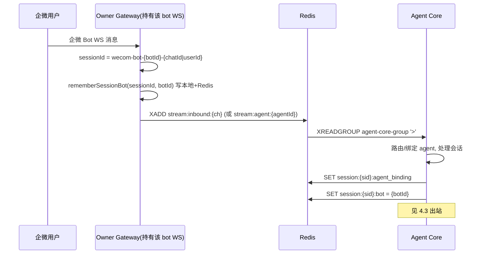
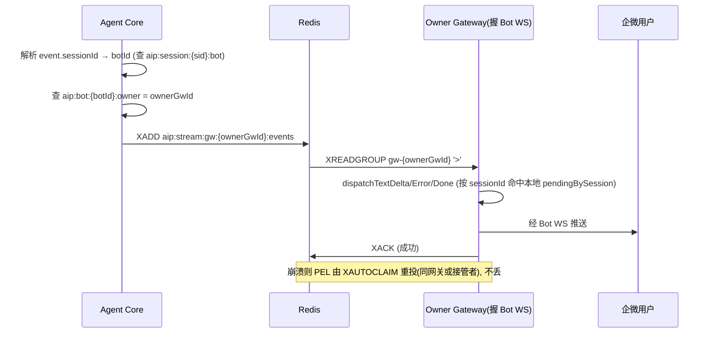
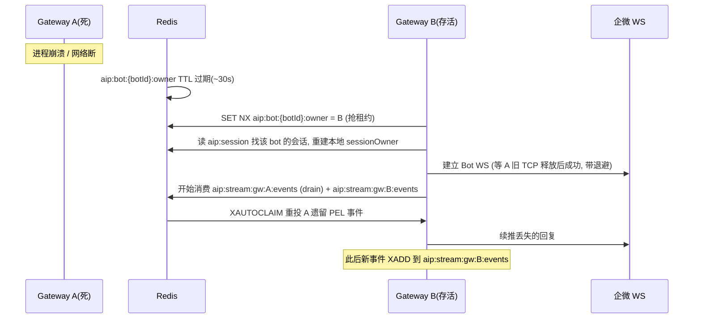

# ai-platform 多 Gateway 横向扩展 —— 架构评审与方案设计

> **TL;DR**：多 Gateway 崩的不是"扩展"本身，而是**出站事件被 Redis 消费组全局分片 + 企微 Bot WS 没有全局唯一 owner**；推荐用「Redis 租约选主，让每个 bot 全局恰好一个 owner Gateway + Agent Core 按 owner 把出站事件 XADD 到该 Gateway 的独立 stream」，做到精准送达、不重不丢，并按「先 bot 所有权与出站亲和 → 再补崩溃重投 → 再 H5 粘滞 → 最后收尾 sessionId」分期落地。

---

## 1. 问题清单

### 1.1 已知 3 个（用户原话报告，已读代码核实）

| ID | 现象 | 根因（已读码核实） | 严重度 | 影响范围 |
|----|------|-------------------|--------|----------|
| **K1** 会话粘滞 | AI-COPILOT 或 多个企微客户端 通过多个 agent gateway 链接同一个企微 BOT；回复错乱/丢失 | 企微 Bot WS 是**服务端发起的单连接**（一 bot 同一时刻仅一条活跃 WS），但 `BotRegistry.startAll`（`gateway/src/channels/BotRegistry.ts:138`）在每个 gateway 上**启动全部 enabled bot**，违反单 WS 约束；且 bot→gateway 归属是进程内存、无全局协调，多个 gateway 抢同一 bot 时只有 1 个能握连接，其余"空转" | P0 | 所有 wecom-bot 会话 |
| **K2** 某 gateway 掉线 | 某 gateway 进程挂掉后的影响与恢复不可控 | 无租约/故障转移机制；bot 随进程死亡即永久失联，直到人工重启；且其 PEL 遗留事件永不被重投（见 N1） | P0 | 该 gateway 持有的全部 bot 会话 |
| **K3** 多 gateway 交叉消费出站事件 | 多个 gateway 同时消费 Redis 里 Agent 针对同一会话的返回；客户只看到部分回复 | 所有 gateway 共用消费组 `gateway-event-group`（`index.ts:284`）消费**全局** `aip:stream:agent:events`（`backend/.../queue/redis_stream.py:29`）。Redis 消费者组会把消息**分片**给各 consumer（每消息只到 1 个 gateway），而该会话的企微 Bot WS 只挂在某个 gateway 上，其它 gateway 消费到事件却因本进程 BotRegistry 无该 bot 实例而无法投递（广播也找不到目标）→ 静默丢失 | P0 | 所有渠道（wecom-bot 尤甚） |

> K1 与 K3 本质是同一根因的两个表现：**出站需要 `session/bot → owner gateway` 亲和**，且 **bot 的 WS 必须全局唯一 owner**。

### 1.2 评审补充（新增问题，已读码核实）

| ID | 现象 | 根因（已读码核实） | 严重度 | 影响范围 |
|----|------|-------------------|--------|----------|
| **N1** 出站消费组无崩溃重投 | gateway 崩溃后其 PEL 孤儿事件永不被重投 → 静默丢失 | TS 消费端 `StreamConsumer.consumeLoop`（`redisStream.ts:312`）只读 `'>'`（新消息），异常时不 ACK（L421）但**无 XAUTOCLAIM/XPENDING 重投循环**；Python 侧 `inbound_worker._handle_message`（L306/L318）同样"暂不 ACK，留给后续 Phase 3"但 Phase 3 并不存在 | P0 | 崩溃瞬间在途事件 |
| **N2** Bot 所有权无分布式租约 | 无 leader/failover 协调；每 gateway 都 `startAll` 全部 bot | `BotRegistry.entries` 是进程内存 Map（L83）；`startAll` 遍历所有 enabled bot 各自 `startEntry`（L142-151）；无 Redis 选主/租约。与企微单 WS 硬约束直接冲突 | P0 | 全部 bot |
| **N3** sessionId 规则不含 botId | 多 bot / 多 gateway 下归属错乱放大 | `WecomBotAdapter.receive`（`WecomBotAdapter.ts:200-204`）：`sessionId = wecom-bot-${chatId|userId}`，**不含 botId**。同一用户连两个 bot → 同一 sessionId → `sessionOwner` Map（L408）与 `pendingBySession`（L141）互相覆盖 | P1 | wecom-bot 多 bot 场景 |
| **N4** 故障转移脑裂/半开连接 | 旧 gateway 死，其到企微的 TCP 可能仍 ESTABLISHED；新 gateway 立即接管同 bot 被拒或双连 | 无"先确认旧连接释放再接管"的冷却/握手；企微对同 bot 第二连接通常拒绝，新 owner 抢连失败但无退避策略 | P1 | 接管瞬间的 bot |
| **N5** H5 / wecom-h5 客户端 WS 无粘滞保证 | 客户端 WS 连到 gateway-X，事件被分片到别处或重连落别处 → 丢失 | H5/wecom-h5 的 WS 连接在 gateway 进程内的 `wsConnections`/`connections` Map（`server.ts:306,409`；`H5Adapter.ts:181`；`WecomH5Adapter.ts:210`）。出站 `h5Adapter.send(sessionId,...)`（`index.ts:324`）按 sessionId 在本进程查连接；跨 gateway 即"connection not found"丢弃。且 wecom-h5 每次连接**随机生成** sessionId（`server.ts:408`），重连即换号 | P1 | 所有 H5/wecom-h5 会话 |
| **N6** 入站写 Redis 前崩溃窗口 | 企微 WS 收到 → 回"思考中…"→ 写入 inbound stream 前崩溃，消息可能丢失 | `WecomBotAdapter.handleInbound`（L150-194）先 `respondStream('思考中…')` 再 `onMessage(inbound)`→`route`→`XADD`。崩溃窗口依赖企微重投，但 failover 后新 owner 是否续接未定义 | P2 | 崩溃瞬间入站消息 |
| **N7**（设计陷阱，非现状） 反向失败：每 gateway 独立消费组读全量 | 若用"每个 gateway 独立组读全量"修 K3，会变成**重复投递**——每个 gateway 都给自己的客户端发一遍 → 用户收到重复消息 | 消费者组语义：不同 group 各自拿到全量副本。全局 `>` 读法下多组 = 每 event 多份 | 必避 | 全局 |

---

## 2. 根因总览（一页说清：为什么单 gateway 能跑、多 gateway 崩）

**单 Gateway 之所以能跑**：只有一个进程，三件"本应全局唯一"的东西在该进程内天然唯一：
1. 只有一个 `BotRegistry`，所有 bot 的 WS 都在这一个进程；
2. 只有一个事件消费者（`gateway-event-group` 的唯一的 consumer），全局 `stream:agent:events` 的全部事件都进这一个进程；
3. 入站/出站 session 归属（`sessionOwner`、`pendingBySession`、`h5Adapter.connections`）全在该进程内存。

**多 Gateway 之所以崩**：上述三件"唯一性"被横向复制，而 Redis 消费者组的**分片语义**与**企微 Bot WS 的单连接约束**同时起作用：
- 复制后，全局 `stream:agent:events` 的事件被**均匀分片**到 N 个 gateway，但**每个会话的 Bot WS / H5 WS 只存在于 1 个 gateway**；
- 于是"拿到事件的人"≠"握有 WS 的人"——这就是 K3/N5 的直接机制；
- 同时每个 gateway 又尝试 `startAll` 全部 bot（N2），与企微"一 bot 一 WS"冲突，导致多数 gateway 的 bot 连不上（K1）；
- 而且一旦某 gateway 崩溃，既没有"把 bot 转移给存活 gateway"的租约（K2/N2），也没有"把遗留事件重投"的 XAUTOCLAIM（N1），在途回复直接丢失。

**一句话**：当前架构把"全局唯一性"悄悄寄托在了"只有一个进程"上；多实例化进程后，必须把这些唯一性**显式提升为分布式契约**——bot 所有权（谁握 WS）与出站事件路由（事件去哪）都要以 `owner gateway` 为锚点。

---

## 3. 方案选型对比

### 3.1 出站事件如何精准送达 owner gateway

| 方案 | 正确性（不丢/不重） | 去重 | 崩溃恢复 | 改动量 | 对 Agent Core 侵入 | 结论 |
|------|--------------------|------|----------|--------|--------------------|------|
| **① 按 owner 分流 stream key + Redis 所有权注册表**（推荐） | ✅ 每事件只 XADD 到 owner 的 `aip:stream:gw:{ownerGwId}:events`，仅 owner 消费；天然不重 | ✅ 单流单消费者组 | ✅ 配合 XAUTOCLAIM 重投 | 中 | 中（publish 时查 owner + 改写 target key） | **推荐** |
| **② Redis Pub/Sub 按 botId 频道** | ⚠️ at-most-once，订阅方瞬时掉线即丢；`done`/`error` 丢不得 | ✅ 单播到 owner | ❌ 不持久化，无重投 | 小 | 小（改为 PUBLISH） | 仅可作热路径提速，**不可单独作为可靠通道** |
| **③ 全局单 stream + 每 gateway 独立组**（读全量） | ❌ **重复投递**（每 gateway 各发一遍） | ❌ 多份 | ✅ | 小 | 小 | **否决（即 N7 陷阱）** |
| **④ sticky LB 把出站事件也牵引到 owner** | ⚠️ LB 层无法感知"bot 当前 owner"，且与崩溃转移脱节 | ✅ | ❌ LB 不感知故障转移 | 小 | 无 | 仅适合 H5（客户端 WS 可由 LB sticky），**不适合 wecom-bot**（服务端 WS 不受客户端 LB 控制） |

**推荐 ①**，并可与 ② 组合（Pub/Sub 做低延迟热路径，①的持久 stream 做可靠性兜底）。对 wecom-bot 必须走 ①；H5 可用 ④ sticky LB + ①（session→gateway 兜底）。

### 3.2 Bot 所有权如何分布式协调（每个 bot 全局恰好一个 owner）

| 方案 | 正确性 | 崩溃恢复 | 扩缩容 | 改动量 | 结论 |
|------|--------|----------|--------|--------|------|
| **A Redis 租约（SET NX + TTL + 心跳续租）+ 每 gateway 只连自己拥有的 bot**（推荐） | ✅ 任一时刻最多 1 个 owner | ✅ 租约过期即释放，存活 gateway 抢注 | ✅ 增减 gateway 自动重平衡 | 中 | **推荐** |
| **B 一致性哈希分片（botId → gateway）** | ✅ 确定性映射 | ⚠️ 节点失效需 rehash，瞬间映射漂移 | ⚠️ 扩缩容触发大规模重映射 | 小 | 备选（简单但故障抖动大） |
| **C 外部协调器/选主（Redis Lock / etcd per-bot leader）** | ✅ | ✅ | ✅ | 大 | 过度设计，除非已有协调基础设施 |

**推荐 A**：在现有 Redis 上用 `aip:bot:{botId}:owner = gatewayId` + TTL（如 30s），owner 每 ~10s 续租；gateway 启动时只对"自己 claim 成功"的 bot 调 `startEntry`，彻底消除 N2/K1 的"人人都连"冲突。B 可作为不想要心跳时的简化替代。

---

## 4. 推荐架构

### 4.1 组件图

```mermaid
graph TD
  U[企微用户 / H5 客户端] -->|服务端发起 WS| LB[LB / 接入层]
  U2[H5 / wecom-h5 浏览器] -->|客户端 WS sticky LB| LB
  LB --> G1[Gateway A<br/>gatewayId=A]
  LB --> G2[Gateway B<br/>gatewayId=B]
  LB --> GN[Gateway N]

  G1 -->|1. 抢租约 / 续租| R[(Redis)]
  G2 -->|1. 抢租约 / 续租| R
  GN -->|1. 抢租约 / 续租| R

  R -.->|aip:bot:{botId}:owner 全局唯一| G1
  R -.->|aip:stream:gw:{gwId}:events 每网关独立流| G1
  R -.->|aip:session:{sid}:bot / :gateway| G1

  C[Agent Core 单实例] -->|2. publish_agent_event 按 owner 分流 XADD| R
  G1 -->|3. XREADGROUP gw-{gwId} '>'| R
  C -->|inbound: stream:agent:{agentId} / stream:inbound:{ch}| R
  R -->|agent-core-group| C

  Store[wecom-bots.yaml] -.bot 配置清单.-> G1
  G1 -.健康检查 /admin/bots/health.-> Store
```

要点：
- 每个 bot 全局恰好 **1 个 owner gateway**（Redis 租约保证）；owner 才握该 bot 的企微 WS。
- 出站事件由 Agent Core **按 owner 分流**到 `aip:stream:gw:{ownerGwId}:events`，仅该 gateway 消费 → 精准、不重、不丢。
- `session → bot`、`session → gateway` 在 Redis 持久化（替代进程内 `sessionOwner`/`connections` 查找）。

### 4.2 入站时序（多 gateway 下消息落到正确的 gateway 与 bot）



### 4.3 出站时序（精准投到 owner gateway，不丢不去重）



### 4.4 故障转移时序（gateway 挂 → 租约过期 → 另一 gateway 接管 bot + 续消费）



> **半开连接（N4）处理**：B 抢到租约后连企微若被拒（旧 TCP 未释放），采用指数退避重试（如 1s/2s/4s…封顶），并监听"旧 owner 租约已彻底消失 + 旧 stream 已 drain 完"作为接管完成的判据，避免脑裂双连。

### 4.5 关键数据结构（Redis key 设计）

| Key | 类型 | 内容 / 语义 | 责任方 |
|-----|------|------------|--------|
| `aip:bot:{botId}:owner` | string+TTL | `gatewayId`，租约 ~30s；owner 心跳续租，崩溃后过期释放 | Gateway（抢/续） |
| `aip:gateways:members` | set | 存活 gatewayId 心跳集合（用于故障转移 drain 时定位旧 owner 的 stream） | 各 Gateway |
| `aip:stream:gw:{gatewayId}:events` | stream | 该 gateway 的出站事件流；消费组 `gw-{gatewayId}`；崩溃 PEL 由 XAUTOCLAIM 重投 | Agent Core(XADD) / Owner Gateway(XREADGROUP) |
| `aip:stream:gw:pending:events` | stream(兜底) | owner 未知时的暂存（极少用；owner 解析失败才落此，再由 owner 认领后转写） | Core / Gateway |
| `aip:session:{sessionId}:bot` | string | botId（替代进程内 `sessionOwner`，跨 gateway 可见） | Gateway 入站写 / Core 读 |
| `aip:session:{sessionId}:gateway` | string+TTL | 持有该会话 WS 的 gatewayId（H5/wecom-h5 连接建立时写，重连更新） | Gateway WS 建立/重连时写 |
| `aip:session:{sessionId}:agent_binding`（已有） | string+TTL | agentId 绑定（session affinity，复用不改） | Core / Gateway |

**sessionId 规则升级（修 N3）**：`wecom-bot-{botId}-{chatId|userId}`（adapter 已知自身 botId，可在 `receive` 内拼入）；wecom-h5 / H5 改为**客户端持久化并回传 sessionId**（不再每次随机，修 N5 重连换号）。`aip:session:{sid}:bot` 仍写入以兜底跨 bot 歧义。

---

## 5. 增量落地步骤

**阶段 1 — Bot 所有权 + 出站亲和（先解 K1/K2/K3/N2/N3/N7）**
- 模块：`gateway/src/channels/BotRegistry.ts`（去 `startAll` 全启，改为按 Redis 租约只启 owner 的 bot）、新增 `gateway/src/cluster/ownership.ts`（租约抢注/续租/监听）、`gateway/src/index.ts`（按 owner 起 bot、按 `gw-{selfId}` 消费自己的 stream）、`backend/.../queue/redis_stream.py`（`publish_agent_event` 查 `aip:bot:{botId}:owner` 后 XADD 到 `aip:stream:gw:{ownerGwId}:events`）、`WecomBotAdapter.receive`（sessionId 加 botId）。
- 预期：每个 bot 全局 1 owner；出站事件只到 owner；不重不丢；不再人人抢连。
- 验证：起 2 个 gateway + 1 bot，断掉握 WS 的那个，另一 gateway 应在租约过期后接管并续推在途回复；用 3 个 gateway 发同一会话多轮，客户端收到完整不重复。

**阶段 2 — 崩溃重投（补 N1）**
- 模块：`gateway/src/queue/redisStream.ts`（`consumeLoop` 增加 XAUTOCLAIM 周期性重投本/接管 stream 的 PEL）、`backend/.../queue/inbound_worker.py`（增加 XPENDING/XAUTOCLAIM 重投，闭环 N1 的"Phase 3"）。
- 预期：gateway/agent-core 崩溃瞬间在途事件不丢，重启或接管后被重投一次。
- 验证：消费到事件后进程 `kill -9`，重启/接管后该事件被恰好一次重投并成功。

**阶段 3 — H5 / wecom-h5 粘滞（修 N5）**
- 模块：`server.ts`（`/ws/chat`、`/ws/wecom-h5/chat` 改为客户端持久化 sessionId + 建立时写 `aip:session:{sid}:gateway`）、LB 配置 sticky（cookie/一致性哈希）、`index.ts` 出站对 H5 按 `aip:session:{sid}:gateway` 选目标 stream、H5Adapter/WecomH5Adapter 连接丢失时清理映射。
- 预期：H5 客户端正常时钉在固定 gateway；崩溃重连落到别处也能经 `session→gateway` 命中。
- 验证：H5 长轮对话中杀掉其 gateway，客户端重连到新 gateway 后回复继续且完整。

**阶段 4 — 收尾 sessionId 碰撞与一致性（N3/N4 收口）**
- 模块：全渠道 sessionId 统一含 botId/稳定标识；故障转移退避与"接管完成"判据固化；补充 `aip:bot:{botId}:owner` 旧值记录以支持 drain 目标定位；端到端压测多 bot × 多 gateway。
- 验证：同一用户连 2 个 bot 会话互不串台；模拟脑裂（旧 gateway 假死但 TCP 残留）下无双连/无重复。

---

## 6. 待用户确认的关键决策点

1. **Gateway 间是否允许 Agent Core 也多实例？**
   - 推荐：**本期不扩展 Agent Core（保持单实例）**，多 Gateway 方案与其解耦；但 `publish_agent_event` 按 owner 分流的设计对 Core 多实例无侵入。
   - 备选：若未来 Core 也要多实例，需在入站消费按 `sessionId` 哈希分区 + 分布式会话锁（见附录同构风险）。
   - 理由：缩小本期范围、降低风险；出站分流本就不依赖 Core 实例数。

2. **出站可靠通道：① 持久 per-owner stream（推荐）还是 ② Pub/Sub 提速？**
   - 推荐：**① 持久 stream 为主**；若追求更低延迟，可叠加 ② Pub/Sub 热路径（stream 作兜底）。
   - 备选：纯 ②（at-most-once，接受偶发丢 `done`）。
   - 理由：用户报告"只见部分回复"，可靠性优先；Pub/Sub 单独用会复现丢失。

3. **GatewayId 如何生成？**
   - 推荐：**环境变量/StatefulSet Pod 名/ hostname 稳定注入**（如 `gw-a`、`gw-b`），重启保持一致，便于 drain 旧 stream。
   - 备选：启动时随机 UUID（简单，但崩溃重启后无法认领自己旧 stream，需靠 `aip:gateways:members` + drain 全部历史）。
   - 理由：稳定 ID 让故障转移 drain 可定向、可预测。

4. **Bot 所有权协调：A 租约（推荐）还是 B 一致性哈希？**
   - 推荐：**A Redis 租约（SET NX + TTL + 心跳）**，每 gateway 只连自己 owner 的 bot。
   - 备选：B 一致性哈希分片（无心跳，扩缩容有抖动）。
   - 理由：与现有 Redis 零新依赖；崩溃自动释放；天然支持不均衡负载。

5. **是否接受"故障转移窗口期内（租约 ~30s）该 bot 暂时不可服务"？**
   - 推荐：**接受短窗口（可通过缩短 TTL + 更快心跳压到 ~10s）**，并配合退避重连。
   - 备选：引入多活预热（双 gateway 同时握"热备"连接）——但违反企微单 WS，不可行。
   - 理由：企微单 WS 物理约束下，唯一 owner 必然有切换间隙。

6. **是否改 sessionId 规则（加 botId / H5 客户端持久化）？**
   - 推荐：**改**——`wecom-bot-{botId}-{id}`；H5/wecom-h5 客户端持久化并回传 sessionId。
   - 备选：不改 sessionId，仅靠 Redis `aip:session:{sid}:bot` 兜底（仍可能在同用户两 bot 场景下串台）。
   - 理由：从根上消除 N3 碰撞，且 adapter 本就持有 botId，改动极小。

7. **崩溃重投是否本期必须（N1）？**
   - 推荐：**必须**，与阶段 1 同期或紧接实现 XAUTOCLAIM，否则"精准送达"仍会在崩溃时静默丢事件。
   - 备选：暂缓（接受崩溃瞬间丢失，靠企微/客户端重试弥补）。
   - 理由：否则 K2/K3 治标不治本。

---

## 附录：Agent Core 多实例的同构风险（依赖项说明）

若日后 Agent Core 也要横向扩展，会浮现**与 Gateway 完全同构**的两类问题，需在彼时同步处理（本期方案已为其留好接口）：
1. **入站分片**：`agent-core-group` 消费 `stream:agent:{agentId}` + `stream:inbound:{channel}` 时，多 Core 实例会把同一会话的不同消息分片到不同进程；而 `inbound_worker` 的 `session_locks` 是**进程内**锁（L94）→ 同会话并发处理竞争会话状态。
   - 对策：按 `sessionId` 一致性哈希分区到固定 Core 实例，或将 session 锁改为 Redis 分布式锁。
2. **Agent 实例视图**：`agent_manager.list_agents()` 当前是进程内（L157），多 Core 需共享 agent 注册表（Redis/配置同步）。
3. **出站发布不受影响**：Core 多实例下 `publish_agent_event` 仍只依赖 Redis 所有权注册表查 owner，对 Gateway 侧设计零侵入——这正是推荐方案①的优势。

> 本期交付范围仅限多 Gateway；以上为"若扩展 Core"的前置风险提示，不在本期实现。
