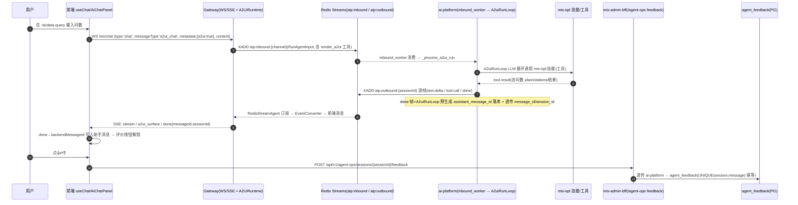

# A2UI 通道端到端联调清单（聚焦 mis-iqd 问数）

> 产出人：高见远（架构师）｜依据：docs/ai-fusion（a2ui + wrenai）、`a2ui_run.py` / `events.py` / Gateway 事件层 / 前端 chat-core + 问数页源码逐文件核对。
> 联调对象：**用户真实问数链路**（A2UI 通道），非 BFF `/api/v1/iqd/ask-stream` 测试页那条。

## 0. 一句话概览 / 边界 / 最大风险

- **A2UI 链路一句话**：前端 `useChat`（`A2UI_CHAT_OPT_IN_DEFAULT=true`）经 chat-core **直连 Gateway**（`WS /ws/chat` 发、`SSE /api/events/stream` 收）→ Gateway 经 `RedisStreamAgent` 写 Python 入站流 → `ai-platform` 的 `inbound_worker` 识别 `messageType=a2ui_run` → `A2uiRunLoop` 跑 LLM 循环（工具含 mis-iqd 技能）→ 事件 XADD 到 `aip:outbound:{sessionId}` → Gateway `EventConverter` 转前端消息 → 前端 `event-adapter` 归一 → `useChat.handleEvent` 落 chat-store → `AiChatPanel` 渲染。
- **覆盖边界**：仅覆盖上述 A2UI 通道从「发问」到「done 帧 messageId 透传」到「四项能力（来源/评价/耗时/路由）」；**不含** BFF ask-stream 测试页、Coordinator/BFF 旧文本通道、/embed 外部嵌入、权限脱敏的深层回归（仅在 Phase 6 抽验）。
- **最大风险点**：**A2UI 通道本身从未做过端到端联调**；且 P2 补丁才打通「done 帧 messageId/sessionId 透传」，此前评价按钮在 A2UI 主链路恒禁用。下面用图例标注每个 Phase 的风险等级。

**风险图例**：🔴 从未端到端联调（高风险）　🟡 单测/局部已覆盖，缺端到端　🟢 既有链路可回归

---

## 1. A2UI 通道事件流（标注关键透传点）



> ⚠️ 两个核对发现（已写入风险项）：
> 1. `a2ui_run.py` 是**通用 LLM 循环**，问数靠 LLM 调用 mis-iqd 技能工具实现；Phase 5 必须验证「问数意图真正走了 mis-iqd 的 WrenAI 桥接」而非只在做泛化聊天。
> 2. A2UI 通道**没有独立 `plan`/`step` 事件帧**（同 F2 结论）：问数 plan/citations 以 ```` ```iqd-plan ```` / ```` ```iqd-citations ```` **Markdown 围栏嵌在 `text.delta` 正文**里，前端用 `splitIqdPlan`/`splitIqdCitations` 剥离渲染；`token` 在 `done.tokenUsage`，`done` 在 done 帧。**Phase 3 据此校验，不要找不存在的 plan 帧**。

---

## 2. 联调前置检查表（先过这关，否则 Phase 1 必失败）

| # | 检查项 | 取值/命令 | 预期 | 失败判据 |
|---|--------|-----------|------|----------|
| P0-1 | **Gateway 端口** | 默认 `8080`（`server.ts` `app.listen`；`.env.integration` 注释 `MIS_GATEWAY_URL=http://localhost:8080`） | 监听 `:8080` | 端口被占 → 起栈失败 |
| P0-2 | **ai-platform 后端** | `8000`（`AI_PLATFORM_BASE_URL=http://127.0.0.1:8000`） | `uvicorn` 起、能连 PG/Redis | 起不来 → 无 inbound 消费 |
| P0-3 | **BFF（mis-admin-bff）** | `8109`（历史上下文） | `8109` 健康，能透传 ai-platform | 反馈提交 502/超时 |
| P0-4 | **前端 Vite 代理** | 默认代理 `http://localhost:8080`（Gateway） | 浏览器走 `:5173` 代理到 Gateway | 404/跨域 → 代理配错 |
| P0-5 | **PG / Redis** | `DB_HOST/REDIS_HOST`（远端 `10.254.16.6` 或本机 `localhost`，`DB_PORT=5432`、`REDIS_PORT=6379`） | PG `mis_platform` 可连、Redis 可连 | 连不上 → a2ui_run 持久化/事件流失败 |
| P0-6 | **JWT 密钥** | `JWT_PRIVATE_KEY_PATH` / `JWT_PUBLIC_KEY_PATH`（RS256 配对，`./backend/keys/*.pem`） | 前端登录拿到的 MIS JWT 能被 Gateway 验签 | 验签失败 → WS 401/无 SSE |
| P0-7 | **Nacos / 配置兜底** 🔴 | `MIS_REMOTE=false` 时**不连 Nacos**，配置权威=jar `application.yml`+env | 本地直接起，无需 Nacos | 见开放项④ |
| P0-8 | **业务数据就绪** 🔴 | DEPTID / 门店等行级范围维度源数据 | 问数可命中脱敏/范围逻辑 | 见开放项③ |
| P0-9 | **单测先绿（可选但建议）** 🟡 | `pytest agent/ai-platform/backend/tests/test_a2ui_run.py test_mis_stream.py` | `done` 帧含 `message_id`/`session_id`、落库 UUID 一致 | 单测红 → 先修代码再联调 |

---

## 3. Phase 0 — 环境与服务起栈

| 步骤 | 操作 / 调用点 | 预期结果 | 失败判据 | 验证手段 |
|------|---------------|----------|----------|----------|
| 0.1 | 起 PG/Redis（远端或 `docker compose -f deploy/docker-compose.dev.yml up -d`） | 容器 healthy | 容器 exit | `docker ps` / 连库探针 |
| 0.2 | 起 BFF（`8109`）、auth/iam/org/system/audit/kb（Gateway 直连下游需齐） | 各服务 `/actuator/health` 200 | 依赖缺失报错 | 日志 + curl health |
| 0.3 | 起 Gateway（`8080`，`agent/ai-platform/gateway`，需 `@ag-ui/*`+`rxjs` 已装） | `GET /` 或 health 200；WS/SSE 路由注册 | 模块缺失/端口冲突 | 启动日志 |
| 0.4 | 起 ai-platform 后端（`8000`，`inbound_worker` 消费 `aip:inbound` + `a2ui_run` 就绪） | 日志出现 `inbound-stream-worker` 消费中 | 无消费日志/Redis 连不上 | 后端日志 |
| 0.5 | 起前端 `mis-admin-web`（`npm run dev`，Vite `:5173`） | 页面可开，代理到 `:8080` | 代理 404 | 浏览器 Network |
| 0.6 | 用测试账号登录拿 RS256 MIS JWT（存为 `$TOKEN`） | 登录成功 | 登录失败 | 浏览器/接口 |

**本 Phase 风险**：🟢 各服务单独起过；🔴 但 **Gateway + ai-platform + 前端走 A2UI 通道的「组合起栈」未联调过**。

---

## 4. Phase 1 — Gateway / WS / SSE 联通

| 步骤 | 操作 / 调用点 | 预期结果 | 失败判据 | 验证手段 |
|------|---------------|----------|----------|----------|
| 1.1 | **SSE 订阅**：`curl -N -H "Authorization: Bearer $TOKEN" "http://localhost:8080/api/events/stream?sessionId=demo-1"` | 连接挂起、等待事件（无立即断开） | 401/403/空连接即断 | curl -N 终端 |
| 1.2 | **WS 建连**：`wscat -c "ws://localhost:8080/ws/chat?token=$TOKEN"` | `connected` 状态 | 握手失败/无响应 | wscat / 浏览器 WS |
| 1.3 | WS 发一条 `text` 通道消息（灰度回退对照）：`{type:'chat',sessionId,messageType:'text',content:'你好'}` | SSE 收到 `stream` 文本 | A2UI 通道未触发 | curl SSE 观察 |
| 1.4 | WS 发 **A2UI 通道**消息：`{type:'chat',sessionId,messageType:'a2ui_chat',metadata:{a2ui:true},content:'本月各渠道销售额'}` | SSE 出现 `stream`/`a2ui_surface`/`done` 等事件 | 无事件 / WS 报错 | curl SSE 观察逐帧 |
| 1.5 | 核对 Gateway `server.ts` opt-in 分支命中：`messageType==='a2ui_chat' \|\| metadata.a2ui===true` → `runChat` → `A2UIRuntime` | 日志显示 A2UI run 启动 | 走了旧 MessageRouter | Gateway 日志 grep `a2ui` |

**本 Phase 风险**：🔴 WS/SSE 双通道 + opt-in 分支从未端到端跑通；🟡 WS/SSE 单通路在其它 Agent 用过，但「问数 + a2ui_chat」组合未验证。

---

## 5. Phase 2 — 前端 A2UI 发起问数

| 步骤 | 操作 / 调用点 | 预期结果 | 失败判据 | 验证手段 |
|------|---------------|----------|----------|----------|
| 2.1 | 浏览器开 `/ai/data-query`，确认 `AiChatPanel` 头部「已直连 Agent 网关 · 界面由 A2UI 动态生成」 | 连接态 `connected` | `未连接`/`等待连接` | 浏览器面板状态徽标 |
| 2.2 | 输入问数并发送 → 网络看 WS 出站 payload 含 `messageType:'a2ui_chat'`、`metadata.a2ui:true` | 出站 JSON 正确 | 仍是 `text` 通道 | DevTools WS 帧 |
| 2.3 | 观察 chat-store：`useChat` 建本地 `sessionId` → `streamingMessageIdRef` 占位助手消息 | 流式追加 `content` | 消息不出现/重复 | React DevTools store |
| 2.4 | 若命中 A2UI surface（`data-table` 等）→ `MessageProcessor` 更新 SurfaceStore 渲染 | 卡片出现 | 卡片不渲染/报错 | 浏览器渲染 |
| 2.5 | 路由激活门控：`active` 为 true 才 `autoConnect`；切走再回不重复订阅 | 单 SSE 订阅 | 双订阅消息重复 | 控制台订阅计数 |

**本 Phase 风险**：🔴 `data-query-page` → `useChat(a2uiEnabled 默认 true)` 的**真实问数页 A2UI 联调零记录**；前端乐观消息占位与 SSE 收尾衔接未验证。

---

## 6. Phase 3 — 事件流逐帧校验（plan / step / token / done）

> 注意：A2UI 通道**没有独立 plan/step 帧**；plan/citations 在 `text.delta` 正文的 ```iqd-plan```/```iqd-citations``` 围栏内；`token` 在 `done.tokenUsage`；`done` 在 done 帧。

| 步骤 | 操作 / 调用点 | 预期结果 | 失败判据 | 验证手段 |
|------|---------------|----------|----------|----------|
| 3.1 | SSE 抓一整轮，按帧列出类型顺序 | 顺序 ≈ `text.delta*` →（可选 `tool.call`/`tool.result`）→ `done` | 卡在中间/无 done | curl SSE 记录 |
| 3.2 | 取一条 `text.delta` 正文，grep ```` ```iqd-plan ```` | 含 plan 围栏 JSON（seq/code/label/status/duration_ms） | 无 plan 围栏 | 文本检查 |
| 3.3 | grep ```` ```iqd-citations ```` | 含来源 kind/item_key/display_name/snippet/source_ref | 无引用（若数据无来源则跳过） | 文本检查 |
| 3.4 | 收尾 `done` 帧结构：`{type:'done', tokenUsage:{prompt,completion,total}}` | tokenUsage 有非零值 | tokenUsage 缺失 | SSE 末帧 |
| 3.5 | 前端 `splitIqdPlan` 后 `IqdPlanSteps` 渲染每步 `duration_ms` | 时间线每步显示耗时 | 不渲染/报错 | 浏览器气泡 |
| 3.6 | 前端 `IqdPlanSteps totalMs` = `plan[].duration_ms` 求和 | 顶部「本轮总耗时 Xs」 | 总耗时不显示 | 浏览器气泡 |
| 3.7 | `dispatch.trace`（默认 `DISPATCH_TRACE_SSE_ENABLED` 关闭） | 通常无；开启时 `custom{eventType:'dispatch.trace'}` | 不影响主链 | 日志/开关 |

**本 Phase 风险**：🔴 问数 plan 围栏**是否真在 A2UI 通道的 `text.delta` 里产出**未验证（可能只在 mis-iqd 工具 result 内、或被泛型 LLM 改写而丢失围栏格式）→ 这是 Phase 3 最高不确定点，必须实抓一帧确认。

---

## 7. Phase 4 — done 帧 messageId / sessionId 透传校验（P2 补丁核心）

| 步骤 | 操作 / 调用点 | 预期结果 | 失败判据 | 验证手段 |
|------|---------------|----------|----------|----------|
| 4.1 | SSE 末帧 `done` 是否带 `messageId` 与 `sessionId`（camelCase） | 两者均非空字符串 | 缺 messageId → 评价恒禁用 | curl SSE 末帧 |
| 4.2 | 溯源 Python：`a2ui_run.py` `AgentEvent.done(total_usage, message_id=assistant_message_id, session_id=session_id)`，且 `assistant_message_id` 已 `_persist_assistant(message_id=...)` 落库 | UUID 一致 | 未预生成/未落库 | 后端日志 + `agent_session_message` 查 `id` |
| 4.3 | Gateway `agentEventParser`：`messageId ?? message_id`、`sessionId ?? session_id` 透传 | snake/camel 都通 | 字段被吞 | 单测 `test_a2ui_run.py` + 实抓 |
| 4.4 | Gateway `EventConverter.toRunFinished` 经 `rawEvent` 带 messageId/sessionId；`baseEventToFrontendMessage` RUN_FINISHED 附到 `A2UIDoneMessage` | 前端 done 含两项 | 透传断链 | 网关日志 + SSE |
| 4.5 | 前端 `event-adapter.ts` done 分支 `messageId: raw.messageId ?? raw.message_id` → `useChat` 写 `backendMessageId`/`backendSessionId` 到助手消息 | chat-store 该消息带 backendMessageId | 不写入 → 按钮禁用 | React DevTools store |
| 4.6 | **一致性**：`a2ui_run` 落库 UUID == done 帧 messageId == 前端 `backendMessageId` == 后续 feedback 的 `message_id` | 全链同一值 | 任一处漂移 → 评价回放命中不到 | 三处比对（日志/库/网络） |

**本 Phase 风险**：🔴 整条透传链（Python→Redis→Gateway parser→EventConverter→前端 adapter→chat-store）**从未端到端验证**，纯靠 P2 补丁+单测保证；是最易在联调爆雷的一段。

---

## 8. Phase 5 — 四项能力核验（来源 / 评价 / 耗时 / 路由）

### 5.1 ① 来源查看（🟢 已达标，回归）
| 步骤 | 操作 | 预期 | 失败判据 | 手段 |
|------|------|------|----------|------|
| 5.1.1 | 问数回答含引用时看气泡「引用 · N 项」折叠 | 展开见 kind 徽标/名称/item_key/snippet/source_ref | 不显示 | 浏览器 |
| 5.1.2 | 对照 `IqdCitationBlock`（与 kb-chat-sources 同款） | 口径一致无回归 | 格式错位 | 浏览器 |

### 5.2 ② 评价（🔴 主链路此前恒禁用，P2 才通）
| 步骤 | 操作 / 调用点 | 预期 | 失败判据 | 手段 |
|------|---------------|------|----------|------|
| 5.2.1 | done 后助手气泡出现 👍/👎（非 streaming） | 按钮可见 | 不出现/一直禁用 | 浏览器 |
| 5.2.2 | `backendMessageId` 缺失模拟（重连丢 done）→ 按钮禁用 + tooltip「暂无法评价」 | 降级正确不报错 | 报错/仍能点 | 浏览器 |
| 5.2.3 | 点 👍 → `submitSessionFeedback` → `POST /api/v1/agent-ops/sessions/{sessionId}/feedback` | toast「已记录反馈」，锁定 | 提交失败 | 浏览器+Network |
| 5.2.4 | 点 👎 必须填 comment（≤500），空被拦截 | 前端校验 + 服务端 4001 | 可空提交 | 浏览器 |
| 5.2.5 | 重复提交同消息 → 覆盖写（幂等） | 不新增行 | 重复行 | `agent_feedback` 表查 `UNIQUE(session,message)` |
| 5.2.6 | DB 落库：`session_id`=平台 UUID、`message_id`=done 帧、`agent_id`=实际路由值、`user_id`=归属 | 行正确 | agent_id 错/越权 | PG 查询 |
| 5.2.7 | 运营页 `/agent/feedback` 按 `agent_id=mis-iqd` 过滤可见 | 能看到问数评价 | 看不到（见开放项①） | 运营页 |
| 5.2.8 | 越权：非本人 session 提交 → 2005/404，不写入 | 拒绝 | 写入 | curl 换 token |

### 5.3 ③ 步骤耗时（🟡 每步已达标，总耗时条为增量）
已并入 Phase 3 的 3.5/3.6（每步 duration_ms + 顶部总耗时）。补验：无 plan 或全 0 时不显示总耗时条。

### 5.4 ④ 智能体路由（🔴 实际 agent_id 取值待确认）
| 步骤 | 操作 / 调用点 | 预期 | 失败判据 | 手段 |
|------|---------------|------|----------|------|
| 5.4.1 | 助手气泡尾部「由 问数 智能体回答」标签（`agentDisplay = message.agentId ?? worker_id ?? agentLabel`） | 显示「问数」 | 显示 mis-iqd/coordinator 空白 | 浏览器 |
| 5.4.2 | 核对会话 `agent_id` 实际值（Coordinator 自动路由结果） | = `mis-iqd` 或 coordinator 标识 | 非预期值影响运营过滤 | PG `agent_session.agent_id` |
| 5.4.3 | `data-query-page` 传 `agentLabel="问数"`、`qa-page` 传「知识库问答」 | 两页标签正确 | 串台 | 浏览器 |
| 5.4.4 | `DispatchTraceHint`（worker_id）与路由标签并存不冲突 | 两处并存 | 互相覆盖 | 浏览器 |

**本 Phase 风险**：🔴 ④ 的 `agent_id` 实际取值未知（开放项①），直接决定运营能否按 mis-iqd 过滤看到评价；🔴 ② 在 A2UI 主链路是 P2 后才通，纯单测覆盖、无端到端。

---

## 9. Phase 6 — 权限与脱敏（抽验，不深回归）

| 步骤 | 操作 / 调用点 | 预期 | 失败判据 | 手段 |
|------|---------------|------|----------|------|
| 6.1 | 无 `ai:chat:use` 权限账号访问 `/ai/data-query` | 拦截（菜单/API 403） | 可进 | 权限系统 |
| 6.2 | 行级范围：越权 DEPTID/门店 → 问数被拒或过滤（45204 fail-closed） | 不返回越权数据 | 越权数据泄露 | 问数越权用例 |
| 6.3 | 敏感字段脱敏（手机号等 `138****0000`） | 结果脱敏 | 明文 | 结果检查 |
| 6.4 | BFF 反馈端点 `deny-unmapped`：未登记权限码 → 403 | 登记 `ai:chat:use`（V76 已登记）通过 | 403 | Network |

**本 Phase 风险**：🟡 权限/脱敏在 WrenAI 一期已联调；但 **A2UI 通道下是否仍走同一套 ScopeResolver/脱敏**需抽验（a2ui_run 经工具调 mis-iqd，范围头由 Gateway 注入）。

---

## 10. Phase 7 — 回归与已知风险

| 步骤 | 操作 | 预期 | 失败判据 | 手段 |
|------|------|------|----------|------|
| 7.1 | 旧文本通道（`a2uiEnabled=false` / BFF ask-stream 测试页）未回归坏 | 两条通道互不影响 | 互相串 | 双通道各跑一次 |
| 7.2 | 重连（SSE Last-Event-ID）后 done 帧丢失 → 评价降级禁用 | 不报错、按钮禁用 | 报错 | 断网重连 |
| 7.3 | 一期 W1–W4 既有用例（问数/来源/计划/审计）无回归 | 行为一致 | 行为漂移 | 回归脚本 |
| 7.4 | 已知风险复盘：🔴 A2UI 通道零端到端；🔴 done 透传链；🔴 agent_id 取值；🔴 问数 plan 围栏是否在 text.delta | 全部有结论 | 仍有黑洞 | 本清单闭环 |

**已知风险汇总**（建议主理人拍板前同步）：
1. 🔴 A2UI 通道从未端到端联调，上面每个 Phase 的「从未」段都可能在首次跑时爆。
2. 🔴 `a2ui_run.py` 是通用 LLM 循环，**问数是否真走 mis-iqd 的 WrenAI 桥接**需 Phase 1/5 实证（避免「聊了天但没真问数」）。
3. 🔴 plan 围栏格式在 A2UI 通道的保真度未验证（Phase 3.7 是最不确定点）。
4. 🟡 单测 `test_a2ui_run.py`/`test_mis_stream.py` 已覆盖 done 透传与落库一致性，但**单测≠端到端**，RedisStreamAgent/EventConverter 的真实串联只在联调见分晓。

---

## 11. 最小联调冒烟脚本（建议 Phase 0–1 起栈 + 一条问数冒烟）

```bash
# ---- 0) 起栈（远端 PG/Redis 已就绪时） ----
# 终端A: BFF + 依赖服务
cd backend/mis-admin-bff && ./mvnw spring-boot:run            # :8109
# 终端B: Gateway
cd agent/ai-platform/gateway && npm run dev                    # :8080
# 终端C: ai-platform 后端（含 inbound_worker / A2uiRunLoop）
cd agent/ai-platform/backend && uvicorn src.main:app --port 8000 --reload
# 终端D: 前端
cd frontend/mis-admin-web && npm run dev                       # :5173

# ---- 1) 单元冒烟（先绿再做端到端） ----
cd agent/ai-platform/backend
pytest tests/test_a2ui_run.py tests/test_mis_stream.py -q       # 断言 done 帧 message_id/session_id + 落库一致

# ---- 2) 一条问数冒烟（A2UI 通道） ----
TOKEN=<从浏览器登录拿到的 MIS JWT>
SID=demo-$(date +%s)
# 2.1 后台订阅 SSE（另开终端）
curl -N -H "Authorization: Bearer $TOKEN" \
  "http://localhost:8080/api/events/stream?sessionId=$SID" | tee /tmp/a2ui_sse.log &
# 2.2 WS 发 A2UI 问数（需 wscat）
wscat -c "ws://localhost:8080/ws/chat?token=$TOKEN" <<'JSON'
{"type":"chat","sessionId":"'$SID'","messageType":"a2ui_chat","metadata":{"a2ui":true},"content":"本月各渠道销售额","timestamp":"2026-08-24T00:00:00Z"}
JSON
# 2.3 校验：/tmp/a2ui_sse.log 末帧应为 done 且含 messageId+sessionId；grep iqd-plan 围栏
grep -o '"type":"done"[^}]*"messageId":"[^"]*"' /tmp/a2ui_sse.log
grep -c 'iqd-plan' /tmp/a2ui_sse.log
```

> 若 2.3 的 done 帧**没有 messageId**，直接定位 Phase 4 透传链；若**没有 iqd-plan 围栏**，定位 Phase 3.7（问数 plan 是否真在 A2UI 通道产出）。

---

## 12. 联调前必须确认的 4 个开放项（来自历史上下文，待用户/运维确认）

1. **① 用户会话实际的 `agent_id` 取值**：评价按 `agent_id` 过滤，值不对（如路由到 `coordinator` 而非 `mis-iqd`）运营页按 `mis-iqd` 过滤会看不到。→ 联调 Phase 5.4.2 核对 `agent_session.agent_id`；若非 `mis-iqd`，按 design-feedback-enhance §7 拍板在 BFF 透传层显式注入 `agent_id=mis-iqd`（与 `IqdAskFacadeService.DEFAULT_AGENT_ID` 同源）。
2. **② WrenAI 真实工具面对账**：mock vs 真实 WrenAI 返回结构是否一致（plan/citations/SQL 字段名、围栏格式）。→ Phase 1/3 用真实 WrenAI 跑一条，比对 `orchestrator.py` 产出与前端 `splitIqdPlan`/`splitIqdCitations` 期望。
3. **③ 业务数据盘点**：DEPTID / 门店等行级范围维度数据是否就绪（脱敏与 45204 fail-closed 依赖）。→ 联调前由数据/运维确认 `mis_dept_scope`/`mis_store_scope` 物化表有数。
4. **④ ai-platform 配置源**：Nacos 缺失时是否走 `config.py` 兜底。→ 本机 `MIS_REMOTE=false` 已不连 Nacos、以 jar `application.yml`+env 为权威；混合联调（`MIS_REMOTE=true`）需确认 Nacos `integration` namespace 配置齐全，否则走兜底可能缺项。

---

## 13. 建议的下一步

1. **先跑 Phase 0–1 冒烟**（上面脚本）：确认 Gateway+ai-platform+前端 A2UI 双通道能起、能发、能收——这是一切的前提，10 分钟内能暴露 80% 的起栈/连通问题。
2. 起栈通过后，**优先攻克 Phase 4（done 透传链）**：它是 P2 补丁价值所在，也是评价能力的总开关，单测绿≠端到端绿。
3. Phase 3.7（问数 plan 围栏真在 A2UI 通道产出吗）与 Phase 5.4（agent_id 取值）是两块**未证伪假设**，建议在第一次真实问数时就把 SSE 原始帧存盘比对。
4. 4 个开放项请在联调启动前由主理人/运维/数据侧确认，尤其 ① 和 ③ 会直接决定评价可见性与问数是否越权。
