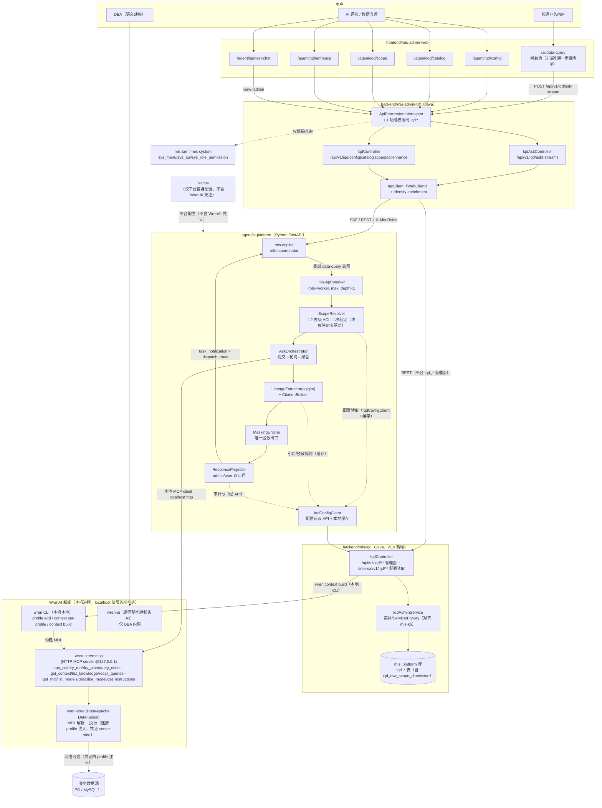
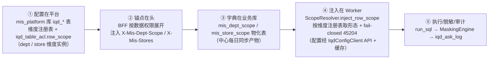
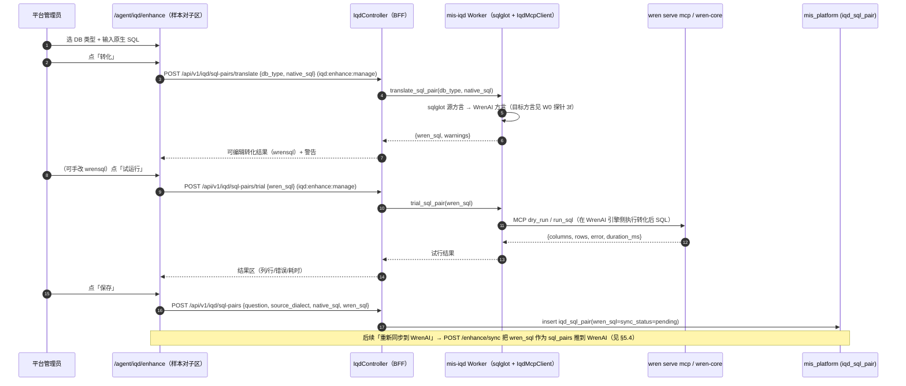
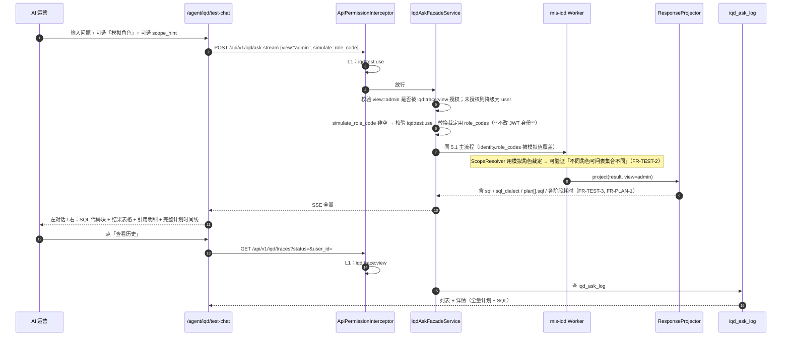
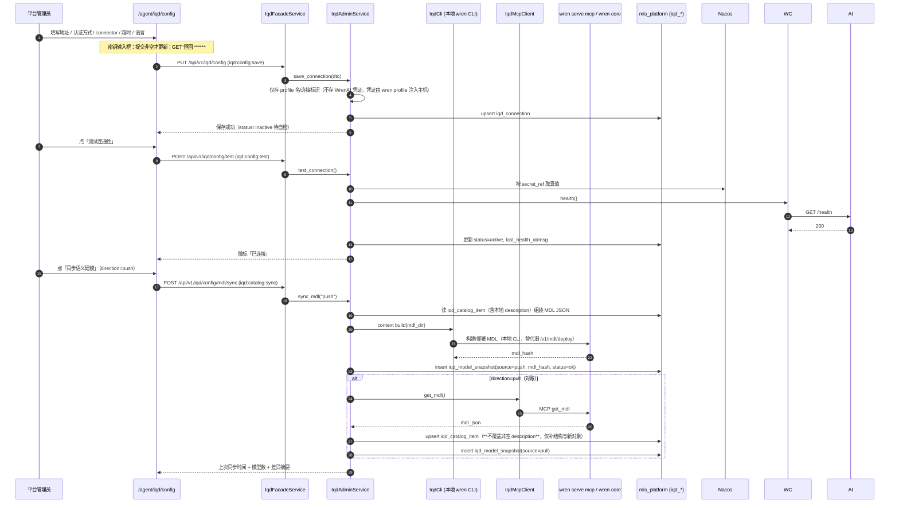
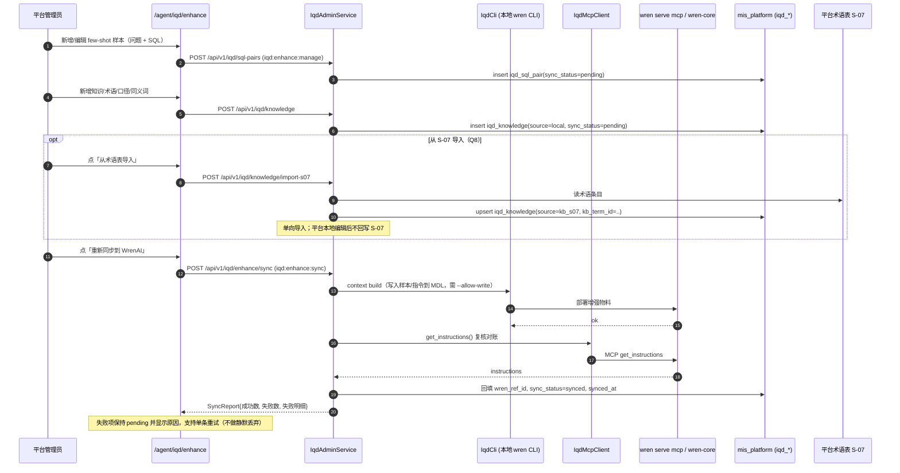
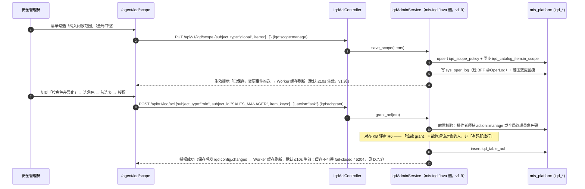
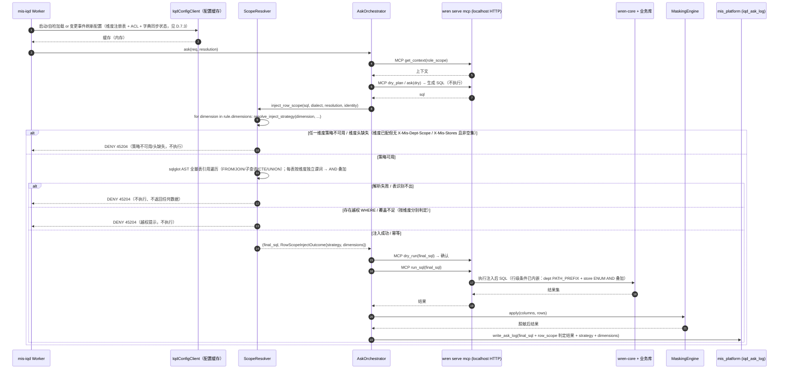
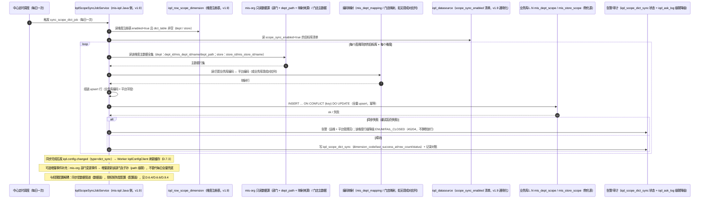
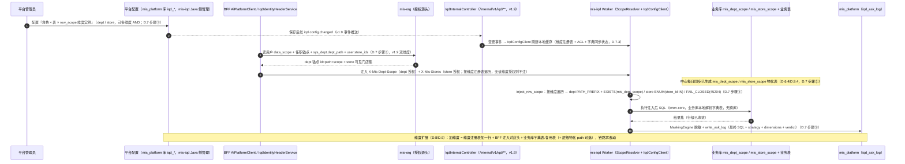

# MIS 平台对接 WrenAI 问数 APP — 系统架构设计

> 文档角色：本需求的**架构视图 + 接口契约**（上游 [prd.md](prd.md)，下游 [tasks.md](tasks.md)）。
> 版本：v1.12（基线 v1.11）｜状态：🔴 已修订（**v1.12 建模台实施回写落盘（2026-09-22，主理人记录）**：把建模台**实施期发现**合订回权威基线 —— ① **8 处「设计稿 vs 代码现实」逐条订正**（discovery 路径 `/api/v1` / `pnpm add` / `sys_menu` 4 条 / 表发现走 **MCP 工具**非 CLI 子命令 / `model_ref` + **V89** / 模拟角色预览**从未落地为 API** / `dict-sync-status` 而非 `dictionaries` / **F-1** 预存缺陷 + **V91** 修复）；② **V87–V91 五个迁移集中登记表**（版本 / 用途 / ID 段 / 关键约束）；③ **实施小结**（交付规模 / 已证 / 未证 / 开放项）；④ 沉淀 **「ID 段位分配规约 + 冲突自检」正式约定**（避免第三次 F-1 同类事故）—— 详见 **§11 增量 v1.12 — 可视化建模台实施回写**。**`V76`/`V78`/`V81`/`V87`–`V91` 迁移文件一字未改（新迁移只追加）**；**v1.10（样本增量）与 v1.11（建模台规划增量）的历史编号含义均未改动**。**v1.11 可视化建模台增量回写落盘（2026-09-22，主理人记录）**：把已拍板的「mis-iqd 前端可视化建模台」增量（PRD + 系统设计 + 任务分解 + 两张 mermaid）合订进本主架构文档，**architecture.md 自此为唯一权威基线**（不再「增量文档悬挂」）——详见 **§10 增量 v1.11 — 可视化建模台**；**v1.9 三处重大修订落盘（2026-08-22，主理人记录）**：① **A1 业务改判——落库改道**：表级 ACL 等问数配置**不落 ai_platform，改落 `mis_platform` 库**，对齐 **mis_kb 项目范式**（kb 开头的表在 mis_platform 库），项目名 **`mis-iqd`**（类似 mis_kb）、表前缀 **`iqd_`**（替代 `wren_*`）；ADR-019（原裁定落 ai_platform）**已由 ADR-020 替代**（§8 A1）；② **命名统一**：项目/表/API/权限码/模块全部收敛 `iqd`（`iqd_*` 表、`/api/v1/iqd/**`、权限码 `iqd:*`、前端 `features/agent/iqd`、`backend/mis-iqd` Java 模块），**对接外部 WrenAI 产品的适配层保留 wren**（`wren serve mcp`/`wren profile`/`wren_mcp_host`/`iqd_mcp_client.py` 类内配置键等，命名边界见 §1.5/§3.3）；③ **维度注册表提前一期 + 双维度一期**：`iqd_row_scope_dimension` 从二期 P2 提为**一期必做**、**部门不再特例**，一期同时支持「部门权限 + 门店权限」两个维度（§4.2.2 D.8/D.9）；配套：**Worker 配置消费改「BFF/Java 侧配置读取 API + Worker 本地缓存 + 变更事件/定期刷新 + 缓存不可得 fail-closed 45204」**（§4.2.2 D.7.3）、mis-iqd 模块按 mis_kb 范式落地（§3.2/§3.3）、Flyway 追加 `V71__iqd_schema.sql`、BFF 头注入按维度注册表遍历（`X-Mis-Dept-Scope` + `X-Mis-Stores`）、tasks.md 全量同步（T-W0-01 探针 3e 门店盘点 / T-W2-01 改 Java 侧 / T-W2-02a 双维度 / T-W2-02b 维度遍历注入 / 新增维度注册表子任务）、ADR-019 修订 + ADR-020 新增、两张 mermaid 同步、版本升 v1.9。**v1.8 A1/A5 拍板 + 行级权限放置/扩展设计落盘（2026-08-22，主理人记录）**：A1 当时确认——**表级 ACL 等 `wren_*` 问数配置落 `ai_platform` 库，Python 侧（ai-platform）统一管理，BFF 经 HTTP 读写，不新建 Java 领域服务**（**v1.9 已业务改判**，见上；历史裁定记录见 §8 A1 与 ADR-019）；A5 已确认——**列级隔离本期不做，预留后期方案**（预留位点见 §4.2.2 D.8.2）；新增 **D.7 行级权限数据「如何放置、如何使用」**（三层放置：平台侧 `ai_platform` 库=配置+裁定 / mis-org 侧=授权源头 / 业务库侧=数据载体；使用链路：配置在平台→锚点在头→字典在业务库→注入在 Worker→执行/脱敏/审计）与 **D.8 行级权限维度扩展设计**（`row_scope.type` 扩展点：`org_auto`=dept 维度实例化、`template` 已覆盖任意维度；维度注册表 `iqd_row_scope_dimension` 二期 P2 可选；扩展步骤模板 5 件事 + 门店示例；列级隔离预留位点）；§8 A1/A5 由「⏳ 待确认」改「✅ 业务已确认」；tasks.md T-W2-01 标注 A1 已确认、T-W2-02a 标注 type 扩展点 + 二期 P2 维度注册表、A5 相关标注 masking.py 仍为唯一出口 + 列 ACL 预留位点；**v1.7 A13 拍板 + 配置模型澄清落盘（2026-08-22，主理人记录）**：A13 三答已确认——**① 业务库部门编码与 mis_org 不统一主数据（暂时无关）→ 需要映射；② 业务库与 mis_platform 非同一实例 → 物化表（视图不可行）；③ 多数据源每库一张、集中定义从中心每日同步到各库（物化表 + 中心侧定时批同步）**；§4.2.2 D.6 深化——编码对齐决策 **X（映射内嵌字典表）** 定案（推荐理由/映射来源与维护/配置下拉数据源/T-W2-02a 工作量影响，见 D.6.3）、D.6.4 中心每日同步任务细化（归属 ai-platform 定时作业、每日全量 upsert 幂等、失败告警 + 降级 45204、目标库注册）、新增 **D.6.6 配置面 vs 数据面**（用户疑问「是否需逐库设置权限」的权威回答：权限配置平台统一一处、row_scope 模板化、mis_dept_scope 为同步数据非配置、表按数据源分组仅展示层事实）；§8 A13 由「⏳ 待确认」改「✅ 业务已确认」；tasks.md T-W0-01 探针 3e 更新（库边界已确认、剩余聚焦 DEPTID 编码体系盘点+映射可行性）、T-W2-02a 字典表子项改「物化表 + 中心每日同步」并新增同步任务/映射维护子项与配置界面验收；**v1.6 部门权限字典表方案落盘（2026-08-22，主理人记录）**：2a「直接 JOIN 平台内部 `sys_dept`」修订为「**JOIN/EXISTS 部门权限字典表 `mis_dept_scope`（表/视图）**」——同库/同实例走**视图**（实时零维护）、跨库/跨实例走**物化表+同步**（幂等）、多数据源**每库一张**、部门编码对齐与库边界列为 **A13 待业务/数据确认**（探针 3e 出前置证据）；新增 §4.2.2 D.6 mis_dept_scope 落地设计、§8 A13、tasks.md T-W0-01 探针 3d 实测对象更新为 mis_dept_scope 形态 + 新增 3e（库边界与编码对齐盘点）、T-W2-02a 新增字典表子项、T-W2-02b 黄金用例谓词更新；**v1.5 A12 拍板落盘（2026-08-22，主理人记录）**：A12 已由业务确认——**物化 `dept_path`，`PATH_PREFIX` 为唯一主路径，`CLOSURE_CTE` 不实现**（决策依据见 §8 A12 与 §4.2.2 C「策略表」）；§4.2.2 `resolve_inject_strategy` 策略精简为 **PATH_PREFIX（主）/ ENUM（降级 ≤500）/ FAIL_CLOSED（兜底）**、规模分层用例 11–15 同步更新、新增 **mis-org 物化 dept_path 落地设计小节（§4.2.2 D）**、`X-Mis-Dept-Scope` 头扩为携带锚点 `path`、tasks.md T-W0-01 探针 3b 降级为「仅记录不阻塞」+ 新增 3d（`dept_path LIKE` 实测）、T-W2-02a/b 同步；v1.4 曾修订规模策略（mis-org 部门树规模上万 → 头语义改「锚点 + 范围语义」`X-Mis-Dept-Scope`、新增规模分层策略层、新增待拍板 A12）；v1.3 曾修订 A11 行级数据范围确认本期、新增 §4.2.2 RLS 设计细节、`ScopeResolver.inject_row_scope` 展开、T-W2-02 拆分；v1.2 曾修订 MCP-first / 钉 wren-core 新线 `wren: v0.13.3` · 项目 `0.29.2` 2026-08-18、新增 §4.2.1 权限方案全景）｜日期：2026-08-22｜语言：中文
> 图表：[class-diagram.mermaid](class-diagram.mermaid)、[sequence-diagram.mermaid](sequence-diagram.mermaid)｜部署速查：[deploy-iqd.md](deploy-iqd.md)
> **v1.10 样本对方言转化 + 试运行增量修订（2026-08-22，架构师高见远记录）**：在 enhance 页「样本对」Tab 新增「选 DB 类型 + 写原生 SQL + 转化(wrensql) + 试运行 + 保存」能力；`IqdSqlPair` 增 `source_dialect`/`native_sql`/`wren_sql`（`sql_text` 改名 `wren_sql`）；新增 `POST /sql-pairs/translate`（后端 sqlglot 翻译）、`POST /sql-pairs/trial`（经 MCP `dry_run`/`run_sql` 在 WrenAI 引擎侧执行）；设计见 §4.2.3，待拍板见 A14，W0 探针新增 3f（目标方言确认）。

---

## 0. 一句话架构结论

**WrenAI 自托管为新 `wren` 线（`pip install wrenai` 得 `wren` CLI + wren-core（Rust/Apache DataFusion），以 `wren serve mcp --transport http @127.0.0.1` 在**服务端本机**暴露 MCP server，数据不出域）；平台以 `mis-iqd` Worker **本地持有 MCP client** 接入既有 mis-copilot Coordinator 完成桥接；配置/范围/ACL/样本/知识/审计以 `iqd_*` 表**统一落 `mis_platform` 库**（对齐 mis_kb 范式，Java 侧 `backend/mis-iqd` 模块管理），Worker **不直连库**、经 **BFF/Java 侧配置读取 API（`/internal/v1/iqd/**`）+ 本地缓存 + 变更事件/定期刷新** 消费（缓存不可得 fail-closed `45204`），BFF 对外经 `/api/v1/iqd/**` HTTP 读写（该 REST 仅面向平台自身 `iqd_*` 表，与 WrenAI 无关）；权限沿用双闸门（BFF `iqd:*` 功能码 + Worker 侧表级 ACL 二次裁定 + 结果字段脱敏）；行级范围由**维度注册表 `iqd_row_scope_dimension` 驱动**（一期 dept + store 双维度，§4.2.2 D.8/D.9）；引用与步骤化计划：新线 MCP `get_context`/`list_knowledge` **提供原生引用来源（走原生）**，sqlglot 血缘降级保留；**前端/用户端绝不直连 MCP**（由官方 MCP server 默认绑 127.0.0.1 + 本版本无 bearer-token 鉴权 + 默认只读约束兜底）。**

**（v1.11 增量）可视化建模台一句话结论**：定位为「**编辑体验的前端升级**」——平台自建可视化页面（**非 iframe 嵌 wren-ui**，A3「wren-ui 是否随包」仅影响 DBA 兜底），一切建模编辑仍走**既有编辑权威闭环**（`iqd_catalog_item` → 派生 MDL → `wren context build` → memory index → MCP 就绪门禁），**不新增写路径、不破坏 catalog 单一真值源**；画布 / 编辑器 / 布局分别以 `@xyflow/react` / CodeMirror 6 / 独立 `iqd_model_layout`（JSONB，不动 V71）落地。详见 **§10**。

---

## 1. 实现方案与框架选型

### 1.1 核心技术难点与对策

| # | 难点 | 对策 | 落点 |
|---|---|---|---|
| D1 | WrenAI 新线以 **MCP 工具**（`run_sql`/`dry_run`/`dry_plan`/`query_cube`/`get_context` 等）暴露问数与执行能力，而 MIS 前端期望流式体验 | 桥接层实现 `AskOrchestrator`：经本地 MCP client 调问数/执行工具 → 每产出一阶段即产出一个 `IqdPlanStep` → 经 Coordinator `AgentEvent` → BFF SSE 逐帧下发（MCP 为请求/响应工具调用，不再有 REST `/v1/asks` 异步轮询） | `mis_iqd/orchestrator.py` + `adapters/iqd_mcp_client.py` |
| D2 | WrenAI 按 project/MDL 隔离语义，**没有「按角色限表」的原生入口**（版本无关） | 平台侧在调用**前**裁定 `allowed_item_keys`，通过两手段收敛：① 新线用 MCP `get_context`/`get_instructions` 做**角色级前置收窄**（注入角色可见的模型/指令上下文）；② 生成 SQL 返回后用 sqlglot 解析血缘做**后置校验**，命中越权表则拒绝返回（fail-closed） | `mis_iqd/scope_resolver.py` + `lineage.py` |
| D3 | WrenAI 旧版结果**无独立 citation 字段**；新线 `get_context`/`list_knowledge` **暴露原生引用来源** | **优先走原生**：桥接层调 MCP `get_context`/`list_knowledge`/`recall_queries` 取原生引用（表/字段/知识命中）；sqlglot 血缘降级派生保留为兜底（原生缺失或解析失败时回退） | `mis_iqd/lineage.py` |
| D4 | 后台要看 SQL、前端**绝不能**看 SQL | 同一份 `AskResult` 由 `ResponseProjector` 按 `view=admin\|user` 两口径投影；`view=user` 分支在**服务端**剥离 `sql` / `plan[].sql`，不靠前端隐藏。**前端不直连 MCP 由 WrenAI 官方 MCP server 默认绑 127.0.0.1 + 本版本无 bearer-token 鉴权 + 默认只读约束兜底**——必须由服务端 `mis-iqd` Worker 本地持有 MCP client | `mis_iqd/projector.py` |
| D5 | 敏感字段脱敏须与 `03-security.md` 一致且**只有一个入口** | `masking.py` 为唯一脱敏出口，规则表 `iqd_mask_rule` 承载 03-security §9.3 四条（手机号/身份证/密码不记录/Token 不记录）+ 可扩展；结果集 columns 匹配后逐行改写并记 `masked_columns` | `mis_iqd/masking.py` |
| D6 | 密钥不能落前端、不能进库明文 | `iqd_connection` 只存 **profile 名/连接标识**（如 `wren_profile_name`）+ MCP 地址（`127.0.0.1:8080`），**不存任何 WrenAI 凭证**；业务库凭证由 `wren profile` 注入 WrenAI 主机（server-side，不落平台/前端）；UI 回显固定 `******` | `config.py` + `iqd_connection` |
| D7 | 新增 Worker 不得破坏现有调度 | 严格按 `coordinator-worker/spec.md §9.1` 九项最少交付接入；只改 `configs/agents/mis-iqd/**` + `mis-copilot/coordination.yaml` 的 `worker_ids`，**不改前端 Agent 选择器**（A6 验收） | 配置态 |

### 1.2 分层技术栈

| 层 | 归属 | 技术栈 | 新增内容 |
|---|---|---|---|
| 用户端问数 UI | `frontend/mis-admin-web` | React 18 + MUI + Tailwind + zustand | 扩展 `/ai/data-query`：引用块 + 步骤清单组件 |
| 后台运营 UI | 同上，`features/agent/iqd/**` | 复用 `agent-page-shell` + `PermissionGate` | 5 个页面 + 5 个组件 |
| 聚合鉴权 | `backend/mis-admin-bff` | Java 17 + Spring Boot + WebClient（ADR-007） | `/api/v1/iqd/**` 控制器 + `IqdClient`（对外门面，对齐 KB `/api/v1/kb/**`） |
| **问数配置/ACL 领域（v1.9 新增，对齐 mis-kb）** | **`backend/mis-iqd`** | Java 17 + Spring Boot + Spring Data JPA（ADR-015） | **独立模块**：`iqd_*` 实体（JPA）+ Repository + Service + Controller（`/internal/v1/iqd/**` 配置读取 API + `/api/v1/iqd/**` 管理面，对齐 mis-kb 分层） |
| 问数领域 / 桥接 | `agent/ai-platform` | Python 3.11 + FastAPI + **mcp**（官方 MCP Python SDK，本地 client）+ **sqlglot** | `mis-iqd` Worker（本地持 MCP client，**不直连库**，经 `IqdConfigClient` 调 Java 侧配置读取 API + 本地缓存消费 `iqd_*` 配置） |
| 语义层 / T2SQL | **WrenAI 新线（外部，本机进程）** | `pip install wrenai` → `wren` CLI + wren-core（Rust/Apache DataFusion）+ `wren serve mcp`（HTTP MCP server） | 自托管新 `wren` 线：`wren serve mcp --transport http @127.0.0.1`（wren-ui 是否随包待核实，见 A3） |
| 权限 | `mis-system` / `mis-iam` | sys_menu / sys_api / sys_menu_api / sys_role_permission + Redis | Flyway `V69__iqd_menu_api_seed.sql` 种子（`iqd:*`，v1.9 由 `wrenai:*` 统一改名） |

### 1.3 架构模式

- **BFF 聚合 + 领域下沉**（ADR-003 / ADR-005）：Java BFF 只做鉴权、身份 enrichment、SSE 透传、DTO 归一；问数编排与数据范围裁定全在 Python 领域侧；**问数配置/ACL 数据与 CRUD 在 Java 侧 `backend/mis-iqd`（对齐 mis-kb，v1.9）**。
- **Coordinator–Worker**（`coordinator-worker/spec.md`）：`mis-iqd` 为 `role: worker`，`max_depth=1`，不可再委派。
- **双闸门**（ADR-008 / ADR-010 + KB 评审 §B.3）：功能权限码控入口，数据范围由领域服务二次裁定。
- **管理面 / 运行面配置分离（v1.9 修订）**：管理 CRUD 走 BFF `/api/v1/iqd/**` → mis-iqd Java 服务（REST）；问数走 Coordinator 委派 —— 两者共享同一批 `iqd_*` 表（mis_platform 库，Java 侧管理，单一事实源）。Worker **不直连库**，经 **mis-iqd 配置读取 API（`/internal/v1/iqd/**`）+ 本地缓存 + 变更事件/定期刷新** 消费（原「管理面/运行面同库不同入口」修订为「同库不同入口 + Worker API 消费」，见 §4.2.2 D.7.3）。

### 1.4 对 PRD Q1–Q10 的架构默认建议

| Q | 架构默认建议 | 定性 |
|---|---|---|
| **Q1** 部署形态 | **自托管 OSS 新线**：`pip install wrenai`（钉 **`wren: v0.13.3`** / 项目 **`0.29.2`**，2026-08-18），以 `wren serve mcp --transport http --host 127.0.0.1 --port 8080` 在**服务端本机**暴露 MCP server。网络：ai-platform 主机与 WrenAI 进程**同机/同网络**，桥接走 localhost http；WrenAI 与业务库**网络可达**即可（凭证由 `wren profile` 注入，不落前端、不进 ai-platform 库明文）。**不再假设经典 3 服务 Docker 栈为主路径**；wren-ui 若保留供 DBA 建模，需标为待确认 A3（新线建模是 MDL 文件 + `wren context build`，wren-ui 是否仍随包发布待核实）。版本号以 `wren --version` 实测写入 `agent/ai-platform/deploy/wrenai/README.md` | 🔴 已修订（MCP-first / 钉新线 v0.13.3） |
| **Q2** 桥接形态 | **新增 `mis-iqd` Python Worker** 接入 mis-copilot Coordinator（对齐 crm-assistant）。注册 = `configs/agents/mis-iqd/{agent,metadata,runtime,system,identity}` + `mis-copilot/coordination.yaml` 的 `worker_ids` 追加 + `INVOKE_AGENT_WHITELIST` | 🟢 架构可定 |
| **Q3** 权限粒度 | 本期 **表级可问 + 行级数据范围（A11 已确认）+ 字段脱敏**。表级 ACL 数据模型见 §4.2（`iqd_table_acl` 双 action：`ask` / `manage`，对齐 `kb_acl` 的 read/manage 两套语义）；行级范围 = `iqd_table_acl.row_scope` 条件注入（§4.2.2）；列级隔离本期不做（✅ A5 已确认 v1.8，预留位点见 §4.2.2 D.10）；`iqd_catalog_item.sensitive_level` 仅服务脱敏，不实现列级引擎 | 🟢 架构可定 |
| **Q4** 语义模型归属 | **平台侧治理入口 + push 为主（新线）**：DBA/治理在平台清单页编辑业务描述 → 平台导出 MDL 文件并经本地 `wren context build` 推送（替代旧 `/v1/mdl/deploy`）；wren-ui 是否随包待核实（A3）。冲突策略：**平台为准（last-write-wins by mdl_hash）**，pull 仅作快照对账（`iqd_model_snapshot.source=pull` 只读留痕，不覆盖本地 `description`） | 🔴 已修订（新线 MDL 文件 + context build），建模入口待 W0 核实 |
| **Q5** 引用可得性 | **走原生**：新线 MCP `get_context`/`list_knowledge` **大概率提供原生引用来源**（表/字段/知识命中），桥接层直接消费并归一化为 `IqdCitation[]`；`lineage.py` 的 `merge_native_citations()` / sqlglot 血缘降级派生**保留为兜底**（原生缺失或解析失败时回退），**不改上层契约** | 🔴 已修订（新线原生引用） |
| **Q6** 后台 UI 归属 | 复用 `agent` host App 新增 `wrenai` 模块（`/agent/iqd/**`），**独立 `iqd:*` 权限命名空间**，不复用 `agent:*` | 🟢 架构可定 |
| **Q7** 范围映射 | **单 project + 表集合 scope 隔离**。范围不下推给 WrenAI 做隔离，而是平台侧「前置提示注入 + 后置血缘校验」双保险（见 D2）；`mdl_hash` 仅用于缓存与一致性校验 | 🟢 架构可定 |
| **Q8** 术语词典 | `iqd_knowledge.source ∈ {local, kb_s07}` + `kb_term_id` 外键式弱关联。一期：本地录入为主，提供「从 S-07 导入」单向同步作业；**不做双向同步** | 🟡 需确认 S-07 是否已有稳定读接口 |
| **Q9** 步骤化计划 | 平台侧 `plan_mapper.py` 做 `status → 中文步骤` 映射（含平台自有的 `scope_check` / `masking` 两步），前端只渲染不加工 | 🟢 架构可定 |
| **Q10** 多数据源 | 一期单 project / 单默认 connector；`iqd_datasource` 表结构已按多行设计，二期开启不改表 | 🟢 架构可定 |

### 1.5 数据落库位置决策（附加问题；v1.9 A1 业务改判：落库改道 mis_platform）

> **v1.9 改判记录（2026-08-22，主理人记录，用户原话）**：问数配置表**不落 ai_platform 库，改落 `mis_platform` 库**，对齐 **mis_kb 项目范式**（kb 开头的表在 mis_platform 库）；项目名 **`mis-iqd`**（类似 mis_kb）、表前缀 **`iqd_`**（替代 `wren_*`）。原 v1.8 裁定（落 ai_platform，Python 侧统一管理）见 [ADR-019](../../adr/ADR-019-wren-query-acl-ai-platform.md)（**已替代**）；当前有效决策见 [ADR-020](../../adr/ADR-020-iqd-query-acl-mis-platform.md)。

| 数据类别 | 落库位置 | 理由 |
|---|---|---|
| WrenAI 连接配置、数据源、MDL 快照、内容清单、范围策略、**表级 ACL（✅ A1 已改判 v1.9：落 `mis_platform`，Java 侧 `backend/mis-iqd` 模块统一管理，对齐 mis_kb 范式）**、**维度注册表 `iqd_row_scope_dimension`（一期）**、样本、知识、脱敏规则、问数审计 | **`mis_platform` 库（PostgreSQL），表前缀 `iqd_`** | ① 业务拍板：对齐 mis_kb 项目范式（`kb_*` 表在 mis_platform 库，V12__kb_schema.sql 明确），平台配置类数据（权限/连接/审计）统一收口 mis_platform；② 与 `kb_*` 同库并列、互不冲突（`iqd_` = 问数域表前缀，`kb_` = 知识库域表前缀）；③ Java 侧统一管理（JPA 实体 + Service + Flyway），审计口径与平台一致；**④ Worker 不直连库**：Worker 经 **BFF/Java 侧配置读取 API（`/internal/v1/iqd/**`，对齐 kb_client 范式）+ 本地缓存 + 变更事件/定期刷新** 消费（原「同进程零跨服务」优势改由此方案补偿，见 §4.2.2 D.7.3） |
| 用户身份（角色码 / 部门 / 门店 / 组织） | **不落库**，由 BFF 经 `X-Mis-Roles` / `X-Mis-Dept-Scope` / **`X-Mis-Stores`（v1.9 新增，门店维度）** / `X-Mis-Depts` / `X-Mis-Orgs` 头注入（`AiPlatformClient` 已实现 identity enrichment，`api/deps.py` 已解析；**v1.4 主推 `X-Mis-Dept-Scope` 锚点+范围语义**，见 §4.2.2 A.1；**v1.9 起头名/注入按维度注册表驱动**，见 §4.2.2 D.8/D.9） | ACL 主体绑定在 mis_platform，主体**身份**仍来自 IAM 权威源 —— 满足「后端二次裁定」且不复制用户数据 |
| 功能权限码（`iqd:*`）与菜单 | **`mis_platform` 库**（`sys_menu` / `sys_api` / `sys_menu_api`，Flyway `V69__iqd_menu_api_seed.sql`，v1.9 由 `wrenai:*` 统一改 `iqd:*`） | 权限码是 MIS 权威资产，必须进 BFF 注册表（`sys_api ⋈ sys_menu_api ⋈ sys_menu` INNER JOIN），否则 `deny-unmapped=true` 直接 40300 |
| 关键配置/授权变更审计 | 双写：mis_platform `iqd_ask_log`（问数行为）+ BFF `@OperLog`（配置/范围/授权变更） | 问数行为量大且含结构化计划，留在领域侧；管理动作按平台既有审计口径进 `sys_oper_log` |

> **与 mis-rag/KB 范式的对齐说明（v1.9 改判后）**：`mis-kb` 把 ACL 与主数据留在 Java 侧（独立模块 `backend/mis-kb`，`kb_*` 表落 mis_platform），BFF 对外 `/api/v1/kb/**`，Python 侧经 `kb_client.py` 调 `/internal/v1/kb/**` 且**不直连业务库**。本需求 v1.9 起**完全对齐该范式**：新建 `backend/mis-iqd` 独立模块（实体/Service/Controller 分层同 mis-kb），`iqd_*` 表落 mis_platform，BFF 对外 `/api/v1/iqd/**`，Python Worker 经 `IqdConfigClient`（对齐 `kb_client.py`）调 `/internal/v1/iqd/**` 配置读取 API。**权限裁定仍在领域服务层（`scope_resolver.py`）而非 BFF/前端**，双闸门语义不变。此改判已定案（✅ A1 业务改判 2026-08-22，v1.9）并固化于 [ADR-020](../../adr/ADR-020-iqd-query-acl-mis-platform.md)（替代 ADR-019）。

**命名边界（v1.9 强制，防实现混淆）**

```text
平台问数业务域 → 一律 iqd：项目 mis-iqd、表 iqd_*、API /api/v1/iqd/**、权限码 iqd:*、
  前端 features/agent/iqd、Java 模块 backend/mis-iqd、Python 包 agent/mis_iqd、
  类 IqdAdminService/IqdMcpClient/IqdCli/IqdConfigClient/IqdInternalController、
  文件 iqd_schema.py / iqd_mcp_client.py / iqd_cli.py / iqd_config_client.py
  （v1.9：Python 侧不再持有 models/iqd.py ORM 与 routes/iqd.py 管理面路由，见 §3.2）

对接外部 WrenAI 产品 → 保留 wren（外部系统名，不是平台问数域）：
  WrenAI 品牌、wren CLI、wren-core、wren-ui、命令 wren serve mcp / wren profile /
  wren context build / wren --version、配置键 wren_mcp_host/port/transport/allow_write/
  timeout_seconds、wren_cli_bin、wren_profile_name、wren_language、PyPI 包 wrenai、
  外部部署目录 deploy/wrenai/、表内外部引用字段 iqd_sql_pair.wren_ref_id /
  iqd_ask_log.wren_status_trail（WrenAI 侧事实的引用）
```

---

## 2. 系统上下文图



**边界红线（架构层强制）**

1. 前端**没有任何** WrenAI 地址/令牌，也不解析 SQL；`/api/v1/iqd/**` 是唯一出口；MCP server 仅绑 `127.0.0.1`，**前端/用户端不可能触达**。
2. `wren serve mcp` **默认绑 127.0.0.1、本版本无 bearer-token 鉴权、默认只读**——这是官方层面对「前端不直连 MCP」的兜底约束，因此 MCP client 必须由服务端 `mis-iqd` Worker 本地持有；wren-ui 是否随包、是否对治理人员开放待核实（A3）。
3. `view=user` 的响应在 `ResponseProjector` **服务端**剥离 SQL，BFF 与前端均无二次判断。
4. Worker **不直连业务库**（只经 MCP 工具拿 SQL/结果文本，血缘解析只解析 SQL 文本，不执行）；执行一律由 wren-core 完成，凭证由 WrenAI profile 注入不在平台落明文。

---

## 3. 文件列表（相对仓库根）

### 3.1 WrenAI 部署栈（新增，Q1 自托管 **新线 `pip install wrenai`**）

> 主路径不再是经典 3 服务 Docker 栈；改为本机 `wren serve mcp` 进程。详细部署速查见 [`deploy-iqd.md`](deploy-iqd.md)。

| 文件 | 说明 |
|---|---|
| `agent/ai-platform/deploy/wrenai/README.md` | **钉版本 + 部署速查**：`wren --version` 实测值（**`wren: v0.13.3`** / 项目 **`0.29.2`** 2026-08-18）、`wren serve mcp` 进程模型、安全约束、与 `mis-iqd` Worker 同机部署关系、版本号记录位 |
| `agent/ai-platform/deploy/wrenai/wren-profile.example.yaml` | `wren profile add` 示例（业务数据源连接、凭证由 profile 注入，**不含真值**；库里 `iqd_connection` 仅存 profile 名/连接标识，不存凭证） |
| `agent/ai-platform/deploy/wrenai/mdl/` | 平台编辑 / MDL 导出目录（`wren context build` 输入；新线建模入口，是否弃用 wren-ui 待核实 A3） |
| `agent/ai-platform/deploy/sql/iqd_tables.sql` | `iqd_*` 建表 DDL 导出稿（供 DBA 审阅/生产预建；**v1.9 起运行时由 `backend/mis-migrator` Flyway `V71__iqd_schema.sql` 管理，不再依赖 Python `create_all`**） |

### 3.2 ai-platform（Python；v1.9 修订：**不再持有 `iqd_*` ORM 与管理面路由**，配置消费改 `IqdConfigClient` + 缓存）

> **v1.9 关键变化**：原 v1.8 的 `models/iqd.py`（10 张 ORM）、`api/routes/iqd.py`（管理面 REST）、`IqdAdminService`（CRUD/同步）**全部移除**，改由 Java 侧 `backend/mis-iqd` 承担（§3.6）；Python 侧只保留**问数编排 + 裁定 + 注入 + 脱敏 + 投影**，配置经 `IqdConfigClient`（对齐 `kb_client.py` 范式）调 mis-iqd 配置读取 API + 本地缓存。

| 文件 | 类型 | 说明 |
|---|---|---|
| `agent/ai-platform/backend/src/config.py` | 改 | 追加 `IqdMcpSettings` 段：`wren_mcp_host`(127.0.0.1) / `wren_mcp_port`(8080) / `wren_mcp_transport`(http) / `wren_mcp_allow_write`(false) / `wren_mcp_timeout_seconds` / `wren_cli_bin`(wren) / `wren_profile_name` / `wren_language`(zh-CN)；追加 `IqdConfigSettings` 段：`iqd_config_base_url`（mis-iqd 配置读取 API）/ `iqd_cache_ttl_seconds` / `iqd_cache_refresh_jitter`。**不再**需要 `base_url`/`api_key`/`poll_*`（`iqd_connection` 仅存 profile 名/连接标识，凭证由 WrenAI profile 注入不落平台） |
| `agent/ai-platform/backend/src/models/iqd_schema.py` | 新增 | Pydantic DTO（请求/响应/引用/计划步骤，§4.3）——**仅 DTO，无 ORM** |
| `agent/ai-platform/backend/src/adapters/iqd_mcp_client.py` | 新增 | **本地 MCP client**（官方 `mcp` SDK，HTTP transport，连 `127.0.0.1:8080`）封装工具调用：`ask`/`run_sql`/`dry_run`/`dry_plan`/`query_cube`（运行时问数/执行）、`get_context`/`list_knowledge`/`recall_queries`（角色级收窄 + 原生引用来源）、`get_mdl`/`list_models`/`describe_model`/`get_instructions`（清单/指令读取）、`health` |
| `agent/ai-platform/backend/src/adapters/iqd_cli.py` | 新增 | **本地 `wren` CLI 封装**（subprocess）：`profile add` / `context set-profile` / `context build`，负责 MDL 构建/部署与 profile 管理（管理面走 CLI，不走 MCP 写；写入需 `--allow-write` 时由 CLI 承担） |
| `agent/ai-platform/backend/src/adapters/iqd_config_client.py` | **新增（v1.9）** | **配置读取 API 客户端（对齐 `kb_client.py` 范式）**：调 mis-iqd `/internal/v1/iqd/**` 读取连接/ACL/范围策略/维度注册表/脱敏规则/字典同步状态；**Worker 本地缓存**（启动/连接自检时全量加载 + 变更事件 + 每日定期刷新兜底）；**缓存不可得 → fail-closed `45204`**（见 §4.2.2 D.7.3） |
| `agent/ai-platform/backend/src/agent/mis_iqd/__init__.py` | 新增 | 包导出 |
| `agent/ai-platform/backend/src/agent/mis_iqd/orchestrator.py` | 新增 | `AskOrchestrator`：提交 → 退避轮询 → status 变化产出 `IqdPlanStep` → 聚合 `AskResult` |
| `agent/ai-platform/backend/src/agent/mis_iqd/scope_resolver.py` | 新增 | `ScopeResolver`：`resolve(identity, connection_id) → IqdScopeResolution`；`assert_sql_within_scope(sql, resolution)` 后置 fail-closed；`inject_row_scope(sql, dialect, resolution, identity)` **行级条件后置注入 + 覆盖性校验（v1.9 起按维度注册表遍历多维度，见 §4.2.2 D.8/D.9）**；配置来自 `IqdConfigClient` 缓存 |
| `agent/ai-platform/backend/src/agent/mis_iqd/lineage.py` | 新增 | `LineageExtractor`（sqlglot）+ `CitationBuilder`（含 `merge_native_citations()` 钩子） |
| `agent/ai-platform/backend/src/agent/mis_iqd/masking.py` | 新增 | `MaskingEngine` —— **全平台 WrenAI 结果的唯一脱敏出口** |
| `agent/ai-platform/backend/src/agent/mis_iqd/plan_mapper.py` | 新增 | `PlanMapper`：WrenAI `status` + 平台自有阶段 → 中文步骤 |
| `agent/ai-platform/backend/src/agent/mis_iqd/projector.py` | 新增 | `ResponseProjector`：`project(result, view)`，`view=user` 剥离 SQL |
| `agent/ai-platform/backend/src/agent/mis_iqd/tools.py` | 新增 | Worker 工具面：`iqd__ask`（只读）、`iqd__describe_scope`（只读） |
| `agent/ai-platform/backend/pyproject.toml` | 改 | 追加 `sqlglot`（血缘）+ `mcp`（官方 MCP Python SDK，本地 client，HTTP transport）依赖；移除对 WrenAI REST 的 httpx 直连依赖；**移除 SQLAlchemy ORM 对 `iqd_*` 表的依赖**（配置读取走 `IqdConfigClient`） |
| `agent/ai-platform/configs/agents/mis-iqd/agent.yaml` | 新增 | `role: worker` + routing keywords（问数/统计/销售额/同比…） |
| `agent/ai-platform/configs/agents/mis-iqd/metadata.yaml` | 新增 | Catalog 委派契约：`when_to_use` / `capabilities` / `input_contract` / `output_contract=json` / `safety_level=read_only` |
| `agent/ai-platform/configs/agents/mis-iqd/runtime/runtime.yaml` | 新增 | 运行时（`type: openharness`，`max_steps` 收敛） |
| `agent/ai-platform/configs/agents/mis-iqd/runtime/prompts/system.md` | 新增 | 系统提示：只用 `iqd__ask`、禁止臆造数据、超范围直答拒绝 |
| `agent/ai-platform/configs/agents/mis-iqd/system/model.yaml` | 新增 | 模型配置 |
| `agent/ai-platform/configs/agents/mis-iqd/identity/access-control.yaml` | 新增 | 数据范围与禁止事项声明 |
| `agent/ai-platform/configs/agents/mis-iqd/memory/personality.md` | 新增 | 人设（严谨、口径优先） |
| `agent/ai-platform/configs/agents/mis-iqd/eval/golden-questions.yaml` | 新增 | ≥5 条黄金问句（spec §9.1 第 8 项） |
| `agent/ai-platform/configs/agents/mis-copilot/coordination.yaml` | 改 | `worker_ids` 追加 `mis-iqd` |

### 3.3 mis-admin-bff（Java；v1.9：对下游改调 mis-iqd Java 服务，不再调 ai-platform 管理面）

| 文件 | 类型 | 说明 |
|---|---|---|
| `backend/mis-admin-bff/.../controller/IqdAskController.java` | 新增 | `POST /api/v1/iqd/ask`、`POST /api/v1/iqd/ask-stream`（SSE） |
| `backend/mis-admin-bff/.../controller/IqdController.java` | 新增 | 配置/清单/范围/样本/知识 CRUD 代理（**转发 mis-iqd**） |
| `backend/mis-admin-bff/.../controller/IqdAclController.java` | 新增 | 表级 ACL 授权/撤销 + **维度注册表配置**（`iqd:acl:grant|revoke`、`iqd:scope:manage`） |
| `backend/mis-admin-bff/.../client/IqdClient.java` | 新增 | 继承 `AbstractDownstreamClient`，复用 `loginContextHeaders()` + `X-Mis-Roles/Depts/Stores/Orgs` 注入；SSE 用 `Flux<ServerSentEvent<String>>`；**对下游 mis-iqd 调 `/internal/v1/iqd/**`** |
| `backend/mis-admin-bff/.../service/iqd/IqdFacadeService.java` | 新增 | 管理面聚合（清单树装配、范围勾选批量提交、**维度下拉数据装配**、DTO 归一） |
| `backend/mis-admin-bff/.../service/iqd/IqdAskFacadeService.java` | 新增 | 问数编排：`view` 判定（**服务端**按权限码决定，前端传的 view 仅作建议）、SSE 透传、错误降级 |
| `backend/mis-admin-bff/.../service/iqd/IqdIdentityHeaderService.java` | **新增（v1.9）** | **按维度注册表遍历注入身份头**：读 mis-iqd 维度注册表（缓存）→ 有部门维度授权注 `X-Mis-Dept-Scope`（锚点+path+scope）、有门店维度授权注 `X-Mis-Stores`（可见门店集合/锚点）→ 无该维度授权则不注（见 §4.2.2 D.8.4） |
| `backend/mis-admin-bff/.../dto/iqd/*.java` | 新增 | 约 16 个 DTO（§4.3 与 Python DTO 同构，字段 **snake_case 原样透传**） |
| `backend/mis-admin-bff/src/main/resources/application.yml` | 改 | 追加 `mis.iqd.ask-timeout-ms` / `sse-enabled` / `admin-view-permission=iqd:trace:view` / `iqd.config-base-url`（mis-iqd 地址） |

> **命名裁定（v1.9 修订）**：BFF 对外 `/api/v1/iqd/**`（与权限码命名空间 `iqd:*` 一致，对齐 `/api/v1/kb/**`）；BFF 对下游 mis-iqd 调 `/internal/v1/iqd/**`（Java 服务内部端点，对齐 `/internal/v1/kb/**`）；`IqdClient` 内一次映射。

### 3.4 frontend/mis-admin-web（v1.9：`features/agent/iqd`，文件/组件统一 iqd 前缀）

| 文件 | 类型 | 说明 |
|---|---|---|
| `src/features/agent/iqd/iqd-config-page.tsx` | 新增 | UI① 对接配置 + 连通自检 + MDL 同步 |
| `src/features/agent/iqd/iqd-catalog-page.tsx` | 新增 | UI② 左树（数据源→库→表→字段）+ 右栏语义模型 Tab |
| `src/features/agent/iqd/iqd-scope-page.tsx` | 新增 | UI③ 范围勾选 + **行级范围配置（选维度下拉 + 绑定列 + 参数来源，v1.9）** |
| `src/features/agent/iqd/iqd-enhance-page.tsx` | 新增 | UI④ 样本 / 知识 / 业务描述 三 Tab + 「重新同步」；**样本对子区（§4.2.3）：DB 类型下拉（oracle/mysql/postgres/clickhouse）→ 原生 SQL 文本框 →「转化」按钮（调 `POST /sql-pairs/translate`，后端 sqlglot 翻译）→ 可编辑转化结果（wrensql）文本框 →「试运行」按钮（调 `POST /sql-pairs/trial`，经 MCP `dry_run`/`run_sql` 在 WrenAI 引擎侧执行）→ 结果区 →「保存」按钮** |
| `src/features/agent/iqd/iqd-test-chat-page.tsx` | 新增 | UI⑤ 联调对话（左对话 / 右 SQL+结果+引用+完整计划） |
| `src/features/agent/iqd/components/iqd-catalog-tree.tsx` | 新增 | 清单树（虚拟滚动，支持字段级） |
| `src/features/agent/iqd/components/iqd-scope-table.tsx` | 新增 | 勾选表格（批量选中/反选/脏标记） |
| `src/features/agent/iqd/components/iqd-acl-dialog.tsx` | 新增 | 表级 ACL 授权弹窗（主体选择器复用 KB 范式）+ **维度选择下拉（来自 `iqd_row_scope_dimension` 种子）** |
| `src/features/agent/iqd/components/iqd-plan-timeline.tsx` | 新增 | **后台**完整计划时间线（阶段 + 耗时 + SQL 代码块） |
| `src/features/agent/iqd/components/iqd-sql-block.tsx` | 新增 | SQL 高亮 + 复制（**仅后台页引用**） |
| `src/features/agent/iqd/api/iqd-api.ts` | 新增 | 全部 `/api/v1/iqd/**` 调用 |
| `src/features/agent/iqd/types.ts` | 新增 | wire 类型（snake_case，与 Python DTO 逐字段对齐） |
| `src/features/agent/ai/components/iqd-citation-block.tsx` | 新增 | **用户端**引用来源可展开块（表/字段/知识片段） |
| `src/features/agent/ai/components/iqd-plan-steps.tsx` | 新增 | **用户端**步骤化清单（无 SQL；组件内不接受 sql prop） |
| `src/features/agent/ai/ai-chat-panel.tsx` | 改 | 消息卡挂载 citation / plan 扩展块（按消息 payload 存在性渲染） |
| `src/features/agent/ai/data-query-page.tsx` | 改 | 问数建议词与空态文案更新 |
| `src/features/agent/ai/services/skill-dispatch.ts` | 改 | `DATA_QUERY_SUGGESTIONS` 追加问数示例 |
| `src/features/agent/pages.ts` | 改 | 桶导出 5 个新页面 |
| `src/lib/nav/agent-nav.ts` | 改 | **四处同改①** 侧栏追加 `/agent/iqd/*` 5 条 |
| `src/components/layout/keep-alive-outlet.tsx` | 改 | **四处同改②** `PAGE_MAP` 追加 5 条精确路径 |
| `src/app/router.tsx` | 核查 | **四处同改③** `/agent/*` 已整体登记，通常零改动（需核实） |
| `src/lib/nav/icons.ts` | 改 | 登记新 icon（`Database` / `ListTree` / `ShieldCheck` / `BookOpenCheck` / `FlaskConical`），**漏登记会静默回退成 LayoutDashboard** |

### 3.5 数据库迁移与配置（v1.9：`V69__iqd_menu_api_seed.sql` + 新增 `V71__iqd_schema.sql`）

| 文件 | 类型 | 说明 |
|---|---|---|
| `backend/mis-migrator/src/main/resources/db/migration/V69__iqd_menu_api_seed.sql` | 新增 | **四处同改④**：`sys_menu`（5 页面 + 按钮）+ `sys_api`（全部 `/api/v1/iqd/**` 端点，权限码 `iqd:*`，v1.9 由 `wrenai:*` 统一改名）+ `sys_menu_api` 绑定。ID 段位建议 `92200–92299`（现存 V19/V50/V51/V61 用到 92031–92176，92200+ 空闲）。幂等：固定 ID + `WHERE NOT EXISTS` |
| `backend/mis-migrator/src/main/resources/db/migration/V71__iqd_schema.sql` | **新增（v1.9）** | **`iqd_*` 业务表建表（mis_platform 库）**：`iqd_connection` / `iqd_datasource` / `iqd_model_snapshot` / `iqd_catalog_item` / `iqd_scope_policy` / `iqd_table_acl` / **`iqd_row_scope_dimension`（维度注册表，一期）** / `iqd_sql_pair` / `iqd_knowledge` / `iqd_mask_rule` / `iqd_ask_log`（§4.2）+ **维度注册表种子（dept / store 两条，§4.2.2 D.8.1）**；DDL 对齐 mis-kb 表风格（BIGINT 自增 PK + `created_at/updated_at` 时间戳，见 `V12__kb_schema.sql` 同款惯例） |
| Nacos `ai-platform.yaml` | 改 | `wren.mcp-host`(127.0.0.1) / `wren.mcp-port`(8080) / `wren.mcp-transport`(http) / `wren.mcp-allow-write`(false) / `wren.cli-bin`(wren) / `wren.profile-name` / `wren.language`(zh-CN)；**v1.9 追加** `iqd.config-base-url`（mis-iqd 配置读取 API）/ `iqd.cache-ttl-seconds`。**不含 WrenAI 凭证**（凭证由 `wren profile` 注入在 WrenAI 主机，不进 Nacos/平台库） |
| Nacos `mis-admin-bff.yaml` | 改 | `mis.iqd.ask-timeout-ms=180000` / `mis.iqd.sse-enabled=true` / `mis.iqd.admin-view-permission=iqd:trace:view` / `mis.iqd.config-base-url`（mis-iqd 地址） |

### 3.6 backend/mis-iqd（Java 领域模块，v1.9 新增，对齐 mis-kb 分层）

> **模块形态（对齐 `backend/mis-kb` 调研结论）**：`kb_*` 表落 mis_platform 库（`V12__kb_schema.sql` 明确）；mis-kb 为独立模块，结构 = `api/controller` + `api/dto` + `domain/entity`（JPA `@Table`）+ `domain/repository`（Spring Data JPA）+ `domain/service`；Flyway 集中在 `backend/mis-migrator`；BFF 对外 `/api/v1/kb/**`，Python 侧经 `kb_client.py` 调 `/internal/v1/kb/**`。**mis-iqd 完全对齐该形态。**

| 文件 | 类型 | 说明 |
|---|---|---|
| `backend/mis-iqd/pom.xml` | 新增 | 依赖：`spring-boot-starter-data-jpa` / `web` / `validation`（对齐 mis-kb） |
| `backend/mis-iqd/src/main/java/com/mis/iqd/domain/entity/IqdConnection.java` 等 11 个实体 | 新增 | JPA 实体：`IqdConnection` / `IqdDatasource` / `IqdModelSnapshot` / `IqdCatalogItem` / `IqdScopePolicy` / `IqdTableAcl` / **`IqdRowScopeDimension`（v1.9）** / `IqdSqlPair` / `IqdKnowledge` / `IqdMaskRule` / `IqdAskLog`（`@Table(name="iqd_*")`） |
| `backend/mis-iqd/src/main/java/com/mis/iqd/domain/repository/*.java` | 新增 | Spring Data JPA Repository（对齐 `KbAclRepository` 等） |
| `backend/mis-iqd/src/main/java/com/mis/iqd/domain/service/IqdAdminService.java` | 新增 | 连接/清单/范围/ACL/**维度注册表**/样本/知识 CRUD + 同步作业触发 + 审计写入 |
| `backend/mis-iqd/src/main/java/com/mis/iqd/domain/service/IqdScopeSyncJobService.java` | **新增（v1.9）** | **中心每日同步**：按维度注册表遍历（dept → `mis_dept_scope` 物化表；store → `mis_store_scope` 物化表）读 mis-org 只读数据 → 逐库全量 upsert 幂等 → 失败告警 + 降级 45204（见 §4.2.2 D.6.4/D.9.4） |
| `backend/mis-iqd/src/main/java/com/mis/iqd/api/controller/IqdController.java` | 新增 | 管理面 `/api/v1/iqd/**`（配置/清单/范围/ACL/维度/样本/知识/审计） |
| `backend/mis-iqd/src/main/java/com/mis/iqd/api/controller/IqdInternalController.java` | **新增（v1.9）** | **配置读取 API `/internal/v1/iqd/**`**：`get-connections` / `get-acls` / `get-scope-policies` / `get-dimensions` / `get-mask-rules` / `get-dict-sync-status`——供 Worker `IqdConfigClient` 读取（对齐 `/internal/v1/kb/**`） |
| `backend/mis-iqd/src/main/resources/application.yml` | 新增 | 数据源指向 mis_platform 库；`spring.jpa.hibernate.ddl-auto=validate`（表由 Flyway 建，对齐 mis-kb） |

> **Worker 配置消费路径（v1.9 关键连锁，见 §4.2.2 D.7.3）**：Worker（Python）**不直连 mis_platform 库**，经 `IqdConfigClient` 调 `IqdInternalController` 配置读取 API → **本地缓存**（启动/连接自检时全量加载 + 变更事件推送 + 每日定期刷新兜底）→ 缓存不可得 fail-closed `45204`；权限裁定仍在 Worker `scope_resolver`（fail-closed 语义不变），只是配置数据源从「同进程读库」改为「API + 缓存」。

---

## 4. 数据结构与接口

### 4.1 类图

```mermaid
classDiagram
    direction TB

    %% ===== 桥接运行面 =====
    class IqdAskTool {
        +str name = "iqd__ask"
        +execute(arguments, context) ToolResult
        +is_read_only(arguments) bool
    }

    class AskOrchestrator {
        -IqdMcpClient _client
        -PlanMapper _mapper
        +__init__(client, mapper, settings)
        +ask(req: IqdAskRequest, resolution: IqdScopeResolution) AskResult
        -_ask_via_mcp(req, allowed_tables, context) dict
        -_aggregate(raw) AskResult
    }

    class IqdMcpClient {
        -mcp.ClientSession _session
        -str _host
        -int _port
        -bool _allow_write
        +connect() None
        +ask(question, context) dict
        +run_sql(sql, dry) dict
        +dry_plan(query) dict
        +query_cube(cube, dims, measures) dict
        +get_context(role_scope) dict
        +list_knowledge() list
        +recall_queries(question) list
        +get_mdl() dict
        +list_models() list
        +describe_model(name) dict
        +get_instructions() list
        +health() bool
    }

    class IqdCli {
        -str _bin
        +profile_add(name, ds_config) None
        +context_set_profile(name) None
        +context_build(mdl_dir) BuildResult
    }

    class ScopeResolver {
        -IqdConfigClient _config          # v1.9：配置来自 API + 本地缓存（不再直连库）
        +resolve(identity, connection_id) IqdScopeResolution
        +assert_sql_within_scope(sql, dialect, resolution) None
        +inject_row_scope(sql, dialect, resolution, identity) tuple[str, RowScopeInjectOutcome]   # v1.9：按维度注册表遍历多维度（dept+store AND 叠加）
        +resolve_inject_strategy(dimension, resolution, dialect) InjectStrategy   # v1.4 规模分层；v1.5 精简 PATH_PREFIX/ENUM/FAIL_CLOSED；v1.9 按维度注册表 predicate_type 取形态
        -_build_authorized_predicate(rule, identity, dimension, strategy) PredicateNode  # 按维度注册表谓词形态 + expand_predicate 展开
        -_probe_db_capabilities(dialect) DbCapabilities           # has_dept_path / enum_in_limit / has_store_path，连接自检时缓存
        -_dict_map(dimension, connection_id) dict                # v1.9：mis_dept_scope.dept_id→dept_path / mis_store_scope.store_id→store_path（覆盖性校验反查用）
        -_row_scope_rules(identity, connection_id) dict          # v1.9：来自维度注册表驱动的 iqd_table_acl.row_scope（可多维度）
        -_global_scope(connection_id) set
        -_subject_acl(identity, connection_id) set
    }

    class IqdConfigClient {
        -str _base_url                     # mis-iqd /internal/v1/iqd/**
        -dict _cache
        -int _ttl_seconds
        +load_all(connection_id) None      # 启动/连接自检全量加载
        +get_connections() list~IqdConnection~
        +get_acls() list~IqdTableAcl~
        +get_scope_policies() list~IqdScopePolicy~
        +get_dimensions() list~IqdRowScopeDimension~
        +get_mask_rules() list~IqdMaskRule~
        +invalidate(keys) None             # 变更事件推送
        +refresh() None                    # 每日定期刷新兜底；缓存不可得 → fail-closed 45204
    }

    class LineageExtractor {
        +extract(sql, dialect) SqlLineage
    }

    class CitationBuilder {
        -AsyncSession _db
        +build(lineage, knowledge_hits, connection_id) list~IqdCitation~
        +merge_native_citations(existing, native) list~IqdCitation~
    }

    class MaskingEngine {
        -list~IqdMaskRule~ _rules
        +load_rules(connection_id) None
        +apply(columns, rows) MaskingOutcome
        -_match(column_name, data_type) IqdMaskRule
    }

    class PlanMapper {
        +map_status(raw_status) IqdPlanStep
        +platform_step(code, status, duration_ms) IqdPlanStep
        +finalize(steps) list~IqdPlanStep~
    }

    class ResponseProjector {
        +project(result: AskResult, view: ViewMode) IqdAskResponse
        -_strip_sql(resp) IqdAskResponse
    }

    class IqdAdminService {
        <<Java backend/mis-iqd 领域服务>>
        +get_connection() IqdConnection
        +save_connection(dto) IqdConnection
        +test_connection() HealthResult
        +sync_mdl(direction) IqdModelSnapshot
        +list_catalog(query) Page~IqdCatalogItem~
        +update_catalog_description(item_key, description) IqdCatalogItem
        +save_scope(items) int
        +grant_acl(dto) IqdTableAcl
        +revoke_acl(id) None
        +crud_dimension(dto) IqdRowScopeDimension      # v1.9：维度注册表 CRUD（一期种子 dept/store，运营可增）
        +crud_sql_pair(...) IqdSqlPair
        +crud_knowledge(...) IqdKnowledge
        +push_enhancements() SyncReport
        +write_ask_log(result, identity) IqdAskLog
        +list_ask_logs(query) Page~IqdAskLog~
    }

    class IqdScopeSyncJobService {
        <<Java 中心每日同步，v1.9>>
        +sync_scope_dict_job() SyncReport    # 按维度注册表遍历（dept→mis_dept_scope / store→mis_store_scope，全量 upsert 幂等，见 D.6.4/D.9.4）
        +set_scope_sync(datasource_id, enabled) IqdDatasource  # v1.9：scope_sync_enabled（维度注册表驱动）
    }

    class IqdIdentityHeaderService {
        <<BFF 头注入，v1.9>>
        +buildHeaders(user, connection_id) dict  # 按维度注册表遍历：dept 授权注 X-Mis-Dept-Scope、store 授权注 X-Mis-Stores、无该维度授权不注（见 D.8.4）
    }

    class IqdInternalController {
        <<Java /internal/v1/iqd/** 配置读取 API>>
        +get_connections() list~IqdConnection~
        +get_acls() list~IqdTableAcl~
        +get_scope_policies() list~IqdScopePolicy~
        +get_dimensions() list~IqdRowScopeDimension~
        +get_mask_rules() list~IqdMaskRule~
        +get_dict_sync_status() list~DictSyncStatus~
    }

    %% ===== DTO =====
    class IqdAskRequest {
        +str question
        +str session_id
        +str thread_id
        +str connection_id
        +ViewMode view
        +str simulate_role_code
        +list~str~ scope_hint
    }

    class IqdAskResponse {
        +str query_id
        +str thread_id
        +AskStatus status
        +str answer_summary
        +str sql
        +str sql_dialect
        +IqdResultSet data
        +list~IqdCitation~ citations
        +list~IqdPlanStep~ plan
        +IqdScopeResolution scope
        +list~IqdMaskedColumn~ masked_columns
        +int latency_ms
        +str error_code
        +str error_message
    }

    class IqdResultSet {
        +list~IqdColumn~ columns
        +list~list~ rows
        +int row_count
        +bool truncated
    }

    class IqdColumn {
        +str name
        +str item_key
        +str data_type
        +str display_name
        +bool masked
    }

    class IqdCitation {
        +CitationKind kind
        +str item_key
        +str display_name
        +str description
        +str snippet
        +str source_ref
    }

    class IqdPlanStep {
        +int seq
        +PlanStepCode code
        +str label
        +str detail
        +str sql
        +StepStatus status
        +int duration_ms
    }

    class IqdScopeResolution {
        +ScopeDecision decision
        +list~str~ allowed_item_keys
        +list~str~ denied_item_keys
        +str reason
        +str subject_summary
    }

    class IqdMaskedColumn {
        +str column_key
        +str rule
        +int affected_rows
    }

    class SqlLineage {
        +list~str~ tables
        +list~str~ columns
        +bool parse_ok
        +str parse_error
    }

    class MaskingOutcome {
        +list~list~ rows
        +list~IqdMaskedColumn~ applied
    }

    %% ===== 行级范围（A11；v1.9 维度注册表驱动） =====
    class RowScopeConfig {
        +str dimension  "dept | store | …（引用 iqd_row_scope_dimension.dimension_code，v1.9 替代 org_auto/template type）"
        +str column
        +str scope  "dept | dept_subtree | org | self | store | store_subtree"
        +str source
        +str expr
        +list~RowScopeParam~ params
        +bool enabled
        +str description
    }
    class RowScopeParam {
        +str name
        +str source  "header:X-Mis-Dept-Scope | header:X-Mis-Stores | user.* | ctx.*"
        +str data_type
    }
    class IqdRowScopeDimension {
        <<Java entity iqd_row_scope_dimension>>
        +str dimension_code  "PK：dept | store | …（一期种子两条）"
        +str dimension_name
        +str predicate_type  "PATH_PREFIX | ENUM（按维度配置，见 D.8.1）"
        +str column_name     "默认绑定列：dept_id | store_id"
        +str header_name     "X-Mis-Dept-Scope | X-Mis-Stores"
        +str dict_table      "mis_dept_scope | mis_store_scope（业务库侧）"
        +bool auto_mode
        +bool enabled
        +int sort
    }
    class RowScopeInjectOutcome {
        +ScopeDecision decision
        +InjectStrategy strategy   # v1.4：本次实际采用的注入策略；v1.5：PATH_PREFIX/ENUM/FAIL_CLOSED（CLOSURE_CTE 不实现）
        +dict injected_conditions
        +str reason
        +str original_sql
        +str final_sql
    }

    class InjectStrategy {
        <<enumeration>>
        PATH_PREFIX
        ENUM
        FAIL_CLOSED
        %% CLOSURE_CTE 已剔除（A12 拍板不实现，v1.5）
    }

    %% ===== 枚举 =====
    class ViewMode {
        <<enumeration>>
        USER
        ADMIN
    }
    class AskStatus {
        <<enumeration>>
        PENDING
        RUNNING
        SUCCEEDED
        FAILED
        SCOPE_DENIED
        TIMEOUT
        UNSUPPORTED
    }
    class PlanStepCode {
        <<enumeration>>
        SCOPE_CHECK
        UNDERSTANDING
        SEARCHING
        PLANNING
        GENERATING
        CORRECTING
        LINEAGE_CHECK
        EXECUTING
        MASKING
        FINISHED
    }
    class CitationKind {
        <<enumeration>>
        TABLE
        COLUMN
        METRIC
        DIMENSION
        KNOWLEDGE
        SQL_PAIR
    }
    class ScopeDecision {
        <<enumeration>>
        ALLOW
        PARTIAL
        DENY
    }
    class StepStatus {
        <<enumeration>>
        RUNNING
        DONE
        FAILED
        SKIPPED
    }

    %% ===== ORM 实体 =====
    class IqdConnection {
        +str id
        +str name
        +str base_url
        +str auth_type
        +str secret_ref
        +str project_id
        +str default_connector
        +int timeout_seconds
        +str language
        +str status
        +datetime last_health_at
        +str last_health_msg
        +bool enabled
    }
    class IqdDatasource {
        +str id
        +str connection_id
        +str connector_type
        +str display_name
        +str catalog_name
        +str schema_name
        +str credential_ref
        +bool enabled
        +bool scope_sync_enabled   # v1.9：该库是否启用字典同步（维度注册表驱动，dept/store 通用；v1.7 原名 dept_scope_sync_enabled）
    }
    class IqdModelSnapshot {
        +str id
        +str connection_id
        +str mdl_hash
        +dict mdl_json
        +str source
        +int model_count
        +datetime synced_at
        +str synced_by
        +str status
    }
    class IqdCatalogItem {
        +str id
        +str connection_id
        +str kind
        +str parent_key
        +str item_key
        +str display_name
        +str data_type
        +bool is_primary_key
        +bool is_time_dimension
        +bool is_email
        +str description
        +str expression
        +str source
        +bool in_scope
        +str sensitive_level
        +str mask_rule
        +datetime last_seen_at
    }
    class IqdScopePolicy {
        +str id
        +str connection_id
        +str subject_type
        +str subject_id
        +str item_key
        +bool allow
        +bool effective
        +str remark
        +str created_by
    }
    class IqdTableAcl {
        +str id
        +str connection_id
        +str subject_type
        +str subject_id
        +str item_key
        +str action
        +RowScopeConfig row_scope
        +str created_by
    }
    class IqdSqlPair {
        +str id
        +str connection_id
        +str question
        +str source_dialect  "枚举 oracle/mysql/postgres/clickhouse（用户所选关系库类型，v1.10）"
        +str native_sql  "用户手写的原生 SQL（源方言，保留以便再编辑/再翻译，v1.10）"
        +str wren_sql  "转化后、可编辑、最终入库并推 WrenAI 的方言（= 原 sql_text，注入为 sql_pairs，v1.10）"
        +str remark
        +bool enabled
        +str wren_ref_id
        +str sync_status
        +datetime synced_at
    }
    class IqdKnowledge {
        +str id
        +str connection_id
        +str kind
        +str title
        +str content
        +list~str~ related_item_keys
        +str source
        +str kb_term_id
        +bool enabled
        +str wren_ref_id
        +str sync_status
    }
    class IqdMaskRule {
        +str id
        +str name
        +str match_type
        +str pattern
        +str rule
        +str replacement
        +int priority
        +bool enabled
    }
    class IqdAskLog {
        +str id
        +str trace_id
        +str session_id
        +str thread_id
        +str query_id
        +str user_id
        +str employee_id
        +list~str~ role_codes
        +str question
        +dict resolved_scope
        +str status
        +dict wren_status_trail
        +str sql_text
        +str summary
        +dict citations
        +dict plan_steps
        +int row_count
        +dict masked_columns
        +int latency_ms
        +str error_code
    }

    %% ===== 业务库侧字典表（v1.7 定案：物化表 + 映射；非 mis_platform ORM，业务库本地物化表） =====
    class MisDeptScope {
        <<materialized_table>>
        +BIGINT dept_id  "PK（业务库侧部门编码，A13① 非统一主数据）"
        +BIGINT mis_dept_id  "平台 mis-org 侧部门 id（映射目标，A13①）"
        +str dept_name
        +str dept_path  "/0/<rootId>/<…>/<selfId>/（平台 mis-org path）"
        +TIMESTAMPTZ updated_at
    }
    class MisDeptMapping {
        <<mapping_table>>
        +BIGINT mis_dept_id
        +str biz_dept_id
        +str datasource
        +TIMESTAMPTZ updated_at
    }
    class MisStoreScope {
        <<materialized_table v1.9>>
        +str store_id  "PK（业务库侧门店编码）"
        +str mis_store_id  "平台侧门店 id（如统一主数据可复用）"
        +str store_name
        +str store_path  "预留（一期 NULL；有层级未来走 PATH_PREFIX 演进，见 D.9.1）"
        +TIMESTAMPTZ updated_at
    }
    class DeptScopeForm {
        <<enumeration>>
        MATERIALIZED
        VIEW  "演进选项：仅未来同实例时启用（v1.7 本期不落地）"
    }

    %% ===== 关系 =====
    IqdAskTool --> AskOrchestrator : 调用
    IqdAskTool --> ScopeResolver : 前置裁定
    IqdAskTool --> ResponseProjector : 投影输出
    IqdAskTool --> IqdAdminService : 写审计
    AskOrchestrator --> IqdMcpClient : MCP 工具调用（localhost http）
    AskOrchestrator --> PlanMapper : status→步骤
    AskOrchestrator ..> IqdAskRequest
    AskOrchestrator --> LineageExtractor : 解析 SQL
    LineageExtractor --> SqlLineage : 产出
    ScopeResolver --> IqdScopeResolution : 产出
    ScopeResolver --> RowScopeInjectOutcome : 产出（行级注入）
    ScopeResolver ..> MisDeptScope : 引用（v1.6 注入 JOIN/EXISTS，业务库本地字典表）
    ScopeResolver ..> SqlLineage : 后置校验
    ScopeResolver ..> IqdScopePolicy : 读
    ScopeResolver ..> IqdTableAcl : 读（含 row_scope）
    CitationBuilder --> IqdCitation : 产出
    CitationBuilder ..> IqdCatalogItem : 读
    CitationBuilder ..> IqdKnowledge : 读
    AskOrchestrator --> CitationBuilder : 组装引用
    MaskingEngine --> MaskingOutcome : 产出
    MaskingEngine ..> IqdMaskRule : 读
    MaskingEngine ..> IqdCatalogItem : 读 sensitive_level
    AskOrchestrator --> MaskingEngine : 脱敏
    PlanMapper --> IqdPlanStep : 产出
    ResponseProjector --> IqdAskResponse : 产出
    ResponseProjector --> ViewMode : 分支
    IqdAskResponse *-- IqdResultSet
    IqdAskResponse *-- IqdCitation
    IqdAskResponse *-- IqdPlanStep
    IqdAskResponse *-- IqdScopeResolution
    IqdAskResponse *-- IqdMaskedColumn
    IqdAskResponse --> AskStatus
    IqdResultSet *-- IqdColumn
    IqdCitation --> CitationKind
    IqdPlanStep --> PlanStepCode
    IqdPlanStep --> StepStatus
    IqdScopeResolution --> ScopeDecision
    IqdAdminService --> IqdMcpClient : 读上下文/清单/引用
    IqdAdminService --> IqdCli : MDL build/deploy（本地 CLI）
    IqdAdminService ..> IqdConnection : CRUD
    IqdAdminService ..> IqdDatasource : CRUD
    IqdAdminService ..> IqdModelSnapshot : CRUD
    IqdAdminService ..> IqdCatalogItem : CRUD
    IqdAdminService ..> IqdScopePolicy : CRUD
    IqdAdminService ..> IqdTableAcl : CRUD
    IqdAdminService ..> IqdRowScopeDimension : CRUD（v1.9 维度注册表）
    IqdAdminService ..> IqdSqlPair : CRUD
    IqdAdminService ..> IqdKnowledge : CRUD
    IqdAdminService ..> IqdAskLog : 写/查
    IqdAdminService ..> IqdInternalController : 对外配置读取 API
    ScopeResolver --> IqdConfigClient : 配置读取（API + 缓存，v1.9）
    IqdConfigClient --> IqdInternalController : /internal/v1/iqd/**
    IqdScopeSyncJobService ..> IqdRowScopeDimension : 遍历维度注册表（v1.9）
    IqdScopeSyncJobService ..> MisDeptScope : 每日同步写入（v1.9 Java 侧）
    IqdScopeSyncJobService ..> MisStoreScope : 每日同步写入（v1.9）
    IqdIdentityHeaderService ..> IqdRowScopeDimension : 读注册表（v1.9 BFF 侧）
    IqdTableAcl "1" o-- "0..*" IqdRowScopeDimension : row_scope.dimension 引用（v1.9）
    IqdConnection "1" *-- "0..*" IqdDatasource
    IqdConnection "1" *-- "0..*" IqdModelSnapshot
    IqdConnection "1" *-- "0..*" IqdCatalogItem
    IqdCatalogItem "1" o-- "0..*" IqdScopePolicy : item_key
    IqdCatalogItem "1" o-- "0..*" IqdTableAcl : item_key
    MisDeptScope --> DeptScopeForm : 载体（v1.7 定案：物化表本期；视图仅未来同实例演进）
    MisDeptScope ..> MisDeptMapping : 映射来源（A13①：业务库编码 ↔ 平台 mis-org 部门 id）
    MisStoreScope --> DeptScopeForm : 载体（v1.9 store 维度；扁平 ENUM 一期不依赖 JOIN）
```

### 4.2 表结构（`mis_platform` 库，PostgreSQL；v1.9 A1 改判：由 ai_platform 改落 mis_platform，表前缀 `iqd_`，Java 侧 `backend/mis-iqd` 管理）

> **v1.9 建表/主键风格修订**：原 v1.8 主键 `varchar(36)` UUID（Python `UUIDPrimaryKeyMixin`）**不再适用**——改由 Java 侧管理后，**对齐 mis-kb 表风格**（`V12__kb_schema.sql` 同款）：`BIGINT 自增 PK` + `created_at/updated_at TIMESTAMPTZ NOT NULL DEFAULT NOW()`；JSONB 列保持；Flyway 迁移在 `backend/mis-migrator`（`V71__iqd_schema.sql`），不再依赖 Python `create_all`。

| # | 表 | 关键列 | 约束 / 索引 | 承载需求 |
|---|---|---|---|---|
| 1 | `iqd_connection` | `name, base_url, auth_type(api_key\|bearer\|none), secret_ref, project_id, default_connector, timeout_seconds, language, status(active\|inactive\|error), last_health_at, last_health_msg, enabled` | UK `(name)`；**多条 `enabled=true` 可并存**（**2026-09-22 修订：原「一期业务上仅一条 `enabled=true`」约定作废**，见 `mis-iqd-modeling-system-design.md §14.5`）；**主连接 = `name='default'`**（`findPrimaryConnection` 第①级；无则 id 最小 enabled） | FR-CFG-1/2/4 |
| 2 | `iqd_datasource` | `connection_id, connector_type, display_name, catalog_name, schema_name, credential_ref, enabled, scope_sync_enabled` | FK→1；UK `(connection_id, display_name)` | FR-CFG-2, Q10（**v1.7**：`dept_scope_sync_enabled` 标记该库是否启用 mis_dept_scope 字典同步——接入新库的一次性注册项，非权限配置，见 D.6.4；**v1.9 改名 `scope_sync_enabled`**：同步作业按维度注册表遍历 dept/store 字典，字段语义通用化） |
| 3 | `iqd_model_snapshot` | `connection_id, mdl_hash, mdl_json JSONB, source(pull\|push), model_count, synced_at, synced_by, status(ok\|failed), error_message` | FK→1；IDX `(connection_id, synced_at DESC)` | FR-CFG-3, Q4 |
| 4 | `iqd_catalog_item` | `connection_id, kind(table\|column\|model\|relationship\|metric\|dimension\|view), parent_key, item_key, display_name, data_type, is_primary_key, is_time_dimension, is_email, description, expression, source(db_meta\|mdl), in_scope, sensitive_level(none\|low\|high), mask_rule, last_seen_at` | FK→1；**UK `(connection_id, item_key)`**；IDX `(connection_id, kind)`、`(connection_id, parent_key)`、`(connection_id, in_scope)` | FR-INV-1/2/3, FR-ACC-3 |
| 5 | `iqd_scope_policy` | `connection_id, subject_type(global\|role\|dept\|user\|store), subject_id, item_key, allow, effective, remark, created_by` | **UK `(connection_id, subject_type, subject_id, item_key)`**；IDX `(connection_id, subject_type, subject_id)` | FR-INV-3/4（v1.9：subject_type 可含 store 门店主体） |
| 6 | `iqd_table_acl` | `connection_id, subject_type(role\|dept\|user\|store), subject_id, item_key, action(ask\|manage), row_scope JSONB, created_by` | **UK `(connection_id, subject_type, subject_id, item_key, action)`**；CHECK `action IN ('ask','manage')`；IDX `(connection_id, subject_type, subject_id, action)`；`row_scope` NULL=全行可见（向后兼容）；**v1.9：`row_scope` 语义为「维度注册表实例」（可含多维度 AND 叠加，见 §4.2.2 A）** | FR-PERM-2/4, **A11 行级范围** |
| 7 | `iqd_row_scope_dimension` | **（v1.9 一期新增）** `dimension_code PK, dimension_name, predicate_type(PATH_PREFIX\|ENUM), column_name, header_name, param_whitelist JSONB, dict_table, auto_mode, enabled, sort, created_at, updated_at` | PK `dimension_code`；UK `(header_name)`；IDX `(enabled, sort)`；**一期种子：`dept` + `store` 两条（见 §4.2.2 D.8.1）** | **A11 行级范围维度注册表（v1.9 一期必做）** |
| 8 | `iqd_sql_pair` | `connection_id, question, source_dialect(枚举 oracle/mysql/postgres/clickhouse), native_sql, wren_sql(=原 sql_text，转化后可编辑、最终入库推 WrenAI 的方言), remark, enabled, wren_ref_id, sync_status(pending\|synced\|failed), synced_at, created_by` | FK→1；IDX `(connection_id, sync_status)` | FR-ACC-1（**v1.10 增量**：新增 `source_dialect`/`native_sql`，`sql_text` 改名为 `wren_sql`，入库推 WrenAI 的是 `wren_sql` 而非 `native_sql`） |
| 9 | `iqd_knowledge` | `connection_id, kind(term\|metric_definition\|synonym\|instruction), title, content, related_item_keys JSONB, source(local\|kb_s07), kb_term_id, enabled, wren_ref_id, sync_status, synced_at` | FK→1；IDX `(connection_id, kind)`、`(kb_term_id)` | FR-ACC-2/4, Q8 |
| 10 | `iqd_mask_rule` | `name, match_type(column_name\|regex\|semantic_tag), pattern, rule(phone\|idcard\|email\|amount\|full\|custom), replacement, priority, enabled` | UK `(name)`；IDX `(enabled, priority)` | FR-PERM-3 |
| 11 | `iqd_ask_log` | `trace_id, session_id, thread_id, query_id, user_id, employee_id, role_codes JSONB, question, resolved_scope JSONB, status, wren_status_trail JSONB, sql_text, sql_dialect, summary, citations JSONB, plan_steps JSONB, row_count, masked_columns JSONB, latency_ms, error_code, error_message, view_mode` | IDX `(user_id, created_at DESC)`、`(trace_id)`、`(status, created_at DESC)` | FR-PERM-5, FR-TEST-3, FR-PLAN-1, NFR-4/7 |

**`item_key` 稳定键规范（跨表 JOIN 的唯一口径，务必统一）**

```text
表：   {datasource}.{schema}.{table}                 例：pg_main.public.orders
字段： {datasource}.{schema}.{table}.{column}        例：pg_main.public.orders.total_amount
语义： mdl:{kind}:{name}                             例：mdl:metric:gmv_monthly
```

**「三层两套」权限模型映射（对齐 KB `kb_category_admin` / `kb_acl`）**

```text
第 1 层  iqd_scope_policy (subject_type=global)   ← 治理层：平台整体「哪些表进入问数范围」
第 2 层  iqd_scope_policy (subject_type=role|dept|user) ← 差异化范围模板（FR-INV-4）
第 3 层  iqd_table_acl action='ask'               ← 可问/可见语义（类比 kb_acl read）
         iqd_table_acl action='manage'            ← 管辖/授权语义（类比 kb_acl manage）

最终可问表集合 = 全局范围 ∩ (主体范围模板 ∪ 主体 ask ACL)
授权入口资格   = iqd_table_acl action='manage' ∨ 全局管理员角色码（沿用 mis.kb.admin.global-role-codes 同款配置项）
双口径         = 后台管理页用 manage 口径；用户端问数用 ask 口径
```

### 4.2.1 权限方案全景与组合策略（问数系统常见权限方案）

> 用户问题：「对于问数系统，权限除了按角色设置表和列权限，还有其他常见方案没？」——本节把问数（Text-to-SQL / 语义层）系统的常见权限方案枚举成全景，标注平台现状与分期建议，并给出推荐组合。**结论一句话：问数权限的本质是「把物理库的授权语义翻译到自然语言问数链路」，不是单一维度，而是 表(对象) × 行(范围) × 值(脱敏) × 执行(防火墙) × 留痕(审计) 的多维叠加。**

| # | 方案 | 机制一句话 | 典型实现 | 优点 | 局限 | 平台现状 | 分期 |
|---|---|---|---|---|---|---|---|
| ① | **行级数据范围（RLS / WHERE 注入）** | 不止「能否问这张表」，而是「能问表里哪些行」：角色/部门/用户 → 行条件（tenant_id / dept_id / created_by），执行前注入 SQL 的 WHERE | DB 原生 RLS（PostgreSQL）、视图+安全上下文、中间件 WHERE 注入（生成 SQL 后平台侧改写） | 粒度细、贴近业务（销售只看本部门）；天然防跨部门越权 | 注入改写 SQL 有语法风险（JOIN/子查询/聚合复杂）；语义层生成 SQL 结构不稳定时注入易错；需逐表配条件模板，治理成本高 | **缺失**（mis-org 已有组织数据范围 dept 树/数据权限，可复用为条件来源；问数链路现无行级注入） | **本期（✅ A11 已确认 2026-08-22，详见 §4.2.2）** |
| ② | **语义层/指标级授权（MDL 裁剪）** | 权限挂在语义模型的 model/metric/dimension 上，只暴露授权模型给 LLM/用户；未授权模型不进上下文、不生成 SQL | WrenAI 按 project/MDL 隔离；平台按角色裁剪 MDL 下发；语义层内置 metric 权限 | 授权点贴近「业务概念」而非物理表，治理体验好；模型级裁剪直接缩小 LLM 上下文 | 粒度粗（模型/指标级，行级仍需另配）；多 project 运维成本；MDL 与表 ACL 需一致性维护 | **部分**：现有「清单+范围勾选」已支持 `item_key` 到 model/metric/dimension 粒度的准入表达（`iqd_scope_policy`），但未做按角色的 MDL 裁剪下发，靠前置提示+后置校验执行 | 本期（维持现状表达）；二期（按角色 MDL 裁剪下发） |
| ③ | **按角色 DB 代理账户（per-role profile）** | 不同角色映射不同数据库账号，由 DB 原生 grants/RLS 兜底行级+列级；问数链路按请求者角色切换 profile | WrenAI `wren profile` 多 profile；DB 端按角色建账号+grants+RLS policy；网关按 JWT 角色路由 | DB 层强制，天然防 SQL 注入绕行；行级列级一次配齐；审计落在 DB 层 | profile 数量=角色矩阵，管理爆炸；会话/连接池切换成本；与「一期单 profile」假设冲突（Q1/A2） | **缺失**（一期 `wren_profile_name` 单 profile） | **二期** |
| ④ | **查询防火墙/后置校验（Query Guardrail）** | 对 LLM 生成的 SQL 做统一防线：只读强制、禁 SELECT *、禁危险函数/多语句、行数/超时/代价上限；血缘/表集合后置校验，越权即拒（fail-closed） | sqlglot 解析+白名单校验+LIMIT 注入+超时熔断；平台已有 sqlglot 血缘 fail-closed（D2）属此族 | 兜底能力强，不依赖 LLM 自觉；可统一实施（防注入、防大查询打爆库）；审计友好 | 解析器可能误判方言/复杂 SQL；规则过严伤可用性；是「事后拦截」非「事前授权」，需与前置收窄配合 | **部分**：血缘 fail-closed（D2）已规划；只读由 WrenAI 默认只读兜底；`row_count` 上限已规划；超时熔断已规划 | **本期（收口为统一检查链）** |
| ⑤ | **动态脱敏（Dynamic Masking）** | 列级脱敏独立于授权维度：授权决定「能否访问该列」，脱敏决定「看到的值是否变形」（138****0000），可按角色分脱敏强度 | `masking.py` 唯一出口 + `iqd_mask_rule` + `sensitive_level`；管理员明文/业务员脱敏 | 轻量，无需拆表/拆视图；满足合规；与表级 ACL 正交叠加 | 脱敏≠权限（列仍在结果中，防「看值」不防「知道存在」）；聚合场景脱敏语义难定；正则匹配有漏网 | **已有**（`masking.py` 唯一出口 + 规则表 + sensitive_level，对齐 03-security §9.3） | 本期（保持） |
| ⑥ | **检索上下文裁剪（Retrieval-scoped）** | 把授权 schema 收窄到 LLM 的输入上下文：只把「该角色可问的表/模型/知识」喂给检索与生成，未授权对象不出现在 LLM 面前 | `ScopeResolver` 前置裁定 → MCP `get_context(role_scope)` 注入角色可见上下文；`allowed_tables` 传入 `ask` | 从源头防越权（LLM 不知道就生成不了）；顺带提升准确度；成本低 | 是「软约束」——LLM 可能推导/幻觉出未授权表，必须配后置校验；粒度受 MCP 工具参数限制 | **已有（部分）**：`get_context` + `allowed_tables` 前置收窄已规划（D2 手段①） | 本期（保持） |
| ⑦ | **审计（Audit）** | 记录「谁问了什么、见了什么、结果如何」：问题、角色、命中表/模型、SQL、脱敏后结果摘要、状态，全链路可回查 | `iqd_ask_log`（投影前写全量）+ BFF `@OperLog` 配置/授权变更审计 + `iqd:trace:view` 后台回查 | 合规必需；故障排错；发现异常行为（批量拉取、越权尝试） | 存储成本；日志本身含 SQL 属敏感数据需权限+脱敏；「事后发现」不能替代「事前拦截」 | **已有**（`iqd_ask_log` 10 表之一 + 双写审计） | 本期（保持） |
| ⑧ | **ABAC / 属性策略** | 不按角色静态枚举，而按主体/资源/环境属性动态评估（user.dept ∈ resource.dept_path、数据分级、时间窗、IP），策略引擎统一裁决 | OPA/CASL 策略引擎；mis-org 组织属性（dept 树、数据权限）+ 数据分级（sensitive_level）作为属性；`ScopeResolver` 升级为策略评估器 | 表达力强（「本部门及其下级 + 密级≤机密」）；组织变更无需重配 ACL；与行级范围天然契合 | 策略引擎引入复杂度与调试成本；规则写错影响面大；每次问数评估有性能成本；过度设计风险 | **缺失**（现为 RBAC 风格 role/dept/user 枚举 + 范围模板） | **不做**（一期「角色/部门范围模板 + mis-org 数据权限」够用；留作二期演进，避免过度设计） |

**推荐「最短可行权限组合」（五件套，本期落地）**

```text
表级 ACL（可问表集合） + 行级数据范围（RLS 注入，复用 mis-org） + 列脱敏（masking） + 查询防火墙（血缘 fail-closed + 只读/上限）+ 审计（iqd_ask_log）
语义层授权（②）与检索裁剪（⑥）作为「软前置」已内嵌于双闸门（D2 手段①②），不再单列任务
```

> 一句话：**「问得到什么表」由表级 ACL 定，「表里哪些行」由行级范围定，「行里哪些值」由列脱敏定，三者之上用查询防火墙兜底、审计留痕。** ②⑥ 是准入的「软前置」，③⑧ 是二期演进方向，本期不做。

**行级数据范围（①）——最小实现要点（✅ A11 已确认本期 2026-08-22，完整设计见 §4.2.2；以下为演进要点摘录）**

1. **数据模型**：`iqd_table_acl` 追加 `row_scope`（文本/JSONB 条件模板，如 `{"tenant_id":"{{user.tenant_id}}"}`、`dept_id IN ({{user.dept_ids}})`）。行条件是「可问表」授权的细化（与 `action=ask` 正交），故挂 ACL 而非 `iqd_scope_policy`（后者保留「范围开关」语义）。
2. **条件来源**：复用 mis-org 组织数据范围（dept 树、数据权限）。BFF 注入 **`X-Mis-Dept-Scope`（锚点 + 范围语义，v1.4 主推）** / `X-Mis-Orgs` / `X-Mis-Depts`（小规模兼容）头 → Worker 侧按 `resolve_inject_strategy` 展开身份属性（dept_id / dept_path / org_path / tenant_id）成**参数化/白名单**字面量（禁止字符串拼接进 SQL，防注入）。
3. **注入时机与方式**：`AskOrchestrator` 在 MCP `run_sql` **之前**对 SQL 做 WHERE 注入：
   - 用 sqlglot 解析 AST，为涉及「带 row_scope 的表」的查询注入 `AND` 条件（无 WHERE 则补 WHERE），注入点精确到表别名。
   - **受限实现 + fail-closed**：仅支持「单表 / 简单 JOIN 且目标表带 row_scope」场景；复杂 SQL 命中 row_scope 表但注入失败 → 直接拒绝（`45204`），**宁可拒不可漏**（对齐平台 fail-closed 哲学）。
   - 注入后仍走血缘表集合校验 → 执行 → 脱敏 → 审计（顺序不变）。
4. **WrenAI 侧无行级概念**：`run_sql` 只接受 SQL 文本，行条件必须平台侧注入，**不依赖也不修改 WrenAI**。
5. **UI**：范围/ACL 页在「按角色勾选表」基础上增加行级条件编辑（模板输入 + 语法提示 + 试算）。
6. **二期演进**：若复杂 JOIN 覆盖不足，升级为 DB 原生 RLS / per-role profile（方案③）兜底，平台侧只保留校验。

### 4.2.2 行级数据范围（RLS）设计细节（✅ A11 已确认本期，2026-08-22；v1.4 规模策略修订；v1.5 A12 拍板落盘；v1.6 部门权限字典表方案落盘；v1.7 A13 拍板 + 配置模型澄清落盘；v1.8 A1/A5 拍板 + 行级权限放置/扩展设计落盘；v1.9 维度注册表一期 + 双维度 + 落库改道落盘）

> 目标一句话：**「问得到什么表」由表级 ACL 定，「表里哪些行」由行级范围定**。行级范围 = 在「主体 × 表」的可问授权（`iqd_table_acl action=ask`）之上再叠加行条件；WrenAI 无行级概念，行条件必须由平台侧注入 SQL，注入后仍走血缘 → `dry_run` → `run_sql` → 脱敏 → 审计链路。
> 核心场景：**A 部门的用户不能看 B 部门的销售数据；A 门店的运营不能看 B 门店的数据**（v1.9 双维度：部门 + 门店，复用平台数据权限，BFF 按维度注册表遍历注入可见范围）。
>
> ✅ **v1.9 三处重大修订落盘（2026-08-22，业务已确认，主理人记录）**：① **A1 改判——落库改道**：表级 ACL 等 `iqd_*` 问数配置**落 `mis_platform` 库**（对齐 mis_kb 项目范式，Java 侧 `backend/mis-iqd` 管理，ADR-020 替代 ADR-019，见 §1.5/§8 A1）；② **维度注册表提前一期 + 双维度一期**：`iqd_row_scope_dimension` 从二期 P2 提为**一期必做**，`row_scope.type` 由「`org_auto` 特例 + `template` 通用」改为「**维度注册表驱动**」（`row_scope = {"dimension":"dept|store", ...}`，删 org_auto 特例表述），一期同时支持「部门权限 + 门店权限」两个维度（**一表可多维度 AND 叠加**，见 D.8）；③ **Worker 配置消费改道**：Worker 不直连 mis_platform 库，经 **mis-iqd 配置读取 API + 本地缓存 + 变更事件/定期刷新** 消费（fail-closed 45204 不变，见 D.7.3）；BFF 头注入按维度注册表遍历（`X-Mis-Dept-Scope` + `X-Mis-Stores`，见 D.8.4）。
>
> ⚠️ **v1.4 规模修订背景（主理人确认：mis-org 部门树规模上万）**：v1.3 的「`X-Mis-Depts` 注入**全量可见部门集合** → 展开为 `column IN (上万ID)`」**不可行**，四重约束：① SQL 语句体积（上万 ID × ~15 字符 ≈ 数百 KB）；② 优化器退化（上万 IN 退全表/哈希）；③ WrenAI wren-core（Rust/DataFusion）parser/plan 对超大 IN 很可能拒绝（未实测，见 W0 探针）；④ **HTTP 请求头大小限制（8KB~64KB），`X-Mis-Depts` 本身装不下上万 ID**。故 v1.4 修订为：**头语义改「锚点 + 范围语义」（新增 `X-Mis-Dept-Scope`，见 B），注入前增加规模分层策略层 `resolve_inject_strategy`（见 C），新增待拍板 A12（物化 `dept_path`，见 §8）**。
>
> ✅ **v1.5 A12 拍板落盘（2026-08-22，业务已确认，主理人记录）**：**物化 `dept_path`，`PATH_PREFIX` 为唯一主路径，`CLOSURE_CTE` 不实现**。决策依据与业务澄清口径见 §8 A12；策略层精简与 mis-org 物化落地设计见 C / D。
>
> ✅ **v1.6 部门权限字典表方案落盘（2026-08-22，业务提出方案，主理人记录）**：2a 的 JOIN 载体由「平台内部 `sys_dept`」改为「**部门权限字典表/视图 `mis_dept_scope`**」（业务库侧可见的最小列集投影：`dept_id / dept_name / dept_path`），解决 2a 三处软肋——① 跨库边界（业务库与 mis_platform 很可能不同实例，跨库 JOIN `sys_dept` 不可行）；② MDL 暴露（`sys_dept` 全表进 WrenAI 可见集合暴露平台组织内部结构）；③ 表名耦合（WrenAI 侧 SQL 直接依赖平台内部表名，演进传导）。**视图 vs 物化表分叉、表结构、编码对齐、多数据源形态、MDL 关系详见 D.6；待拍板项 A13 见 §8**。
>
> ✅ **v1.7 A13 拍板 + 配置模型澄清落盘（2026-08-22，业务已确认，主理人记录）**：A13 三答已确认——**① 业务库部门编码与 mis_org 不统一主数据（暂时无关）→ 需要映射；② 业务库与 mis_platform 非同一实例 → 物化表（视图不可行）；③ 多数据源每库一张、集中定义从中心每日同步到各库**。据此 D.6 深化：编码对齐决策 **X（映射内嵌字典表）** 定案（D.6.3）、中心每日同步任务细化（D.6.4）、新增 **D.6.6 配置面 vs 数据面**（用户疑问「是否需逐库设置权限」的权威回答）。落地设计与同步任务见 D.6，拍板记录见 §8 A13。
>
> ✅ **v1.8 A1/A5 拍板 + 行级权限放置/扩展设计落盘（2026-08-22，业务已确认，主理人记录）**：A1 当时确认——**表级 ACL 等 `wren_*` 问数配置落 `ai_platform` 库（Python 侧统一管理，BFF 经 HTTP 读写，不新建 Java 领域服务）**（**v1.9 已业务改判**，见上）；A5 已确认——**列级隔离本期不做，预留后期方案**。新增 **D.7 行级权限数据「如何放置、如何使用」**（三层放置 + 使用链路，业务提问①的直接回答）与 **D.8 行级权限维度扩展设计**（`row_scope.type` 扩展点 / 维度注册表二期 P2 / 扩展步骤模板 + 门店示例 / 列级隔离预留位点，业务提问②的直接回答），见下。

#### A. 数据模型：`iqd_table_acl.row_scope`（JSONB）

`iqd_table_acl` 追加一列：

| 列 | 类型 | 约束 | 说明 |
|---|---|---|---|
| `row_scope` | JSONB | `NULL` = 未配置行级（全行可见，向后兼容）；非 `NULL` = 该「主体 × 表」的行级条件 | 与 `action=ask` 正交：先有 ask 授权，再细化行级 |

**v1.9 语义：维度注册表驱动（替代 v1.8 的 `type` 双模式 `org_auto`/`template`）**

> **改判**：`row_scope` 的 `type` 字段（`org_auto` 特例 + `template` 通用）**废弃**，改为 **`dimension` 引用维度注册表**（`iqd_row_scope_dimension`，一期种子 `dept` + `store`）。`org_auto` 的便利（自动跟随平台数据权限、scope 语义、path 列等）**并入 dept 维度定义**，不再作为特例；`template` 的自由表达式能力由「维度定义 + 参数绑定」覆盖（见下「参数绑定」）。

```jsonc
// 单个维度实例（row_scope 可含一个或多个维度，多个 = AND 叠加，v1.9 支持）
{
  "dimension": "dept",                 // 引用 iqd_row_scope_dimension.dimension_code（dept | store | …）
  "column": "dept_id",                 // 该表绑定的列（来自 iqd_catalog_item 列元数据下拉；缺省取注册表 column_name）
  "scope": "dept_subtree",             // 维度内范围语义（dept: dept|dept_subtree|org|self；store: store|store_subtree）
  "params": [                          // 参数绑定（运行时值来源白名单由注册表 param_whitelist 约束）
    {"name": "dept_scope", "source": "header:X-Mis-Dept-Scope", "data_type": "json"}
  ],
  "enabled": true,
  "description": "仅可见本部门及下级"
}

// 一表多维度 = 数组（AND 叠加，v1.9：部门 + 门店可同表共存）
{
  "dimensions": [
    {"dimension": "dept",  "column": "dept_id",  "scope": "dept_subtree", "params": [{"name":"dept_scope","source":"header:X-Mis-Dept-Scope","data_type":"json"}], "enabled": true},
    {"dimension": "store", "column": "store_id", "scope": "store",        "params": [{"name":"store_ids","source":"header:X-Mis-Stores","data_type":"string[]"}], "enabled": true}
  ]
}
```

| 字段 | 取值 | 语义 |
|---|---|---|
| `dimension` | `dept` / `store` / …（必须命中 `iqd_row_scope_dimension.dimension_code`） | 维度注册表引用（一期种子两条，见 D.8.1） |
| `column` | 该表字段（来自 `iqd_catalog_item` 列元数据下拉；缺省取注册表 `column_name`） | 行条件绑定的列 |
| `scope` | 维度相关：`dept` / `dept_subtree` / `org` / `self` / `store` / `store_subtree` | 维度内范围语义（对齐 03-security §6.2 data_scope；store 见 D.9.1） |
| `params` | 参数绑定数组：`name` + `source` + `data_type` | 运行时值来源；**来源白名单由注册表 `param_whitelist` 约束**（不再每行 scope 自由写） |
| `enabled` | bool | 软开关（保留配置、临时停用） |

**参数绑定约束（安全红线，继承 v1.8 template 白名单精神，v1.9 收敛到维度注册表 `param_whitelist`）**

- **来源白名单 = 维度注册表 `param_whitelist`**：`dept` 维度 = `[header:X-Mis-Dept-Scope, header:X-Mis-Depts, header:X-Mis-Orgs, user.*, ctx.*]`；`store` 维度 = `[header:X-Mis-Stores, user.store_ids, ctx.*]`（D.9）。**禁止任何直接来自用户提问的输入进入参数**（参数是静态配置 + 受信头，不是用户输入）。
- **表达式/值白名单**：无自由表达式（维度驱动只注入注册表定义的谓词形态：PATH_PREFIX / ENUM）；如需自由组合，仍可用「多维度 AND 叠加」等价表达。**禁止**：子查询、函数调用、`UNION`、注释、分号、多语句。
- **运行时替换禁止字符串拼接**：参数值经 sqlglot 字面量构造器渲染成参数化字面量（引号/转义由 AST 层处理），不做 `f-string` / `replace` 拼接。
- 校验失败不允许保存（保存接口返回具体原因：「维度不存在」「列不存在」「参数来源不在白名单」等）。

**一张表是否允许多个维度（v1.9 改判：一期支持，AND 叠加）**：**允许**——一期「部门权限 + 门店权限」很可能同表共存（如销售表既有 dept_id 又有 store_id，区域经理按部门、店长按门店），故 `row_scope` 支持**多维度数组，注入时按维度逐一追加 AND 条件**。理由：① 业务明确要求双维度一期（用户拍板）；② 注入算法按维度遍历（每维度独立谓词 + 独立 fail-closed），组合由 AND 收敛，复杂度可控（每维度仍单条件，避免「同维度多条件」的组合爆炸）；③ 覆盖性校验按维度分别判定（某维度注入失败 → 拒绝 45204，不部分放行）。

**编排关系（与表级 ACL）**：先配表级可问（`action=ask`）→ 再配行级（维度实例）；`row_scope=NULL` = 全行可见（向后兼容）；撤销 ACL 时随行删除；保存后经 **mis-iqd 变更事件推送 + Worker 缓存刷新**生效（v1.9：由「无缓存立即生效」改为「变更事件推送，默认 ≤10s 生效；缓存不可得 fail-closed 45204」，见 D.7.3/§7.9 修订）。

#### A.1 身份头语义（v1.4：锚点 + 范围语义，替代全量枚举）

**为什么不能全量枚举**：上万部门时 `X-Mis-Depts` 装不下（HTTP 头 8KB~64KB 上限，上万 ID ≈ 数百 KB），且即使装下也会在 SQL 展开成数百 KB 的 `IN (...)`（见 §4.2.2 引言四重约束）。故 v1.4 将 BFF 注入的身份头从「全量可见集合」改为「**可见锚点集合 + 每锚点范围语义**」：

**新增 `X-Mis-Dept-Scope`（主推，替代全量枚举语义；v1.5：锚点同时携带 `path`）**

```text
X-Mis-Dept-Scope: [{"id":"A","path":"/0/1/A/","scope":"dept_subtree"},{"id":"X","path":"/0/1/X/","scope":"dept"}]
```

| 字段 | 类型 | 语义 |
|---|---|---|
| `id` | string | 锚点部门 ID（用户任职部门 + 授权上级节点，通常个位数） |
| `path` | string | **锚点部门的物化 `dept_path`（v1.5 新增，A12 已确认）**：`sys_dept.dept_path`，如 `/0/1/A/`。由 BFF 从 mis-org 取（BFF 本就有部门树访问能力），**随头注入、Worker 零查询**——Worker 直接以 `<path>` 构造 `dept_path = '<path>' OR dept_path LIKE '<path>/%'` 谓词，无需 dept_id→path 映射、无需跨服务调用（见 D.5） |
| `scope` | `dept` / `dept_subtree` / `org` / `self` | 该锚点的范围语义，对齐 03-security §6.2 data_scope |

- **锚点数量通常很小**（任职部门 + 授权上级节点），头体积 O(锚点数) 而非 O(部门数)，与部门树规模解耦。
- **语义**：可见范围 = 各锚点范围语义的并集（`dept` = 仅锚点本身；`dept_subtree` = 锚点及其整棵子树；`org` = 锚点所在组织；`self` = 仅本人，此时 `id` 可省略或为 `user_id`）。
- **与现有头的关系（结论：新增 `X-Mis-Dept-Scope` 替代全量枚举语义；保留 `X-Mis-Depts`/`X-Mis-Orgs` 兼容，由 Worker 侧按规模判定消费）**：
  - `X-Mis-Dept-Scope`：v1.4 主推，**新格式**，BFF 恒注入（锚点 + 范围 + **v1.5 起锚点 `path`**）。
  - `X-Mis-Depts`：保留**小规模兼容**（可见集合展开后 ≤ 枚举阈值，如 ≤500），Worker 侧优先消费 `X-Mis-Dept-Scope`，仅在策略选择为「枚举」时回退读 `X-Mis-Depts`（BFF 是否仍回填由 W0 后定，避免头体积浪费）。
  - `X-Mis-Orgs`：语义不变（组织锚点，通常量级小），继续作为 `org` 范围来源。
  - **决策理由**：新头把「头体积」与「部门规模」解耦，是唯一能覆盖上万部门的注入通道；保留旧头避免一次性破坏既有 `template` 参数绑定与前端预览。

**覆盖性校验的授权谓词来源随之变化**：授权谓词不再来自「枚举集合」，而来自「锚点 + 范围语义」——定义：

```text
expand_predicate(anchor, scope, dialect, catalog) -> PredicateNode
  # scope = dept        → col = <anchor_id>（条件列为 dept_id 时）或 col = '<anchor.path>'（条件列为 dept_path 时）
  # scope = dept_subtree → 按注入策略（见 C）：PATH_PREFIX（主，v1.5 唯一主路径）→ col = '<anchor.path>' OR col LIKE '<anchor.path>/%'；ENUM（降级，≤500）→ col IN (子树展开)
  # scope = org         → col = <org_id>（若条件列是 org_id）或按 dept_subtree 语义对组织内根部门展开
  # scope = self        → col = <user_id>
  # 参数来自 X-Mis-Dept-Scope 锚点（id + path，v1.5 起 BFF 随头携带）+ mis-org 部门树，一律 AST 层渲染，禁止字符串拼接
```

锚点 → path 映射来源（v1.5 结论）：**BFF 在 `X-Mis-Dept-Scope` 头里同时携带锚点 `path`（mis-org `sys_dept.dept_path` 物化列，A12 已确认）**——Worker 主路径零查询、零跨服务调用（见 D.5）。覆盖性校验需要反查任意 `dept_id → dept_path`（用户自带部门条件时）的映射来源见 C「覆盖性校验」与 D.5。

**v1.9 新增 `X-Mis-Stores`（门店维度头；头名/语义由维度注册表驱动，见 D.8.4/D.9）**

```text
X-Mis-Stores: ["S001","S002"]                    # 扁平 ENUM（一期默认，门店 ≤500，见 D.9.1）
X-Mis-Stores: [{"id":"S001","path":"/R01/S001/"}]  # 有层级且物化 store_path 时的锚点+path 形态（二期演进，见 D.9.1）
```

- **注入方**：BFF `IqdIdentityHeaderService` 按维度注册表遍历——用户有门店数据权限（平台 RBAC `perm_type=store` 扩展 / 一期 `user.store_ids` 最小实现，见 D.9.2）则注入 `X-Mis-Stores`（可见门店集合/锚点），有部门权限则注入 `X-Mis-Dept-Scope`；**无该维度授权则不注入该维度**。
- **降级语义（v1.9 定案）**：`iqd_table_acl.row_scope` 配置了某维度，但请求**无该维度对应头** → **fail-closed 45204**（该维度无法判定 → 拒绝，不降级为全行可见）；维度未配置 → 不影响（全行可见）。
- **空数组语义**：`X-Mis-Stores: []`（BFF 注入空集）= 该维度全量可见（受信 BFF 保证，对齐 `X-Mis-Dept-Scope: []` 语义），不注入该维度谓词。

#### B. 权限设置（后台管理交互；v1.9：行级范围配置改为「选维度 + 绑定列 + 参数来源」）

「问数范围」页（`/agent/iqd/scope`，含 `iqd-acl-dialog.tsx` 行级区块）对某张已授权表设置行级条件的交互：

1. **入口**：ACL 授权弹窗 / 范围表格行内点「配置行级范围」（仅 `iqd:acl:grant` / `iqd:scope:manage` 可见）。
2. **选维度（v1.9 替代原「模式选择」）**：维度下拉（数据来自 `iqd_row_scope_dimension` 种子/注册表，一期 = `dept` 部门 / `store` 门店）→ 可**添加多个维度**（同表 AND 叠加）。
3. **绑定列 + 参数来源**：列下拉（来自 `iqd_catalog_item kind=column`，缺省取注册表 `column_name`）→ 范围语义下拉（dept：本部门 / 本部门及下级 / 本组织 / 仅本人；store：本门店 / 门店及下级）→ 参数来源**只读展示**（由注册表 `param_whitelist` 约束：`X-Mis-Dept-Scope` / `X-Mis-Stores` 等）。
4. **实时校验**：维度存在性 / 列存在性 / 参数来源在白名单内 → 「试算」输入示例参数值 → 生成 WHERE 片段预览。
5. **生效前预览**：选择「模拟角色」（复用 `simulate_role_code`，A8 边界：仅模拟该角色真实集合，不放大）→ 展示该角色经**各维度**展开后的 WHERE 片段（dept 主路径：`dept_path = '/0/1/A/' OR dept_path LIKE '/0/1/A/%'`；store 扁平：`store_id IN ('S001','S002')`；多维度 AND 拼接），确认后保存。
6. **平台数据权限 → 问数映射（v1.9 按维度注册表遍历）**：
   - BFF `IqdIdentityHeaderService` 读维度注册表（缓存）→ 对每个已启用维度：**部门维度**按用户 data_scope（03-security §6.2）解析任职锚点注入 **`X-Mis-Dept-Scope`**（锚点+scope+path，体积 O(锚点数)）；**门店维度**按用户门店数据权限（RBAC `perm_type=store` 扩展，见 D.9.3）解析可见门店注入 **`X-Mis-Stores`**（扁平集合/锚点）；小规模兼容按需回填 `X-Mis-Depts`（≤ 枚举阈值）。模拟角色时按模拟角色重新解析注入（不放大权限）。
   - Worker 消费：校验角色授权（表级 ACL 已通过）→ 对 `row_scope` 中**每个维度**取对应头 → 经 `resolve_inject_strategy`（见 C）选策略 → 按 `expand_predicate` 展开为行条件（AST 层渲染）→ 多维度 AND 拼接。
   - **无头 / 未登录（头缺失）且表配置了该维度 → fail-closed 45204**（无法判定身份行范围）。
   - **BFF 注入 `[]`（空锚点数组）= 全量可见（无行级限制）**：该语义由受信 BFF 保证（仅配合合法 MIS JWT 生效，对齐 R5），此时授权谓词为「真」、不注入。

#### C. 执行控制（ScopeResolver 注入/校验算法，重点）

**链路总序（命中 row_scope 表的连接强制「三段式」，顺序不可颠倒）**

```text
get_context（前置：可见表清单 + 每表行条件描述）
  → 生成 SQL（dry_plan / ask dry，不执行）
  → inject_row_scope（后置 fail-closed：逐表注入 / 覆盖性校验）
  → dry_run 确认
  → run_sql（执行注入后 SQL）
  → 结果脱敏 → 审计（iqd_ask_log 记最终 SQL + 判定结果）
```

> ⚠️ **关键约束**：绝不允许 WrenAI 直接执行未注入的 SQL 并把结果返回。若 MCP `ask` 内部自带执行，则对「命中 row_scope 表的连接」**禁用其结果**，一律走 dry 生成 → 注入 → run_sql；若 W0 实测 `ask` 无 dry 模式，命中行级表的连接固定走 `dry_plan → inject → dry_run → run_sql`。

**前置（质量层 + 第一道防线）**：`get_context(role_scope)` 注入内容除「可见表清单」外，追加每表行条件**描述与值集合**（Worker 由 identity 展开，如「orders 表仅可见 `dept_id IN ('A','A1','A2')`」或「仅可见 `dept_path = '/0/1/A/' OR dept_path LIKE '/0/1/A/%'`」，按策略形态展示），让 LLM 生成 SQL 时自带行条件——降低后置注入改写频率、提升 SQL 可读性。

**策略选择层（v1.4 新增，注入算法前置；按可见范围形态分层；v1.5 精简为三策略；v1.9 按维度注册表 `predicate_type` 取形态）**

```text
resolve_inject_strategy(dimension, resolution, dialect) -> InjectStrategy
  # 输入：dimension（iqd_row_scope_dimension 定义，predicate_type + dict_table + header_name）
  #      + resolution.visible_scope[dimension]（锚点 + 范围语义，来自 X-Mis-Dept-Scope / X-Mis-Stores）+ 库能力探针结果
  # 输出：PATH_PREFIX | ENUM | FAIL_CLOSED（CLOSURE_CTE 已剔除，见策略表决策记录）
  # v1.9：dept 维度 predicate_type=PATH_PREFIX（主）/ ENUM（降级）；store 维度 predicate_type=ENUM（一期默认，见 D.9.1）
```

| 策略 | 适用规模 | 授权谓词形态（dept_subtree 为例） | 前置条件 |
|---|---|---|---|
| **1. `PATH_PREFIX` 路径前缀（唯一主路径，必做）** | 任意规模（与部门数/深度无关） | `col = '<锚点path>' OR col LIKE '<锚点path>/%'`（一次匹配整棵子树） | 业务库侧部门表**已物化 `dept_path` 列**（✅ A12 已确认 2026-08-22，mis-org `sys_dept.dept_path`，落地设计见 D）；**业务表条件列是 dept_id 时，谓词经部门权限字典表 `mis_dept_scope`（v1.6 起替代直接 JOIN `sys_dept`，落地设计见 D.6；v1.7 A13 已确认：物化表 + 中心每日同步，`dept_id` 存业务库编码 + `mis_dept_id`/`dept_path` 映射平台，见 D.6.2–D.6.4）**；锚点 path 由 BFF 随 `X-Mis-Dept-Scope` 头携带（Worker 零查询） |
| **2. `ENUM` 枚举（降级路径 / 扁平维度主路径）** | 小（锚点展开后可见集合 ≤ 阈值，默认 500） | `col IN ('A','A1','A2')` | **v1.9**：dept 维度——仅当**无物化 dept_path 或 path 不可用**时启用（异常/未迁移/跨库不可见）；**store 维度——一期默认主路径**（门店扁平 ≤500，见 D.9.1）；可见集合规模可控；W0 实测 IN 阈值内 wren-core 可解析执行（探针 3a 校准 ENUM_LIMIT） |
| **3. `FAIL_CLOSED` 兜底** | 任何 | 无（直接拒绝） | 策略不可用：无 path 且超枚举阈值、path 解析失败、方言不支持、**维度头缺失（v1.9）** |
| ~~CLOSURE_CTE~~ | — | **不实现（决策记录）** | **v1.5 起从策略集合中移除**：① mis-org 现无闭包表，新建 + 增删改同步维护成本高于物化 path；② 依赖 wren-core/DataFusion 对子查询 IN/CTE 的方言支持（未实测、风险高，原探针 3b 降级为「仅记录不阻塞」）；③ 物化 path 用标准 LIKE 前缀，与层级深度/规模无关、零方言依赖。保留此行仅作决策记录，**不得作为备选实现** |

**path 列约定（策略 1 的核心；✅ A12 已确认物化，落地设计见 D）**

- **列**：mis-org `sys_dept` 新增物化 `dept_path` 列，格式：**`/` 分隔 + 首尾 `/`，保留虚拟根 `0`**（如 `/0/1/A/A1/`），由现有 `ancestors`（逗号 ID 链，`buildAncestors = parent.ancestors + "," + parent.id`）派生：`dept_path = '/' + replace(ancestors, ',', '/') + '/' + id + '/'`，锚点 path 取该行 `dept_path`。**结论（v1.5 拍板）：物化成本低（ancestors 已有同构物化路径），收益大（一次 LIKE 匹配整棵子树，与规模/深度无关），零方言依赖（LIKE 全方言支持）**。
- **业务表条件列是 `dept_id` 时**，两条子方案（取舍）：
  - **2a. JOIN 部门权限字典表/视图 `mis_dept_scope` 取 path（推荐，业务表零改造；v1.6 由「JOIN `sys_dept`」修订）**：改写为 `EXISTS (SELECT 1 FROM mis_dept_scope d WHERE d.dept_id = t.dept_id AND (d.dept_path = '<p>' OR d.dept_path LIKE '<p>/%'))` 或注入 `JOIN … ON t.dept_id = d.dept_id AND (…path 条件…)`。**优点**：业务表无需冗余列，path 由部门字典表权威维护；**对比 v1.5 的「JOIN `sys_dept`」**：① `mis_dept_scope` 建在业务库本地（视图或物化表），**无跨库 JOIN**；② 只暴露最小列集 `dept_id/dept_name/dept_path`，**不暴露 `sys_dept` 平台内部结构**（组织关联、leader、排序、状态位等）；③ 注入 SQL 只依赖业务库侧字典表名，**不依赖平台内部表名**（表结构演进不传导问数链路）；**代价**：每次查询多一个 JOIN（字典表有 `dept_path` 索引时开销可控）、sqlglot 注入改写复杂度略增、字典表需要**建表 + 中心每日同步**（见 D.6）。**2a 落地载体已定案（A13 已确认，v1.7）：非同一实例 → 物化表 + 中心每日同步；编码不统一 → 字典表映射（`dept_id`=业务库编码 + `mis_dept_id`/`dept_path`=平台，见 D.6.2–D.6.4）**。
  - **2b. 业务表冗余 `dept_path` 列**：业务表直接存 `dept_path`（写入时按 dept_id 回填），谓词直写 `dept_path LIKE '<p>/%'` 无需 JOIN。**优点**：SQL 最简、无 JOIN、无跨库依赖；**代价**：每张业务表都要冗余 + 部门变更（尤其移动）时需同步回填（一致性风险），DBA 治理成本高。**取舍建议（v1.6 确认）**：**优先 2a（mis_dept_scope 零改造、权威单一）**；**2b 仅用于业务表本身已冗余 `dept_path` 列（数仓大宽表场景）且 DBA 接受回填的少数表**——此时**无需 JOIN 字典表**，直接 `t.dept_path LIKE '<锚点path>/%'`，与字典表方案并存（互斥取舍：条件列是 dept_path 走 2b 直写，是 dept_id 走 2a 字典表；同一张表按列形态二选一）。
  - **JOIN 在 wren-core 下的注意点（v1.6 修订）**：wren-core 执行 SQL 时按项目 connector/MDL 解析表引用——`mis_dept_scope` 若不在该连接可见模型内，JOIN 会报表不存在。落地条件：**把 `mis_dept_scope` 注册进 WrenAI 项目的 MDL 可见集合（作为专门字典表，不纳入问数 ACL 范围、仅供注入 JOIN 使用）**；因字典表**建在业务库本地**（同实例视图 / 本地物化表），JOIN 恒在同一 connector 内解析，**不再依赖跨库/跨实例可见性**（这是 v1.6 相对 v1.5 的关键改进）。若字典表不可用（未建/同步失败/编码映射缺失）→ 该表降级走 ENUM（≤500）或 FAIL_CLOSED（>500），或评估 2b。

**策略优先级（判定流程，v1.5 精简；v1.9 按维度）**

```text
def resolve_inject_strategy(dimension, resolution, dialect):
    caps = probe_db_capabilities(dialect)   # 库能力探针（W0 实测 + 连接配置缓存）：has_dept_path / has_store_path / enum_in_limit
    if dimension.predicate_type == "ENUM":               # v1.9：store 维度一期默认 ENUM（扁平 ≤500，见 D.9.1）
        if expand_count(anchors) <= ENUM_LIMIT and caps.enum_in_limit:
            return ENUM
        return FAIL_CLOSED
    # dept 维度（predicate_type=PATH_PREFIX）
    if caps.has_dept_path:                   # 有物化 dept_path → PATH_PREFIX（唯一主路径，与规模无关）
        return PATH_PREFIX
    if expand_count(anchors) <= ENUM_LIMIT and caps.enum_in_limit:   # 无 dept_path 时的降级路径，默认 500
        return ENUM
    return FAIL_CLOSED                       # 兜底：宁可拒不可漏
```

- **优先级结论（v1.5）：`PATH_PREFIX（主） > ENUM（降级） > FAIL_CLOSED（兜底）`**——有物化 `dept_path`（正常路径）必走 PATH_PREFIX，与规模无关；异常（未物化 / path 不可用 / 解析失败）且可见集合 ≤500 走 ENUM；其余 FAIL_CLOSED 45204。**CLOSURE_CTE 已剔除，不实现**（决策记录见策略表）。**v1.9 补充：store 维度一期默认 ENUM（扁平），dept 维度沿用 PATH_PREFIX 主路径**——谓词形态由维度注册表 `predicate_type` 声明，`resolve_inject_strategy` 按维度取形态。
- **探测时机**：连接首次配置/自检时探一次（`probe_db_capabilities`），结果缓存于 `iqd_connection`（不每次问数探测）；W0 先对 wren-core 做 `dept_path LIKE` / 门店 `IN` 谓词实测（见 tasks.md T-W0-01 探针 3d）。
- 策略形态随 `RowScopeInjectOutcome` 返回（`strategy` 字段），便于审计与预览。

**后置注入算法（伪代码级）**

```text
def inject_row_scope(sql, dialect, resolution, identity) -> (final_sql, RowScopeInjectOutcome):
    # v1.9：resolution.row_scopes: {table_key -> RowScopeRule{dimensions: [dept, store, ...]}}（一表可多维度 AND 叠加）
    try:
        ast = sqlglot.parse_one(sql, dialect=dialect)          # 解析失败 → 拒绝
    except ParseError:
        return None, DENY("45204 row_scope_sql_parse_failed")

    injected = []
    for sel in collect_all_selects(ast):                       # 含 UNION 各分支 / 子查询 / CTE 定义
        for ref in collect_table_refs(sel):                    # FROM / JOIN（INNER/LEFT/RIGHT/FULL）
            table_key = normalize_table(ref)                   # 按别名解析真实表 → datasource.schema.table
            if table_key not in resolution.row_scopes: continue
            rule = resolution.row_scopes[table_key]
            # v1.9：按维度注册表遍历，每维度独立取形态 + 独立谓词，最终 AND 拼接（同表级注入点，一次注入）
            preds = []
            for dimension in rule.dimensions:
                strategy = resolve_inject_strategy(dimension, resolution, dialect)   # 按维度 predicate_type 取形态
                if strategy is FAIL_CLOSED:                    # 任一维度策略不可用 → 整表拒绝（fail-closed）
                    return None, DENY("45204 row_scope_strategy_unavailable")
                pred = build_authorized_predicate(dimension, identity, strategy)     # 维度头缺失且非空集 → DENY
                if pred is not VACUOUS:                        # BFF 注入 [] = 该维度全量可见 → 该维度跳过
                    preds.append(pred)
            if not preds:                                      # 所有维度均 VACUOUS → 不注入、覆盖恒通过
                continue
            combined = AND(*preds)                             # 多维度 AND 叠加（dept 谓词 AND store 谓词）
            existing = find_scope_constraints(ref, sel, rule)  # 该表层级已有条件中与规则列相关的约束
            if existing is None:                               # 未带该表行级条件 → 自动 AND 注入
                inject_at_table_level(ref, sel, combined, [d.predicate_type for d in rule.dimensions])
            elif is_covered_by(existing, combined, rule.dimensions):   # 已带条件 ⊆ 授权（按维度分别判定）→ 幂等
                continue
            else:                                              # 越权 / 无法证明 → 拒绝
                return None, DENY("45204 row_scope_coverage")
            injected.append((table_key, combined))
    return ast.sql(dialect), ALLOW(injected, [d.predicate_type for d in rule.dimensions] if rule else [])
```

**注入点定位（逐表各自注入，不塞主 WHERE）**

| 表引用位置 | 注入点 | 说明 |
|---|---|---|
| 单表 FROM（无 JOIN） | 该 SELECT 的 WHERE（无 WHERE 补 WHERE，有则 `AND`） | 最简单、最优 |
| JOIN 表（INNER/LEFT/RIGHT/FULL） | 改写为内联派生表 `(SELECT * FROM t WHERE <pred>) AS <原别名>` | 过滤下沉到表层：LEFT/RIGHT JOIN 语义保持（主 WHERE 过滤会把它变成 INNER）；先裁剪后关联行数正确 |
| 子查询 `FROM (SELECT …) t` | 子查询内部 SELECT 的 WHERE（递归） | 不额外包层 |
| CTE `WITH t AS (SELECT …)` | CTE 定义内 SELECT 的 WHERE（递归） | 同一 CTE 多处引用只注入一次定义 |
| UNION 各分支 | 每个分支 SELECT 各自按上表处理 | 分支独立 |

**为什么不能全塞主 WHERE**：① LEFT/RIGHT JOIN 在主 WHERE 过滤 → 语义变 INNER（行数错误/爆炸）；② 先 JOIN 后过滤 vs 先过滤后 JOIN 的聚合结果不同（`SUM` 被错误放大）；③ 逐表注入让每张表先裁剪再关联，正确且通常更快（join 输入变小）。

**覆盖性校验（is_covered_by(existing, combined_pred, dimensions)，幂等与越权判定；v1.9 按维度分别判定）**

- **v1.9 总原则**：一表多维度时，`combined_pred` 为各维度谓词的 AND。**校验按维度分别进行**——对每个维度，抽取该维度规则列（dept 维→dept_id/dept_path，store 维→store_id）相关的用户已有约束，与**该维度的授权谓词**做蕴含判定；**每个维度都必须蕴含**才幂等（放行不注入），任一维度无法证明 → 越权拒绝 45204。维度间独立，互不干扰（dept 的幂等判定不因 store 的约束形态而失败）。
- **ENUM 形态**：授权谓词为**同一列**的 `IN` 值集（或等价 `col = v` 单值）；用户已有条件中对该列的所有约束为 `=` / `IN`，允许 AND/OR 组合与「其它无关列过滤并存」；其值集 ⊆ 授权值集 → 蕴含成立 → **幂等**（不重复注入）。示例：授权 `dept_id IN ('A','A1','A2')`，已有 `dept_id IN ('A','A1')` 或 `dept_id = 'A'` → 放行不注入；**store 维度同样**：授权 `store_id IN ('S1','S2')`，已有 `store_id='S1'` → 该维度幂等。
- **PATH_PREFIX 形态（v1.5 主路径）**：授权谓词为 `col = '<锚点path>' OR col LIKE '<锚点path>/%'`（锚点 path 由 BFF 随头携带）。用户已有条件判定依据：
  - 已有 `col = '<v>'`：查 **v 的 dept_path**（需要 dept_id→path 映射，见下），若 `v.path == '<锚点path>'` 或以 `<锚点path>/` 开头 → 幂等；否则 → **越权拒绝 45204**。示例：授权前缀 `/0/1/A/`（A 部门子树），用户写 `col='B'` 且 B 的 path 为 `/0/2/B/` 不以 `/0/1/A/` 开头 → 拒绝。
  - 已有 `col LIKE '<v>/%'`：`<v>` 的 path 以 `<锚点path>/` 开头（或相等）→ 幂等；否则拒绝。
  - **dept_id→dept_path 映射放哪侧（v1.5 结论；v1.6 数据源更新；v1.7 A13 映射定案）**：主路径（用户 SQL 未自带 dept 条件）**不需要映射**——锚点 path 已随 `X-Mis-Dept-Scope` 头携带，Worker 零查询。仅「用户自带部门条件」的幂等判定需要反查任意 dept_id→path：**放 Worker 侧**（判定与注入同进程、无跨服务延迟），映射来源 = **连接配置/自检时经 mis-org 只读接口一次性拉取并缓存**（`mis_dept_scope.dept_id → dept_path`，v1.6 由 `sys_dept.id` 改为字典表数据源；**v1.7 A13① 已确认编码不统一：`dept_id` 为业务库编码，`dept_path` 为平台 path，该反查天然完成「业务库编码 → 平台 path」映射**，规模上万约数百 KB，一次性进内存可接受；不在热路径）。**若缓存不可得（无 path 映射）→ 无法证明 → 保守拒绝 45204**（宁可拒不可漏）。**v1.9：store 维度一期为扁平 ENUM，无需反查映射**；若未来物化 store_path 走 PATH_PREFIX，再按同规则增加 store_id→store_path 映射缓存（见 D.9.1 演进）。
- **CLOSURE_CTE 形态（v1.5 起不实现）**：~~授权谓词为 `col IN (SELECT child_id FROM dept_closure WHERE ancestor_id = '<锚点>')`；用户已有条件含同列 `IN (…)` 值集时，需先解析该值集是否 ⊆ 锚点闭包子集（查 closure 表）→ 幂等；否则拒绝。~~ **CLOSURE_CTE 已剔除（A12 拍板，决策记录见策略表），本形态不再实现与测试**；相关「子查询/CTE 内注入」能力仍保留（见注入点定位，用于通用 SQL 结构），但不再有基于闭包表的授权谓词分支。
- **用户已有条件含 `NOT IN` / `<>` / 范围比较 / 函数包列 / 多列混合 / OR 跨列等**无法证明**形态 → **保守拒绝 45204**（宁可拒不可漏）。示例：授权 `dept_id IN ('A','A1','A2')`，已有 `dept_id = 'B'` → 拒绝（越权提示，不执行、不返回任何数据）。**v1.9 维度间独立**：dept 维度无法证明 → 整表拒绝；不会因 store 维度已证明而放行。
- 授权谓词为纯常量（template 模式如 `status = 'closed'`）：AST 规范化后若已有条件已包含该谓词 → 幂等；否则 AND 注入（常量对全员相同，无越权语义）。

**注入后**：`dry_plan` / `dry_run` 确认注入后 SQL 可解析可执行（行数/超时上限仍生效）→ `run_sql` → 结果脱敏（`MaskingEngine`，唯一出口）→ 审计（`iqd_ask_log.sql_text` 记**注入后最终 SQL**；`resolved_scope` JSONB 记 `{"row_scope": {"injected": {table: pred}, "verdict": "allow|deny", "original_sql": "..."}}`，不新增列）。

**边界用例表**（黄金用例：A 角色问 B 部门数据被拒；授权条件以 `dept_id IN ('A','A1','A2')` 的 **ENUM 形态**为例，PATH_PREFIX 形态见规模分层用例 12/13/15）

| # | 场景 | 用户 SQL | 注入后 SQL | 判定 |
|---|---|---|---|---|
| 1 | 单表简单查询（无 WHERE） | `SELECT * FROM orders` | `SELECT * FROM orders WHERE dept_id IN ('A','A1','A2')` | ALLOW 注入成功 |
| 2 | 已有同条件 WHERE（幂等） | `SELECT * FROM orders WHERE dept_id IN ('A','A1')` | 不变（子集，不重复注入） | ALLOW 幂等 |
| 3 | 越权 WHERE（拒绝） | `SELECT * FROM orders WHERE dept_id='B'` | 不执行 | **DENY 45204**（返回越权提示，不返回任何数据） |
| 4 | JOIN 两表各有范围（LEFT 语义保持） | `SELECT * FROM orders o LEFT JOIN customers c ON o.cust_id=c.id` | `SELECT * FROM (SELECT * FROM orders WHERE dept_id IN ('A','A1','A2')) o LEFT JOIN (SELECT * FROM customers WHERE org_id IN ('org1')) c ON o.cust_id=c.id` | ALLOW 逐表注入 |
| 5 | 子查询内引用 | `SELECT * FROM (SELECT * FROM orders WHERE amount>100) t` | `SELECT * FROM (SELECT * FROM orders WHERE amount>100 AND dept_id IN ('A','A1','A2')) t` | ALLOW 子查询内注入 |
| 6 | CTE 引用 | `WITH o AS (SELECT * FROM orders) SELECT * FROM o` | `WITH o AS (SELECT * FROM orders WHERE dept_id IN ('A','A1','A2')) SELECT * FROM o` | ALLOW CTE 内注入 |
| 7 | 聚合 + GROUP BY（先过滤后聚合） | `SELECT dept_id, SUM(amount) FROM orders GROUP BY dept_id` | `SELECT dept_id, SUM(amount) FROM orders WHERE dept_id IN ('A','A1','A2') GROUP BY dept_id` | ALLOW 注入 |
| 8 | `SELECT *`（防火墙） | `SELECT * FROM orders` | 注入照常；`SELECT *` 允许但受只读强制 + `row_count` 上限（1000 行/50 列）兜底 | ALLOW（防火墙=只读+上限，不单独禁 `SELECT *`） |
| 9 | UNION 多分支 | `SELECT * FROM orders WHERE region='east' UNION ALL SELECT * FROM orders WHERE region='west'` | 两个分支各自注入 `AND dept_id IN (...)` | ALLOW 逐分支注入 |
| 10 | 无法解析 / 表识别不出 | 语法非法或表名无法归一化到 ACL 集合（如 `SELECT * FROM t_unknown`） | 不执行 | **DENY 45204**（宁可拒不可漏） |

**规模分层用例（v1.4 新增，验证策略选择层；v1.5 同步 A12 拍板：CLOSURE_CTE 用例移除）**

| # | 场景 | 库能力 / 规模 | 注入后 SQL（示意） | 判定 |
|---|---|---|---|---|
| 11 | ENUM 降级（无 dept_path 且小规模） | 无物化 path（未迁移/跨库不可见），可见集合 ≤500 | `… WHERE dept_id IN ('A','A1','A2')` | ALLOW（策略=ENUM，降级路径） |
| 12 | **PATH_PREFIX 主场景（多层部门·任意深度子孙可见）** | 有 `sys_dept.dept_path`（✅ A12 已确认物化）与 `mis_dept_scope` 字典表（v1.6），A 用户查 A 及 A1/A2…任意深度子孙 | `… WHERE (d.dept_path = '/0/1/A/' OR d.dept_path LIKE '/0/1/A/%')`（JOIN 子方案 2a **经 `mis_dept_scope`**：`EXISTS (SELECT 1 FROM mis_dept_scope d WHERE d.dept_id = t.dept_id AND …)`，v1.6 替代 JOIN `sys_dept`；业务表条件列为 dept_id 时）或业务表条件列为 dept_path 时直写 `dept_path LIKE '/0/1/A/%'` | ALLOW（策略=PATH_PREFIX，与规模/深度无关） |
| 13 | PATH_PREFIX 深度链（>10 层仍一次 LIKE） | 有 dept_path；锚点 A 下子孙深度超过 10 层 | `… WHERE (d.dept_path = '/0/1/A/' OR d.dept_path LIKE '/0/1/A/%')`（一次前缀匹配整棵子树，**与深度无关**） | ALLOW（策略=PATH_PREFIX；原 CLOSURE_CTE 用例 13 已移除，不实现） |
| 14 | 策略不可用 → FAIL_CLOSED | 无 dept_path 且可见集合 >500 / path 解析失败 / 方言不支持 | 不执行 | **DENY 45204**（策略不可用，宁可拒不可漏） |
| 15 | 前缀形态越权 | 授权 PATH_PREFIX `/0/1/A/`，用户写 `dept_id='B'`（B.path=`/0/2/B/…`） | 不执行 | **DENY 45204**（B 不以 /0/1/A/ 开头，越权提示） |
| 16 | **v1.9 门店 ENUM 主路径（单维度）** | store 维度已配（扁平 ≤500，一期默认），用户查门店表且未带门店条件 | `… WHERE store_id IN ('S1','S2','S3')` | ALLOW（策略=ENUM，store 维度注入） |
| 17 | **v1.9 门店维度越权（拒绝）** | store 维度授权 `store_id IN ('S1','S2','S3')`，用户写 `store_id='S9'` | 不执行 | **DENY 45204**（S9 不在授权集合，越权提示） |
| 18 | **v1.9 部门+门店双维度 AND（同表共存）** | 表同时配 dept + store 维度（维度注册表两条记录），用户查 `orders` 未带任何条件 | `… WHERE (d.dept_path='/0/1/A/' OR d.dept_path LIKE '/0/1/A/%') AND store_id IN ('S1','S2')`（dept 走 PATH_PREFIX、store 走 ENUM，AND 叠加） | ALLOW（双维度注入，一次注入点） |
| 19 | **v1.9 双维度：dept 幂等 + store 越权** | 表同时配 dept + store；用户已带 `dept_id='A'`（⊆ 授权）但写 `store_id='S9'`（∉ 授权） | 不执行 | **DENY 45204**（按维度分别判定：dept 蕴含放行，store 无法证明 → 整表拒绝） |
| 20 | **v1.9 维度头缺失（fail-closed）** | 表配了 store 维度，但 BFF 未注入 `X-Mis-Stores` 头（主体无门店授权或头丢失）且非空集 | 不执行 | **DENY 45204**（维度已配置但无头 → fail-closed，宁可拒不可漏） |

> v1.5 移除原 CLOSURE_CTE 用例（13）：A12 拍板不实现 CLOSURE_CTE（决策记录见策略表），用例 13 改为验证 PATH_PREFIX 对任意深度的一次性前缀匹配。

#### D. mis-org 物化 `dept_path` 落地设计 + 部门权限字典表 `mis_dept_scope`（✅ A12 已确认，v1.5；v1.6 新增 D.6 字典表方案）

> 本节为 A12 拍板后的**可落地设计**（文档级，不写代码）。mis-org 现状：`sys_dept` 已有 `parent_id` 链 + `ancestors`（逗号分隔祖先 ID 链**不含自身**、root=`"0"`、`buildAncestors = parent.ancestors + "," + parent.id`、`rebuildAncestors(parentId)` root 返 `"0"`）、`SysDeptRepository.findDescendantIds` 用 `CONCAT(',',ancestors,',') LIKE '%,id,%'`、`DataScopeService` data_scope=3 时 `deptService.subtreeIds()` 展开全量子孙集合。**无物化 `dept_path` 列、无 closure 表**（已复核源码与 V1/V2 迁移）。

**D.1 列定义（推荐，最小侵入）**

```text
sys_dept 新增列：dept_path VARCHAR(1024) NOT NULL
格式：'/' 分隔 + 首尾 '/' + 保留虚拟根 '0'，含自身 id
      例：根部门（id=1, ancestors='0'）      → '/0/1/'
          孙部门（id=102, ancestors='0,1,101'）→ '/0/1/101/102/'
派生公式：dept_path = '/' || REPLACE(ancestors, ',', '/') || '/' || id || '/'
索引：CREATE INDEX idx_dept_path ON sys_dept (dept_path);   -- 前缀 LIKE 命中索引（PG btree）
```

- **与现有 `ancestors` 的关系（推荐：保留 `ancestors` 兼容，新增 `dept_path` 并存，不迁移替换）**：`ancestors` 被 `findDescendantIds`、`DataScopeService`、`DeptVO`/前端树、以及历史查询语句广泛引用（已盘点：`SysDeptRepository.findDescendantIds`、`DeptService.subtreeIds/relocate/rebuildAncestors`、`DeptVO.ancestors` 出参、V2 种子数据）；删除/替换 `ancestors` 属破坏性改造、风险高。**`dept_path` 与 `ancestors` 同源（都由祖先链推导），双列并存由 mis-org 统一维护，存量引用零改动**——最小侵入原则。二者一致性由「同一处维护逻辑」（D.2）保证，回填迁移（D.3）一次性对齐。
- **列长**：`ancestors` 现为 `VARCHAR(512)`；`dept_path` 多出自身 id（BIGINT 最长 19 位）与分隔符，取 `VARCHAR(1024)` 留足深层链余量（PG 下 btree 索引无键长问题）。

**D.2 维护逻辑（一处改动原则）**

- 祖先链维护全部收敛在 `DeptService` 的两个私有方法（已复核：`buildAncestors(parent)` / `rebuildAncestors(parentId)`）。**推荐在 `DeptService` 内新增与之一一对应的 `buildDeptPath(parent)` / `rebuildDeptPath(parentId)`（同源推导），并在所有调用点成对赋值**：
  - `create`（现第 146 行 `dept.setAncestors(buildAncestors(parent))`）：追加 `dept.setDeptPath(buildDeptPath(parent))`；
  - `relocate`（现第 339 行 `dept.setAncestors(buildAncestors(newParent))`）：追加 `dept.setDeptPath(buildDeptPath(newParent))`；
  - `relocate` 级联子孙（现第 355 行 `child.setAncestors(rebuildAncestors(child.getParentId()))`）：追加 `child.setDeptPath(rebuildDeptPath(child.getParentId()))`；
  - **根部门创建**（创建组织时自动生成根部门，`OrgService`/相关种子）：同步设置 `dept_path = '/0/<rootId>/'`。
  - `update`（改名/状态等不动 parent）与 `delete`（软删）不影响祖先链 → **无需改 dept_path**。
  - 更彻底的一处改动：可在 `buildAncestors`/`rebuildAncestors` 内部同步产出 dept_path（返回复合对象），但为最小侵入建议先采用「平行方法 + 成对赋值」，后续可重构收敛。
- **部门移动（改 parent）时 path 级联更新子树**：现有 `relocate` 已用「先改自身 ancestors → `findDescendantIds` 取子孙 → 逐节点 `rebuildAncestors` 重算」模式（按 code 长度排序保证父先于子）。`dept_path` 走同一模式（逐节点 `rebuildDeptPath` 重算）即可保证级联正确，**与祖先链同事务、一处改动**；若部门树规模大、逐节点更新耗时长，可升级为单条 SQL 级联（伪代码，供实现参考）：

```sql
-- 伪代码（PG）：移动后以旧前缀换新前缀，单条语句级联整棵子树
-- old_prefix = 移动前 dept_path（如 '/0/1/A/'），new_prefix = 移动后 dept_path（如 '/0/1/X/A/'）
UPDATE sys_dept
SET dept_path = :new_prefix || SUBSTRING(dept_path FROM LENGTH(:old_prefix) + 1),
    updated_at = NOW()
WHERE deleted = 0
  AND (dept_path = :old_prefix OR dept_path LIKE :old_prefix || '%');
```

**D.3 存量数据回填（幂等迁移）**

- **方案：Flyway 追加迁移（推荐，`mis-migrator`，V70 起，与 wrenai V69 同库不同序）**，一次性幂等回填：

```sql
-- V70__org_dept_path_materialized.sql（PG，幂等）
ALTER TABLE sys_dept ADD COLUMN IF NOT EXISTS dept_path VARCHAR(1024);
UPDATE sys_dept
SET dept_path = '/' || REPLACE(ancestors, ',', '/') || '/' || id || '/',
    updated_at = NOW()
WHERE dept_path IS NULL AND deleted = 0;
CREATE INDEX IF NOT EXISTS idx_dept_path ON sys_dept (dept_path);
ALTER TABLE sys_dept ALTER COLUMN dept_path SET NOT NULL;
```

- 幂等性：`IF NOT EXISTS` + `WHERE dept_path IS NULL` + `IF NOT EXISTS` 三重保证；重跑不报错不重复计算。**不推荐启动时批量**（应用启动时机不可控、与 Flyway 迁移序冲突）。

**D.4 业务表条件列是 `dept_id` 时：2a / 2b 取舍（v1.5 确认；v1.6 修订 2a 载体为 `mis_dept_scope` 字典表）**

- **推荐 2a（JOIN 部门权限字典表/视图 `mis_dept_scope` 取 path，业务表零改造；v1.6 修订）**：注入改写为 `EXISTS (SELECT 1 FROM mis_dept_scope d WHERE d.dept_id = t.dept_id AND (d.dept_path = '<p>' OR d.dept_path LIKE '<p>/%'))` 或等价 JOIN（**v1.5 是 `JOIN sys_dept`，v1.6 起由字典表替代**）。前提与 wren-core 注意点见 C「path 列约定」——**`mis_dept_scope` 建在业务库本地（同实例视图 / 本地物化表）并注册进 WrenAI 项目 MDL 可见集合（专门字典表，不纳入问数 ACL）**，详见 D.6；W0 探针 3d 实测确认该 JOIN/EXISTS 形态在 wren-core 可解析执行。
- **2b（业务表冗余 `dept_path`）**：仅当业务表本身已冗余 `dept_path` 列（数仓大宽表场景）且 DBA 接受回填时启用——此时**无需 JOIN 字典表**，直接 `t.dept_path LIKE '<锚点path>/%'`；部门移动时需额外同步回填业务表（一致性风险高），不作为默认。
- **回退**：字典表不可用（未建/同步失败/编码映射缺失）或 2b 未启用时，该表降级走 ENUM（≤500）或 FAIL_CLOSED（>500，45204）。

**D.5 对 `X-Mis-Dept-Scope` 头语义的影响（v1.5 结论）**

- **锚点+范围语义不变**：头里只传锚点 id + 锚点 path + scope，**不传全量子部门集合**（与部门树规模解耦）。
- **v1.5 变更**：头元素新增 `path` 字段（锚点部门的 `dept_path`），由 **BFF 侧**在解析任职锚点时从 mis-org 取（BFF 本就有部门树访问能力，经内部接口/Feign 调 mis-org 或复用现有任职解析），随头注入。
- **Worker 侧零查询（推荐，符合「Worker 不持部门树、不做跨服务调用」既有约束）**：
  - **主路径（用户 SQL 未自带 dept 条件）**：Worker 直接用锚点 `path` 构造 `dept_path = '<path>' OR dept_path LIKE '<path>/%'`（AST 层渲染），**不需要任何 dept_id→dept_path 映射、不调 mis-org**。
  - **覆盖性校验（用户自带部门条件）**：反查任意 `dept_id → dept_path` 的映射放 Worker 侧，来源 = **连接配置/自检时经 mis-org 只读接口一次性拉取并缓存**（不在热路径）；若缓存不可得 → 无法证明 → 保守拒绝 45204。
  - **不采用**「Worker 每次问数调 mis-org 现场取」——热路径跨服务调用会把 P99 拉高一个数量级，且引入 mis-org 可用性依赖。
- **BFF 侧职责不变**：只做身份语义（锚点+范围+path 注入），不做 SQL 判定（SQL 语义判定仍在 Worker `scope_resolver`）。

**D.6 部门权限字典表 `mis_dept_scope` 落地设计（v1.6 新增，业务提出方案）**

> **方案结论（v1.7 定案）**：2a 的 JOIN 载体由「平台内部 `sys_dept`」改为「**部门权限字典表/物化表 `mis_dept_scope`**」——**A13 已确认（2026-08-22）：① 业务库部门编码与 mis_org 不统一主数据 → 需要映射（决策 X，见 D.6.3）；② 业务库与 mis_platform 非同一实例 → 物化表必选（视图不可行）；③ 多数据源每库一张 + 集中定义从中心每日同步到各库（见 D.6.4/D.6.5）**。相比暴露 `sys_dept`：只暴露最小列集、不暴露平台内部结构、无跨库依赖、表名解耦，是 2a 的首选实现。同库/同实例视图分支仅保留为「未来收敛」演进选项（见 D.6.1 注）。

**D.6.1 视图 vs 物化表：分叉决策**

| 场景 | 载体 | 说明 |
|---|---|---|
| 业务库与 mis_platform **同库/同实例** | **视图（推荐）** | 实时、零同步、零维护——mis-org 变更（增删改/移动）立即生效，无数据一致性窗口。SQL 样例见 D.6.2 |
| 业务库与 mis_platform **跨库/跨实例** | **物化表 + 同步（必选）** | 「灵活生成」= 同步任务产物；需幂等同步（定时批 / 事件驱动 / 触发器），见 D.6.4 |
| 业务库是**数仓/只读实例、无 DDL 权限** | **物化表（DBA 预建 + 外部同步）** | 无权限建视图/建表 → 由 DBA 预建物化表，平台侧只做同步写入 |
| **跨云/异构引擎**（如 Oracle↔PG、不同厂商） | **物化表** | 视图无法跨引擎映射；同步任务负责方言转换 |
| 单实例多库（同一 PG 实例内多个 database） | 视图 + dblink/postgres_fdw 或物化表皆可 | 视资源与实时性要求；推荐同实例尽量视图 |

- **✅ A13 已确认（2026-08-22）**：**业务库与 mis_platform 非同一实例** → 本期**一律走物化表 + 中心每日同步**；上表「同库/同实例视图」与「单实例多库视图+dblink」分支**仅保留为未来收敛/演进选项**，不作为本期落地形态。
- **「同库/同实例」判定（历史记录）**：~~**探针 3e（库边界盘点）实测确认**~~ —— **已由业务确认（A13②）**：业务库与 mis_platform 非同一实例（不同主机/不同云账号），跨实例视图不可行；物化表 + 中心每日同步为唯一载体（D.6.4）。
- **视图不可行的场景**（必须物化表，A13 已确认命中②）：① 业务库是数仓/只读实例，无 DDL 权限；② **跨云/异构引擎 / 非同一实例（本期实况，A13②）**；③ 业务库 DBA 不接受在业务库建视图（运维红线）——物化表 + 中心同步任务是唯一载体。

**D.6.2 表结构定义（`mis_dept_scope`，最小列集；✅ A13 已确认：物化表 + 映射）**

> **v1.7 定案**：本期仅物化表（非同一实例，视图不可行）；同库/同实例视图 SQL 保留为演进参考（见下「视图形态（演进选项）」）。

```sql
-- 跨库/跨实例（本期必选，A13②）：物化表（同步任务产物，中心每日同步，见 D.6.4）
CREATE TABLE mis_dept_scope (
    dept_id     BIGINT        NOT NULL,  -- 业务库侧部门编码（PK；A13① 确认与 mis_org 不统一主数据 → 存业务库编码，等值命中业务表条件列）
    mis_dept_id BIGINT        NOT NULL,  -- 平台 mis-org 侧部门 id（映射目标，A13①；同步时中心侧映射写入）
    dept_name   VARCHAR(255)  NOT NULL,  -- 部门名称（来自 mis-org，语义/诊断用，非注入谓词必需）
    dept_path   VARCHAR(1024) NOT NULL,  -- 平台物化 path（A12 格式 /0/<rootId>/<…>/<selfId>/，来自 mis-org）
    updated_at  TIMESTAMPTZ   NOT NULL DEFAULT NOW(),
    PRIMARY KEY (dept_id)
);
CREATE INDEX idx_mis_dept_scope_path ON mis_dept_scope (dept_path);   -- dept_path 前缀 LIKE 命中（PG btree）
CREATE INDEX idx_mis_dept_scope_mis  ON mis_dept_scope (mis_dept_id); -- 按平台部门反查（诊断/对账/幂等判定）
```

```sql
-- 映射来源（X 方案，A13①）：若业务库无现成 dept_code ↔ mis_dept_id 对应列，中心侧维护独立映射表（见 D.6.3）
CREATE TABLE mis_dept_mapping (             -- 中心侧表（mis_platform 库或 mis-org 侧，v1.9），非业务库表
    mis_dept_id BIGINT       NOT NULL,      -- 平台 mis-org 部门 id
    biz_dept_id VARCHAR(128) NOT NULL,      -- 业务库部门编码（字符串兼容 ODS 字符串编码）
    datasource  VARCHAR(64)  NOT NULL,      -- 业务数据源标识（iqd_datasource.display_name）
    updated_at  TIMESTAMPTZ  NOT NULL DEFAULT NOW(),
    PRIMARY KEY (mis_dept_id, biz_dept_id, datasource)
);
```

```sql
-- 视图形态（演进选项：仅当业务库与 mis_platform 未来收敛到同实例时启用；本期不落地）
CREATE VIEW mis_dept_scope AS
SELECT id AS dept_id, id AS mis_dept_id, name AS dept_name, dept_path
FROM sys_dept
WHERE deleted = 0;
```

- **索引**：`dept_id` 主键（EXISTS 等值命中，业务表条件列 JOIN）+ `dept_path` 前缀索引（LIKE 前缀命中）——与 `sys_dept.idx_dept_path` 同构 + `mis_dept_id` 反查索引。
- **`dept_id` vs `mis_dept_id`（A13① 核心，双字段映射）**：`dept_id` 是**业务表条件列（业务库 dept_id/dept_code）的值**，注入谓词 `d.dept_id = t.dept_id` 用它等值命中；`mis_dept_id`/`dept_path` 是**平台侧事实**（锚点判定与 path 前缀用），由中心侧同步时按映射写入。**两条线分离**：行权主体（角色/用户）仍复用平台 RBAC（R4），行权维度（部门锚点）用平台 mis_org 编码体系做语义锚点，映射只解决「业务库编码 → 平台 path」的桥接（决策与维护见 D.6.3）。
- **是否含 `org_id` / `tenant_id`**：mis-org 部门 ID 为平台全局唯一（BIGINT 自增），单组织场景**不需要**；若业务数据表条件列含 `org_id`/`tenant_id` 且需与部门树联合过滤，可加为**可选扩展列**。**结论：本期最小列集不含，多组织需求出现时再加列，不阻塞落地。**
- **表内数据 = 平台可见范围内的部门（不是全量！）**：字典表本身就是「授权视图」，天然承载 RLS 语义。**推荐：存「平台授权可问的部门全集」（默认 `deleted=0` 的全量部门，治理层可进一步按组织/授权子树裁剪），不按角色裁剪**——角色级行权限仍由注入谓词（锚点 path 子树）收敛，字典表只承担「业务库编码 → 平台 path」的授权事实映射；按角色裁剪会让每角色一张/动态过滤，复杂度爆炸且与注入谓词职责重叠。**MDL 侧不给 ask 权限 + 血缘 fail-closed 兜底**（见 D.6.5），用户无法直接 SELECT 全量。

**D.6.3 部门编码对齐（✅ A13 已确认 2026-08-22：业务库与 mis_org 编码不统一 → 需要映射；决策：方案 X 映射内嵌字典表）**

- **A13 三答（2026-08-22，业务已确认，主理人记录）**：① 业务库部门编码与 mis-org **不统一主数据**（暂时无关）→ 需要映射；② 业务库与 mis_platform **非同一实例** → 物化表（视图不可行）；③ 多数据源每库一张，集中定义可后期从中心**每日同步**到各库。
- **分叉决策（X vs Y）**：
  - **X 映射内嵌字典表（推荐并定案）**：`mis_dept_scope.dept_id` 存**业务库编码** + `mis_dept_id`/`dept_path` 存**平台 mis_org 侧事实**（同步时中心侧映射）；或独立映射表 `mis_dept_mapping(mis_dept_id, biz_dept_id, datasource)`（D.6.2）。
  - Y 独立问数部门树：平台另建问数专用部门树，`dept_code` 对齐业务库，与 mis_org 解耦。
  - **推荐 X 的理由（调和 R4「复用现有权限体系」与「业务库暂时无关」现实）**：
    1. **主线不破**：R4 的核心是复用 RBAC + KB 权限模型——行权主体（角色/用户）仍复用平台 RBAC；行权维度（部门锚点）用平台 mis_org 编码体系做语义锚点；X 把「业务库编码」差异**隔离在数据面（字典表映射）**，权限配置面零感知，与 R4 完全一致。
    2. **成本最优**：X 只加映射列/映射表 + 同步时一次转换；Y 需新建问数部门树数据模型 + 维护界面 + 物化 dept_path + 与 mis_org 远期合并路径——对 T-W2-02a 工作量影响见下。
    3. **与「暂时无关、未来可能收敛」现实相悖的是 Y**：业务已明确「暂时无关」，意味着未来可能与 mis_org 建立对应关系；X 的映射表正是天然桥接，Y 的平行树反而留下永久分叉。
    4. **配置面零变化**：配置 UI「部门/组织」下拉仍来自 mis_org 树（见下），业务库编码不出现在任何配置界面。
    5. **业务表零改造**：注入谓词仍用平台 path（A12 主路径不变），字典表在同步时完成「业务库编码 → 平台 path」转换。
- **映射来源与维护（X 的落地细节）**：
  - **优先零维护**：若业务库/ODS 自身已有 `dept_code ↔ mis_dept_id` 对应列（外键或冗余映射），同步任务直接消费，**无需人工维护映射**。
  - **无现成对应时中心侧维护**：中心侧 `mis_dept_mapping` 映射表 + 简单映射维护界面（数据管理员批量导入/修正，一次性小体量工作；**这是数据维护，不是权限配置**，与配置面解耦）。对应关系来源：mis-org 部门名称 ↔ 业务库部门名称/编码的人工对应，或业务库旧主数据迁移记录。
- **配置界面「部门/组织」下拉数据来源（用户问题最直接的落点）**：**来自 mis_org 树**（平台侧单一权威）。管理员配置 row_scope 时选平台部门锚点（如「销售一部及其下级」，scope=dept_subtree），**业务库编码不出现**；运行时经字典表把业务表 `dept_id`（业务库编码）映射到平台 path 完成注入。**结论：权限配置界面不存在「选业务库编码」的环节，也就不存在「逐库设置」问题**（完整论证见 D.6.6）。
- **对 T-W2-02a 工作量的影响**：X 方案新增——① 字典表映射列 `mis_dept_id`（1 列 DDL，随建表）；② 中心侧映射读取/转换逻辑（同步任务内，读业务库现成对应列或 `mis_dept_mapping` → 组装 upsert 行）；③ 映射维护界面（仅当无现成对应列时，1 个小页面）。**预估较「编码统一零映射」增加约 0.5–1 人日**；Y 方案需新增问数部门树模型 + 维护界面 + path 物化 + 合并路径设计，**预估增加 2–3 人日**，故不选。

**D.6.4 物化表同步机制（✅ A13 已确认：非同一实例 → 物化表必选；中心侧每日全量 upsert）**

- **载体定案（v1.7）**：物化表必选（视图不可行：业务库与 mis_platform 非同一实例，A13②）。D.6.1 的视图分支保留为「未来收敛」演进选项，**本期全部落地为物化表 + 中心每日同步**。
- **同步任务归属（中心侧，明确放哪；v1.9 改 Java 侧）**：**v1.9 落定为 mis-iqd Java 侧定时作业**（`IqdScopeSyncJobService.sync_scope_dict_job`，数据管道形态）——mis-iqd 已是连接注册权威（`iqd_connection`/`iqd_datasource`）且管理全部 `iqd_*` 配置表（维度注册表/ACL/审计），同步作业按**维度注册表遍历**（dept/store 字典）读 mis-org / 门店主数据**只读数据** → 逐库 upsert，与 MDL/增强同步同域、运维面最小。**不推荐**放 mis-org 服务内（mis-org 无业务库连接注册、不应承担对外库写入职责）；如组织已有成熟数据管道（DataX/离线 ETL），可复用为载体，mis-iqd 只做触发与对账（v1.8 曾推荐 ai-platform 内定时作业 `IqdAdminService.sync_dept_scope_job`，随 A1 改判迁至 Java 侧，见 ADR-020）。
- **频率与幂等**：**每日一次全量 upsert**（`INSERT … ON CONFLICT (dept_id) DO UPDATE SET dept_name=…, dept_path=…, mis_dept_id=…, updated_at=NOW()`，PG）；**重跑幂等**（不产生重复行、结果一致，验收标准「物化表同步幂等」）。**可选增量事件补充**：mis-org 部门变更（create/update/relocate/delete）后发事件 → 同步任务增量更新该部门及子孙（path 级联重算），缩短一致性窗口，但**不替代**每日全量兜底。
- **失败处理（不静默放行）**：失败 → 指数退避重试（如 3 次）→ 仍失败 → **告警**（运维 + 平台管理员）→ 该连接字典表不可用 → 行级降级 **ENUM（≤500）/ FAIL_CLOSED（45204）**（对齐 §4.2.2 C 回退路径）；**绝不静默放行**（宁可不问，不可越权）。
- **同步配置项（每库）**：`iqd_datasource` 新增 `scope_sync_enabled bool`（v1.9 由 `dept_scope_sync_enabled` 改名，语义通用化）——接入新业务库时在平台注册该库连接 + 启用字典同步（**一次性动作，非权限配置**）；同步作业按启用清单 + 维度注册表遍历执行（dept/store 字典，见 D.9.4）。
- **与平台统一配置的关系**：同步是**数据管道（数据面）**，权限是**配置矩阵（配置面）**，两者解耦——管理员在权限矩阵配置「角色 × 表 × row_scope」，与字典表如何被同步生成无关（详见 D.6.6）。
- **「灵活生成」语义**：物化表 = 中心同步任务产物（平台侧维护，非手维护）；视图 = 未来同实例时 DBA/迁移脚本一次创建即持续生效（演进选项）。

**D.6.5 多数据源形态与 MDL 关系（✅ A13 已确认：每库一张 + 中心每日同步）**

- **多数据源：每库一张（✅ A13③ 已确认）**：WrenAI 单 project 多 connector 的跨源 JOIN 能力不确定（A9），若平台统一一张表在 `mis_platform` 库，业务库 SQL 里 JOIN 它仍是跨库。**结论：各业务库本地建 `mis_dept_scope` 物化表，注入改写只引用本库表名（默认 schema 内），无跨库**。每库一张的成本：**中心每日同步作业按 `iqd_connection`/`iqd_datasource` 参数化循环执行**（`scope_sync_enabled=true` 的清单，见 D.6.4；v1.9 同步作业归属改为 Java 侧 `IqdScopeSyncJobService`，见 D.7.1/D.9.4）；**集中定义从中心**（mis-org 主数据 + 映射）**每日同步到各库**（A13③，用户确认形态）。
- **与 MDL 的关系**：`mis_dept_scope` 作为**专门字典表**注册进 WrenAI 项目 MDL 可见集合（`iqd_catalog_item` 有该表条目），**不纳入问数 ACL**（`iqd_scope_policy` 不勾选、`iqd_table_acl` 不给 `ask`）——普通问数 LLM 不会主动 SELECT 它，仅注入改写后的 SQL 引用。**边界语义**：WrenAI 侧只是「可见可引用」，真正的「不可问」由**平台侧 ACL 保证**（无 ask 授权 + 血缘校验 fail-closed 拦截直接问它）；若新线 MDL 支持 `visible=false` 标记（W0 探针核实项）则更干净，但**不依赖**它——平台 ACL 是权威。MDL 描述字段标记「内部字典表，仅行级注入使用，禁止直接问数」，降低 LLM 误用概率。

**D.6.6 配置面 vs 数据面（v1.7 新增：用户疑问「这样设置部门权限/组织权限界面，是不是就需要选择一个一个库去设置了？」的权威回答）**

> **结论一句话：不需要逐库设置权限。** 权限配置（角色 × 表 × 行级范围）是**平台统一一处**的「配置面」；`mis_dept_scope` 是**同步数据**（物化表，中心每日同步产物）而非配置——两者完全解耦。表清单按数据源分组只是展示层事实，不是「每库一套配置」。

1. **权限配置（角色 × 表 × 行级范围）= 平台统一一处**：
   - `iqd_table_acl` 是 mis_platform 库**全局一张表**（v1.9：由 ai_platform 改道，见 ADR-020），跨所有数据源统一管理；表标识 `item_key` 自带数据源前缀（`<data_source>.<schema>.<table>`，如 `pg_main.public.orders`，见 §4.2 item_key 规范），天然区分不同库的表，**无需逐库建配置**。
   - 授权矩阵**全局展示**：行为角色、列为表（表按数据源分组），一次勾选即对全局生效；接入新数据源只影响「表清单里多一组分组」，授权矩阵仍是同一处。**不存在「逐库配置权限」。**
2. **row_scope 模板化**：
   - 「角色 × 表」一格只配**一个/多个维度实例**（v1.9：`row_scope` 按维度注册表声明，单维度或 `dimensions` 数组 AND 叠加，见 D.8.2），**不是逐部门逐库配**。
   - 维度实例绑定**当前问数用户**的授权（BFF 按维度展开：dept 看 `data_scope`/任职锚点 → `X-Mis-Dept-Scope`，store 看 `user.store_ids` → `X-Mis-Stores`，见 D.8.3/D.9.2），运行时按用户授权自动注入——管理员只配一次实例，该角色下所有用户按各自授权生效。
   - 支持同一角色对多表**批量套用同一维度实例**（配置 UI 能力：选角色 → 勾多表 → 套用同一 row_scope，见 §4.2.2 B）。
3. **`mis_dept_scope` / `mis_store_scope` = 同步数据，非配置**：
   - 管理员**零逐库维护**：只需在中心维护 mis-org 主数据（部门树/编码映射）+ 门店主数据（v1.9），每库字典表由**中心每日同步任务**自动生成（物化表 + 每日全量 upsert 幂等，D.6.4/D.9.4）。
   - 新增业务库接入只需**一次注册**（平台登记该库连接 + 启用字典同步，`scope_sync_enabled`），此后字典表自动维护，与权限配置无关。
   - 同步失败 → 告警 + 该连接行级降级 **45204**（不静默放行），不会出现「静默越权」。
4. **表清单按数据源分组展示**是展示层事实（表天然属于某库），**不是「每库一套配置」**——分组只影响视图组织，不影响「配置一处、全局生效」的语义。

> **一句话收口**：**管理员在「一处权限矩阵」里配「谁（角色）能问哪些表（全局 item_key 列表）的哪些行（一条 row_scope 模板）」，字典表是平台自动同步的数据底座；「按库」只出现在数据接入（一次性注册）与展示分组（视图组织）两个非权限环节。**

**D.7 行级权限数据「如何放置、如何使用」（v1.8 新增：业务提问「行级权限相关数据，比如部门、部门权限，如何放置，如何使用？」的直接回答；v1.9 按 A1 改判修订落库位置与消费方式）**

> 结论一句话（v1.9）：**配置在平台 `mis_platform` 库（`iqd_*` 表，Java 侧 `backend/mis-iqd` 管理；`iqd_table_acl.row_scope` 模板按维度注册表声明维度）、锚点在头（BFF 按用户数据权限展开，注入 `X-Mis-Dept-Scope` / `X-Mis-Stores`）、字典在业务库（`mis_dept_scope` / `mis_store_scope` 物化表，中心每日同步产物）、注入在 Worker（`ScopeResolver` 按维度注册表取形态 + fail-closed 45204；配置经 `IqdConfigClient` API + 本地缓存消费，不直连库），最后执行/脱敏/审计。三层各司其职，行级权限数据不存在「一份数据多处维护」。**（v1.9 相比 v1.8 的关键修订：平台侧表由 `ai_platform` 改落 `mis_platform`；Worker 由「同进程读库」改为「配置读取 API + 本地缓存」，详见 D.7.3）**

**D.7.1 三层放置（谁持有哪份行级权限数据）**

| 层 | 关键表/数据 | 角色（一句话） | 读写方 |
|---|---|---|---|
| **平台侧 `mis_platform` 库（v1.9：由 `ai_platform` 改道，见 ADR-020）** | `iqd_row_scope_dimension`（维度注册表）、`iqd_table_acl`（角色×表×`row_scope` 配置）、`iqd_datasource`（`scope_sync_enabled`）、`iqd_scope_dict_sync`（字典同步状态，见 D.6.4）、`iqd_ask_log`（审计） | **配置 + 裁定底座**：管理员在此配维度实例（row_scope 按维度）；Java 侧 `backend/mis-iqd` 统一管理；Worker **不直连本库**，经配置读取 API + 缓存消费 | 写：BFF 经 `/api/v1/iqd/**` HTTP → `IqdAdminService`；读：Worker（`IqdConfigClient`）调 `IqdInternalController` `/internal/v1/iqd/**`（见 D.7.3） |
| **mis-org 侧** | `sys_dept.dept_path`（A12 物化列）+ 平台 RBAC 数据范围（`data_scope` 2/3/4/5/6 → 角色可见部门集合） | **授权源头**：运行时 BFF 按用户 data_scope 展开任职锚点 → 注入 `X-Mis-Dept-Scope`（锚点 id + path + scope） | 读：BFF（`AiPlatformClient.buildMisEnrichmentHeaders`，从 mis-org 取锚点 `dept_path`，见 D.5）；写：mis-org 自身 `DeptService`（create/relocate 级联维护 dept_path，见 D.2） |
| **业务库侧** | `mis_dept_scope` 字典表（物化表：`dept_id`=业务库编码 + `mis_dept_id`/`dept_path`=平台，中心每日同步产物，见 D.6.2–D.6.4）；**v1.9 新增 `mis_store_scope`（门店维度字典表/复用门店主数据，见 D.9.3）** | **数据载体**：Worker 注入改写 `EXISTS (SELECT 1 FROM mis_dept_scope d WHERE d.dept_id = t.dept_id AND (d.dept_path = '<p>' OR d.dept_path LIKE '<p>/%'))` 或 store 的 `store_id IN (...)` 时引用 | 写：Java 侧 `IqdScopeSyncJobService` 中心每日同步任务（`sync_scope_dict_job` 全量 upsert 幂等，按维度注册表遍历，见 D.6.4/D.9.4）；读：wren-core 执行注入后 SQL（业务库本地解析，无跨库） |

**D.7.2 使用链路（数据流）**



**谁在哪一步读/写什么（让「放置」与「使用」一一对应）**

| 步骤 | 操作方 | 读写的数据 | 落点 |
|---|---|---|---|
| ① 配置 | 管理员（`/agent/iqd/scope`）→ BFF → mis-iqd | 写 `iqd_row_scope_dimension` + `iqd_table_acl.row_scope`（角色×表×按维度实例） | mis_platform 库（平台侧，Java 侧 `IqdAdminService` 管理） |
| ② 锚点展开 | BFF `AiPlatformClient` | 读 mis-org：data_scope + 任职锚点 + `sys_dept.dept_path`；读平台 RBAC 门店授权（v1.9）；写请求头 `X-Mis-Dept-Scope` / `X-Mis-Stores` | mis-org（授权源头）→ 请求头 |
| ③ 字典同步 | Java 侧定时作业 `IqdScopeSyncJobService.sync_scope_dict_job` | 读 mis-org 部门/path + 门店主数据（按维度注册表遍历）；写 `mis_dept_scope` / `mis_store_scope` 物化表（upsert 幂等） | 业务库（数据载体） |
| ④ 注入 | Worker `ScopeResolver` | 读配置（`IqdConfigClient` 缓存：维度注册表 + row_scope + 字典同步状态）+ `X-Mis-Dept-Scope` / `X-Mis-Stores`；写注入后 SQL（EXISTS `mis_dept_scope` 谓词 / `store_id IN` / FAIL_CLOSED） | 内存 AST → 最终 SQL |
| ⑤ 执行/脱敏/审计 | wren-core + `MaskingEngine` + `IqdAdminService` | 执行注入后 SQL；脱敏结果；写 `iqd_ask_log`（最终 SQL + strategy + verdict） | 业务库执行 / mis_platform 审计 |

**D.7.3 Worker 配置消费路径（v1.9 新增：A1 改判的连锁重设计）**

> **背景**：v1.8 方案「Worker 同进程读 `ai_platform` 库」的优势（低延迟、无网络依赖）因落库改道（`mis_platform` + Java 侧管理）而消失——Python Worker 直连 mis_platform 业务主库既扩大安全面、也与「Worker 不直连库」的既有约束冲突、且与 mis-kb/mis-rag 的交互范式不一致（`kb_client.py` 走 `/internal/v1/kb/**`）。故 v1.9 改为「配置读取 API + 本地缓存」对齐项目范式。

**消费链路（四段）**

```text
管理员配置 → mis-iqd（Java）落库 mis_platform
          → 变更事件推送（MIS_EVENT topic: iqd.config.changed，含维度注册表/ACL/字典同步状态增量）
          → Worker IqdConfigClient 收到事件 → 刷新本地缓存（内存，LRU/TTL 兜底）
          → 缓存不可得（启动未加载 / 事件丢失 / 定期刷新失败）→ fail-closed 45204
```

1. **读取 API（`IqdInternalController`）**：`/internal/v1/iqd/configs?type=dimension|acl|datasource|dict_sync|masking`（对齐 `kb_client.py` 调 `/internal/v1/kb/**` 范式）；返回全量或增量（`since_version`）配置 JSON；鉴权：内部服务凭证（与 BFF 同一内部网关）。
2. **本地缓存（Worker 侧 `IqdConfigClient`）**：
   - **启动/连接自检时全量加载**：`iqd_connection` 首次配置/自检时拉取一次全量（连接级范围），失败不阻塞连接但置 `config_stale=true`；
   - **变更事件刷新**：mis-iqd 保存配置成功后发 `iqd.config.changed` 事件 → Worker 收到后按 `type` 拉增量刷新（默认 ≤10s 生效）；
   - **定期刷新兜底**：每日定时全量刷新（与字典同步同周期），事件丢失/进程重启后兜底；
3. **fail-closed 语义（不变且更严）**：维度注册表/ACL 缓存不可得或 `config_stale=true` 且刷新失败 → 该连接行级**拒绝 45204**（不静默放行，不会出现「静默越权」）；仅当 BFF 注入维度头为 `[]`（全量可见）时放行。
4. **与 v1.8 差异小结**：低延迟优势由「启动全量加载 + 事件增量 + 定期兜底」补偿（热路径零网络调用，裁定仍在 Worker 本地）；一致性由「事件推送 ≤10s + 每日兜底」保证；安全面收窄（Worker 不碰平台主库）；实现成本增加一个内部 API + 缓存层（对齐 mis-kb 已成熟的 `kb_client` 范式，成本可控）。

**D.8 维度注册表一期设计（v1.9 重写：原 v1.8「二期可选 P2」改判为一期必做，业务明确「维度注册表提前 + 双维度一期」）**

> 结论一句话：**新增 `iqd_row_scope_dimension` 维度注册表（落 mis_platform 库，Java 侧 `IqdAdminService` 管理），一期内置 `dept` + `store` 两个维度；`row_scope.type`（org_auto/template）废弃，改为 `row_scope = {"dimension": "dept|store", ...}`；一表可配多个维度实例（dept + store 同表共存），注入时多维度谓词 **AND 叠加**；BFF 头注入按维度注册表遍历，维度配置了但无对应头 → fail-closed 45204；`dept` 维度不再作为特例，与其他维度走同一注册表机制。**

**D.8.1 维度注册表（`iqd_row_scope_dimension`，落 mis_platform 库）**

| 列 | 类型 | 说明 |
|---|---|---|
| `id` | BIGINT 自增 PK | 主键（对齐 mis_platform V12 风格） |
| `dimension_code` | varchar(32) 唯一 | 维度编码：一期 `dept` / `store`（未来 `warehouse` / `region` / `customer`） |
| `dimension_name` | varchar(64) | 维度名称（展示用）：部门 / 门店 |
| `predicate_type` | varchar(16) | 谓词形态：`PATH_PREFIX`（dept 主路径）/ `ENUM`（store 一期默认 / dept 降级）；由 `resolve_inject_strategy` 消费 |
| `column_name` | varchar(64) | 业务表条件列：dept 维→`dept_id`（或 `dept_path`，见 2b）；store 维→`store_id` |
| `header_name` | varchar(64) | BFF 注入请求头：`X-Mis-Dept-Scope` / `X-Mis-Stores` |
| `dict_table` | varchar(64) nullable | 业务库字典表名（物化表）：`mis_dept_scope` / `mis_store_scope`；无则复用业务主数据表（`NULL`） |
| `param_whitelist` | JSONB | 模板参数来源白名单（`header:*` / `user.*` / `ctx.*`），供手动模板校验 |
| `auto_mode` | boolean | 是否自动模式（BFF 按数据权限自动展开注入，dept/store 一期均为 true） |
| `enabled` | boolean | 启用开关 |
| `sort` | int | 展示排序 |
| `created_at` / `updated_at` | timestamptz | 审计时间戳 |

**索引**：`uk_dimension_code`（dimension_code 唯一）；`idx_dimension_enabled`（enabled）。

**种子数据（V71__iqd_schema.sql 或数据初始化）**

| dimension_code | dimension_name | predicate_type | column_name | header_name | dict_table | auto_mode | enabled |
|---|---|---|---|---|---|---|---|
| `dept` | 部门 | `PATH_PREFIX` | `dept_id` | `X-Mis-Dept-Scope` | `mis_dept_scope` | true | true |
| `store` | 门店 | `ENUM` | `store_id` | `X-Mis-Stores` | `mis_store_scope` | true | true |

**D.8.2 `row_scope` 语义变化（v1.9 改判）**

- **废弃 `row_scope.type`（org_auto/template）**：v1.8 的 `type` 扩展点设计被维度注册表替代。`org_auto` 语义（自动跟随数据权限）由 `auto_mode=true` + `dimension_code` 表达；手动模板语义由 `auto_mode=false` + 模板表达式表达（仍支持，`param_whitelist` 校验）。
- **新 `row_scope` JSON 形态（`iqd_table_acl.row_scope`）**：
  - **单维度**：`{"dimension": "dept", "auto_mode": true}`（自动：BFF 按用户数据权限展开注入）或 `{"dimension": "store", "auto_mode": true}`；
  - **手动模板**：`{"dimension": "dept", "auto_mode": false, "expr": "dept_id IN ({dept_ids})", "params": [{"name":"dept_ids","source":"header:X-Mis-Dept-Scope","data_type":"string[]"}]}`；
  - **多维度（一表多维度 AND 叠加，v1.9 明确支持）**：`{"dimensions": [{"dimension":"dept","auto_mode":true}, {"dimension":"store","auto_mode":true}]}`——业务已确认部门 + 门店很可能同表共存（如订单表既要按部门限、又要按门店限），注入时各维度独立谓词，最终 **AND 拼接**（见 C 节算法：`preds` 收集后 `AND(*preds)`）。
- **兼容**：存量 `org_auto` / `template` 记录迁移 = 映射到对应维度实例（`org_auto` → `{"dimension":"dept","auto_mode":true}`；`template` → 按 `expr` 涉及的列归属维度，无法归属则拒绝并提示重配）。

**D.8.3 配置界面（维度下拉）**

- **维度下拉数据源 = `iqd_row_scope_dimension`（enabled=true 且当前连接可用）**，替代 v1.8 的「type 下拉（org_auto/template）」；
- 选定维度后展示该维度列（`column_name`）+ 谓词形态（`predicate_type`，只读提示）+ 自动/手动切换（`auto_mode`）；
- 多维度：界面支持「+ 添加维度实例」（同表可加 dept + store 两个实例），保存为 `row_scope.dimensions` 数组；
- **BFF 头注入按维度注册表遍历（v1.9）**：`buildMisEnrichmentHeaders` 遍历该连接启用的维度注册表记录——`dept` 维度有部门授权 → 注 `X-Mis-Dept-Scope`（锚点+path+scope）；`store` 维度有门店授权 → 注 `X-Mis-Stores`；**无该维度授权则不注入该头**；`[]` = 该维度全量可见。**降级语义**：维度已配置（该表 row_scope 引用了该维度）但请求无对应头 → fail-closed 45204（见 C 节用例 20）；维度未配置（表未引用）→ 无头正常放行。

**D.8.4 一表多维度是否 AND（v1.9 明确结论）**

- **结论：AND 叠加，支持。** 业务明确「部门权限 + 门店权限」一期同启，同一张表（如订单/销售流水）很可能同时受两个维度约束——行必须同时满足「部门授权」与「门店授权」才可见；
- 注入：各维度独立谓词（dept 走 PATH_PREFIX、store 走 ENUM），同一表级注入点一次性 AND 拼接（见 C 节伪代码）；
- 校验：覆盖性按维度分别判定（dept 蕴含 + store 蕴含 都成立才幂等，任一越权/无法证明 → 45204，见 C 节用例 19）；
- 边界：维度间**无主从**（不存在「有 dept 就不管 store」）；某维度 BFF 注入 `[]`（全量）时该维度跳过，其余维度仍生效。

**D.8.5 结论一句话**

> **维度注册表一期必做（`iqd_row_scope_dimension` 落 mis_platform，种子 dept + store）；`row_scope.type` 废弃改按维度声明；一表可多维度 AND 叠加；BFF 头注入按注册表遍历 + fail-closed 45204。加新维度（仓库/区域/客户）= 注册一条维度 + （可选）字典表 + 配置实例，不再需要「加 type 分支」。**

**D.9 门店维度实例化（v1.9 新增：一期「部门权限 + 门店权限」双维度中的 store 维度落地）**

> 结论一句话：**store 维度一期默认扁平 ENUM（可见门店集合 ≤500，`store_id IN (...)` 谓词）；字典表 `mis_store_scope`（业务库侧，与 `mis_dept_scope` 并列）或复用业务库门店主数据表；行权来源优先平台 RBAC 扩展 `perm_type=store`，最小实现先读 `user.store_ids`；中心每日同步按维度注册表遍历扩展。**

**D.9.1 谓词形态（一期默认扁平 ENUM；有层级则未来演进）**

- **一期主路径：`ENUM` 扁平枚举**——可见门店集合 ≤500（阈值 `ENUM_LIMIT`，W0 探针 3a/3d 校准），谓词 `store_id IN ('S1','S2',...)`；BFF 注入 `X-Mis-Stores` 头携带可见门店编码列表（逗号分隔或 JSON 数组）；
- **规模判定**：W0 探针盘点门店主数据规模（T-W0-01 探针 3e）；若单主体可见门店 >500 且无层级 → 仍 FAIL_CLOSED 45204（不可漏），提示业务治理授权粒度；若有层级 → 演进：物化 `store_path` 走 PATH_PREFIX（与 dept 同机制，见 D.9.5）；
- **为什么 store 不走 PATH_PREFIX 主路径**：门店通常无深层级（或层级语义不统一：加盟/直营/区域维度混杂），扁平 ENUM 一期最简、无字典 JOIN 依赖；有层级需求出现时按 D.9.5 演进，架构（维度注册表 predicate_type）已预留。

**D.9.2 行权来源（BFF 如何知道用户可见哪些门店）**

- **目标形态：平台 RBAC 扩展**——权限类型新增 `perm_type=store`，角色/用户可配「门店数据权限」（与 dept 的 `data_scope` 对称：全部门店/指定门店集/（未来）门店子树），BFF 按 `perm_type=store` 解析注入 `X-Mis-Stores`；
- **一期最小实现：`user.store_ids`**——用户表扩展 `store_ids` JSONB（或独立 `mis_user_store` 关联表），管理员直接给用户勾选可见门店；BFF 读 `user.store_ids` → 注入 `X-Mis-Stores`；不引入 RBAC store 权限类型（避免一期扩大 RBAC 改动面）；
- **与 dept 维度并行**：dept 看 `data_scope`/任职锚点，store 看 `store_ids`，两维独立展开、独立注入、互不覆盖；用户两者都配 → 两个头都注入 → Worker AND 叠加。

**D.9.3 字典表（业务库侧）**

- **推荐：`mis_store_scope` 字典表（与 `mis_dept_scope` 并列建）**——列：`store_id`（业务库编码）+ `mis_store_id`/`store_name`/`store_path`（未来演进预留，一期 `store_path` 可 NULL）；中心每日同步 upsert 幂等；
- **复用门店主数据表（替代方案）**：若业务库已有门店主数据表（如 `dim_store`/`t_store`）且编码即业务库编码，可直接复用（`dict_table` 配 `NULL`，注入谓词直写 `store_id IN (...)` 不需要字典 JOIN）——**判定条件**：① 表存在且权威；② `store_id` 编码与业务表条件列一致；③ Worker/注入无需暴露平台内部字段。满足则复用，不满足则建 `mis_store_scope`；
- **一期简化**：store 为扁平 ENUM，注入谓词 `store_id IN (BFF 头携带列表)` **不依赖任何字典 JOIN**（列表已在头中），字典表/主数据表仅服务于「BFF 解析可见门店 + 配置界面下拉 + 未来 path 演进」，不参与注入热路径。

**D.9.4 中心每日同步扩展（按维度注册表遍历）**

- **v1.9：`IqdScopeSyncJobService.sync_scope_dict_job` 遍历 `iqd_row_scope_dimension`（enabled=true 且 `dict_table` 非 NULL）**——dept 维同步 `mis_dept_scope`（D.6.4 原有逻辑迁入 Java 侧）；store 维同步 `mis_store_scope`（读 mis-org/RBAC 门店主数据或业务库门店主数据映射）；
- 同步状态落 `iqd_scope_dict_sync`（每维度一行：`dimension_code`/`last_success_at`/`row_count`/`status`）；同步失败 → 告警 + 该连接行级降级 45204（不静默放行）；
- 变更事件：同步完成后发 `iqd.config.changed`（type=dict_sync）→ Worker 刷新缓存（见 D.7.3）。

**D.9.5 门店扩展 5 件事清单（未来加维度/演进模板，v1.9 由 D.8 注册表机制承接）**

1. **注册维度**：`iqd_row_scope_dimension` 加一行（dimension_code/predicate_type/column_name/header_name/dict_table/auto_mode）；
2. **BFF 注入对应头**（或用户属性）：按该维度授权展开注入（自动模式）或模板参数（手动模式）；
3. **业务库字典表 / 复用业务表**：无现成对应列时建 `mis_<dim>_scope` 字典表（中心同步，`dict_table` 登记），有现成主数据表则复用（`dict_table` NULL）；
4. **层级维度物化 path（可选）**：维度有层级且规模大 → 物化 `<dim>_path` 走 PATH_PREFIX；扁平（≤500）→ ENUM；
5. **配置界面**：维度下拉自动出现（读注册表），列下拉数据源扩展（来自 WrenAI schema 元数据）+ 参数来源白名单（`param_whitelist`）。

> **结论：门店维度（store）一期 = 注册表种子行（ENUM 扁平）+ `user.store_ids` 行权 + `mis_store_scope` 字典（或复用主数据）+ 中心同步扩展，全部为配置/数据接入动作，无架构改动；与 dept 维度同机制并存（AND 叠加）。**

**D.10 与 A5 的关系（列级隔离预留扩展位——A5「预留后期方案」的落点；v1.9 节号顺延，内容不变）**

#### 4.2.3 样本对方言转化 + 试运行设计（增量修订：DB 类型选择 + 原生 SQL 转化 wrensql + 试运行；v1.10）

> 来源：用户原始诉求——问数「脱敏与维度」页 →「样本对」Tab：存入的样本语句必须是 WrenAI 能消费的方言（用户称 **wrensql**），因为 few-shot 样本是作为 `sql_pairs` **直接注入 WrenAI 提示**的。故本增量把「直接写 WrenSQL」改为「选关系库类型 + 写原生 SQL + 服务端翻译成 wrensql + 试运行验证 + 保存」。

**① 样本对子区表单字段与交互流（enhance 页 `iqd-enhance-page.tsx` 样本 Tab）**

```
┌─ 样本对（few-shot）编辑区 ─────────────────────────────────────────────┐
│ 关系数据库类型：[ Oracle ▼ | MySQL | PostgreSQL | ClickHouse ]   ← source_dialect │
│ 原生 SQL（源方言）：                                                    │
│   ┌─────────────────────────────────────────────────────────────┐   │
│   │ <textarea> SELECT ... FROM ... WHERE ... </textarea>         │   │
│   └─────────────────────────────────────────────────────────────┘   │
│  [ 转化 ]  ← POST /sql-pairs/translate {db_type, native_sql}          │
│ 转化结果（wrensql，可编辑）：                                ← wren_sql │
│   ┌─────────────────────────────────────────────────────────────┐   │
│   │ <textarea editable> ... </textarea>   （初始=翻译结果，可手改） │   │
│   └─────────────────────────────────────────────────────────────┘   │
│  [ 试运行 ] ← POST /sql-pairs/trial {wren_sql}                        │
│ 结果区：列 / 行 / 错误 / 耗时                                          │
│   ┌─────────────────────────────────────────────────────────────┐   │
│   │ columns: [...]  rows: [[...]]  error: null  duration_ms: 123  │   │
│   └─────────────────────────────────────────────────────────────┘   │
│  [ 保存 ]  ← POST /sql-pairs {question, source_dialect, native_sql,   │
│                              wren_sql(=最终编辑后的转化结果)}           │
└────────────────────────────────────────────────────────────────────┘
```

**② 关键约束（对齐 NFR-1 红线 + A14 待拍板）**

- **翻译在服务端做**：`POST /sql-pairs/translate` 由 `mis-iqd` Worker 用 **sqlglot** 把源方言（`source_dialect`）翻到 WrenAI 方言（`wren_sql`）；**前端不直连 WrenAI**，仅调 BFF `/api/v1/iqd/**`（对齐 NFR-1 红线）。目标方言（duckdb/trino 系候选）待 **W0 探针 3f** 实测确认（A14①）。
- **试运行在 WrenAI 引擎侧执行**：`POST /sql-pairs/trial` 经 MCP `dry_run`/`run_sql` 在 wren-core / wren-engine 侧执行**转化后的 `wren_sql`**，验证「转化后的 wrensql 能在 WrenAI 跑通」；**不是源业务库**（源业务库可能不在 WrenAI 可见范围，且样本验证目的仅是方言可执行性）。**试运行默认纯方言执行验证，不带 `scope_resolver` 行级范围注入**（范围由正式 `ask` 时裁定，A14②）。
- **入库用于 WrenAI 的是 `wren_sql`**：保存时 `native_sql` + `source_dialect` 一并保留（便于后续重新编辑/再翻译），但 `POST /enhance/sync` 推送 `sql_pairs` 用的是 `wren_sql`（= 原 `sql_text` 字段改名）。
- **翻译失败/不支持语法兜底**：后端返回 `warnings`（非空）+ `wren_sql`（尽力翻译或空），前端提示「翻译存在警告，请检查或直接在 wrensql 框手写/手改」；用户可在 wrensql 框直接手写原生 wrensql 后保存（A14③）。

**③ 数据模型增量（见类图 `IqdSqlPair` 与 §4.2 表 8）**

- `source_dialect`：枚举 `oracle`/`mysql`/`postgres`/`clickhouse`（用户所选关系库类型）。
- `native_sql`：用户手写的原生 SQL（源方言），保留以便再编辑/再翻译。
- `wren_sql`：转化后、可编辑、最终入库并推 WrenAI 的方言（原 `sql_text` 改名）。

**④ 新增 API（见 §4.4 接口清单）**

- `POST /sql-pairs/translate`：body `{db_type, native_sql}` → `{wren_sql, warnings}`（后端 sqlglot 源→目标方言翻译）。
- `POST /sql-pairs/trial`：body `{wren_sql}` → `{columns, rows, error, duration_ms}`（经 MCP `dry_run`/`run_sql` 在 WrenAI 引擎侧执行）。

**⑤ 调用流（样本对子区：转化 → 试运行 → 保存 → 同步）**



### 4.3 DTO 契约（三端同构，wire 一律 snake_case）

```text
POST /api/v1/iqd/ask-stream  请求体
{
  "question": "本月各渠道销售额",
  "session_id": "sess-xxx",            // 可选，多轮上下文
  "thread_id": "th-xxx",               // 可选，WrenAI 侧线程（多轮追问）
  "connection_id": null,               // 缺省取 enabled 连接
  "view": "user",                      // 建议值；服务端按权限码最终裁定
  "simulate_role_code": null,          // 仅后台测试页，需 iqd:test:use
  "scope_hint": []                     // 可选，后台测试页限定表集合
}

响应（Result 信封；stream 端点为 SSE，data 为分帧的同构片段）
{
  "code": 0,
  "message": "ok",
  "data": {
    "query_id": "q-123", "thread_id": "th-xxx",
    "status": "succeeded",
    "answer_summary": "本月三个渠道合计 GMV 1,204 万元，其中线上占 62%。",
    "sql": "SELECT ...",               // view=admin 才有；view=user 该键被服务端剔除
    "sql_dialect": "postgres",         // 同上
    "data": {
      "columns": [
        {"name":"channel","item_key":"pg_main.public.orders.channel","data_type":"varchar","display_name":"渠道","masked":false},
        {"name":"gmv","item_key":"mdl:metric:gmv_monthly","data_type":"numeric","display_name":"销售额","masked":false}
      ],
      "rows": [["线上", 7464820.00], ["门店", 3891200.00], ["分销", 683980.00]],
      "row_count": 3, "truncated": false
    },
    "citations": [
      {"kind":"table","item_key":"pg_main.public.orders","display_name":"订单表","description":"记录全渠道成交订单","snippet":null,"source_ref":null},
      {"kind":"column","item_key":"pg_main.public.orders.total_amount","display_name":"订单金额","description":"含税成交额，单位元","snippet":null,"source_ref":null},
      {"kind":"knowledge","item_key":"know:gmv-definition","display_name":"GMV 口径","description":null,"snippet":"GMV = 成交订单含税金额之和，不扣退款。","source_ref":"iqd_knowledge:uuid"}
    ],
    "plan": [
      {"seq":1,"code":"scope_check","label":"校验可问数据范围","detail":"命中 3 张授权表","sql":null,"status":"done","duration_ms":18},
      {"seq":2,"code":"understanding","label":"理解你的问题","detail":null,"sql":null,"status":"done","duration_ms":420},
      {"seq":3,"code":"searching","label":"检索相关语义模型","detail":"orders / channels / gmv_monthly","sql":null,"status":"done","duration_ms":760},
      {"seq":4,"code":"generating","label":"生成查询","detail":null,"sql":"SELECT ...","status":"done","duration_ms":1980},
      {"seq":5,"code":"lineage_check","label":"复核查询涉及的数据范围","detail":"全部在授权范围内","sql":null,"status":"done","duration_ms":12},
      {"seq":6,"code":"executing","label":"执行并汇总结果","detail":"返回 3 行","sql":null,"status":"done","duration_ms":540},
      {"seq":7,"code":"masking","label":"敏感字段处理","detail":"无命中","sql":null,"status":"skipped","duration_ms":3},
      {"seq":8,"code":"finished","label":"完成","detail":null,"sql":null,"status":"done","duration_ms":0}
    ],
    "scope": {"decision":"allow","allowed_item_keys":["pg_main.public.orders","..."],"denied_item_keys":[],"reason":null,"subject_summary":"role:SALES_MANAGER"},
    "masked_columns": [],
    "latency_ms": 3733,
    "error_code": null, "error_message": null
  }
}
```

> **`plan[].sql` 与顶层 `sql` 在 `view=user` 分支由 `ResponseProjector._strip_sql()` 一并剔除**（不是置空，是删键），前端 `wren-plan-steps.tsx` 的 props 类型里**不定义** `sql` 字段，形成类型级二次保险。

### 4.4 接口清单

**BFF 对外（`/api/v1/iqd/**`）—— 全部需登记 `sys_api` + `sys_menu_api`**

| Method | Path | 权限码 | 说明 |
|---|---|---|---|
| GET | `/config` | `iqd:config:view` | 取连接配置（密钥恒返回 `******`） |
| PUT | `/config` | `iqd:config:save` | 保存连接配置 |
| POST | `/config/test` | `iqd:config:test` | 连通性自检 |
| POST | `/config/mdl/sync` | `iqd:catalog:sync` | MDL 同步（body `{direction: pull\|push}`） |
| GET | `/catalog/tree` | `iqd:catalog:view` | 清单树（`?kind=&parent_key=&in_scope=`） |
| GET | `/catalog/models` | `iqd:catalog:view` | 语义模型清单（`?kind=model\|relationship\|metric\|dimension`） |
| PUT | `/catalog/{itemKey}/description` | `iqd:enhance:manage` | 编辑业务语义描述（写 MDL description） |
| GET | `/scope` | `iqd:scope:view` | 范围策略（`?subject_type=&subject_id=`） |
| PUT | `/scope` | `iqd:scope:manage` | 批量保存勾选（body `{subject_type, subject_id, items:[{item_key, allow}]}`） |
| GET | `/acl` | `iqd:scope:view` | 表级 ACL 列表 |
| POST | `/acl` | `iqd:acl:grant` | 授权（`{subject_type, subject_id, item_keys[], action}`） |
| DELETE | `/acl/{id}` | `iqd:acl:revoke` | 撤销 |
| GET/POST/PUT/DELETE | `/sql-pairs[/{id}]` | `iqd:enhance:view` / `:manage` | 样本 CRUD（**v1.10：样本体新增 `source_dialect`/`native_sql`/`wren_sql`**） |
| POST | `/sql-pairs/translate` | `iqd:enhance:manage` | 方言翻译：body `{db_type, native_sql}` → `{wren_sql, warnings}`；**后端 `mis-iqd` Worker 经 sqlglot 把源方言翻到 WrenAI 方言（见 §4.2.3，目标方言待 W0 探针 3f 确认）** |
| POST | `/sql-pairs/trial` | `iqd:enhance:manage` | 试运行：body `{wren_sql}` → `{columns, rows, error, duration_ms}`；**经 MCP `dry_run`/`run_sql` 在 WrenAI 引擎侧执行转化后 wrensql（验证「转化后的 wrensql 能在 WrenAI 跑通」，非源业务库）** |
| GET/POST/PUT/DELETE | `/knowledge[/{id}]` | `iqd:enhance:view` / `:manage` | 知识/术语 CRUD |
| POST | `/knowledge/import-s07` | `iqd:enhance:manage` | 从平台术语表 S-07 导入（Q8） |
| POST | `/enhance/sync` | `iqd:enhance:sync` | 推送样本+知识到 WrenAI |
| POST | `/ask` | `ai:chat:use`（复用） | 非流式问数 |
| POST | `/ask-stream` | `ai:chat:use`（复用） | **SSE** 流式问数（生产主通道） |
| POST | `/ask/{queryId}/stop` | `ai:chat:use` | 中止 |
| GET | `/traces` | `iqd:trace:view` | 问数审计/执行计划列表 |
| GET | `/traces/{id}` | `iqd:trace:view` | 单条完整计划（含 SQL） |

**ai-platform 管理面（`/api/v1/iqd/**`，仅 BFF 可达）**：与上表 1:1 对应，去掉 `wrenai` 前缀改 `wren`；鉴权走既有 MIS RS256 + `X-Mis-*` 头，不新增闸门。

**WrenAI 新线调用面（`iqd_mcp_client.py` 本地 MCP client + `iqd_cli.py` 本地 CLI 封装）**

> 桥接层**不再经 REST `/v1/asks` 轮询**。`mis-iqd` Worker 同进程起 MCP client 连本机 `wren serve mcp @127.0.0.1:8080`。**管理面（MDL 构建/部署、profile）走本地 `wren` CLI，不走 MCP 写**。

**① 运行时问数与执行（MCP 工具，`IqdMcpClient`）**

| 工具 | 用途 |
|---|---|
| `ask` / `run_sql` / `dry_run` / `dry_plan` / `query_cube` | 问数/执行：提交自然语言或 SQL/cube 查询，返回 `sql` + 结果（MCP 请求/响应，**非异步轮询**） |
| `get_context` / `list_knowledge` / `recall_queries` | 角色级语义上下文 + **原生引用来源**（表/字段/知识命中），供 `ScopeResolver` 前置收窄与 `CitationBuilder` 原生引用 |
| `get_instructions` | 读取 Documentation/Instruction（业务术语/口径/同义词） |
| `get_mdl` / `list_models` / `describe_model` | 读取语义模型清单/结构（catalog 同步用） |
| `health` | 健康检查（MCP server 可达性） |

> 注：写入类工具（`store_query` 等）仅 `wren serve mcp --allow-write` 时可用；本期默认只读，增强物料以平台 `iqd_*` 表为主（v1.9 命名：平台侧 `iqd_sql_pair`/`iqd_knowledge`）、同步策略见 A3/W0 实测。

**② 管理面：MDL 构建/部署、profile（`iqd_cli.py` 本地 CLI）**

| 命令 | 用途 |
|---|---|
| `wren profile add <name>` | 注册业务数据源连接（凭证由 profile 注入，不落平台/前端） |
| `wren context set-profile <name>` | 设定当前语义上下文所用 profile |
| `wren context build [--mdl <dir>]` | 构建/部署 MDL（建模同步 push 走此命令，替代旧 `/v1/mdl/deploy`） |

> ⚠️ 具体 MCP 工具名/参数以 `wren serve mcp --transport http` 实测清单为准，版本钉 **`wren: v0.13.3`**（项目 **`0.29.2`**，2026-08-18），写入 `deploy/wrenai/README.md`；`iqd_mcp_client.py` 将工具名抽成**模块常量**，升级只改常量（对齐 `kb_client.py` 范式）。

---

## 5. 程序调用流程

### 5.1 用户端问数端到端（主流程，SSE）

```mermaid
sequenceDiagram
    autonumber
    participant U as 普通用户
    participant FE as /ai/data-query
    participant PEP as ApiPermissionInterceptor
    participant BFF as IqdAskFacadeService
    participant CO as mis-copilot (Coordinator)
    participant W as mis-iqd Worker
    participant CFG as IqdConfigClient（配置缓存，v1.9）
    participant SR as ScopeResolver
    participant OR as AskOrchestrator
    participant AI as wren serve mcp (localhost HTTP)
    participant CORE as wren-core + 业务库
    participant LM as Lineage+Citation+Masking
    participant PJ as ResponseProjector
    participant DB as mis_platform (iqd_*)

    U->>FE: 输入「本月各渠道销售额」
    FE->>PEP: POST /api/v1/iqd/ask-stream (JWT)
    PEP->>PEP: L1 功能权限码 ai:chat:use
    PEP--xFE: 无码 → 40300（链路终止）
    PEP->>BFF: 放行
    BFF->>BFF: 服务端裁定 view：有 iqd:trace:view → admin，否则强制 user
    BFF->>CO: POST /agents/mis-copilot/chat/stream + X-Mis-Roles/Depts/Orgs
    CO->>CO: 意图识别 → data-query
    CO->>W: agent__invoke(mis-iqd, TaskBrief) max_depth=1
    W->>SR: resolve(identity, connection_id)
    SR->>CFG: 读配置缓存 iqd_scope_policy(global) ∩ (主体模板 ∪ iqd_table_acl action=ask)（v1.9：API + 缓存，不直连库）
    CFG-->>SR: allowed_item_keys
    alt decision = DENY
        SR-->>W: IqdScopeResolution(deny)
        W-->>CO: task_notification(status=FAILED, error_code=45204)
        CO-->>BFF: SSE error 帧（不臆造数据）
        BFF-->>FE: 明确错误「当前角色无可问数据范围」
    else ALLOW / PARTIAL
        W->>OR: ask(req, resolution)
        OR-->>W: PlanStep(scope_check, done) → 经 CO 首帧下发
        OR->>AI: MCP get_context(role_scope) → 角色级上下文 + 原生引用来源 + 行级条件描述
        AI-->>OR: 模型/指令/知识上下文
        OR->>AI: MCP ask / dry_plan {question, context, allowed_tables} → 生成 SQL（不执行）
        AI-->>OR: {type, sql, steps[], chart}
        OR-->>W: status 变化即产出 PlanStep → CO → BFF SSE 帧
        alt type = GENERAL（非 SQL 问题）
            OR-->>W: AskStatus=UNSUPPORTED + summary
        else type = TEXT_TO_SQL
            OR->>SR: inject_row_scope(sql, dialect, resolution, identity)  # A11 行级注入/覆盖校验
            alt 注入失败 / 越权 / 无法证明（fail-closed）
                SR-->>W: 拒绝，error_code=45204，不执行、不返回任何数据
            else 注入成功（或幂等）
                OR->>LM: LineageExtractor.extract(final_sql, dialect)
                LM->>SR: assert_sql_within_scope(lineage, resolution)
                alt 血缘含越权表（fail-closed）
                    SR-->>W: 拒绝，error_code=45204，丢弃结果与 SQL
                else 在范围内
                    OR->>AI: MCP dry_run(final_sql) → 确认可执行
                    OR->>AI: MCP run_sql(final_sql) → 执行注入后 SQL
                    AI->>CORE: wren-core MDL 解析 + 执行
                    CORE-->>AI: 结果集
                    AI-->>OR: {type, sql, summary, result, steps[], chart}
                    LM->>CFG: 读配置缓存 iqd_catalog_item + iqd_knowledge → citations（v1.9：API + 缓存）
                LM->>CFG: 读配置缓存 iqd_mask_rule + sensitive_level（v1.9：API + 缓存）
                LM->>LM: MaskingEngine.apply(columns, rows)
                LM-->>OR: citations + MaskingOutcome
            end
        end
        OR-->>W: AskResult（含全量 sql / plan / citations）
        W->>DB: IqdAdminService.write_ask_log（经 mis-iqd 内部 API 写 mis_platform，v1.9）
        W->>PJ: project(result, view=user)
        PJ->>PJ: _strip_sql()：删 sql / sql_dialect / plan[].sql 键
        PJ-->>W: IqdAskResponse(user 口径)
        W-->>CO: task_notification(COMPLETED) + dispatch_trace
        CO-->>BFF: SSE 终帧（answer + citations + plan，无 SQL）
        BFF-->>FE: Result 信封
        FE-->>U: 答案 + 引用来源可展开 + 步骤化清单
    end
```

**关键约束落点**

| 约束 | 落点 | 失效表现 |
|---|---|---|
| 前端无 WrenAI 直连 | 前端只认 `/api/v1/iqd/**` | 抓包出现 WrenAI 域名即违规 |
| 双闸门 | 步骤 3（L1）+ 步骤 10/25（L2 前置+后置） | 只做前置 = 生成 SQL 可能跨越到未授权表 |
| 行级范围（A11） | `inject_row_scope` 于 dry 生成后、`run_sql` 前；未注入即执行 = 越权数据泄露 | 任一命中 row_scope 的表未注入 / 注入失败 / 覆盖不足 → 45204 且**不执行** |
| 前端无 SQL | 步骤 30（服务端删键）+ 组件 props 无 sql 字段 | 前端能拿到 `sql` 即违规 |
| 不臆造数据 | `alt DENY` 与 `type=GENERAL` 两个分支均返回明确语义 | LLM 兜底编造数字 |
| 审计完整 | 步骤 28 写 `iqd_ask_log`（**投影前**写，留全量） | 投影后写 → 审计里没有 SQL，无法排错 |

### 5.2 后台联调测试对话（`view=admin`）



> **模拟角色的安全边界**：`simulate_role_code` 只影响 `ScopeResolver` 的裁定输入，**不**影响 JWT 身份、不影响审计记录的真实 `user_id`。`iqd_ask_log` 需额外记 `simulated_role_code` 以便审计区分（并入 `resolved_scope.subject_summary`）。禁止把它用于放大权限：模拟角色的可问集合必须是「该角色的真实集合」，不是「当前用户 ∪ 该角色」。

### 5.3 配置保存 + 连通自检 + MDL 同步



**冲突策略（Q4 落地）**：`description` 字段以平台为准（push 时平台值覆盖 WrenAI）；`models/relationships` 结构以 WrenAI/DB 元数据为准（pull 时补入平台）。`iqd_catalog_item.source` 标记来源，UI 上对「pull 新增但未纳入范围」的对象打「待治理」标。

### 5.4 增强物料同步（样本 / 知识）



### 5.5 范围治理与 ACL 授权（双闸门第二闸的数据面）



---

### 5.6 行级数据范围注入执行链路（A11，命中 row_scope 表时；v1.9：维度遍历 + 配置缓存消费）



---

### 5.7 中心侧字典同步（✅ A13③ 已确认：每日全量 upsert，v1.7；v1.9：Java 侧 `IqdScopeSyncJobService` 按维度注册表遍历 dept/store）



---

### 5.8 行级权限数据流（D.7 三层放置 + 使用链路；v1.8 新增；v1.9 按 A1 改判：mis_platform + API 缓存消费 + 双维度）



---

## 6. 依赖包列表

### 6.1 Python（`agent/ai-platform/backend/pyproject.toml`）

| 包 | 版本 | 用途 | 是否新增 |
|---|---|---|---|
| `sqlglot` | `^25.0` | **SQL 解析取表/列血缘**（D2 后置校验 / D3 降级兜底）；纯 Python 无编译依赖，支持 postgres/mysql/bigquery 等方言 | ✅ 新增 |
| `mcp` | 最新 | **官方 MCP Python SDK**，本地 client 连 `wren serve mcp @127.0.0.1`（替代旧 `httpx` 调 WrenAI REST） | ✅ 新增 |
| `sqlalchemy[asyncio]` | 现有 | Worker 侧不再管理 `iqd_*` ORM（v1.9：落库改 mis_platform + Java 侧，Worker 经 `IqdConfigClient` API 消费）；保留用于 Worker 其他既有 DB 能力（如本地审计缓存/状态） | 复用 |
| `pydantic` | 现有 | DTO | 复用 |
| `structlog` | 现有 | 日志（脱敏敏感头，对齐 `_SENSITIVE_HEADERS` 范式） | 复用 |
| `tenacity` | 现有/按需 | 轮询退避与瞬时错误重试（若现有已引入则复用，否则手写退避即可，**不为此单独引包**） | 视现状 |

> 明确**不引入**：`pandas`（结果集规模受 `row_count` 上限约束，纯 list 处理足够）、任何 DB driver（Worker 不直连业务库）。

### 6.2 Java（`mis-admin-bff`）

**零新增依赖**。`WebClient`（ADR-007）、`Flux<ServerSentEvent<String>>`、Jackson 均已在 `AiPlatformClient` / `AgentOpsClient` 中在用，`IqdClient` 继承 `AbstractDownstreamClient` 即可。

### 6.3 前端（`mis-admin-web`）

**零新增依赖**。SQL 高亮复用仓库现有代码块方案（与 `agent-config-file-editor.tsx` 同款）；树/表格复用现有 MUI + Tailwind 组件；SSE 复用 `lib/chat/sse-client.ts`。

### 6.4 外部运行时（WrenAI 栈）

| 组件 | 用途 | 形态 |
|---|---|---|
| `pip install wrenai` | 安装 `wren` CLI + wren-core + `wren serve mcp` | 本机进程（PyPI，钉 **`wren: v0.13.3`** / 项目 **`0.29.2`**） |
| `wren serve mcp --transport http` | MCP server（查询/语义/knowledge 工具） | 本机 localhost HTTP，默认只读、无 bearer-token |
| `wren-ui`（是否随包待核实 A3） | 语义建模 UI（仅 DBA 内网） | 视核实结果，非必选 |
| wren-core 内嵌向量/索引 | 语义检索与执行底座 | 随 `wren` 进程，不再独立 Qdrant 实例 |

---

## 7. 共享知识（跨文件约定，工程师必读）

### 7.1 权限码命名

```text
命名空间：iqd:*（独立，不复用 agent:*）
格式：    iqd:{资源}:{动作}
资源：    config | catalog | scope | acl | enhance | test | trace
动作：    view | save | test | sync | manage | grant | revoke | use

完整清单（14 个）：
  iqd:config:view     iqd:config:save     iqd:config:test
  iqd:catalog:view    iqd:catalog:sync
  iqd:scope:view      iqd:scope:manage
  iqd:acl:grant       iqd:acl:revoke
  iqd:enhance:view    iqd:enhance:manage  iqd:enhance:sync
  iqd:test:use        iqd:trace:view

用户端问数：复用既有 ai:chat:use（V6 已种子化，不新增）
```

**硬规则**：每个 `/api/v1/iqd/**` 端点都必须在 `V69` 里同时写 `sys_api` **和** `sys_menu_api`。BFF 注册表是 `sys_api ⋈ sys_menu_api ⋈ sys_menu` 的 **INNER JOIN**，只插 `sys_api` 会因 `deny-unmapped=true` 直接返回 `40300「接口未授权映射」`——这正是 V50→V61 修过的坑，不要重犯。

### 7.2 错误码（`452xx` 段，需在 `ResultCode` 登记）

| 码 | 常量 | 语义 | 前端表现 |
|---|---|---|---|
| `45201` | `WRENAI_NOT_CONFIGURED` | 未配置或无 enabled 连接 | 「问数服务未配置，请联系管理员」 |
| `45202` | `WRENAI_UNREACHABLE` | WrenAI 不可达/5xx | 「问数服务暂不可用」+ 重试按钮 |
| `45203` | `WRENAI_TIMEOUT` | 轮询超上限 | 「本次查询超时，请缩小问题范围」 |
| `45204` | `WRENAI_SCOPE_DENIED` | 数据范围裁定拒绝（前置或后置） | 「当前角色无权查询相关数据」**不透露表名** |
| `45205` | `WRENAI_SQL_FAILED` | WrenAI 返回 failed/correcting 耗尽 | 「未能生成有效查询，请换个说法」 |
| `45206` | `WRENAI_QUESTION_UNSUPPORTED` | `type=GENERAL`，非数据类问题 | 直接展示 WrenAI 的 summary，不报错 |
| `45207` | `WRENAI_MDL_SYNC_FAILED` | 建模同步失败 | 配置页红色提示 + 原因 |
| `45208` | `WRENAI_ENHANCE_SYNC_PARTIAL` | 增强同步部分失败 | 展示 SyncReport 失败明细 |

**降级铁律（NFR-2）**：以上任何错误都**不得**由 LLM 兜底生成看似合理的数字。`system.md` 必须显式写「工具失败时如实报告失败，禁止基于记忆或常识编造数据」。

### 7.3 SSE 流式返回约定

复用平台既有 SSE 帧格式（`mis_capability.py` 的 `_sse_frame`），本需求新增/复用事件类型：

```text
event: plan_step     data: {"seq":3,"code":"searching","label":"检索相关语义模型","status":"running"}
event: delta         data: {"content":"本月三个渠道合计..."}       # 答案增量
event: citations     data: {"citations":[...]}                     # 一次性下发
event: result        data: {...IqdAskResponse 完整体（已投影）...}
event: dispatch_trace data: {"intent":"data-query","worker_id":"mis-iqd",...}
event: error         data: {"code":45204,"message":"..."}
event: done          data: {}
```

约定：
1. `plan_step` 可多次下发同一 `seq`（`status` 从 `running`→`done`），前端按 `seq` upsert。
2. `result` 帧是**唯一权威终态**，前端以它覆盖此前所有增量。
3. `error` 帧后必须紧跟 `done`，前端据此收起 loading。
4. BFF 侧 `mis.iqd.sse-enabled=false` 时降级为非流式 `/ask`，前端同一套渲染逻辑（`result` 帧等价于单次响应）。

### 7.4 dispatch_trace 格式

沿用 `coordinator-worker` 既有 `DispatchTraceEntry`，本 Worker 填充值：

```json
{"intent":"data-query","worker_id":"mis-iqd","tool":"agent__invoke","status":"COMPLETED","latency_ms":3733,"task_id":"...","brief_rejected":false}
```

`intent` 固定 `data-query`；`mis-iqd` 必须出现在 `mis-copilot/coordination.yaml` 的 `worker_ids` 与 `INVOKE_AGENT_WHITELIST`，否则委派被白名单拒绝（spec §11 A7）。

### 7.5 脱敏统一入口

```text
唯一出口：src/agent/mis_iqd/masking.py :: MaskingEngine.apply()

规则来源（优先级从高到低）：
  1. iqd_catalog_item.mask_rule（字段级显式指定）
  2. iqd_catalog_item.sensitive_level = high → 按 data_type 兜底规则
  3. iqd_mask_rule（按 match_type: column_name → regex → semantic_tag 依次匹配，priority 小者优先）

内置规则（对齐 03-security.md §9.3）：
  phone   138****0000        保留前 3 后 4
  idcard  110***********1234 保留前 3 后 4
  email   a***@example.com   保留首字符与域名
  amount  ****               完全遮蔽（用于薪资类）
  full    ****               完全遮蔽
  password / token           在日志与审计中一律不记录（不是脱敏，是不写）

调用点约束：
  - 必须在 ResponseProjector 之前调用（脱敏是数据事实，投影是可见性）
  - iqd_ask_log 记录的是**脱敏后**的 rows 摘要（不落原文），但保留 masked_columns 明细
  - 后台 view=admin 同样脱敏 —— 「能看 SQL」≠「能看明文敏感数据」
```

### 7.6 `item_key` 与 wire 命名

- `item_key` 是跨 `iqd_catalog_item` / `iqd_scope_policy` / `iqd_table_acl` / `citations` 的唯一 JOIN 键，格式见 §4.2，**大小写敏感、不做归一化**（PostgreSQL 与 MySQL 大小写语义不同，统一在写入时按数据源原样保存）。
- wire 一律 **snake_case**（与 `features/agent/types.ts` 现状一致，BFF 原样透传不做 key 转换）。前端 `wrenai/types.ts` 必须逐字段对齐 Python `iqd_schema.py`，**禁止凭设计文档臆造字段**（`types.ts` 头部注释已记录过 `skill_id`/`id` 臆造导致的线上错位）。

### 7.7 前端新增页面「四处同改」

新增任一 `/agent/iqd/*` 页面必须同改 4 处，漏一处的表现是「菜单点了没反应」或「页面存在但侧栏不显示」：

| # | 文件 | 改什么 |
|---|---|---|
| ① | `src/lib/nav/agent-nav.ts` | `AGENT_NAV` 追加 leaf（path/title/icon） |
| ② | `src/components/layout/keep-alive-outlet.tsx` | `PAGE_MAP` 追加精确路径 → 组件 |
| ③ | `src/app/router.tsx` | `/agent/*` 已整体登记，通常零改动（需核实） |
| ④ | `V69__iqd_menu_api_seed.sql` | `sys_menu` 种子（标题 + permission 码 + 排序 + icon） |

额外第 ⑤ 处：`src/lib/nav/icons.ts` 的 `ICON_MAP` 必须登记新 icon，否则 `resolveNavIcon` **静默**回退成 `LayoutDashboard`（不报错，很难查）。

### 7.8 Worker 接入交付清单（对齐 `coordinator-worker/spec.md §9.1`）

| # | 项 | 本需求取值 |
|---|---|---|
| 1 | 元数据 | `agent_id=mis-iqd`，`display_name=问数助手`，`capabilities=[ask_data, explain_metric, describe_scope]` |
| 2 | 配置目录 | `configs/agents/mis-iqd/`（agent/metadata/runtime/system/identity/memory） |
| 3 | 输入契约 | `user_question`（必需）、`page_context_slice`（可选） |
| 4 | 输出契约 | `json`（`IqdAskResponse`）；错误语义见 §7.2 |
| 5 | 权限 | 功能码由 BFF 前置；数据范围由 `ScopeResolver` 裁定；**禁止**直连业务库、禁止写操作 |
| 6 | 安全级别 | `read_only`（无写能力，无需 HITL） |
| 7 | SLO | 单次问数 P95 ≤ 20s，超时 `wren_timeout_seconds`（默认 60s）；降级文案见 §7.2 |
| 8 | 评测 | `configs/agents/mis-iqd/eval/golden-questions.yaml` ≥5 条（期望 `worker_id=mis-iqd` + 关键断言：命中表、口径正确、无 SQL 泄漏） |
| 9 | 白名单 | `mis-copilot/coordination.yaml` `worker_ids` + `INVOKE_AGENT_WHITELIST` 追加 `mis-iqd` |

### 7.9 其他约定

- **Result 信封**：BFF 对外一律 `{code, data, message}`（`code=0` 成功）。ai-platform 管理面同样返回 MIS `Result` 形状（对齐 `kb_client.py` 的 `code != 0 视为业务失败`）。
- **结果集上限**：`row_count` 硬上限 **1000 行 / 50 列**（超出置 `truncated=true` 并在 summary 提示），防止大结果打爆 SSE 与前端表格。
- **多轮上下文**：`thread_id` 由 WrenAI 首轮返回，平台存进 `iqd_ask_log` 并回写会话 state；追问时透传。`thread_id` 与 MIS `session_id` 是 **1:N**（一个会话可切换多个 thread，如换了数据域）。
- **配置缓存（v1.9 修订：由「无缓存」改为「事件推送 + 缓存」）**：v1.8 原约定「范围与 ACL 裁定不加缓存，授权变更即时生效」。**v1.9 因 A1 改判（Worker 不直连 mis_platform 库）改为**：Worker 本地缓存配置（维度注册表/ACL/字典同步状态），**变更事件推送刷新（默认 ≤10s 生效）+ 每日定期全量兜底**；缓存不可得或 `config_stale=true` → **fail-closed 45204**（宁可拒不可漏，不出现「已撤权仍能问」窗口；见 D.7.3）。**若后续出现性能问题，缓存必须带 `subject_id` 维度失效通知，不得用固定 TTL。**
- **时间**：所有时间戳 ISO 8601 UTC 存储（`TimestampMixin` 已带 `timezone=True`），前端本地化展示。

### 7.10 `sys_api` / `sys_menu` ID 段位分配规约 + 冲突自检（**v1.12 新增正式约定，工程师必读**）

> **由来**：本项目已**两次**发生「两个迁移争同一 `sys_api` id 段」导致后者被 `WHERE NOT EXISTS` **静默跳过、零报错** ⇒ 端点未登记 ⇒ `deny-unmapped` 下必然 **40300**：① agent-ops 域 `92158`（`V29` vs `V46`，先例修复 `V51`）；② iqd 域 `92586`（`V76` vs `V78`，修复 `V91`，即 **F-1**）。为避免第三次，固化为正式约定。

**A. 段位分配（新增迁移必守）**
1. **一段一文件**：新迁移申请 `sys_api` / `sys_menu_api` / `sys_menu` id 前，**先 grep 全仓**确认目标 id 段空闲（`grep -rhoE "\b92[0-9]{3}\b" backend/mis-migrator/src/main/resources/db/migration/*.sql | sort -u`）。
2. **按域分段、连续取号、留间隙**：不得与他域共享同一 id（历史踩坑即跨文件重复取号）。
3. **code 段同理**：`sys_api` 的业务 `code` 在 `module_id` 内唯一（`uk_api_module_code UNIQUE (module_id, code)`），新文件在模块内续号。

**B. 冲突自检（提交前必跑，可 CI 化）**
- 对**全量**已应用迁移做一次「表 × id」与「`(module_id, code)`」重复扫描；**对 `(http_method, path_pattern) WHERE type='api' AND status=1` 的部分唯一索引**同样扫描（`V8` 已建该索引，重复同样会静默跳过）。
- 关键点：**只扫「已插入」的行会漏检**——被 `WHERE NOT EXISTS` 跳过的行根本不在库里。故自检必须**基于迁移源文件**（而非运行后的库），把「两个文件对同一 id 各写一行 INSERT」当作冲突告警（`V88` 的 `iqd_t05_seed_audit.py` 即此思路）。

**C. 修复范式（发现冲突后）**
- **绝不改历史迁移**：Flyway 校验已应用文件的 checksum，字符级改动 ⇒ `Validate failed: Migration checksum mismatch` ⇒ **整条迁移链阻塞**（比 40300 更严重）。
- **新迁移补登**：用**空闲 id** 补插被跳过的那一行 + 菜单绑定（先例：`V51` 修 `V29`/`V46`；`V91` 修 `V76`/`V78`）。
- **fail-loud 而非 fail-silent**：补登迁移**刻意不加** `EXISTS(sys_module)` 之类的守卫去「躲错」——模块缺失时让 FK 报错中止，**优于静默跳过**（静默跳过正是 F-1 的病根）。

**D. 派工前置自检（每次派工必做）**
- 凡涉及权限端点/菜单的派工，**先 grep `sys_api` / `sys_menu` / `sys_menu_api` 核实「真码是否已登记」**，再决定前端是否放行、后端 `@PreAuthorize` 用哪一码——本项在 T04 阶段靠此避免了 3 次「前端放行、后端 40300」的错配。**权限码不止一个族**：`iqd` 域实测 **12 个命名空间 / 25 个码**（`acl`/`catalog`/`config`/`dimension`/`enhance`/`mask`/`mcp`/`modeling`/`scope`/`selfheal`/`test`/`trace`），其中建模台直接触达 **7 个**（`modeling`/`catalog`/`enhance`/`mask`/`dimension`/`scope`/`mcp`）。

---

## 8. 待明确事项（需业务/架构拍板）

| # | 关联 Q | 事项 | 影响面 | 建议 |
|---|---|---|---|---|
| **A1** | Q3 附加 | **表级 ACL 等 `iqd_*` 问数配置落库位置（v1.9 业务改判：落 `mis_platform` 而非 `ai_platform`）**，对齐 mis_kb 范式 | 架构一致性、后续审计口径、Worker 配置消费方式 | **✅ 业务改判（2026-08-22，主理人记录，v1.9）：问数配置表改落 `mis_platform` 库（对齐 mis_kb 范式：kb_* 表在 mis_platform 库，见 V12__kb_schema.sql）**。同步决策：**新建 Java 模块 `backend/mis-iqd` 统一管理 `iqd_*` 表**（entity/repository/service/controller，对齐 mis-kb 分层）；BFF 对外 `/api/v1/iqd/**`（权限码 `iqd:*`）；**Worker 不直连 mis_platform 库**，经 `IqdConfigClient` 调 `IqdInternalController` `/internal/v1/iqd/**` + 本地缓存消费（启动全量 + 事件增量 + 每日兜底；缓存不可得 fail-closed 45204，见 D.7.3）。**v1.8 原裁定**（落 ai_platform、Python 侧管理、Worker 同进程读库）因业务改判作废，作为历史记录保留于 ADR-019（已标记「已替代」）；**ADR-020 固化新决策**（文件 `docs/adr/ADR-020-iqd-query-acl-mis-platform.md` + 更新 `docs/adr/README.md` 索引） |
| **A2** | Q1 | **部署形态已定新线**：`pip install wrenai` + `wren serve mcp` 进程模型（同主机/同网络，localhost http，凭证 server-side 由 `wren profile` 注入不落前端）。原「wren-engine 独立 Docker 同 VPC 直连」重负载描述作废——改为 **WrenAI 进程与业务库网络可达即可**，不再要求独立 VPC / 独立 Qdrant | 运维成本、数据安全审批 | 运维只需保证 ai-platform 主机与 WrenAI 进程同机/同网络、WrenAI 进程对业务库网络可达；凭证不入平台库、不落前端（profile 注入）。**已修订，待运维确认同机部署资源** |
| **A3** | Q4 | **谁持有语义建模入口（新线待核实）**：新线建模是 MDL 文件 + `wren context build`，**wren-ui 是否仍随 `pip install wrenai` 发布**待核实；若随包则 DBA 仍可用，若否则建模入口收敛到平台编辑 MDL JSON + `wren context build` | 治理流程、账号安全、建模工具链 | 待 W0 实测确认 wren-ui 是否随包；一期建议：结构建模走 MDL 文件（`deploy/wrenai/mdl/`）+ `wren context build`，业务描述在平台清单页。**需数据治理 + W0 实测拍板** |
| **A4** | Q5 | **WrenAI 新线版本已钉**：**`wren: v0.13.3`**（项目 **`0.29.2`**，2026-08-18），以 `wren --version` 实测写入 `agent/ai-platform/deploy/wrenai/README.md`；新线引用走原生 `get_context`/`list_knowledge`，不再依赖旧 `/v1/instructions` 端点 | `iqd_mcp_client.py` 工具常量、引用实现路径 | 版本号已钉新线；W0 实测重点验证 MCP 工具面（见 tasks.md T-W0-01）。**已钉版本，剩 W0 工具面实测** |
| **A5** | Q3 | **列级 ACL 明确延后（本期不做，预留后期方案）**：本期仅表级 + 行级 + 字段脱敏。若业务要求「同一张表不同角色看不同列」，脱敏≠权限（脱敏后列仍出现在结果里） | 数据安全合规 | **✅ 业务已确认（2026-08-22，主理人记录，v1.8）：列级隔离本期不做，预留后期方案**——预留位点见 §4.2.2 D.10（`column_acl` 数据位 / 脱敏与列 ACL 分层 / SQL 投影列裁剪注入位点），本期不建不启用；确有需求的敏感表用「拆视图 + 表级 ACL」变通 |
| **A6** | Q8 | **S-07 平台术语表的读接口是否已就绪**（表名/服务/字段） | `import-s07` 能否落地 | 若未就绪，`iqd_knowledge` 一期纯本地录入，`source=kb_s07` 与 `kb_term_id` 字段保留但不启用。**需确认 S-07 现状** |
| **A7** | §7.2 | **`452xx` 错误码段位是否可用**（现存 `ResultCode` 已用 401xx/403xx/404xx/409xx/500xx） | 错误码冲突 | 建议占用 `452xx`；需核对是否有其他模块已规划该段。**需架构确认** |
| **A8** | §5.2 | **`simulate_role_code` 是否允许模拟任意角色**（含比自己权限更大的角色） | 越权风险 | 建议：仅允许模拟「当前用户可管理范围内的角色」，或收紧为「仅平台管理员可模拟任意角色」。**需安全拍板** |
| **A9** | Q10 | 一期单 project 前提下，**多业务库（PG + MySQL 混合）是否需要同时可问** | `iqd_datasource` 是否一期就多行 | 建议一期单 connector；若业务确需跨库联合问数，须评估 WrenAI 单 project 多 connector 的 join 能力（可能不支持跨源 join）。**需业务确认** |
| **A10** | NFR-3 | 生产 `sse-enabled` 与网关 SSE 缓冲：mis-gateway / Nginx 是否已关闭对 `/api/v1/iqd/ask-stream` 的响应缓冲 | 流式体验（否则会「憋到最后一次性返回」） | 建议在 W1 联调时验证；若网关未支持，先按非流式上线并明确标注。**需运维确认** |
| **A11** | Q3 附加 / §4.2.1 方案① / §4.2.2 | **行级数据范围（RLS/WHERE 注入）本期进入双闸门**（已确认）：复用 mis-org 组织数据范围做行条件注入（`iqd_table_acl.row_scope` + `ScopeResolver.inject_row_scope`）。WrenAI 侧无行级概念，行条件必须平台侧注入 | `iqd_table_acl` 加 `row_scope` 列、`scope_resolver.py` 注入器（逐表注入 + 覆盖校验 + fail-closed）、范围页行级编辑、BFF `X-Mis-Depts` 扩展为可见部门集合（含子树）、tasks.md T-W2-02a/b | **✅ 业务已确认本期（2026-08-22，主理人记录）**：最小实现 = 受限 WHERE 注入 + fail-closed（宁可拒不可漏），完整设计见 §4.2.2；若 W1 联调覆盖不了复杂 JOIN，降级二期 DB 原生 RLS / per-role profile（方案③）兜底 |
| **A12** | Q3 附加 / §4.2.2 v1.4 | **mis-org 部门树是否物化 `dept_path`（或建 closure 表）**——决定路径前缀（策略 1）本期可行性。业务现状：`sys_dept` 已有 `parent_id` 链 + `ancestors`（逗号分隔 ID 链，`buildAncestors`/`rebuildAncestors` 已维护），**无物化 `dept_path` 列、无 closure 表** | 注入策略选择（PATH_PREFIX 是唯一主路径）、mis-org 新增 DDL + 维护逻辑、BFF/Worker 的 path 映射来源 | **✅ 业务已确认（2026-08-22，主理人记录）：物化 `dept_path`，`PATH_PREFIX` 为唯一主路径，`CLOSURE_CTE` 不实现**。决策依据：① mis-org 现无闭包表，新建 + 增删改同步维护成本高于物化 path（`ancestors` 已是同构物化路径，改/增带分隔符 `dept_path` 只改 `buildAncestors`/`rebuildAncestors` 一处维护逻辑 + 新增列即可）；② `CLOSURE_CTE` 依赖 wren-core/DataFusion 对子查询 IN/CTE 的方言支持（未实测、风险高）；③ 物化 path 用标准 LIKE 前缀，与层级深度/规模无关、零方言依赖。主理人澄清口径：闭包表纯理论上可处理任意深度，本决策的正确性在于「成本/方言风险/零依赖」三点权衡，而非闭包表能力不足。落地设计见 §4.2.2 D，迁移见 tasks.md T-W2-02a。**v1.6 增补**：2a 的 JOIN 载体由 `sys_dept` 修订为**部门权限字典表 `mis_dept_scope`**（见 §4.2.2 D.6），`sys_dept` 本身不再进入 WrenAI MDL 可见集合，改为业务库本地 `mis_dept_scope` 注册 |
| **A13** | Q3 附加 / §4.2.2 v1.6 | **部门编码对齐与字典表形态（2026-08-22 用户提出方案）**——① 业务库 DEPTID 与 mis-org 部门 ID 是否同一套主数据（决定字典表是否需映射层）；② 业务库与 mis_platform 是否同实例（决定视图 / 物化表）；③ 多数据源是否每库一张 | 字典表建法（视图/物化表）、是否需要编码映射、同步任务数量、MDL 注册 | **✅ 业务已确认（2026-08-22，主理人记录）**：三答——**① 业务库部门编码与 mis_org 不统一主数据（暂时无关）→ 需要映射；② 业务库与 mis_platform 非同一实例 → 物化表（视图不可行）；③ 多数据源每库一张，集中定义从中心每日同步到各库（物化表 + 中心侧定时批同步）**。据此定案：**决策 X（映射内嵌字典表）**——`mis_dept_scope.dept_id` 存业务库编码 + `mis_dept_id`/`dept_path` 存平台（同步时中心侧映射），推荐理由/映射来源/配置下拉数据源/对 T-W2-02a 工作量影响见 §4.2.2 D.6.3；同步任务归属 ai-platform 定时作业（每日全量 upsert 幂等、失败告警 + 降级 45204）见 D.6.4；配置面 vs 数据面澄清（**用户疑问「是否需逐库设置权限」→ 不需要**，权限配置平台统一一处）见 D.6.6。落地设计见 §4.2.2 D.6，tasks.md T-W2-02a 已同步 |
| **A14** | Q4 附加 / §4.2.3 | **样本对（few-shot）方言转化 + 试运行 待拍板**：① 目标方言待定——WrenAI（wren-engine / Apache DataFusion 系）实际接受的 SQL 方言是哪个（用户称 wrensql），sqlglot 最接近映射候选为 duckdb/trino 系，须在 **W0 探针 3f** 实测确认；② 试运行是否带行级范围约束（经 `scope_resolver` 注入后再 `dry_run`）还是纯方言执行验证；③ 翻译失败 / 不支持语法的兜底 | `IqdSqlPair` 数据模型（`source_dialect`/`native_sql`/`wren_sql`）、`POST /sql-pairs/translate`、`POST /sql-pairs/trial`、enhance 页样本对子区 | **① 目标方言 = W0 探针 3f 实测确认（sqlglot 最优「源→目标」映射，尤其 Oracle 专有语法 `CONNECT BY`/`DECODE`/`NVL`/`ROWNUM`/`(+)` 外连接 → DataFusion 系需实测校准）；② 建议试运行纯方言执行验证（不带 scope_resolver），范围由正式 ask 时裁定——待安全/架构拍板；③ 兜底策略已定：后端返回 `warnings` + 用户可在 wrensql 框手写/手改后保存** |

### 最需要先拍板的 5 个（送业务/架构；v1.5：A12 已确认；v1.6：新增 A13；v1.7：A13 已确认；v1.8：A1/A5 已确认；v1.9：A1 业务改判落 mis_platform）

1. **A4 + Q1（已钉新线，转 W0 MCP 工具面实测）：** 版本已钉 **`wren: v0.13.3`**（项目 **`0.29.2`**，2026-08-18）；W0 重点改为验证 `wren serve mcp` 工具面（`get_context`/`recall_queries`/`list_knowledge` 是否暴露原生引用、只读默认 + localhost 无鉴权、MDL `wren context build` 流程、凭证 server-side），据此确定 `iqd_mcp_client.py` 工具常量；**v1.4 新增探针：超大 IN 实测 + 部门树规模与 path 现状盘点；v1.5：方言矩阵探针 3b 降级为「仅记录不阻塞」（CLOSURE_CTE 不实现）、新增探针 3d `dept_path LIKE` 前缀实测（见 tasks.md T-W0-01 验收 3a/3c/3d）**。
2. **A12（✅ 已确认 2026-08-22，主理人记录）：mis-org 物化 `dept_path`，`PATH_PREFIX` 为唯一主路径，`CLOSURE_CTE` 不实现。** 决策依据与澄清口径见上表 A12 行；落地设计见 §4.2.2 D（列定义/维护/回填/2a vs 2b/头语义）。**剩余执行确认**：mis-org DDL 与 `DeptService` 维护逻辑由 W2（T-W2-02a）实施；**v1.6 修订：字典表改为业务库本地 `mis_dept_scope` 注册进 WrenAI MDL 可见范围，`sys_dept` 不再直接进 WrenAI**；**v1.7（A13 已确认）：`mis_dept_scope` 为物化表 + 中心每日同步 + 映射（`dept_id`=业务库编码 + `mis_dept_id`/`dept_path`=平台，见 D.6）**——探针 3d 实测 mis_dept_scope 物化表形态的 JOIN/EXISTS，探针 3e 聚焦「业务库 DEPTID 编码体系盘点 + 与 mis_org 的映射可行性」。
3. **A13（✅ 已确认 2026-08-22，主理人记录）：部门编码对齐与字典表形态。** 三答：**① 业务库部门编码与 mis_org 不统一主数据（暂时无关）→ 需要映射；② 业务库与 mis_platform 非同一实例 → 物化表（视图不可行）；③ 多数据源每库一张 + 集中定义从中心每日同步到各库**。据此定案决策 **X（映射内嵌字典表）**（`dept_id`=业务库编码 + `mis_dept_id`/`dept_path`=平台，中心侧映射；推荐理由/映射来源/配置下拉数据源/对 T-W2-02a 工作量影响见 §4.2.2 D.6.3）；同步任务归属 ai-platform 定时作业（每日全量 upsert 幂等、失败告警 + 降级 45204）见 D.6.4；**配置面 vs 数据面澄清：权限配置平台统一一处，不存在逐库配置**（D.6.6）。**剩余执行确认**：T-W0-01 探针 3e 聚焦「业务库 DEPTID 编码体系现状盘点 + 与 mis_org 的映射可行性」，T-W2-02a 落地物化表 + 中心日同步 + 映射维护。
4. **A1（✅ 已确认 2026-08-22，主理人记录，v1.8；✅ 业务改判 2026-08-22，v1.9）：表级 ACL 落库位置改道 `mis_platform`。** **v1.8 原裁定**：表级 ACL 等 `wren_*` 问数配置落 `ai_platform` 库，Python 侧（ai-platform）统一管理，BFF 经 HTTP 读写，不新建 Java 领域服务——与 mis-rag「ACL 留 Java」范式差异已定案（架构一致性依据见上表 A1 行）；曾建议发 ADR-019 固化该边界。**v1.9 改判（业务要求）**：问数配置表不落 ai_platform 库，**改落 `mis_platform` 库**，对齐 **mis_kb 项目范式**（kb 开头的表在 mis_platform 库）；同步决策：**新建 Java 模块 `backend/mis-iqd` 统一管理 iqd_* 表**、BFF 对外 `/api/v1/iqd/**`、Worker 经 `IqdConfigClient` 调 `/internal/v1/iqd/**` + 本地缓存消费（不直连库，见 D.7.3）；**ADR-019 标记已替代，新增 ADR-020 固化新决策**（见 §9 关联文档）。
5. **A5（✅ 已确认 2026-08-22，主理人记录，v1.8）：列级隔离本期不做、预留后期方案。** 业务已书面接受「脱敏 ≠ 权限」；预留位点见 §4.2.2 D.10（`column_acl` 数据位 / 脱敏与列 ACL 分层 / SQL 投影列裁剪注入位点），本期不建不启用；敏感表用「拆视图 + 表级 ACL」变通。

> **v1.8 必拍板状态收口**：A1/A5 已确认后，**待拍板清单仅剩 A2（运维确认同机部署资源）、A3（wren-ui 随包）、A6（S-07 读接口）、A7（452xx 码段）、A8（模拟角色）、A9（多库）、A10（网关 SSE）**，均为执行期确认项；A4+Q1 转入 W0 MCP 工具面实测。

---

## 9. 关联文档

| 文档 | 关系 |
|---|---|
| [`prd.md`](prd.md) | 本设计的需求输入（Q1–Q10 在此提出） |
| [`tasks.md`](tasks.md) | 本设计的任务分解（W1–W4） |
| [`class-diagram.mermaid`](class-diagram.mermaid) · [`sequence-diagram.mermaid`](sequence-diagram.mermaid) | 图表单文件版 |
| [`../coordinator-worker/spec.md`](../coordinator-worker/spec.md) | §9.1 Worker 接入最少交付、§12 配置项、§11 验收 A6/A7 |
| [`../coordinator-worker/architecture.md`](../coordinator-worker/architecture.md) | TaskBrief / 上下文边界 / max_depth |
| [`../agent-ops-console/architecture.md`](../agent-ops-console/architecture.md) | host App 优先、BFF Facade 范式 |
| [`../../architecture/03-security.md`](../../architecture/03-security.md) | §6 数据范围、§9.3 脱敏规则 |
| [`../../analysis/kb-permission-redesign-review-2026-08-12.md`](../../analysis/kb-permission-redesign-review-2026-08-12.md) | 三层两套、双闸门、R6 授权入口语义、D4 双口径 |
| [`../../adr/ADR-008-bff-centralized-api-authz.md`](../../adr/ADR-008-bff-centralized-api-authz.md) · [`ADR-010`](../../adr/ADR-010-api-permission-mapping.md) | 权限拦截与 API 映射 |
| [`../../adr/ADR-018-knowledge-base-mis-kb.md`](../../adr/ADR-018-knowledge-base-mis-kb.md) | 领域服务边界与 mis_kb 范式（本需求 A1 改判 v1.9 对齐此范式） |
| [`../../adr/ADR-019-wren-query-acl-ai-platform.md`](../../adr/ADR-019-wren-query-acl-ai-platform.md) | **已落盘（2026-08-22）——v1.9 已标记「已替代」**：问数 ACL 落 ai-platform 边界裁定（历史裁定，v1.8 已接受；v1.9 业务改判落 mis_platform，见 ADR-020） |
| [`../../adr/ADR-020-iqd-query-acl-mis-platform.md`](../../adr/ADR-020-iqd-query-acl-mis-platform.md) | **已落盘（v1.9 新增，已接受）**——问数配置落 mis_platform 库 + backend/mis-iqd Java 模块 + Worker API 消费（A1 业务改判 2026-08-22；替代 ADR-019） |
| `agent/ai-platform/backend/src/adapters/kb_client.py` | 外部 HTTP 客户端参考范式（路径常量 / 头透传 / 日志脱敏） |
| `agent/ai-platform/configs/agents/crm-assistant/**` | Worker 配置参考范式 |
| [`mis-iqd-modeling-prd.md`](mis-iqd-modeling-prd.md) | **v1.11 建模台增量**：14+4 项需求池（MR-01~MR-14 / MR-S1~S4）、UI 描述、分期、待确认 |
| [`mis-iqd-modeling-system-design.md`](mis-iqd-modeling-system-design.md) | **v1.11 建模台增量**：Q1–Q8 裁决、文件树、端点契约、数据结构/流程、共享知识 |
| [`mis-iqd-modeling-tasks.md`](mis-iqd-modeling-tasks.md) | **v1.11 建模台增量**：5 任务（M1/M2/M3，46 人日）、关键路径、风险与回退 |
| [`mis-iqd-modeling-class.mermaid`](mis-iqd-modeling-class.mermaid) | **v1.11 建模台增量**：类图单文件版 |
| [`mis-iqd-modeling-sequence.mermaid`](mis-iqd-modeling-sequence.mermaid) | **v1.11 建模台增量**：时序图单文件版 |

---

## 10. 增量 v1.11 — 可视化建模台（2026-09-22 拍板）

> 本节为**回写索引 + 关键决策固化**：把已拍板的建模台增量（PRD / 系统设计 / 任务分解 / 两张 mermaid）合订进本主架构文档。**细节一律引用增量文档，不在此重复展开**；增量文档与本节冲突时，以本节固化的决议 + 增量文档为准。**不变量一律沿用 v1.9，不重做。**

### 10.1 一句话定位

建模台是「**编辑体验的前端升级**」，**不破既有编辑权威闭环**。提供 WrenUI 级可视化体验，但为**平台自建页面**（不是 iframe 嵌 wren-ui）；A3「wren-ui 是否随包」仅影响 DBA 兜底入口，不进平台能力。

### 10.2 拍板决策 Q1–Q8（2026-09-22 主理人拍板）

| # | 决策 | 决定 | 一句话理由 |
|---|---|---|---|
| **Q1** | MDL 写入通道 | **甲 编辑权威闭环**（建模台不直写 MDL） | catalog 是真值、MDL 是派生视图；复用已落地的「落库→build→index→就绪门禁」闭环，不新增写路径 |
| **Q2** | 前端目录迁移 | **是**：`features/agent/ai/iqd` → `features/agent/iqd`（随 M1 一次性 `git mv`） | 对齐 v1.9 §3.4 命名边界，避免永久性目录债务 |
| **Q3** | 画布库 | `@xyflow/react@^12.3.0` | MIT、React 18 兼容、节点自定义渲染贴合现有体系、bundle 可接受 |
| **Q4** | SQL/表达式编辑器 | CodeMirror 6（`@codemirror/lang-sql` + state + view） | 包体友好、SQL 高亮/补全够用；重编辑器（monaco）后续按需评估 |
| **Q5** | 跨页状态 | TanStack Query 服务端态 + **zustand 仅 UI 态** | catalog 单一缓存源；画布 nodes/edges 由 catalog 派生（selector），不持第二份真值 |
| **Q6** | 布局持久化 | 独立 `iqd_model_layout` JSONB（连接级） | 不动 V71 表结构、不参与 MDL 派生、自动布局可随时覆盖重建 |
| **Q7** | 画布规模 | ≤200 节点 60fps / >200 无关系表折叠 / >500 分区画布（P2） | 给出可测的量化验收口径 + 超限降级策略 |
| **Q8** | 与 multiconn 排期耦合 | multiconn T1 = **硬前置**；M1 可降级为单连接形态 | per-connection 是前提，但降级后画布/建模不阻塞 |

### 10.3 不变量（沿用 v1.9，不重做）

| # | 不变量 | 出处 |
|---|---|---|
| 1 | **命名边界**：平台域 `iqd` / 外部 WrenAI 适配层保留 `wren` | §1.5、§3.3 |
| 2 | **编辑权威闭环**：一切编辑落 `iqd_catalog_item` → 派生 MDL → `wren context build` → memory index → MCP 就绪门禁 | §3.2、§5.3 |
| 3 | **权限五件套**：L1 功能码 `iqd:*` + 表级 ACL 二次裁定（fail-closed 45204）+ 行级维度（注册表 dept+store 双维度 AND）+ 脱敏（`masking.py` 唯一出口）+ 审计 | §4.2、§7.1 |
| 4 | **ADR-020**（替代 ADR-019）：落库 `mis_platform` + `backend/mis-iqd` Java 侧 + Worker 经 `IqdConfigClient` API+缓存消费 | §1.5、§9 |
| 5 | **维度注册表 + 双维度**（dept + store）：`iqd_row_scope_dimension` 驱动，头注入按维度遍历 | §4.2.2 D.8/D.9 |

### 10.4 5 任务分布

| 阶段 | 任务 | 工作量 |
|---|---|---|
| **M1** | T01 项目基础设施（迁目录 + 骨架 + V8y 权限种子） | 5 人日 |
| **M1** | T02 基础闭环（连接向导 + 表发现 + 画布只读 + 建模型） | 12 人日 |
| **M2** | T03 建模全量（关系 + Cube + 计算列 + 发布流水线） | 14 人日 |
| **M3** | T04 治理增强（指令/样本/知识 + 漂移 + scope + 脱敏） | 11 人日 |
| **M3** | T05 集成验收（6 黄金用例 E2E + 性能压测） | 4 人日 |
| **合计** | — | **46 人日 ≈ 9.2 周** |

> 任务详表见 [`mis-iqd-modeling-tasks.md`](mis-iqd-modeling-tasks.md) §1/§2；关键路径与依赖图见该文档 §0/§3。

### 10.5 服务端增量（a–e 五点）

| 点 | 增量 | 端点类型 |
|---|---|---|
| **a** | 表发现通道（按连接列 schema/表/列，凭证 server-side） | 新增 Python 端点 `GET /internal/v1/iqd/discovery/schemas\|tables\|columns` + `POST .../import`（BFF 转发） |
| **b** | Cube→MDL 派生确认（`build_mdl_from_catalog` 是否含 cubes/measures/dimensions） | 实测确认；缺则最小补丁（无新端点） |
| **c** | 新建节点端点族（model from-table/blank、relationship、cube、计算列 + 引用校验） | 新增 `POST /api/v1/iqd/catalog/{model\|relationship\|cube\|calculated-column}` + `GET .../validate-expression`（mis-iqd Java 侧） |
| **d** | layout 存储（连接级 JSONB 快照） | 新增表 `iqd_model_layout` + `GET/PUT /api/v1/iqd/modeling/layout/{connectionId}` + `POST .../auto-layout` |
| **e** | 指令/知识「关联对象」裁剪（`content.related_item_keys`） | 复用 + 增强 `iqd_knowledge`（无新表；下发时按关联裁剪） |

> 全契约（入参/出参/错误码/Service 方法）见 [`mis-iqd-modeling-system-design.md`](mis-iqd-modeling-system-design.md) §4.1–§4.5。

### 10.6 14 项能力 + 4 支撑项

| ID | 能力 | ID | 能力 |
|---|---|---|---|
| **MR-01** | 数据源/Profile（连接向导 + MCP 运行态卡） | **MR-09** | 知识/术语（字段侧栏直编 + 关联对象） |
| **MR-02** | 物理表发现/导入（表发现向导 + 批量导入） | **MR-10** | MDL 构建/发布（发布流水线可视化 + 自愈集成） |
| **MR-03** | 语义模型（模型创建/编辑） | **MR-11** | 漂移对账（STALE_DRIFT 详情面板） |
| **MR-04** | 字段语义（计算列编辑器） | **MR-12** | 问数范围/ACL（行级维度展示补齐） |
| **MR-05** | 关系（可视化编辑，画布连线即关系） | **MR-13** | 脱敏规则（字段级直编） |
| **MR-06** | 指标/Cube（measure/dimension 编辑器） | **MR-14** | 可视化 ER/拖拽建模（核心画布） |
| **MR-07** | 业务规则/Instructions（表达式录入 + 生效范围） | **MR-S1** | 建模台框架与导航（路由 `/iqd/modeling` + 三栏布局） |
| **MR-08** | NL→SQL 样本对（建模台入口 + SQL 编辑器升级） | **MR-S2** | 新建节点端点族 + 编辑权威闭环复用（P0 后端） |
| — | — | **MR-S3** | 权限码与种子（`iqd:modeling:view\|edit\|publish`） |
| — | — | **MR-S4** | 画布布局持久化 |

> 需求全文（描述/验收要点/涉及文件/依赖）见 [`mis-iqd-modeling-prd.md`](mis-iqd-modeling-prd.md) §4.1（14 项）+ §4.2（4 支撑项）。

### 10.7 关键风险

| ID | 风险 |
|---|---|
| **R-1** | multiconn T1（多连接 + MCP 状态落库）延期 → M1 降级为单连接建模 |
| **R-2** | multiconn §6（per-connection 自愈）延期 → T04 per-connection 自愈降级 |
| **R-3** | `build_mdl_from_catalog` 发现 cubes/measures/dimensions 派生不完整 → 最小补丁 |
| **R-4** | `@xyflow/react` 与既有 Vite/React 版本冲突 → 钉版本 / 回退 `^12.2.0` |
| **R-5** | CodeMirror 6 与 Vite 5 动态 import 失败 → 改静态 import |
| **R-6** | 性能预算不达标（200 节点 < 55fps / build > 10s）→ 缩规模上限 + 优化 |
| **R-7** | 命名边界与既有代码路径冲突（import 错误）→ git mv 后 grep + `tsc --noEmit` + lint |
| **R-8** | 多连接下「表发现」向导状态跨连接串扰 → zustand 按 connId 隔离 |
| **R-9** | 「重新导入」比对合并界面未完全就绪 → 沿用 `syncCatalogFromMdl`，仅做入口跳转 |
| **R-10** | multiconn 端口段用尽（18080–18180）→ 扩容端口段 |

> 风险全表 + 回退方案见 [`mis-iqd-modeling-tasks.md`](mis-iqd-modeling-tasks.md) §5（风险总览 + R-1/R-2/R-3/R-6/R-7 回退细节）。

### 10.8 文档索引

| 文档 | 内容 |
|---|---|
| [`mis-iqd-modeling-prd.md`](mis-iqd-modeling-prd.md) | 增量 PRD（定位/范围/14+4 需求池/UI 描述/分期/待确认） |
| [`mis-iqd-modeling-system-design.md`](mis-iqd-modeling-system-design.md) | 增量系统设计（Q1–Q8 裁决/文件树/端点契约/数据结构/流程/依赖/共享知识） |
| [`mis-iqd-modeling-tasks.md`](mis-iqd-modeling-tasks.md) | 任务分解（5 任务/关键路径/风险与回退/不变项） |
| [`mis-iqd-modeling-class.mermaid`](mis-iqd-modeling-class.mermaid) | 建模台类图单文件版 |
| [`mis-iqd-modeling-sequence.mermaid`](mis-iqd-modeling-sequence.mermaid) | 建模台时序图单文件版 |

### 10.9 待明确事项（A-01~A-15）

| # | 待明确事项（标题） |
|---|---|
| **A-01** | 脱敏直编是否复用既有 `mask-rules` API（不新增建模台端口） |
| **A-02** | 自动布局 dagre 跑前端还是后端 |
| **A-03** | 「重新导入」（MR-11）入口归属 |
| **A-04** | 样本对 SQL 编辑器改造是否影响 v1.10 已落地交互 |
| **A-05** | 「视图模型」（`mdl:view:*`）是否本期可视化编辑 |
| **A-06** | 指令「关联对象」新建列 vs 复用 `content` JSON 内嵌 |
| **A-07** | 「自动布局」按钮是否首次进入自动触发 |
| **A-08** | 属性面板字段列表默认折叠列数 N |
| **A-09** | Cube 节点角标是否可点击进入编辑器 |
| **A-10** | 计算列 expression 校验：同步 vs 异步 |
| **A-11** | 画布布局归属 `iqd:modeling:edit` 还是 `:publish` 权限 |
| **A-12** | 表发现空连接态是否引导去连接向导 |
| **A-13** | 画布 dagre 默认方向（LR/TB） |
| **A-14** | 多连接下 wizard 状态是否按 connId 隔离 |
| **A-15** | 三栏可拖拽调宽是否本期实现 |

> 逐条影响 + 建议默认 + 拍板人见 [`mis-iqd-modeling-system-design.md`](mis-iqd-modeling-system-design.md) §9。

---

## 11. 增量 v1.12 — 可视化建模台实施回写（2026-09-22）

> 本节为**实施期发现的回写索引 + 关键决议固化**。§10 是 v1.11「规划增量」，本节是 v1.12「实施期修订 + 验收结论」，是**新的增量事实**。**细节一律引用 `mis-iqd-modeling-*` 增量文档与 QA 验收清单，不在此重复展开**；增量文档与本节冲突时，以本节固化 + 增量文档更新后的内容为准。**不变量一律沿用 v1.9/§10.3，不重做。**

### 11.1 版本与章节纪律（本次回写如何定号）

| 项 | 决定 | 理由 |
|---|---|---|
| `architecture.md` 版本 | **升 v1.12（基线 v1.11）** | v1.11 是「规划增量」，本次是「实施期修订 + 验收结论」，属**新的增量事实**；升版可让后续读者一眼区分「规划时写的」与「实施后归正的」 |
| **v1.10 编号含义** | **一字不改** | line 6 的 v1.10 =「样本对方言转化 + 试运行增量」（2026-08-22），被 6 文档 / 40+ 处引用，改号将连锁破坏引用 |
| **v1.11 编号含义** | **一字不改** | v1.11 =「可视化建模台规划增量」，历史含义保留 |
| 建模台章节号 | **§10 不变**（本主文档实际只有 §0–§9 + §10 + §11） | 建模台在 §10；本次新增 **§11**，**不插入、不重排**既有章节 |
| 迁移文件 | **`V76`/`V78`/`V81`/`V87`–`V91` 一字未改** | Flyway checksum 纪律；修复一律走**新迁移追加** |

### 11.2 八处「设计稿 vs 代码现实」订正（**已分别回写至对应增量文档**）

| # | 设计稿原写 | 代码现实（已核实） | 回写落点 |
|---|---|---|---|
| **1** | Python discovery 路径 `/internal/v1/iqd/discovery/**` | 实际 **`/api/v1/iqd/discovery/**`**（`/internal/v1/**` 是 **Java 侧**内部面约定；Python Worker 全部业务路由前缀 `/api/v1`，路由自带前缀 `/iqd/discovery` + `main.py` 以 `prefix="/api/v1"` 挂载） | `mis-iqd-modeling-system-design.md` §4.1 / §8.1 |
| **2** | 施工单写 `npm install` | **必须 `pnpm add`**（本仓 `node_modules` 是 pnpm 布局 + `pnpm-lock.yaml`；`npm` 的 arborist 处理 `.pnpm/` 会报 `Cannot read properties of null`） | `mis-iqd-modeling-system-design.md` §7.1 / `mis-iqd-modeling-tasks.md` T01 |
| **3** | `sys_menu` 落 1 条 | 实际需 **4 条**：**92600** 页面（`type=1`）+ **92631/92632/92633** 三个 **`type=3` 权限按钮**。否则 `sys_role_permission(perm_type='menu', target_id)` 无所指 ⇒ `iqd:modeling:*` 进不了 `auth-store.permissions` ⇒ `PermissionGate` **静默全拒** | `mis-iqd-modeling-system-design.md` §3.1 ①/§8.2、`mis-iqd-modeling-tasks.md` T01 |
| **4** | 表发现走 `wren list-models` / `describe-model` **CLI 子命令** | 二者是 **`wren serve mcp` 暴露的 MCP 工具**（`TOOL_LIST_MODELS="list_models"` / `TOOL_DESCRIBE_MODEL="describe_model"`），实现走 **`IqdMcpClient`**；CLI 侧实际只有 `wren get mdl` / `wren context show`（`IqdCli` 已封装） | `mis-iqd-modeling-system-design.md` §4.1 / §5 类图注 |
| **5** | Cube 的 `patch.model_ref`（§4.3 有该字段） | `iqd_catalog_item` **表里原本没有该列** → 已由 **V89** 补 `ALTER TABLE iqd_catalog_item ADD COLUMN IF NOT EXISTS model_ref VARCHAR(255)`（**可空、无回填**） | `mis-iqd-modeling-system-design.md` §4.3 + §11.3（V89 登记） |
| **6** | 「模拟角色 WHERE 片段预览」接口（T-W2-02a 验收 5） | **从未落地为 API**（`simulate_role_code` 仅是 `POST /iqd/ask` 的字段，随 metadata 透传）⇒ 前端**降级为示意片段（恒标 `degraded`）** | `mis-iqd-modeling-system-design.md` §11.4 开放项 |
| **7** | `GET /iqd/dictionaries` | **不存在**；实际只有 **`GET /api/v1/iqd/scope/dict-sync-status`**（内部面 `GET /internal/v1/iqd/get-dict-sync-status`） | `mis-iqd-modeling-system-design.md` §11.4 |
| **8** | （文档未提）**F-1 预存缺陷** | `V76:32` 与 `V78:50` 争 `sys_api` id **92586**，V76 版本号更小先占位 ⇒ V78 的 `POST /api/v1/iqd/sql-pairs/translate` **登记与菜单绑定双双被 `WHERE NOT EXISTS` 静默跳过** ⇒ `deny-unmapped` 下必然 **40300**。已由 **`V91`** 用 sys_api **92703**（复用 code `00960011`）+ sys_menu_api **92704** → menu 92525 补登 | `mis-iqd-modeling-system-design.md` §11.3 教训节 + 本文 §7.10 |

### 11.3 `V87`–`V91` 迁移集中登记（**新增，方便后人**）

> 五个建模台相关迁移**只追加、不改历史**。ID 段全部经全仓 grep 核实空闲；范式见 §7.10。

| 迁移 | 用途 | 主要 ID 段 | 关键约束 / 备注 |
|---|---|---|---|
| **V87** `iqd_modeling_seed` | 建模台主页菜单 + 3 权限按钮 + 12 端点 + 绑定 + 角色授权 | `sys_menu` **92600 + 92631–92633**；`sys_api` **92601–92612**；`sys_menu_api` **92613–92624**；`sys_role_permission` **92625–92627** | `sys_menu` **4 条**（1 页面 + 3 `type=3` 权限按钮，缺按钮 ⇒ `PermissionGate` 静默全拒）；code 段 0096002x–00960032 |
| **V88** `iqd_modeling_seed_extra` | 补登 5 端点（`GET /connections` 等）+ 绑定 | `sys_api` **92640–92644**；`sys_menu_api` **92645–92649** | 因 V87 漏登 `GET /connections` ⇒ 阻塞 M-G1；**V87 一字不动**，只做增量补登 |
| **V89** `iqd_modeling_model_ref_and_mcp_seed` | ① `iqd_catalog_item` **加 `model_ref` 列**；② MCP 相关端点/菜单补登 | `sys_menu` **92656**；`sys_api` **92650–92655**；`sys_menu_api` **92657–92662**；`sys_role_permission` **92663** | `model_ref VARCHAR(255)` **可空、无回填**（MDL 同步老 cube 继续走 `expression` 兜底）；**不改历史迁移** |
| **V90** `iqd_modeling_cube_upsert_seed` | 登记 **`PUT /api/v1/iqd/catalog/cube`**（Cube 级 upsert，T04a）+ 绑定 | `sys_api` **92700**；`sys_menu_api` **92701** | 与 `POST /catalog/cube`（92606，create-only）**并列**，同挂菜单 92632（`iqd:modeling:edit`）；补 PRD MR-06「能建不能改」缺口；配套 `pruneOrphanChildren` 孤儿清理 |
| **V91** `iqd_sql_pair_translate_api_fix` | **修 F-1**：补登被 V76/V78 id 冲突静默跳过的 `POST /api/v1/iqd/sql-pairs/translate` | `sys_api` **92703**（复用 code `00960011`）；`sys_menu_api` **92704** → menu **92525** | **复用 V78 原 code 保可追溯**；**刻意不加 `EXISTS(sys_module)` 守卫** —— 模块缺失时让 `fk_api_module` **报错中止（fail-loud）**，优于静默跳过（后者的病根即 F-1）；先例 `V51` |

**教训（F-1 沉淀）**：`WHERE NOT EXISTS` 守卫 + 固定 ID 段 = **两个迁移争同一编号段时后者被静默丢弃、零报错**。正确做法：**新迁移补登，绝不改历史迁移**（改已应用迁移 ⇒ checksum mismatch ⇒ 整条迁移链阻塞，比 40300 更严重）。**已由 §7.10 固化为正式约定。**

### 11.4 实施小结

> 交付规模与门禁数据为**实测**；`已证 / 未证` 分界**照实写**（未真机证明的**一律不记通过**）。

**A. 交付规模（实测）**
- **18 个 commit**（`git log 134a5c7^..5b054fd` = 18，`134a5c7` 规划 → `5b054fd` V91 修 F-1；含 1 个 a2ui 类型修正、2 个 chore；**注：brief 原述「20 个」与实测不符，以实测 18 为准**）。
- 代码分布在：前端 `frontend/mis-admin-web/src/features/agent/iqd/**`、Java `backend/mis-iqd` + `backend/mis-admin-bff`、Python `agent/ai-platform/backend/src/agent/mis_iqd` + `src/api/routes/iqd_discovery.py`、迁移 `backend/mis-migrator/.../db/migration/V87`–`V91`。
- **门禁（全绿）**：前端 `typecheck` **0 error** / `vitest` **34 files 429 passed** / `npm run build` 成功；Java mis-iqd **69 passed**；Python `-k iqd` **110 passed**。
- 三份新文档（已入库）：`mis-iqd-modeling-verify-checklist.md`（QA 验收结论）、`mis-iqd-modeling-runbook.md`（运维步骤）、`frontend/mis-admin-web/src/features/agent/iqd/README.md`（组件索引）。

**B. 已证（本沙箱可复核，逐条带证据）**
1. **跨阶段不变项 6/6**：① 四处同改齐（导航 / `PAGE_MAP` / router / V87 种子）；② icon 无静默回退；③ **权限码前后端 23 对 23 全覆盖**（前端用码 ⊆ 后端登记，无「必然 40300」）；④ seed ID 段位无冲突（V87–V90 目标段）；⑤ 命名边界（平台域 `iqd` / 外部 `wren`）；⑥ **7 条新写路径全 bump `edit_revision`**。
2. **构建预算达标**：CodeMirror 最大懒加载块 **65.8KB gzip ≪ 300KB**。
3. **三条门禁全绿**（见 A）。

**C. 未证（需真机，不得记「通过」）**
1. **M-G1 ~ M-G6 六条黄金用例全部未真机执行**（环境无 docker / 无 wren CLI / PG 非业务库）。
2. **M-G1 另含红线**：依赖**模型物化**，**未真机证明「问数可答」前不得判通过**。
3. P-1/P-2/P-4/P-5/P-6 性能项未验证（需浏览器 / WrenAI）。

**D. 后续开放项清单**
| # | 开放项 | 说明 / 归属 |
|---|---|---|
| 1 | **W0 真机实测** | 校准真实 WrenAI MDL 的 model schema（`refSql` vs 基线 `source`、`columns` 必填项），供模型物化使用 |
| 2 | **全新 model（from-table 路径）物化** | `build_mdl_from_catalog` 已补 `_materialize_missing_nodes()` + 未落 MDL 的编辑项转**可见告警**；但**全新 model 仍刻意不物化**（未经 W0 校准，盲写可能产出非法 MDL 导致整条 build 崩）→ 需 **W0 实测校准 + M3.1** |
| 3 | **模拟角色 WHERE 片段预览端点** | 从未落地为 API；前端暂以示意片段（恒标 `degraded`）兜底 |
| 4 | **enhance 页权限闸门** | 前端页面级闸门待补（当前靠后端 `iqd:enhance:*` 兜底） |
| 5 | **F-3 观察项** | 前端有、后端未直用/反向不齐：`iqd:test:use`、`iqd:acl:save`（疑页面级 vs 动作级授权差异，非 40300 风险） |
| 6 | **`@EnableMethodSecurity` 缺失** | 方法级安全注解未全局开启（当前 `@PreAuthorize` 生效依赖既有配置），建议核对 |

**E. 计划外新增（v1.11 施工单未列）**
- **T03e**（未落入 MDL 的编辑项转可见告警）、**T04a**（Cube 级 upsert + V90）、**T04b-补**（MR-13 走 `catalog/node` 扩展脱敏字段）、**V91**（F-1 修复）。
- **A-02 裁决落地**：`auto-layout` 端点返回 **HTTP 501 + 业务码 50101**（后端不做 dagre；前端 `@dagrejs/dagre` 算坐标 → PUT 落库）——协议层区分「**按设计不做**」（501/50101）与「**还没做**」（503/50300）。
- **`enabled is not False` 脆弱点（已修）**：`service.py` 5 处依赖 wire 为 bool；`0 is False == False` ⇒ int `0` 会**静默漏过滤**；已统一走新的 `is_enabled()` 纯函数。
- **A-04 已遵守**：样本对 SQL 升级 CodeMirror 6 时，**v1.10 的「DB类型下拉 → 转化 → 试运行 → 保存」三步交互完全未变**（仅换输入控件）。
- **A-06 premise 过时**：稿称「不新增列，`content` 是 JSON 承载」，但 `iqd_knowledge.related_item_keys` **列早已存在**（`V71:218 JSONB`）→ 实际是「**给已存在的列加应用层校验**」。

### 11.5 文档索引更新

| 文档 | 角色 |
|---|---|
| [`mis-iqd-modeling-system-design.md`](mis-iqd-modeling-system-design.md) | 建模台系统设计；§4.1/§4.3/§4.5/§7.1/§8.2 已按本文 §11.2 订正，并新增 **§11 实施期事实**与 **§12 实施小结** |
| [`mis-iqd-modeling-tasks.md`](mis-iqd-modeling-tasks.md) | 施工清单；T01–T05 已标注**完成状态 + 实际产出**，并记录计划外新增 |
| [`mis-iqd-modeling-verify-checklist.md`](mis-iqd-modeling-verify-checklist.md) | QA 验收结论（已证 / 未证 / 已知问题 F-1~F-3）——**实施小结的「已证/未证」以其为准** |
| [`mis-iqd-modeling-runbook.md`](mis-iqd-modeling-runbook.md) | 运维 runbook（启停 / 重建 / 重导入 / 索引 / 清理） |
| `frontend/mis-admin-web/src/features/agent/iqd/README.md` | 前端组件索引 + 状态机图 |
