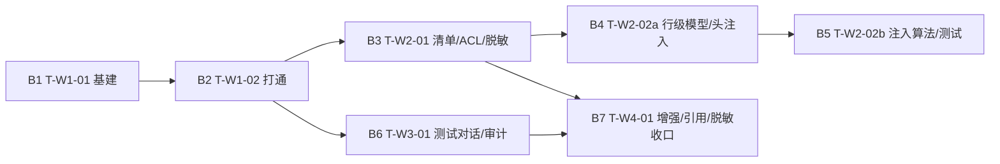

# MIS × WrenAI 问数（mis-iqd）— 执行基线确认（文档 ↔ 代码现状对齐）

> 文档角色：施工基线。把 `docs/ai-fusion/wrenai/`（prd/architecture/tasks/deploy 四件套，v1.9）与仓库代码现状对齐，输出「可复用 / 需新建 / 需修改」三态结论、批次划分、W0 实测降级处置、架构风险提示，供工程师分批实施。
> 作者：软件架构师（高见远）｜日期：2026-08-22｜语言：中文
> 基线依据：architecture.md v1.9（§3 文件清单 / §4.2 表结构 / §4.2.2 行级 D.1–D.10 / §5 时序 / §7 共享约定 / §8 待确认）、tasks.md v1.9、deploy-iqd.md（wren: v0.13.3 钉位）
> **结论先行：代码侧已具备全部对齐范式（mis-kb / AbstractDownstreamClient / kb_client / 四处同改），可立即按 B1→B2→(B3∥B6)→B4→B5→B7 开始施工；W0 实测（wren serve mcp 工具面）不阻塞代码施工，作为 W4 收尾验收项保留。**

---

## 1. 基线总览：当前代码 vs 规划文档差距矩阵

### 1.1 七个代码基线检查点核查结果

| # | 检查点 | 现状核查结果 | 三态结论 |
|---|---|---|---|
| 1 | **backend/mis-kb 分层范式** | 独立模块存在：`api/client` + `api/controller` + `api/dto` + `config` + `domain/entity` + `domain/model` + `domain/repository` + `domain/service` + `engine` + `support`；pom 依赖 = `mis-common-jpa` + `spring-boot-starter-web` + `data-jpa` + `validation` + `actuator` + `postgresql`；`V12__kb_schema.sql` 存在（PostgreSQL 16 / mis_platform / `BIGINT PRIMARY KEY` + `created_at/updated_at TIMESTAMPTZ NOT NULL DEFAULT NOW()`） | ✅ **可复用（范式）**；mis-iqd 完全照抄分层与 pom |
| 2 | **backend/mis-migrator 迁移版本号** | 现存最高 = **V68__a2ui_embed_identity.sql**；**V69 / V70 / V71 均不存在**；V69__iqd_menu_api_seed.sql 未建；V12/V13（kb_schema/kb_seed）存在可作风格参考 | ✅ **无冲突，全部需新建**（V69 菜单/API 种子、V70 物化 dept_path、V71 iqd 表结构） |
| 3 | **backend/mis-org SysDept / sys_dept / DeptService** | `SysDept` 实体存在：有 `ancestors`（VARCHAR(512)）字段，**无 `dept_path`**；`sys_dept` DDL（V1__init_schema.sql）有 `ancestors` 列**无 `dept_path` 列**；`DeptService` 位于 `com/mis/org/service/DeptService.java`（注意：mis-org 用顶层 `service` 包，非 mis-kb 的 `domain/service`），`create()`（L115）、`relocate`（L339 附近 `rebuildAncestors`）、根创建逻辑均在，`buildAncestors`/`rebuildAncestors` 私有方法（L403/L407）即物化 dept_path 的成对赋值改造点 | 🔶 **需修改**：SysDept 加 `deptPath` 字段、DDL 加列（V70 回填 + 索引）、DeptService 三处维护逻辑成对赋值 |
| 4 | **backend/mis-admin-bff** | `AbstractDownstreamClient` 存在（`com/mis/adminbff/client/`）：`loginContextHeaders()`/`operatorHeaders()`/`get/post/put/delete/block` 全套；`AiPlatformClient` 已有 SSE 处理（`Flux<ServerSentEvent<String>> chatStream`）与 `buildMisEnrichmentHeaders()`（注入 `X-Mis-Depts`/`X-Mis-Orgs`/`X-Mis-Roles`）；`KbFacadeService`/`AgentOpsFacadeService` 等 Facade 范式存在；`application.yml` 已有 `kb-base-url`、`sse-enabled: ${AI_PLATFORM_SSE_ENABLED:true}` 配置段 | ✅ **可复用**：IqdClient 继承 AbstractDownstreamClient、SSE 照抄 AiPlatformClient、Facade 照抄 KbFacadeService、yml 段照抄 kb 段风格；v1.9 新增 `IqdIdentityHeaderService`（`X-Mis-Dept-Scope`/`X-Mis-Stores`）为头体系扩展 |
| 5 | **agent/ai-platform** | `src/adapters/kb_client.py` 存在（httpx 异步、端点常量、`KbCallContext`、Result 信封 `code!=0` 抛错、透传 `Authorization/X-User-Id/X-Tenant-Id/X-App-Id/X-Trace-Id`）；`src/api/routes/` 下 12 个路由文件**无 iqd.py**；`configs/agents/` 下 7 个 worker（crm-assistant/mis-admin-helper/mis-copilot/mis-extract/mis-rag/mis-summary/mis-user-helper）**无 mis-iqd**；`mis-copilot/coordination.yaml` `worker_ids` = crm-assistant/mis-rag/mis-user-helper；`config.py` `INVOKE_AGENT_WHITELIST` = mis-rag/crm-assistant/mis-user-helper；**仓库无 Nacos ai-platform.yaml**（ai-platform 配置走 `config.py` BaseSettings + `config_manager` 本地文件） | 🔶 **大部分可复用（范式）、部分需新建**：kb_client 范式照抄→IqdConfigClient；coordination.yaml 与 config.py 白名单需追加 mis-iqd；mis_iqd 包、iqd_mcp_client/iqd_cli 等全部新建 |
| 6 | **frontend/mis-admin-web/src/features/agent/** | `pages.ts` 桶导出存在（含 `DataQueryPage`）；`agent-nav.ts` `AGENT_NAV` leaf 列表存在（`/ai/data-query` 已登记），**无 /agent/iqd/\***；`keep-alive-outlet.tsx` `PAGE_MAP` 精确路径匹配（`/agent/mcp`、`/ai/data-query` 已注册）；`icons.ts` 已登记 `Database`/`ListTree`/`ShieldCheck`（可复用），`BookOpenCheck`/`FlaskConical` **未登记**；`ai-chat-panel.tsx` `AiChatPanel` 存在（L169）；`data-query-page.tsx` 用 `AiChatPanel` + `DATA_QUERY_SUGGESTIONS`；**无 iqd 目录**，**ai/components/ 目录不存在**（ai 目录为平铺 + services/） | 🔶 **可复用骨架、全部新页面新建**：`features/agent/iqd/` 目录新建、四处同改 + icons 补登记、ai/components/ 目录新建 |
| 7 | **docs/adr/** | **ADR-019 已存在且已标记「已替代」（→ADR-020）**；**ADR-020 已存在且「已接受」**；`docs/adr/README.md` 索引已更新两条 | ✅ **已就绪，无需再写**（architecture/tasks 中「ADR-019 修订 + ADR-020 编写」任务项视为已完成） |

### 1.2 按施工区域差距矩阵（X=可复用 / Y=需新建 / Z=需修改）

| 施工区域 | 关键现状 | 可复用 X | 需新建 Y | 需修改 Z |
|---|---|---|---|---|
| **Java 领域模块 mis-iqd** | backend 无 mis-iqd 模块 | mis-kb 分层/pom 范式、V12 表风格 | pom.xml、11 个 entity、repository、IqdAdminService、IqdScopeSyncJobService、IqdController、IqdInternalController、application.yml | — |
| **迁移 V69/V70/V71** | 最高 V68，92200+ 段位空闲 | V12/V13/V19 风格参考、sys_menu ID 段位现状（≤92176） | V69__iqd_menu_api_seed.sql、V70__org_dept_path_materialized.sql、V71__iqd_schema.sql | — |
| **mis-org 物化 dept_path** | SysDept 有 ancestors 无 dept_path；DeptService 三处维护点明确 | buildAncestors/rebuildAncestors 结构 | V70 回填 + idx_dept_path | SysDept 实体、sys_dept DDL、DeptService create/relocate/根创建 |
| **BFF 门面 /api/v1/iqd/\*\*** | AbstractDownstreamClient、SSE 范式、Facade 范式齐全 | 全部基础设施 | IqdAskController/IqdController/IqdAclController、IqdClient、IqdFacadeService/IqdAskFacadeService、IqdIdentityHeaderService、dto/iqd/\* | application.yml 追加 mis.iqd 段 |
| **Worker mis_iqd（Python）** | kb_client 范式、config.py、coordination.yaml、白名单就绪 | kb_client→IqdConfigClient 范式、Result 信封约定、SSE 帧格式（mis_capability） | agent/mis_iqd/ 整包（orchestrator/scope_resolver/lineage/masking/plan_mapper/projector/tools）、adapters/iqd_mcp_client.py、adapters/iqd_cli.py、adapters/iqd_config_client.py、models/iqd_schema.py | config.py 追加 IqdMcpSettings/IqdConfigSettings、pyproject.toml 追加 sqlglot/mcp、coordination.yaml worker_ids、config.py INVOKE_AGENT_WHITELIST |
| **Worker 配置目录** | configs/agents/ 下 7 个 worker 结构清晰 | 目录结构/文件范式（对齐 mis-rag 等） | configs/agents/mis-iqd/ 全 8 文件 | — |
| **前端后台 5 页 + 用户端扩展** | pages.ts 桶、nav、keep-alive、icons 骨架齐全 | 四处同改机制、AiChatPanel 壳、DATA_QUERY_SUGGESTIONS、icons 三个已登记 | features/agent/iqd/ 5 页 + 5 组件 + api/types、ai/components/iqd-citation-block.tsx + iqd-plan-steps.tsx | pages.ts、agent-nav.ts、keep-alive-outlet.tsx、icons.ts、ai-chat-panel.tsx、data-query-page.tsx、skill-dispatch.ts |
| **ADR 收口** | ADR-019 已替代、ADR-020 已接受、README 索引已更新 | — | — | —（无需再动） |

---

## 2. 批次划分（B1–B7，对应 W1–W4 全部施工项）

> 批次 = tasks.md 的任务粒度 + 依赖排序；B3 与 B6 互不依赖可并行；B4/B5（行级范围）串行依赖 B3。
> 文件名一律以 **architecture.md v1.9 §3.2/§3.3/§3.4 为准（iqd-\* / service/iqd / dto/iqd）**，tasks.md 中残留的 wrenai-\* 旧名见 §4 风险 R1。

### B1 = T-W1-01 项目基础设施与数据模型

| 项 | 内容 |
|---|---|
| **目标** | 搭起三端骨架：mis-iqd Java 模块 + V71 建表 + Worker 注册 + BFF/前端空壳 |
| **新建** | `backend/mis-iqd/pom.xml`；`domain/entity/` 11 实体（IqdConnection/IqdDatasource/IqdModelSnapshot/IqdCatalogItem/IqdScopePolicy/IqdTableAcl/**IqdRowScopeDimension**/IqdSqlPair/IqdKnowledge/IqdMaskRule/IqdAskLog）；`domain/repository/*`（11 个）；`src/main/resources/application.yml`（数据源 mis_platform + `ddl-auto=validate`）；`backend/mis-migrator/.../V71__iqd_schema.sql`（11 表 + 维度注册表种子 dept/store，对齐 V12 风格）；`agent/ai-platform/backend/src/adapters/iqd_config_client.py`（对齐 kb_client.py：端点常量 + Result 信封 + 透传头 + 缓存骨架）；`agent/ai-platform/configs/agents/mis-iqd/` 全 8 文件（agent/metadata/runtime/prompts/system/model/identity/memory/eval） |
| **修改** | `backend/src/config.py`（追加 IqdMcpSettings + IqdConfigSettings 段）；`pyproject.toml`（追加 sqlglot + mcp）；`configs/agents/mis-copilot/coordination.yaml`（worker_ids 追加 mis-iqd）；`config.py` INVOKE_AGENT_WHITELIST 追加 mis-iqd |
| **依赖** | 无（T-W0-01 文档决策已落盘，不阻塞） |
| **验收要点** | ① V71 执行后 mis_platform 出现 11 张 iqd_* 表 + 维度注册表种子 dept/store（BIGINT 自增 PK + created_at/updated_at）；② mis-iqd 模块可编译启动，JPA 与 V71 对应；③ mis-iqd 进委派白名单（coordination.yaml + INVOKE_AGENT_WHITELIST），role=worker、max_depth=1；④ IqdConfigClient 可连通 mis-iqd `/internal/v1/iqd/**` 健康检查；⑤ golden-questions.yaml ≥5 条 |
| **实现顺序建议** | pom → 实体 → V71 → repository → application.yml → config.py/pyproject → iqd_config_client → worker 配置目录 → coordination/白名单 |

### B2 = T-W1-02 对接配置 + 桥接 Worker + 用户端问数打通

| 项 | 内容 |
|---|---|
| **目标** | 端到端问数链路：连接配置 CRUD/自检 + MCP 桥接 + AskOrchestrator + 双闸门 + SSE 透传 + 前端问数扩展 |
| **新建** | Python：`adapters/iqd_mcp_client.py`（工具名模块常量，按 deploy-iqd.md 清单）、`adapters/iqd_cli.py`、`agent/mis_iqd/`（orchestrator/scope_resolver/lineage/plan_mapper/projector/service/tools）、`models/iqd_schema.py`（Pydantic DTO，三端同构）；Java BFF：`IqdAskController`（POST /api/v1/iqd/ask、/ask-stream SSE）、`IqdController`、`client/IqdClient.java`（继承 AbstractDownstreamClient，Flux SSE）、`service/iqd/IqdFacadeService.java`、`service/iqd/IqdAskFacadeService.java`、`dto/iqd/*.java`；前端：`ai/components/iqd-citation-block.tsx`、`ai/components/iqd-plan-steps.tsx`（无 sql prop）；`V69__iqd_menu_api_seed.sql`（sys_menu 5 页 + sys_api 全端点 iqd:* 码 + sys_menu_api 绑定，ID 段位 92200–92299，幂等） |
| **修改** | Python `main.py`（include iqd router）；BFF `application.yml`（mis.iqd.ask-timeout-ms=180000 / sse-enabled / admin-view-permission=iqd:trace:view / config-base-url）；前端 `ai/ai-chat-panel.tsx`（挂 citation/plan 扩展块）、`ai/data-query-page.tsx`（建议词/空态）、`ai/services/skill-dispatch.ts`（DATA_QUERY_SUGGESTIONS 追加问数示例）、`pages.ts`（桶导出） |
| **依赖** | B1 |
| **验收要点** | ① 配置保存/密钥 `******`/连通自检；② `/ai/data-query` 自然语言 → SSE → 答案+citations+plan，抓包无 WrenAI 直连；③ 双闸门：无 `ai:chat:use` 40300、空范围 45204 且不返回数据；④ view=user 经 `_strip_sql()` 删键、前端组件 props 无 sql；⑤ V69 全端点 sys_menu_api 绑定齐全（deny-unmapped 不 40300）；⑥ 黄金用例「本月各渠道销售额」通过 |
| **实现顺序建议** | V69 种子 → mis-iqd 配置读取 API（IqdInternalController 骨架，供 IqdConfigClient 拉取）→ iqd_mcp_client → orchestrator/scope_resolver（最小可用）→ IqdClient/IqdAskFacadeService（SSE）→ 前端 AiChatPanel 扩展 → 端到端联调 |
| **⚠️ 注意** | tasks.md T-W1-02 中 `src/api/routes/iqd.py`（Python 管理面）**按 v1.9 删除**（见 §4 R1）；`models/iqd_schema.py` 虽未在 tasks T-W1-01 显式排期，但属 Worker 契约基础，建议随 B2 一并建立 |

### B3 = T-W2-01 清单浏览 + 范围治理 + 表级 ACL 双闸门 + 脱敏

| 项 | 内容 |
|---|---|
| **目标** | catalog 拉取/树、范围策略、表级 ACL（Java 侧 + IqdConfigClient 消费）、脱敏规则种子、作用域二次裁定（v1.9 A1 改判落 mis_platform） |
| **新建** | mis-iqd：`IqdAdminService`（CRUD + 变更事件推送）、`IqdInternalController`（get-acls/get-scope-policies/get-mask-rules/get-dict-sync-status，对齐 /internal/v1/kb/**）；Python：`agent/mis_iqd/masking.py`（唯一脱敏出口，对齐 §7.5）；BFF：`IqdAclController`；前端：`features/agent/iqd/iqd-catalog-page.tsx`、`iqd-scope-page.tsx`、`components/iqd-catalog-tree.tsx`、`components/iqd-scope-table.tsx`、`components/iqd-acl-dialog.tsx`、`api/iqd-api.ts`、`types.ts` |
| **修改** | `V71__iqd_schema.sql`（扩 catalog/scope/acl 表、维度注册表；菜单/API 登记在 V69）；`scope_resolver.py`（配置来源改 IqdConfigClient 缓存）；`iqd_config_client.py`（增量拉取 + 变更事件订阅）；`IqdFacadeService`（清单树装配、范围批量提交）；前端四处同改（agent-nav.ts / keep-alive-outlet.tsx / icons.ts / pages.ts） |
| **依赖** | B2（桥接与主数据表就绪） |
| **验收要点** | ① catalog 左树到字段级、右栏 4 类语义模型；② scope 勾选保存后 iqd_catalog_item.in_scope 与 iqd_scope_policy 一致，变更事件 ≤10s 生效、缓存不可得 45204；③ 表级 ACL ask 授权后越权 45204、授权可问；④ 脱敏命中规则 `138****0000`；⑤ 四处同改齐、icon 不回退；⑥ G3/G4 通过；⑦ IqdInternalController 可被 IqdConfigClient 拉取（启动全量 + 事件增量 + 每日兜底） |
| **实现顺序建议** | 实体/Repository（catalog/scope/acl/mask）→ IqdAdminService → IqdInternalController → masking.py → scope_resolver 缓存化 → BFF IqdAclController/IqdFacadeService 装配 → 前端 3 页 + 四处同改 → 变更事件链路联调 |

### B4 = T-W2-02a 行级数据范围·数据模型 + 范围设置页（维度注册表一期 + 双维度）

| 项 | 内容 |
|---|---|
| **目标** | `iqd_row_scope_dimension` 维度注册表（种子 dept/store）+ row_scope 维度实例模型 + BFF `X-Mis-Dept-Scope`/`X-Mis-Stores` 头 + **mis-org 物化 dept_path（V70）** + 部门/门店字典同步 + 后台行级编辑/校验/预览 |
| **新建** | mis-iqd：`IqdRowScopeDimension` 实体 + `IqdRowScopeDimensionRepository` + `IqdScopeSyncJobService`（中心每日同步按维度注册表遍历 dept/store，全量 upsert 幂等）+ IqdInternalController 扩 get-dimensions；BFF：`IqdIdentityHeaderService`（维度遍历头注入）；`backend/mis-migrator/.../V70__org_dept_path_materialized.sql`（物化 dept_path 列 + 幂等回填 + idx_dept_path）；业务库侧 `mis_dept_scope`/`mis_store_scope` 物化表 DDL（A13 已确认非同一实例 → 物化表必选） |
| **修改** | `SysDept` 实体加 deptPath；`DeptService` create/relocate/根创建成对赋值（buildDeptPath/rebuildDeptPath 与 buildAncestors/rebuildAncestors 同点）；`IqdAdminService` 扩 crud_dimension + row_scope 读写/校验；`AiPlatformClient`（或 IqdIdentityHeaderService）头注入扩展；`models/iqd_schema.py`（RowScopeConfig 改 dimension/dimensions 语义）；前端 `iqd-scope-page.tsx`/`iqd-acl-dialog.tsx`（维度下拉、多维度 AND、试算、模拟角色预览）、`iqd-api.ts`/`types.ts`；`V71` 扩维度注册表种子 |
| **依赖** | B3（ACL/范围就绪）；**T-W0-01 探针 3c/3d/3e 结论**（见 §3 降级处置） |
| **验收要点** | ① 维度注册表建表 + 种子 dept/store（predicate_type/column_name/header_name/dict_table 正确），crud_dimension 可用；② 授权可为「角色 × 表」配行级（选维度→绑列→范围语义→自动/手动），row_scope 存单维度或 dimensions 数组 AND；③ 模板校验（维度/列存在性、白名单语法、参数引用完整）失败禁止保存；④ BFF 注入 `X-Mis-Dept-Scope`（锚点+path+scope）与 `X-Mis-Stores`（扁平集合），无该维度授权不注入；⑤ 模拟角色预览 WHERE 片段（dept PATH_PREFIX / store ENUM / 多维度 AND）；⑥ row_scope=NULL 全行可见、撤销 ACL 随行删除、变更事件 ≤10s；⑦ **mis-org V70 物化 dept_path + 移动后级联正确（黄金用例）**；⑧ mis_dept_scope 物化表已落地、中心日同步幂等、编码映射 X 已体现、注册进 MDL 可见集合但不进 ACL；⑨ store 维度：mis_store_scope 或复用主数据（dict_table=NULL）、`user.store_ids` 行权链路打通、维度头缺失 fail-closed 45204；⑩ 配置界面授权矩阵全局一处、模板化、批量套用 |
| **实现顺序建议** | 探针结论收集 → V70（mis-org 物化 dept_path）→ 维度注册表实体/种子 → row_scope 模型与校验 → IqdIdentityHeaderService（X-Mis-Dept-Scope/X-Mis-Stores）→ 字典物化表 + 中心日同步 → 前端行级编辑/预览 → BFF 头注入联调 |

### B5 = T-W2-02b 行级数据范围·注入/校验算法 + 测试（维度遍历注入）

| 项 | 内容 |
|---|---|
| **目标** | `ScopeResolver.inject_row_scope` 维度遍历注入 + 覆盖性校验 + fail-closed + 边界用例测试（≥20 条含 v1.9 用例 16–20） |
| **新建** | `tests/test_row_scope_inject.py`（≥20 条：单表/JOIN/子查询 CTE/UNION 逐表注入、越权拒绝、幂等、规模分层 11–15、store/双维度 16–20）；`tests/test_resolve_inject_strategy.py`（dept PATH_PREFIX/ENUM/FAIL_CLOSED + store ENUM 选择单测；CLOSURE_CTE 无单测） |
| **修改** | `scope_resolver.py`（`resolve_inject_strategy(dimension,...)` 按注册表 predicate_type、`inject_row_scope` 维度遍历 AND 叠加、`_probe_db_capabilities`、`_build_authorized_predicate`、`_is_covered_by` 按维度分别判定、`inject_at_table_level`）；`iqd_config_client.py`（维度注册表+ACL+字典同步状态缓存）；`orchestrator.py`（TEXT_TO_SQL 分支：dry 生成→注入→dry_run→run_sql；get_context 前置行条件描述）；`service.py`（write_ask_log 记注入后 SQL + verdict/strategy/dimensions）；`lineage.py`（注入后 final_sql 血缘兼容核查）；`golden-questions.yaml`（行级黄金用例 + 大规模部门树 + 门店样例） |
| **依赖** | B4（row_scope 数据模型与 BFF 头扩展先行）；**PATH_PREFIX 用例依赖探针 3d（dept_path LIKE 实测）/3e（编码盘点）、A12（已确认物化）** |
| **验收要点** | ① 注入生效：单表补 WHERE、JOIN 逐表注入（LEFT 语义保持）、子查询/CTE 注入、UNION 逐分支；② 越权拒绝 45204 不执行（dept_id='B' 越权 / PATH_PREFIX 写 B.path / store_id='S9'）；③ 幂等不重复注入、AST 失败 45204；④ 链路不破（注入→血缘→dry_run→run_sql→脱敏→审计），sql_text 为最终 SQL、resolved_scope 含 verdict/strategy/dimensions；⑤ 策略分层单测（PATH_PREFIX 主 / ENUM 降级 ≤500 / FAIL_CLOSED）；⑥ 双维度 AND（dept 谓词 AND store 谓词）、覆盖性按维度分别判定（dept 幂等 + store 越权 → 整表 45204）、维度头缺失 fail-closed；⑦ 黄金用例（A 部门问 B 部门被拒、A 部门见 A 及子孙、部门移动后级联、A 门店问 B 门店被拒、双授权交集行集）；⑧ 用例 ≥20 全绿 |
| **实现顺序建议** | resolve_inject_strategy 单测先行 → 谓词构建（PATH_PREFIX/ENUM）→ inject_row_scope 维度遍历 → 覆盖性校验 → orchestrator 接入 → 边界用例全量 → golden-questions 扩 |

### B6 = T-W3-01 后台联调测试对话 + 完整计划 + 审计

| 项 | 内容 |
|---|---|
| **目标** | test-chat 页（admin 全量）、完整计划时间线、SQL 代码块、范围/角色模拟、问数审计回查 |
| **新建** | 前端：`features/agent/iqd/iqd-test-chat-page.tsx`、`components/iqd-plan-timeline.tsx`、`components/iqd-sql-block.tsx`（仅后台页引用）；`V69` 扩 test/trace 菜单（iqd:test:use / iqd:trace:view） |
| **修改** | `service.py`（write_ask_log 全量含 SQL、list_ask_logs）；BFF `IqdController`（/traces、/traces/{id}）；`iqd-api.ts`/`types.ts`（admin 视图类型） |
| **依赖** | B2（问数管道 + 投影器就绪）；可与 B3 并行 |
| **验收要点** | ① 左对话右详情（SQL 代码块 + 结果表格 + 引用明细 + 完整计划时间线）；② 模拟角色切换受范围约束（不放大权限，记 simulated_role_code 不改 user_id）；③ view=admin 携带 SQL 需 iqd:trace:view，无码自动降 user（后端裁定）；④ 问数入 iqd_ask_log 可 /traces 回查；⑤ G5 通过 |
| **实现顺序建议** | write_ask_log/list_ask_logs → BFF /traces → 前端 test-chat 页 → plan-timeline/sql-block → 模拟角色联调 → V69 test/trace 菜单补登 |

### B7 = T-W4-01 准确度增强物料 + 引用归一化 + 步骤化计划 + 字段脱敏收口

| 项 | 内容 |
|---|---|
| **目标** | 样本/知识 CRUD + 同步 WrenAI、业务描述编辑、术语导入、引用归一化、前端计划分层、脱敏全链路收口 |
| **新建** | 前端：`features/agent/iqd/iqd-enhance-page.tsx`（三 Tab + 重新同步）；`ai/components/iqd-citation-block.tsx`/`iqd-plan-steps.tsx` 扩引用展开与步骤化清单 |
| **修改** | `service.py`（sql_pair/knowledge CRUD、push_enhancements、import_s07、MDL deploy 回填 mdl_hash）；`lineage.py`（CitationBuilder.merge_native_citations 钩子，Q5 原生/降级统一）；`iqd_cli.py`（context build 携带增强物料，--allow-write）+ `iqd_mcp_client.py`（get_instructions 复核对账、回填 wren_ref_id）；BFF `IqdController`（sql-pairs/knowledge/enhance 端点）；前端 `iqd-api.ts`/`types.ts`（enhance 类型）；`V69` 扩 enhance 菜单（iqd:enhance:\*） |
| **依赖** | B3（范围/ACL/脱敏基础就绪）+ B6（审计/计划接口就绪） |
| **验收要点** | ① 样本/知识 CRUD 后 POST /enhance/sync 推 WrenAI、wren_ref_id 回填、失败项 pending + 明细；② 业务描述写入 iqd_catalog_item.description 随 mdl/deploy 推送；③ import-s07 单向拉入（S-07 未就绪字段保留不启用，A6）；④ 引用来源可展开（表/字段/知识片段），降级派生不依赖原生 citation；⑤ 步骤化计划自然语言清单不含 SQL（scope_check→…→finished）；⑥ 脱敏全链路（日志/审计不落明文）；⑦ G6/G7/G8 通过 |
| **实现顺序建议** | 增强物料 CRUD → 同步/回填链路 → 引用归一化钩子 → 前端 enhance 页 → citation/plan 前端收口 → 脱敏全链路核查 → W0 实测结果对账（工具面/引用可得性） |

---

## 3. W0 实测降级处理（环境依赖项处置）

> W0 剩余均为**本机环境实测项**（需拉起真实 wren serve mcp 进程），**不阻塞代码施工**：代码按 deploy-iqd.md 已记录的工具面清单实现（工具名抽为 `iqd_mcp_client.py` 模块常量，升级只改常量）；实测结论作为 W4 收尾验收项，实测若与清单有出入只改常量与 deploy-iqd.md，不动上层契约。

| # | W0 实测/探针项 | 类型 | 施工期处置 | 验证点 |
|---|---|---|---|---|
| 1 | **wren serve mcp 工具面实测**（A4/Q1：`wren --version` 钉版本、HTTP transport 暴露工具清单、`get_context`/`recall_queries`/`list_knowledge` 是否暴露原生引用） | 环境依赖 | 代码按 deploy-iqd.md §2 清单实现工具常量；实测后仅校准 `iqd_mcp_client.py` 常量与引用归一化走法（Q5） | W4 收尾验收 |
| 2 | **探针 3a：超大 IN 阈值实测**（5k/10k IN 行为与报错阈值） | 环境依赖 | ENUM_LIMIT 默认 500 已定（v1.4）；实测仅校准阈值常量与 FAIL_CLOSED 触发条件 | B5 单测按 500 阈值实现，实测校准后更新常量 |
| 3 | **探针 3d：`dept_path LIKE` 前缀实测**（mis_dept_scope 物化表形态 JOIN/EXISTS 可解析可执行、索引命中） | 环境依赖 | PATH_PREFIX 谓词形态按设计实现（`col='<path>' OR col LIKE '<path>/%'` 与 `EXISTS(SELECT 1 FROM mis_dept_scope d WHERE …)`）；实测确认 JOIN/EXISTS 在 wren-core 可解析后钉死 2a 形态 | B4/B5 联调与 W4 收尾 |
| 4 | **探针 3c：部门树规模与 path 现状盘点** | 半环境依赖 | mis-org 侧已确认 `ancestors` 链存在（V1 DDL）、无 dept_path（→ V70 必做）；剩余「实施窗口」由 B4 排期时与 mis-org 侧确认即可 | B4 V70 实施 |
| 5 | **探针 3e：库边界与编码映射盘点 + store 维度盘点** | 半环境依赖 | A13 三答已确认（非同一实例→物化表、编码不统一→映射 X、每库一张+中心日同步）；剩余「业务库 DEPTID 编码体系 + 映射可行性 + 门店主数据/层级/用户门店授权现状」由 B4 实施前收集（可让 DBA/业务补一份盘点表，不必等真实 WrenAI） | B4 store 维度实例化 |
| 6 | **探针 3b：方言矩阵**（CTE/VALUES/子查询 IN/LIKE） | 已降级 | v1.5 已降级「仅记录不阻塞」（CLOSURE_CTE 不实现）；顺带记录备查 | 不阻塞 |
| 7 | **A2 运维确认**（WrenAI 与 ai-platform 同机/同网络部署资源） | 环境依赖 | 部署配置（wren_mcp_host/port 等）写 config.py + Nacos（若存在）；运维资源确认放部署阶段 | 上线前 |

**建议**：实测任务独立保留为「W4 收尾验收项」（可在 B7 之后追加一次「W0 实测对账」回合），由主理人/QA 在具备本机环境的机器上执行；实测报告落 `agent/ai-platform/deploy/wrenai/README.md` 与 `deploy-iqd.md` 更新。

---

## 4. 架构风险提示（文档 ↔ 代码基线对齐发现）

| # | 风险/冲突点 | 说明 | 处置建议 |
|---|---|---|---|
| R1 | **tasks.md 残留 v1.8 内容（与 v1.9 冲突）** | tasks.md T-W1-02 仍列 Python 侧 `src/api/routes/iqd.py`（管理面 REST），与 architecture v1.9 §3.2「Python 不再持有 iqd_* ORM 与管理面路由」冲突；T-W2-01/02a/03/04 文件仍用 `wrenai-catalog-page.tsx`/`wren-catalog-tree.tsx`/`wrenai-api.ts`/`wren-test-chat-page.tsx`/`wren-plan-timeline.tsx`、`service/wrenai/`/`dto/wrenai/` 包路径 | **以 architecture.md v1.9 §3.2/§3.3/§3.4 为准**：Python 不建 iqd 管理面路由；文件一律 `iqd-*` 前缀、`service/iqd`、`dto/iqd`；tasks.md 旧名忽略（工程师按本基线文件清单执行） |
| R2 | **Nacos ai-platform.yaml 不存在** | architecture §3.5 要求改 Nacos `ai-platform.yaml`，但仓库 `deploy/nacos-config/integration/` 下无该文件；ai-platform 配置实际走 `config.py`（BaseSettings）+ `config_manager` 本地文件 | B1 将 `wren.*`/`iqd.*` 配置写入 `config.py` 新 Settings 段；若部署确有 Nacos 需求，在 B1 与部署侧确认配置源后再补 Nacos 文件（低优先） |
| R3 | **V12 主键风格 vs architecture「BIGINT 自增 PK」表述** | V12 实际是 `id BIGINT PRIMARY KEY`（未显式 IDENTITY）；architecture v1.9 说「BIGINT 自增 PK」 | 对齐 V12 同款（JPA 实体注解以 mis-kb 实体实际风格为准），建表 DDL 与实体保持一致即可，不必纠结「自增」措辞 |
| R4 | **mis-org 与 mis-kb 的 service 包位置不一致** | mis-org 用顶层 `service/` 包，mis-kb 用 `domain/service/` | mis-iqd 对齐 mis-kb（`domain/service/`）；改造 DeptService 时注意它现在在 `service/` 包，改动范围不要误动包结构 |
| R5 | **models/iqd_schema.py 排期遗漏** | architecture §3.2 文件清单有，但 tasks T-W1-01/T-W1-02 均未显式排期（T-W2-02a 才提「改」） | B2 一并新建（Worker 契约基础，三端 DTO 同构的源头），避免 T-W2-02a 才补造成契约返工 |
| R6 | **store 维度行权来源现状未知** | `user.store_ids` JSONB / `mis_user_store` 关联表 / RBAC `perm_type=store` 扩展，平台现状未探明 | B4 实施前完成探针 3e-门店维度盘点；一期最小实现 `user.store_ids`（不扩 RBAC）为默认路径 |
| R7 | **A6/A7/A8/A9/A10 执行期确认项** | S-07 术语表读接口现状未知（A6）；452xx 码段需在 `ResultCode` 登记（A7，现存 401xx–500xx，452xx 空闲可占）；simulate_role_code 越权边界待安全拍板（A8）；多业务库一期单库待业务确认（A9）；mis-gateway/Nginx SSE 缓冲待验证（A10） | 均不阻塞施工：A6 按字段保留不启用实现；A7 B2 登记即可；A8 按「仅平台管理员可模拟任意角色」默认实现；A9 按单 project/单默认 connector；A10 W1 联调时验证，未支持先非流式 |
| R8 | **sys_menu ID 段位** | 现存最高 92176（V19/V50/V51/V61）；架构建议 92200–92299 | 已核实 92200+ 空闲，V69 按 92200–92299 分配 |
| R9 | **前端 ai/components/ 目录不存在** | architecture §3.4 引用的 `ai/components/iqd-citation-block.tsx`/`iqd-plan-steps.tsx` 需要新目录 | B2 一并新建 `ai/components/` 目录（放用户端扩展组件），与 `features/agent/iqd/components/`（后台组件）分开 |
| R10 | **V69 与 V71 的职责边界** | V69=菜单/API 种子（sys_menu/sys_api/sys_menu_api），V71=业务表；架构要求 V69 同时含 `ai:chat:use` 复用登记；tasks T-W2-01 曾写「菜单/API 种子见 V69 或 V71 内」 | 统一收敛到 V69（一处登记），V71 只建业务表，避免 sys_menu 写入分散两迁移 |

---

## 5. 结论：施工批次顺序确认

- **可立即开工**：B1 → B2（基础设施与端到端打通，全部依赖已落盘的文档决策，不依赖 W0 实测）。
- **可并行**：B3 与 B6（互不依赖，仅依赖 B2 全线）。
- **串行必守**：行级范围链路 B3 → B4 → B5 不可乱序（ACL/范围就绪 → 数据模型/头注入 → 注入算法）。
- **收口**：B7 依赖 B3+B6；W0 实测作为 W4 收尾对账回合，实测结论仅校准常量/契约，不反工上层。
- **开工前最小动作**：① 按 R1 修正 tasks.md 旧文件名为 v1.9 口径（或直接以本基线清单为准）；② B4 实施前收集探针 3e 编码/门店盘点表；③ A7 在 B2 把 452xx 码段登记进 `ResultCode`。

**综上：代码基线已具备全部对齐范式，无阻塞性缺口，可以开始施工。**
