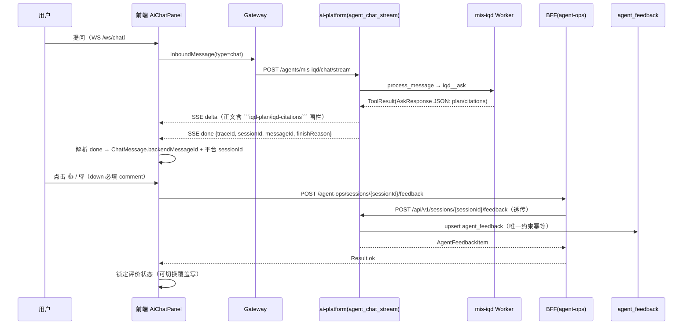

# 问数对话增量设计：来源 / 评价 / 步骤耗时 / 智能体路由

> 团队：software-mis-iqd-feedback · 作者：高见远（软件架构师）
> 目标文件：`docs/ai-fusion/wrenai/design-feedback-enhance.md`
> 前置：mis-iqd 问数 APP 一期 W1–W4 全 PASS，本设计为**增量开发**（只做研究与设计，不写业务代码）。
> 参照系：知识问答（mis-rag）的 4 项能力实现形态。
> 版本：**v2.0（方案 C 定稿）**——评价锚点采用「平台 done 帧透传 messageId + 复用平台会话 + BFF agent-ops/sessions/{id}/feedback 透传」（主理人已裁定维持本方案）。

---

## 0. 调研结论：关键链路事实（含与既有背景的差异修正）

以下为本次 Grep/Read 逐文件核实后的**实际代码事实**，作为设计基线。⚠️ 其中 3 点与「背景简报」不同，直接影响方案选型：

| # | 事实 | 证据 | 影响 |
|---|------|------|------|
| F1 | **用户问数/知识问答对话（`/ai/data-query`、`/ai/qa`）走 chat-core 直连 Gateway**：WS 发送 `/ws/chat` + SSE 接收 `/api/events/stream?sessionId=`，`useChat` 不传 agentId（留空走 Coordinator 自动路由） | `ai-chat-panel.tsx` L24/191（`useChat({ autoConnect: active })`）；`useChat.ts` L27 `DEFAULT_AGENT_ID = ''`；`sse-client.ts` L34-37 | **BFF `/api/v1/iqd/ask-stream` 不是用户对话链路**，只服务测试页（`iqd-test-chat-page.tsx` 调非流式 `/iqd/ask`）。评价锚点不能指望 BFF ask 时生成 |
| F2 | 平台层 SSE 实际只有 `delta / error / done` 三种帧（`mis_capability.py::agent_chat_stream`）；`plan_step / citations / result` 帧只存在于架构文档（§7.3）与注释，**代码未实现** | `mis_capability.py` L421-523 | plan/citations 实际以 ` ```iqd-plan``` / ```iqd-citations``` ` Markdown 围栏嵌入助手正文（前端 `splitIqdPlan/splitIqdCitations` 剥围栏渲染） |
| F3 | 平台每次对话都会 `create_session`（UUID）+ `add_message`（`assistant_id = uuid4()`），**done 帧已带 `sessionId`（平台 UUID）**，但 `messageId` **未透传**给前端；前端消息 id 是本地 `generateClientId('msg')` | `mis_capability.py` L454-510；`useChat.ts` L314-324 | 评价锚点可复用平台 session + 消息 UUID，只需把 `messageId` 加入 done 帧（一处小改） |
| F4 | 评价基础设施**在但缺写入端**：`agent_feedback` 表（session_id+message_id 唯一约束、agent_id、rating up/down、comment≤500）+ ai-platform `POST /sessions/{session_id}/feedback`（`MessageFeedbackRequest`，吐槽必填说明）+ 运营页 `/agent/feedback`（按 agent_id 过滤统计）。**前端与 BFF 均无「用户提交」函数**（agent-ops-api 只有 list/stats/process；知识问答用户页走独立 kb 体系 `POST /kb/qa/feedback`） | `agent_feedback.py` L50-140；`session.py` L903-939；`agent-ops-api.ts` L437-495；`kb-qa-page.tsx` L329-356 | 评价写入端需**新建**：BFF 透传端点 + 前端按钮（复用 agent_feedback 表） |
| F5 | 问数 Worker 侧：`AskOrchestrator.ask` 生成 `query_id = q-{uuid4().hex[:12]}`；`write_ask_log` 审计 `trace_id = X-Trace-Id 或 session_id`；`AskResponse` 有 `query_id/thread_id/latency_ms/plan[].duration_ms`，**无 agent_id/routing/message_id** | `orchestrator.py` L130/L248-264；`service.py` L135-161；`iqd_schema.py` L133-151 | 路由展示需三端补 `agent_id`；评价锚点不采用 query_id（用户链路拿不到） |
| F6 | 三端 DTO 源头：Python `models/iqd_schema.py` ↔ Java `dto/iqd/*.java` ↔ 前端 `lib/api/iqd.ts`（`features/agent/iqd` 目录实际不存在） | `iqd_schema.py` L1-14；`lib/api/iqd.ts` L256-305 | 新增字段需三端同步（见 §4） |
| F7 | `ChatMessage` 类型**已预留 `agentId?: string`**（assistant 可选），chat-store 有 `agentId` state；AiChatPanel 的 `DispatchTraceHint` 已展示 `dispatch.trace.worker_id`（默认 `DISPATCH_TRACE_SSE_ENABLED=false` 时不产生） | `lib/chat/types.ts` L34-35；`chat-store.ts` L17；`ai-chat-panel.tsx` L74-89 | 路由展示可复用 `ChatMessage.agentId` + 新增 `agentLabel` prop |

---

## 1. mis-rag 4 项能力现状矩阵

| 能力 | 知识问答（mis-rag）实现位置 + 交互形态 | 问数（mis-iqd）现状 | 结论 |
|------|----------------------------------------|---------------------|------|
| ① 查看来源 | `KbChatSourceList / KbChatSourceFigures`（`components/common/kb-chat-sources`）：来源折叠列表 + 配图；`kb-qa-page.tsx` 会话回放同款 | `IqdCitationBlock`（`ai/components/iqd-citation-block.tsx`）已实现：` ```iqd-citations``` ` 围栏剥取 + 折叠列表（kind 徽标 + item_key + display_name + snippet + source_ref），点选展开 description/snippet | **✅ 已达标，无需改动**（与 kb-chat-sources 同款折叠口径） |
| ② 评价（点赞/点踩） | 用户页 `kb-qa-page.tsx`：`onLike/onComplainCreated → submitFeedback(POST /kb/qa/feedback)` + `kb-feedback-form.tsx` 吐槽表单（accuracy/helpful/offtopic/citeError）——**独立 kb 体系**；运营回放 `agent-message-stream.tsx` 只有只读 `FeedbackBadge`（读 `metadata.feedback`），**无提交端** | **完全缺失**：AiChatPanel 无任何评价 UI；`agent_feedback` 表 + ai-platform 端点已存在但无 BFF 透传、无前端写入 | **❌ 需新建写入链**（复用 agent_feedback 表，不复制 kb 体系） |
| ③ 步骤耗时 | 运营回放/本地对话 `agent-message-stream.tsx`：`TimingBlock` 单轮总耗时条 + 5 大阶段（规划/检索/工具/生成/后处理）+ 子阶段下钻（数据源 Redis `RedisTimingStore`） | `IqdPlanSteps` 已渲染**每步** `duration_ms`（`formatDuration` ms→s）；`plan_mapper.py` 固定 8 阶段模板（scope_check/understanding/searching/generating/lineage_check/executing/masking/finished）；**无总耗时条、无阶段分组聚合**；`AskResponse.latency_ms` 三端已有但用户对话正文围栏不含 | **🟡 每步耗时已达标，补总耗时条**（前端对 plan 求和，不引入子阶段下钻——问数无 sub_stages 数据） |
| ④ 智能体路由 | 会话详情 `agent-session-detail-dialog.tsx` 显示 `Agent：{agent_name}`（会话维度）；消息流本身无「由 X 回答」标签；`agent-dispatch-page` 展示 `worker_id` 调度轨迹（运营侧） | `DispatchTraceHint` 展示 `dispatch.trace.worker_id`（默认关）；`ChatMessage.agentId` 类型已有但 AiChatPanel 不传 agentId → null；Worker/BFF/三端 DTO 均无 agent_id 字段 | **❌ 需新增**：三端 DTO 补 `agent_id` + 前端气泡「由 mis-iqd 智能体回答」标签（用户链路是 Coordinator 自动调度，**不做** Worker 选择器，只做回答归属展示） |

---

## 2. 增量设计（每项，含设计决策）

### 2.1 ① 来源对齐 —— 无需改动

- **结论**：`IqdCitationBlock` 已与知识问答来源展示同构（折叠列表 + kind 徽标 + 名称 + snippet + 展开明细），本次**零改动**。
- 可选小增强（P2，不阻塞）：展开态对 `source_ref` 提供「查看知识原文」跳转（对齐 kb `kb-doc-chunk-dialog`），需后端 `source_ref` 可定位——一期已带 `source_ref` 字段，仅前端加链接，按排期取舍。

### 2.2 ② 评价 —— 消息锚点方案决策 + BFF 端点 + Worker 配合 + 前端按钮

#### 2.2.1 锚点方案决策（三选一）

| 候选方案 | 说明 | 否决/采纳理由 |
|----------|------|---------------|
| A. BFF ask 时生成 message_id 透传 SSE 帧 | BFF `IqdAskFacadeService.askStream` 生成 message_id 注入帧 | **否决**：用户问数对话不走 BFF（F1），ask-stream 仅测试页；且平台 SSE 实际无自定义帧透传（F2） |
| B. 复用 trace_id 作为锚点 | done 帧已带 `traceId`（X-Trace-Id） | **否决**：`agent_feedback` 表唯一约束是 `session_id + message_id`，trace_id 语义错位；运营无法按会话下钻、无法 content 对齐；trace_id 每次请求变化，无法表达「同一条回答」 |
| C. 复用平台会话 + 消息 UUID（**采纳**） | 平台 `agent_chat_stream` 已创建会话（UUID）并落 assistant 消息（`assistant_id=uuid4`），done 帧已带 `sessionId`；只需把 `assistant_id` 作为 `messageId` 加入 done 帧透传前端 | **采纳**：改动最小（ai-platform 一处 + 前端解析），完整复用 `agent_session` / `agent_feedback` / 运营页链路；`agent_id` 自动取自会话（= mis-iqd），`session_id` 填平台 UUID（满足唯一约束），`message_id` 精确锚定一条回答（后端真实 UUID，运营页可精确回放）；`_session_owned_by` 归属校验防越权 |
| ~~D. 前端 sessionId:turn-N 序号锚点~~ | ~~`message_id = f"{sessionId}:turn-{assistantTurn}"`，BFF 直落 agent_feedback，新增 ai-platform /iqd/feedback 端点~~ | **否决（主理人裁定）**：turn-N 是前端渲染序号，无法被运营页精确回放（agent_feedback 按 message_id 读 `agent_session_message.content` 补 answer_brief 会落空）；绕开 `_session_owned_by` 归属校验存在数据污染风险；且新增 ai-platform 端点与现有 `POST /sessions/{id}/feedback` 职责重叠 |

**决策**：选 C。Worker（mis_iqd）**无需配合**——消息落库与 done 帧拼装在平台层 `mis_capability.py`，与 Worker 解耦；Worker 侧 `query_id` 仍保留审计用途（F5），不承担评价锚点。

#### 2.2.2 存储：复用 `agent_feedback` 表（不新建 iqd_feedback）

- 字段契合评估：`session_id(String128)` 填平台会话 UUID ✓；`message_id(String64)` 填 done 帧 messageId（uuid4 36 位）✓；`agent_id(String64)` 由会话 `agent_id` 自动带出（mis-iqd）✓；`rating up/down` ✓；`comment Text ≤500` ✓（ai-platform `MessageFeedbackRequest` 已校验 `max_length=500`）；`user_id` 由 `_session_owned_by` 校验归属后落 ✓。
- 唯一约束 `uq_agent_feedback_session_message` 天然幂等：同一消息重复提交 → upsert 覆盖，统计按最新值（对齐一期 PRD Q-C1）。
- **结论：复用，不新建表**。

#### 2.2.3 端点设计

**复用（不改）**：ai-platform `POST /api/v1/sessions/{session_id}/feedback`（`MessageFeedbackRequest`：`rating` 必填 up/down、`comment` ≤500 且 down 必填、`message_id` 可选、`content` 可选兜底对齐）。

**新建（BFF 透传）**：

```
POST /api/v1/agent-ops/sessions/{session_id}/feedback     # BFF 新增透传（用户提交写入端）
```

- 请求体（BFF DTO `IqdFeedbackRequest`，与 ai-platform `MessageFeedbackRequest` 同构，snake_case wire）：
  ```json
  {
    "rating": "up | down",          // 必填
    "comment": "string ≤500",       // down 必填（服务端校验）
    "message_id": "uuid",           // done 帧透传的后端消息 UUID（推荐，精确锚定）
    "content": "string?"            // 兜底：无 message_id 时按内容对齐
  }
  ```
- 响应：`Result<{ id, session_id, message_id, agent_id, rating, comment, status, created_at, ... }>`（`AgentFeedbackItem` 同构），message「已记录反馈」。
- 权限码：**复用 `ai:chat:use`**（用户对话能力已有；不新增码，避免 V 系列权限表改动）。在 `api-permission` 注册表（`deny-unmapped: true`）登记新路由映射。
- 幂等策略：透传层无状态；幂等由下游 `agent_feedback` 唯一约束保证（重复提交覆盖写）。
- BFF 实现：`AgentOpsClient.submitFeedback(sessionId, body)` 调 ai-platform `POST /api/v1/sessions/{session_id}/feedback`（透传 MIS JWT + `X-User-Id`/`X-Username` 运营操作人头，对齐既有 `_operator_identity` 约定）；`AgentOpsController` 新增 `@PostMapping("/sessions/{session_id}/feedback")`。

#### 2.2.4 前端按钮形态

- 新建 `ai/components/iqd-feedback-buttons.tsx`，对齐知识问答交互但不复制 kb 体系：
  - 形态：ThumbsUp / ThumbsDown（lucide，同 `agent-message-stream` 徽标视觉）+ comment 输入（仅 down 时展开必填，对齐 `MessageFeedbackRequest`「吐槽必须带说明」）；up 一键提交。
  - 状态：提交后锁定（本地 state `submittedRating`），可重复点赞/点踩切换（覆盖写，幂等）。
  - 数据源：`ChatMessage.backendMessageId` + `ChatMessage.sessionId`（平台 UUID）。
  - 禁用条件：`backendMessageId` 缺失（如重连丢失 done）时按钮禁用并 tooltip「暂无法评价」；不阻断展示。
- 触发链路：`ai-chat-panel.tsx` 气泡（assistant 且非 streaming）挂 `IqdFeedbackButtons` → `agent-ops-api.submitSessionFeedback(sessionId, {rating, comment, message_id})` → BFF 透传 → ai-platform 落 `agent_feedback` → 运营页 `/agent/feedback` 按 `agent_id=mis-iqd` 过滤可见。

### 2.3 ③ 步骤耗时 —— 补总耗时条（前端求和）

- **每步耗时已达标**（`iqd-plan-steps.tsx` L92-96/L142 渲染 `duration_ms`），无需改 Worker/三端 DTO。
- **增量**：`IqdPlanSteps` 增加 `totalMs?: number | null` prop，在时间线顶部渲染「本轮总耗时 {formatDuration(totalMs)}」（样式对齐知识问答 `TimingBlock` 的「本轮耗时」条）；`ai-chat-panel.tsx` 在 `splitIqdPlan` 后对 `plan[].duration_ms` 求和传入。
- **不做**子阶段下钻：问数 plan 是固定 8 阶段模板（`plan_mapper._PLAN_TEMPLATE`），无 `sub_stages` 数据，8 阶段本身即阶段分组；如需「阶段分组聚合」（如 理解/检索→生成→执行→收尾），可作为 P2 前端按 code 前缀分组渲染，不新增 wire 字段。
- 说明：`AskResponse.latency_ms` 三端已有（非流式测试页展示用）；用户对话正文围栏不含 latency_ms，故总耗时取 plan 求和（数值一致性由 orchestrator 计时保证，允许与真实 wall-clock 有毫秒级偏差）。

### 2.4 ④ 智能体路由 —— 三端补 agent_id + 气泡展示

#### 2.4.1 三端 wire 字段（新增 `agent_id`）

| 端 | 文件 | 改动 |
|----|------|------|
| Python | `agent/ai-platform/backend/src/models/iqd_schema.py` `AskResponse` | 加 `agent_id: str = Field(default="mis-iqd", description="回答智能体标识")` |
| Java | `backend/mis-admin-bff/.../dto/iqd/IqdAskResponse.java` | 加 `agentId` 字段 + `@JsonProperty("agent_id")` getter（对齐既有 snake_case wire 风格） |
| 前端 | `frontend/mis-admin-web/src/lib/api/iqd.ts` `IqdAskResponse` | 加 `agent_id?: string` |

> 说明：`agent_id` 为**展示型元数据**，由 Worker 编排器在构造 `AskResponse` 时填充默认 `mis-iqd`（或后续多 Worker 时按实际执行者填）；BFF/前端透传零加工。

#### 2.4.2 前端气泡展示位置

- `AiChatPanel` 增加可选 prop `agentLabel?: string`（`data-query-page` 传「问数」、`qa-page` 传「知识库问答」）。
- 气泡渲染：assistant 消息**尾部**（`citationBlock` 之后）渲染轻量标签 `由 {agentLabel} 智能体回答`（`Badge` 次级样式 + `Sparkles` 图标，视觉弱于正文、强于边角），取数优先级：`message.agentId ?? dispatchTrace.worker_id ?? agentLabel`。
- 约束对齐：用户链路是 Coordinator 自动调度（`skill-dispatch.ts`：Worker 不暴露用户选择器，fail-closed），本设计**只做回答归属展示**，不做 Worker 切换。
- 既有 `DispatchTraceHint`（worker_id 轻提示）保留，两处并存不冲突。

---

## 3. 文件清单（三态）

### 3.1 新建（2）

| 相对路径 | 改动点摘要 |
|----------|-----------|
| `frontend/mis-admin-web/src/features/agent/ai/components/iqd-feedback-buttons.tsx` | 评价按钮组件：ThumbsUp/ThumbsDown + down 必填 comment 输入 + 提交状态锁定；props `{ sessionId, backendMessageId, agentLabel? }`；调 `agent-ops-api.submitSessionFeedback` |
| `backend/mis-admin-bff/src/main/java/com/mis/adminbff/dto/iqd/IqdFeedbackRequest.java` | BFF 提交请求 DTO（`rating`/`comment`/`message_id`/`content`，snake_case wire，与 ai-platform `MessageFeedbackRequest` 同构） |

### 3.2 修改（9）

| 相对路径 | 改动点摘要 |
|----------|-----------|
| `agent/ai-platform/backend/src/api/routes/mis_capability.py` | `agent_chat_stream` done 帧 payload 增加 `"messageId": assistant_id`（已有变量，仅加键）；同步注释事件契约（done 帧新增 messageId） |
| `frontend/mis-admin-web/src/lib/chat/types.ts` | `ChatMessage` 增加 `backendMessageId?: string`（后端消息 UUID）；`ChatStreamEvent` 的 `done` 分支扩展 `{ messageId?: string; sessionId?: string }` |
| `frontend/mis-admin-web/src/lib/chat/event-adapter.ts` | `done` 分支解析 `messageId`/`sessionId` 并入事件对象 |
| `frontend/mis-admin-web/src/lib/chat/useChat.ts` | `handleEvent` 的 `done` 分支：把 `event.messageId` 写入 `streamingMessageIdRef.current` 对应消息的 `backendMessageId`（`store.updateMessage`） |
| `frontend/mis-admin-web/src/features/agent/ai/ai-chat-panel.tsx` | ① 气泡尾部挂 `IqdFeedbackButtons`（assistant 非 streaming）② `IqdPlanSteps` 传 `totalMs`（plan 求和）③ 渲染「由 X 智能体回答」标签 ④ `AiChatPanelProps` 增加 `agentLabel?` |
| `frontend/mis-admin-web/src/features/agent/ai/components/iqd-plan-steps.tsx` | 增加 `totalMs?: number | null` prop + 顶部「本轮总耗时」条 |
| `frontend/mis-admin-web/src/features/agent/api/agent-ops-api.ts` | 新增 `submitSessionFeedback(sessionId, { rating, comment, message_id })`（POST `/agent-ops/sessions/{id}/feedback`） |
| `backend/mis-admin-bff/src/main/java/com/mis/adminbff/client/AgentOpsClient.java` | 新增 `submitFeedback(String sessionId, Object body)`：调 ai-platform `POST /api/v1/sessions/{session_id}/feedback`（透传 JWT + X-User-Id/X-Username 头） |
| `backend/mis-admin-bff/src/main/java/com/mis/adminbff/controller/AgentOpsController.java` | 新增 `@PostMapping("/sessions/{session_id}/feedback")` 透传路由 + `api-permission` 注册表登记（复用 `ai:chat:use`） |

### 3.3 复用（不改）

| 相对路径 | 复用点 |
|----------|--------|
| `agent/ai-platform/backend/src/models/agent_feedback.py` | `agent_feedback` 表（唯一约束幂等、agent_id、rating、comment≤500） |
| `agent/ai-platform/backend/src/api/routes/session.py` L903 `submit_message_feedback` | ai-platform 已有评价写入端点（`MessageFeedbackRequest` + `_session_owned_by` 归属校验 + metadata.feedback + PG upsert） |
| `frontend/mis-admin-web/src/features/agent/sessions/agent-feedback-page.tsx` | 运营反馈页（按 `agent_id=mis-iqd` 过滤即可看到问数评价，零改动） |
| `agent/ai-platform/backend/src/agent/mis_iqd/*` | Worker 全部零改动（编排/审计/投影不动） |
| `frontend/mis-admin-web/src/features/agent/ai/components/iqd-citation-block.tsx` | ①来源能力已达标，不改 |
| `frontend/mis-admin-web/src/features/agent/ai/components/iqd-plan-steps.tsx`（每步耗时） | ③每步耗时已有，仅增补总耗时条（见修改） |

---

## 3.4 已实施标记（增量落地记录）

> 工程师实施完成（T1–T4 全量），主理人已拍板 §7 全部待确认项。文件清单实测如下（与 §3.1/§3.2 一一对应）：

**新建（2 + 1 增量）**
- ✅ `frontend/mis-admin-web/src/features/agent/ai/components/iqd-feedback-buttons.tsx` — 评价按钮（👍/👎 + down 必填 comment ≤500 + 提交锁定/切换覆盖写 + backendMessageId 缺失禁用 tooltip「暂无法评价」）
- ✅ `backend/mis-admin-bff/src/main/java/com/mis/adminbff/dto/iqd/IqdFeedbackRequest.java` — 评价提交 DTO（snake_case wire，与 ai-platform MessageFeedbackRequest 同构）
- ✅ `backend/mis-migrator/src/main/resources/db/migration/V76__agent_ops_feedback_submit_api.sql` — **额外增量**：api-permission 注册表登记（sys_api 92586 + sys_menu_api 绑定菜单 613 复用 `ai:chat:use`；`deny-unmapped=true` 下不登记即 403）

**修改（9 + 2 必要配套）**
- ✅ `agent/ai-platform/backend/src/api/routes/mis_capability.py` — done 帧 payload 增加 `messageId: assistant_id` + 事件契约注释
- ✅ `agent/ai-platform/backend/src/models/iqd_schema.py` — `AskResponse.agent_id`（默认 `mis-iqd`，Python 侧已验证默认值）
- ✅ `backend/mis-admin-bff/.../dto/iqd/IqdAskResponse.java` — `agentId` + `@JsonProperty("agent_id")` wire getter
- ✅ `frontend/mis-admin-web/src/lib/api/iqd.ts` — `IqdAskResponse.agent_id?: string`
- ✅ `frontend/mis-admin-web/src/lib/chat/types.ts` — `ChatMessage.backendMessageId`（+ `backendSessionId` 平台会话 UUID）+ `ChatStreamEvent.done.messageId/sessionId`
- ✅ `frontend/mis-admin-web/src/lib/chat/event-adapter.ts` — done 分支解析 messageId/sessionId
- ✅ `frontend/mis-admin-web/src/lib/chat/useChat.ts` — done 分支写入 backendMessageId/backendSessionId（store.updateMessage）
- ✅ `frontend/mis-admin-web/src/features/agent/ai/ai-chat-panel.tsx` — agentLabel prop + IqdFeedbackButtons + IqdPlanSteps.totalMs + 「由 X 智能体回答」Badge（取数 `message.agentId ?? worker_id ?? agentLabel`）
- ✅ `frontend/mis-admin-web/src/features/agent/ai/components/iqd-plan-steps.tsx` — totalMs prop + 顶部「本轮总耗时」条
- ✅ `frontend/mis-admin-web/src/features/agent/api/agent-ops-api.ts` — `submitSessionFeedback(sessionId, {rating, comment, message_id})`
- ✅ `backend/mis-admin-bff/.../client/AgentOpsClient.java` — `submitFeedback(sessionId, body)`（POST /api/v1/sessions/{id}/feedback，透传 JWT + X-User-Id/X-Username）
- ✅ `backend/mis-admin-bff/.../controller/AgentOpsController.java` — `@PostMapping("/sessions/{session_id}/feedback")` 透传路由
- ✅ `backend/mis-admin-bff/.../service/agentops/AgentOpsFacadeService.java` — **必要配套**：`submitFeedback` 门面方法（Controller 统一走门面）
- ✅ `backend/mis-admin-bff/.../service/iqd/IqdAskFacadeService.java` — **必要配套**：`DEFAULT_AGENT_ID` 提为 public 常量（§7.1 待确认项：若联调需显式注入 agent_id 时同源）
- ✅ `frontend/mis-admin-web/src/features/agent/ai/data-query-page.tsx` — `agentLabel="问数"`
- ✅ `frontend/mis-admin-web/src/features/agent/ai/qa-page.tsx` — `agentLabel="知识库问答"`

**运营页核对**：`agent-feedback-page.tsx` 默认过滤 `agentId: ''`（全部 Agent），mis-iqd 反馈默认可见；页内 Agent 下拉（loadAgents）可按 `agent_id=mis-iqd` 过滤 —— **复用不改**，无需 micro-adjust。

**验证结论**：BFF Maven 编译通过 / 前端 typecheck 零错 / Python AST + `AskResponse().agent_id == "mis-iqd"` 通过（详见工程师回传）。

### 3.4.1 P2 补丁：A2UI 主链路评价锚点透传（QA 一轮后裁定）

> QA 一轮 PASS 但证实：用户主链路（`messageType='a2ui_chat'`，前端默认通道）走
> `a2ui_run.py`（Python Redis Streams XADD）→ Gateway `RedisStreamAgent` →
> `EventConverter`，此前 done 事件只带 `tokenUsage`，前端拿不到 messageId/sessionId
> → 评价按钮恒禁用。主理人裁定接受 P2 补丁，打通 A2UI 通道评价锚点：

**修改（3 源码 + 2 测试）**
- ✅ `agent/ai-platform/backend/src/runtime/events.py` — `AgentEvent` 增加可选字段 `message_id`/`session_id`；`AgentEvent.done()` 工厂扩展 keyword-only 参数（默认 None，既有调用零回归）
- ✅ `agent/ai-platform/backend/src/runtime/a2ui_run.py` — 结束前预生成 assistant 消息 UUID → `_persist_assistant(..., message_id=uuid)` → `add_message(message_id=uuid)` 落库；`AgentEvent.done(total_usage, message_id=uuid, session_id=session_id)` 透传（**messageId 与 agent_session_message 落库 UUID 严格一致**；无 assistant 正文时不透传 message_id）
- ✅ `agent/ai-platform/gateway/src/router/agentEventParser.ts` — `RawBackendEvent` 增加 `message_id`/`session_id`（兼容 camelCase），`parseBackendAgentEvent` 透传
- ✅ `agent/ai-platform/gateway/src/channels/ChannelCapability.ts` — `AgentEvent` 接口增加 `messageId?`/`sessionId?`
- ✅ `agent/ai-platform/gateway/src/a2ui/EventConverter.ts` — `toRunFinished` 经 AG-UI `rawEvent` 携带 messageId/sessionId；`baseEventToFrontendMessage` RUN_FINISHED 读取并附到前端 done 消息
- ✅ `agent/ai-platform/gateway/src/a2ui/types.ts` — `A2UIDoneMessage` 增加 `messageId?`/`sessionId?`
- ✅ `agent/ai-platform/backend/tests/test_a2ui_run.py` — done 事件断言 message_id/session_id + **落库 UUID 一致性** + 无正文省略 message_id
- ✅ `agent/ai-platform/backend/tests/test_mis_stream.py` — done 帧断言 messageId

**前端零改动**：T1 已预留 `event-adapter.ts` done 分支（`raw.messageId ?? raw.message_id` / `raw.sessionId ?? raw.session_id` 兼容两种命名），Gateway 下发 camelCase 字段名一致即生效。

**一致性确认**：`a2ui_run.py` 预生成 UUID → `add_message(message_id=...)`（`Message.id = message_id`，即 agent_session_message 落库 UUID）→ 同一 UUID 进 done 事件 → Gateway 透传 → 前端 `backendMessageId` → `POST /sessions/{id}/feedback` 的 `message_id`，全链同一值，`UNIQUE(session_id, message_id)` 精确命中。


---

## 4. 接口设计

### 4.1 新增/修改 wire 字段三端对齐表

| 字段 | Python `iqd_schema.py` | Java BFF DTO | 前端 TS | 说明 |
|------|------------------------|--------------|---------|------|
| `agent_id`（新增，展示型） | `AskResponse.agent_id: str = "mis-iqd"` | `IqdAskResponse.agentId` + `@JsonProperty("agent_id")` | `IqdAskResponse.agent_id?: string` | 路由展示元数据；Worker 填充默认 mis-iqd |
| `messageId`（新增，SSE done 帧） | —（平台层 `mis_capability.py` 拼装，不经 iqd_schema） | —（BFF 1:1 透传 SSE 帧） | `ChatStreamEvent.done.messageId?: string` → `ChatMessage.backendMessageId` | 评价锚点；由平台 `assistant_id` 透传 |
| `sessionId`（已有，SSE done 帧） | — | — | `ChatStreamEvent.done.sessionId?: string`（解析） | 平台会话 UUID；评价提交路径参数 |

> 三端 DTO 对齐口径沿用一期约定：Python 为源头，Java/前端透传零加工；字段一律 snake_case wire（Java 经 `@JsonProperty` 映射）。

### 4.2 BFF 评价端点完整 Schema

```
POST /api/v1/agent-ops/sessions/{session_id}/feedback
Authorization: Bearer <MIS JWT>          # 必填，ai:chat:use 兜底判权
X-User-Id / X-Username                   # 透传运营操作人头（可选，用户提交场景不强制）
```

请求体（`IqdFeedbackRequest`）：

```json
{
  "rating": "up",              // 必填；枚举 up | down
  "comment": "string",         // 可选；down 必填（服务端 4001 校验）；≤500
  "message_id": "uuid",        // 可选；done 帧透传的后端消息 UUID（推荐）
  "content": "string"          // 可选；message_id 缺失时按内容对齐兜底
}
```

响应（成功 `code=0`）：

```json
{
  "code": 0,
  "data": {
    "id": 123,
    "session_id": "<平台会话UUID>",
    "message_id": "<uuid>",
    "agent_id": "mis-iqd",
    "user_id": "<mis_user_id>",
    "rating": "up",
    "comment": null,
    "status": "pending",
    "created_at": "2026-08-24T03:00:00Z",
    "updated_at": "2026-08-24T03:00:00Z",
    "answer_brief": null
  },
  "message": "已记录反馈"
}
```

错误语义：`4001` rating 非法 / down 缺 comment；`2005` session 不存在或非本人（归属校验，防越权）；`9001` 下游异常。

### 4.3 关键流程时序（评价）



---

## 5. 任务列表（有序含依赖）

> 约束：任务数 ≤5；每任务 ≥3 文件；T1 为链路/契约基础；T2 依赖 T1 的 messageId 契约；T3 依赖 T2 的 API；T4 集成收尾。

| ID | 任务名 | Source Files | 依赖 | 优先级 |
|----|--------|--------------|------|--------|
| T1 | 链路锚点 + 三端契约：平台 done 帧透传 messageId；三端 DTO 补 agent_id；前端 chat-core 解析 | `mis_capability.py`（改）、`iqd_schema.py`（改）、`IqdAskResponse.java`（改）、`lib/api/iqd.ts`（改）、`lib/chat/types.ts`（改）、`event-adapter.ts`（改）、`useChat.ts`（改） | — | P0 |
| T2 | BFF 评价提交端点：透传 ai-platform feedback + 权限登记 | `IqdFeedbackRequest.java`（新）、`AgentOpsClient.java`（改）、`AgentOpsController.java`（改）、`agent-ops-api.ts`（改，前端 client） | T1 | P0 |
| T3 | 前端 UI：评价按钮 + 总耗时条 + 智能体路由标签 | `iqd-feedback-buttons.tsx`（新）、`ai-chat-panel.tsx`（改）、`iqd-plan-steps.tsx`（改） | T2 | P0 |
| T4 | 集成联调与收尾：跨端字段对齐校验、幂等验证、运营页按 agent_id 过滤核对、文档更新 | `agent-feedback-page.tsx`（复用核对，不改或微调默认过滤）、`design-feedback-enhance.md`（改）、`baseline-execution.md`/`architecture.md`（改，可选） | T3 | P1 |

**依赖说明**：T1→T2→T3 为主链（messageId 契约 → 提交端点 → UI 接线）；T4 收尾验证全链。①②来源能力零任务（已达标）；③每步耗时零任务（已达标）。

---

## 6. 验收要点（每项可测）

### ① 来源查看（回归）
- [ ] 问数对话回答含引用时，气泡展示「引用 · N 项」折叠列表；展开可见 kind 徽标/名称/item_key/snippet/source_ref；与一期行为一致，无回归。

### ② 评价
- [ ] 助手回答完成（done）后气泡出现 👍/👎；未完成（streaming）或 `backendMessageId` 缺失时不出现（或禁用）。
- [ ] 点赞：点击 👍 一次提交成功（toast「已记录反馈」），按钮锁定；再点 👎 可切换（覆盖写，幂等）。
- [ ] 吐槽：点击 👎 必须填写 comment（≤500），空 comment 被拦截（前端校验 + 服务端 4001）。
- [ ] 提交后：ai-platform `agent_feedback` 表新增行（session_id=平台 UUID、message_id=done 帧 messageId、agent_id=mis-iqd、rating、comment、user_id 归属正确）；重复提交同 message 不产生重复行（唯一约束 upsert）。
- [ ] 运营页 `/agent/feedback` 按 `agent_id=mis-iqd` 过滤可见问数评价；统计（up/down/pending）正确；会话下钻可回放对应消息（agent_session_message 存在）。
- [ ] 越权：非本人 session 提交返回 2005/404，不写入。

### ③ 步骤耗时
- [ ] 执行计划时间线每步仍显示耗时（回归）。
- [ ] 时间线顶部新增「本轮总耗时」条，数值 = plan[].duration_ms 求和，格式 ms/s 与单步一致；无 plan 或全 0 时不显示。
- [ ] （P2 可选）按阶段分组渲染不破坏现有 8 步顺序。

### ④ 智能体路由
- [ ] 问数对话每条助手回答尾部显示「由 问数（mis-iqd）智能体回答」标签；知识问答页显示「知识库问答」。
- [ ] 非流式测试页 `/iqd/ask` 响应含 `agent_id: "mis-iqd"`（三端 DTO 对齐：Python↔Java↔TS）。
- [ ] 调度轻提示（DispatchTraceHint）与路由标签并存不冲突。

### 全链回归
- [ ] 一期 W1–W4 既有用例（问数、来源、计划时间线、审计）无回归；SSE delta 流式渲染不受 done 帧新增字段影响（向后兼容：新前端解析 messageId，旧数据无该字段时评价禁用不报错）。

---

## 7. Anything UNCLEAR（假设与待确认）

> ✅ 以下待确认项已由主理人拍板并落地（工程师已按拍板结论实施）：

1. **Gateway 自动路由到 mis-iqd 的最终 agent_id**：用户问数对话由 Coordinator 调度到 mis-iqd Worker，平台 `agent_chat_stream` 创建会话的 `agent_id` 以实际路由为准（可能是 mis-iqd 或 coordinator 标识）。若为 coordinator，评价落库的 `agent_id` 将不是 mis-iqd——**需在 T1 联调时核对会话 `agent_id` 实际值**；若需运营按 mis-iqd 过滤，可在 BFF 透传时显式注入 `agent_id=mis-iqd`（与 `IqdAskFacadeService.DEFAULT_AGENT_ID` 同源）。
   - ✅ **拍板**：透传层零加工（取 ai-platform 会话原值 `agent_id`）；`DEFAULT_AGENT_ID` 已提为 public 常量，联调发现非 mis-iqd 时显式注入即可（当前不注入）。
2. **done 帧 messageId 的兼容策略**：`fetch-event-source` 重连后 done 帧可能丢失（连接中断场景），`backendMessageId` 缺失时评价禁用——是否接受该降级行为，或补充「从会话回放接口补拉 message_id」的 P2 方案（问数对话未持久化到前端可回放体系，暂按禁用处理）。
   - ✅ **拍板**：接受降级——`backendMessageId` 缺失时评价按钮禁用 + tooltip「暂无法评价」，不补回放。
3. **BFF 权限登记**：`api-permission.deny-unmapped: true` 下新增路由必须登记，登记用 `ai:chat:use` 复用还是新增 `ai:chat:feedback` 码——设计倾向复用（用户已具备对话能力），需与权限负责人确认菜单/API 表更新范围。
   - ✅ **拍板**：复用 `ai:chat:use`，不新增权限码；V76 已在 sys_api（92586）+ sys_menu_api（绑定菜单 613）登记。
4. **agentLabel 文案**：路由标签文案（「问数」「知识库问答」「mis-iqd」）由页面传入，最终措辞以产品确认为准。
   - ✅ **拍板**：data-query-page 传「问数」、qa 页传「知识库问答」；取数优先级 `message.agentId ?? dispatchTrace.worker_id ?? agentLabel`。

