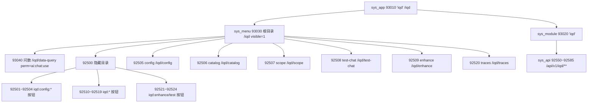

# 问数（IQD）独立门户应用 · 增量设计文档

> **目标一句话**：把问数从「智能体 92010 的子模块」升级为门户里**独立的一级应用**（仿知识库 91010），菜单 id `925xx` 保持不变只改 `app_id`，前端新增 `IQD_NAV` 并从 `AGENT_NAV` 移除 iqd 节点，路由建议迁到 `/iqd/*`，并给出 V77 迁移 SQL 草案。
>
> **影响边界**：仅改菜单归属 / 路由前缀 / 导航清单；后端 API 路径 `/api/v1/iqd/**` 与 `sys_menu_api` 绑定**不变**；A2UI 问数通道（`/ws/chat` + `/api/events/stream`，Gateway 绝对 URL）**不受影响**。

---

## 1. 现状盘点

### 1.1 当前 IQD（挂在 agent 92010 下）

| 对象 | 现状 | 来源迁移 |
|---|---|---|
| `sys_app` | `92010` `agent`（portal_group=`ai`） | V19 |
| `sys_module` | `92020` `agent`（service=`ai-platform`，承载 IQD 端点） | V19 |
| `sys_menu` 目录 | `92500` 隐藏目录（visible=0），parent=`92030`（agent 目录） | V72 |
| `sys_menu` 可见页 | `92505~92509`（config/catalog/scope/test-chat/enhance）、`92520`（traces），path=`/ai/iqd/*` | V73/V74 |
| `sys_menu` 权限按钮 | `92501~92504`、`92510~92519`、`92521~92524`（type=3，承载 `iqd:*` 码） | V72/V73/V74 |
| `sys_api` | `92550~92585`（16+10 个 `/api/v1/iqd/**`），module=`92020` | V72/V73/V74 |
| **旗舰页 `/ai/data-query`** | **无 sys_menu 行**，仅静态登记于 `AGENT_NAV` + `keep-alive-outlet` 的 PAGE_MAP | T09/T10 存量页 |

### 1.2 参考模型：知识库 91010（独立应用范式）

`sys_app 91010`(code=`kb`, base_path=`/kb`) → `sys_module 91020`(service=`mis-kb`) → `sys_menu 91030`(根目录, path=`/kb`, visible=1) + `91031~91038`(页, path=`/kb/*`)。前端 `KB_NAV` 静态清单 + `HOST_APP_LANDING['kb']='/kb/overview'` + `resolveActiveHostAppCode` 前缀 `/kb/*`→`kb`。

---

## 2. 关键设计决策

### D1 · 路由是否迁 `/iqd/*` —— **建议：迁**
- **正向理由**：
  1. 与 KB（`/kb/*`）完全同构，满足「仿知识库 91010」。
  2. `resolveActiveHostAppCode` 目前对 `/ai/*` 一律返回 `'agent'`（host-apps.ts:52）。若保留 `/ai/iqd/*`，侧栏仍会选 `AGENT_NAV`，**无法呈现独立问数导航**；只能加丑陋的前缀特判。迁到 `/iqd/*` 后 `/iqd/*`→`'iqd'` 干净映射。
  3. 后端 API 路径 `/api/v1/iqd/**` 不变，只动前端路由前缀与 `sys_menu.path`，**无后端接口改造**。
- **反方（保留 `/ai/iqd/*`）**：前端改动略少；但导航无法独立、且 `/ai/*` 是 agent 的遗留迁移命名空间（与 qa/approvals/skills/monitor 混住），与「独立应用」目标背道而驰。**不推荐**。
- **结论**：全量迁 `/iqd/*`；`/ai/data-query` → `/iqd/data-query` 作为旗舰入口。

### D2 · 菜单 id `925xx` 保持不变，只改 `app_id`
- 硬约束：不重排 id、不改 `permission` 码、不改 `sys_menu_api` 绑定（绑定按 `menu_id` 关联，id 不动即不破）。
- 允许的最小改动：`app_id` 92010→93010；`parent_id` 脱离 `92030`；`path` `/ai/iqd/*`→`/iqd/*`。解释：原「只改 app_id」指**不重新编号、不动权限/接口绑定**，path 改写是为配合 D1 的路由迁移，不破坏任何外键。

### D3 · portal_group 复用 `ai`
- 新 `sys_app 93010` 设 `portal_group='ai'`，与 kb+agent 同列「AI助手」分组。`app-groups.ts` 的 `APP_GROUP_LABEL['ai']='AI助手'` 已存在，**前端零改动**。

### D4 · 旗舰页补菜单
- `/ai/data-query` 此前无 `sys_menu`，迁至 `/iqd/data-query` 后**新建 `93040`**（app=93010, parent=93030, permission 建议=`ai:chat:use` 复用且已授权；见待确认③）。

### D5 · BFF `ENTERABLE_CODES` 必须加 `'iqd'`（最高风险阻塞点）
- `mis-admin-bff/.../AppController.java:37`：`private static final Set<String> ENTERABLE_CODES = Set.of("system","kb","agent")`；`:54` 用它判 `enterable`。**不加 `'iqd'` 则门户「问数」卡片不可点**。需改代码 + 重新部署 BFF。

### D6 · `sys_module` 是否迁 `93020`
- 为与 KB 同构，**建议新建 `sys_module 93020`**(code=`iqd`)并把 `92550~92585` 的 `module_id` 92020→93020（`sys_api` 路径/绑定不变，仅换归属模块）。
- 其 `service_name` 待确认（见待确认②）。若一时无法确定，可**暂缓 D6 的 module 迁移**（保留 92020），不影响菜单独立性——这是可降级项。

### D7 · A2UI 通道无影响（明确排除）
- 问数对话走 `useChat`→Gateway `WS /ws/chat`+`SSE /api/events/stream`（绝对 URL），与前端路由 `/iqd/data-query` 解耦。上一轮 A2UI 联调结论不受影响。

---

## 3. 后端 V77 迁移 SQL 草案

文件：`backend/mis-migrator/.../db/migration/V77__iqd_standalone_app.sql`（幂等：固定 ID + `WHERE NOT EXISTS` + `UPDATE` 可重跑；append-only）。

```sql
-- V77__iqd_standalone_app.sql
-- 问数升级为门户独立 sys_app（仿 91010）。前置：V19 / V72 / V73 / V74 / V76
-- 边界：925xx id 全保留；仅改 app_id / parent_id / path；API 路径与 sys_menu_api 绑定不变。

-- 1) sys_app 93010
INSERT INTO sys_app (id, tenant_id, code, name, icon, base_path, mfe_remote, sort, status,
                     kind, runtime, description, portal_group, created_at, updated_at)
SELECT v.* FROM (VALUES
  (93010, 1, 'iqd', '问数', 'Database', '/iqd', NULL::VARCHAR, 12, 1,
   'subsystem', 'host', '企业问数：自然语言查数、配置与审计', 'ai', NOW(), NOW())
) AS v(id, tenant_id, code, name, icon, base_path, mfe_remote, sort, status,
       kind, runtime, description, portal_group, created_at, updated_at)
WHERE NOT EXISTS (SELECT 1 FROM sys_app WHERE id = 93010)
  AND NOT EXISTS (SELECT 1 FROM sys_app WHERE tenant_id = 1 AND code = 'iqd');

-- 2) sys_module 93020（service_name 待确认，见待确认②）
INSERT INTO sys_module (id, code, name, service_name, sort, status, created_at, updated_at)
SELECT v.* FROM (VALUES
  (93020, 'iqd', '问数', 'mis-iqd', 12, 1, NOW(), NOW())
) AS v(id, code, name, service_name, sort, status, created_at, updated_at)
WHERE NOT EXISTS (SELECT 1 FROM sys_module WHERE id = 93020)
  AND NOT EXISTS (SELECT 1 FROM sys_module WHERE code = 'iqd')
  AND NOT EXISTS (SELECT 1 FROM sys_module WHERE service_name = 'mis-iqd');

-- 3) 根目录 93030（visible=1，path=/iqd，仿 91030）
INSERT INTO sys_menu (id, tenant_id, app_id, parent_id, code, name, type, path, component, permission, icon, sort, visible, status, created_at, updated_at)
SELECT v.* FROM (VALUES
  (93030, 1, 93010, 0, 'iqd', '问数', 1, '/iqd', NULL, NULL, 'Database', 1, 1, 1, NOW(), NOW())
) AS v(id, tenant_id, app_id, parent_id, code, name, type, path, component, permission, icon, sort, visible, status, created_at, updated_at)
WHERE NOT EXISTS (SELECT 1 FROM sys_menu WHERE id = 93030);

-- 4) 旗舰页 93040（原 /ai/data-query，此前无菜单行）
INSERT INTO sys_menu (id, tenant_id, app_id, parent_id, code, name, type, path, component, permission, icon, sort, visible, status, created_at, updated_at)
SELECT v.* FROM (VALUES
  (93040, 1, 93010, 93030, 'iqd-data-query', '问数', 2, '/iqd/data-query', 'agent/ai/data-query-page', 'ai:chat:use', 'Database', 1, 1, 1, NOW(), NOW())
) AS v(id, tenant_id, app_id, parent_id, code, name, type, path, component, permission, icon, sort, visible, status, created_at, updated_at)
WHERE NOT EXISTS (SELECT 1 FROM sys_menu WHERE id = 93040)
  AND NOT EXISTS (SELECT 1 FROM sys_menu WHERE app_id = 93010 AND path = '/iqd/data-query')
  AND NOT EXISTS (SELECT 1 FROM sys_menu WHERE app_id = 93010 AND permission = 'ai:chat:use');

-- 5) 925xx 归位：app_id 92010 -> 93010
UPDATE sys_menu SET app_id = 93010, updated_at = NOW()
WHERE id BETWEEN 92500 AND 92524 AND app_id = 92010;

-- 5.1 目录与可见页挂到根目录 93030（脱离 agent 目录 92030）
UPDATE sys_menu SET parent_id = 93030, updated_at = NOW()
WHERE id IN (92500, 92505, 92506, 92507, 92508, 92509, 92520) AND app_id = 93010;

-- 5.2 path 改写 /ai/iqd/* -> /iqd/*（仅可见页有 path；按钮 path=NULL 不受影响）
UPDATE sys_menu SET path = '/iqd' || substring(path FROM length('/ai/iqd') + 1), updated_at = NOW()
WHERE app_id = 93010 AND path LIKE '/ai/iqd/%';

-- 6) sys_api 模块归属 92020 -> 93020（API 路径与绑定不变；可降级：不确定 service_name 时跳过）
UPDATE sys_api SET module_id = 93020, updated_at = NOW()
WHERE id BETWEEN 92550 AND 92585 AND module_id = 92020;

-- 7) 授权：925xx 的 target_id 不变；仅补 93040 对 role_id=1
INSERT INTO sys_role_permission (id, role_id, perm_type, target_id, created_at)
SELECT 93040, 1, 'menu'::sys_perm_type, 93040, NOW()
WHERE NOT EXISTS (SELECT 1 FROM sys_role_permission WHERE role_id=1 AND perm_type='menu' AND target_id=93040)
ON CONFLICT (id) DO NOTHING;

-- 迁移后自检
-- SELECT id, app_id, parent_id, code, name, type, path, permission, visible
--   FROM sys_menu WHERE app_id = 93010 ORDER BY parent_id, sort;
-- -- 期望：93030(根) + 92500(隐藏目录) + 92505~92509,92520(可见页,path=/iqd/*) + 93040(/iqd/data-query) + 按钮
-- SELECT a.id, a.module_id, a.http_method, a.path_pattern
--   FROM sys_api a WHERE a.id BETWEEN 92550 AND 92585 ORDER BY a.id;
-- -- 期望：module_id 全部=93020（若执行了步骤6）
-- SELECT id, code, name, runtime, status, portal_group FROM sys_app WHERE code = 'iqd';
-- -- 期望：93010 | iqd | 问数 | host | 1 | ai
```

---

## 4. 前端改动清单

| # | 文件 | 改动 |
|---|---|---|
| F1 | `src/lib/nav/iqd-nav.ts` | **新建**：`IQD_NAV`（7 叶：data-query/config/catalog/scope/test-chat/traces/enhance）+ `flattenIqdNavLeaves()`，形状照抄 `kb-nav.ts` |
| F2 | `src/lib/nav/agent-nav.ts` | **删除** 7 个 iqd 叶（第48、54–59 行：`/ai/data-query` 与 `/ai/iqd/*`）；保留 `/ai/qa`、`/ai/approvals`、`/ai/skills`、`/ai/monitor` |
| F3 | `src/lib/nav/host-apps.ts` | `HOST_APP_LANDING` 加 `iqd: '/iqd/data-query'`；`resolveActiveHostAppCode` 加 `if (/iqd/*) return 'iqd'`（放在 `/ai/*` 规则前） |
| F4 | `src/app/router.tsx` | 加 `<Route path="/iqd/*" element={null} />`（保留 `/ai/*` 以容纳其余存量页） |
| F5 | `src/components/layout/app-layout.tsx` | import `IQD_NAV`+`flattenIqdNavLeaves`；`navNodes` 加 `activeAppCode==='iqd' ? IQD_NAV`；`sectionLabel` 加 `iqd→'问数'`；`AppIcon` 兜底链加 `iqd→'Database'` |
| F6 | `src/components/layout/keep-alive-outlet.tsx` | `PAGE_MAP` 7 个 key 改名（`/ai/iqd/*`→`/iqd/*`、`/ai/data-query`→`/iqd/data-query`，组件不变）；`KEEP_ALIVE_META` 展开加 `...flattenIqdNavLeaves()` |
| F7 | `src/features/agent/ai/iqd/iqd-{config,catalog,scope,enhance,test-chat,trace}-page.tsx` | 各自 `IQD_*_PAGE_PATH` 常量 `/ai/iqd/*`→`/iqd/*` |
| F8 | `src/features/agent/ai/data-query-page.tsx` | `DATA_QUERY_PAGE_PATH` `/ai/data-query`→`/iqd/data-query` |
| F9 | `src/lib/nav/icons.ts` | 核验图标（Database/Settings/ShieldCheck/Crosshair/History/Sparkles）已在 `ICON_MAP`（当前已用，基本零改动，仅确认） |
| — | `src/lib/nav/app-groups.ts` | **不改**（复用 `ai` 分组） |

> 全仓 grep 确认 `/ai/iqd` 与 `/ai/data-query` 的前端引用仅落在 F2/F6/F7/F8 四处置，改动面封闭。页面组件物理目录 `features/agent/ai/iqd/` 无需移动（路由与文件路径解耦）。

`IQD_NAV` 建议内容（顺序与现 AGENT_NAV 的 iqd 段一致，旗舰置顶）：
```ts
export const IQD_NAV: SystemNavNode[] = [
  { kind: 'leaf', path: '/iqd/data-query', title: '问数', icon: 'Database' },
  { kind: 'leaf', path: '/iqd/config',  title: 'IQD 连接配置', icon: 'Settings' },
  { kind: 'leaf', path: '/iqd/catalog', title: 'IQD 清单', icon: 'Database' },
  { kind: 'leaf', path: '/iqd/scope',   title: 'IQD 范围与权限', icon: 'ShieldCheck' },
  { kind: 'leaf', path: '/iqd/test-chat', title: 'IQD 测试问数', icon: 'Crosshair' },
  { kind: 'leaf', path: '/iqd/traces',  title: 'IQD 问数审计', icon: 'History' },
  { kind: 'leaf', path: '/iqd/enhance', title: 'IQD 脱敏与维度', icon: 'Sparkles' },
];
```

---

## 5. 有序任务列表

| ID | 任务 | 依赖 | 优先级 |
|---|---|---|---|
| T01 | 后端 V77 迁移 SQL（sys_app 93010 + sys_module 93020 + 根目录 93030 + 旗舰页 93040 + 925xx 归位/path 改写 + sys_api module 迁 93020） | 无 | P0 |
| T02 | BFF `AppController.ENTERABLE_CODES` 加 `"iqd"` + 重新部署 `mis-admin-bff`（**最高风险阻塞点**） | 无（与 T01 并行） | P0 |
| T03 | 前端新建 `iqd-nav.ts`（`IQD_NAV` + `flattenIqdNavLeaves`） | 无 | P1 |
| T04 | 前端路由解析：`host-apps.ts`（`/iqd/*`→`iqd` + landing）+ `router.tsx` 加 `/iqd/*` | T03 | P1 |
| T05 | 前端接入 `IQD_NAV`：`app-layout.tsx`（navNodes/sectionLabel/icon）+ `keep-alive-outlet.tsx`（PAGE_MAP 改名 + KEEP_ALIVE_META 展开） | T03, T04 | P1 |
| T06 | 前端 `agent-nav.ts` 移除 7 个 iqd 节点 | T03（已被 IQD_NAV 接替） | P1 |
| T07 | 前端 7 个页面组件 `*_PAGE_PATH` 常量改写（`/ai/iqd/*`→`/iqd/*`、`/ai/data-query`→`/iqd/data-query`） | 无（与 T05 协调） | P2 |
| T08 | 联调验证（门户见「问数」卡片可点、侧栏 IQD_NAV、各页可达、A2UI 问数仍通、`iqd:*` 权限码正常、ENTERABLE 生效） | T01–T07 | P0 |

> 其中 D6 的 `sys_module 93020` 为可降级项：若 T01 时 `service_name` 未确认，先跳过步骤 6，菜单独立性不受影响。

---

## 6. 风险与待确认

1. ⚠️ **BFF ENTERABLE_CODES**（D5）：不加 `'iqd'` 门户卡片不可点，且需**重新部署 BFF**——最易遗漏，列入 T02 强制项。
2. **待确认②** `sys_module 93020.service_name`：`/api/v1/iqd/**` 的真实后端服务名是 `mis-iqd` 还是 `ai-platform`？决定 D6 是否执行；不确定则降级保留 92020。
3. **待确认③** 旗舰页 `93040.permission`：建议 `ai:chat:use`（复用、已授权、uk 在 93010 内唯一已验证）；若产品要求问数对话独立授权，需新增码并在 V77 同步授权。
4. **待确认④** 其余 `/ai/*` 页（qa/approvals/skills/monitor）本次**不拆**，仍归 agent；是否后续也独立化超出本次范围，仅记录。
5. **回滚**：V77 全为 INSERT+UPDATE，回滚需反向 UPDATE（app_id 93010→92010、parent_id→92030、path→`/ai/iqd/*`、module_id→92020）+ DELETE 93010/93020/93030/93040；建议先在测试库用 flyway 验证。
6. **A2UI 无影响**（D7）：上一轮联调结论继续有效，本迁移不触碰 Gateway 通道。

---

## 7. 改动前后对照（新应用树）



（前端 `AGENT_NAV` 余下 `/ai/qa`、`/ai/approvals`、`/ai/skills`、`/ai/monitor` 仍归 agent；`IQD_NAV` 接管上述 `/iqd/*` 七叶。）
