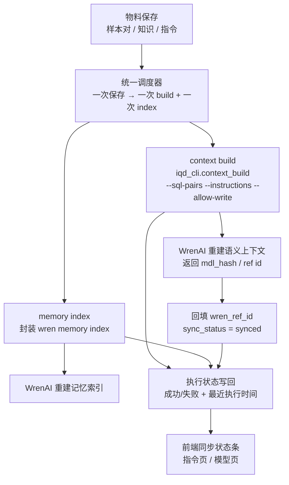

# MIS 问数 APP（mis-iqd）闭环补全 · 简单 PRD

> 产品经理：许清楚 ｜ 文档类型：简单 PRD（一期实现 + 二期前向设计）｜ 语言：中文

## 一、项目信息

| 项 | 内容 |
| --- | --- |
| **Project Name** | `mis_iqd_closure` |
| **Language** | 中文（简体） |
| **技术栈** | 前端：`mis-admin-web`（React + MUI + Tailwind，Vite 构建）<br>后端：`mis-iqd`（Java）/ `mis-admin-bff`（Java BFF）<br>引擎侧桥接：`ai-platform`（`mis_iqd` Python Worker + `iqd_cli.py` 本地 wren CLI 封装） |
| **原始需求复述** | 问数 APP 集成 WrenAI（Text-to-SQL）。当前已录入的增强物料（样本对 / 知识 / 指令）**只存库、未真正下发到 WrenAI 引擎**，导致引擎侧不生效；同时语义模型只支持只读浏览、平台级全局指令缺管理入口。需补全「建模/部署(build) — 记忆(index) — 消费(问数)」闭环，并补齐指令管理与模型浏览能力。 |

### 现状对齐（代码复核结论，避免重复论证）

| 结论点 | 代码事实 | 对 PRD 的影响 |
| --- | --- | --- |
| 平台级指令 WrenAI **支持** | WrenAI Instructions 分 Global / Question-Matching，作用域含 SQL/图表/摘要 | 平台级指令**要开发**（此前是录入未下发） |
| 前端已支持 `kind=instruction` 录入 | `iqd-enhance-page.tsx` 的 `KNOWLEDGE_KIND_LABEL` 含 `instruction:'指令'`；后端 `IqdKnowledgeSaveRequest` 支持 | 一期指令管理 UI 复用既有 `instruction` 物料，补「下发」而非重造 |
| `context_build` 是**死代码** | `iqd_cli.py:80` 已实现（`--sql-pairs`/`--instructions`/`--allow-write`），全仓**零调用** | P0 需复活并接通调用点 + 回填 `wren_ref_id` |
| `memory index` **完全未实现** | 无 `wren memory index` 封装/调用点（仓库内 `agent_memory_index` 是 AI-Platform 自身 Qdrant 记忆，与本需求无关） | P0 需新增封装与触发 |
| 语义模型浏览**缺 cube/measure** | `iqd-catalog-page.tsx` 现展示 `model/column/relationship/metric/dimension/view`，**无 cube/measure** | P0 浏览增强需补全 cube/measure（现状已含 dimension/view/metric） |
| 运行时问数链路**已通** | `get_context → dry_plan → dry_run → run_sql` + 只读拉取（`get_mdl`/`list_knowledge`/`get_instructions`） | 本期**不改**运行时链路，只补全 build/index 与指令下发 |

---

## 二、产品定义

### 2.1 产品目标（Product Goals，3 个正交目标）

| # | 目标 | 衡量方式 |
| --- | --- | --- |
| **G1 闭环生效** | 让录入的增强物料（样本对/知识/指令）真正下发到 WrenAI 并生效，打通 build + index 两端。 | 物料保存后 `wren_ref_id` 回填率、build/index 成功率可观测 |
| **G2 治理可见** | 提供平台级全局指令管理与语义模型浏览，使数据管理员可管控业务口径与问数范围。 | 指令 CRUD 可用；模型浏览 cube/measure/dimension/view 完整展示 |
| **G3 自动化运维** | 物料保存后自动触发 build + index，无需手动敲 CLI，且执行状态对用户可见、可重试。 | 一次保存→一次 build + 一次 index（幂等）；状态条展示最近执行时间/成败 |

### 2.2 用户故事（User Stories）

> 角色统一为「数据管理员」（平台治理角色，权限码 `iqd:enhance:manage` / `iqd:catalog:view` / `iqd:scope:save`）。

- **US-1（指令管理）**：作为数据管理员，我希望在平台内录入/编辑/删除全局指令（业务口径、同义词、规则），并确保其下发到 WrenAI，以便问数生成的 SQL 符合业务规则。
- **US-2（模型浏览）**：作为数据管理员，我希望查看语义模型（表/列/关系/指标/维度/视图/**Cube/Measure**），并勾选「纳入问数范围」，以便治理可问资产的边界。
- **US-3（自动 build/index）**：作为数据管理员，我希望保存物料后，系统自动触发 WrenAI 上下文构建（context build）与记忆索引（memory index），无需手动敲 CLI，以便物料即时生效。
- **US-4（状态可见）**：作为数据管理员，我希望在前端看到最近一次 build/index 的执行状态与时间，失败时可重试，以便及时发现与处理下发异常。
- **US-5（二期预留）**：作为数据管理员，我希望未来能在平台内编辑语义模型（建/改 表/列/关系/Cube/视图）并写回 WrenAI MDL，以便建模治理一体化。（本期仅前向设计，不实现）

---

## 三、技术规范

### 3.1 需求池（Requirements Pool，按 P0/P1/P2 + 一期/二期标注）

#### P0 — 一期必做（Must）

| 编号 | 需求 | 说明 / 验收要点 |
| --- | --- | --- |
| **P0-1** | 平台级全局指令管理 | CRUD UI（新建/编辑/删除/查看）+ 下发 WrenAI；与既有 `kind=instruction` 知识物料打通（复用录入、新增「下发」动作）；一期内只做 **Global** 作用域。保存后触发 P0-2/P0-3。 |
| **P0-2** | context build 接线 | 复活 `iqd_cli.py:context_build`，接通调用点；物料变更（指令/样本对/知识）后触发，携带 `sql_pairs` + `instructions` + `--allow-write`；执行后**回填 `wren_ref_id`**，`sync_status=synced/synced_at`。 |
| **P0-3** | memory index 封装与触发 | 新增 `wren memory index` 封装（建议放 `iqd_cli.py` 或独立 adapter）；物料变更后触发，使引擎重建记忆索引。 |
| **P0-4** | 语义模型浏览增强 | `iqd-catalog-page.tsx` 在现有 `model/column/relationship/metric/dimension/view` 基础上**补全 cube / measure** 节点展示，结构清晰、信息齐全；保持只读。 |

#### P1 — 一期增强（Should）

| 编号 | 需求 | 说明 / 验收要点 |
| --- | --- | --- |
| **P1-1** | build/index 结果反馈 | 前端展示最近一次 build/index 的**成功/失败状态、执行时间、失败原因**（可展开）；失败项保持 pending 且有明细。 |
| **P1-2** | 物料保存统一调度 | 一次保存 → 一次 build + 一次 index；**幂等、可重试**；避免逐条保存触发多次全量重建（调度策略见 Open Questions）。 |

#### P2 / 二期 — 仅前向设计，不实现（Nice to have，设计冻结）

| 编号 | 需求 | 说明 / 验收要点 |
| --- | --- | --- |
| **P2-1** | 语义模型编辑并写回 WrenAI MDL | 平台内建/改 表/列/关系/Cube/视图，写回 WrenAI MDL。**本期不做代码**，但 PRD 需给出**数据模型与接口预留方案**（见 3.3），确保一期结构不阻碍二期。 |

---

### 3.2 UI 设计稿（信息架构 + 交互，非高保真）

#### 3.2.1 整体信息架构

```
问数治理中心 (/ai/iqd)
├── 指令管理 (/ai/iqd/instruction)        ← 新增（P0-1）
├── 语义模型浏览 (/ai/iqd/catalog)        ← 增强（P0-4，补 cube/measure）
├── 增强物料 (样本对/知识) (/ai/iqd/enhance) ← 既有，打通下发
└── 引擎同步状态（状态条/独立入口）          ← 新增（P1-1）
```

#### 3.2.2 指令管理页（P0-1）

- **顶部**：标题「平台级指令」+「新建指令」按钮 + 搜索框 + 同步状态条（见 3.2.4）。
- **列表表格**：

| 列 | 说明 |
| --- | --- |
| 指令标题 | 业务口径/规则名称 |
| 内容摘要 | 同义词/规则预览 |
| 作用域 | Global（一期固定） |
| 同步状态 | 已下发 / 待下发 / 失败 |
| 最近 build 时间 | 时间戳 |
| 操作 | 编辑 / 删除 / 立即下发 |

- **编辑抽屉**：标题、内容（业务口径/同义词/规则）、保存 → 触发 build + index（P0-2/P0-3）。
- **与既有打通**：本页指令复用 `iqd-enhance-page` 的 `kind=instruction` 物料，新增「下发」语义，不重复录入通道。

#### 3.2.3 语义模型浏览页（P0-4，增强）

- **左侧树**（补全后）：

```
Model
├── Column
├── Relationship
├── Metric（指标）
├── Dimension（维度）
├── View（视图）
├── Cube            ← 新增
│   └── Measure     ← 新增
```

- **右侧详情**：字段类型 / 描述 / 是否「纳入问数范围」（勾选，治理层）。
- **顶部**：数据源选择、MDL 同步时间、纳入范围统计；保持**只读**，无编辑入口（编辑留二期）。

#### 3.2.4 引擎同步状态展示（P1-1）

- 在「指令管理页」与「模型浏览页」顶部统一放置**同步状态条**：
  - 最近一次 **context build** 时间 / 状态 / 失败原因（可展开）
  - 最近一次 **memory index** 时间 / 状态 / 失败原因（可展开）
  - 「立即重试」按钮（幂等重试，P1-2）

#### 3.2.5 物料下发编排（闭环，Mermaid）



---

### 3.3 二期前向设计预留（P2-1，仅设计，不实现）

为让一期代码结构不阻碍二期「语义模型编辑写回 WrenAI MDL」，本期需预留：

1. **数据模型预留**
   - `iqd_catalog` 相关实体增加可写标记 `editable`（一期全 false），为二期「平台内建/改」留扩展位。
   - 模型节点统一抽象为 `CatalogNode{type: model|column|relationship|metric|dimension|view|cube|measure, itemKey, payload JSONB}`，便于二期新增编辑态/草稿态。
2. **接口预留（形态，不实现）**
   - 新增 `PUT /api/v1/iqd/catalog/node` 与 `POST /api/v1/iqd/catalog/sync-mdl` 路由占位（一期返回 501 Not Implemented）。
   - `ai-platform` 侧预留 `IqdMcpClient` / `IqdCli` 的 MDL 写回方法签名（如 `context_write_mdl` / `push_mdl`），一期不接线。
3. **架构约束**
   - 一期所有 catalog 读取走既有 `syncCatalogFromMdl`（WrenAI→平台单向）；二期为「平台→WrenAI」反向写回预留开关 `mdl_writeback_enabled`（一期默认 false）。
   - 写回方式（MDL 文件 vs API）见 Open Questions，一期接口形态需兼容两种可能。

---

### 3.4 待确认问题（Open Questions，需老板/架构师拍板）

| # | 待确认点 | 影响范围 |
| --- | --- | --- |
| **Q1** | 一期指令是否**只做 Global**（不做 Question-Matching）？ | P0-1 作用域与 UI；建议一期仅 Global。 |
| **Q2** | context build 与 memory index 的**触发策略**：实时同步 / 异步队列 / 手动按钮？ | P0-2/P0-3/P1-2 架构；影响是否引入队列组件。 |
| **Q3** | 一次保存是**全量重建**还是**增量** build/index？单连接多物料如何合并触发？ | P1-2 调度器设计；避免频繁全量重建。 |
| **Q4** | 一期 build/index 下发范围：是否覆盖**样本对(sql_pairs) + 知识(term/metric/synonym) + 指令**全部物料，还是仅指令？ | P0-2 接线范围；建议全物料一并下发。 |
| **Q5** | 二期写回 WrenAI 走 **MDL 文件写回**还是 **API**？一期是否需预留该 API 客户端？ | 3.3 接口预留形态。 |
| **Q6** | `wren memory index` 在现有 `iqd_cli.py` 内封装，还是独立 `IqdMemoryIndexAdapter`？ | P0-3 模块边界。 |
| **Q7** | 权限码确认：指令管理新建独立权限码（如 `iqd:instruction:manage`）还是复用 `iqd:enhance:manage`？ | P0-1 权限接入。 |

---

## 四、范围边界（Scope Boundary）

**本期明确实现（一期）**
- 平台级全局指令管理 UI + 下发 WrenAI（P0-1）
- context build 接线 + `wren_ref_id` 回填（P0-2）
- memory index 封装 + 触发（P0-3）
- 语义模型浏览增强：补全 cube/measure 展示（P0-4）
- build/index 状态反馈与统一调度（P1-1/P1-2）

**本期明确不做（Out of Scope）**
- ❌ **二期语义模型编辑代码**：平台内建/改 表/列/关系/Cube/视图并写回 WrenAI（仅前向设计，见 3.3）。
- ❌ **Question-Matching 指令**：一期只做 Global 指令。
- ❌ **改运行时问数链路**：`get_context / dry_plan / dry_run / run_sql` 等已通逻辑本期不动，只补全 build/index 与指令下发。
- ❌ **WrenAI 引擎内核改造**：不修改引擎本身，只做平台侧编排与下发。
- ❌ **MDL 写回 API 客户端实现**：一期仅预留接口形态（返回 501），不实现写回。
- ❌ **新增独立调度/队列中间件（除非 Q2 拍板需要）**：一期优先复用既有 Worker 调用链路。
