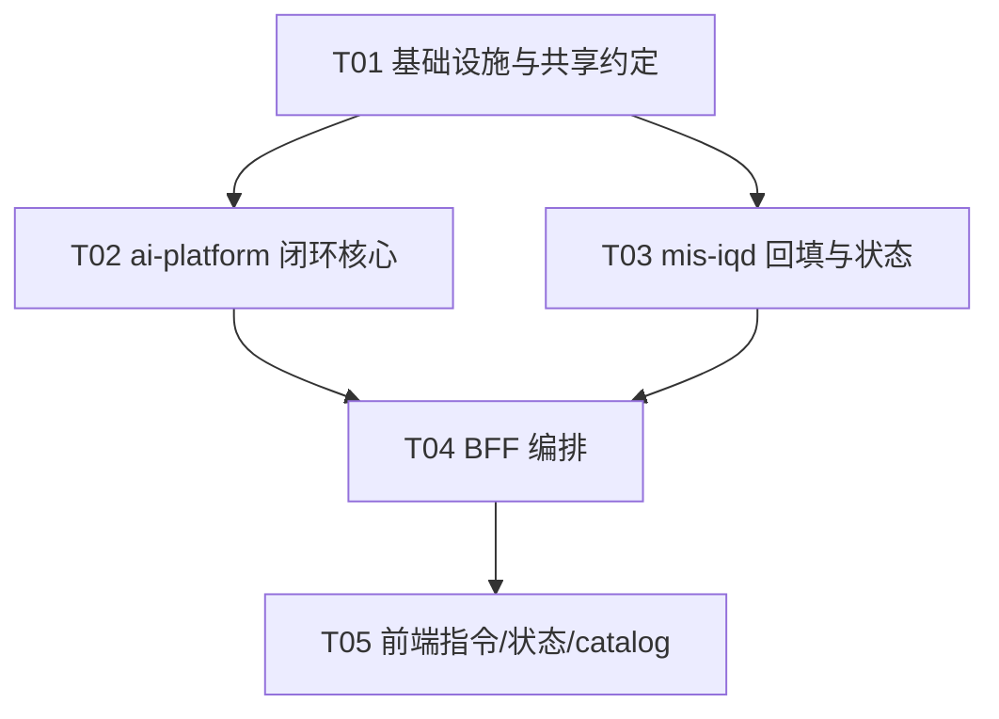

# MIS 问数 APP（mis-iqd）闭环补全 · 系统架构设计 + 任务分解

> 架构师：高见远（software-architect）｜ 配套 PRD：`mis-iqd-closure-prd.md` ｜ 语言：中文
> 交付物：`mis-iqd-closure-system-design.md`（本文）、`mis-iqd-closure-class.mermaid`、`mis-iqd-closure-sequence.mermaid`

---

## 〇、设计结论速览（给工程师直接看）

| 项 | 结论 |
| --- | --- |
| **技术栈** | 前端 React+MUI+Tailwind（Vite）；BFF `mis-admin-bff` Spring WebFlux(WebClient)；`mis-iqd` Spring Boot(JPA)；Python Worker `ai-platform` FastAPI+async |
| **触发模型（Q2）** | 物料保存后，BFF 经既有 `AiPlatformClient` → ai-platform `POST /api/v1/iqd/enhance/sync`（复用既有 Worker 链路），在 Python Worker 内完成 build+index+回填 |
| **回填策略（论证见 §四）** | 选 **B 方案**：ai-platform 经 `IqdConfigClient` 直接回调 mis-iqd 内部 API 回填（与既有 `write_ask_log` 同一范式），BFF 仅做薄代理 |
| **指令模型（Q1/Q7）** | 指令 = `iqd_knowledge` 行，`kind='instruction'`，**无新表**；UI 复用既有 `kind=instruction` 物料，新增「下发」动作；权限复用 `iqd:enhance:manage` |
| **下发范围（Q4）** | 全部物料：样本对(`sql_pairs`) + 全部知识(`instructions`，含 kind=instruction) |
| **重建粒度（Q3）** | 整库 rebuild（`context build` 本质全量），按 **connection** 合并一次 |
| **幂等/可重试（P1-2）** | ai-platform `SyncCoordinator` 每连接「合并窗口」(默认 3s)，多次保存合并为一次 build+index；`wait` 参数区分「保存后自动触发(wait=false)」与「立即同步/重试按钮(wait=true)」 |
| **数据现状** | `IqdSqlPair`/`IqdKnowledge` **已存在** `wren_ref_id`/`sync_status`/`synced_at` 字段（默认值 pending），`pushEnhancements` 骨架已存在 → 本期主要补「接线 + 回填 + 状态」 |

---

## 一、实现方案 + 框架选型

### 1.1 各端技术栈与服务边界

- **前端 `mis-admin-web`**：React 18 + MUI + Tailwind + shadcn/ui + lucide-react（既有）。职责：指令 CRUD UI、同步状态条、catalog cube/measure 展示。仅调用 BFF，不直连 WrenAI/ai-platform。
- **BFF `mis-admin-bff`**（Java Spring WebFlux）：`IqdAclController`(前端入口) → `IqdFacadeService`(权限+编排) → 两个下游客户端：
  - `IqdClient`：调 `mis-iqd`（`/api/v1/iqd/**` 管理面 + 回查同步状态）。
  - `AiPlatformClient`：调 `ai-platform`（`/api/v1/iqd/**`，既有 `translate`/`trial` 同款链路）。**新增** `/iqd/enhance/sync` 调用。
  - BFF 不执行业务编排，仅做权限闸门 + 透传；build/index 的触发与回填全部下沉到 ai-platform。
- **`mis-iqd`**（Java Spring Boot + JPA）：持久化增强物料（已含 `wren_ref_id` 等列）；**新增**内部回填端点 `/internal/v1/iqd/enhance/backfill`、作业上报 `/internal/v1/iqd/enhance/sync-job`、对外状态查询 `GET /api/v1/iqd/enhance/sync-status`。catalog 解析器 `syncCatalogFromMdl` 扩展 cube/measure/metric/dimension/view。
- **Python Worker `ai-platform`**（FastAPI + async）：`IqdAskService.trigger_build_index` 编排「拉取待下发物料 → `IqdCli.context_build`(复活) → `IqdCli.memory_index`(新增) → 解析 mdl_hash → 经 `IqdConfigClient` 回填 + 报作业」；`SyncCoordinator` 做合并窗口；`iqd_enhance` 路由新增 `POST /iqd/enhance/sync`。

### 1.2 跨服务触发的服务边界（核心架构挑战）

链路（保存后）：
```
前端 → BFF(IqdAclController→IqdFacadeService→IqdClient) → mis-iqd(持久化, sync_status=pending)
     ↘ BFF(IqdFacadeService→AiPlatformClient) → ai-platform(/iqd/enhance/sync)
            → SyncCoordinator → IqdAskService.trigger_build_index
               → IqdConfigClient.get_sql_pairs/get_knowledge (拉待下发)
               → IqdCli.context_build / memory_index
               → IqdConfigClient.backfill_enhancement_sync  → mis-iqd 内部 /enhance/backfill
               → IqdConfigClient.report_sync_job            → mis-iqd 内部 /enhance/sync-job
```
回填与作业记录均由 ai-platform 经 `IqdConfigClient`（内部 API，对齐既有 `write_ask_log`）写回 mis-iqd，BFF 不参与回填，状态查询走 `IqdClient` → mis-iqd。

### 1.3 二期前向设计落点（P2-1，仅占位，不实现）

- `iqd_catalog_item` 增加 `editable` 列（一期全 `false`，T01 落地）→ 为二期「平台内建/改」留扩展位。
- `IqdProperties`（BFF）预留 `mdlWritebackEnabled`（默认 false）；`mis-iqd` 预留 `PUT /api/v1/iqd/catalog/node` 与 `POST /api/v1/iqd/catalog/sync-mdl` 返回 **501 Not Implemented**（一期不接，仅路由占位，工程师可后置一行实现）。
- 一期所有 catalog 读取仍走既有 `syncCatalogFromMdl`（WrenAI→平台单向）；二期反向写回开关 `mdl_writeback_enabled` 一期恒 false。

---

## 二、文件列表及相对路径（仓库根 `d:\code\mis-platform\`）

### Python Worker `ai-platform`
- `agent/ai-platform/backend/src/config.py` — **改**：`IqdMcpSettings` 增 `build_timeout_seconds`(默认120)、`memory_index_enabled`(默认true)；`IqdConfigClientSettings` 增 `sync_coalesce_window_sec`(默认3)。
- `agent/ai-platform/backend/src/adapters/iqd_cli.py` — **改**：新增 `memory_index()`（Q6，同模块）；`context_build` 已就绪确认。
- `agent/ai-platform/backend/src/agent/mis_iqd/service.py` — **改**：新增 `trigger_build_index(connection_id, wait)` + `_parse_mdl_hash(stdout)`。
- `agent/ai-platform/backend/src/adapters/iqd_config_client.py` — **改**：新增路径常量 `BACKFILL_PATH`/`SYNC_JOB_PATH` + `backfill_enhancement_sync()` + `report_sync_job()`。
- `agent/ai-platform/backend/src/agent/mis_iqd/sync_coordinator.py` — **新**：`SyncCoordinator`（每连接合并窗口，P1-2）。
- `agent/ai-platform/backend/src/api/routes/iqd_enhance.py` — **改**：新增 `POST /iqd/enhance/sync` + `EnhanceSyncRequest`/`SyncResult` 模型。

### Java `mis-iqd`
- `backend/mis-iqd/src/main/resources/db/migration/V20260824__iqd_sync_job_and_catalog_editable.sql` — **新**：建 `iqd_sync_job`；`iqd_catalog_item` 加 `editable`(默认false)。
- `backend/mis-iqd/src/main/java/com/mis/iqd/domain/entity/IqdSyncJob.java` — **新**实体。
- `backend/mis-iqd/src/main/java/com/mis/iqd/domain/entity/IqdCatalogItem.java` — **改**：增 `editable` 字段。
- `backend/mis-iqd/src/main/java/com/mis/iqd/domain/repository/IqdSyncJobRepository.java` — **新**。
- `backend/mis-iqd/src/main/java/com/mis/iqd/api/dto/IqdSyncJobVO.java` — **新**。
- `backend/mis-iqd/src/main/java/com/mis/iqd/domain/service/IqdAdminService.java` — **改**：`backfillEnhancementSync(...)`、`reportSyncJob(...)`、`getLatestSyncJob(connectionId)`；`syncCatalogFromMdl` 扩展解析 cube/measure/metric/dimension/view。
- `backend/mis-iqd/src/main/java/com/mis/iqd/api/controller/IqdInternalController.java` — **改**：`POST /internal/v1/iqd/enhance/backfill`、`POST /internal/v1/iqd/enhance/sync-job`。
- `backend/mis-iqd/src/main/java/com/mis/iqd/api/controller/IqdController.java` — **改**：`GET /api/v1/iqd/enhance/sync-status`。

### Java BFF `mis-admin-bff`
- `backend/mis-admin-bff/src/main/java/com/mis/adminbff/config/IqdProperties.java` — **改**：增 `enhanceSyncEndpoint`/`enhanceStatusEndpoint`（复用既有 `enhanceSyncPermission="iqd:enhance:sync"`、`enhanceManagePermission`）。
- `backend/mis-admin-bff/src/main/java/com/mis/adminbff/client/IqdClient.java` — **改**：增 `syncEnhancements(connectionId)`、`getEnhancementSyncStatus(connectionId)`。
- `backend/mis-admin-bff/src/main/java/com/mis/adminbff/client/AiPlatformClient.java` — **改**：增 `syncEnhancements(body)` → ai-platform `/api/v1/iqd/enhance/sync`。
- `backend/mis-admin-bff/src/main/java/com/mis/adminbff/service/iqd/IqdFacadeService.java` — **改**：增 `syncEnhancements`/`getEnhancementSyncStatus`；`saveSqlPair`/`saveKnowledge` 持久化后调 `aiPlatformClient.syncEnhancements(wait=false)`。
- `backend/mis-admin-bff/src/main/java/com/mis/adminbff/controller/IqdAclController.java` — **改**：增 `POST /iqd/enhance/sync`、`GET /iqd/enhance/sync-status`。

### 前端 `mis-admin-web`
- `frontend/mis-admin-web/src/lib/api/iqd.ts` — **改**：增 `syncIqdEnhancements(connectionId, wait?)`、`getIqdEnhancementSyncStatus(connectionId)`、`IqdSyncStatus` 类型。
- `frontend/mis-admin-web/src/features/agent/ai/iqd/iqd-instruction-page.tsx` — **新**：指令(`kind=instruction`) CRUD + 下发按钮 + 状态条。
- `frontend/mis-admin-web/src/features/agent/ai/iqd/components/SyncStatusBar.tsx` — **新**：build/index 状态条组件（含重试）。
- `frontend/mis-admin-web/src/features/agent/ai/iqd/iqd-enhance-page.tsx` — **改**：保存后自动触发 sync + 接入状态条。
- `frontend/mis-admin-web/src/features/agent/ai/iqd/iqd-catalog-page.tsx` — **改**：`KIND_LABEL` 增 `cube`/`measure` + 树形分组展示。

---

## 三、数据结构与接口（类图，见 `mis-iqd-closure-class.mermaid`）

类图要点（仅列出本期新增/变更的闭环相关类，复用类略）：

- **`IqdCli`**：已有 `context_build(...)`；新增 `memory_index() -> dict`（调 `wren memory index`，返回 `{command,exit_code,stdout,stderr}`）。
- **`IqdAskService`**：新增 `trigger_build_index(connection_id, wait) -> SyncResult`；私有 `_parse_mdl_hash(stdout) -> str`。
- **`SyncCoordinator`**（新）：`trigger(connection_id, wait) -> SyncResult`；维护每连接 in-flight Future + 合并窗口。
- **`IqdConfigClient`**：已有 `get_sql_pairs`/`get_knowledge`/`write_ask_log`；新增 `backfill_enhancement_sync(payload)`、`report_sync_job(payload)`。
- **`IqdSyncJob`**（新实体）：`id, connection_id, build_status, build_mdl_hash, index_status, build_at, index_at, synced_sql_pair_count, synced_knowledge_count, build_error, index_error`。
- **`IqdAdminService`**：新增 `backfillEnhancementSync(connectionId, wrenRefId, status, syncedAt, sqlPairIds, knowledgeIds)`, `reportSyncJob(payload)`, `getLatestSyncJob(connectionId)`；`syncCatalogFromMdl` 扩展。
- **`IqdCatalogItem`**：新增 `editable`（二期前向占位）。
- **BFF 客户端/服务/控制器**：`AiPlatformClient.syncEnhancements`、`IqdClient.syncEnhancements`/`getEnhancementSyncStatus`、`IqdFacadeService.syncEnhancements`/`getEnhancementSyncStatus` + 保存后触发、`IqdAclController` 两个端点。
- **前端**：`IqdInstructionPage`(新)、`SyncStatusBar`(新)、`iqd.ts` 两个 API。

完整类图见 **`mis-iqd-closure-class.mermaid`**。

---

## 四、程序调用流程（时序图，见 `mis-iqd-closure-sequence.mermaid`）

覆盖三条主线：
- **A. 保存物料 → 自动触发下发（wait=false）**：前端保存 → BFF 持久化(sync_status=pending) → BFF 调 ai-platform `/enhance/sync`(wait=false) 立即返回 `{accepted}` → 前端列表刷新 + 状态条转「同步中」。
- **B. ai-platform 后台 build+index+回填**：`SyncCoordinator` 合并窗口内首次触发 `IqdAskService.trigger_build_index` → 拉待下发物料 → `context_build`(解析 mdl_hash 作为 wren_ref_id) → `memory_index` → `IqdConfigClient.backfill_enhancement_sync`(写 mis-iqd 内部) → `report_sync_job`(写 iqd_sync_job)。
- **C. 状态条回查（P1-1）**：前端 `GET /iqd/enhance/sync-status` → BFF → mis-iqd `getLatestSyncJob` → 渲染 `SyncStatusBar`。

完整时序见 **`mis-iqd-closure-sequence.mermaid`**。

### 回填策略论证（必答项）

| 方案 | 描述 | 取舍 |
| --- | --- | --- |
| A. BFF 编排回填 | BFF 调 ai-platform 拿 `mdl_hash`+物料 id→ref 映射，再调 mis-iqd 回填 | BFF 需理解物料 id↔ref 映射；多一次往返；BFF 变重 |
| **B. ai-platform 直接回填（选用）** | ai-platform 拉取待下发物料时已持有 pending id 列表，build 后直接经 `IqdConfigClient` 回调 mis-iqd 内部 `/enhance/backfill` + `/enhance/sync-job` | 与前人 `write_ask_log` 同一内部 API 范式；单一闭环所有权；往返最少；BFF 保持薄代理 |

**结论**：选 B。理由——ai-platform 在「拉取待下发物料」步骤已持有全部 pending 物料 id（sql_pair ids + knowledge ids），build 完成后可直接组装回填报文，无需把 ref 映射上抛给 BFF；与既有 `IqdConfigClient` 内部 API 范式一致，工程一致性最佳。

---

## 五、任务列表（有序、含依赖、按实现顺序）

> 约束：最多 5 个任务；每任务 ≥3 文件；T01 为基础设施；依赖仅向后（T01 根，T04 收口，T05 末）。

| Task | 名称 | 源文件（见 §二） | 依赖 | 优先级 |
| --- | --- | --- | --- | --- |
| **T01** | 基础设施与共享约定（配置 + 迁移 + 实体） | `config.py`、`IqdProperties.java`、迁移 SQL、`IqdSyncJob.java`、`IqdCatalogItem.java` | 无 | P0 |
| **T02** | ai-platform 闭环核心（build/index/回填/合并） | `iqd_cli.py`、`service.py`、`iqd_config_client.py`、`sync_coordinator.py`、`iqd_enhance.py` | T01 | P0 |
| **T03** | mis-iqd 回填接口 + 同步状态记录 | `IqdAdminService.java`、`IqdSyncJobRepository.java`、`IqdSyncJobVO.java`、`IqdInternalController.java`、`IqdController.java` | T01 | P0 |
| **T04** | BFF 编排（保存后触发 + 状态读取） | `IqdClient.java`、`AiPlatformClient.java`、`IqdFacadeService.java`、`IqdAclController.java` | T02, T03 | P0 |
| **T05** | 前端：指令管理页 + 状态条 + catalog cube/measure | `iqd.ts`、`iqd-instruction-page.tsx`、`SyncStatusBar.tsx`、`iqd-enhance-page.tsx`、`iqd-catalog-page.tsx` | T04 | P0 |

**实现顺序建议**：T01 →（T02 ∥ T03）→ T04 → T05。T02 与 T03 可并行（代码无交叉，仅运行期 ai-platform 回调 mis-iqd 内部端点）；T04 收口两端；T05 最后接前端。

**任务依赖图（Mermaid）**：


---

## 六、依赖包列表

| 端 | 包/组件 | 是否新增 | 说明 |
| --- | --- | --- | --- |
| **ai-platform (Python)** | `httpx`、`asyncio` | 否（已用） | `IqdConfigClient` 回调复用既有 httpx |
| ai-platform | `wren` CLI 二进制（部署侧） | 需**验证** | `context build --sql-pairs/--instructions/--allow-write` 已就绪；**`memory index` 子命令需确认部署版本支持**（Q6 落地前提） |
| **mis-iqd (Java)** | JPA/Hibernate/Flyway(Liquibase) | 否 | 新表 `iqd_sync_job` + `editable` 列走既有迁移机制 |
| **mis-admin-bff (Java)** | Spring WebFlux/WebClient | 否 | 复用 `AiPlatformClient`/`IqdClient` 同款 WebClient |
| **前端** | react / mui / tailwind / shadcn-ui / lucide-react | 否 | 状态条/指令页复用既有组件，无新 npm 包 |

**结论**：本期**无新增第三方依赖包**；唯一外部前置是部署的 `wren` CLI 二进制需支持 `memory index`（见 §八待确认）。

---

## 七、共享知识（跨文件约定）

1. **API 响应信封**：BFF↔mis-iqd、BFF↔ai-platform 统一 `{code, data, message, traceId}`（`code=0` 成功）；ai-platform 沿用 `success()`/`error_response()`（同步失败 `code=9000`）。
2. **`sync_status` 枚举值**（小写 snake）：`pending`（新建默认）｜`synced`（回填成功）｜`failed`（build/index 失败）。
3. **`wren_ref_id` 约定**：整库 rebuild 的 `context build` 返回单一 `mdl_hash`（或 `deployment_id`）；解析失败时用回退值 `wqd-{yyyyMMddHHmmss}-{uuid}`。`wren_ref_id` 对本次 build 覆盖的**全部**待下发物料统一填写（整库重建语义）。
4. **`synced_at`**：ISO-8601 UTC `Instant`（Java）/ `datetime`(Python)；回填与作业记录同一时刻。
5. **端点路径约定**：
   - BFF 对外：`POST /api/v1/iqd/enhance/sync`、`GET /api/v1/iqd/enhance/sync-status`。
   - ai-platform：`POST /api/v1/iqd/enhance/sync`（`wait:bool` 参数）。
   - mis-iqd 内部：`POST /internal/v1/iqd/enhance/backfill`、`POST /internal/v1/iqd/enhance/sync-job`（仅 Worker 内网调用，对齐 `/internal/v1/iqd/write-ask-log`）。
6. **权限码**：同步触发/状态查询复用 `iqd:enhance:sync`（BFF `IqdProperties.enhanceSyncPermission` 已存在）；指令管理 CRUD 复用 `iqd:enhance:manage`（Q7，不新增）。
7. **`wait` 参数语义**：`wait=false`=保存后自动触发（接受即返回 `{accepted,coalesced}`）；`wait=true`=立即同步/重试按钮（阻塞至 build+index 完成，返回完整 `SyncResult`）。
8. **连接解析**：build/index 作用于**主连接**（name='default' 或首条 enabled）；多连接按 connection 各自合并一次 rebuild（Q3）。
9. **mdl_hash 解析**：从 `context_build` 的 stdout 提取（正则/`json` 取 `mdl_hash`/`hash`/`deployment_id` 字段），解析失败回退上述 `wqd-*` 值，不得因解析失败中断回填。
10. **二期开关**：`IqdProperties.mdlWritebackEnabled` 默认 false；catalog `editable` 列一期恒 false。

---

## 八、待明确事项（不含已被 Q1–Q7 默认值覆盖的点）

1. **`wren memory index` 子命令可用性**（阻塞 P0-3）：部署版本 `wren` CLI 是否提供 `memory index`？其 stdout schema（返回的记忆索引 ref/id 字段名）是什么？若不可用，需确认替代下发记忆索引的方式。
2. **`context build --instructions` 对多 kind 知识的接纳边界**：Q4 说「全物料（样本对+知识+指令）」下发，但 WrenAI Instructions 语义是否接纳 `term`/`metric_definition`/`synonym` 等非 `instruction` kind 的知识？建议全部 knowledge 均以 instruction 形式下发，但需引擎侧确认语义。
3. **同步触发的超时与前端体验**：synchronous 触发下，`context build`+`memory index` 耗时上限多少？建议 BFF→ai-platform 走 `wait=false`（接受即返回）避免保存卡死；需定 `build_timeout_seconds`（默认 120s 是否够）与前端 loading/轮询策略。
4. **多连接（非 default）支持范围**：一期是否仅对主连接 build，还是遍历所有 enabled 连接分别 rebuild？Q3「按 connection 合并一次」需明确是否支持多连接。
5. **`iqd_sync_job` 历史保留策略**：仅保留最新一条，还是保留历史（影响表索引/清理定时任务）？本期建议仅最新一条（按 connection 覆盖写）。
6. **catalog cube/measure 的真实 MDL JSON 结构**：WrenAI MDL 中 `cubes[].measures[]` 的实际字段名（如 name/description/expression/type）？需确认以便 `syncCatalogFromMdl` 正确解析 `parent_key`（cube→measure 嵌套）与字段。
7. **部分回填失败策略**：build 成功但个别物料 ref 映射异常时，是整批标记 `failed`（pending 保留可重试）还是逐条 `synced`？本期建议整批 `failed` 保留 pending 以便重试（对齐 Q4 全量语义）。
